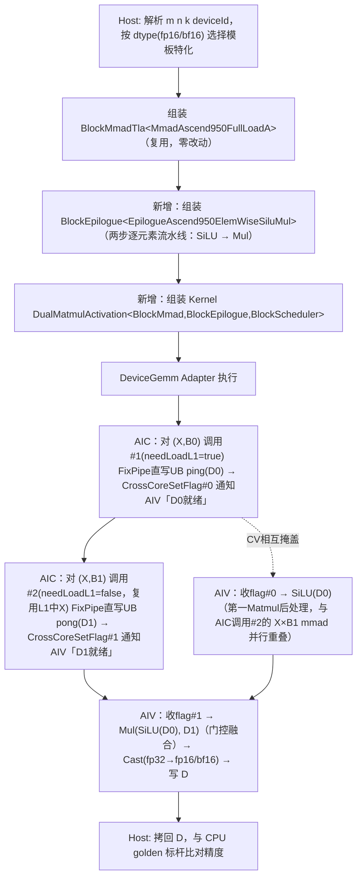

# DualMatmul 算子开发设计文档

> **范式说明（提交前必读）**：本算子交付目标仓为 `cann/catlass`（CUTLASS 风格 C++ 模板 GEMM 库），与标准 CANN 自定义算子（`op_host`/`op_kernel`/`op_api` 三段式 + `aclnn` 两段式接口 + GE IR 图模式）是两套不同的交付范式。本文档沿用官方设计文档模板的五段式骨架与章节命名，但对以下不适用 Catlass 范式的章节做等价内容替换：「算子原型」→「模板参数与 Kernel 签名」；「host 侧设计（分核/UB/TilingKey）」→「Block/Tile 模板参数选择 + AIC-AIV Kernel 编排方案」（Catlass 的"Tiling"完全在编译期通过模板参数固化，无运行时 TilingData/TilingKey 机制）；「使能方式」→ Catlass Host 可执行程序调用范式。「支持硬件」「差异点对比」「精度/性能标准」等章节按标准写法照常填写。

## 一、需求背景

### 1.1 需求来源

本算子为 `cann/catlass` 仓的**全新创新样例**（遍历仓库现有 45 个 `examples/` 样例，未发现任何 `dual`/`glu` 命名的先例），基于 Catlass 模板库实现共享输入 `X` 的双 Matmul + 逐元素融合（LeftSiLUAndMul 变体）。目标仓 `cann/catlass`，交付路径 `examples/{待分配id}_dual_matmul/`。

算子数学公式（LeftSiLUAndMul）：

$$
\begin{aligned}
D_0 &= X \times B_0 \\
D_1 &= X \times B_1 \\
D   &= \mathrm{SiLU}(D_0) \odot D_1
     = \frac{D_0}{\,1 + e^{-D_0}\,} \odot D_1
\end{aligned}
$$

其中 $\mathrm{SiLU}(D_0)$ 为第一个 Matmul 的后处理（逐元素激活），$\odot$ 为逐元素乘法（门控）。语义对标：CUTLASS [`examples/45_dual_gemm`](https://github.com/NVIDIA/cutlass/tree/main/examples/45_dual_gemm)（**仅作性能标杆，非功能语义标杆**）；该融合模式（`SiLU(gate) × up`）是 LLM FFN 层 GLU 变体激活函数（SwiGLU）中的标准计算子图，通过单次 kernel launch 完成双 GEMM + 门控融合，可省去 `D0`/`D1` 落 HBM 再读回的往返带宽。

### 1.2 背景介绍

#### 1.2.1 Catlass 现状分析

本题不是对某个已有 Catlass 算子的"再开发"（无同名旧版本可迭代），但仓库内确有结构最相近的现有样例 `examples/28_matmul_silu`（单 GEMM + SiLU 融合），可作为忠实的对比基线。下表基于实地读取该样例源码（`examples/28_matmul_silu/matmul_silu.cpp`）与相关组件源码得出：

| 维度 | 现状（Catlass 已有：`examples/28_matmul_silu`） | 本任务缺口 |
|---|---|---|
| GEMM 拓扑 | 单一 GEMM（`A@B→C`）+ 单一逐元素激活（`SiLU(C)→D`），同类样例还有 `26_matmul_relu`/`27_matmul_gelu` | 需支持共享输入 `X` 的双 GEMM（`X@B0`、`X@B1`）+ 双源逐元素融合（`SiLU(D0)×D1`），仓库内无 `dual`/`glu` 命名先例 |
| 目标架构 | `Arch::AtlasA2`（910B/910_93，`DAV_2201`） | `Arch::Ascend950`（950PR/950DT，`DAV_3510`），任务书唯一适配硬件 |
| BlockMmad Dispatch Policy | `MmadAtlasA2Pingpong<enableUnitFlag>` | 950 场景现有样例（如 `43_ascend950_basic_matmul`）已提供 `MmadAscend950FullLoadA` 全载 A 策略，但均面向**单一** GEMM，本任务需要在同一 kernel 内让同一实例连续驱动**两路**独立 GEMM |
| Epilogue 计算模式 | 单步逐元素（`SiLU(C)→D`），Dispatch Policy 为 `EpilogueAtlasA2ElemWiseNoSource`（单一累加器 + 单步逐元素激活，`SiLU` 为单目运算） | 需两步串联逐元素（`SiLU(D0)` → `Mul(SiLU(D0), D1)`），现有 NoSource / OneSource 均仅支持单步逐元素操作（一个累加器上施加一个逐元素算子），不满足"两个累加器经两步串联计算"的场景，需新增 Dispatch Policy 支持多步逐元素流水线 |
| Kernel 编排 | 单次 `BlockMmad` 调用 + 单次 `Epilogue` 调用 | 双次 `BlockMmad` 调用（共享同一 `X` tile）+ 新 `Epilogue`，且必须在单次 kernel launch 内完成（任务书硬约束） |

#### 1.2.2 现有实现流程图

以下流程图逐行还原 `examples/28_matmul_silu/matmul_silu.cpp` 的真实实现（含 `m > n` 条件分支、模板参数取值、精度类型），非概念性总结：

```mermaid
flowchart TD
    A["main(argc, argv)"] --> B["Options::Parse(argc,argv) 解析 m n k deviceId"]
    B --> C["Run(options)"]
    C --> D["aclInit / aclrtSetDevice / aclrtCreateStream"]
    D --> E["计算 lenA=m*k, lenB=k*n, lenD=m*n；sizeA/B/D = len * sizeof(fp16_t)"]
    E --> F["定义 LayoutA=RowMajor(m,k), LayoutB=RowMajor(k,n), LayoutD=RowMajor(m,n)"]
    F --> G["golden::FillRandomData 生成 hostA/hostB 随机数据，区间 (-5.0f, 5.0f)"]
    G --> H["aclrtMalloc(deviceA/deviceB/deviceD) + aclrtMemcpy(deviceA/deviceB, HOST_TO_DEVICE)"]
    H --> I["aclrtGetHardwareSyncAddr(hardwareSyncAddr)"]
    I --> J["PlatformAscendCManager::GetInstance()-&gt;GetCoreNumAic() 取 aicCoreNum"]
    J --> K["using ArchTag = Arch::AtlasA2"]
    K --> L["组装 BlockMmad：MmadAtlasA2Pingpong&lt;enableUnitFlag=true&gt;，L1TileShape&lt;128,256,256&gt;，L0TileShape&lt;128,256,64&gt;，AType/BType=half"]
    L --> M["组装 Epilogue：EpilogueAtlasA2ElemWiseNoSource（单一累加器C，无第二源）+ TileElemWiseSilu&lt;ArchTag,CType,16384&gt; + TileCopy(仅CopyGmToUbC+CopyUbToGmD两路)"]
    M --> N{"m > n ?"}
    N -->|是| O["BlockScheduler = GemmIdentityBlockSwizzle&lt;3,0&gt;（swizzle方向0）"]
    N -->|否| P["BlockScheduler = GemmIdentityBlockSwizzle&lt;3,1&gt;（swizzle方向1）"]
    O --> Q["MatmulKernel = Kernel::MatmulActivation&lt;BlockMmad,BlockEpilogue,BlockScheduler&gt;"]
    P --> Q
    Q --> R["Arguments{problemShape, sizeof(float), deviceA, deviceB, deviceD}"]
    R --> S["MatmulAdapter = Device::DeviceGemm&lt;MatmulKernel&gt;；RunAdapter(matmulOp, arguments, stream, aicCoreNum, hardwareSyncAddr)"]
    S --> T["Device 执行：AIC 单次 BlockMmad(A,B) → L0C(C, fp32 累加器)"]
    T --> U["AIV：BlockEpilogue 读 C → TileElemWiseSilu(C) 单源计算 → 写 D(fp16)"]
    U --> V["aclrtMemcpy(hostD, deviceD, DEVICE_TO_HOST)"]
    V --> W["golden::ComputeMatmulElemWiseSilu 计算 CPU 标杆 hostGolden"]
    W --> X["golden::CompareData(hostD, hostGolden, k) 逐元素比对，errorIndices 为空则输出 Compare success"]
    X --> Y["释放 deviceA/B/D + DestroyStream + ResetDevice + aclFinalize"]
```

`TileElemWiseSilu::operator()` 内部计算序列（`SiLU(x)=x/(1+e^{-x})`）逐指令还原：`Muls(dst,src,-1,LEN)`（取负）→ `Exp(dst,dst,LEN)`（`exp(-x)`）→ `Adds(dst,dst,1,LEN)`（`1+exp(-x)`）→ `Div(dst,src,dst,LEN)`（`x/(1+exp(-x))`），全程在 `ElementCompute=float`（`CType`）domain 计算。

---

## 二、需求分析

### 2.1 外部组件依赖

不涉及外部组件适配。Catlass 是 header-only C++ 模板库（编译期模板实例化后生成包含 device 端 kernel 代码的可执行程序），样例以独立可执行程序形式交付，不依赖 ACLNN 两段式接口，不注册进 GE 图模式。

### 2.2 内部适配模块

| 类型 | 路径 | 说明 |
|---|---|---|
| 新增 | `examples/{待分配id}_dual_matmul/CMakeLists.txt` | 参照 `examples/28_matmul_silu/CMakeLists.txt` |
| 新增 | `examples/{待分配id}_dual_matmul/dual_matmul.cpp` | Host 组装代码（命令行解析 + 模板参数组装 + device 执行 + CPU golden 比对） |
| 新增 | `examples/{待分配id}_dual_matmul/README.md` / `README_en.md` | 含 `B0`/`B1` ColumnMajor 数据准备契约的显式说明 |
| 新增 | `examples/{待分配id}_dual_matmul/{待分配id}_dual_matmul.md` | Catlass 自身"创新样例开发流程指南"要求的样例级设计文档 |
| 新增 | `include/catlass/gemm/kernel/dual_matmul_activation.hpp` | 新 Kernel：AIC/AIV 编排（双 `BlockMmad` 调用 + 新 Epilogue） |
| 新增 | `include/catlass/epilogue/block/block_epilogue_silu_mul.hpp` | 新 `BlockEpilogue`：两步逐元素流水线（`SiLU(D0)` → `Mul(SiLU(D0), D1)`） |
| 追加（不改现有内容） | `include/catlass/epilogue/dispatch_policy.hpp` | 追加 `EpilogueAscend950ElemWiseSiluMul` 新 Dispatch Policy struct |
| 追加（不改现有内容） | `examples/common/golden/matmul.hpp` | 追加 `ComputeDualMatmulSiluMul` CPU 标杆函数 |
| 新增（响应评委 `sunhao_hw` 大 K 场景检视意见，详见 §3.2.3） | `include/catlass/gemm/kernel/dual_matmul_activation_splitk.hpp` | 大 K 场景专用新 Kernel：AIC 侧以 `BlockMmadDualB` 逐 K-slice 双路 GEMM + AIV 侧双路规约 + 复用既有 SiLU+Mul Epilogue |
| 新增（响应评委"A 矩阵复用"意见，详见 §3.2.3） | `include/catlass/gemm/block/block_mmad_dual_b_ascend950.hpp` | 大 K 专用新 **BlockMmad 组件** `BlockMmadDualB`：同一 `X` 的 L1/L0 子块搬入一次后，被 `B0`/`B1` 两路 mmad 连续消费，实现评委诉求的"A Tile 入 L1 后立即与两个 B Tile 完成计算"，消除 `X` 在 `B0`/`B1` 之间的重复搬运 |
| 复用，零改动 | `include/catlass/gemm/block/block_mmad_pingpong_full_loadA_ascend950_tla.hpp`、`include/catlass/gemm/dispatch_policy.hpp`（`MmadAscend950FullLoadA`）、`include/catlass/gemm/device/device_gemm.hpp`、`include/catlass/gemm/block/block_swizzle.hpp`（`GemmIdentityBlockSwizzleL1FullLoad`）、`include/catlass/epilogue/tile/tile_elemwise_silu.hpp`、`include/catlass/epilogue/tile/tile_elemwise_mul.hpp`、`include/catlass/layout/layout.hpp` | 详见 §3.2.1 组件复用矩阵 |
| 复用，零改动（大 K 路径规约/调度骨架，详见 §3.2.3） | `include/catlass/gemm/kernel/splitk_matmul.hpp`（`SplitkReduceAdd`）、`include/catlass/gemm/block/block_swizzle.hpp`（`SplitkGemmIdentityBlockSwizzle`） | 大 K 路径仅复用框架的多核 K 切分调度与部分和规约骨架；最内层 Cube mmad 策略由新增 `BlockMmadDualB` 承担（不再复用 `MmadPingpong`），详见 §3.2.3 |

### 2.3 需求模块设计

#### 2.3.1 模板参数与 Kernel 签名（替代"算子原型"）

Catlass 无 aclnn 意义上的 `OpDef`/算子原型，等价信息由编译期模板参数 + Host `Arguments` 结构体表达：

| 名称 | 角色 | 含义 | 数据类型 | 数据格式 | 维度(shape) | 非连续Tensor |
|---|---|---|---|---|---|---|
| `X` (`deviceX`) | 输入 | 共享输入矩阵 | **FP16/BF16** | ND，Catlass `layout::RowMajor` | `(M, K)` | — |
| `B0` (`deviceB0`) | 输入 | 第一个 Matmul 右矩阵（门控/gate 权重） | **FP16/BF16**（与 X 同 dtype） | ND，Catlass `layout::ColumnMajor` | `(K, N)` | — |
| `B1` (`deviceB1`) | 输入 | 第二个 Matmul 右矩阵（上投影/up 权重） | **FP16/BF16**（与 X 同 dtype） | ND，Catlass `layout::ColumnMajor` | `(K, N)`，须与 `B0` shape 相同 | — |
| `D` (`deviceD`) | 输出 | 逐元素融合输出 `D=SiLU(X@B0)×(X@B1)` | dtype = `X` 的 dtype | ND，Catlass `layout::RowMajor` | `(M, N)` | — |

非连续Tensor 均为 `—`：Catlass 样例以 host 端连续分配的 device buffer + 编译期 `layout::RowMajor`/`ColumnMajor` 标签描述访存模式，无运行时 stride/非连续 Tensor 概念（与标准 CANN 算子的"非连续 Tensor"语义不适用）。

非张量 Host 侧参数：`problemShape`（`GemmCoord{m,n,k}`）、`aicCoreNum`（运行时通过 `GetCoreNumAic()` 动态获取，不写死）、`hardwareSyncAddr`（AIC/AIV 核间同步地址）。

Kernel 层模板参数顺序（新增 `Gemm::Kernel::DualMatmulActivation<BlockMmad_, BlockEpilogue_, BlockScheduler_>`，其中 `Dual` 指双 Matmul 而非双 Source——与 Epilogue 的 `SiluMul` 命名属于不同概念层级）：三段式顺序，与仓库现有 `MatmulActivation`/`MatmulFullLoadA` 完全一致，便于评审对照。

#### 2.3.2 算子相关约束

- `B0` 与 `B1` shape 必须相等（任务书显式约束，Host 侧断言）。
- 单次调用内 `X`/`B0`/`B1`/`D` 使用统一 dtype（全 FP16 或全 BF16），不支持混合精度输入。
- 不支持 batch 维，`rank` 固定为 2（任务书参数表未声明 batch 维）。

---

## 三、需求详细设计

### 3.1 使能方式

| 调用方式 | 是否支持 |
|---|---|
| ACLNN 直调 | N/A |
| TF / PyTorch / ATC / OPAT / SGAT | N/A |
| **Catlass Host 可执行程序**（唯一范式） | ✔ |

说明：Catlass 样例不注册进 CANN 算子分发体系，调用方式为独立可执行程序：`main()` 解析 `m n k deviceId` 命令行参数 → 按 dtype 组装模板类型 → `DeviceGemm` 适配器执行 kernel → 拷回结果与 CPU golden 比对。

### 3.2 需求总体设计

#### 3.2.1 Block/Tile 模板参数选择 + AIC-AIV Kernel 编排方案（替代"host 侧设计"）

Catlass 的 Tiling 完全在编译期通过模板参数固化，无运行时 `TilingData`/`TilingKey` 机制；等价设计内容如下：

**架构与 dtype 标签**：`ArchTag = Arch::Ascend950`（固定）；`ElementXB = half`（fp16 组合）或 `bfloat16_t`（bf16 组合）；`ElementAcc = float32`（Cube 累加器，两条 dtype 组合共用）。

**Layout 映射**：`LayoutX = RowMajor`，`LayoutB0 = LayoutB1 = ColumnMajor`，`LayoutD = RowMajor`（与 §2.3.1 一致）。

**Tile Shape 选择**：`L1TileShape = {M:128, N:256, K:128}`，`L0TileShape = {M:128, N:256, K:128}`——M/N 取值与仓库现有 `44_quant_matmul_full_loadA_tla` 已验证过的常规取值一致；K_TILE 取较小值是为共享 `X` 的 L1 常驻区域（固定占用 `L1_SIZE/2`）与 `B0`/`B1` ping-pong 区域预留余量。

**组件复用矩阵（精简）**：

| 层级 | 组件 | 复用方式 |
|---|---|---|
| Tile | `TileElemWiseSilu` / `TileElemwiseMul` | 直接复用，零改动（`ArchTag` 泛型模板参数） |
| Gemm/Block | `BlockMmadTla<MmadAscend950FullLoadA<...>>` | 直接复用，零改动；单一实例在同一 AIC 循环体内对 `B0`/`B1` 连续调用两次（见下方 Kernel 编排）。**适用范围：K≤512 的小 K 场景**；K>512 的大 K 场景改用新增专用 Kernel，见 §3.2.3 |
| Gemm/BlockScheduler | `GemmIdentityBlockSwizzleL1FullLoad` | 直接复用，零改动 |
| Gemm/Device | `DeviceGemm<GemmKernel>` | 直接复用，零改动（对 Kernel 类型完全泛型） |
| Epilogue/Block | 新增 `BlockEpilogue<EpilogueAscend950ElemWiseSiluMul,...>` | 新增，架构决策依据与 Catlass 现有先例见下方「设计决策说明」 |
| Gemm/Kernel | 新增 `DualMatmulActivation` | 新增（现有 Kernel 均面向单 GEMM） |

**设计决策说明：为什么新增联合 Dispatch Policy，而不是复用 NoSource/OneSource**（回应评审关于 `DualSource`/`SiluMul` 命名与架构合理性的核心分歧）

- **NoSource/OneSource 是仅面向 `Arch::AtlasA2` 的既有组件，仓内不存在 950 版本**：实地查阅 `include/catlass/epilogue/dispatch_policy.hpp` 源码确认，`EpilogueAtlasA2ElemWiseNoSource`（1 个累加器，无额外输入，如单目 `SiLU`）与 `EpilogueAtlasA2ElemWiseOneSource`（1 个累加器 `C` + 1 个额外源 `X`，如 `MatmulAdd` 的 bias 输入）的 `ArchTag` 均硬编码为 `Arch::AtlasA2`；对应的 `BlockEpilogue<EpilogueAtlasA2ElemWiseNoSource,...>`/`BlockEpilogue<EpilogueAtlasA2ElemWiseOneSource,...>` 特化（`block_epilogue_elemwise_no_source.hpp`/`block_epilogue_elemwise_one_source.hpp`）内部还有 `static_assert(std::is_same_v<typename TileElemWiseEpilogue::ArchTag, ArchTag>, ...)` 强制校验架构标签匹配。仓内**不存在** Ascend950 版本的 NoSource/OneSource 特化，"直接复用"二者中的任何一个都需要先移植出一套新的 950 特化，工作量与新增一个 Dispatch Policy 相当，并非零成本选项。
- **概念契合度问题（评委评论 C 的核心质疑）**：`OneSource` 的额外输入 `X` 在语义上是"独立于矩阵乘累加器之外、提前已存在的附加输入"（如 bias 向量，来自同列 GM 的一份静态数据）；而本算子的 `D1` 是**另一个完整 `(M,N)` GEMM 的累加器**，二者概念层级不同——把 `D1` 塞进 `OneSource` 的 `X` 槽位，会让"矩阵乘累加器"和"后处理附加参数"这两个不同性质的量被套进同一个模板槽位，这正是"累加器和 MatmulActivation 的后处理参数并非平级概念"这一质疑指出的问题。因此本设计**没有**采纳"matmul#1 走 NoSource 做 SiLU、matmul#2 独立输出 D1、最终 Mul 步骤下放到 Kernel 编排层"这条分解路径——该路径需要 `D0` 先完整产出（无论落 GM 还是落 UB）才能被下一个独立 Epilogue 读取，比"两步流水线共享同一份 UB 常驻数据、由同一个 Dispatch Policy 统一管理双缓冲/事件同步"引入更多同步点，不是更简单的方案。
- **Catlass 仓内已有与本算子结构高度相似的真实先例，证明"新增联合双累加器 Dispatch Policy"是框架原生做法**：`include/catlass/epilogue/dispatch_policy.hpp` 中的 `BlockEpilogueSwigluMxQuant`（注释"For Ascend950, SwiGLU activation + MX quant output"）与其配套 Kernel `include/catlass/gemm/kernel/grouped_mx_matmul_slice_m_swiglu_mx_quant_tla.hpp`：AIC 侧对同一个 `A` tile 连续调用两次 `BlockMmad`（act 半区、gate 半区），两个输出累加器写入 `mmResUb_ping_`/`mmResUb_pong_`，二者是**平级关系**；AIV 侧 `BlockEpilogue<BlockEpilogueSwigluMxQuant,...>::operator()` 同时接收 `mmResPing`/`mmResPong` **两个平级累加器**做 SwiGLU 门控计算（`Tile::TileSwigluAndMxQuant`），不存在"谁是主累加器、谁是附加 source"的从属关系——这与本算子 `D0`/`D1` 的关系完全一致。该先例面向 MX 量化 GroupedMatmul（fp8 输入、单一宽 `B` 按列切分 act/gate 两半），与本算子稠密 fp16/bf16、两个独立权重矩阵 `B0`/`B1` 在具体数据类型和 `B` 的组织方式上不同，但"两个平级累加器联合进入同一个 Epilogue Dispatch Policy 做门控融合"这一架构模式是通用的，直接支持本算子的选型方向。
- **结论**：本设计保留"新增联合 Dispatch Policy"的架构路线，但采纳"`SiLU(D0)` 在概念上等价于对单一累加器施加 NoSource 式逐元素激活（无额外输入）"这一措辞澄清——只是这一步与后续 `Mul` 步骤被组织在同一个新 Dispatch Policy 内部、作为其两步流水线的第一步，而非拆成独立的 NoSource Epilogue 调用。新 Dispatch Policy 命名从 `EpilogueAscend950ElemWiseDualSource` 改为 `EpilogueAscend950ElemWiseSiluMul`，即是为避免"Source"一词与 `OneSource` 的"附加辅助输入"语义混淆——`D1` 不是辅助输入，是与 `D0` 平级的第二个矩阵乘累加器。

**Buffer 预算结论**（推导过程从简，仅给结论；`D0`/`D1` 数据通路决策见下方"数据通路决策"）：L1 合计 384 KB / 512 KB（75%，因单一共享实例驱动两路 GEMM，L1/L0 预算与"单个全载 A 的普通 GEMM"完全相同，不因双 GEMM 而翻倍）；L0A/L0B 各 64 KB / 64 KB（打满，`L0B_STAGES` 取 1）；L0C 128 KB / 256 KB；UB（新 Epilogue 侧）224 KB / 248 KB（90.3%）。本设计采用 Cube 侧 FixPipe 直写 UB（`L0C→UB` 直通，不经 GM workspace 中转，见下）承载 `D0`/`D1` 两个累加器；UB 占用口径与"从 GM 读回 C"的传统路径同量级——均需在 UB 内同时容纳 `D0`/`D1` 两份 `[L1.M, L1.N]` fp32 数据 + SiLU/Mul 中间量 + 输出 buffer，唯一差异是省去了 GM 往返这一步，UB 内存放的数据总量不变，故仍以 224 KB / 248 KB 作为预算结论；ping/pong 两区域的精确起止偏移与是否需要在此基础上收紧（如复用 buffer）留待开发阶段按 `grouped_mx_matmul_slice_m_swiglu_mx_quant_tla.hpp` 中 `mmResUb_ping_`/`mmResUb_pong_` 的布局方式实测核算，但方向上不超过 Ascend950 硬件容量（`UB=248KB, L1=512KB, L0A=L0B=64KB, L0C=256KB`）上限。

**流水排布（PIPE）**：下面给出 DualMatmul 的 AIC-AIV 多级流水时序（单次 `(m_block, n_block)` 迭代）。与单 GEMM PIPE 的关键差异在于：① X tile 常驻 L1（不重复搬入），② 同一 `BlockMmad` 实例连续两次调用（B0/B1 乒乓），③ 两个累加器经 Cube 侧 FixPipe 直写 UB（ping/pong，不落 GM）后被 AIV 两步 epilogue 联合消费，④ **CV 融合（响应评委意见）**：`D0` 经 `L0C→UB` 后 AIV 立即起 `SiLU(D0)`，与 AIC 侧 `X×B1` mmad 在时间上重叠，Cube 与 Vector 相互掩盖各自的执行延迟。

| 时序 | 流水阶段 | AIC (MMA) | 数据通路 | AIV (Epilogue) |
|---|---|---|---|---|
| T0 | X 载入 | 加载 X tile（`needLoadL1=true`） | GM → L1（常驻，不释放） | — |
| T1 | Mmad #1 | `BlockMmad(X, B0)` → 累加器 `D0`（fp32） | L0B ← GM(B0), L0A ← L1(X), L0C ← Mmad | — |
| T2 | D0 直写 UB + 通知 AIV | FixPipe 将 `D0` 由 L0C 直写 UB ping 区域（不经 GM）+ `CrossCoreSetFlag#0` 通知 AIV「D0 就绪」+ 加载 B1 tile（`X` 复用 L1，`needLoadL1=false`） | L0C → UB(ping, D0)，L0B ← GM(B1) | — |
| T3 | **Mmad #2 ∥ SiLU(D0)（CV 相互掩盖）** | `BlockMmad(X, B1)` → 累加器 `D1`（fp32），复用 L1 中 X | L0A ← L1(X 复用), L0B ← GM(B1)（`L0B_STAGES=1`），L0C ← Mmad | **并行**：读 UB(ping, D0)，`TileElemWiseSilu(D0)`（NoSource 模式，全程 UB 内） |
| T4 | D1 直写 UB + 通知 AIV | FixPipe 将 `D1` 由 L0C 直写 UB pong 区域（不经 GM）+ `CrossCoreSetFlag#1` 通知 AIV「D1 就绪」 | L0C → UB(pong, D1) | （`SiLU(D0)` 已在 T3 重叠窗口内完成/收尾） |
| T5 | Epilogue 步骤 2：Mul + Cast | — | — | 读 UB(pong, D1)，`TileElemwiseMul(SiLU(D0), D1)` → `Cast(fp32→fp16/bf16)` |
| T6 | 写回最终输出 | — | — | UB → GM(D) |

CV 相互掩盖的关键在 T3：AIC 的 `X×B1` mmad 与 AIV 的 `SiLU(D0)` 落在同一时间窗口并行执行，互相掩盖对方的执行延迟（这正是评委建议的 CV 融合排布）；为使 `SiLU(D0)` 不必等 `D1` 算完即可开工，把跨核通知由"两路 mmad 全部完成后单次通知"改为两级 flag（`#0` 在 `D0` 就绪时发、`#1` 在 `D1` 就绪时发）。此外 Cell 间流水（如 FixPipe 直写与下一 Mmad 的 L0B←GM 可重叠）依赖硬件 DMA 双缓冲与 Catlass 模板参数（`L0B_STAGES=1`）调度。详细向量级流水时序与 stall 分析参照 Catlass 框架现有 [PIPE 流水设计文档](https://gitcode.com/cann/catlass/blob/master/docs/zh/2_Design/01_kernel_design/04_matmul_summary.md#%E7%8E%B0%E8%B1%A1%E5%88%86%E6%9E%90)。

**数据通路决策：采用 `L0C → UB` 直传（Cube 侧 FixPipe 直写），不经 GM 中转**：Catlass 仓内已有可验证的 Ascend950 生产代码先例证实该通路成熟可用——`include/catlass/gemm/kernel/grouped_mx_matmul_slice_m_swiglu_mx_quant_tla.hpp` 中 `GroupedMxMatmulSliceMSwigluMxQuantTla::operator()<AscendC::AIC>` 对同一个 `A(X)` tile 连续调用两次 `BlockMmad`，两次调用的输出累加器 `tensorBlockC_act`/`tensorBlockC_gate` 均直接构造在 `Arch::PositionUB{}`（即 `mmResUb_ping_`/`mmResUb_pong_` 两个 UB `LocalTensor`）上，全程不落 GM；随后 `include/catlass/epilogue/block/block_epilogue_swiglu_mx_quant.hpp` 中的 `BlockEpilogue<BlockEpilogueSwigluMxQuant,...>` 直接消费这两个 UB 常驻累加器做 SwiGLU 门控计算。仓内 `matmul_mix_fixpipe_opti.hpp`（文件名即点名 FixPipe 直通优化）、`matmul_full_dequant.hpp`、`broadcast_matmul_perblock_quant_tla.hpp`、`quant_matmul_per_group_per_block_tla.hpp` 等多个 950 生产 Kernel 同样采用"Cube 累加器经 FixPipe 直写 UB、不经 GM"的模式，证明该通路在 Ascend950（`DAV_3510`，对应 npu-arch 技能所述"新增 L0C→UB 直通"能力）下是已验证可用的成熟路径，而非需要临时穿刺验证的未知项。

据此，本设计**采纳该通路**：AIC 侧两次 `BlockMmad` 调用的输出累加器 `D0`/`D1` 均不落 GM workspace，而是直接构造为 `Arch::PositionUB` 目标（ping/pong 两个 UB 区域），由 Cube 侧 FixPipe 直写；AIV 侧新 Epilogue 直接从这两个 UB 区域读取 `D0`/`D1`，无需 `GM→UB` 的 `MTE2` 搬入步骤。**已知差异点**：`grouped_mx_matmul_slice_m_swiglu_mx_quant_tla.hpp` 面向的是 MX 量化 GroupedMatmul + SwiGLU 场景（fp8 输入、单一宽 `B` 按列切分 act/gate 两半），与本算子的稠密 fp16/bf16、两个独立权重矩阵 `B0`/`B1` 场景在数据类型和 `B` 的组织方式上不同，但"Cube 输出直写 UB、AIV 联合消费 ping/pong 两个 UB 累加器"这一架构模式是通用的，可直接复用到本算子；ping/pong 精确布局与双缓冲策略留待开发阶段照此先例实测核算（见上方 Buffer 预算结论）。

**AIC-AIV Kernel 编排方案（核心，含 CV 融合）**：AIC 侧对同一个 `BlockMmad` 实例，在同一个 core-loop 迭代（同一 `(m_block,n_block)`）内连续调用两次 `operator()`——调用 #1 对 `(X,B0)`，`needLoadL1=true`，X-tile 从 GM 加载到 L1，累加器 `D0`（fp32）经 FixPipe 由 L0C 直写 UB ping 区域（不落 GM workspace），**随即发 `CrossCoreSetFlag#0` 通知 AIV「D0 就绪」**；调用 #2 对 `(X,B1)`，`needLoadL1=false`，复用调用 #1 已加载在 L1 的 X-tile，累加器 `D1`（fp32）经 FixPipe 直写 UB pong 区域，**再发 `CrossCoreSetFlag#1` 通知 AIV「D1 就绪」**。**CV 融合（响应评委意见）**：AIV 收到 flag#0 即开始 `TileElemWiseSilu(D0)`，此时 AIC 并不空等、正并行执行调用 #2 的 `X×B1` mmad——`D0` 的向量后处理与 `D1` 的 Cube 计算相互掩盖；AIV 收到 flag#1 后再消费 `D1` 做门控融合。AIV 侧新 `BlockEpilogue` 执行两步逐元素流水线：`TileElemWiseSilu(D0)`（第一个 Matmul 的后处理，NoSource 模式——对单一累加器施加逐元素激活）→ `TileElemwiseMul(SiLU(D0), D1)`（门控融合）→ `Cast`（fp32 → fp16/bf16）→ 写出最终 `D`。全程 `D0`/`D1` 不经 GM 中转（依据与已知差异见上）。

#### 3.2.2 kernel 侧设计

- **实现描述**：AIC 负责双路 Cube 矩阵乘（`X@B0`、`X@B1`，共享同一 `X` tile），AIV 负责 `SiLU + Mul` 门控融合与精度转换。按 `X`/`B0`/`B1`/`D` 的 dtype（fp16 或 bf16）实例化两套模板特化路径，Cube 累加器统一为 fp32；SiLU 内部 `exp(-x)` 全程在 fp32 domain 计算，仅在最终写出 `D` 时做一次降精度 `Cast`，避免 fp16/bf16 域直接计算 `exp(-x)` 在大负值下更早发生的上溢/精度损失。

- **本任务新实现流程图**

- **现有实现与本任务新实现的差异点和原因**

| 维度 | 现有实现（`examples/28_matmul_silu`） | 本任务新实现（DualMatmul） | 原因 |
|---|---|---|---|
| 目标架构 | `Arch::AtlasA2`（910B/910_93，`DAV_2201`） | `Arch::Ascend950`（950PR/950DT，`DAV_3510`） | 任务书唯一适配 950；Catlass 对 950 与 AtlasA2 的 `BlockMmad` 实现是两条独立组件族 |
| GEMM 数量 | 单路（`A@B→C`） | 双路，共享 `X`（`X@B0→D0`，`X@B1→D1`） | 任务书要求共享输入双 GEMM 融合，本任务核心新增点 |
| BlockMmad Dispatch Policy | `MmadAtlasA2Pingpong<enableUnitFlag>` | `MmadAscend950FullLoadA<...>`（950 专属全载 A 策略，本身已存在，非新增） | 950 侧 L1 容量更大（512KB），全载 A 是 950 原生优化范式，且与"X 只搬一次"需求天然契合，故换用而非重新设计 |
| Epilogue Dispatch Policy | `EpilogueAtlasA2ElemWiseNoSource`（单一累加器 `C`，单步逐元素激活 `SiLU`） | 新增 `EpilogueAscend950ElemWiseSiluMul`（两个累加器 `D0`/`D1`，两步串联逐元素流水线：`SiLU(D0)` → `Mul(SiLU(D0), D1)`） | `SiLU(D0)` 是第一个 Matmul 的后处理（NoSource 模式——对单一累加器施加逐元素激活），`Mul` 是第二步门控融合；现有 NoSource/OneSource 均仅支持单步逐元素操作，不满足"两个累加器经两步串联计算"的场景；完整架构论证（含 Catlass 现有先例）见 §3.2.1「设计决策说明」 |
| Epilogue Tile 层计算 | 仅 `TileElemWiseSilu` 一次 | `TileElemWiseSilu` + `TileElemwiseMul` 两次串联，`SiLU` 与现有样例完全一致（使用同一 `TileElemWiseSilu` 组件） | 新增 `Mul` 步骤实现门控相乘，两个 Tile 算子本身均直接复用现有组件 |
| Kernel 编排 | 单次 `BlockMmad` 调用 + 单次 Epilogue | 同一 `BlockMmad` 实例连续调用两次（`needLoadL1` 依次为 `true`/`false`）+ 新 Epilogue | 任务书"单次 kernel launch 完成全部计算" + "`X` 只搬入 L1 一次"的显式约束 |
| BlockScheduler | `GemmIdentityBlockSwizzle`（按 `m>n` 二选一 swizzle 方向） | `GemmIdentityBlockSwizzleL1FullLoad`（950 全载 A 专属调度器） | 复用 950 侧与全载 A 策略配套的既有调度器，非本任务新增 |
| 中间量 | 无独立 workspace，`C` 由 Epilogue 直接消费后写 `D` | 新增 `D0`/`D1` fp32 中间量，经 Cube 侧 FixPipe 由 L0C 直写 AIV 可读的 UB ping/pong 区域（不经 GM 中转，不对外暴露为算子输出） | 两个完整累加器需先落地才能被同一新 Epilogue 联合消费；直写 UB 省去 GM 读写往返，是 Ascend950（DAV_3510）新增 `L0C→UB` 直通能力的原生用法，有 `grouped_mx_matmul_slice_m_swiglu_mx_quant_tla.hpp` 等生产代码先例 |

#### 3.2.3 大 K 场景专用 Kernel 设计（响应评委 `sunhao_hw`「A 矩阵复用 + CV 融合」检视意见）

**评委意见（含最新一轮补充）**：
- **A 矩阵复用（核心诉求）**：DualMatmul 的关键优化点在于共享输入 `X`（A 矩阵）的复用——期望"搬入一个 `X` 的 Tile 块后，同时与 `B0`/`B1` 两个 B 矩阵的 Tile 块做矩阵乘"，从而减少 `GM→L1` 的数据搬运量。小 K 场景下 `MmadAscend950FullLoadA` 全载方案确已实现该诉求；但在 K 偏大、不适合全载的场景，**若单纯只用 `MmadPingpong`，实际上就只是把两路 GEMM 各完整做一遍，`X` 会被从 GM 重复搬入两次，并不减少数据搬运量**。因此评委建议大 K 场景**新增一个 BlockMmad 组件**，实现"`X` 的 L1 Tile 块搬入后立即与 `B0`/`B1` 两个 Tile 块完成计算"的 A 复用能力，并可用两种 kernel 分别处理小 K / 大 K（任务书未限制 kernel 数目）。
- **CV 融合**：由于 `D0` 还需逐元素 `SiLU`，可让 `X` Tile 先与 `B0` 做 mmad，随后 `L0C→UB` 立即起 `SiLU(D0)`，**与此同时** `X` Tile 与 `B1` 做 mmad，达成更好的 Cube-Vector（CV）相互掩盖。

**采纳结论**：两条意见全部采纳。**撤回上一版"复用 `MmadPingpong`、不新增 BlockMmad 组件"的结论**——评委判断成立：`MmadPingpong` 虽能按固定 Tile 循环覆盖任意大小 K，但它对 `B0`/`B1` 两路是各自独立地重新从 GM 搬入 `X` 子块，没有 `X` 复用，本质即"两遍完整矩阵乘"，达不到 A 复用减搬运的核心诉求。故大 K 场景改为**新增专用 BlockMmad 组件**实现 A 复用，与小 K Kernel（§3.2.1/§3.2.2）并存，Host 侧运行时按 K 阈值动态二选一，两个 Kernel 同时编译进同一最终产物（无需为大 K 单独发布可执行文件）。

**组件选型（修订：新增 BlockMmad 组件 `BlockMmadDualB`）**：新增大 K 专用 BlockMmad 组件 `Gemm::Block::BlockMmadDualB`，其核心机制正是评委建议的"A Tile 入 L1 后立即与两个 B Tile 完成计算"：
- **A 复用机制**：在同一次 K 子块迭代内，`X` 的该 K-slice 子块只从 `GM→L1`（再到 L0A）搬入**一次**，随后在其 L0 常驻期内被 `B0`/`B1` 两路 mmad **连续消费两次**（`X×B0_slice→D0` 部分和、`X×B1_slice→D1` 部分和），`B0`/`B1` 各自的 K-slice 子块分别搬入。相较"两遍独立 `MmadPingpong` 各自重搬 `X`"，本组件让 `B0`/`B1` 共享同一份已搬入的 `X` 子块，**消除了 `X` 在 `B0`/`B1` 之间的重复搬运（这部分 `X` 的 `GM→L1` 流量减半）**，直接落实评委"减少 GM→L1 数据搬运量"的诉求。
- **框架组件分工**：多核 K 维切分调度（`SplitkGemmIdentityBlockSwizzle`）与各 K-slice 部分和的规约（`SplitkReduceAdd`）仍直接复用 Catlass 框架现成组件（`examples/68_ascend950_multi_core_splitk_matmul` 有先例，零改动）；**新增组件只替换最内层的 Cube mmad 策略**——把原本的单路 `MmadPingpong` 换成"共享 `X`、双 `B` 消费"的 `BlockMmadDualB`，改动范围收敛在 AIC 侧 Cube 调用点，不触碰框架的 K 切分/规约骨架。

**CV 融合排布**：评委建议的"`SiLU(D0)` 与 `X×B1` mmad 相互掩盖"排布已在 §3.2.1 修订后的 PIPE 时序（T2–T5，两级跨核 flag）中直接落地：`X×B0` 产出 `D0` 经 `L0C→UB` 后即通知 AIV 起 `SiLU(D0)`，AIC 不空等、并行执行 `X×B1` mmad，二者时序重叠。**大 K 路径的适用性如实说明**：`SiLU` 为非线性，须作用于 `SplitkReduceAdd` 规约后的完整 `D0`（不能作用于任一 K-slice 的部分和），因此大 K 路径的 CV 掩盖发生在更粗粒度——本 `(m,n)` tile 规约后的 `SiLU+Mul` 向量后处理，与下一批 tile 的 Cube mmad 在流水上重叠；`BlockMmadDualB` 共享 `X`、双 `B` 的结构也让两路 Cube 计算复用同一份 `X`，为该掩盖保留对齐的时序窗口。

**Epilogue 复用**：K 维切分后，各切片先产出部分和，再经框架自带 `SplitkReduceAdd` 做规约得到完整的 `D0`/`D1`；§3.2.1 已设计的 `SiLU + Mul` 融合 Epilogue 无需任何修改即可直接复用——该 Epilogue 只消费规约完成的扁平 `D0`/`D1` 结果，不关心其产生方式。

**Kernel 派发策略**：Host 侧按 K 阈值在两个 Kernel 间调用：K ≤ 512 时走小 K Kernel（`MmadAscend950FullLoadA` 全载 A，`X` 一次全载即天然复用），K > 512 时走大 K Kernel（`BlockMmadDualB` 按 K-slice 复用 `X`）。阈值以公式表达（由小 K Kernel 固定 L1 缓冲容量与 Tile Shape 参数反推理论安全上限、再留出安全余量得到），随 Tile Shape 演进自动更新，不写死具体数值。判据只依赖 K，不依赖 M/N 或分块数，大 K Kernel 天然覆盖任意 M/N 分块数与 K 的组合。

**对现有小 K 实现的连带修订**：现有小 K 实现中曾包含一段仅在特定场景（单核、其余核空闲）下生效的 K 切片处理逻辑，用于处理个别超出全载安全范围的用例，其适用范围本身不具备通用性。随大 K 专用 Kernel 与 Host 侧阈值派发正式落地，该处理逻辑将被移除：小 K Kernel 收窄为仅处理 Host 已保证的安全 K 范围（K≤512），内部对任意 M/N/核数组合走同一条计算路径，不再需要区分特殊场景分支，并新增一条防御性前置校验（K 超出安全范围时显式报错而非静默继续），进一步保证边界安全。

**新增代码量**：真正新增的是——① 大 K 专用 **BlockMmad 组件** `BlockMmadDualB`（共享 `X`、双 `B` 消费）；② 大 K Kernel 编排类（AIC/AIV 双路编排 + 两级 CV flag）；③ Host 侧 K 阈值派发逻辑。`SplitkGemmIdentityBlockSwizzle`、`SplitkReduceAdd`、SiLU+Mul Epilogue、Tile 层算子、`DeviceGemm` 适配器等均为 Catlass 框架已有组件的直接复用（零改动）。完整组件复用清单见内部详细设计文档。

### 3.3 支持硬件

| 支持的芯片版本 | 涉及勾选 |
|---|---|
| Atlas A2 训练系列产品 | × |
| Atlas A3 系列产品 | × |
| Ascend 950PR / 950DT | √ |

### 3.4 算子约束限制

- 单次 kernel launch 完成全部计算（任务书显式约束），双路 `BlockMmad` 调用与 Epilogue 融合必须编排在同一个 kernel body 内，不能拆分为两次 launch + workspace 中转。
- `M`/`K`/`N` 任一维为 0 判为非法输入：Catlass 现有样例普遍假定 `M/K/N > 0`（无 0-size 防御性代码），本算子的 Host 组装层新增基本校验，遇 0-size 直接报错而非进入未定义行为。
- Ascend950 硬件 Buffer 资源约束（`UB=248KB`、`L1=512KB`、`L0A=L0B=64KB`、`L0C=256KB`）已在 §3.2.1 Buffer 预算结论中确认满足。

---

## 四、特性交叉分析

本算子为纯双 GEMM + SiLU 门控逐元素融合，不涉及量化（quant）、分组（MoE/grouped）、稀疏、动态 shape 等 Catlass 仓其它已有特性的组合叠加，无特性交叉。

---

## 五、可维可测分析

### 5.1 精度标准/性能标准

| 验收标准 | 描述 | 标准来源 |
|---|---|---|
| 精度标准 | 满足 AscendOpTest 工具默认阈值 | 任务书 |
| 性能标准 | 算子整体性能需与 0.8 倍 GPU（H100）持平，性能标杆为 CUTLASS `examples/45_dual_gemm` | 任务书 |

说明：本算子交付形式为 **Catlass Host 可执行程序**（非 aclnn 注册算子，不进 GE 图模式，参见 §2.1/§3.1），[AscendOpTest](https://gitcode.com/HIT1920/AscendOpTest) 工具面向 aclnn 两段式注册算子设计其自动化执行器，无法直接对本算子搭建该工具的执行器；精度验收**借用其默认阈值表**（按 `X`/`B0`/`B1`/`D` 的 dtype 对应 rtol/atol 数值）作为判据，不复用其执行器/测试框架本身，自验证通过 CPU 精度标杆（`ComputeDualMatmulSiluMul`）实现比对落地，具体阈值取值在自验证报告中列出。

自验证按 CPU 精度标杆（`ComputeDualMatmulSiluMul`，双 GEMM + SiLU + Mul 全流程 fp32 参考实现）设计用例，覆盖任务书要求的所有功能场景，测试结果、执行日志与性能数据在自验证报告中单独交付，不在本设计文档中展开。

### 5.2 兼容性分析

本算子为 Catlass 仓全新创新样例（无同名旧版本，§1.2.1 现状分析已确认现有 45 个样例中无 `dual`/`glu` 命名先例），不涉及存量算子的回归兼容性问题。新增的 2 个核心文件（`DualMatmulActivation` Kernel、`block_epilogue_silu_mul` BlockEpilogue）与对 `epilogue/dispatch_policy.hpp`、`examples/common/golden/matmul.hpp` 的改动均为纯追加（新增 struct / 新增函数），不修改任何现有 struct 或函数签名，对仓库内现有已合入样例（含 `examples/28_matmul_silu` 等）零侵入。

---

## 六、变更记录

本版本针对评委在 MR #541 检视意见中标记为"未解决"的 8 条意见（含意见1的两个子建议）逐条修订，供评委下轮对照：

| 意见 | 位置 | 本版修订内容 |
|---|---|---|
| 意见1-建议一（PIPE流水图） | §3.2.1 | 新增「流水排布（PIPE）」T0-T7 时序表 |
| 意见1-建议二（L0C→UB通路） | §3.2.1 | 由"开发阶段再决定"改为设计阶段明确决策：采纳 `L0C→UB` 直传（Cube 侧 FixPipe 直写），依据为 Catlass 仓内 `grouped_mx_matmul_slice_m_swiglu_mx_quant_tla.hpp` + `block_epilogue_swiglu_mx_quant.hpp` 等 950 生产代码先例；同步更新 Buffer 预算结论、PIPE 表 T2/T4、AIC-AIV 编排方案描述、本任务新实现流程图、差异点表"中间量"行 |
| 意见2（"纯host侧"表述） | §2.1 | 已在此前版本修正为"header-only…生成包含device端kernel代码的可执行程序"，本版本保持 |
| 意见3（950PR/DT 合并） | §3.3 | 保持合并为「Ascend 950PR / 950DT」一行 |
| 意见4（若无法显式给出则建议删除） | §3.3 | 修正为仅删除"其余型号"笼统行，恢复 Atlas A2（×）、Atlas A3（×）两行，与任务书"适配硬件：Ascend 950PR/950DT"的显式排除依据保持一致 |
| 意见5（950PR/DT说明段落无必要） | §3.3 | 已在此前版本删除，本版本保持 |
| 意见6（AscendOpTest交付形式确认） | §5.1 | 新增说明：本算子为 Catlass Host 可执行程序，非 aclnn 注册算子，无法直接搭建 AscendOpTest 执行器，仅借用其默认阈值表 |
| 意见7（清晰公式） | §1.1 | 已在此前版本补充 LaTeX 公式，本版本保持 |
| 意见8（NoSource vs DualSource 架构分歧） | §3.2.1 | 新增「设计决策说明」小节：正面回应"累加器与后处理附加参数并非平级概念"的质疑，引用 Catlass 仓内 `BlockEpilogueSwigluMxQuant` + `GroupedMxMatmulSliceMSwigluMxQuantTla` 真实先例，论证"两个平级累加器联合进入同一 Epilogue Dispatch Policy"是框架原生架构模式，保留新增 Dispatch Policy 路线（不采纳"拆分为 NoSource + Kernel 层 Mul"路径），同时吸收命名层面的措辞澄清 |

### 第二轮修订：回应评委 `sunhao_hw` 大 K 场景架构检视意见（2026-07-11）

评委 `sunhao_hw` 在 MR #541 §3.2.1 组件复用矩阵处新提出检视意见：

> 复用 `block_mmad_pingpong_full_loadA_ascend950_tla` 的前提是 A 矩阵的 Tile 块可以把完整的 K 轴搬入 L1 中……大 K 场景无法全载 A 矩阵 Tile……需要将 A 矩阵的 L1 Tile 块搬入后就立刻搬入两个 B 矩阵对应的 Tile 块完成计算，需要新设计一个 BlockMmad 组件支持该功能……可以考虑设计两种 kernel 来分别处理小 K 和大 K 场景。

本版本针对该意见逐条修订：

| 检视意见要点 | 位置 | 本版修订内容 |
|---|---|---|
| A 矩阵 Tile 无法全载完整 K 轴（大 K 场景） | §3.2.1 组件复用矩阵 | 明确标注 `BlockMmadTla<MmadAscend950FullLoadA<...>>` 的适用范围收窄为 K≤512（小 K 场景）；新增 §3.2.3 阐述大 K 场景的独立方案 |
| 建议新设计 BlockMmad 组件支持"A Tile 入 L1 后立即搬入两个 B Tile 完成计算" | §3.2.3 | 未采纳"新设计 BlockMmad 组件"这一具体实现路径；改为复用 Catlass 框架内已有的标准 K 分块流水线组件 `MmadPingpong`（配合 `SplitkGemmIdentityBlockSwizzle` block scheduler + `SplitkReduceAdd` 规约组件的既有编排范式，950 生产样例 `examples/68_ascend950_multi_core_splitk_matmul` 已有应用），该组件天然支持任意大小 K，无需搬入完整 K 轴，架构目标与评委建议一致，且零新增 Cube 层组件 |
| 建议设计两种 kernel 分别处理小 K / 大 K 场景 | §3.2.3 | 采纳。新增大 K 专用 Kernel，与现有小 K Kernel 并存，Host 侧按 K 阈值（K>512 → 大 K；K≤512 → 小 K）动态调用，两个 Kernel 同时编译进最终产物 |
| （连带处理）现有小 K 实现中曾为处理个别超范围用例引入的 K 切片处理逻辑，其适用范围不具备通用性 | §3.2.3 | 该处理逻辑将随大 K 专用 Kernel 落地一并移除：小 K Kernel 仅保留对 Host 已保证的安全 K 范围（K≤512）内任意 M/N/核数组合均一致的单一计算路径，并新增防御性前置校验兜底 |
| §2.2 内部适配模块清单同步 | §2.2 | 新增大 K 专用 Kernel 文件行；新增大 K 路径复用的框架组件（`MmadPingpong`/`SplitkReduceAdd`/`SplitkGemmIdentityBlockSwizzle`）行 |

### 第三轮修订：回应评委 `sunhao_hw`「A 矩阵复用 + CV 融合」检视意见（2026-07-14）

评委 `sunhao_hw` 在 MR #541 就大 K 场景进一步明确了 DualMatmul 的两个关键优化点，并**否定了上一版"大 K 复用 `MmadPingpong`、不新增 BlockMmad 组件"的选型**：

> DualMatmul 关键的优化点在于 A 矩阵的复用和 CV 融合……希望搬入一个 A 矩阵的 Tile 块后同时与两个 B 矩阵的 Tile 块做矩阵乘，从而减少 GM→L1 的数据搬运量；之前的 A 矩阵全载方案在小 K 场景确实可以实现该诉求；在 K 偏大不适合全载的场景，如果单纯只用 mmadPingpong，实际上就只是做两遍完整的矩阵乘，并不能减少数据搬运量，所以还是建议新增 BlockMmad 组件来实现该功能。另外关于 CV 融合，由于 D0 还需做逐元素 SiLU，可以考虑矩阵计算时 A 矩阵 Tile 块先和 B0 做 mmad，然后 L0C→UB 开始 SiLU(D0)，于此同时开始 A 矩阵 Tile 块和 B1 做 mmad，达成更好的 CV 相互掩盖。

本版本针对该意见逐条修订：

| 检视意见要点 | 位置 | 本版修订内容 |
|---|---|---|
| 大 K 场景单纯用 `MmadPingpong` 只是"两遍完整矩阵乘"，不减少 `X` 的 GM→L1 搬运；建议新增 BlockMmad 组件实现 A 复用 | §3.2.3、§2.2 | **撤回上一版"复用 `MmadPingpong`、不新增 BlockMmad"的结论**，采纳评委建议：新增大 K 专用 BlockMmad 组件 `BlockMmadDualB`（同一 `X` 的 L1/L0 子块搬入一次、被 `B0`/`B1` 两路 mmad 连续消费），消除 `X` 在 `B0`/`B1` 之间的重复搬运；框架的多核 K 切分调度（`SplitkGemmIdentityBlockSwizzle`）与部分和规约（`SplitkReduceAdd`）仍复用，仅替换最内层 Cube mmad 策略。§2.2 同步新增 `BlockMmadDualB` 组件文件行、并把 `MmadPingpong` 从复用清单移除 |
| CV 融合：`X×B0` mmad → `L0C→UB` 起 `SiLU(D0)`，同时 `X×B1` mmad，达成 CV 相互掩盖 | §3.2.1（PIPE + 编排 + 流程图） | 采纳。把原设计"两路 mmad 全部完成后再单次跨核通知 AIV"改为**两级跨核 flag**（`D0` 就绪即通知 AIV 起 `SiLU`、`D1` 就绪再通知做 `Mul`）；PIPE 时序表 T3 明确标注"Mmad #2 ∥ SiLU(D0)（CV 相互掩盖）"，AIC 的 `X×B1` mmad 与 AIV 的 `SiLU(D0)` 并行重叠；§3.2.2 流程图同步加入 CV 重叠边 |
| 大 K 路径下 CV 融合的适用性 | §3.2.3 | 如实说明：`SiLU` 为非线性须作用于 `SplitkReduceAdd` 规约后的完整 `D0`，大 K 路径的 CV 掩盖发生在"本 tile 规约后 `SiLU+Mul` 向量后处理 ∥ 下一批 tile 的 Cube mmad"这一更粗粒度，不在 K-slice 部分和层面 |
