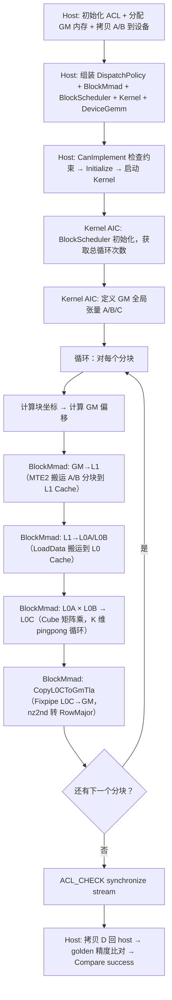
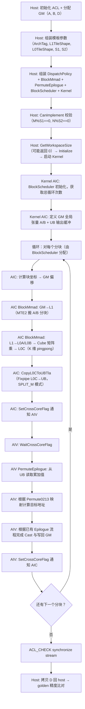
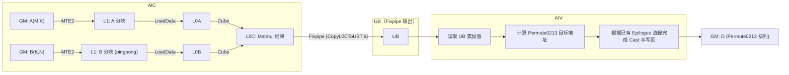

# 【社区任务】MatmulPermute 算子设计文档

# 一、需求背景

## 1.1 需求来源

本需求来源于 CANN 社区任务 2026 年 7 月任务「MatmulPermute 算子开发」。任务要求基于 CATLASS 模板库，在 Ascend 950 硬件上使用 Ascend C 编程语言实现 Matmul + Tensor4DPermute0213 融合算子，单次 kernel launch 完成全部计算。

- 任务书：[MatmulPermute_task_doc](https://gitcode.com/cann/cann-ops-competitions/blob/master/04_tasks/01_community-task-2026/docs/202607/MatmulPermute_task_doc.md)
- 目标仓：catlass（gitcode `cann/catlass`），最终 PR 至 `examples/` 目录

## 1.2 背景介绍

### 1.2.1 MatmulPermute 算子功能说明

本算子实现 Matmul 后接输出张量维度重排（Permute）的融合算子。标准 Matmul 输出矩阵 D(M, N) 在写入显存时，按照 Tensor4DPermute0213 规则重新排列：

$$
\text{Matrix}(M, N) \xrightarrow{\text{reshape}} \text{Tensor4D}(M/S_1,\ S_1,\ S_2,\ N/S_2) \xrightarrow{\text{permute}[0,2,1,3]} \text{Tensor4D}(M/S_1,\ S_2,\ S_1,\ N/S_2)
$$

该融合操作常见于大模型推理中的 KV-Cache 量化、Multi-Head Attention 的 Head 维度重排等场景。将 Matmul 和 Permute 融合为单次 kernel launch，理论上可以避免中间矩阵的额外显存读写开销。

### 1.2.2 CATLASS 模板库 Matmul 现状分析

MatmulPermute 是新算子，CATLASS 模板库中不存在现成的 permute 后处理组件。以下对可复用的已有 Matmul 组件进行现状分析。

**样例路径和组件路径**：

- Ascend950 基础 Matmul 样例：`examples/43_ascend950_basic_matmul/basic_matmul_tla.cpp`
- Ascend950 A矩阵全载样例：`examples/73_ascend950_matmul_full_loadA/matmul_full_loadA_tla.cpp`
- Ascend950 EVG epilogue 样例：`examples/64_ascend950_matmul_evg/matmul_evg_add_ub.cpp`
- BlockMmad 组件：`include/catlass/gemm/block/block_mmad.hpp`
- BlockEpilogue 组件：`include/catlass/epilogue/block/`
- Ascend950 Tile 组件：`include/catlass/gemm/tile/ascend950/`

**现状能力与缺口**：

| 维度 | CATLASS 现状 | 本任务缺口 |
| --- | --- | --- |
| Matmul 计算 | `BlockMmadTla` 支持 Ascend950 FP16 pingpong 流水（样例43） | 拟直接复用 |
| 输出写回 | 样例43：`CopyL0CToGmTla` 直接 L0C→GM（无 epilogue） | 拟改为经由 Epilogue 路径写回 |
| Epilogue 路径 | 样例64 EVG：L0C→UB（Fixpipe）→AIV 处理→UB→GM（DataCopyPad） | 拟参考改写：将 EVG 计算替换为 Permute 地址映射 |
| Permute 组件 | 不存在 | 拟基于 Epilogue 框架扩展 |

### 1.2.3 CATLASS basic_matmul（Ascend950）基线流程

样例43 `basic_matmul_tla.cpp` 是 Ascend950 的基础 Matmul 实现，也是本任务的基线参考。该样例使用 AIC 单核类型（无 AIV），BlockMmad 内部完成 L1/L0 矩阵乘后通过 Fixpipe 直接将 L0C 写回 GM，不涉及后处理。流程如下图所示：



# 二、需求分析（required）

## 2.1 需求描述

基于 CATLASS 模板库，使用 Ascend C 编程语言在 Ascend 950 硬件上实现 MatmulPermute 融合算子。FP16 输入，FP16 输出，单次 kernel launch 完成 Matmul + Tensor4DPermute0213。

## 2.2 需求拆解

1. 实现 FP16 Matmul（A(M,K) × B(K,N) = C(M,N)），拟复用 CATLASS 已有 BlockMmad 组件
2. 基于 CATLASS Epilogue 框架扩展 Permute Epilogue，实现输出地址重映射
3. S1、S2 为编译期模板常数，泛化支持任意 S1/S2，验收版本采用 S1=8、S2=4 实例化
4. 约束：M % S1 == 0, N % S2 == 0
5. 性能目标：达到 torch.mm + permute 小算子拼接方案的 1.1 倍以上

## 2.3 需求规格与路径结论映射

| 需求规格 | 设计承接结论 |
| --- | --- |
| FP16 Matmul | 拟复用样例43 `BlockMmadTla` + `MmadPingpong` 策略，FP16 输入 FP32 累加 |
| Permute0213 融合输出 | 计划基于 CATLASS Epilogue 框架扩展 Permute 写回逻辑，拟采用 UB-workspace 路径（参考样例64），通过融合 Matmul 与 Permute，避免中间结果写回 GM 后再次读取；采用 UB-workspace 路径，理论上减少一次 GM 往返，提高整体带宽利用率 |
| S1/S2 编译期常数 | C++ 模板参数，host 侧组装时传入；验收版本采用 S1=8、S2=4 实例化 |
| M% S1==0, N% S2==0 | 拟通过 `CanImplement` 接口校验约束 |
| 性能 ≥ 1.1× 标杆 | 理论上融合方案可避免中间 GM 读写开销，具体性能待上板验证 |
| optest 测试集成 | 计划使用 `catlass-example-to-pytest` skill 自动生成 pytest 框架 |

## 2.4 外部组件依赖

| 组件 | 作用 |
| --- | --- |
| CATLASS 模板库 (v1.6.0) | 提供 Gemm Kernel/Block/Tile 模板组件、Layout 定义、DeviceGemm 适配器 |
| CANN Toolkit (Ascend 950 版本) | 提供 Ascend C 编译、AscendCL Runtime API（aclrtMalloc、aclrtMemcpy、aclrtSynchronizeStream 等）、Fixpipe/MTE/Cube 硬件抽象 |
| msprof op | 性能采集工具，用于 profiling 核函数耗时 |
| catlass-example-to-pytest skill | 自动生成 optest 测试框架集成代码 |

## 2.5 内部适配模块

| 模块 | 适配内容 |
| --- | --- |
| `examples/` | 新增 MatmulPermute 样例目录（CMakeLists.txt、README.md、设计文档、主 .cpp 文件） |
| `include/catlass/` | 根据现有 Epilogue 框架扩展 Permute 写回逻辑，必要时新增对应 Block/Tile 层实现 |
| `examples/CMakeLists.txt` | 在 `EXAMPLE_ASCEND950` 列表中注册新样例 |
| `tests/optest/` | 新增 optest 测试集成 |

# 三、详细设计（required）

## 3.1 算子分析

### 3.1.1 数学公式

标准 Matmul：
$$
D_{m,n} = \sum_{k=0}^{K-1} A_{m,k} \cdot B_{k,n}
$$
输出 Permute 映射（将 2D 输出坐标 (m, n) 映射到 4D permuted 输出的线性偏移）：

$$
m = i_0 \cdot S_1 + i_2, \quad n = i_1 \cdot (N/S_2) + i_3
$$

$$
\text{permuted\_offset} = i_0 \cdot S_1 \cdot N+ i_1 \cdot S_1 \cdot (N/S_2) + i_2 \cdot (N/S_2) + i_3
$$

其中 
$$
i_0 \in [0, M/S_1)$, $i_1 \in [0, S_2)$, $i_2 \in [0, S_1)$, $i_3 \in [0, N/S_2)
$$
**展开后的地址映射**（从原始 (m, n) 到 permuted 偏移）：
$$
i_0 = \lfloor m / S_1 \rfloor, \quad i_2 = m \bmod S_1
$$
$$
i_1 = \lfloor n / (N/S_2) \rfloor, \quad i_3 = n \bmod (N/S_2)
$$

$$
\text{dst\_offset}(m, n) = i_0 \cdot S_1 \cdot N + i_1 \cdot S_1 \cdot (N/S_2) + i_2 \cdot (N/S_2) + i_3
$$

### 3.1.2 支持数据类型

| 参数 | 输入/输出/属性 | 数据类型 | 数据格式 | 维度 |
| --- | --- | --- | --- | --- |
| A | 输入 | FP16 (half) | ND, RowMajor | 2D (M, K) |
| B | 输入 | FP16 (half) | ND, RowMajor | 2D (K, N) |
| S1 | 编译时属性 | INT32 | — | 0D（标量） |
| S2 | 编译时属性 | INT32 | — | 0D（标量） |
| D | 输出 | FP16 (half) | ND, Permute0213 | 4D (M/S1, S2, S1, N/S2) |

### 3.1.3 支持形状

- A：(M, K)，RowMajor 连续布局
- B：(K, N)，RowMajor 连续布局
- D：按 Permute0213 写入，逻辑形状 (M/S1, S2, S1, N/S2)
- 约束：M % S1 == 0，N % S2 == 0
- 验收时 S1=8, S2=4

## 3.2 算子实现

### 3.2.1 使能方式

本算子作为 CATLASS 创新样例，拟通过 `examples/` 目录下的可执行文件直接调用。Host 侧代码拟直接组装 CATLASS 模板组件并通过 `DeviceGemm` 适配器启动 Kernel。

后续 optest 集成时，计划通过 `torch_catlass` Python 包暴露为 PyTorch 算子，供 pytest 框架调用。

### 3.2.2 host 侧设计

#### (1) 整体架构选择

本设计以 AIC/AIV 双核流水方案作为主要实现路线，同时预留 FullLoadA、Split-K 等 Kernel 扩展能力，可根据测试集 MNK 分布及 profiling 结果选择不同实现方案。验收采用测试集整体性能比平均值，不要求每个 case 都达成指定性能目标。

**主要路线：AIC/AIV 双核流水（EVG 路径）**

拟参考样例64 `matmul_evg_add_ub`，使用 AIC/AIV 双核流水：

- **AIC 核**：执行 Matmul（BlockMmad），将 L0C 结果通过 Fixpipe 搬到 UB
- **AIV 核**：从 UB 读取 Matmul 结果，执行 Permute 地址映射后写入 GM

该路径下 L0C→UB→GM 全程在片上完成，不经过 GM 中间缓存，理论上可减少一次 GM 读写开销。Permute 操作是纯地址重映射，不涉及额外算术计算。

**可扩展方向**：根据不同 MNK 分布，可考虑以下 Kernel 方案：

- MmadPingpong 双核流水（当前主要路线，适用于中等规模矩阵）
- FullLoadA（适用于 A 矩阵较小、复用率较高的场景）
- Split-K（适用于 K 维较大的场景，需 GM workspace 存储中间累加结果）

最终 Kernel 方案及 TileShape 将依据测试集 MNK 分布及 profiling 结果确定，并在自验证报告中说明各方案适用场景。

#### (2) 模板参数选择

| 参数 | 取值 | 说明 |
| --- | --- | --- |
| ArchTag | `Arch::Ascend950` | 目标硬件 |
| L1TileShape | `<256, 256, 128>` | L1 级分块，初始采用样例43配置，后续依据测试集及 profiling 调优 |
| L0TileShape | `<256, 256, 32>` | L0 级计算分块，同上 |
| DispatchPolicy | `MmadPingpong` | B 矩阵 pingpong 搬运策略 |
| ElementA / ElementB | `half` | FP16 输入 |
| ElementC | `float` | 累加器（FP32） |
| ElementD | `half` | FP16 输出 |
| S1 / S2 | 模板常数 | 编译期传入；验收版本采用 S1=8、S2=4 实例化 |

#### (3) 分核策略

拟复用 `GemmIdentityBlockSwizzle`，按 L1TileShape::M 和 L1TileShape::N 切分基本块并分配到各 Cube 核。

$$
\text{taskNum} = \lceil M / \text{L1TileShape::M} \rceil \times \lceil N / \text{L1TileShape::N} \rceil
$$

$$
\text{aicCoreUsed} = \min(\text{aicCoreNum}, \text{taskNum})
$$

#### (4) 数据分块和内存规划

L1/L0/UB 各级缓存的分配由 CATLASS 模板组件内部管理，TileShape 的选择需满足各级缓存容量约束，初始配置参考样例43，后续依据测试集 MNK 分布及 profiling 调优。

workspace 使用情况视具体 kernel 方案而定，将在开发阶段根据所选方案确定。

#### (5) Permute 参数传递

Host 侧计划传递给 Kernel 的 Permute 相关参数：
- `S1`、`S2`：编译期模板常数
- `N`：输出矩阵 N 维度大小（运行时通过 Arguments 传入），用于计算 N/S2

### 3.2.3 kernel 侧设计

#### (1) Kernel 整体结构

以主要路线（AIC/AIV 双核流水）为例，拟参考 `BasicMatmulTlaUbVisitor` Kernel（样例64 EVG 路径），组织 AIC/AIV 双核流水：

- **AIC 核**：BlockScheduler 获取分块 → BlockMmad 执行 Matmul → CopyL0CToUBTla 搬运 L0C→UB → 通知 AIV
- **AIV 核**：等待通知 → PermuteEpilogue 从 UB 读取并按 Permute 规则写入 GM

该路径下 L0C→UB→GM 全程在片上完成，仅使用片上 UB 作为中间缓存，不需要额外 GM workspace。若采用 Split-K 等涉及中间结果累加的方案，则需要 GM workspace 存储 partial C 并进行 reduce。具体 workspace 配置将根据所选 Kernel 方案确定。

#### (2) Permute 地址连续性分析

Fixpipe 将 L0C 的计算结果转换为 RowMajor 布局写入 UB（参见 `CopyL0CToUBTla` 源码，`CFG_ROW_MAJOR_UB` 配置），因此 Permute Epilogue 的输入为规则的二维 Tile。Permute 写出的核心挑战在于：整体 GM 地址不连续，无法直接采用整块连续写回。

分析 Permute0213 地址映射可以发现关键的连续性结构。以 S1=8, S2=4, N=16 为例，UB 中一行（对应某个固定的 m = i0·S1 + i2）包含 N=16 个元素，按列分组索引 i1 划分后：

```
UB 一行（RowMajor 连续）:
┌──────────┬──────────┬──────────┬──────────┐
│ i1=0     │ i1=1     │ i1=2     │ i1=3     │
│ i3=0~3   │ i3=0~3   │ i3=0~3   │ i3=0~3   │
└────┬─────┴────┬─────┴────┬─────┴────┬─────┘
     ↓          ↓          ↓          ↓
GM（Permute0213 地址离散）:
┌──────────┐  ┌──────────┐  ┌──────────┐  ┌──────────┐
│ 连续 4元素 │  │ 连续 4元素 │  │ 连续 4元素 │  │ 连续 4元素 │
│ dst=A     │  │ dst=A+Δ   │  │ dst=A+2Δ  │  │ dst=A+3Δ  │
└──────────┘  └──────────┘  └──────────┘  └──────────┘
              ← segment 间目标地址跳跃 →
```

固定 `(i0, i1, i2)` 后，仅 `i3` 变化时，源端（UB 同一行内的一段连续列）和目标端（GM permuted 空间）均保持连续。本文将这样的连续段称为 **segment**（长度 N/S2 个元素）。虽然 segment 之间的 GM 目标地址发生跳跃，但每个 segment 内部的连续性为高效批量写出提供了基础。

#### (3) Permute Epilogue 写出策略

基于上述连续性分析，Permute Epilogue 的写出策略以 **segment 为基本单位** 组织数据搬运，而非逐元素写回。将写出粒度从 element 提升到 segment，可以利用向量搬运接口（如 `DataCopyPad`）的连续拷贝能力，显著减少写回开销。

具体的 segment 组织方式（如逐 segment 写出、按 i1 维度批量写出等）以及搬运接口的参数配置，将在开发阶段结合 UB Tile 实际布局和 `msprof` profiling 结果确定。

### 3.2.4 AscendC 实现流程图

本任务计划实现的 MatmulPermute 算子流程如下图所示。相较基线 basic_matmul，核心变化为：输出路径从 L0C→GM 直写改为 L0C→UB→Permute→GM，引入 AIV 核执行 Permute 地址重映射，使用 AIC/AIV 双核流水。



### 3.2.5 数据流示意

下图展示 MatmulPermute 在 AIC/AIV 双核上的数据流动过程：



### 3.2.6 与基线 basic_matmul 的差异点和原因

| 维度 | 基线 basic_matmul（样例43） | 本任务 MatmulPermute（计划） | 原因 |
| --- | --- | --- | --- |
| 核类型 | AIC 单核（无 AIV） | AIC + AIV 双核流水（主要路线） | Permute Epilogue 拟由 AIV 执行地址重映射和写回 |
| BlockEpilogue | `void`（无 epilogue） | PermuteEpilogue（待开发） | 需要在写出前按 Permute0213 规则重排地址 |
| 输出路径 | L0C → GM（CopyL0CToGmTla，Fixpipe 直写） | L0C → UB（Fixpipe）→ Permute → GM | Permute 后输出地址发生重排，需要在写回阶段进行地址映射，因此采用 UB→Permute→GM 的写回流程 |
| Kernel 类型 | `BasicMatmulTla`（AIC only） | 支持多种 Kernel 实现方案，当前设计以 `BasicMatmulTlaUbVisitor` 为主要参考，可根据 MNK 分布扩展 FullLoadA、Split-K 等方案 | 根据测试集 MNK 分布选择不同 Kernel 与 TileShape，以提升整体平均性能 |
| workspace | 无 | 根据 Kernel 实现方案确定 | L0C→UB→GM 路径可直接利用片上 UB，不一定需要额外 workspace；涉及 Split-K 等中间结果累加时需要 GM workspace |
| 输出格式 | RowMajor 连续 (M, N) | Permute0213 重排 (M/S1, S2, S1, N/S2) | 任务核心需求 |
| 模板参数 | 标准 Gemm 参数 | 标准参数 + S1/S2 模板常数 | Permute reshape 因子 |

## 3.3 组件拆分与复用

| 组件 | 作用 | 开发方式 | 参考来源 |
| --- | --- | --- | --- |
| BlockMmad | L1/L0 缓存管理 + Cube 矩阵乘（pingpong） | 拟直接复用 | 样例43 `BlockMmadTla` |
| BlockScheduler | 多核任务分配 | 拟直接复用 | `GemmIdentityBlockSwizzle` |
| CopyL0CToUBTla | L0C → UB 搬运 | 拟直接复用 | Fixpipe SPLIT_M 模式 |
| PermuteEpilogue | UB → GM（带 permute 地址映射） | 待开发 | 参考现有 Epilogue 框架扩展 |
| Kernel | AIC/AIV 双核流水组装 | 待开发 | 参考 `BasicMatmulTlaUbVisitor` 改写 |

## 3.4 支持硬件

| 支持的芯片版本        | 涉及勾选 |
| --------------------- | -------- |
| Atlas A2 训练系列产品 | ×        |
| Atlas A3 系列产品     | ×        |
| Ascend 950PR / 950DT  | √        |


## 3.5 算子约束限制

- **M 整除约束**：M 必须被 S1 整除，否则 reshape 的 M/S1 维度不为整数
- **N 整除约束**：N 必须被 S2 整除，否则 reshape 的 N/S2 维度不为整数
- **数据类型**：仅支持 FP16 (half) 输入/输出
- **S1/S2 约束**：编译期常数，验收版本采用 S1=8, S2=4
- **布局约束**：A/B 均为 RowMajor 连续布局（ND 格式）
- **单次 kernel**：整个 Matmul+Permute 在单次 kernel launch 内完成

# 四、特性交叉分析

| 特性 | M%S1==0 且 N%S2==0 | M 或 N 不整除 | K 任意值 | S1/S2 非 2 的幂 |
| --- | --- | --- | --- | --- |
| Matmul 计算 | 正常 | CanImplement 拟返回 kInvalid | 正常（K 维不受 permute 约束） | 正常 |
| Permute 输出 | 地址映射完整覆盖 | — | 不影响输出 | 非 2 的幂时无法直接采用位运算优化，但由于 S1/S2 为编译期常数，最终代码仍可由编译器进行常量优化，功能不受影响 |
| 多核分块 | L1TileShape 对齐 | — | K 维 pingpong 不受影响 | 不受影响 |
| 精度 | FP16 精度标准内 | — | FP32 累加器保证精度 | 不受影响 |

# 五、可维可测分析

## 5.1 精度标准/性能标准

| 验收标准 | 描述 | 标准来源 |
| --- | --- | --- |
| 精度标准 | FP16: MERE < 2^-10（≈0.000977），MARE < 10 × 2^-10（≈0.00977） | 生态算子开源精度标准 |
| 性能标准 | 算子整体性能拟达到 torch.mm + permute 小算子拼接方案的 1.1 倍（待上板验证） | 任务书要求 |

**精度验证方式**：计划以 `torch.mm(A, B)` + `tensor.reshape(M//S1, S1, S2, N//S2).permute(0,2,1,3).reshape(-1)` 的 CPU 结果作为 golden，与 NPU 输出比对 MERE/MARE。

**性能采集**：计划使用 `msprof op` 工具采集核函数耗时。标杆数据由任务测试集提供（Ascend 950 PR 硬件）。若涉及不同 TileShape 参数调整，在自验证报告中备注说明。

## 5.2 兼容性分析

新算子（CATLASS 创新样例），不涉及兼容性分析。算子以独立样例形式存在于 `examples/` 目录，不影响 CATLASS 已有模板组件。
