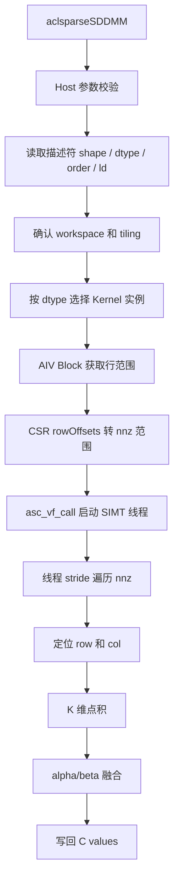

# SDDMM 算子设计文档

# 需求背景（required）

## 需求来源

本设计面向 7 月社区任务中的 SDDMM（Sampled Dense-Dense Matrix Multiplication）算子开发需求。任务目标是在 Ascend 950PR 上使用 Ascend C 与 aclsparse C++ 接口实现与 cuSPARSE SDDMM 语义对齐的稀疏算子能力。

SDDMM 的数学定义如下：

$$
C = \alpha \cdot (op(A) \cdot op(B)) \circ spy(C_{pattern}) + \beta \cdot C
$$

其中：

| 符号 | 含义 |
| --- | --- |
| A | 稠密矩阵，逻辑形状为 m × k 或转置后的 k × m |
| B | 稠密矩阵，逻辑形状为 k × n 或转置后的 n × k |
| C | CSR 格式稀疏矩阵，结构作为 mask，values 原地更新 |
| op(A)、op(B) | 支持非转置和转置两类访问语义 |
| alpha、beta | 与 computeType 一致的标量系数 |
| spy(C_pattern) | 只保留 C 既有非零位置的结构掩码 |

该算子不是生成新的稀疏结构，而是在 C 已有 CSR 结构上计算对应位置的稠密乘积结果。因此 row offsets 与 column indices 在计算过程中保持只读，只有 C values 被更新。

## 背景介绍

### SDDMM 算子功能分析

SDDMM 可理解为“按稀疏结构采样的稠密矩阵乘”。若 C 的某个非零元素位于 `(i, j)`，则该位置的输出值为：

$$
C_{ij}^{new} = \alpha \cdot \sum_{t=0}^{k-1} A_{i,t} \cdot B_{t,j} + \beta \cdot C_{ij}^{old}
$$

只对 CSR 中存在的 nnz 条目执行上述点积，C 中不存在的位置不参与计算，也不会写出结果。

SDDMM 在图神经网络中使用频繁。例如 GAT 中需要在固定边集合上计算节点特征之间的注意力分数，本质上就是在邻接矩阵非零位置上计算 `Q * K^T` 的采样结果。相比完整 GEMM，SDDMM 避免了对无边位置的冗余计算和存储。

### SDDMM 算子现状分析

当前任务要求提供 aclsparse 风格的三阶段接口：

1. `aclsparseSDDMMGetBufferSize`：返回预处理和执行所需 workspace 大小。
1. `aclsparseSDDMMPreprocess`：完成参数检查、执行元数据构建和 workspace 初始化。
1. `aclsparseSDDMM`：根据预处理结果启动 Ascend C Kernel 完成计算。

接口复用已有稠密矩阵描述符，稀疏矩阵 C 使用 CSR 描述符。与 SpMM 不同，SDDMM 的稀疏矩阵不是左输入矩阵，而是输出 mask；每个 nnz 条目的计算相互独立，适合按 nnz 维度展开 SIMT 并行。

### SDDMM 支持的数据类型和数据格式

任务要求支持 CSR 格式、int32 索引和以下数据类型组合：

| 类型编号 | A/B 数据类型 | C values 数据类型 | computeType | 说明 |
| --- | --- | --- | --- | --- |
| U1 | fp32 | fp32 | fp32 | 同精度 fp32 路径 |
| M1 | fp16 | fp32 | fp32 | fp16 输入，fp32 累加并写 fp32 |
| M2 | fp16 | fp16 | fp32 | fp16 输入，fp32 累加后写 fp16 |

数据类型设计中需要将稠密输入类型、C values 类型、累加类型解耦。fp16 输入不直接使用 fp16 累加，而是转换到 fp32 完成点积，最后根据 C values 类型写回。

# 需求分析（required）

## 需求描述

使用 Ascend C 在 Ascend 950PR 上实现 SDDMM 算子，提供与 cuSPARSE SDDMM 语义对齐的 aclsparse C++ 接口。算子需要支持 CSR 稀疏输出、稠密 A/B 输入、alpha/beta 标量融合、opA/opB 转置语义、row-major 与 column-major 的 DnMat 访问方式，以及任务书规定的数据类型组合。

该实现需要满足以下核心语义：

1. 只更新 matC 已有 nnz 位置，不新增、不删除稀疏元素。
1. CSR row offsets 和 column indices 在 Kernel 中只读。
1. C values 支持原地更新，`beta != 0` 时需要读取旧值参与计算。
1. fp16 混精路径统一使用 fp32 作为 computeType。
1. 输出顺序由原 CSR 存储顺序决定，保持确定性。

## 需求拆解

1. 接口层支持 `GetBufferSize / Preprocess / SDDMM` 三阶段调用流程。
1. Host 侧完成 handle、描述符、shape、dtype、索引类型、alg、workspace 等参数校验。
1. Host 侧生成 Kernel 所需 tiling 信息，包括矩阵规模、leading dimension、op、order、alpha、beta、block 切分信息。
1. Kernel 侧按 CSR mask 逐 nnz 计算 A 行与 B 列的 K 维点积。
1. Kernel 侧支持 U1、M1、M2 三类数据类型组合。
1. Kernel 侧实现 `alpha * dot + beta * oldC` 融合计算。
1. 在 Ascend 950PR 上采用 SIMT 方式提升 nnz 级并行度。
1. 支持 `nnz = 0`、空行、非方阵、非连续 DnMat 等边界输入。
1. 精度满足生态算子开源精度标准和 ATK 双标杆 L2 要求。
1. 性能不低于任务书给定的 A100 cuSPARSE 参考基线。

## 外部组件依赖

| 组件 | 用途 |
| --- | --- |
| Ascend C 编译与运行环境 | 编译并执行 AICore Kernel |
| ACL Runtime | 设备内存、stream、异步 Kernel launch |
| aclsparse 描述符体系 | 复用稠密矩阵和稀疏 CSR 矩阵描述符 |
| 平台信息接口 | 获取 Ascend 950PR 的 AIV Core 数量和硬件信息 |
| 测试框架 | 构造功能、精度、性能和边界用例 |

## 内部适配模块

| 模块 | 设计职责 |
| --- | --- |
| API 参数校验模块 | 校验指针、描述符、shape、dtype、索引和算法枚举 |
| Tiling 构建模块 | 计算 workspace 布局，写入 SDDMM 执行元数据 |
| Kernel launch 模块 | 根据 dtype 组合选择对应 Kernel 实例并异步启动 |
| SIMT 计算模块 | 每个线程处理一个或多个 nnz 条目并完成点积 |
| 测试验证模块 | 对比 CPU golden 与 GPU 双标杆结果，验证性能达标 |

## 需求模块设计

### Ascend C 算子原型

Kernel 逻辑输入包括：

| 输入 | 说明 |
| --- | --- |
| A values | 稠密矩阵 A 的 device 指针 |
| B values | 稠密矩阵 B 的 device 指针 |
| C row offsets | CSR 行偏移数组，长度 m + 1 |
| C column indices | CSR 列索引数组，长度 nnz |
| C values | CSR values 数组，输入旧值并写回新值 |
| workspace | Preprocess 写入的 tiling 与切分信息 |

Kernel 不改变稀疏结构，只写 C values。对于每个 nnz 条目 `p`，需要获得其所在行 `row` 和列索引 `colInd[p]`，再根据 opA、opB 和 DnMat order 计算 A/B 的实际访问地址。

### Ascend C 算子相关约束

| 约束项 | 约束内容 |
| --- | --- |
| 稀疏格式 | 仅支持 CSR |
| 索引类型 | row offsets 和 column indices 均为 int32 |
| 索引基 | 优先支持 zero-based，one-based 不作为首版能力 |
| 数据类型 | 支持 U1、M1、M2 三种组合 |
| computeType | 当前按 fp32 累加设计 |
| alpha/beta | 类型需与 computeType 一致 |
| op 类型 | 支持非转置和转置，不支持共轭转置 |
| 硬件 | 面向 Ascend 950PR |

# 详细设计（required）

## 算子分析

### 数学公式

设 C 的第 `p` 个非零元素位于 CSR 第 `row` 行、第 `col` 列，则：

$$
dot(row, col) = \sum_{t=0}^{k-1} A_{op,row,t} \cdot B_{op,t,col}
$$

$$
C.values[p] = \alpha \cdot dot(row, col) + \beta \cdot C.values[p]
$$

其中 `A_op` 和 `B_op` 的实际地址由 `opA/opB` 与 DnMat order 共同决定。

### 支持数据类型

| A/B | C values | computeType | 计算策略 |
| --- | --- | --- | --- |
| fp32 | fp32 | fp32 | fp32 乘法，fp32 累加，fp32 写回 |
| fp16 | fp32 | fp32 | fp16 load 后提升到 fp32，fp32 写回 |
| fp16 | fp16 | fp32 | fp16 load 后提升到 fp32，写回前 cast 到 fp16 |

M2 路径写回 fp16 时需要考虑 fp32 到 fp16 的范围收敛。实现上可在写回前对结果进行 clamp，避免超过 fp16 最大有限值导致非预期溢出。

### 支持形状

| 形状项 | 要求 |
| --- | --- |
| A | opA 后逻辑形状为 m × k |
| B | opB 后逻辑形状为 k × n |
| C | CSR 逻辑形状为 m × n |
| nnz | 可为 0 |
| leading dimension | 支持连续和非连续布局，要求 ld 满足实际矩阵存储访问范围 |

## 算子实现

### 实现方案

本方案采用 Host 预处理 + SIMT Kernel 执行的设计。Host 侧负责校验和生成轻量元数据；Kernel 侧负责按 CSR mask 遍历 nnz，使用 SIMT 线程并行完成点积和写回。

整体流程如下：

```text
API 调用
  -> 参数与描述符校验
  -> GetBufferSize 计算 workspace 大小
  -> Preprocess 写入 tiling 和 block 切分信息
  -> SDDMM 选择 dtype Kernel
  -> SIMT 线程按 nnz 计算点积
  -> alpha/beta 融合并写回 C values
```

#### host 侧设计

##### 1. 参数校验策略

Host 侧需要在进入 Kernel 前完成静态可判断的错误拦截：

| 校验项 | 处理方式 |
| --- | --- |
| handle、描述符、buffer 指针 | 空指针返回错误状态 |
| C 格式 | 非 CSR 返回不支持 |
| C 索引类型 | 非 int32 返回不支持 |
| C index base | 非 zero-based 返回不支持 |
| opA/opB | 共轭转置返回不支持 |
| shape | op(A) 列数必须等于 op(B) 行数，C 形状必须为 m × n |
| dtype | 不在 U1/M1/M2 组合内返回不支持 |
| alg | 首版仅接受 default 类算法 |
| workspace | Preprocess 和执行阶段要求 buffer 非空且大小满足要求 |

##### 2. 分核策略

SDDMM 的计算粒度是 nnz 条目。每个 nnz 的计算独立，不依赖同一行内的其他元素。因此可以用 CSR row offsets 将行范围映射为 nnz 范围，再由 SIMT 线程在该范围内交错处理。

首版采用按行均分到 AIV Core 的策略：

```text
blockDim = 平台 AIV Core 数量
rowsPerBlock = ceil(m / blockDim)

第 b 个 block:
  rowStart = min(b * rowsPerBlock, m)
  rowEnd = min((b + 1) * rowsPerBlock, m)
  nnzStart = rowOffsets[rowStart]
  nnzEnd = rowOffsets[rowEnd]
```

该策略不需要将 row offsets 从 device 拷回 host，也不需要在 Host 侧做复杂装箱。对于 m 较大的稀疏矩阵，每个 block 覆盖多行，nnz 数量在统计上趋于均衡。对于极端长行场景，后续可扩展为 nnz 均分或长行拆分策略。

##### 3. workspace 和 tiling 数据设计

workspace 中保存 Kernel 执行所需的元数据和 block 行边界。所有区域按 64B 对齐，便于 GM 访问。

| 区域 | 内容 |
| --- | --- |
| Header | workspace 标识、版本、校验信息 |
| SddmmTilingData | m、n、k、ld、op、order、alpha、beta、offset 等 |
| rowBlockEdges | 每个 block 的行起止边界，长度 blockDim + 1 |

`SddmmTilingData` 建议字段如下：

```cpp
struct SddmmTilingData {
    int32_t m;
    int32_t n;
    int32_t k;
    int32_t lda;
    int32_t ldb;
    int32_t opA;
    int32_t opB;
    int32_t orderPair;
    int32_t rowBlockEdgeOffset;
    int32_t blockDim;
    float alpha;
    float beta;
};
```

`orderPair` 用于编码 A/B 的 DnMat order，Kernel 内通过该字段快速判断 row-major 或 column-major。

##### 4. alpha/beta 处理

`alpha` 和 `beta` 的数据类型必须与 computeType 一致。当前 computeType 为 fp32，因此 Host 侧可将标量读取为 float 写入 tiling。若后续支持 device pointer mode，则需要将 alpha/beta 指针传入 Kernel 并在执行时读取。

对于 `beta == 0` 的常见场景，Kernel 可跳过旧 C values 读取，减少 GM 读带宽。

##### 5. tilingKey 规划策略

首版 tilingKey 可按数据类型组合区分：

| tilingKey | A/B | C values | computeType |
| --- | --- | --- | --- |
| 0 | fp32 | fp32 | fp32 |
| 1 | fp16 | fp32 | fp32 |
| 2 | fp16 | fp16 | fp32 |

opA/opB、orderPair、beta 是否为 0 等运行时信息不单独拆 tilingKey，放入 tiling data，由 Kernel 内分支处理。这样可以减少 Kernel 入口数量，降低维护成本。

#### kernel 侧设计

##### 1. Kernel 执行流程

Kernel 启动后，每个 AIV block 根据 blockId 获取自己的行范围，再转换为 nnz 范围：

```text
Init:
  读取 SddmmTilingData
  获取 A、B、rowOffsets、colInd、C values 指针
  获取当前 block 的 rowStart / rowEnd
  计算 nnzStart / nnzEnd

Process:
  若 nnzStart == nnzEnd，直接返回
  启动 SIMT 线程组
  每个线程以 stride 方式处理 nnz:
    p = nnzStart + threadIdx
    while p < nnzEnd:
      查找 p 对应 row
      col = colInd[p]
      acc = dot(A[row, :], B[:, col])
      C[p] = alpha * acc + beta * C[p]
      p += threadNum
```

##### 2. SIMT 并行设计

SDDMM 的每个 nnz 条目都是独立点积，适合使用 SIMT 的线程级并行。设计中每个 VF 线程处理一个或多个 nnz 条目，线程之间不共享累加结果，不需要原子操作。

```text
Thread 0: nnzStart + 0, nnzStart + threadNum, ...
Thread 1: nnzStart + 1, nnzStart + threadNum + 1, ...
...
Thread T: nnzStart + T, nnzStart + threadNum + T, ...
```

该方式有三个优点：

1. 避免多线程写同一 C values 位置。
1. 对 unsorted column indices 天然适配。
1. 对短行、长行和空行使用同一套执行逻辑。

##### 3. row 查找策略

由于每个 block 处理连续行范围，线程在处理 nnz `p` 时需要确定其 CSR 行号。首版可采用 block 内局部推进策略：

```text
row = rowStart
while row + 1 < rowEnd and rowOffsets[row + 1] <= p:
    row++
```

该策略实现简单，适用于首版功能闭环。若性能测试中发现长行或大行范围下 row 查找开销明显，可优化为：

1. 在线程内部缓存上一次 p 对应 row。
1. 对 row offsets 做二分查找。
1. 在 Host 预处理阶段生成 nnz 到 row 的辅助索引。

首版优先控制 workspace 大小和预处理开销，因此不额外生成 nnz2row。

##### 4. K 维点积设计

对每个 nnz 条目执行 K 维点积：

```text
acc = 0
for t in [0, k):
    a = load A(row, t, opA, orderA)
    b = load B(t, col, opB, orderB)
    acc += float(a) * float(b)
```

当 K 较大时，内层循环按固定 chunk 展开：

```text
for kt in range(0, k, kChunk):
    #pragma unroll
    for u in range(0, kChunk):
        if kt + u < k:
            acc += A[...] * B[...]
```

`kChunk` 可初始设为 8 或 16，根据 Ascend 950PR 上的寄存器压力、指令展开效果和性能测试结果调优。

##### 5. A/B 地址计算

Kernel 中需要同时考虑 op 和 order。以下为逻辑访问 `A(row, t)` 与 `B(t, col)` 的地址规则：

| 矩阵 | op | order | 地址计算 |
| --- | --- | --- | --- |
| A | N | row-major | `row * lda + t` |
| A | N | column-major | `t * lda + row` |
| A | T | row-major | `t * lda + row` |
| A | T | column-major | `row * lda + t` |
| B | N | row-major | `t * ldb + col` |
| B | N | column-major | `col * ldb + t` |
| B | T | row-major | `col * ldb + t` |
| B | T | column-major | `t * ldb + col` |

地址计算使用 64 位中间变量，避免大矩阵下乘法溢出。

##### 6. 数据类型模板设计

Kernel 模板参数设计如下：

```cpp
template <typename DenseT, typename CValueT, typename ComputeT>
```

| 模板参数 | 含义 |
| --- | --- |
| DenseT | A/B 稠密矩阵元素类型 |
| CValueT | C values 元素类型 |
| ComputeT | 点积、alpha、beta 的计算类型 |

三种实例分别为：

```cpp
SddmmKernel<float, float, float>
SddmmKernel<half, float, float>
SddmmKernel<half, half, float>
```

fp16 输入路径在参与乘加前转换为 float。fp16 输出路径在写回前做类型转换。

##### 7. Ascend C 实现流程图



##### 8. 与 TBE/传统实现流程的差异和原因

本任务是新增 SDDMM 算子，不存在可直接迁移的 TBE 实现。与传统按 Tensor tile 搬入 UB 后向量计算的 Elementwise 类算子不同，SDDMM 的访存模式由 CSR column indices 决定，B 矩阵访问具有间接寻址特征，难以形成规则连续搬运。

因此本设计选择 SIMT 直接 GM 访问的方式：

1. 每个 nnz 对应一次独立点积，线程粒度与计算粒度一致。
1. 不需要对 C 的稀疏结构做重排，保持 CSR 顺序和确定性。
1. 避免为了不规则 column indices 构造复杂 UB gather 缓冲。
1. 便于支持 unsorted column indices 和不同稀疏分布。

后续若性能瓶颈集中在 A/B 访问带宽，可再针对固定 K、局部列聚集或图场景加入缓存优化。

## 支持硬件

| 支持的芯片版本 | 涉及勾选 |
| --- | --- |
| Ascend 950PR | √ |

## 算子约束限制

| 约束项 | 限制说明 |
| --- | --- |
| 稀疏格式 | 首版仅支持 CSR |
| 索引类型 | 首版仅支持 int32 |
| index base | 首版仅支持 zero-based |
| 数据类型 | 仅支持 U1、M1、M2 |
| computeType | 仅支持 fp32 |
| 复数类型 | 不支持 |
| 共轭转置 | 不支持 |
| 新增稀疏结构 | 不支持，C 的结构必须由输入 CSR 给定 |
| 排序要求 | 不要求 column indices 有序 |
| 确定性 | 每个 C values 位置只由单线程写回，结果顺序固定 |

# 特性交叉分析

| 特性 | 交互影响 | 设计处理 |
| --- | --- | --- |
| opA/opB 与 DnMat order | 影响 A/B 实际地址计算 | 在 tiling 中记录 op 和 orderPair，Kernel 内统一计算 |
| beta 与 C values dtype | beta 非 0 需要读取旧 C values | beta 为 0 时跳过旧值读取；非 0 时按 CValueT 读取并转 computeType |
| fp16 输入与 fp32 累加 | 影响精度和性能 | load 后显式提升到 float 参与累加 |
| fp16 输出 | 可能出现范围溢出 | 写回前做范围保护并 cast |
| unsorted CSR | column indices 不连续 | 每个 nnz 独立计算，不依赖排序 |
| 空行与 nnz=0 | block 可能无工作 | nnz 范围为空时直接返回 |
| 非连续 DnMat | ld 大于逻辑列数或行数 | Host 校验 ld 合法，Kernel 使用 ld 寻址 |

# 可维可测分析

## 精度标准/性能标准

| 验收标准 | 描述 | 标准来源 |
| --- | --- | --- |
| 精度标准 | 满足生态算子开源精度标准，并满足 ATK 双标杆 L2（2 / 1.2 / 1.2）要求 | 任务书 |
| 性能标准 | 固定用例和泛化用例上性能不低于 A100 cuSPARSE SDDMM 参考实现 | 任务书 |

### 精度验证设计

精度验证分为单标杆和双标杆：

1. 单标杆：使用 CPU 高精度实现生成 golden，比较 NPU 输出。
1. 双标杆：当单标杆存在浮点误差争议时，对比 GPU cuSPARSE 输出和 NPU 输出的误差比。

需要覆盖：

| 维度 | 覆盖内容 |
| --- | --- |
| dtype | U1、M1、M2 |
| alpha/beta | alpha=1、alpha 非 1、beta=0、beta 非 0 |
| shape | 方阵、非方阵、宽矩阵、窄矩阵 |
| K | 16、64、128、256、512 |
| 稀疏结构 | 均匀稀疏、长行、空行、unsorted colInd |
| 边界 | nnz=0、m=1、n=1、k=1 |
| 布局 | row-major、column-major、非连续 ld |

### 性能验证设计

性能验证需要包含任务书固定三组基线：

| 编号 | 场景 | m × n | nnz | k | dtype | GPU 参考耗时 |
| --- | --- | --- | --- | --- | --- | --- |
| 01 | fp32 基础 SDDMM，beta=0 | 256 × 256 | 327 | 64 | fp32 | 1912 us |
| 02 | beta 累加 | 128 × 128 | 163 | 32 | fp32 | 1683 us |
| 03 | fp16 混精 M1 | 256 × 256 | 327 | 64 | A/B fp16，C fp32 | 1768 us |

泛化测试按任务书要求抽取 200 组，覆盖大规模 m/n、不同 k、不同 nnz、beta 非 0、非连续 stride 和 GNN 边特征场景。性能报告中记录 NPU 平均耗时、GPU 参考耗时和加速比。

## 兼容性分析

SDDMM 为新增算子能力，不改变已有 SpMV、SpMM、NNZ 等算子的接口和行为。新增接口复用现有 aclsparse handle、稠密矩阵描述符和 CSR 稀疏矩阵描述符，保持调用风格一致。

兼容性风险主要来自以下方面：

| 风险点 | 影响 | 规避方式 |
| --- | --- | --- |
| 描述符字段解释不一致 | shape 或 ld 解析错误 | 与现有 DnMat/SpMat 描述符语义保持一致 |
| workspace 复用错误 | 可能使用过期 tiling | 在 tiling header 中记录关键 shape 和 dtype 信息，执行前校验 |
| dtype 扩展 | 新增类型可能影响模板分发 | 首版严格限制 U1/M1/M2，后续通过新增模板实例扩展 |
| op/order 组合 | 非推荐组合性能较低 | 功能支持，性能报告中区分推荐组合和非推荐组合 |

由于该算子是新增接口，不涉及对历史接口的行为兼容修改。
