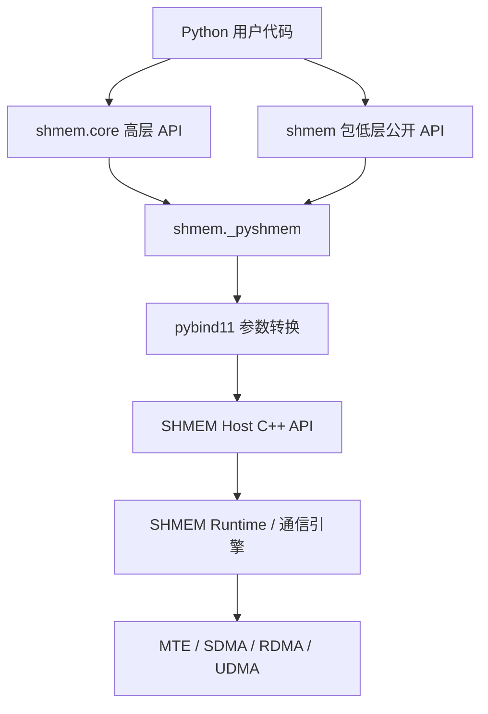
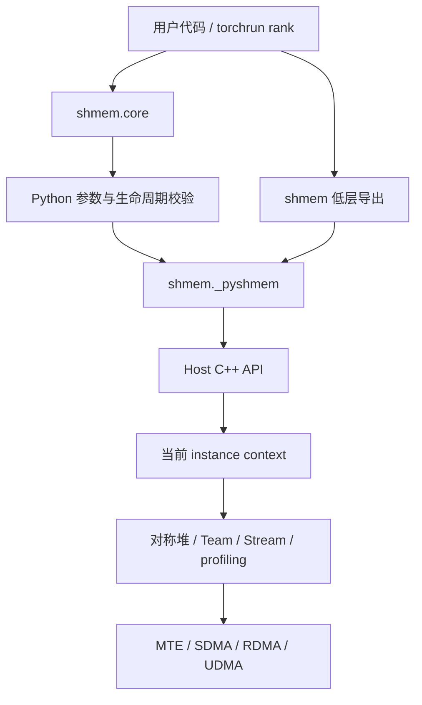
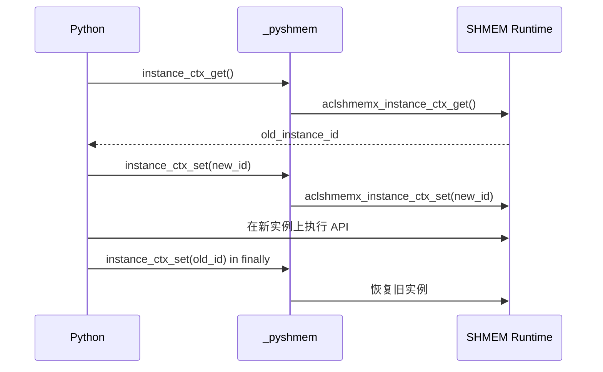
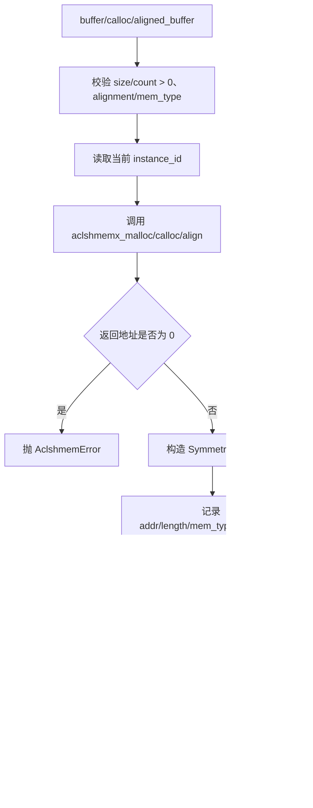
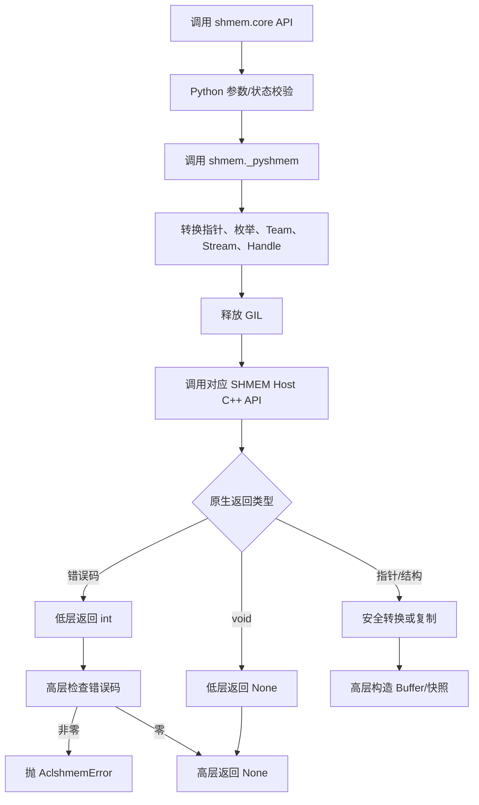

# SHMEM Python 接口开发设计文档

## 文档信息

| 项目 | 内容 |
| --- | --- |
| 任务名称 | 7 月社区任务——SHMEM Python 接口开发 |
| 任务书 | [SHMEM Python 接口开发任务书](https://gitcode.com/CyndiZ/cann-competitions/blob/master/04_tasks/01_community-task-2026/docs/202607/SHMEM_Python_api_task_doc.md) |
| 目标仓库 | [cann/shmem](https://gitcode.com/cann/shmem) |
| 提交路径 | `04_tasks/01_community-task-2026/tasklist/07-SHMEM_Python_API/aufw/docs/design.md` |
| 目标目录 | `src/host/python_wrapper/`、`src/python/shmem/`、`docs/api/`、`examples/python_extension/` |
| 技术栈 | C++、pybind11、Python 3.9 及以上 |
| 适配硬件 | Atlas A2/A3 训练系列产品或推理系列产品 |
| CANN 版本 | CANN 9.0.0 或社区版较新版本，推荐不低于 9.0.0 |

# 一、需求背景（required）

## 1.1 需求来源

本需求来源于 CANN 2026 年 7 月社区任务。SHMEM（ACLSHMEM）已经提供 Host C++ API、部分 `_pyshmem` 低层绑定和 `shmem.core` 高层接口，但初始化与多实例、带 `mem_type` 的对称堆、引擎配置、集合通信、同步、诊断等能力尚未完整对齐 Python。

本任务需要：

1. 使用 pybind11 将任务书列出的 20 个 Host C++ API 封装到 `shmem._pyshmem`。
2. 在 `shmem.core` 中补齐集合通信、多实例、带 `mem_type` 的内存分配和 `handle_wait` 等 Pythonic API。
3. 补充多卡功能测试、文档和 QuickStart 示例。
4. 保持 C++ API 的集合语义、Stream 顺序、返回值和错误行为，不修改 Device Kernel API。

## 1.2 背景介绍

### 1.2.1 SHMEM Python 接口实现优化

本任务不涉及历史 TBE 算子。对应 CheckList 中“TBE 源码路径”和“算子信息库路径”的替代核对对象如下：

| 类型 | 路径 | 作用 |
| --- | --- | --- |
| Host API 汇总 | `include/shmem.h` | SHMEM 对外头文件汇总入口 |
| 初始化与多实例 | `include/host/init/shmem_host_init.h` | UID 属性构造、上下文获取/切换 |
| 对称堆 | `include/host/mem/shmem_host_heap.h` | `malloc/calloc/align/free` 及 `mem_type` 扩展 |
| 集合通信 | `include/host/data_plane/shmem_host_cc.h` | barrier、sync 及 on-stream barrier |
| RMA/引擎配置 | `include/host/data_plane/shmem_host_rma.h` | MTE、SDMA、RDMA、UDMA 配置 |
| handle 等待 | `include/host/data_plane/shmem_host_p2p_sync.h` | `aclshmemx_handle_wait` |
| profiling | `include/host/utils/shmem_log.h` | `aclshmemx_get_prof/show_prof` |
| 公共数据类型 | `include/host_device/shmem_common_types.h` | Team、Handle、MemType、profiling 数据结构 |
| 低层 Python 绑定 | `src/host/python_wrapper/pyshmem.cpp` | `_pyshmem` pybind11 模块 |
| 高层 Python 包 | `src/python/shmem/core/` | 初始化、内存、RMA 等 Pythonic 封装 |
| Python 导出入口 | `src/python/shmem/__init__.py` | 原生动态库加载和公开符号导出 |
| API 文档 | `docs/api/pythonAPI.md` | Python API 参考文档 |
| 测试样例 | `examples/python_extension/` | `torchrun` 多卡测试与示例 |

设计依据以对应 Host 头文件声明为准，以 `pyshmem.cpp` 现有命名、`intptr_t` 指针传递、GIL 释放和异常风格为兼容基线。

### 1.2.2 SHMEM Python 接口现状分析

#### 1.2.2.1 现有接口支持的数据类型和数据表达

本任务不是 Tensor 算子，不存在 ND/NCHW 等数据格式，也不存在 TBE dtype 表。Python 绑定需要对齐的是 C/C++ 标量、句柄和指针类型。

| C/C++ 类型 | Python 表达 | 约束 |
| --- | --- | --- |
| `int`、`int32_t` | `int` | 绑定层检查目标类型范围 |
| `uint32_t`、`uint64_t` | `int` | 不允许负数，检查上界 |
| `size_t`、`int64_t` | `int` | 分配大小必须为正；`calloc` 检查乘法溢出 |
| `void *` | `int`（`intptr_t`） | `0` 表示空指针；高层使用 `Buffer` 封装 |
| `aclrtStream` | `int`（`intptr_t`）或 `None` | `0/None` 是否表示默认流由具体接口语义决定 |
| `aclshmem_team_t` | `int` | `ACLSHMEM_TEAM_WORLD=0`，非法 team 为 `-1` |
| `aclshmem_mem_type_t` | `_pyshmem.MemType` | `HOST_SIDE` 或 `DEVICE_SIDE` |
| `aclshmem_handle_t` | `_pyshmem.Handle` | 当前公开字段为 `team_id` |
| `aclshmemx_init_attr_t` | `_pyshmem.InitAttr` | 需新增公开 `instance_id` 字段 |
| `aclshmem_instance_ctx` | `_pyshmem.InstanceContext` | Python 返回快照，仅公开只读 `id` |
| `aclshmemx_uniqueid_t` | `bytes` 或 `_pyshmem.UniqueId` | 必须验证 UID 字节长度和版本 |
| profiling 结构 | Python 只读快照 | 不向 Python 暴露可写的原生内部指针 |

#### 1.2.2.2 现有实现描述

当前 `_pyshmem` 已具备以下基础模式：

1. 普通 Host API 通过 `m.def` 注册，并对可能阻塞或耗时的调用使用 `py::gil_scoped_release`。
2. 原生指针统一转成 `intptr_t` 传递；Stream 由整数句柄转换成 `aclrtStream`。
3. `aclshmem_malloc/calloc/align` 在返回空指针时抛出 `std::runtime_error`，Python 高层再转换为 `AclshmemError`。
4. `shmem.core.memory` 使用 `Buffer(addr, length)` 表达内存，`shmem.core.rma` 使用 `Buffer` 和 `stream` 提供较易用的接口。
5. `MemType` 枚举已经存在，但带 `mem_type` 的 `aclshmemx_malloc/calloc/align/free` 尚未绑定。
6. `InitAttr` 已绑定主要初始化字段，但未公开 `instance_id`，因此 Python 无法完整构造多实例初始化属性。
7. 任务书列出的集合通信、上下文切换、引擎配置、handle 等待和 profiling 尚未在 Python API 中形成完整闭环。

#### 1.2.2.3 现有 Python 调用流程图



现状缺口位于 `shmem._pyshmem` 和 `shmem.core` 两层，不需要改变 SHMEM Runtime 或 Device Kernel。

# 二、需求分析（required）

## 2.1 外部组件依赖

| 依赖 | 最低/推荐版本 | 使用范围 | 运行时必需 |
| --- | --- | --- | --- |
| Python | 3.9 及以上 | Python 包、测试、wheel | 是 |
| pybind11 | 沿用 SHMEM 仓版本 | C++/Python 绑定 | 构建期必需 |
| CANN Toolkit | 9.0.0 或较新社区版 | ACL Runtime、编译和运行 | 是 |
| torch | 与 torch_npu 匹配 | `torchrun` 多进程、多卡测试 | 测试/示例必需 |
| torch_npu | 与 CANN、torch 匹配 | NPU Tensor、Stream、设备测试 | 测试/示例必需 |

不新增 NumPy、MPI 或其他 Python 运行时硬依赖。MPI、RDMA/SDMA/UDMA 环境仅用于对应可选测试路径。

## 2.2 内部适配模块

| 模块 | 设计职责 |
| --- | --- |
| `src/host/python_wrapper/pyshmem.cpp` | 新增枚举/结构绑定、20 个 Host API 低层绑定、类型和 GIL 处理 |
| `src/python/shmem/__init__.py` | 导入并公开新增低层符号，保持 degraded mode 行为 |
| `src/python/shmem/core/collective.py` | barrier、sync 和 on-stream barrier 高层封装 |
| `src/python/shmem/core/multi_instance.py` | 上下文获取/切换和上下文管理器 |
| `src/python/shmem/core/memory.py` | 带 `mem_type` 的分配、释放和 Buffer 元数据 |
| `src/python/shmem/core/rma.py` | `handle_wait` 高层封装 |
| `src/python/shmem/core/config.py` | 四类引擎配置的参数检查和错误转换 |
| `src/python/shmem/core/profiling.py` | profiling 安全快照和弃用接口封装 |
| `docs/api/pythonAPI.md` | 低层、高层 API、集合语义、限制说明 |
| `docs/quickstart.md` | 多实例、同步和 handle_wait 最小示例 |
| `examples/python_extension/test/` | 多卡功能、错误路径和兼容性用例 |

文件可根据仓库维护者意见合并，但 API 边界和测试职责不变。

## 2.3 需求模块设计

### 2.3.1 分层原则

两层 API 的职责如下：

| 层级 | 命名 | 行为 |
| --- | --- | --- |
| 低层绑定 | `shmem._pyshmem.aclshmem*` | 尽量一一对应 C++；保留返回码；指针/Stream 使用整数句柄；原生 void 返回 `None` |
| 高层封装 | `shmem.core.*` | 参数校验；`Buffer`/上下文管理；非零返回码转为 `AclshmemError`；非法 Python 参数转为 `AclshmemInvalid` |

不得在低层绑定中偷偷改变集合语义、自动创建 Stream、自动同步 Stream 或跨 PE 补调用。

### 2.3.2 `_pyshmem` Host API 映射

| 序号 | C++ API | Python 低层原型 | 设计行为 |
| ---: | --- | --- | --- |
| 1 | `aclshmemx_set_attr_uniqueid_args` | `(..., uid, attr: InitAttr) -> int` | 接受合法 `bytes/UniqueId`，将 UID 复制到 `attr` owner 后原地填充，返回原生错误码 |
| 2 | `aclshmemx_instance_ctx_get` | `() -> InstanceContext | None` | 返回当前上下文只读快照；原生空指针返回 `None` |
| 3 | `aclshmemx_instance_ctx_set` | `(instance_id: int) -> int` | 切换当前实例，返回原生错误码 |
| 4 | `aclshmemx_malloc` | `(size: int, mem_type=MemType.DEVICE_SIDE) -> int` | 返回地址；原生空指针保持为 `0`，不在低层改写错误语义 |
| 5 | `aclshmemx_calloc` | `(count: int, size: int, mem_type=...) -> int` | 返回清零内存地址；检查 `count*size` 溢出 |
| 6 | `aclshmemx_align` | `(alignment: int, size: int, mem_type=...) -> int` | `alignment` 必须为正的 2 的幂 |
| 7 | `aclshmemx_free` | `(ptr: int, mem_type=...) -> None` | `ptr=0` 允许空操作；调用者必须传入与分配一致的 `mem_type` |
| 8 | `aclshmemx_set_mte_config` | `(offset: int, ub_size: int, sync_id: int) -> int` | 保留原生返回码 |
| 9 | `aclshmemx_set_sdma_config` | 同上 | 保留原生返回码 |
| 10 | `aclshmemx_set_rdma_config` | 同上 | `ub_size` 至少 128 字节，最终合法性由原生层判断 |
| 11 | `aclshmemx_set_udma_config` | 同上 | 高阶 UDMA 路径的 staging UB 至少 128 字节 |
| 12 | `aclshmem_barrier` | `(team: int) -> None` | 阻塞式 Team barrier，释放 GIL |
| 13 | `aclshmem_barrier_all` | `() -> None` | 阻塞式全局 barrier，释放 GIL |
| 14 | `aclshmem_sync` | `(team: int) -> None` | 仅提供 C++ `sync` 定义的可见性语义 |
| 15 | `aclshmem_sync_all` | `() -> None` | 全局 `sync`，不等价于 barrier |
| 16 | `aclshmemx_barrier_on_stream` | `(team: int, stream: int) -> None` | 将 barrier 排入指定 ACL Stream |
| 17 | `aclshmemx_barrier_all_on_stream` | `(stream: int) -> None` | 将全局 barrier 排入指定 Stream |
| 18 | `aclshmemx_handle_wait` | `(handle: Handle, stream: int) -> None` | 等待异步 RMA handle 完成；释放 GIL |
| 19 | `aclshmemx_get_prof` | `(verbose: bool=False) -> ProfileData | None` | 只深拷贝当前采集 PE 对应的单个对象；空指针返回 `None`，不得按 `n_pes` 向后遍历；C++ 层使用 profiling 专用 mutex 保护"native 调用→输出指针检查→字段复制到本地快照"的完整区间，防止并发覆盖 |
| 20 | `aclshmemx_show_prof` | `() -> None` | 保留兼容；文档标为 deprecated，推荐 `get_prof(verbose=True)`；与 `get_prof` 共用同一 profiling mutex |

补充绑定类型：

```python
class InstanceContext:
    id: int  # 只读

class Handle:
    team_id: int

class ProfBlock:
    ccount: tuple[int, ...]
    cycles: tuple[int, ...]

class ProfileData:
    pe_id: int
    block_prof: tuple[ProfBlock, ...]
```

`ProfileData` 必须是 Python 持有的当前 PE 快照，不得在 `finalize` 后继续引用原生 `out_profs` 指针。C++ 层在 native 调用到快照完成期间持有 profiling mutex，确保两线程不会并发覆盖 `g_host_profs`。`ProfPe` 可暂作为兼容别名，但新接口和文档统一使用 `ProfileData`。若一次性深拷贝成本影响常用路径，可将快照构造放在显式 `get_prof()` 调用中；该接口不参与性能热路径。跨 PE 汇总必须由各 Python rank 分别调用后交给测试框架聚合，不能从 C++ 返回指针向后遍历。

### 2.3.3 `shmem.core` 高层 API 原型

```python
def barrier(team: int = 0, stream: int | None = None) -> None: ...
def barrier_all(stream: int | None = None) -> None: ...
def sync(team: int = 0) -> None: ...
def sync_all() -> None: ...

def instance_ctx_get() -> int: ...
def instance_ctx_set(instance_id: int) -> None: ...

@contextmanager
def multi_instance(instance_id: int): ...

def buffer(size: int, release: bool = False, except_on_del: bool = True,
           mem_type: MemType = MemType.DEVICE_SIDE) -> Buffer: ...
def calloc(count: int, size: int,
           mem_type: MemType = MemType.DEVICE_SIDE) -> Buffer: ...
def aligned_buffer(alignment: int, size: int,
                   mem_type: MemType = MemType.DEVICE_SIDE) -> Buffer: ...
def free(buf: Buffer, mem_type: MemType | None = None) -> None: ...

def set_mte_config(offset: int, ub_size: int, sync_id: int) -> None: ...
def set_sdma_config(offset: int, ub_size: int, sync_id: int) -> None: ...
def set_rdma_config(offset: int, ub_size: int, sync_id: int) -> None: ...
def set_udma_config(offset: int, ub_size: int, sync_id: int) -> None: ...

def handle_wait(handle: Handle | int, stream: int) -> None: ...
def get_prof(verbose: bool = False) -> ProfileData | None: ...
def show_prof() -> None: ...  # deprecated
```

`barrier(team, stream)` 和 `barrier_all(stream)` 仅根据 `stream is None` 在同步接口与 on-stream 接口之间分派。`sync/sync_all` 没有对应的 on-stream C++ API，因此不得接受 `stream` 参数。

### 2.3.4 Buffer 和多实例元数据

为兼容现有 `Buffer` 调用方，新增的对称内存对象应满足 `isinstance(obj, Buffer)`。建议新增：

```python
class SymmetricBuffer(Buffer):
    mem_type: MemType
    instance_id: int
    release_called: bool
```

设计规则：

1. `buffer/calloc/aligned_buffer` 返回 `SymmetricBuffer`，记录分配时的 `mem_type` 和当前 `instance_id`。
2. `free(buf)` 默认读取 `buf.mem_type`；显式 `mem_type` 与记录不一致时抛出 `AclshmemInvalid`。
3. 释放前检查当前实例是否与 `buf.instance_id` 一致；不一致时拒绝释放并提示先切换实例，避免跨实例误释放。
4. 调用 native free 前，在持有 GIL 时检查 `release_called` 并先置为 `True`，再释放 GIL 调用 `aclshmemx_free`；`release_called` 的含义限定为"已发起过 native free 调用"，**不能**声称底层释放成功，也不应回滚或重试。重复释放在高层抛出 `AclshmemInvalid`。
5. 用户手工构造的普通 `Buffer` 没有所有权元数据。为兼容旧代码，`free(Buffer)` 仍按默认 `DEVICE_SIDE` 处理，但文档提示优先释放由高层分配接口返回的对象。
6. `release`、`except_on_del` 继续保持现有保留参数语义，本任务不引入 Python 析构时自动调用集合式内存释放，以免各 PE 调用顺序不一致导致死锁。

> **`release_called` 与 GIL 安全的补充说明**：
>
> `aclshmemx_free` 返回 `void`，无法向 Python 层报告成功或失败；失败时 native 内部仅记录日志。因此 Python 层不能声称"底层释放成功"，`release_called` 仅表示"已发起过 native free 调用"。
>
> 并发安全方面：若 native 调用期间释放 GIL，两个线程可能同时通过 `release_called == False` 检查并各调用一次 `aclshmemx_free`，导致双重释放。修正方案如下：
>
> 1. 在 **持有 GIL** 时原子地检查 `release_called` 并先置为 `True`；
> 2. 然后释放 GIL 调用 `aclshmemx_free`；
> 3. 若 `release_called` 已为 `True`，直接抛出 `AclshmemInvalid`，不再调用 native。
>
> 该检查-置位操作在 GIL 保护下是原子的，不引入额外锁。重复释放的判断完全由 Python 层 `release_called` 字段承担，native 层不做幂等保护。

### 2.3.5 相对 C++ API 的约束与适配差异

1. Python 无法安全暴露 `aclshmem_prof_pe_t **` 的可写二级指针，因此 `get_prof` 只返回当前采集 PE 的单个深拷贝快照或 `None`；数据内容与 C++ 一致，所有权语义改为 Python 管理。
2. `aclshmemx_instance_ctx_get` 的 `instance` 字段为保留指针，不向 Python 暴露；仅返回稳定的 `id` 快照。
3. C++ 默认参数在 Python 签名中显式声明，默认 `mem_type` 与 C++ 保持为 `DEVICE_SIDE`。
4. Python 高层会做类型、范围、溢出和生命周期检查；低层仍保留原生返回码和 void 语义。
5. 本任务不封装 `aclshmemx_roce_*` 等 Device Kernel API，也不扩展新的通信协议。

# 三、需求详细设计（required）

## 3.1 使能方式

### 3.1.1 构建和安装

沿用 SHMEM 主线 Python 扩展构建流程：

```bash
# Atlas A2/A3
bash scripts/build.sh -python_extension

# 构建 wheel
python3 setup.py bdist_wheel
pip3 install dist/shmem-*.whl --force-reinstall
```

新增 API 编译进既有 `_pyshmem` 扩展，不新增共享库，不改变 wheel 名称。

### 3.1.2 Python 调用入口

```python
import shmem
from shmem import core

# 高层 API
core.barrier_all()

# 低层一一映射 API
shmem.aclshmem_barrier_all()
```

`src/python/shmem/__init__.py` 的 `_load_native()` 与 degraded mode 行为保持不变。原生库未加载成功时，不应出现“新增 API 部分可用”的假象。

## 3.2 需求总体设计

总体架构如下：



每个 `torchrun` rank 是独立进程，拥有独立 Python 解释器；所有参与同一 Team 的 PE 必须以相同顺序进入集合 API。

### 3.2.1 Host 侧设计

#### pybind11 绑定组织

为避免 `PYBIND11_MODULE` 继续膨胀，可按能力拆分注册函数：

```cpp
void DefineShmemInstance(py::module_ &m);
void DefineShmemExtendedHeap(py::module_ &m);
void DefineShmemEngineConfig(py::module_ &m);
void DefineShmemCollective(py::module_ &m);
void DefineShmemProfiling(py::module_ &m);
```

如果维护者要求单文件最小变更，也应保持上述逻辑分区和统一的参数转换辅助函数：

```cpp
void *ToPtr(intptr_t value);
aclrtStream ToStream(intptr_t value);
void CheckUnsignedRange(...);
```

#### GIL 策略

| API 类别 | GIL 策略 | 原因 |
| --- | --- | --- |
| barrier、sync、handle_wait | 原生调用期间释放 GIL | 可能阻塞，避免冻结同进程其他 Python 线程 |
| malloc/calloc/align/free | 原生调用期间释放 GIL | 可能涉及对称堆协同和 Runtime 调用 |
| instance ctx get/set | getter 全程持有 GIL（从 native 调用、空指针检查到复制 `ctx->id`）；setter 仅在原生调用期间释放 GIL | getter 返回的原生 `aclshmemx_instance_ctx_get()` 是 runtime 内部借用指针，释放 GIL 后读取 `ctx->id` 期间另一线程可能 finalize context，形成悬空读取窗口 |
| 引擎配置 | 原生调用期间释放 GIL | 不访问 Python 对象 |
| `get_prof` | 原生调用期间释放 GIL，构造 Python 快照前重新持有 GIL；C++ 层额外使用 profiling 专用 mutex 保护 native 调用到字段复制的完整区间 | 不允许在无 GIL 时创建 Python 对象；mutex 防止两线程并发调用导致 `g_host_profs` 被覆盖 |

参数必须先在持有 GIL 时从 Python 对象转换为 POD；释放 GIL 后不得读写 `py::object`。

> **Instance ctx get/set 的 RLock 补充说明**：
>
> `aclshmemx_instance_ctx_get()` 返回的是 runtime 内部借用指针（borrowed pointer），其生命周期由 runtime 管理。低层 getter 必须从调用 native、检查空指针到复制 `ctx->id` **全程持有 GIL**，不得在中间释放 GIL，否则另一 Python 线程可能在此窗口内 finalize context，导致悬空读取。
>
> 仅在文档中声明"禁止并发切换"不足以保护 getter 的安全；需要在代码层面通过 RLock 保证互斥。高层的 `instance_ctx_get`、`instance_ctx_set`、`multi_instance()` 的 init/finalize 路径共用同一把 `threading.RLock`，确保：
>
> 1. getter 内部全程持有 GIL（C++ 层面 pybind11 默认行为），无需额外锁；
> 2. 高层 `instance_ctx_set` 和 `multi_instance` 的 `__enter__`/`__exit__` 在调用 native 前先获取 RLock，native 返回后释放；
> 3. RLock 保证 `get → set → finally set` 的上下文管理器序列不被另一线程的 `set` 或 `finalize` 打断；
> 4. 低层 `_pyshmem` 绑定本身不做 RLock，仅保证 GIL 策略正确；互斥由 `shmem.core.multi_instance` 模块负责。

> **Profiling mutex 补充说明**：
>
> `aclshmemx_get_prof` 使用共享的全局 `g_host_profs` 输出指针。如果两个 Python 线程同时调用 `get_prof`，一条线程可能在 native 返回后、深拷贝完成前被另一条调用覆盖，导致数据不一致或崩溃。深拷贝只能解决返回对象的长期生命周期，不能解决**调用期间的并发覆盖**。
>
> 修正方案：在 C++ 层（`pyshmem.cpp` 或对应 profiling 模块）增加一把 profiling 专用 `std::mutex`，覆盖以下完整区间：
>
> 1. 调用 `aclshmemx_get_prof` native 函数；
> 2. 检查输出指针非空；
> 3. 将全部字段逐个复制到本地 C++ 快照结构体。
>
> 该 mutex 在释放 GIL 之前加锁，在重新持有 GIL 并完成快照后解锁。`aclshmemx_show_prof` 访问同一全局 `g_host_profs`，也必须共用这把 mutex，确保 show 和 get 不会并发读写。
>
> 高层 Python 侧无需额外加锁：GIL + C++ mutex 已保证从 native 调用到快照完成的原子性。若未来 profiling 数据量显著增长导致 mutex 竞争加剧，可考虑将快照构造移至独立线程并使用无锁队列传递，但首版不引入该复杂度。

#### 返回值和异常策略

| 原生返回 | 低层行为 | 高层行为 |
| --- | --- | --- |
| `int` 错误码 | 原样返回 | 非零转 `AclshmemError`，消息含 API 名和错误码 |
| `void` | 返回 `None` | 返回 `None`；集合超时由外层测试/运行器检测 |
| 分配指针 | 转成 `intptr_t`；原生空指针保持为 `0` | `size/count > 0` 时空地址转为 `AclshmemError`，否则转为 `SymmetricBuffer` |
| context 指针 | 空指针为 `None`，非空复制 `id` | 空指针转 `AclshmemError`，否则返回实例 ID |
| profiling 指针 | 当前 PE 非空指针深拷贝为只读 `ProfileData`，空指针为 `None` | 原样返回 `ProfileData | None` |

异常消息不得包含内存内容、TLS 信息或其他敏感数据。

#### 3.2.1.1 分核策略（CheckList 对应项）

本任务没有 AI Core Kernel，不进行 blockDim 或核间数据划分，故 Ascend C 算子意义上的“分核策略”不适用。

本任务的并行单位为 PE/进程：

```text
rank 0 ─┐
rank 1 ─┼─ 相同 Team、相同集合 API 次序 ─> SHMEM Runtime
...    ─┤
rank N ─┘
```

Python 绑定不得替用户生成其他 PE 的调用，也不得在单个 rank 内循环模拟集合操作。

#### 3.2.1.2 数据分块和内存优化策略（CheckList 对应项）

本任务不使用 AI Core LocalMemory/UB，因此无 Tile 切分和 LocalMemory 规划。Host 侧需要关注以下内存安全：

1. `malloc` 实际申请字节数：`B = size`。
2. `calloc` 实际申请字节数：`B = count * size`；计算前验证 `count <= SIZE_MAX / size`。
3. `align` 需满足 `alignment > 0` 且 `alignment & (alignment - 1) == 0`。
4. 当前 rank 单次 profiling 快照上界约为：

```text
P = 64 blocks * 1024 frames * 2 arrays * sizeof(int64_t)
```

不计 Python 容器开销时，当前 PE 约 1 MiB。`get_prof` 是显式诊断接口，不在常规 RMA 热路径调用；跨 PE 聚合后的总量才约为 `n_pes * 1 MiB`。

#### 3.2.1.3 tilingKey 规划策略（CheckList 对应项）

本任务不生成 tiling 数据，也不存在 tilingKey。Python 高层仅做普通控制分派：

| 条件 | 调用路径 |
| --- | --- |
| `barrier(..., stream=None)` | `aclshmem_barrier` |
| `barrier(..., stream=<handle>)` | `aclshmemx_barrier_on_stream` |
| `barrier_all(stream=None)` | `aclshmem_barrier_all` |
| `barrier_all(stream=<handle>)` | `aclshmemx_barrier_all_on_stream` |
| `mem_type=DEVICE_SIDE/HOST_SIDE` | 对应 `aclshmemx_*` 的同一原生接口和枚举参数 |

该分派不改变原生算法路径，不定义或下发整数 tilingKey。

#### 3.2.1.4 UID owner 与 `InitAttr` 生命周期

`aclshmemx_set_attr_uniqueid_args` 会让 `InitAttr.comm_args` 指向 UID 内存，因此 Python 绑定不能把临时 C++ 栈对象地址写入 `comm_args`。`InitAttr` 的 pybind 类型采用 owner 包装：内部同时保存原生 `aclshmemx_init_attr_t value` 和 `optional<aclshmemx_uniqueid_t> uid_owner`。

设置流程采用先构造、后提交：

1. 将 Python `bytes/UniqueId` 深拷贝为临时 `candidate_uid`，并复制当前 attr 为 `candidate_attr`。
2. 调用原生 `aclshmemx_set_attr_uniqueid_args(..., &candidate_uid, &candidate_attr)`。
3. 返回非零时保持原 owner 和 attr 不变；返回 0 时再替换 `uid_owner`、提交 `candidate_attr`，并把 `value.comm_args` 重定向到新 owner。
4. owner 与 Python `InitAttr` 对象同生共死；传入的 UID 即使是临时对象也可在调用后释放。
5. 重复设置 UID 只保留最后一次成功设置的 owner。`aclshmem_init(attributes)` 成功或失败均不提前清空 owner，以保证调用期间及失败后的诊断/重试不会读取悬空地址。

#### 3.2.1.5 多实例上下文设计

`InitAttr` 增加 `instance_id` 可读写字段。高层上下文管理器使用“保存—切换—恢复”流程：



约束：

1. `multi_instance()` 必须使用 `try/finally` 恢复旧实例。
2. 切换失败时不得进入用户代码块。
3. 恢复失败时抛出 `AclshmemError`，不得静默忽略。
4. context 是原生全局状态切换；在原生库未明确保证线程安全前，同一进程内不得由多个 Python 线程并发切换实例。
5. 分配、引擎配置、Team 和 finalize 均作用于当前实例，文档示例必须把上下文切换写在操作之前。

#### 3.2.1.6 对称堆设计



SHMEM 对称堆分配可能具有集合性要求。测试和文档中的所有 PE 必须按相同顺序、相同大小、相同 `mem_type` 执行分配和释放。

低层 `aclshmemx_malloc/calloc/align` 只把原生指针转换为整数，空指针返回 `0`。这样 `aclshmemx_malloc(0)`、常规分配失败以及 Host heap 不可用都与 C++ 行为一致。高层接口禁止零大小；在已通过正数校验后收到地址 `0` 时才转换为 `AclshmemError`。

#### 3.2.1.7 集合通信与 Stream 设计

1. `barrier` 保证 Team 成员按原生语义完成同步，并包含 barrier 定义要求的远端更新完成语义。
2. `sync` 只保证原生接口定义的内存 store 完成和可见性，不保证所有 SHMEM 远端更新完成；文档不得把它描述成 barrier 的别名。
3. on-stream barrier 只把操作排入指定 ACL Stream；Host 是否完成需由用户按调用链同步 Stream。
4. `stream=None` 仅在高层 `barrier/barrier_all` 中选择非 Stream API，不把 `None` 转给要求显式 Stream 的 on-stream 接口。
5. Stream 句柄按 `intptr_t -> aclrtStream` 转换，与现有 put/get/signal/quiet 绑定保持一致。

#### 3.2.1.8 `handle_wait` 设计

`aclshmem_handle_t` 当前包含 `team_id`。低层绑定 `Handle` 类，高层允许传 `Handle` 或 team ID：

```python
handle = shmem.Handle()
handle.team_id = team
core.handle_wait(handle, stream)
```

跨机 RDMA 路径中，`handle_wait` 用于等待异步操作完成并保证后续 Stream 工作看到已完成的数据。不得以 `barrier`、`sync` 或 Python 线程等待替代该语义。

#### 3.2.1.9 引擎配置设计

四类配置共享参数范围检查：

```text
0 <= offset <= UINT64_MAX
0 < ub_size <= UINT32_MAX
0 <= sync_id <= UINT32_MAX
```

RDMA/UDMA staging `ub_size` 至少 128 字节。MTE/SDMA 的对齐、UB 范围和 `sync_id` 合法性由当前平台原生实现最终判断。配置作用于当前实例，必须在相关 RMA 操作前设置。

### 3.2.2 Kernel 侧设计

#### 3.2.2.1 Kernel 侧实现描述

本任务不新增或修改 AI Core Kernel。Python API 最终调用 SHMEM 已有 Host C++ API，由 SHMEM Runtime 根据初始化时的 `data_op_engine_type`、链路和平台能力选择既有 MTE/SDMA/RDMA/UDMA 路径。

因此：

- 不新增 `op_kernel` 文件；
- 不使用 Ascend C `DataCopy/Vector` API；
- 不新增 UB 队列、LocalTensor 或同步事件；
- 不改变 Device API 的参数、功能或二进制接口。

#### 3.2.2.2 实现流程图（CheckList 中 Ascend C 流程图的本任务等价项）



#### 3.2.2.3 与原生 C++ 流程的差异点和原因

| 差异 | C++ | Python | 原因 |
| --- | --- | --- | --- |
| 指针 | 原生指针 | `intptr_t` / `Buffer` | Python 无原生静态指针类型 |
| Stream | `aclrtStream` | 整数句柄 | 与现有绑定和 torch_npu Stream 取址方式一致 |
| context 返回 | 原生结构指针 | 只读 ID 快照 | 避免悬空指针和暴露保留字段 |
| profiling | 二级输出指针 | Python 持有的深拷贝 | 明确生命周期，避免 finalize 后失效 |
| 错误处理 | 返回码/void | 低层保留，高层转异常 | 同时满足语义对齐与 Python 易用性 |
| 集合调用 | 用户协调各 PE | 仍由用户/torchrun 协调 | Python 层不能替代多 PE 集合语义 |

## 3.3 支持硬件

| 支持硬件 | 设计支持 | 验证要求 |
| --- | :---: | --- |
| Atlas A2 训练系列产品 | √ | MTE 主路径，具备环境时补 SDMA/RDMA |
| Atlas A3 训练系列产品 | √ | MTE 主路径，具备环境时补 SDMA/RDMA |
| Atlas A2/A3 推理系列产品 | √ | 按任务书和实际可用多卡环境验证 |
| Ascend 950 系列 | 本任务不承诺 | 不纳入本任务验收范围 |

## 3.4 接口约束限制

1. Device Kernel API（包括 `aclshmemx_roce_*`）不在本任务范围。
2. `barrier/sync` 是集合操作，Team 内所有 PE 必须按相同顺序调用，否则可能超时或死锁。
3. `sync` 不等价于 `barrier`，不能用于替代远端更新完成等待。
4. on-stream API 需要合法 ACL Stream；销毁、跨设备或错误设备上下文的 Stream 属于非法输入。
5. 多实例上下文切换影响后续 Host API；同一进程多线程并发切换不在首版支持范围。
6. `aclshmemx_free` 的 `mem_type` 必须与分配时一致，且应在分配所属实例上下文内执行。
7. 对称堆的分配/释放顺序、大小和类型必须满足 SHMEM 原生集合语义。
8. `handle_wait` 需与产生对应异步操作的 Team 和 Stream 配套使用，不能伪造跨实例 handle。
9. `put_signal/signal_wait` 等现有高层接口的引擎和跨机限制保持原样；文档必须明确当前仅已验证的路径，不把可编译等同于可跨机运行。
10. 至少验证 MTE 主路径；RDMA/SDMA/UDMA 仅在环境具备时执行 smoke 测试，未验证项必须在自测报告中标注。
11. profiling 数据量较大，`get_prof` 仅用于诊断，不应在训练热循环中高频调用。

## 3.5 代码改动规划

| 文件 | 计划改动 |
| --- | --- |
| `src/host/python_wrapper/pyshmem.cpp` | 新增结构、枚举和 20 个 Host API 绑定；补 `InitAttr.instance_id`、UID owner 与当前 PE `ProfileData` 快照 |
| `src/python/shmem/__init__.py` | 导出低层接口、`MemType/Handle/InstanceContext` 等类型 |
| `src/python/shmem/core/__init__.py` | 汇总新增高层公开 API |
| `src/python/shmem/core/collective.py` | barrier/sync 封装 |
| `src/python/shmem/core/multi_instance.py` | ctx get/set 和上下文管理器 |
| `src/python/shmem/core/memory.py` | 扩展 `mem_type` 分配和安全释放 |
| `src/python/shmem/core/rma.py` | 新增 `handle_wait` |
| `src/python/shmem/core/config.py` | 引擎配置封装 |
| `src/python/shmem/core/profiling.py` | profiling 快照封装 |
| `examples/python_extension/test/core/test_collective.py` | barrier/sync 测试 |
| `examples/python_extension/test/core/test_multi_instance.py` | 多实例和 heap 隔离测试 |
| `examples/python_extension/test/core/test_engine_config.py` | MTE 及可选引擎配置测试 |
| `examples/python_extension/test/core/test_handle_wait.py` | RDMA handle_wait 测试 |
| `docs/api/pythonAPI.md` | 完整 API、约束、异常和示例 |
| `docs/quickstart.md` | 构建安装、多卡启动和最小调用示例 |

# 四、特性交叉分析

| 交叉特性 | 影响分析 | 设计措施 |
| --- | --- | --- |
| 现有 Python API | 新增默认参数可能影响旧调用 | 仅在参数尾部增加 `mem_type`，旧调用仍走 `DEVICE_SIDE` |
| 多实例 | 当前 context 影响 heap/team/config/finalize | Buffer 记录 instance ID；上下文管理器自动恢复 |
| 多线程/GIL | 集合调用可能长时间阻塞 | 原生阻塞段释放 GIL；禁止无保证的并发 context 切换 |
| Stream 顺序 | on-stream 调用是异步排队语义 | 不自动同步；文档明确完成边界 |
| RDMA 完成语义 | 普通 Stream 排序不足以替代 handle wait | 显式暴露 `Handle` 和 `handle_wait` |
| 内存类型 | Host/Device 堆不可混用 | `SymmetricBuffer` 记录 `mem_type`，free 前校验 |
| 原生 ABI | Python 绑定不应修改 Host 头文件 ABI | 仅新增 pybind 注册和 Python 文件 |
| degraded mode | 原生库加载失败时 API 不可用 | 保持 `_NATIVE_LOADED` 守卫和统一告警 |
| 安全 | profiling/TLS/日志可能包含运行信息 | 异常不打印敏感内容；不改 TLS 默认行为 |
| 文档 | 已知跨机/引擎限制容易被误解 | API 表、QuickStart 和测试报告同步标注 |

# 五、可维可测分析

## 5.1 正确性标准与性能标准

### 5.1.1 功能测试矩阵

| 类别 | 用例 | 关键断言 |
| --- | --- | --- |
| UID 属性 | UID 临时对象、重复设置、短 UID、非法 rank/nranks/mem_size、初始化成功/失败 | `InitAttr` 字段与 C++ 一致；owner 无悬空、失败不覆盖上次有效 owner |
| context | get、set 0/非 0/不存在实例 | 返回 ID 正确；失败不改变当前实例 |
| 多实例 | 两实例交替分配、读写、Team 查询 | heap/team 状态互不污染 |
| malloc | DEVICE/HOST、1 字节、常规大小、0、超大值、Host heap 不可用 | 低层 `size=0`/普通失败/heap 不可用返回 `0`；高层正数分配空地址抛 `AclshmemError` |
| calloc | DEVICE/HOST、清零、乘法溢出 | 内容为 0；溢出被拒绝 |
| align | 合法 2 的幂、非 2 的幂、0 | 地址满足对齐；非法值被拒绝 |
| free | 正常、空指针、重复释放、错误 mem_type、错误实例 | 生命周期检查正确 |
| config | MTE 主路径；SDMA/RDMA/UDMA smoke | 返回码、边界检查和当前实例作用域正确 |
| barrier | Team WORLD、子 Team、2/4/8 PE | 所有 PE 到达后继续，无超时/死锁 |
| sync | Team WORLD、子 Team、全局 | 可见性符合 C++，不误测为 barrier |
| on-stream | 默认/显式 Stream、Stream 前后事件 | Stream 顺序正确 |
| handle_wait | 与 C++ `rdma_handlewait_test` 同构 | 等待后对端数据可见 |
| profiling | verbose 开/关、初始化前后、2/4/8 PE 各 rank 单独采集 | 每个 rank 返回一个 `ProfileData | None`，`pe_id` 正确，无越界遍历和悬空引用 |
| 回归 | `examples/python_extension/run.sh` 全量 | 原有测试全部通过 |

所有集合测试使用 `torchrun` 启动独立进程，并设置测试超时。任一 rank 异常时应终止整个测试组，避免其他 rank 永久等待。

### 5.1.2 正确性判定

1. RMA put/get 结果与相同 C++ 路径 bit-exact；浮点业务数据若已有约定误差，则沿用原测试阈值。
2. Signal/handle_wait 完成后，对端数据可见性与 C++ 示例一致。
3. 多实例切换后，不同实例的 heap 地址、数据和 Team 状态不交叉污染。
4. barrier/sync 的调用次序、Team 范围和完成语义与 C++ 头文件说明一致。
5. Python 侧非法类型、负数、溢出、空对象和生命周期错误可稳定复现并给出明确异常；低层原生空指针不被改写为 Python 异常。

### 5.1.3 性能标准与测量方法

任务书要求 `putmem_on_stream` 代表的 Python Host RMA 相对同路径 C++ overhead 不超过 5%。定义：

```text
overhead = (T_python - T_cpp) / T_cpp * 100%
```

测量要求：

1. 使用相同 shape、PE 数、引擎、Stream 和同步边界。
2. 覆盖 2/4/8 卡；环境不足时明确列出未测规格，不用估算值代替。
3. 每组先 warm-up，再执行多轮批量调用；报告中同时给出中位数、P95 和原始轮次。
4. enqueue overhead 测试将多次调用放在一次最终 Stream 同步前；端到端测试将完成同步计入两端，避免只测 Python 调度而忽略通信。
5. Python 与 C++ 使用相同编译优化、CPU 绑核和环境变量。
6. barrier/barrier_on_stream 记录延迟分布，并设置超时检测；验收重点是功能正确且无异常超时或死锁。

为使 5% 指标可审计，基准工具采用同进程 C++ helper，而不是人工录入 C++ 中位数：

1. Python 先加载 wheel 中唯一的 `libshmem.so`，并将该已加载对象提升为 `RTLD_GLOBAL`；若进程映射中出现多个 SHMEM runtime，基准立即失败。
2. C++ helper 不直接链接第二份 `libshmem.so`，而是通过 `dlsym(RTLD_DEFAULT, "aclshmemx_putmem_on_stream")` 解析 Python 当前使用的同一原生符号；helper 只链接 `libascendcl` 和 `libdl`。
3. C++ 与 Python 复用同一进程、源/目的对称地址、peer 和 Stream，并使用相同的批量循环与末尾一次 `aclrtSynchronizeStream` 同步边界。
4. 每轮交替执行 C++ 与 Python trial，降低温度、频率和后台负载漂移造成的顺序偏差；JSON 同时记录原始样本、中位数、P95、helper SHA-256 和 `libshmem.so` SHA-256。
5. `--enforce` 只接受实际加载 helper 且 PE 数为 2、4、8 的结果；单 PE smoke 和外部手工输入的中位数不得标记为任务书验收通过。

### 5.1.4 建议运行命令

```bash
# 编译 Python 扩展
bash scripts/build.sh -python_extension

# 安装 wheel
python3 setup.py bdist_wheel
pip3 install dist/shmem-*.whl --force-reinstall

# 2/4/8 PE 功能测试
torchrun --nproc-per-node=2 examples/python_extension/test/core/test_collective.py
torchrun --nproc-per-node=4 examples/python_extension/test/core/test_multi_instance.py
torchrun --nproc-per-node=8 examples/python_extension/test/core/test_memory.py

# 原有 Python 回归
bash examples/python_extension/run.sh

# 同进程、同 runtime、同 Stream 的 2/4/8 PE C++/Python 性能验收；
# 默认依次执行 2、4、8 PE，并在任一组 overhead > 5% 时返回非 0
export SHMEM_PERF_OUTPUT_DIR="$PWD/perf_results"
bash examples/python_extension/run_performance_acceptance.sh
```

实际文件名和 `run.sh` 参数以代码合入后的测试组织为准，自测报告必须记录完整命令、环境、日志和退出码。

## 5.2 兼容性分析

### 5.2.1 源码兼容

1. 保留现有 `aclshmem_malloc/calloc/align/free` 和 `shmem.core.buffer/free`。
2. `buffer()` 新增的 `mem_type` 位于参数尾部，默认 `DEVICE_SIDE`，旧代码行为不变。
3. `SymmetricBuffer` 继承 `Buffer`，现有 `put/get` 的类型检查继续成立。
4. 新增模块通过 `shmem.core.__init__` 汇总导出，不更名现有 API。
5. `show_prof` 仅增加弃用提示，不在本任务中删除。

### 5.2.2 二进制兼容

不修改 SHMEM Host C API 声明和结构布局，仅扩展 `_pyshmem` 模块符号。wheel 需与目标 CANN、Python ABI 和 CPU 架构匹配，不能跨 Python minor 版本复用不兼容二进制包。

### 5.2.3 硬件和引擎兼容

MTE 为必测主路径。SDMA/RDMA/UDMA 的支持取决于硬件、链路、CANN/ops 包和构建配置；Python 封装不绕过原生能力检查，也不承诺任务书范围之外的平台支持。

## 5.3 可维护性与可观测性

1. 每个新增低层 API 的 docstring 写清 C++ 对应接口、参数方向、集合性、Stream 和错误行为。
2. 高层异常消息包含 API 名和原生错误码，便于定位，不包含敏感配置内容。
3. `docs/api/pythonAPI.md`、QuickStart、`__all__` 和测试用例在同一 PR 更新，防止实现与文档漂移。
4. 为 API 映射表增加轻量检查，确保任务书 20 个 C++ 名称均能从 `_pyshmem` 查找到。
5. 自测报告记录 SHMEM 提交、CANN/驱动/固件、torch/torch_npu、硬件拓扑和引擎配置。
