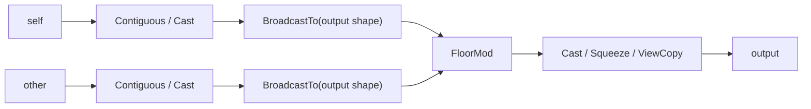
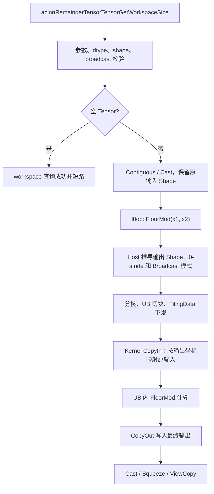
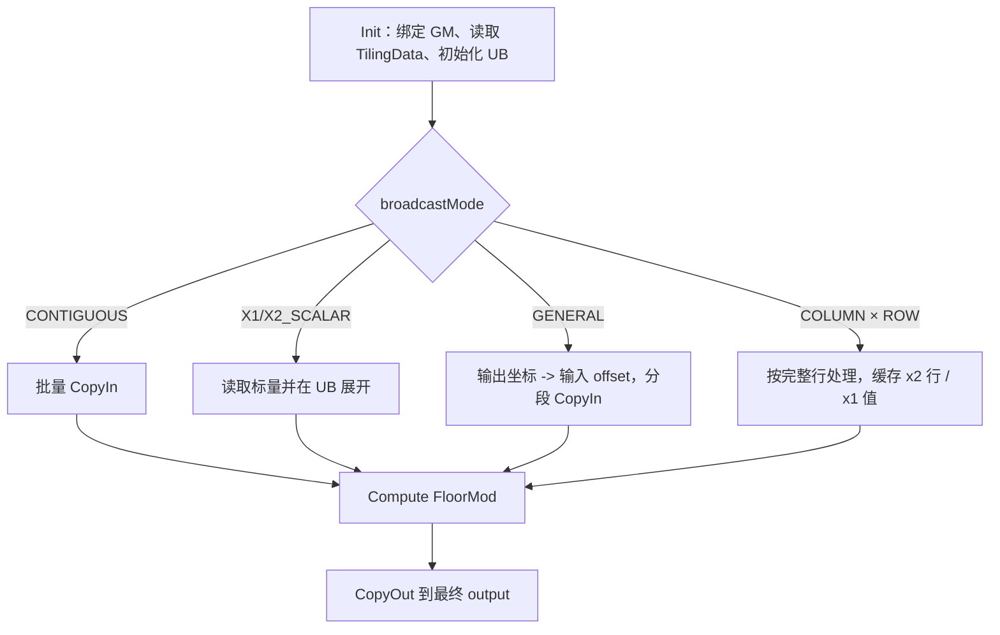

# aclnnRemainderTensorTensor Broadcast 内存优化设计文档

## 一、需求背景

### 1.1 需求来源

本需求来自 2026 年 7 月 CANN 社区任务
《aclnnRemainderTensorTensor 算子开发任务书》。任务要求消除或优化 aclnn 侧
Broadcast 产生的中间 Tensor，使 NPU 与 GPU 的实际峰值内存差距小于 5%，并保持
`torch.remainder` 语义、计算精度和原有性能。

任务书地址：
[aclnnRemainderTensorTensor_task_doc.md](https://gitcode.com/cann/cann-ops-competitions/blob/master/04_tasks/01_community-task-2026/docs/202607/aclnnRemainderTensorTensor_task_doc.md)。

### 1.2 背景介绍

#### 1.2.1 算子实现优化

`aclnnRemainderTensorTensor` 计算两个 Tensor 的逐元素余数，输入允许 Broadcast。当前公开
实现位于 `ops-math` 仓库 `math/floor_mod` 目录，主要代码位置如下：

| 模块 | 公开源码路径 | 作用 |
| --- | --- | --- |
| aclnn 接口 | `math/floor_mod/op_api/aclnn_remainder.cpp` | 参数校验、类型提升、连续化、Broadcast 和 L0 算子调度 |
| L0 接口 | `math/floor_mod/op_api/floor_mod.cpp`、`floor_mod.h` | 构造并调用 `FloorMod` |
| 算子定义 | `math/floor_mod/op_host/floor_mod_def.cpp` | 输入、输出、dtype 和硬件注册 |
| Shape 推导 | `math/floor_mod/op_host/floor_mod_infershape.cpp` | 推导 Broadcast 后输出 Shape |
| Kernel | `math/floor_mod/op_kernel/` | `FloorMod` Device 侧实现 |

本次开发代码保存在个人 Fork
[`gcw_TlXR6Fyo/ops-math`](https://gitcode.com/gcw_TlXR6Fyo/ops-math) 的
`feat/aclnn-remainder-broadcast-memory` 分支，目标合入目录为
`experimental/math/floor_mod`。

CANN 安装包中的相关基础目录以环境变量表示如下，实际安装根目录由 CANN 环境决定：

| 内容 | 安装路径 |
| --- | --- |
| FloorMod 编译入口 | `${ASCEND_OPP_PATH}/built-in/op_impl/ai_core/tbe/impl/dynamic/floor_mod.py` |
| 算子信息库 | `${ASCEND_OPP_PATH}/built-in/op_impl/ai_core/tbe/config/<soc>/aic-<soc>-ops-info.json` 中的 `FloorMod` 项 |
| Kernel 元数据 | `${ASCEND_OPP_PATH}/built-in/op_impl/ai_core/tbe/kernel/config/<soc>/floor_mod.json` |
| op_api 库及头文件 | `${ASCEND_OPP_PATH}/built-in/op_impl/ai_core/tbe/op_api` |

本任务修改公开的 aclnn 组合逻辑，并为 Atlas A2/A3 增加可直接处理 Broadcast 输入的
Ascend C `FloorMod` 路径。原有 DOUBLE 计算后端保持不变。设计评审以公开仓库源码和任务书描述
为基线，不依赖未公开的 TBE 内部实现。

#### 1.2.2 原实现现状分析

##### 1.2.2.1 支持能力

| 参数 | 含义 | 数据类型 | 格式 | Shape |
| --- | --- | --- | --- | --- |
| `self` | 被除数 Tensor | INT32、INT64、FLOAT16、FLOAT、DOUBLE、BFLOAT16 | ND | 0 至 8 维 |
| `other` | 除数 Tensor | 与 `self` 可进行类型提升的目标类型 | ND | 与 `self` 可 Broadcast |
| `output` | 余数结果 | 与类型提升和输出约束一致 | ND | Broadcast 后 Shape |

数学定义为：

$$
output = self - \left\lfloor\frac{self}{other}\right\rfloor \times other
$$

非零余数与 `other` 同号。

##### 1.2.2.2 原执行链路

Atlas A2/A3 的原 Tensor-Tensor aclnn 组合逻辑执行以下步骤：

1. 检查空指针、dtype、rank、输出 Shape 和 Broadcast 合法性；
2. 对 `self`、`other` 执行 `Contiguous` 和必要的 `Cast`；
3. 分别调用 `BroadcastTo`，把两个输入物化为输出 Shape；
4. 把两个等 Shape Tensor 传给 `FloorMod`；
5. 对结果执行必要的 `Cast`、`Squeeze` 和 `ViewCopy`。



`BroadcastTo` 结果是 Device 中间 Tensor。设输出元素数为 `N`，元素字节数为 `S`，两个输入
都需要展开时，额外中间内存为：

$$
M_{broadcast}=2NS
$$

以 `[R, 1] % [1, C] -> [R, C]` 为例，两个输入都被扩展到 `R × C`。GPU 逐元素 Kernel
通过 stride 映射读取原输入，不生成这两个中间 Tensor。实测 `[2048,1] % [1,2048]` 时，
原版 NPU 的 peak allocated delta 约为 GPU 的 3 倍。

Broadcast 完成后，后端接收到两个等 Shape、连续存储的 Tensor，按一维元素区间分核和切块：

1. 从 GM 把 `x1`、`x2` 当前块搬入 UB；
2. 浮点类型计算 `x1 - floor(x1 / x2) × x2` 并修正符号；
3. 整数类型计算余数并使非零结果符号与 `x2` 一致；
4. 把结果从 UB 搬回 GM。


该后端只负责给定输入上的 FloorMod 计算。峰值内存问题发生在它之前的 aclnn Broadcast
组合阶段，因此优化需要同时调整 op_api 调度和 A2/A3 Kernel 的输入寻址方式。

##### 1.2.2.3 原实现问题

| 问题 | 影响 |
| --- | --- |
| 两个 Broadcast 结果写入 GM | 峰值内存随输出规模增加 `2NS` |
| Broadcast 与 FloorMod 分为多个 Device 阶段 | 增加 Kernel 调度和 GM 搬运 |
| FloorMod 只接收物化后的等 Shape 输入 | 无法利用原输入的重复结构 |
| 交叉 Broadcast 重复读取相同的行或列 | 大 Shape 下访存量增加 |

问题集中在组合链路中的 Broadcast 落盘，不需要改变公开 API 原型。

## 二、需求分析

### 2.1 外部组件依赖

| 组件 | 用途 | 变更情况 |
| --- | --- | --- |
| ACLNN/op_api 执行器 | 参数校验、Tensor 连续化、类型转换和算子调度 | 修改 Tensor-Tensor 调度路径 |
| Ascend C | A2/A3 `FloorMod` Kernel 实现 | 增加不落盘 Broadcast 读取 |
| CANN Runtime/ACL | Workspace 管理、Kernel 下发和同步 | 接口不变 |
| PyTorch | NPU/GPU 语义、精度和内存对照 | 仅用于测试 |
| AscendOpTest | 默认阈值精度验证 | 仅用于测试 |

### 2.2 内部适配模块

| 模块 | 设计内容 |
| --- | --- |
| `op_api/aclnn_remainder.cpp` | A2/A3 目标 dtype 直接把原 Shape Tensor 传给 `FloorMod` |
| `op_host/floor_mod_infershape.cpp` | 输出 Shape 按标准 Broadcast 规则推导 |
| `op_host/floor_mod_tiling.cpp` | Shape 对齐、维度压缩、stride、模式、分核和 UB 切块 |
| `op_kernel/floor_mod_tiling_data.h` | 保存输出 Shape、两个输入 stride 和 Broadcast 模式 |
| `op_kernel/floor_mod_tiling_key.h` | 使用模板宏生成 dtype TilingKey |
| `op_kernel/floor_mod.h` | 连续、标量、通用 Broadcast 和行列交叉快路径 |
| `tests/ut`、`tests/st` | Host Tiling、精度、边界、性能和 NPU/GPU 内存验证 |

### 2.3 需求模块设计

#### 2.3.1 ACLNN 原型

```cpp
aclnnStatus aclnnRemainderTensorTensorGetWorkspaceSize(
    const aclTensor* self,
    const aclTensor* other,
    aclTensor* out,
    uint64_t* workspaceSize,
    aclOpExecutor** executor);

aclnnStatus aclnnRemainderTensorTensor(
    void* workspace,
    uint64_t workspaceSize,
    aclOpExecutor* executor,
    aclrtStream stream);
```

API 原型、参数顺序和两段式调用方式不变。

#### 2.3.2 功能要求

1. 支持 INT32、INT64、FLOAT16、FLOAT、DOUBLE、BFLOAT16；
2. 支持两个 Tensor 输入和 NumPy/PyTorch Broadcast；
3. 保持 `torch.remainder` 的向下取整及余数符号语义；
4. 不物化完整 Broadcast 中间 Tensor；
5. NPU 与 NVIDIA GPU 的实际峰值内存差距小于 5%；
6. AscendOpTest 默认阈值通过，性能不低于原实现。

#### 2.3.3 设计边界

- 目标硬件为 Atlas A2/A3 训练系列产品；
- 输入和输出格式为 ND；
- Broadcast 后 rank 不超过 8；
- 非连续 Tensor 在 op_api 侧先执行 `Contiguous`；
- 空 Tensor 在 op_api 侧短路；
- DOUBLE 沿用原计算后端，只移除前置 Broadcast 物化；
- 其他 SoC 保留原有组合路径。

## 三、需求详细设计

### 3.1 使能方式

用户继续调用原有 `aclnnRemainderTensorTensorGetWorkspaceSize` 和
`aclnnRemainderTensorTensor`，无需增加属性或环境变量。

op_api 根据 SoC 和目标 dtype 判断执行路径：

| 条件 | 路径 |
| --- | --- |
| Atlas A2/A3，六种任务 dtype | 输入连续化及类型转换后直接调用支持 Broadcast 的 `FloorMod` |
| RegBase 且非 DOUBLE | 沿用 RegBase 原生 Broadcast 能力 |
| 其他 SoC | 保留原 `BroadcastTensor + FloorMod` 组合路径 |

部署使用 CANN 标准 vendor/OPP 加载机制。测试中验证了默认 vendor 加载，并对 CANN 8.5.2
同名系统 `FloorMod` 与自定义算子加载进行了隔离。

### 3.2 需求总体设计



### 3.2.1 Host 侧设计

#### 3.2.1.1 Shape 推导与维度对齐

Host 从尾维向前对齐两个输入 Shape。每一维满足以下任一条件：

- 两维相等，输出维取该值；
- `x1` 维为 1，输出维取 `x2`；
- `x2` 维为 1，输出维取 `x1`；
- 其他组合返回 `GRAPH_FAILED` 并记录错误日志。

输出 StorageShape 必须等于推导出的 Broadcast Shape。空维按照现有空 Tensor 语义处理。

#### 3.2.1.2 Stride 与维度压缩

Host 先计算连续输入的原始 stride。某输入维为 1 且输出维大于 1 时，该维 stride 设为 0：

$$
stride_{input,d} =
\begin{cases}
0,& inputDim_d=1\land outputDim_d>1\\
\prod_{k=d+1}^{rank-1}inputDim_k,& otherwise
\end{cases}
$$

相邻维度的 Broadcast 状态相同时合并，输出维为 1 的冗余维也被消除。维度压缩降低 Kernel
坐标恢复和地址计算次数，压缩后的 rank 仍不超过 8。

#### 3.2.1.3 Broadcast 模式

| 模式 | 条件 | Device 行为 |
| --- | --- | --- |
| `CONTIGUOUS` | 两输入元素数都等于输出元素数 | 保留原批量 `DataCopy` 路径 |
| `X1_SCALAR` | `x1` 仅一个元素 | 每个 tile 读取一次并在 UB 展开 |
| `X2_SCALAR` | `x2` 仅一个元素 | 每个 tile 读取一次并在 UB 展开 |
| `X1_COLUMN_X2_ROW` | 压缩后为 `[R,1] % [1,C]`，`R>1`、`C>=1024` | 完整输出行切块，缓存不变量 |
| `GENERAL` | 其他合法 Broadcast | 按输出坐标和 0-stride 分段搬入 |

#### 3.2.1.4 分核策略

设输出元素数为 `N`，AIV 核数为 `Cores`：

$$
blockDim=\min\left(\left\lceil\frac{N}{1024}\right\rceil,Cores\right)
$$

`blockDim` 最小为 1。一般路径按 64 元素对齐分配每核数据，未均分部分由尾核参数描述。
`[R,1] % [1,C]` 快路径采用：

$$
blockDim=\min(R,Cores)
$$

第 `coreId` 个核处理 `coreId + k × blockDim` 行，使完整行均匀分布在所有已启用核心上。

#### 3.2.1.5 数据分块和内存优化策略

Host 通过平台接口获取 AIV 核数、UB 容量和 UB BlockSize，不硬编码 32 B：

- `PlatformAscendC::GetCoreNumAiv()` 获取核心数；
- `GetCoreMemSize(CoreMemType::UB, ubSize)` 获取 UB 容量；
- `Ops::Base::GetUbBlockSize(context)` 获取 UB BlockSize。

UB 可用空间按下式计算并向量对齐：

$$
usableUb=
alignDown\left(
\frac{ubSize-reservedSize-sizeof(TilingData)}{bufferDivider},
64
\right)
$$

`bufferDivider` 根据 dtype 所需输入队列、输出队列和临时计算 Buffer 数量设置。Kernel 只使用
UB 队列和本地 Buffer，不访问 GM workspace，因此 `workspaces[0] = 0`。

#### 3.2.1.6 TilingKey 规划

Broadcast 模式通过 `TilingData.broadcastMode` 下发，不额外为每种模式生成 Kernel 二进制。
TilingKey 只描述输入输出 dtype 组合，并通过 `GET_TPL_TILING_KEY` 和 Kernel 侧模板宏注册：

| dtype | 模板值 |
| --- | --- |
| FLOAT16 | `FLOOR_MOD_TPL_FP16` |
| BFLOAT16 | `FLOOR_MOD_TPL_BF16` |
| FLOAT | `FLOOR_MOD_TPL_FP32` |
| INT32 | `FLOOR_MOD_TPL_INT32` |
| INT64 | `FLOOR_MOD_TPL_INT64` |

该设计避免按 Broadcast 模式复制二进制。

### 3.2.2 Kernel 侧设计

#### 3.2.2.1 Kernel 执行流程



每个输出元素的输入地址由下式确定：

$$
inputOffset=\sum_{d=0}^{rank-1}coord_d\times inputStride_d
$$

Broadcast 维的 stride 为 0。尾维 stride 为 1 时批量搬运，stride 为 0 时读取一个元素并在 UB
展开；其他场景按连续 segment 切分。Kernel 不创建 GM Broadcast Tensor。

#### 3.2.2.2 行列交叉 Broadcast 快路径

核心验收形状 `[R,1] % [1,C]` 具有以下复用关系：

- 同一输出行的 `x1` 值不变；
- `x2` 行对所有输出行相同；
- 输出行在 GM 中连续。

快路径以完整输出行为工作单元。每个核缓存 `x2` 行或当前分块，并只读取一次对应的 `x1`
元素，在 UB 内完成展开和计算，避免跨行坐标恢复及按输出元素重复访问 GM。

#### 3.2.2.3 数据类型计算

- FLOAT16、BFLOAT16：转换为 FP32 计算，完成 FloorMod 和符号修正后转换回原类型；
- FLOAT：直接使用 FP32 向量计算；
- INT32：普通范围使用向量计算，极值行使用高精度路径；纯 INT32 符号修正保证非零余数
  与除数同号，并把 `r == divisor` 的舍入边界归一化为 0；
- INT64：FP32 可精确表示的普通范围使用向量路径，超出精确范围时使用 64 位整数标量取模；
  无符号绝对值处理兼容 `INT64_MIN`；
- DOUBLE：沿用原 TF-AICPU 计算后端，op_api 不再预先生成完整 Broadcast Tensor。

整数除数为 0 的位置保持现有 NPU 行为，结果恢复为被除数。

#### 3.2.2.4 Ascend C 与原执行链路差异

| 项目 | 原执行链路 | 优化执行链路 |
| --- | --- | --- |
| Broadcast | aclnn 调用两次 `BroadcastTo` 并写入 GM | Host 计算 stride，Kernel 在 UB 内按 tile 展开 |
| FloorMod 输入 | 两个输出大小的等 Shape Tensor | 原 Shape Tensor |
| 中间内存 | 最多 `2NS` | 0 |
| Kernel workspace | 原路径存在平台或模板预留 | FloorMod GM workspace 为 0 |
| 连续输入 | 物化后进入通用连续计算 | 保留原连续快速路径 |
| 交叉 Broadcast | 每个输入先完整展开 | 完整行切块并复用行、列数据 |

差异仅涉及 Broadcast 数据获取方式，数学公式、API 原型和输出布局保持不变。

### 3.2.3 op_api 设计

Atlas A2/A3 的目标 dtype 执行以下流程：

1. 参数校验及 Broadcast 输出 Shape 校验；
2. `self`、`other` 分别执行 `Contiguous`；
3. 按 `PromoteType` 执行必要的 `Cast`；
4. 原 Shape Tensor 直接传给 `l0op::FloorMod`；
5. `FloorMod` 输出执行必要的 `Cast`、0 维 `Squeeze` 和 `ViewCopy`。

非 A2/A3 SoC 继续使用原组合逻辑。RegBase 分支保留已有能力。

### 3.3 内存设计与实测

设输出元素数为 `N`，元素字节数为 `S`：

| 内存项 | 原实现 | 优化实现 | GPU 对照 |
| --- | ---: | ---: | ---: |
| 输入 | 原 Shape | 原 Shape | 原 Shape |
| 输出 | `NS` | `NS` | `NS` |
| Broadcast 中间 Tensor | `2NS` | `0` | `0` |
| FloorMod GM workspace | 平台相关 | `0` | `0` |
| framework allocator 对齐 | 平台相关 | 512 至 1536 B | 0 B（A100 allocated 口径） |

内存测试在输入常驻后重置 framework allocator peak，执行 `remainder` 并同步，记录：

$$
peakDelta=maxMemoryAllocated-inputBaseline
$$

主验收差距为：

$$
gap=\frac{|peakDelta_{NPU}-peakDelta_{GPU}|}{peakDelta_{GPU}}\times100\%
$$

`[2048,1] % [1,2048]` 的六种 dtype 实测结果如下。Atlas A2/A3 与 CANN 8.5.2/9.0.0
四种组合得到相同的内存结论。

| dtype | NVIDIA A100 peak Δ (B) | 原版 NPU peak Δ (B) | 优化 NPU peak Δ (B) | 优化差距 |
| --- | ---: | ---: | ---: | ---: |
| FLOAT16 | 8,388,608 | 25,167,872 | 8,390,144 | 0.018311% |
| BFLOAT16 | 8,388,608 | 25,167,872 | 8,390,144 | 0.018311% |
| FLOAT | 16,777,216 | 50,333,696 | 16,778,752 | 0.009155% |
| DOUBLE | 33,554,432 | 100,665,344 | 33,554,944 | 0.001526% |
| INT32 | 16,777,216 | 50,333,696 | 16,778,752 | 0.009155% |
| INT64 | 33,554,432 | 100,665,344 | 33,555,968 | 0.004578% |

最大差距为 0.018311%，满足小于 5% 的验收要求。

### 3.4 支持硬件

| 硬件 | CANN 8.5.2 | CANN 9.0.0 |
| --- | --- | --- |
| Atlas A2 / Ascend910B3 | 已验证 | 已验证 |
| Atlas A3 / Ascend910_9362 | 已验证 | 已验证 |

任务要求的支持范围为 CANN 8.5.0 及以上、Atlas A2/A3 训练系列产品。

### 3.5 算子约束限制

- 输入格式为 ND；
- Broadcast 后 rank 不超过 8；
- 两个输入必须可按标准 Broadcast 规则推导输出 Shape；
- 输出 Shape 必须与推导结果一致；
- AICore 路径支持 FLOAT16、BFLOAT16、FLOAT、INT32、INT64；
- DOUBLE 沿用原 TF-AICPU 后端；
- 整数除数为 0 时保持现有 NPU 接口行为。

## 四、特性交叉分析

| 相关特性 | 影响分析 | 验证 |
| --- | --- | --- |
| 无 Broadcast | 继续使用 `CONTIGUOUS` 快路径 | Host UT、ST |
| Scalar Broadcast | 使用 `X1_SCALAR` 或 `X2_SCALAR` | Host UT、0 维标量 ST |
| 一般多维 Broadcast | 使用压缩 Shape 和 0-stride 映射 | 8 维和混合轴用例 |
| 非连续 Tensor | op_api 先执行 `Contiguous`，Kernel 仅接收连续存储 | 非连续输入/输出与 padding 用例 |
| 空 Tensor | op_api 直接短路，不启动 Kernel | 空 Tensor 用例 |
| dtype promotion | 继续使用原 `PromoteType` 和 `Cast` 规则 | 六种 dtype 和 API UT |
| Inplace Tensor-Tensor | 与非 inplace 接口共用执行函数，保持输出 Shape 约束 | op_api UT |
| Tensor-Scalar/Scalar-Tensor | 公共文件不改变其 API 原型和参数校验 | 原有回归用例 |
| 其他 SoC | 保留原 Broadcast 组合分支 | 条件分支静态检查 |
| 同名系统 OPP | 使用标准 vendor 加载；8.5 测试隔离系统和自定义 FloorMod | A2/A3 加载验证 |

## 五、可维可测分析

### 5.1 精度、性能和内存标准

| 验收项 | 标准 | 来源 |
| --- | --- | --- |
| 精度 | 与 `torch.remainder`/host golden 语义一致，AscendOpTest 默认阈值通过 | 任务书 |
| 性能 | 同输入、同 dtype 下不低于原实现 | 任务书 |
| 内存 | 优化 NPU 与 GPU 实际峰值差距小于 5% | 任务书 |
| 功能 | 支持两个 Tensor 输入及 Broadcast，不影响原接口行为 | 任务书 |

### 5.2 测试覆盖

| 测试类别 | 覆盖内容 | 四种 NPU 环境结果 |
| --- | --- | --- |
| Host Tiling UT | 连续、两种 scalar、一般 Broadcast、8 维、行列快路径、空 Shape、非法 shape/rank/dtype | 12/12 PASS |
| AscendOpTest | 14 个 Tensor-Tensor 用例，未设置自定义误差阈值 | 14/14 PASS，42 行结果完整 |
| 六 dtype 精度 | FLOAT16、BFLOAT16、FLOAT、DOUBLE、INT32、INT64 | mismatch 0 |
| 边界 | 非连续、padding、空 Tensor、0 维标量、非 32 B 尾块 | PASS |
| 内存 | `[2048,1] % [1,2048]` 与 NVIDIA A100 对照 | 最大差距 0.018311% |
| 构建与加载 | clean package build、默认 vendor 加载和同名算子隔离 | PASS |

NPU 验证矩阵：

- Atlas A2 / CANN 8.5.2；
- Atlas A3 / CANN 8.5.2；
- Atlas A2 / CANN 9.0.0；
- Atlas A3 / CANN 9.0.0。

GPU 对照环境为 NVIDIA A100-PCIE-40GB、PyTorch 2.5.1、CUDA 12.4。

### 5.3 性能结果

性能使用 stream event 统计 Device 时间。常规用例预热 10 次、执行 50 次，以中位数作为主要
对比值；存在跨进程波动的 DOUBLE 使用五轮独立复测。四种环境的六种 dtype 均无回退：

| 环境 | 最小提升 | 最大提升 | 结论 |
| --- | ---: | ---: | --- |
| Atlas A2 / CANN 8.5.2 | 3.367%（INT32） | 96.278%（INT64） | PASS |
| Atlas A3 / CANN 8.5.2 | 5.503%（INT32） | 96.968%（INT64） | PASS |
| Atlas A2 / CANN 9.0.0 | 2.471%（INT32） | 96.543%（INT64） | PASS |
| Atlas A3 / CANN 9.0.0 | 5.158%（INT32） | 96.957%（INT64） | PASS |

完整逐 dtype 数据和测试证据保存在个人代码仓
`experimental/math/floor_mod/tests/st/REPORT.md`。

### 5.4 兼容性分析

- API 原型、输入输出约束和调用方式保持不变；
- 无 Broadcast 时继续走原连续路径；
- 非 A2/A3 SoC 保留原 op_api 分支；
- DOUBLE 计算后端不变；
- CANN 8.5 与 9.0 的头文件布局差异使用条件编译适配；
- A2/A3、CANN 8.5.2/9.0.0 四种组合均完成同一功能代码验证；
- 失败路径包含明确日志，空指针、非法 shape、非法 dtype 和平台资源异常会返回失败状态。

### 5.5 可维护性

- Broadcast 规则、模式常量和 TilingData 集中定义；
- Host 函数分别负责 Shape 对齐、stride、压缩、模式和公共 Tiling；
- Kernel 的连续、标量、通用和行列快路径使用同一计算与 CopyOut 流程；
- UB BlockSize、核心数和 UB 容量均通过平台接口获取；
- 测试脚本输出 JSON/CSV/Markdown，内存、精度和性能结果可重复核验。

## 六、风险与规避

| 风险 | 规避措施 |
| --- | --- |
| 多维 Broadcast 地址映射错误 | Host 压缩前后均保留可验证 stride，覆盖 8 维混合轴 UT/ST |
| INT32/INT64 通过 FP32 计算造成极值精度损失 | 精确范围检测，极值回退高精度整数路径 |
| 行列快路径分块跨行 | Host 强制完整行切块，Kernel 以行号分配工作 |
| 非连续输出覆盖 padding | op_api `ViewCopy`，专项检查逻辑值和 padding |
| CANN 8.5/9.0 加载同名算子差异 | 标准 vendor 加载及同名 OPP 隔离验证 |
| 性能测量受主机调度影响 | Device stream event、预热、中位数和多轮复测 |

## 七、修订记录

| 版本 | 日期 | 内容 | 作者 |
| --- | --- | --- | --- |
| v1.0 | 2026-07-26 | 完成 Broadcast 不落盘方案、内存分析和四环境验证 | jbbryant |
| v1.1 | 2026-07-27 | 按设计文档 CheckList 补充原执行链路、依赖、流程图、特性交叉和可维可测分析 | jbbryant |
