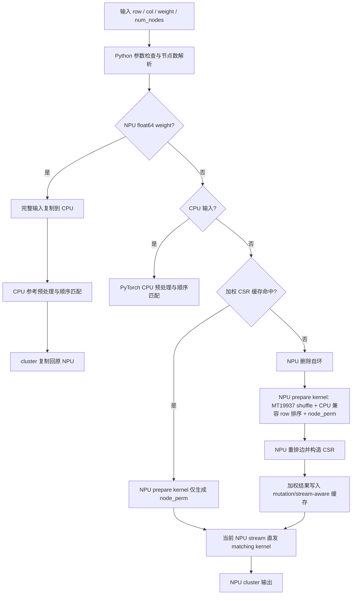
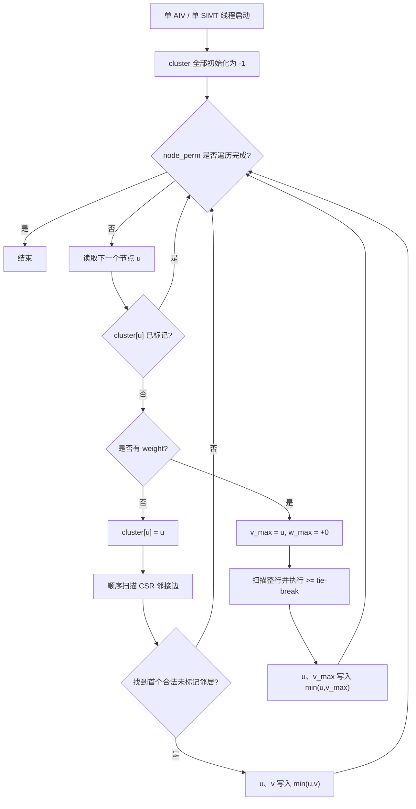

# GraclusCluster 算子设计文档

本文档对应 [2026 年 8 月社区任务 graclus_cluster 算子开发任务书](../../../docs/202608/graclus_cluster_task_doc.md)，并按照[算子设计文档模板](../../../resources/design_template.md)编写。参考实现为 `torch_cluster.graclus_cluster` 1.6.3，目标代码仓为 [cann/ops-gnn](https://gitcode.com/cann/ops-gnn)，对外 API 名为 `graclus_cluster`。

# 需求背景

## 需求来源

`graclus_cluster` 来源于 PyTorch Geometric 生态中的
[`pytorch_cluster`](https://github.com/rusty1s/pytorch_cluster)。社区任务要求在
Ascend 950PR 上提供与 CPU 参考实现接口和随机语义一致的 NPU 版本，验收以
PyTorch 层 `graclus_cluster()` 为准，aclnn 接口不作为必选项。

参考源码包括：

- `torch_cluster/graclus.py`：COO 图预处理和 Python API；
- `csrc/cpu/graclus_cpu.cpp`：顺序贪心参考实现；
- `csrc/cuda/graclus_cuda.cu`：CUDA 设备实现参考；
- 本任务采用的参考代码版本：`1.6.3-24-ge9a855c`。

## 背景介绍

Graclus 是一种图粗化阶段常用的贪心聚类算法。算法按随机节点顺序访问图中尚未
标记的节点，并尝试将当前节点与一个尚未标记的邻居配对。一次匹配最多产生两个
节点的簇，未找到可用邻居的节点独立成簇。

有权图选择最大边权对应的邻居；无权图选择 CSR 邻接表中的第一个可用邻居。
该算法可用于图神经网络池化、层次化图表示和多层图划分的图粗化阶段。

### 参考实现现状分析

参考 Python API 为：

```python
def graclus_cluster(
    row: torch.Tensor,
    col: torch.Tensor,
    weight: Optional[torch.Tensor] = None,
    num_nodes: Optional[int] = None,
) -> torch.Tensor: ...
```

Python 层按以下顺序处理 COO 输入：

1. 未传 `num_nodes` 时，由 `max(row.max(), col.max()) + 1` 推导节点数；
2. 删除 `row == col` 的自环；
3. 无权图通过 `randperm(E)` 随机打乱边；
4. 按 `row` 排序，并由 degree 的前缀和生成 CSR `rowptr`；
5. 调用 native `graclus(rowptr, col, weight)`。

CPU native 实现先生成 `randperm(num_nodes)`，再严格顺序遍历节点。设输出数组
初始值均为 `-1`，节点 `u` 的邻接区间为
`[rowptr[u], rowptr[u + 1])`：

- 无权图：先令 `cluster[u] = u`，再选择第一个 `cluster[v] < 0` 的邻居；
- 有权图：以 `v_max = u, w_max = 0` 初始化，选择满足
  `cluster[v] < 0 and weight[e] >= w_max` 的最后一个最大权重邻居；
- 配对后，`u` 和 `v` 的 cluster ID 均为 `min(u, v)`。

因此参考语义包含以下容易被忽略的边界：

- 最大权重比较采用 `>=`，相同最大权重时选择 CSR 顺序中的最后一个邻居；
- `w_max` 从 0 开始，只有严格负权重的邻居不会被选中；
- 无权图结果依赖边随机排列和相同 `row` 元素的排序次序；
- 任意并行更新都可能改变后续节点看到的已匹配状态。

### 功能定义

设图节点数为 `V`、过滤自环后的边数为 `E'`，输出为
`cluster ∈ Z^V`。每个节点必须满足：

$$
0 \le cluster[u] \le u
$$

每个 cluster ID 最多对应两个节点。若两个不同节点 `u`、`v` 属于同一簇，则
输入图中存在算法选中的邻接边，且：

$$
cluster[u] = cluster[v] = \min(u, v)
$$

# 需求分析

## 需求描述

在 `ops-gnn` 中新增 PyTorch NPU API、Python COO 到 CSR 预处理、NPU Host 调度
和 Ascend C kernel，实现与参考 CPU 版本固定 seed 下逐位一致的
`graclus_cluster`。仅实现前向，并覆盖无权、L1 权重、float64 回退、显式孤立
节点、自环和空边场景。

## 需求拆解

1. 提供与参考实现一致的四参数 Python API，输出 int64 `[num_nodes]`。
2. 在 Python 层编排节点数推导、去自环、无权边打乱、按 row 排序和 CSR 构造；
   NPU 输入的 permutation 生成、边排序和图数据处理均保持在 NPU。
3. 无权路径和 float16、bfloat16、float32 权重路径全程在 NPU 执行，不生成 CPU
   permutation Tensor，也不把图数据复制到 CPU。
4. float64 权重采用完整 CPU 精确回退，输出复制回原 NPU。
5. 固定相同 `torch.manual_seed` 后，NPU 输出与官方 CPU 输出 bit-wise 一致。
6. 正确处理等权 tie-break、负权、正负零、无穷和 NaN。
7. 使用当前 `torch_npu` stream，保证与 Python 预处理和下游算子的依赖关系。
8. 覆盖任务书五档完全图性能形状，速度不低于 A100 标杆的 0.6 倍。

## 外部组件依赖

| 组件 | 用途 |
| --- | --- |
| PyTorch | Python API、COO 预处理、Tensor 和 CPU 回退 |
| torch_npu | NPU Tensor、设备保护和 current stream |
| CANN 9.0.0-beta.2 | Ascend C 编译、runtime 和 kernel launch |
| pytorch_cluster 1.6.3 | CPU 精度标杆，不作为运行时依赖 |

## 设计难点

1. 算法是严格顺序的贪心状态机，节点间存在循环携带依赖，无法直接多核并行而
   保持参考顺序语义。
2. CPU 与 NPU `randperm` 使用不同设备生成器；即使 seed 相同，排列也不保证
   一致。
3. PyTorch 默认 `argsort` 非稳定，CPU 与 NPU 对重复 row 的等值元素可能给出
   不同次序，进而改变无权首邻居和有权 tie-break。
4. Ascend C SIMT 路径需要同时支持 int64 随机访存和三种 L1 权重类型。
5. float16、bfloat16 的比较必须复现 IEEE 特殊值以及参考实现从正零开始比较的
   语义。

# 详细设计

## 算子分析

### 接口与数据类型

| 参数 | 输入/输出 | dtype | shape | 约束 |
| --- | --- | --- | --- | --- |
| `row` | 输入 | int64 | `[E]` | 源节点 COO 索引 |
| `col` | 输入 | int64 | `[E]` | 目标节点 COO 索引，与 row 等长同设备 |
| `weight` | 可选输入 | float16 / bfloat16 / float32 / float64 | `[E]` | 与边一一对应 |
| `num_nodes` | 可选属性 | Python int | 标量 | 非负；默认由最大索引推导 |
| `cluster` | 输出 | int64 | `[num_nodes]` | 设备与 row、col 相同 |

预处理后的 native kernel 输入为：

| 参数 | dtype | shape | 说明 |
| --- | --- | --- | --- |
| `rowptr` | int64 | `[V + 1]` | CSR 行指针 |
| `col` | int64 | `[E']` | 去自环且按 row 排序后的列索引 |
| `weight` | float16 / bfloat16 / float32，可选 | `[E']` | 与 col 同序 |
| `node_perm` | int64 | `[V]` | 随机节点访问顺序 |
| `cluster` | int64 | `[V]` | 输出 |

### 支持形状

- `V >= 0`、`E >= 0`，输入均为一维 Tensor；
- 支持孤立节点、重复边、有向边和非连续 Tensor；
- 输入索引必须满足 `0 <= index < num_nodes`；
- 空边且未传 `num_nodes` 时返回 shape `[0]`；显式传入节点数时，所有节点为自簇。

### 复杂度

预处理的排序复杂度为 `O(E log E)`，CSR 构造为 `O(V + E)`；native 贪心匹配
对每个节点和边至多顺序访问一次，时间复杂度为 `O(V + E)`。prepare kernel 使用
MT19937 状态、排序 key 和固定深度排序栈，连同 edge/node permutation 的 native
额外空间复杂度为 `O(V + E)`。

## 算子实现

### 总体方案

实现分为 Python、NPU Host 和 Ascend C kernel 三层。Python 负责与参考接口一致的
COO 预处理编排；Host 负责输入防御、NPU generator 元数据、当前流和 kernel
直发；prepare kernel 负责 CPU 兼容的 permutation 与排序，matching kernel 负责
顺序贪心状态机。



### Python 层设计

#### 参数检查

Python 层检查：

- row、col 必须为一维 int64 Tensor，元素数和设备一致；
- weight 必须为一维、与边数相同、设备一致，dtype 属于支持集合；
- num_nodes 必须为非 bool 的 Python int 或 None，且解析后非负；
- CPU 输入检查最小和最大索引；NPU 路径为避免性能敏感路径的额外 D2H 同步，
  将索引范围作为调用前置条件，CSR scatter 和 kernel 仍提供必要的越界防护。

#### COO 预处理

1. 通过 `mask = row != col` 同步过滤 row、col 和 weight。
2. NPU 输入调用 `_pybind.graclus_prepare`。prepare kernel 内用 MT19937 和
   Fisher–Yates 生成无权 edge permutation 与 node permutation；有权图的 edge
   permutation 初始化为单位排列。
3. prepare kernel 根据 permutation 后的 row 构造排序 key，并使用与 libstdc++
   `std::sort` 一致的 introsort、heap-sort fallback 和 insertion-sort 收尾，得到与
   CPU 默认非稳定排序一致的最终 edge permutation。
4. Python 使用该 NPU permutation 重排 row、col、weight，并通过 int64 degree、
   `scatter_add_` 和 `cumsum` 在 NPU 生成 rowptr。

CPU 与 NPU 的原生 `randperm` 使用不同 RNG，默认 `argsort` 对重复 key 的次序也
可能不同，因此不能直接替换。设备 prepare kernel 复现 CPU 随机与排序协议，在
保持固定 seed bit-wise 一致的同时，避免 CPU permutation Tensor、D2H 图数据传输
和 H2D permutation 传输。无权路径不会调用 `torch.randperm` 或
`torch.argsort`。

#### 加权 CSR 缓存

有权图不打乱边，其 COO→CSR 结果对相同输入是确定的。Python 层保留一个
device-resident 单项缓存，存储 rowptr、sorted col 和 sorted weight。缓存使用输入
Tensor 的弱引用避免延长生命周期，以 `_version` 检测 row/col/weight 原地修改，
并记录 current NPU stream；输入对象、版本、num_nodes 或 stream 任一变化都会
失效。命中后只运行 prepare kernel 生成本次随机 node permutation，不重复排序和
CSR 构造。

#### CPU 与 float64 路径

CPU 输入直接调用内置顺序参考函数。NPU float64 权重在任何随机化和排序之前将
row、col、weight 完整复制到 CPU，并递归执行相同 Python API，保证预处理、节点
randperm 和 float64 比较均与 CPU 标杆一致，最后把 cluster 复制回原 NPU。

### NPU Host 设计

Host 接口为：

```cpp
std::vector<torch::Tensor> graclus_prepare(
    torch::Tensor row,
    std::int64_t num_nodes,
    bool shuffle_edges);

torch::Tensor graclus(
    torch::Tensor rowptr,
    torch::Tensor col,
    torch::Tensor weight,
    torch::Tensor node_perm);
```

无权场景由 Python 传入同设备空 float32 Tensor 作为 sentinel，避免不同 PyTorch
版本的 pybind 无法把 Python `None` 转换为 `at::Tensor`。

Host 执行步骤：

1. `graclus_prepare` 检查 row 后，在输入 NPU 分配 edge/node permutation 及
   MT19937、排序 key、排序栈 workspace；
2. 从 NPU generator 获取 seed/offset 元数据，在 current stream 直发 prepare
   kernel，返回的两个 permutation Tensor 始终驻留 NPU；
3. `graclus` 检查 rowptr、col、node_perm 设备、dtype、维度和长度，有权时同时
   检查 weight 的 L1 dtype；
4. 使用 `c10_npu::NPUGuard` 切换到输入设备并将 native 输入连续化；
5. 分配 `[V]` int64 cluster；`V == 0` 时直接返回；
6. 将权重映射为 `None/Float32/Float16/BFloat16` 四种 kernel 分支；
7. 通过 `getCurrentNPUStream(...).stream()` 排空 torch_npu 当前流的软件任务队列，
   保证 Python 预处理对直发 kernel 可见；
8. 在同一 stream 上调用 `LaunchGraclusKernel`。

### Ascend C Kernel 设计

#### Prepare kernel

prepare kernel 固定使用单 AIV、单 SIMT 线程，以 CPU seed 初始化 624 个 uint32
MT19937 状态。无权图依次执行 edge Fisher–Yates shuffle，再生成排序 key；有权图
直接使用单位 edge permutation。row 排序复现 libstdc++ 默认 `std::sort` 的
median-of-three introsort、深度耗尽 heap-sort fallback 和阈值 16 的
insertion-sort 收尾。最后继续同一随机流生成 node Fisher–Yates permutation。
排序栈为固定 128 组记录，大于任意正 int64 边数 introsort 深度上限的两倍。

这一 kernel 只读 row，输出 edge_perm 与 node_perm；MT19937 state、sort key 和
sort stack 均为 NPU 临时 workspace，不产生 Host 排列数据或图数据 D2H。

#### 分核策略

贪心匹配的 `cluster` 更新会立即影响后续节点和边的选择。多核同时处理不同节点会
引入写写冲突和时序不确定性，即使使用原子操作也无法保证与 CPU 顺序一致。

因此 kernel 固定启动单个 AIV，并通过 `AscendC::Simt::VF_CALL` 启动一个 SIMT
线程。该线程直接访问 GM 中的 rowptr、col、weight、node_perm 和 cluster，严格
复现参考循环顺序。任务性能 shape 最大仅 64 节点、4032 条边，实测单线程方案在
计入全部 Python 预处理后仍满足 0.6 倍标杆要求。

#### 无权路径

对每个 `u = node_perm[order]`：

1. 若 `cluster[u] >= 0`，跳过；
2. 先设置 `cluster[u] = u`；
3. 从 `rowptr[u]` 到 `rowptr[u + 1]` 顺序扫描；
4. 遇到第一个合法且未匹配的 v，令两个输出均为 `min(u, v)` 并结束当前行。

#### 有权路径

对每个未匹配 u，初始化 `v_max = u, w_max = +0`，完整扫描邻接行。候选 v 必须
合法且未匹配；当 `weight[e] >= w_max` 时同时更新 v_max 和 w_max。扫描完成后，
u 与 v_max 写入相同 cluster ID；没有非负候选时 v_max 保持 u。

#### float16 与 bfloat16 比较

SIMT kernel 将 16-bit 权重按 `uint16_t` 读取，并分别使用 FP16/BF16 指数和尾数
掩码判断 NaN。比较规则为：

- NaN 候选永不满足 `>=`；
- 除 `-0` 外的负数不可能大于等于初始 `+0`，直接排除；
- `-0` 归一化为 `+0` 后参与 tie-break；
- 非负 FP16/BF16 的无符号位表示与数值顺序一致，可直接比较；
- 正无穷按最大值处理。

该策略避免 Ascend C 设备端缺少对应半精度标量比较转换时引入精度差异，并已对
两种格式全部 65536 个 16-bit 表示进行穷举验证。

#### Kernel 流程



### 数据布局与内存规划

所有 native Tensor 保持 ND 一维连续布局：

| Buffer | 位置 | 大小 |
| --- | --- | ---: |
| rowptr | GM | `(V + 1) * 8` bytes |
| col | GM | `E' * 8` bytes |
| weight | GM，可选 | `E' * sizeof(weight)` |
| edge_perm | GM | `E' * 8` bytes |
| node_perm | GM | `V * 8` bytes |
| prepare workspace | GM | `(312 + E' + 384) * 8` bytes |
| cluster | GM | `V * 8` bytes |

matching kernel 不申请 workspace，也不需要 UB tiling 或多级队列。prepare
workspace 由 PyTorch NPU allocator 管理。单线程随机访问直接反映算法的 CSR
遍历方式，避免为了小图搬运整图而增加固定开销。

### 组件组织

| 文件 | 职责 |
| --- | --- |
| `python/ops_gnn/graclus.py` | Python API、预处理、CPU 参考和 float64 回退 |
| `csrc/npu/host/graclus/graclus.h/.cpp` | Host 校验、generator、stream 和 launch |
| `csrc/npu/kernel/graclus/graclus_kernel.h/.cpp` | prepare 与 matching Ascend C SIMT kernel |
| `csrc/pybind.cpp` | `_pybind.graclus_prepare`、`_pybind.graclus` 导出 |
| `test/test_graclus.py` | 功能、精度、边界、布局和 stream 测试 |
| `test/test_graclus_performance.py` | 五档完全图公开 API 性能测试 |
| `test/ascend_op_test/` | AscendOpTest IR、vector、公开 API runner 和复现说明 |
| `test/GRACLUS_TESTING.md` | 可复现自测说明和结果 |

## 支持硬件

| 芯片 | NPU Arch | 支持 |
| --- | --- | --- |
| Ascend 950PR | dav-3510 | √ |

实测环境如下：

| 组件 | 版本 |
| --- | --- |
| NPU | Ascend950PR_9579 |
| CANN | 9.0.0-beta.2 |
| PyTorch | 2.7.1+cpu |
| torch_npu | 2.7.1.post8 |
| CPU 标杆 | torch_cluster 1.6.3 |

## 算子约束限制

1. 仅支持 CPU 和 NPU Tensor，不支持 CUDA、MPS 等其他设备。
2. row、col 必须为 int64 一维 Tensor，且位于同一设备。
3. weight 必须与边一一对应，且位于相同设备。
4. NPU 原生路径支持 float16、bfloat16、float32；float64 为 CPU 回退。
5. 输入索引合法性属于调用前置条件；非法索引不定义参考聚类语义。
6. 仅支持前向，不提供 backward。
7. 固定 seed 的逐位一致性以 `torch.manual_seed(seed)` 为准。

# 可维可测分析

## 精度标准

cluster 为 int64 离散结果，不能采用浮点误差阈值。固定相同 seed 后要求 NPU 与
官方 CPU `torch_cluster.graclus_cluster` 输出逐元素完全相等。

功能测试覆盖：

| 编号 | 场景 | 判定 |
| --- | --- | --- |
| TC-01 | 小图无 weight | 聚类合法且与固定 seed CPU 一致 |
| TC-02 | FP16/BF16/FP32 weight | 最大权重选择和 cluster 一致 |
| TC-03 | 显式 num_nodes | 孤立节点为自簇 |
| TC-04 | 包含自环 | 自环删除后结果一致 |
| TC-05 | float64 | CPU 回退结果逐位一致、输出回原 NPU |
| TC-06 | 空边 | 空输出或显式孤立节点输出正确 |

扩展测试包括：

- 100 个随机图，覆盖无权、FP16、BF16、FP32 共 400 组官方 CPU 差分；
- 重复边、重复 row、同权 tie-break、自环、孤立点和有向边；
- `-Inf`、负数、`-0`、`+0`、`+Inf`、NaN；
- 非连续输入、非默认 NPU stream；
- 禁止 NPU 输入 `.cpu()` 以及 `torch.randperm`、`torch.argsort` 的全程 NPU 回归；
- 加权 CSR 缓存命中及输入原地修改后的失效回归；
- 88 组 prepare edge/node permutation 与 CPU 逐元素差分；
- 1024 节点、30000 条边压力场景；
- FP16/BF16 全部 16-bit 表示的比较规则穷举验证。

实测功能、精度、边界和 stream 用例为 `28 passed`，400 组官方 CPU 随机差分
全部 bit-wise 一致。AscendOpTest 通过公开 `ops_gnn.graclus_cluster()` 获取 NPU
actual、通过 `torch_cluster.graclus_cluster` 1.6.3 获取 CPU golden，并使用官方
`compare/data_compare.py` 对 int64 输出作 `[0.0, 0.0]` 零容差比较；覆盖
TC-01～TC-06 和 FP16/BF16/FP32/FP64 的 8 个 vector 全部通过（`8/8 passed`）。

## 性能标准

性能使用任务书给出的 A100 耗时作为标杆。速度比例定义为：

$$
SpeedRatio = \frac{T_{A100}}{T_{Ascend950PR}}
$$

验收要求 `SpeedRatio >= 0.6`。测试构造权重全 1 的完全图，调用公开 Python API
且不显式传入 `num_nodes`，因此计时包含节点数推导、Python 预处理、Host 调度、
kernel 和一次显式同步。每档预热 10 次、采样 100 次并取中位数。

| V | E | A100 标杆 (ms) | Ascend 950PR (ms) | SpeedRatio |
| ---: | ---: | ---: | ---: | ---: |
| 4 | 12 | 0.400 | 0.200651 | 1.994x |
| 8 | 56 | 0.507 | 0.314427 | 1.612x |
| 16 | 240 | 0.705 | 0.442509 | 1.593x |
| 32 | 992 | 1.234 | 0.613330 | 2.012x |
| 64 | 4032 | 2.825 | 0.954202 | 2.961x |

五档均满足 0.6 倍性能要求。加权完全图重复调用命中 device-resident CSR 缓存，
小图延迟主要来自 Python 调度、node permutation prepare 和 matching kernel
launch；图规模增大后，固定成本被更多边摊薄。

## 可维护性分析

- Python 预处理、Host 和 kernel 分层与参考 `pytorch_cluster` 结构一致；
- 权重类型通过显式枚举分派，新增 dtype 时修改边界清晰；
- CPU 参考函数同时用于 CPU API 和 float64 回退，避免维护两套 L2 语义；
- 加权缓存使用弱引用和 Tensor `_version`，不会延长用户输入生命周期，也不会在
  原地修改或跨 stream 时复用陈旧数据；
- 测试将功能、性能和复现说明分离，性能用例使用 pytest marker，可按需执行；
- CMake 自动发现 torch_npu include 和 `libtorch_npu.so`，避免硬编码 Python 环境路径。

## 兼容性分析

本算子以新增 Python 模块、Host、kernel 和 pybind 导出的方式接入，不改变已有
`add_sample`、`segment_max_csr` API。CPU 输入可直接执行参考路径；NPU float64
通过回退提供 L2 能力。实现依赖 Ascend 950 SIMT 和 torch_npu current stream
接口，不向其他 NPU 架构声明兼容。
