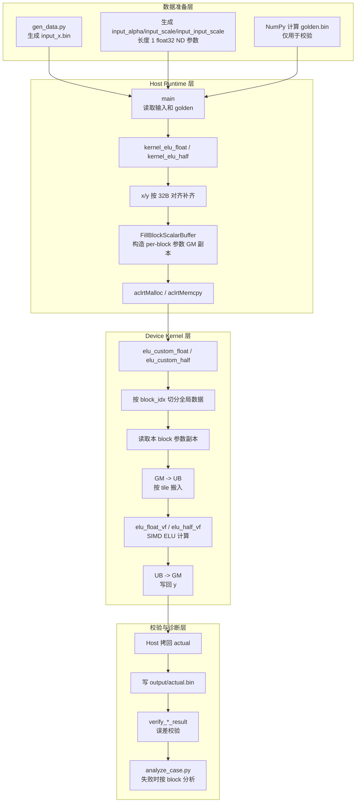
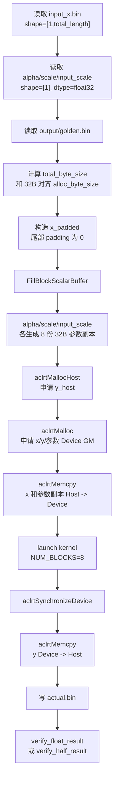
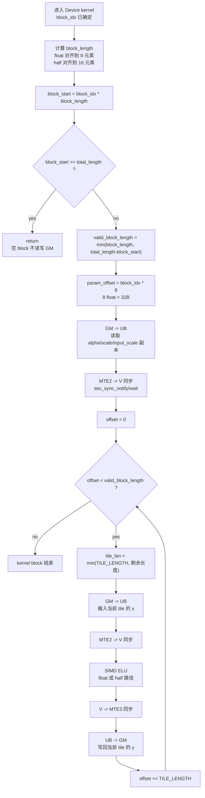
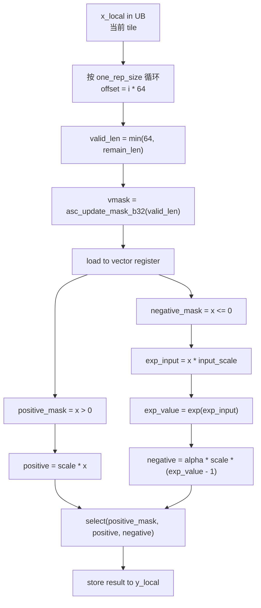
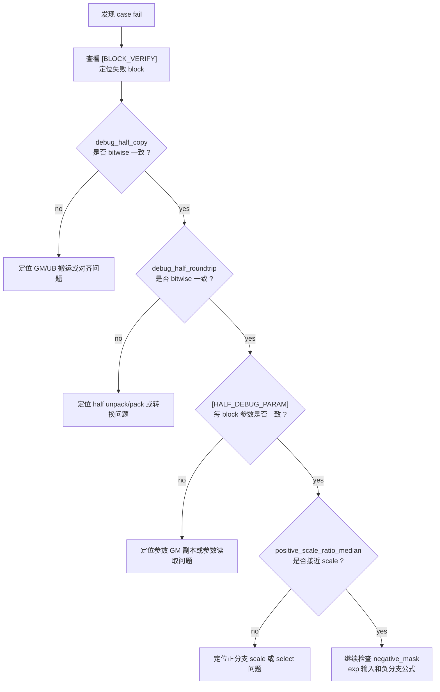

## 一、需求描述

### 1.1 需求来源

本设计文档来源于 CANN 社区任务 2026 年 8 月 ELU 算子开发任务，目标是在 Ascend C C API 示例工程中实现一个可独立编译、运行和自测的 ELU 激活函数算子。

任务文档路径：

```text
cann-ops-competitions/04_tasks/01_community-task-2026/tasklist/08-03-elu/xuli99
```

### 1.2 需求分析

ELU 计算公式如下：

```text
y = scale * x, x > 0
y = alpha * scale * (exp(x * input_scale) - 1), x <= 0
```

输入数据范围为 `[-100, 100]`。默认测试参数为：

```text
alpha = 1.0
scale = 1.0
input_scale = 1.0
```

需求约束如下：

| 约束项 | 要求 | 当前设计 |
| --- | --- | --- |
| 计算核心 | 使用 Vector-Core | `__vector__ __global__` kernel + C API SIMD |
| Cube-Core | 不使用 | 不调用 Cube 相关接口 |
| 输入格式 | ND | 输入文件均按连续 ND 读取 |
| 输出格式 | ND | 输出为连续 `[1, total_length]` |
| dtype | float32、float16 | `SCENARIO_NUM=1/2` |
| shape | 1、32、1024、2048 | `scripts/run_all.sh` 覆盖全部组合 |
| 参数 | `alpha/scale/input_scale` | float32，ND，长度 1 |
| Host 限制 | 不在 Host 逐元素实现 ELU | Host 只负责数据准备、搬运、启动、校验 |
| CANN 版本 | 适配 CANN 9.0.0 | 使用 CANN 9.0.0 可匹配 C API |

任务难点主要有三点：

1. ELU 是分段函数，正半轴只需乘法，负半轴需要 `exp`，需要用 mask 控制分支。
2. float16 路径需要保证精度和 pack/unpack 正确性，当前采用 half 存储、float 计算、half 写回。
3. `alpha/scale/input_scale` 是长度 1 的 ND 输入，CANN 9.0.0 下多个 block 读取同一个极小 GM 参数区时曾出现参数污染，因此当前设计将参数复制成每 block 一份 32B 对齐 GM 副本。

## 二、方案设计

### 2.1 接口内部实现

#### 2.1.1 总体执行流程

整体流程分为四层：数据准备层负责生成 ND 输入和 golden；Host Runtime 层负责内存申请、参数副本构造和 kernel 启动；Device Kernel 层负责 GM/UB 搬运与 SIMD 计算；校验层负责输出回读和误差分析。这样拆分后，可以清楚地区分“数据格式问题”“Host 搬运问题”“Device 计算问题”和“验证脚本问题”。



该图的关键边界是：Host 不做逐元素 ELU，只准备输入、参数副本和 golden；Device kernel 才执行真实算子计算；golden 只用于最后比较。

#### 2.1.2 Host 侧内部流程

Host 侧需要把任务要求的 ND 文件接口转换成 kernel 需要的 GM 布局。`x` 保持连续 ND；`alpha/scale/input_scale` 虽然逻辑长度为 1，但为了避免多个 block 共享同一个极小参数地址，Host 会把每个参数扩展为 `NUM_BLOCKS * 32B` 的副本区。



Host 侧核心函数：

| 函数 | 作用 |
| --- | --- |
| `kernel_elu_float` | float32 场景的 Runtime 封装 |
| `kernel_elu_half` | float16 场景的 Runtime 封装 |
| `FillBlockScalarBuffer` | 将长度 1 参数复制成每 block 一份 32B 对齐副本 |
| `verify_float_result` | float32 精度校验 |
| `verify_half_result` | float16 精度校验和 block 级统计 |

Host 侧不做逐元素 ELU 计算。`gen_data.py` 中的 NumPy ELU 只用于生成 golden，不参与 Device 输出计算。

#### 2.1.3 Kernel 侧内部流程

Kernel 侧每个 block 处理全局 ND 数据中的一段连续区间。每个 block 先读取自己的参数副本，再按 `TILE_LENGTH` 进行 GM 到 UB 的分 tile 搬运和 SIMD 计算。尾块通过 `valid_block_length` 和 mask 控制，避免访问 padding 以外的无效元素。



Kernel 侧核心函数：

| 函数 | 作用 |
| --- | --- |
| `elu_custom_float` | float32 场景 kernel，完成 GM/UB 搬运和 float SIMD 计算调度 |
| `elu_custom_half` | float16 场景 kernel，完成 GM/UB 搬运和 half SIMD 计算调度 |
| `elu_float_vf` | float32 SIMD ELU 计算 |
| `elu_half_vf` | half 解包为 float，完成 ELU，再转回 half |
| `debug_half_copy_kernel` | 检查 half GM->UB->GM 搬运 |
| `debug_half_roundtrip_kernel` | 检查 half->float->half roundtrip |
| `debug_half_param_kernel` | 检查每个 block 读取到的参数副本 |

#### 2.1.4 ELU SIMD 计算流程

SIMD 计算层只处理已经在 UB 中的一个 tile。该层不关心全局 shape，只依赖 `data_len`、`one_rep_size` 和 `repeat_time`，每轮通过 mask 控制有效 lane。



计算设计要点：

1. 正半轴只执行 `scale * x`，不执行 `exp`。
2. 负半轴使用 `negative_mask` 控制 `input_scale` 乘法、`exp`、`exp - 1` 和 `alpha * scale`。
3. 最终使用 `asc_select` 按 mask 合并正负分支。
4. float16 路径在寄存器中转成 float 计算，输出前再转回 half。

#### 2.1.5 float16 数据通路流程

float16 的存储类型是 half，但指数链路使用 float 计算。这样做可以降低 half 直接参与 `exp` 的精度风险，也便于与 float32 路径保持同一套分支和 mask 逻辑。


该流程对应 `elu_half_vf`。如果 half 结果出现符号反转或无穷值，调试顺序为：先看 `debug_half_copy.bin` 排除 GM/UB 搬运，再看 `debug_half_roundtrip.bin` 排除 unpack/pack，再看 `[HALF_DEBUG_PARAM]` 排查参数读取。

#### 2.1.6 调试定位流程

调试流程用于把错误分到输入搬运、half 转换、参数读取、公式计算四类。这样能避免把 `[-100,100]` 输入范围内本不该发生的 `inf/-inf` 误判为正常溢出。



#### 2.1.7 并行切分策略

当前固定：

```cpp
constexpr uint32_t NUM_BLOCKS = 8;
constexpr uint32_t TILE_LENGTH = 256;
constexpr uint32_t GM_ALIGN_BYTES = 32;
```

float32 block 长度：

```text
block_length = align_up(ceil(total_length / 8), 8)
```

float16 block 长度：

```text
block_length = align_up(ceil(total_length / 8), 16)
```

float16 有效 block 示例：

| total_length | block_length | 有效 block |
| --- | --- | --- |
| 1 | 16 | block0 |
| 32 | 16 | block0、block1 |
| 1024 | 128 | block0 到 block7 |
| 2048 | 256 | block0 到 block7 |

该策略保证 half 的 GM 起点满足 32B 对齐，同时不按 length 降低到单 block。空 block 只做边界判断后返回。

#### 2.1.8 内存与参数设计

GM 数据区：

| GM 区域 | 大小 | 说明 |
| --- | --- | --- |
| `x_device` | `AlignUp(total_length * sizeof(T), 32)` | 输入数据 |
| `y_device` | `AlignUp(total_length * sizeof(T), 32)` | 输出数据 |
| `alpha_device` | `NUM_BLOCKS * 32B` | 每 block 一份 alpha 副本 |
| `scale_device` | `NUM_BLOCKS * 32B` | 每 block 一份 scale 副本 |
| `input_scale_device` | `NUM_BLOCKS * 32B` | 每 block 一份 input_scale 副本 |

UB 数据区：

| UB 数组 | 类型 | 大小 | 说明 |
| --- | --- | --- | --- |
| `x_local` | float 或 half | `TILE_LENGTH` | 当前 tile 输入 |
| `y_local` | float 或 half | `TILE_LENGTH` | 当前 tile 输出 |
| `alpha_local` | float | 8 | 当前 block 的 32B 参数副本 |
| `scale_local` | float | 8 | 当前 block 的 32B 参数副本 |
| `input_scale_local` | float | 8 | 当前 block 的 32B 参数副本 |

参数副本设计不改变输入语义。`alpha/scale/input_scale` 仍来自长度 1 ND 文件，只是在 Host 侧扩展为 per-block GM 副本，用于避免多 block 共享极小 GM 参数区时的读取污染。

### 2.2 接口设计

#### Kernel侧接口

float32 kernel：

```cpp
__vector__ __global__ void elu_custom_float(
    __gm__ float* x,
    __gm__ float* y,
    __gm__ float* alpha,
    __gm__ float* scale,
    __gm__ float* input_scale,
    uint32_t total_length);
```

float16 kernel：

```cpp
__vector__ __global__ void elu_custom_half(
    __gm__ half* x,
    __gm__ half* y,
    __gm__ float* alpha,
    __gm__ float* scale,
    __gm__ float* input_scale,
    uint32_t total_length);
```

Kernel 参数说明：

| 参数 | 方向 | 说明 |
| --- | --- | --- |
| `x` | 输入 | ND 连续输入数据 |
| `y` | 输出 | ND 连续输出数据 |
| `alpha` | 输入 | per-block GM 参数副本，逻辑语义来自长度 1 ND 参数 |
| `scale` | 输入 | per-block GM 参数副本，逻辑语义来自长度 1 ND 参数 |
| `input_scale` | 输入 | per-block GM 参数副本，逻辑语义来自长度 1 ND 参数 |
| `total_length` | 输入 | 元素总数 |

#### Host侧接口

Host 侧核心入口：

```cpp
std::vector<float> kernel_elu_float(
    std::vector<float>& x,
    std::vector<float>& alpha,
    std::vector<float>& scale,
    std::vector<float>& input_scale);
```

```cpp
std::vector<half> kernel_elu_half(
    std::vector<half>& x,
    std::vector<float>& alpha,
    std::vector<float>& scale,
    std::vector<float>& input_scale);
```

Host 输入输出文件：

| 文件 | 内容 |
| --- | --- |
| `input/input_x.bin` | 输入 x |
| `input/input_alpha.bin` | 长度 1 ND 参数 alpha |
| `input/input_scale.bin` | 长度 1 ND 参数 scale |
| `input/input_input_scale.bin` | 长度 1 ND 参数 input_scale |
| `output/golden.bin` | NumPy golden |
| `output/actual.bin` | Device kernel 输出 |

Host 侧主要职责：

1. 读取输入和 golden。
2. 按 32B 对齐申请 Host padding buffer。
3. 使用 `FillBlockScalarBuffer` 构造 per-block 参数副本。
4. 申请 Device GM。
5. 拷贝输入、参数副本到 Device。
6. 启动 kernel。
7. 拷回输出并校验。

### 2.3 测试用例设计

#### 2.3.1 功能测试矩阵

`scripts/run_all.sh` 覆盖以下 8 个 case：

| scenario | dtype | length |
| --- | --- | --- |
| 1 | float32 | 1 |
| 1 | float32 | 32 |
| 1 | float32 | 1024 |
| 1 | float32 | 2048 |
| 2 | float16 | 1 |
| 2 | float16 | 32 |
| 2 | float16 | 1024 |
| 2 | float16 | 2048 |

`scripts/run_single.sh`改变超参数，运行一种情形的elu测试。


#### 2.3.2 输入数据设计

`scripts/gen_data.py` 使用固定随机种子生成输入：

```text
rng.uniform(-100, 100, [1, total_length])
```

参数默认：

```text
alpha = 1.0
scale = 1.0
input_scale = 1.0
```

该输入覆盖正半轴、负半轴、极小 shape、非满 8 block shape、满 8 block shape。

#### 2.3.3 Golden 设计

Golden 由 NumPy 在 float32 中计算公式，再 cast 到目标 dtype：

```text
positive = x > 0
y[positive] = scale * x[positive]
y[~positive] = alpha * scale * (exp(x[~positive] * input_scale) - 1)
```

Host 侧 golden 只用于验证，不参与 kernel 输出计算。

#### 2.3.4 调试用例设计

开启：

```bash
ENABLE_HALF_DEBUG=1 bash scripts/run_all.sh
```

额外生成：

| 文件 | 验证内容 |
| --- | --- |
| `debug_half_copy.bin` | half GM->UB->GM 搬运是否 bitwise 一致 |
| `debug_half_roundtrip.bin` | half->float->half 是否 bitwise 一致 |
| `debug_half_params.bin` | 每个 block 读取的参数是否一致 |

`scripts/analyze_case.py` 会输出：

| 字段 | 说明 |
| --- | --- |
| `mismatch_count` | 错误数量 |
| `pos_inf/neg_inf` | 无穷输出数量 |
| `sign_flip` | 有限值符号翻转数量 |
| `positive_scale_ratio_median` | 正分支 `actual / x` 中位数，默认参数应接近 1 |

## 三、可维可测

### 3.1 精度标准/性能标准

#### 3.1.1 精度标准

| dtype | abs_tol | rel_tol |
| --- | --- | --- |
| float32 | `1e-4` | `1e-4` |
| float16 | `1e-3` | `1e-3` |

判定公式：

```text
abs(actual - golden) <= abs_tol + rel_tol * abs(golden)
```

通过标准：

1. 8 个测试 case 均输出 `test pass!`。
2. `scripts/run_all.sh` summary 中 `fail=0`。
3. 开启 half debug 时，`debug_half_copy` 和 `debug_half_roundtrip` 无 bit mismatch。
4. `[HALF_DEBUG_PARAM]` 中每个 block 的 `alpha/scale/input_scale` 与输入参数一致。

#### 3.1.2 性能标准

任务书未给出强制性能指标，当前设计以正确性和 CANN 9.0.0 兼容性优先，同时保留以下性能设计：

1. float32 和 float16 都使用 8 block 并行。
2. 每个 block 内按 `TILE_LENGTH=256` 分 tile，降低 UB 占用。
3. 正半轴通过 mask 跳过 `exp` 链路，减少不必要指数计算。
4. 参数副本只增加 768B GM，占用很小，不影响主要带宽。


### 3.2 兼容性分析

#### 3.2.1 CANN 9.0.0 接口兼容

| 兼容问题 | 处理方式 |
| --- | --- |
| `asc_copy_gm2ub/asc_copy_ub2gm` 不匹配 CANN 9.0.0 | 使用 10 参数 `asc_copy_gm2ub_align` 和 7 参数 `asc_copy_ub2gm_align` |
| L2 cache 枚举命名存在版本差异 | 使用 `uint8_t L2_CACHE_NORMAL = 0` |
| half unpack/pack mask 粒度容易混乱 | 固定 `ONE_REPEAT_FLOAT=64`，使用 b32 mask |
| 小 shape 搬运对齐风险 | Host GM 按 32B 对齐，Device 用 mask 控制有效元素 |
| 多 block 读取长度 1 参数风险 | 参数复制为每 block 一份 32B 对齐 GM 副本 |

#### 3.2.2 dtype 兼容

| dtype | 实现方式 |
| --- | --- |
| float32 | 直接加载 float 到 vector register 计算 |
| float16 | half 存储，unpack 后转 float 计算，再转回 half 写出 |

#### 3.2.3 shape 兼容

| shape | 处理方式 |
| --- | --- |
| 1 | 只有 block0 有效，mask 控制单元素 |
| 32 | half 前 2 个 block 有效，block 起点 32B 对齐 |
| 1024 | 8 block 全部有效 |
| 2048 | 8 block 全部有效，每 block 256 个 half |

#### 3.2.4 可维护性与可观测性

当前实现提供三层可观测信息：

1. 默认 `[LAUNCH]` 输出 block 数、block 长度、输入输出分配大小和参数副本大小。
2. 默认 `[BLOCK_VERIFY]` 按 block 统计 mismatch、inf、符号翻转。
3. `ENABLE_HALF_DEBUG=1` 输出 half 搬运、roundtrip、参数读取的二进制文件和日志。

这些信息用于快速判断错误属于输入搬运、half 转换、参数读取、符号位、溢出，还是 ELU 公式计算。

#### 3.2.5 已知限制

1. `NUM_BLOCKS=8`、`TILE_LENGTH=256` 是面向任务指定 shape 的保守配置。
2. 本设计面向任务指定 dtype 和 shape。
