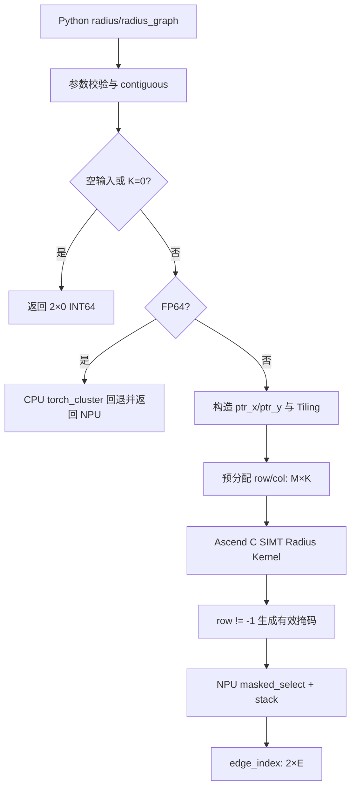

# Radius 算子设计文档

> 目标仓库：`ops-gnn/radius`  
> 适配硬件：Ascend 950PR  
> 开发语言：Ascend C（SIMT 为主）+ PyTorch C++ 扩展  

# 需求背景（required）

## 需求来源

本需求来源于 CANN 2026 年 8 月社区任务“radius 算子开发”。任务要求在 Ascend 950PR 上实现与 `torch_cluster.radius`、`torch_cluster.radius_graph` PyTorch 接口一致的 NPU 版本，仅验收前向计算；L1 支持 `float16`、`bfloat16`、`float32`，L2 的 `float64` 允许采用 CPU 回退；性能需达到任务书给定 A100 标杆性能的 0.6 倍及以上。

任务书链接：[8 月社区任务 - radius 算子开发任务书](https://gitcode.com/cann/cann-ops-competitions/blob/master/04_tasks/01_community-task-2026/docs/202608/radius_task_doc.md)。

## 背景介绍

### Radius 算子 NPU 适配

`radius` 是图神经网络和点云网络中的邻域构图算子。对查询点集合 `y` 中的每一个点，在参考点集合 `x` 中查找同一 batch 内、欧氏距离严格小于半径 `r` 的点，并限制每个查询点最多输出 `max_num_neighbors` 个邻居。`radius_graph` 是 `radius(x, x, ...)` 的封装，用于直接生成半径图。

PyTorch 层参考实现位于 [`torch_cluster/radius.py`](https://github.com/rusty1s/pytorch_cluster/blob/master/torch_cluster/radius.py)，CUDA 参考实现位于 [`csrc/cuda/radius_cuda.cu`](https://github.com/rusty1s/pytorch_cluster/blob/master/csrc/cuda/radius_cuda.cu)。当前上游 CUDA kernel 为每个 `y` 分配一个线程，在对应 batch 的 `x` 区间内扫描，累计平方距离，并在邻居数达到上限后提前结束；随后使用掩码去除预分配缓冲区中的无效项。

Ascend 950PR 上需要重点解决以下问题：

1. 邻域搜索具有不规则访存、循环次数不固定和分支较多的特点，不适合照搬普通逐元素算子的 SIMD 流水模板；
2. 输出边数 `E` 运行时才能确定，需要同时处理固定上界缓冲区和动态长度输出；
3. batch 只允许在同一图内搜索，且 `batch_x`、`batch_y` 为 sorted；
4. 邻居数超过上限时任务书要求随机截断，并要求固定 seed 时可复现；
5. 性能用例规模达到 64K 点，不能生成或落盘完整的 `M × N` 距离矩阵。

### Radius 参考实现现状分析

| 参数 | 参数含义 | 类型 | 支持类型 | 约束 | 形状/取值 |
| --- | --- | --- | --- | --- | --- |
| `x` | 参考点集合 | Tensor | L1：FP16/BF16/FP32；L2：FP64 | 连续，和 `y` 的特征维 `F` 相同 | `[N, F]` |
| `y` | 查询点集合 | Tensor | 与 `x` 相同 | 连续，和 `x` 的特征维 `F` 相同 | `[M, F]` |
| `r` | 搜索半径 | float 属性 | FP64 host 标量 | `r > 0` | 标量 |
| `batch_x` | `x` 的 batch 编号 | Optional Tensor | INT64 | 长度为 `N`，单调非降 | `[N]` |
| `batch_y` | `y` 的 batch 编号 | Optional Tensor | INT64 | 长度为 `M`，单调非降 | `[M]` |
| `max_num_neighbors` | 单个查询点的邻居上限 | int 属性 | INT64 | 建议 `> 0`，默认 32 | 标量 |
| `num_workers` | CPU 并行线程数 | int 属性 | INT64 | NPU 路径忽略 | 标量 |
| `batch_size` | batch 数量 | Optional int | INT64 | 未传时由 batch Tensor 推导 | 标量 |
| `ignore_same_index` | 是否忽略相同下标 | bool 属性 | BOOL | `radius_graph` 中取 `not loop` | 标量 |
| `edge_index` | 邻接关系输出 | Tensor | INT64 | 动态边数 `E` | `[2, E]` |

当 `x` 或 `y` 为空时，直接返回形状为 `[2, 0]` 的 INT64 Tensor。

### Radius 算子功能分析

- 输入：`x`、`y`、`r`、可选 batch 信息以及邻居上限等属性；
- 输出：`edge_index[0]` 为查询点下标，`edge_index[1]` 为参考点下标；
- 距离：欧氏距离，判断采用严格小于 `r`；
- batch：仅搜索 `batch_x[i] == batch_y[j]` 的点对；
- 广播：不支持，也不需要广播；
- 排序：输出不承诺按距离排序；
- 截断：邻居数超过上限时按任务书语义随机选择，普通验收以边集合为准，固定 seed 时要求可复现。

# 需求分析（required）

## 需求描述

在 Ascend 950PR 上使用 Ascend C 和 PyTorch 扩展实现 `radius` 与 `radius_graph`，使接口、batch 语义、严格半径判断、邻居上限、空输入、`ignore_same_index`、`loop` 和 `flow` 行为与任务书一致。L1 类型在 NPU 上执行，FP64 采用无损 CPU 回退。实现不得构造完整距离矩阵，且任务书性能用例达到给定标杆性能的 0.6 倍及以上。

## 需求拆解

1. 实现 `radius` PyTorch 接口及 `torch.ops.torch_cluster.radius` NPU 注册；
2. 实现 `radius_graph` Python 封装，正确处理 `loop` 和 `flow`；
3. 支持 FP16、BF16、FP32 NPU 路径，FP64 CPU 回退；
4. 支持 sorted batch，并在同 batch 内搜索；
5. 支持空输入、`max_num_neighbors` 截断和 `ignore_same_index`；
6. 输出 `[2, E]` INT64 动态边表，不产生 `M × N` 中间 Tensor；
7. 固定 seed 下随机截断结果可复现；
8. 功能、精度和性能满足任务书验收标准。

## 方案选型结论

首版主路径采用 **SIMT brute-force + 提前终止**：一个 SIMT 线程负责一个查询点 `y[j]`，定位其 batch 对应的 `x` 区间后逐点计算距离，命中数达到 `max_num_neighbors` 即停止扫描。该方案与上游 CUDA 核心结构一致，避免了网格建表、排序、前缀和及多 kernel 调度开销。

选择该方案的依据如下：

- 任务书明确允许选择“grid/hash cell、SIMT brute-force 等”最优实现；
- 官方 Ascend C 文档指出 SIMT 适合离散访存和复杂控制流场景，[SIMT 抽象硬件架构说明](https://www.hiascend.com/document/detail/en/CANNCommunityEdition/900/programug/Ascendcopdevg/atlas_ascendc_10_10064.html)与本算子的特征吻合；
- 性能用例为随机 3D 坐标且默认邻居上限较小，命中 32 个邻居后通常无需扫描完整个 batch；
- 上游 CUDA 参考实现同样不构造空间索引，而是扫描并提前终止；
- `x` 的 3D 数据规模在 64K 点时仍具有较好的缓存复用机会。

网格/哈希不是首版默认路径。若实测发现“小半径、低密度、邻居不足 K”导致大量查询扫描完整 batch，再增加 `GRID_3D` tiling 路径：以边长 `r` 划分 cell，仅检查查询 cell 周围的 27 个 cell。该路径需额外的 cell key、排序/哈希桶和多 kernel 同步，只有扫描节省超过预处理成本时才启用。

# 详细设计（required）

## 算子分析

### 数学公式

给定：

- `x ∈ R^(N×F)`；
- `y ∈ R^(M×F)`；
- batch 指针 `ptr_x`、`ptr_y`；
- 半径 `r > 0`；
- 邻居上限 `K = max_num_neighbors`。

对每个查询点 `y_j`，先找到其 batch `b(j)`，候选下标范围为：

\[
i \in [\mathrm{ptr\_x}[b(j)],\ \mathrm{ptr\_x}[b(j)+1])
\]

平方欧氏距离为：

\[
d^2(i,j)=\sum_{f=0}^{F-1}(x_{i,f}-y_{j,f})^2
\]

邻居判定为：

\[
d^2(i,j)<r^2
\]

同时满足：

\[
\neg(\text{ignore\_same\_index} \land i=j)
\]

每个 `j` 最多保留 `K` 个邻居，最终边数满足：

\[
0\le E\le M\times K
\]

实现直接比较平方距离与 `r²`，不计算 `sqrt`。

### 支持数据类型

| 级别 | 数据类型 | 计算路径 | 累加类型 |
| --- | --- | --- | --- |
| L1 | FP16 | NPU SIMT | FP32 |
| L1 | BF16 | NPU SIMT | FP32 |
| L1 | FP32 | NPU SIMT | FP32 |
| L2 | FP64 | CPU 回退 | FP64 |

FP16/BF16 在寄存器中转为 FP32 后进行差、平方和累加，降低临界半径附近的累计误差；输出仅为索引，不发生数据类型回转。

### 支持形状

- `x`：`[N, F]`；
- `y`：`[M, F]`；
- `F` 必须一致且大于 0；
- 支持 `N == 0` 或 `M == 0`；
- 支持多 batch，但 batch Tensor 必须 sorted；
- 不支持广播；
- Python 层对 1D 输入按上游行为视为 `[-1, 1]`，随后转为 contiguous。

### 复杂度

- 最坏时间复杂度：`O(Σ_b M_b × N_b × F)`；
- 在高密度且 K 较小时，提前终止后的平均扫描量显著小于 `N_b`；
- 固定上界工作区：`O(M × K)`；
- 不创建 `O(M × N)` 距离矩阵。

## 算子实现

### 整体执行流程



### 3.2.1 Host 侧设计

#### 1. PyTorch 接口与参数校验

Python/C++ host 层执行以下处理：

1. 若 `x` 或 `y` 为 1D，转换为 `[-1, 1]`；
2. 校验二者均为 2D、设备一致、dtype 一致、`F` 相同；
3. 校验 `r > 0`、`max_num_neighbors >= 0`；
4. 将 `x`、`y` 转为 contiguous；
5. 校验 `batch_x.numel() == N`、`batch_y.numel() == M`；
6. batch 非空时要求单调非降。为避免热路径中的 Device-to-Host 同步，release 版本将 sorted 作为前置约束；debug/UT 模式可增加 NPU 校验 kernel；
7. `num_workers` 在 NPU 路径保留接口但不参与调度；
8. 空输入或 `K == 0` 直接返回 `[2, 0]`。

当 batch 数大于 1 时，按上游 Python 逻辑由 sorted batch 生成 CSR 风格的 `ptr_x`、`ptr_y`；无 batch 时生成 `[0, N]`、`[0, M]`。Kernel 只接收指针数组，不在搜索循环内比较 batch Tensor。

#### 2. Tiling 数据

`RadiusTilingData` 至少包含：

| 字段 | 含义 |
| --- | --- |
| `n` / `m` / `featureDim` | `N`、`M`、`F` |
| `numExamples` | batch 数量 |
| `maxNumNeighbors` | 邻居上限 K |
| `radiusSquared` | FP32 的 `r²` |
| `ignoreSameIndex` | 是否过滤相同下标 |
| `queriesPerBlock` | 每个线程块处理的查询点数 |
| `blockNum` | 启动线程块数 |
| `samplingMode` | 顺序兼容或随机截断模式 |
| `seed` / `offset` | 默认 NPU Generator 的随机状态 |

`ptr_x`、`ptr_y` 是运行时 Tensor 输入，不能把其数据值当作静态 tiling 数据。

#### 3. 分核策略

- 以查询点 `M` 为分核维度；
- 一个 SIMT 线程处理一个查询点；
- `queriesPerBlock` 初始取 256，并通过 950PR 实测在 128/256/512 中择优；
- `blockNum = ceil(M / queriesPerBlock)`，不超过运行时允许的最大 block 数；
- `batch_y` 已排序，连续查询点大概率属于同一 batch，有利于复用 `ptr` 与 `x` 数据缓存；
- 尾块线程通过 `queryIndex >= M` 直接退出。

这里不套用 Addcdiv 的“大核/小核按元素均分”方式。Radius 每个查询点的扫描长度取决于 batch 大小和命中密度，静态均分无法保证完全一致；采用大量轻量线程交由硬件调度隐藏负载不均。

#### 4. TilingKey 规划

| TilingKey | 场景 | 说明 |
| --- | --- | --- |
| `0` | `F == 3`，顺序扫描 | 对齐当前上游 CUDA 扫描顺序的兼容/诊断路径 |
| `1` | `F == 3`，随机截断 | 任务书默认性能路径，3D 循环完全展开 |
| `2` | 通用 `F`，顺序扫描 | 通用特征维兼容路径 |
| `3` | 通用 `F`，随机截断 | 通用任务书语义路径 |

dtype 通过 kernel 模板实例化选择，不额外占用 TilingKey。空输入在 host 短路，不启动 kernel。

任务书要求随机截断，但当前上游 CUDA 源码采用顺序扫描并保留前 K 个命中点，两者存在语义差异。设计以任务书验收口径为默认值，同时保留顺序扫描 key 用于对齐指定版本参考实现。最终提交前必须用验收环境的 `test_radius.py` 和固定 seed 用例确认默认 key。

#### 5. 输出与工作区设计

参考 CUDA 实现，host 预分配：

- `rowBuffer`：INT64 `[M, K]`，初始化为 `-1`；
- `colBuffer`：INT64 `[M, K]`；
- 可选 `countBuffer`：INT32 `[M]`，用于调试、统计与后续融合压缩。

Kernel 每个查询点只写自己的连续 K 个槽位，无需原子操作。搜索完成后，在 NPU 上执行：

1. `validMask = rowBuffer != -1`；
2. `row = masked_select(rowBuffer, validMask)`；
3. `col = masked_select(colBuffer, validMask)`；
4. `edge_index = stack([row, col], dim=0)`。

该流程无 CPU 同步，且工作区上界为 `16 × M × K` 字节（不含 mask/count）。以 `M=64K、K=32` 为例，row/col 共约 32 MiB，远小于完整距离矩阵。

如 profiling 显示 `masked_select + stack` 启动开销占比过高，可将有效标记、分段前缀和和 compact 合并为第二个自定义 kernel；在没有成熟动态 shape 输出协议前，不在首版中引入复杂的 host 回读总边数方案。

#### 6. 随机截断设计

接口没有显式 generator 参数，因此 C++ 扩展从当前 NPU 默认 Generator 获取 `seed/offset` 并透传给 kernel。随机模式按 batch 或查询线程生成候选扫描的起点/步进，使候选访问次序随 seed 改变，并在命中 K 个后提前终止。要求：

- 同一 seed、相同输入和相同实现版本输出 bit-wise 可复现；
- 不同 seed 允许得到不同的合法邻居子集；
- 选中下标必须唯一、同 batch 且满足严格半径条件；
- 未超过 K 时必须返回全部邻居，不允许随机丢失；
- 随机状态消耗量固定，不能依赖线程实际扫描长度，否则会破坏后续算子的随机序列可复现性。

随机候选次序采用无重复置换或等价的无放回策略，避免同一邻居重复写入。具体 Philox 映射需与验收基线固定；若验收基线实际采用上游“前 K 个命中”语义，则切换到顺序 TilingKey，不对外增加新参数。

### 3.2.2 Kernel 侧设计

#### 1. Kernel 阶段划分

Radius 采用 SIMT 直接寻址，不使用传统 `TQue` 的整块 `CopyIn → Compute → CopyOut` 流水。逻辑上仍分为：

1. `Init`：解析 GM 指针、tiling 参数和随机状态；
2. `LoadQuery`：每线程把自身查询点的坐标载入寄存器；
3. `LocateBatch`：在 `ptr_y` 中定位 batch，并取得对应 `x` 起止下标；
4. `Search`：扫描候选点、计算平方距离、过滤并截断；
5. `WriteResult`：写入该查询点专属的 row/col 槽位。

SIMT 模式的 GM 读取通过数据缓存进入寄存器，适合本算子的离散访问与复杂分支。传统批量搬运仅在通用 `F` 较大、查询点坐标无法完全驻留寄存器时考虑使用共享 UB 分块。

#### 2. batch 定位

线程 `j` 使用 `ptr_y` 对 batch 区间做二分查找，得到 `b`，再读取：

```text
xBegin = ptr_x[b]
xEnd   = ptr_x[b + 1]
```

由于查询下标连续且 `ptr_y` 有序，可在后续优化中由线程块首线程缓存本块涉及的少量 batch 边界到共享 UB，减少重复二分和 GM 访问。

#### 3. 距离计算

`F == 3` 快速路径完全展开：

```text
dx = fp32(x[i,0]) - fp32(y[j,0])
dy = fp32(x[i,1]) - fp32(y[j,1])
dz = fp32(x[i,2]) - fp32(y[j,2])
dist2 = dx*dx + dy*dy + dz*dz
```

通用 `F` 路径逐维累加。由于每项平方非负，当部分和已经 `>= r²` 时可以提前终止维度循环，减少大特征维场景的无效计算。最终只在 `dist2 < r²` 时判为邻居，严格保留边界语义。

对 NaN 坐标，`dist2 < r²` 为 false，不输出该边；Inf 按 IEEE 计算处理。半径在 host 侧先以 FP64 校验，再转换为 kernel 的 FP32 `r²`。临界边测试同时采用任务书要求的 AscendOpTest/ATK 双标杆策略。

#### 4. 邻居写入与提前终止

每线程维护局部 `count`：

```text
if (dist2 < r2 && !(ignoreSameIndex && i == j)) {
    rowBuffer[j * K + count] = j;
    colBuffer[j * K + count] = i;
    ++count;
}
if (count == K) break;
```

线程之间写地址互不重叠，不需要原子累加和跨核同步。未写入位置保持 `row == -1`，供后处理压缩。

#### 5. 缓存与访存优化

- `F == 3` 时查询点坐标常驻寄存器；
- 同一线程块优先处理连续且同 batch 的 `y`，使多个线程访问相同/邻近的 `x` 区间；
- 顺序扫描路径可最大化 `x` 的数据缓存复用；
- 随机截断路径优先采用线程块或 batch 共享的随机候选次序，在满足验收随机语义的前提下减少完全离散访问；
- FP16/BF16 使用成对/打包 load（尾部安全处理），减少 load 指令；
- 达到 K 后立即停止；通用 F 路径在部分距离超阈值后停止维度累加；
- 不读取、写入完整距离矩阵。

### 3.2.3 `radius_graph` 设计

`radius_graph` 不单独开发第二套 kernel，而是在 PyTorch 层复用 `radius`：

```python
edge_index = radius(
    x, x, r, batch, batch,
    max_num_neighbors=max_num_neighbors,
    num_workers=num_workers,
    batch_size=batch_size,
    ignore_same_index=not loop,
)
if flow == "source_to_target":
    edge_index = edge_index.flip(0)
return edge_index
```

- `loop=False` 时过滤 `i == j`；
- `loop=True` 时允许自环，但仍需满足距离条件；
- `source_to_target` 交换 source/target 两行；
- `target_to_source` 保持 `radius` 的 `[query, reference]` 顺序；
- 非法 `flow` 在 host 侧报错。

### 3.2.4 备选 GRID_3D 优化路径

仅在 SIMT brute-force 对稀疏场景不达标时实现：

1. 对 `x` 计算 cell 坐标 `floor(x / r)`，将 batch 编号编码进 cell key；
2. 对 cell key 和点下标排序，构造每个 cell 的连续区间；
3. 每个 `y` 只枚举自身 cell 及相邻 26 个 cell；
4. 对候选点做精确平方距离判断；
5. 使用与主路径相同的截断、raw buffer 和 compact 流程。

该路径只适用于 `F == 3`。启用前必须比较“建表 + 排序 + 查询”的总耗时，而不是只比较查询 kernel。空间哈希必须编码 batch，防止跨图误连；坐标范围过大时不能直接分配稠密三维网格，应采用排序 cell key 或开放寻址哈希。

## 性能优化策略

### 性能基线

任务书给出的 A100 参考耗时如下：

| 点数/半径 | FP32 | FP16 |
| --- | ---: | ---: |
| `N=8K, r=0.8` | 2.118 ms | 2.269 ms |
| `N=16K, r=0.5` | 3.916 ms | 4.424 ms |
| `N=32K, r=0.3` | 8.446 ms | 10.082 ms |
| `N=64K, r=0.2` | 20.830 ms | 28.418 ms |
| `N=64K, r=0.3` | 20.902 ms | 28.470 ms |

验收时统一使用 warm-up、固定数据生成方式、相同 `max_num_neighbors` 和设备侧计时，比较完整 `radius_graph` 调用，而不只统计主搜索 kernel。

### 优化优先级

1. `F == 3` 循环展开与查询坐标寄存器常驻；
2. K 命中提前终止；
3. 同 batch 连续查询的缓存复用；
4. 调优线程块大小和数据缓存划分；
5. 减少 row/col 初始化与 compact kernel 次数；
6. 稀疏场景仍不达标时再引入 GRID_3D；
7. 通过 msprof 分解 Python、host、search、mask、compact、stack 各阶段耗时，避免只优化非瓶颈部分。

## 支持硬件

| 支持的芯片版本 | 涉及勾选 |
| --- | --- |
| Ascend 950PR | √ |

软件版本以 `ops-gnn` 仓库指定的 CANN、PyTorch 和 torch_npu 版本为准。

## 算子约束限制

1. 仅支持前向；
2. `x`、`y` 必须具有相同 dtype、相同特征维，NPU L1 路径为 FP16/BF16/FP32；
3. batch Tensor 必须为 sorted INT64，并与对应点数等长；
4. 仅在同 batch 内搜索；
5. `r` 为正的 float 标量，不是 Tensor；
6. 不支持广播；
7. 输出边不保证按距离或下标排序；
8. 超限随机截断允许非确定性，但固定 seed 模式必须可复现；
9. `num_workers` 在 NPU 路径无效果；
10. FP64 采用 CPU 回退，不参与 NPU 性能考核。

# 可维可测分析

## 精度标准/性能标准

| 验收标准 | 描述 | 标准来源 |
| --- | --- | --- |
| 功能标准 | `radius`、`radius_graph` 接口及 batch/loop/flow/ignore 语义与任务书一致 | Radius 任务书、torch_cluster |
| 精度标准 | 非截断场景邻居集合与 CPU 标杆一致；截断场景所有输出均为合法邻居且固定 seed 可复现；临界场景满足生态算子精度标准 | Radius 任务书、AscendOpTest/ATK |
| 性能标准 | 所有任务书性能用例达到标杆性能的 0.6 倍及以上 | Radius 任务书 |
| 内存标准 | 不构造 `M × N` 距离矩阵，主工作区为 `O(M × K)` | 本设计 |

## 测试用例规划

| 编号 | 场景 | 示例参数 | dtype | 核心检查点 |
| --- | --- | --- | --- | --- |
| TC-01 | 基础 radius | `N=4,M=2,F=2,r=1.5` | FP32 | 边集合与 CPU 一致 |
| TC-02 | 多 batch | 两个 sorted batch | FP16/BF16/FP32 | 无跨 batch 边 |
| TC-03 | 邻居不足 K | 小半径、`K=32` | 全 L1 | 返回全部邻居，无 `-1` 泄漏 |
| TC-04 | 邻居超过 K | 大半径、`K=4` | 全 L1 | 每个 y 至多 4 边，均为合法邻居 |
| TC-05 | 固定 seed | 同输入重复调用 | FP32 | bit-wise 可复现 |
| TC-06 | 不同 seed | 同输入多 seed | FP32 | 可返回不同合法子集 |
| TC-07 | ignore same | `x is y` | 全 L1 | `ignore=True` 无 `i==j` |
| TC-08 | radius_graph loop | `loop=True/False` | FP32 | 自环语义正确 |
| TC-09 | radius_graph flow | 两种 flow | FP32 | 两行交换关系正确 |
| TC-10 | 空输入 | `N=0` 或 `M=0` | 全 L1 | 输出 `[2,0]` INT64 |
| TC-11 | 临界半径 | `dist < r`、`dist == r`、`dist > r` | 全 L1 | 严格小于语义 |
| TC-12 | 通用 F | `F=1,2,4,16,64` | 全 L1 | 通用 key 正确 |
| TC-13 | FP64 | 中小 shape | FP64 | CPU 回退 bit-wise 一致 |
| TC-14 | 非法输入 | dtype/F/batch/r/flow 非法 | - | host 正确报错 |
| TC-15 | 性能 8K~64K | 任务书五组 3D shape/r | FP16/FP32 | 完整调用性能比达标 |
| TC-16 | 稳定性 | 64K 连续执行 1000 次 | FP16/FP32 | 无越界、泄漏和异常同步 |

集合比较时先按 `(row, col)` 排序或转集合，不以原始 edge 顺序作为普通精度判定条件。随机截断用例同时验证边合法性、每查询点计数上限、无重复、seed 可复现性；只有验收参考明确固定 RNG 映射时才做跨设备 bit-wise 子集比较。

## 风险与规避方案

| 风险 | 等级 | 规避方案 |
| --- | --- | --- |
| 任务书随机截断与当前上游 CUDA“前 K 个”行为不一致 | 高 | 默认按任务书实现随机模式，同时保留顺序 TilingKey；提交前用指定 torch_cluster 版本和验收用例锁定口径 |
| 动态输出压缩引入额外 kernel 和同步 | 中 | 采用设备侧 masked_select/stack；profiling 后再决定是否融合 compact，禁止 host 回读 E 的热路径 |
| 稀疏场景扫描完整 batch 导致性能下降 | 中 | 先以任务书 shape 实测；不达标时增加 GRID_3D 路径 |
| FP16/BF16 临界半径集合与 CPU 不一致 | 高 | FP32 累加、严格 `< r²`；构造边界用例并按任务书启用 ATK 双标杆 |
| 随机扫描破坏 x 缓存局部性 | 中 | 优先 batch/线程块共享候选次序并固定随机状态消耗；在随机性与缓存复用间 profiling 选型 |
| batch 定位开销或跨 batch 错连 | 中 | 统一使用 ptr_x/ptr_y；sorted 约束；增加多 batch、空 batch 和极不均匀 batch 用例 |
| `M×K` 工作区过大 | 低 | host 做乘法溢出检查；记录工作区上限；K 异常大时返回明确错误或采用分块输出策略 |
| SIMT 寄存器占用过高降低并发 | 中 | F=3 专用展开；通用 F 不把完整查询向量强制驻留寄存器；调优 block size |

## 兼容性分析

本算子为 `ops-gnn` 新增能力，不修改现有算子 ABI。Python 层函数签名与 torch_cluster 对齐，`radius_graph` 复用 `radius`，便于 PointNet++、DGCNN 及 PyG 上层调用迁移。FP64 回退保持功能正确但会产生设备同步和数据搬运，README 中需明确其 L2、非性能路径定位。

# 参考资料

1. [Radius 社区任务书](https://gitcode.com/cann/cann-ops-competitions/blob/master/04_tasks/01_community-task-2026/docs/202608/radius_task_doc.md)
2. [torch_cluster radius.py](https://github.com/rusty1s/pytorch_cluster/blob/master/torch_cluster/radius.py)
3. [torch_cluster radius CUDA 实现](https://github.com/rusty1s/pytorch_cluster/blob/master/csrc/cuda/radius_cuda.cu)
4. [PyTorch Geometric radius API](https://pytorch-geometric.readthedocs.io/en/2.5.1/generated/torch_geometric.nn.pool.radius.html)
5. [Ascend C SIMT 抽象硬件架构](https://www.hiascend.com/document/detail/en/CANNCommunityEdition/900/programug/Ascendcopdevg/atlas_ascendc_10_10064.html)
6. [Ascend C GatherMask API](https://www.hiascend.com/document/detail/en/CANNCommunityEdition/850/API/ascendcopapi/atlasascendc_api_07_0071.html)

