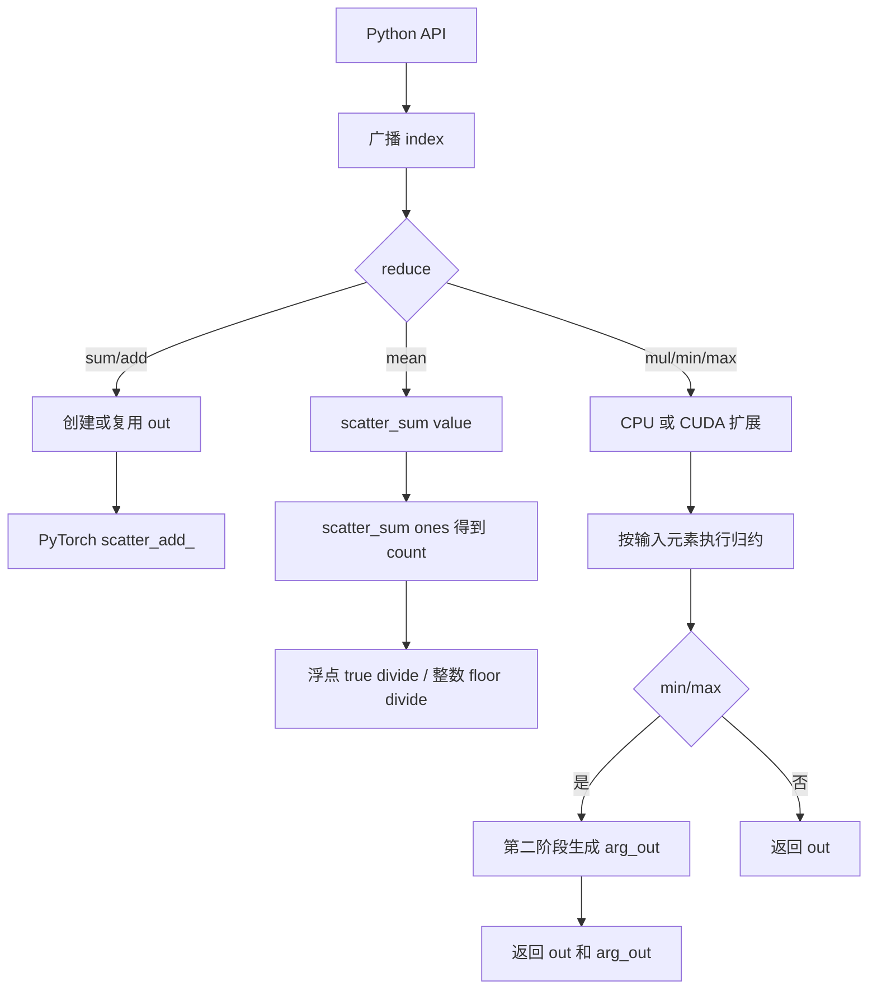
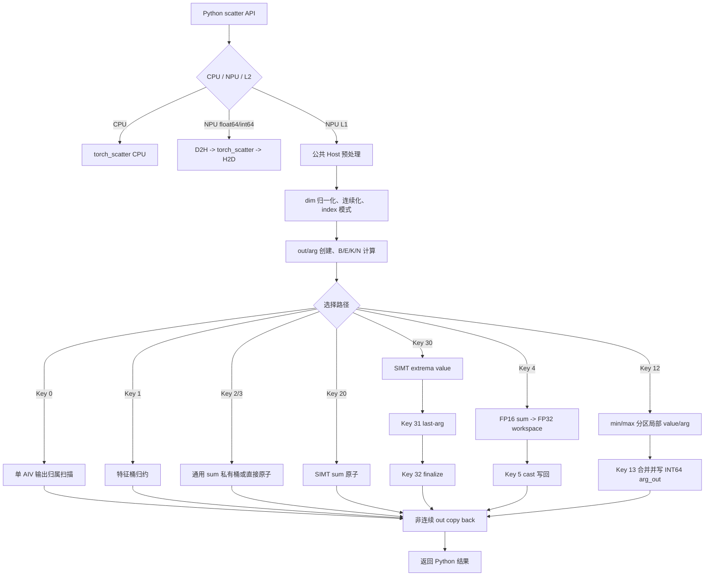

# 需求背景（required）

## 需求来源

根据 `scatter_task_doc.md`，参考 `torch_scatter.scatter` 及其子算子
`scatter_sum`、`scatter_add`、`scatter_mul`、`scatter_mean`、`scatter_min`、
`scatter_max`，在昇腾 NPU 上基于 Python PyTorch 适配层、C++ Host 和 Ascend C Kernel
实现 Scatter 系列算子。PyTorch 接口是功能、精度和性能的验收入口，目标硬件为
Ascend 950PR。

## 背景介绍

Scatter 是按索引分组的归约操作。`src` 中的元素沿 `dim` 维根据无序、可重复的
`index` 写入输出桶，并执行 sum/add、mul、mean、min 或 max 归约。该算子广泛用于
GNN 消息聚合、点云特征池化和稀疏数据处理。

本实现采用三层结构：

| 层级 | 当前实现 |
| --- | --- |
| Python | 提供与 `torch_scatter` 一致的七个公开 API，完成设备和 dtype 分发 |
| C++ Host | 完成校验、广播、连续化、输出准备、Tiling、workspace 和 Kernel 启动 |
| Ascend C Kernel | 提供 sum、mul、mean、min、max 五个入口，add 复用 sum |

CPU Tensor 直接委托已安装的 `torch_scatter`。NPU 的 float64/int64 采用同步 CPU 回退，
其他 L1 dtype 使用自研 NPU Kernel。

### 参考实现与源码路径

本任务是新增 PyTorch 生态算子，不是已有内置 TBE 算子的 Ascend C 改写。任务书明确以
PyTorch 接口为验收基准，aclnn 为可选交付项，因此没有需要对齐的 TBE 算子信息库、TBE
源码或必选 aclnn 接口。Checklist 中与 TBE 相关的检查项在本任务中替换为对
`torch_scatter 2.1.2` 参考实现的分析。

| 参考内容 | 仓内路径 | 作用 |
| --- | --- | --- |
| Python 接口与广播 | `references/pytorch_scatter/torch_scatter/scatter.py`、`utils.py` | API、输出推断、mean 计数和统一分发 |
| CPU 实现 | `references/pytorch_scatter/csrc/cpu/scatter_cpu.cpp` | 功能语义和 L2 回退基线 |
| CUDA 实现 | `references/pytorch_scatter/csrc/cuda/scatter_cuda.cu` | 输入驱动原子归约和 arg 二阶段参考 |
| Reducer | `references/pytorch_scatter/csrc/cpu/reducer.h`、`csrc/cuda/reducer.cuh` | 初值、更新和 dtype 归约行为 |
| 官方测试 | `references/pytorch_scatter/test/test_scatter.py`、`test_broadcasting.py` | API 与边界场景基线 |

### 参考实现现状分析

参考实现支持 ND 格式 Tensor。Python 层先广播 index；sum/add 使用 PyTorch
`scatter_add_`，mean 先调用 sum，再对 ones 执行一次 scatter_sum 得到 count；
mul/min/max 调用 CPU/CUDA 扩展。

| 输入/输出 | dtype | 数据格式 | 参考实现说明 |
| --- | --- | --- | --- |
| src/out | PyTorch 整数及浮点 dtype | ND | CPU/CUDA 按模板 dtype dispatch；具体能力受设备后端限制 |
| index/arg_out | INT64 | ND | index 支持广播；min/max arg_out 与 out 同 shape |
| dim/dim_size | INT64 标量 | - | dim 支持负值，dim_size 可省略 |
| reduce | string | - | sum/add/mul/mean/min/max |

当前 Ascend 实现的数据类型和格式如下：

| 级别 | src/out dtype | index/arg_out | 数据格式 | 执行路径 |
| --- | --- | --- | --- | --- |
| L1 | BF16、FP16、FP32、INT8、UINT8、INT16、INT32 | INT64 | ND | Ascend C Kernel |
| L2 | float64、int64 | INT64 | ND | 同步 CPU `torch_scatter` 回退 |
| 不支持 | bool、complex、float8 | 非 INT64 index | - | Python/Host 明确报错 |

CPU 参考实现将张量展平为 `[B,E,K]`，按 `b -> e -> k` 顺序读取 index 并调用 Reducer
更新 `[B,N,K]` 输出。CUDA 参考实现为每个输入元素启动线程，通过原子操作写出 value；
min/max 再启动 arg Kernel，将与最终 value 相等的输入位置写入 arg_out。CUDA 浮点原子
顺序不确定，允许产生微小数值差异。

### 参考实现流程图



# 需求分析（required）

## 需求描述

1. 公开 API 的函数名、参数、默认值和返回类型与 `torch_scatter 2.1.2` 对齐。
2. 支持 sum、add、mul、mean、min、max 六种归约，add 是 sum 的别名。
3. 支持 rank 1～8、正负 dim、1D/多维 index 广播、可选 out、非连续 Tensor 和空输入。
4. L1 原生支持 BF16、FP16、FP32、INT8、UINT8、INT16、INT32。
5. L2 支持 float64/int64，同步回退 CPU，并保持输出 dtype、device 和 out 语义。
6. `scatter_min/max` 返回 INT64 `arg_out`；相同极值采用后写者优先。
7. 使用 PyTorch pytest、AscendOpTest 和 opbase 标准验证功能与精度。
8. 任务书中 sum/mean/min/max 的 40 项性能用例达到 A100 吞吐的 0.6 倍。

## 需求拆解

| 子任务 | 设计与实现 |
| --- | --- |
| API 兼容 | Python 层提供七个接口，统一入口只返回 value |
| 设备分发 | CPU 委托、NPU L1 原生、NPU L2 CPU 回退 |
| 输入规范化 | Host 处理 dim、广播、连续化、shape 和 index 模式 |
| 通用功能 | 输出归属式确定性 Kernel 覆盖全部合法 dtype 和 shape |
| sum 性能 | UB 私有桶、跨核原子合并，FP16 使用 FP32 workspace |
| mean 性能 | 950PR 常见规格组合 `scatter_sum + bincount + divide` |
| min/max 性能 | 行分区局部归约、workspace 保存中间 value/arg、二阶段合并 |
| 验证 | 120 项 pytest、166 项 AscendOpTest、40 项性能矩阵 |

### 外部组件依赖

| 组件 | 用途 | 适配要求 |
| --- | --- | --- |
| PyTorch | Tensor、Python API、CPU/NPU 数据搬运 | 与目标 torch_npu ABI 匹配 |
| torch_npu | NPU device、当前 stream、NPU 算子调用 | 950PR 验证版本为 2.7.1.post8 |
| CANN Toolkit | Bisheng、Ascend C 头文件、ACL Runtime | dav-3510 要求 CANN 9.0+ |
| torch_scatter 2.1.2 | CPU 执行、L2 回退和 golden | 测试与运行 L2 路径时必须安装 |
| CMake、setuptools、pybind11 | 构建 `_pybind.so` 和 Kernel so | CMake 3.18+，Python 3.8+ |

算子本身不依赖 aclnn。PyTorch 通过 `_pybind.so` 直接调用 Host，再由 Host 启动 Ascend C
Kernel；这符合任务书“aclnn 可选、不作为验收必要条件”的要求。

### 内部适配模块

| 模块 | 路径 | 职责 |
| --- | --- | --- |
| Python API | `ops-gnn/python/ops_gnn/scatter.py` | API、设备/dtype 分发、L2 回退、950PR mean 组合路径 |
| pybind 注册 | `ops-gnn/csrc/pybind.cpp` | 注册五个 NPU 后端，暴露架构标记 |
| 公共 Host | `ops-gnn/csrc/npu/host/scatter_common/scatter_common.cpp` | 校验、广播、Tiling、workspace 和 launch |
| 独立 Host 入口 | `ops-gnn/csrc/npu/host/scatter_{sum,mul,mean,min,max}/` | 固定 reduce 并调用公共 Host |
| 公共 Kernel | `ops-gnn/csrc/npu/kernel/scatter/common/scatter_kernel_common.h` | dtype dispatch、通用路径及性能路径 |
| 架构入口 | `ops-gnn/csrc/npu/kernel/scatter/arch3510/scatter_kernels.cpp` | dav-3510 五个全局 Kernel 和直接 launch |
| dav-2201 入口 | `ops-gnn/csrc/npu/kernel/scatter/*/arch2201/` | dav-2201 五个 Kernel wrapper |
| 构建系统 | `ops-gnn/CMakeLists.txt`、`ops-gnn/setup.py` | 架构隔离、Kernel/pybind 编译和安装 |

### PyTorch 算子原型

本任务的必选原型是 PyTorch Python API，不是 aclnn C 接口。公开签名如下：

```python
def scatter_sum(src: torch.Tensor, index: torch.Tensor, dim: int = -1,
                out: Optional[torch.Tensor] = None,
                dim_size: Optional[int] = None) -> torch.Tensor: ...

def scatter_add(src: torch.Tensor, index: torch.Tensor, dim: int = -1,
                out: Optional[torch.Tensor] = None,
                dim_size: Optional[int] = None) -> torch.Tensor: ...

def scatter_mul(src: torch.Tensor, index: torch.Tensor, dim: int = -1,
                out: Optional[torch.Tensor] = None,
                dim_size: Optional[int] = None) -> torch.Tensor: ...

def scatter_mean(src: torch.Tensor, index: torch.Tensor, dim: int = -1,
                 out: Optional[torch.Tensor] = None,
                 dim_size: Optional[int] = None) -> torch.Tensor: ...

def scatter_min(src: torch.Tensor, index: torch.Tensor, dim: int = -1,
                out: Optional[torch.Tensor] = None,
                dim_size: Optional[int] = None) -> Tuple[torch.Tensor, torch.Tensor]: ...

def scatter_max(src: torch.Tensor, index: torch.Tensor, dim: int = -1,
                out: Optional[torch.Tensor] = None,
                dim_size: Optional[int] = None) -> Tuple[torch.Tensor, torch.Tensor]: ...

def scatter(src: torch.Tensor, index: torch.Tensor, dim: int = -1,
            out: Optional[torch.Tensor] = None,
            dim_size: Optional[int] = None,
            reduce: str = "sum") -> torch.Tensor: ...
```

底层 `_pybind` 只注册 sum、mul、mean、min、max；add 在 Python 层复用 sum，统一
`scatter` 在 Python 层分发。aclnn 未实现，属于任务书允许的可选缺失，不影响验收。

公共 Host 原型为：

```cpp
torch::Tensor scatter_npu(
    torch::Tensor src,
    torch::Tensor index,
    int64_t dim,
    std::optional<torch::Tensor> out,
    std::optional<int64_t> dim_size,
    ScatterHostReduce reduce);

std::tuple<torch::Tensor, torch::Tensor> scatter_minmax_npu(
    torch::Tensor src,
    torch::Tensor index,
    int64_t dim,
    std::optional<torch::Tensor> out,
    std::optional<int64_t> dim_size,
    ScatterHostReduce reduce);
```

五个 Ascend C Kernel 使用统一 ABI，仅 TilingData 类型和固定 reduce 不同：

```cpp
extern "C" __attribute__((aiv)) __global__ __aicore__ void scatter_<reduce>_3510(
    GM_ADDR src,
    GM_ADDR index,
    GM_ADDR out,
    GM_ADDR argOut,
    GM_ADDR workspace,
    Scatter<Reduce>TilingData tiling);
```

`argOut` 仅 min/max 使用，`workspace` 仅多阶段路径使用；其余入口仍保留参数，以统一 launch
ABI 并兼容 CANN wrapper 对 workspace 位置的解释。

### 算子原型相关约束

| 参数 | 约束 |
| --- | --- |
| src | rank 1～8；L1/L2 dtype 见后文；NPU 原生路径要求 NPU Tensor |
| index | INT64；与 src 同 device；1D 或可广播到 src shape |
| dim | `[-src.dim(), src.dim()-1]` |
| out | 可选；dtype/device 与 src 一致；dim 外 shape 与 src 一致 |
| dim_size | 可选非负整数；未提供时由 index 推断 |
| reduce | sum/add/mul/mean/min/max |

与参考实现相比，当前缺失项只有 backward 和可选 aclnn 层；前向 PyTorch 验收能力已经覆盖。

# 详细设计（required）

## 算子分析

### 数学定义

设归约维为 `dim`，目标桶为 `n`，则：

```text
sum:  out[..., n, ...] = Σ src[..., e, ...], index[..., e, ...] = n
mul:  out[..., n, ...] = Π src[..., e, ...], index[..., e, ...] = n
mean: out[..., n, ...] = sum[..., n, ...] / count[..., n, ...]
min:  out[..., n, ...] = min(src[..., e, ...])
max:  out[..., n, ...] = max(src[..., e, ...])
```

自动创建 out 时，sum/add、mean、min、max 的空桶为 0，mul 的空桶为 1。提供 out 时，
以 out 的现有值作为归约初值；mean 的 count 只统计本次 index 命中数。整数 mean 使用
floor 除法。

### 逻辑形状与地址模型

Host 将 `src` 逻辑展平为 `[B,E,K]`：

```text
B = product(src.shape[:dim])
E = src.shape[dim]
K = product(src.shape[dim + 1:])
N = out.shape[dim]
```

输出逻辑形状为 `[B,N,K]`。通用路径将 `outOffset` 还原为 `(b,n,k)`，输入偏移为：

```text
srcOffset = (b * E + e) * K + k
```

1D index 直接使用 `index[e]`；多维 index 使用广播后连续 Tensor 的
`index[srcOffset]`。

### PyTorch 接口与后端分发

| API | 返回值 | 实现 |
| --- | --- | --- |
| `scatter_sum` / `scatter_add` | Tensor | sum 后端；add 复用 sum |
| `scatter_mul` | Tensor | mul 后端 |
| `scatter_mean` | Tensor | mean 组合快路径或 mean 后端 |
| `scatter_min` / `scatter_max` | `(out, arg_out)` | min/max 后端 |
| `scatter(..., reduce=...)` | Tensor | Python 分发；min/max 只返回 value |

分发规则如下：

| 输入 | 执行路径 |
| --- | --- |
| CPU Tensor | CPU `torch_scatter` |
| NPU + L1 dtype | 自研 Host/Ascend C Kernel |
| NPU + float64/int64 | 同步 D2H，CPU `torch_scatter`，再 H2D |
| bool、complex、float8 等 | 明确拒绝 |

L2 min/max 在 CPU value 结果上重新扫描，生成后写者优先的 `arg_out`。L2 路径首次触发
时发出 RuntimeWarning，不参与性能考核。

## 算子实现

### 使能方式

构建前加载目标 CANN 环境并选择架构。950PR 的标准构建入口为：

```bash
source /usr/local/Ascend/ascend-toolkit/latest/bin/setenv.bash
cd ops-gnn
OPSGNN_NPU_ARCH=dav-3510 python3 setup.py build_py
```

`setup.py` 将 `NPU_ARCH` 传入 CMake。CMake 只选择对应架构源码，编译
`libopsgnn_npu_kernel.so` 和 `_pybind.so`，再把 `_pybind.so` 放入 Python 包。调用链为：

```text
import ops_gnn
  -> ops_gnn.scatter_*()
  -> ops_gnn._pybind.scatter_*()
  -> scatter_common.cpp
  -> scatter_*_3510 / scatter_*_2201
```

使用示例：

```python
import torch
import ops_gnn

src = torch.randn(16384, 512, device="npu", dtype=torch.float16)
index = torch.randint(0, 4, (16384,), device="npu", dtype=torch.int64)
out = ops_gnn.scatter_sum(src, index, dim=0, dim_size=4)
```

### Host 侧设计

#### 输入校验与 index 广播

1. 校验 `src` rank 为 1～8，`index` dtype 为 INT64，且 src/index/out 位于同一 NPU。
2. 将负 dim 规范化到 `[0, src.dim())`。
3. src 转为连续 Tensor；1D index 保持为向量并设置 `vectorIndex=1`。
4. 非 1D index 按规则补维、`expand(src.sizes())` 后连续化。
5. 提供 out 时校验 dtype、rank 和 dim 外各维；非连续 out 使用临时连续 Tensor，完成后
   copy back，返回原 out 对象。
6. 未提供 out 时，N 依次由 `dim_size`、空 index 的 0、或 `index.max()+1` 确定。
7. `OPSGNN_SCATTER_VALIDATE_INDEX=1` 可启用 index 上下界严格检查；默认关闭该同步检查，
   非法 index 的行为未定义。

空输入不启动 Kernel。自动 out 的 mul 填 1，其余归约填 0；min/max 的 `arg_out` 填 E。

#### TilingData 与分核

五个 Kernel 共用以下 Tiling 字段：`B/E/K/N`、输入输出元素数、dtype、是否有初始 out、
index 模式、使用核数、TilingKey、特征块长度、特征块数和行分区数。

910B3 默认使用 40 个 AIV。950PR 通过
`aclrtGetDeviceInfo(..., ACL_DEV_ATTR_VECTOR_CORE_NUM)` 获取实际 Vector Core 数，
`OPSGNN_SCATTER_AIV_NUM` 仅用于不超过硬件上限的调试覆盖。

通用 TilingKey 0 当前使用单 AIV，作为覆盖全部 dtype/shape 的 correctness 路径。性能路径
才根据任务数启用多 AIV。设硬件可用 Vector Core 数为 C：

```text
sum usedBlockNum     = min(C, E)
feature usedBlockNum = min(C, tileCount)
extrema taskCount    = partitionCount * tileCount
extrema usedBlockNum = min(C, taskCount)
merge usedBlockNum   = min(C, N * tileCount)
```

#### 数据分块与 LocalMemory 计算

性能路径使用 128 KiB UB 预算，记 `U=128*1024`，dtype 字节数为 D，特征块长度为 L。

sum 私有桶路径的估算为：

```text
alignment       = 16 (FP16) 或 8 (FP32)
bytesPerFeature = 4*N + 12
maxTileLength   = floor(U / bytesPerFeature / alignment) * alignment
alignedK        = min(ceil(K / alignment) * alignment, 2048)
L               = min(maxTileLength, alignedK)
tileCount       = ceil(K / L)
fixedBytes      = (N + 2) * L * 4
rowBytes        = L * D
partitionCount  = clamp(floor((U - fixedBytes) / rowBytes), 1, 32)
```

其中 `N*L*4` 为 FP32 私有桶，源数据区最多容纳 `partitionCount` 行，额外 buffer 用于 cast
和输出。若 UB 无法容纳至少一个对齐块，则回退到直接原子或通用路径。

TilingKey 1 特征桶路径的估算为：

```text
alignment       = 32 / D
countBytes      = ceil(N / 8) * 8 * 4
bytesPerFeature = 4*N + 4 + 2*D
maxTileLength   = floor((U - countBytes) / bytesPerFeature / alignment) * alignment
targetL         = align_up(min(K, 512), alignment)       # dav-3510
L               = min(targetL, maxTileLength)
tileCount       = ceil(K / L)
```

min/max 分区路径同时保存 value 和 FP32 arg：

```text
bytesPerFeature = (N + 3) * (D + 4)
ubTileLength    = floor(U / bytesPerFeature / 64) * 64
L               = min(ubTileLength, align_up(K, 64), 512)
tileCount       = ceil(K / L)
partitionCount  = min(max(floor(C / tileCount), 1), E)
rowsPerPartition= ceil(E / partitionCount)
```

源行使用两个 `L*D` buffer 双缓冲；`N*L*D` 保存局部 value，`N*L*4` 保存局部 arg，
其余 LocalMemory 用于 mask、行号、选择结果和输出块。

#### workspace 管理

- 950PR 官方高 group sum 由 MIX AIV SIMT 线程按 `E*K` 扁平元素分工，FP16/FP32
  直接原子累加；小 group FP16 保留 FP32 workspace + cast 路径。
- 950PR 高 group min/max 使用 INT32 arg workspace，依次执行 value 原子、最后位置原子和
  空桶收尾三个 Kernel；通用分区路径仍使用 value/arg 中间 workspace。
- PyTorch 预处理完成后只清空一次 task queue，所有 raw launch 在当前 NPU stream 上保持
  异步顺序，不在算子返回前强制同步。

workspace 字节数计算如下：

```text
partialElements = partitionCount * tileCount * N * tileLength
valueBytes      = partialElements * D
argOffset       = align_up(valueBytes, 32)
workspaceBytes  = argOffset + partialElements * 4
```

### Kernel 侧设计

#### 通用输出归属路径

TilingKey 0 覆盖所有 dtype、广播 index、`B>1`、mul、带初始 out 以及不满足快路径条件的
场景。当前 Host 为该路径设置单 AIV；Kernel 的地址循环仍按
`outOffset = blockIdx + q * usedBlockNum` 编写。每个输出元素只被一个任务处理，再顺序扫描
E，不存在写冲突。

sum/mul 对低位整数按目标 dtype 保持逐次归约语义；mean 对整数执行向负无穷取整。
min/max 第一遍计算 value，第二遍顺序扫描相等值并覆盖 arg，因此返回最后一个位置。
NaN 不参与普通大小和相等比较。

#### sum/add 高冲突路径

适用主场景为 `B=1`、1D index、FP16/FP32、`K>0`。

950PR 正式高 group 条件（`N>=1024`、1D index、`B=1`、FP16/FP32、无初始 out）使用
MIX AIV SIMT 扁平路径：每个线程处理 `E*K` 元素，按 index 对输出执行硬件原子加，避免
按行搬运和重复维护全 group 私有桶。仅显式设置 `OPSGNN_SCATTER_SUM_PATH=group_ownership`
时才启用实验性的 group ownership UB 路径。

通用及小 group 条件使用 UB 私有桶：各核按输入行分区，以 1～32 行为一批搬入 UB，在片上
合并重复 index 后使用 `SetAtomicAdd` 写回。FP16 无 out 的通用路径保留 FP32 workspace 和
独立 AIV cast 阶段；`OPSGNN_SCATTER_SUM_PATH=direct_atomic` 仅用于受控对比。

#### mean 计数路径

950PR 对性能矩阵中的常见条件，即 FP16/FP32、1D 非空 index、无 out 且
`index.numel()==src.size(dim)`，在 Python 层执行：

```text
value  = scatter_sum(src, index)
count  = torch.bincount(index, minlength=N).clamp_min(1)
result = value / reshape(count)
```

该方案复用已经优化的 sum Kernel，并使用 NPU `bincount` 完成计数，避免 3510 上实测不可靠
的 workspace 原子 mean 路径。其他 3510 场景进入 TilingKey 1 的特征桶路径或 TilingKey 0
通用路径。dav-2201 仍保留 TilingKey 6/7 的 sum+count workspace 与除法写回实现。

#### min/max value 与 arg_out 路径

适用条件为无 out、`B=1`、1D index、FP16/FP32、`E>=1024`、K 和 N 非零。

950PR 官方高 group 且 `K` 为 2 次幂时使用三阶段 SIMT 路径（TilingKey 30/31/32）：
1. Key 30 对每个输入元素执行 value `AtomicMin/AtomicMax`。
2. Key 31 仅对等于最终 value 的输入执行 `AtomicMax(row+1)`，保证重复极值取最后位置。
3. Key 32 将 arg workspace 解码为 INT64 `arg_out`，并把空桶写为 value=0、arg=E。

不满足 SIMT 编码条件的高 group 输入（例如非 2 次幂 K）回落到通用分区路径。该路径的
Key 12/13 将任务映射为 `(rowPartition, featureTile)`，在 workspace 中保存局部 value/arg，
再按分区顺序合并；相等时后分区覆盖，保持后写者语义。

#### TilingKey 规划

| Key | 当前路径 | 主要条件 |
| --- | --- | --- |
| 0 | 通用输出归属 | 全 dtype/shape 回退，mul 固定使用 |
| 1 | 连续特征桶 sum/mean | FP16/FP32、1D index、B=1 的部分场景 |
| 2 | UB 私有桶 sum | 可直接写出 dtype 的 sum 主路径 |
| 3 | 直接原子 sum | 仅环境变量开启的对比路径 |
| 4 | FP16 sum 写 FP32 workspace | FP16、无 out |
| 5 | FP32 workspace 转 FP16 | Key 4 的第二阶段 |
| 6 | mean sum+count workspace | dav-2201 保留路径 |
| 7 | mean 除法与写回 | dav-2201 Key 6 的第二阶段 |
| 12 | min/max 分区局部归约 | 不满足 30 的 FP16/FP32、1D index、B=1、E>=1024、无 out |
| 13 | min/max 分区合并 | Key 12 的第二阶段 |
| 20 | 高 group SIMT sum | 950PR、K 为 2 次幂且 E*K 不超过 uint32 |
| 21 | group ownership sum | 仅显式环境变量调试路径 |
| 30 | SIMT extrema value | 950PR、K 为 2 次幂且 E*K 不超过 uint32 |
| 31 | SIMT extrema last-arg | Key 30 的第二阶段 |
| 32 | SIMT extrema finalize | Key 30/31 的第三阶段 |

Key 8～11 为早期极值原子方案代码，当前 Host 不选择，不属于现行执行路径。

#### 流水线与架构适配

性能 Kernel 使用 HardEvent 建立 MTE2、Vector、Scalar、MTE3 间的数据依赖，并通过双缓冲
重叠源数据搬运和向量计算。dav-3510 使用独立 `arch3510/scatter_kernels.cpp` 全局入口，
launch 时按 Bisheng 地址空间要求显式转换 `GM_ADDR`；dav-2201 使用生成的 ACLRT launch
wrapper。CMake 在源码解析前按 `NPU_ARCH` 隔离两套入口。

#### Ascend C 实现流程图



950PR 常见 mean 在进入 `_pybind.scatter_mean` 前由 Python 识别，执行优化后的 scatter_sum、
NPU bincount 和 divide；未命中组合条件时才进入上图的 Host/Kernel 分流。

#### 与参考实现的差异及原因

| 对比项 | torch_scatter 参考实现 | Ascend 实现 | 原因 |
| --- | --- | --- | --- |
| 接口入口 | Python + PyTorch/C++ 扩展 | Python + pybind + Ascend C | 任务验收以 PyTorch API 为准，aclnn 可选 |
| index 表示 | stride-aware TensorInfo | 1D 直接读取；其他广播后连续化 | 简化 Kernel 地址计算，并保留性能主场景的零展开路径 |
| 通用归约 | CPU 输入循环或 CUDA 输入原子 | 单 AIV 输出归属扫描 | 覆盖无原子能力的 dtype，并保证高冲突下无写竞争 |
| sum 性能 | CUDA 每输入元素原子写 | 950PR MIX AIV SIMT 扁平原子；小 group UB 私有桶 | 高 group 避免按行 DMA 和重复扫描 |
| FP16 sum | 设备原子归约 | 高 group 直接 SIMT 原子；小 group FP32 workspace | 官方精度矩阵通过并兼顾两类规格 |
| mean | 两次 scatter_sum | 950PR 为 scatter_sum + bincount + divide | 计数只与 index 有关，bincount 更适合当前硬件和规格 |
| min/max arg | value 原子后第二 Kernel 扫 arg | 高 group 三阶段 SIMT；通用路径分区归约 | uint32 AtomicMax(row+1) 保证后写者优先 |
| L2 dtype | CPU/CUDA 模板能力 | float64/int64 同步 CPU 回退 | 950PR Vector Core 无原生 FP64/int64 原子归约 |
| 空 mul | 依赖版本整体空输入可能为 0 | 自动 out 明确填单位元 1 | 任务书语义优先 |
| 重复极值 | CPU 版本可能返回首位置 | 后写者优先 | 任务书明确要求 |

## 支持硬件

| 支持的芯片版本 | 架构 | 当前状态 |
| --- | --- | --- |
| Ascend 950PR | dav-3510 | CANN 9.0.0 实机构建、功能、精度及官方 40 项性能验证通过 |
| Ascend 910B3 | dav-2201 | CANN 8.2 实机构建与功能验证通过，作为兼容架构保留 |

## 算子约束限制

1. L1 dtype 为 BF16、FP16、FP32、INT8、UINT8、INT16、INT32；L2 dtype 为
   float64/int64；不支持 bool、complex、float8。
2. index dtype 固定为 INT64，src rank 为 1～8，dim 必须位于合法范围。
3. 当前验收范围仅包括前向，不提供 backward。
4. 1D index 快路径要求 index 长度与归约维匹配；其他可广播 index 会物化为连续 Tensor，
   可能增加显存和 Host 开销。
5. 性能主路径面向 `B=1`、1D index、FP16/FP32；其他合法输入保证功能正确，但不承诺达到
   同一性能水平。
6. FP16/FP32 sum 的多核原子累加顺序不固定，允许符合 opbase 标准的浮点误差。
7. 严格 index 范围检查默认关闭以避免同步开销；启用检查后非法 index 会明确报错。
8. 950PR raw launch 与输入、输出及临时 Tensor 均使用 PyTorch 当前 NPU stream，依赖同流
   顺序保证内存复用安全，不在每次算子调用内强制同步当前 stream。
9. CPU 和 L2 路径依赖外部 `torch_scatter` 安装。

# 特性交叉分析

| 特性 | 与 Scatter 的交叉影响 | 设计处理 | 验证 |
| --- | --- | --- | --- |
| 动态 shape | B/E/K/N、输出大小和 workspace 随输入变化 | Host 每次调用计算 shape、Tiling 和 workspace | rank 1～8、dim_size、空 index 用例 |
| index 广播 | 完整展开可能增加显存和搬运 | 1D index 保持向量；其他 index 才 expand+contiguous | 1D 到 4D、collapsed、elementwise 用例 |
| 非连续 Tensor | Kernel 只处理连续地址 | src/index 连续化；out 使用临时 Tensor 并 copy back | 非连续 src/index/out 与 data_ptr 断言 |
| optional out | 初值、返回对象和 mean 语义发生变化 | `hasInitial` 进入 Tiling；不重置 out；非连续时回写原对象 | 六种 reduce、全部 L1 dtype |
| 空 Tensor/空桶 | 不应启动无意义 Kernel；不同 reduce 单位元不同 | Host 直接初始化；mul=1，其余=0，arg=E | 空输入和 sparse bucket 用例 |
| 高冲突 index | 直接 GM 原子争用严重 | sum 先做 UB 私有桶；min/max 做行分区局部归约 | 高冲突功能用例和 40 项性能矩阵 |
| 浮点确定性 | 多核原子顺序不同会改变末位 | 按 opbase mixed tolerance 验收；极值 arg 保持确定性 | AscendOpTest 218/218 output |
| 整数精度 | 溢出、低位 dtype 和 mean 除法需与参考一致 | 通用路径逐次回写目标 dtype；mean 使用 floor divide | INT8/UINT8/INT16/INT32 bit-wise |
| NaN/Inf | 比较、相等和空桶判断可能受影响 | 通用极值使用普通比较；专项 golden 固化行为 | NaN、Inf、-Inf 专项用例 |
| L2 dtype | 950PR 缺少 FP64/int64 原生归约能力 | 同步 CPU 回退并首次 warning | float64/int64 六种 reduce |
| 多架构构建 | 2201 与 3510 编译语法和 launch ABI 不同 | CMake 在解析前隔离源码，共用 Tiling 和语义 | 两种架构均完成实机构建 |
| stream 生命周期 | raw launch 可能早于 PyTorch task queue | 预处理后提交队列，raw kernel 保持当前流顺序 | 120 项 pytest 与官方 750 项矩阵 |
| 性能组合算子 | mean 组合路径涉及 scatter_sum、bincount、divide | 仅在 FP16/FP32、1D index、无 out 等明确条件下启用 | 官方高 group mean 10/10 达标 |

交叉分析结论：功能泛化由通用输出归属路径兜底，性能优化只在条件可判定且已验证的规格上
启用。任何快路径条件不满足时均回退到保持相同公开语义的通用路径，不改变 API 行为。

# 可维可测分析

## 精度标准/性能标准

| 验收标准 | 描述 | 标准来源 |
| --- | --- | --- |
| 功能标准 | 七个 API、六种 reduce、广播、out、空输入、非连续、rank 1～8 全部通过 | 任务书、`torch_scatter 2.1.2` |
| 浮点精度 | 按 mixed tolerance 比较，允许并行累加顺序造成的微小差异 | opbase experimental standard |
| 整数/L2 精度 | 整数输出及 CPU 回退结果按 bit-wise 比较 | 任务书、opbase |
| 性能标准 | 每项 `A100_time / NPU_time >= 0.6` | Scatter 任务书性能表 |

2026-08-06 在 Ascend 950PR、CANN 9.0.0 上的结果：

| 验证项 | 结果 |
| --- | --- |
| CMake/Bisheng dav-3510 构建 | 通过 |
| PyTorch pytest | 120/120 通过 |
| AscendOpTest + opbase | 166/166 case、218/218 output 通过 |
| ATK 双标杆 | 未触发，单标杆全部通过 |
| groups=4 探索性能矩阵 | 40/40 达到 0.6x A100 |
| 官方高 group 性能矩阵 | 40/40 达标，最低 0.619x A100 |

groups=4 数据使用 `torch.npu.Event`，仅作为路径探索。官方链接 benchmark 明确五个
shape 的 group_count 为 `4096、8192、16384、16384、16384`；正式参数按官方
`warmup=20、iters=100` 执行，40/40 达标，机器可读结果见
`test/scatter/reports/results/950pr/official_performance_40cases.json`。

多路径选型依据如下：

| 对比项 | 被替代方案 | 当前方案 | 结论 |
| --- | --- | --- | --- |
| sum 高 group | AIV 按行 DMA / UB 全 group 桶 | MIX AIV SIMT 扁平原子 | 正式 sum 10/10 达标 |
| FP16 sum | FP32 workspace + cast | 高 group 直接 SIMT 原子 | 官方功能矩阵通过且正式性能达标 |
| 950PR mean | workspace sum/count 原子 | scatter_sum + bincount + divide | 规避实测不可靠路径并通过性能矩阵 |
| min/max 高 group | 输出归属扫描或 uint64 packed 原子 | value/uint32 arg/finalize 三阶段 SIMT | 正式 min/max 20/20 达标 |

## 兼容性分析

1. Python `inspect.signature` 与 `torch_scatter 2.1.2` 对齐，add 与 sum 等价。
2. CPU Tensor 直接调用原版扩展，避免维护第二套 CPU 语义。
3. 非连续 src/index/out 通过连续化和 copy back 兼容，提供 out 时返回原对象。
4. dav-2201 与 dav-3510 共用 TilingData、dtype dispatch 和归约语义，架构差异仅位于入口、
   launch 和部分性能分流。
5. min/max 重复极值按任务书采用后写者优先；当前 `torch_scatter 2.1.2` CPU 在部分场景
   返回首个位置，因此 golden 和 L2 路径显式修正 arg。
6. 自动 out 且整体空输入时，mul 按任务书返回单位元 1；对依赖版本的空输入差异进行显式
   修正。
7. L2 回退保证功能兼容，但为同步 D2H/CPU/H2D 路径，不承诺异步行为或性能等价。

## PR 提交信息

- 目标仓库位置：
  `https://gitcode.com/cann/cann-competitions/tree/master/04_tasks/01_community-task-2026/tasklist`
  中 Scatter 对应目录。
- PR 标题：`【社区任务】Scatter算子设计文档`。
- PR 类型：必须创建 Pull Request，不能使用 Issue 代替。
- 提交后必须完成 CLA 签署，并按仓库流程在 PR 评论区触发 `/compile`，确认构建检查通过。
- 设计文档正文提交本文件；算子代码、测试和自验证报告在后续 ops-gnn PR 中提交。
