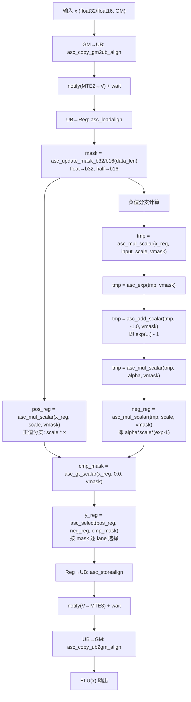
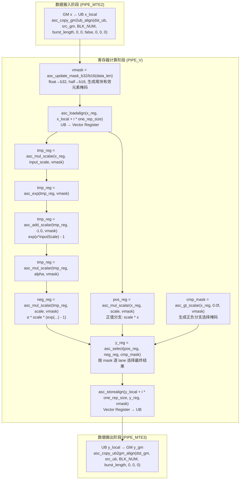

# 【社区任务】ELU 算子设计文档

## 一、需求描述

### 1.1 需求来源

本需求来源于 CANN 社区任务 2026 中的「8月社区任务 - ELU 算子开发」。任务要求基于 Ascend C C API（寄存器级 Vector Compute）实现 ELU（Exponential Linear Unit）激活函数，作为 asc-devkit 开源仓 `examples/02_simd_c_api/03_c_api/02_reg_vector_compute/elu/` 目录下的样例交付。

目标硬件：Ascend 950（DAV_3510），CANN 版本 9.0.0 ~ 9.1.0。

本 API 不注册 GE/aclnn 算子，无 op_host/op_kernel/op_api 三段式，以独立可编译运行的样例形式交付。

### 1.2 需求分析

ELU 的数学定义：

$$
\text{ELU}(x) = \begin{cases} x \cdot \text{scale}, & x > 0 \\ \alpha \cdot \text{scale} \cdot (\exp(x \cdot \text{inputScale}) - 1), & x \leq 0 \end{cases}
$$

| 参数 | 默认值 | 语义 |
|------|--------|------|
| alpha | 1.0 | 负值区饱和幅值系数 |
| scale | 1.0 | 整体缩放系数 |
| inputScale | 1.0 | 指数输入缩放系数 |

**Positive Branch**：x > 0 时，输出 scale * x，为简单线性映射。

**Negative Branch**：x ≤ 0 时，输出 alpha * scale * (exp(x * inputScale) - 1)，包含指数运算。

**Merge by Select**：AI Core SIMD 中一个 Vector 可能同时存在正值和负值，因此分别计算 Positive Branch 与 Negative Branch，再利用 Compare Mask 配合 Select 完成结果融合。

本实现采用 Register Level SIMD Programming，计算首先加载至 Vector Register，在寄存器完成 ELU 运算后写回 UB，可减少 Memory Access，提高 Vector Unit 利用率。

## 二、方案设计

### 2.1 整体计算流程



图1 ELU 算子整体计算流程图

### 2.2 数据搬运与寄存器计算详细流程



图2 数据搬运 + 寄存器计算 + 数据搬出三阶段详细流程图

### 2.3 架构设计

#### Host / Device 分层

```
Host 侧（CPU）:
  1. 读取测试数据 (input_x.bin / golden.bin)
  2. aclrtMalloc 分配 Device GM 内存
  3. aclrtMemcpy H2D 拷贝输入至 GM
  4. elu_custom<<<numBlocks, 0, stream>>> 启动 kernel
  5. aclrtMemcpy D2H 读回输出
  6. verify_result() 精度校验

Device 侧（AI Core）:
  GM ──[MTE2]──> UB ──[LoadAlign]──> Vector Register ──[StoreAlign]──> UB ──[MTE3]──> GM
```

#### Memory Layout

```
Global Memory (GM)
│  x_gm: [T × totalElements]    (T = float32 | float16)
│
├─── asc_copy_gm2ub_align ───► PIPE_MTE2
│
Unified Buffer (UB)
│  x_local: [T × block_length]   ← 输入 buffer
│
├─── asc_loadalign ───►
│
Vector Register (Reg)
│  x_reg: [T × VF_LEN]          (float32: VF_LEN=64, float16: VF_LEN=128)
│  ┌──────────────────────────────────────────────────┐
│  │ if constexpr(same<T,float>) → b32 else → b16    │
│  │ vmask = asc_update_mask_b32/b16(data_len)        │
│  │ pos_reg = asc_mul_scalar(x_reg, scale, vmask)    │
│  │ tmp_reg = asc_mul_scalar(x_reg, input_scale)     │
│  │ tmp_reg = asc_exp(tmp_reg, vmask)                │
│  │ tmp_reg = asc_add_scalar(tmp_reg, -1.0, vmask)   │
│  │ tmp_reg = asc_mul_scalar(tmp_reg, alpha, vmask)  │
│  │ neg_reg = asc_mul_scalar(tmp_reg, scale, vmask)  │
│  │ cmp_mask = asc_gt_scalar(x_reg, 0.0, vmask)      │
│  │ y_reg = asc_select(pos_reg, neg_reg, cmp_mask)   │
│  └──────────────────────────────────────────────────┘
│
├─── asc_storealign ───►
│
Unified Buffer (UB)
│  y_local: [T × block_length]   ← 输出 buffer
│
├─── asc_copy_ub2gm_align ───► PIPE_MTE3
│
Global Memory (GM)
│  y_gm: [T × totalElements]
```

ELU 为逐元素算子，不涉及邻域访问及矩阵乘法，不需要额外 Workspace，仅需输入 Buffer 与输出 Buffer 即可完成计算。全部中间结果驻留 Vector Register，不在 UB 中物化。

当前样例数据规模较小，仅采用单 Buffer 实现，未启用 Double Buffer Pipeline，后续可进一步优化 GM 与 Compute 重叠。

#### AI Core 流水线

```
PIPE_MTE2 (数据搬入)        PIPE_V (向量计算)           PIPE_MTE3 (数据搬出)
┌────────────────┐      ┌──────────────────────────┐      ┌────────────────┐
│ copy GM→UB     │      │ loadalign                │      │ storealign     │
│                │ ──►  │ → mul_scalar → mul_scalar│ ──►  │ copy UB→GM     │
│                │      │ → exp → add_scalar       │      │                │
│                │      │ → mul_scalar → mul_scalar│      │                │
│                │      │ → gt_scalar → select     │      │                │
└────────────────┘      └──────────────────────────┘      └────────────────┘
         ── asc_sync_notify(EVENT_ID0) ──►       ── asc_sync_notify(EVENT_ID0) ──►
         ── asc_sync_wait(EVENT_ID0) ──►         ── asc_sync_wait(EVENT_ID0) ──►
```

三条流水线之间通过 Event Synchronization（`asc_sync_notify` / `asc_sync_wait`）保证数据依赖：MTE2 完成 → notify → PIPE_V wait → 计算完成 → notify → MTE3 wait → 搬出。

#### Repeat 分块

dav-3510 向量寄存器宽度 256 字节。float32 时 VF_LEN = 64（256B / 4B），float16 时 VF_LEN = 128（256B / 2B）。当 block_length > VF_LEN 时，分多个 repeat 处理：

```
float32: block_length = 256, VF_LEN = 64, repeat_time = 4
  repeat 0: [0, 63]     → 64 float32
  repeat 1: [64, 127]   → 64 float32
  repeat 2: [128, 191]  → 64 float32
  repeat 3: [192, 255]  → 64 float32

float16: block_length = 256, VF_LEN = 128, repeat_time = 2
  repeat 0: [0, 127]    → 128 float16
  repeat 1: [128, 255]  → 128 float16
```

每个 repeat 内执行完整的向量指令序列。尾块不足 VF_LEN 时，通过 `asc_update_mask_b32(data_len)`（float32）或 `asc_update_mask_b16(data_len)`（float16）生成有效元素掩码 vmask，确保只计算有效数据。

#### Mask 工作机制

```
输入 x_reg:     [ 3.0, -2.0,  5.0, -1.0 ]
vmask = asc_update_mask_b32(data_len)  → 标记有效元素
asc_gt_scalar(x, 0.0, vmask):
                  [   1,    0,    1,    0  ]    → cmp_mask
pos_reg:          [ 3.0, -2.0,  5.0, -1.0 ]    ← asc_mul_scalar 全部计算
neg_reg:          [ ..., ...,  ...,  ...  ]    ← 负分支全部计算
asc_select:       [ 3.0, neg,  5.0, neg   ]    ← 按 cmp_mask 逐 lane 选择
```

正值 lane 取 pos_reg，负值 lane 取 neg_reg。被 select 丢弃的 lane 结果不写回，不影响正确性。

### 2.4 接口设计

#### Kernel 侧接口

```cpp
// 多 dtype 向量映射 trait
template<typename T> struct SimdTrait;
template<> struct SimdTrait<float> { static constexpr uint16_t repSize = 64; };   // VF_LEN=64 for f32
template<> struct SimdTrait<half>  { static constexpr uint16_t repSize = 128; };  // VF_LEN=128 for f16

// kernel 入口（__vector__ __global__ 上下文，模板化支持 float / half）
template<typename T>
__vector__ __global__ void elu_custom(
    __gm__ T* x, __gm__ T* y, uint32_t totalElements,
    float alpha, float scale, float input_scale, float one_val);

// 寄存器级计算函数（__simd_vf__ 上下文，模板化）
template<typename T>
__simd_vf__ inline void elu_vf(
    __ubuf__ T* x_local, __ubuf__ T* y_local,
    float alpha, float scale, float input_scale, float one_val,
    uint32_t data_len, uint16_t one_rep_size, uint16_t repeat_time);
```

| 参数名 | 输入/输出 | 描述 |
|--------|----------|------|
| x | 输入 | 源操作数（GM 地址），支持 float32 / float16 |
| y | 输出 | 目的操作数（GM 地址），类型与 x 一致，shape 与 x 一致 |
| totalElements | 输入 | 元素总个数 |
| alpha | 输入 | ELU 参数 α，默认 1.0 |
| scale | 输入 | 整体缩放系数，默认 1.0 |
| input_scale | 输入 | 指数输入缩放系数，默认 1.0 |
| one_val | 输入 | 负分支常数，固定 -1.0（用于 exp-1 的 add_scalar） |

约束：x ≠ y（不支持地址重叠）；地址 32 字节对齐；支持 float32 和 float16 两种数据类型。

#### 多 Dtype 模板架构

C API 的向量类型是编译器内建类型（`vector_float`、`vector_half`），不存在 `VectorType<T>` 模板。因此采用 `if constexpr` + `std::conditional_t` 在单一模板中实现多 dtype 分支：

```cpp
// elu_vf 内部：根据 T 选择对应的向量类型和 mask 函数
using vec_t = std::conditional_t<std::is_same_v<T, float>, vector_float, vector_half>;
vec_t x_reg, pos_reg, neg_reg, tmp_reg, y_reg;

for (uint16_t i = 0; i < repeat_time; ++i) {
    if constexpr (std::is_same_v<T, float>) {
        vmask = asc_update_mask_b32(data_len);   // float: 32-bit mask
    } else {
        vmask = asc_update_mask_b16(data_len);   // half:  16-bit mask
    }
    // ... 后续计算逻辑完全相同 ...
}
```

关键设计点：

- `SimdTrait<T>` 仅提供 `repSize`（constexpr），Host/Device 通用。float→64，half→128。
- `asc_update_mask_b32` / `asc_update_mask_b16` 是 `__simd_callee__`，必须在 `__simd_vf__` 上下文内调用，不能提取到 Host 侧 struct 方法中。
- `half` 是编译器内建类型 `_Float16`，`aclFloat16` 是 `uint16_t` typedef，二者是不同的 C++ 类型。Host 侧精度校验需要 `to_float<half>` 特化，使用 `aclFloat16ToFloat()` 完成 half→float 转换。
- `half` → `float` 转换：`static_cast<float>(half_value)` 直接可用；`__half2float` 不存在；`__half22float2` 是 `[aicore]` 上下文专用，Host 侧不可调用。

#### Host 侧接口

ELU 作为 examples 样例程序，Host 侧由测试 main 函数承担：读取 gen_data.py 生成的测试数据 → 分配 GM → H2D → launch kernel → D2H → verify_result 精度校验。

### 2.5 测试用例设计

测试数据由 `scripts/gen_data.py` 生成，支持 `--dtype float32|float16` 参数。golden 参考为 numpy float32 精度的 ELU 公式计算结果（float16 用例将 golden 截断为 float16 精度）。数据范围 [-100, 100]。

#### Float32 测试用例

| 用例编号 | Shape | dtype | 测试项 | 数据分布 |
|---------|-------|-------|--------|---------|
| TC_001 | [1] | float32 | 单元素，正负分支基本验证 | uniform(-100, 100) |
| TC_002 | [32] | float32 | 小 shape，正负混合 | uniform(-100, 100) |
| TC_003 | [1024] | float32 | 中等 shape，触发 repeat（16 repeats） | uniform(-100, 100) |
| TC_004 | [2048] | float32 | 大 shape，多 repeat（32 repeats） | uniform(-100, 100) |
| TC_005 | [2048] | float32 | 特殊值覆盖 | 含 0.0、-0.0、±100、±88、±1、±10、±0.5 |

#### Float16 测试用例

| 用例编号 | Shape | dtype | 测试项 | 数据分布 |
|---------|-------|-------|--------|---------|
| TC_006 | [1] | float16 | 单元素，half 精度基本验证 | uniform(-100, 100) |
| TC_007 | [32] | float16 | 小 shape，half 正负混合 | uniform(-100, 100) |
| TC_008 | [1024] | float16 | 中等 shape，触发 repeat（8 repeats） | uniform(-100, 100) |
| TC_009 | [2048] | float16 | 大 shape，多 repeat（16 repeats） | uniform(-100, 100) |
| TC_010 | [2048] | float16 | 特殊值覆盖 | 含 0.0、-0.0、±100、±88、±1、±10、±0.5 |

#### 批量测试

`run_test.sh` 自动执行全部 10 个用例（5 float32 + 5 float16），通过 `--dtype float16` 参数控制 gen_data.py 生成 half 数据，通过命令行第 5 个参数 `half` 切换 c_api_elu 的 dtype 分支。

#### 精度判据

- FLOAT32：`abs(out - ref) ≤ atol + rtol * abs(ref)`，其中 rtol=9.77e-4，atol=1.53e-5；整体 matched_ratio ≥ 0.99，max_abs_error ≤ 1e-2。
- FLOAT16：rtol=1.95e-3，atol=1.95e-3；整体 matched_ratio ≥ 0.99，max_abs_error ≤ 1e-1。

#### 自测结果

全部 10 个用例通过，matched_ratio 均为 1.0（100%）。Float32 最大误差 5.96e-08，Float16 最大误差 0。详见自验证报告 xlsx。

## 三、可维可测

### 3.1 精度标准/性能标准

| 验收标准 | 描述 | 标准来源 |
|---------|------|---------|
| 精度标准 | FLOAT32：rtol=9.77e-4，atol=1.53e-5，matched_ratio ≥ 0.99，max_abs_error ≤ 1e-2。FLOAT16：rtol=1.95e-3，atol=1.95e-3，matched_ratio ≥ 0.99，max_abs_error ≤ 1e-1。 | [生态算子开源精度标准](https://gitcode.com/cann/opbase/blob/master/docs/zh/ops_precision_standard/experimental_standard.md) |
| 性能标准 | 无 | 任务书 |

### 3.2 兼容性分析

ELU 是 `examples/02_simd_c_api/03_c_api/02_reg_vector_compute/elu/` 目录下的全新样例，不修改任何既有接口或样例行为，不涉及兼容性问题。产品限定 Ascend 950（DAV_3510），CANN ≥ 9.0.0。

### 3.3 CANN 9.0.0-beta.2 适配说明

目标机安装的 CANN 头文件与 asc-devkit 源码仓存在版本差异，关键适配如下：

| API | 问题 | 适配方案 |
|-----|------|---------|
| `asc_copy_gm2ub_align` | 3 参数简化重载不可见 | 使用 10 参数完整版本，padding/stride 显式传 0 |
| `asc_copy_ub2gm_align` | 3 参数简化重载不可见 | 使用 7 参数完整版本；注意参数顺序为 `(l2_cache_mode, dst_stride, src_stride)`，与 gm2ub 不同 |
| `asc_get_vf_len()` | 有声明无定义，链接失败 | 硬编码 64（dav-3510: 256B / 4B） |
| `asc_store_l2_cache_mode` | 枚举不可见 | 直接传 0（uint8_t） |
| `asc_sync()` | 有声明无定义，链接失败 | 使用 `asc_sync_notify` / `asc_sync_wait` 替代 |

根本规律：目标机上只有被 `_impl` 宏背书的 API 能成功链接，裸 `__aicore__ inline` 声明的函数无定义。

## 附录：ELU 参数默认值

| 参数 | 默认值 | 说明 |
|------|--------|------|
| alpha | 1.0 | 负值区饱和幅值 |
| scale | 1.0 | 整体缩放 |
| inputScale | 1.0 | 指数输入缩放 |

参数通过 kernel 标量参数传入。
