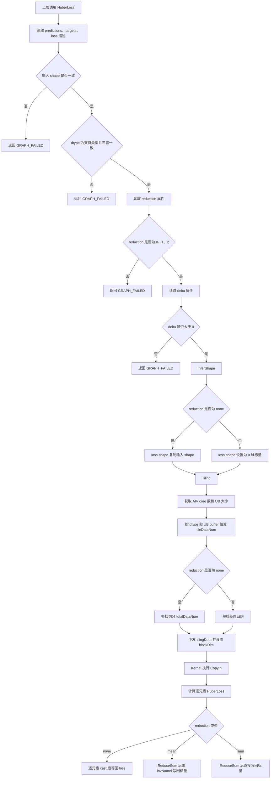
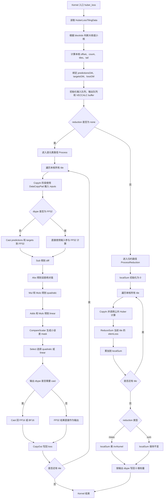

# HuberLoss算子设计方案

## 需求背景（required）

### 需求来源

`aten::huber_loss` 当前在 NPU 后端缺少对应前向算子支持，训练任务会 fallback 到 CPU 执行，导致 loss 计算成为端到端训练链路的性能瓶颈。本需求来自 2026 年 8 月社区任务：基于 Ascend C 实现与 PyTorch `aten::huber_loss` 前向行为一致的 HuberLoss 算子，并提交至 `ops-nn/experimental/loss` 目录。

### 背景介绍

#### HuberLoss 算子功能

HuberLoss 用于计算预测值与目标值之间的鲁棒回归损失。相比 MSE，HuberLoss 在误差较小时使用二次项，在误差较大时切换为一次项，可降低离群点对训练的影响。

输入 `predictions`、`targets` 具有相同 shape 和 dtype，计算误差 `e = predictions - targets`。逐元素 loss 定义如下：

$$
loss =
\begin{cases}
0.5e^2, & |e| \leq delta \\
delta(|e| - 0.5delta), & |e| > delta
\end{cases}
$$

算子支持 `reduction` 属性：

| reduction | 语义 | 输出 shape |
| --- | --- | --- |
| 0 | none，逐元素输出 | 与输入一致 |
| 1 | mean，所有元素 loss 求均值 | 0 维标量 |
| 2 | sum，所有元素 loss 求和 | 0 维标量 |

## 需求分析（required）

### 需求描述

使用 Ascend C 实现 HuberLoss 前向算子，对齐 PyTorch `aten::huber_loss` 的核心数学语义，支持 `FLOAT`、`FLOAT16`、`BFLOAT16`，支持 ND 泛化 shape，支持 `reduction=0/1/2` 和正数 `delta`。

### 算子原型

```text
HuberLoss(Tensor predictions, Tensor targets, int reduction = 1, float delta = 1.0) -> Tensor loss
```

本设计中 `predictions`、`targets`、`loss` 分别对应任务书中的 `input`、`target`、`output`。

| 参数名 | 输入/输出/属性 | 是否必选 | 描述 | 使用说明 | 数据类型 | 数据格式 | 维度(shape) | 非连续 Tensor |
| --- | --- | --- | --- | --- | --- | --- | --- | --- |
| `predictions` | 输入 | 必选 | 预测值张量。 | - | `FLOAT`、`FLOAT16`、`BFLOAT16` | ND | 任意维度，各维度 >= 0。 | 支持 |
| `targets` | 输入 | 必选 | 目标值张量。 | shape 和 dtype 须与 `predictions` 一致。 | `FLOAT`、`FLOAT16`、`BFLOAT16` | ND | 与 `predictions` 相同。 | 支持 |
| `reduction` | 属性 | 可选，默认 `1` | 归约模式。 | 仅支持 `0`、`1`、`2`。`0=none`，逐元素输出，`loss` shape 与输入一致；`1=mean`，输出所有元素 loss 的均值，`loss` 为 0 维标量；`2=sum`，输出所有元素 loss 的和，`loss` 为 0 维标量。 | `INT` | - | - | - |
| `delta` | 属性 | 可选，默认 `1.0` | Huber 分段阈值。 | 必须大于 `0`。 | `FLOAT` | - | - | - |
| `loss` | 输出 | 必选 | Huber 损失结果。 | 输出 shape 由 `reduction` 的语义和 InferShape 规则推导。 | 与 `predictions` 一致 | ND | 与 `predictions` 相同或 0 维标量。 | - |

### 需求拆解

1. 支持 `predictions`、`targets` 两个输入，二者 shape 和 dtype 必须一致，不支持 broadcast。
1. 支持输出 dtype 与输入 dtype 一致；输出 shape 根据 `reduction` 语义由 InferShape 推导。
1. 支持 `delta > 0`，默认值为 `1.0`。
1. 支持 `reduction` 默认值 `1`，合法值为 `0`、`1`、`2`。
1. FP16、BF16 在 Kernel 内部升 FP32 计算；`mean/sum` 归约在 FP32 中累加，最终 cast 回输出 dtype。
1. Host 侧完成 dtype、shape、属性、workspace 和 tiling 参数校验。
1. Kernel 侧完成多核切分、tile 搬运、分段公式计算、标量归约和输出写回。

## 详细设计（required）

### 算子分析

#### 数学公式

令 `e = predictions - targets`：

$$
elementLoss =
\begin{cases}
0.5e^2, & |e| \leq delta \\
delta(|e| - 0.5delta), & |e| > delta
\end{cases}
$$

归约规则：

```text
reduction=0: output[i] = elementLoss[i]
reduction=1: output = sum(elementLoss) / numel
reduction=2: output = sum(elementLoss)
```

#### 支持数据类型

| 输入 dtype | 内部计算 dtype | 输出 dtype |
| --- | --- | --- |
| FLOAT | FLOAT | FLOAT |
| FLOAT16 | FLOAT | FLOAT16 |
| BFLOAT16 | FLOAT | BFLOAT16 |

#### 支持形状

支持 ND 任意 rank 和动态 shape。`predictions` 与 `targets` 必须具有相同 shape，不支持 broadcast。`loss` 的 shape 由 `reduction` 推导：`reduction=0` 时与输入一致，`reduction=1/2` 时为 0 维标量。非连续 Tensor 通过算子定义中的 `AutoContiguous` 由框架转换后进入 Kernel。

#### 总体流程图



图 1 HuberLoss Host 到 Kernel 总体执行流程

### 算子实现

#### Host 侧设计

InferShape 规则：

1. 校验 `predictions` 与 `targets` shape 一致。
1. 读取 `reduction` 属性，默认 `1`。
1. `reduction=0` 时输出 shape 复制输入 shape。
1. `reduction=1/2` 时输出 shape 设置为 0 维标量。
1. 非法 `reduction` 返回 `GRAPH_FAILED`。

Tiling 规则：

1. 校验输入、输出 descriptor，确保 dtype 为 `FLOAT`、`FLOAT16` 或 `BFLOAT16`，且三者 dtype 一致。
1. 校验 `predictions` 与 `targets` storage shape 一致。
1. 校验 `loss` descriptor 与 `reduction` 推导出的输出 shape 一致：`reduction=0` 时与输入一致；`reduction=1/2` 时为 0 维标量。
1. 校验 `delta > 0`。
1. 读取平台 UB 大小和 AIV core 数量。
1. 将输入按一维线性空间切分，优先使用 `min(total, coreNum)` 个核；空张量使用 1 个核。
1. 根据 UB 容量计算 `tileDataNum`，按 64 元素向量宽度向下对齐。
1. 将核间不能均分的余数分给前 `tailBlockNum` 个大核，其余为小核。
1. `reduction=0` 不申请 workspace；`reduction=1/2` 当前采用单核归约，不申请 workspace。

传递到 Kernel 的 tiling 数据包括：

| 字段 | 含义 |
| --- | --- |
| `smallCoreDataNum` / `bigCoreDataNum` | 小核/大核处理元素数 |
| `finalSmallTileNum` / `finalBigTileNum` | 小核/大核 tile 循环次数 |
| `smallTailDataNum` / `bigTailDataNum` | 小核/大核最后一个 tile 有效元素数 |
| `tileDataNum` | 单 tile 元素数 |
| `tailBlockNum` | 大核数量 |
| `reduction` | 归约模式 |
| `usedCoreNum` | 实际使用核数 |
| `totalDataNum` | 输入总元素数 |
| `delta` | Huber 阈值 |
| `invNumel` | `mean` 模式使用的 `1 / totalDataNum`；空张量 mean 为 NaN |

#### Kernel 侧设计

Kernel 分为 `Init` 和 `Process` 两个阶段。

`Init` 阶段：

1. 根据 `GetBlockIdx()` 和 tiling 数据计算本核的 GM offset、元素数、tile 数和 tail 长度。
1. 初始化输入 GM、输出 GM。`reduction=0` 输出带本核 offset；`reduction=1/2` 输出指向标量地址。
1. 初始化输入队列、输出队列和计算 buffer。FP16/BF16 额外分配 FP32 cast buffer。
1. reduction 路径额外初始化 tile sum buffer、partial sum buffer 和标量 cast buffer。

`Process` 阶段：

1. `reduction=0`：
   - 循环每个 tile，执行 `CopyIn -> ComputeNone -> CopyOut`。
   - `ComputeNone` 内部调用公共 Huber 分段计算逻辑，FP32 直接写输出，FP16/BF16 cast 回输出 dtype。
1. `reduction=1/2`：
   - 每核循环 tile，先计算逐元素 Huber loss，再对 tile 执行 `ReduceSum`，累加到本核 `localSum`。
   - 在单核内完成所有 tile 的 local sum 累加，应用 reduction 后写回标量。
   - `mean` 模式最终乘以 `invNumel`，`sum` 模式直接写回。

公共计算逻辑：

1. FP16/BF16 输入 cast 到 FP32；FP32 直接计算。
1. `diff = predictions - targets`。
1. `abs = Abs(diff)`。
1. `quadratic = 0.5 * diff * diff`。
1. `linear = delta * (abs - 0.5 * delta)`。
1. 使用 `CompareScalar(abs, delta, LE)` 生成 mask。
1. 使用 `Select(mask, quadratic, linear)` 选择分段结果。

#### Kernel 计算流程图



图 2 HuberLoss Kernel 内部计算流程

### 支持硬件

| 支持的芯片版本 | 涉及勾选 |
| --- | --- |
| Atlas A2 训练系列产品 | √ |

### 支持软件版本

| 软件 | 版本 |
| --- | --- |
| CANN | 9.0.0 及以上 |

### 算子约束限制

- `predictions` 与 `targets` 必须具有相同 shape 和 dtype，不支持 broadcast。
- `reduction` 取值仅支持 `0`（none）、`1`（mean）、`2`（sum），其他值属非法输入。
- `delta` 必须为正数（> 0）。
- 输出 dtype 与 `predictions`、`targets` 一致；`reduction=mean` 时内部累加提升至 FP32 计算后再转回输出 dtype，避免精度损失。
- fusion：当前作为独立 loss 算子实现，不涉及图融合。

说明：`loss` 的 shape 属于 `reduction` 参数语义和 InferShape 推导结果，已在算子原型表与形状设计中说明，不作为算子约束单独列出。

## 可维可测分析

### 精度标准/性能标准

| 验收标准 | 描述(不涉及说明原因) | 标准来源 |
| --- | --- | --- |
| 精度标准 | 与 CPU `aten::huber_loss` 对齐，满足 AscendOpTest 默认阈值；FP16/BF16 采用 FP32 内部计算后 cast 回输出 dtype。 | 社区任务书、PyTorch HuberLoss 语义 |
| 性能标准 | 逐元素路径按向量化 tile 多核并行，目标达到 80% compute bound 或 memory bound；归约路径保证标量结果正确。 | 社区任务书 |

### 兼容性分析

该算子为 `experimental/loss/huber_loss` 新增/完善算子能力，不涉及替换已有稳定公开算子。新增 `reduction` 属性后，ACLNN 第一段接口参数顺序为 `predictions, targets, reduction, delta, loss, workspaceSize, executor`。默认 `reduction=1` 与 PyTorch 默认 mean 行为保持一致。
