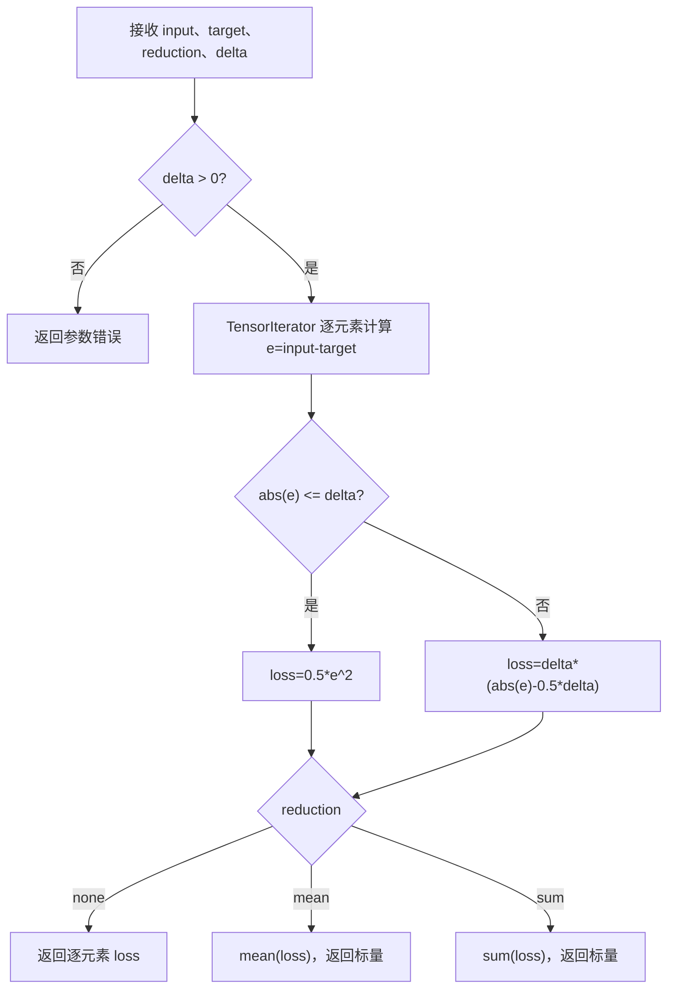
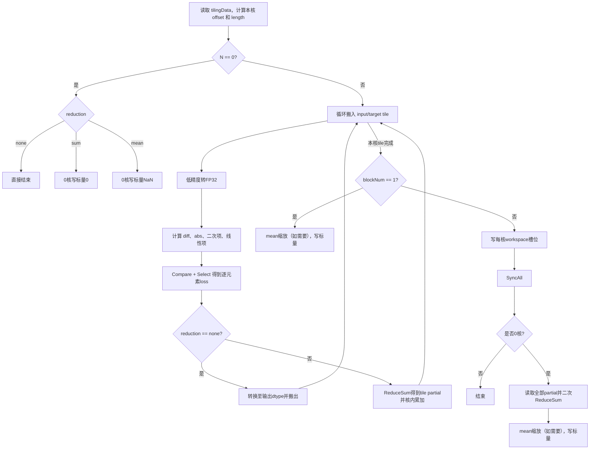

# 【社区任务】HuberLoss 算子设计文档

> 文档状态：评审稿  
> 目标算子：`aten::huber_loss` 前向算子  
> 目标硬件：Atlas A2 训练系列产品（`ascend910b`）  
> 软件基线：CANN 9.0.0 及以上  
> 目标仓库：`cann/ops-nn`  
> 目标目录：`experimental/loss/huber_loss`  
> 任务书：[8 月社区任务 - huber_loss 算子开发任务书](https://gitcode.com/cann/cann-ops-competitions/blob/master/04_tasks/01_community-task-2026/docs/202608/huber_loss_task_doc.md)

# 一、需求背景

## 1.1 需求来源

PyTorch 的 `aten::huber_loss` 当前在 NPU 后端无对应实现，运行时会 fallback 至 CPU。训练过程中由此产生的 Device/Host 数据搬运和 CPU 计算会显著拉长迭代时间。本任务要求基于 Ascend C 实现功能一致的 NPU 前向算子，消除该 fallback 路径。

## 1.2 背景介绍

### 1.2.1 参考实现与仓库现状

本任务不是历史 TBE 算子的 Ascend C 重写，参考实现为 PyTorch 原生 CPU 实现：

- PyTorch 调度与 reduction 逻辑：`aten/src/ATen/native/Loss.cpp` 中的 `huber_loss`、`apply_loss_reduction`。
- PyTorch 接口说明：[torch.nn.functional.huber_loss](https://docs.pytorch.org/docs/stable/generated/torch.nn.functional.huber_loss.html)。
- 昇腾目标仓库：`cann/ops-nn/experimental/loss/huber_loss`。

| CheckList 要求的参考项 | 本任务对应材料 |
| --- | --- |
| TBE 算子源码路径 | 不适用；任务书明确要求参考 PyTorch 原生实现 |
| TBE 算子信息库路径 | 不适用；不存在需要对齐的 TBE 注册信息 |
| 参考实现源码路径 | PyTorch `aten/src/ATen/native/Loss.cpp`，函数 `huber_loss`、`apply_loss_reduction` |
| 现有 Ascend C 源码路径 | `ops-nn/experimental/loss/huber_loss/op_host`、`op_kernel` |
| 可复用归约源码路径 | `ops-nn/experimental/loss/mse_loss/op_host/mse_loss_tiling.cpp`、`op_kernel/mse_loss.h` |

截至 2026-08-03，目标仓库 `master` 分支中的现有 `HuberLoss` 已具备以下基础能力：

- `op_host/huber_loss_def.cpp`：注册 `FLOAT32/FLOAT16/BFLOAT16`、ND、`delta` 和 `AutoContiguous()`。
- `op_host/huber_loss_tiling.cpp`：支持逐元素场景的多核切分及 UB 分块。
- `op_kernel/huber_loss.h`：支持 FP32 计算、分段选择和尾块非对齐搬运。
- 当前 README 和接口文档明确说明“不支持 reduction”，输出固定与输入同 shape。

因此，本任务的主要开发对象不是重复实现逐元素公式，而是补齐并验证完整的 `aten::huber_loss` 前向语义，尤其是 `mean/sum` 归约、标量输出、空张量和对应性能路径。

### 1.2.2 现状能力与任务差距

| 能力项 | PyTorch/任务书要求 | 现有 HuberLoss | 本方案 |
| --- | --- | --- | --- |
| 逐元素 Huber 公式 | 必须支持 | 已支持 | 复用并补充边界验证 |
| `reduction=none` | 必须支持 | 等价支持，但无 reduction 属性 | 显式注册并保持原路径 |
| `reduction=mean` | 必须支持，默认值 | 不支持 | 新增 FP32 两级归约和除以元素数 |
| `reduction=sum` | 必须支持 | 不支持 | 新增 FP32 两级归约 |
| FLOAT32/FLOAT16/BFLOAT16 | 必须支持 | 已支持 | 保持；低精度内部提升至 FP32 |
| ND、任意维度 | 必须支持 | 已支持 | Host 侧展平为一维元素流 |
| 非连续 Tensor | 必须支持 | `AutoContiguous()` | 保持，并补充调用链测试 |
| 空张量 | 合法输入 | 仅逐元素空输出 | 补齐 `sum=0`、`mean=NaN` |
| 输出 shape | none 同输入；mean/sum 为 0 维 | 固定同输入 | 按 reduction 推导 |
| workspace | reduction 按需 | 无 | 仅多核归约申请 |

### 1.2.3 PyTorch 参考实现描述

PyTorch 原生实现先校验 `delta > 0`，再通过二元 TensorIterator 计算逐元素 Huber loss，最后根据 reduction 执行 `mean`、`sum` 或原样返回。任务书明确禁止 input 与 target 广播，因此本算子在接口层将进一步收紧为 shape 和 dtype 完全相同。

逐元素计算令：

$$
e_i = input_i-target_i,\qquad a_i=|e_i|
$$

$$
l_i=
\begin{cases}
0.5e_i^2, & a_i\leq\delta \\
\delta(a_i-0.5\delta), & a_i>\delta
\end{cases}
$$

输出为：

$$
output=
\begin{cases}
\{l_i\}, & reduction=0\;(none) \\
\frac{1}{N}\sum_{i=0}^{N-1}l_i, & reduction=1\;(mean) \\
\sum_{i=0}^{N-1}l_i, & reduction=2\;(sum)
\end{cases}
$$

### 1.2.4 PyTorch 参考流程图



# 二、需求分析

## 2.1 外部组件依赖

| 组件 | 用途 | 依赖说明 |
| --- | --- | --- |
| PyTorch CPU `aten::huber_loss` | Golden 数据和语义基线 | 仅用于测试和行为对齐，不进入交付算子运行链 |
| ACLNN | 两段式接口、executor、stream 调度 | 新增或扩展 `aclnnHuberLoss` |
| AscendOpTest | 精度和泛化验证 | 使用工具默认阈值 |
| msProf/算子 Profiling 工具 | Kernel 耗时、带宽、计算利用率分析 | 用于性能验收和瓶颈说明 |

不引入第三方运行时依赖，不依赖 TBE DSL，不涉及图融合。

## 2.2 内部适配模块

| 模块 | 计划变更 |
| --- | --- |
| `op_host/huber_loss_def.cpp` | 新增可选属性 `reduction`，默认 1；保留 `delta` 默认 1.0；保持 A2 和三种 dtype 注册 |
| `op_host/huber_loss_infershape.cpp` | 根据 reduction 推导同 shape 或 0 维标量；校验输入 shape |
| `op_host/huber_loss_tiling.cpp` | 增加 reduction 校验、空张量、归约分核、workspace、schedule mode 和 tilingKey 选择 |
| `op_kernel/huber_loss_tiling_data.h` | 增加总元素数、分核、UB 分块、reduction、workspace 和 meanScale 字段 |
| `op_kernel/huber_loss_tiling_key.h` | 按 dtype 与“逐元素/归约”两类路径生成模板 key |
| `op_kernel/huber_loss.h/.cpp` | 增加核内归约、跨核汇总、空张量输出和标量写回 |
| `tests/ut`、`examples`、`docs`、`README.md` | 补齐 Host/Kernel UT、ACLNN 示例、接口与约束说明 |

## 2.3 需求模块设计

### 2.3.1 Ascend C 算子原型

建议内部算子原型如下：

| 参数 | 类型 | 数据类型 | 格式 | Shape/取值 | 说明 |
| --- | --- | --- | --- | --- | --- |
| `input` | 输入 Tensor | FLOAT32、FLOAT16、BFLOAT16 | ND | 任意维，各维度 ≥ 0 | 预测值 |
| `target` | 输入 Tensor | 与 input 相同 | ND | 与 input 完全相同 | 目标值，不广播 |
| `reduction` | 可选属性 | int64 | - | 0、1、2；默认 1 | 0:none，1:mean，2:sum |
| `delta` | 可选属性 | float | - | `delta > 0`；默认 1.0 | 分段阈值 |
| `output` | 输出 Tensor | 与 input 相同 | ND | none 同 input；mean/sum 为 0 维 | loss |

建议 ACLNN 两段式接口保持仓库命名习惯：

```cpp
aclnnStatus aclnnHuberLossGetWorkspaceSize(
    const aclTensor* input,
    const aclTensor* target,
    int64_t reduction,
    float delta,
    aclTensor* output,
    uint64_t* workspaceSize,
    aclOpExecutor** executor);

aclnnStatus aclnnHuberLoss(
    void* workspace,
    uint64_t workspaceSize,
    aclOpExecutor* executor,
    aclrtStream stream);
```

最终函数签名以目标仓库接口生成规范为准，但 reduction 编码、默认值和对外语义不得偏离任务书。

### 2.3.2 输入输出与异常约束

Host 侧必须在进入 Kernel 前完成以下校验：

1. input、target、output 指针有效。
2. input 与 target 的逻辑 shape、dtype 完全相同；不接受 broadcast。
3. dtype 仅允许 FLOAT32、FLOAT16、BFLOAT16，格式为 ND。
4. reduction 仅允许 0、1、2。
5. `delta > 0`；`delta=0`、负数和 NaN 均返回参数错误。正无穷满足 `delta > 0`，按 PyTorch 语义接受并加入边界测试。
6. none 模式 output shape 与 input 相同；mean/sum 模式 output 必须为 0 维标量；output dtype 与 input 相同。
7. shape 元素数乘积必须能由 tiling 字段表达，乘法过程检查溢出。
8. PyTorch 新版 Functional API 中的可选 `weight` 不在本任务书和 `aten::huber_loss` 原型范围内，本次不支持。

### 2.3.3 特殊输入语义

| 场景 | 预期结果 |
| --- | --- |
| `abs(e) == delta` | 进入二次分支；两个公式在边界处结果相同 |
| 标量输入（0 维） | none 输出 0 维；mean/sum 输出 0 维 |
| 空 Tensor，none | 返回同 shape 空 Tensor |
| 空 Tensor，sum | 返回标量 0 |
| 空 Tensor，mean | 返回标量 NaN |
| input/target 含 NaN | 对应输出传播 NaN；归约结果传播 NaN |
| 有限值与 ±Inf 的误差 | 对应 loss 为 +Inf |
| 非连续 Tensor | ACLNN/算子原型转连续后计算，数值与相同逻辑内容的连续 Tensor 一致 |

# 三、需求详细设计

## 3.1 使能方式

算子以 ACLNN 两段式接口使能，第一段完成参数校验、必要的连续化处理、输出 shape 准备、workspace 查询和 executor 构建；第二段在用户指定 stream 上异步执行。算子目录同步提供可复现的 ACLNN 调用示例。

PyTorch NPU 适配层负责把字符串 reduction 映射为任务书规定的整数编码：`none -> 0`、`mean -> 1`、`sum -> 2`。本交付范围为前向算子，不包含 backward，也不新增 fusion pass。

## 3.2 需求总体设计

### 3.2.1 Host 侧设计

#### 3.2.1.1 Shape 推导

- `reduction == 0`：`output.shape = input.shape`。
- `reduction == 1 || reduction == 2`：`output.shape = {}`，即 0 维标量。
- 动态 shape/rank 场景保留动态信息；运行期 tiling 使用 storage shape 计算本次实际元素数。
- input 与 target shape 不同直接失败，不进入 Kernel。

#### 3.2.1.2 分核策略

算子计算与原始维度无关，Host 将输入展平为长度为 $N$ 的一维元素流。设平台可用 Vector Core 数为 $C_{max}$，GM 搬运对齐元素数为：

$$
A=\frac{B_{block}}{sizeof(T)}
$$

其中 Atlas A2 的 data block 大小由 `GetUbBlockSize(context)` 获取，不在代码中硬编码。

一般场景下：

$$
F=AlignUp(\lceil N/C_{max}\rceil,A),\qquad
C=\lceil N/F\rceil
$$

第 $i$ 个核处理：

$$
offset_i=iF,\qquad L_i=\min(F,N-offset_i)
$$

具体策略：

- none：尽量满核，降低逐元素大 Tensor 的 GM 访问时间。
- mean/sum 且 $N$ 可在单核合理 tile 数内完成：使用单核，避免 workspace 和核间同步固定开销。
- mean/sum 且 $N$ 较大：使用多核两级归约，`C` 不得超过实际物理 Vector Core 数，避免 `SyncAll` 在多轮调度下产生异常同步。
- 空 Tensor：`blockDim=1`，由 0 核写入 reduction 对应特殊值或直接结束。

#### 3.2.1.3 数据分块与 UB 预算

开启输入、输出双缓冲。设 IO 类型字节数为 $S_{io}$，低精度提升标记 $U$ 在 FLOAT16/BFLOAT16 时为 1、FLOAT32 时为 0。采用保守预算：

$$
BytesPerElem = 6S_{io} + (4+2U)\times4 + 1
$$

其中：

- `6*Sio`：input、target、output 各 2 个 queue buffer。
- `4*4`：diff、abs、quadratic、linear 四个 FP32 临时 Tensor。
- `2*U*4`：低精度输入转换后的两个 FP32 Tensor。
- `1`：Compare 结果 mask。

预留框架和固定临时空间 $R$ 后：

$$
Tile=AlignDown\left(\frac{UB-R}{BytesPerElem},64\right)
$$

同时限制 `Tile <= 64 * 255`，使常用 Vector repeat 不超过接口上限；若最终 Tile 为 0，tiling 返回失败。实际实现通过 `GetCoreMemSize`、`GetUbBlockSize` 获取平台参数，不假设固定 UB 容量。

尾块使用 `DataCopyPad`：GM 到 UB 时按真实字节数搬入并用 0 填充右侧；UB 到 GM 时只写真实元素，防止越界。LocalTensor 起始地址保持 32B 对齐。

#### 3.2.1.4 Workspace 设计

none 或单核 reduction 不申请用户 workspace。多核 reduction 的 workspace 分为：

1. Ascend C 系统 workspace：按同仓归约算子惯例预留 16 MiB，供 `SetSysWorkspace`/`SyncAll` 使用。
2. 用户 workspace：每核一个独立且 data-block 对齐的 FP32 槽位：

$$
W_{user}=C\times AlignUp(sizeof(float),B_{block})
$$

Atlas A2 常见 32B data block 下，每核槽位为 32B。每个核只写自己的槽位，无写冲突；0 核在同步后统一读取所有槽位。槽位 padding 在 UB 中初始化为 0 后整块写出，确保二次 ReduceSum 不引入脏数据。

#### 3.2.1.5 TilingData 设计

```cpp
struct HuberLossTilingData {
    int64_t totalNum;                // 逻辑元素总数
    int64_t blockFactor;             // 单核最大处理元素数
    int64_t ubFactor;                // 单次 UB tile 元素数
    int32_t reduction;               // 0:none, 1:mean, 2:sum
    int32_t blockNum;                // 实际使用核数
    int32_t workspaceFloatsPerCore;  // 对齐后每核槽位包含的 float 数
    int32_t reserved;
    float delta;
    float meanScale;                 // N>0 ? 1.0f/N : quiet_NaN
};
```

元素总数和切分偏移使用 64 位字段以覆盖大 Tensor；枚举、核数和对齐槽位使用 32 位字段，避免无必要的 64 位 tiling 数据。

#### 3.2.1.6 tilingKey 规划

tilingKey 仅编码会影响编译期模板和无效分支裁剪的信息；mean 与 sum 只相差最终缩放，不单独生成模板。

| tilingKey | dtype | 路径 | 触发条件 |
| ---: | --- | --- | --- |
| 0 | FLOAT16 | none | `reduction == 0` |
| 1 | FLOAT16 | reduce | `reduction == 1 or 2` |
| 2 | FLOAT32 | none | `reduction == 0` |
| 3 | FLOAT32 | reduce | `reduction == 1 or 2` |
| 4 | BFLOAT16 | none | `reduction == 0` |
| 5 | BFLOAT16 | reduce | `reduction == 1 or 2` |

单核/多核 reduction 由 `blockNum` 在 reduce 模板内选择，避免继续膨胀 key 数量。多核 reduction 设置 `scheduleMode=1`，保证同步调度条件与同仓 MseLoss 归约路径一致。

### 3.2.2 Kernel 侧设计

#### 3.2.2.1 初始化

1. 根据 `GetBlockIdx()`、`blockFactor` 和 `totalNum` 计算本核 offset 与有效长度。
2. 为 input、target、output 建立 `GlobalTensor<T>`；归约路径额外建立 `GlobalTensor<float>` workspace。
3. 初始化双缓冲 queue、FP32 临时 Tensor、mask 和核内 partial buffer。
4. 多核归约入口调用 `SetSysWorkspace(workspace)` 并通过 `GetUserWorkspace(workspace)` 获取用户 workspace 起始地址；空指针直接返回，防止非法访问。

#### 3.2.2.2 逐元素计算

对每个 UB tile 执行：

1. `DataCopyPad` 搬入 input、target。
2. FLOAT16/BFLOAT16 使用 `Cast(..., CAST_NONE)` 转为 FP32；FLOAT32 直接计算。
3. `Sub` 得到 `diff`，`Abs` 得到 `absDiff`。
4. `Mul + Muls(0.5)` 计算二次分支。
5. `Adds(-0.5*delta) + Muls(delta)` 计算线性分支。
6. `CompareScalar(absDiff, delta, LE)` 生成 mask。
7. `Select` 选择两条分支结果。
8. none 路径将 FP32 结果转换回 IO dtype 后 `DataCopyPad` 搬出；FLOAT32 不转换。

各 Vector 指令之间按真实读写依赖插入 `PipeBarrier<PIPE_V>()`，不添加无依赖的冗余 barrier。

#### 3.2.2.3 reduction 计算

每核流程：

1. `partialLocal` 按完整 workspace 槽位初始化为 FP32 0。
2. 每个 tile 计算逐元素 Huber loss 后，使用 `ReduceSum<float>` 得到 tile partial，再累加至 `partialLocal[0]`。
3. 单核：sum 直接写回；mean 先乘 `meanScale` 再写回。
4. 多核：每核把对齐后的 partial 槽位写入独立 workspace，执行 `SyncAll()`；非 0 核退出。
5. 0 核搬入全部 partial 槽位并执行第二次 `ReduceSum<float>`；mean 再乘 `meanScale`。
6. 最终标量按 output dtype 转换并仅写一个元素。

这种设计的核间写地址互不重叠，归约树和核槽位顺序固定，避免浮点原子加导致的写竞争及额外不确定性。

#### 3.2.2.4 空张量路径

- none：不搬入、不计算、不写回。
- sum：0 核将 FP32 `0.0` 转换为 output dtype 并写回标量。
- mean：0 核将 `quiet_NaN` 转换为 output dtype 并写回标量。

空张量不进入 `1/N` 普通计算路径，避免除零行为依赖编译器优化。

#### 3.2.2.5 Ascend C 实现流程图



### 3.2.3 与 PyTorch 参考流程的差异及原因

| 差异点 | PyTorch CPU | Ascend C 方案 | 原因及语义影响 |
| --- | --- | --- | --- |
| 中间 Tensor | 先形成完整逐元素 loss，再调用通用 mean/sum | tile 内计算后立即归约 | 避免为完整 loss 申请 GM 中间空间；数学结果一致 |
| 低精度计算 | 由 PyTorch CPU kernel dtype 路径决定 | FP16/BF16 显式提升至 FP32 | 满足任务书对 reduction 精度的要求 |
| 并行策略 | CPU TensorIterator/线程池 | Vector Core 多核 + UB 分块 | 适配 NPU 存储层次与并行模型 |
| 非连续输入 | TensorIterator 直接处理 stride | ACLNN/OpDef 先连续化 | Kernel 保持连续搬运效率；外部功能不缺失 |
| 多核归约 | CPU 通用 reduction | 每核 partial + workspace + SyncAll + 0 核汇总 | 避免跨核写冲突，降低 GM 流量 |
| 空 mean | 通用 mean 产生 NaN | 显式写 quiet NaN | 避免除零实现差异，结果对齐 |

上述差异均为硬件适配或性能优化，不改变任务书定义的可观察接口语义。

## 3.3 支持硬件

| 硬件 | 支持情况 | 编译配置 |
| --- | --- | --- |
| Atlas A2 训练系列产品 | 支持 | `ascend910b` |

## 3.4 算子约束限制

1. 仅支持 Atlas A2 训练系列产品、ND、FLOAT32/FLOAT16/BFLOAT16。
2. input 与 target 的 shape、dtype 必须完全相同，不支持 broadcast。
3. reduction 仅支持 0/1/2；delta 必须大于 0。
4. 输出 dtype 与输入一致；低精度输入的中间计算和归约使用 FP32，但最终输出仍受目标 dtype 表示范围限制。
5. 当前作为独立前向 loss 算子，不实现 backward，不参与图融合。

# 四、特性交叉分析

| 特性 | 分析结论 | 验证方式 |
| --- | --- | --- |
| 动态 shape/rank | 支持运行期实际 shape tiling；未知元素数不能直接进入 Kernel | Host UT + 动态 shape ST |
| 非连续 Tensor | 通过 `AutoContiguous()` 支持 | transpose、slice、非零 storage offset 用例 |
| 空 Tensor | none/sum/mean 分别为空、0、NaN | 三 dtype 全覆盖 |
| 多流/重入 | Kernel 无静态可变状态；workspace 由每次 executor 独立管理 | 双 stream 并发测试 |
| 确定性 | 不使用原子加；相同 tiling 下 partial 顺序固定 | 同一输入重复 100 次比较 |
| 异常值传播 | NaN/Inf 按 FP 算术传播 | 特殊值用例 |
| 超大 Tensor | tiling 使用 64 位元素数和偏移，并检查 shape 乘积溢出 | 大 shape tiling UT；在资源允许时做 NPU ST |
| 混合精度 | 输出 dtype 不变，低精度内部 FP32 | FP16/BF16 与 FP32 reference 对比 |
| 图融合 | 不涉及 | 文档明确约束 |
| 兼容性 | 在现有逐元素接口上新增 reduction 时需同步升级 ACLNN 文档及调用方；若保留旧签名，应通过重载或兼容入口避免 ABI 破坏 | 接口编译检查 + 原有 none 用例回归 |

# 五、可维可测分析

## 5.1 精度标准

Golden 使用 CPU `aten::huber_loss`，输出比较采用 AscendOpTest 默认阈值。验收目标：

- 三种 dtype、三种 reduction 全部通过。
- 分段边界、空张量、标量、非连续输入、动态 shape 和泛化随机 shape 全部通过。
- 精度不低于 CPU 参考结果在对应 dtype 下的容差要求。
- mean/sum 的低精度路径必须证明采用 FP32 partial 和 FP32 二次归约。

重点精度用例：

| 类别 | 代表参数 | 目的 |
| --- | --- | --- |
| 分段边界 | `e={0, ±delta, ±nextafter(delta), ±2delta}` | 覆盖两分支和边界 |
| delta | `0.125, 1.0, 3.75, 很小正数, 大正数` | 属性泛化 |
| shape | `{}`, `{0}`, `{2,0,3}`, `{1}`, `{63}`, `{64}`, `{65}`, 非均匀多核、大于单 tile | 标量、空、对齐、尾块、多核、多 tile |
| dtype | FLOAT32/FLOAT16/BFLOAT16 | 全类型覆盖 |
| reduction | 0/1/2 | 输出 shape 和数值覆盖 |
| 数值范围 | 正负小数、最大有限值附近、NaN、±Inf | 溢出和传播语义 |
| layout | contiguous、transpose、slice、storage offset | 非连续 Tensor |
| 非法输入 | shape/dtype 不同、reduction 越界、delta≤0/NaN | Host 校验 |

随机泛化用例采用固定 seed，shape、delta、正负误差比例可复现；报告记录 PyTorch/CANN/驱动版本和 seed。

## 5.2 性能标准与测量方法

任务书要求达到相应 `compute bound` 或 `memory bound` 的 80%。按 Roofline 方法计算：

$$
T_{theory}=\max\left(\frac{Bytes}{BW_{peak}},\frac{Ops}{FLOPS_{peak}}\right),\qquad
Utilization=\frac{T_{theory}}{T_{measured}}
$$

- none 的最小 GM 流量按两个输入读取和一个输出写入计算：`Bytes >= 3*N*sizeof(T)`。
- mean/sum 的主数据流量按两个输入读取、每核 partial 写读和一个标量输出计算；不生成完整逐元素 GM 中间 Tensor。
- `Ops` 按实际 Vector 指令路径统计，Compare/Select 计入操作量说明，不用主观估算替代 profiler 数据。
- 初版核内归约复用同仓 MseLoss 的 `ReduceSum<float>`；如 profiler 显示其为主瓶颈，则在保持 FP32 累加的前提下切换为 Atlas A2 支持的 `BlockReduceSum`/`WholeReduceSum` 组合，并重新验证 mask、repeat、临时空间和数值误差。
- 每个 case 预热不少于 20 次，正式执行不少于 100 次，报告中给出中位数和 P90；Kernel 时间与 ACLNN 端到端时间分别列示。
- 对非连续 Tensor，分别报告连续化开销和纯 Kernel 开销，避免混淆算子本体效率。

性能 case 至少覆盖：

| 场景 | dtype/reduction | Shape 规模 | 观察重点 |
| --- | --- | --- | --- |
| 小 Tensor | 三 dtype × 0/1/2 | 1、63、64、65、1K | 启动、同步固定开销 |
| 中 Tensor | 三 dtype × 0/1/2 | 64K、1M | UB 流水与多核负载均衡 |
| 大 Tensor | 三 dtype × 0/1/2 | 16M 及资源允许规模 | 内存带宽利用率 |
| 尾块 | 三 dtype × 0/1/2 | 非 32B、非 256B 对齐 | DataCopyPad 和尾块损耗 |
| 非连续 | 代表 dtype × 0/1/2 | transpose/slice | 端到端连续化成本 |

若某个小 shape 因 Kernel launch、同步或连续化固定开销无法达到 80%，自测报告必须提供 profiler 截图、理论时延、实测时延、瓶颈分类及后续优化结论，不以单一平均值掩盖未达标场景。

## 5.3 可维护性与可定位性

- Host 校验错误包含算子名、参数名、实际值和期望范围。
- tiling 失败日志区分 shape 溢出、UB 不足、dtype、reduction、delta 和平台信息异常。
- tilingData 字段集中定义，Host/Kernel 共用同一头文件。
- 仅对硬件约束、workspace 布局和归约同步添加注释，避免重复解释直观代码。
- 自测 README 给出构建、安装、运行、Golden 生成、性能采集和结果复现命令。

## 5.4 兼容性分析

目标仓库当前 HuberLoss 接口仅含 delta，且只支持逐元素输出。增加 reduction 后，应在代码评审时确认采用以下一种兼容策略：

1. 推荐：保留原 `aclnnHuberLoss(input,target,delta,loss)` 入口并固定映射到 `reduction=none`，新增含 reduction 的完整入口；或
2. 若现有接口尚未对外发布，统一升级签名，并同步修改示例、文档和调用方。

无论选择哪种策略，原有逐元素数值和性能必须回归，不允许因新增 reduction 使 none 路径进入 workspace 或跨核同步。

# 六、开发与验证计划

## 6.1 开发步骤

1. 冻结接口与兼容策略，补充 reduction 属性、ShapeInfer 和参数校验。
2. 扩展 tilingData、tilingKey、UB 预算、单核/多核分核和 workspace 计算。
3. 复用现有逐元素 Huber 计算，新增 FP32 核内 partial、跨核归约和空张量路径。
4. 完成 Host UT、Kernel UT、ACLNN ST、非连续 Tensor 和异常参数测试。
5. 在 Atlas A2 上完成 AscendOpTest 精度验证和全场景 Profiling。
6. 根据 profiler 结果优化 tile、单核阈值、流水和 barrier，形成自测报告。
7. 更新 API 文档、README、示例和构建配置，提交验收及上游 PR。

## 6.2 交付件

| 交付件 | 内容 |
| --- | --- |
| 算子设计文档 | 本文，经任务提供方评审并按意见闭环 |
| 算子代码 | `op_host`、`op_kernel`、必要的 `op_api` 与 CMake 配置 |
| 自测用例及测试代码 | 精度、泛化、异常、性能用例；README 可复现 |
| 自测报告 | 用例参数、精度结果、性能数据、截图、未达标说明 |
| API 文档与示例 | `aclnnHuberLoss` 两段式接口和可运行示例 |
| 待验收代码地址 | 个人仓、分支、算子目录，并邀请 `Ascend-CANN` 开发者账号 |

## 6.3 风险及应对

| 风险 | 影响 | 应对措施 |
| --- | --- | --- |
| 现有公开接口无 reduction | 可能发生 ABI/调用兼容问题 | 设计评审阶段先冻结兼容方案；保留 none 兼容入口 |
| 多核归约小 shape 效率低 | 性能不足 | Host 设置单核阈值，避免不必要的 workspace 和 SyncAll |
| FP16/BF16 大规模 sum 溢出到输出 dtype | 输出 Inf，与 dtype 范围相关 | FP32 累加后仅最终转换；与 CPU 对应 dtype 结果和容差对齐 |
| `SyncAll` 调度约束违反 | Kernel 卡死 | `blockDim<=物理核数`，多核归约设置 scheduleMode，复用同仓 MseLoss 模式 |
| 非连续输入连续化成本高 | 端到端性能下降 | 单独报告转换与 Kernel 时间；保持 Kernel 连续访问效率 |
| 空 mean 行为遗漏 | 与 PyTorch 不一致 | Host 写入 `meanScale=NaN`，Kernel 显式空路径，加入三 dtype 用例 |
| API mask/repeat/对齐越界 | 精度或运行异常 | tile 64 元素对齐且 repeat≤255；尾块用真实 count；实现时按 A2 API 约束逐项复核 |

# 七、参考资料

1. [HuberLoss 社区任务书](https://gitcode.com/cann/cann-ops-competitions/blob/master/04_tasks/01_community-task-2026/docs/202608/huber_loss_task_doc.md)
2. [PyTorch `torch.nn.functional.huber_loss` 文档](https://docs.pytorch.org/docs/stable/generated/torch.nn.functional.huber_loss.html)
3. [PyTorch `aten/src/ATen/native/Loss.cpp`](https://github.com/pytorch/pytorch/blob/main/aten/src/ATen/native/Loss.cpp)
4. [ops-nn HuberLoss 目录](https://gitcode.com/cann/ops-nn/tree/master/experimental/loss/huber_loss)
5. [AscendOpTest 默认精度配置](https://gitcode.com/HIT1920/AscendOpTest/blob/master/compare/compare/accuracy_config.py)
