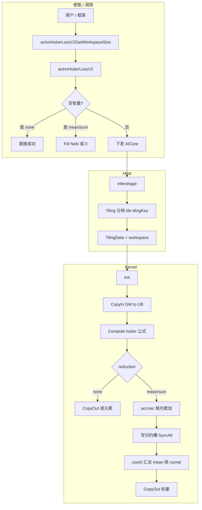
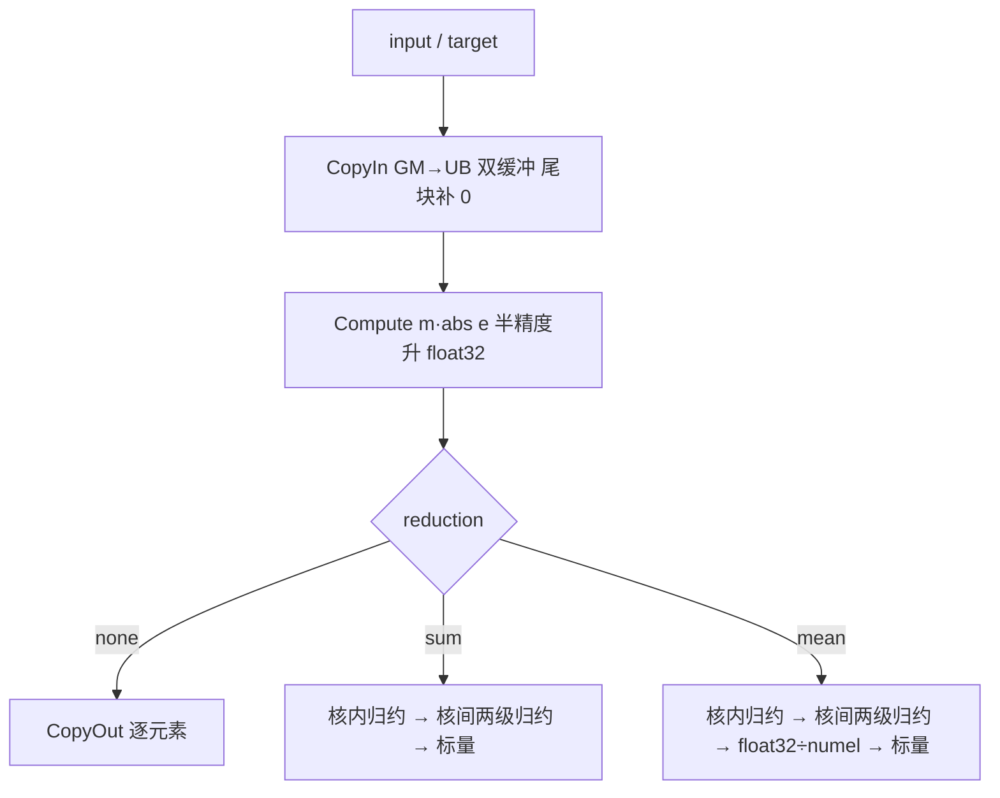
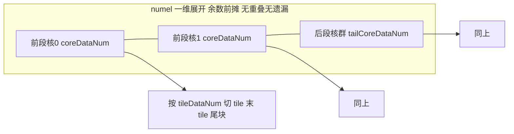
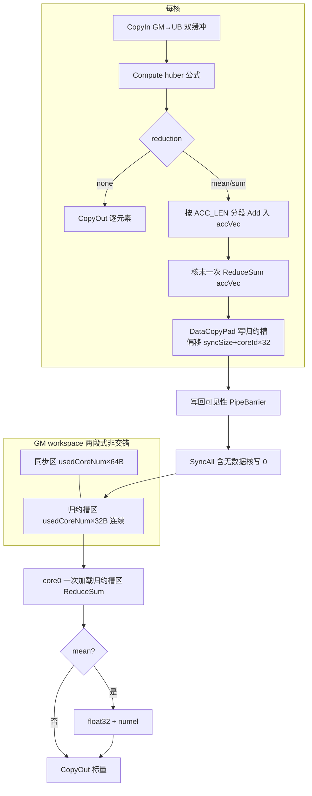

# HuberLossV2 算子设计文档

# 1. 需求背景（required）

## 1.1 需求来源

8 月社区任务 huber_loss 算子开发。`aten::huber_loss` 算子未被 NPU 后端支持，自动 fallback 至 CPU 执行，导致训练耗时显著增长（任务书原文作「指数级增长」），严重阻塞模型迭代周期。本任务在昇腾 NPU 上基于 Ascend C 编程语言实现与 PyTorch `aten::huber_loss` 前向功能一致的算子。

## 1.2 背景介绍

### 1.2.1 HuberLoss 实现优化背景

任务书明确：`aten::huber_loss` 未被 NPU 后端支持，训练时 fallback 至 CPU。本算子基于 **PyTorch aten 语义** 与 **ops-nn 同目录 loss 类参照**，以 Ascend C 新实现补齐 NPU 路径（路径口径见 §1.2.2）。

| 对照对象 | 路径 / 说明 |
|---|---|
| 算法与语义 | PyTorch `aten::huber_loss`（文档与 `aten/src/ATen/native/Loss.cpp` / CPU `BinaryOpsKernel.cpp`） |
| 仓内参照（工程惯例） | ops-nn `experimental/loss/smooth_l1_loss_v2/`（host tiling、kernel 两级归约、aclnn 空张量 Fill） |
| 仓内存量（能力不足） | ops-nn `experimental/loss/huber_loss/`（仅逐元素，无完整 reduction/aclnn） |
| 交付目录（目标） | ops-nn `experimental/loss/huber_loss_v2/` |
| 调用入口（目标） | aclnn 两段式 `aclnnHuberLossV2GetWorkspaceSize` / `aclnnHuberLossV2`（形态对齐 ops-nn loss 类 `op_host/op_api/aclnn_*.cpp`） |

### PyTorch aten::huber_loss 语义

设误差 `e = input - target`，逐元素损失为分段函数：

- 当 `|e| ≤ delta` 时，`loss = 0.5 * e²`
- 当 `|e| > delta` 时，`loss = delta * (|e| - 0.5 * delta)`

支持三种 reduction 模式：0=none（逐元素输出）、1=mean（取均值，默认）、2=sum（求和）。属性 delta 必须大于 0，默认 1.0。支持数据类型 float32、float16、bfloat16，数据格式 ND。

### 1.2.2 算子现状分析

本算子以 Ascend C 实现，不涉及 TBE/DSL 路径；模板中与 TBE 相关的栏位（数据类型/格式表、实现描述、流程图、与历史实现差异等）均以 **Ascend C 方案及 ops-nn 参照** 填写。

#### 目标能力（任务书）

| 参数 | 含义 | 数据类型 | 数据格式 | 约束 | 形状 |
|---|---|---|---|---|---|
| input | 预测值 | float16 / float32 / bfloat16 | ND | 与 target 同 shape、同 dtype | 任意维，维长 ≥ 0 |
| target | 目标值 | 同 input | ND | 不支持 broadcast | 同 input |
| reduction | 归约 | int 属性 | — | 仅 0/1/2 | — |
| delta | 阈值 | float 属性 | — | > 0 | — |
| output | 损失 | 同 input | ND | none 同形；mean/sum 标量 | 见上 |

#### 存量 HuberLoss（ops-nn）能力缺口

注册名 HuberLoss：仅逐元素，**不支持** reduction mean/sum，aclnn/op_api 未完备。故以 **HuberLossV2** 独立目录交付，与存量并存（命名对齐 `smooth_l1_loss_v2` 等 v2 惯例）。

#### 参照实现要点（smooth_l1_loss_v2）

host 按 numel 一维切分、余数前摊；kernel 双缓冲搬算；mean/sum 走 workspace 两级归约 + SyncAll；空张量 aclnn 层 Fill；半精度升 float32。本算子按 huber 公式与任务书 reduction 枚举实现，差异见 §3.2.2.3。

#### 实现流程总览



### 功能分析

| 参数名 | 输入/输出/属性 | 描述 | 数据类型 | 数据格式 | 维度 |
|---|---|---|---|---|---|
| input | 输入 | 预测值张量 | FLOAT32、FLOAT16、BFLOAT16 | ND | 任意维度，各维度 ≥ 0，支持非连续 |
| target | 输入 | 目标值张量，shape 和 dtype 须与 input 一致 | 同 input | ND | 与 input 相同，支持非连续 |
| reduction | 可选属性 | 归约模式，默认 1。0=none，1=mean，2=sum | int | - | - |
| delta | 可选属性 | 分段阈值，默认 1.0，须大于 0 | float | - | - |
| output | 输出 | loss 结果。none 时与 input 同 shape；mean/sum 时为标量（0 维） | 同 input | ND | 与 input 相同或标量 |

计算流程：



# 2. 需求分析（required）

## 2.1 需求描述

使用 Ascend C 编程语言实现 HuberLossV2 算子，与 PyTorch `aten::huber_loss` 前向完全对齐：支持 float32/float16/bfloat16、ND 格式、任意维度、非连续输入、reduction 三模式、delta 属性，满足各类合法输入场景的泛化计算需求。

## 2.2 需求拆解

1. 功能：分段逐元素计算 + reduction none/mean/sum + delta 属性。
2. 泛化：覆盖以下六个维度，各维度的泛化边界与设计应对见下表。
3. 精度：满足 AscendOpTest 默认阈值，与 CPU `aten::huber_loss` 结果对齐（半精度的参考口径见 §3.1.1）；float16/bfloat16 内部提升至 float32 计算。
4. 性能：达到 80% 的计算瓶颈或访存瓶颈上界（roofline 判据，定义与测法见 §4.1）。
5. 边界：非法输入（delta ≤ 0、reduction 非法、input/target shape 或 dtype 不一致）须在 host 侧拦截并报错。

### 泛化维度与设计应对

| 维度 | 泛化边界 | 设计应对 | 详见 |
|---|---|---|---|
| shape | 任意维度，含 0 维标量、含空 tensor、非对齐尾块、numel 至 10⁸ | tiling 按 numel 一维展开；尾块补 0 处理；空 tensor 由 aclnn 接口层分流处理；小 shape 走单核 tiling 分支 | §3.2.1 |
| 连续性 | input/target 支持非连续 | OpDef 声明 AutoContiguous + aclnn 接口层转连续两层保证，kernel 只处理 ND 连续内存 | §3.2.3 |
| dtype | float32 / float16 / bfloat16 | 半精度升 float32 计算、输出前一次舍入；每元素字节数按 dtype 分别推导 | §3.2.1 |
| reduction | none / mean / sum + 非法值拦截 | 三条 kernel 路径；mean/sum 走两级归约；非法值在 tiling 校验报错 | §3.2.2 |
| delta | 任意正数，含极大/极小 | 计算式 m·(a−0.5m)（m=min(a,δ)，a 为 e 的绝对值）对 delta 无分支依赖；delta ≤ 0 在 tiling 校验报错 | §3.1.1 |
| 硬件 | UB 容量、核数随产品变化 | 全部运行时获取（GetCoreMemSize / GetCoreNumAiv），无写死常量；tile 上限由公式按实测 UB 推导 | §3.2.1 |

## 2.3 外部组件依赖

无第三方库依赖。运行与构建依赖 CANN 工具链（任务书：CANN 9.0.0 及以上）：acl/aclnn 调用框架、AICore 下发、Host tiling 平台接口（核数/UB 等）、图模式 infershape（若走 GE）。CPU 侧 PyTorch 仅用于自测参考，不链入算子运行时。

## 2.4 内部适配模块

| 模块 | 职责 |
|---|---|
| OpDef / 算子注册 | 注册名 HuberLossV2，dtype/format/属性、AutoContiguous、AICore 产品形态 |
| infershape | 输出 shape；非法 reduction / shape·dtype 不一致报错 |
| Tiling | 分核、tile、tilingKey、workspace、delta/reduction 校验；图模式空张量兜底 |
| Kernel（AICore） | 双缓冲搬算、逐元素公式、none 直出 / mean·sum 两级归约 |
| aclnn（op_api） | 两段式入口、非连续转连续、空张量分流、参数检查 |

## 2.5 Ascend C 算子原型与相关约束

### 原型（aclnn 两段式）

```text
aclnnStatus aclnnHuberLossV2GetWorkspaceSize(
    const aclTensor *input,
    const aclTensor *target,
    int64_t reduction,       // 0=none, 1=mean, 2=sum
    double delta,            // >0；内部转换为 float32（见下）
    const aclTensor *output,
    uint64_t *workspaceSize,
    aclOpExecutor **executor);

aclnnStatus aclnnHuberLossV2(
    void *workspace,
    uint64_t workspaceSize,
    aclOpExecutor *executor,
    aclrtStream stream);
```

与任务书参数表一致；较存量 HuberLoss **增补** reduction、完整 mean/sum、aclnn 空张量语义。属性默认：reduction=1，delta=1.0。

**delta 类型与校验顺序**：aclnn 入参为 double，tiling/kernel 使用 float32。须先 `double → float32` 再做 `delta > 0` 判定——极小正 double（如 1e-300）转换后可下溢为 0，若先按 double 校验再转换，会把「转换后已非法」的值放行。下溢为 0 或非有限值一律按非法 delta 拒绝。

### 相对参照的约束说明

- 相对任务书：全部约束落实（见 §3.4）；mean/sum 内部 float32 累加按任务书「建议」执行。
- 相对存量 HuberLoss：补齐 reduction 与 aclnn。
- 相对 smooth_l1_loss_v2：工程结构可对齐；**reduction 按任务书 0/1/2（none/mean/sum）**，不照抄参照 kernel 内 1↔2 对调。

# 3. 详细设计（required）

## 3.0 使能方式

通过 **ACLNN 两段式** 使能（社区 loss 类主路径）：

1. `aclnnHuberLossV2GetWorkspaceSize`：推导 workspace、构造 executor；
2. `aclnnHuberLossV2`：在指定 stream 上执行。

图模式（GE）下由 OpDef 注册的 infershape + tiling + kernel 使能；空张量由 tiling/kernel 兜底（§3.2.1），与 aclnn 路径对外语义一致。不涉及自定义融合使能。

## 3.1 算子分析

### 3.1.1 数学公式

逐元素定义见 §1.2。reduction 定义：none 输出逐元素 loss；sum 输出全部元素 loss 之和；mean 输出总和除以元素个数 numel。空张量（numel=0）边界语义与 PyTorch 对齐：sum 输出 0，mean 输出 NaN（空和 0 除以 0 的自然结果），none 输出空张量。

kernel 采用的计算形式为：

```
loss = m · (|e| − 0.5·m)，其中 m = min(|e|, δ)
```

等价性证明：当 |e| ≤ δ 时 m = |e|，则 m·(|e|−0.5m) = |e|·(|e|−0.5|e|) = 0.5e²；当 |e| > δ 时 m = δ，则 m·(|e|−0.5m) = δ·(|e|−0.5δ)。两支分别等于定义的两段，边界 |e| = δ 处两式同值（0.5δ²）。

逐位等价性（由浮点运算规则推出，不依赖实测；经 PyTorch 源码确认）：aten CPU kernel（`aten/src/ATen/native/cpu/BinaryOpsKernel.cpp` 中 huber_kernel）与 torch/_refs 均为 `z < delta ? 0.5*z*z : delta*(z-0.5*delta)`——分支条件为严格小于，二次支 0.5*z*z 左结合即 (0.5·z)·z。本算子线性支表达式与 aten 逐字相同，运算序列一致，逐位等价；二次支由 Sterbenz 引理（x=a、y=0.5a，比值恰为 2 落在区间端点，a−0.5a 精确无舍入）退化为 a·(0.5a)，由浮点乘法交换律与 aten 的 (0.5a)·a 逐位相同；边界 |e|=δ 时 aten 走线性支，本算子恒等式同样退化为线性支表达式，逐字相同。

上述逐位断言的适用范围：float32 正常数直接成立；float16/bfloat16 的逐位断言对「先转 float32 计算、末端一次舍入」的参考实现成立。与 aten 发布版结果是否逐位一致，取决于该版本、该数据类型是否也采用先转 float32 的做法（见下）。“乘积仅一次舍入”等关于中间精度的说法均以正常数为前提；次正规数区域及「0.5a 落入次正规」的正常数（如 a∈[2⁻¹²⁶, 2⁻¹²⁵)）上 Sterbenz 前提可能失效，其逐位关系**将由**全域穷举确认（见 §4.2；实现期跑完后回填日期与结果）。

半精度如何计算：本算子选择 **在 float32 中完成算术，输出前再转回原类型**。依据：①舍入更少；任务书对 mean 归约「建议」内部提升 float32 以避免精度损失（原文为建议，非强制）；②不增加逐步类型转换，有利于性能（bfloat16 + mean 是算力与带宽谁先到顶的临界场景）；③PyTorch autocast 在 `AT_FORALL_FP32`（`aten/src/ATen/autocast_mode.h`）中登记 `huber_loss`：混合精度下先将输入提升为 float32 再计算；④ops-nn 已合入的 smooth_l1_loss_v2 对半精度同样 float32 内算并通过验收；⑤精度测试惯例要求参考实现的精度高于被测实现——自测用 float32 参考正是落实该要求。

**与发布版 aten 半精度路径的关系（结论）**：CPU 上 float16 的 float32 特化（源码关键字 `Special-case kHalf`，kHalf 为 PyTorch 中 float16 的类型标识）**自 2.10.0 起出现**；bfloat16 各版本均为逐算子舍入；CUDA 侧 huber 对各半精度均为逐算子。检索方法：`https://raw.githubusercontent.com/pytorch/pytorch/<tag>/aten/src/ATen/native/cpu/BinaryOpsKernel.cpp` 查上述关键字。分版本命中表与环境实测见**自测证据附录**（随自测报告提交，不在本设计文档内）。

**验收判据**：混合容差 `|实际−参考| ≤ atol + rtol·|参考|`（与 `numpy.isclose` 同类）。AscendOpTest 默认：float16 为 rtol/atol/允许超差比例 = 1×10⁻³ / 1×10⁻³ / 0.1；bfloat16 为 4×10⁻³ / 4×10⁻³ / 0.1。不得以「纯相对、无 atol」作为验收风险依据。

**为何 bfloat16 上「与 aten 半精度逐元素比」会误判（机制，保留）**：相邻可表示数间距（1 ulp）约与相对 ulp×\|v\| 成正比（bfloat16 相对 ulp 约 3.9×10⁻³~7.8×10⁻³）。混合容差 = 4×10⁻³ + 4×10⁻³·\|v\|。bfloat16 的 4×10⁻³ 阈值约为 ulp 上沿的一半，大 loss 下 1 ulp 偏差往往盖不住；同时 delta 较小时两路径在线性支上本就接近，差异未必发生。故「路径差是否出现」与「出现后是否超容差」两因子共同决定超差率——超差随 **delta** 升高而趋于约 24%~34%（任务书仅约束 delta>0、无上界，验收可取大 delta）。完整扫表见自测证据附录（不在本文）。

**分辨力（结论）**：存在两个仅公式写法不同的合法 bfloat16 实现，在大 delta 下互相混合容差超差约 21%~37%，即以发布版 aten 的 bfloat16 做逐元素比对**会把正确实现判为不合格**。对照配方与全表见自测证据附录（不在本文）。因此：**自测参考用 float32**；ops-nn 中 smooth_l1_loss_v2 先例一致。**后手**：若验收坚持 aten bfloat16 逐元素比对 none 输出，可将 bfloat16+none 切换为全程 bfloat16 计算（与 aten 逐算子路径对齐、已验证可逐位一致），代价是精度相对 float32 内算下降、指令增多；mean/sum 仍 float32 累加。

**九种 dtype×reduction 组合的结论**：
- float32 × none：与参考**逐位一致**（结构证明；全域穷举为待做的实现级确认，见 §4.2）
- float32 × {mean, sum}：因多核/多 tile 累加顺序与 aten 不同，**不主张逐位一致**；累加相对误差约 2×10⁻⁷ 量级（§3.2.2），远低于阈值 1×10⁻⁴
- float16 × none：与 aten 半精度路径的逐元素混合容差超差低于 10% 允许比例（扫表见附录）；torch≥2.10 更可逐位对齐
- float16 × {mean, sum}：标量输出，不适用「元素超差比例」；float32 内算下与「先 float32 再转回」的参考标量一致，阈值内对齐
- bfloat16 × {mean, sum}：标量路径在含大 delta 的多档规模下无随 N 放大的系统偏置（明细见附录）；自测主判据仍为 float32 参考
- bfloat16 × none：不宜以 aten bfloat16 逐元素为唯一标准（见上机制与分辨力）；自测参考用 float32；必要时切后手路径

选型理由：该形式无需 Compare/Select 分支；与 PyTorch 线性支的运算顺序一致；二次支中 |e|−0.5|e| 为精确运算，乘积仅一次舍入；且 NaN 输入经 |e|−0.5m 必然得到 NaN，保证 NaN 传播语义。

### 3.1.2 支持数据类型

float32、float16、bfloat16。float16/bfloat16 输入在 kernel 内升 float32 计算，输出前转回原类型（与 torch≥2.10 对 float16 先转 float32 的方向一致；与 torch≤2.9 的逐算子半精度路径及 bfloat16 全程逐算子路径存在设计性差异，选择依据与风险边界见 §3.1.1）。mean/sum 的累加与除 numel 均在 float32 域完成（与 aten 归约在更高精度下累加的做法一致，亦任务书建议）；输出前的降精度转换仅发生一次。类型转换规则：升精度 CAST_NONE（位模式直接扩展，无精度损失），降精度 CAST_RINT（四舍五入到最近偶数）。

### 3.1.3 支持形状

ND、任意维度（含 0 维）。input 与 target 的 shape、dtype 必须一致，不支持 broadcast。非连续输入由 OpDef AutoContiguous 声明与 aclnn 接口层双重保证转为连续，kernel 只处理连续内存。

输出 shape 推导规则（infershape）：reduction=0 时输出与 input 同形；reduction=1/2 时输出为标量（0 维）；reduction 非法时返回 GRAPH_FAILED 兜底（与 tiling 校验构成双层防御）。默认属性：reduction 默认 1，delta 默认 1.0。

## 3.2 算子实现

### 3.2.1 host 侧设计

#### tiling 策略

算子为逐元素语义，计算与维度信息无关，host 侧将输入按总元素数 numel 一维展开处理。

UB 切分与双缓冲：tile 上限按可解释的减法推导：

```
ACC_LEN = 256          # accVec 元素数（1KB float32），亦为 tile 对齐粒度
ubAvail = ubTotal − ACC_BUF（仅 reduce 路径，ACC_LEN×4B）− WORK_BUF（ReduceSum 等 API 所需临时区，按实际 buffer 布局计入）− 对齐 padding（队列路数 × 32B）
tileMax = align_down(ubAvail / bytesPerElem, ACC_LEN)   # 必须为 ACC_LEN 整数倍
```

tile 对齐取 256 的两个理由：① DataCopy 32B 块与向量 lane 的实用公约粒度；② reduce 路径 accVec 分段累加要求 `tileDataNum % ACC_LEN == 0`（见 §3.2.2），两路径共用同一对齐避免分叉。

ubTotal 取平台接口值 196352B/核（Atlas A2 训练系列实测，2026-08-03）。实测另发现：最小 kernel 可申请并全量使用 196608B，而 197120B 编译通过但运行期失败——**编译器不检查 UB 溢出**，这正是 ubTotal 必须取平台保守值而非物理顶值的依据。每元素字节数按计算路径分列（以 float16 为例）：

- none 路径：队列 3 路（2 输入 + 1 输出）× 2B × 双缓冲 = 12B，float32 临时缓冲 2~4 个 = 8~16B，合计约 20~28B/元素
- reduce 路径：队列 2 路（仅输入）× 2B × 双缓冲 = 8B，float32 临时缓冲，合计约 16~24B/元素（ACC_BUF 与 WORK_BUF 为固定项，已在上式单独扣除，不摊入每元素字节数）

float32 路径按 4B/路同理推导。计算 tile 上限时取各区间的上界（保守值）代入公式。向量核 40 核、32B 对齐块由平台接口运行时获取。

TilingData 主要字段（host→kernel 契约，以实现为准）：

| 字段 | 类型 | 含义 |
|---|---|---|
| totalNumel | uint64 | 总元素数（aclnn 路径空张量已分流，通常 >0；图模式可为 0，见空张量兜底） |
| usedCoreNum | uint32 | 实际启用核数（小 shape 或空张量兜底时为 1） |
| coreDataNum / tailCoreDataNum | uint32 | 前段核 / 后段核每核元素数（余数前摊；后段核群共享 tailCoreDataNum） |
| tileDataNum | uint32 | 单 tile 元素数（按路径公式推导、对齐取整） |
| reduction | int | 0=none、1=mean、2=sum |
| delta | float | 分段阈值（已校验 >0） |

#### 分核策略

满核优先、余数前摊：能均分时各核数据块一致；不能均分时余出数据块分配到前几个核。usedCoreNum 由 tiling 计算：numel 小于单核阈值时只启用 1 核（跳过 workspace 与核间同步）。阈值取约 3×10⁴ 量级（微基准 tile=2048；正式实现可能偏高，测法见自测证据附录）。核间边界按对齐块粒度划分且元素守恒（无重叠、无遗漏）。



#### tilingkey 规划

tilingkey 按 reduction 模式划分：none 直出、sum/mean 归约。none 与归约路径的缓冲集合和输出队列差异较大，编译期分裂使各路径 UB 预算独立；归约路径的大/小 shape 分档以 tiling 参数区分，不新增 tilingkey。

reduction 属性为 int 类型（0=none、1=mean、2=sum），解析与校验在 host 侧独立实现。注意：ops-nn 中 smooth_l1_loss_v2 在 kernel 内 reduction 取值与任务书不一致（1=sum、2=mean），本算子按任务书定义实现，不照抄该参照。

#### 空张量处理

校验前序不可交换，在**进入空张量分流之前**完成：delta > 0 → reduction 合法 → shape/dtype 一致（空张量同样校验 delta，对齐 PyTorch）。两条路径语义对齐、分层承接：

**aclnn 单算子路径**（主路径）：空张量在接口层分流，不下发 kernel、不进 tiling——
- reduction=none：直接返回成功（不 launch、不填充；workspace 大小 0）
- reduction=mean/sum：调用 Fill 类算子写标量（mean→NaN、sum→0）后返回，与 ops-nn 中 loss 类算子惯例一致

**图模式路径**（GE 不经 aclnn）：numel=0 可能进入 tiling。tiling 兜底：`usedCoreNum=1`、`coreDataNum=0`、`totalNumel=0`，仍 launch 单核最小 kernel——kernel 识别 `coreDataNum==0` 后：none 直接返回；mean/sum 写标量 NaN/0（与 aclnn Fill 语义一致），不走多核 workspace/SyncAll。参照实现 smooth_l1_loss_v2 核内保留 `coreDataNum==0` 兜底，本算子同构。契约：**aclnn 路径空张量不进 tiling；图模式由 tiling+kernel 兜底**——两条路径对外语义相同。

#### 数据检测 / 非法输入路径

kernel 内不做参数校验（device 侧无报错通道），全部非法输入在 host 侧拦截：

| 层 | 机制 | 行为 |
|---|---|---|
| infershape | 返回错误码 | input/target shape、dtype 不一致，或 reduction 非法（影响输出 shape 推导）时返回 ge::GRAPH_FAILED 并记录日志 |
| tiling | 返回错误码 | delta ≤ 0（在 float32 域判定，避免 double→float 下溢成 0）、reduction 不属于 {0,1,2} 时返回 ge::GRAPH_FAILED |
| aclnn 接口 | 返回 aclnnStatus | 参数非法返回 ACLNN_ERR_PARAM_INVALID |

### 3.2.2 kernel 侧设计

kernel 分 Init 与 Process 两阶段，Process 按 CopyIn（GM→UB）、Compute、CopyOut（UB→GM）三段式组织，双缓冲下第 i 块 Compute 与第 i+1 块 CopyIn 流水交叠。

**none 分支**：逐元素计算 `m·(|e|−0.5m)` 后直接写出。尾块经 DataCopyPad 搬运，输入不足一个 tile 的部分补 0（补 0 元素 loss 为 0，不影响结果），仅有效数据写出。

**sum/mean 分支**（两级归约，流程见 §3.2.2.2）：

1. 核内：常驻 float32 向量累加器 `accVec`，长度 `ACC_LEN=256`（1KB），**不随 tile 缩放**。每个 tile 得到 `loss[0..tileLen)` 后按 `ACC_LEN` 分段累加（`tileLen` 必为 `ACC_LEN` 整数倍，见 §3.2.1 对齐理由）：
   ```
   for (off = 0; off < tileLen; off += ACC_LEN)
       Add(accVec, accVec, loss[off], ACC_LEN);
   ```
   **全程不把向量结果读回标量**，双缓冲流水不被打断；该核全部 tile 处理完后才做一次 `ReduceSum(accVec)` 并读回标量，得本核部分和。每元素仍仅 1 次向量 Add，§4.1 指令计数不变。每个 tile 做一次归约并读回标量的写法会在每个 tile 引入流水停顿，仅作调试或对照，不作主路径。ReduceSum 目的地址按对齐配置、临时区按有效长度申请并尾部清零，读回标量前保证同步。
2. 核间：各核将部分和写入 GM workspace **归约槽区**各自槽位（偏移 `syncSize + coreId×32`，每槽 32B，仅 lane 0 有效，其余清零）；写回可见性保证后执行 SyncAll——所有被 launch 的核（含无数据核，写 0 部分和）均须进入屏障。同步区与归约槽区分段布局，避免 core0 加载时把同步区字节一并累加。
3. 汇总：core0 一次加载**连续归约槽区**做 ReduceSum 得总和；mean 在 float32 域除以 numel；最后一次类型转换后经 DataCopyPad 按实际字节数写出标量。`coreDataNum==0`（图模式空张量兜底）时跳过上述归约，直接写 NaN/0 标量。

尾块补 0 元素经计算后 loss 为 0，不污染归约结果。workspace 按两段式 `syncSize(usedCoreNum×64B) + reduceSize(usedCoreNum×32B)` 加系统预留（GetLibApiWorkSpaceSize）配置，并声明 SetNeedAtomic(false)。

核内累加采用常驻向量累加器，跨 tile 误差按 O(N/lane) 量级增长。在更差的逐 tile 标量累加结构下，相对误差约 2×10⁻⁷（10⁸ 元素量级），远低于 float32 阈值 1×10⁻⁴；loss 各项非负、无对消，故**不采用 Kahan 补偿**（ops-nn 中有采用先例；模拟过程见自测证据附录，不在本文）。半精度路径精度瓶颈在输出舍入（约 4×10⁻³ 量级）而非累加，故内部仍升 float32 累加。

**同步策略**：搬运与计算之间以 EnQue/DeQue 队列同步为原则，不以手动屏障替代；向量指令间存在数据依赖时按依赖使用 PipeBarrier<PIPE_V>。

#### 3.2.2.2 Kernel 实现流程图



#### 3.2.2.3 与参照实现的差异及原因

下表相对 **ops-nn 存量 HuberLoss** 与 **smooth_l1_loss_v2** 说明差异及取舍原因。

| 点 | 存量 HuberLoss | smooth_l1_loss_v2 | 本算子 HuberLossV2 | 原因 |
|---|---|---|---|---|
| reduction | 无 / 不完整 | 有 mean/sum | 任务书 0/1/2 全支持 | 对齐 aten 与任务书 |
| reduction 枚举 | — | kernel 内存在 1↔2 与任务书对调 | **不照抄**，按任务书 1=mean、2=sum | 避免语义错误 |
| 核内累加 | — | 常见逐 tile 归约 + 补偿累加 | **accVec 常驻向量累加**，不用 Kahan | 流水；误差余量足够 |
| workspace | — | sync 区 + 归约槽两段式 | 同构两段式 | 对齐仓内惯例 |
| 空张量 | 不完备 | aclnn Fill | aclnn 分流 + 图模式 kernel 兜底 | 双路径语义一致 |
| 公式 | huber 逐元素 | smooth L1 | 恒等式 m·(\|e\|-0.5m) | 无分支、与 aten 线性支同序 |
| 目录/注册名 | HuberLoss | SmoothL1LossV2 | HuberLossV2 | 与存量并存、v2 惯例 |

### 3.2.3 op_api / aclnn 接口设计

新增 aclnn 接口 aclnnHuberLossV2（两段式：aclnnHuberLossV2GetWorkspaceSize + aclnnHuberLossV2），参数为 input、target、reduction（int64）、delta（double，转换为 float32 后参与 tiling/kernel；校验顺序见 §2.5）、output。接口层完成：

- 参数空指针与合法性检查（非法返回 ACLNN_ERR_PARAM_INVALID）
- 非连续输入转连续
- 空张量分流：reduction=none 且元素数为 0 时直接返回成功；mean/sum 且元素数为 0 时调用 Fill 类算子写标量（mean 填 NaN、sum 填 0）——与 ops-nn 中 loss 类算子惯例一致
- 调用算子框架执行

OpDef 注册：注册名 HuberLossV2，input/target/output 声明 AutoContiguous，dtype 列表 FLOAT32/FLOAT16/BFLOAT16，格式 ND，属性 reduction（int，默认 1）、delta（float，默认 1.0），AICore 配置 ascend910b。

## 3.3 支持硬件

| 支持的芯片版本 | 涉及勾选 |
|---|---|
| Atlas A2 训练系列（CANN 9.0.0 及以上） | √ |

## 3.4 算子约束限制

- input 与 target 必须具有相同的 shape 和 dtype，不支持 broadcast
- reduction 仅支持 0（none）、1（mean）、2（sum），其他值属非法输入
- delta 必须为正数（> 0）
- 输出 dtype 与 input/target 一致；reduction=mean/sum 时内部累加提升至 float32 计算后再转回输出 dtype
- 作为独立 loss 算子实现，不涉及图融合
- 空张量：aclnn 路径接口层分流；图模式由 tiling+kernel 兜底（§3.2.1），两条路径对外语义一致
- **重入**：kernel/host 实现不依赖跨调用保留的静态可变状态；每次执行仅使用本次入参、tiling 与框架下发的 workspace（便于多 stream 并发）

# 4. 可维可测分析

## 4.1 精度标准 / 性能标准

| 验收标准 | 描述 | 标准来源 |
|---|---|---|
| 精度标准 | 满足 AscendOpTest 默认阈值：float32 [1e-4, 1e-4, 0.1]、float16 [1e-3, 1e-3, 0.1]、bfloat16 [4e-3, 4e-3, 0.1]（依次为相对容差、绝对容差、允许超差比例）；判据为混合容差 \|实际−参考\| ≤ 绝对容差 + 相对容差·\|参考\|，不是单纯相对误差。自测参考结果用 float32 计算（参考精度高于被测，见 §3.1.1）。另有一套更松容差、更严通过比例的浮点标准可作交叉参考；验收以 AscendOpTest 上述三元组为准 | AscendOpTest 默认精度配置 |
| 性能标准 | 达到任务书要求：80% 的计算瓶颈或访存瓶颈上界。算术强度 I = 每字节访存对应的向量指令数；机器平衡点 I* = 实测向量吞吐 ÷ 实测带宽。I < I* 说明瓶颈在访存（memory bound），I > I* 说明瓶颈在计算（compute bound）；达成率相对相应瓶颈上界计算。分母为实测带宽（纯搬运 kernel），不使用标称值。元素数小于阈值 N 时固定开销（kernel 启动、tiling、归约同步）占比超过 20%，该区间不适用上述判据，N 由实测确定 | 任务书 |

实测基线（2026-08-03，Atlas A2 训练系列 910B3）：

| 量 | 值 | 测量条件（一句） |
|---|---|---|
| 带宽 BW | 1262.51 GB/s | 纯搬运，对齐后单侧 255 MiB，**读+写合计**计字节，BW=(读+写)/时间；三档取 **max**（分母取大，达成率更保守） |
| 向量吞吐 | 2305.16×10⁹ 指令/秒 | 40 核×4096 元素×20000 轮×7 指令/元素（与 huber 同构 + 1 累加防优化），数据常驻 UB |
| 平衡点 I* | ≈1.826 | 向量吞吐 / 带宽（指令/字节） |
| 固定开销 | 0.0183 ms | 归约扫描中 numel=1024、40 核实测（非外推） |
| 单核阈值 | 32768 | tile 固定 2048；1 核不慢于 2 核的最大 numel（正式实现可能偏高，§3.2.1） |
| N*（float32+mean） | ≈1.155×10⁷ | 4×固定开销×带宽/8B（固定开销占 20% 拐点） |

与 I*≈1.83 比较：**float16/bfloat16 + mean/sum（I≈2.3）属计算瓶颈**，为归属判定重点；其余场景属访存瓶颈（最终以正式 kernel 实测复核）。算术强度预估明细见自测证据附录。

## 4.2 测试设计

### 复现与环境锚点

随机或伪随机构造的用例使用**固定 seed**，并在自测报告中写明 seed。报告同时记录：**PyTorch 版本**、**CANN 版本**、**驱动/固件（若可得）**、**芯片型号**与关键编译选项，保证验收人可按同环境复现（对应任务书自测可复现要求）。配方级命令与完整版本表见自测报告，不在本文展开。

### 功能与精度测试（三层结构）

第一层：维度与取值族。dtype（3 档）、reduction（3 档）、shape 族（标量 / 1D / 多维 / 空张量 / 非对齐尾块 / 超大 numel）、delta 族（常规 / 极小 / 极大 / 边界值）、连续性（连续 / 非连续）。

第二层：基础覆盖集。正交采样约 30~40 条，满足：每个取值至少出现一次；(dtype, reduction) 九种组合全覆盖；(shape 族, reduction) 全覆盖；delta、连续性在各用例上轮转分配。

第三层：边界组合清单（与 §2.2 泛化维度对照；已测数值与配方见自测证据附录）：

| 组合 | 验证目标 |
|---|---|
| 空 tensor × {none, mean, sum} | mean→NaN，sum→0，none→空 |
| 空 tensor × 图模式 mean/sum | tiling/kernel 兜底与 aclnn Fill 语义一致 |
| bfloat16 × mean × 大 numel | float32 累加误差可控 |
| bfloat16 × sum × 多档 delta/numel | 标量路径无系统偏置 |
| bfloat16 × none × 大 delta | 半精度参考口径与后手路径 |
| float32 × mean × 大 numel | 最严精度档累加 |
| \|e\|=delta × 各 dtype | 分段点连续 |
| NaN / Inf × none | 传播语义 |
| ±Inf−±Inf × none | 减法产生 NaN |
| delta 极大 / 极小 | 公式两端退化 |
| numel 非对齐 × mean | 尾块补 0 不污染归约 |
| numel 略大于单核 tile / 单核阈值 | 两级归约与 none 分核守恒 |
| delta≤0 / reduction 非法 / shape·dtype 不一致 | host 拦截 |
| **同输入 × 多核 mean/sum × 重复 ≥100** | **确定性**：多次输出在约定判据下一致（验证弃原子、走 workspace 两级归约的稳定性；代表 dtype 各至少一条） |
| 非连续 input/target | 功能正确；耗时分列见性能测试 |
| 双 stream 并发同 op（建议） | 无静态可变状态下的重入冒烟（正确性） |

另设逐元素全域验证（**实现期执行**）：float32 全 2³²、半精度全 2¹⁶ 位模式，与 float32 路径参考比较（半精度不对 aten 半精度原生逐位比）；范围见自测证据附录。

### 性能测试

测点覆盖 shape 族 × dtype × reduction 代表组合，重点为大张量（10⁶~10⁸ 元素）。以 msprof 等采集耗时与带宽相关指标，按 §4.1 判据判定瓶颈归属与达成率；同步扫描 numel 确定单核分支阈值与瓶颈判据豁免阈值 N。

**测量协议（自测与报告须遵守）**：

1. **预热与重复**：正式统计前预热不少于约 20 次；正式采样不少于约 50～100 次（或分位估计已收敛，且不低于预热下限）。避免单次计时。
2. **统计量**：至少报告**中位数**与**高分位（P90）**，必要时附 min/max；P90 用于暴露抖动，不以单次最优冒充稳态。
3. **口径分列**：**Kernel 耗时**与 **ACLNN（或框架）端到端耗时**分别列示（工具能拆则拆）；禁止只给混合口径却按纯 kernel 宣称达标。
4. **非连续开销**：对同一逻辑数据，分别测「已连续输入」与「非连续输入（经 AutoContiguous/接口层转连续）」；报告中**分列连续化（或框架准备）耗时与纯计算路径耗时**，避免非连续端到端偏慢被误判为 kernel 未达标。

## 4.3 兼容性分析

新算子，不涉及兼容性分析。

# 5. 特性交叉分析

无额外交叉特性需要单独展开。dtype × reduction × shape 等组合的设计应对见 §2.2 泛化表；精度与性能判定见 §4.1；半精度参考口径见 §3.1.1。
