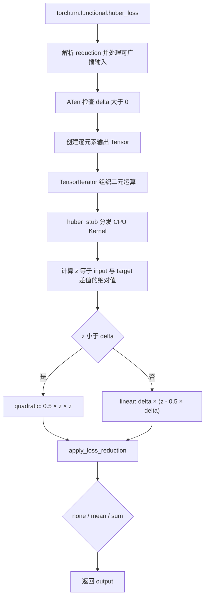
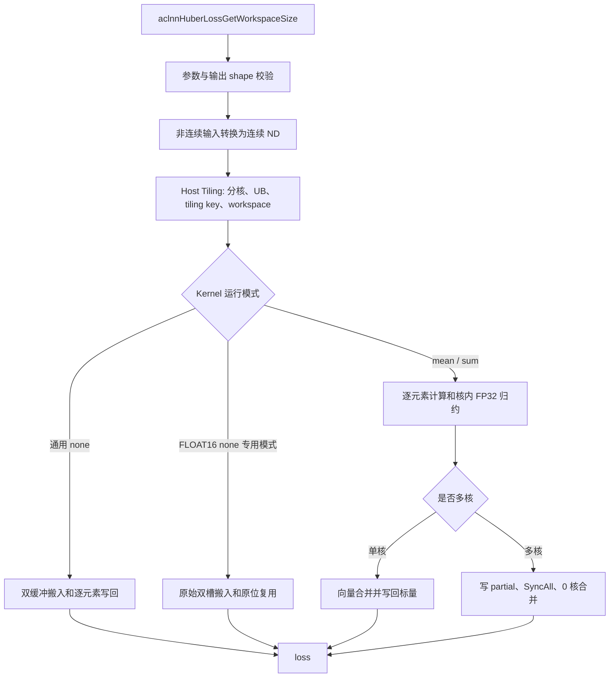
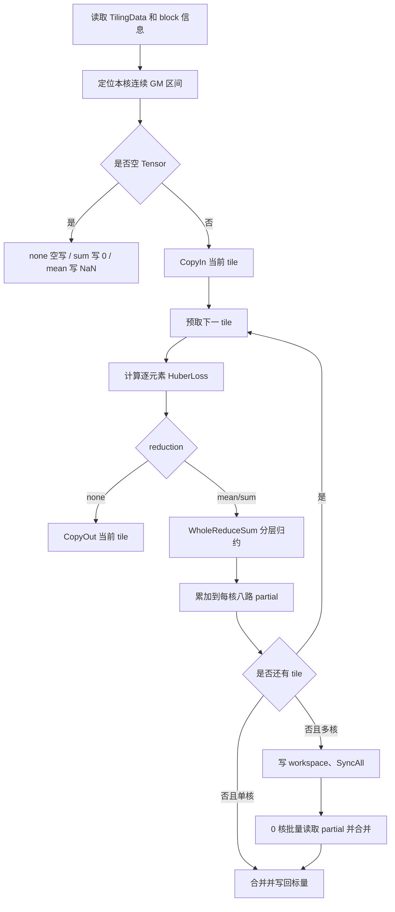

# 需求背景（required）

## 需求来源

PyTorch `aten::huber_loss` 缺少 NPU 后端支持，执行时会回退至 CPU。回退过程包含设备同步及 Host/Device 数据搬运，导致模型训练速度下降。参考 PyTorch 原生实现，使用 Ascend C 编程语言在昇腾 NPU 上实现功能一致的 HuberLoss 前向算子。算子支持 `float32`、`float16`、`bfloat16`、ND 格式和 `none`、`mean`、`sum` 三种 reduction，适配 Atlas A2 训练系列产品，计算精度与 CPU 参考结果对齐。

## 背景介绍

### HuberLoss 算子实现优化

HuberLoss 在小误差区间使用平方损失，在大误差区间使用线性损失。平方段在零点附近连续可导，线性段可以降低离群值对损失的影响。

具体数学定义、无分支等价形式和三种 reduction 的输出公式见“详细设计”中的“数学公式”。

任务环境中未提供 HuberLoss 的 TBE 或 Ascend C 基线。当前设计在 NPU 上完成逐元素计算和归约，功能和精度验收以 CPU `aten::huber_loss` 结果为准，性能按 Roofline 指标验收。本文的源码分析和自测 golden 使用 PyTorch 2.7.1。

PyTorch 参考实现路径如下：

| 类型 | 路径 |
| --- | --- |
| Python 接口 | [`torch/nn/functional.py` 中 `huber_loss`](https://github.com/pytorch/pytorch/blob/v2.7.1/torch/nn/functional.py) |
| ATen 实现 | [`aten/src/ATen/native/Loss.cpp`](https://github.com/pytorch/pytorch/blob/v2.7.1/aten/src/ATen/native/Loss.cpp) |
| CPU Kernel | [`aten/src/ATen/native/cpu/BinaryOpsKernel.cpp` 中 `huber_kernel`](https://github.com/pytorch/pytorch/blob/v2.7.1/aten/src/ATen/native/cpu/BinaryOpsKernel.cpp) |

### PyTorch 参考实现与现状分析

#### PyTorch 语义与任务支持范围

结合社区任务约束，Ascend C 实现需要覆盖的能力如下：

| 参数 | 参数含义 | dtype | format | shape | 说明 |
| --- | --- | --- | --- | --- | --- |
| `input` | 预测值 | float16 / float32 / bfloat16 | ND | 任意维度，各维度 ≥ 0 | 支持非连续 Tensor |
| `target` | 目标值 | 与 `input` 相同 | ND | 与 `input` 相同 | 支持非连续 Tensor |
| `reduction` | 归约模式 | int | - | - | `0=none`、`1=mean`、`2=sum` |
| `delta` | 分段阈值 | float | - | - | 默认 1.0，必须大于 0 |
| `output` | 损失结果 | 与输入相同 | ND | none 同输入；mean/sum 为 0D | 输出 dtype 与输入相同 |

PyTorch Python 接口会对 shape 不同但可广播的 `input` 和 `target` 执行广播。社区任务要求两者 shape、dtype 完全相同，因此 ACLNN 层对非连续输入执行连续化，Kernel 仅处理同 shape 的连续 ND Tensor。

PyTorch 2.7.1 的 Python 接口还提供可选 `weight`，该参数由 Python 组合 `aten::huber_loss`、逐元素乘法和公共归约实现。社区任务对齐 `aten::huber_loss` 前向核心接口，算子原型中不包含 `weight`。

#### PyTorch 参考实现描述

以下执行过程基于 PyTorch 2.7.1 CPU `aten::huber_loss` 源码：

1. Python 接口解析 `reduction`，对可广播输入生成展开后的 `input` 和 `target`。
2. ATen 入口检查 `delta>0`，创建与输入相同 dtype 的逐元素结果 Tensor。
3. `TensorIterator::borrowing_binary_op` 组织两路输入和一路输出，随后调用 `huber_stub`。
4. CPU `huber_kernel` 计算 $z=|input-target|$。当 $z<delta$ 时计算 $0.5z^2$，其余情况计算 $delta(z-0.5delta)$。
5. `apply_loss_reduction` 根据枚举值返回逐元素结果、均值或总和。

CPU Kernel 对 FLOAT16 和 BFLOAT16 使用对应的低精度向量类型。中间算术产生的舍入会影响最终结果，Ascend C 低精度路径需要保留相同的可观察舍入点。

#### PyTorch 参考实现流程图



### HuberLoss 算子功能分析

任务书中的 `input`、`target`、`output` 在内部算子原型中分别命名为 `predictions`、`targets`、`loss`。

| 参数 | 参数类型 | dtype | format | Shape 与约束 |
| --- | --- | --- | --- | --- |
| `predictions` | 输入 Tensor | FLOAT、FLOAT16、BFLOAT16 | ND | 任意维度，各维度 ≥ 0 |
| `targets` | 输入 Tensor | 与 `predictions` 相同 | ND | 与 `predictions` 完全相同 |
| `reduction` | 可选属性 | INT64 | - | `0=none`、`1=mean`、`2=sum`，默认 1 |
| `delta` | 可选属性 | FLOAT | - | `delta>0`，默认 1.0 |
| `loss` | 输出 Tensor | 与输入相同 | ND | none 时与输入同 shape，mean/sum 时为 0D |

输入 shape 可以为 0D，也可以包含长度为 0 的维度。空 Tensor 的输出语义如下：

| reduction | 输出 shape | 输出值 |
| --- | --- | --- |
| none | 与输入相同的空 shape | 空 Tensor |
| mean | 0D | NaN |
| sum | 0D | 0 |

# 需求分析（required）

## 需求描述

使用 Ascend C 实现 HuberLoss 前向算子，使其在 Atlas A2 训练系列产品上完成 NPU 原生计算。算子支持 FLOAT、FLOAT16、BFLOAT16、ND 格式和 `none`、`mean`、`sum` 三种 reduction，覆盖任务书规定的合法 shape、非连续输入及边界场景，并与 CPU `aten::huber_loss` 的功能和精度对齐。

## 需求拆解

1. 实现 HuberLoss 分段公式及其无分支等价计算，正确处理阈值两侧和分段边界。
2. 支持 FLOAT、FLOAT16、BFLOAT16 和 ND 格式，输入 shape、dtype 相同，输出 dtype 与输入一致。
3. 支持 `reduction=0/1/2`，分别输出逐元素结果、均值和总和。
4. 支持标量、空 Tensor、多维 shape、非 32 Bytes 对齐尾块和非连续输入。
5. 完成 OpDef、InferShape、ACLNN 接口、Host Tiling、Ascend C Kernel 和 workspace 设计。
6. 低精度路径保留 CPU 参考实现可观察的舍入点，精度满足 AscendOpTest 默认阈值。
7. 根据 shape 和 reduction 选择核数、UB 切分及归约路径，并使用 profiler Roofline 结果检查性能目标。

### 外部组件依赖

| 组件 | 用途 |
| --- | --- |
| Ascend C Kernel API | GM/UB 搬运、向量计算、事件同步和 `SyncAll()` |
| CANN op_host 框架 | OpDef、InferShape、TilingData、平台信息和 workspace 下发 |
| ACLNN/opdev 公共组件 | 两段式接口、executor、输入连续化和输出管理 |
| AscendOpTest | CPU golden 生成和默认精度阈值校验 |
| `msprof op` | 真机 Task Duration、Memory、PipeUtilization 和 Roofline 数据采集 |
| `msprof op simulator` | C220 指令流水和 MTE/Vector 时序分析 |

算子不增加第三方运行时依赖。

### 内部适配模块

| 模块 | 实现职责 |
| --- | --- |
| `op_host/huber_loss_def.cpp` | 注册输入、属性、输出、dtype、format 和 `ascend910b` 配置 |
| `op_host/huber_loss_infershape.cpp` | 校验输入 shape 并推导输出 shape |
| `op_host/huber_loss_tiling.cpp` | 参数校验、分核、UB 切分、tiling key 和 workspace 计算 |
| `op_kernel/huber_loss_tiling_data.h` | 定义 Host 与 Kernel 共用的 TilingData |
| `op_kernel/huber_loss_tiling_key.h` | 定义归约、通用 none 和 FLOAT16 none 专用模板 |
| `op_kernel/huber_loss.cpp` | Kernel 入口和 dtype 模板实例 |
| `op_kernel/huber_loss.h` | CopyIn、逐元素计算、核内归约、跨核归约和 CopyOut |
| `docs/aclnnHuberLoss.md` | ACLNN 接口说明和调用样例 |
| `tests/ut`、`tests/system` | Host/Kernel 单元测试和系统测试 |
| `tests/performance` | 基准程序、真机 profile 和 simulator trace 脚本 |

### 需求模块设计

#### Ascend C 算子原型

内部算子原型为：

```text
HuberLoss(
    predictions: Tensor,
    targets: Tensor,
    reduction: int = 1,
    delta: float = 1.0
) -> loss: Tensor
```

| 名称 | I/O | dtype | format | Shape |
| --- | --- | --- | --- | --- |
| `predictions` | 输入 | FLOAT、FLOAT16、BFLOAT16 | ND | 任意维度，各维度 ≥ 0 |
| `targets` | 输入 | 与 `predictions` 相同 | ND | 与 `predictions` 相同 |
| `loss` | 输出 | 与输入相同 | ND | none 同输入；mean/sum 为 0D |

#### Ascend C 算子约束

1. `predictions` 与 `targets` 的 shape 和 dtype 必须一致。
2. `loss` dtype 必须与输入一致。
3. 仅支持 FLOAT、FLOAT16、BFLOAT16 和 ND。
4. `reduction` 仅支持 0、1、2。
5. `delta` 必须大于 0。
6. 不支持输入广播。
7. 非连续输入由 ACLNN 公共组件转换为连续 Tensor，内部 Kernel 只处理连续 ND 数据。
8. HuberLoss 作为独立 loss 算子执行，不参与图融合。

# 详细设计（required）

## 算子分析

### 数学公式

设

$$
e_i=input_i-target_i,\qquad a_i=|e_i|,
$$

逐元素损失为

$$
l_i=
\begin{cases}
\frac{1}{2}e_i^2, & a_i\leq delta,\\
delta\left(a_i-\frac{1}{2}delta\right), & a_i>delta.
\end{cases}
$$

任务书的分段条件为 $a_i\leq delta$，PyTorch CPU `huber_kernel` 使用 $a_i<delta$。有限数在 $a_i=delta$ 时两段结果相同；NaN、Inf 和 `delta=+Inf` 等特殊值按 CPU `aten::huber_loss` 的结果处理。Ascend C Kernel 使用下列等价形式完成无分支计算：

$$
m_i=\min(a_i,delta),\qquad l_i=m_i\left(a_i-\frac{1}{2}m_i\right).
$$

三种 reduction 的输出为

$$
output=
\begin{cases}
(l_0,\ldots,l_{N-1}), & reduction=0,\\
\frac{1}{N}\sum_{i=0}^{N-1}l_i, & reduction=1,\\
\sum_{i=0}^{N-1}l_i, & reduction=2.
\end{cases}
$$

其中 `reduction=0/1/2` 分别对应 `none/mean/sum`。

### 支持数据类型

| 输入或输出 | 支持 dtype | 说明 |
| --- | --- | --- |
| `predictions` | FLOAT、FLOAT16、BFLOAT16 | 预测值 |
| `targets` | 与 `predictions` 相同 | 目标值 |
| `loss` | 与输入相同 | 低精度归约内部使用 FP32 partial，最终转换回输入 dtype |

### 支持形状

`predictions` 和 `targets` 支持任意维度的 ND Tensor，两者 shape 必须完全相同。输入可以是 0D 标量，也可以包含长度为 0 的维度；非连续输入由 ACLNN 公共组件转换为连续 Tensor。`none` 输出与输入同 shape，`mean` 和 `sum` 输出为 0D 标量。

## 算子实现

### 使能方式

算子使用 ACLNN 两段式接口：

```cpp
aclnnStatus aclnnHuberLossGetWorkspaceSize(
    const aclTensor* predictions,
    const aclTensor* targets,
    int64_t reduction,
    double delta,
    const aclTensor* loss,
    uint64_t* workspaceSize,
    aclOpExecutor** executor);

aclnnStatus aclnnHuberLoss(
    void* workspace,
    uint64_t workspaceSize,
    aclOpExecutor* executor,
    aclrtStream stream);
```

第一段接口完成参数检查、连续化编排和 workspace 查询。调用方按返回值申请 Device workspace，再通过第二段接口在指定 Stream 上提交计算。

### 实现方案



#### 3.2.1 Host 侧设计

##### 3.2.1.1 参数与 Shape 校验

InferShape 和 Tiling 分别完成 shape 推导与运行时参数检查：

1. 两个输入 shape 完全相同；
2. 输入和输出 dtype 相同，且属于支持集合；
3. none 输出 shape 与输入相同，mean/sum 输出为 0D；
4. `reduction` 位于 `[0,2]`；
5. `delta>0`，零、负数和 NaN 会被拒绝；
6. 动态 shape 已在运行时解析；
7. 元素数、tile 字节数和 workspace 计算不发生溢出；
8. 平台 UB 大小、AIV 核数和 DataBlock 大小有效。

##### 3.2.1.2 分核策略

Host 将 ND shape 展平为逻辑元素数

$$
N=\prod_d shape[d].
$$

按运行模式设置每核目标元素数：

| 运行模式 | 每核目标元素数 |
| --- | ---: |
| FLOAT16 none | 65,536 |
| FLOAT/BFLOAT16 none | 4,096 |
| mean/sum | 8,192 |

设平台 AIV 数为 $C_{platform}$、每核目标元素数为 $T_{core}$，使用核数为

$$
C=\min\left(C_{platform},\max\left(1,\left\lceil\frac{N}{T_{core}}\right\rceil\right)\right).
$$

该策略减少小 shape 启动过多 AIV 的固定开销。空 Tensor 固定使用一个逻辑核。

当数据量能够为每核提供一个 512 Bytes 工作单元时，Kernel 按 512 Bytes 对齐块均分主体数据，剩余元素放到末核。数据量较小时按元素均分。各核获得连续且互不重叠的逻辑区间。

##### 3.2.1.3 UB 切分策略

UB 中按运行模式分配以下资源：

| 资源 | 通用 none | FLOAT16 none 专用模式 | mean/sum |
| --- | :---: | :---: | :---: |
| predictions/targets 成对输入双缓冲 | √ | - | √ |
| 原始双槽输入缓冲 | - | √ | - |
| 输出双缓冲 | √ | - | - |
| FP32 计算缓冲 | FLOAT、BFLOAT16 使用 | - | √ |
| 每核八路归约缓冲 | - | - | √ |
| 0 核跨核合并缓冲 | - | - | 多核时使用 |

设输入类型字节数为 $s$，通用布局的可变 UB 开销为

$$
B_{elem}=2\times2s
+I_{none\land generic}\times2s
+I_{reduction\lor dtype\neq FP16}\times2\times4.
$$

其中 $I_{condition}$ 表示条件成立时取 1，其余情况取 0。FLOAT16 none 专用模式沿用输入项预算，并通过固定开销计入区域间隔。

Host 预留 1024 Bytes 安全空间。通用队列 slot 增加 64 Bytes 或 128 Bytes 错位空间，FP32 scratch 增加 256 Bytes 错位空间。归约模式还要预留 `usedCoreNum × DataBlock` 的局部和缓冲及一个输出 DataBlock。

FLOAT16 none 专用模式使用一个双槽 `TBuf`。每个 slot 包含 prediction 区和 target/output 复用区。每个区域增加 384 Bytes，两个区域之间增加 384 Bytes。所有地址保持 32 Bytes 对齐，target 相对 prediction 错开 256 Bytes、下一 slot 相对当前 slot 错开 128 Bytes（模 512 Bytes）。

扣除固定空间后，tile 元素数按下式计算：

$$
tileDataNum=\operatorname{AlignDown}\left(
\left\lfloor\frac{UB-B_{fixed}}{B_{elem}}\right\rfloor,
\max\left(64,\frac{512}{s}\right)\right).
$$

tile 至少按 64 个元素对齐，并检查向量 API 和 DataCopy 参数的取值范围。

##### 3.2.1.4 TilingData 与 tiling key

TilingData 定义如下：

| 字段 | 类型 | 说明 |
| --- | --- | --- |
| `totalDataNum` | `uint64_t` | 展平后的逻辑元素数 |
| `tileDataNum` | `uint64_t` | 单个 UB tile 的逻辑元素数 |
| `workspaceFloatsPerCore` | `uint32_t` | 每核 workspace 槽位中的 FP32 元素数 |
| `reduction` | `int32_t` | reduction 类型 |
| `delta` | `float` | HuberLoss 阈值 |
| `meanScale` | `float` | 非空输入为 `1/N`，空输入为 0 |

Host 使用三类 tiling key：

| tiling key | 选择条件 | Kernel 模式 |
| ---: | --- | --- |
| 0 | FLOAT16、none、`delta>=2^-13` | FLOAT16 none 专用模式 |
| 1 | 任意支持 dtype、mean/sum | 归约模式 |
| 2 | 其余 none 场景 | 通用 none 模式 |

不同模式通过模板参数在编译期移除无关队列、workspace 和同步代码。

##### 3.2.1.5 Workspace 与调度模式

none 和单核归约不申请 workspace。多核归约申请

$$
workspaceBytes=GetLibApiWorkSpaceSize()+C\times blockBytes.
$$

第一部分供 `SyncAll()` 使用，第二部分为每核一个 32 Bytes 对齐的 partial 槽位。Kernel 通过 `GetUserWorkspace()` 取得算子 workspace 起始地址。

多核归约设置 `SetScheduleMode(1)`，Kernel 入口声明 `KERNEL_TYPE_MIX_AIV_1_0`，使 batch mode 与硬同步配套。

#### 3.2.2 Kernel 侧设计

##### 3.2.2.1 Kernel 初始化和执行流程

Kernel 入口按 tiling key 实例化 `KernelHuberLoss<T, kIsReduction, kUseHalfNoneRecover>`。`Init` 读取 TilingData，根据 `GetBlockIdx()` 计算当前核的 GM 偏移和处理长度，并按编译期模式初始化 TQue/TBuf。`Process` 执行空 Tensor、通用队列或 FLOAT16 none 专用流程。

Kernel 总体流程如下：



##### 3.2.2.2 逐元素计算与精度策略

| dtype | 逐元素计算 | reduction 累加 | 输出转换 |
| --- | --- | --- | --- |
| FLOAT | FP32 向量计算 | FP32 | 无转换 |
| FLOAT16 | 原生 FP16 逐阶段计算 | 逐元素结果转 FP32 | FP16 RNE |
| BFLOAT16 | FP32 计算与 BF16 RNE 回写交替 | 逐元素结果转 FP32 | BF16 RNE |

低精度路径按下列顺序保留参考实现的舍入点：

```text
e = round_T(predictions - targets)
m = min(abs(e), round_T(delta))
h = round_T(0.5 * m)
r = round_T(abs(e) - h)
l = round_T(m * r)
```

`T` 为 FLOAT16 或 BFLOAT16。低精度转换前保存 CTRL，设置 `CTRL[48]`，通过 `S_V` 事件使设置对 Vector 流水可见。计算完成后通过 `V_S` 事件恢复 CTRL，保证 NaN、Inf 和溢出结果按 IEEE 编码传播。

FLOAT 使用 `Sub`、`Abs`、`Mins`、`Axpy` 和 `Mul`。FLOAT16 通用模式使用 `Sub`、`Abs`、`Mins`、`Muls`、`Sub` 和 `Mul`。BFLOAT16 在 FP32 计算之间使用 `Cast(..., CAST_RINT)` 回写关键中间值。

##### 3.2.2.3 none 模式

通用 none 模式使用成对输入双缓冲和输出双缓冲。两路输入放在同一个队列 slot 中，每个 tile 只发布和消费一组输入队列事件。循环先发起下一 tile 的 MTE2，再处理当前 tile，使搬入与 Vector 计算重叠。

FLOAT16 none 专用模式使用原始双槽 `TBuf`，target 区在完成绝对值计算后承接输出。该模式省去输出队列和额外 scratch，并使用固定 event ID 管理两个物理 slot。

专用模式将 `Muls + Sub` 合并为 `Axpy(targets, predictions, -0.5)`。Host 仅在 `delta>=2^-13` 时选择该模式。该阈值下，线性段的 `0.5m` 可以由 FP16 精确表示；更小的 `m` 只出现在平方段，最终 FP16 乘积舍入为零。`delta<2^-13` 时使用通用模式，保留全部 FP16 子正规舍入点。

##### 3.2.2.4 mean/sum 模式

低精度逐元素结果按输入 dtype 舍入后转换到 FP32。核内归约进入 counter mask 模式，使用 mode-0 `WholeReduceSum` 将每 64 个 FP32 元素压缩为一个 partial。源缓冲和 scratch 逐层 ping-pong，直到 partial 数不超过 8，再累加到每核八路 FP32 缓冲。

单核归约直接把八路 partial 合并为一个 FP32 结果。多核归约先把每核八路 partial 写入独立的 32 Bytes workspace 槽位，执行 `SyncAll()`，再由 0 核一次搬入全部记录并完成第二级向量归约。mean 在写回前乘以 Host 预计算的 `1/N`。

归约过程不读取 `ACC_VAL`，不使用 `GetValue` 或 `SetValue`。归约结果始终保留在 Vector 流水中，减少 Vector 与 Scalar 之间的同步。

##### 3.2.2.5 数据搬运与尾块处理

32 Bytes 对齐数据使用 `DataCopy`。不足 32 Bytes 的逻辑尾块使用 `DataCopyPad`，搬入时只读取有效 GM 字节并在 UB 右侧补零，写回时只覆盖有效输出字节。向量计算和归约均使用真实元素数，补齐区不参与结果计算。

数据量足够时，核间起始地址和主体 tile 按 512 Bytes 对齐。none 模式中，每个输出元素只由一个核写入；多核归约的 workspace 槽位按 32 Bytes 隔离，不需要原子操作。

##### 3.2.2.6 流水同步

| 同步关系 | 使用位置 | 作用 |
| --- | --- | --- |
| TQue MTE2→V | 通用模式输入队列 | 输入搬入完成后进入 Vector |
| TQue V→MTE3 | 通用 none 输出队列 | 计算完成后写回输出 |
| `MTE2_V` | 原始双槽和跨核 partial 搬入 | 保护 MTE2 到 Vector 的数据依赖 |
| `V_MTE2` | 原始双槽 prediction 区 | Vector 读完后允许下一轮 MTE2 覆盖 |
| `V_MTE3` | 原始双槽 target/output 区 | Vector 写完后允许 MTE3 搬出 |
| `MTE3_MTE2` | 原始双槽 target/output 区复用 | 当前输出搬出后允许下一轮输入覆盖 |
| `S_V` / `V_S` | 低精度 CTRL 设置和恢复 | 保证 CTRL 与向量转换顺序 |
| `PipeBarrier<PIPE_V>` | 分层向量归约 | 保护同一 Vector 流水内的读写依赖 |
| `MTE3_S` + `SyncAll()` | 多核归约 | 保证全部核的 partial 对 0 核可见 |

原始双槽模式为两个物理 slot 固定分配 event ID，避免每个 tile 重复申请事件。Simulator trace 用于检查下一 tile 的 MTE2 是否与当前 Vector 指令重叠，并定位多余的 `BAR`、FlowCtrl 和长流水空洞。

#### 3.2.3 PyTorch 参考实现与 Ascend C 实现差异

| 维度 | PyTorch CPU 参考实现 | Ascend C 实现 | 设计原因 |
| --- | --- | --- | --- |
| 执行位置 | CPU dispatch | NPU AI Vector Core | 避免 NPU Tensor 回退到 CPU |
| Shape 处理 | Python/ATen 接口可广播 | 输入 shape 固定相同 | 对齐社区任务约束 |
| 调度方式 | TensorIterator 和 CPU loss reduction | Host 显式分核、UB 切分和 tiling key | Ascend C 需要管理 AIV、UB 和流水 |
| 逐元素分段 | CPU Kernel 按阈值计算两段公式 | `min` 等价式完成无分支向量计算 | 减少 Compare、Select 和控制流 |
| 低精度 | 由 ATen dtype Kernel 决定舍入 | FLOAT16 原生逐阶段运算；BFLOAT16 显式回写舍入点 | 对齐 CPU 可观察结果 |
| reduction | ATen 公共 reduction | FP32 核内树形归约和跨核二级归约 | 提高精度并支持多核并行 |
| 非连续输入 | TensorIterator 处理 stride | ACLNN 层连续化，Kernel 处理连续 ND | 简化 GM 地址计算和尾块处理 |
| 执行接口 | 同步语义由 PyTorch 调度管理 | ACLNN 两段式异步提交 | 接入 CANN 运行时 |

### 性能优化设计

| 优化项 | 实现方式 | 预期收益 |
| --- | --- | --- |
| 动态核数 | 根据 dtype、reduction 和元素数选择 blockDim | 降低小 shape 的 AIV 启动开销 |
| 512 Bytes 分核 | 数据量允许时按 512 Bytes 工作单元划分核间区间 | 改善 GM 交易和核间负载 |
| 无分支公式 | `Mins + Axpy/Muls + Mul` | 减少 Compare、Select 和分支开销 |
| 成对输入队列 | predictions 和 targets 共用双缓冲 slot | 减少队列事件并保持 MTE2/Vector 重叠 |
| FLOAT16 none 专用模式 | 原始双槽、target/output 复用、固定 event ID | 扩大 tile，减少 TQue 状态和 MTE 指令数 |
| UB 模错位 | 输入区、输出区和相邻 slot 做 512 Bytes 模错位 | 降低并发 MTE/Vector bank-group 冲突 |
| 自定义向量归约 | mode-0 `WholeReduceSum` 分层压缩 | 避免高层 Reduce API 的内部同步 |
| 八路 partial | tile 内只做向量累加，循环结束后统一合并 | 消除逐 tile 标量读写 |
| 批量跨核合并 | 0 核一次搬入全部 32 Bytes partial 槽位 | 减少逐核 MTE2 和等待事件 |
| Host 预计算 `1/N` | mean 只执行一次 Vector 标量乘法 | 减少 Kernel 标量计算 |

## 支持硬件

| 支持的芯片版本 | OpDef 配置 | 涉及勾选 |
| --- | --- | :---: |
| Atlas A2 训练系列产品 | `ascend910b` | √ |

当前设计和构建范围为 Atlas A2 训练系列产品，构建与测试环境使用 CANN 9.0.0 及以上版本。Host 从平台信息读取实际 UB 容量和 AIV 核数。

## 算子约束限制

1. `input` 与 `target` 必须具有相同的 shape 和 dtype，不支持 broadcast。
2. `reduction` 仅支持 0（none）、1（mean）、2（sum），其他值为非法输入。
3. `delta` 必须为正数，即 `delta>0`。
4. `output` dtype 与 `input`、`target` 一致；`reduction=mean` 时，逐元素结果扩展到 FP32 后完成归约，再转换为输出 dtype。
5. 当前作为独立 loss 算子实现，不涉及图融合。

## 特性交叉分析

| 特性 | 影响 | 处理方式 |
| --- | --- | --- |
| 动态 shape/rank | 元素数、核数和 tile 在运行时变化 | Tiling 按已解析的 storage shape 动态计算并检查溢出 |
| 0D Tensor | none 和 reduction 均输出 0D | 按 $N=1$ 的普通路径执行 |
| 空 Tensor | 无有效输入数据 | none 空写、sum 写 0、mean 写 NaN |
| 非连续输入 | Kernel 地址计算按连续布局展开 | ACLNN 公共组件执行 `AutoContiguous()` |
| 非 32 Bytes 尾块 | 整块 DataCopy 可能访问逻辑边界外数据 | 使用 `DataCopyPad` 按真实字节数搬运 |
| NaN/Inf | 低精度转换控制位影响特殊值编码 | 设置 CTRL[48] 并用 `S_V`、`V_S` 保护 |
| 多核 reduction | partial 写回和跨核可见性 | 32 Bytes 独立槽位、`MTE3_S`、`SyncAll()` 和 0 核批量合并 |
| 小 shape | 核启动和流水排空占比较高 | 按每核目标元素数减少 blockDim |
| 图融合 | 任务范围为独立 loss 算子 | 不接入融合子图 |
| 并发写回 | none 多核可能发生输出覆盖 | 每个逻辑元素只分配给一个核 |

# 可维可测分析

## 精度标准/性能标准

| 验收标准 | 描述 | 标准来源 |
| --- | --- | --- |
| 功能标准 | 支持任务书规定的合法 dtype、shape、reduction、delta 和非连续输入 | 社区任务书 |
| 环境标准 | Atlas A2 训练系列产品，CANN 9.0.0 及以上 | 社区任务书 |
| 精度标准 | 与 CPU `aten::huber_loss` 结果对齐，满足 AscendOpTest 默认阈值 | 社区任务书 / AscendOpTest |
| 性能标准 | 官方自测用例以 profiler Roofline 结果判定，compute bound 或 memory bound 的对应比例不低于 80% | 社区任务书 / `msprof op` Roofline |
| 构建标准 | `ascend910b` Host、Kernel 和算子包构建成功 | ops-nn 构建流程 |
| 泛化标准 | 覆盖任务约束内的 dtype、shape、属性和输入布局组合 | 自测用例与验收泛化数据 |

## 验证矩阵

| 验证项 | 典型场景 | 验证方式 / 预期产出 |
| --- | --- | --- |
| dtype | FLOAT、FLOAT16、BFLOAT16 | 与 PyTorch CPU golden 比对 |
| reduction | none、mean、sum | 校验输出 shape 和数值 |
| delta 分布 | 全平方段、全线性段、两段混合、`a=delta` | 校验分段边界和无分支等价式 |
| 低精度边界 | FP16/BF16 舍入点、子正规值、最大有限值、溢出 | 按 PyTorch 2.7.1 自测版本生成 golden |
| 特殊值 | NaN、Inf、`delta=+Inf` | 校验 IEEE 传播结果 |
| Shape | 0D、空 Tensor、1D、多维、高 rank | 校验展平计算和输出 shape |
| 尾块 | 1、15、16、17、31、32、33 等长度 | 检查 `DataCopyPad` 和输出哨兵 |
| Tile | 单 tile、多 tile、尾 tile | 覆盖双缓冲和 slot 复用 |
| 多核 | 可整除、不可整除、512 Bytes 对齐与末核余数 | 检查区间覆盖和 workspace |
| 非连续输入 | 转置、切片和组合 view | 验证 ACLNN 连续化 |
| 空 Tensor | none、mean、sum | 分别校验空、NaN、0 |
| 非法输入 | dtype、shape、输出 shape、reduction、delta | 校验错误码和 Host 拒绝路径 |
| Kernel 模式 | 三类 tiling key | 检查实际二进制路由和结果一致性 |

## 性能测试设计

性能测试分别覆盖 none、mean、sum 和三种 dtype。Shape 包含小尺寸、非对齐长度、1M、16M、64M 及相邻奇数长度。输入数据覆盖平方段、线性段和混合分布。

真机性能使用 `msprof op` 采集：

```text
BasicInfo, Memory, PipeUtilization, ResourceConflictRatio, Roofline
```

正式性能判定读取 Roofline 中的 bound 类型和 compute/memory ratio。64M 用例用于形成超过 L2 容量的工作集，降低 cache 对 GM memory-bound 判断的影响。小 shape 额外记录 blockDim、Task Duration 和流水固定开销；低于 80% 的场景保留原始 profile 并说明瓶颈。

Simulator 使用 C220 模式固定 `core-id=0` 和单次 steady 调用，检查以下内容：

1. 下一 tile 的 MTE2 是否与当前 tile 的 Vector 指令重叠；
2. payload MTE2 之间是否存在长空洞；
3. `MTE2_V`、`V_MTE3`、`MTE3_MTE2` 附近是否存在多余等待；
4. Vector `BAR`、FlowCtrl、Scalar wait 和 bank conflict；
5. `WholeReduceSum` 分层次数及 0 核跨核合并阶段的 MTE2 次数。

性能测试程序在计时前完成 Tensor、Device 内存和 workspace 准备，预热后统计 steady 调用。每次采集记录 SoC、CANN 版本、源码提交、命令、二进制校验和和原始 profiler 文件。复现入口位于 `tests/performance`。

## 兼容性分析

HuberLoss 为新增 Ascend C 算子，不影响已有算子行为和接口。算子功能语义与 CPU `aten::huber_loss` 对齐。ACLNN 层通过 `AutoContiguous()` 处理支持范围内的非连续输入，内部 Kernel 处理连续 ND Tensor。任务书范围外的 dtype、format、shape、广播关系、reduction 或 delta 由接口层和 Host 侧校验拒绝。
