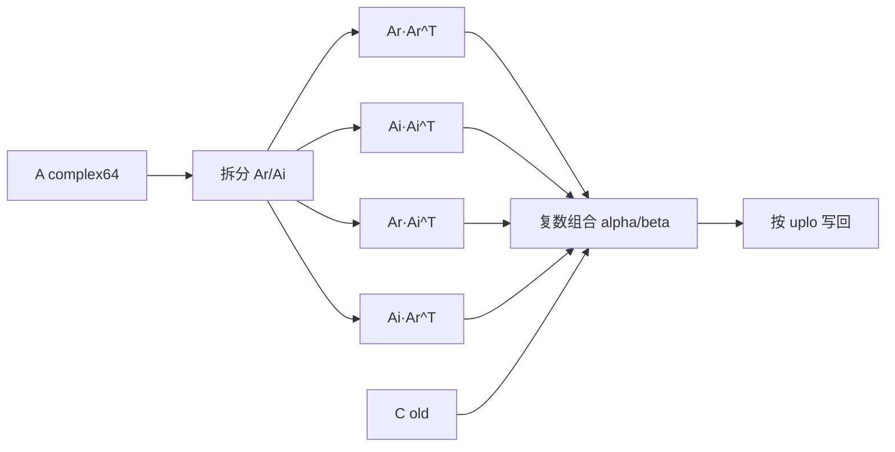
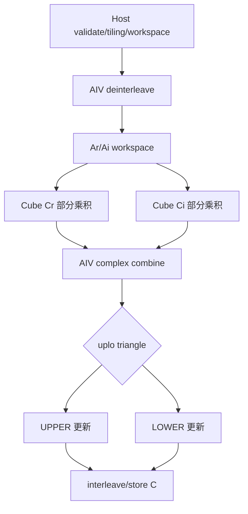
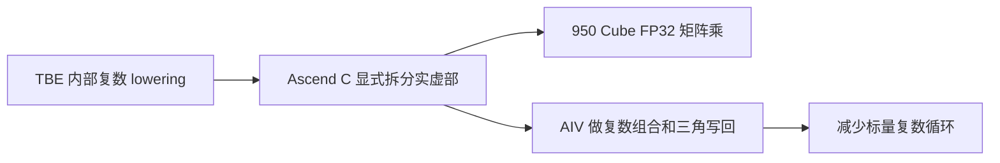

# aclblasCsyrk 算子设计文档

## 1. 需求背景（required）

### 1.1 需求来源

本设计对应 CANN 社区任务 `08-1-aclblasCsyrk`，目标芯片为 Ascend 950PR（DAV_3510）。任务要求使用 Ascend C 在 `ops-blas` 中实现 `aclblasCsyrk`，并提交设计文档、测试用例、自测报告及代码 PR。

### 1.2 背景介绍

CSYRK 是 BLAS Level-3 复数对称秩-k 更新算子，计算公式为：

```text
C = alpha * op(A) * op(A)^T + beta * C
```

本任务的数据类型为 complex64（实部和虚部均为 float32），采用列主序。CSYRK 是对称而非 Hermitian 运算，因此转置不执行共轭：`OP_C` 按任务书要求与 `OP_T` 等价。仅更新 `uplo` 指定的三角区，另一三角区保持原值。

### 1.3 参考实现分析

任务书要求参考 TBE 算子原型、Netlib `csyrk` 和 cuBLAS `cublasCsyrk` 的语义。CPU golden 通过 OpenBLAS `cblas_csyrk` 生成，接口参数是 complex-float；本实现的验收比较必须按 FLOAT32 分量执行，不应在 golden 中引入 FP64/complex128 累加。若需要复现 golden，应使用 complex<float> 输入、float32 乘加和与目标相同的 `uplo/trans` 语义。

## 2. 需求分析（required）

### 2.1 功能需求

1. 支持 `uplo=UPPER/LOWER`。
2. 支持 `trans=N/T/C`，其中 `C` 等价于普通转置，不执行共轭。
3. 支持 complex64 的 alpha、beta、A、C，列主序和非紧凑 `lda/ldc`。
4. 仅读写 `uplo` 指定三角区；未指定三角区不被访问或修改。
5. 支持 `n/k` 非负、`n=0` no-op、`k=0` 和 alpha/beta 特殊值的 BLAS quick-return 语义。

### 2.2 性能需求

在 Ascend 950PR 上，warmup 后有效采样不少于 50 次，平均耗时不超过：

| Case | n | k | uplo | trans | 目标 |
|---|---:|---:|---|---|---:|
| TC_PF_1001 | 512 | 512 | UPPER | N | 126.27 us |
| TC_PF_1002 | 1024 | 1024 | UPPER | N | 382.66 us |
| TC_PF_1003 | 2048 | 2048 | UPPER | N | 1970.08 us |

### 2.3 精度需求

验收比较针对 complex64 的实部和虚部分量分别进行，采用 FLOAT32 容差：`rtol=2^-10`、`atol=2^-16`、匹配率不低于 0.99，最大绝对误差按任务书规定的 `1e-2` 或 `32*ULP` 约束。golden 侧不得通过 FP64/complex128 中间计算放宽或改变算子定义；若测试框架需要独立 FP32 golden，应显式实现 float32 累加参考路径。

## 3. 详细设计（required）

### 3.1 算子数学分析

令 `A = Ar + iAi`，则：

```text
Cr = Ar*Ar^T - Ai*Ai^T
Ci = Ar*Ai^T + Ai*Ar^T
C  = alpha*(Cr+iCi) + beta*C
```

计算在 Cube 上使用 FP32 矩阵乘，AIV 负责 complex 组合、alpha/beta 缩放和交错写回。由于结果对称，Cube tile 调度和最终写回均只保留 `uplo` 三角区。

### 3.2 Host 侧设计

实现文件：`blas/syrk/arch35/csyrk_host.cpp`。

Host 阶段依次完成：

1. 校验 handle、枚举、维度、指针和 leading dimension。
2. 将 `OP_C` 归一化为 `OP_T`。
3. 读取主机侧 complex64 alpha/beta，处理 alpha=0、k=0、beta=1 等 quick return。
4. 按 `n/k/lda/ldc` 规划 workspace，并以 512B 对齐。
5. 根据设备 AIC/AIV 数量计算 tile 网格和每核工作量，优先覆盖完整三角 tile 网格。
6. 入队 AIV 拆分、Cube 乘法和 AIV combine kernel；所有 kernel 使用 handle 绑定的 stream 异步执行。

### 3.3 Tiling 与分核策略

- Cube 输出 tile 使用 128×128，K 方向按 64 或 128 的片段进入 L1/L0 双缓冲。
- `baseM/baseN/baseK`、K chunk 和实际 block 数由 host 根据形状、L1/L0 约束计算，避免固定小 tile 导致大量事件和循环开销。
- 对 rank-k 任务按三角 tile 编号调度：UPPER 只调度 `tileRow<=tileCol`，LOWER 只调度 `tileRow>=tileCol`。
- AIC 使用不超过设备实际可用的 Cube 核数；AIV 拆分和 combine 按行/ tile 均衡，避免单核长尾。
- 所有 vector 目标地址保持 32B 对齐，workspace 基地址和分区保持 512B 对齐。

### 3.4 TBE/基线流程图



### 3.5 Ascend C Kernel 流程图



### 3.6 Ascend C 与 TBE 的差异



差异及原因：

- TBE 由编译器选择复数 lowering；Ascend C 显式拆分实虚部，以确保矩阵乘落到 950 Cube。
- 复数乘法由四个实矩阵乘积表达，组合阶段执行 `Cr=t1-t2`、`Ci=t3+t4`。
- CSYRK 不使用共轭；HERK 的共轭语义不复用到本算子。
- Cube FP32 的舍入/累加顺序可能与 CPU FP32 实现存在 ULP 级差异，必须通过 FLOAT32 golden 和任务书容差验证，不得用 FP64 golden 替代问题定位。

### 3.7 Kernel 同步与内存

CopyIn/Compute/CopyOut 通过 Ascend C queue 和双缓冲管理；跨核 producer/consumer 使用 MIX_1_2 支持的 CrossCore flag。禁止在 arch35 上使用不支持的 `PipeBarrier<PIPE_ALL>` 变体。临时区全部来自 handle workspace，不申请持久化设备内存；调用者在读取结果前负责 stream 同步。

## 4. 支持硬件与约束

| 支持芯片 | 状态 |
|---|---|
| Ascend 950PR / DAV_3510 | 支持 |

约束：

- 输入输出为 complex64、列主序；不提供广播。
- `lda/ldc` 必须满足 BLAS 最小 leading dimension。
- 不支持负维度；不合法枚举返回 invalid enum/value。
- 只更新 `uplo` 指定三角区，另一三角区保持不变。
- 动态 shape 由运行时 `n/k` 传入，kernel 不依赖编译期固定矩阵尺寸。

## 5. 可维可测分析

### 5.1 正确性验收

使用 `test/syrk/csyrk/arch35/csyrk_test.cpp` 和任务书 CSV，覆盖 N/T/C、UPPER/LOWER、alpha/beta 特殊值、非对齐 leading dimension、零维、Inf/NaN 以及大 K。实部、虚部分量分别与 FP32 golden 比较，并单独检查未指定三角区保持原值。

### 5.2 性能验收

使用 `test/syrk/csyrk/verify_performance.py`，先 warmup，再采样至少 50 次，记录三个 `TC_PF_100x` case 的平均耗时和设备信息。报告中同时记录 tile、block 数、workspace 和实际运行路径，保证提交版本与验收版本一致。

### 5.3 内存验收

workspace 按实际矩阵尺寸计算，所有分区做 512B 对齐；不使用未声明的全局设备分配。检查 UB/L1/L0 使用量不超过 Ascend 950PR 的硬件上限，并验证多次连续 launch 后无越界、死锁或 stale buffer。

## 6. 交付清单与兼容性

- 设计文档：本文件。
- 算子实现：`blas/syrk/arch35/csyrk_host.cpp` 及复用的 arch35 kernel。
- 测试代码和 CSV：`test/syrk/csyrk/arch35/`。
- 自测报告：准确率、性能和内存结果分别记录，附命令、参数、日志及截图。
- 公共 API 放入 `include/cann_ops_blas.h`，不增加 950 私有并行接口。

本算子为新增长接口，不改变既有实数 SYRK/HERK ABI；公共头文件声明、返回码和 handle/stream 约定与 `ops-blas` 既有 BLAS 接口保持一致。
