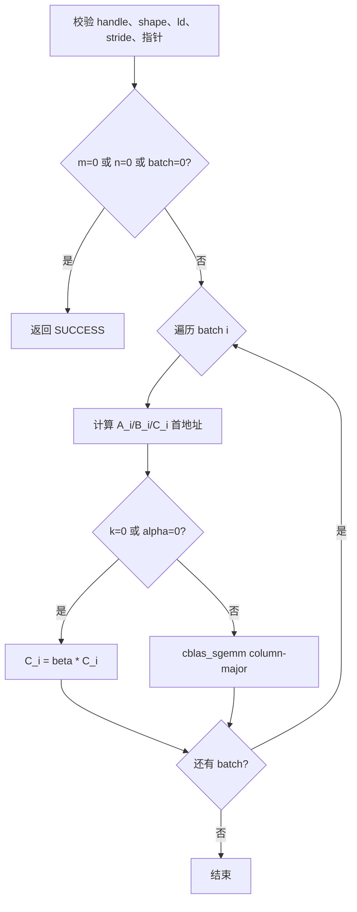
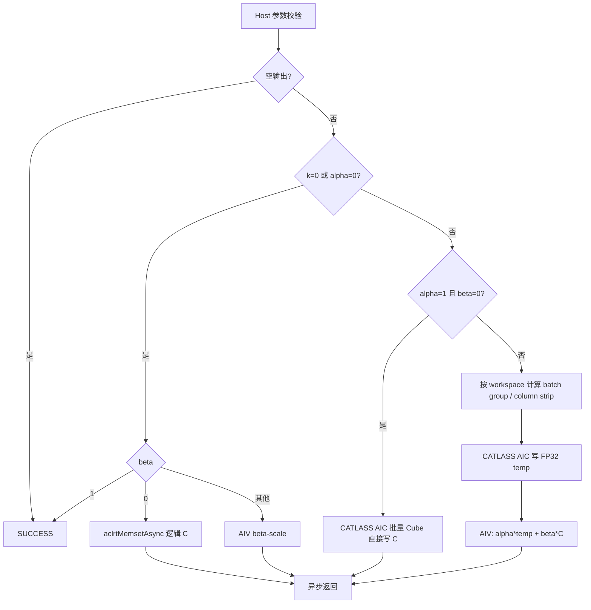
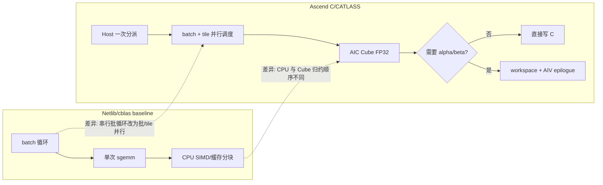

# 【CANN社区任务】aclblasSgemmStridedBatched 算子设计文档

| 项目 | 内容 |
| --- | --- |
| 算子 | `aclblasSgemmStridedBatched` |
| 目标产品 | Atlas A2/A3（DAV_2201，`arch22`） |
| 开发与实测设备 | DevEnv_297693，Atlas 800I A2，Ascend 910B3 |
| 实测软件 | CANN 9.0.0 |
| 任务要求软件 | CANN 9.1.0 |
| 代码基线 | ops-blas `003629ee096691d32a95d73e9e218c0c6976152e` |
| CATLASS 基线 | `db93081ce9b0ad6c04e99b9ed5f2fba081ccdb00` |
| 文档日期 | 2026-08-26 |

> 环境偏差：任务书要求 CANN 9.1.0，但指定机器只有 CANN 9.0.0。本设计和实测结果可证明
> 910B3/CANN 9.0.0 下的状态，不能替代 CANN 9.1.0 兼容性回归或 A3 真机回归。

# 需求背景（required）

## 需求来源

来源为“8 月社区任务-aclblasSgemmStridedBatched 算子开发（A2A3）”任务书。目标是在
ops-blas 中补齐 Atlas A2/A3 的 `arch22` 实现，并沿用公共头文件
`include/cann_ops_blas.h` 中已经声明的句柄式 BLAS 接口，不增加产品私有接口。

## 背景介绍

### 功能与参考实现

对每个批次执行列主序 FP32 GEMM：

```text
C_i = alpha * op(A_i) * op(B_i) + beta * C_i
A_i = A + i * strideA
B_i = B + i * strideB
C_i = C + i * strideC
```

`op(X)` 支持 N、T、C；对实数 FP32，C 与 T 等价。`strideA/strideB=0` 是 ops-blas
扩展的整矩阵跨批广播。语义对齐 cuBLAS `cublasSgemmStridedBatched`，边界行为对齐
Netlib `sgemm`。

### Baseline 实现现状分析

Netlib/cblas baseline 按 batch 循环调用单次 `sgemm`。它直接支持 column-major、N/T/C、
任意合法 leading dimension 和 stride，易于作为 golden；但 CPU 串行发射不能利用 NPU 的
Cube 批量并行能力。cuBLAS 使用 GPU tile 和批调度，任务包的 `gpu_baseline.csv` 提供了
参考耗时。

该接口属于 ops-blas 句柄式 kernel 直调能力，不是 OPP 中的 TBE 图算子，因此不存在可对应的
TBE kernel、算子原型库和算子信息库三条路径。本设计以任务书指定的 Netlib `sgemm`、cuBLAS
`cublasSgemmStridedBatched` 和 ops-blas 公共接口作为 baseline，并在下图完整给出其执行管线。

### Baseline 流程图



# 需求分析（required）

## 需求描述

接口必须与仓内声明完全一致：

```cpp
aclblasStatus_t aclblasSgemmStridedBatched(
    aclblasHandle_t handle, aclblasOperation_t transA, aclblasOperation_t transB,
    int m, int n, int k, const float* alpha, const float* A, int lda,
    int64_t strideA, const float* B, int ldb, int64_t strideB,
    const float* beta, float* C, int ldc, int64_t strideC, int batchCount);
```

输入输出为 FP32；矩阵按列主序解释；stride 单位是元素而非字节。接口绑定 handle 中的
stream 异步发射，调用方在读回结果前同步 stream。

## 需求拆解

| 模块 | 设计责任 |
| --- | --- |
| Host 参数校验 | handle、N/T/C、非负维度/stride、leading dimension、条件指针合法性 |
| Quick return | `m=0`、`n=0`、`batchCount=0` 直接成功 |
| Scale 路径 | `k=0` 或 `alpha=0` 时仅处理 `beta*C` |
| Direct 路径 | `alpha=1,beta=0`，AIC 直接写 C，不读旧 C |
| General 路径 | AIC 写 workspace，AIV 完成 `alpha*temp+beta*C` |
| Layout 适配 | column-major 零拷贝映射到 CATLASS 的二维 layout |
| 批调度 | 支持 64 位 stride、A/B stride=0 广播和批量 tile 调度 |
| 尾块 | 将 `actualShape` 传给通用 `MmadPingpong`，避免非对齐 shape 越界 |
| 测试 | 正式 CSV、cblas golden、Release 构建、NPU event 性能和 msprof |

## 外部组件依赖

- 运行时依赖 ACL Runtime、ops-blas handle/stream 管理和仓内 CATLASS；不新增外部运行时依赖。
- cblas/OpenBLAS 只用于 Host 侧自测 golden，不进入交付动态库。
- 测试工程使用仓内 GTest/CSV 框架，性能计时使用 ACL event。

## 内部适配模块

- `include/cann_ops_blas.h`：复用已有公共 API 声明。
- `blas/gemm_strided_batched/arch22/`：Host 校验、路径分派、tiling 数据和 AIC/AIV kernel。
- `test/gemm_strided_batched/arch22/`：正式 CSV、cblas golden 与接口测试。
- `3rdparty/catlass`：复用 Cube tensor、layout、scheduler 和 `MmadPingpong` 基础能力，不修改子模块。

# 详细设计（required）

## 算子分析

### 数学公式与零拷贝映射

目标计算是 column-major 的 `C=op(A)*op(B)`。同一片物理内存可视为转置后的 row-major，
因此 Cube 侧交换 A/B 并计算：

```text
C^T = op(B)^T * op(A)^T
Cube M/N/K = n/m/k
Cube left operand  = B
Cube right operand = A
```

Host 根据 transA/transB 选择 CATLASS row-major/column-major layout，不做 GM 转置，也不复制
输入。`ACLBLAS_OP_C` 对 FP32 按 T 处理。

### 支持数据类型

| 输入 | 输出 | 累加 | HF32 |
| --- | --- | --- | --- |
| FP32 | FP32 | FP32 | 关闭（`useHf32=false`） |

HF32 实验虽能提高大矩阵速度，但普通有限值用例出现约 10% 元素超出任务精度阈值，因此不进入
正式实现。

### 支持形状与约束

- `m,n,k,batchCount >= 0`；shape 为运行时参数。
- N 时 `lda>=max(1,m)`，T/C 时 `lda>=max(1,k)`。
- N 时 `ldb>=max(1,k)`，T/C 时 `ldb>=max(1,n)`。
- `ldc>=max(1,m)`；`strideA/strideB/strideC>=0`。
- `strideA/strideB=0` 表示输入广播。
- 任务书规定 C 的 batch 子矩阵不得重叠，重叠行为未定义；实现仍以逐 batch 串行作为防御路径。
- 调用方负责保证 A/B/C 实际分配覆盖 shape、ld 和 stride 所访问的地址。

## 算子实现

### 实现方案

#### Host 侧设计

Host 依次执行参数校验、quick return、路径分派和 kernel 发射：

1. `ValidateShapeAndOperation` 校验 N/T/C 和非负维度。
2. `ValidateLeadingDimensions` 按转置状态校验 lda/ldb/ldc。
3. 校验非负 stride 和条件指针；空 handle 返回 `HANDLE_IS_NULLPTR`。
4. `m=0 || n=0 || batchCount=0` 不发 kernel。
5. `k=0 || alpha=0` 进入 scale；`beta=1` no-op，`beta=0` 使用异步 memset，其他 beta 用 AIV。
6. `alpha=1 && beta=0` 进入 direct；其他标量组合进入 general。

#### 分核策略

- AIC：使用机器报告的全部 AIC core，CATLASS `GemmIdentityBlockSwizzle<3,direction>` 将
  `(batch, M-tile, N-tile)` 映射到 block。
- AIV：按 `(batch,column)` 工作项均分，核数为 `min(availableAiv, workItems)`。
- 输出 batch 不重叠时一次发射多个 batch；检测到重叠时逐 batch 发射，避免跨核写竞争。

#### 数据分块和内存优化策略

Cube 正式 tiling：

| 层级 | Tile |
| --- | --- |
| L1 | `128 x 128 x 256` |
| L0 | `128 x 128 x 64` |
| AIV tile | 2048 FP32 elements，double buffer |

调度策略为 `MmadPingpong<AtlasA2, enableUnitFlag=true, useHf32=false>`。相较初始
`64x64x128` L1 tile，大 tile 显著降低大矩阵的 MTE2 压力。AIV 通过 TQue 的 EnQue/DeQue
完成 CopyIn/Compute/CopyOut 流水，非 32B 整块用 `DataCopyPad`。

AIV 单 tile 为 2048 个 FP32 元素。general 路径按 temp、旧 C、输出各双缓冲估算，UB 占用为
`3 * 2 * 2048 * 4 = 49152 bytes`；scale 路径不超过 `2 * 2 * 2048 * 4 = 32768 bytes`，
均低于 DAV_2201 的可用 UB 上限，并为队列元数据和对齐尾块保留余量。

#### Workspace 策略

- direct 和 scale 不要求算子额外 workspace。
- general 使用 handle 已有的 32 MiB 默认 workspace 保存 Cube 临时 FP32 结果。
- 完整临时 batch 能放入时按 batch grouping；放不下时按输出列 strip。
- 最小要求是一条对齐后的临时列：`ceil_align(m,8)*sizeof(float)`。
- 实现不在每次调用中 malloc/free，也不扩张 handle workspace。

#### TilingKey 规划策略

本算子是 kernel 直调接口，不使用传统 op-host tiling key 注册。Host 以 C++ 分支选择三条路径；
Cube kernel 以四组 layout 模板实例覆盖 NN/NT/TN/TT（C 归并到 T），AIV 使用统一的
`GemmSbA2VectorTilingData`。这种静态 dispatch 避免 device 端对 transpose 的动态分支。

#### Kernel 侧设计

CATLASS 仓内 `StridedBatchedMatmulTla` 仅按 `MmadPingpongTlaV2` 的三参数接口调用
`BlockMmad`。本实现增加同目录 adapter，复用 CATLASS tensor/scheduler/resource 逻辑，唯一的
语义扩展是为每个尾 tile 计算并传入 `actualShape`，从而使用通用 `MmadPingpong` 严格 FP32
路径。CATLASS submodule 本身未修改。

general 的 AIV combine kernel 对逻辑列执行：

```text
out = alpha * temp                    (beta == 0，不读 C)
out = alpha * temp + beta * old_c     (beta != 0)
```

### Ascend C 实现流程图



### 与 baseline 的差异及原因



主要差异及理由：

| 差异 | 原因 |
| --- | --- |
| 交换 A/B 并计算转置结果 | column-major 到 CATLASS layout 的零拷贝映射 |
| batch 与矩阵 tile 联合调度 | 提高小 batch/小矩阵的核利用率 |
| direct 与 general 分离 | `alpha=1,beta=0` 避免 workspace 和 AIV 往返 |
| general 拆成 Cube + Vector | Cube 模板直接输出乘积，AIV 补通用 alpha/beta |
| FP32 归约顺序不同于 cblas | 并行矩阵乘的非结合性，有限值按任务容差验收 |

## 支持硬件

| 产品 | 架构目录 | 设计支持 | 真机验证 |
| --- | --- | --- | --- |
| Atlas 800I A2 / Atlas A2 系列 | arch22 / DAV_2201 | 支持 | 910B3 已验证 |
| Atlas 800I A3 / Atlas A3 系列 | arch22 / DAV_2201 | 支持 | 尚缺 A3 真机资源 |

## 算子约束限制

- 仅支持 FP32 实数和 column-major 语义。
- 不保证 bit-exact，也不要求确定性计算。
- C batch 重叠属于任务书未定义输入；调用方必须规避。
- general 路径要求 handle workspace 至少容纳一条对齐临时列。
- CANN 9.1.0 和 A3 尚需在对应环境重新构建和回归。

# 特性交叉分析

| 交叉维度 | 覆盖组合 | 设计处理 |
| --- | --- | --- |
| transpose | NN/NT/TN/TT，C 按 T | Host 静态选择四组 CATLASS layout，kernel 内无动态转置分支 |
| shape | 零维、1、小质数、2 的幂及 ±1、矩形和 4096 大矩阵 | quick return、`actualShape` 尾块和完整 tile 共用同一语义 |
| leading dimension | 紧凑及 padding | layout stride 直接使用 lda/ldb/ldc，不做 GM 重排 |
| batch stride | 紧凑、非紧凑、A/B 为 0 广播 | 64 位元素 stride 寻址；输入 0 stride 固定 batch 0 地址 |
| alpha/beta | 0、1、-1、普通值 | scale、direct、general 三路径，`beta=0` 不读取旧 C |
| 数据特殊值 | 普通、极值、Inf、NaN | 严格 FP32 Cube；按任务 FLOAT32 容差和特殊值规则比对 |
| 硬件 | Atlas A2/A3 的 arch22 | 共用 DAV_2201 实现；分别进行真机构建和回归 |

# 可维可测分析

## 精度标准/性能标准

FLOAT32 标准：`rtol=2^-10`、`atol=2^-16`、matched ratio 不低于 0.99，且最大绝对误差
满足 `1e-2` 或逐元素 `32*ULP` 限制。

DevEnv_297693 的 Release 回归执行 1000 条非性能 CSV 和 1 条独立 NullHandle：1000 通过、
1 失败。唯一失败 `TC_FL_063` 把 `FLT_MAX/-FLT_MAX/denorm` 与随机数做 GEMM，Cube 与
OpenBLAS 因归约顺序不同产生 82/512 个 `+Inf/-Inf` 符号差异。任务包测试指导明确允许过滤
“标杆出现异常行为使测试行为无意义”的特殊 case；原始 CSV 和失败日志均保留，未修改 verifier
或通过阈值。

严格 FP32、10 次 warmup、60 次独立 event 的平均耗时：

| 参数 | 实测 us | 任务书正文门槛 us | 结论 |
| --- | ---: | ---: | --- |
| 1024³, NN, batch=16 | 483.890 | 1858.46 | 通过 |
| 2048³, NN, batch=8 | 1893.640 | 3697.51 | 通过 |
| 4096³, NN, batch=4 | 7508.670 | 5781.46 | 未通过正文门槛 |

任务包存在参数冲突：`gpu_baseline.csv` 的后三个基准参数是 1024³×16、2048³×4、
4096³×1，正文门槛恰为对应 GPU 时间乘 0.8，却把后两项 batch 写成 8 和 4。对 CSV 的
实际参数，本实现分别为 483.890、960.500、1906.514 us，均低于正文给出的对应门槛。

4096³×4 profile 从约 11778 us 优化到 7509 us；AIC MAC ratio 从约 71.2% 提升到
99.5%~99.7%，Cube utilization 约 99.8%，已转为严格 FP32 compute-bound。正文错误参数要求
约 95.1 TFLOP/s，而当前严格 FP32 吞吐约 73.2 TFLOP/s；不能以启用 HF32 牺牲精度来冒充达标。

## 测试设计

1. Release 构建并检查 `CMAKE_BUILD_TYPE:STRING=Release`。
2. 正式 1200 行 CSV：1000 精度/边界用例 + 200 性能/内存用例。
3. cblas/OpenBLAS 逐 batch 生成 golden，经正式句柄 API 发射 NPU kernel。
4. 覆盖 N/T/C、非方阵、padding、非紧凑 stride、输入广播、0 维、k=0、alpha/beta 特殊值、
   null/非法参数、Inf/NaN/极端值和大 batch。
5. 性能使用 ACL event 计时，10 次预热、60 次有效采样；优化前后使用 msprof 验证瓶颈。
6. 复现脚本、原始日志、profile CSV、环境和 SHA256 清单统一归档。

## 兼容性分析

接口和公共声明未改变；新增代码仅位于 `blas/gemm_strided_batched/arch22/`。CMake 改动只增加
CATLASS 私有 include root，并修复上游强制 Debug 导致显式 Release 参数失效的问题。arch35
源码未修改。A2 与 A3 同属 DAV_2201，但最终合入前仍需在 CANN 9.1.0 的 A2/A3 各执行一次
Release 构建和正式回归。

# CheckList 覆盖映射

| 检查项 | 文档位置 |
| --- | --- |
| baseline 语义、现状和流程图 | “功能与参考实现”“Baseline 实现现状分析”“Baseline 流程图” |
| Ascend C 原型、约束和依赖 | “需求描述”“需求拆解”“外部组件依赖”“内部适配模块” |
| Host 分核、分块、资源和 dispatch | “Host 侧设计”“分核策略”“数据分块和内存优化策略”“TilingKey 规划策略” |
| Kernel 实现和 Ascend C 流程图 | “Kernel 侧设计”“Ascend C 实现流程图” |
| baseline 与 Ascend C 差异及原因 | “与 baseline 的差异及原因” |
| dtype、格式、硬件和范围限制 | “支持数据类型”“支持形状与约束”“支持硬件”“算子约束限制” |
| 特性交叉、精度、性能和兼容性 | “特性交叉分析”“精度标准/性能标准”“测试设计”“兼容性分析” |

# 参考资料

1. 本任务包 `aclblasSgemmStridedBatched_Atlas800IA3_task_doc.md`。
2. Netlib SGEMM: https://www.netlib.org/blas/sgemm.f 。
3. cuBLAS GEMM Strided Batched: https://docs.nvidia.com/cuda/cublas/ 。
4. ops-blas: https://gitcode.com/cann/ops-blas 。
5. CATLASS: ops-blas `3rdparty/catlass` 锁定版本。
6. 生态算子 FLOAT32 精度标准：任务书引用的 opbase 文档。
