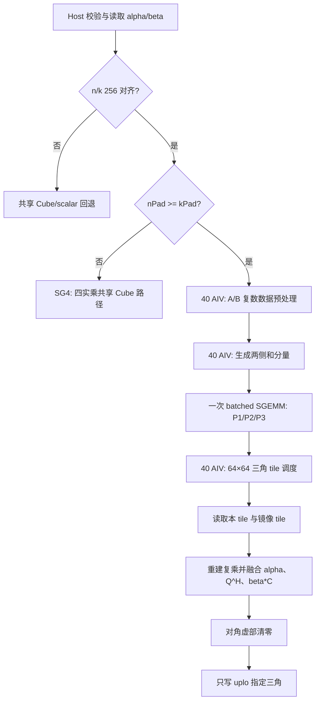
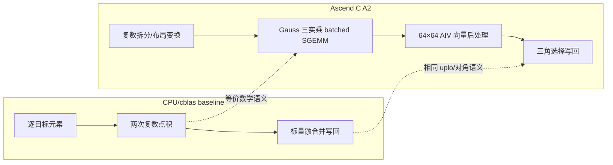

# aclblasCher2k 算子设计文档

## 一、需求背景

### 1.1 需求来源

本任务来自 2026 年 8 月 Ascend C 社区任务，目标是在 Atlas A2/A3 上为 ops-blas 实现与 cuBLAS `cublasCher2k` 语义一致的单精度复数 Hermitian rank-2k 更新接口 `aclblasCher2k`。

### 1.2 背景与现状

#### 1.2.1 参考实现

该接口属于句柄式 BLAS 直调算子，不是 GE/TBE 算子，因此 CANN 安装目录中没有可直接复用的 Cher2k TBE kernel、TBE 原型或 ops-info。设计依据是：

1. Netlib BLAS `cher2k.f`：参数校验、quick return、三角更新和对角虚部清零语义；
2. cuBLAS `cublas<t>her2k()`：接口及矩阵操作语义；
3. ops-blas 同族接口 `aclblasCherk`、`aclblasSsyr2k` 和共享 `matmul_series` 基础设施；
4. 验收基线：任务随附 CSV GTest，CPU golden 使用 cblas/Netlib `cblas_cher2k` 生成。

#### 1.2.2 基线实现分析

`trans=N` 时：

$$C \leftarrow \alpha A B^H+\overline{\alpha} B A^H+\beta C$$

`trans=C` 时：

$$C \leftarrow \alpha A^H B+\overline{\alpha}B^H A+\beta C$$

只有 `uplo` 指定的三角被引用和覆盖，对角元素虚部最终置零。CPU/cblas 基线逐列遍历目标三角，在每个输出元素上完成两组复数点积、alpha/beta 融合和写回。

#### 1.2.3 baseline 流程图

```mermaid
flowchart TD
    A[校验 handle/uplo/trans/n/k/ld/pointer] --> B{quick return?}
    B -- 是 --> Z[返回 SUCCESS]
    B -- 否 --> C[按 trans 确定 op(A) 与 op(B)]
    C --> D[遍历 uplo 指定三角]
    D --> E[两组复数点积]
    E --> F[融合 alpha/conj(alpha)/beta]
    F --> G{对角元素?}
    G -- 是 --> H[虚部置 0]
    G -- 否 --> I[保留计算虚部]
    H --> J[只写目标三角]
    I --> J
```

## 二、需求分析

### 2.1 外部依赖

- ACL Runtime：handle、stream、Device 内存及异步 memcpy；
- ops-blas：公共类型/状态码、workspace 管理、`aclblasSgemmStridedBatched`；
- Ascend C A2 API：`DataCopyPad`、`DataCopy`、`Gather`、`GatherMask`、`Cast`、`Arange`、`Compare`、`ShiftRight`、向量四则运算与事件同步。

### 2.2 内部适配模块

- 公共声明：`include/cann_ops_blas.h`；
- BLAS 包装：`blas/herk/arch22/cher2k_host.cpp`；
- Host 校验和路径分发：`blas/matmul_series/arch22/matmul_series_host.cpp`；
- A2 kernel 和 SGEMM 组合：`blas/matmul_series/arch22/matmul_series_cube.cpp`；
- 验收测试：`test/herk/cher2k/arch22/cher2k_test.cpp` 与 CSV。

### 2.3 原型与约束

```cpp
aclblasStatus_t aclblasCher2k(
    aclblasHandle_t handle,
    aclblasFillMode_t uplo,
    aclblasOperation_t trans,
    int n, int k,
    const aclblasComplex* alpha,
    const aclblasComplex* A, int lda,
    const aclblasComplex* B, int ldb,
    const float* beta,
    aclblasComplex* C, int ldc);
```

支持 COMPLEX64、Column-Major、`uplo=UPPER/LOWER`、`trans=N/C`。`trans=T` 返回 `ACLBLAS_STATUS_INVALID_VALUE`；其他非法枚举返回 `ACLBLAS_STATUS_INVALID_ENUM`。A/B/C 的非连续访问仅由 BLAS 前导维 `lda/ldb/ldc` 表达，不支持额外 tensor view 或广播。

## 三、需求详细设计

### 3.1 使用方式

本算子使用 ops-blas 单段句柄式接口。用户创建 handle、用 `aclblasSetStream` 绑定 stream、准备 Device 标量和矩阵后调用 `aclblasCher2k`。接口在绑定 stream 上排队执行；读取 C 前由调用方同步 stream。

### 3.2 Host 侧设计

#### 3.2.1 参数校验与 quick return

Host 按任务书顺序检查：

1. handle、uplo、trans；
2. n/k 非负及 N/C 对应的 lda/ldb、ldc；
3. alpha/beta 和矩阵指针；
4. `n=0` 直接成功返回；
5. 将 Device alpha/beta 异步拷回 Host 并同步当前 stream；
6. `(alpha=0 或 k=0) 且 beta=1` 时保持 C 字节不变并返回；
7. 其余场景进入 SG3、共享 Cube 或 scalar 路径。

#### 3.2.2 路径分发

这是 kernel 直调工程，没有独立 op_host tiling 数据结构或 tilingKey；Host 条件分支承担等价的 dispatch 职责。

| 路径 | 默认条件 | 用途 |
|---|---|---|
| 对齐 Cube 高性能路径 | Cher2k、n/k 均为 256 的倍数、未设置调试实现变量 | `n>=k` 使用 SG3；`n<k` 使用 SG4 |
| 共享 Cube 路径 | 最大维度 ≥256、最小维度 ≥64，且 workspace 可用 | 其他适合 Cube 的合法形状 |
| scalar 回退 | 小尺寸、低维不对齐、product disabled 或 workspace 不可用 | 完整语义与边界覆盖 |

环境变量 `OPS_BLAS_MATMUL_SERIES_CUBE*` 仅用于开发诊断，不属于公开接口，也不影响默认验收路径。

#### 3.2.3 workspace

令：

$$M_p=\lceil M/256\rceil\cdot256,\quad N_p=\lceil N/256\rceil\cdot256,\quad K_p=\lceil K/256\rceil\cdot256$$

共享 Cube workspace 为：

$$W=4\cdot(3M_pK_p+2K_pN_p+4M_pN_p)\ \text{bytes}$$

其中保存 A 的实/虚/和分量、B 的实/虚分量以及乘积平面。SG3 路径复用第一个预留乘积平面作为 B 的和分量，不增加 workspace。该别名要求输出平面容量 `nPad²` 不小于 B 平面容量 `nPad*kPad`，所以仅在 `nPad>=kPad` 时启用；`nPad<kPad` 使用无需 B 和分量的 SG4，避免 workspace 重叠。内部 workspace 上限为 3 GiB；用户 workspace 不足或库 workspace 分配失败时安全回退。

方阵 `n=k` 时 `W=36n^2` bytes：n=1024 为 36 MiB，n=2048 为 144 MiB。

### 3.3 Kernel 侧设计

#### 3.3.1 三实乘复数乘法

预处理把 op(A) 和 op(B) 的转置/共轭符号折叠到连续 FP32 平面。记处理后的复数左右操作数为 `X=X_r+iX_i`、`Y=Y_r+iY_i`，计算：

$$P_1=X_rY_r,\quad P_2=X_iY_i,\quad P_3=(X_r+X_i)(Y_r+Y_i)$$

$$\Re(XY)=P_1-P_2,\quad \Im(XY)=P_3-P_1-P_2$$

`Cher2kSgemm3PrepareSums` 生成两侧和分量，一次 batch=3 的 `aclblasSgemmStridedBatched` 完成 P1/P2/P3。随后 `Cher2kDenseSgemm3VectorEpilogue` 同时读取目标 tile 与镜像 tile，构造 `Q+Q^H+\beta C`，只写目标三角并将对角虚部置零。

#### 3.3.2 分核与分块

- 预处理和求和使用 40 个 AIV block，按连续元素或 64×64 tile 轮转分配；
- SGEMM 使用共享 A2 SGEMM/Cube 实现；
- 后处理使用 40 个 AIV block，将目标三角按 64×64 tile 编号；
- 三角 tile 总数为 `t(t+1)/2`，其中 `t=n/64`；通过闭式编号与 block 轮转映射保证每个任务只归属一个 AIV block；
- 非对角 tile 整块写回，主对角 tile 按列只写 UPPER 或 LOWER 的有效行段。

#### 3.3.3 UB 预算

| Kernel | UB 组成 | 占用 | A2 192 KiB 约束 |
|---|---|---:|:---:|
| `MatmulSeriesPrepareFastRawB` | 输入、实/虚输出、索引与 scratch | 147456 B（144 KiB） | 通过 |
| `Cher2kSgemm3PrepareSums` | 3×8192 FP32 TQue | 98304 B（96 KiB） | 通过 |
| `Cher2kDenseSgemm3VectorEpilogue` | 单个大 TBuf 内的 64×64 平面、C 输入、索引、mask | 184320 B（180 KiB） | 通过 |

实体 TPipe buffer 数分别为 1、3、1，均不超过 8；所有 TBuf offset 为 32B 对齐。

#### 3.3.4 同步说明

求和 kernel 使用 TQue 的 EnQue/DeQue 自动建立 MTE2→V→MTE3 依赖。后处理是单个长期 TBuf 多区域复用的数据流，无法由 TQue 自动推导依赖，因此在读取旧 C 前显式使用 `V_MTE2`，防止 MTE2 覆盖仍被 Vector 流水读取的镜像乘积；读取完成再建立 `MTE2_V`，从设计上避免 beta 非零路径的数据竞争。

#### 3.3.5 Ascend C 实现流程图



#### 3.3.6 baseline 与 Ascend C 差异图



差异原因：

1. CPU 基线按元素完成复数 dot，适合通用参考；Ascend C 将大规模乘加交给 Cube，发挥 A2 矩阵单元吞吐；
2. 四实乘可直接表达复数乘法，SG3 用一次三批次 GEMM 将乘法数降为三次；
3. 后处理按 64×64 tile 向量化，取代逐元素 scalar epilogue，减少标量循环与离散访存开销；
4. 只调度目标三角，并对主对角 tile 做列段写回，保持未选三角不被读取或修改。

### 3.4 支持硬件与约束

- 目标：Atlas A2（910B3，DAV_2201）；任务同时要求 Atlas A3，代码置于 A2/A3 共用的 `arch22` 目录；
- dtype：A/B/C/alpha 为 COMPLEX64，beta 为 FLOAT32；
- layout：Column-Major；
- trans：N/C；uplo：UPPER/LOWER；
- n/k 为运行时 int；不支持广播和超出 BLAS ld 语义的任意非连续 view；
- C 原地更新，默认执行结果确定，但任务不要求确定性模式开关。

## 四、特性交叉分析

| 维度 | 覆盖 |
|---|---|
| uplo × trans | UPPER/LOWER × N/C 正交覆盖 |
| shape | n/k=0、1、小质数、2 的幂及 ±1、方阵 rank-k、宽/窄矩形 |
| leading dimension | lda/ldb/ldc 最小合法值和 padding |
| scalar | alpha=0/1/纯虚/复数/大值，beta=0/1/负值/非零 |
| 数据 | 均匀、正态、零、交替值及 Inf/NaN |
| 异常 | 空指针、负维度、非法枚举、trans=T、非法 ld |

## 五、可维护可测试分析

### 5.1 精度测试方案

验收采用任务书指定的 ops-blas CSV GTest，CPU golden 由 cblas/Netlib `cblas_cher2k` 生成。测试流程如下：

1. 按第四章的交叉维度生成 A、B、C、alpha 和 beta，并为未选三角设置可识别的初值；
2. 调用 `aclblasCher2k` 并同步绑定 stream；
3. 将目标三角与 CPU golden 比较，同时检查未选三角保持不变、对角虚部为 0；
4. 对 quick return、非法枚举、负维度、非法 leading dimension 和空指针分别校验返回码及 C 是否保持不变；
5. 失败时记录完整参数组合、随机种子、首个错误位置和误差，便于复现与回归。

精度判定采用任务书阈值：rtol=2^-10、atol=2^-16、matched ratio≥0.99、max absolute error≤max(1e-2, 32×ULP)。

### 5.2 性能测试方案

在默认实现路径下按任务书固定性能用例测试，计时区间只覆盖算子执行；每条用例先 warmup 10 次，再采集 60 次并计算平均耗时。判定条件如下：

| case | 参数 | 平均耗时门槛 |
|---|---|---:|
| TC_PF_1001 | UPPER/N, n=k=1024 | ≤933.700 μs |
| TC_PF_1002 | UPPER/N, n=k=2048 | ≤3354.040 μs |
| TC_PF_1003 | LOWER/C, n=k=1024 | ≤692.420 μs |

除固定门槛外，补充 `n>k`、`n<k`、非 256 对齐和小尺寸形状的路径性能采样，用于观察 SG3、SG4、共享 Cube 与 scalar 回退的分发是否符合设计；扩展采样只作回归趋势分析，不替代任务书固定门槛。

### 5.3 兼容性与回归测试方案

- 在任务指定的 CANN 9.1.0 环境执行 clean build，并分别在 Atlas A2、Atlas A3 上运行功能、精度与固定性能用例；
- 覆盖内部 workspace 可用、不足和分配失败场景，确认回退路径与高性能路径语义一致；
- 覆盖 n/k=0、alpha=0、beta=1、最小合法 leading dimension、padding leading dimension 及非对齐边界；
- 对 SG3/SG4 分界 `nPad=kPad` 两侧和 beta 非零路径设置专项回归，检查 workspace 别名与流水同步；
- 保留失败用例的参数、随机种子和构建版本，使问题可稳定复现并纳入后续回归集。
