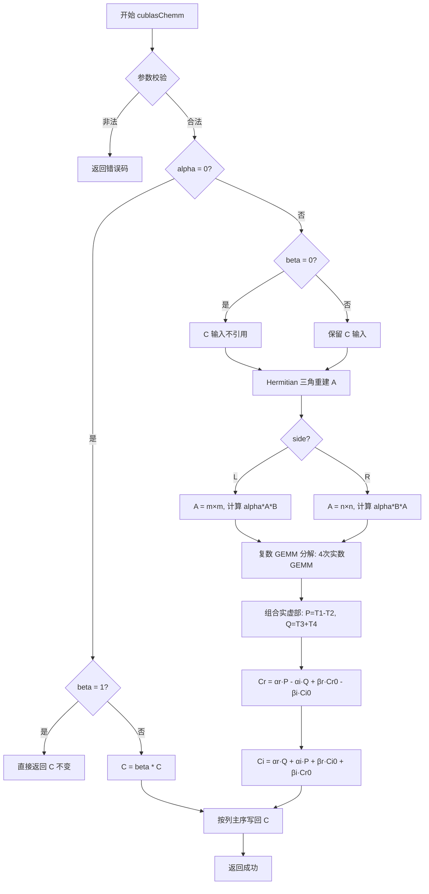
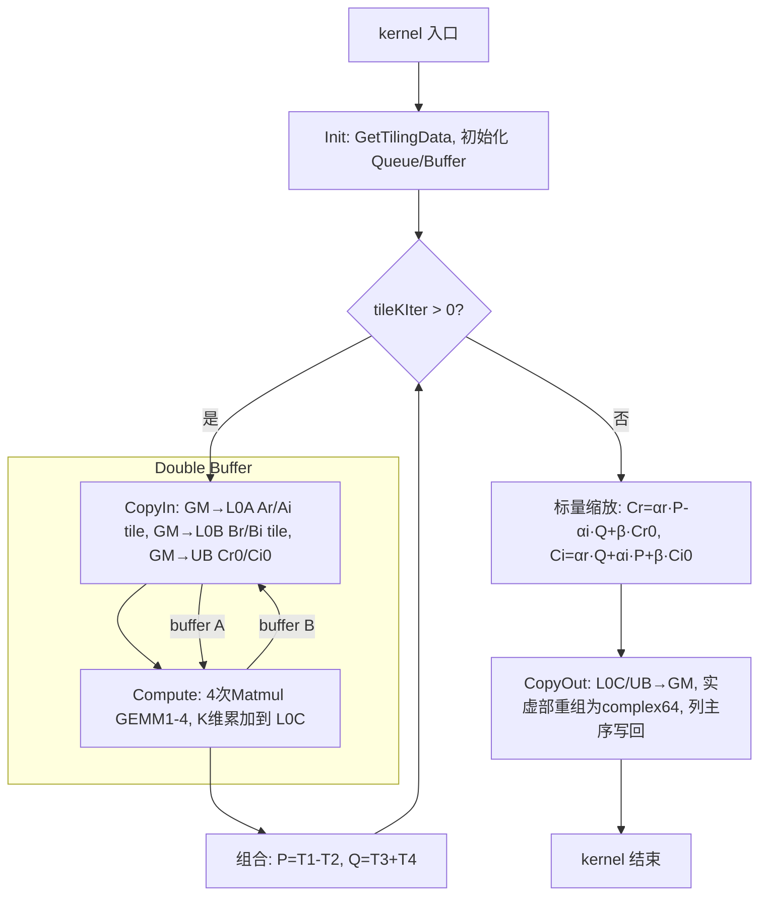
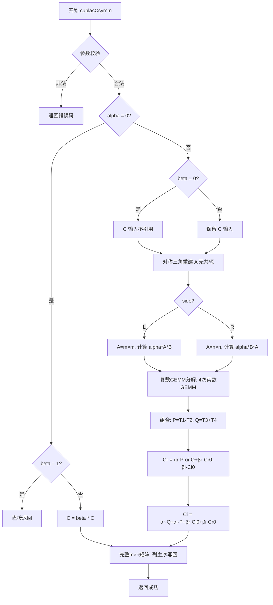
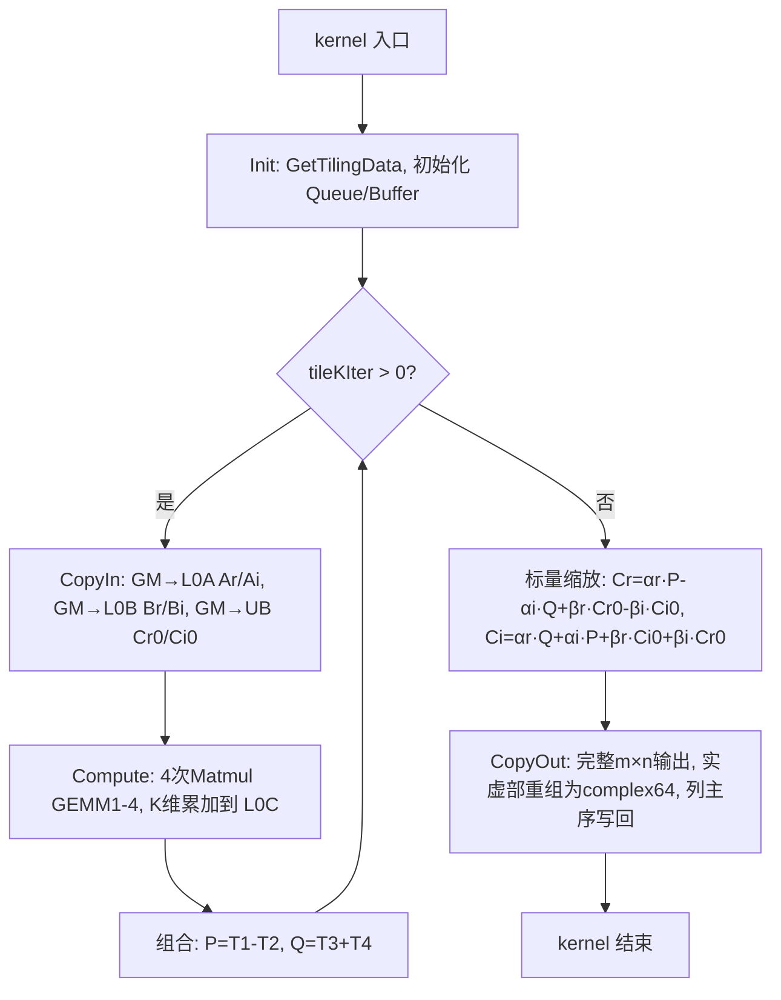
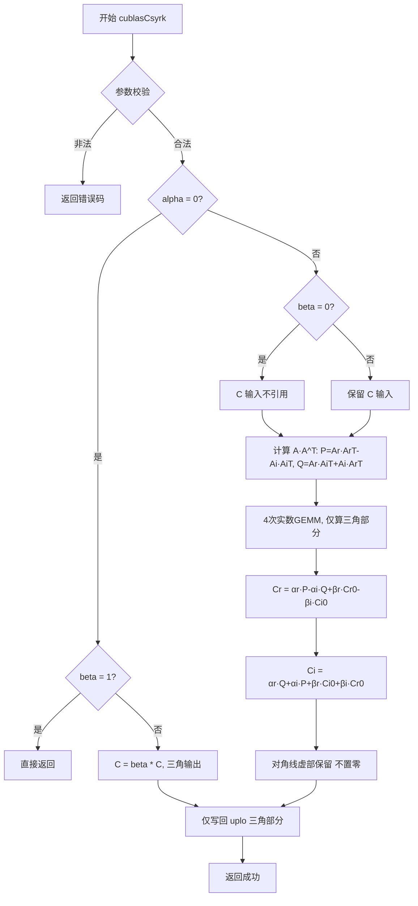
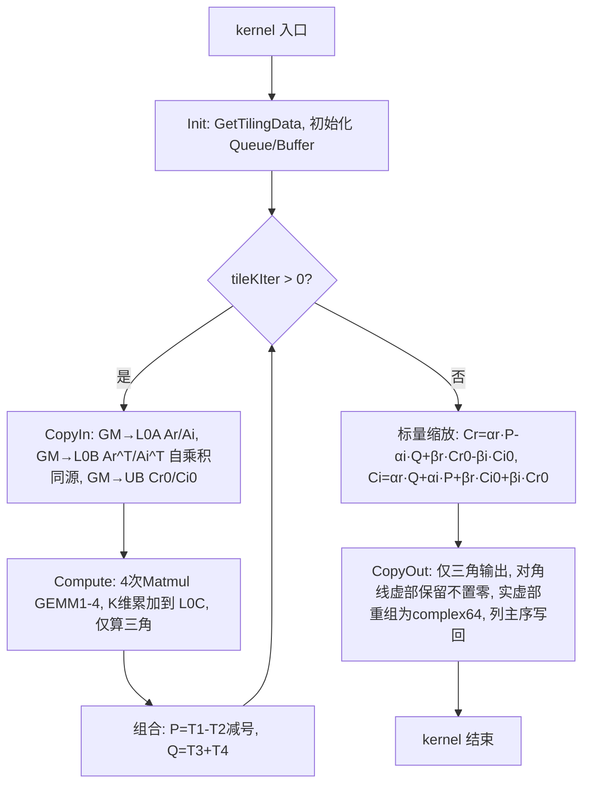

# 矩阵乘系列算子设计文档

> **任务编号**：08-10-矩阵乘系列算子开发
> **团队名称**：chenjiayi_
> **适配硬件**：Atlas A2 训练系列产品
> **开发语言**：Ascend C
> **开源仓地址**：https://gitcode.com/cann/ops-blas

## 目录

- [chemm](#chemm) — Hermitian 矩阵乘法（复数单精度）
- [cher2k](#cher2k) — Hermitian 秩-2K 更新（复数单精度）
- [cherk](#cherk) — Hermitian 秩-K 更新（复数单精度）
- [csymm](#csymm) — 对称矩阵乘法（复数单精度）
- [csyrk](#csyrk) — 对称秩-K 更新（复数单精度）

---

# chemm

## 一、需求背景（required）

### 1.1 需求来源

通过社区任务完成开源仓算子贡献的需求。参考标准 BLAS 库 `chemm` 接口（https://netlib.org/blas/blasqr.pdf ）以及 cuBLAS 库 `cublas<t>hemm` 接口（https://docs.nvidia.com/cuda/cublas/index.html#2.7.7 ），在昇腾 NPU 上基于 Ascend C 编程语言实现功能一致的 chemm 算子，完成算子设计、开发、测试全流程工作，验收通过后将算子提交至昇腾算子开源仓 ops-blas（https://gitcode.com/cann/ops-blas ）。

### 1.2 背景介绍

#### 1.2.1 chemm 算子实现优化

chemm（Hermitian 矩阵乘法）是 BLAS Level 3 接口之一，用于执行包含 Hermitian 矩阵的复数矩阵乘法运算。本算子为全新开发算子，在昇腾 CANN 算子库中无 TBE 前身实现。

**CANN 算子开发环境路径**（本机 CANN 9.0.0）：

| 资源类型 | 路径 | 说明 |
|----------|------|------|
| TBE 算子源码路径 | `$ASCEND_HOME_PATH/opp/built-in/op_impl/ai_core/tbe/impl` | 内置 TBE 算子实现，经查证无 chemm 对应文件 |
| TBE DSL API 路径 | `$ASCEND_HOME_PATH/python/site-packages/tbe/dsl` | TBE DSL 计算库，经查证无 hemm/herk/symm/syrk 对应模块 |
| 算子信息库路径 | `$ASCEND_HOME_PATH/opp/built-in/op_impl/dsa_core/config/ascend910b/dsa-ascend910b-ops-info-legacy.json` | 算子信息库，经查证无 chemm 条目 |
| ACLNN 接口声明 | `$ASCEND_HOME_PATH/aclnn/include/aclnn_op.h`（aclnn 接口汇总头文件） | 经查证无 aclnnChemm 接口声明 |

> **说明**：chemm 为全新算子，无 TBE 前身。标杆算子为 cuBLAS 的 `cublasChemm`（GPU 实现）和标准 BLAS 的 `chemm`（CPU 实现，如 OpenBLAS `cblas_chemm`）。本算子将在 ops-blas 开源仓 experimental 目录中以 `aclblasChemm` 接口形式新增，算子信息库（`ops_info.json`/`op_host/*.cpp`）在算子仓内创建。

**ops-blas 开源仓参考路径**：

| 资源 | 路径 |
|------|------|
| 开源仓地址 | https://gitcode.com/cann/ops-blas |
| 实验性算子目录 | https://gitcode.com/cann/ops-blas/tree/master/experimental |
| 同类参考算子（Level-3 BLAS / arch22） | blas/symm/arch22（实数对称矩阵乘，arch22/Atlas A2，MatmulImpl + 三角矩阵镜像索引读取参考） |
| 复数分解思路参考 | blas/gemm3m/arch35（复数 GEMM 3M 分解，仅 arch35/Atlas A3，Atlas A2 不支持，仅作复数分解算法思路参考） |
| aclblas 框架参考 | experimental/aclblasCtrsmBatched2（aclblas 复数算子：op_host/op_kernel/test 目录组织、CMakeLists、build 集成参考） |

#### 1.2.2 chemm 算子现状分析

##### 1.2.2.1 标杆算子支持的数据类型和数据格式

标杆算子为 cuBLAS `cublasChemm` 和标准 BLAS `chemm`（OpenBLAS `cblas_chemm`），支持能力如下：

| 参数 | 数据类型 | 数据格式 | 维度 | 说明 |
|------|----------|----------|------|------|
| side | char | - | - | 'L'/'R' |
| uplo | char | - | - | 'U'/'L' |
| m | int | - | - | m > 0 |
| n | int | - | - | n > 0 |
| alpha | complex\<float\> | - | - | 复数标量 |
| a | complex\<float\>（complex64） | Column-Major | [m,m] 或 [n,n] | Hermitian 矩阵，仅引用 uplo 三角部分 |
| lda | int | - | - | lda ≥ max(1, dim) |
| b | complex\<float\>（complex64） | Column-Major | [m,n] | 普通矩阵 |
| ldb | int | - | - | ldb ≥ max(1, m) |
| beta | complex\<float\> | - | - | 复数标量 |
| c | complex\<float\>（complex64） | Column-Major | [m,n] | 输出矩阵 |
| ldc | int | - | - | ldc ≥ max(1, m) |

与算子信息库要求保持一致：数据类型 complex64、数据格式 Column-Major、参数集合与 BLAS/cuBLAS 完全对齐。

##### 1.2.2.2 标杆算子实现描述

cuBLAS `cublasChemm` 和 BLAS `chemm` 的标准实现逻辑如下：

1. **参数校验**：校验 side ∈ {'L','R'}、uplo ∈ {'U','L'}、m > 0、n > 0、前导维度约束（lda/ldb/ldc）。若指针为空或维度非法，返回错误码。
2. **特殊值快速路径**：
   - 若 alpha = 0 且 beta = 1，直接返回（C 不变）
   - 若 alpha = 0，执行 C = beta * C（标量缩放，不引用 A、B）
   - 若 beta = 0，C 输入值不引用，结果为 C = alpha * A * B（或 alpha * B * A）
3. **Hermitian 三角重建**：矩阵 A 仅存储 uplo 指定的三角部分，根据 Hermitian 性质 A[i,j] = conj(A[j,i]) 重建完整矩阵：
   - uplo='U'：下三角元素由上三角共轭镜像得到（Ar[i,j]=Ar[j,i]，Ai[i,j]=-Ai[j,i]）
   - uplo='L'：上三角元素由下三角共轭镜像得到
   - 对角线虚部强制置零（Ai[i,i]=0）
4. **矩阵乘法**：
   - side='L'：C = alpha * A * B + beta * C，A 为 m×m
   - side='R'：C = alpha * B * A + beta * C，A 为 n×n
5. **标量缩放**：结果乘以 alpha 并累加 beta * C。
6. **输出**：结果按列主序写回 C。

cuBLAS 内部通过复数 GEMM 分解实现：将复数乘法分解为 4 次实数 GEMM（Ar·Br、Ai·Bi、Ar·Bi、Ai·Br），利用 cuBLAS 的 `cublasSgemm` 完成实数矩阵乘法，最后组合实虚部。

##### 1.2.2.3 标杆算子实现流程图



## 二、需求分析（required）

### 2.1 外部组件依赖

| 外部组件 | 版本 | 用途 | 依赖说明 |
|----------|------|------|----------|
| OpenBLAS | ≥ 0.3.20 | CPU golden 参考实现 | 测试阶段精度比对基准，使用 `cblas_chemm` 升精度到 FP64/complex128 计算 |
| cuBLAS | CUDA 11.x+ | GPU 性能基准 | 性能验收基准，使用 `cublasChemm` 采集 GPU A100 耗时 |

### 2.2 内部适配模块

| 内部模块 | 版本/路径 | 用途 | 适配说明 |
|----------|-----------|------|----------|
| CANN ACLNN 框架 | CANN 9.0.0 | 算子调用框架 | 算子以 aclblas 接口形式注册，通过 ACLNN 框架完成 host/kernel 联动 |
| Ascend C Matmul API | CANN 9.0.0 | 矩阵乘底座 | 复数 GEMM 分解后，4 次实数 GEMM 调用 Matmul API 执行 |
| Ascend C Vector API | CANN 9.0.0 | 标量乘加、转置 | 复数实虚部组合、alpha/beta 缩放在 Vector 侧完成 |
| ops-blas 构建框架 | ops-blas master | 编译/测试框架 | build.sh 编译，C++ GTest 驱动测试，CSV 用例加载 |

### 2.3 需求模块设计

#### 2.3.1 Ascend C 算子原型

算子原型与标杆算子（BLAS `chemm` / cuBLAS `cublasChemm`）完全对齐，接口名为 `aclblasChemm`。

| 参数名 | 输入/输出/属性 | 描述 | 数据类型 | 数据格式 | 维度 |
|--------|----------------|------|----------|----------|------|
| side | 属性 | 左乘或右乘 | char | - | - |
| uplo | 属性 | 上三角或下三角 | char | - | - |
| m | 属性 | 矩阵 C 的行数 | int | - | - |
| n | 属性 | 矩阵 C 的列数 | int | - | - |
| alpha | 属性 | 复数标量 | complex\<float\> | - | - |
| a | 输入 | Hermitian 矩阵 A | complex\<float\> | Column-Major | [m,m] 或 [n,n] |
| lda | 属性 | A 的前导维度 | int | - | - |
| b | 输入 | 矩阵 B | complex\<float\> | Column-Major | [m,n] |
| ldb | 属性 | B 的前导维度 | int | - | - |
| beta | 属性 | 复数标量 | complex\<float\> | - | - |
| c | 输出 | 输出矩阵 C | complex\<float\> | Column-Major | [m,n] |
| ldc | 属性 | C 的前导维度 | int | - | - |

#### 2.3.2 Ascend C 算子相关约束

与标杆算子相比，Ascend C 版本缺失/不涉及的功能：

| 约束项 | 标杆算子 | Ascend C 版本 | 说明 |
|--------|----------|---------------|------|
| 数据类型 | complex64 | complex64 | 完全对齐，无缺失 |
| 数据格式 | Column-Major | Column-Major | 完全对齐，无缺失 |
| broadcast | 不支持 | 不支持 | 完全对齐，无缺失 |
| in-place 计算 | cuBLAS 支持 C 与 A/B 地址重叠 | 不支持 | 约束：输入输出地址不可重叠 |
| 异步执行 | cuBLAS 支持流异步 | ACLNN 框架支持 stream | 通过 ACLNN stream 实现，无缺失 |

> 无功能缺失，所有任务书要求的功能均需实现。

## 三、需求详细设计（required）

### 3.1 调用方式

算子采用 **ACLNN 调用方式**（aclblas 接口），与 ops-blas 仓现有算子（如 `aclblasCtrsmBatched2`）保持一致。

**接口签名**（参考 ops-blas 仓 `aclblas_minimal.h`）：

```c
aclnnStatus aclblasChemm(
    aclnnSide side,          // 'L' or 'R'
    aclnnUplo uplo,          // 'U' or 'L'
    int m, int n,
    const void* alpha,       // complex64
    const void* a, aclnnDataType dataTypeA,
    int lda,
    const void* b, aclnnDataType dataTypeB,
    int ldb,
    const void* beta,        // complex64
    void* c, aclnnDataType dataTypeC,
    int ldc,
    aclnnOpExecutor* executor,
    aclrtStream stream);
```

**调用流程**：用户通过 ACLNN 框架调用 → host 侧 Tiling 计算 → kernel 侧执行 → 结果写回 GM。测试通过 C++ GTest 驱动，build.sh 编译，CSV 用例加载（见 `test_script/chemm/`）。

### 3.2 需求总体设计

#### 3.2.1 host 侧设计

##### 3.2.1.1 分核策略

采用满核原则，按输出矩阵 C 的列维度（列主序视角，等价于行主序行维度）切分到多核：

- 获取可用核数：`blockNum = GetBlockNum()`（Atlas A2 训练系列，满核可用）
- 每核处理列数：`nPerCore = n / blockNum`
- 不能均分时：前 `n % blockNum` 个核多处理 1 列（大核），其余为小核
- 每核独立加载所需的 A、B 数据条带，计算 C 的对应列条带
- 核间无数据依赖（不同列之间无交叉），无需通信

**分核计算公式**：
```
blockNum = GetBlockNum()
nPerCore = n / blockNum              // 每核基础列数
nRemain = n % blockNum               // 余数
coreIdx < nRemain ? nPerCore + 1 : nPerCore   // 各核实际列数
```

##### 3.2.1.2 数据分块和内存优化策略

在单核内沿 K 维度（reduction dimension）进行 L0/UB 级切分。

**复数分解**：将 complex64 矩阵分解为实部（float32）和虚部（float32）两个独立数组。设 A = Ar + i·Ai，B = Br + i·Bi。

**K 维切分**：将 reduction 维度 K 切分为多个 tile，每次加载 A_tile[m×tileK] 和 B_tile[tileK×tileN] 到 L0A/L0B 缓冲区，通过 Matmul API 累加部分结果到 L0C。

**Buffer 规划与内存计算**：

复数分解后需为实部/虚部分别规划 buffer。Atlas A2 单核 L0A/L0B 各 64KB，L0C 128KB，UB 192KB。

| Buffer | 位置 | 数据类型 | 尺寸 | 计算公式 |
|--------|------|----------|------|----------|
| Ar_tile | L0A | float32 | m × tileK | tileK ≤ L0A_size / (m × 4B) |
| Ai_tile | L0A | float32 | m × tileK | 同上（与 Ar 复用或并列） |
| Br_tile | L0B | float32 | tileK × tileN | tileK × tileN × 4B ≤ L0B_size |
| Bi_tile | L0B | float32 | tileK × tileN | 同上 |
| Cr_acc | L0C | float32 | m × tileN | m × tileN × 4B ≤ L0C_size |
| Ci_acc | L0C | float32 | m × tileN | 同上 |
| Cr0_tile | UB | float32 | m × tileN | 中转 buffer |
| Ci0_tile | UB | float32 | m × tileN | 中转 buffer |

**tile 尺寸计算公式**（考虑 4 次 GEMM 共享 L0A/L0B）：
```
// L0A 需同时容纳 Ar_tile 和 Ai_tile（或分时复用）
tileK_max_L0A = L0A_size / (m × sizeof(float32) × bufferNum_A)
// L0B 需同时容纳 Br_tile 和 Bi_tile
tileK_max_L0B = L0B_size / (tileN × sizeof(float32) × bufferNum_B)
// L0C 需同时容纳 Cr_acc 和 Ci_acc
tileN_max_L0C = L0C_size / (m × sizeof(float32) × 2)  // ×2 for Cr+Ci
// 取最小值
tileK = min(tileK_max_L0A, tileK_max_L0B, K)
tileN = min(tileN_max_L0C, nPerCore)
// 对齐到 16B（float32 × 4 = 16B，L0 对齐要求）
tileK = ALIGN(tileK, 4)   // float32 对齐 16B → 4 元素
tileN = ALIGN(tileN, 4)
```

**Double Buffer**：开启 double buffer（bufferNum_A = bufferNum_B = 2），将 CopyIn 与 Compute 流水重叠。开启后 L0A/L0B 可用空间减半：
```
tileK_max_L0A = L0A_size / (m × 4B × 2)   // ×2 for double buffer
```

**K 维迭代次数**：
```
tileKIter = K / tileK
tileKRemain = K % tileK   // 尾块单独处理
```

##### 3.2.1.3 tilingKey 规划策略

side 和 uplo 组合为 4 种模式，需 TilingKey 感知 host 侧信息以在 kernel 侧走不同分支：

| TilingKey | side | uplo | 说明 |
|-----------|------|------|------|
| 0 | L | U | 左乘 + 上三角 |
| 1 | L | L | 左乘 + 下三角 |
| 2 | R | U | 右乘 + 上三角 |
| 3 | R | L | 右乘 + 下三角 |

**数据检测**：
- 校验 side ∈ {'L','R'}、uplo ∈ {'U','L'}
- 校验 m > 0、n > 0
- 校验 side='L' 时 lda ≥ max(1, m)；side='R' 时 lda ≥ max(1, n)
- 校验 ldb ≥ max(1, m)、ldc ≥ max(1, m)
- 校验输入指针非空（a、b、c 均不可为 nullptr）

#### 3.2.2 kernel 侧设计

##### 3.2.2.1 kernel 侧实现描述

kernel 侧分为 Init 和 Process 两个阶段，其中 Process 包括 CopyIn、Compute、CopyOut 三个阶段，与标杆算子流程保持一致。

**Init 阶段**：
- 通过 `GetTilingData()` 获取 host 侧传入的 Tiling 参数（m、n、blockNum、tileK、TilingKey、alpha/beta 实虚部等）
- 初始化 TQueue（管理 UB buffer）和 TQueBind（double buffer）
- 分配 L0A/L0B/L0C buffer 用于 Matmul API

**CopyIn 阶段**：
- 从 GM 搬运 Ar_tile、Ai_tile（A 的实部/虚部 tile）到 L0A buffer
- 从 GM 搬运 Br_tile、Bi_tile（B 的实部/虚部 tile）到 L0B buffer
- 若 β ≠ 0，从 GM 搬运 Cr₀_tile、Ci₀_tile（原始 C 的实部/虚部 tile）到 UB buffer
- 复数数据在搬运过程中完成实部/虚部分离（complex64 → 2×float32）
- **Hermitian 三角重建**：A 的三角重建在 host 侧完成后写入 GM，kernel 侧直接读取完整 A（与标杆一致）

**Compute 阶段**：
- 调用 Ascend C Matmul API 执行 4 次实数 GEMM（GEMM1~GEMM4）
- 在 K 维度上迭代累加：每个 tileK 迭代内完成 4 次 Matmul 的部分累加
- 4 次 GEMM 完成后计算 P = T1 - T2、Q = T3 + T4
- 按公式组合最终结果：
  - Cr = αr·P - αi·Q + βr·Cr₀ - βi·Ci₀
  - Ci = αr·Q + αi·P + βr·Ci₀ + βi·Cr₀
- 标量乘加在 Vector 侧完成（通过 Ascend C 元素级 API）

**复数 GEMM 分解**（side='L' 时 C = α·A·B + β·C）：

设 P = Ar·Br - Ai·Bi，Q = Ar·Bi + Ai·Br（即 A·B 的实部和虚部），则：

| GEMM | 左矩阵 | 右矩阵 | 结果 | 用途 |
|------|--------|--------|------|------|
| GEMM1 | Ar | Br | T1 = Ar·Br | P 的第一项 |
| GEMM2 | Ai | Bi | T2 = Ai·Bi | P 的第二项 |
| GEMM3 | Ar | Bi | T3 = Ar·Bi | Q 的第一项 |
| GEMM4 | Ai | Br | T4 = Ai·Br | Q 的第二项 |

P = T1 - T2，Q = T3 + T4。side='R' 时 A、B 角色互换，分解同理。

**列主序适配**：列主序 C[m×n] = A[m×k] × B[k×n] 等价于行主序 C^T[n×m] = B^T[n×k] × A^T[k×m]。host 侧 Tiling 将行列维度互换（m↔n），操作数顺序交换，kernel 侧行主序 Matmul 结果直接按列主序写回，无需额外转置。

**CopyOut 阶段**：
- 将 Cr、Ci 结果从 L0C/UB 搬回 GM
- 实部/虚部重新组合为 complex64 写入输出矩阵 C
- 按列主序写回

##### 3.2.2.2 Ascend C 实现流程图



##### 3.2.2.3 Ascend C 实现流程图与标杆算子流程图存在的差异点和原因

| 差异点 | 标杆算子（cuBLAS） | Ascend C 实现 | 原因 |
|--------|--------------------|---------------|------|
| 复数 GEMM 分解位置 | cuBLAS 内部封装，对用户不可见 | 显式分解为 4 次实数 GEMM | Ascend C Matmul API 当前不直接支持复数输入，需手动分解为实部/虚部计算 |
| Hermitian 三角重建位置 | cuBLAS 内部处理 | host 侧重建后写入 GM | 避免 kernel 侧重复读取三角数据，重建在 host 侧一次性完成，减少 GM 读写 |
| 列主序适配方式 | cuBLAS 原生支持列主序 | 行列维度互换 + 操作数顺序交换 | Ascend C Matmul API 默认行主序，利用转置性质 C^T = B^T × A^T 适配，无额外开销 |
| 多核并行 | GPU 通过 thread block 并行 | NPU 通过多核（blockNum）按列切分 | 硬件架构差异，NPU 多核按输出列条带分配，核间无依赖 |
| 数据搬运 | GPU 通过 global memory 直接访问 | NPU 通过 GM→L0A/L0B→L0C→UB→GM 分级搬运 | NPU 存储层次结构（GM/L0/UB），需显式管理数据搬运和 buffer |
| 流水控制 | GPU 通过 warp 调度器自动 | NPU 通过 double buffer 显式控制 | NPU 需显式开启 double buffer 实现 CopyIn/Compute 流水重叠 |

### 3.3 支持硬件

| 支持的芯片版本 | 涉及勾选 |
|----------------|----------|
| Atlas 800I/T A2 | √ |

与《算子任务书》要求支持的硬件保持一致：Atlas A2 训练系列产品。

### 3.4 算子约束限制

- 数据类型：输入输出均为单精度复数（complex64，即 complex\<float\>），标量 alpha/beta 为复数
- 数据格式：列主序（Column-Major）
- 矩阵 A 为 Hermitian 矩阵（A = A^H），仅引用 uplo 指定的三角部分，对角线元素为实数
- 维度约束：m、n 均必须大于 0
- 前导维度约束：side='L' 时 lda ≥ max(1, m)；side='R' 时 lda ≥ max(1, n)；ldb ≥ max(1, m)；ldc ≥ max(1, m)
- 输入不支持 broadcast
- 输入输出地址不可重叠（不支持 in-place 计算）
- 当 alpha = 0 时，不需要引用矩阵 A 和 B（结果为 C = beta * C）
- 当 beta = 0 时，不需要引用矩阵 C 的输入值（结果为 C = alpha * A * B 或 C = alpha * B * A）

## 四、特性交叉分析

| 特性维度 | 支持值 | 交叉组合 | 支持情况 | 说明 |
|----------|--------|----------|----------|------|
| 数据类型 | complex64 | complex64 × Atlas A2 | ✓ 支持 | 唯一支持组合 |
| 硬件 | Atlas A2 | complex64 × Column-Major | ✓ 支持 | 唯一支持组合 |
| 数据格式 | Column-Major | Atlas A2 × Column-Major | ✓ 支持 | 唯一支持组合 |
| side | L / R | side × uplo = 4 种 | ✓ 全支持 | L/U, L/L, R/U, R/L |
| uplo | U / L | side × uplo × complex64 | ✓ 全支持 | 4 种参数组合均支持 |
| alpha | 复数 | alpha = 0 快速路径 | ✓ 支持 | alpha=0 时跳过 A·B 计算 |
| beta | 复数 | beta = 0 快速路径 | ✓ 支持 | beta=0 时跳过 C 读取 |

**特性交叉结论**：数据类型、硬件、数据格式均为单一支持值，无交叉冲突。side × uplo 的 4 种参数组合全支持。alpha/beta 特殊值（0）有快速路径优化。

## 五、可维可测分析（required）

### 5.1 精度标准/性能标准

| 验收标准 | 描述 | 标准来源 |
|----------|------|----------|
| 精度标准 | atol = 2⁻¹⁶ ≈ 1.5259e-5，rtol = 2⁻¹⁰ ≈ 9.7656e-4；判定条件：\|NPU - golden\| ≤ atol + rtol × max(\|golden\|) 且 max(\|NPU - golden\| / \|golden\|) ≤ 10 × rtol | 生态算子开源精度标准（experimental_standard），参考：https://gitcode.com/cann/opbase/blob/master/docs/zh/ops_precision_standard/experimental_standard.md |
| 性能标准 | NPU 耗时 ≤ GPU A100 耗时 / 0.8（即 NPU 不慢于 GPU 的 1.25 倍） | 任务书 |

GPU A100 性能基准（方阵场景）：

| M | N | side | uplo | GPU A100 耗时(ms) | NPU 目标(≤ms) |
|---|---|------|------|-------------------|---------------|
| 1024 | 1024 | L | U | 0.609 | ≤ 0.761 |
| 2048 | 2048 | L | U | 4.951 | ≤ 6.189 |
| 1024 | 1024 | R | L | 0.490 | ≤ 0.612 |
| 2048 | 2048 | R | L | 4.337 | ≤ 5.421 |

完整 GPU 性能数据参考：./test_script/matmul_series_gpu_perf.csv

### 5.2 兼容性分析
·
新算子，不涉及兼容性分析。算子将提交至 ops-blas 开源仓 experimental 目录（https://gitcode.com/cann/ops-blas/tree/master/experimental ）。


---

# cher2k

## 一、需求背景（required）

### 1.1 需求来源

通过社区任务完成开源仓算子贡献的需求。参考标准 BLAS 库 `cher2k` 接口（https://netlib.org/blas/blasqr.pdf ）以及 cuBLAS 库 `cublas<t>her2k` 接口（https://docs.nvidia.com/cuda/cublas/index.html#2.7.15 ），在昇腾 NPU 上基于 Ascend C 编程语言实现功能一致的 cher2k 算子，完成算子设计、开发、测试全流程工作，验收通过后将算子提交至昇腾算子开源仓 ops-blas（https://gitcode.com/cann/ops-blas ）。

### 1.2 背景介绍

#### 1.2.1 cher2k 算子实现优化

cher2k（Hermitian 秩-2K 更新）是 BLAS Level 3 接口之一，用于对 Hermitian 矩阵 C 进行秩-2K 更新。本算子为全新开发算子，在昇腾 CANN 算子库中无 TBE 前身实现。

**CANN 算子开发环境路径**（本机 CANN 9.0.0）：

| 资源类型 | 路径 | 说明 |
|----------|------|------|
| TBE 算子源码路径 | `$ASCEND_HOME_PATH/opp/built-in/op_impl/ai_core/tbe/impl` | 内置 TBE 算子实现，经查证无 cher2k 对应文件 |
| TBE DSL API 路径 | `$ASCEND_HOME_PATH/python/site-packages/tbe/dsl` | TBE DSL 计算库，经查证无 her2k 对应模块 |
| 算子信息库路径 | `$ASCEND_HOME_PATH/opp/built-in/op_impl/dsa_core/config/ascend910b/dsa-ascend910b-ops-info-legacy.json` | 算子信息库，经查证无 cher2k 条目 |
| ACLNN 接口声明 | `$ASCEND_HOME_PATH/aclnn/include/aclnn_op.h` | 经查证无 aclnnCher2k 接口声明 |

> **说明**：cher2k 为全新算子，无 TBE 前身。标杆算子为 cuBLAS 的 `cublasCher2k`（GPU 实现）和标准 BLAS 的 `cher2k`（CPU 实现，如 OpenBLAS `cblas_cher2k`）。本算子将在 ops-blas 开源仓 experimental 目录中以 `aclblasCher2k` 接口形式新增。

**ops-blas 开源仓参考路径**：

| 资源 | 路径 |
|------|------|
| 开源仓地址 | https://gitcode.com/cann/ops-blas |
| 实验性算子目录 | https://gitcode.com/cann/ops-blas/tree/master/experimental |
| 同类参考算子（Level-3 BLAS / arch22） | blas/symm/arch22（实数对称矩阵乘，arch22/Atlas A2，MatmulImpl + 三角矩阵镜像索引读取参考） |
| 复数分解思路参考 | blas/gemm3m/arch35（复数 GEMM 3M 分解，仅 arch35/Atlas A3，Atlas A2 不支持，仅作复数分解算法思路参考） |
| aclblas 框架参考 | experimental/aclblasCtrsmBatched2（aclblas 复数算子：op_host/op_kernel/test 目录组织、CMakeLists、build 集成参考） |

#### 1.2.2 cher2k 算子现状分析

##### 1.2.2.1 标杆算子支持的数据类型和数据格式

标杆算子为 cuBLAS `cublasCher2k` 和标准 BLAS `cher2k`（OpenBLAS `cblas_cher2k`），支持能力如下：

| 参数 | 数据类型 | 数据格式 | 维度 | 说明 |
|------|----------|----------|------|------|
| uplo | char | - | - | 'U'/'L' |
| trans | char | - | - | 'N'/'C' |
| n | int | - | - | n > 0 |
| k | int | - | - | k > 0 |
| alpha | complex\<float\> | - | - | 复数标量 |
| a | complex\<float\>（complex64） | Column-Major | [n,k] 或 [k,n] | trans='N' 时 n×k，trans='C' 时 k×n |
| lda | int | - | - | trans='N' 时 ≥ max(1,n)，trans='C' 时 ≥ max(1,k) |
| b | complex\<float\>（complex64） | Column-Major | [n,k] 或 [k,n] | 同 A |
| ldb | int | - | - | 同 lda |
| beta | float | - | - | **实数标量**，必须为实数 |
| c | complex\<float\>（complex64） | Column-Major | [n,n] | Hermitian 矩阵，仅存储 uplo 三角部分，对角线为实数 |
| ldc | int | - | - | ldc ≥ max(1,n) |

与算子信息库要求保持一致：数据类型 complex64、数据格式 Column-Major、beta 为实数（float32）、参数集合与 BLAS/cuBLAS 完全对齐。

##### 1.2.2.2 标杆算子实现描述

cuBLAS `cublasCher2k` 和 BLAS `cher2k` 的标准实现逻辑如下：

1. **参数校验**：校验 uplo ∈ {'U','L'}、trans ∈ {'N','C'}、n > 0、k > 0、前导维度约束、beta 为实数。若非法返回错误码。
2. **特殊值快速路径**：
   - 若 alpha = 0 且 beta = 1，直接返回（C 不变）
   - 若 alpha = 0，执行 C = beta * C（标量缩放，不引用 A、B）
   - 若 beta = 0，C 输入值不引用
3. **计算秩-2K 更新**（trans='N'）：C = alpha * A * B^H + conjg(alpha) * B * A^H + beta * C
   - A、B 为 n×k 矩阵，B^H 为 B 的共轭转置（k×n）
   - 计算 M = A·B^H（复数 GEMM），则 B·A^H = M^H（Hermitian 共轭，无需额外计算）
4. **标量缩放与共轭配对**：alpha * M + conjg(alpha) * M^H，结果天然 Hermitian（实部对称、虚部反对称）
5. **beta * C 累加**：beta 为实数，直接缩放 C 的实虚部
6. **三角输出与对角线约束**：仅写回 uplo 指定的三角部分，对角线虚部强制置零（保证 Hermitian 性质）

cuBLAS 内部利用 Hermitian 对称性优化：A·B^H 与 B·A^H 互为 Hermitian 共轭，仅需计算 A·B^H（4 次实数 GEMM），B·A^H 由转置导出，共 4 次实数 GEMM（非 8 次）。

##### 1.2.2.3 标杆算子实现流程图

```mermaid
flowchart TD
    A[开始 cublasCher2k] --> B{参数校验}
    B -->|非法| Z1[返回错误码]
    B -->|合法| C{alpha = 0?}
    C -->|是| D{beta = 1?}
    D -->|是| Z2[直接返回 C 不变]
    D -->|否| E[C = beta * C, 三角输出]
    C -->|否| F{beta = 0?}
    F -->|是| G[C 输入不引用]
    F -->|否| H[保留 C 输入]
    G --> I[计算 M = A·B^H 复数GEMM]
    H --> I
    I --> J[M^H = B·A^H 转置导出 无需GEMM]
    J --> K[组合: alpha·M + conjg(alpha)·M^H]
    K --> L[Cr = αr·(P1+P1T) - αi·(Q1+Q1T) + β·Cr0]
    L --> M[Ci = αr·(Q1-Q1T) + αi·(P1-P1T) + β·Ci0]
    M --> N[对角线 Ci[i,i] = 0]
    E --> O[仅写回 uplo 三角部分]
    N --> O
    O --> Z3[返回成功]
```

## 二、需求分析（required）

### 2.1 外部组件依赖

| 外部组件 | 版本 | 用途 | 依赖说明 |
|----------|------|------|----------|
| OpenBLAS | ≥ 0.3.20 | CPU golden 参考实现 | 测试阶段精度比对基准，使用 `cblas_cher2k` 升精度到 FP64/complex128 计算 |
| cuBLAS | CUDA 11.x+ | GPU 性能基准 | 性能验收基准，使用 `cublasCher2k` 采集 GPU A100 耗时 |

### 2.2 内部适配模块

| 内部模块 | 版本/路径 | 用途 | 适配说明 |
|----------|-----------|------|----------|
| CANN ACLNN 框架 | CANN 9.0.0 | 算子调用框架 | 算子以 aclblas 接口形式注册，通过 ACLNN 框架完成 host/kernel 联动 |
| Ascend C Matmul API | CANN 9.0.0 | 矩阵乘底座 | 复数 GEMM 分解后，4 次实数 GEMM 调用 Matmul API 执行 |
| Ascend C Vector API | CANN 9.0.0 | 标量乘加、转置、三角输出 | 复数实虚部组合、对称/反对称导出、对角线置零在 Vector 侧完成 |
| ops-blas 构建框架 | ops-blas master | 编译/测试框架 | build.sh 编译，C++ GTest 驱动测试，CSV 用例加载 |

### 2.3 需求模块设计

#### 2.3.1 Ascend C 算子原型

算子原型与标杆算子（BLAS `cher2k` / cuBLAS `cublasCher2k`）完全对齐，接口名为 `aclblasCher2k`。

| 参数名 | 输入/输出/属性 | 描述 | 数据类型 | 数据格式 | 维度 |
|--------|----------------|------|----------|----------|------|
| uplo | 属性 | 上三角或下三角 | char | - | - |
| trans | 属性 | 转置模式 | char | - | - |
| n | 属性 | 矩阵 C 的行列数 | int | - | - |
| k | 属性 | 压缩维度 | int | - | - |
| alpha | 属性 | 复数标量乘子 | complex\<float\> | - | - |
| a | 输入 | 矩阵 A | complex\<float\> | Column-Major | [n,k] 或 [k,n] |
| lda | 属性 | A 的前导维度 | int | - | - |
| b | 输入 | 矩阵 B | complex\<float\> | Column-Major | [n,k] 或 [k,n] |
| ldb | 属性 | B 的前导维度 | int | - | - |
| beta | 属性 | 实数标量乘子 | float | - | - |
| c | 输出 | 输出矩阵 C（Hermitian） | complex\<float\> | Column-Major | [n,n] |
| ldc | 属性 | C 的前导维度 | int | - | - |

#### 2.3.2 Ascend C 算子相关约束

与标杆算子相比，Ascend C 版本缺失/不涉及的功能：

| 约束项 | 标杆算子 | Ascend C 版本 | 说明 |
|--------|----------|---------------|------|
| 数据类型 | complex64 + beta float32 | complex64 + beta float32 | 完全对齐，无缺失 |
| 数据格式 | Column-Major | Column-Major | 完全对齐，无缺失 |
| broadcast | 不支持 | 不支持 | 完全对齐，无缺失 |
| in-place 计算 | cuBLAS 支持 | 不支持 | 约束：输入输出地址不可重叠 |
| 异步执行 | cuBLAS 支持流异步 | ACLNN 框架支持 stream | 无缺失 |

> 无功能缺失，所有任务书要求的功能均需实现。

## 三、需求详细设计（required）

### 3.1 调用方式

算子采用 **ACLNN 调用方式**（aclblas 接口），与 ops-blas 仓现有算子保持一致。

**接口签名**（参考 ops-blas 仓 `aclblas_minimal.h`）：

```c
aclnnStatus aclblasCher2k(
    aclnnUplo uplo,          // 'U' or 'L'
    aclnnTrans trans,        // 'N' or 'C'
    int n, int k,
    const void* alpha,       // complex64
    const void* a, aclnnDataType dataTypeA,
    int lda,
    const void* b, aclnnDataType dataTypeB,
    int ldb,
    const void* beta,        // float32 (real)
    void* c, aclnnDataType dataTypeC,
    int ldc,
    aclnnOpExecutor* executor,
    aclrtStream stream);
```

**调用流程**：用户通过 ACLNN 框架调用 → host 侧 Tiling 计算 → kernel 侧执行 → 结果写回 GM。测试通过 C++ GTest 驱动，build.sh 编译，CSV 用例加载（见 `test_script/cher2k/`）。

### 3.2 需求总体设计

#### 3.2.1 host 侧设计

##### 3.2.1.1 分核策略

采用满核原则，按输出矩阵 C 的行维度切分到多核：

- 获取可用核数：`blockNum = GetBlockNum()`
- 每核处理行数：`nPerCore = n / blockNum`
- 不能均分时：前 `n % blockNum` 个核多处理 1 行
- 每核仅计算分配行中 uplo 指定三角部分的元素
- 核间无数据依赖，无需通信

**分核计算公式**：
```
blockNum = GetBlockNum()
nPerCore = n / blockNum
nRemain = n % blockNum
coreIdx < nRemain ? nPerCore + 1 : nPerCore
```

##### 3.2.1.2 数据分块和内存优化策略

在单核内沿 K 维度进行 L0/UB 级切分。

**复数分解**：将 complex64 矩阵分解为实部（float32）和虚部（float32）。

**Hermitian 对称性优化（核心设计）**：

cher2k 的核心计算为 `α·A·B^H + conj(α)·B·A^H`。利用 `B·A^H = (A·B^H)^H`，将 8 次实数 GEMM 减少为 4 次。

设 M = A·B^H = P1 + i·Q1，则 B·A^H = M^H，其实部 P2 = P1^T，虚部 Q2 = -Q1^T（转置导出，无额外 GEMM）。

**P1 和 Q1 的计算**（A·B^H 的实部和虚部，trans='N'）：
- B^H = (Br - i·Bi)^T = Br^T - i·Bi^T
- P1 = Ar·Br^T + Ai·Bi^T（2 次实数 GEMM）
- Q1 = Ai·Br^T - Ar·Bi^T（2 次实数 GEMM）

| GEMM | 左矩阵 | 右矩阵 | 结果 | 用途 |
|------|--------|--------|------|------|
| GEMM1 | Ar | Br^T | T1 = Ar·Br^T | P1 第一项 |
| GEMM2 | Ai | Bi^T | T2 = Ai·Bi^T | P1 第二项 |
| GEMM3 | Ai | Br^T | T3 = Ai·Br^T | Q1 第一项 |
| GEMM4 | Ar | Bi^T | T4 = Ar·Bi^T | Q1 第二项 |

P1 = T1 + T2，Q1 = T3 - T4。P2 = P1^T，Q2 = -Q1^T（转置导出）。

**Buffer 规划与内存计算**（Atlas A2 单核 L0A/L0B 各 64KB，L0C 128KB，UB 192KB）：

| Buffer | 位置 | 数据类型 | 尺寸 | 计算公式 |
|--------|------|----------|------|----------|
| Ar_tile | L0A | float32 | n × tileK | tileK ≤ L0A_size / (n × 4B × bufNum) |
| Ai_tile | L0A | float32 | n × tileK | 同上 |
| Br_tile | L0B | float32 | tileK × tileN（需转置形式 Br^T） | tileK × tileN × 4B ≤ L0B_size |
| Bi_tile | L0B | float32 | tileK × tileN（需转置形式 Bi^T） | 同上 |
| T1~T4_acc | L0C | float32 | n × tileN | n × tileN × 4B × 4 ≤ L0C_size（或分时复用） |
| P1, Q1 | UB | float32 | n × tileN | 中转 buffer |

**tile 尺寸计算公式**：
```
tileK_max_L0A = L0A_size / (n × sizeof(float32) × bufferNum_A × 2)  // ×2 for Ar+Ai
tileK_max_L0B = L0B_size / (tileN × sizeof(float32) × bufferNum_B × 2)  // ×2 for Br+Bi
tileN_max_L0C = L0C_size / (n × sizeof(float32) × 4)  // ×4 for T1-T4 (或分时复用×1)
tileK = min(tileK_max_L0A, tileK_max_L0B, k)
tileN = min(tileN_max_L0C, nPerCore)
tileK = ALIGN(tileK, 4); tileN = ALIGN(tileN, 4)  // 16B 对齐
```

**K 维迭代次数**：`tileKIter = k / tileK; tileKRemain = k % tileK`

##### 3.2.1.3 tilingKey 规划策略

uplo 和 trans 组合为 4 种模式：

| TilingKey | uplo | trans | 说明 |
|-----------|------|-------|------|
| 0 | U | N | 上三角 + 不转置 |
| 1 | U | C | 上三角 + 共轭转置 |
| 2 | L | N | 下三角 + 不转置 |
| 3 | L | C | 下三角 + 共轭转置 |

**数据检测**：校验 uplo、trans 合法性；n > 0、k > 0；前导维度约束；beta 为实数；指针非空。

#### 3.2.2 kernel 侧设计

##### 3.2.2.1 kernel 侧实现描述

kernel 侧分为 Init 和 Process 两个阶段，与标杆算子流程保持一致。

**Init 阶段**：获取 Tiling 参数，初始化 TQueue/TQueBind，分配 L0A/L0B/L0C buffer。

**CopyIn 阶段**：从 GM 搬运 Ar_tile、Ai_tile 到 L0A；搬运 Br_tile、Bi_tile 到 L0B（需转置形式 Br^T、Bi^T，通过 DataCopy 参数或地址映射实现）；若 β ≠ 0 搬运 Cr₀_tile、Ci₀_tile 到 UB。

**Compute 阶段**：
- 沿 K 维迭代，每个 tileK 内执行 4 次实数 GEMM 并累加到 L0C
- K 维迭代完成后计算 P1 = T1 + T2、Q1 = T3 - T4
- 转置导出 P2 = P1^T、Q2 = -Q1^T
- 按公式组合最终结果（beta 为实数，无实虚交叉项）：
  - Cr = αr·(P1 + P1^T) - αi·(Q1 + Q1^T) + β·Cr₀
  - Ci = αr·(Q1 - Q1^T) + αi·(P1 - P1^T) + β·Ci₀
- 仅计算 uplo 指定三角部分的元素

**CopyOut 阶段**：仅写回 uplo 指定三角部分的 Cr、Ci；对角线 Ci[i,i] 强制置零；实部/虚部重新组合为 complex64，按列主序写回。

**列主序适配**：列主序 C[n×n] 等价于行主序 C^T[n×n]（方阵转置性质）。通过 Matmul API 的 transpose 参数控制，无需额外数据搬运。

##### 3.2.2.2 Ascend C 实现流程图

```mermaid
flowchart TD
    S[kernel 入口] --> INIT[Init: GetTilingData, 初始化 Queue/Buffer]
    INIT --> LOOP{tileKIter > 0?}
    LOOP -->|是| CI[CopyIn: GM→L0A Ar/Ai, GM→L0B Br^T/Bi^T, GM→UB Cr0/Ci0]
    CI --> CMP[Compute: 4次Matmul GEMM1-4, K维累加到 L0C]
    CMP --> COMB[组合: P1=T1+T2, Q1=T3-T4]
    COMB --> TRANS[转置导出: P2=P1T, Q2=-Q1T]
    TRANS --> LOOP
    LOOP -->|否| SCAL[标量缩放+共轭配对: Cr=αr·(P1+P1T)-αi·(Q1+Q1T)+β·Cr0, Ci=αr·(Q1-Q1T)+αi·(P1-P1T)+β·Ci0]
    SCAL --> DIAG[对角线 Ci[i,i]=0]
    DIAG --> CO[CopyOut: 仅三角输出, 实虚部重组为complex64, 列主序写回]
    CO --> END[kernel 结束]
```

##### 3.2.2.3 Ascend C 实现流程图与标杆算子流程图存在的差异点和原因

| 差异点 | 标杆算子（cuBLAS） | Ascend C 实现 | 原因 |
|--------|--------------------|---------------|------|
| 复数 GEMM 分解位置 | cuBLAS 内部封装 | 显式分解为 4 次实数 GEMM | Ascend C Matmul API 不直接支持复数，需手动分解 |
| Hermitian 对称性利用 | cuBLAS 内部优化 | 显式转置导出 P2=P1^T, Q2=-Q1^T | 减少 GEMM 次数（8→4），转置在 Vector 侧完成 |
| 三角输出 | cuBLAS 内部处理 | CopyOut 阶段地址映射，仅写三角部分 | NPU 需显式控制写回范围，减少写回量约一半 |
| 对角线置零 | cuBLAS 内部处理 | CopyOut 阶段强制 Ci[i,i]=0 | 消除浮点误差，保证 Hermitian 性质 |
| 列主序适配 | cuBLAS 原生支持 | transpose 参数控制 | Ascend C Matmul 默认行主序，方阵转置性质适配 |
| 多核并行 | GPU thread block | NPU 多核按行切分 | 硬件架构差异 |
| 数据搬运 | GPU global memory 直接访问 | NPU GM→L0A/L0B→L0C→UB→GM 分级搬运 | NPU 存储层次结构 |

### 3.3 支持硬件

| 支持的芯片版本 | 涉及勾选 |
|----------------|----------|
| Atlas 800I/T A2 | √ |

### 3.4 算子约束限制

- 数据类型：矩阵输入输出为 complex64，标量 alpha 为复数，beta 为实数（float32）
- 数据格式：列主序（Column-Major）
- 矩阵 C 为 Hermitian 矩阵（C = C^H），仅存储 uplo 指定的三角部分，对角线元素必须为实数
- 维度约束：n、k 均必须大于 0
- 前导维度约束：trans='N' 时 lda、ldb ≥ max(1, n)；trans='C' 时 lda、ldb ≥ max(1, k)；ldc ≥ max(1, n)
- beta 必须为实数，不能为复数
- 输入不支持 broadcast
- 输入输出地址不可重叠
- 当 alpha = 0 时，结果为 C = beta * C
- 当 beta = 0 时，不需要引用矩阵 C 的输入值

## 四、特性交叉分析

| 特性维度 | 支持值 | 交叉组合 | 支持情况 | 说明 |
|----------|--------|----------|----------|------|
| 数据类型 | complex64 + beta float32 | complex64 × Atlas A2 | ✓ 支持 | 唯一支持组合 |
| 硬件 | Atlas A2 | complex64 × Column-Major | ✓ 支持 | 唯一支持组合 |
| 数据格式 | Column-Major | Atlas A2 × Column-Major | ✓ 支持 | 唯一支持组合 |
| uplo | U / L | uplo × trans = 4 种 | ✓ 全支持 | U/N, U/C, L/N, L/C |
| trans | N / C | uplo × trans × complex64 | ✓ 全支持 | 4 种参数组合均支持 |
| alpha | 复数 | alpha = 0 快速路径 | ✓ 支持 | alpha=0 时跳过 A·B^H 计算 |
| beta | 实数 | beta = 0 快速路径 | ✓ 支持 | beta=0 时跳过 C 读取 |

**特性交叉结论**：数据类型、硬件、数据格式均为单一支持值，无交叉冲突。uplo × trans 的 4 种参数组合全支持。beta 必须为实数（类型约束）。

## 五、可维可测分析（required）

### 5.1 精度标准/性能标准

| 验收标准 | 描述 | 标准来源 |
|----------|------|----------|
| 精度标准 | atol = 2⁻¹⁶ ≈ 1.5259e-5，rtol = 2⁻¹⁰ ≈ 9.7656e-4；判定条件：\|NPU - golden\| ≤ atol + rtol × max(\|golden\|) 且 max(\|NPU - golden\| / \|golden\|) ≤ 10 × rtol | 生态算子开源精度标准（experimental_standard） |
| 性能标准 | NPU 耗时 ≤ GPU A100 耗时 / 0.8 | 任务书 |

GPU A100 性能基准：

| N | K | uplo | trans | GPU A100 耗时(ms) | NPU 目标(≤ms) |
|---|---|------|-------|-------------------|---------------|
| 1024 | 1024 | U | N | 0.654 | ≤ 0.818 |
| 2048 | 2048 | U | N | 4.055 | ≤ 5.069 |
| 1024 | 1024 | L | C | 0.548 | ≤ 0.685 |
| 2048 | 2048 | L | C | 4.156 | ≤ 5.195 |

完整 GPU 性能数据参考：./test_script/matmul_series_gpu_perf.csv

### 5.2 兼容性分析

新算子，不涉及兼容性分析。算子将提交至 ops-blas 开源仓 experimental 目录。


---

# cherk

## 一、需求背景（required）

### 1.1 需求来源

通过社区任务完成开源仓算子贡献的需求。参考标准 BLAS 库 `cherk` 接口（https://netlib.org/blas/blasqr.pdf ）以及 cuBLAS 库 `cublas<t>herk` 接口（https://docs.nvidia.com/cuda/cublas/index.html#2.7.14 ），在昇腾 NPU 上基于 Ascend C 编程语言实现功能一致的 cherk 算子，完成算子设计、开发、测试全流程工作，验收通过后将算子提交至昇腾算子开源仓 ops-blas（https://gitcode.com/cann/ops-blas ）。

### 1.2 背景介绍

#### 1.2.1 cherk 算子实现优化

cherk（Hermitian 秩-K 更新）是 BLAS Level 3 接口之一，用于对 Hermitian 矩阵 C 进行秩-K 更新。本算子为全新开发算子，在昇腾 CANN 算子库中无 TBE 前身实现。

**CANN 算子开发环境路径**（本机 CANN 9.0.0）：

| 资源类型 | 路径 | 说明 |
|----------|------|------|
| TBE 算子源码路径 | `$ASCEND_HOME_PATH/opp/built-in/op_impl/ai_core/tbe/impl` | 经查证无 cherk 对应文件 |
| TBE DSL API 路径 | `$ASCEND_HOME_PATH/python/site-packages/tbe/dsl` | 经查证无 herk 对应模块 |
| 算子信息库路径 | `$ASCEND_HOME_PATH/opp/built-in/op_impl/dsa_core/config/ascend910b/dsa-ascend910b-ops-info-legacy.json` | 经查证无 cherk 条目 |
| ACLNN 接口声明 | `$ASCEND_HOME_PATH/aclnn/include/aclnn_op.h` | 经查证无 aclnnCherk 接口声明 |

> **说明**：cherk 为全新算子，无 TBE 前身。标杆算子为 cuBLAS 的 `cublasCherk`（GPU 实现）和标准 BLAS 的 `cherk`（CPU 实现，如 OpenBLAS `cblas_cherk`）。本算子将在 ops-blas 开源仓 experimental 目录中以 `aclblasCherk` 接口形式新增。

**ops-blas 开源仓参考路径**：

| 资源 | 路径 |
|------|------|
| 开源仓地址 | https://gitcode.com/cann/ops-blas |
| 实验性算子目录 | https://gitcode.com/cann/ops-blas/tree/master/experimental |
| 同类参考算子（Level-3 BLAS / arch22） | blas/symm/arch22（实数对称矩阵乘，arch22/Atlas A2，MatmulImpl + 三角矩阵镜像索引读取参考） |
| 复数分解思路参考 | blas/gemm3m/arch35（复数 GEMM 3M 分解，仅 arch35/Atlas A3，Atlas A2 不支持，仅作复数分解算法思路参考） |
| aclblas 框架参考 | experimental/aclblasCtrsmBatched2（aclblas 复数算子：op_host/op_kernel/test 目录组织、CMakeLists、build 集成参考） |

#### 1.2.2 cherk 算子现状分析

##### 1.2.2.1 标杆算子支持的数据类型和数据格式

标杆算子为 cuBLAS `cublasCherk` 和标准 BLAS `cherk`（OpenBLAS `cblas_cherk`），支持能力如下：

| 参数 | 数据类型 | 数据格式 | 维度 | 说明 |
|------|----------|----------|------|------|
| uplo | char | - | - | 'U'/'L' |
| trans | char | - | - | 'N'/'C' |
| n | int | - | - | n > 0 |
| k | int | - | - | k > 0 |
| alpha | float | - | - | **实数标量**，必须为实数 |
| a | complex\<float\>（complex64） | Column-Major | [n,k] 或 [k,n] | trans='N' 时 n×k，trans='C' 时 k×n |
| lda | int | - | - | trans='N' 时 ≥ max(1,n)，trans='C' 时 ≥ max(1,k) |
| beta | float | - | - | **实数标量**，必须为实数 |
| c | complex\<float\>（complex64） | Column-Major | [n,n] | Hermitian 矩阵，仅存储 uplo 三角部分，对角线为实数 |
| ldc | int | - | - | ldc ≥ max(1,n) |

与算子信息库要求保持一致：数据类型 complex64、alpha/beta 为实数（float32）、参数集合与 BLAS/cuBLAS 完全对齐。

##### 1.2.2.2 标杆算子实现描述

cuBLAS `cublasCherk` 和 BLAS `cherk` 的标准实现逻辑如下：

1. **参数校验**：校验 uplo ∈ {'U','L'}、trans ∈ {'N','C'}、n > 0、k > 0、前导维度约束、alpha/beta 为实数。
2. **特殊值快速路径**：alpha = 0 时 C = beta * C；beta = 0 时 C 输入不引用。
3. **计算秩-K 更新**（trans='N'）：C = alpha * A * A^H + beta * C
   - A 为 n×k 矩阵，A^H 为 A 的共轭转置（k×n）
   - A·A^H 的结果天然 Hermitian（实部对称、虚部反对称）
4. **Hermitian 对称性利用**：
   - P = Ar·Ar^T + Ai·Ai^T（实部，对称）
   - Q = Ai·Ar^T - Ar·Ai^T（虚部，反对称，对角线为零）
   - 仅计算 uplo 指定三角部分，计算量减少约一半
5. **标量缩放**：alpha/beta 为实数，直接缩放 P 和 Q（无实虚交叉项）
6. **三角输出与对角线约束**：仅写回 uplo 指定三角部分，对角线虚部强制置零

cuBLAS 内部利用 A·A^H 的 Hermitian 对称性，仅需 4 次实数 GEMM 计算 P 和 Q，通过对称/反对称性导出另一半。

##### 1.2.2.3 标杆算子实现流程图

```mermaid
flowchart TD
    A[开始 cublasCherk] --> B{参数校验}
    B -->|非法| Z1[返回错误码]
    B -->|合法| C{alpha = 0?}
    C -->|是| D{beta = 1?}
    D -->|是| Z2[直接返回]
    D -->|否| E[C = beta * C, 三角输出]
    C -->|否| F{beta = 0?}
    F -->|是| G[C 输入不引用]
    F -->|否| H[保留 C 输入]
    G --> I[计算 A·A^H: P=Ar·ArT+Ai·AiT, Q=Ai·ArT-Ar·AiT]
    H --> I
    I --> J[4次实数GEMM, 仅算三角部分]
    J --> K[Cr = alpha·P + beta·Cr0]
    K --> L[Ci = alpha·Q + beta·Ci0]
    L --> M[对角线 Ci[i,i] = 0]
    E --> N[仅写回 uplo 三角部分]
    M --> N
    N --> Z3[返回成功]
```

## 二、需求分析（required）

### 2.1 外部组件依赖

| 外部组件 | 版本 | 用途 | 依赖说明 |
|----------|------|------|----------|
| OpenBLAS | ≥ 0.3.20 | CPU golden 参考实现 | 使用 `cblas_cherk` 升精度到 FP64/complex128 计算 |
| cuBLAS | CUDA 11.x+ | GPU 性能基准 | 使用 `cublasCherk` 采集 GPU A100 耗时 |

### 2.2 内部适配模块

| 内部模块 | 版本/路径 | 用途 | 适配说明 |
|----------|-----------|------|----------|
| CANN ACLNN 框架 | CANN 9.0.0 | 算子调用框架 | 算子以 aclblas 接口形式注册 |
| Ascend C Matmul API | CANN 9.0.0 | 矩阵乘底座 | 4 次实数 GEMM 调用 Matmul API |
| Ascend C Vector API | CANN 9.0.0 | 标量乘加、三角输出、对角线置零 | alpha/beta 为实数，缩放简单 |
| ops-blas 构建框架 | ops-blas master | 编译/测试框架 | build.sh 编译，C++ GTest 驱动 |

### 2.3 需求模块设计

#### 2.3.1 Ascend C 算子原型

算子原型与标杆算子完全对齐，接口名为 `aclblasCherk`。

| 参数名 | 输入/输出/属性 | 描述 | 数据类型 | 数据格式 | 维度 |
|--------|----------------|------|----------|----------|------|
| uplo | 属性 | 上三角或下三角 | char | - | - |
| trans | 属性 | 转置模式 | char | - | - |
| n | 属性 | 矩阵 C 的行列数 | int | - | - |
| k | 属性 | 压缩维度 | int | - | - |
| alpha | 属性 | 实数标量乘子 | float | - | - |
| a | 输入 | 矩阵 A | complex\<float\> | Column-Major | [n,k] 或 [k,n] |
| lda | 属性 | A 的前导维度 | int | - | - |
| beta | 属性 | 实数标量乘子 | float | - | - |
| c | 输出 | 输出矩阵 C（Hermitian） | complex\<float\> | Column-Major | [n,n] |
| ldc | 属性 | C 的前导维度 | int | - | - |

#### 2.3.2 Ascend C 算子相关约束

| 约束项 | 标杆算子 | Ascend C 版本 | 说明 |
|--------|----------|---------------|------|
| 数据类型 | complex64 + alpha/beta float32 | 完全对齐 | 无缺失 |
| 数据格式 | Column-Major | 完全对齐 | 无缺失 |
| broadcast | 不支持 | 不支持 | 完全对齐 |
| in-place 计算 | cuBLAS 支持 | 不支持 | 约束：地址不可重叠 |

> 无功能缺失。

## 三、需求详细设计（required）

### 3.1 调用方式

算子采用 **ACLNN 调用方式**（aclblas 接口）。

```c
aclnnStatus aclblasCherk(
    aclnnUplo uplo, aclnnTrans trans,
    int n, int k,
    const void* alpha,       // float32 (real)
    const void* a, aclnnDataType dataTypeA, int lda,
    const void* beta,        // float32 (real)
    void* c, aclnnDataType dataTypeC, int ldc,
    aclnnOpExecutor* executor, aclrtStream stream);
```

测试通过 C++ GTest 驱动，build.sh 编译，CSV 用例加载（见 `test_script/cherk/`）。

### 3.2 需求总体设计

#### 3.2.1 host 侧设计

##### 3.2.1.1 分核策略

采用满核原则，按输出矩阵 C 的行维度切分到多核：

```
blockNum = GetBlockNum()
nPerCore = n / blockNum
nRemain = n % blockNum
coreIdx < nRemain ? nPerCore + 1 : nPerCore
```

每核仅计算分配行中 uplo 指定三角部分，核间无依赖。

##### 3.2.1.2 数据分块和内存优化策略

在单核内沿 K 维度进行 L0/UB 级切分。

**Hermitian 对称性分析（核心设计）**：

cherk 的核心计算为 `alpha·A·A^H`。A·A^H 结果天然 Hermitian：
- P = Ar·Ar^T + Ai·Ai^T（实部，对称：P^T = P）
- Q = Ai·Ar^T - Ar·Ai^T（虚部，反对称：Q^T = -Q，对角线为零）

利用对称性仅计算 uplo 指定三角部分，计算量减少约一半。

**4 次实数 GEMM**：

| GEMM | 左矩阵 | 右矩阵 | 结果 | 用途 |
|------|--------|--------|------|------|
| GEMM1 | Ar | Ar^T | T1 = Ar·Ar^T | P 第一项 |
| GEMM2 | Ai | Ai^T | T2 = Ai·Ai^T | P 第二项 |
| GEMM3 | Ai | Ar^T | T3 = Ai·Ar^T | Q 第一项 |
| GEMM4 | Ar | Ai^T | T4 = Ar·Ai^T | Q 第二项 |

P = T1 + T2，Q = T3 - T4。

**结果组合**（alpha/beta 为实数，无实虚交叉项）：
- Cr = alpha·P + beta·Cr₀
- Ci = alpha·Q + beta·Ci₀

**自乘积优化**：A·A^T 中左右矩阵来自同一 A，Ar 和 Ar^T 可通过同一数据源的不同读取方式获得，减少 GM 读取量。

**Buffer 规划与内存计算**（Atlas A2 单核 L0A/L0B 各 64KB，L0C 128KB，UB 192KB）：

| Buffer | 位置 | 数据类型 | 尺寸 | 计算公式 |
|--------|------|----------|------|----------|
| Ar_tile | L0A | float32 | n × tileK | tileK ≤ L0A_size / (n × 4B × bufNum × 2) |
| Ai_tile | L0A | float32 | n × tileK | 同上 |
| Ar_tile^T | L0B | float32 | tileK × tileN | tileK × tileN × 4B ≤ L0B_size |
| Ai_tile^T | L0B | float32 | tileK × tileN | 同上 |
| T1~T4_acc | L0C | float32 | n × tileN | 分时复用或并列 |

**tile 尺寸计算公式**：
```
tileK_max_L0A = L0A_size / (n × sizeof(float32) × bufferNum_A × 2)
tileK_max_L0B = L0B_size / (tileN × sizeof(float32) × bufferNum_B × 2)
tileN_max_L0C = L0C_size / (n × sizeof(float32) × 4)
tileK = min(tileK_max_L0A, tileK_max_L0B, k)
tileN = min(tileN_max_L0C, nPerCore)
tileK = ALIGN(tileK, 4); tileN = ALIGN(tileN, 4)
```

**K 维迭代次数**：`tileKIter = k / tileK; tileKRemain = k % tileK`

##### 3.2.1.3 tilingKey 规划策略

| TilingKey | uplo | trans | 说明 |
|-----------|------|-------|------|
| 0 | U | N | 上三角 + 不转置 |
| 1 | U | C | 上三角 + 共轭转置 |
| 2 | L | N | 下三角 + 不转置 |
| 3 | L | C | 下三角 + 共轭转置 |

**数据检测**：校验 uplo、trans；n > 0、k > 0；前导维度；alpha/beta 为实数；指针非空。

#### 3.2.2 kernel 侧设计

##### 3.2.2.1 kernel 侧实现描述

**Init 阶段**：获取 Tiling 参数，初始化 TQueue/TQueBind，分配 L0A/L0B/L0C buffer。

**CopyIn 阶段**：从 GM 搬运 Ar_tile、Ai_tile 到 L0A；从同一数据源读取转置形式 Ar_tile^T、Ai_tile^T 到 L0B（自乘积优化，同一数据源不同读取方式）；若 β ≠ 0 搬运 Cr₀_tile、Ci₀_tile 到 UB。

**Compute 阶段**：
- 沿 K 维迭代，每个 tileK 内执行 4 次实数 GEMM 并累加到 L0C
- K 维迭代完成后计算 P = T1 + T2、Q = T3 - T4
- 按公式组合（alpha/beta 为实数）：
  - Cr = alpha·P + beta·Cr₀
  - Ci = alpha·Q + beta·Ci₀
- 仅计算 uplo 指定三角部分的元素

**CopyOut 阶段**：仅写回 uplo 指定三角部分；对角线 Ci[i,i] 强制置零；实虚部重组为 complex64，列主序写回。

**列主序适配**：方阵转置性质，通过 Matmul API transpose 参数控制。

##### 3.2.2.2 Ascend C 实现流程图

```mermaid
flowchart TD
    S[kernel 入口] --> INIT[Init: GetTilingData, 初始化 Queue/Buffer]
    INIT --> LOOP{tileKIter > 0?}
    LOOP -->|是| CI[CopyIn: GM→L0A Ar/Ai, GM→L0B Ar^T/Ai^T 自乘积同源, GM→UB Cr0/Ci0]
    CI --> CMP[Compute: 4次Matmul GEMM1-4, K维累加到 L0C, 仅算三角]
    CMP --> COMB[组合: P=T1+T2, Q=T3-T4]
    COMB --> LOOP
    LOOP -->|否| SCAL[标量缩放: Cr=alpha·P+beta·Cr0, Ci=alpha·Q+beta·Ci0]
    SCAL --> DIAG[对角线 Ci[i,i]=0]
    DIAG --> CO[CopyOut: 仅三角输出, 实虚部重组为complex64, 列主序写回]
    CO --> END[kernel 结束]
```

##### 3.2.2.3 Ascend C 实现流程图与标杆算子流程图存在的差异点和原因

| 差异点 | 标杆算子（cuBLAS） | Ascend C 实现 | 原因 |
|--------|--------------------|---------------|------|
| 复数 GEMM 分解位置 | cuBLAS 内部封装 | 显式分解为 4 次实数 GEMM | Ascend C Matmul API 不支持复数 |
| Hermitian 对称性利用 | cuBLAS 内部优化 | 仅计算三角部分，对称/反对称导出 | 减少计算量约一半 |
| 自乘积优化 | cuBLAS 内部处理 | L0A/L0B 同源数据不同读取方式 | A·A^T 左右矩阵同源，减少 GM 读取 |
| 三角输出 | cuBLAS 内部处理 | CopyOut 地址映射 | NPU 需显式控制写回范围 |
| 对角线置零 | cuBLAS 内部处理 | CopyOut 强制 Ci[i,i]=0 | 消除浮点误差，保证 Hermitian |
| 多核并行 | GPU thread block | NPU 多核按行切分 | 硬件架构差异 |
| 数据搬运 | GPU global memory 直接访问 | NPU 分级搬运 | NPU 存储层次结构 |

### 3.3 支持硬件

| 支持的芯片版本 | 涉及勾选 |
|----------------|----------|
| Atlas 800I/T A2 | √ |

### 3.4 算子约束限制

- 数据类型：矩阵输入输出为 complex64，标量 alpha/beta 均为实数（float32）
- 数据格式：列主序（Column-Major）
- 矩阵 C 为 Hermitian 矩阵（C = C^H），仅存储 uplo 指定的三角部分，对角线元素必须为实数
- 维度约束：n、k 均必须大于 0
- 前导维度约束：trans='N' 时 lda ≥ max(1, n)；trans='C' 时 lda ≥ max(1, k)；ldc ≥ max(1, n)
- alpha 和 beta 必须为实数，不能为复数
- 输入不支持 broadcast
- 输入输出地址不可重叠
- 当 alpha = 0 时，结果为 C = beta * C
- 当 beta = 0 时，不需要引用矩阵 C 的输入值

## 四、特性交叉分析

| 特性维度 | 支持值 | 交叉组合 | 支持情况 | 说明 |
|----------|--------|----------|----------|------|
| 数据类型 | complex64 + alpha/beta float32 | complex64 × Atlas A2 | ✓ 支持 | 唯一支持组合 |
| 硬件 | Atlas A2 | complex64 × Column-Major | ✓ 支持 | 唯一支持组合 |
| 数据格式 | Column-Major | Atlas A2 × Column-Major | ✓ 支持 | 唯一支持组合 |
| uplo | U / L | uplo × trans = 4 种 | ✓ 全支持 | U/N, U/C, L/N, L/C |
| trans | N / C | uplo × trans × complex64 | ✓ 全支持 | 4 种参数组合均支持 |
| alpha | 实数 | alpha = 0 快速路径 | ✓ 支持 | alpha=0 时跳过 A·A^H |
| beta | 实数 | beta = 0 快速路径 | ✓ 支持 | beta=0 时跳过 C 读取 |

**特性交叉结论**：数据类型、硬件、数据格式均为单一支持值。uplo × trans 的 4 种组合全支持。alpha/beta 必须为实数（类型约束）。

## 五、可维可测分析（required）

### 5.1 精度标准/性能标准

| 验收标准 | 描述 | 标准来源 |
|----------|------|----------|
| 精度标准 | atol = 2⁻¹⁶ ≈ 1.5259e-5，rtol = 2⁻¹⁰ ≈ 9.7656e-4；判定条件：\|NPU - golden\| ≤ atol + rtol × max(\|golden\|) 且 max(\|NPU - golden\| / \|golden\|) ≤ 10 × rtol | 生态算子开源精度标准（experimental_standard） |
| 性能标准 | NPU 耗时 ≤ GPU A100 耗时 / 0.8 | 任务书 |

GPU A100 性能基准：

| N | K | uplo | trans | GPU A100 耗时(ms) | NPU 目标(≤ms) |
|---|---|------|-------|-------------------|---------------|
| 1024 | 1024 | U | N | 0.314 | ≤ 0.393 |
| 2048 | 2048 | U | N | 1.929 | ≤ 2.411 |
| 1024 | 1024 | L | C | 0.250 | ≤ 0.313 |
| 2048 | 2048 | L | C | 2.024 | ≤ 2.530 |

完整 GPU 性能数据参考：./test_script/matmul_series_gpu_perf.csv

### 5.2 兼容性分析

新算子，不涉及兼容性分析。算子将提交至 ops-blas 开源仓 experimental 目录。


---

# csymm

## 一、需求背景（required）

### 1.1 需求来源

通过社区任务完成开源仓算子贡献的需求。参考标准 BLAS 库 `csymm` 接口（https://netlib.org/blas/blasqr.pdf ）以及 cuBLAS 库 `cublas<t>symm` 接口（https://docs.nvidia.com/cuda/cublas/index.html#2.7.6 ），在昇腾 NPU 上基于 Ascend C 编程语言实现功能一致的 csymm 算子，完成算子设计、开发、测试全流程工作，验收通过后将算子提交至昇腾算子开源仓 ops-blas（https://gitcode.com/cann/ops-blas ）。

### 1.2 背景介绍

#### 1.2.1 csymm 算子实现优化

csymm（对称矩阵乘法）是 BLAS Level 3 接口之一，用于执行包含对称矩阵的复数矩阵乘法运算。本算子为全新开发算子，在昇腾 CANN 算子库中无 TBE 前身实现。

**CANN 算子开发环境路径**（本机 CANN 9.0.0）：

| 资源类型 | 路径 | 说明 |
|----------|------|------|
| TBE 算子源码路径 | `$ASCEND_HOME_PATH/opp/built-in/op_impl/ai_core/tbe/impl` | 经查证无 csymm 对应文件 |
| TBE DSL API 路径 | `$ASCEND_HOME_PATH/python/site-packages/tbe/dsl` | 经查证无 symm 对应模块 |
| 算子信息库路径 | `$ASCEND_HOME_PATH/opp/built-in/op_impl/dsa_core/config/ascend910b/dsa-ascend910b-ops-info-legacy.json` | 经查证无 csymm 条目 |
| ACLNN 接口声明 | `$ASCEND_HOME_PATH/aclnn/include/aclnn_op.h` | 经查证无 aclnnCsymm 接口声明 |

> **说明**：csymm 为全新算子，无 TBE 前身。标杆算子为 cuBLAS 的 `cublasCsymm`（GPU 实现）和标准 BLAS 的 `csymm`（CPU 实现，如 OpenBLAS `cblas_csymm`）。本算子将在 ops-blas 开源仓 experimental 目录中以 `aclblasCsymm` 接口形式新增。

**与 chemm 的关键区别**：csymm 的对称性不涉及共轭（A = A^T，非 A = A^H），实部和虚部均为对称矩阵，对角线虚部可为非零值。标量 alpha/beta 均为复数，输出为完整 m×n 矩阵（非三角矩阵）。

**ops-blas 开源仓参考路径**：

| 资源 | 路径 |
|------|------|
| 开源仓地址 | https://gitcode.com/cann/ops-blas |
| 实验性算子目录 | https://gitcode.com/cann/ops-blas/tree/master/experimental |
| 同类参考算子（Level-3 BLAS / arch22） | blas/symm/arch22（实数对称矩阵乘，arch22/Atlas A2，MatmulImpl + 三角矩阵镜像索引读取参考） |
| 复数分解思路参考 | blas/gemm3m/arch35（复数 GEMM 3M 分解，仅 arch35/Atlas A3，Atlas A2 不支持，仅作复数分解算法思路参考） |
| aclblas 框架参考 | experimental/aclblasCtrsmBatched2（aclblas 复数算子：op_host/op_kernel/test 目录组织、CMakeLists、build 集成参考） |

#### 1.2.2 csymm 算子现状分析

##### 1.2.2.1 标杆算子支持的数据类型和数据格式

标杆算子为 cuBLAS `cublasCsymm` 和标准 BLAS `csymm`（OpenBLAS `cblas_csymm`），支持能力如下：

| 参数 | 数据类型 | 数据格式 | 维度 | 说明 |
|------|----------|----------|------|------|
| side | char | - | - | 'L'/'R' |
| uplo | char | - | - | 'U'/'L' |
| m | int | - | - | m > 0 |
| n | int | - | - | n > 0 |
| alpha | complex\<float\> | - | - | 复数标量 |
| a | complex\<float\>（complex64） | Column-Major | [m,m] 或 [n,n] | 对称矩阵，仅引用 uplo 三角部分 |
| lda | int | - | - | side='L' 时 ≥ max(1,m)，side='R' 时 ≥ max(1,n) |
| b | complex\<float\>（complex64） | Column-Major | [m,n] | 普通矩阵 |
| ldb | int | - | - | ldb ≥ max(1, m) |
| beta | complex\<float\> | - | - | 复数标量 |
| c | complex\<float\>（complex64） | Column-Major | [m,n] | 输出矩阵（完整，非三角） |
| ldc | int | - | - | ldc ≥ max(1, m) |

与算子信息库要求保持一致：数据类型 complex64、数据格式 Column-Major、参数集合与 BLAS/cuBLAS 完全对齐。

##### 1.2.2.2 标杆算子实现描述

cuBLAS `cublasCsymm` 和 BLAS `csymm` 的标准实现逻辑如下：

1. **参数校验**：校验 side ∈ {'L','R'}、uplo ∈ {'U','L'}、m > 0、n > 0、前导维度约束。
2. **特殊值快速路径**：alpha = 0 时 C = beta * C；beta = 0 时 C 输入不引用。
3. **对称三角重建**：矩阵 A 仅存储 uplo 指定的三角部分，根据对称性质 A[i,j] = A[j,i]（无共轭）重建完整矩阵：
   - uplo='U'：下三角元素由上三角镜像得到（Ar[i,j]=Ar[j,i]，Ai[i,j]=Ai[j,i]）
   - uplo='L'：上三角元素由下三角镜像得到
   - 对角线虚部保留（不置零，与 Hermitian 不同）
4. **矩阵乘法**：side='L' 时 C = alpha * A * B + beta * C；side='R' 时 C = alpha * B * A + beta * C
5. **标量缩放**：alpha/beta 为复数，结果乘以 alpha 并累加 beta * C
6. **输出**：完整 m×n 矩阵按列主序写回 C

cuBLAS 内部通过复数 GEMM 分解实现：4 次实数 GEMM（Ar·Br、Ai·Bi、Ar·Bi、Ai·Br），组合实虚部。

##### 1.2.2.3 标杆算子实现流程图



## 二、需求分析（required）

### 2.1 外部组件依赖

| 外部组件 | 版本 | 用途 | 依赖说明 |
|----------|------|------|----------|
| OpenBLAS | ≥ 0.3.20 | CPU golden 参考实现 | 使用 `cblas_csymm` 升精度到 FP64/complex128 计算 |
| cuBLAS | CUDA 11.x+ | GPU 性能基准 | 使用 `cublasCsymm` 采集 GPU A100 耗时 |

### 2.2 内部适配模块

| 内部模块 | 版本/路径 | 用途 | 适配说明 |
|----------|-----------|------|----------|
| CANN ACLNN 框架 | CANN 9.0.0 | 算子调用框架 | 算子以 aclblas 接口形式注册 |
| Ascend C Matmul API | CANN 9.0.0 | 矩阵乘底座 | 4 次实数 GEMM 调用 Matmul API |
| Ascend C Vector API | CANN 9.0.0 | 标量乘加 | 复数实虚部组合、alpha/beta 缩放 |
| ops-blas 构建框架 | ops-blas master | 编译/测试框架 | build.sh 编译，C++ GTest 驱动 |

### 2.3 需求模块设计

#### 2.3.1 Ascend C 算子原型

算子原型与标杆算子完全对齐，接口名为 `aclblasCsymm`。

| 参数名 | 输入/输出/属性 | 描述 | 数据类型 | 数据格式 | 维度 |
|--------|----------------|------|----------|----------|------|
| side | 属性 | 左乘或右乘 | char | - | - |
| uplo | 属性 | 上三角或下三角 | char | - | - |
| m | 属性 | 矩阵 C 的行数 | int | - | - |
| n | 属性 | 矩阵 C 的列数 | int | - | - |
| alpha | 属性 | 复数标量 | complex\<float\> | - | - |
| a | 输入 | 对称矩阵 A | complex\<float\> | Column-Major | [m,m] 或 [n,n] |
| lda | 属性 | A 的前导维度 | int | - | - |
| b | 输入 | 矩阵 B | complex\<float\> | Column-Major | [m,n] |
| ldb | 属性 | B 的前导维度 | int | - | - |
| beta | 属性 | 复数标量 | complex\<float\> | - | - |
| c | 输出 | 输出矩阵 C | complex\<float\> | Column-Major | [m,n] |
| ldc | 属性 | C 的前导维度 | int | - | - |

#### 2.3.2 Ascend C 算子相关约束

| 约束项 | 标杆算子 | Ascend C 版本 | 说明 |
|--------|----------|---------------|------|
| 数据类型 | complex64 | complex64 | 完全对齐，无缺失 |
| 数据格式 | Column-Major | Column-Major | 完全对齐，无缺失 |
| broadcast | 不支持 | 不支持 | 完全对齐 |
| in-place 计算 | cuBLAS 支持 | 不支持 | 约束：地址不可重叠 |

> 无功能缺失。

## 三、需求详细设计（required）

### 3.1 调用方式

算子采用 **ACLNN 调用方式**（aclblas 接口）。

```c
aclnnStatus aclblasCsymm(
    aclnnSide side, aclnnUplo uplo,
    int m, int n,
    const void* alpha,       // complex64
    const void* a, aclnnDataType dataTypeA, int lda,
    const void* b, aclnnDataType dataTypeB, int ldb,
    const void* beta,        // complex64
    void* c, aclnnDataType dataTypeC, int ldc,
    aclnnOpExecutor* executor, aclrtStream stream);
```

测试通过 C++ GTest 驱动，build.sh 编译，CSV 用例加载（见 `test_script/csymm/`）。

### 3.2 需求总体设计

#### 3.2.1 host 侧设计

##### 3.2.1.1 分核策略

采用满核原则，按输出矩阵 C 的列维度（列主序视角）切分到多核：

```
blockNum = GetBlockNum()
nPerCore = n / blockNum
nRemain = n % blockNum
coreIdx < nRemain ? nPerCore + 1 : nPerCore
```

每核独立加载所需的 A、B 数据条带，核间无依赖。

##### 3.2.1.2 数据分块和内存优化策略

在单核内沿 K 维度进行 L0/UB 级切分。

**复数分解与三角重建**：

将 complex64 矩阵分解为实部（float32）和虚部（float32）。对称矩阵 A = A^T（无共轭），Ar 和 Ai 均为对称矩阵。

三角重建（无共轭，与 chemm 的关键区别）：
- uplo='U'：下三角 A[i,j] = A[j,i]，即 Ar[i,j]=Ar[j,i]，Ai[i,j]=Ai[j,i]（直接镜像，不取负号）
- uplo='L'：上三角同理
- 对角线虚部 Ai[i,i] 保留非零值（不置零）

**复数 GEMM 分解**（side='L' 时 C = α·A·B + β·C）：

设 P = Ar·Br - Ai·Bi，Q = Ar·Bi + Ai·Br，则：

| GEMM | 左矩阵 | 右矩阵 | 结果 | 用途 |
|------|--------|--------|------|------|
| GEMM1 | Ar | Br | T1 = Ar·Br | P 第一项 |
| GEMM2 | Ai | Bi | T2 = Ai·Bi | P 第二项 |
| GEMM3 | Ar | Bi | T3 = Ar·Bi | Q 第一项 |
| GEMM4 | Ai | Br | T4 = Ai·Br | Q 第二项 |

P = T1 - T2，Q = T3 + T4。

**结果组合**（alpha/beta 为复数，有实虚交叉项）：
- Cr = αr·P - αi·Q + βr·Cr₀ - βi·Ci₀
- Ci = αr·Q + αi·P + βr·Ci₀ + βi·Cr₀

**Buffer 规划与内存计算**（Atlas A2 单核 L0A/L0B 各 64KB，L0C 128KB，UB 192KB）：

| Buffer | 位置 | 数据类型 | 尺寸 | 计算公式 |
|--------|------|----------|------|----------|
| Ar_tile | L0A | float32 | m × tileK | tileK ≤ L0A_size / (m × 4B × bufNum × 2) |
| Ai_tile | L0A | float32 | m × tileK | 同上 |
| Br_tile | L0B | float32 | tileK × tileN | tileK × tileN × 4B ≤ L0B_size |
| Bi_tile | L0B | float32 | tileK × tileN | 同上 |
| Cr_acc | L0C | float32 | m × tileN | m × tileN × 4B ≤ L0C_size |
| Ci_acc | L0C | float32 | m × tileN | 同上 |
| Cr0/Ci0_tile | UB | float32 | m × tileN | 中转 buffer |

**tile 尺寸计算公式**：
```
tileK_max_L0A = L0A_size / (m × sizeof(float32) × bufferNum_A × 2)
tileK_max_L0B = L0B_size / (tileN × sizeof(float32) × bufferNum_B × 2)
tileN_max_L0C = L0C_size / (m × sizeof(float32) × 2)  // ×2 for Cr+Ci
tileK = min(tileK_max_L0A, tileK_max_L0B, K)
tileN = min(tileN_max_L0C, nPerCore)
tileK = ALIGN(tileK, 4); tileN = ALIGN(tileN, 4)
```

**K 维迭代次数**：`tileKIter = K / tileK; tileKRemain = K % tileK`

##### 3.2.1.3 tilingKey 规划策略

| TilingKey | side | uplo | 说明 |
|-----------|------|------|------|
| 0 | L | U | 左乘 + 上三角 |
| 1 | L | L | 左乘 + 下三角 |
| 2 | R | U | 右乘 + 上三角 |
| 3 | R | L | 右乘 + 下三角 |

**数据检测**：校验 side、uplo；m > 0、n > 0；前导维度；指针非空。

#### 3.2.2 kernel 侧设计

##### 3.2.2.1 kernel 侧实现描述

**Init 阶段**：获取 Tiling 参数，初始化 TQueue/TQueBind，分配 L0A/L0B/L0C buffer。

**CopyIn 阶段**：从 GM 搬运 Ar_tile、Ai_tile 到 L0A；搬运 Br_tile、Bi_tile 到 L0B；若 β ≠ 0 搬运 Cr₀_tile、Ci₀_tile 到 UB。对称三角重建在 host 侧完成后写入 GM，kernel 侧直接读取完整 A。

**Compute 阶段**：
- 调用 Matmul API 执行 4 次实数 GEMM，K 维迭代累加
- 计算 P = T1 - T2、Q = T3 + T4
- 按公式组合（alpha/beta 为复数）：
  - Cr = αr·P - αi·Q + βr·Cr₀ - βi·Ci₀
  - Ci = αr·Q + αi·P + βr·Ci₀ + βi·Cr₀
- 标量乘加在 Vector 侧完成

**列主序适配**：列主序 C[m×n] = A[m×k] × B[k×n] 等价于行主序 C^T[n×m] = B^T[n×k] × A^T[k×m]。host 侧行列维度互换，操作数顺序交换，kernel 侧行主序 Matmul 结果直接按列主序写回。

**CopyOut 阶段**：将 Cr、Ci 搬回 GM，实虚部重组为 complex64，按列主序写回。输出为完整 m×n 矩阵（非三角，无需三角输出处理）。

##### 3.2.2.2 Ascend C 实现流程图



##### 3.2.2.3 Ascend C 实现流程图与标杆算子流程图存在的差异点和原因

| 差异点 | 标杆算子（cuBLAS） | Ascend C 实现 | 原因 |
|--------|--------------------|---------------|------|
| 复数 GEMM 分解位置 | cuBLAS 内部封装 | 显式分解为 4 次实数 GEMM | Ascend C Matmul API 不支持复数 |
| 对称三角重建位置 | cuBLAS 内部处理 | host 侧重建后写入 GM | 减少 kernel 侧重复读取 |
| 对角线虚部处理 | 保留非零值（对称性质） | 保留非零值 | 与 chemm 不同，对称矩阵对角线虚部可为非零 |
| 列主序适配 | cuBLAS 原生支持 | 行列互换 + 操作数交换 | Ascend C Matmul 默认行主序 |
| 输出范围 | 完整 m×n | 完整 m×n | 与 Hermitian 算子不同，无需三角输出 |
| 多核并行 | GPU thread block | NPU 多核按列切分 | 硬件架构差异 |
| 数据搬运 | GPU global memory 直接访问 | NPU 分级搬运 | NPU 存储层次结构 |

### 3.3 支持硬件

| 支持的芯片版本 | 涉及勾选 |
|----------------|----------|
| Atlas 800I/T A2 | √ |

### 3.4 算子约束限制

- 数据类型：输入输出均为 complex64，标量 alpha/beta 为复数
- 数据格式：列主序（Column-Major）
- 矩阵 A 为对称矩阵（A = A^T，无共轭），仅引用 uplo 指定的三角部分，对角线虚部可为非零值
- 维度约束：m、n 均必须大于 0
- 前导维度约束：side='L' 时 lda ≥ max(1, m)；side='R' 时 lda ≥ max(1, n)；ldb ≥ max(1, m)；ldc ≥ max(1, m)
- 输入不支持 broadcast
- 输入输出地址不可重叠
- 当 alpha = 0 时，结果为 C = beta * C
- 当 beta = 0 时，不需要引用矩阵 C 的输入值

## 四、特性交叉分析

| 特性维度 | 支持值 | 交叉组合 | 支持情况 | 说明 |
|----------|--------|----------|----------|------|
| 数据类型 | complex64 | complex64 × Atlas A2 | ✓ 支持 | 唯一支持组合 |
| 硬件 | Atlas A2 | complex64 × Column-Major | ✓ 支持 | 唯一支持组合 |
| 数据格式 | Column-Major | Atlas A2 × Column-Major | ✓ 支持 | 唯一支持组合 |
| side | L / R | side × uplo = 4 种 | ✓ 全支持 | L/U, L/L, R/U, R/L |
| uplo | U / L | side × uplo × complex64 | ✓ 全支持 | 4 种参数组合均支持 |
| alpha | 复数 | alpha = 0 快速路径 | ✓ 支持 | alpha=0 时跳过 A·B |
| beta | 复数 | beta = 0 快速路径 | ✓ 支持 | beta=0 时跳过 C 读取 |

**特性交叉结论**：数据类型、硬件、数据格式均为单一支持值。side × uplo 的 4 种组合全支持。与 chemm 相比，对称矩阵（非 Hermitian）无对角线实数约束。

## 五、可维可测分析（required）

### 5.1 精度标准/性能标准

| 验收标准 | 描述 | 标准来源 |
|----------|------|----------|
| 精度标准 | atol = 2⁻¹⁶ ≈ 1.5259e-5，rtol = 2⁻¹⁰ ≈ 9.7656e-4；判定条件：\|NPU - golden\| ≤ atol + rtol × max(\|golden\|) 且 max(\|NPU - golden\| / \|golden\|) ≤ 10 × rtol | 生态算子开源精度标准（experimental_standard） |
| 性能标准 | NPU 耗时 ≤ GPU A100 耗时 / 0.8 | 任务书 |

GPU A100 性能基准：

| M | N | side | uplo | GPU A100 耗时(ms) | NPU 目标(≤ms) |
|---|---|------|------|-------------------|---------------|
| 1024 | 1024 | L | U | 0.615 | ≤ 0.769 |
| 2048 | 2048 | L | U | 4.902 | ≤ 6.128 |
| 1024 | 1024 | R | L | 0.494 | ≤ 0.618 |
| 2048 | 2048 | R | L | 4.363 | ≤ 5.454 |

完整 GPU 性能数据参考：./test_script/matmul_series_gpu_perf.csv

### 5.2 兼容性分析

新算子，不涉及兼容性分析。算子将提交至 ops-blas 开源仓 experimental 目录。


---

# csyrk

## 一、需求背景（required）

### 1.1 需求来源

通过社区任务完成开源仓算子贡献的需求。参考标准 BLAS 库 `csyrk` 接口（https://netlib.org/blas/blasqr.pdf ）以及 cuBLAS 库 `cublas<t>syrk` 接口（https://docs.nvidia.com/cuda/cublas/index.html#2.7.7 ），在昇腾 NPU 上基于 Ascend C 编程语言实现功能一致的 csyrk 算子，完成算子设计、开发、测试全流程工作，验收通过后将算子提交至昇腾算子开源仓 ops-blas（https://gitcode.com/cann/ops-blas ）。

### 1.2 背景介绍

#### 1.2.1 csyrk 算子实现优化

csyrk（对称秩-K 更新）是 BLAS Level 3 接口之一，用于对对称矩阵 C 进行秩-K 更新。本算子为全新开发算子，在昇腾 CANN 算子库中无 TBE 前身实现。

**CANN 算子开发环境路径**（本机 CANN 9.0.0）：

| 资源类型 | 路径 | 说明 |
|----------|------|------|
| TBE 算子源码路径 | `$ASCEND_HOME_PATH/opp/built-in/op_impl/ai_core/tbe/impl` | 经查证无 csyrk 对应文件 |
| TBE DSL API 路径 | `$ASCEND_HOME_PATH/python/site-packages/tbe/dsl` | 经查证无 syrk 对应模块 |
| 算子信息库路径 | `$ASCEND_HOME_PATH/opp/built-in/op_impl/dsa_core/config/ascend910b/dsa-ascend910b-ops-info-legacy.json` | 经查证无 csyrk 条目 |
| ACLNN 接口声明 | `$ASCEND_HOME_PATH/aclnn/include/aclnn_op.h` | 经查证无 aclnnCsyrk 接口声明 |

> **说明**：csyrk 为全新算子，无 TBE 前身。标杆算子为 cuBLAS 的 `cublasCsyrk`（GPU 实现）和标准 BLAS 的 `csyrk`（CPU 实现，如 OpenBLAS `cblas_csyrk`）。本算子将在 ops-blas 开源仓 experimental 目录中以 `aclblasCsyrk` 接口形式新增。

**与 cherk 的关键区别**：csyrk 使用普通转置 A^T（无共轭），非共轭转置 A^H。A·A^T 的实部和虚部均对称（非反对称），对角线虚部可为非零值。标量 alpha/beta 均为复数（cherk 中为实数）。trans='T'（转置）而非 trans='C'（共轭转置）。

**ops-blas 开源仓参考路径**：

| 资源 | 路径 |
|------|------|
| 开源仓地址 | https://gitcode.com/cann/ops-blas |
| 实验性算子目录 | https://gitcode.com/cann/ops-blas/tree/master/experimental |
| 同类参考算子（Level-3 BLAS / arch22） | blas/symm/arch22（实数对称矩阵乘，arch22/Atlas A2，MatmulImpl + 三角矩阵镜像索引读取参考） |
| 复数分解思路参考 | blas/gemm3m/arch35（复数 GEMM 3M 分解，仅 arch35/Atlas A3，Atlas A2 不支持，仅作复数分解算法思路参考） |
| aclblas 框架参考 | experimental/aclblasCtrsmBatched2（aclblas 复数算子：op_host/op_kernel/test 目录组织、CMakeLists、build 集成参考） |

#### 1.2.2 csyrk 算子现状分析

##### 1.2.2.1 标杆算子支持的数据类型和数据格式

标杆算子为 cuBLAS `cublasCsyrk` 和标准 BLAS `csyrk`（OpenBLAS `cblas_csyrk`），支持能力如下：

| 参数 | 数据类型 | 数据格式 | 维度 | 说明 |
|------|----------|----------|------|------|
| uplo | char | - | - | 'U'/'L' |
| trans | char | - | - | 'N'/'T' |
| n | int | - | - | n > 0 |
| k | int | - | - | k > 0 |
| alpha | complex\<float\> | - | - | 复数标量 |
| a | complex\<float\>（complex64） | Column-Major | [n,k] 或 [k,n] | trans='N' 时 n×k，trans='T' 时 k×n |
| lda | int | - | - | trans='N' 时 ≥ max(1,n)，trans='T' 时 ≥ max(1,k) |
| beta | complex\<float\> | - | - | 复数标量 |
| c | complex\<float\>（complex64） | Column-Major | [n,n] | 对称矩阵，仅存储 uplo 三角部分 |
| ldc | int | - | - | ldc ≥ max(1,n) |

与算子信息库要求保持一致：数据类型 complex64、alpha/beta 为复数、参数集合与 BLAS/cuBLAS 完全对齐。

##### 1.2.2.2 标杆算子实现描述

cuBLAS `cublasCsyrk` 和 BLAS `csyrk` 的标准实现逻辑如下：

1. **参数校验**：校验 uplo ∈ {'U','L'}、trans ∈ {'N','T'}、n > 0、k > 0、前导维度约束。
2. **特殊值快速路径**：alpha = 0 时 C = beta * C；beta = 0 时 C 输入不引用。
3. **计算秩-K 更新**（trans='N'）：C = alpha * A * A^T + beta * C
   - A 为 n×k 矩阵，A^T 为 A 的转置（k×n，**无共轭**）
   - A·A^T 的结果天然对称（实部对称、虚部对称，非反对称）
4. **对称性利用**：
   - P = Ar·Ar^T - Ai·Ai^T（实部，对称）
   - Q = Ar·Ai^T + Ai·Ar^T（虚部，对称，非反对称）
   - 仅计算 uplo 指定三角部分，计算量减少约一半
5. **标量缩放**：alpha/beta 为复数，有实虚交叉项
6. **三角输出**：仅写回 uplo 指定三角部分，对角线虚部保留（不置零，与 cherk 不同）

cuBLAS 内部利用 A·A^T 的对称性，仅需 4 次实数 GEMM 计算 P 和 Q，通过对称性导出另一半。

##### 1.2.2.3 标杆算子实现流程图



## 二、需求分析（required）

### 2.1 外部组件依赖

| 外部组件 | 版本 | 用途 | 依赖说明 |
|----------|------|------|----------|
| OpenBLAS | ≥ 0.3.20 | CPU golden 参考实现 | 使用 `cblas_csyrk` 升精度到 FP64/complex128 计算 |
| cuBLAS | CUDA 11.x+ | GPU 性能基准 | 使用 `cublasCsyrk` 采集 GPU A100 耗时 |

### 2.2 内部适配模块

| 内部模块 | 版本/路径 | 用途 | 适配说明 |
|----------|-----------|------|----------|
| CANN ACLNN 框架 | CANN 9.0.0 | 算子调用框架 | 算子以 aclblas 接口形式注册 |
| Ascend C Matmul API | CANN 9.0.0 | 矩阵乘底座 | 4 次实数 GEMM 调用 Matmul API |
| Ascend C Vector API | CANN 9.0.0 | 标量乘加、三角输出 | alpha/beta 为复数，有实虚交叉项 |
| ops-blas 构建框架 | ops-blas master | 编译/测试框架 | build.sh 编译，C++ GTest 驱动 |

### 2.3 需求模块设计

#### 2.3.1 Ascend C 算子原型

算子原型与标杆算子完全对齐，接口名为 `aclblasCsyrk`。

| 参数名 | 输入/输出/属性 | 描述 | 数据类型 | 数据格式 | 维度 |
|--------|----------------|------|----------|----------|------|
| uplo | 属性 | 上三角或下三角 | char | - | - |
| trans | 属性 | 转置模式 | char | - | - |
| n | 属性 | 矩阵 C 的行列数 | int | - | - |
| k | 属性 | 压缩维度 | int | - | - |
| alpha | 属性 | 复数标量乘子 | complex\<float\> | - | - |
| a | 输入 | 矩阵 A | complex\<float\> | Column-Major | [n,k] 或 [k,n] |
| lda | 属性 | A 的前导维度 | int | - | - |
| beta | 属性 | 复数标量乘子 | complex\<float\> | - | - |
| c | 输出 | 输出矩阵 C（对称） | complex\<float\> | Column-Major | [n,n] |
| ldc | 属性 | C 的前导维度 | int | - | - |

#### 2.3.2 Ascend C 算子相关约束

| 约束项 | 标杆算子 | Ascend C 版本 | 说明 |
|--------|----------|---------------|------|
| 数据类型 | complex64 | complex64 | 完全对齐，无缺失 |
| 数据格式 | Column-Major | Column-Major | 完全对齐，无缺失 |
| broadcast | 不支持 | 不支持 | 完全对齐 |
| in-place 计算 | cuBLAS 支持 | 不支持 | 约束：地址不可重叠 |

> 无功能缺失。

## 三、需求详细设计（required）

### 3.1 调用方式

算子采用 **ACLNN 调用方式**（aclblas 接口）。

```c
aclnnStatus aclblasCsyrk(
    aclnnUplo uplo, aclnnTrans trans,
    int n, int k,
    const void* alpha,       // complex64
    const void* a, aclnnDataType dataTypeA, int lda,
    const void* beta,        // complex64
    void* c, aclnnDataType dataTypeC, int ldc,
    aclnnOpExecutor* executor, aclrtStream stream);
```

测试通过 C++ GTest 驱动，build.sh 编译，CSV 用例加载（见 `test_script/csyrk/`）。

### 3.2 需求总体设计

#### 3.2.1 host 侧设计

##### 3.2.1.1 分核策略

采用满核原则，按输出矩阵 C 的行维度切分到多核：

```
blockNum = GetBlockNum()
nPerCore = n / blockNum
nRemain = n % blockNum
coreIdx < nRemain ? nPerCore + 1 : nPerCore
```

每核仅计算分配行中 uplo 指定三角部分，核间无依赖。

##### 3.2.1.2 数据分块和内存优化策略

在单核内沿 K 维度进行 L0/UB 级切分。

**对称性分析（核心设计）**：

csyrk 的核心计算为 `alpha·A·A^T`。由于使用普通转置（A^T，无共轭），A·A^T 的结果具有对称性：实部和虚部均对称。

设 M = A·A^T = P + i·Q：
- A^T = (Ar + i·Ai)^T = Ar^T + i·Ai^T（普通转置，无共轭，与 A^H = Ar^T - i·Ai^T 不同）
- P = Ar·Ar^T - Ai·Ai^T（实部，对称：P^T = P）
- Q = Ar·Ai^T + Ai·Ar^T（虚部，对称：Q^T = Q，**非反对称**，与 cherk 关键区别）

**与 cherk 的公式对比**：

| 项目 | csyrk（A·A^T，无共轭） | cherk（A·A^H，共轭转置） |
|------|------------------------|--------------------------|
| 实部 P | Ar·Ar^T **-** Ai·Ai^T | Ar·Ar^T **+** Ai·Ai^T |
| 虚部 Q | Ar·Ai^T **+** Ai·Ar^T | Ai·Ar^T **-** Ar·Ai^T |
| Q 对称性 | **对称** | 反对称 |
| 对角线虚部 | 可为非零 | 必须为零 |
| alpha/beta | 复数 | 实数 |

**4 次实数 GEMM**：

| GEMM | 左矩阵 | 右矩阵 | 结果 | 用途 |
|------|--------|--------|------|------|
| GEMM1 | Ar | Ar^T | T1 = Ar·Ar^T | P 第一项 |
| GEMM2 | Ai | Ai^T | T2 = Ai·Ai^T | P 第二项 |
| GEMM3 | Ar | Ai^T | T3 = Ar·Ai^T | Q 第一项 |
| GEMM4 | Ai | Ar^T | T4 = Ai·Ar^T | Q 第二项 |

P = T1 - T2（减号，与 cherk 的加号不同），Q = T3 + T4。

**结果组合**（alpha/beta 为复数，有实虚交叉项）：
- Cr = αr·P - αi·Q + βr·Cr₀ - βi·Ci₀
- Ci = αr·Q + αi·P + βr·Ci₀ + βi·Cr₀

**自乘积优化**：A·A^T 中左右矩阵来自同一 A，Ar 和 Ar^T 可通过同一数据源的不同读取方式获得。

**Buffer 规划与内存计算**（Atlas A2 单核 L0A/L0B 各 64KB，L0C 128KB，UB 192KB）：

| Buffer | 位置 | 数据类型 | 尺寸 | 计算公式 |
|--------|------|----------|------|----------|
| Ar_tile | L0A | float32 | n × tileK | tileK ≤ L0A_size / (n × 4B × bufNum × 2) |
| Ai_tile | L0A | float32 | n × tileK | 同上 |
| Ar_tile^T | L0B | float32 | tileK × tileN | tileK × tileN × 4B ≤ L0B_size |
| Ai_tile^T | L0B | float32 | tileK × tileN | 同上 |
| T1~T4_acc | L0C | float32 | n × tileN | 分时复用或并列 |

**tile 尺寸计算公式**：
```
tileK_max_L0A = L0A_size / (n × sizeof(float32) × bufferNum_A × 2)
tileK_max_L0B = L0B_size / (tileN × sizeof(float32) × bufferNum_B × 2)
tileN_max_L0C = L0C_size / (n × sizeof(float32) × 4)
tileK = min(tileK_max_L0A, tileK_max_L0B, k)
tileN = min(tileN_max_L0C, nPerCore)
tileK = ALIGN(tileK, 4); tileN = ALIGN(tileN, 4)
```

**K 维迭代次数**：`tileKIter = k / tileK; tileKRemain = k % tileK`

##### 3.2.1.3 tilingKey 规划策略

| TilingKey | uplo | trans | 说明 |
|-----------|------|-------|------|
| 0 | U | N | 上三角 + 不转置 |
| 1 | U | T | 上三角 + 转置 |
| 2 | L | N | 下三角 + 不转置 |
| 3 | L | T | 下三角 + 转置 |

**数据检测**：校验 uplo、trans；n > 0、k > 0；前导维度；指针非空。

#### 3.2.2 kernel 侧设计

##### 3.2.2.1 kernel 侧实现描述

**Init 阶段**：获取 Tiling 参数，初始化 TQueue/TQueBind，分配 L0A/L0B/L0C buffer。

**CopyIn 阶段**：从 GM 搬运 Ar_tile、Ai_tile 到 L0A；从同一数据源读取转置形式 Ar_tile^T、Ai_tile^T 到 L0B（自乘积优化）；若 β ≠ 0 搬运 Cr₀_tile、Ci₀_tile 到 UB。

**Compute 阶段**：
- 沿 K 维迭代，每个 tileK 内执行 4 次实数 GEMM 并累加到 L0C
- K 维迭代完成后计算 P = T1 - T2（减号）、Q = T3 + T4
- 按公式组合（alpha/beta 为复数，含实虚交叉项）：
  - Cr = αr·P - αi·Q + βr·Cr₀ - βi·Ci₀
  - Ci = αr·Q + αi·P + βr·Ci₀ + βi·Cr₀
- 仅计算 uplo 指定三角部分的元素

**CopyOut 阶段**：仅写回 uplo 指定三角部分的 Cr、Ci；对称部分（Cr[j,i]=Cr[i,j]、Ci[j,i]=Ci[i,j]）不写回；**对角线 Ci[i,i] 保留计算结果（不置零，与 cherk 不同）**；实虚部重组为 complex64，列主序写回。

**列主序适配**：方阵转置性质，通过 Matmul API transpose 参数控制。

##### 3.2.2.2 Ascend C 实现流程图



##### 3.2.2.3 Ascend C 实现流程图与标杆算子流程图存在的差异点和原因

| 差异点 | 标杆算子（cuBLAS） | Ascend C 实现 | 原因 |
|--------|--------------------|---------------|------|
| 复数 GEMM 分解位置 | cuBLAS 内部封装 | 显式分解为 4 次实数 GEMM | Ascend C Matmul API 不支持复数 |
| 对称性利用 | cuBLAS 内部优化 | 仅计算三角部分，对称导出 | P/Q 均对称，减少计算量约一半 |
| 自乘积优化 | cuBLAS 内部处理 | L0A/L0B 同源数据不同读取方式 | A·A^T 左右矩阵同源 |
| 对角线虚部处理 | 保留非零值（对称性质） | 保留非零值 | 与 cherk 不同，对称矩阵对角线虚部可为非零，无需置零 |
| 三角输出 | cuBLAS 内部处理 | CopyOut 地址映射 | NPU 需显式控制写回范围 |
| 列主序适配 | cuBLAS 原生支持 | transpose 参数控制 | Ascend C Matmul 默认行主序 |
| 多核并行 | GPU thread block | NPU 多核按行切分 | 硬件架构差异 |
| 数据搬运 | GPU global memory 直接访问 | NPU 分级搬运 | NPU 存储层次结构 |

### 3.3 支持硬件

| 支持的芯片版本 | 涉及勾选 |
|----------------|----------|
| Atlas 800I/T A2 | √ |

### 3.4 算子约束限制

- 数据类型：输入输出均为 complex64，标量 alpha/beta 均为复数
- 数据格式：列主序（Column-Major）
- 矩阵 C 为对称矩阵（C = C^T，无共轭），仅存储 uplo 指定的三角部分，对角线虚部可为非零值
- 维度约束：n、k 均必须大于 0
- 前导维度约束：trans='N' 时 lda ≥ max(1, n)；trans='T' 时 lda ≥ max(1, k)；ldc ≥ max(1, n)
- 输入不支持 broadcast
- 输入输出地址不可重叠
- 当 alpha = 0 时，结果为 C = beta * C
- 当 beta = 0 时，不需要引用矩阵 C 的输入值

## 四、特性交叉分析

| 特性维度 | 支持值 | 交叉组合 | 支持情况 | 说明 |
|----------|--------|----------|----------|------|
| 数据类型 | complex64 | complex64 × Atlas A2 | ✓ 支持 | 唯一支持组合 |
| 硬件 | Atlas A2 | complex64 × Column-Major | ✓ 支持 | 唯一支持组合 |
| 数据格式 | Column-Major | Atlas A2 × Column-Major | ✓ 支持 | 唯一支持组合 |
| uplo | U / L | uplo × trans = 4 种 | ✓ 全支持 | U/N, U/T, L/N, L/T |
| trans | N / T | uplo × trans × complex64 | ✓ 全支持 | 4 种参数组合均支持 |
| alpha | 复数 | alpha = 0 快速路径 | ✓ 支持 | alpha=0 时跳过 A·A^T |
| beta | 复数 | beta = 0 快速路径 | ✓ 支持 | beta=0 时跳过 C 读取 |

**特性交叉结论**：数据类型、硬件、数据格式均为单一支持值。uplo × trans 的 4 种组合全支持。与 cherk 相比，alpha/beta 为复数（非实数约束），trans='T'（非'C'），对角线虚部可非零（无实数约束）。

## 五、可维可测分析（required）

### 5.1 精度标准/性能标准

| 验收标准 | 描述 | 标准来源 |
|----------|------|----------|
| 精度标准 | atol = 2⁻¹⁶ ≈ 1.5259e-5，rtol = 2⁻¹⁰ ≈ 9.7656e-4；判定条件：\|NPU - golden\| ≤ atol + rtol × max(\|golden\|) 且 max(\|NPU - golden\| / \|golden\|) ≤ 10 × rtol | 生态算子开源精度标准（experimental_standard） |
| 性能标准 | NPU 耗时 ≤ GPU A100 耗时 / 0.8 | 任务书 |

GPU A100 性能基准：

| N | K | uplo | trans | GPU A100 耗时(ms) | NPU 目标(≤ms) |
|---|---|------|-------|-------------------|---------------|
| 1024 | 1024 | U | N | 0.307 | ≤ 0.384 |
| 2048 | 2048 | U | N | 1.945 | ≤ 2.431 |
| 1024 | 1024 | L | T | 0.249 | ≤ 0.311 |
| 2048 | 2048 | L | T | 2.009 | ≤ 2.511 |

完整 GPU 性能数据参考：./test_script/matmul_series_gpu_perf.csv

### 5.2 兼容性分析

新算子，不涉及兼容性分析。算子将提交至 ops-blas 开源仓 experimental 目录。


---


