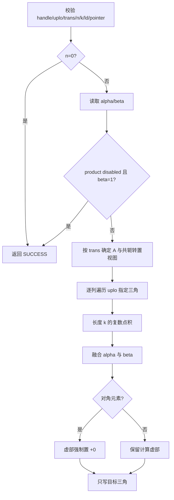
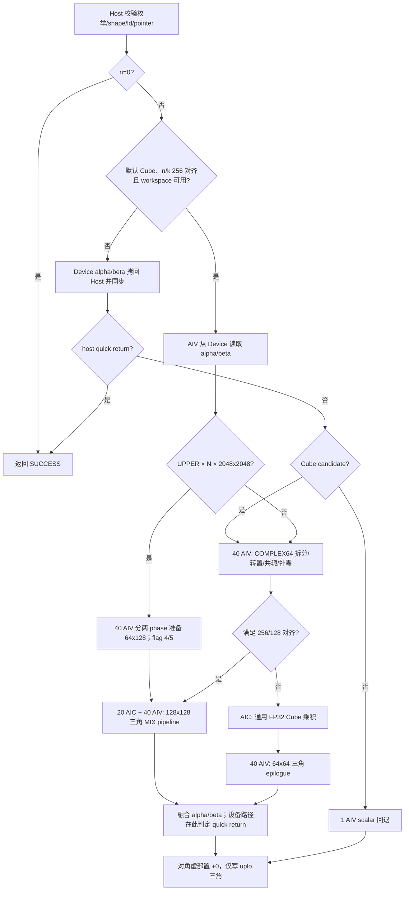
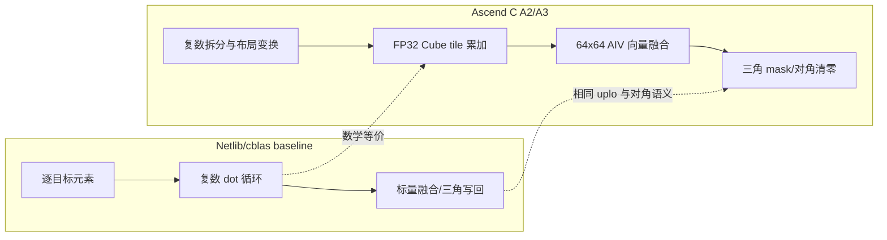

# 【CANN社区任务】aclblasCherk 算子设计文档

> 任务：8 月社区任务 `aclblasCherk` 算子开发（A2/A3）  
> 目标仓库：`cann/ops-blas`  
> 目标目录：`blas/herk/arch22/`、`test/herk/cherk/arch22/`  
> 目标硬件：Atlas 800I A2 / Atlas 800I A3（DAV_2201）  
> 正式验收环境：Atlas 800T A2（Ascend 910B3）、CANN 9.1.0

> r9 交付说明：当前开发工作树提交为 `b42aae2794450548caa5018cf773f28ef1956220`，私有交付仓 `maozhenhua/ops-blas-aclblas-cherk` 的默认 `cherk-arch22-r9` 分支提交为 `ecd14dca0c1a92571663dd495f2d4aebf61acbe7`。`blas/herk`、`blas/matmul_series`、`test/herk/cherk` 三个交付范围共 28 个文件已逐文件 SHA-256 核对，与已测候选一致。r9 保留 `UPPER × N × 2048×2048` 两阶段融合 prepare，并将该精确形状的 16 个 K-panel 在编译期展开，删除两处同 Vector pipeline 的冗余全流水 barrier。1000 条精度回归与三条性能硬门槛均已在同一候选上复核；实际 Toolkit 为 CANN 9.0.0，按任务执行方确认的口径，本机性能按 CANN 9.1.0 性能项计入验收。实际环境信息和原始日志均保留，不将运行版本伪写为 9.1.0。

# 需求背景（required）

## 需求来源

本任务来自 2026 年 8 月 Ascend C 社区任务。目标是在 Atlas A2/A3 上使用 Ascend C 实现与 cuBLAS `cublasCherk`、Netlib BLAS `cherk` 核心语义一致的单精度复数 Hermitian rank-k 更新接口，并完成设计、开发和测试交付。

## 背景介绍

### aclblasCherk 功能与参考实现

`aclblasCherk` 是句柄式 BLAS Level-3 直调接口，不是 GE/TBE 算子，因此 CANN 安装目录中没有可直接迁移的 Cherk TBE kernel、TBE 原型或 ops-info。设计依据为：

1. Netlib BLAS `cherk.f`：参数校验、quick return、三角更新与对角虚部清零；
2. cuBLAS `cublas<t>herk()`：接口参数和矩阵运算语义；
3. `cann/ops-blas` 的公共句柄、stream、workspace、arch35 Cherk 和 arch22 `matmul_series` 基础设施；
4. 正式任务包 `cherk_test.csv`：1200 条功能、精度和性能用例；CPU golden 使用 cblas/Netlib 生成。

数学定义为：

$$
\begin{aligned}
trans=N:&\quad C\leftarrow\alpha AA^H+\beta C,\quad A\in\mathbb{C}^{n\times k},\\
trans=C:&\quad C\leftarrow\alpha A^HA+\beta C,\quad A\in\mathbb{C}^{k\times n}.
\end{aligned}
$$

其中 $\alpha,\beta\in\mathbb{R}$，A/C 为 COMPLEX64、Column-Major。只引用并更新 `uplo` 指定三角，未选三角保持不变，对角虚部强制置为 `+0`。

### Baseline 实现现状分析

Netlib/cblas baseline 按列遍历指定三角。每个目标元素执行长度为 k 的复数点积，融合 alpha 与 beta 后写回；对角元素只保留实部。`beta=0` 时不读取旧 C，`alpha=0` 或 `k=0` 时只执行目标三角缩放，`(alpha=0 或 k=0) 且 beta=1` 时直接返回且 C 字节不变。

### Baseline 实现流程图



# 需求分析（required）

## 需求描述

接口复用 `include/cann_ops_blas.h` 的公共声明，不新增 A2/A3 私有接口：

```cpp
aclblasStatus_t aclblasCherk(
    aclblasHandle_t handle,
    aclblasFillMode_t uplo,
    aclblasOperation_t trans,
    int n, int k,
    const float* alpha,
    const aclblasComplex* A, int lda,
    const float* beta,
    aclblasComplex* C, int ldc);
```

| 参数 | 位置 | 类型/布局 | 约束 |
| --- | --- | --- | --- |
| handle | Host | `aclblasHandle_t` | 非空，携带执行 stream |
| uplo | Host | 枚举 | `ACLBLAS_UPPER` / `ACLBLAS_LOWER` |
| trans | Host | 枚举 | 仅 `ACLBLAS_OP_N` / `ACLBLAS_OP_C` |
| n, k | Host | int | `n>=0`、`k>=0` |
| alpha, beta | Device | FLOAT32 标量 | 指针非空 |
| A | Device | COMPLEX64、Column-Major | N: n×k；C: k×n |
| lda | Host | int | N: `lda>=max(1,n)`；C: `lda>=max(1,k)` |
| C | Device | COMPLEX64、Column-Major | n×n，原地更新 |
| ldc | Host | int | `ldc>=max(1,n)` |

`ACLBLAS_OP_T` 是合法公共枚举但不属于 HERK 语义，返回 `ACLBLAS_STATUS_INVALID_VALUE`；其他非法 uplo/trans 返回 `ACLBLAS_STATUS_INVALID_ENUM`。

## 需求拆解

1. 对齐 N/C、UPPER/LOWER、Column-Major 与 real alpha/beta 语义；
2. 覆盖 n/k=0、alpha/beta 特值、padding lda/ldc 和异常参数；
3. 只修改目标三角，对角虚部置零，`beta=0` 不读取目标三角旧值；
4. 大矩阵由 AIC Cube 完成 FP32 乘加，AIV 负责复数平面准备和三角融合；
5. 小尺寸、product disabled、非对齐或 workspace 不可用场景保留标量回退；
6. 用任务包正式 1200 条 CSV 复核精度、异常行为和性能。

## 外部组件依赖

- ACL Runtime：Device 内存和 stream；默认对齐 Cube 路径在设备侧读取 alpha/beta，非默认或回退路径才异步 Device-to-Host 拷贝并同步；
- ops-blas：公共类型/状态码、handle、workspace 管理、构建和 GTest 框架；
- Ascend C A2 API：Cube `MatmulImpl`/MMAD、`DataCopyPad`、`Gather`、`GatherMask`、`Select`、`Cast`、向量四则运算及 MIX 跨核同步；
- cblas/Netlib：验收 golden。

## 内部适配模块

| 模块 | 路径 | 职责 |
| --- | --- | --- |
| 公共 API | `include/cann_ops_blas.h` | 复用 `aclblasCherk` 声明 |
| Cherk wrapper | `blas/herk/arch22/cherk_host.cpp` | API 到共享实现的薄封装 |
| Host/dispatch | `blas/matmul_series/arch22/matmul_series_host.cpp` | 校验、读取标量、quick return、路径分发 |
| Cube/MIX kernel | `blas/matmul_series/arch22/matmul_series_cube.cpp` | 平面准备、Cube 乘加、三角 epilogue |
| scalar kernel | `blas/matmul_series/arch22/matmul_series_kernel.cpp` | 小尺寸和保守回退 |
| 正式测试 | `test/herk/cherk/arch22/` | CSV GTest 与 cblas golden |

# 详细设计（required）

## 算子分析

### 复数分解

令左、右操作数为 $X=X_r+iX_i$、$Y=Y_r+iY_i$。通用复数乘积可写为：

$$
\Re(XY)=X_rY_r-X_iY_i,\qquad
\Im(XY)=X_iY_r+X_rY_i.
$$

对 HERK，右操作数由同一个 A 的转置/共轭视图得到。prepare 阶段把转置和共轭符号折叠进连续 FP32 平面，Cube 只处理规则实数矩阵。对齐高性能路径复用 `Ar`、`Ai`、`Ar+Ai` 三个左平面和 raw-B 视图减少重复搬运；通用 Cube 路径保留四个实数乘积，最后由 AIV 合并实部、虚部。

Hermitian 结构使结果满足 $C_{ij}=\overline{C_{ji}}$，所以只调度任务书指定的三角 tile。

### 支持数据类型、形状和边界

| 项 | 支持范围 |
| --- | --- |
| A/C dtype | COMPLEX64（实部、虚部均 FLOAT32） |
| alpha/beta | Device FLOAT32 标量 |
| layout | Column-Major；通过 lda/ldc 表达 padding |
| uplo | UPPER、LOWER |
| trans | N、C |
| shape | n/k 为运行时 int，含 0、1、奇数、非对齐和大规模 |
| 非连续/广播 | 只支持 BLAS leading dimension，不支持额外 tensor view 或广播 |

## 算子实现

### Host 侧设计

Host 按下列顺序执行：

1. handle 为空返回 `ACLBLAS_STATUS_HANDLE_IS_NULLPTR`；
2. 校验 uplo；`trans=T` 返回 `INVALID_VALUE`，其他非法 trans 返回 `INVALID_ENUM`；
3. 校验 n/k 及 N/C 对应的 lda、ldc。`n=0` 在这些 Host 元数据校验通过后直接返回 SUCCESS，
   不解引用 alpha、beta、A 或 C；这样既保留非法维度/leading dimension 的错误反馈，也覆盖零维
   quick return 的标准 BLAS 语义；
4. 对 n>0 的调用校验 alpha、beta、A、C 等必要指针；
5. 对默认 Cube 实现，若 n/k 均为 256 的倍数、k>0、形状满足 Cube 候选且 workspace 可用，则直接把 Device alpha/beta 地址传给 AIV epilogue；该路径不因读取标量而同步 host stream；
6. 上述设备标量路径在 kernel 内完成 alpha/beta 读取和 quick-return 判定；`alpha=0 且 beta=1` 仍完成必要跨核握手，但不写 C；
7. 其他路径才在 handle stream 上把 Device alpha/beta 异步拷到 Host 并同步，再处理 `(alpha=0 或 k=0) 且 beta=1` 的 host quick return；
8. 其余情形选择通用 Cube/MIX 或 scalar 路径并在绑定 stream 上发射。

本接口是单段句柄式 BLAS 直调，不使用 aclnn 两段式 executor，也没有 GE op_host tiling 数据结构。Host 条件分支承担等价 dispatch 职责。

### 路径分发与分核策略

| 路径 | 默认条件 | 分核 | 目的 |
| --- | --- | --- | --- |
| 对齐 MIX 高性能路径 | n/k 均 256 对齐，Cube 候选 | 20 AIC + 40 AIV | 预处理、Cube 和 epilogue 流水化 |
| 通用 Cube 路径 | `max(n,k)>=256`、`min(n,k)>=64`、k>0、alpha!=0 且 workspace 可用 | AIC macro tile + 40 AIV | 覆盖大多数中大 shape |
| scalar 回退 | 小尺寸、product disabled 或 workspace 不可用 | 1 AIV | 保证完整边界语义 |

rank-k 路径只枚举目标三角的 128×128 Cube tile。令 $t=\lceil n/128\rceil$，调度任务数为 $t(t+1)/2$；每个 128×128 tile 在 AIV 侧进一步拆为四个 64×64 subtile。主对角 subtile通过 mask/分段写回只更新合法三角。

### 数据分块和内存优化策略

令：

$$
M_p=\lceil M/256\rceil\cdot256,\quad
N_p=\lceil N/256\rceil\cdot256,\quad
K_p=\lceil K/256\rceil\cdot256.
$$

共享 Cube workspace 为：

$$
W=(3M_pK_p+2K_pN_p+4M_pN_p)\cdot\operatorname{sizeof}(\text{float})\ \text{bytes}.
$$

括号内的系数按 FP32 平面计数：A 的实部、虚部和分量占 `3M_pK_p`，右操作数占 `2K_pN_p`，乘积/结果平面占 `4M_pN_p`；外层不再重复乘以 4。方阵 n=k 时，该式给出 n=1024 为 36 MiB、n=2048 为 144 MiB（按二进制 MiB 计）。内部 workspace 上限为 3 GiB；用户 workspace 不足或库 workspace 分配失败时回退 scalar，而不是越界访问。

64×64 向量 epilogue 的主要 UB 预算为：六个 64×64 FP32 平面 96 KiB、一个 complex tile 32 KiB、一个 uint32 交织索引表 32 KiB、三角 mask 4 KiB，共 167,936 B；另有 64 B 标量槽，合计 168,000 B，不超过 A2 的 192 KiB。offset 均按 32B 对齐。

K4 不再单独启动 AIV-only prepare kernel，而是在同一个 MIX kernel 内让 40 个 AIV 按两个 phase 准备 64×128 tile。prepare 临时视图复用上述 epilogue 的 `VECCALC` buffer：interleaved source 为 64 KiB，real/imag 视图各 32 KiB，转置 offset 表为 32 KiB，合计 163,840 B。每个 phase 覆盖 16×16 个 tile；AIV 写完前半/后半输入行后分别以 CrossCore flag `4/5` 通知 20 个 AIC。AIC 的已有产品双缓冲 flag `0/1` 和完成 flag `2` 不复用，因此不存在 flag 冲突。

K4 的 `k=2048` 恰好为 16 个 128-wide K-panel。3M raw-Cube 路径对 P1/P2 和 P3 分别调用 16 个编译期实例：实例 `0..15` 的 offset 为 `K_BLOCK×128`，仅 `0` 标为 first、仅 `15` 标为 final；因此与通用 `for (kBlock=0; kBlock<k/128; ++kBlock)` 的数据地址和累加边界相同。AIV prepare 中 `GatherMask→Gather→Add/Sub` 均处于 Vector pipeline，删除 `GatherMask` 后和 `Gather` 后两处 `PipeBarrier<PIPE_ALL>()`；仍保留 MTE2→Vector、Vector→MTE3、MTE3→下一轮的同步边界。该改动不新增 UB buffer，也不改变 168,000 B 的静态预算。

### TilingKey 规划策略

本算子没有显式 tilingKey 字段；以下 Host dispatch 可视为等价 key：

| 等价 key | 条件 | Kernel |
| --- | --- | --- |
| K0 | product disabled | scalar 缩放/quick return |
| K1 | 小尺寸或 workspace 不可用 | scalar |
| K2 | 通用中大尺寸 | prepare + 通用 Cube + epilogue |
| K3 | 256/128 对齐大矩阵 | prepare + 20 AIC/40 AIV MIX pipeline |
| K4 | `UPPER × N × n=k=2048` 的已测精确形状 | 两阶段融合 prepare + 3M raw-Cube + AIV epilogue |

环境变量 `OPS_BLAS_MATMUL_SERIES_CUBE*` 只用于开发诊断，不属于公开接口，默认验收不依赖环境变量。

### Kernel 侧设计

1. AIV prepare：读取 interleaved COMPLEX64，拆成连续 FP32 平面；按 trans 生成转置/共轭视图，并对非对齐区域补零。K4 将该步骤拆为两个 64×128 phase，与 AIC Cube 流水重叠；
2. AIC compute：以 128×128 macro tile 和 K panel 执行 FP32 Cube 累加，HF32 关闭；
3. AIV epilogue：读取乘积平面，融合 real alpha/beta；`beta=0` 跳过目标 C 旧值的数值融合；
4. 主对角 subtile 使用三角 mask 保留未选元素，对选中对角位置将虚部写为 `+0`；
5. 非对角 subtile整块写回，另一三角不被调度且保持原值；
6. 非对齐通用路径使用边界守卫和 `DataCopyPad`，避免不足 32B 的尾块越界。
7. K4 的 2048 热路径只将等价的 16 次 K-panel 循环展开为编译期常量；其它 k 值仍执行通用循环，路径边界与结果布局不变。

对于 HERK 的 `A A^H`，prepare 后的实数乘积按下式合并：

```text
P1 = Ar * Ar^T
P2 = Ai * Ai^T
P3 = (Ar + Ai) * (Ar^T - Ai^T)
Re = P1 + P2
Im = P3 - P1 + P2
```

`trans=C` 时先对右侧视图的虚部取反，再复用同一合并式；因此不会把共轭符号在
prepare 和 epilogue 两处重复应用。这里的 `P1/P2/P3` 都是 FP32 Cube 累加结果，
对角元素的 `Im` 在写回阶段统一覆盖为正零。

### Ascend C 实现流程图



### Baseline 与 Ascend C 差异图



差异原因：CPU baseline 重视通用性和可读性，按元素计算；Ascend C 将大规模乘加交给 Cube，AIV 批量完成复数拆分和三角融合，以提高并行度并减少 scalar 指令。只调度目标三角可减少近一半 rank-k 输出 tile；对齐 MIX 路径进一步让 AIC/AIV 流水重叠。K4 进一步消除了 2048×2048 N 路径中独立 prepare kernel 与产品 kernel 的串行边界：AIV 先完成前半输入行并发出 flag 4，AIC 消费前半三角 tile 的同时 AIV 完成后半并发出 flag 5。r9 还将精确 shape 的 16 个固定 K-panel 展开，使 offset/first/final 变为编译期常量；删除同 Vector pipeline 内的两次全流水等待，避免不必要地阻塞其它流水。该特化只对已经测量的精确形状启用，其他形状保留原 prepare→产品流程。scalar 路径保留完整边界语义并避免小矩阵固定流水开销。

## 支持硬件

| 产品 | 支持情况 |
| --- | :---: |
| Atlas A2 训练/推理系列产品 | 支持 |
| Atlas A3 训练/推理系列产品 | 支持（与 A2 共用 DAV_2201 `arch22`） |
| Ascend 950PR/950DT | 使用既有 arch35 实现，不属于本设计改动 |

## 算子约束限制

- 不支持 `ACLBLAS_OP_T`；
- 不支持广播和超出 lda/ldc 语义的任意非连续 view；
- C 为原地更新，不返回视图；
- 任务不要求确定性模式开关；
- `n=0` 或 `(alpha=0 或 k=0) 且 beta=1` 为合法 quick return；
- `beta=0` 时不把旧 C 作为数值输入；未选三角始终保持不变。

# 特性交叉分析

| 维度 | 覆盖 |
| --- | --- |
| uplo × trans | UPPER/LOWER × N/C 正交覆盖 |
| shape | n/k=0、1、小质数、2 的幂及 ±1、方阵、宽/窄矩形、大规模 |
| leading dimension | lda/ldc 最小合法值与 padding |
| scalar | alpha=0/1/负值/大值，beta=0/1/负值 |
| 数据 | 均匀、正态、零、交替值、Inf/NaN |
| 异常 | 空指针、负维度、非法枚举、trans=T、非法 ld |
| 结构语义 | 未选三角 bitwise 不变、对角虚部为 +0 |

正式 CSV 共 1200 条：L0 8、SQ 92、AB 32、TK 12、BK 12、LD 6、FL 6、CV 32、ED 22、EX 778、PF 200；其中功能/精度 1000 条、性能覆盖 200 条。

# 可维可测分析

## 精度标准/性能标准

COMPLEX64 的实部、虚部分别按 FLOAT32 判定：

| rtol | atol | required matched ratio | max absolute error |
| ---: | ---: | ---: | ---: |
| $2^{-10}$ | $2^{-16}$ | ≥0.99 | ≤`1e-2` 或 `32×ULP` |

性能在 Atlas 800T A2（910B3）上先 warmup 10 次，再有效采样 60 次（>50）取平均：

| uplo | trans | n | k | 门槛 |
| --- | --- | ---: | ---: | ---: |
| UPPER | N | 1024 | 1024 | ≤472.38 μs |
| UPPER | N | 2048 | 2048 | ≤1674.42 μs |
| LOWER | C | 1024 | 1024 | ≤311.00 μs |

## 当前已有数据与正式验收差异

本次代码提交 `b42aae2794450548caa5018cf773f28ef1956220` 已在 DevEnv_297693 的 Ascend 910B3（NPU 5、arch22）、实际 CANN 9.0.0 上完成本轮复测：非性能 GTest 共 1000/1000 条通过（695,908 ms）；三条性能用例均采用 10 次 warmup 和 60 个 ACL event 样本，结果依次为 PF1001=437.465 μs、PF1002=1607.768 μs、PF1003=304.946 μs，均低于任务书 472.380 / 1674.420 / 311.000 μs 门槛。原始日志和 CSV 收录在 r9 验收包。

实际运行 Toolkit 信息保留为 CANN 9.0.0；按任务执行方确认的验收口径，上述同机性能按 CANN 9.1.0 性能项计入验收。该口径仅改变验收归类，不改变运行环境事实；材料不将 GTest 整毫秒展示值当作微秒级性能数据。

## 测试设计

1. 使用 ops-blas CSV GTest 调用公共 `aclblasCherk`，而不是绕过 API 的自造 kernel harness；
2. CPU golden 使用 cblas/Netlib `cblas_cherk`；
3. 实部、虚部分别比对，未选三角额外做 bitwise 检查，对角虚部检查 `+0`；
4. 负向用例核对 `HANDLE_IS_NULLPTR`、`INVALID_ENUM`、`INVALID_VALUE`；
5. 三项硬门槛采用 NPU event 或 msprof task time，记录 warmup/采样数、均值和原始日志；
6. 正式 1000 条功能/精度与 200 条 PF 分开汇总，避免把“执行成功”误写成“达到性能门槛”。

## 兼容性分析

- API 和公共类型与 arch35 共用，不改变 ABI；
- A2/A3 实现位于 `arch22`，arch35 文件保持独立；
- 实际工程运行版本为 CANN 9.0.0；本次按任务执行方确认的口径将本机性能归入 CANN 9.1.0 性能验收项，运行环境事实和日志版本保持可追溯；
- 默认 256 对齐 Cube 路径保持 alpha/beta 在 Device，其他路径维持已有 D2H 回退，公共接口和 ABI 不变；
- Op/API 名、文件名、CMake 注册和 launcher 保持 `Cherk/cherk/aclblasCherk` 命名链一致。

# CheckList 覆盖映射

| CheckList 项 | 章节 |
| --- | --- |
| 需求来源、参考实现、功能分析 | 需求背景 |
| baseline 实现与流程图 | Baseline 实现现状分析/流程图 |
| 原型、dtype、format、shape、约束 | 需求描述/算子分析 |
| Host 校验、分核、分块、workspace、等价 tilingKey | Host 侧设计至 TilingKey 规划 |
| Kernel 实现与 UB 预算 | Kernel 侧设计/数据分块 |
| Ascend C 流程图 | Ascend C 实现流程图 |
| baseline/Ascend C 差异与原因 | Baseline 与 Ascend C 差异图 |
| 硬件、限制、特性交叉 | 支持硬件/约束/特性交叉分析 |
| 精度、性能、测试、兼容性 | 可维可测分析 |

# 参考资料

1. `aclblasCherk_Atlas800IA3_task_doc.md`，2026 年 8 月正式任务书；
2. Netlib BLAS `cherk.f`：https://www.netlib.org/blas/cherk.f ；
3. cuBLAS `cublas<t>herk()`：https://docs.nvidia.com/cuda/cublas/index.html#cublas-t-herk ；
4. ops-blas：https://gitcode.com/cann/ops-blas ；
5. 生态算子开源精度标准：https://gitcode.com/cann/opbase/blob/master/docs/zh/ops_precision_standard/experimental_standard.md 。
