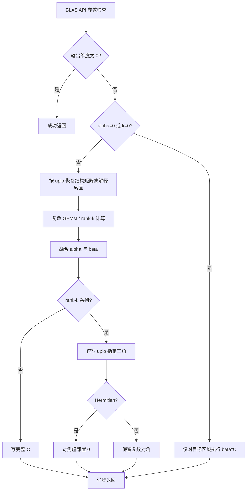
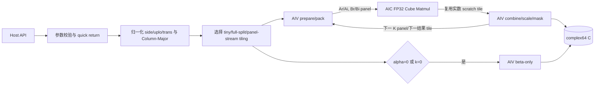
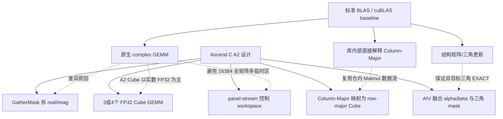

# 矩阵乘系列算子设计文档

> 任务：2026 年 8 月社区任务——矩阵乘系列算子开发
> 算子：`chemm`、`cher2k`、`cherk`、`csymm`、`csyrk`
> 目标硬件：Atlas A2 训练系列产品（arch22 / DAV_2201）
> 软件版本：CANN 9.0.0 及以上
> 目标仓库：`cann/ops-blas`，最终代码合入 `experimental`
> 文档版本：V0.1（离线设计，2026-08-17）
> 贡献者 GitCode 账号：`qq_50438052`
> 状态：设计文档提交版；已完成任务书、官方测试脚本、仓内参考实现和 A2 API 可用性分析，性能参数待真机校准

## 一、需求背景

### 1.1 需求来源

本任务要求参考标准 BLAS 和 cuBLAS，在昇腾 NPU 上基于 Ascend C 实现五个单精度复数 BLAS Level-3 接口：

| 接口 | 运算类别 | 核心结构 |
|---|---|---|
| `aclblasChemm` | Hermitian 矩阵乘 | `C = αAB + βC` 或 `C = αBA + βC` |
| `aclblasCher2k` | Hermitian rank-2k 更新 | `C = αABᴴ + conj(α)BAᴴ + βC` 或其共轭转置形式 |
| `aclblasCherk` | Hermitian rank-k 更新 | `C = αAAᴴ + βC` 或 `C = αAᴴA + βC` |
| `aclblasCsymm` | 复对称矩阵乘 | `C = αAB + βC` 或 `C = αBA + βC` |
| `aclblasCsyrk` | 复对称 rank-k 更新 | `C = αAAᵀ + βC` 或 `C = αAᵀA + βC` |

五个接口统一采用：

- 矩阵元素类型：`aclblasComplex`，即交错存储的两个 FP32（real、imag）。
- 数据布局：Column-Major。
- 不支持 broadcast。
- 支持非紧凑 leading dimension（`lda/ldb/ldc` 大于最小值）。
- 支持任务书与测试脚本覆盖的奇数、尾块、小矩阵、极端长宽比和大尺寸。

### 1.2 交付与评审要求

依据任务书和 GitCode 社区任务讨论 39：

1. 设计文档先以 PR 形式提交到 `cann/cann-ops-competitions` 的 `04_tasks/01_community-task-2026/tasklist`。
2. 设计文档 PR 标题使用：`【CANN社区任务】矩阵乘系列算子设计文档`。
3. PR 提交后在评论区通知 `@condfuse_3 @fullt @Ascend-CANN`；修改后通知对应意见提出人复核。
4. 设计评审通过后再完成代码、标准自测、codecheck、compile 和代码 PR。
5. 代码 PR 与需求 issue 标题均带 `【社区任务】`。

### 1.3 设计依据

| 类别 | 依据 |
|---|---|
| 功能语义 | 本任务 `matmul_series_task_doc.md`、Netlib BLAS、cuBLAS |
| 验收口径 | 任务书附带的五套 CSV、`verify_accuracy.py`、`verify_performance.py` |
| A2 实数结构矩阵参考 | `ops-blas/blas/symm/arch22` 中 SSYMM 的 host、pack、Cube、fallback 设计 |
| 复数拆分参考 | `ops-blas/extensions/complexmatdot/arch22` 中 `GatherMask + Gather` 方案 |
| 复数 HERK 管线参考 | `ops-blas/blas/herk/arch35` 中“拆分—实数 GEMM—合并”管线 |
| 三角输出参考 | `ops-blas/blas/syrk/arch35` |
| Cube 接口 | `matmul::Matmul`：`SetOrgShape`、`SetSingleShape`、`SetTensorA/B`、`IterateAll`、`End` |

本任务在 A2 上没有可直接对齐的 TBE 原算子实现。设计中的 baseline 是标准 BLAS/cuBLAS 语义与仓内 SSYMM/CHERK/SYRK 实现组合，而不是虚构的 TBE 路径。

## 二、需求分析

### 2.1 公共数据模型

`aclblasComplex` 在 GM 中按 `[real0, imag0, real1, imag1, ...]` 交错存储，每个复数占 8 字节。Cube 计算采用 FP32 实数矩阵，因此需要把复数乘法转换为若干个实数 GEMM。

设 `X = Xr + iXi`，`Y = Yr + iYi`，则通用 4M 分解为：

```text
Pr = Xr·Yr - Xi·Yi
Pi = Xr·Yi + Xi·Yr
P  = Pr + iPi
```

通用正确性路径使用 4 个实数 GEMM。传统 3M 公式虽然少一个 GEMM，但增加输入加法并放大抵消误差，只作为后续性能实验路径，未经官方极值用例验证不默认启用。

### 2.2 五个接口语义

#### 2.2.1 CHEMM

```cpp
aclblasStatus_t aclblasChemm(
    aclblasHandle_t handle, aclblasSideMode_t side, aclblasFillMode_t uplo,
    int m, int n, const aclblasComplex* alpha,
    const aclblasComplex* A, int lda,
    const aclblasComplex* B, int ldb,
    const aclblasComplex* beta, aclblasComplex* C, int ldc);
```

- `side=L`：`A` 为 `m×m`，`C = αAB + βC`。
- `side=R`：`A` 为 `n×n`，`C = αBA + βC`。
- `A=Aᴴ`，只读取 `uplo` 指定三角；镜像元素需共轭，对角虚部视为 0。
- `alpha/beta` 为 complex64。
- 输出 `C` 的全部 `m×n` 逻辑区域均更新。

#### 2.2.2 CSYMM

```cpp
aclblasStatus_t aclblasCsymm(
    aclblasHandle_t handle, aclblasSideMode_t side, aclblasFillMode_t uplo,
    int m, int n, const aclblasComplex* alpha,
    const aclblasComplex* A, int lda,
    const aclblasComplex* B, int ldb,
    const aclblasComplex* beta, aclblasComplex* C, int ldc);
```

维度、side 和输出规则与 CHEMM 相同，但 `A=Aᵀ`：

- 镜像实部、虚部均原值复制。
- 不执行共轭。
- 对角虚部不强制清零。

#### 2.2.3 CHERK

```cpp
aclblasStatus_t aclblasCherk(
    aclblasHandle_t handle, aclblasFillMode_t uplo, aclblasOperation_t trans,
    int n, int k, const float* alpha,
    const aclblasComplex* A, int lda,
    const float* beta, aclblasComplex* C, int ldc);
```

- `trans=N`：`A` 为 `n×k`，`C = αAAᴴ + βC`。
- `trans=C`：`A` 为 `k×n`，`C = αAᴴA + βC`。
- `alpha/beta` 为 FP32 实数。
- 只更新 `uplo` 指定三角，另一三角必须逐 bit 保持不变。
- 更新后的对角虚部强制写为 `+0.0f`。

#### 2.2.4 CHER2K

```cpp
aclblasStatus_t aclblasCher2k(
    aclblasHandle_t handle, aclblasFillMode_t uplo, aclblasOperation_t trans,
    int n, int k, const aclblasComplex* alpha,
    const aclblasComplex* A, int lda,
    const aclblasComplex* B, int ldb,
    const float* beta, aclblasComplex* C, int ldc);
```

- `trans=N`：`C = αABᴴ + conj(α)BAᴴ + βC`。
- `trans=C`：`C = αAᴴB + conj(α)BᴴA + βC`。
- `alpha` 为 complex64，`beta` 为 FP32 实数。
- 只更新 `uplo` 指定三角，另一三角逐 bit 不变；对角虚部强制为 `+0.0f`。

令 `P=ABᴴ`（或 `P=AᴴB`），第二项恰为 `Pᴴ`，因此只计算一次 complex GEMM：

```text
C = αP + conj(α)Pᴴ + βC
```

由 combine 阶段同时读取 `P(i,j)` 和 `P(j,i)` 完成指定三角更新，可把 8 个实数 GEMM 降为 4 个。

#### 2.2.5 CSYRK

```cpp
aclblasStatus_t aclblasCsyrk(
    aclblasHandle_t handle, aclblasFillMode_t uplo, aclblasOperation_t trans,
    int n, int k, const aclblasComplex* alpha,
    const aclblasComplex* A, int lda,
    const aclblasComplex* beta, aclblasComplex* C, int ldc);
```

- `trans=N`：`C = αAAᵀ + βC`。
- `trans=T`：`C = αAᵀA + βC`。
- `alpha/beta` 为 complex64。
- 只更新 `uplo` 指定三角，另一三角逐 bit 保持不变。
- 对称而非 Hermitian，对角虚部不强制为 0。

### 2.3 参数校验与 quick return

任务书正文写维度大于 0，但官方 CSV 明确包含 `m=0`、`n=0`、`k=0` 成功用例。实现以验收脚本为准：维度允许非负，负值报 `ACLBLAS_STATUS_INVALID_VALUE`，0 维走 quick return。

校验顺序：

1. 校验 `handle`。
2. 校验 `side/uplo/trans` 枚举。
3. 校验 `m/n/k >= 0`。
4. 校验 `lda/ldb/ldc`；即使逻辑尺寸为 0，也按 BLAS 的 `max(1, dimension)` 规则检查。
5. 若输出逻辑区域为空（HEMM/SYMM 的 `m==0 || n==0`；rank-k 的 `n==0`），直接成功返回，不启动 kernel。
6. 校验必须使用的标量指针。
7. 按实际数据依赖校验矩阵指针。

数据依赖短路规则：

- `alpha==0` 或 `k==0` 时，rank-k 系列不读取 `A/B`，只对目标三角执行 `beta*C`。
- HEMM/SYMM 在 `alpha==0` 时不读取 `A/B`，只执行 `beta*C`。
- `beta==0` 时不得读取旧 `C`，避免输入 NaN/未初始化值污染结果。
- `beta==1` 且乘积项为空时直接返回，保证整块 C（包括非目标三角）完全不写。
- 非空正常用例中，官方 CSV 的 `nullA/nullB/nullC/nullAlpha/nullBeta` 必须返回 `ACLBLAS_STATUS_INVALID_VALUE`。

### 2.4 Column-Major 映射

Ascend C 仓内 Cube 路径主要按 row-major 组织。为避免对整个矩阵做物理转置，利用：

```text
ColumnMajor(C = A·B) 的内存
等价于
RowMajor(Cᵀ = Bᵀ·Aᵀ) 的内存
```

host 侧交换内部 `M/N`、操作数 A/B、transpose 标志，并保留真实 `lda/ldb/ldc`。该归一化必须集中在一个公共函数完成，禁止五个接口各自手写映射。

### 2.5 Baseline / 原实现流程分析

本任务无 TBE 原算子可逐行迁移。功能 baseline 为 Netlib/OpenBLAS 的 CBLAS 接口，性能 baseline 为任务书给定的 A100 cuBLAS 数据；实现参考为 A2 SSYMM 和 arch35 CHERK。



参考实现差异：

- `blas/symm/arch22` 已证明 A2 上结构矩阵 pack、left/right 路径、Cube Matmul、尾块和 fallback 可行，但仅支持实数。
- `blas/herk/arch35` 已证明复数拆分成实数 GEMM 的总体思路，但使用的 `DeInterleave/Interleave` 不支持 A2，且四张完整结果临时矩阵会在大尺寸下占用过多 workspace。
- `extensions/complexmatdot/arch22` 已证明 A2 可用 `GatherMask` 按奇偶 lane 拆分实部/虚部，再用 `Gather` 按 offset 表恢复交错布局。

### 2.6 组件依赖与适配模块

外部依赖：CANN 9.0.0 及以上提供的 AscendCL Runtime、`aclblasHandle_t`/stream 管理能力，以及 Atlas A2 训练系列产品运行环境；不引入 OpenBLAS 等 CPU 库参与设备侧正式计算，OpenBLAS 仅用于测试 golden。

内部依赖：`ops-blas` 公共 handle、日志、host utils、workspace 管理模块，A2 `matmul::Matmul` Cube 接口，以及 Ascend C 的 `DataCopy/DataCopyPad`、`GatherMask/Gather`、`Add/Sub/Muls`。新增实现放入 `experimental`，不得修改既有接口行为。

## 三、详细设计

### 3.1 总体架构

五个 API 共享四层内部模块：

1. `common_host`：参数检查、标量读取、Column-Major 归一化、路径选择、tiling 与 workspace 规划。
2. `complex_pack_aiv`：交错 complex64 到平面 FP32 的拆分；结构矩阵三角恢复；转置/共轭 pack。
3. `real_gemm_aic`：复用 `matmul::Matmul` 完成 3 或 4 个 FP32 GEMM。
4. `complex_epilogue_aiv`：实数临时结果组合、`alpha/beta` 融合、三角 mask、Hermitian 对角处理及交错写回。



所有 kernel 都在 handle 绑定的同一 stream 上异步提交，依靠 stream 顺序保证阶段间可见性。若后续采用 AIC/AIV Mix 单 kernel 双缓冲，跨核同步只使用仓内已验证的 CrossCore/同步机制，并作为独立 tiling 路径上线。

### 3.2 AIV 实虚拆分与结构矩阵 pack

#### 3.2.1 普通复数矩阵

每个 AIV 核处理连续的 complex 元素块：

1. `DataCopy/DataCopyPad` 将交错 FP32 搬入 UB。
2. `GatherMask(..., mask=1, ...)` 取偶数 lane 得到 real。
3. `GatherMask(..., mask=2, ...)` 取奇数 lane 得到 imag。
4. 尾块补零到 32B 对齐，实际写回只覆盖有效元素。

该方案来自仓内 A2 `complexmatdot`，不使用 A2 不支持的 `DeInterleave/Interleave`。

#### 3.2.2 Hermitian / symmetric 三角矩阵

对 CHEMM/CSYMM 的结构矩阵 A，不先恢复整张 complex dense 矩阵，而是在 pack panel 时按坐标选择数据源：

| 类型 | 坐标在有效三角内 | 坐标在镜像三角内 | 对角 |
|---|---|---|---|
| CSYMM | 读 `A(i,j)` | 读 `A(j,i)` | real/imag 原样 |
| CHEMM | 读 `A(i,j)` | 读 `A(j,i)` 并对 imag 取负 | imag 强制 0 |

连续有效区采用批量 DataCopy；完整镜像 tile 采用转置/分段 Gather；跨对角 mixed tile 分成 direct 与 mirror 两段。这一分类复用 SSYMM A2 的 `DirectFull/MirrorFull/MixedDiag/Tail` 思路，避免逐元素 GM 随机访问成为主路径。

#### 3.2.3 转置与共轭

- `T`：交换逻辑行列，只改变 pack 坐标，不对 imag 取负。
- `C/H`：交换逻辑行列，同时对 imag 使用 `Muls(x, -1)`。
- 对称或 Hermitian 结果需要转置读取时，优先交换 GM 坐标与 DataCopy 的 block/stride；只有不连续 mixed 小块才使用 Gather。

### 3.3 AIC 实数 GEMM

#### 3.3.1 Cube 数据通路

```text
GM planar panel
  -> MTE2 / pack
  -> L1
  -> L0A / L0B
  -> Mmad (FP32 accumulate in L0C)
  -> Fixpipe
  -> GM scratch tile
```

调用顺序使用仓内已验证接口：

```cpp
matmul.SetOrgShape(...);
matmul.SetSingleShape(...);
matmul.SetTensorA(aTensor, isTransA);
matmul.SetTensorB(bTensor, isTransB);
matmul.IterateAll(cTensor);
matmul.End();
```

A2 片上预算：

| 存储层级 | 容量 | 约束 |
|---|---:|---|
| L1 | 512 KB | A/B panel 与流水深度总和不超过容量 |
| L0A | 64 KB | `baseM×baseK×4` 经硬件格式化后不超限 |
| L0B | 64 KB | `baseK×baseN×4` 经硬件格式化后不超限 |
| L0C | 128 KB | `baseM×baseN×4 <= 128 KB` |

FP32 的 `baseK` 至少按 8 对齐，`baseM/baseN` 按 16 对齐。初始候选以仓内 SSYMM/GEMM 经验值为起点，不承诺为最终值：

- 方阵吞吐路径：`baseM/baseN ∈ {128, 256}`，`baseK ∈ {32, 64, 128}`。
- thin/fat 路径：减小短边 base，增加输出 tile 数以提高多核利用率。
- tiny 路径：不启动完整 Cube 管线，使用 AIV/scalar fallback。

最终 base shape、stepKa/stepKb、double-buffer 深度和 L1 share 大小必须在 A2 真机通过 profile 校准。

#### 3.3.2 多核分配

设：

```text
tileM = ceil(M / baseM)
tileN = ceil(N / baseN)
totalTiles = tileM * tileN
usedAic = min(aicCoreNum, totalTiles)
```

host 遍历可行的 `mBlocks×nBlocks`，选择不超过 AIC 核数且利用率最高、负载最均匀的组合。每个 AIC 核处理一个或多个输出 tile；K 维在核内分段累加。

rank-k 系列只需要三角输出：

- 对角线外 tile 若完全落在非 `uplo` 区域，host 不分配、不启动。
- 完全落在目标三角的 tile 走 full-tile epilogue。
- 穿过对角线的 tile 走 diagonal-mask epilogue。

### 3.4 复数计算映射与 GEMM 数量

#### 3.4.1 CHEMM / CSYMM

设归一化后的乘法为 `P=X·Y`，采用通用 4M：

| 临时乘积 | 计算 |
|---|---|
| `T0` | `Xr·Yr` |
| `T1` | `Xi·Yi` |
| `T2` | `Xr·Yi` |
| `T3` | `Xi·Yr` |

`Pr=T0-T1`，`Pi=T2+T3`。结构矩阵的 Hermitian/symmetric 差异只发生在 X 或 Y 的 pack 阶段。

#### 3.4.2 CHERK：3 个实数 GEMM

`trans=N` 时：

```text
Cr = Ar·Arᵀ + Ai·Aiᵀ
Ci = Ai·Arᵀ - Ar·Aiᵀ
```

令 `T0=Ar·Arᵀ`、`T1=Ai·Aiᵀ`、`T2=Ai·Arᵀ`，则 `Ar·Aiᵀ=T2ᵀ`：

```text
Cr = T0 + T1
Ci = T2 - T2ᵀ
```

`trans=C` 同理只需 3 个实数 GEMM，交叉项通过转置坐标读取。相比 arch35 现有 4M CHERK，减少一次 GEMM 和一张临时结果。

#### 3.4.3 CSYRK：3 个实数 GEMM

`trans=N` 时：

```text
Cr = Ar·Arᵀ - Ai·Aiᵀ
Ci = Ar·Aiᵀ + Ai·Arᵀ
```

令 `T0=Ar·Arᵀ`、`T1=Ai·Aiᵀ`、`T2=Ar·Aiᵀ`：

```text
Cr = T0 - T1
Ci = T2 + T2ᵀ
```

`trans=T` 同理通过转置坐标读取交叉项。

#### 3.4.4 CHER2K：一次 complex GEMM

只计算 `P=A·Bᴴ` 或 `P=Aᴴ·B` 的 4M 结果。对目标元素 `(i,j)`：

```text
Q(i,j) = alpha * P(i,j) + conj(alpha) * conj(P(j,i))
C(i,j) = Q(i,j) + beta * C(i,j)
```

combine 读取对称坐标，不再计算第二次 complex GEMM。对角线上 `Q(i,i)` 理论为实数，最终显式将 imag 置 0。

### 3.5 AIV epilogue 与写回

epilogue 每次处理一个连续输出块：

1. 从 scratch 读取实数 GEMM 结果。
2. 使用 `Add/Sub` 形成复数乘积的 real/imag。
3. 使用 `Muls/Add` 融合复数 `alpha`；Hermitian rank-k 的 alpha/beta 为实数时走简化公式。
4. `beta!=0` 时读取旧 C；`beta==0` 时完全跳过读取。
5. 用 offset 表和 `Gather` 恢复交错 real/imag。
6. HEMM/SYMM 写完整逻辑矩阵。
7. HERK/HER2K/SYRK 仅写 `uplo` 指定三角：
   - full triangle tile 整块写；
   - diagonal tile 按列分段写连续有效区；
   - 非目标 tile 不进入 kernel，确保逐 bit 不变。
8. HERK/HER2K 对角 imag 写 `+0.0f`。

### 3.6 Workspace 与大尺寸策略

#### 3.6.1 不采用的方案

arch35 CHERK 当前使用 `Ar + Ai + T1 + T2 + T3 + T4` 的全矩阵 workspace。对 `n=16384`，单张 FP32 `n×n` 已约 1 GiB，四张结果加输入拆分会超过合理工作区，不能原样用于本任务。

#### 3.6.2 两级 workspace 策略

所有地址按 512B 对齐，使用 64 位整数计算大小并检查乘法溢出。

**Fast full-split 路径（中等尺寸/性能用例）**

- 输入矩阵一次性拆为 planar real/imag。
- 仅保留一张可复用的 FP32 结果 scratch；每完成一个实数 GEMM，就由 AIV 累加到复数输出或复数 accumulator。
- 不同时保留 3/4 张完整 FP32 结果。

近似 workspace：

| 算子 | full-split workspace 上界 |
|---|---|
| CHEMM/CSYMM | `2·|A|complex + 2·|B|complex + 4·M·N + Acc`，其中每个 planar 元素 4B，`Acc` 可与输出/分块缓冲复用 |
| CHERK/CSYRK | `2·|A|complex + 4·N² + Acc` |
| CHER2K | `2·|A|complex + 2·|B|complex + 4·N² + Acc` |

上表中的 `2·|A|complex` 表示两张 FP32 planar 的总字节数，等于原 complex 矩阵字节数。

**Panel-stream 路径（超大尺寸/内存受限）**

- AIV 只 pack 当前 K panel 的 real/imag，使用 ping-pong panel buffer。
- AIC 对当前输出 tile 依次执行 3M/4M 的实数乘法并在 FP32 scratch tile 中累加。
- AIV 在 tile 完成后立即组合并写 C，scratch 随即复用。
- workspace 与完整 `n²` 脱钩，近似为：

```text
workspace =
  2 * packedA_panel
+ 2 * packedB_panel
+ realScratchCount * align512(baseM * baseN * 4)
+ tiling/config
```

HERK/CSYRK 的同源输入可复用 panel；CHER2K 需要 A/B 两组 panel。`realScratchCount` 初始为 2～4，依据是否在单 kernel 内完成组合决定。

host 根据尺寸、可用 workspace 和 tiling 表选择 full-split 或 panel-stream。官方 1024/2048 性能用例优先 full-split 以减少启动次数；13377/16384 泛化大尺寸优先 panel-stream，避免多 GiB 临时区。

### 3.7 TilingData 与 tilingKey

公共 TilingData 至少包含：

| 字段 | 含义 |
|---|---|
| `m/n/k` | 归一化后的逻辑尺寸 |
| `lda/ldb/ldc` | 原始 Column-Major leading dimension |
| `baseM/baseN/baseK` | Cube 基础块 |
| `mBlocks/nBlocks/usedAic/usedAiv` | 分核信息 |
| `side/uplo/trans` | 归一化属性 |
| `alphaReal/alphaImag/betaReal/betaImag` | host 读取后的标量 |
| `panelK/panelCount` | K 维面板 |
| `workspace offsets` | planar panel、scratch、accumulator 的对齐偏移 |
| `validRows/validCols` | 尾块有效范围 |
| `flags` | alphaZero、betaZero、kZero、HF32 等 |

tilingKey 使用语义枚举，具体数值在代码实现时固定：

| 维度 | 路径 |
|---|---|
| 输出 | full output / triangle-only / diagonal-mask |
| 属性 | side L/R；trans N/T/C；uplo U/L |
| 规模 | tiny fallback / full-split / panel-stream |
| 算法 | general 4M / structured 3-GEMM / CHER2K one-complex-GEMM |
| 精度 | FP32 default / HF32 experimental |

不为所有属性笛卡尔积复制独立 kernel；host 归一化后共享 pack、GEMM、epilogue 模板，减少代码量和 codecheck 风险。

### 3.8 HF32 与精度路径

`SetHF32(true)` 在 Atlas A2 可提高 FP32 Cube 性能，但会降低乘法有效精度。策略：

- 默认 tilingKey 使用 `SetHF32(false)` 或仓内等价高精度配置。
- 仅当 1024/2048 性能未达标时评估 HF32。
- HF32 必须通过全部官方精度 CSV，尤其 large alpha、纯虚 alpha、正负抵消、thin/fat 和大 K 用例后才能按 shape 白名单开启。
- 不允许只在随机均匀数据上验证后全局启用。

### 3.9 特殊值和边界处理

| 场景 | 处理 |
|---|---|
| `m/n==0` | 成功返回，无 kernel |
| `k==0` | 目标区域只执行 `beta*C` |
| `alpha==0` | 不读取 A/B |
| `beta==0` | 不读取旧 C，直接覆盖目标区域 |
| `beta==1` 且乘积为空 | C 完全不写 |
| 非紧凑 lda/ldb/ldc | pack 和写回都使用实际 stride |
| 奇数尺寸/不足 32B | `DataCopyPad` + 有效元素 mask |
| 非 uplo 三角 | 不发起 GM 写，确保 EXACT |
| Hermitian 对角 | imag 强制 `+0.0f` |
| NaN/Inf | 按 FP32 运算自然传播；短路路径不得因读取无关输入引入 NaN |
| workspace 溢出 | 64 位 checked arithmetic，无法分配时返回明确状态，不发生越界 |

### 3.10 使能方式与支持硬件

本任务不是 aclnn 两段式算子，而是 `ops-blas` 的 aclBLAS C API。调用方创建 `aclblasHandle_t`、设置 stream 后，直接调用 `aclblasChemm/Cher2k/Cherk/Csymm/Csyrk`；host 在同一 stream 异步提交 prepare、Cube GEMM 与 epilogue kernel。

| 产品 | 架构/代码目录 | 支持状态 |
|---|---|---|
| Atlas A2 训练系列产品 | arch22 / DAV_2201 | 本任务要求，支持 |
| Atlas A3 训练系列产品 | arch22 / DAV_2201 | 不在本任务验收范围，不承诺 |
| Ascend 950 | arch35 / DAV_3510 | 不在本任务验收范围；仓内既有 CHERK 仅作方案参考 |

## 四、特性交叉分析

### 4.1 功能交叉矩阵

| 算子 | dtype | 布局 | 属性组合 | 输出区域 | 结构约束 |
|---|---|---|---|---|---|
| CHEMM | complex64 | Column-Major | side L/R × uplo U/L | 全 C | A Hermitian |
| CSYMM | complex64 | Column-Major | side L/R × uplo U/L | 全 C | A symmetric |
| CHERK | complex64，α/β FP32 | Column-Major | trans N/C × uplo U/L | 指定三角 | C Hermitian、对角实数 |
| CHER2K | complex64，β FP32 | Column-Major | trans N/C × uplo U/L | 指定三角 | C Hermitian、对角实数 |
| CSYRK | complex64 | Column-Major | trans N/T × uplo U/L | 指定三角 | C symmetric |

### 4.2 Shape 交叉

官方 CSV 已覆盖，开发阶段必须保留以下分组：

| 分组 | 示例/范围 | 重点风险 |
|---|---|---|
| 空维 | m=0、n=0、k=0 | quick return 与空指针依赖 |
| tiny | 1、2、3、5、7、10、15 | Cube 启动开销、尾块 |
| 对齐边界 | 8、16、24、32、64、128 | 32B、Cube fractal 边界 |
| 非对齐 | 65 及其他奇数 | DataCopyPad、mask |
| square | n≈k 或 m≈n | 主吞吐路径 |
| thin/fat | 一维远小于另一维 | 分核不足、tile 形状 |
| padding | lda/ldb/ldc > 最小值 | stride、禁止覆盖 padding |
| large | 最大约 13377/16384 | workspace、64 位 size、长时间运行 |

### 4.3 标量与数据分布交叉

- alpha/beta：0、1、-1、纯虚数、一般复数、大值。
- 输入：随机 normal、全 0、结构三角、对角、可能包含使抵消敏感的正负数据。
- 属性必须与 shape 交叉，而不是只测单一方阵。
- CHEMM 与 CSYMM 使用相同数值输入时结果可能因共轭规则不同，需设置专门的纯虚结构矩阵用例防止实现混淆。

### 4.4 实现差异及原因



| 差异 | 原因 | 风险控制 |
|---|---|---|
| complex GEMM 拆成实数 GEMM | A2 Cube 高吞吐路径为 FP32 real Matmul | 4M 为默认；结构公式逐项 CPU 对照 |
| A2 使用 GatherMask，而非 DeInterleave | DeInterleave/Interleave LocalTensor API 不支持 Atlas A2 | 复用仓内 complexmatdot 先例 |
| CHERK/CSYRK 使用 3 GEMM | 交叉项互为转置 | 对 uplo 上下三角和 trans 全组合测试 |
| CHER2K 只算一次 P | 第二项为 Pᴴ | epilogue 对称坐标读取，重点测对角 |
| 只写三角有效连续段 | 验收要求另一三角 EXACT | 非目标 tile 不调度，diagonal tile 分段写 |
| 两级 workspace | 最大尺寸无法承受多张完整临时矩阵 | 1024/2048 fast path + 大尺寸 panel-stream |
| HF32 不默认开启 | 精度阈值严格且存在抵消 | 全量 CSV 白名单验证 |

## 五、可维可测分析

### 5.1 精度标准

CPU golden 使用 OpenBLAS/CBLAS，并以 FP64/complex128 中间精度生成参考。验收阈值：

```text
atol = 2^-16 ≈ 1.52587890625e-5
rtol = 2^-10 ≈ 9.765625e-4
|NPU - golden| <= atol + rtol * max(|golden|)
max(|NPU - golden| / |golden|) <= 10 * rtol
```

- CHEMM/CSYMM：验证整个 C 逻辑区域。
- HERK/HER2K/SYRK：目标三角使用混合容差，非目标三角 EXACT。
- HERK/HER2K：对角虚部必须满足 Hermitian 规则，`beta=0` 时至少满足 `|imag|<=atol`；实现直接写 0。

### 5.2 性能标准

要求 NPU 整体性能达到 A100 的 0.8 倍。对耗时等价为：

```text
NPU_ms <= GPU_ms / 0.8 = 1.25 * GPU_ms
```

任务书四个代表点对应门槛：

| 算子 | 属性 | Shape | A100 ms | NPU 最大允许 ms |
|---|---|---:|---:|---:|
| CHEMM | LEFT/UPPER | 1024×1024 | 0.609 | 0.761 |
| CHEMM | LEFT/UPPER | 2048×2048 | 4.951 | 6.189 |
| CHEMM | RIGHT/LOWER | 1024×1024 | 0.490 | 0.613 |
| CHEMM | RIGHT/LOWER | 2048×2048 | 4.337 | 5.421 |
| CHER2K | UPPER/N | n=k=1024 | 0.654 | 0.818 |
| CHER2K | UPPER/N | n=k=2048 | 4.055 | 5.069 |
| CHER2K | LOWER/C | n=k=1024 | 0.548 | 0.685 |
| CHER2K | LOWER/C | n=k=2048 | 4.156 | 5.195 |
| CHERK | UPPER/N | n=k=1024 | 0.314 | 0.393 |
| CHERK | UPPER/N | n=k=2048 | 1.929 | 2.411 |
| CHERK | LOWER/C | n=k=1024 | 0.250 | 0.313 |
| CHERK | LOWER/C | n=k=2048 | 2.024 | 2.530 |
| CSYMM | LEFT/UPPER | 1024×1024 | 0.615 | 0.769 |
| CSYMM | LEFT/UPPER | 2048×2048 | 4.902 | 6.128 |
| CSYMM | RIGHT/LOWER | 1024×1024 | 0.494 | 0.618 |
| CSYMM | RIGHT/LOWER | 2048×2048 | 4.363 | 5.454 |
| CSYRK | UPPER/N | n=k=1024 | 0.307 | 0.384 |
| CSYRK | UPPER/N | n=k=2048 | 1.945 | 2.431 |
| CSYRK | LOWER/T | n=k=1024 | 0.249 | 0.311 |
| CSYRK | LOWER/T | n=k=2048 | 2.009 | 2.511 |

性能计时必须：

- 预热后多次执行，取脚本规定的统计值。
- 计入 API 内所有 prepare、GEMM、epilogue kernel。
- 与任务书同 shape、属性、stream 和数据规模比较。
- profile 时分别记录 AIV pack、AIC GEMM、AIV epilogue、kernel launch gap、MTE/L2 指标。

### 5.3 测试规模

当前任务快照中的官方 case 数：

| 算子 | 官方 CSV case 数 | 代表性能点 |
|---|---:|---:|
| CHEMM | 318 | 4 |
| CHER2K | 327 | 4 |
| CHERK | 308 | 4 |
| CSYMM | 318 | 4 |
| CSYRK | 316 | 4 |

测试阶段先逐算子跑官方脚本，再使用仓库标准测试框架补充：

1. 每个属性组合至少一个 tiny、odd、padding、square、thin、fat case。
2. 非目标三角预填不同 NaN/随机 bit pattern，运行后做字节级比较。
3. `beta=0` 时把 C 预填 NaN，确认目标区不受旧 C 污染。
4. `alpha=0` 时传不应被访问的 A/B 数据，确认短路。
5. CHEMM 对角虚部填非零，确认计算只按 Hermitian 实对角解释。
6. CHERK/HER2K 对角输出检查 `+0.0f`。
7. 复数公式用小矩阵逐元素 CPU 展开验证，防止 trans/conj 次序错误。

最终验收级自测使用仓库认可的 ATK 或 AscendOpTest/官方脚本路径，不以自造 pybind harness 代替单算子接口测试。

### 5.4 可观测性

默认不输出日志。调试构建或显式环境开关下可记录：

- 算子名、shape、side/uplo/trans。
- 选择的 tilingKey、base shape、usedAic/usedAiv。
- full-split 或 panel-stream。
- workspace 总字节数和各 offset。
- HF32 是否启用。

不得记录设备数据内容、地址、令牌或用户敏感信息。

### 5.5 故障定位顺序

| 症状 | 优先排查 |
|---|---|
| 整体转置 | Column-Major swap、Fixpipe 输出方向 |
| 只有虚部符号错 | Hermitian mirror、trans=C 的 conjugate |
| 仅 lower/upper 错 | uplo 坐标分类与 diagonal mask |
| padding case 错 | lda/ldb/ldc 单位是否为 complex 元素 |
| 非目标三角变化 | 是否整 tile 写回或 beta kernel 覆盖过宽 |
| 大尺寸越界/分配失败 | 64 位 workspace 公式、panel 路径 dispatch |
| 前若干元素错误 | GatherMask repeat/offset、32B 尾块 |
| 精度过不了 | HF32、3M 实验路径、K 分段累加顺序 |
| 性能不足 | launch 次数、AIV pack 带宽、AIC 利用率、L1/L0 tile |

### 5.6 兼容性分析

- 软件：面向 CANN 9.0.0 及以上，并以实际 A2 环境安装版本完成构建和回归。
- ABI：沿用 `cann_ops_blas.h` 的 `aclblasComplex`、枚举和 handle 定义；新增接口声明与仓内 BLAS 风格保持一致。
- 数据：保持标准 BLAS Column-Major、leading dimension 和 quick-return 语义，不改变已有 SSYMM、CHERK 等接口行为。
- 硬件：当前只对 Atlas A2 作验收承诺；其他产品需要独立编译配置、精度和性能验证后才可声明支持。

## 六、开发与验证计划

### 6.1 实现顺序

1. 落公共参数校验、Column-Major 映射和 quick return。
2. 落 A2 complex pack/unpack 单元测试。
3. 先实现 CHERK：输入最少，验证 3-GEMM、三角与对角规则。
4. 实现 CSYRK，共用 CHERK 管线并切换对称公式。
5. 实现 CHER2K，验证一次 P + Pᴴ 的结构优化。
6. 实现 CSYMM，复用 SSYMM 的三角 pack。
7. 实现 CHEMM，在 CSYMM 上增加共轭镜像与实对角。
8. 跑五套官方精度 CSV。
9. profile 1024/2048 代表点，校准 tile、panel、分核和必要的 HF32 白名单。
10. 跑 codecheck、clean compile、全量自测并整理报告。

### 6.2 真机校准项

下列项目必须基于用户后续提供的 A2 机器实测决定，当前文档不伪造结论：

- AIC/AIV 实际核数与 SOC 版本。
- `baseM/baseN/baseK`、stepKa/stepKb、depthA1/depthB1。
- full-split 与 panel-stream 的 dispatch 阈值。
- tiny fallback 阈值。
- GatherMask pack 的最佳 UB tile 和双缓冲深度。
- HF32 是否能通过全量官方精度，以及可开启的 shape 白名单。
- 五个算子所有性能点的最终耗时与 profile 瓶颈。

### 6.3 设计完成判定

设计评审通过前需确认：

- 五个接口、全部属性和参数约束均已覆盖。
- baseline、Ascend C 实现、差异原因三部分流程图齐全。
- A2 不使用不受支持的 DeInterleave/Interleave。
- 大尺寸 workspace 不依赖多张完整 `n×n` 临时矩阵。
- 非 uplo 三角 EXACT、不读无关输入和 Hermitian 对角规则有明确实现。
- 精度阈值与 A100 0.8 倍性能门槛和官方脚本一致。

## 七、参考资料

1. 本地任务书：`00_任务资料/任务书原始快照_20260817/matmul_series_task_doc.md`。
2. 官方测试：`00_任务资料/任务书原始快照_20260817/test_script/`。
3. 社区流程：https://gitcode.com/org/cann/discussions/39
4. Netlib BLAS：https://netlib.org/blas/blasqr.pdf
5. cuBLAS：https://docs.nvidia.com/cuda/cublas/
6. ops-blas：https://gitcode.com/cann/ops-blas
7. Ascend C 开发文档：https://www.hiascend.com/document/
