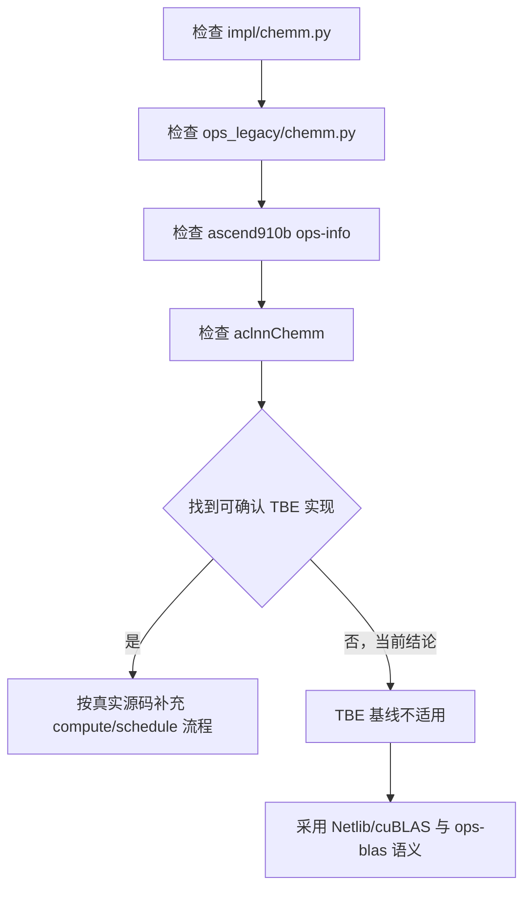
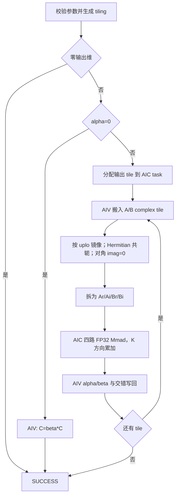
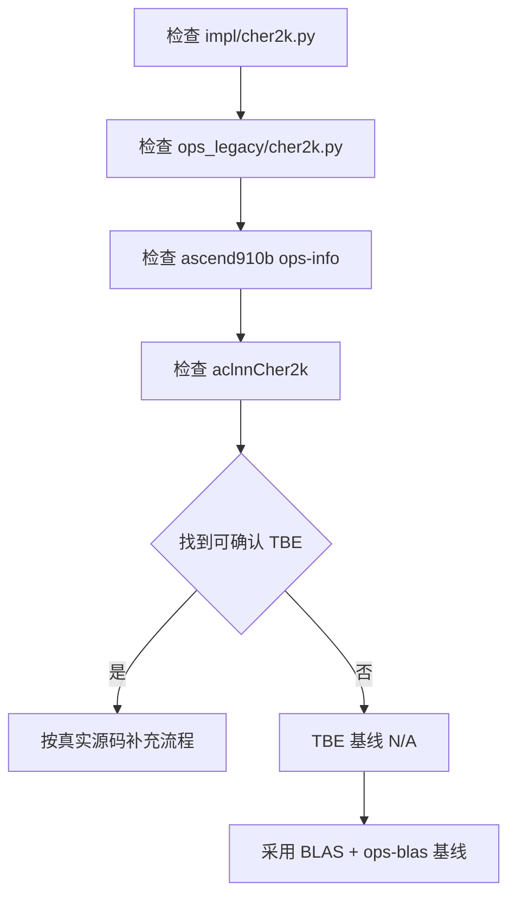
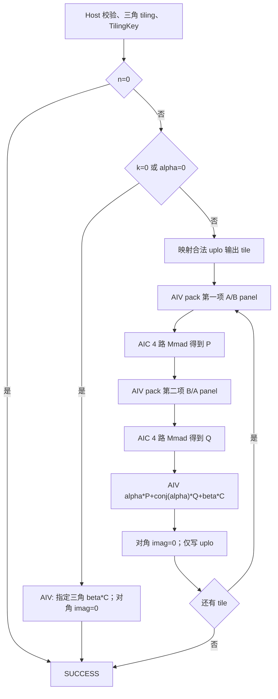
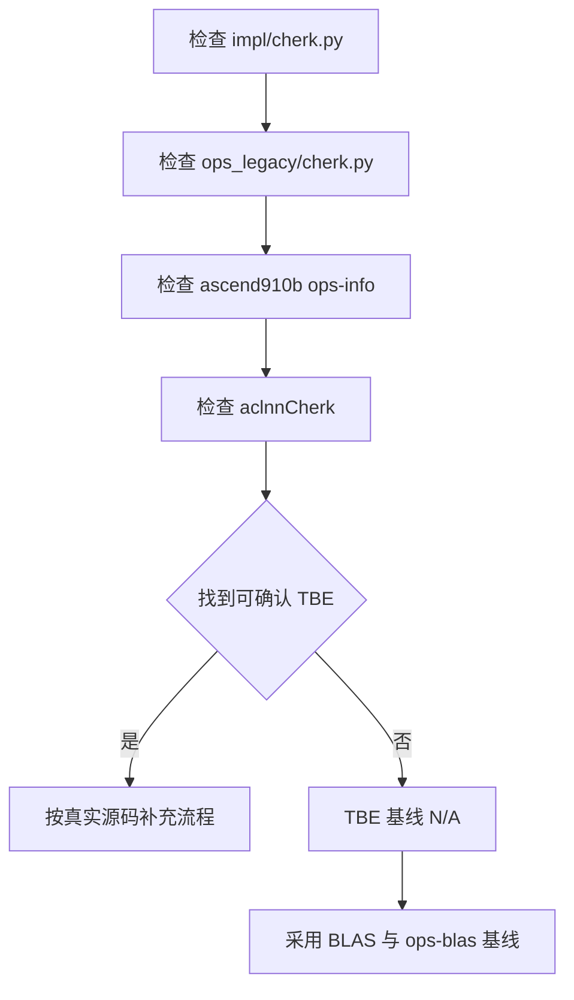
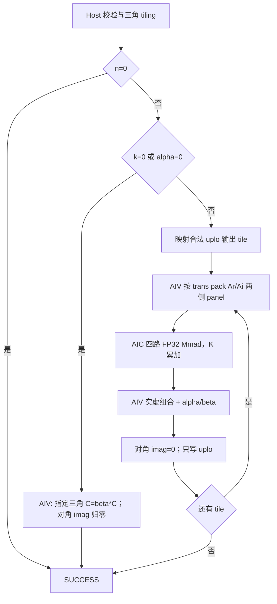
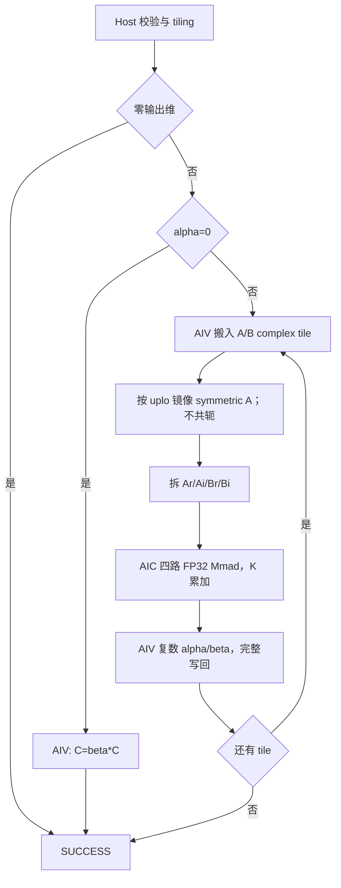
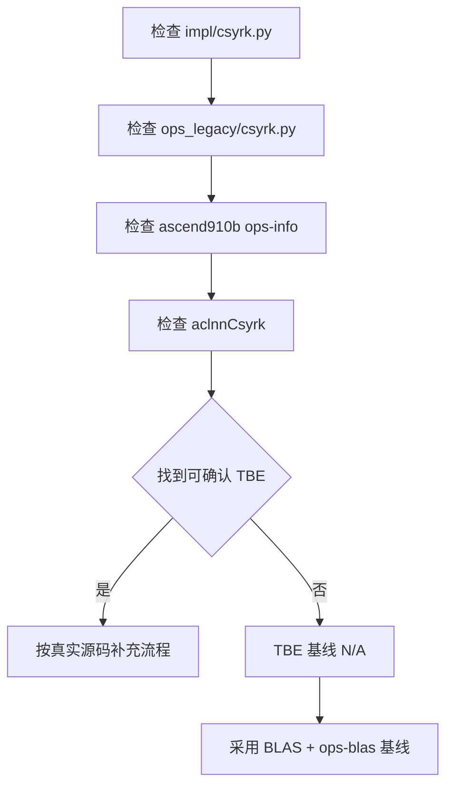
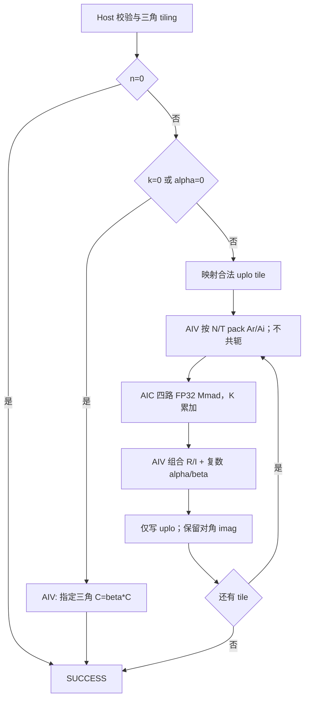

# 【社区任务】Chemm 算子设计文档

> 文档状态：开发前设计基线；目标仓库：`cann/ops-blas`；目标硬件：Atlas A2 训练系列产品；CANN 版本：9.0.0 及以上。

## 设计文档 PR 要求

- PR 标题：`【社区任务】Chemm算子设计文档`。
- 以 PR 而非 issue 提交到 `cann/cann-competitions/04_tasks/01_community-task-2026/tasklist` 的对应位置。
- 提交者必须签署 CLA，并在 PR 评论 `/compile` 完成构建门禁。
- 代码验收后合入 `cann/ops-blas/experimental` 的 Chemm 对应目录。

## 一、需求背景

### 1.1 需求来源

本需求来源于 CANN 社区“矩阵乘系列算子开发”任务。目标是在 Atlas A2 训练系列产品上使用 Ascend C 实现与 Netlib BLAS `chemm`、cuBLAS `cublasChemm` 核心语义一致的单精度复数 Hermitian 矩阵乘法，并完成泛化、精度与性能验收。

数学语义：

```text
side=L: C = alpha*A*B + beta*C，A 为 m×m Hermitian 矩阵
side=R: C = alpha*B*A + beta*C，A 为 n×n Hermitian 矩阵
```

### 1.2 背景介绍

#### 1.2.1 Chemm 算子实现优化

该任务是 `ops-blas` 新增 BLAS Level-3 接口，不是已确认的 TBE 到 Ascend C 迁移。开发前核查的 TBE 候选源码文件为：

```text
/usr/local/Ascend/ascend-toolkit/latest/opp/built-in/op_impl/ai_core/tbe/impl/chemm.py
/usr/local/Ascend/ascend-toolkit/latest/opp/built-in/op_impl/ai_core/tbe/impl/ops_legacy/chemm.py
```

Atlas A2 算子信息库候选文件为：

```text
/usr/local/Ascend/ascend-toolkit/latest/opp/built-in/op_impl/ai_core/tbe/config/ascend910b/aic-ascend910b-ops-info.json
/usr/local/Ascend/ascend-toolkit/latest/opp/built-in/op_impl/ai_core/tbe/config/ascend910b/aic-ascend910b-ops-info-legacy.json
```

当前机器没有安装 `/usr/local/Ascend`，任务书、当前工作区及 `ops-blas` 主线中也未发现 Chemm 同名 TBE 实现或 aclnnChemm 接口。因此本文不能虚构 TBE compute/schedule；实际 A2 开发环境若找到上述文件，必须在代码 PR 前更新本节和差异分析。

优化目标是让 GM 保持 `aclblasComplex` 交错布局，在 Device 侧按 tile 恢复 Hermitian 未存储半边、拆分实虚部，以 FP32 Cube 完成矩阵乘，并在 AIV 上融合 alpha/beta 和交错写回，禁止整矩阵 Device-to-Host 拆分。

#### 1.2.2 Chemm 算子现状分析

##### 1.2.2.1 TBE 算子支持的数据类型和数据格式

未确认到同名 TBE 源码或 ops-info 条目，TBE dtype/format 为 N/A。任务目标能力为：

| 项目 | 目标能力 |
| :--- | :--- |
| A/B/C | `complex64`，接口类型 `aclblasComplex {float real; float imag;}` |
| alpha/beta | 单精度复数 |
| 格式 | Column-Major，支持合法 `lda/ldb/ldc` padding |
| 属性 | `side=L/R`，`uplo=U/L` |
| broadcast | 不支持 |

Atlas A2 的 Matmul/Mmad 不直接接受 complex64 输入，本设计将复数乘分解为四次 FP32 实数 Mmad。

##### 1.2.2.2 TBE 算子实现描述

同名 TBE 实现未确认，不存在可与源码逐行一致的实现描述。已执行的基线判断顺序为：检查 `impl/chemm.py`、检查 `ops_legacy/chemm.py`、检查 ascend910b 两个 ops-info 文件、检查 aclnnChemm；均无确认结果后，以 Netlib/cuBLAS 语义和 `ops-blas` Handle/stream/Column-Major 约定作为设计基线。

##### 1.2.2.3 TBE 算子实现流程图



该图是 TBE 核查流程，不冒充 TBE 计算图。

## 二、需求分析

### 2.1 外部组件依赖

| 组件 | 用途 |
| :--- | :--- |
| CANN Runtime | Device、stream、内存和异步 launch |
| `ops-blas` Handle/workspace | stream、AIC/AIV 数量和 Device workspace |
| Ascend C DataCopy/DataCopyPad | 交错复数 tile 的对齐/非对齐搬运 |
| Ascend C Matmul/Mmad | FP32 实数 Cube 矩阵乘 |
| Ascend C SIMD | 实虚拆分、共轭、alpha/beta、交错写回 |
| OpenBLAS/GTest/msprof | 测试 golden、功能门禁和性能分析，不进入运行时库 |

### 2.2 内部适配模块

| 类型 | 规划位置 | 职责 |
| :--- | :--- | :--- |
| 修改 | `include/cann_ops_blas.h` | 新增 `aclblasCHEMM` 声明 |
| 复用 | `include/cann_ops_blas_common.h` | Handle、side、uplo、complex、status 类型 |
| 新增 | `experimental/hemm/chemm/arch22/chemm_host.cpp` | 校验、tiling、launch |
| 新增 | `experimental/hemm/chemm/arch22/chemm_kernel.asc` | AIV pack、AIC Mmad、AIV combine |
| 新增 | `experimental/hemm/chemm/arch22/chemm_tiling_data.h` | 紧凑 TilingData |
| 新增 | `test/hemm/chemm/` | CSV、OpenBLAS golden、NPU wrapper、GTest |

最终路径服从开发时 `ops-blas` 主线规范。

### 2.3 需求模块设计

#### 2.3.1 Ascend C 算子原型

```cpp
aclblasStatus_t aclblasCHEMM(
    aclblasHandle_t handle, aclblasSideMode_t side, aclblasFillMode_t uplo,
    int m, int n, const aclblasComplex* alpha,
    const aclblasComplex* A, int lda,
    const aclblasComplex* B, int ldb,
    const aclblasComplex* beta,
    aclblasComplex* C, int ldc);
```

接口名 `aclblasCHEMM` 以任务附件和自测 wrapper 为当前基线。代码 PR 前必须与目标分支 `cann_ops_blas.h` 及维护者确认是否沿用该全大写例程名；若要求遵循既有 `aclblasCgemm` 的大小写风格，声明、实现、测试 wrapper 和本文必须一次性同步，不能形成双接口。

| 参数 | 内存 | 约束 |
| :--- | :--- | :--- |
| handle | Host | 非空，携带 stream/workspace |
| side/uplo | Host value | side 仅 L/R；uplo 仅 U/L |
| m/n | Host value | 公开参数不得为负；零输出维按 BLAS no-op 处理 |
| alpha/beta | Host pointer | 非空，单精度复数 |
| A | Device | `side=L:[m,m]`，`side=R:[n,n]`；只读 uplo 指定半边 |
| B/C | Device | `[m,n]`，Column-Major |
| lda | Host value | `>=max(1, side==L ? m : n)` |
| ldb/ldc | Host value | `>=max(1,m)` |

#### 2.3.2 Ascend C 算子相关约束

- 相对 TBE 的缺失功能为 N/A，因为无同名 TBE 基线。
- 仅支持 complex64/Column-Major，不支持 complex128、broadcast、batch、任意 stride、负 leading dimension 或 A/B/C 重叠。
- A 的未存储半边不得读取；镜像元素按 `A(i,j)=conj(A(j,i))` 恢复；对角线虚部必须忽略。
- `alpha==0` 时不读取 A/B，只执行 `C=beta*C`；`beta==0` 时不读取 C 原值。
- 所有 `ld*列数*8`、tile 数和 workspace 字节数使用 64 位中间量检查溢出。

## 三、需求详细设计

### 3.1 使能方式

调用链为 `aclInit/创建 stream -> aclblasCreate -> aclblasSetStream -> aclblasCHEMM -> 调用者按需同步 stream`。该接口属于 aclBLAS，不注册 ACLNN/GE；正常路径异步 launch，不做隐式 stream 同步或整矩阵 D2H。

### 3.2 需求总体设计

#### 3.2.1 Host 侧设计

Host 依次完成参数校验、alpha/beta 快速路径判断、平台资源查询、输出/K 维 tile 选择、分核、workspace 预算、TilingKey 编码和异步 launch。TilingData 至少包含 `side/uplo/m/n/lda/ldb/ldc/baseM/baseN/baseK/tileCount/usedCoreNum/flags/alpha/beta`；动态地址和总字节只在 Host 用 64 位，TilingData 优先使用有界的 32 位字段。

参数校验顺序固定为：Handle/枚举/维度/leading dimension → 零输出维快速返回 → 标量指针 → 按快速路径判定实际会读取的矩阵指针。非法枚举、负维度、非法 `ld*`、必需指针为空或地址/字节数溢出返回 `ACLBLAS_STATUS_INVALID_VALUE`；`m==0 || n==0` 返回 SUCCESS 且不 launch。`alpha==0` 时 A/B 可不读取但 C 仍按 beta 处理，`beta==0` 时不得读取 C 原值。

TilingData 使用固定宽度 POD 字段：枚举和 fast/shape/HF32 标志用 `uint8_t/uint16_t`，维度、leading dimension、tile 尺寸、tile 数和核数用 `uint32_t`，workspace 总字节和每核步长用 `uint64_t`，alpha/beta 拆为四个 FP32。Host 先以 64 位完成乘加和上界校验，再窄化写入；Kernel 不根据 GM 内容重新推导 tiling。

##### 3.2.1.1 分核策略

输出为完整 `m×n`：

```text
TM = ceil(m/baseM)
TN = ceil(n/baseN)
TK = ceil((side==L ? m : n)/baseK)
tileCount = TM*TN
usedAicNum = min(platformAicNum, max(1,tileCount))
taskId(core,round) = core + round*usedAicNum
```

每个输出 tile 由唯一 AIC task 完成全部 K panel，避免 atomic 并保证确定性。side=L 优先沿 N 遍历以复用 A panel；side=R 优先沿 M 遍历。边界 `validM/validN/validK` 由实际剩余尺寸计算。

##### 3.2.1.2 数据分块和内存优化策略

GM 的 `aclblasComplex` 为 `[real,imag]` AoS。AIV 将当前 A/B tile 拆为 `Ar/Ai/Br/Bi` 连续 FP32 panel；Hermitian 未存储半边读取镜像并令 imag 取负，对角 imag 置 0。复数乘：

```text
P0=Ar*Br, P1=Ai*Bi, P2=Ar*Bi, P3=Ai*Br
Pr=P0-P1, Pi=P2+P3
```

设 `s=4`、双缓冲数 `q=2`，保守片上容量：

```text
L1 = q*s*(2*baseM*baseK + 2*baseK*baseN)
L0A = q*s*baseM*baseK
L0B = q*s*baseK*baseN
L0C = s*baseM*baseN
UB = s*(AoS_pack + 2*baseM*baseN + vectorTmp)
```

每项不得超过从平台获取并扣除系统开销后的可用容量。workspace 只保存 per-core ping/pong panel，不能保存完整 Ar/Ai/Br/Bi 或四个完整输出：

```text
panelBytesPerGroup = 2*q*s*(baseM*baseK + baseK*baseN + baseM*baseN)
```

其中 `AoS_pack=2*(baseM*baseK+baseK*baseN)` 个 FP32，`vectorTmp` 至少为 `2*baseM*baseN` 个 FP32；实际申请按 512 B 向上对齐。每个逻辑核组的 workspace 连续布局为 `slot[2]`，每个 slot 再按 512 B 对齐依次放 `Ar/Ai/Br/Bi/outR/outI`，offset 和 `perCoreStride` 全部由 Host 写入 TilingData。AIV 从 Column-Major GM 地址 `(col*ld+row)*sizeof(aclblasComplex)` 读取 AoS，在 UB 拆分后写 workspace 的连续 ND FP32 panel；AIC 搬入 L1 时转换成 Mmad 要求的 A2/B2 分形布局，结果由 CO1 搬至连续 FP32 `outR/outI`，AIV 只写 `validM*validN`。

tile 候选集合初始为 `baseM/baseN∈{128,96,64,48,32,16}`、`baseK∈{128,64,32,16,8}`。Host 从大到小枚举，淘汰任何超过 L1/L0/UB、workspace 或单指令上限的组合，再按“有效 Cube 面积最大、尾块浪费最少、workspace 更小”排序取首项；没有合法组合时返回明确的内存/内部错误，不以越界配置继续 launch。

FP32 Cube 的 M/N tile 按 16 对齐、K 按 C0=8 或 tiling API 结果对齐；尾块补 0，写回仅覆盖有效区。DataCopy Local 地址 32 B 对齐；非 32 B 尾块使用 A2 支持但属于 ISASI 的 `DataCopyPad`。Mmad 的 A2/B2 地址按 512 B 对齐，FP32 CO1 按 256 元素对齐，单指令 m/n/k 不超过 4095。

##### 3.2.1.3 TilingKey 规划策略

```text
bit 0     side: L=0, R=1
bit 1     uplo: U=0, L=1
bits 3:2  fast: normal=0, betaZero=1, scaleOnly=2, noOp=3
bits 5:4  shape: tiny=0, regular=1, longM=2, longN=3
bit 6     hf32: strictFP32=0, HF32=1
```

`key=side|(uplo<<1)|(fast<<2)|(shape<<4)|(hf32<<6)`。HF32 只在 Atlas A2 全部 218 条精度用例通过后才能启用；否则默认关闭。

设置条件按以下优先级互斥判定：`noOp: m==0 || n==0`；`scaleOnly: alpha==0`；`betaZero: beta==0`；其余为 normal。noOp 编码仅保留给 Host tiling 单测，公开调用在设置 TilingKey 和 launch 前已返回。shape 在正常/`betaZero` 路径中判定：`tiny: m*n<=4096 && kDim<=64`，否则 `longM: m>=4*n && m>128`，否则 `longN: n>=4*m && n>128`，其余 regular，其中 `kDim=(side==L?m:n)`。这些阈值是首版可复现基线；性能调优可以改阈值，但必须同步 Host 单测和本文。

#### 3.2.2 Kernel 侧设计

##### 3.2.2.1 Kernel 侧实现描述

Kernel 默认注册为 `KERNEL_TYPE_MIX_AIC_1_2`，一个逻辑核组包含 1 个 AIC 和 2 个 AIV。AIV0 负责结构矩阵 panel 的恢复/拆分和最终 combine/writeback，AIV1 负责普通矩阵 panel 的拆分；AIC 负责四路 Mmad。两个 ping/pong slot 各使用成对的 panel-ready、output-ready、slot-consumed 核间事件，采用 `CrossCoreSetFlag/CrossCoreWaitFlag` 的 AIC↔AIV 模式，并按 AIV0/AIV1 的 flagId 映射预留互不冲突的 ID。实现使用低阶 Mmad；若改用内部占用核间 flag 的 Matmul 高阶 API，必须改为其队列同步机制，不能复用同一 flagId。所有 TilingKey 分支执行相同数量的成对事件，快速路径单独 launch AIV-only kernel，避免某一子核提前退出导致死锁。

1. AIV 按 Column-Major 地址 `col*ld+row` 搬入交错复数；根据 side/uplo 恢复 Hermitian A，并拆成实/虚 panel。
2. AIV 设置 panel-ready；AIC 搬入 L1/L0A/L0B，顺序执行四路 FP32 Mmad，并在 K 方向累加。
3. L0C 结果送 UB/combine buffer；AIV 计算：

```text
outR = ar*Pr-ai*Pi + br*Cr-bi*Ci
outI = ar*Pi+ai*Pr + br*Ci+bi*Cr
```

4. beta=0 路径跳过 C 搬入；结果交错写回完整 `m×n` 有效区。
5. ping/pong slot 以 ready/consumed flag 防止覆盖，pack、Cube、combine 跨相邻 panel/tile 重叠。

##### 3.2.2.2 Ascend C 实现流程图



##### 3.2.2.3 Ascend C 与 TBE 流程差异

| 项目 | 同名 TBE | 本设计 | 原因 |
| :--- | :--- | :--- | :--- |
| 基线 | 未确认 | Netlib/cuBLAS + ops-blas | 新 BLAS 接口任务 |
| 调用 | 未确认 | aclBLAS Handle/stream | 目标仓接口范式 |
| 复数 | 未确认 | AoS 拆 SoA，四路 FP32 Cube | A2 Cube 不直接支持 complex64 |
| Hermitian | 未确认 | uplo 镜像、共轭、对角 imag=0 | 禁止读取未指定半边 |
| 调度 | 未确认 | 显式 tile/分核/TilingKey | 泛化和性能可控 |

找到真实 TBE 后必须重做逐源码差异分析。

### 3.3 支持硬件

| 硬件 | 状态 |
| :--- | :---: |
| Atlas A2 训练系列产品（测试 SoC `ascend910b3`） | 支持 |
| Atlas A2 推理、Atlas A3、Ascend 950 | 未适配，不声明支持 |

### 3.4 算子约束限制

仅 complex64、Column-Major、side=L/R、uplo=U/L；不支持 broadcast、batch、任意 stride、内存别名或其他硬件。`m,n` 为正值是任务正常域，零输出维按 BLAS no-op 兼容，负值报错。NaN/Inf 按 FP32 自然传播。

## 四、特性交叉分析

| 特性 | 涉及 | 处理 |
| :--- | :---: | :--- |
| 动态 shape/非对齐尾块 | 是 | Host tiling、内部补 0、有效区写回 |
| leading dimension | 是 | 按 `col*ld+row`，测试 `ld>min` |
| Hermitian/uplo | 是 | 未存储半边镜像共轭，对角 imag 忽略 |
| alpha/beta 快速路径 | 是 | alpha=0 不读 A/B，beta=0 不读 C |
| 多核确定性 | 是 | 单 tile 单核完成 K 归约，无 atomic |
| AIC/AIV 同步 | 是 | ready/consumed flag 与 ping/pong |
| HF32 | 条件 | 全量精度准入后才能开启 |
| broadcast/batch/量化 | 否 | 参数域不支持 |
| 异步语义 | 是 | 使用 Handle stream，不隐式同步 |

## 五、可维可测分析

### 5.1 精度标准/性能标准

精度按生态 FP32 混合容差，实部/虚部分别验证：`atol=2^-16`、`rtol=2^-10`，并服从 `ops-blas` `MIXED_TOLERANCE`/matched-ratio 规则。完整输出矩阵比较；未指定 A 三角以 NaN/哨兵填充验证不被读取；Hermitian 对角虚部放置非零值验证被忽略。CPU golden 使用 OpenBLAS `cblas_chemm` 和高精度中间计算。

本地 `chemm_test.csv` 共 318 条：218 条精度、100 条性能，覆盖全 side/uplo、尺寸 1/奇数/非对齐/大尺寸、fat/thin、`lda/ldb/ldc>min`、标量和空指针边界。

用例前缀按 L0 基础、L1 尺寸、L2 标量、L3 fat/thin、L4 leading dimension、L5 填充、L5b 组合覆盖、L6 边界和 PF 性能分组。可复现顺序为 `python gen_csv.py` → `python verify_accuracy.py --repo <ops-blas> --soc ascend910b3` → `python verify_performance.py --repo <ops-blas> --soc ascend910b3 --timeout 3600`；提交自测报告时保留逐 case PASS/FAIL、精度统计、device timing 和 msprof 截图。

性能要求为 `T_NPU <= T_A100/0.8`：

| m | n | side/uplo | A100 ms | NPU 上限 ms |
| ---: | ---: | :---: | ---: | ---: |
| 1024 | 1024 | L/U | 0.609 | 0.76125 |
| 2048 | 2048 | L/U | 4.951 | 6.18875 |
| 1024 | 1024 | R/L | 0.490 | 0.61250 |
| 2048 | 2048 | R/L | 4.337 | 5.42125 |

精确性能用 msprof 或仓库 device timing，在预热后多次运行取中位数；不能用包含 CPU golden 的 GTest 总耗时替代 Kernel 时间。重点观察 Cube、MTE、Vector 利用率和 AIV pack/AIC compute 重叠。

### 5.2 兼容性分析

- 新增 API，不修改既有接口 ABI；复用公共 `aclblasComplex` 和枚举。
- 仅声明 Atlas A2 训练产品；其他 SoC 在完成适配和回归前不支持。
- 任务要求 CANN 9.0.0+，实际 API 签名必须以开发分支配套头文件为准。
- 使用 Handle Device workspace，不改变所有权；workspace 不足时缩 tile，仍无合法配置则明确返回错误。
- 单 tile 单核和固定 K 顺序保证相同 tiling 下可重复。

## 六、CheckList 覆盖映射

| 审核项 | 本文位置 |
| :--- | :--- |
| PR 位置/标题/CLA/构建 | “设计文档 PR 要求” |
| 需求来源、背景、TBE 路径/信息库/dtype/实现/流程图 | 第一章 |
| 外部依赖、内部模块、原型、相关约束 | 第二章 |
| 使能、分核、分块与 LocalMemory、TilingKey | 3.1、3.2.1 |
| Kernel 描述、Ascend C 流程图、TBE 差异 | 3.2.2 |
| 支持硬件、约束限制 | 3.3、3.4 |
| 特性交叉分析 | 第四章 |
| 精度/性能标准、兼容性 | 第五章 |

## 参考资料

1. [Netlib BLAS Quick Reference](https://netlib.org/blas/blasqr.pdf)
2. [NVIDIA cuBLAS](https://docs.nvidia.com/cuda/cublas/)
3. [cann/ops-blas](https://gitcode.com/cann/ops-blas)
4. [生态算子开源精度标准](https://gitcode.com/cann/opbase/blob/master/docs/zh/ops_precision_standard/experimental_standard.md)
5. 本地 CANN 9.1.0-beta.1 Ascend C API 参考：DataCopy、DataCopyPad、Mmad、Matmul、Matmul Tiling、SetHF32Mode。
# 【社区任务】Cher2k 算子设计文档

> 文档状态：开发前设计基线；目标仓库：`cann/ops-blas`；目标硬件：Atlas A2 训练系列产品；CANN 版本：9.0.0 及以上。

## 设计文档 PR 要求

- PR 标题：`【社区任务】Cher2k算子设计文档`。
- 以 PR 提交到 `cann/cann-competitions/04_tasks/01_community-task-2026/tasklist` 对应位置，不得用 issue 代替。
- 必须签署 CLA，并在 PR 评论 `/compile` 通过构建门禁。
- 代码验收后合入 `cann/ops-blas/experimental` 的 Her2k 对应目录。

## 一、需求背景

### 1.1 需求来源

本需求来自 CANN 社区“矩阵乘系列算子开发”任务，目标是在 Atlas A2 训练系列产品上使用 Ascend C 实现与 Netlib BLAS `cher2k`、cuBLAS `cublasCher2k` 核心语义一致的单精度复数 Hermitian 秩-2K 更新。

```text
trans=N: C = alpha*A*B^H + conj(alpha)*B*A^H + beta*C
trans=C: C = alpha*A^H*B + conj(alpha)*B^H*A + beta*C
```

alpha 为单精度复数，beta 必须为 FP32 实数；C 为 `n×n` Hermitian 矩阵，仅更新 `uplo` 指定三角，对角线虚部必须为 0。

### 1.2 背景介绍

#### 1.2.1 Cher2k 算子实现优化

本任务是 `ops-blas` 新 BLAS 接口，并无已确认 TBE 基线。需在真实环境核查：

```text
/usr/local/Ascend/ascend-toolkit/latest/opp/built-in/op_impl/ai_core/tbe/impl/cher2k.py
/usr/local/Ascend/ascend-toolkit/latest/opp/built-in/op_impl/ai_core/tbe/impl/ops_legacy/cher2k.py
/usr/local/Ascend/ascend-toolkit/latest/opp/built-in/op_impl/ai_core/tbe/config/ascend910b/aic-ascend910b-ops-info.json
/usr/local/Ascend/ascend-toolkit/latest/opp/built-in/op_impl/ai_core/tbe/config/ascend910b/aic-ascend910b-ops-info-legacy.json
```

当前机器没有 `/usr/local/Ascend`，任务书、工作区和 `ops-blas` 主线也未发现 Cher2k 同名 TBE、ops-info 条目或 aclnnCher2k。本文不虚构 TBE 实现；若 A2 开发环境找到上述文件，必须更新 1.2.2 和 3.2.2.3。

优化目标是只计算 C 的目标三角，A/B 在 Device 侧按 tile 拆分实虚部，复用同一输出 tile 的两个复数乘项，并在 AIV 中融合 alpha、conj(alpha)、实数 beta 和 Hermitian 对角处理，不生成两个完整 `n×n` 中间矩阵。

#### 1.2.2 Cher2k 算子现状分析

##### 1.2.2.1 TBE 算子支持的数据类型和数据格式

同名 TBE 未确认，TBE dtype/format 为 N/A。目标能力：

| 项目 | 目标能力 |
| :--- | :--- |
| A/B/C | complex64 / `aclblasComplex` |
| alpha | 单精度复数 |
| beta | FP32 实数，不能为复数 |
| 格式 | Column-Major，支持合法 leading dimension padding |
| 属性 | `uplo=U/L`，`trans=N/C` |
| C | 只更新指定三角，对角线必须为实数 |
| broadcast | 不支持 |

Atlas A2 Cube 不直接支持 complex64 Matmul，需用 FP32 实数 Mmad 分解两个复数乘项。

##### 1.2.2.2 TBE 算子实现描述

没有可确认源码，不能给出 TBE compute/schedule。核查顺序为 `impl/cher2k.py -> ops_legacy/cher2k.py -> ascend910b ops-info -> aclnnCher2k`；当前均无结果，因此以标准 BLAS 和 `ops-blas` Handle/stream/Column-Major 约定为设计基线。

##### 1.2.2.3 TBE 算子实现流程图



## 二、需求分析

### 2.1 外部组件依赖

| 组件 | 用途 |
| :--- | :--- |
| CANN Runtime 与 `ops-blas` Handle/workspace | stream、资源、workspace、异步 launch |
| DataCopy/DataCopyPad | complex tile 和非对齐尾块搬运 |
| Matmul/Mmad | 两个复数乘项对应的 FP32 Cube 计算 |
| SIMD | 实虚拆分、共轭、两项组合、alpha/beta、三角/对角写回 |
| OpenBLAS/GTest/msprof | CPU golden、测试门禁和性能分析 |

### 2.2 内部适配模块

| 类型 | 规划位置 | 职责 |
| :--- | :--- | :--- |
| 修改 | `include/cann_ops_blas.h` | 新增 `aclblasCHER2K` |
| 复用 | `include/cann_ops_blas_common.h` | Handle、uplo、trans、complex、status |
| 新增 | `experimental/her2k/cher2k/arch22/cher2k_host.cpp` | 校验、三角 tiling、launch |
| 新增 | `experimental/her2k/cher2k/arch22/cher2k_kernel.asc` | A/B pack、8 路实数乘、combine |
| 新增 | `experimental/her2k/cher2k/arch22/cher2k_tiling_data.h` | TilingData |
| 新增 | `test/her2k/cher2k/` | CSV、OpenBLAS golden、GTest |

### 2.3 需求模块设计

#### 2.3.1 Ascend C 算子原型

```cpp
aclblasStatus_t aclblasCHER2K(
    aclblasHandle_t handle, aclblasFillMode_t uplo, aclblasOperation_t trans,
    int n, int k, const aclblasComplex* alpha,
    const aclblasComplex* A, int lda,
    const aclblasComplex* B, int ldb,
    const float* beta,
    aclblasComplex* C, int ldc);
```

接口名 `aclblasCHER2K` 以任务附件和自测 wrapper 为当前基线。代码 PR 前必须与目标分支公共头文件及维护者确认大小写风格；若改为 `aclblasCher2k` 风格，声明、实现、测试 wrapper 和本文必须同步修改，不能同时暴露两个名字。

| 参数 | 约束 |
| :--- | :--- |
| handle | 非空 Host Handle |
| uplo/trans | uplo 仅 U/L；trans 仅 N/C |
| n/k | 不得为负；n=0 为 no-op |
| alpha | 非空 Host complex64 指针 |
| beta | 非空 Host FP32 实数指针 |
| A/B | N 时 `[n,k]`，C 时 `[k,n]`，Device complex64 |
| lda/ldb | `>=max(1, trans==N ? n : k)` |
| C/ldc | Device `[n,n]`；`ldc>=max(1,n)`；只更新 uplo |

#### 2.3.2 Ascend C 算子相关约束

- 同名 TBE 不存在可确认能力，故相对 TBE 缺失功能为 N/A。
- 仅 complex64 矩阵、complex64 alpha、FP32 beta 和 Column-Major；不支持 complex beta、broadcast、batch、任意 stride、别名或其他 dtype。
- 未指定 C 三角必须 EXACT 不变；输出对角 imag 强制 0。
- `alpha==0` 或 `k==0` 不读 A/B，只执行指定三角 `C=beta*C`；`beta==0` 不读 C。
- 参数、地址和 workspace 用 64 位中间量防溢出。

## 三、需求详细设计

### 3.1 使能方式

通过 `aclblasCreate/aclblasSetStream/aclblasCHER2K` 调用，不注册 ACLNN/GE。接口在 Handle stream 上异步 launch，调用者自行同步；不在正常路径执行整矩阵 D2H 或 Host 拆分。

### 3.2 需求总体设计

#### 3.2.1 Host 侧设计

Host 完成参数校验、alpha/beta 快速路径、平台资源查询、三角 tile 映射、tile/核数/workspace 选择和 TilingKey。TilingData 至少含 `trans/uplo/n/k/lda/ldb/ldc/base*/tileCount/usedCore/flags/alphaReal/alphaImag/beta`。

校验顺序固定为 Handle/枚举/维度/leading dimension → `n==0` 快速返回 → alpha/beta 指针 → 当前路径会读取的 A/B/C 指针。非法参数、必需指针为空或 64 位地址/字节计算溢出返回 `ACLBLAS_STATUS_INVALID_VALUE`；`n==0` 返回 SUCCESS 且不 launch。`alpha==0 || k==0` 不读 A/B，只缩放 C 的指定三角并令对角 imag 为 `+0.0f`；`beta==0` 不读 C 原值。

TilingData 使用固定宽度 POD：枚举和 fast/shape/schedule/HF32 标志用 `uint8_t/uint16_t`，维度、`ld*`、`base*`、tile 数和核数用 `uint32_t`，workspace 总字节、每核步长和 slot offset 用 `uint64_t`，alpha 拆为两个 FP32、beta 为 FP32。Host 以 64 位完成三角 tile 数、地址和 workspace 计算，通过范围检查后再窄化。

##### 3.2.1.1 分核策略

```text
T = ceil(n/baseN)
tileCount = T*(T+1)/2
usedAicNum = min(platformAicNum, max(1,tileCount))
taskId = core + round*usedAicNum
```

Upper 仅 `tileRow<=tileCol`，Lower 仅 `tileRow>=tileCol`。单输出 tile 由一核完成两个复数乘项的全部 K panel，禁止 atomic。对角 tile 内逐元素屏蔽非 uplo 半边。为减少 A/B panel 重复读取，tile 遍历方向按 uplo 选择连续的行或列。

##### 3.2.1.2 数据分块和内存优化策略

令 `P=A*B^H`（trans=N）或 `P=A^H*B`（trans=C），则目标为：

```text
C = alpha*P + (alpha*P)^H + beta*C
```

对输出元素 `(i,j)`，仍需同时得到 `P(i,j)` 与 `conj(P(j,i))`；Kernel 为当前三角 tile pack 两组 A/B panel并完成两个复数乘项。单个复数乘展开：

```text
Pr=Ar*Br-Ai*Bi
Pi=Ar*Bi+Ai*Br
```

总计最多 8 路 FP32 Mmad，但顺序复用 L0C/UB，只保存当前组合的结果，不生成 8 个完整矩阵。

设 `s=4`、双缓冲 `q=2`：

```text
L1 = q*s*2*(baseM*baseK + baseK*baseN) * activeOperandSets
L0A = q*s*baseM*baseK
L0B = q*s*baseK*baseN
L0C = s*baseM*baseN
UB = s*(AoS_pack + 2*baseM*baseN + tmp)
```

优先令 `activeOperandSets=1`，两项串行复用 panel buffer并与下一 panel 流水，避免 L1 翻倍；只有平台容量与实测表明并行更优才设 2。workspace 仅为 per-panel ping/pong：

```text
panelWorkspace ≈ 2*q*s*(baseM*baseK + baseK*baseN + baseM*baseN)
```

串行 schedule 下该式为精确的有效数据量，另加各段 512 B 对齐 padding；双操作数集时，输入 panel 部分乘以 2。`AoS_pack=2*(baseM*baseK+baseK*baseN)`、`tmp>=2*baseM*baseN`，单位为 FP32 元素。每个逻辑核组有两个 512 B 对齐 slot；每个 active operand set 依次存左/右操作数的 real/imag panel，之后存共享 `outR/outI`，各段再次按 512 B 对齐。offset、`perCoreStride` 和 `activeOperandSets` 由 Host 写入 TilingData。AIV 按 Column-Major 与 N/C 地址映射生成连续 ND FP32，AIC 搬入 L1 时转换为 Mmad A2/B2 布局。

Host 从 `baseM/baseN∈{128,96,64,48,32,16}`、`baseK∈{128,64,32,16,8}` 枚举，过滤超过 L1/L0/UB、workspace、对齐和单指令上限的组合，再按有效 Cube 面积、尾块浪费和 workspace 大小排序；无合法组合时明确失败。

FP32 M/N 按 16、K 按 C0=8/tiling API 对齐；尾块 pad 0。DataCopy Local 32 B 对齐，尾块用 A2 支持的 ISASI `DataCopyPad`；Mmad A2/B2 512 B、FP32 CO1 256 元素对齐，单指令 m/n/k≤4095。

##### 3.2.1.3 TilingKey 规划策略

```text
bit 0     trans N/C
bit 1     uplo U/L
bits 3:2  fast normal/betaZero/scaleOnly/noOp
bits 5:4  shape tiny/regular/K-small/K-large
bit 6     schedule: 两项串行复用=0，双操作数集=1
bit 7     hf32 strict/HF32
```

`key=trans|(uplo<<1)|(fast<<2)|(shape<<4)|(schedule<<6)|(hf32<<7)`。HF32 必须通过全部 227 条精度用例；schedule=1 必须满足 L1/UB 公式并由性能实测选择。

fast 按优先级判定：`noOp: n==0`；`scaleOnly: k==0 || alpha==0`；`betaZero: beta==0`；其余 normal。noOp 编码仅供 Host tiling 单测，公开调用在设置 TilingKey 和 launch 前返回。shape 按顺序判定：`tiny: n<=64 && k<=64`；否则 `K-small: k<=32`；否则 `K-large: k>=256 && k>=4*n`；其余 regular。schedule=1 仅在 `activeOperandSets=2` 的 L1/UB/workspace 全部满足、`k>=2*baseK` 且 `tileCount>=usedAicNum` 时进入候选，并以设备计时优于 schedule=0 作为最终启用条件；否则固定为 0。

#### 3.2.2 Kernel 侧设计

##### 3.2.2.1 Kernel 侧实现描述

默认注册 `KERNEL_TYPE_MIX_AIC_1_2`。对于当前乘项，AIV0/AIV1 分别 pack 左、右操作数 panel；AIC 执行四路低阶 Mmad；AIV0 负责保存第一项结果、组合第二项、alpha/beta、对角处理和写回。两个 slot 通过 panel-ready、output-ready、slot-consumed 成对事件流水，使用 `CrossCoreSetFlag/CrossCoreWaitFlag` 的 AIC↔AIV 模式，flagId 按 AIV0/AIV1 映射隔离。所有参与分支保持事件次数一致，no-op/scale-only 使用独立 AIV-only kernel；若改用内部占用核间 flag 的 Matmul 高阶 API，不能复用自定义 flagId。

1. AIV 按 trans 为当前 `(i,j)` 输出 tile pack 第一项 A/B panel，拆成实虚部并处理共轭；AIC 以四路 FP32 Mmad 得到 `P(i,j)`。
2. 复用 buffer pack 第二项对应 B/A panel，AIC 得到与 `P(j,i)^H` 等价的复数 tile。
3. AIV 计算 `alpha*P + conj(alpha)*Q + beta*C`。实现时直接以 `ar/ai` 展开，避免显式构造 conj(alpha)。
4. beta=0 跳过 C 读；只写合法 uplo。对角元素在两项相加后把 imag 设为 `+0.0f`。
5. K panel、两项和相邻输出 tile通过 ready/consumed flag 复用 ping/pong；每 tile 固定归约顺序保证确定性。

##### 3.2.2.2 Ascend C 实现流程图



##### 3.2.2.3 Ascend C 与 TBE 流程差异

| 项目 | 同名 TBE | 本设计 | 原因 |
| :--- | :--- | :--- | :--- |
| 基线/调用 | 未确认 | BLAS + aclBLAS Handle | 新 BLAS 接口 |
| 两个复数乘项 | 未确认 | 最多 8 路 FP32 Cube，buffer 复用 | A2 无 complex64 Matmul |
| 三角 | 未确认 | 压缩 tile 调度、只写 uplo | 减少无效计算与带宽 |
| beta/对角 | 未确认 | beta 为实数，对角 imag=0 | Hermitian 标准语义 |

找到真实 TBE 后必须更新为逐源码差异。

### 3.3 支持硬件

| 硬件 | 状态 |
| :--- | :---: |
| Atlas A2 训练系列产品（`ascend910b3`） | 支持 |
| A2 推理、A3、Ascend 950 | 未适配，不声明支持 |

### 3.4 算子约束限制

仅 complex64 A/B/C、complex64 alpha、FP32 beta、Column-Major、uplo=U/L、trans=N/C。不支持 complex beta、broadcast、batch、任意 stride、别名或其他 SoC。正常域 `n,k>0`，n=0 作为 no-op，负维报错。未指定三角保持不变，对角 imag=0。

## 四、特性交叉分析

| 特性 | 涉及 | 分析 |
| :--- | :---: | :--- |
| 动态/非对齐 shape | 是 | Host 三角 tiling、pad 0、有效区写回 |
| trans=C/共轭 | 是 | pack 地址映射和 imag 符号控制 |
| 双复数乘项 | 是 | 同一 tile 内顺序复用 buffer，避免完整中间矩阵 |
| uplo/对角 | 是 | 只写指定三角，对角 imag=0 |
| beta 实数 | 是 | 不允许按复数读取 |
| 快速路径 | 是 | alpha=0 不读 A/B，beta=0 不读 C |
| 确定性/同步 | 是 | 单 tile 单核，固定 K/两项顺序，ping/pong flag |
| HF32 | 条件 | 全部精度用例准入 |
| broadcast/batch | 否 | 明确不支持 |

## 五、可维可测分析

### 5.1 精度标准/性能标准

实/虚部分别使用 `atol=2^-16`、`rtol=2^-10` 和仓库 matched-ratio 规则。仅 uplo 指定三角混合容差，另一半 C EXACT 不变；对角 imag 在 beta=0 时为精确 `+0.0f`。CPU golden 使用 OpenBLAS `cblas_cher2k` 和高精度中间结果。测试必须确认 beta 只能为实数。

本地 `cher2k_test.csv` 共 327 条：227 条精度、100 条性能，覆盖全 uplo/trans、奇数/非对齐/大尺寸、fat/thin、`lda/ldb/ldc>min`、复数 alpha、实数 beta、空维/空指针和 Hermitian 对角。

用例前缀按 L0 基础、L1 尺寸、L2 标量、L3 fat/thin、L4 leading dimension、L5 填充、L5b 组合覆盖、L6 边界和 PF 性能分组。可复现顺序为 `python gen_csv.py` → `python verify_accuracy.py --repo <ops-blas> --soc ascend910b3` → `python verify_performance.py --repo <ops-blas> --soc ascend910b3 --timeout 3600`；报告必须同时证明合法三角精度、未指定三角 EXACT 不变和 Hermitian 对角 imag 归零。

性能门限 `T_NPU<=T_A100/0.8`：

| n | k | uplo/trans | A100 ms | NPU 上限 ms |
| ---: | ---: | :---: | ---: | ---: |
| 1024 | 1024 | U/N | 0.654 | 0.81750 |
| 2048 | 2048 | U/N | 4.055 | 5.06875 |
| 1024 | 1024 | L/C | 0.548 | 0.68500 |
| 2048 | 2048 | L/C | 4.156 | 5.19500 |

性能以 msprof/device timing 预热后多次中位数为准。重点观察 8 路实数乘的 Cube 利用率、两项 buffer 复用开销、对角 tile 负载和 AIV/AIC 重叠。

### 5.2 兼容性分析

- 新增接口，不破坏既有 ABI；复用公共类型。
- 仅 Atlas A2 训练产品；实际 CANN 9.0.0+ API 按配套头文件确认。
- Handle workspace 不改变所有权；不足时缩 tile或明确失败。
- 未指定三角不写，符合标准 BLAS 存储兼容性。
- 单 tile 单核和固定计算顺序保证相同 tiling 下可重复。

## 六、CheckList 覆盖映射

| 审核项 | 本文位置 |
| :--- | :--- |
| PR 位置/标题/CLA/构建 | “设计文档 PR 要求” |
| 需求来源、TBE 路径/信息库/dtype/实现/流程图 | 第一章 |
| 依赖、模块、原型、相关约束 | 第二章 |
| 使能、分核、LocalMemory、TilingKey | 3.1、3.2.1 |
| Kernel、Ascend C 流程图、TBE 差异 | 3.2.2 |
| 硬件、约束 | 3.3、3.4 |
| 特性交叉 | 第四章 |
| 精度/性能、兼容性 | 第五章 |

## 参考资料

1. [Netlib BLAS Quick Reference](https://netlib.org/blas/blasqr.pdf)
2. [NVIDIA cuBLAS](https://docs.nvidia.com/cuda/cublas/)
3. [cann/ops-blas](https://gitcode.com/cann/ops-blas)
4. [生态算子开源精度标准](https://gitcode.com/cann/opbase/blob/master/docs/zh/ops_precision_standard/experimental_standard.md)
5. 本地 CANN 9.1.0-beta.1 Ascend C API 参考。
# 【社区任务】Cherk 算子设计文档

> 文档状态：开发前设计基线；目标仓库：`cann/ops-blas`；目标硬件：Atlas A2 训练系列产品；CANN 版本：9.0.0 及以上。

## 设计文档 PR 要求

- PR 标题：`【社区任务】Cherk算子设计文档`。
- 必须以 PR 提交到 `cann/cann-competitions/04_tasks/01_community-task-2026/tasklist` 对应位置，不能以 issue 代替。
- 必须完成 CLA 签署，并在 PR 评论 `/compile` 通过构建门禁。
- 代码验收后合入 `cann/ops-blas/experimental` 的 Herk 对应目录。

## 一、需求背景

### 1.1 需求来源

本需求来自 CANN 社区“矩阵乘系列算子开发”任务，目标是在 Atlas A2 训练系列产品上以 Ascend C 实现与 Netlib BLAS `cherk`、cuBLAS `cublasCherk` 核心语义一致的单精度复数 Hermitian 秩-K 更新。

```text
trans=N: C = alpha*A*A^H + beta*C，A 为 n×k
trans=C: C = alpha*A^H*A + beta*C，A 为 k×n
```

`alpha`、`beta` 均为 FP32 实数；C 为 `n×n` Hermitian 矩阵，只更新 `uplo` 指定三角，输出对角线虚部必须为 0。

### 1.2 背景介绍

#### 1.2.1 Cherk 算子实现优化

本任务是 `ops-blas` 新 BLAS 接口，不是已确认的 TBE 迁移。需核查的 TBE 候选源码：

```text
/usr/local/Ascend/ascend-toolkit/latest/opp/built-in/op_impl/ai_core/tbe/impl/cherk.py
/usr/local/Ascend/ascend-toolkit/latest/opp/built-in/op_impl/ai_core/tbe/impl/ops_legacy/cherk.py
```

Atlas A2 算子信息库候选文件：

```text
/usr/local/Ascend/ascend-toolkit/latest/opp/built-in/op_impl/ai_core/tbe/config/ascend910b/aic-ascend910b-ops-info.json
/usr/local/Ascend/ascend-toolkit/latest/opp/built-in/op_impl/ai_core/tbe/config/ascend910b/aic-ascend910b-ops-info-legacy.json
```

当前机器没有 `/usr/local/Ascend` 工具包，任务书、工作区及 `ops-blas` 主线也未发现同名 TBE、ops-info 条目或 aclnnCherk。因此本文不虚构 TBE compute/schedule；真实 A2 环境若发现上述文件，必须更新 TBE 现状和差异章节。

优化重点是只调度输出三角 tile，以 Device 侧实虚拆分和 FP32 Cube 完成 `A*A^H`/`A^H*A`，在 AIV 上融合实数 alpha/beta 并强制对角虚部归零，避免计算完整 `n×n` 后再裁剪。

#### 1.2.2 Cherk 算子现状分析

##### 1.2.2.1 TBE 算子支持的数据类型和数据格式

同名 TBE 未确认，TBE dtype/format 为 N/A。本任务目标：

| 项目 | 目标能力 |
| :--- | :--- |
| A/C | `complex64` / `aclblasComplex` |
| alpha/beta | FP32 实数 |
| 格式 | Column-Major，支持 `lda/ldc` padding |
| 属性 | `uplo=U/L`，`trans=N/C` |
| 输出 | 只更新指定三角，对角线为实数 |
| broadcast | 不支持 |

Atlas A2 Matmul/Mmad 不直接支持 complex64，Kernel 使用 FP32 实数 Mmad 展开复数乘。

##### 1.2.2.2 TBE 算子实现描述

未确认同名源码，故无可与源码一致的 TBE 逻辑。核查顺序为 `impl/cherk.py -> ops_legacy/cherk.py -> ascend910b ops-info -> aclnnCherk`；当前结论均不存在，以 Netlib/cuBLAS 和 `ops-blas` 调用约定作为设计基线。

##### 1.2.2.3 TBE 算子实现流程图



该图仅表示核查流程。

## 二、需求分析

### 2.1 外部组件依赖

| 组件 | 用途 |
| :--- | :--- |
| CANN Runtime、`ops-blas` Handle/workspace | stream、资源、workspace、异步 launch |
| Ascend C DataCopy/DataCopyPad | complex tile 搬运和非对齐尾块 |
| Ascend C Matmul/Mmad | FP32 Cube 秩-K 主计算 |
| Ascend C SIMD | 实虚拆分、加减、alpha/beta、三角/对角写回 |
| OpenBLAS/GTest/msprof | 测试与性能分析，不进入运行时依赖 |

### 2.2 内部适配模块

| 类型 | 规划位置 | 职责 |
| :--- | :--- | :--- |
| 修改 | `include/cann_ops_blas.h` | 新增 `aclblasCHERK` |
| 复用 | `include/cann_ops_blas_common.h` | Handle、uplo、trans、complex、status |
| 新增 | `experimental/herk/cherk/arch22/cherk_host.cpp` | 校验、三角 tiling、launch |
| 新增 | `experimental/herk/cherk/arch22/cherk_kernel.asc` | pack、Cube、combine |
| 新增 | `experimental/herk/cherk/arch22/cherk_tiling_data.h` | TilingData |
| 新增 | `test/herk/cherk/` | CSV、OpenBLAS golden、GTest |

### 2.3 需求模块设计

#### 2.3.1 Ascend C 算子原型

```cpp
aclblasStatus_t aclblasCHERK(
    aclblasHandle_t handle, aclblasFillMode_t uplo, aclblasOperation_t trans,
    int n, int k, const float* alpha,
    const aclblasComplex* A, int lda,
    const float* beta,
    aclblasComplex* C, int ldc);
```

接口名 `aclblasCHERK` 以任务附件和自测 wrapper 为当前基线。代码 PR 前必须与目标分支公共头文件及维护者确认大小写风格；若改为 `aclblasCherk` 风格，声明、实现、测试 wrapper 和本文必须同步修改，不能同时暴露两个名字。

| 参数 | 约束 |
| :--- | :--- |
| handle | 非空，Host Handle |
| uplo/trans | uplo 仅 U/L；trans 仅 N/C |
| n/k | 公开参数不得为负；n=0 为 no-op |
| alpha/beta | 非空 Host FP32 实数指针 |
| A | Device complex64；N 时 `[n,k]`，C 时 `[k,n]` |
| lda | `>=max(1, trans==N ? n : k)` |
| C | Device complex64 `[n,n]`，只更新 uplo 指定三角 |
| ldc | `>=max(1,n)` |

#### 2.3.2 Ascend C 算子相关约束

- 相对 TBE 的缺失能力为 N/A；相对标准 BLAS，不缺失任务要求的 uplo/trans 组合。
- 仅 complex64 矩阵、FP32 实数标量和 Column-Major；不支持 broadcast、batch、任意 stride、内存重叠或其他 dtype。
- uplo 未指定三角 C 必须逐 bit 保持不变；输出对角 imag 强制 0。
- `alpha==0` 或 `k==0` 时不读 A，只对指定三角执行 `C=beta*C`；`beta==0` 不读 C 原值。
- 地址、tileCount、workspace 用 64 位中间量防止溢出。

## 三、需求详细设计

### 3.1 使能方式

调用链为 `aclblasCreate -> aclblasSetStream -> aclblasCHERK -> 调用者同步`。接口属于 aclBLAS，不注册 ACLNN/GE；正常路径异步发射，不在 Host 拆分完整 A 或同步 stream。

### 3.2 需求总体设计

#### 3.2.1 Host 侧设计

Host 校验参数，判定 no-op/scale-only/beta-zero，查询 AIC/AIV 与片上容量，选择 `baseM/baseN/baseK`，建立上/下三角 tile 压缩映射，预算 per-panel workspace，生成 TilingKey 后 launch。TilingData 包含 `trans/uplo/n/k/lda/ldc/base*/tileCount/usedCore/flags/alpha/beta`。

校验顺序固定为 Handle/枚举/维度/leading dimension → `n==0` 快速返回 → alpha/beta 指针 → 当前路径会读取的 A/C 指针。非法参数、必需指针为空或 64 位地址/字节计算溢出返回 `ACLBLAS_STATUS_INVALID_VALUE`；`n==0` 返回 SUCCESS 且不 launch。`alpha==0 || k==0` 不读 A，只缩放 C 的指定三角并将对角 imag 写为 `+0.0f`；`beta==0` 不读 C 原值。

TilingData 使用固定宽度 POD：枚举和 fast/shape/HF32 标志用 `uint8_t/uint16_t`，维度、`lda/ldc`、`base*`、tile 数及核数用 `uint32_t`，workspace 总字节、每核步长和 slot offset 用 `uint64_t`，alpha/beta 为 FP32。Host 以 64 位完成三角 tile 数、地址和 workspace 计算，范围检查通过后再窄化。

##### 3.2.1.1 分核策略

```text
T = ceil(n/baseN)              # baseM=baseN 为优选，不强制相等
tileCount = T*(T+1)/2          # 含对角 tile
usedAicNum = min(platformAicNum, max(1,tileCount))
```

Upper 只映射 `tileRow<=tileCol`，Lower 只映射 `tileRow>=tileCol`。每个输出 tile 由唯一 AIC task 完成所有 K panel，禁止跨核 atomic。taskId 以 `core+round*usedAicNum` 分配；对角 tile 内仍逐元素屏蔽非 uplo 半边。

##### 3.2.1.2 数据分块和内存优化策略

GM complex AoS 在 AIV 中拆为 Ar/Ai。trans=N 时：

```text
real = alpha*(Ar*Ar^T + Ai*Ai^T) + beta*Cr
imag = alpha*(Ai*Ar^T - Ar*Ai^T) + beta*Ci
```

trans=C 时交换输入逻辑轴，等价构造 `A^H*A`。只为当前三角输出 tile pack 两个 A panel，不生成完整转置或完整中间矩阵。

设 FP32 字节 `s=4`、双缓冲 `q=2`：

```text
L1 = q*s*2*(baseM*baseK + baseN*baseK)
L0A = q*s*baseM*baseK
L0B = q*s*baseK*baseN
L0C = s*baseM*baseN
UB = s*(AoS_pack + 2*baseM*baseN + tmp)
panelWorkspace = 2*q*s*(baseM*baseK + baseK*baseN + baseM*baseN)
```

`AoS_pack=2*(baseM*baseK+baseN*baseK)`、`tmp>=2*baseM*baseN`，单位为 FP32 元素。每个逻辑核组的 workspace 含两个 512 B 对齐 slot，每个 slot 依次存左 panel `Ar/Ai`、右 panel `Ar/Ai` 和 `outR/outI`，各段再次按 512 B 对齐；offset/perCoreStride 由 Host 写入。AIV 以 Column-Major `(col*lda+row)*8` 按 trans 映射读取 AoS 并写连续 ND FP32，AIC 搬入 L1 时转换为 Mmad A2/B2 布局，AIV 只写合法三角有效元素。

Host 从 `baseM/baseN∈{128,96,64,48,32,16}`、`baseK∈{128,64,32,16,8}` 枚举，过滤超过 L1/L0/UB、workspace、对齐和单指令上限的组合，再按有效 Cube 面积、尾块浪费、workspace 大小排序。无合法组合时明确失败。

容量不得超过平台可用 L1/L0/UB；workspace 按 panel 循环复用。FP32 Cube M/N 按 16、K 按 C0=8 或 tiling API 对齐；尾块 pad 0。DataCopy Local 32 B 对齐，非对齐尾块用 A2 支持的 ISASI `DataCopyPad`；Mmad A2/B2 512 B 对齐、FP32 CO1 256 元素对齐，单指令 m/n/k 不超过 4095。

##### 3.2.1.3 TilingKey 规划策略

```text
bit 0     trans: N=0, C=1
bit 1     uplo: U=0, L=1
bits 3:2  fast: normal/betaZero/scaleOnly/noOp
bits 5:4  shape: tiny/regular/K-small/K-large
bit 6     hf32: strictFP32/HF32
```

`key=trans|(uplo<<1)|(fast<<2)|(shape<<4)|(hf32<<6)`。HF32 会舍入 FP32 输入，必须通过全部 208 条精度用例后才能启用。

fast 按优先级判定：`noOp: n==0`；`scaleOnly: k==0 || alpha==0`；`betaZero: beta==0`；其余 normal。noOp 编码仅供 Host tiling 单测，公开调用在设置 TilingKey 和 launch 前返回。shape 按顺序判定：`tiny: n<=64 && k<=64`；否则 `K-small: k<=32`；否则 `K-large: k>=256 && k>=4*n`；其余 regular。shape 只影响正常/`betaZero` kernel，阈值变更必须同步 Host 单测和本文。

#### 3.2.2 Kernel 侧设计

##### 3.2.2.1 Kernel 侧实现描述

默认注册 `KERNEL_TYPE_MIX_AIC_1_2`：AIV0 pack 左侧 A panel 并负责 combine/三角写回，AIV1 pack 右侧 A panel，AIC 执行四路低阶 Mmad。两个 slot 分别使用 panel-ready、output-ready、slot-consumed 的成对核间事件，通过 `CrossCoreSetFlag/CrossCoreWaitFlag` 的 AIC↔AIV 模式握手，flagId 按 AIV0/AIV1 映射隔离。所有参与分支保持事件次数一致；no-op/scale-only 使用独立 AIV-only kernel。若改用会内部占用核间 flag 的 Matmul 高阶 API，禁止复用同一 flagId。

1. AIV 根据 trans 为输出 tile 两侧 pack A panel，拆成 Ar/Ai；trans=C 在地址映射时转置并共轭，不生成整矩阵转置。
2. AIC 依次执行 `Ar*Ar^T`、`Ai*Ai^T`、`Ai*Ar^T`、`Ar*Ai^T` 的 FP32 Mmad，K 方向在单 task 内固定顺序累加。
3. AIV 按上式组合实虚部，融合实数 alpha/beta；beta=0 跳过 C 读入。
4. 非对角 tile 全 tile 写回；对角 tile 只写合法 uplo 元素，并把 `row==col` 的 imag 写为 `+0.0f`；另一三角不写。
5. pack/compute/combine 用 ping/pong ready/consumed flag 流水，防止 workspace 覆盖。

##### 3.2.2.2 Ascend C 实现流程图



##### 3.2.2.3 Ascend C 与 TBE 流程差异

| 项目 | 同名 TBE | 本设计 | 原因 |
| :--- | :--- | :--- | :--- |
| 基线 | 未确认 | BLAS + ops-blas | 新接口任务 |
| 调用 | 未确认 | aclBLAS Handle/stream | 仓库范式 |
| 复数 rank-K | 未确认 | 四路 FP32 Cube | A2 Cube 无 complex64 Matmul |
| 三角输出 | 未确认 | Host 压缩调度 + Kernel 对角屏蔽 | 避免计算/写回无效半边 |
| 对角 | 未确认 | imag 强制 +0 | Hermitian 语义 |

找到真实 TBE 后必须按源码替换差异表。

### 3.3 支持硬件

| 硬件 | 状态 |
| :--- | :---: |
| Atlas A2 训练系列产品（`ascend910b3`） | 支持 |
| A2 推理、A3、Ascend 950 | 未适配，不声明支持 |

### 3.4 算子约束限制

仅 complex64 A/C、FP32 实数 alpha/beta、Column-Major、uplo=U/L、trans=N/C；不支持 broadcast、batch、任意 stride、别名或其他 SoC。任务正常域 `n,k>0`，n=0 兼容 no-op，负维报错。只修改指定三角，对角 imag 为 0。

## 四、特性交叉分析

| 特性 | 涉及 | 分析 |
| :--- | :---: | :--- |
| 动态/非对齐 shape | 是 | 运行时三角 tiling、pad 0、有效区写回 |
| trans=C | 是 | 地址映射时转置+共轭 |
| uplo/对角线 | 是 | 只调度/写指定三角，对角 imag=0 |
| leading dimension | 是 | Column-Major `col*lda+row` |
| alpha/beta 快速路径 | 是 | alpha=0 不读 A；beta=0 不读 C |
| 确定性 | 是 | 单输出 tile 单核 K 归约 |
| AIC/AIV 同步 | 是 | ping/pong flag |
| HF32 | 条件 | 全量精度准入 |
| broadcast/batch | 否 | 明确不支持 |

## 五、可维可测分析

### 5.1 精度标准/性能标准

精度采用 FP32 混合容差，实/虚部分别满足 `atol=2^-16`、`rtol=2^-10` 和仓库 matched-ratio 规则。只对 uplo 指定三角做混合容差，另一半 C 必须 EXACT 不变；输出对角 imag 在 beta=0 时应为精确 `+0.0f`。CPU golden 使用 OpenBLAS `cblas_cherk` 和高精度中间结果。

本地 `cherk_test.csv` 共 308 条：208 条精度、100 条性能，覆盖 uplo/trans 全组合、奇数/非对齐/大尺寸、fat/thin、`lda/ldc>min`、alpha/beta、空维/空指针和 Hermitian 对角线。

任务附件当前 CSV 只有 `nullA/nullC/nullAlpha` 字段，没有 `nullBeta`。实现自测必须补充 `nullBeta=1` 且期望 `ACLBLAS_STATUS_INVALID_VALUE` 的独立用例，并同步更新用例总数；否则不能证明上文 beta 非空约束已被验收。

用例前缀按 L0 基础、L1 尺寸、L2 标量、L3 fat/thin、L4 leading dimension、L5 填充、L5b 组合覆盖、L6 边界和 PF 性能分组。可复现顺序为 `python gen_csv.py` → `python verify_accuracy.py --repo <ops-blas> --soc ascend910b3` → `python verify_performance.py --repo <ops-blas> --soc ascend910b3 --timeout 3600`；报告必须证明未指定三角 EXACT 不变和对角 imag 归零。

性能门限 `T_NPU<=T_A100/0.8`：

| n | k | uplo/trans | A100 ms | NPU 上限 ms |
| ---: | ---: | :---: | ---: | ---: |
| 1024 | 1024 | U/N | 0.314 | 0.39250 |
| 2048 | 2048 | U/N | 1.929 | 2.41125 |
| 1024 | 1024 | L/C | 0.250 | 0.31250 |
| 2048 | 2048 | L/C | 2.024 | 2.53000 |

使用 msprof/device timing，预热后取多次中位数；GTest 总耗时不能替代 Kernel 时间。重点检查只算三角后的 Cube 利用率、对角 tile 负载不均、AIV/AIC 重叠和 HF32 精度。

### 5.2 兼容性分析

- 新增接口，不修改既有 ABI；复用公共 complex/uplo/trans/status 类型。
- 仅 Atlas A2 训练产品；CANN 9.0.0+ 实际签名按开发工具链确认。
- Handle workspace 由库管理，算子不改变所有权；不足时缩 tile或明确失败。
- 未指定三角不写，保证调用者保存的数据兼容标准 BLAS。
- 单 tile 单核和固定 K 顺序保证相同 tiling 下可重复。

## 六、CheckList 覆盖映射

| 审核项 | 本文位置 |
| :--- | :--- |
| PR 位置/标题/CLA/构建 | “设计文档 PR 要求” |
| 需求来源、TBE 路径/信息库/dtype/实现/流程图 | 第一章 |
| 外部依赖、内部模块、原型、相关约束 | 第二章 |
| 使能、分核、LocalMemory、TilingKey | 3.1、3.2.1 |
| Kernel 描述、Ascend C 流程图、TBE 差异 | 3.2.2 |
| 支持硬件、约束 | 3.3、3.4 |
| 特性交叉 | 第四章 |
| 精度/性能、兼容性 | 第五章 |

## 参考资料

1. [Netlib BLAS Quick Reference](https://netlib.org/blas/blasqr.pdf)
2. [NVIDIA cuBLAS](https://docs.nvidia.com/cuda/cublas/)
3. [cann/ops-blas](https://gitcode.com/cann/ops-blas)
4. [生态算子开源精度标准](https://gitcode.com/cann/opbase/blob/master/docs/zh/ops_precision_standard/experimental_standard.md)
5. 本地 CANN 9.1.0-beta.1 Ascend C API 参考。
# 【社区任务】Csymm 算子设计文档

> 文档状态：开发前设计基线；目标仓库：`cann/ops-blas`；目标硬件：Atlas A2 训练系列产品；CANN 版本：9.0.0 及以上。

## 设计文档 PR 要求

- PR 标题：`【社区任务】Csymm算子设计文档`。
- 以 PR 提交到 `cann/cann-competitions/04_tasks/01_community-task-2026/tasklist` 对应位置，不能用 issue 代替。
- 签署 CLA，并在 PR 评论 `/compile` 通过构建门禁。
- 代码验收后合入 `cann/ops-blas/experimental` 的 Symm 对应目录。

## 一、需求背景

### 1.1 需求来源

本需求来自 CANN 社区“矩阵乘系列算子开发”任务，目标是在 Atlas A2 训练系列产品上以 Ascend C 实现与 Netlib BLAS `csymm`、cuBLAS `cublasCsymm` 核心语义一致的单精度复数对称矩阵乘法。

```text
side=L: C = alpha*A*B + beta*C，A 为 m×m complex symmetric
side=R: C = alpha*B*A + beta*C，A 为 n×n complex symmetric
```

只读取 A 的 `uplo` 指定半边。complex symmetric 是 `A=A^T`，镜像时不能共轭。

### 1.2 背景介绍

#### 1.2.1 Csymm 算子实现优化

本任务为 `ops-blas` 新 BLAS 接口，不存在已确认 TBE 基线。真实环境需核查：

```text
/usr/local/Ascend/ascend-toolkit/latest/opp/built-in/op_impl/ai_core/tbe/impl/csymm.py
/usr/local/Ascend/ascend-toolkit/latest/opp/built-in/op_impl/ai_core/tbe/impl/ops_legacy/csymm.py
/usr/local/Ascend/ascend-toolkit/latest/opp/built-in/op_impl/ai_core/tbe/config/ascend910b/aic-ascend910b-ops-info.json
/usr/local/Ascend/ascend-toolkit/latest/opp/built-in/op_impl/ai_core/tbe/config/ascend910b/aic-ascend910b-ops-info-legacy.json
```

当前机器没有 `/usr/local/Ascend`，任务书、工作区和 `ops-blas` 主线也未发现同名 TBE、ops-info 条目或 aclnnCsymm。本文不虚构 TBE 实现；实际环境发现上述文件后须更新现状和差异章节。

优化目标是 GM 保持 `aclblasComplex` 交错布局，由 AIV 按 uplo 恢复对称 A、拆实虚部，AIC 使用 FP32 Cube，AIV 融合复数 alpha/beta 并完整写回 C。与 Chemm 的关键差异是镜像不对 imag 取负、对角 imag 正常参与计算。

#### 1.2.2 Csymm 算子现状分析

##### 1.2.2.1 TBE 算子支持的数据类型和数据格式

同名 TBE 未确认，TBE dtype/format 为 N/A。任务目标：

| 项目 | 目标能力 |
| :--- | :--- |
| A/B/C | complex64 / `aclblasComplex` |
| alpha/beta | 单精度复数 |
| 格式 | Column-Major，支持合法 `lda/ldb/ldc` padding |
| 属性 | `side=L/R`，`uplo=U/L` |
| 结构 | A 为 complex symmetric，镜像不共轭 |
| broadcast | 不支持 |

Atlas A2 Matmul/Mmad 不直接支持 complex64，需分解为 FP32 实数 Mmad。

##### 1.2.2.2 TBE 算子实现描述

未确认同名源码，无法给出 TBE compute/schedule。核查顺序为 `impl/csymm.py -> ops_legacy/csymm.py -> ascend910b ops-info -> aclnnCsymm`，当前均无结果，因此以标准 BLAS 和 `ops-blas` 调用约定为设计基线。

##### 1.2.2.3 TBE 算子实现流程图


## 二、需求分析

### 2.1 外部组件依赖

| 组件 | 用途 |
| :--- | :--- |
| CANN Runtime、`ops-blas` Handle/workspace | stream、资源、workspace、异步 launch |
| DataCopy/DataCopyPad | complex tile 与非对齐尾块搬运 |
| Matmul/Mmad | FP32 Cube 矩阵乘 |
| SIMD | 对称镜像、实虚拆分、alpha/beta、交错写回 |
| OpenBLAS/GTest/msprof | golden、功能和性能验证 |

### 2.2 内部适配模块

| 类型 | 规划位置 | 职责 |
| :--- | :--- | :--- |
| 修改 | `include/cann_ops_blas.h` | 新增 `aclblasCSYMM` |
| 复用 | `include/cann_ops_blas_common.h` | Handle、side、uplo、complex、status |
| 新增 | `experimental/symm/csymm/arch22/csymm_host.cpp` | 校验、tiling、launch |
| 新增 | `experimental/symm/csymm/arch22/csymm_kernel.asc` | 对称 pack、Cube、combine |
| 新增 | `experimental/symm/csymm/arch22/csymm_tiling_data.h` | TilingData |
| 新增 | `test/symm/csymm/` | CSV、OpenBLAS golden、GTest |

### 2.3 需求模块设计

#### 2.3.1 Ascend C 算子原型

```cpp
aclblasStatus_t aclblasCSYMM(
    aclblasHandle_t handle, aclblasSideMode_t side, aclblasFillMode_t uplo,
    int m, int n, const aclblasComplex* alpha,
    const aclblasComplex* A, int lda,
    const aclblasComplex* B, int ldb,
    const aclblasComplex* beta,
    aclblasComplex* C, int ldc);
```

接口名 `aclblasCSYMM` 以任务附件和自测 wrapper 为当前基线。代码 PR 前必须与目标分支公共头文件及维护者确认大小写风格；若改为 `aclblasCsymm` 风格，声明、实现、测试 wrapper 和本文必须同步修改，不能同时暴露两个名字。

| 参数 | 约束 |
| :--- | :--- |
| handle | 非空 Host Handle |
| side/uplo | side 仅 L/R；uplo 仅 U/L |
| m/n | 不得为负；零输出维为 no-op |
| alpha/beta | 非空 Host complex64 指针 |
| A | side=L 时 `[m,m]`，R 时 `[n,n]`；只读 uplo |
| B/C | Device complex64 `[m,n]` |
| lda | `>=max(1, side==L ? m : n)` |
| ldb/ldc | `>=max(1,m)` |

#### 2.3.2 Ascend C 算子相关约束

- 无同名 TBE，故相对 TBE 缺失功能为 N/A。
- 仅 complex64、Column-Major、side=L/R、uplo=U/L；不支持 broadcast、batch、任意 stride、别名或其他 dtype。
- A 未存储半边不得读取；按 `A(i,j)=A(j,i)` 镜像，绝不能共轭；对角 imag 正常参与。
- `alpha==0` 不读 A/B；`beta==0` 不读 C。
- 所有地址、tile 和 workspace 计算用 64 位中间量。

## 三、需求详细设计

### 3.1 使能方式

调用链 `aclblasCreate -> aclblasSetStream -> aclblasCSYMM -> 调用者同步`。属于 aclBLAS API，不注册 ACLNN/GE；正常路径异步 launch，不做整矩阵 D2H。

### 3.2 需求总体设计

#### 3.2.1 Host 侧设计

Host 完成参数校验、快速路径、平台资源查询、输出/K tile 选择、分核、panel workspace 预算、TilingKey 和 launch。TilingData 包含 `side/uplo/m/n/lda/ldb/ldc/base*/tileCount/usedCore/flags/alpha/beta`。

校验顺序固定为 Handle/枚举/维度/leading dimension → 零输出维快速返回 → alpha/beta 指针 → 当前路径会读取的矩阵指针。非法参数、必需指针为空或 64 位地址/字节计算溢出返回 `ACLBLAS_STATUS_INVALID_VALUE`；`m==0 || n==0` 返回 SUCCESS 且不 launch。`alpha==0` 不读 A/B，只执行 `C=beta*C`；`beta==0` 不读 C 原值。

TilingData 采用固定宽度 POD：枚举和 fast/shape/HF32 标志用 `uint8_t/uint16_t`，维度、`ld*`、`base*`、tile 数及核数用 `uint32_t`，workspace 总字节、每核步长及 slot offset 用 `uint64_t`，alpha/beta 拆为四个 FP32。所有乘加和窄化前的范围检查在 Host 用 64 位完成。

##### 3.2.1.1 分核策略

输出为完整 `m×n`：

```text
TM=ceil(m/baseM), TN=ceil(n/baseN)
TK=ceil((side==L ? m : n)/baseK)
tileCount=TM*TN
usedAicNum=min(platformAicNum,max(1,tileCount))
taskId=core+round*usedAicNum
```

每个输出 tile 单核完成全部 K panel，无 atomic。side=L 优先沿 N 遍历复用 A panel；side=R 优先沿 M 遍历。边界只写 validM/validN。

##### 3.2.1.2 数据分块和内存优化策略

AIV 将 AoS complex tile 拆为 Ar/Ai/Br/Bi；结构 A 的未存储坐标改读镜像，但 imag 不取负。复数乘：

```text
Pr=Ar*Br-Ai*Bi
Pi=Ar*Bi+Ai*Br
```

四路 FP32 Mmad 顺序复用 L0C/UB。设 `s=4`、双缓冲 `q=2`：

```text
L1=q*s*(2*baseM*baseK+2*baseK*baseN)
L0A=q*s*baseM*baseK
L0B=q*s*baseK*baseN
L0C=s*baseM*baseN
UB=s*(AoS_pack+2*baseM*baseN+tmp)
panelWorkspace=2*q*s*(baseM*baseK+baseK*baseN+baseM*baseN)
```

`AoS_pack=2*(baseM*baseK+baseK*baseN)`、`tmp>=2*baseM*baseN`，单位均为 FP32 元素。每个逻辑核组的 workspace 为两个 512 B 对齐 slot，每个 slot 按 512 B 对齐依次存 `Ar/Ai/Br/Bi/outR/outI`；offset 和 `perCoreStride` 由 Host 固化到 TilingData。AIV 以 `(col*ld+row)*8` 读取 Column-Major AoS 并输出连续 ND FP32 panel；AIC 搬入 L1 时转换为 Mmad A2/B2 布局，CO1 结果落入连续 `outR/outI`，AIV 只覆盖有效输出区。

Host 从 `baseM/baseN∈{128,96,64,48,32,16}`、`baseK∈{128,64,32,16,8}` 中枚举，先按 L1/L0/UB、workspace、对齐及单指令上限过滤，再按有效 Cube 面积、尾块浪费和 workspace 大小排序。没有合法 tile 时明确失败，不使用越界的最小 tile。

容量从平台获取，workspace 按 panel 复用。FP32 M/N 按 16、K 按 C0=8/tiling API 对齐；尾块 pad 0。DataCopy Local 32 B 对齐，尾块用 A2 支持的 ISASI `DataCopyPad`；Mmad A2/B2 512 B、FP32 CO1 256 元素对齐，单指令 m/n/k≤4095。

##### 3.2.1.3 TilingKey 规划策略

```text
bit 0 side L/R
bit 1 uplo U/L
bits 3:2 fast normal/betaZero/scaleOnly/noOp
bits 5:4 shape tiny/regular/longM/longN
bit 6 hf32 strict/HF32
```

`key=side|(uplo<<1)|(fast<<2)|(shape<<4)|(hf32<<6)`。HF32 必须通过全部 218 条精度用例。

fast 条件按优先级为：`noOp: m==0 || n==0`；`scaleOnly: alpha==0`；`betaZero: beta==0`；其余 normal。noOp 编码仅供 Host tiling 单测，公开调用在设置 TilingKey 和 launch 前返回。shape 条件为：`tiny: m*n<=4096 && kDim<=64`，否则 `longM: m>=4*n && m>128`，否则 `longN: n>=4*m && n>128`，其余 regular，`kDim=(side==L?m:n)`。阈值调整必须同步 Host 单测和本文。

#### 3.2.2 Kernel 侧设计

##### 3.2.2.1 Kernel 侧实现描述

默认采用 `KERNEL_TYPE_MIX_AIC_1_2`：AIV0 恢复/拆分 symmetric A 并负责 combine/writeback，AIV1 拆分 B，AIC 执行四路低阶 Mmad。每个 ping/pong slot 使用互不冲突的 panel-ready、output-ready、slot-consumed 事件，以 `CrossCoreSetFlag/CrossCoreWaitFlag` 完成 AIC↔AIV 握手；flagId 按 AIV0/AIV1 映射分配。所有参与的 TilingKey 分支必须执行相同数量的成对事件；no-op/scale-only 走独立 AIV-only kernel。若后续改用内部占用核间 flag 的 Matmul 高阶 API，必须取消自定义同 ID 同步。

1. AIV 按 Column-Major 搬入 A/B；根据 side/uplo 恢复 symmetric A，镜像只交换坐标，不修改 imag。
2. 拆 Ar/Ai/Br/Bi，设置 panel-ready；AIC 四路 FP32 Mmad 并按 K 累加。
3. AIV 以 `outR=ar*Pr-ai*Pi+br*Cr-bi*Ci`、`outI=ar*Pi+ai*Pr+br*Ci+bi*Cr` 融合。
4. beta=0 跳过 C 读，完整写回 `m×n`；对角 imag 不做特殊处理。
5. ping/pong ready/consumed flag 使 pack/compute/combine 重叠。

##### 3.2.2.2 Ascend C 实现流程图



##### 3.2.2.3 Ascend C 与 TBE 流程差异

| 项目 | 同名 TBE | 本设计 | 原因 |
| :--- | :--- | :--- | :--- |
| 基线/调用 | 未确认 | BLAS + aclBLAS | 新接口任务 |
| 复数 | 未确认 | 四路 FP32 Cube | A2 无 complex64 Matmul |
| symmetric | 未确认 | uplo 镜像但不共轭 | 与 Hermitian 严格区分 |
| 调度 | 未确认 | 显式 tile/分核/TilingKey | 泛化和性能可控 |

找到真实 TBE 后须按源码更新。

### 3.3 支持硬件

| 硬件 | 状态 |
| :--- | :---: |
| Atlas A2 训练系列产品（`ascend910b3`） | 支持 |
| A2 推理、A3、Ascend 950 | 未适配，不声明支持 |

### 3.4 算子约束限制

仅 complex64、Column-Major、side=L/R、uplo=U/L；不支持 broadcast、batch、任意 stride、别名或其他硬件。正常域 `m,n>0`；零输出维 no-op，负维报错。A 镜像不共轭，对角 imag 参与计算。

## 四、特性交叉分析

| 特性 | 涉及 | 分析 |
| :--- | :---: | :--- |
| 动态/非对齐 | 是 | Host tiling、pad 0、有效区写回 |
| side/uplo | 是 | 左右乘改变 K 维；uplo 决定镜像地址 |
| symmetric | 是 | 镜像不共轭、对角 imag 保留 |
| leading dimension | 是 | Column-Major padding |
| 快速路径 | 是 | alpha=0 不读 A/B；beta=0 不读 C |
| 确定性/同步 | 是 | 单 tile 单核、ping/pong flag |
| HF32 | 条件 | 全量精度准入 |
| broadcast/batch | 否 | 不支持 |

## 五、可维可测分析

### 5.1 精度标准/性能标准

实/虚部分别使用 `atol=2^-16`、`rtol=2^-10` 和仓库 matched-ratio 规则，完整 `m×n` 输出比较。A 未指定三角以 NaN/哨兵填充验证不读取；设置非零对角 imag 验证 symmetric 路径不会按 Hermitian 清零。CPU golden 使用 OpenBLAS `cblas_csymm` 和高精度中间结果。

本地 `csymm_test.csv` 共 318 条：218 条精度、100 条性能，覆盖全 side/uplo、奇数/非对齐/大尺寸、fat/thin、`ld>min`、复数 alpha/beta 和边界用例。

用例前缀按 L0 基础、L1 尺寸、L2 标量、L3 fat/thin、L4 leading dimension、L5 填充、L5b 组合覆盖、L6 边界和 PF 性能分组。可复现顺序为 `python gen_csv.py` → `python verify_accuracy.py --repo <ops-blas> --soc ascend910b3` → `python verify_performance.py --repo <ops-blas> --soc ascend910b3 --timeout 3600`；对角含非零 imag 的用例必须证明 symmetric 路径没有误用 Hermitian 共轭规则。

性能门限 `T_NPU<=T_A100/0.8`：

| m | n | side/uplo | A100 ms | NPU 上限 ms |
| ---: | ---: | :---: | ---: | ---: |
| 1024 | 1024 | L/U | 0.615 | 0.76875 |
| 2048 | 2048 | L/U | 4.902 | 6.12750 |
| 1024 | 1024 | R/L | 0.494 | 0.61750 |
| 2048 | 2048 | R/L | 4.363 | 5.45375 |

性能使用 msprof/device timing，预热后多次取中位数。重点观察 symmetric pack、Cube/MTE/Vector 利用率和 side=L/R 的 panel 复用。

### 5.2 兼容性分析

- 新增接口，不破坏既有 ABI；复用公共类型。
- 仅 Atlas A2 训练；实际 CANN 9.0.0+ API 按配套头文件确认。
- Handle workspace 所有权不变；空间不足时缩 tile或明确失败。
- 标准 Column-Major/leading dimension 与 BLAS 调用兼容。
- 固定单 tile 归约顺序保证相同 tiling 下可重复。

## 六、CheckList 覆盖映射

| 审核项 | 本文位置 |
| :--- | :--- |
| PR 位置/标题/CLA/构建 | “设计文档 PR 要求” |
| 需求来源、TBE 路径/信息库/dtype/实现/流程图 | 第一章 |
| 依赖、模块、原型、相关约束 | 第二章 |
| 使能、分核、LocalMemory、TilingKey | 3.1、3.2.1 |
| Kernel、Ascend C 流程图、TBE 差异 | 3.2.2 |
| 硬件、约束 | 3.3、3.4 |
| 特性交叉 | 第四章 |
| 精度/性能、兼容性 | 第五章 |

## 参考资料

1. [Netlib BLAS Quick Reference](https://netlib.org/blas/blasqr.pdf)
2. [NVIDIA cuBLAS](https://docs.nvidia.com/cuda/cublas/)
3. [cann/ops-blas](https://gitcode.com/cann/ops-blas)
4. [生态算子开源精度标准](https://gitcode.com/cann/opbase/blob/master/docs/zh/ops_precision_standard/experimental_standard.md)
5. 本地 CANN 9.1.0-beta.1 Ascend C API 参考。
# 【社区任务】Csyrk 算子设计文档

> 文档状态：开发前设计基线；目标仓库：`cann/ops-blas`；目标硬件：Atlas A2 训练系列产品；CANN 版本：9.0.0 及以上。

## 设计文档 PR 要求

- PR 标题：`【社区任务】Csyrk算子设计文档`。
- 以 PR 提交到 `cann/cann-competitions/04_tasks/01_community-task-2026/tasklist` 对应位置，不能使用 issue。
- 签署 CLA，在 PR 评论 `/compile` 并通过构建门禁。
- 代码验收后合入 `cann/ops-blas/experimental` 的 Syrk 对应目录。

## 一、需求背景

### 1.1 需求来源

本需求来自 CANN 社区“矩阵乘系列算子开发”任务，目标是在 Atlas A2 训练系列产品上以 Ascend C 实现与 Netlib BLAS `csyrk`、cuBLAS `cublasCsyrk` 核心语义一致的单精度复数对称秩-K 更新。

```text
trans=N: C = alpha*A*A^T + beta*C，A 为 n×k
trans=T: C = alpha*A^T*A + beta*C，A 为 k×n
```

alpha、beta 均为单精度复数。C 是 complex symmetric 矩阵，只更新 `uplo` 指定三角；与 Hermitian 不同，不做共轭，且对角线虚部可以非零。

### 1.2 背景介绍

#### 1.2.1 Csyrk 算子实现优化

本任务为 `ops-blas` 新 BLAS 接口，不存在已确认 TBE 基线。真实环境需核查：

```text
/usr/local/Ascend/ascend-toolkit/latest/opp/built-in/op_impl/ai_core/tbe/impl/csyrk.py
/usr/local/Ascend/ascend-toolkit/latest/opp/built-in/op_impl/ai_core/tbe/impl/ops_legacy/csyrk.py
/usr/local/Ascend/ascend-toolkit/latest/opp/built-in/op_impl/ai_core/tbe/config/ascend910b/aic-ascend910b-ops-info.json
/usr/local/Ascend/ascend-toolkit/latest/opp/built-in/op_impl/ai_core/tbe/config/ascend910b/aic-ascend910b-ops-info-legacy.json
```

当前机器无 `/usr/local/Ascend`，任务书、工作区和 `ops-blas` 主线也未发现同名 TBE、ops-info 条目或 aclnnCsyrk。因此本文不虚构 TBE 实现；若实际环境找到上述文件，必须更新现状和差异分析。

优化重点是只调度目标三角 tile，在 Device 侧拆实虚部，以 FP32 Cube 构造 `A*A^T`/`A^T*A`，AIV 融合复数 alpha/beta。不能错误使用共轭转置，也不能将对角 imag 强制为 0。

#### 1.2.2 Csyrk 算子现状分析

##### 1.2.2.1 TBE 算子支持的数据类型和数据格式

同名 TBE 未确认，TBE dtype/format 为 N/A。任务目标：

| 项目 | 目标能力 |
| :--- | :--- |
| A/C | complex64 / `aclblasComplex` |
| alpha/beta | 单精度复数 |
| 格式 | Column-Major，支持 `lda/ldc` padding |
| 属性 | `uplo=U/L`，`trans=N/T` |
| 输出 | 只更新指定三角；对称而非 Hermitian |
| broadcast | 不支持 |

Atlas A2 Matmul/Mmad 不直接支持 complex64，需拆为 FP32 实数乘。

##### 1.2.2.2 TBE 算子实现描述

未确认同名源码。核查顺序为 `impl/csyrk.py -> ops_legacy/csyrk.py -> ascend910b ops-info -> aclnnCsyrk`，当前均无结果。设计依据改用标准 BLAS 和 `ops-blas` Handle/stream/Column-Major 约定。

##### 1.2.2.3 TBE 算子实现流程图



## 二、需求分析

### 2.1 外部组件依赖

| 组件 | 用途 |
| :--- | :--- |
| CANN Runtime、`ops-blas` Handle/workspace | stream、资源、workspace、异步 launch |
| DataCopy/DataCopyPad | complex tile 和非对齐尾块搬运 |
| Matmul/Mmad | FP32 Cube rank-K 计算 |
| SIMD | 实虚拆分、加减、复数 alpha/beta、三角写回 |
| OpenBLAS/GTest/msprof | golden、功能和性能验证 |

### 2.2 内部适配模块

| 类型 | 规划位置 | 职责 |
| :--- | :--- | :--- |
| 修改 | `include/cann_ops_blas.h` | 新增 `aclblasCSYRK` |
| 复用 | `include/cann_ops_blas_common.h` | Handle、uplo、trans、complex、status |
| 新增 | `experimental/syrk/csyrk/arch22/csyrk_host.cpp` | 校验、三角 tiling、launch |
| 新增 | `experimental/syrk/csyrk/arch22/csyrk_kernel.asc` | pack、Cube、combine |
| 新增 | `experimental/syrk/csyrk/arch22/csyrk_tiling_data.h` | TilingData |
| 新增 | `test/syrk/csyrk/` | CSV、OpenBLAS golden、GTest |

### 2.3 需求模块设计

#### 2.3.1 Ascend C 算子原型

```cpp
aclblasStatus_t aclblasCSYRK(
    aclblasHandle_t handle, aclblasFillMode_t uplo, aclblasOperation_t trans,
    int n, int k, const aclblasComplex* alpha,
    const aclblasComplex* A, int lda,
    const aclblasComplex* beta,
    aclblasComplex* C, int ldc);
```

接口名 `aclblasCSYRK` 以任务附件和自测 wrapper 为当前基线。代码 PR 前必须与目标分支公共头文件及维护者确认大小写风格；若改为 `aclblasCsyrk` 风格，声明、实现、测试 wrapper 和本文必须同步修改，不能同时暴露两个名字。

| 参数 | 约束 |
| :--- | :--- |
| handle | 非空 Host Handle |
| uplo/trans | uplo 仅 U/L；trans 仅 N/T，拒绝 C |
| n/k | 不得为负；n=0 为 no-op |
| alpha/beta | 非空 Host complex64 指针 |
| A | N 时 `[n,k]`，T 时 `[k,n]`，Device complex64 |
| lda | `>=max(1, trans==N ? n : k)` |
| C/ldc | Device `[n,n]`；`ldc>=max(1,n)`；只更新 uplo |

#### 2.3.2 Ascend C 算子相关约束

- 无同名 TBE，故相对 TBE 缺失能力为 N/A。
- 仅 complex64、Column-Major、uplo=U/L、trans=N/T；不支持 trans=C、broadcast、batch、任意 stride、别名或其他 dtype。
- 未指定 C 三角必须 EXACT 不变；对角 imag 按对称乘法结果保留，禁止归零。
- `alpha==0` 或 `k==0` 不读 A；`beta==0` 不读 C。
- 地址、tile 数、workspace 用 64 位中间量检查溢出。

## 三、需求详细设计

### 3.1 使能方式

调用链为 `aclblasCreate -> aclblasSetStream -> aclblasCSYRK -> 调用者同步`。该接口是 aclBLAS API，不注册 ACLNN/GE；正常路径异步 launch，不把完整矩阵搬到 Host。

### 3.2 需求总体设计

#### 3.2.1 Host 侧设计

Host 校验参数和 trans=T/N，判断 no-op/scale-only/beta-zero，获取平台资源，选择 tile，压缩映射上/下三角，预算 panel workspace，生成 TilingKey。TilingData 包含 `trans/uplo/n/k/lda/ldc/base*/tileCount/usedCore/flags/alpha/beta`。

校验顺序固定为 Handle/枚举/维度/leading dimension → `n==0` 快速返回 → alpha/beta 指针 → 当前路径会读取的 A/C 指针。trans=C 明确返回 `ACLBLAS_STATUS_INVALID_VALUE`；其他非法参数、必需指针为空或地址/字节计算溢出同样返回该状态。`n==0` 返回 SUCCESS 且不 launch；`alpha==0 || k==0` 不读 A，只缩放指定三角；`beta==0` 不读 C 原值。

TilingData 使用固定宽度 POD：枚举和 fast/shape/HF32 标志用 `uint8_t/uint16_t`，维度、`lda/ldc`、`base*`、tile 数及核数用 `uint32_t`，workspace 总字节、每核步长和 slot offset 用 `uint64_t`，alpha/beta 拆为四个 FP32。Host 用 64 位计算三角 tile 数、地址和 workspace，通过范围检查后再窄化。

##### 3.2.1.1 分核策略

```text
T = ceil(n/baseN)
tileCount = T*(T+1)/2
usedAicNum = min(platformAicNum, max(1,tileCount))
taskId = core + round*usedAicNum
```

Upper 仅映射 `row<=col`，Lower 仅映射 `row>=col`。每个输出 tile 单核完成全部 K panel，无 atomic。对角 tile 内屏蔽不属于 uplo 的元素；不能因为矩阵对称而同时写镜像半边。

##### 3.2.1.2 数据分块和内存优化策略

trans=N 的复数展开：

```text
R = Ar*Ar^T - Ai*Ai^T
I = Ar*Ai^T + Ai*Ar^T
outR = ar*R - ai*I + br*Cr - bi*Ci
outI = ar*I + ai*R + br*Ci + bi*Cr
```

trans=T 交换输入逻辑轴，但不对 imag 取负。四路 FP32 Mmad 顺序复用 L0C/UB，不生成完整转置或完整 R/I。

设 `s=4`、双缓冲 `q=2`：

```text
L1 = q*s*2*(baseM*baseK + baseN*baseK)
L0A = q*s*baseM*baseK
L0B = q*s*baseK*baseN
L0C = s*baseM*baseN
UB = s*(AoS_pack + 2*baseM*baseN + tmp)
panelWorkspace = 2*q*s*(baseM*baseK + baseK*baseN + baseM*baseN)
```

`AoS_pack=2*(baseM*baseK+baseN*baseK)`、`tmp>=2*baseM*baseN`，单位为 FP32 元素。每个逻辑核组有两个 512 B 对齐 slot；slot 内依次为左侧 `Ar/Ai`、右侧 `Ar/Ai`、`outR/outI`，各段再次按 512 B 对齐。Host 将 offset/perCoreStride 写入 TilingData。AIV 按 `(col*lda+row)*8` 和 N/T 地址映射把 AoS 转成连续 ND FP32；AIC 搬入 L1 时转换为 Mmad A2/B2 布局，结果只由 AIV 写回合法三角。

Host 从 `baseM/baseN∈{128,96,64,48,32,16}`、`baseK∈{128,64,32,16,8}` 枚举，过滤超过 L1/L0/UB、workspace、对齐和单指令上限的组合，再按有效 Cube 面积、尾块浪费和 workspace 大小排序；无合法组合时明确失败。

所有容量由平台信息约束；workspace 按 panel 复用。FP32 M/N 按 16、K 按 C0=8 或 tiling API 对齐；尾块 pad 0。DataCopy Local 32 B 对齐，非对齐尾块使用 A2 支持的 ISASI `DataCopyPad`；Mmad A2/B2 512 B、FP32 CO1 256 元素对齐，单指令 m/n/k≤4095。

##### 3.2.1.3 TilingKey 规划策略

```text
bit 0     trans N/T
bit 1     uplo U/L
bits 3:2  fast normal/betaZero/scaleOnly/noOp
bits 5:4  shape tiny/regular/K-small/K-large
bit 6     hf32 strict/HF32
```

`key=trans|(uplo<<1)|(fast<<2)|(shape<<4)|(hf32<<6)`。HF32 只有在全部 216 条精度用例通过后才能启用。

fast 按优先级判定：`noOp: n==0`；`scaleOnly: k==0 || alpha==0`；`betaZero: beta==0`；其余 normal。noOp 编码仅供 Host tiling 单测，公开调用在设置 TilingKey 和 launch 前返回。shape 按顺序判定：`tiny: n<=64 && k<=64`；否则 `K-small: k<=32`；否则 `K-large: k>=256 && k>=4*n`；其余 regular。shape 仅用于正常/`betaZero` kernel，阈值变更必须同步 Host 单测和本文。

#### 3.2.2 Kernel 侧设计

##### 3.2.2.1 Kernel 侧实现描述

默认采用 `KERNEL_TYPE_MIX_AIC_1_2`：AIV0 pack 左侧 A panel 并负责复数组合/三角写回，AIV1 pack 右侧 A panel，AIC 运行四路低阶 Mmad。每个 ping/pong slot 使用 panel-ready、output-ready、slot-consumed 成对事件，以 `CrossCoreSetFlag/CrossCoreWaitFlag` 完成 AIC↔AIV 协同，flagId 按 AIV0/AIV1 映射隔离。所有参与分支保持事件数一致；no-op/scale-only 走独立 AIV-only kernel。若改用内部占用核间 flag 的 Matmul 高阶 API，必须取消冲突的自定义 flag。

1. AIV 按 trans=N/T 为当前三角输出 tile 的两侧 pack A，拆为 Ar/Ai；T 只转置、不共轭。
2. AIC 执行 `Ar*Ar^T`、`Ai*Ai^T`、`Ar*Ai^T`、`Ai*Ar^T` 四路 FP32 Mmad，在单 task 内按 K 累加。
3. AIV 计算 R/I 并融合复数 alpha/beta；beta=0 跳过 C 读。
4. 只写 uplo 有效元素，另一三角保持不变；对角 imag 使用正常结果，不清零。
5. pack/compute/combine 通过 ping/pong ready/consumed flag 重叠。

##### 3.2.2.2 Ascend C 实现流程图



##### 3.2.2.3 Ascend C 与 TBE 流程差异

| 项目 | 同名 TBE | 本设计 | 原因 |
| :--- | :--- | :--- | :--- |
| 基线/调用 | 未确认 | BLAS + aclBLAS | 新接口任务 |
| 复数 rank-K | 未确认 | 四路 FP32 Cube | A2 无 complex64 Matmul |
| 转置 | 未确认 | T 只交换轴，不共轭 | symmetric 语义 |
| 三角/对角 | 未确认 | 只写 uplo，保留对角 imag | 与 Hermitian 算子不同 |

找到真实 TBE 后须按源码更新。

### 3.3 支持硬件

| 硬件 | 状态 |
| :--- | :---: |
| Atlas A2 训练系列产品（`ascend910b3`） | 支持 |
| A2 推理、A3、Ascend 950 | 未适配，不声明支持 |

### 3.4 算子约束限制

仅 complex64 A/C 和 alpha/beta、Column-Major、uplo=U/L、trans=N/T。不支持 trans=C、broadcast、batch、任意 stride、别名或其他硬件。正常域 `n,k>0`；n=0 no-op，负维报错。未指定三角不写，对角 imag 不归零。

## 四、特性交叉分析

| 特性 | 涉及 | 分析 |
| :--- | :---: | :--- |
| 动态/非对齐 | 是 | Host 三角 tiling、pad 0、有效写回 |
| trans=T | 是 | 地址映射转置，不取共轭 |
| uplo/对角 | 是 | 只写 uplo，对角 imag 保留 |
| leading dimension | 是 | Column-Major + lda/ldc padding |
| 复数 alpha/beta | 是 | AIV 完整复数融合 |
| 快速路径 | 是 | alpha=0 不读 A；beta=0 不读 C |
| 确定性/同步 | 是 | 单 tile 单核、ping/pong flag |
| HF32 | 条件 | 全量精度准入 |
| broadcast/batch | 否 | 不支持 |

## 五、可维可测分析

### 5.1 精度标准/性能标准

实/虚部分别使用 `atol=2^-16`、`rtol=2^-10` 和仓库 matched-ratio 规则。只验证 uplo 指定三角的混合容差，另一半 C EXACT 不变；对角 imag 按 golden 比较，不得套用 Hermitian 归零规则。CPU golden 使用 OpenBLAS `cblas_csyrk` 和高精度中间结果。

本地 `csyrk_test.csv` 共 316 条：216 条精度、100 条性能，覆盖 uplo/trans 全组合、奇数/非对齐/大尺寸、fat/thin、`lda/ldc>min`、复数 alpha/beta、边界与对角虚部。

用例前缀按 L0 基础、L1 尺寸、L2 标量、L3 fat/thin、L4 leading dimension、L5 填充、L5b 组合覆盖、L6 边界和 PF 性能分组。可复现顺序为 `python gen_csv.py` → `python verify_accuracy.py --repo <ops-blas> --soc ascend910b3` → `python verify_performance.py --repo <ops-blas> --soc ascend910b3 --timeout 3600`；报告必须证明未指定三角 EXACT 不变、trans=T 不共轭且对角 imag 不被清零。

性能门限 `T_NPU<=T_A100/0.8`：

| n | k | uplo/trans | A100 ms | NPU 上限 ms |
| ---: | ---: | :---: | ---: | ---: |
| 1024 | 1024 | U/N | 0.307 | 0.38375 |
| 2048 | 2048 | U/N | 1.945 | 2.43125 |
| 1024 | 1024 | L/T | 0.249 | 0.31125 |
| 2048 | 2048 | L/T | 2.009 | 2.51125 |

性能用 msprof/device timing，预热后多次中位数；重点关注三角调度后的 Cube 利用率、对角 tile 负载、T 路径 pack 和 AIV/AIC 重叠。

### 5.2 兼容性分析

- 新增接口，不破坏既有 ABI，复用公共类型。
- 仅 Atlas A2 训练；实际 CANN 9.0.0+ API 按配套头文件确认。
- Handle workspace 所有权不变；不足时缩 tile或明确报错。
- 未指定三角保持不变，与 BLAS 存储兼容。
- 固定归约顺序保证相同 tiling 下可重复。

## 六、CheckList 覆盖映射

| 审核项 | 本文位置 |
| :--- | :--- |
| PR 位置/标题/CLA/构建 | “设计文档 PR 要求” |
| 需求来源、TBE 路径/信息库/dtype/实现/流程图 | 第一章 |
| 依赖、模块、原型、相关约束 | 第二章 |
| 使能、分核、LocalMemory、TilingKey | 3.1、3.2.1 |
| Kernel、Ascend C 流程图、TBE 差异 | 3.2.2 |
| 硬件、约束 | 3.3、3.4 |
| 特性交叉 | 第四章 |
| 精度/性能、兼容性 | 第五章 |

## 参考资料

1. [Netlib BLAS Quick Reference](https://netlib.org/blas/blasqr.pdf)
2. [NVIDIA cuBLAS](https://docs.nvidia.com/cuda/cublas/)
3. [cann/ops-blas](https://gitcode.com/cann/ops-blas)
4. [生态算子开源精度标准](https://gitcode.com/cann/opbase/blob/master/docs/zh/ops_precision_standard/experimental_standard.md)
5. 本地 CANN 9.1.0-beta.1 Ascend C API 参考。
