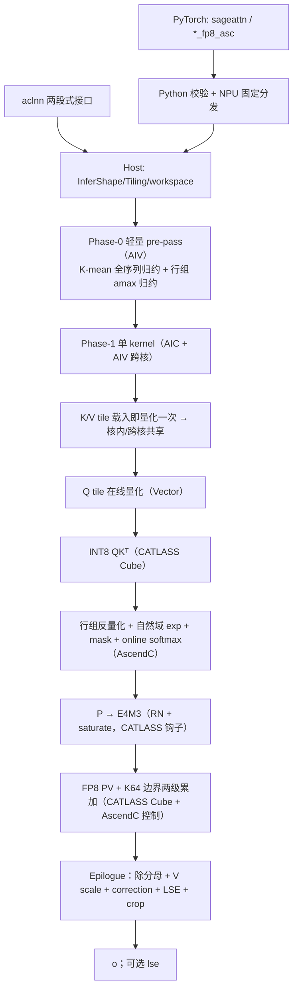
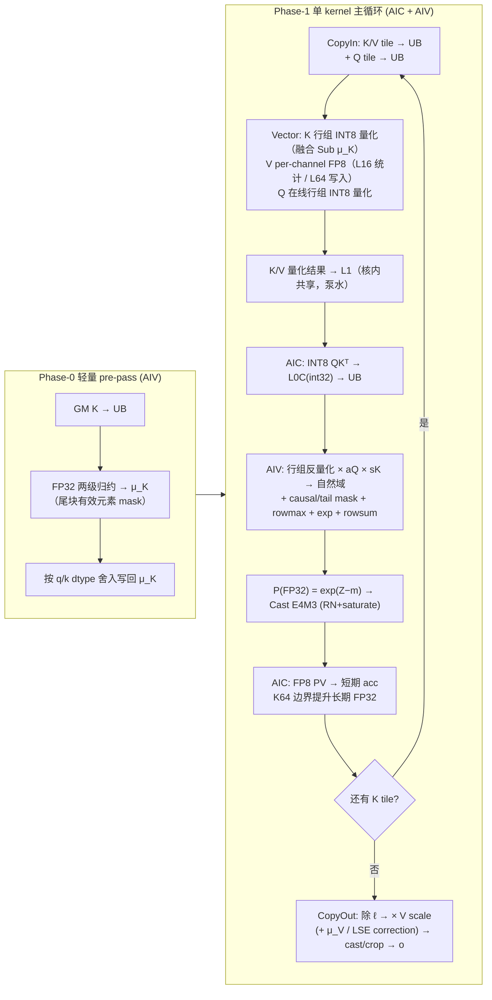

# SageAttention2 算子设计文档

| 项 | 内容 |
| --- | --- |
| 文档版本 | **v0.4**（域决策收口**自然域**、精度口径如实化（L-A 主/L-B 辅）、实测数据剥离至 `EVIDENCE_NOTES.md`、K1 结构按 G-04 裁决改写、交付结构订正） |
| 日期 | 2026-09-11 |
| 状态 | 待内部评审（AF 预审 2026-09-12）→ 定稿后 PR 至 `cann-competitions` |
| 任务 | 社区任务 `08-11-sageAttention2`（Atlas 950PR，CANN 9.2.0-beta.1） |
| 交付合入 | `ops-transformer` 仓 `experimental/attention/sageattention2` |
| 提交路径 | `04_tasks/01_community-task-2026/tasklist/08-11-sageAttention2/<gitcode账号>/docs/design.md` |

> **阅读约定**
> 1. **本文档不承载实测数字**（评审硬要求：设计文档内不展示实测结果）。实测数据、口径明细与回填进度一律落在 `EVIDENCE_NOTES.md`（自验证报告素材）与任务包 `evidence/` 目录；本文档只保留**口径定义**与**空占位列**，凡未实测的数值一律写「待实测」，不给预测承诺。
> 2. 标记 **`【M1待测】`** 的位置是**待实测的弹性占位**：回填前不作为验收结论，回填进度见 `EVIDENCE_NOTES.md`。
> 3. **性能纪律**：在直测结果出来前，本文档**不给出任何具体 speedup 承诺**；所有收益相关结论均标注为待验证假设。
> 4. 本文档中「GPU golden」指 `sageattn_qk_int8_pv_fp8_cuda`（精度基准），「FIA」指 `ops-transformer` 的 `FusedInferAttentionScore`（性能基准）。二者用途不得混用。
> 5. **域表述约定**：本文档中凡出现「log2 域」的每一处，均指 **GPU golden / 开源 SageAttention2 的固有域** 或 **被否决的 log2 域备选方案**（**历史引述**）——**本设计内部一律自然域（底 $e$）**，依据与契约见 §3.1.2 / AD-03。

---

# 一、需求背景（required）

## 1.1 需求来源

社区任务《sageAttention2 算子开发任务书》要求参考开源 SageAttention2 的 **INT8 $QK^T$ + FP8 $PV$** 路径（精细粒度量化、两级累加、outlier smoothing），在 **Atlas 950PR** 上使用 **AscendC + CATLASS** 实现接口对标、功能对齐的量化注意力前向算子，验收通过后合入 `ops-transformer` 仓 `experimental/attention/sageattention2` 目录。

任务的硬性验收边界：

1. **范围**：仅 INT8 $QK^T$ + FP8 $PV$；不含 FP16 PV、varlen、Triton、反向、CUDA 同名符号（`*_cuda` / `*_sm90`）。
2. **接口**：必须交付 PyTorch `sageattn`、`sageattn_qk_int8_pv_fp8_asc` 与统一 FP8 PV 的 aclnn 入口，三者语义一致。
3. **实现约束**：Kernel 必须由 **AscendC 与 CATLASS 联合**实现，且设计文档须说明二者的模块边界、所用 CATLASS 组件与 Tiling 策略；不得以纯 Host 或与 AscendC/CATLASS 无关的实现作为主交付。
4. **精度**：**主口径为 L-A**（同 `qk_quant_gran`、同 `pv_accum_dtype`、同 smoothing 的 GPU `sageattn_qk_int8_pv_fp8_cuda` golden），**辅口径为 L-B 误差比例**（max≤2 / mean≤1.2 / RMSE≤1.2），并以 CPU FP32 SDPA **混合容差**（FP16 rtol/atol $2^{-9}$、BF16 $2^{-6}$、`matched_ratio ≥ 0.99`）作为基础门禁——即**任务书口径：L-A 主 / L-B 辅**（口径可达性见 §5.1「FP16 绝对容差可达性说明」）。
5. **性能**：相对同仓 **FIA**，**PyTorch 路径**（vs `torch_npu.npu_fused_infer_attention_score`）与 **aclnn 路径**（vs `aclnnFusedInferAttentionScoreV5`）**每条基准用例、每条路径均须 Speedup ≥ 1.6×**，且两条路径各自的全用例几何平均亦须 ≥ 1.6×。

## 1.2 背景介绍

### 1.2.1 现状分析：为什么必须自研量化粒度

SageAttention2 的加速来源是**低位宽 + 精细粒度量化**：Q/K 走 INT8 对称量化（per-warp / per-thread 行组），V 走 FP8 E4M3 per-channel 量化，P 在 softmax 后量化为 FP8，PV 走低精度 MMA 加两级累加抑制误差累积。

NPU 侧的现状与差距：

| 能力 | AscendC / CATLASS 现状 | 差距 |
| --- | --- | --- |
| INT8 $QK^T$ | `ElementAccumulatorSelector<int8_t,int8_t> = int32_t` 已就绪；`examples/51` 有 INT8 分组量化 matmul（PER_GROUP/PER_BLOCK + dequant epilogue） | **无 FA 形态的 INT8 实例**；FA 的 QK dispatch 未验证过 INT8 实例，须独立编译探针 |
| 量化粒度 | 高阶量化枚举为 `PER_TENSOR / PER_CHANNEL / PER_TOKEN / PER_GROUP`；`CopyL0CToUBTla` 的 `ScaleGranularity{NO_QUANT, PER_TENSOR, PER_CHANNEL, PER_GROUP}` | **无同名 `per_warp` / `per_thread`，也无「行组（4/16/32/64 连续或 stride-8 行）」粒度** → 必须用 AscendC Vector 自研 |
| FP8 $PV$ | `MmadFAIPV` + `TileMmadTla`；`helper.hpp` 在 `CATLASS_ARCH==3510` 下将 `ElementAccumulatorSelector<float8_e4m3_t,float8_e4m3_t>` 特化为 `float` | Cube 通路可用；**无 FP16 累加器** → 默认 `fp32+fp16` 必须数值仿真 |
| P → FP8 | `EpilogueAscend950FASoftmax<mask, ENABLE_P_SCALE>` 已内置「exp → (可选 ×pScale) → Cast E4M3(RN + saturate)」，Cast trait 为 `castTraitRintZero/RintTwo` | **现成可用**：**默认形式 ①**（`ENABLE_P_SCALE=false`，偏置折进 $m$）；**备选形式 ②**（`ENABLE_P_SCALE=true` + `pScaleValue=447.89`）——两者**禁止叠加**。Cast 语义与 GPU `cvt.rn.satfinite.e4m3` 一致 |
| Online softmax | `block_epilogue_fa_softmax_ascend950.hpp`(485 行) + `block_epilogue_fa_rescale_o_ascend950.hpp`(204 行)：ReduceMax → ExpSub → rowsum → Div | 可复用；但 `ExpSub` 的底数是 **e**（CANN 头文件明文档），与开源 **log2 域** 相反（**历史引述**：开源 GPU golden 为 log2 域；本设计 v0.4 终裁**自然域**，见 §3.1.2）→ 必须显式决策 |
| LSE 输出 | 基础 FA epilogue **无 LSE**；`EpilogueAtlasA5RescaleO<LseMode::LSE_OUT>`（`ascend950_rain_fusion_attention`）、`EpilogueAtlasA2XFAIOnlineSoftmax<LSE_MODE>` 有 | 需移植 + 验证，不能宣称开箱即用 |
| FP8 FA 完整参考 | `experimental/attention/ascend950_fp8_mx_flash_attention_infer/`（完整 FP8 FA，含 Q/K/V=E4M3、含 P 静态量化开关、含 MX scale 搬运） | **最接近的脚手架**；但 MX 的 scale 粒度是 E8M0/32 元素（2 的幂），与 Sage 的 fp32 行组/per-channel scale **结构不兼容** → scale 管线必须整体替换 |
| 性能计时 | example 49 只打印 `Compare success.` / `Compare failed. Error count: N`，**无耗时字段、无 `--perf` 开关** | 须自建计时（host chrono + `aclrtSynchronizeStream`，或统一走 msprof） |

**结论**：零件齐全但**不是即插即用**。可复用约 60~70%（FA 骨架 + softmax/rescale + FP8 P/V Cube），必须自建约 30~40%（行组量化与反量化、`fp32+fp16` 仿真、LSE、计时）。因此本设计的核心不是「造轮子」，而是**在既有骨架上把量化开销藏进主循环流水**。

### 1.2.2 竞争格局与差异化定位（公开情报，本地 git log / issue）

| 编号 | 团队 | 架构 | 量化位置 | 实测结论 |
| --- | --- | --- | --- | --- |
| #4520 | Elyen41 | **三算子链**（KMean / Quant / Attention） | Q/K/V 全部独立 pre-kernel | P-06 2.400 ms vs 预算 0.543 ms = **4.4×**，主 kernel 1.924 ms；自述「局部调度已到工程边界」→ 出局 |
| #5154 | G_W_E | **3 内部 kernel**（Stats / Quant / Core） | K/V Vector 独立 pre-kernel | P-01 **1.485×**、P-03 1.474×、P-06 1.358×；S≥8192 达 1.975~2.664×。自述量化占全 kernel **21.6%**（Stats 48.2μs + Quant 84.2μs） |

对 13 份已合入竞争者设计文档逐份通读后的三条关键结论：

1. **0/13 把 K/V 的 stats+quant 放进 FA 主循环**——全部止步于「K/V 预量化 + Q 在线量化」（L1 层级），融合路线存在**未被占据的架构空白**。
2. **0/13 给出实测性能数字**（性能栏一律「待实测」）。因此本文档**不引用竞争者的收益推断**，所有收益相关结论必须由本团队自己的 profiler 数据支撑。
3. `per_warp` / `per_thread` 的数学语义已被 3 份文档独立算对，且与本团队从 Triton 源码反推的结果一致 → **该部分是体力活而非技术风险**。

**差异化定位（本设计的立论）**：Elyen41 的 4.4× 与 G_W_E 的 21.6% 从两端证明了同一件事——**K/V 量化开销是唯一的决胜项**。本设计选择「量化与 Attention 在**同一 kernel 内**跨核/跨 wave 重叠」的单 kernel 全融合方向，目标是**削掉那 21.6%**，而不是在 pre-kernel 内部做微优化。

> ⚠️ **风险前置声明（对应 §6.3 R1）**：融合收益的量化幅度以 M1 micro-benchmark 实测为准；M1 结果用于在「直接低精度收益」与「架构级重构增强」两条主攻路径间做工程决策（见 AD-08），两路均以任务书 1.6× 门禁为唯一目标。

### 1.2.3 基线来源说明

| 基线层次 | 来源 | 设计用途 |
| --- | --- | --- |
| 功能 / API 基线 | SageAttention `main` / PyPI `sageattention==2.2.0` 的 `core.py` | 对齐 `sageattn`、`sageattn_qk_int8_pv_fp8_cuda` 的签名、默认值、warning、返回值与分发语义 |
| 量化语义基线 | `sageattention/quant.py`、`sageattention/triton/quant_per_thread.py`、`csrc/fused/fused.cu` | 锁定 per_warp/per_thread 分组、epsilon、舍入、饱和、V per-channel FP8、`scale_max` |
| 两级累加基线 | `csrc/qattn/*_accum_f32_*` / `*_accum_f32_fuse_v_scale_attn_inst_buf.cu` / `*_f8_accum_f16_fuse_v_scale_attn_inst_buf.cu`、`attn_utils.cuh` | 锁定 K32/K64 归并边界与短期 buffer 语义 |
| Kernel 复用基线 | CATLASS `examples/49`（FA）、`examples/51`（INT8 分组量化）、`examples/53`（MXFP8）、`examples/62`（per-block 量化 epilogue）、`examples/70`（chunk prefill）、`experimental/attention/ascend950_fp8_mx_flash_attention_infer` | 骨架、Cube 主循环、epilogue 范式、chunk 级调度 |
| 精度标准 | opbase《生态算子开源精度标准》`experimental_standard.md` + 任务包 `sageAttentionTest` | 混合容差、L-B 比例、AscendOpTest 口径 |
| 性能基线 | `ops-transformer` `attention/fused_infer_attention_score/` | PyTorch 对比 `torch_npu.npu_fused_infer_attention_score`；aclnn 对比 `aclnnFusedInferAttentionScoreV5` |

---

# 二、需求分析（required）

## 2.1 需求描述

在 Atlas 950PR / CANN 9.2.0-beta.1 上，用 AscendC + CATLASS 实现 **INT8 $QK^T$ + FP8 $PV$** 的前向量化注意力算子：

$$
O = \operatorname{softmax}\!\left(QK^\top \cdot s\right)V,\qquad s = \texttt{sm\_scale}\ (\text{默认 } 1/\sqrt{D_{og}})
$$

其中 $Q$、$K$ 经 outlier smoothing 后量化为 INT8，$V$ 量化为 FP8，$P$ 在在线 softmax 后量化为 FP8，PV 走低精度 MMA 并施加两级累加；输出 $O$ 与可选 LSE。**不物化全量 $[B,H_q,S_q,S_k]$ attention 矩阵。**

## 2.2 需求拆解

1. **支持数据类型**：输入 `q/k/v` 为 FP16 或 BF16（三者同 dtype、同 device、末维连续）；输出与 `q` 同 dtype；可选 `lse` 为 FP32。中间态为 INT8（Q/K）、FP8 E4M3FN（V/P）、FP32（score / m / l / 长期 O 累加器 / 各类 scale）。
2. **支持功能**：
   1. `qk_quant_gran`：`per_thread`（默认）/ `per_warp`，**算法分组语义对齐 GPU 同配置**；AscendC 无同名枚举 → 自研 Vector 量化。
   2. `pv_accum_dtype`：`fp32` / `fp32+fp32` / `fp32+fp16`（默认，也是功能与性能必测配置）三条路径**均须真实现**（500 条精度用例中 `fp32+fp16` 307 条、`fp32` 96 条、`fp32+fp32` 96 条）。
   3. `smooth_k`（默认 True，含 GQA `lse_correction` 广播）与 `smooth_v`（可选；两级累加模式下 warning 后忽略）。
   4. `return_lse`：返回 $[B,H_q,S_q]$ FP32 的 logsumexp，语义 `lse / 1.44269504 (+ lse_correction × sm_scale)`。
   5. `head_dim` pad：$0<D\le128$；$D<64$ → pad 64，$64<D<128$ → pad 128，$D>128$ 报错；输出裁回 $D_{og}$。
   6. GQA（$H_q \bmod H_{kv}=0$）、非因果 $S_q \ne S_k$、因果（仅 $S_q=S_k$）、HND/NHD 布局。
   7. `sageattn` 在 NPU 上固定分发到 `sageattn_qk_int8_pv_fp8_asc`；不支持非空 `attn_mask`（须报错）。
3. **性能**：P-01~P-07（实测 14 条）每条、每路径 ≥1.6× FIA；两条路径几何平均均 ≥1.6×。
4. **精度**：满足《生态算子开源精度标准》混合容差 + 任务包双层策略（L-A 可选 / L-B 辅）。
5. **实现约束**：AscendC + CATLASS 联合；量化与 Attn 主循环**优先融合或分 stage 流水**，Host 侧仅做必要预处理。
6. **交付**：`experimental/attention/sageattention2` 完整算子代码 + 双接口（aclnn / PyTorch）+ 测试 + README + 自验证报告。

## 2.3 外部组件依赖

| 组件 | 版本 | 用途 | 约束 |
| --- | --- | --- | --- |
| CANN | 9.2.0-beta.1 | 编译、运行、aclnn、性能验收 | 性能报告须记录完整版本；9.1.0 仅用于量级判断 |
| AscendC | 随验收 CANN | Vector 量化、smooth、online softmax、两级累加控制、LSE、epilogue | 不作为纯 Host 实现 |
| CATLASS | `experimental/attention/sageattention2` 内固定子模块 commit【M1待测】 | INT8 QK / FP8 PV 的 Cube 主循环、Layout/Tile/Mmad | 版本随代码提交固定并写入 README |
| PyTorch / torch_npu | 验收环境版本 | PyTorch 适配、`torch.npu.Event` 计时、FIA PyTorch 基线 | 记录实际 FIA API 名与版本 |
| AscendOpTest | 验收环境版本 | 功能、异常、精度验证 | 用例与复现步骤随代码交付 |
| GPU SageAttention | `main` / 2.2.0 | L-A 同路径同超参 golden | 不作性能门禁 |
| msprof | 随 CANN | kernel 级耗时与 cube/vector/fixpipe 计数器 | 与 `npu.Event` 口径分别记录，不混用 |

Host 侧只负责参数校验、Tiling、workspace 规划与 kernel 编排，**不执行任何 Attention 数值计算**；输入布局转换不在 Host 做全量 permute（见 AD-04）。

## 2.4 算子接口原型

### 2.4.1 PyTorch 接口

```python
from typing import Any, Optional, Tuple, Union
import torch

def sageattn(
    q: torch.Tensor,
    k: torch.Tensor,
    v: torch.Tensor,
    tensor_layout: str = "HND",
    is_causal: bool = False,
    sm_scale: Optional[float] = None,
    return_lse: bool = False,
    **kwargs: Any,
) -> Union[torch.Tensor, Tuple[torch.Tensor, torch.Tensor]]: ...

def sageattn_qk_int8_pv_fp8_asc(
    q: torch.Tensor,
    k: torch.Tensor,
    v: torch.Tensor,
    tensor_layout: str = "HND",
    is_causal: bool = False,
    qk_quant_gran: str = "per_thread",
    sm_scale: Optional[float] = None,
    pv_accum_dtype: str = "fp32+fp16",
    smooth_k: bool = True,
    smooth_v: bool = False,
    return_lse: bool = False,
    **kwargs: Any,
) -> Union[torch.Tensor, Tuple[torch.Tensor, torch.Tensor]]: ...
```

参数名、类型、默认值、返回值语义与开源 `sageattn_qk_int8_pv_fp8_cuda` **逐项对齐**，仅函数名后缀由 `*_cuda` 改为 `*_asc`。

`kwargs` 下沉解析优先级：**显式 kwargs > 环境变量（`SAGEATTN_PV_ACCUM_DTYPE` 等）> 默认值**；`attn_mask` 非 `None` 必须报错；非法枚举值列出合法集合并报错，**不得静默回退**。全部 kwargs / 环境变量须在 README 文档化。

### 2.4.2 aclnn 接口

采用「计算 workspace + 执行」两段式，与 PyTorch 路径共享同一 OpExecutor、Tiling 与 Kernel，避免双实现数值分叉。**以下签名为已实现的契约（host 侧单一事实源 `op_host/sage_attention2.h`，与 `aclnn/README.md` 逐字一致）**：

```c
aclnnStatus aclnnSageAttention2GetWorkspaceSize(
    const aclTensor  *query,
    const aclTensor  *key,
    const aclTensor  *value,
    const aclTensor  *attentionMaskOptional,  /* 预留槽位：必须为 nullptr（TC-08④ 唯一落点） */
    int64_t           tensorLayout,           /* int64 枚举：0=HND（默认）1=NHD */
    bool              isCausal,
    int64_t           qkQuantGran,            /* int64 枚举：0=per_thread（默认）1=per_warp */
    double            scaleValue,
    int64_t           pvAccumDtype,           /* int64 枚举：0=fp32+fp16（默认）1=fp32 2=fp32+fp32 */
    bool              smoothK,
    bool              smoothV,                /* 有效值：两级累加档下按 false 处理（warn 在 PyTorch 层） */
    bool              returnLse,
    const aclTensor  *attentionOut,
    const aclTensor  *softmaxLseOptional,
    uint64_t         *workspaceSize,
    aclOpExecutor   **executor);

aclnnStatus aclnnSageAttention2(
    void             *workspace,
    uint64_t          workspaceSize,
    aclOpExecutor    *executor,
    const aclrtStream stream);

/* 本算子自持 executor 的释放接口（框架不会代为释放；见 aclnn/README.md §7 / §8.3 D3） */
aclnnStatus SageAttention2DestroyExecutor(aclOpExecutor *executor);
```

**与早期草稿的三处有意偏差**（均由 `aclnn/README.md` §8.3 记录并经主线程裁决保留）：

| 偏差 | 内容 | 依据 |
| --- | --- | --- |
| **D1** | 三个属性 `tensorLayout` / `qkQuantGran` / `pvAccumDtype` 由 `const char*` 改为 **int64 枚举** | 与 aclnn/V5 的 int64 枚举惯例一致、无字符串生命周期与解析开销、非法值可枚举校验（`aclnn/README.md` §1.1/§2） |
| **D2** | 新增预留输入 **`attentionMaskOptional`** | 给 TC-08④（非空 mask 必须报错）一个**唯一可机器验证的落点**，避免调用方把 mask 塞进别处而静默算错 |
| **D3** | 新增公开函数 **`SageAttention2DestroyExecutor`** | 本骨架的 executor 由算子**自持**（不走 opdev 宏框架），必须显式释放；迁移路径见 `aclnn/README.md` §7 SEAM-1 |

`sm_scale=None` 由 PyTorch 适配层换算为 $1/\sqrt{D_{og}}$ 后传入 `scaleValue`；aclnn 调用方始终传有限值。`returnLse=false` 时 `softmaxLseOptional` 必须为空，`true` 时必须提供 FP32 `[B,Hq,Sq]` 输出。字符串↔枚举的换算只允许经 `TensorLayoutFromString` / `QkQuantGranFromString` / `PvAccumDtypeFromString` 一处完成（两路径语义对齐点唯一）。

### 2.4.3 输入、输出与属性约束

| 名称 | 类别 | dtype / 取值 | HND shape | NHD shape | 说明 |
| --- | --- | --- | --- | --- | --- |
| `q` | 输入 | FP16 / BF16 | `[B,Hq,Sq,D]` | `[B,Sq,Hq,D]` | 末维连续，`stride(-1)==1` |
| `k` / `v` | 输入 | 与 q 相同 | `[B,Hkv,Sk,D]` | `[B,Sk,Hkv,D]` | 同 dtype、同 device |
| `tensor_layout` | 属性 | `HND` / `NHD` | — | — | 大小写敏感，非法值报错 |
| `is_causal` | 属性 | bool | — | — | true 时要求 `Sq == Sk` |
| `qk_quant_gran` | 属性 | `per_thread` / `per_warp` | — | — | 精度 golden 必须同配置 |
| `sm_scale` | 属性 | `None` / 有限浮点 | — | — | `None` → $1/\sqrt{D_{og}}$（pad **前**原始维度） |
| `pv_accum_dtype` | 属性 | `fp32` / `fp32+fp32` / `fp32+fp16` | — | — | 默认 `fp32+fp16` |
| `smooth_k` | 属性 | bool | — | — | 默认 true；影响 LSE correction |
| `smooth_v` | 属性 | bool | — | — | 两级累加下 warning 后忽略 |
| `return_lse` | 属性 | bool | — | — | false 返回 `o`；true 返回 `(o, lse)` |
| `attentionOut` | 输出 | 与 q 相同 | `[B,Hq,Sq,D_og]` | `[B,Sq,Hq,D_og]` | 内部 pad，输出裁回 |
| `softmaxLse` | 可选输出 | FP32 | `[B,Hq,Sq]` | `[B,Hq,Sq]` | 不随输入布局改变 |

公共约束：$B,H_q,H_{kv},S_q,S_k$ 为正整数；$H_q \bmod H_{kv}=0$；$0<D\le128$；Q/K/V 同 dtype 同 NPU。Host 侧对 shape 乘积与 workspace 大小使用 **64 位安全计算**并检查溢出。

## 2.5 交付件与目录结构

目录结构同时满足「任务书建议目录」与「`cann-competitions` README 硬目录要求」（`docs/design.md`、`docs/aclnn{OpName}.md`、`examples/`、`op_host/`、`op_kernel/`、`CMakeLists.txt`、`README.md` 均为**必填**；`op_api/`、`tests/` 可选）：

```text
experimental/attention/sageattention2/     # 本任务交付根目录
├── CMakeLists.txt                         # [硬] 构建入口
├── README.md                              # [硬] 交付根说明：安装/接口/**分发与覆盖文档化**（默认分发语义 + kwargs/env 覆盖优先级与全部取值）/限制/示例
├── docs/
│   ├── design.md                          # [硬] 本设计文档
│   ├── aclnnSageAttention2.md             # [硬] aclnn API 文档
│   └── self_test_report.md                # [待交付] 自验证报告（截图三件套随报告）
├── op_host/                               # [硬] OpDef / InferShape / InferDtype / Tiling / L0
│   ├── sage_attention2_tiling.h|cpp
│   └── sage_attention2_def.cpp
├── op_kernel/                             # [硬] Kernel 入口与实现
│   ├── sageattn_fp8/                      # 主 Attention kernel（AscendC + CATLASS 混合）
│   │   ├── sageattn_fp8_kernel.h          # fork 自 fai_kernel.h（4 槽环 + 跨核同步）
│   │   ├── sageattn_fp8_utils.h
│   │   └── catlass_traits.h               # 目标芯片 Layout/Tile/Mmad/元素类型特化
│   └── sage_attention2_entry.cpp
├── quant/                                 # 量化相关（Vector）——**根级目录**，对齐任务书建议结构（§交付件；不进 op_kernel/）
│   ├── sage_quant_qk_int8.h               # per_warp / per_thread 行组 INT8
│   ├── sage_quant_v_fp8.h                 # per-channel FP8 + L16/L64 双域
│   └── sage_kmean_reduce.h                # 轻量 pre-pass 归约
├── aclnn/                                 # [必选] aclnn 两段式接口
├── python/                                # [必选] PyTorch 适配层
│   ├── sageattention2/                    # 交付包（sageattn / *_asc；对应本设计 §2.4.1）
│   └── torch_interface/                   # aclTensor 转换与 stream 管理
├── examples/                              # [硬] aclnn smoke + 双路径 benchmark + SDPA 替换示例
│   ├── test_aclnn_sageattention2_smoke.cpp
│   ├── benchmark_aclnn_sageattention2_vs_fia.cpp   # [待交付] aclnn↔FIA 双路径 benchmark（依赖 9.2 环境与 FIA 可用性）
│   └── CMakeLists.txt
└── tests/
    ├── ut/op_host/                        # InferShape / Tiling Host UT
    ├── pytest/                            # 接入 sageAttentionTest 500 用例
    └── ascendoptest/                      # [待交付] GPU L-A golden 生成器与数据目录（依赖 GPU 环境）
```

> **`README.md`（交付根）的职责占位说明**：该文件是「**分发与覆盖文档化**」的唯一落点 —— 必须写明 ① NPU 上 `sageattn` 固定分发到 `sageattn_qk_int8_pv_fp8_asc` 的规则；② `kwargs` / 环境变量（`SAGEATTN_PV_ACCUM_DTYPE` 等）覆盖优先级的完整清单与默认值；③ 全部 warning 语义（含 `smooth_v` 按 false 处理）；④ 安装、构建、示例与常见错误。上表 [硬] 项为 `cann-competitions` 目录硬要求，[待交付] 项为设计已定、代码/报告待产出。

---

# 三、需求详细设计（required）

## 3.1 算子分析

### 3.1.1 数学公式

#### 符号定义

将 HND/NHD 输入统一规范化为逻辑视图：

$$
Q\in\mathbb{R}^{B\times H_q\times S_q\times D},\qquad
K,V\in\mathbb{R}^{B\times H_{kv}\times S_k\times D}
$$

GQA 分组数 $g=H_q/H_{kv}$，Query 头 $h_q$ 对应的 KV 头为 $h_{kv}(h_q)=\lfloor h_q/g\rfloor$。

#### K smoothing 与 LSE 校正

`smooth_k=True` 时：

$$
\mu^K_{b,h,d}=\frac{1}{S_k}\sum_{j=0}^{S_k-1}K_{b,h,j,d},\qquad
\widetilde K_{b,h,j,d}=K_{b,h,j,d}-\mu^K_{b,h,d}
$$

对任意 Query 行，$Q\mu_K^\top$ 对所有 Key 位置是同一常量，因此

$$
QK^\top=Q\widetilde K^\top+c,\qquad
c_{b,h_q,i}=\left\langle Q_{b,h_q,i,:},\ \mu^K_{b,h_{kv}(h_q),:}\right\rangle
$$

Softmax 输出不受该常量影响（主循环只用 $\widetilde K$），但 **LSE 必须补回校正项**。

**参考舍入语义（关键，易被忽略）**：GPU 参考并非把实数点积保留为 FP32，而是先由 `q` 与**同 dtype** 的 K mean 做一次 `matmul`，结果**按输入 dtype 舍入**后再转 FP32。因此定义参考等价校正值

$$
c^{ref}_{b,h_q,i}=\operatorname{cast}_{FP32}\!\left(R_{dtype(Q)}\!\left(\left\langle Q_{b,h_q,i,:},\mu^K_{b,h_{kv}(h_q),:}\right\rangle\right)\right)
$$

其中 $R_{dtype(Q)}$ 表示一次 FP16/BF16 `matmul` 输出舍入。**NPU 内部可用 FP32 累加，但写入 LSE 前必须复现这一次舍入**，否则 L-A 的误差比例判据会被这一个因子拖累。GQA 下通过 $h_{kv}(h_q)$ 映射实现与 `repeat_interleave` 等价的广播，**不在 GM 中物化重复均值**。

#### Q/K INT8 量化：per_warp 与 per_thread 的精确语义

两种粒度共用对称 INT8 思路，但 **epsilon 位置与舍入细节不同**，NPU 必须按模式保留差异：

$$
s_G^{warp}=\frac{\max\!\left(10^{-7},\ \max_{x\in G}|x|\right)}{127},
\qquad
\widehat x^{warp}=\operatorname{sat\_round\_nearest}\!\left(\frac{x}{s_G^{warp}}\right)
$$

$$
s_G^{thread}=\frac{\max_{x\in G}|x|}{127}+10^{-7},
\qquad
\widehat x^{thread}=\operatorname{clip}\!\left(\operatorname{trunc}\!\left(\frac{x}{s_G^{thread}}+0.5\operatorname{sign}(x)\right),-128,127\right)
$$

即 `per_warp` 用 **round-to-nearest + saturate**（且下界保护在分子），`per_thread` 用「**加正负 0.5 后转 INT8**」（epsilon 加在 scale 上）。**饱和界 = int8 值域 $[-128,127]$**（CUDA 路径 `cvt.rni.sat.s8.f32` 的饱和语义；Triton 路径只做 `.to(int8)`，无额外 clamp——已在开源 `triton/quant_per_thread.py` 核对，本设计与 `quant.py` 统一到此界）；`127` 只作为**量化除数**出现（$s=\text{amax}/127$），**不是** clip 上界。两种模式**分别与各自 GPU golden 比对**，不要求彼此逐位相同。

参考分组以 $M=128$ 的 Q tile、$N=64$ 的 K tile 为基础（下表为**不可变语义**，NPU 物理 lane 排布可调）：

| 模式 | Q scale 分组 | K scale 分组 | 每个 Q128 / K64 tile 的 scale 数 |
| --- | --- | --- | --- |
| `per_warp` | Q128 内 **4 个连续 Q32 组** | K64 为一个组 | Q: 4；K: 1 |
| `per_thread` | Q32 内 **8 个 stride-8 交错组**；第 $r$ 组覆盖 $\{r,\,r+8,\,r+16,\,r+24\}$ 的全部 D 元素（**每组 4 行**） | K64 内 **4 个 stride-8 交错组**；第 $r$ 组覆盖 $\{2r+8t,\ 2r+1+8t;\ t=0..7\}$ 的全部 D 元素（**每组 16 行**） | Q: 32；K: 4 |

scale 张量逻辑形状（与竞争者独立算出的结果一致，本团队已从 Triton 源码复核）：

| 张量 | per_warp | per_thread |
| --- | --- | --- |
| Q | `[B, Hq, ceil(Sq/128) × 4]` | `[B, Hq, ceil(Sq/128) × 4 × 8]` |
| K | `[B, Hkv, ceil(Sk/64)]` | `[B, Hkv, ceil(Sk/64) × 4]` |

**三条必须记住的结论**：

1. **per_warp 与 per_thread 只在 Q 上不同；K 在两种粒度下完全一致**（都是 64 行一组）→ NPU 只需实现**一份** K 量化（64 行组 + 融合减均值），Q 量化才需要两套行组边界。
2. per_thread 的分组是 **stride-8 交错**（不是连续行）。若为搬运便利改写成「连续 4/16 行一组」，会**改变 scale 覆盖集合 → 精度对齐失败**。本设计的决策是**按 stride-8 精确复现**（方案 A，见 AD-05），物理 lane 排布可在 Vector 侧用 `Gather/Scatter` 或 stride 描述符表达。
3. **尾块冻结语义（已收窄）**：**Q/K 侧越界行已知** —— CUDA `QuantInt8Kernel` 用 `if (thread_base_token < num_tokens)` 显式把越界行写 0 并**按 0 参与 amax**（`csrc/fused/fused.cu:110-144`，见 `ref_gpu_kernel_dataflow.md` §7.2-5）；**V 侧越界键 = 0**（`TransposePadPermuteKernel` 以 `pad_zero=true` 写满 `[S_k, L64)`）。**仅 Triton `triton/quant_per_thread.py` 的 masked load `other` 未显式给出** → 只有该路径待定，须先用 $S=31/32/33,\ 63/64/65,\ 127/128/129$ 的边界 golden 确认。【M1待测】

#### V FP8 量化（L16 / L64 双域）

V 按 $[B,H_{kv},D_p]$ 的**每个通道**沿序列维求动态 scale。为精确对齐参考尾块语义，先定义两个上取整边界：

$$
L_{16}=round\_up(S_k,16),\qquad L_{64}=round\_up(S_k,64)
$$

$$
\bar V_{b,h,j,d}=\begin{cases}V_{b,h,j,d},&j<S_k\\ 0,&S_k\le j<L_{64}\end{cases}
$$

`smooth_v=True` 的有效路径（仅 `fp32` 累加）使用

$$
\mu^V_{b,h,d}=\frac{1}{L_{16}}\sum_{j=0}^{L_{16}-1}\bar V_{b,h,j,d},
\qquad V'=\bar V-\mu^V
$$

令 $M_v$ 为 `scale_max`，**统计域为 $L_{16}$、写入域为 $L_{64}$**：

$$
a^V_{b,h,d}=\frac{\max_{0\le j<L_{16}}|V'_{b,h,j,d}|}{M_v},
\qquad
\widehat V_{b,h,j,d}=\operatorname{cvt.rn.satfinite}_{E4M3FN}\!\left(\frac{V'_{b,h,j,d}}{a^V_{b,h,d}}\right),\quad 0\le j<L_{64}
$$

要点：

- `pv_accum_dtype="fp32+fp16"` → $M_v=2.25$；`fp32` / `fp32+fp32` → $M_v=448.0$。该值作为**累加模式 traits 的编译期配置**，由中间量化单测锁定，**不允许跨模式共用 golden**。
- $S_k$ 非 16 对齐时，$L_{16}$ 范围内的补零在中心化后为 $-\mu^V$，故 **amax 必须包含 $|\mu^V|$**；第二遍对**整个 $L_{64}$ 写入域**按 $(\bar V-\mu^V)/a^V$ 量化，不能把 smooth V 的尾位强行写零。
- amax=0 的退化通道：scale 与量化值**都置零**，避免参考实现中 `0*inf` 可能产生的 NaN。该 case 只验证有效输出数学等价，**不要求中间 FP8 bit pattern 对齐**；仅 amax>0 时逐位对齐。
- 内部 V 布局统一为 `[B,Hkv,Dp,L64]` 的 CATLASS 友好排布。若采用参考的 16 元素重排，方向固定为 `dst[16*b+r] = src[16*b+perm[r]]`，`perm=[0,1,8,9,2,3,10,11,4,5,12,13,6,7,14,15]`；亦可用 CATLASS arch35 FP8 Tile Copy 所需的**数值等价**布局，但须以逐元素单测分别检查有效区 / $L_{16}$ 尾区 / $L_{64}$ 尾区，并用 PV 单测证明布局方向正确。

#### INT8 QK、online softmax 与 FP8 PV

对第 $t$ 个 K tile，CATLASS Cube 先算 INT32：

$$
C_t=\widehat Q\widehat K_t^\top
$$

AscendC Vector 按行/列所属量化组反量化并施加 scale，得到 **自然域（底 $e$）score**（见 §3.1.2）：

$$
Z_{t,ij}=C_{t,ij}\cdot a^{Q}_i\cdot a^{K}_j\cdot s
$$

causal 场景令 $j>i$ 的元素为 $-\infty$；尾 tile 同样 mask。逐 K tile 维护行最大值、行分母与未归一化输出（均在自然域）：

$$
m_t=\max\!\left(m_{t-1},\ \max_j Z_{t,j}-6.1046\right),\qquad
m_0=-5\times10^{6},\qquad
\alpha_t=e^{\,m_{t-1}-m_t}
$$

$$
P_t=e^{\,Z_t-m_t}\ (=\ 447.89\cdot e^{\,Z_t-Z_{\max}},\ \text{饱和点}\ P_{\max}=447.89),\qquad
\ell_0=1.0,\qquad
\ell_t=\alpha_t\ell_{t-1}+\sum_j P_{t,j},\qquad
A_t=\alpha_t A_{t-1}+P_tV_t
$$

（$6.1046=8.807\ln 2$ 是 log2 域 $-\log_2 448$ 偏置的自然域等价量，$e^{-6.1046}=1/447.89$；**饱和绝对量 $P_{\max}=447.89=2^{8.807}$ 不随域改变**。）

**×448 偏置（硬契约，与 §3.1.2 一致）**：绝对量 $P_{\max}=447.89=2^{8.807}$，来自 GPU 把 $-\log_2 448$ 折进行最大值：`fmaf(m, sm_scale, -8.807)`（`attn_utils.cuh:379/437/450`）。自然域实现中该偏置的**等价量是 $-6.1046=-8.807\ln 2$**（$e^{-6.1046}=1/447.89$）→ **绝对量 $P_{\max}$ 不变，只换域表示**。**默认唯一取形式 ①；形式 ② 是备选实现形式，两者绝不可叠加**：

| 形式 | $m$ 的定义 | P 的得到方式 | 落点 |
| --- | --- | --- | --- |
| **① GPU 原生（唯一默认）** | log2 域 $m=Z_{\max}-8.807$ ⇔ **自然域 $m=Z_{\max}-8.807\ln 2$** | 直接 $e^{\,Z-m}$，**不乘任何 scale** | **本设计默认实现路径**（与 G-01c「SAT 不兜底、上界由构造保证」自洽），见 AD-07 |
| ② CATLASS 钩子（**备选**） | $m=Z_{\max}$（不含偏置） | `Muls(exp, exp, pScaleValue=447.89)`（`ENABLE_P_SCALE`） | 备选实现形式，见 §3.2.4 / AD-07 |

**①与②叠加即把 P 放大 $447.89^2\approx 2\times10^5$，必错（禁止叠加）**。该放大在 $\ell$ 与 $A$ 中同时出现、在 $O=A/\ell$ 中解析抵消，**但在 `cvt.rn.satfinite.e4m3` 处不抵消**（e4m3 的次正规门限 $2^{-9}$ 与饱和点 $448$ 是绝对量）→ 不复现该放大则 P 的 FP8 逐位对齐必败。LSE 侧按形式 ① 口径取 $m$（形式 ② 下用 $m_T-8.807\ln 2$），见 §3.1.2。

**行状态初值契约**：$m_0=-5\times10^6$（GPU 同构，`attn_utils.cuh:314/342` 的 mask 哨兵常量）、$\ell_0=1.0$（`...sm89.cuh:165-167`）。首迭代 $\alpha_1=2^{\,m_0-m_1}=0$ 会把 $\ell_0$ 清零、再由 `accumulate_d` 填充，故初值在正常路径不可见；但在**全 mask 行**（$S_q$ 尾部越界行）或 $S_k=0$ 的退化输入上，初值直接决定输出。

**关键细节**：$\ell_t$ 必须用 **FP32、E4M3 cast 之前**的 $P_t$ 做 row-sum；另一路经 `cvt.rn.satfinite.e4m3` 转 FP8 后才送入 FP8 PV 主循环。**不允许对 FP8 P 反量化后再累计分母**（那是自证循环，且与 golden 不等价）。历史输出按 $\alpha_t$ 重标定。全部 K tile 完成后按 $\ell_T$ 归一化、乘 V channel scale、可选加回 $\mu^V$，再转为 `q` 的 dtype。

该流程只保存当前 tile、行最大值、行分母与输出累加，**不分配 $O(S_q S_k)$ 中间张量**。

#### 两级累加

| `pv_accum_dtype` | 设计行为 | `smooth_v` |
| --- | --- | --- |
| `fp32` | FP8 MMA 结果**持续**归并到 FP32 输出累加器（精度优先） | 支持 |
| `fp32+fp32` | 每个 K64 tile 先在短期 FP32 instruction buffer 内累加，再加到长期 FP32 输出累加器 | warning 后忽略 |
| `fp32+fp16` | **语义上**每个 K64 tile 在短期 **FP16** accumulator 内累加，并在 **K64 边界提升到长期 FP32**；**默认验收路径** | warning 后忽略 |

`fp32+fp16` 的 `scale_max=2.25` 依据是 K64 同号项在**精确实数求和**下的范围设计：

$$
64\times 447.89\times 2.25=64512<65504
$$

**这只是一个范围设计依据，不是顺序 FP16 MMAD 舍入后「绝不溢出」的形式化证明**——64512 到 65504 仅有约 **1.54%** 余量。仿真方案与门禁见 §3.2.7。

#### LSE

内部 online softmax **本身就是自然对数域的 logsumexp**：$LSE_{ln}=m_T+\ln\ell_T$（$m$ 取形式 ① 的自然域偏置口径，见上）。对外**只加 correction，不再做 `/1.44269504` 换算**：

$$
LSE=LSE_{ln}+\begin{cases}c^{ref}\cdot s,&\texttt{smooth\_k=True}\\0,&\texttt{smooth\_k=False}\end{cases}
$$

即

```python
lse_out = m_T + log(ell_T)             # 内部即 ln 域 logsumexp，直接输出
if smooth_k:
    lse_out += lse_correction * sm_scale   # correction 本身在自然 logits 域
```

**与任务书 `lse / 1.44269504` 的关系（等价性声明）**：任务书 §2.3 的 `lse/1.44269504` 描述的是「**GPU golden 在 log2 域算出 LSE 后除以 $\log_2 e$**」这一换算链；本设计**直接产出 ln 域 LSE**，两者**数学等价**（log2 域值 $/\log_2 e$ ≡ ln 域值），仅**舍入路径不同**（少一次除法与一次底数折叠）。该差异以 **L-A 实测裁定**为准，不作逐位承诺。

注意顺序：correction 位于**自然对数域**，与内部 LSE 同域，故直接相加。`lse` 输出 shape 恒为 `[B,Hq,Sq]`、dtype FP32，不随输入布局改变。

### 3.1.2 工作域与 scale 语义声明（**本设计的强制契约**）

CATLASS FA 样例跑在**自然对数域**：`ExpSub` 的底数是 $e$（CANN 头文件 `kernel_operator_vec_binary_intf.h` 明文档），example 49 传 `scaleValue = 1/sqrt(headSize)`。开源 SageAttention2 的 **GPU golden** 跑在 **log2 域**（`sm_scale *= 1.44269504` 后折进 Q scale，softmax 用 `exp2`；**历史引述**）。

**本设计的决策（v0.4 终裁）：内部全程自然域（底 $e$，`Exp` 直用），对外 LSE 直接输出 ln 域结果；只在一种域里做，不允许 kernel 分支混用。** 依据：**G-02 编译级证据确认 vf（MicroAPI）无 `Exp2`**（见下「附带前提」），log2 域净负 1 条/score 元素而无对齐收益。域与 scale 语义显式声明如下：

| 环节 | 语义（**自然域契约**） |
| --- | --- |
| Q 量化 scale 张量 | $s^{Q}=$ per_warp/per_thread 行组 scale（**不含** `sm_scale`，与 GPU 一致：`fused.cu:752`/`quant_per_thread.py:89` 均不折） |
| Q 反量化有效 scale | $a^{Q}_i = s^{Q}_i \times sm\_scale$ ← **`sm_scale` 直接折进这里、不乘 `1.44269504`**（GPU 在 log2 域把两者一起折，`sm89_...cuh:90`；数学等价、舍入路径不同，L-A 实测裁定） |
| K 量化 scale 张量 | $s^{K}=$ 64 行组 scale（**K 的 quant kernel 不接 `sm_scale`**，与 GPU 一致） |
| score 域 | $Z = C^{int32}\cdot a^{Q}_i\cdot s^{K}_j$ **直接落在自然域**（**不乘 `1.44269504`**）；rank-1 结构按 lane 归属退化为**每 lane 一个标量**（GPU `:255-257` 同构），不产生 $S^2$ 级乘法遍历 |
| 行最大 $m$ | $m_t=\max\!\left(m_{t-1},\ \max_j Z_{t,j}-6.1046\right)$：自然域偏置 $6.1046=8.807\ln 2$ 对应 GPU log2 域的 `fmaf(m, sm_scale, -8.807)`（`attn_utils.cuh:379`），单调不减 |
| 行状态初值 | $m_0=-5\times10^6$、$\ell_0=1.0$（GPU `attn_utils.cuh` / `...sm89.cuh:165-167` 同构）；首迭代 $\alpha_1=e^{\,m_0-m_1}=0$ 将 $\ell_0$ 清零，故初值只在**全 mask 行**或 $S_k=0$ 的退化情形可见 |
| softmax 指数 | $P = e^{\,Z-m}$，$m=Z_{\max}-6.1046$ → $P_{\max}=447.89=2^{8.807}$（**×448 偏置是硬契约**：GPU 以 `fmaf(m, sm_scale, -8.807)` + `negative_m` 实现于 `attn_utils.cuh:379/437/450`，本设计以自然域等价量 $8.807\ln 2$ 复现**同一绝对量**）。**形式 ①（偏置折进 $m$、P 不乘任何 scale）为唯一默认**；形式 ②（$m=Z_{\max}$ 不含偏置 + epilogue `Muls(pScaleValue=447.89)`，CATLASS `ENABLE_P_SCALE`）为**备选实现形式，禁止与 ① 叠加**（叠加即 $447.89^2$ 双计，必错）。`cvt.rn.satfinite.e4m3` 的次正规门限与饱和点按**绝对量**判定，不复现该放大则 P 的 FP8 逐位对齐必败） |
| 归一化 | **延迟归一化**：per-K-tile 仅 $d \mathrel{*}= o\_scale$，$\div d$ 推迟到最终输出（`rcp.approx`，GPU `:400/:572`）；rescale 每 K-tile 至多一次（$o\_scale\le 1$）。**与域无关** |
| V scale/mean | $v\_scale$ 在 epilogue $O(S_kD)$ 级应用（PV÷d 之后，GPU `:575-597`）；$v\_mean$ 其后相加且**不被 $v\_scale$ 乘**（依据 $\Sigma P/\ell = 1$，`:599-621`）。**与域无关** |
| 两级累加 | 归并周期 = **64 键**（与 GPU `:896-991` 的 inst buffer 一致）；溢出界 $447.89 \times 2.25 \times 64 = 64512 < 65504$（FP16 上界），余量 1.5%——**该界与 ×448 偏置耦合（绝对量），二者必须同时复现或同时调整** |
| P cast | cast 前不**额外**乘 scale：形式 ① 的量程已由 $m$ 的自然域偏置完成放大。RN+satfinite（GPU `cvt.rn.satfinite.e4m3x2.f32`，`numeric_conversion.cuh:53-55`）；打包序 `{c0,c1,c4,c5}`（`attn_utils.cuh:487-490`） |
| LSE 内部 | $LSE_{ln} = m_T + \ln \ell_T$（**即 ln 域 logsumexp**），$m$ 取形式 ① 的自然域偏置口径（偏置在 P 与 $\ell$ 中精确抵消，GPU `:701` 同构）；若实现取形式 ②（$m=Z_{\max}$ 且 P 已 ×447.89），此处须用 $m_T-8.807\ln 2$ 或等价地减免该偏置 |
| LSE 对外 | $LSE_{ln}$ + correction×sm_scale（**免 `/1.44269504`**；与任务书 `lse/1.44269504` 换算链**数学等价**，见 §3.1.1「LSE」等价性声明） |

**为什么这样选（三条理由）**：

1. **G-02 编译级证据已钉死原（log2 域）方案的技术前提**：MicroAPI（`__simd_vf__`）侧**无 `Exp2`** → log2 域只能写成「`Muls(ln2) + Exp`」，每个 score 元素净增 1 条指令（相对满载 softmax 指令约 +5%），**却仍拿不到 GPU `exp2` 的舍入路径**（$e^{Z\ln2}$ 与 $2^{Z}$ 舍入过程不同）。
2. **自然域零额外指令、且与 CATLASS 原生骨架同域**：`ExpSub` 底数即 $e$，直接使用；$1.44269504$ 的 fold 从 $O(S_qS_k)$ 的 score 域彻底消失（任务书 §2.3 要求的「对外 LSE = `lse/1.44269504`」在 ln 域直接输出下**数学等价**满足，见 §3.1.1）。
3. **避免混域**：score / exp / LSE 三处**同域（自然域）**，correction 本身也在自然 logits 域相加 → 不存在跨域漂移点；若内部自然域而外面临时换算，反而引入额外转换误差。

**遗留检查项（不改变终裁）**：自然域与 GPU golden 的 log2 `exp2` **舍入路径不同**，差值以 **L-A 实测裁定**为准（G-02 的 `matched_ratio`/`R_max` 对比）；若实测显示自然域 ratio 不达标，回退形式的取舍须重开评审，不在此处预设。

**附带前提（证据等级 = 编译级 + 源码 grep；`【M1待测】`）**：MicroAPI（`__simd_vf__`）侧**无 `Exp2`**——依据是对 CANN `asc/include/basic_api/reg_compute/` 与 `asc/impl/basic_api/reg_compute/dav_3510/` **全目录 grep 未发现 `Exp2Impl`/`vexp2`**，只有底为 $e$ 的 `Exp`（`kernel_reg_compute_vec_unary_intf.h:45`）；`Exp2` 仅存在于 **SimT** 接口（`kernel_simt_transcendental_intf.h:119`，`Exp2Impl = PowImpl(2.0f,x)`，属**另一套执行模型**）。该前提即本设计选择自然域的直接依据（G-02 已完成，见 §6.1）。

### 3.1.3 支持数据类型

| 数据 | 公开 / 内部 dtype | 说明 |
| --- | --- | --- |
| q / k / v | FP16 或 BF16 | 三者必须相同；仅公开输入使用 |
| Q / K 量化值 | INT8 | 对称细粒度量化（per_warp / per_thread） |
| Q / K scale | FP32 | 按行组；形状见 §3.1.1 |
| V / P 量化值 | FP8 E4M3FN | V 按 channel；P 走 exp 后自然满量程 |
| V scale / V mean | FP32 | V mean 仅 `fp32` 累加 + `smooth_v` 路径存在 |
| QK Cube accumulator | INT32 | Vector 侧反量化为 FP32 score |
| score / m / l / 长期 O accumulator | FP32 | 保证 online softmax 与跨 tile 归并稳定 |
| 短期 PV accumulator | 语义 FP32 或 FP16 | 由 `pv_accum_dtype` 决定；**`fp32+fp16` 由仿真实现**（§3.2.7） |
| o | 与 q 相同 | 输出前 crop 到 $D_{og}$ |
| lse | FP32 | 可选 `[B,Hq,Sq]` |

### 3.1.4 支持形状

| layout | q | k / v | o | lse |
| --- | --- | --- | --- | --- |
| HND | `[B,Hq,Sq,D]` | `[B,Hkv,Sk,D]` | `[B,Hq,Sq,Dog]` | `[B,Hq,Sq]` |
| NHD | `[B,Sq,Hq,D]` | `[B,Sk,Hkv,D]` | `[B,Sq,Hq,Dog]` | `[B,Hq,Sq]` |

其中 $B,H_q,H_{kv}>0$、$H_q\bmod H_{kv}=0$、$0<D\le128$；非因果允许 $S_q\ne S_k$，因果要求 $S_q=S_k$。

## 3.2 算子实现

### 3.2.1 总体架构：单 kernel 全融合 + 轻量 pre-pass



设计要点：

1. **单 kernel 主循环承载量化**：K/V 的量化在**同一 kernel 内**完成，量化结果通过网络内共享而非 GM workspace 回流（省 GM 往返 + 跨核重叠），这是与 13 份竞争者（K/V 走独立 pre-kernel）的**架构分野**。
2. **Phase-0 只承担不可 tile-local 化的部分**：`smooth_k` 的 K-mean 是沿 $S_k$ 的**全序列归约**（$B\times H_{kv}\times D_p$ 个通道），天然无法 tile-local 化（aufw / Ethan_Zou / G_W_E 各自独立成 stage），因此保留一次**极轻的 pre-pass**。K/V 的行组 amax 归约**不放在这里**（它是 tile-local 的，随 tile 走流水）。
3. **Q 仍在主 kernel 内在线量化**（全行业共识，13/13 一致）。
4. **P → FP8 直接用 CATLASS 现成 epilogue**：`EpilogueAscend950FASoftmax<mask, ENABLE_P_SCALE>` + `castTraitRintZero`，**不需要自己写**（见 §3.2.4 / AD-07）。**默认形式 ①**：`ENABLE_P_SCALE=false`，P 的量程由 $m$ 的自然域偏置完成（不传 scale）；**备选形式 ②**：`ENABLE_P_SCALE=true` + `pScaleValue=447.89`（禁止与 ① 叠加）。

### 3.2.2 融合架构的正确姿势：避开 ×32 陷阱（对应 §6.3 R1）

**陷阱陈述**：主循环对 K/V 的读取次数为 $\lceil S_q/B_r\rceil$。以 P-01（$S_q=S_k=4096$、$B_r=128$）为例 = **32 次**。若把「K/V 量化」字面实现为「**每个 Q tile 进来时对当前 K/V tile 现量化**」，K/V 量化工作量会被 **×32**：以 G_W_E 实测的 132.4 μs 为基数外推 → **约 4 ms 量级**，直接判死。

**本设计的正确姿势（三个层次，禁止第一层）**：

| 层次 | 做法 | 结论 |
| --- | --- | --- |
| ❌ 禁止 | 每 Q tile 现量化 K/V | ×32 反噬，**架构红线，任何 TilingKey 不得走这条路** |
| ✅ 方案 A：核内复用 | 同一 $(b, h_{kv})$ 下的**多个 Q tile 分给同一核**，K/V tile 载入后**量化一次**，供该核负责的 $m$ 个 Q tile 复用（复用度 $m$，$\le \lceil S_q/B_r\rceil$） | 量化量 $O(B H_{kv} S_k D)$，与 $S_q$ **无关**（正确复杂度） |
| ✅ 方案 B：producer / consumer | 专用 AIV「KV-quant producer」组读 GM 原始 K/V → 量化 → 写 **L1/UB** 供 AIC 的 QK 直接消费，**省掉 int8/fp8 workspace 的 GM 往返**（P-01 为写 33.6 MB + 32 倍读的回流） | 融合的**真正价值 = 省 GM 往返**，不是省计算 |

**当前选择**：**A + B 组合**——核内按 $(b,h_{kv})$ 聚簇复用（A，保证不反噬），跨核通过加长流水做 producer/consumer 重叠（B，吃掉 Phase-1 的量化时延）。P-01 有 $B_1\times H_q32=32$ 个 Q-head 任务，天然可分组；AIC/AIV 不对称（AIV 侧核数多），量化可放在 AIV 而 QK/PV 在 AIC。

**必做的证伪实验（M1，1~2 卡时）**：①`Stats+Quant` 单独计时；②`Attention` 单独计时；③二者同 stream 背靠背（不重叠）；④二者分核/分 wave 并发。

- 若 ③≈④（无 overlap 收益）→ **融合的收益点不在重叠而在省 GM 往返**，架构立即改向方案 B；
- 若 ④ 能吃掉 ≥80% 的量化耗时 → 融合可行，按 A+B 推进。

该实验的结论决定 AD-01 的最终形态，**在结论出来前不宣称融合收益**。 【M1待测】

### 3.2.3 AscendC 与 CATLASS 模块边界

| 处理环节 | AscendC（Vector / 控制） | CATLASS（Cube / 模板） |
| --- | --- | --- |
| GM↔UB/L1 搬运、pad、尾块 | `DataCopy`、Vector 填零、有效行 mask | Layout/Tile 描述与主循环搬运协同 |
| K-mean 归约（Phase-0） | Vector Reduce + 尾块 FP32 归约 | — |
| Q/K INT8 量化（行组） | `Abs/ReduceMax/Muls/Round/Cast/Clip`，stride-8 分组 | — |
| V FP8 per-channel（$L_{16}/L_{64}$ 双域） | Vector 两遍：统计域 amax → 写入域量化 | — |
| INT8 $QK^\top$ | scale 准备、行组反量化、自然域 exp | `Gemm::MmadFAIQK<ArchTag, enablePaFlag>` + `BlockMmadTla` |
| mask 与 online softmax | `ReduceMax`/`exp`/`rowsum`/rescale | Tile 生命周期与同步点 |
| P → E4M3 | （已有） | `EpilogueAscend950FASoftmax<mask, ENABLE_P_SCALE>`（形式 ① 默认 `false` / 形式 ② 备选 `true`） |
| FP8 PV + 两级累加 | 短期 buffer 归并控制、K64 边界提升 | `Gemm::MmadFAIPV` + `TileMmadTla` |
| Epilogue | 除分母、V scale/mean、LSE correction、cast/crop | `EpilogueAscend950FARescaleO` |
| 跨核同步 | `CrossCoreSetFlag/WaitFlag<SYNC_MODE, PIPE_FIX\|PIPE_V\|PIPE_MTE1>` | 与 4 槽环流水编排一致 |

两个框架通过**显式 Pipeline Stage 与事件同步**协同（事件链 `SYNC_C1_V1_FLAG` → `SYNC_V1_C2_FLAG` → `SYNC_C2_V2_FLAG`，C1=QK、V1=softmax、C2=PV、V2=rescaleO；`CrossCoreSetFlag(..., 16+FLAG)` 为配对 AIV 的第二份事件，一 AIC 对两 AIV）。**禁止仅在构建文件中声明 CATLASS、实际主计算完全绕开 CATLASS**。

### 3.2.4 CATLASS 复用度清单（含具体到类型名的证据）

| 需要的能力 | CATLASS 现成资产 | 复用度 | 动作 |
| --- | --- | --- | --- |
| FA 主循环骨架 / 4 槽环 / 跨核同步 | `examples/49_ascend950_flash_attention_infer/fai_kernel.h`(618) + `fai_kernel_utils.h`(233) | ★★★★★ | **fork**，改 4 个旋钮：`ElementP/ElementV`、`Mmad*` policy、`TileCopy`、dtype |
| 在线 softmax（max/exp/sum/rescale/除分母） | `block_epilogue_fa_softmax_ascend950.hpp`(485) + `block_epilogue_fa_rescale_o_ascend950.hpp`(204) | ★★★★★ | 直接复用；`Div(divDstVreg, addVreg, expSumVreg)` + `Cast(..., CAST_ROUND)` |
| **P → FP8（RN saturate）** | `EpilogueAscend950FASoftmax<mask, ENABLE_P_SCALE>`；`ElementP=float8_e4m3_t` 时走 `ComputeExpSubSumFp8` 与 `Cast<ElementP,ElementS,(castTraitRintZero)>` | ★★★★★ | **默认形式 ①**：`ENABLE_P_SCALE=false`，P 的量程由 $m$ 的自然域偏置（$8.807\ln 2$）完成，**epilogue 不再乘 scale**；**备选形式 ②**：`ENABLE_P_SCALE=true` + `Muls(exp, exp, pScaleValue=447.89)`（**禁止与 ① 叠加**）。两种形式下 Cast trait 均与 `cvt.rn.satfinite.e4m3` 语义一致 |
| FP8×FP8 Cube（E4M3） | `MmadFAIPV` + `TileMmadTla` + `helper.hpp` 累加器特化 | ★★★★☆ | 已确认累加器 = `float`；参照 `examples/53` 与 `experimental/.../fp8_mx_flash_attention_infer` |
| FP8 FA 完整脚手架（含 P scale） | `experimental/attention/ascend950_fp8_mx_flash_attention_infer/`（同源副本 `tests/optest/kernels/72_...`） | ★★★★☆ | 当脚手架；**MX 的 E8M0/32 元素 scale 必须整体替换成 Sage 的 fp32 行组/per-channel scale** |
| INT8×INT8→INT32 $QK^\top$ | `ElementAccumulatorSelector<int8_t,int8_t> = int32_t` 已就绪；`examples/51`（PER_GROUP/PER_BLOCK dequant epilogue）、`examples/12`（per-token dequant） | ★★★☆☆ | **无 FA 形态 INT8 实例** → 必须先做「独立编译 INT8→INT32 QK 探针」 |
| 行组级 dequant（per_warp/per_thread） | `CopyL0CToUBTla<..., DEQUANT_GRANULARITY>` 仅支持 `NO_QUANT/PER_TENSOR/PER_CHANNEL/PER_GROUP` | ★☆☆☆☆ | **必须自研 AscendC Vector**（4/16/32/64 行组 + stride-8 交错） |
| V per-channel FP8 量化 | `examples/62`：`EpilogueAscend950PerBlockQuantTla<1>` + `TilePerBlockQuant<ArchTag,ElementC,ElementDst,ElementScale>` | ★★★☆☆ | per-block 量化 epilogue 范式可照此定制为 per-channel（沿 $S_k$） |
| `fp32+fp16` 两级累加 | **无**（累加器只有 FP32） | ☆☆☆☆☆ | **数值仿真，且默认开启**（验收路径）：FP32 partial → Cast FP16 → FP16 累加 → K64 边界提升（§3.2.7） |
| LSE 输出 | 基础 FA epilogue 无；`EpilogueAtlasA5RescaleO<LseMode::LSE_OUT>`（rain_fusion_attention）、`EpilogueAtlasA2XFAIOnlineSoftmax<LSE_MODE>` 有 | ★★☆☆☆ | 需**移植 + 验证**（跨代移植，不得宣称开箱即用） |
| chunk 级调度 / 两级归并边界 | `examples/70_ascend950_flash_attention_chunk_prefill`（自带 `fai_tiling.cpp`） | ★★★☆☆ | chunk 边界可复用为两级累加 / 归并边界 |
| 性能计时 | **无**（样例只打印 `Compare success.`） | ☆☆☆☆☆ | 自建 host chrono + `aclrtSynchronizeStream`，或统一走 msprof |
| 编译入口 | `bash scripts/build.sh 49_ascend950_flash_attention_infer -DCATLASS_ARCH=3510`；`experimental/` 须登记到 `examples/CMakeLists.txt` | ★★★★★ | 宏名是 **`3510`** 不是 `Ascend950` |

**总体复用度**：FA 骨架 + softmax/rescale + FP8 P/V Cube ≈ **可复用 60~70%**；行组量化/dequant、`fp32+fp16` 仿真、LSE、计时 ≈ **必须自建 30~40%**。

复用到的 CATLASS 类型（评审可核）：

| 角色 | 类型 |
| --- | --- |
| QK Mmad policy | `Catlass::Gemm::MmadFAIQK<ArchTag, enablePaFlag>`，`ElementA/B = int8_t`，S/accumulator = `int32_t` |
| PV Mmad policy | `Catlass::Gemm::MmadFAIPV<ArchTag, enablePaFlag>`，P/V = `float8_e4m3_t`（E4M3FN），长期 O = `float` |
| TileCopy（L0C→UB） | `Catlass::Gemm::Tile::PackedTileCopyTlaToUB<..., CopyL0CToUBMode::SPLIT_M>` |
| TileMmad | `Catlass::Gemm::Tile::TileMmadTla<ArchTag, ElementA, LayoutTagL1A>` |
| Softmax / Rescale | `Catlass::Epilogue::EpilogueAscend950FASoftmax<enableMaskFlag, ENABLE_P_SCALE>` / `EpilogueAscend950FARescaleO` |
| Block 封装 | `Catlass::Gemm::Block::BlockMmadTla` / `Catlass::Epilogue::Block::BlockEpilogue` |
| 资源与宏 | `Catlass::Arch::Resource<Catlass::Arch::Ascend950>`；编译宏 `CATLASS_ARCH=3510` |

### 3.2.5 Host 侧设计

#### ① tiling 策略

- **基线 L1TileShape：`tla::Shape<_128, _128, _128>`**（BR=128、BC=128、D(K)=128），来自 example 49 的硬模板；`L0TileShape = L1TileShape`。注意源码约束：`L1TileShape::K must be embedding`，即 $D$ 维必须等于 embedding。
- **逻辑归并边界 $N=64$ 与硬件 PV `L0TileShape.K=128` 的解耦**（核心难点）：两级累加的短期范围与 $N=64$ 绑定，每个 K64 tile 完成一次长期归并。而 CATLASS PV 的 `L0TileShape.K` 是 128 → 必须在**一次硬件 tile 内拆成两个逻辑 K64**，或改用 `actualK=64`。【M1待测】
  - 候选一：一次硬件 K128 拆两个逻辑 K64，分别在两个边界完成 denominator、online-softmax 与短期→长期归并；
  - 候选二：改用两个 `actualK=64` 的调用（需先验证模板支持）。
  - **任何合并为单个 K128 数值归并的方案，都必须先证明与 GPU 参考舍入等价，否则不允许启用。**
- **候选 tiling 表**（非验收结论，以 profiler 为准）【M1待测】：

| 场景 | 初始 Br 候选 | 初始 Bc 候选 | 关注点 |
| --- | --- | --- | --- |
| `Dpad=128` | 64 / 128 | 64 / 128 | 控制 UB/L1 占用并保持双缓冲 |
| `Dpad=64` | 64 / 128 | 128 / 256 | 提高 Cube 利用率与单次搬运复用 |
| causal / 尾块 | 继承上表 | 允许缩小一级 | 完全位于因果边界右侧的 KV tile 直接跳过 |

#### ② 分核策略

- **主任务空间**：`B × Hq × ceil_div(Sq, Br)`，每任务常驻一个 Q tile 顺序遍历所属 KV 头的全部 K64 tile。
- **K/V 量化复用分组（对应 §3.2.2 方案 A）**：按 $(b, h_{kv})$ 聚簇调度——同一 $(b,h_{kv})$ 下的 $g=H_q/H_{kv}$ 个 Q head 任务分配到**同一核**（或同一核组的连续 wave），使 K/V tile 的量化结果可跨 Q head 复用。$m$ 的取值（复用度）由 M1 实测确定。【M1待测】
- `blockDim = min(可用 AICore 数, 主任务数)`，grid-stride 均分；长序列下 Q tile 并行度充足，**无需跨核 split-K 归并**。
- **causal**：整块位于对角线右侧的 K tile 直接跳过（不发起 QK/PV），对角 tile 做元素 mask。
- GQA 仅改变 KV 头映射，不复制 K/V。
- 实测环境：950PR `aiv=56 / aic=28`（沿用既有 tiling 经验，新型号以平台查询值为准）。
- 若实测发现小 $B$ / 小 $H_q$ / 小 $S_q$ 并行度不足，可新增**带 split-K 的独立 TilingKey**；该路径必须实现 $(m,l,O)$ 的稳定跨核归并并单独完成精度/性能验证，**不得改变当前非 split-K 基线语义**。

#### ③ 数据分块与内存优化

- **UB / L1 / L0 预算表**（编译期静态容量检查 + Host 用平台查询值复核）：

| 缓冲 | 内容 | 层级 |
| --- | --- | --- |
| Q/K/V tile 双缓冲 | INT8 Q、INT8 K、FP8 V（量化后） | L1 ping-pong |
| L0A / L0B | 当前 MMAD 操作数（zN/nZ 变换后） | L0 |
| L0C | QK INT32 / PV FP32 partial | L0 |
| score / P / m / l / scale | FP32 score、E4M3 P、行状态、行组 scale | UB |
| 短期/长期 O 累加片段 | FP32 长期；`fp32+fp16` 另设 FP16 短期 | UB / L0C→UB 回写 |
| K/V 量化中间量 | 原始 dtype tile、减均值后值、行组 amax | UB |

- **D 维 pad 的零值不参与 amax**（有效 D mask），输出只写 `[0, D_og)`，故 pad 不改变输出 shape。
- **Bc 的容量与结构约束（G-04 裁决结论，**设计约束**而非实测结果）**：按 `catlass arch.hpp` 的 Ascend950 容量（**L0C 256KB / L0A 与 L0B 各 64KB / UB 248KB / L1 512KB**），Br=128、D=128 时 **Bc=256 的 L0C 需求 = QK `[128,256]int32`（128KB）+ PV `[128,128]fp32`（64KB）= 192KB/256KB**；双缓冲需每槽 ≤ 128KB、4 槽环需每槽 ≤ 64KB → **192KB 两者均不满足**（L0C 无法 ping-pong）；UB 侧 S tile `[64,256]fp32` = 64KB、P 16KB、O 32KB，双缓冲 192KB，叠加 m/l/行组 scale 与 K/V 量化中间量后逼近 248KB。G-04 实测已给出裁决：**Bc>128 不可用** —— ① UB 需求 297728B > 253952B 上限（溢出）；② L0B/L0C 占用均达 100%；③ **epilogue 硬编码 `n ≤ 128`，Bc>128 会静默丢列**（Compare failed 40%）；④ Bc=192 容量可放但另有未定位缺陷。**因此设计上排除 Bc>128**，改为**逻辑 256 宽 = 2×128 子块共享行级簿记**（容量零增量，见 §5.2.2 K1），并保留「回落 Bc=128 + 更激进的 D 族」作为兜底（该位置也是竞争者 Elyen41 记录「KV step 256 因 L0C 超限被否」的同一处）。
- 每个队列/事件必须成对释放；尾循环不得复用尚未完成的 buffer；不允许越过有效 tail 读写 GM。

#### ④ tilingkey 规划

TilingKey 仅编码会改变**编译模板或主循环结构**的维度，避免无意义组合爆炸：

| bit | 含义 |
| --- | --- |
| 0 | 输入/输出 dtype：0 = FP16，1 = BF16 |
| 1 | causal：0 = 否，1 = 是 |
| 2 | `qk_quant_gran`：0 = per_warp，1 = per_thread |
| 3~4 | `pv_accum_dtype`：0 = fp32，1 = fp32+fp32，2 = fp32+fp16，3 = 非法 |
| 5 | `Dpad`：0 = 64，1 = 128 |
| 6 | 融合形态：0 = 纯融合单 kernel（无 pre-pass），1 = 带 Phase-0 pre-pass |
| 7 及以上 | 保留（split-K 等） |

`tensor_layout` 通过运行时 stride 处理；`smooth_k` / `smooth_v` / `return_lse` 为运行时 epilogue 标志。**Host 与 Kernel 必须共用同一 TilingKey 定义（单一来源生成），避免编码漂移。**

#### ⑤ TilingData

| 字段组 | 主要字段 |
| --- | --- |
| 逻辑 shape | `batch, hq, hkv, sq, sk, dOriginal, dPadded, groupSize` |
| stride | q/k/v 的 B/H/S stride 与 o 的 stride |
| tile | `brTile=128, bcTile=128, dTile, qTileCount, kvTileCount, pvStageK=64` |
| 调度 | `blockDim, totalTasks, tasksPerCore, tailTasks, kvClusterSize` |
| 属性 | `scaleValue, layout, causal, gran, accum, smoothK, smoothVEffective, returnLse` |
| 量化 | `qScaleCountPerTile, kScaleCountPerTile, vScaleMax(2.25 / 448.0), warpAmaxFloor=1e-7, threadScaleEpsilon=1e-7` |
| 归并 | `pvMergePeriodK=64, fp16SimEnable` |
| workspace | 各中间区 512B 对齐 offset 与 size（64 位安全加法） |

### 3.2.6 Kernel 侧设计：Init + Process

#### Init 阶段

- **AIC**：申请 L1 / L0A / L0B / L0C；建立 4 槽环 `RunInfo runInfo[4]` 与跨核事件。
- **AIV**：申请 UB（exp buffer、score/P buffer、行状态、scale、量化中间量）与事件。
- 建立 AIC↔AIV 事件对：`SYNC_C1_V1_FLAG`、`SYNC_V1_C2_FLAG`、`SYNC_C2_V2_FLAG`，以及配对 AIV 的第二份事件（`16+FLAG`）。
- 从 TilingData 载入 tile 参数、量化参数、归并周期、workspace offset。

#### Process 阶段（CopyIn / Compute / CopyOut）



第 $t$ 个 K tile 的步序（与 example 49 的 4 槽环对齐）：

| step | AIC | AIV |
| --- | --- | --- |
| 0 | — | 量化 K/V tile $t$ → L1；量化 Q tile |
| 1 | QK($t$) → L0C int32 → UB | 等 V1 事件 |
| 2 | 发 PV($t$)，`taskId>1` 时 | 反量化 + mask + rowmax + exp + rowsum + P→E4M3；`taskId>2` 时更新 O rescale |
| 3 | 归并短期 acc → 长期 FP32（K64 边界） | `CrossCoreSetFlag` 交还 |

尾循环与边界：每个 K tile 的 K/V 量化结果必须**在使用完成前不被覆盖**；causal 右上 tile 不发 QK/PV；尾 Sq/Sk/D 使用有效长度 mask，**不让 pad 行参与归约**。

### 3.2.7 两级累加与 `fp32+fp16` 主动仿真（对应 §6.3 R2）

**硬件事实（一手已验证）**：`include/catlass/gemm/helper.hpp` 在 `CATLASS_ARCH == 3510` 下将 `ElementAccumulatorSelector<float8_e4m3_t, float8_e4m3_t>` 特化为 `float`，**没有原生 FP16 累加器**；`Mmad` 的 L0C 只有 FP32。

**但验收默认是 `fp32+fp16`**（500 条精度用例中 307 条，**14 条性能用例全部**）。GPU 侧该配置的数值语义是：

$$
\text{FP16 累加器（会溢出）}+\ \underbrace{M_v = 2.25}_{\text{V 收缩}\ 448/2.25\approx 199\times}+\ \text{delayed FP32 buffering}
$$

**因此 NPU 必须主动仿真，且仿真默认开启**——这是「为了与 golden 数值对齐而故意引入的精度损失 + 额外 Vector 开销」，**不是可以自由选择的优化项**：

- **裁决依据（任务书注意事项 6「默认两级累加验收不可缺失」优先）**：`fp32+fp16` 是**默认验收档**，仿真开关 `fp16SimEnable` 的默认值为 **`true`**（超出 `N-1` 数值骨架的直累开发态）；
- **实现要求**：kernel 侧**双路径（FP32 直累 / FP16 仿真）均须实现**，由 `fp16SimEnable`（TilingData 字段）在编译模板或运行分支上选择；**验收与出厂默认一律走仿真路径**（`fp32+fp16` 档恒为仿真）；
- **性能代价纳入 K 阶段实测**：仿真带来的额外 Vector 往返与 K64 边界开销必须有实测数字；**若不可承受，按官方裁决话术（竞赛仓 issue #45 fulltower：「测试用例和任务书冲突以任务书为准，自验证报告说明哪些用例无法执行及原因」）与评审沟通**，不得以「我们更精确」为由静默改走直累。

| 步 | 动作 | 实现位置 |
| --- | --- | --- |
| 1 | 每个 PV MMA 子片段产生 **FP32 partial** | L0C（既有） |
| 2 | 出 L0C → Cast **FP16** | Fixpipe 随路 Cast 或 UB Vector |
| 3 | 在短期 **FP16** accumulator 内累加（同 N64 tile 内） | UB Vector |
| 4 | 到 **K64 边界**提升到长期 **FP32** 输出累加器 | UB Vector |

三层代价（**必须在设计阶段承认**）：

1. **额外 Vector 往返**：FP32 partial 必须出 L0C → UB → Cast → 回写运行 buffer；周期提升仍要 Vector。若 Fixpipe 支持随路 Cast 可省一次搬运【M1待测】。
2. **归并边界锁死 K64**：而 CATLASS PV 的 `L0TileShape.K` 是 128 → 须在一次硬件 tile 内拆两个逻辑 K64，或改 L0TileShape（`actualK=64` 支持未验证）。
3. **真实 INF/NaN 风险**：$64\times447.89\times2.25=64512$ vs FP16 上界 65504，仅 **1.54%** 余量。

**"更准 ≠ 通过"（必须写进开发纪律）**：若为省事直接用 FP32 累加，数值会比 golden **更准**，但 L-B 的**误差比例**判据可能因「两边误差分布不同」而不通过。**不允许**以「我们的实现更精确」为由跳过仿真。

**开工第一周必须钉死的 Gate（G-01）**：

| Gate 项 | 内容 | 判据 |
| --- | --- | --- |
| G-01a | 独立编译 **INT8→INT32 QK** 探针 | 编译通过 + 数值与 CPU 参考一致 |
| G-01b | `e4m3×e4m3 → L0C(float32) → Fixpipe → Cast fp16 → 两个 K64 段 → 提升 FP32` 最小 probe，与 CPU 仿真的 `fp32+fp16` 语义（含 2.25 scale）逐元素比对 | 舍入模式一致 |
| G-01c | Cast trait 锁定（`castTraitRintZero` / `castTraitRintTwo` / `CAST_ROUND`） | 与 `cvt.rn.satfinite.e4m3` 语义一致，L-A ratio 通过 |
| G-01d | PV 模板 `actualK=64` 支持性 | 支持或确定拆分方案 |
| G-01e | FP16 短期累加器溢出压力测试（同号极值 / 正负交错 / 跨数量级） | 无 INF/NaN，或明确触发条件与 mask 策略 |

若 G-01c 的 Cast 语义对不上，**整个精度门禁会全灭**——这是最高优先级的开工前置项。**当前状态（G-01a~e）**：a（INT8→INT32 QK 独立编译 + 数值）/ c（Cast trait 与 `cvt.rn.satfinite.e4m3` 语义、e4m3 工作区间与 torch 逐位一致）/ d（PV `actualK=64`）**已通过**；b（f16 仿真最小 probe 逐元素比对）与 e（FP16 短期溢出压力测试）**尚待补**，其中 b 已由代码裁定收敛为「fp8 MMAD 只有 fp32 L0C 累加、无 f16 变体」（证据与结论见 §6.1 与 `EVIDENCE_NOTES.md`）。

### 3.2.8 Workspace 设计

| 分区 | 内容 | 生命周期 |
| --- | --- | --- |
| `k_mean` | smooth_k 的 FP32（或按 q/k dtype 舍入）K 均值 `[B,Hkv,Dp]` | 单次调用 |
| `v_mean` | smooth_v 有效时的 `[B,Hkv,Dp]` | 单次调用 |
| `lse_correction` | `return_lse` 且 `smooth_k` 时的行 correction | 单次调用 |
| `kv_quant_stage` | 融合路径下 K/V 量化结果的**暂存区**（若走方案 B 的跨核 producer/consumer，用于跨 wave 交换） | 单次调用 |
| `kernel_scratch` | 多核归约、尾块或特殊 Tiling 的临时区 | 单次调用 |

**与竞争者的关键差异**：由于量化在主 kernel 内完成，**不需要完整的 `q_int8` / `k_int8` / `v_fp8` 线性 workspace**（竞争者普遍需要）。总空间复杂度为 $O(BH_{kv}S_k D)$ 的**暂存 + O(BH_qS_q) 行状态**，**不含 $O(S_qS_k)$ 分区**，也不含全量 Q workspace。各分区偏移由 64 位安全加法计算并做上限检查；workspace 由上层一次申请、同一 stream 内复用，**kernel 内不做动态内存分配**。
【M1待测：暂存区大小随方案 A/B 的最终形态而定】

### 3.2.9 架构决策记录（ADR）

| 决策 | 选择 | 备选方案及未选原因 | 结果与代价 |
| --- | --- | --- | --- |
| **AD-01：量化与 Attention 的融合边界** | **单 kernel 全融合**：K/V 量化在主 kernel 内完成，核内按 $(b,h_{kv})$ 聚簇复用（方案 A）+ 跨核 producer/consumer 重叠（方案 B）；仅 K-mean 全序列归约保留为轻量 Phase-0 pre-pass | ①K/V 预量化 + Q 在线（**13/13 竞争者的 L1 落点**）：自述天花板已实测确认（#4520 4.4× / #5154 21.6%）；②每 Q tile 现量化：×32 反噬，直接判死 | 省 GM 往返 + 跨核重叠；代价是必须自研行组量化并把量化塞进流水，且**融合收益本身待 M1 证伪** |
| **AD-02：矩阵计算框架** | CATLASS 负责 INT8 QK / FP8 PV 的 Cube 主循环，AscendC 负责 Vector 与全部控制 | 纯 AscendC 难复用目标芯片成熟 Tile/Mmad；纯 CATLASS 无法表达行组量化、smoothing、warning/LSE correction | 满足任务硬约束；需显式同步与共用 TilingData |
| **AD-03：工作域** | **内部全程自然域（底 $e$，`Exp` 直用）**；`sm_scale` 直接折进行组反量化 scale $a^Q$（**不乘 $1.44269504$**），LSE 内部即 ln 域 logsumexp、**对外免 `/1.44269504`**（与任务书换算链数学等价，L-A 实测裁定） | ①log2 域（`exp2` + 折 $1.44269504$）：**G-02 编译级证据确认 vf 无 `Exp2`** → 只能写 `Muls(ln2)+Exp`，净增 1 条/score 元素（约 +5% vector 负载）且舍入路径与 GPU 的 `exp2` 并不同 → 无对齐收益；②混域：score 自然域而 LSE 临时换算 → 引入额外转换误差 | 零额外指令、与 CATLASS `ExpSub`（底 $e$）原生同域、score/exp/LSE 三处同域无漂移点；代价是与 GPU golden 的 log2 `exp2` **舍入路径不同**，靠 L-A 实测裁定（不作逐位承诺）。**G-02 已完成（编译级证据）** |
| **AD-04：布局适配** | HND/NHD 用 Layout/Stride 描述符直接寻址，不做全量 permute | Host/pre-kernel 全量 permute 实现简单，但增加带宽与 workspace，并使与 FIA 的对比口径复杂化 | 需两套搬运 traits；消除额外全量拷贝并保持计时公平 |
| **AD-05：量化分组语义** | **以「数学分组集合」为不可变语义，物理 lane 排布可调；首选 stride-8 精确复现**（per_thread） | 改成「连续 4/16 行一组」可简化 Vector 搬运，但改变 scale 覆盖集合 → 精度对齐失败 | 需 stride-8 的 Gather/Scatter 或 stride 描述符；以 $S=31/32/33$ 边界 golden 先钉死尾块语义 |
| **AD-06：`fp32+fp16` 实现** | **主动数值仿真且默认开启**（FP32 partial → Cast FP16 → FP16 累加 → K64 边界提升）；kernel **双路径（直累/仿真）均实现**，由 `fp16SimEnable` 选择，**验收默认走仿真** | 直接 FP32 累加（即 `fp16SimEnable=false`）：数值更准但误差分布与 golden 不同，L-B 比例判据可能不通过；且**任务书注意事项 6 要求「默认两级累加验收不可缺失」** | 三层代价（Vector 往返 / K64 边界锁死 / INF 风险）由 G-01 逐项关闭；仿真性能代价纳入 K 阶段实测，不可承受时按官方裁决话术与评审沟通（不静默改走直累） |
| **AD-07：P → FP8 的 ×448 偏置** | **形式 ①（唯一默认）**：偏置折进行最大值 $m$（log2 域 $Z_{\max}-8.807$ ⇔ **自然域 $Z_{\max}-8.807\ln 2$**），P 由 $e^{\,Z-m}$ 直接得到、**不乘任何 scale**；与 G-01c「`SatMode::SAT` 在 fp32→e4m3 不截断（溢出直接全 1 码 / NaN），故 **P 上界必须由构造保证**」自洽 | 形式 ②（CATLASS 钩子 `ENABLE_P_SCALE` + `Muls(pScaleValue=447.89)`）：语义等价但需要 epilogue 常量正确、且**与 ① 叠加即 $447.89^2$ 双计必错** → 仅作**备选实现形式**保留 | 无自研成本；风险仅在「两种形式绝不可叠加」这一条硬纪律（§3.1.2 契约表已列）。`pScaleValue = 447.89 = 2^{8.807}`；**`448.0` / `2.25` 是 V 的 `scale_max`，不得混用**（传入 `448.0` 则 P 的 FP8 次正规门限与饱和点判定偏移）。`447.89` vs `448` 的差异按 `ref_gpu_kernel_dataflow.md` §7.2-② 处理：**不作 bit 级保证，以 L-A 实测为准** |
| **AD-08：性能路径决策与架构级重构选项** | M1 先跑 4 组 micro-benchmark 与 MX FP8 FA 直测；结果用于主攻路径选择——若搬运墙未随低精度松动，则启用架构级重构手段（S 矩阵 cast 前置到 fixpipe 出口 / tiling 重排降低 S/P 搬运量 / softmax-vector 流水重组 / 分核策略调整），**全部手段均服务于 1.6× 门禁达标** | 无 | 性能工程的路径决策机制：以实测选择最优路线，保留架构级调整的自由度而非锁死单一实现 |

## 3.3 支持硬件

| 支持的芯片版本 | 支持情况 | 说明 |
| --- | --- | --- |
| **Atlas 950PR / ascend950（arch35）** | **√** | 本任务目标；使用原生 FP8 与 CATLASS arch35 模板；编译宏 `CATLASS_ARCH=3510` |
| Atlas A2/A3 / ascend910b、ascend910_93 | × | 任务范围外；不影响仓内其他算子已有实现，不做数值 fallback |

非 Atlas 950PR 构建目标下不编译/不注册本算子；已安装包在不支持设备上显式调用时返回 unsupported。

## 3.4 算子约束限制

1. 仅前向；不提供 backward。
2. `q/k/v` 仅 FP16 / BF16，三者 dtype、device 一致，末维必须连续（`stride(-1)==1`）；不做隐式 contiguous 拷贝。
3. 仅 HND / NHD 四维布局；不支持 varlen / TND / KV cache / paged attention。
4. $0<D\le128$；$D>128$ 报错；$D<64$ → pad 64，$64<D<128$ → pad 128，输出裁回 $D_{og}$。
5. $H_q \bmod H_{kv}=0$；因果仅支持 $S_q=S_k$；非因果支持 $S_q\ne S_k$。
6. 不支持非空 `attn_mask`（须报错）；因果通过属性表达。
7. `smooth_v` 在 `fp32+fp32` / `fp32+fp16` 下 warning 后忽略，**不得在 NPU 侧悄然启用不同语义**。
8. `per_thread` / `per_warp` 与三种累加模式分别对齐**同配置** golden，不允许跨配置替代。
9. 不物化完整 attention 矩阵；workspace 随 K/V 线性增长。
10. 公开默认路径 `pv_accum_dtype="fp32+fp16"`，为功能与性能必测路径。
11. PyTorch 与 aclnn 共享同一 Host Tiling 与 Kernel，避免接口间数值/性能分叉。
12. 相同输入、属性、CANN/CATLASS 版本与 TilingKey 下，kernel 的 tile 遍历与归约顺序固定，**不引入未初始化 padding 或数据竞争**。

---

# 四、特性交叉分析

| 交叉维度 | 设计关注点 | 应对策略 | 必测用例 |
| --- | --- | --- | --- |
| FP16/BF16 × HND/NHD | dtype 转换、stride 与输出布局 | Layout 描述符直读；D 维连续；输出原布局写回 | TC-01 |
| `per_thread`/`per_warp` × 三种 accum | **6 条数值路径不可共用错误 golden** | TilingKey 分离；逐组合对 GPU 同超参 | TC-02 |
| `smooth_k` × GQA × LSE | correction 需按 KV→Q head 广播 | $h_{kv}=\lfloor h_q/g\rfloor$；FP32 correction；复现一次 dtype 舍入 | TC-03/04/06 |
| `smooth_v` × accum | 两级累加须 warning 并忽略 | Python 与 aclnn Host 统一生成 `smoothVEffective` flag | TC-03 |
| D pad × 量化分组 | pad 零值不能进入 amax / scale | 有效 D mask；输出裁剪；逐元素量化单测 | TC-05 |
| causal × Sq/Sk | 非方阵因果非法；Tile 可跳过 | Host 拒绝 $S_q\ne S_k$；右上 tile 剪枝 | TC-07/08 |
| 非因果 × Sq≠Sk | Q/K 尾块不同 | 独立有效行 mask | TC-06 |
| 长序列 × online softmax | 数值稳定性、两级累加误差、workspace | FP32 保存 m/l；K64 周期归并；不存 score 矩阵 | TC-09 / P-02 / P-07 |
| **融合量化 × 小 shape** | **S=2048/4096 量化开销占比高** | 核内 K/V 复用分组（AD-01 方案 A）；量化融入流水 | P-01 / S=2048【M1待测】 |
| GQA × KV 复用 | 重复搬运与量化复用度 | 按 $(b,h_{kv})$ 聚簇调度；KV 量化结果核内复用；评估 L2 命中 | P-05 |
| PyTorch/aclnn × FIA | 包装开销与计时口径不同 | 两条路径分别预热、计时、判门禁；口径一致声明 | P-01~P-07 |
| 自动分发 × 显式覆盖 | 默认值/环境变量冲突 | 固定优先级并记录最终配置 | TC-01/02 |
| `return_lse` × smooth_k × GQA | 换算顺序（log2→ln 后再加 correction） | 单一函数负责域换算与 correction | TC-04 |

---

# 五、可维可测分析

## 5.1 精度标准（验收标准 | 描述 | 标准来源）

| 验收标准 | 描述 | 标准来源 |
| --- | --- | --- |
| **混合容差（输出 FP16）** | rtol $=2^{-9}$、atol $=2^{-9}$、`matched_ratio ≥ 0.99`、`max_abs_error ≤ 1e-1 或 32×ULP` | opbase `experimental_standard.md` §2.2 + 任务书 |
| **混合容差（输出 BF16）** | rtol $=2^{-6}$、atol $=2^{-6}$、`matched_ratio ≥ 0.99`、`max_abs_error ≤ 1e-0 或 32×ULP` | 同上 |
| **L-A（主口径）** | vs GPU `sageattn_qk_int8_pv_fp8_cuda`，**同 `qk_quant_gran`、同 `pv_accum_dtype`、同 smoothing**；中间 FP8/INT8 态可按标准 FP8 表做单测 | 任务书 §精度要求「路径特化说明」 |
| **L-B 误差比例（辅口径）** | 相对 FP32 SDPA 真值：`max ≤ 2`、`mean ≤ 1.2`、`RMSE ≤ 1.2` | 任务包 `sageAttentionTest/README.md`（任务自定义量化 Attention 双层策略，与 opbase 通用条款**并行适用，两者都要过**） |
| **LSE** | shape `[B,Hq,Sq]`、FP32；数值与 GPU 同路径一致 | TC-04 |
| **实现约束** | Kernel 使用 AscendC + CATLASS；不物化全量 attention | 代码评审 + workspace 审计 + profiler 内存轨迹 |

**L-A 同 accum 原则（硬约束，违反即无效）**：

| 路径 | golden 要求 |
| --- | --- |
| FP8 PV + `fp32+fp16` | L-A 对 GPU **同 `pv_accum_dtype`**；**严禁**用 FP16-PV 或其他 accum 配置当 golden |
| FP8 PV + `fp32` / `fp32+fp32` | 分别对标 GPU **同** `pv_accum_dtype` |
| `return_lse` | LSE 用 FP32 容差或相对 GPU LSE 的混合容差 |
| `per_thread` vs `per_warp` | **分别对标，不可混用 golden** |

判据形式（两条同时满足才算通过）：

$$
\text{逐元素}\quad |actual-golden| \le atol + rtol\times|golden|
$$

$$
\text{用例级}\quad matched\_ratio=\frac{\text{通过元素数}}{\text{总元素数}}\ \ge\ 0.99
\quad\text{且}\quad \max|actual-golden| \le \text{limit}
$$

### 5.1.1 FP16 绝对容差可达性说明（如实口径，评审必读）

- **结论先行**：官方 **FP16 绝对容差**（rtol/atol $2^{-9}$、`matched_ratio ≥ 0.99`）**对量化路径不可达**——这是**量化固有误差**（数学性），不是实现缺陷。完整量化路径相对 FP32 SDPA 的 `rel_l2 ≈ 3.6e-2`，**任何正确实现都同量级**。
- **本团队自测实测**（完整数据与原始日志见 `EVIDENCE_NOTES.md` 与 `python/sageattention2/README.md`）：**严格口径**下 accuracy **48/100**、smoke **10/20**、functional **396/425**；**失败项全部是同一个原因**——`matched_ratio < 0.99`（`rel_l2 ≈ 3.6e-2`），**无第二条失败原因**。把容差按 FP8 标定到 $2^{-5}$ 后：accuracy **100/100**、smoke **20/20**、functional **425/425**；标定曲线 $2^{-9}\to2^{-5}$ 对应 `matched_ratio` **0.27 → 0.998**。
- **口径关系**：任务书的**双层策略（L-A 主 / L-B 辅）**正是为量化路径设计；FP16 绝对容差是 opbase 通用条款，其在量化算子上的适用性**以任务书口径为准**。
- **官方裁决话术（竞赛仓 issue #45，fulltower）**：「**测试用例和任务书冲突以任务书为准，自验证报告说明哪些用例无法执行及原因**」。→ 自验证报告将逐条列出无法满足 FP16 绝对容差的用例、原因（量化固有误差）与 $2^{-5}$ 标定依据；**不改动官方框架文件**（标定以插件 `tests/fp8_tol_plugin.py` 提供）。

## 5.2 性能标准与口径纪律

> **口径纪律**：本节只写**口径定义**与**门禁算术**（评审要求：设计文档不展示实测结果）。全部实测读数、每轮明细与波动范围见**自验证报告**（素材 `EVIDENCE_NOTES.md`）；在直测结果收口前，**本文档不给出任何具体 speedup 承诺**。

| 验收标准 | 描述 | 标准来源 |
| --- | --- | --- |
| 性能门禁（硬性） | Speedup $=T_{FIA}/T_{Sage}\ge 1.6\times$；**aclnn 与 PyTorch 两条路径各自的每一条基准用例**均须达标，且两条路径各自的全用例几何平均亦须 $\ge 1.6\times$ | 任务书《性能要求》 |
| 对照算子 | PyTorch：`torch_npu.npu_fused_infer_attention_score`（或验收指定 `_v2`）；aclnn（950PR）：`aclnnFusedInferAttentionScoreV5`；同一报告不得混用 | 任务书 |
| 计时口径 | 排除首次编译/JIT；充分 warmup（≥5）后取稳定耗时；device event 计时（PyTorch 推荐 `torch.npu.Event`）；batch 内同步后统计；报告 mean/median/std 与波动范围 | 任务书 + 任务包 `test_perf.py`（warmup 5 / iters 20） |
| 实现约束 | Kernel 须基于 AscendC + CATLASS；量化与 Attention 优先融合或分 stage 流水；不得以纯 Host 或无关实现作为主交付 | 任务书《特别注意事项》2 |
| 瓶颈可归因 | 每条用例保存四组同口径 msprof trace，含 cube/vector/fixpipe 利用率；**若目标 kernel 路由为 AiCPU，或性能统计排除必需量化 kernel，该用例不得判定通过** | 本设计 §5.5 |

### 5.2.1 性能口径定义与锚点占位（实测数据见自验证报告）

> **本节只定义口径与留占位列**：所有实测读数、每轮明细与口径敏感性分析落在**自验证报告**（素材 `EVIDENCE_NOTES.md`），本文档不展示实测结果。

**三项采集口径定义**：

| 口径 | 方法 | 用途 |
| --- | --- | --- |
| **EXP-1 FIA 基线** | `torch_npu.npu_fused_infer_attention_score`，**official 协议 = 20 iter + 单次 sync / 5 轮取 median**（对齐任务包 `test_perf.py`）；同机同 device 同 shape | 性能门禁的**分母**（见 §5.5） |
| **EXP-2 起点 gap** | CATLASS `examples/49` 裸 FP16 FA，msprof Task Duration（5 轮独立进程 median） | 现有骨架与 FIA 的起点差距 |
| **EXP-3 低精度算力比** | `53_fp8_mx_matmul` vs `46_fp16`，同 shape msprof | FP8 通路在纯 GEMM 上的算力上限 |

**FIA 分母锚点占位（P-01~P-07，official 口径，单位 ms）**：

| Case | shape（HND/BNSD） | dtype | FIA official (ms) | 门禁线（÷1.6） | 备注 |
| --- | --- | --- | --- | --- | --- |
| P-01 | `[1,32,4096,128]` | FP16 | 待实测 | = FIA ÷ 1.6 | 见 §5.5 |
| P-02 | `[1,32,8192,128]` | FP16 | 待实测 | = FIA ÷ 1.6 | 见 §5.5 |
| P-03 | `[1,32,8192,128]` causal | FP16 | 待实测 | = FIA ÷ 1.6 | 因果唯一合法口径（2-D mask + `sparse_mode=2`，见 §5.5） |
| P-04 | `[2,32,8192,128]` | FP16 | 待实测 | = FIA ÷ 1.6 | 见 §5.5 |
| P-05 | GQA 32/8, S=4096 | FP16 | 待实测 | = FIA ÷ 1.6 | 见 §5.5 |
| P-06 | `[1,32,4096,128]` | BF16 | 待实测 | = FIA ÷ 1.6 | 见 §5.5 |
| P-07 | `[1,32,16384,128]` | FP16 | 待实测 | = FIA ÷ 1.6 | 见 §5.5 |

（§5.5 承载三个已按 official 口径核定的分母与全部门禁线算术；其余用例的 official 分母为交付前必办项。）

### 5.2.2 瓶颈分析与路径裁决（**这是本设计性能章节的核心**）

example 49 自身的 op_summary 计数器（**口径定义**；实测值见自验证报告）：

| 计数器 | 判定用途 | 实测值 |
| --- | --- | --- |
| `aic_mac_ratio` | cube MAC 利用率是否留有 tiling 空间（目标 ≥0.85） | 待实测（见自验证报告） |
| `aic_fixpipe_ratio` | **fixpipe 是否为墙** | 待实测（见自验证报告） |
| `aiv_vec_ratio` | **vector 是否为墙**（`aiv_time` 是否等于 wall time） | 待实测（见自验证报告） |

**工程含义**：低精度化的收益结构取决于「fixpipe 搬运是否随 S/P 矩阵低精度化而减负」，且需区分「MAC 侧收益」与「总时间收益」。该问题由 M1 直测给出答案，并直接决定主攻路径（AD-08）的优先级排序——两条路径均为本设计的既定工程路线，不存在排除关系。

**两种论证（机制二选一，判定项如下；判定结论与原始数据见自验证报告）**：

| 论证 | 内容 | 工程路径 | 判定项 |
| --- | --- | --- | --- |
| **A（乐观侧）** | INT8/FP8 化后 **S/P 中间矩阵字节减半**。若 fixpipe 搬运的是 **cast 之后的低精度 S**（而非 FP32 累加值），则 fixpipe 墙本身也会松动，`aic_fixpipe_ratio` 会下降 | 主攻路径一：量化收益全取 | FP8 下 `aic_fixpipe_ratio` 是否下降 + **总耗时降幅是否与 MAC 侧收益同量级** |
| **B（搬运墙侧）** | fixpipe 搬运的是 **L0C 的 FP32 累加值**，低精度不改变其字节数 → 搬运墙不动，增益只来自 MAC 侧 | 主攻路径二：架构级重构（AD-08）——S 矩阵 cast 前置到 fixpipe 出口、tiling 重排降低 S/P 搬运量、softmax-vector 流水重组、分核策略调整 | `aiv_vec_ratio` 与 `aiv_time vs wall time`；**MAC 侧收益能否兑现为总时间** |

**机制结论（口径与原始数据见自验证报告）**：M1 直测（同 shape 的 FP8 FA vs FIA）显示 **MAC 侧时间显著下降、但总时间降幅有限**，瓶颈在 **AIV vector 管线**（`aiv_time == wall time`、`aiv_vec_ratio` 高位），fixpipe 次之；同一 FP8 通路在**纯 GEMM** 上确有显著增益 → **量化收益的天花板是 AIV vector / fixpipe，不是 MAC**。此前按「cube 时间 = 总时间」外推的三种口径推算**已作废，全文不再引用**。

**M1 直测口径（已执行；原始数据见自验证报告）**：直接跑 `experimental/attention/ascend950_fp8_mx_flash_attention_infer`（目标架构的 MX 版 FP8 FA，仓内已有），一次 build+run 直测「FP8 FA vs FIA 同 shape」，用其 `aic_fixpipe_ratio` / `aic_mac_ratio` / 总耗时给出路径优先级判定；同时按 official 口径重测 FIA P-01（kernel 级 + 20-iter 单 sync）。**判定结论与协议对照数据见 `EVIDENCE_NOTES.md`。**

**依赖链（决定手段排序，不可跳步）**：相对现有 FP8 样例的现状比率（**0.97~1.09×**，见自验证报告），**门禁需再削减 −31.9%~−39.4%**（由 0.97~1.09× 现状**反推并自洽修正**）；**保守指令削减（K2，−22%~−30%）单独不够**；**K1（簿记摊薄）为必选组合项**——**K1（簿记摊薄，待实测）+ K2（−22%~−30%）的射程覆盖 −31.9%~−39.4% 的需求**；**缺口风险由 K3 备选兜底**。
【M1待测：K1 收益幅度（G-04 已裁决结构，见下）与指令削减组合的实测】

**路径一 K1（改题版，2026-09-11 G-04 裁决）：逻辑 256 宽 = 2×128 子块共享行级簿记（容量零增量）**

- **原「Bc 直接加宽」已被 G-04 实测否决**（结论按**设计约束**采纳）：UB 需求 297728B > 253952B（**溢出**）、L0B/L0C 占用双双 100%、**epilogue 硬编码 `n ≤ 128` → Bc>128 静默丢列**（Compare failed 40%）、Bc=192 容量虽可放但**另有未定位缺陷** → **设计上排除 Bc>128**。
- **替代结构（容量零增量）**：每 **2×128 子块只做一次** `UpdateMax` / `UpdateExpSumAndExpMax` / `RescaleO`（**行级簿记**摊薄），**S tile 仍为 `[64,128]fp32`** → 摊薄收益全拿、**容量零增量**。收益幅度待实测。
- **G-04 同时修正容量算术**：QK L0C 双缓冲 2×128KB = 256KB **零余量**（原「192/256KB 并发相加」不成立——两算子**串行**且**各自**双缓冲）。

**路径二 K2（必选，保守指令削减 −22%~−30%）**：D1 簿记融合 + D2 条件化 + scale 挪 fixpipe（`QF322F32_PRE`）+ `Rcp` 替换 `Div`（削减清单与逐项指令数见 `ref_catlass_epilogue.md`）。

**路径三 K3（备选，兜底）**：纯 tiling / 更大 K-block 一类杠杆（只改 tile 形状，不改数值语义）；**启用条件在 G-04 后升级**（K1 收益不确定性增大）→ 作为**门禁缺口风险的兜底项**。

**必须同时接受的容量约束算术**（`catlass arch.hpp`：Ascend950 **L0C 256KB / L0A 与 L0B 各 64KB / UB 248KB / L1 512KB**；**设计约束**，Bc>128 已由 G-04 否决）：

| 缓冲 | Bc=128（现行） | Bc=256（**已否决**，仅作约束核算） |
| --- | --- | --- |
| L0C · QK（`[Br,Bc]int32`） | `[128,128]` = 64KB | `[128,256]` = **128KB** |
| L0C · PV（`[Br,D]fp32`） | `[128,128]` = 64KB | `[128,128]` = **64KB** |
| **L0C 合计 / 上限** | 128KB / 256KB | **192KB / 256KB** |
| UB · S tile（`[Br/2,Bc]fp32`） | `[64,128]` = 32KB | `[64,256]` = **64KB** |

**槽位约束（可算的判据，不是「余量告急」的定性说法）**：双缓冲要求每槽 ≤ 256KB ÷ 2 = **128KB**，4 槽环要求每槽 ≤ 256KB ÷ 4 = **64KB**，而 **Bc=256 的 L0C 需求 192KB 两者均不满足** → **L0C 侧无法 ping-pong，流水必然退化**；UB 侧 S 64KB + P 16KB + O 32KB，双缓冲 192KB，叠加 m/l/行组 scale 与 K/V 量化中间量后**逼近 248KB 上限**。该约束与 G-04 实测结论一致（见 §3.2.5③），也正是竞争者 **Elyen41** 公开记录「KV step 256 因 L0C 超限被否」的同一位置。**设计取 K1（2×128 子块共享簿记，容量零增量）；兜底为 Bc=128 + 更激进的 D 族。**

**K1 的指令账（来源 = epilogue 源码指令计数分析，非实测；见 `ref_catlass_epilogue.md`）**：softmax/rescale epilogue 的 Vector 指令里，**54 条/行中有 27 条是「每 kv-block 固定开销」**（`UpdateMax` 4 + `UpdateExpSumAndExpMax` 9 + `RescaleO` 14，均为 $O(S_1)$ 或 $O(S_1D)$ 量级、**与 tile 宽度无关**），其余 27 条（`ComputeMaskandScale` 13 + `ComputeExpSubSumFp8` 14）随宽度线性增长。**K1 的机理就是把这 27 条固定开销从「每 128 宽一次」降为「每 256 宽一次」**：每 S 元素指令数 **0.42 条（128 宽）→ 0.32 条（256 宽，−25%）**，而 S tile 仍为 `[64,128]fp32`（**容量零增量**）。**该 −25% 是待实测验证的射程上限**（Bc=512 级 −37.5% 因容量约束不可得）。

### 5.2.3 考核用例规模（官方任务包 `cases_500.json` 实析，非任务书 7 条）

任务包 `cases_500.json` 实析：**500 条** = `functional` 380 + `accuracy` 100 + `perf` **14** + `functional_neg` 6。

配置分布（对官方用例文件的实析，非本团队实测）：

| 维度 | 分布 |
| --- | --- |
| `qk_quant_gran` | `per_thread` 331 / `per_warp` 168 / `per_block` 1（任务书外变体，须报错或按非法处理） |
| `pv_accum_dtype` | `fp32+fp16` 307 / `fp32` 96 / `fp32+fp32` 96 / `fp16` 1（任务书外变体） |
| `smooth_k` / `smooth_v` | True 412 / False 88；smooth_v True 88 |
| `return_lse` | True 90 / False 410 |
| `tensor_layout` | HND 337 / NHD 162 / BNSD 1（**负向用例 `expect=error`**——本算子仅 HND/NHD，BNSD 必须报错，见 S2T-N-09） |
| `is_causal` | True 133 / False 367 |
| `dtype` | float16 400 / bfloat16 100 |

**性能断言 = 14 条 × 2 路径 = 28 个断言**（全部为 `per_thread + fp32+fp16 + HND + smooth_k=True`，即**默认配置**）。其中 **$S=2048$ 的两条比 P-01 更小，量化开销占比更高，是最危险的两条**；GQA 8:1（#10）与 D64（#11）是新增维度。

## 5.3 测试用例设计（F/Q/B/N 四族，40 条 `S2T-`）

> **本节定位**：§5.4 精度验证矩阵（TC-01~TC-10）给**场景级断言**，§5.5 性能验证矩阵给**门禁 shape 与计时口径**；本节给**可执行到 testcase id 的用例设计**——按 F（功能）/Q（量化语义）/B（边界）/N（负向）四族展开，共 **40 条**补充用例（编号前缀 `S2T-`，与官方 `cases_500.json` 的 `functional_*` / `accuracy` / `perf_*` 命名空间**不冲突**）。
> **判据不重写**：全部容差与误差比例**逐字引用 §5.1**（FP16 rtol/atol $2^{-9}$、BF16 $2^{-6}$、`matched_ratio ≥ 0.99`、`max_abs_error ≤ 1e-1/1e0`；L-B `max ≤ 2` / `mean ≤ 1.2` / `RMSE ≤ 1.2`），本节只指定**每条用例验证什么、用什么证据判定**，不复述容差表。

### 5.3.1 编号、承接与判据约定

| 项 | 约定 |
| --- | --- |
| 用例 ID | `S2T-<族>-<两位序号>`，族 ∈ {F, Q, B, N}；与官方 `cases_500.json` 的 id 空间不重叠 |
| 承接方式 | S2T 用例以**独立 pytest 模块**（`tests/pytest/test_s2t_design.py`）接入同一 `conftest.py`（`sage_api` / `device`）与同一 `check_valid_param.py` 判据函数，**不修改官方 500 条** |
| 判据标签 | 「混合容差」= §5.1 第 1/2 行；「L-B」= §5.1 第 3 行；「bitwise」= 0 ULP，**仅用于同一实现路径的自一致性**，不对 golden 使用 |
| 证据登记 | 每条产出：case id、最终配置（含 kwargs/env 解析结果）、`matched_ratio` / `max_abs_error` / `rel_l2`（或 L-B 三比例）、TilingKey、golden 来源与 commit |
| 配置基线 | 未特别注明的用例取默认配置：`per_thread` + `fp32+fp16` + `HND` + `smooth_k=True` + `smooth_v=False` + `return_lse=False`、seed=42 |

### 5.3.2 F 族：功能正确性族（10 条）

F 族验证**接口语义、分发、配置解析与确定性**，与 §5.4 的 TC 行是**场景断言 vs 配置层断言**的关系（不重复其内容）。

| 用例 ID | 配置 | 验证点 | 判据 | 映射 |
| --- | --- | --- | --- | --- |
| S2T-F-01 | `sageattn` 与 `sageattn_qk_int8_pv_fp8_asc` 同输入（FP16/BF16 × HND/NHD，4 组） | 固定分发到 FP8 `_asc`（无 `*_cuda` / `*_sm90` 同名符号）；两入口走同一 OpExecutor/Tiling/Kernel | bitwise 相等 | TC-01 |
| S2T-F-02 | `SAGEATTN_PV_ACCUM_DTYPE=fp32` + 显式传 `pv_accum_dtype="fp32+fp16"`；以及只设 env / 都不设，共 3 组 | kwargs 下沉优先级 **显式 > env > 默认**；最终配置可观测（日志与 TilingData 一致） | 与「直接显式传参」路径 bitwise；TilingData 的 accum 字段等于期望值 | §2.4.1 kwargs 契约 |
| S2T-F-03 | `smooth_k=True/False`，`return_lse=False`，其余默认 | correction 是**常量平移**，只补进 LSE，**不应进入 `o`** | 混合容差 + L-B（两组输出互比） | TC-03 |
| S2T-F-04 | `smooth_v=True` 于 `fp32+fp16` 与 `fp32+fp32` | warning **只出一次**且**确实忽略**（`smoothVEffective=false`），不得悄然启用不同语义 | 与 `smooth_v=False` bitwise；warning 计数 = 1 | TC-03 / §3.4 约束 7 |
| S2T-F-05 | 同一组 q/k/v 数据分别以 HND、NHD 传入（转置构造） | 布局只改 stride 寻址，不改数值路径；无隐式全量 permute | 混合容差 | TC-01 / AD-04 |
| S2T-F-06 | 非因果 $S_q\ne S_k$：$128\times256$、$256\times512$、$127\times129$ | Q 尾块与 K 尾块**两套独立有效长度 mask**，互不串用 | 混合容差 + L-B | TC-06 |
| S2T-F-07 | `return_lse=True`，用返回 `lse` 反推归一化权重加权 V，与 `o` 比对 | 延迟归一化与 LSE **同源**（同一 $m_T/\ell_T$），排除 `o` 与 `lse` 口径分叉 | 自洽相对误差 $\le 10^{-3}$（FP32，**非 golden**，仅内部一致性） | TC-04 补强 |
| S2T-F-08 | 同输入分别走 PyTorch 适配层与 aclnn 两段式接口 | 两接口共享 Host/Tiling/Kernel，**无实现分叉** | bitwise 相等（同 TilingKey） | §3.4 约束 11 / TC-01 |
| S2T-F-09 | 同输入、同 TilingKey 连跑 5 次 | 确定性：无未初始化 padding、无数据竞争、tile 遍历与归约顺序固定 | 5 次互相 bitwise 相同 | §3.4 约束 12 |
| S2T-F-10 | 显式 `sm_scale`：$1/\sqrt{D_{og}}$、0.25、2.0 三档 | `None` → 按 $1/\sqrt{D_{og}}$（**pad 前**原始维度）换算；显式值直通 `scaleValue`（aclnn 侧始终有限值） | 混合容差（对同 scale 的 FP32 SDPA）+ L-B | §5.1「LSE」行 |

### 5.3.3 Q 族：量化语义族（11 条）

Q 族是本设计的**最高价值用例族**：行组量化、$L_{16}/L_{64}$ 双域、P→E4M3 cast 与 `fp32+fp16` 仿真均为**必须自建**部件（§3.2.4 复用度 ☆☆☆☆☆ / ★☆☆☆☆），只比最终输出无法定位缺陷，故 Q 族**以中间态逐元素 / 逐位比对为主**。

| 用例 ID | 配置 | 验证点 | 判据 | 映射 |
| --- | --- | --- | --- | --- |
| S2T-Q-01 | `per_warp`，导出 Q/K 量化中间态 | Q128 内 **4 个连续 Q32 组**、K64 **单组**；`round-to-nearest + saturate`，下界保护 $10^{-7}$ 位于**分子** | INT8 值**逐位**对齐 GPU `quant.py` 参考（amax>0 通道）；scale 相对误差 $\le 10^{-6}$ | AD-05 / TC-02 |
| S2T-Q-02 | `per_thread`，导出 Q/K 量化中间态 | Q32 内 **8 个 stride-8 交错组**（每组 4 行）、K64 内 **4 个 stride-8 组**（每组 16 行）；scale $=\text{amax}/127+10^{-7}$；`trunc + 0.5·sign` 后**饱和到 int8 值域 $[-128,127]$**（与开源 Triton/CUDA 实际界一致，见 §3.1.1） | INT8 值**逐位**；**断言覆盖集合成员行号**等于 stride-8 公式结果（**不是**连续 4 / 16 行） | AD-05 / TC-02 |
| S2T-Q-03 | 同输入走两 gran，只比对 **K 侧** | K 在两种粒度下**完全一致**（都是 64 行一组）→ 只应存在**一份** K 量化实现 | K scale 与 K INT8 **bitwise 相同**；Q 侧允许不同 | §3.1.1 结论 1 |
| S2T-Q-04 | 两 gran 分别导出 $s^{Q}$ 与 $a^{Q}$ | $s^{Q}$ **不含** `sm_scale`；$a^{Q}=s^{Q}\times sm\_scale$（**自然域：不乘 `1.44269504`**） | $s^{Q}$ 对 GPU 参考**逐位**；**单次乘 vs 拆分的** `matched_ratio` 对比 | AD-03 / §3.1.2 |
| S2T-Q-05 | `smooth_v=True` + `fp32`，$S_k\in\{200,520\}$（非 16 对齐） | amax **统计域 = $L_{16}$** 且**包含 $\lvert\mu^{V}\rvert$**；量化**写入域 = $L_{64}$** 全覆盖，不把 smooth V 尾位强行置零 | 有效区 FP8 **逐位**；$L_{16}$ 尾区 / $L_{64}$ 尾区**逐元素**；amax 对 GPU 参考 | §3.1.1「V FP8 量化」/ TC-03 |
| S2T-Q-06 | 构造 amax $=0$ 的退化通道（该通道全零） | scale 与量化值**都置零**，规避参考路径 `0*inf` 的 NaN | 输出**无 NaN/Inf**；有效输出数学等价（**不要求**中间 FP8 bit pattern 对齐） | §3.1.1 退化通道条款 |
| S2T-Q-07 | V 布局 16 元素置换（`dst[16b+r]=src[16b+perm[r]]`，`perm=[0,1,8,9,2,3,10,11,4,5,12,13,6,7,14,15]`） | 置换**方向**正确（非自洽），有效区 / $L_{16}$ 尾区 / $L_{64}$ 尾区分别检查 | 置换后**逐元素**等于参考；PV 单测证明方向正确 | §3.1.1 / §7.1 |
| S2T-Q-08 | 三种 `pv_accum_dtype`，分别导出 V `scale_max` 与 V scale | `fp32+fp16` → $M_v=2.25$；`fp32` / `fp32+fp32` → $M_v=448.0$；**不得跨模式共用 golden** | 中间 V scale 逐用例断言；golden 与结果目录**分别命名** | AD-06 / TC-02 |
| S2T-Q-09 | 导出 P→E4M3 前的 FP32 P 与 cast 结果 | **默认形式 ①**：$P=e^{\,Z-m}$、$m=Z_{\max}-8.807\ln 2$、**不乘任何 scale**（备选形式 ② 的 `pScaleValue = 447.89` 仅作对照）；RN + satfinite；饱和点 $P_{\max}=447.89$（**不是** 448.0 / 2.25） | P 的 FP8 **逐位**对齐 GPU（**同** accum 配置）；饱和点与次正规门限（$2^{-9}$）判定正确；**断言 ① 与 ② 不同时生效** | AD-07 / §3.1.2 ×448 契约 |
| S2T-Q-10 | FP16 短期累加器压力输入三类：同号极值 / 正负交错 / 跨数量级 | 复现 `fp32+fp16` 的短期 FP16 累加溢出行为（$64\times447.89\times2.25=64512$ vs 上界 $65504$，余量 1.54%） | **无 INF/NaN**，或明确触发条件与 mask 策略 | AD-06 / §3.2.7 G-01e |
| S2T-Q-11 | (2 gran × 3 accum) 的 **6 个组合**，导出 INT32 $C_t$ 与反量化后 $Z$ | $Z=C^{int32}\cdot a^{Q}_i\cdot s^{K}_j$ **直接落在自然域**（**不乘 `1.44269504`**）；rank-1 结构按 lane 归属退化为每 lane 一个标量（不产生 $S^2$ 级乘法遍历） | 与**同配置** GPU golden 的 score 域**逐元素**比对；6 组 golden 相互独立 | TC-02 / §5.1 L-A 同 accum 原则 |

**Q 族的 golden 纪律**：每条中间态 golden 必须由 GPU **同 `qk_quant_gran` + 同 `pv_accum_dtype` + 同 smoothing** 生成；`447.89` vs `448` 的差异按 AD-07 **不作 bit 级保证**，以 L-A 实测为准。

### 5.3.4 B 族：边界族（10 条）

| 用例 ID | 配置 | 验证点 | 判据 | 映射 |
| --- | --- | --- | --- | --- |
| S2T-B-01 | $D\in\{65,80,96,112,127\}$（$64<D<128$ → pad **128** 侧） | pad 分支选 128、不选 64；$D=64$ / $D=128$ 不 pad | 输出 shape $[\dots,D_{og}]$、裁剪正确；混合容差 + L-B | TC-05 |
| S2T-B-02 | $D=96$，在 pad 列注入 NaN 哨兵输入 | pad 零 / 哨兵**不参与 amax、scale 与归约**（有效 D mask） | 与「干净 $D=96$」输入 bitwise 相同；无 NaN 传播 | §3.2.5 ③ |
| S2T-B-03 | $S_k\in\{31,32,33\}$，`per_thread` | $L_{16}$ / $L_{64}$ 尾块与 **lane 冻结语义**（Triton masked load 的 `other` 未显式定义） | **先冻结再判**（G-03）：量化中间态逐元素 + 输出 L-B | §3.1.1 结论 3 / AD-05 |
| S2T-B-04 | $S\in\{63,64,65,127,128,129\}$ | K64 逻辑归并**边界前后各 1**：两级累加不错位、$\alpha_t$ 重标定无跳变 | 混合容差 + L-B | TC-09 / §3.1.1「两级累加」 |
| S2T-B-05 | $S_q{=}1,S_k{=}128$；$S_q{=}128,S_k{=}1$；$127\times129$ | 单行 / 单列与非 tile 整数倍；行状态初值与 $\ell$ 累加不发散 | 混合容差 + L-B；无越界读写 | TC-06 |
| S2T-B-06 | GQA 极值 $g{=}32$（$H_q{=}32,H_{kv}{=}1$）与 $g{=}1$（$H_q{=}H_{kv}{=}1$） | 映射 $h_{kv}=\lfloor h_q/g\rfloor$；`lse_correction` 按 KV→Q head 广播，**不在 GM 物化重复均值** | 混合容差（等价于 `repeat_interleave`）+ L-B | TC-03 / TC-06 |
| S2T-B-07 | causal，$S\in\{64,128,256\}$ | 对角 tile 元素级 mask（$j\le i$）精确；**完全位于对角线右侧的 K tile 不发 QK/PV** | 与 FP32 causal golden 混合容差；因果边界行 / 列**逐元素** | TC-07 |
| S2T-B-08 | $S_k\in\{16384,16385\}$、$S\in\{2047,2049\}$ | 长序列数值稳定；workspace 只随 K/V 线性增长；不物化全量 score | 混合容差 + L-B；峰值 workspace $\le O(BH_{kv}S_kD)+O(BH_qS_q)$ | TC-09 / §3.2.8 |
| S2T-B-09 | 全 mask 行（causal 下 $S_q$ 尾部越界行）、$S_k=0$ 退化 | 行状态初值契约 $m_0=-5\times10^6$、$\ell_0=1.0$ 在正常路径**不可见**、在退化输入上决定输出 | 输出有限且符合退化语义；无 NaN/Inf | §3.1.2「行状态初值」 |
| S2T-B-10 | 输入分布边界：**全零 / 小幅值 $10^{-4}$ / 大幅值 $10^{3}$ / 单通道 outlier 主导 amax** | INT8 饱和（$\pm127$）与 FP8 饱和（$448$）在极值下的舍入；amax=0 与 amax 巨大两种极端不产生 NaN | 混合容差 + L-B；饱和点在边界值处行为正确 | §5.4 输入分布条款 |

### 5.3.5 N 族：负向族——9 类报错路径（9 条）

N 族覆盖 **9 类报错路径**（官方 `functional_neg` 6 条 + 本设计 §3.4 约束新增 3 类）。共同的机器判据：**Host / 接口层显式报错**（`raises`），错误信息含**参数名 + 实参 + 合法集合**，**不得静默回退**（§2.4.1），且**不得产出 partial 输出**。

| 用例 ID | 非法配置 | 报错位置与要求 | 判据 | 映射 |
| --- | --- | --- | --- | --- |
| S2T-N-01 | `attn_mask` 非 `None` | PyTorch 适配层显式报错（任务书硬约束） | `raises` + 消息含 `attn_mask` 与「不支持」 | §3.4 约束 6 / TC-08 |
| S2T-N-02 | q/k/v 末维**非连续**（先 `transpose` 再传入，$\text{stride}(-1)\ne1$） | Host 校验 stride 并报错；**不做隐式 contiguous 拷贝** | `raises` + 消息含 `stride(-1)==1` | §3.4 约束 2 / TC-08 |
| S2T-N-03 | q/k/v 的 **dtype 或 device 不一致**（k=BF16 而 q=FP16；v 在 CPU） | Host 显式报错，不做隐式 cast / 拷贝 | `raises` + 消息含 dtype / device 差异 | §2.4.3 公共约束 |
| S2T-N-04 | $D>128$（如 192、256） | Host 报错并给出合法域 $0<D\le128$ | `raises` | 官方 `functional_neg_headdim256` |
| S2T-N-05 | `is_causal=True` 且 $S_q\ne S_k$ | Host 报错并提示因果要求 $S_q=S_k$ | `raises` | 官方 `functional_neg_causal_mismatch` |
| S2T-N-06 | $H_q \bmod H_{kv}\ne 0$（如 7/4） | Host 报错并回显实参 $H_q$ / $H_{kv}$ | `raises` | 官方 `functional_neg_gqa_ratio` |
| S2T-N-07 | 非法 `qk_quant_gran`：`per_block` / 空串 / 大小写变体 `Per_Thread` | 报错并**列出合法集合** `{per_warp, per_thread}`；**大小写敏感** | `raises` + 合法集合出现在消息中 | 官方 `functional_neg_gran`（+ 变体扩展） |
| S2T-N-08 | 非法 `pv_accum_dtype`：`fp16` / `fp32+bf16` / 空串 | 报错并列出合法集合 | `raises` + 合法集合 | 官方 `functional_neg_accum`（+ 变体扩展） |
| S2T-N-09 | 非法 `tensor_layout`：`BNSD` / `bnsd` / `BSH` / 空串 | 报错并列出合法集合 `{HND, NHD}`；**大小写敏感** | `raises` + 合法集合 | 官方 `functional_neg_layout`（+ 变体扩展） |

### 5.3.6 数值对齐专项：golden 对比与抽样策略（494 条 pass 用例）

官方 500 条的 **non-error 用例 = 494 条**（`expect == "pass"`）。其数值比对路径在官方 `test.py` 中分两种：`compare="lb"`（对 CPU FP32 SDPA）与 `compare="la"`（对 GPU `sageattn_qk_int8_pv_fp8_cuda`）。**关键实测事实**：官方 `test_sageattn_functional_json` 调用 `_run_positive(..., compare="none")` —— **380 条 functional 用例只断 shape、不做数值比对**。因此本设计的对齐策略为「**全量 accuracy 100 + 分层抽样 functional**」：

| 来源池 | 官方条数 | 抽样 | 入样条数 | 对比层 | 理由 |
| --- | --- | --- | --- | --- | --- |
| `accuracy`（la 50 / lb 50） | 100 | **全量** | 100 | `la` → L-A（同配置 GPU golden，GPU 可得时）；`lb` → **官方混合容差口径**（`test.py:204-205` 直接 `check_result`）；**L-B 误差比例仅在 `la` 分支且 GPU golden 可得时触发**（`test.py:216-221`） | 官方**唯一**带数值判据的池，不可抽 |
| `functional` · smoke | 20 | **全量** | 20 | L-B | P0；已有 `compare="lb"` 通道 |
| `functional` · pad/boundary | 40 | **全量** | 40 | L-B + 逐元素量化断言 | pad / 量化高风险，与 Q、B 族同点 |
| `functional` · causal/gqa | 40 | **分层 50%** | 20 | L-B | 交叉维度，P1 层抽样 |
| `functional` · attr | 180 | **分层 25%** | 45 | L-B | 配置组合面大；**12 个关键格**强制全覆盖 |
| `functional` · shape | 100 | **分层 30%** | 30 | L-B | 按 $b\times h_{kv}\times S\times D$ 四维分层 |
| **合计** | 480（+14 perf +6 neg = 500） | — | **255** | — | 数值比对用例总数 |

抽样四条纪律：

1. **P0 全量、P1 分层**：`priority == "P0"` 一律全跑（113 条）；P1 层按 $\propto\sqrt{n}$ 配额（smoke / pad 已全量，故配额对其余三层生效）。
2. **关键格强制覆盖**：attr 入样必须覆盖 `qk_quant_gran(2) × pv_accum_dtype(3)` 的 **6 格**，再与 dtype(2) 交叉得 **12 格**，每格 $\ge1$ 条；`return_lse=True`（90 条）与 `smooth_v=True`（88 条）各 $\ge10$ 条入样。
3. **抽样可复现**：入样清单（官方 case id 列表）由 `seed=42` 生成后**落盘随交付件**，禁止每次运行随机抽样。
4. **L-A 不静默降级**：`la` 用例若 GPU 不可得，报告必须显式标注 `L-B fallback`（官方 `test.py` 已有该行为），**不得**把 fallback 结果当作 L-A 证据；L-A 与 L-B 的 golden 目录**分开命名**。

**与 S2T- 用例的关系**：§5.3.2~§5.3.5 的 40 条**不重复**官方 480 条 pass 用例的 shape 组合，而是补齐官方**缺失的断言层**（接口/分发契约、量化中间态、$D>65$ 与 $S>1024$ 边界、3 类新报错路径）。

### 5.3.7 性能用例设计：14 条双路径与计时口径

性能门禁的用例表与计时口径见 **§5.5**（此处不重复表格），本节只给**设计逻辑**：

| 设计轴 | 内容 | 条数 |
| --- | --- | --- |
| ① 任务书门禁 shape（逐条必测） | P-01~P-07：4096 / 8192 / 8192-causal / batch2-8192 / GQA 32:8 / BF16-4096 / 16384 | 7 |
| ② 门禁未含维度的扩展 | P-E01 / E05（$S{=}2048$，量化开销占比最高、**最危险**）、P-E02（小 `Hq16` 并行度）、P-E03（GQA 8:1）、P-E04（$D{=}64$）、P-E06（BF16 长序列）、P-E07（causal + GQA） | 7 |
| ③ 配置固定 | **全部** 14 条固定默认配置（`per_thread` + `fp32+fp16` + `HND` + `smooth_k=True`），与精度主路径**同配置** | — |
| ④ 判定 | **逐条 × 逐路径** $\ge1.6\times$ 为主判据；两条路径各自几何平均 $\ge1.6\times$ 仅作汇总展示，**不得掩盖单条失败** | 28 断言 |

性能用例的三条设计取舍：

1. **不抽样**：门禁是 per-case per-path 判据，任一条失败即不达标 → 14 条全跑，样本量由任务书固定（`cases_500.json` 的 `perf` suite），不引入额外抽样。
2. **不引入非默认配置**：改用其他 `gran` / `accum` 会稀释「与精度用例同配置」的证据链（且 $M_v=2.25$ 与 $448$ 的路径代价不同），故性能矩阵**只测默认配置**；非默认配置的性能由 §5.5 的可观测性字段承担诊断，不作门禁。
3. **同次调用同采两层证据**：每条用例除计时外，必须同时跑一次 §5.1 精度判据（同输入、同配置），避免出现「快但错」的达标结论；profiler 证据（四组 trace、cube/vector/fixpipe 利用率、AiCPU 路由否决条款）逐条保存，详见 §5.5。

### 5.3.8 与官方 500 条的映射与缺口覆盖

| 官方族 | 官方条数 | 本设计关系 | S2T 覆盖 |
| --- | --- | --- | --- |
| `perf`（P-01~P-E07） | 14 | **直接承接**（§5.3.7 设计逻辑 + §5.5 表），不新增用例 | — |
| `functional` · attr | 180 | 分层抽样 45 条做数值比对（§5.3.6） | S2T-F-02/03/04 |
| `functional` · shape | 100 | 分层抽样 30 条 | S2T-B-01/05/08 |
| `functional` · smoke | 20 | 全量 20 条（L-B） | S2T-F-01/05/08 |
| `functional` · pad/boundary | 40 | 全量 40 条 + **补齐 $D>65$ 的 pad-128 分支** | S2T-B-01/02 |
| `functional` · causal/gqa | 40 | 分层 20 条 + **补齐 GQA 极值 $g=32$** | S2T-B-06/07 |
| `accuracy`（la 50 / lb 50） | 100 | **全量**（L-A / L-B 分野） | S2T-F-07/10（补 LSE 与显式 `sm_scale` 的数值层断言） |
| `functional_neg` | 6 | **扩展为 9 类**（补 3 类路径 + 参数变体） | S2T-N-01~N-09 |
| 官方未覆盖的断言层（中间态 / 接口契约 / 确定性） | — | 全部为新增 | S2T-F-01~F-10、S2T-Q-01~Q-11 |

**官方 500 条的六处缺口**（本节 S2T 用例的靶点；基于 `cases_500.json` + `test.py` 实析）：

1. `sm_scale` 在 500 条中**全部为 `None`** → 无显式 scale 的验收覆盖（S2T-F-10）。
2. `accuracy` 100 条**全部** `return_lse=False`、`smooth_v=False`、非因果、$D\in\{64,128\}$；functional 中 90 条 `return_lse=True` 但走 `compare="none"`（无数值断言）→ **LSE 数值层断言缺失**（S2T-F-07）。
3. pad 族因配额 40 截断，实际只覆盖 $D\le65$ → **$64<D<128$ 的 pad-128 分支在 pad 族缺席**（S2T-B-01/02）。
4. 输入分布仅 `normal` / `uniform` → 无零值、极端幅值、量化饱和与 outlier 场景（S2T-B-10）。
5. 500 条只比**最终输出**，无中间态单测 → 行组 stride-8 分组、$L_{16}/L_{64}$ 双域、P→E4M3 cast、FP16 短期累加等自研部件缺逐元素证据（S2T-Q-01~Q-11）。
6. 负向仅 6 类 → 缺 `attn_mask`、末维连续性与 dtype / device 一致性三类报错路径（S2T-N-01~N-03）。

**合计新增 40 条**（F 10 + Q 11 + B 10 + N 9），每条绑定明确验证点与判据，`S2T-` 前缀**不与官方 500 条冲突**。

## 5.4 精度验证矩阵

| 编号 | 场景 | 核心断言 |
| --- | --- | --- |
| TC-01 | `sageattn`，FP16/BF16，HND/NHD | 固定分发 FP8 `_asc`；输出布局/dtype 正确 |
| TC-02 | 2 种 gran × 3 种 accum | **6 组分别对齐 GPU 同路径**；默认含 `fp32+fp16` |
| TC-03 | `smooth_k` / `smooth_v` 开关 | smoothing 数值正确；不支持组合 warning 且**确实忽略** |
| TC-04 | `return_lse=True` | LSE `[B,Hq,Sq]` FP32；**自然域直接输出**（ln 域 logsumexp，免 `/1.44269504`）+ correction 顺序正确 |
| TC-05 | D = 48 / 64 / 96 / 128 | pad 分支、边界与输出裁剪正确 |
| TC-06 | GQA 32/8 且 $S_q\ne S_k$、非因果 | head 映射、KV 复用与尾块正确 |
| TC-07 | causal | 对照 GPU 同路径；右上 tile 不参与结果 |
| TC-08 | D>128 / 非连续末维 / 非法 gran / 非法 accum / 非法 layout / 非空 mask / 非法 GQA / 非法 causal | 每类在 Host 明确报错，**不回退** |
| TC-09 | S ≥ 8K / 16K | 无 OOM、无全量 score workspace、精度稳定 |
| TC-10 | 替换 `F.scaled_dot_product_attention` 冒烟 | example 可运行，返回接口兼容 |

精度用例除典型正态输入外，还须覆盖**全零、小幅值、大幅值、量化边界、非 Tile 整数倍、不同 `sm_scale`、`return_lse`**，并固定随机 seed（默认 42）。`per_thread` 与 `per_warp`、不同累加模式的 golden 文件与结果目录**必须分开命名**。

基础复现命令（沿用任务包约定）：

```bash
python cases/generate_cases.py
python -m pytest -rA -s tests/pytest/test.py -m "functional or accuracy"
python -m pytest -rA -s tests/pytest/test.py -m smoke
python -m pytest -rA -s tests/pytest/test_perf.py -m perf
```

## 5.5 性能验证矩阵

统一口径：

$$
Speedup=\frac{T_{FIA}}{T_{SageAttention2}},\qquad
GM_{PT}=\exp\!\left(\frac1N\sum_i \ln Speedup_{PT,i}\right),\quad
GM_{aclnn}=\exp\!\left(\frac1N\sum_i \ln Speedup_{aclnn,i}\right)
$$

**每条用例的两条路径都须 ≥1.6，且两个几何平均都须 ≥1.6；几何平均不能掩盖单条失败。**

| 编号 | HND shape / 场景 | dtype | 配置 | FIA-PT (official 口径) | **门禁线 ≈ FIA÷1.6** | Sage-PT | Speedup-PT | FIA-aclnn | Sage-aclnn | Speedup-aclnn | 门禁 |
| --- | --- | --- | --- | --- | --- | --- | --- | --- | --- | --- | --- |
| P-01 | `[1,32,4096,128]` | FP16 | per_thread, fp32+fp16 | **0.9068 ms** | **567 μs** | 待实测 | 待实测 | 待实测 | 待实测 | 待实测 | 两路径均 ≥1.6× |
| P-02 | `[1,32,8192,128]` | FP16 | 同上 | **3.8736 ms** | **2421 μs** | 待实测 | 待实测 | 待实测 | 待实测 | 待实测 | 两路径均 ≥1.6× |
| P-03 | `[1,32,8192,128]` causal | FP16 | 同上 | **4.7769 ms** | **2986 μs** | 待实测 | 待实测 | 待实测 | 待实测 | 待实测 | 两路径均 ≥1.6× |
| P-04 | `[2,32,8192,128]` | FP16 | 同上 | 待实测（official） | 待实测 | 待实测 | 待实测 | 待实测 | 待实测 | 待实测 | 两路径均 ≥1.6× |
| P-05 | GQA 32/8, S=4096, D=128 | FP16 | 同上 | 待实测（official） | 待实测 | 待实测 | 待实测 | 待实测 | 待实测 | 待实测 | 两路径均 ≥1.6× |
| P-06 | `[1,32,4096,128]`（经 `sageattn` 分发） | BF16 | 同上 | 待实测（official） | 待实测 | 待实测 | 待实测 | 待实测 | 待实测 | 待实测 | 两路径均 ≥1.6× |
| P-07 | `[1,32,16384,128]` | FP16 | 同上 | 待实测（official） | 待实测 | 待实测 | 待实测 | 待实测 | 待实测 | 待实测 | 两路径均 ≥1.6× |
| 扩展 1 | `[1,32,2048,128]` | FP16 | 同上 | 待实测（official） | 待实测 | 待实测 | 待实测 | 待实测 | 待实测 | 待实测 | **最危险两条之一** |
| 扩展 2 | `[4,32,2048,128]` | FP16 | 同上 | 待实测（official） | 待实测 | 待实测 | 待实测 | 待实测 | 待实测 | 待实测 | **最危险两条之一** |
| 扩展 3 | GQA 32/4, S=4096 | FP16 | 同上 | 待实测（official） | 待实测 | 待实测 | 待实测 | 待实测 | 待实测 | 待实测 | GQA 8:1 新维度 |
| 扩展 4 | `[1,32,4096,64]` D=64 | FP16 | 同上 | 待实测（official） | 待实测 | 待实测 | 待实测 | 待实测 | 待实测 | 待实测 | D64 新维度 |
| 扩展 5 | `[1,32,8192,128]` | BF16 | 同上 | 待实测（official） | 待实测 | 待实测 | 待实测 | 待实测 | 待实测 | 待实测 | BF16 长序列 |
| 扩展 6 | `[1,16,4096,128]` Hq16 | FP16 | 同上 | 待实测（official） | 待实测 | 待实测 | 待实测 | 待实测 | 待实测 | 待实测 | 小 H 并行度 |
| 扩展 7 | GQA 32/8, S=8192, causal | FP16 | 同上 | 待实测（official） | 待实测 | 待实测 | 待实测 | 待实测 | 待实测 | 待实测 | 因果 + GQA |

> **口径统一声明**：本表 FIA 分母**全部为 official 口径**（`test_perf.py` 的 **20 iter + 单次 sync、5 轮取 median**，kernel 级 device time）；**门禁线 = FIA ÷ 1.6**。旧 PoC-1 口径读数（计时闭包内建 mask、per-iter 同步）**已全部作废**，不得与本表混用。P-04~P-07 与 7 条扩展的 official 分母为交付前必办项（含 9.2 环境复核）。
>
> **为什么本表保留 FIA 分母（对齐评审要求）**：FIA 分母是**门禁算术的输入**（属**对照算子基线口径**，不是本算子的实现结果），去掉它 `Speedup ≥ 1.6×` 无法核对；**本算子（SageAttention2）自身的全部实测耗时、profiler 计数器与逐用例明细一律不在本文档展示**，见自验证报告（素材 `EVIDENCE_NOTES.md`）。

计时口径（**两条路径分别判定，不得混用**）：

| 项 | 固定要求 |
| --- | --- |
| 硬件 | 同一台 Atlas 950PR、同一 NPU device、固定频率/功耗模式 |
| 软件 | **CANN 9.2.0-beta.1**（验收环境；9.1.0 数据只用于量级判断）；记录驱动、固件、torch/torch_npu、CATLASS commit |
| 输入 | 本算子与 FIA 使用同一随机输入、shape、dtype、scale、GQA/causal 语义 |
| 布局 | 本算子 HND 与 FIA `BNSD` 同形直接比较；如有转换，两侧是否计入必须一致并说明 |
| 预热 | 至少 5 次，排除首次编译/JIT/加载 |
| 迭代 | 至少 20 次 device event 计时；多轮重复并报告 mean/median/std |
| PyTorch 计时 | `torch.npu.Event`，每轮结束同步；统计**完整公开 API** 的稳定耗时 |
| aclnn 计时 | 等价 device 计时；统计两段式 executor 准备完成后的稳定耗时，并说明 workspace 是否复用 |
| 本算子范围 | Phase-0（如有）+ 主 kernel 的**全部** kernel；同时给出逐 stage profiler 诊断数据 |
| FIA | PyTorch 固定 `torch_npu.npu_fused_infer_attention_score`（或验收指定 `_v2`），**同一报告不混用**；aclnn 固定 V5 |
| 门禁 | 目标固定 1.6，测试环境变量不得降低 |

**P-03 causal 的 FIA 配置必须固定**（不许「近似 causal」）：`BNSD`、heads 32/32、scale $=1/\sqrt{128}$、`sparse_mode=2`、`pre/next_tokens=65535/0`；必传 2-D mask（`mask[i,j]=1` 当且仅当 $j>i$，1 = masked out）；两条基线使用完全相同的 q/k/v、mask 与属性；正式计时前先与 FP32 下三角 causal golden 比对，**语义预检失败则 P-03 不得计时**。

**profiler 证据要求**：每条用例的 4 组调用（FIA-PT / Sage-PT / FIA-aclnn / Sage-aclnn）各保存一次同口径 msprof trace，至少记录：kernel 名与 AiCore/AiCPU 类型、调用次数、duration；Phase-0 / 量化 / QK / Softmax / PV 各 stage 时间与占比；**cube/vector/fixpipe 利用率**、GM/L2/L1/UB 带宽、流水 stall、block 数；workspace 大小与峰值显存。**若任一目标 kernel 路由为 AiCPU，或性能统计只截取主 Attention 而排除必需量化 kernel，该用例不得判定通过。**

## 5.6 可维护性与可观测性

1. **配置集中化**：量化分组、FP8 traits、累加周期、tile 候选集中定义并注明来源（`127`（量化除数；饱和界为 int8 域 $[-128,127]$）、`1e-7`、`448`（V 的 `scale_max`）、`2.25`、**`447.89`（P 的 ×448 常数，形式 ② 备选）**、**`6.1046`（自然域偏置 $=8.807\ln 2$，形式 ①）**、`1.44269504`（仅 host 侧换算说明遗留，kernel 自然域不使用）、Q128/K64 等）；Host 与 Kernel 共用生成的 TilingData，避免魔法数分叉。
2. **错误可诊断**：Host 错误信息包含参数名、实参与合法集合；warning 只在 PyTorch/Host 层生成一次。
3. **性能可观测**：调试构建输出 TilingKey、Br/Bc、K/V 复用分组、workspace 分区与实际分发模式；正式构建关闭日志。profiler 中 Phase-0 与主 kernel 使用**稳定 kernel 名**以便逐 stage 归因。
4. **精度可定位**：可选调试用例分别导出 K mean、Q/K scale、V scale、量化张量、softmax 行状态与 LSE correction，与 GPU 中间结果**逐级比对**；调试输出不进入公开热路径。
5. **版本可追溯**：README 与报告记录 SageAttention golden commit、CATLASS commit、ops-transformer commit、CANN 版本。
6. **提交前检查**：`git diff --check`、Host/Kernel UT、AscendOpTest、pytest、P-01~P-07 双路径性能与 profiler 检查；不提交构建产物、日志压缩包或本地 golden 大文件。

## 5.7 兼容性分析

本算子为 `experimental/` 新增算子，**不修改现有 FIA 或其他 Attention 的公开 ABI**：

- PyTorch 侧导出 `sageattn` / `sageattn_qk_int8_pv_fp8_asc`，**不创建顶层 `sageattention` 包名**，不导出 `*_cuda` / `*_sm90` 同名符号，不在导入时自动改写 `F.scaled_dot_product_attention`（仅用户显式调用或赋值时生效）——从而避免与 SageAttention1/3 任务或 CUDA `sageattention` 包发生命名覆盖。
- aclnn 与 PyTorch 复用同一算子实现；两条公开 Python 函数的既有参数语义不在未来扩展中改变。
- 构建目标非 Atlas 950PR 时不编译/不注册；不支持设备上显式调用返回 unsupported，**不做数值 fallback**，且不阻碍仓内其他算子的构建、安装与加载。
- 未来增加 A2/A3、varlen、FP16 PV 或 backward 时，新增独立 TilingKey / Kernel / API 版本，不改本版 FP8 前向默认语义。

## 5.8 风险登记（对应 §6.3 的三条架构风险）

| 风险 | 等级 | 影响 | 设计应对 | 关闭条件 |
| --- | --- | --- | --- | --- |
| **R1 融合收益未验证 / ×32 陷阱** | **高** | 若按字面「每 Q tile 现量化」则 ×32 反噬至 ~4 ms 级；若 overlap 无收益则架构选择错误 | AD-01 方案 A（核内复用，复杂度与 $S_q$ 无关）+ 方案 B（producer/consumer 省 GM 往返）；M1 四组 micro-benchmark 先裁决 | M1 实测 overlap 收益 或 明确转向方案 B；P-01~P-07 双路径全部达标 |
| **R2 `fp32+fp16` 无原生路径** | **高** | 默认验收配置（307/500 精度用例 + 14/14 性能用例）；Cast 语义对不上则精度门禁全灭 | G-01a~G-01e 五项 Gate 在开工第一周钉死；K64 边界与 GPU 归并边界一致 | G-01 全项通过 + `fp32+fp16` 全用例 L-A/L-B 过 |
| **R3 指数域与 scale 语义** | **高** | 域混用会导致 L-A 逐位比对差一个 $1.4427$ 因子，误差比例判据受损 | §3.1.2 强制契约：**内部全程自然域**（`sm_scale` 直接折进行组 scale $a^Q$、`Exp` 直用、LSE 内部即 ln 域且对外免 `/1.44269504`）；只在一种域里做 | 域声明通过评审 + **G-02 已完成**（vf 无 `Exp2` 的编译级证据）+ L-A 实测的 `matched_ratio`/`R_max` 确认 |
| fixpipe 墙（`aic_fixpipe_ratio` 0.972~0.976） | **高** | 若低精度不减少 fixpipe 搬运字节，增益只来自 MAC 侧 | §5.2.2 的 A/B 待裁决论证；M1 直测 MX FP8 FA 的计数器 | M1 实测 `aic_fixpipe_ratio` 变化 + 总耗时结论 |
| 小 shape（S=2048）量化开销占比高 | 中 | 两条最危险用例可能不达标 | 核内 K/V 复用分组；量化融入流水减小暴露 | S=2048 两条双路径 ≥1.6× |
| CAST trait / 舍入模式对不上 | 中 | 精度全灭 | G-01c 单独探针；`castTraitRintZero` 与 `cvt.rn.satfinite.e4m3` 逐位比对 | 中间量化单测通过 |
| per_thread stride-8 分组在 NPU lane 上实现偏差 | 中 | L-A 对齐失败 | AD-05：以数学分组集合为不可变语义；stride-8 精确复现；$S=31/32/33$ 边界 golden 先钉死尾块 | 两种 gran 全部通过 L-A |
| GQA 重复加载 K/V | 中 | P-05 性能下降 | 按 $(b,h_{kv})$ 聚簇共享量化结果；评估 L2 命中 | P-05 双路径 ≥1.6× |
| CANN 9.1.0 与 9.2.0-beta.1 行为差异 | 中 | causal 路径（`sparse_mode=2` 免 mask）在 9.1 直接报错 EZ00100；P-03 旧锚点（闭包内建 mask 的测量假象）已作废，M2 修正为 4.78 ms（official 协议）；PoC-2 M4 确认 9.2 在本容器不可用（`libhccl.so` 改名/错配，三种组合均失败） | 9.2.0-beta.1 环境为**硬前置**；9.1 数据只作量级判断 | 9.2 上 FIA P-01（非因果 + 因果）与一条量化精度用例复测 |
| NHD stride 导致搬运效率低 | 低 | NHD 性能/功能异常 | Layout 专用搬运 traits；不做 Host 全量 permute | HND/NHD 功能通过且性能分析无异常热点 |
| UB/L1 占用过高 | 低 | 并发下降或编译失败 | Dpad 分级 tile、stage 数受资源模型约束、尾块缩 tile；编译期静态容量检查 | 全部 TilingKey 编译通过且 profiler 无资源退化 |
| L-A GPU 不在同机 | 低 | 缺主精度证据 | 生成带版本、输入 hash、输出 hash 的**离线 golden**，不允许静默用 L-B 替代 L-A | golden 校验通过 |

## 5.9 待评审通过后进入开发/验收的交付件

1. `experimental/attention/sageattention2` 完整代码：AscendC + CATLASS Kernel、Host Tiling、aclnn 接口、PyTorch 适配层与构建文件。
2. TC-01~TC-10 功能/精度测试、**§5.3 的 S2T- F/Q/B/N 四族 40 条补充用例（含中间态量化单测与 9 类报错路径）及其抽样清单**、P-01~P-07（+7 条扩展）双路径性能测试及可复现 README。
3. 自验证报告：完整用例参数、两层精度数据、PyTorch/aclnn 分列性能数据、几何平均 Speedup、profiler 日志与**应用侧截图三件套**。
4. 算子 README：安装、接口、默认分发、kwargs/环境变量覆盖、warning、限制、示例与常见错误。
5. 个人代码仓链接、分支与目标目录；通过验收后向 `ops-transformer` 的 `experimental/attention/sageattention2` 提交 PR。

---

# 六、风险专项与工程纪律

## 6.1 开工前置 Gate 清单（未全部 PASS 不进入 kernel 编码）

| Gate | 内容 | 状态 |
| --- | --- | --- |
| M1-1 | 直测 `experimental/attention/ascend950_fp8_mx_flash_attention_infer` 同 shape vs FIA，读 `aic_fixpipe_ratio`/`aic_mac_ratio`/总耗时 | **✅ 已完成**（结论：天花板在 AIV vector，非 MAC；读数见 `EVIDENCE_NOTES.md`） |
| M1-2 | 按官方口径（kernel 级 + 20-iter 单 sync）重测 FIA P-01 | **✅ 已完成**（official 分母已入 §5.5） |
| M1-3 | 9.2 上复测 FIA（P-01 非因果 + 因果）+ 一条量化精度用例 | 待测【M1待测】（9.2 环境阻塞，见 §5.8 风险行） |
| M1-4 | 融合收益四组 micro-benchmark（单独 / 背靠背 / 分核并发） | 待测【M1待测】 |
| G-01a~e | §3.2.7 的 INT8 QK 探针、fp16 仿真 probe、Cast trait、`actualK=64`、溢出压力测试 | **a/c/d ✅ 已过**（a：INT8→INT32 QK 编译 + 数值；c：Cast trait 与 `cvt.rn.satfinite.e4m3` 一致、e4m3 与 torch 工作区间逐位一致；d：PV `actualK=64`）；**b 代码裁定**（`helper.hpp:95-152`：fp8 MMAD 只有 fp32 L0C 累加、无 f16 变体 → GPU 的「64 键 f16 累加」是 GPU 人工产物，仿真开关见 §3.2.7）；**e 待补**（FP16 短期溢出压力测试）【M1待测】 |
| G-02 | AscendC `exp2` 原语存在性与舍入确认（§3.1.2 附带前提） | **✅ 已完成（编译级证据）**：vf（MicroAPI）**无 `Exp2`**（只在 SimT 接口），log2 域净负 1 条/score 元素 → **域决策收口自然域**（AD-03） |
| G-03 | per_thread 尾块 lane 冻结语义确认（$S=31/32/33$ 边界 golden） | 待测【M1待测】（**已收窄**：Q/K 越界行 = **0 参与 amax**（`fused.cu:110-144`，`ref_gpu_kernel_dataflow.md` §7.2-5）、V 越界键 = 0（`pad_zero=true`）→ 仅 **Triton** `quant_per_thread.py` 的 masked load `other` 待定） |
| G-04 | **Bc=256 的容量槽位实测裁决**（§5.2.2 K1 / §3.2.5 ③ 的 L0C 192KB/256KB、UB 逼近 248KB） | **✅ 已完成（结论：Bc>128 不可用）**：UB 297728B > 253952B 溢出 / L0B·L0C 100% / **epilogue 硬编码 `n ≤ 128` 静默丢列（Compare failed 40%）** / Bc=192 另有未定位缺陷 → **K1 改题版**（2×128 子块共享行级簿记，容量零增量），回落项为 Bc=128 + 更激进 D 族 |

## 6.2 工程纪律（写入开发流程）

1. **候选发现以实测为准**：任何性能/精度结论必须来自本团队 950PR 实测，**不得引用竞争者的收益推断**（13 份竞争者性能栏全为「待实测」，引用即穿）。
2. **不宣称融合收益直到 M1 裁决**：本文档已按此纪律撰写，代码与自测报告同样适用。
3. **per-run 落盘**：所有实验强制 per-run 落盘（历史教训：多轮复跑仅存最后一轮产物不可复原）。
4. **口径分离**：`npu.Event`（算子级含 host 派发）与 msprof Task Duration（纯 kernel）**不得直接相比**，必须统一到 device 时间或都走 msprof；FIA 与样例的计时口径差异必须在报告中披露。
5. **诚实区间**：性能数据同时给中位数与波动范围；噪声内（stdev > 15%）的数字降级为「量级参考」，不作为证据链。

## 6.3 三条架构风险的摘要（按「是否直接导致 1.6× 不达标」排序）

| # | 风险 | 一句话 | 最小证伪实验 |
| --- | --- | --- | --- |
| R1 | 融合理路若按字面实现会 ×32 反噬 | 主循环读 K/V 共 $\lceil S_q/B_r\rceil=32$ 次，逐 Q tile 现量化 = 工作量 ×32 | 四组 micro-benchmark；③≈④ 则收益点在省 GM 往返而非重叠（1~2 卡时） |
| R2 | `fp32+fp16` 在 950PR 无原生路径，必须仿真 | 无 FP16 累加器 + 默认验收是 `fp32+fp16` + 2.25 V 收缩 + K64 归并边界 = 纯负收益工程债，但**必须复现**（更准≠通过） | G-01b 最小 probe：`e4m3×e4m3→L0C(fp32)→Fixpipe→Cast fp16→两段 K64→提升 fp32` 与 CPU 仿真逐元素比 |
| R3 | 指数域选择影响 LSE/精度比对面/Vector 开销，且 CATLASS 默认与开源相反 | CATLASS `ExpSub` 底数为 $e$（example 49 传 `sm_scale`）；开源 GPU golden 为 log2 域（`q_scale *= 1.44269504`、`exp2`） | **已裁决自然域**（G-02 编译级证据：vf 无 `Exp2`）；残余验证项 = 同输入下自然域实现对 CPU FP32 SDPA 与 GPU golden 的 `matched_ratio`/`R_max`（L-A 裁定），并量自然域相对 log2 退化写法的 Vector 耗时差 |

---

# 七、附录

## 7.1 关键常量与来源

| 常量 | 值 | 来源 |
| --- | --- | --- |
| INT8 量化除数 / 饱和界 | 除数 **127**（$s=\text{amax}/127$）；**饱和界 = int8 值域 $[-128,127]$** | `quant.py`（`clamp(-128,127)`）/ `triton/quant_per_thread.py`（无额外 clamp，见 §3.1.1） |
| per_warp scale 下界保护 / per_thread epsilon | $10^{-7}$（位置不同，见 §3.1.1） | `quant.py` / `triton/quant_per_thread.py` |
| FP8 V scale_max | 448.0（`fp32` / `fp32+fp32`）、**2.25**（`fp32+fp16`） | `core.py:805-809` |
| **P 的 epilogue 放大常数** | **447.89**（$=2^{8.807}$，**不是** V 的 448.0）。**默认形式 ①**：偏置折进 $m$（自然域等价量 $\mathbf{8.807\ln 2=6.1046}$，$e^{-6.1046}=1/447.89$）；**形式 ②**（备选）的 `pScaleValue` 取 447.89，**禁止与 ① 叠加** | `attn_utils.cuh:30`（`S_FP8_OFFSET=8.807f`）、`:379/:437/:450`；见 §3.1.2 / AD-07 |
| 行状态初值 | $m_0=-5\times10^6$、$\ell_0=1.0$ | `attn_utils.cuh:314/342`（mask 哨兵）、`...sm89.cuh:165-167` |
| log2e | 1.44269504 | 任务书 §2.3 / `core.py`。**本设计内部不使用**（自然域，LSE 直接 ln 输出）；仅用于与 GPU golden 换算链的等价性说明与常量备查 |
| 分组基数 | BLKQ=128、WARPQ=32、BLKK=64、WARPK=64 | `quant.py` / `quant_per_thread.py` |
| V pad 边界 | $L_{16}$（统计域）、$L_{64}$（写入域） | `core.py` / `quant.py` |
| V 16 元素置换 | `[0,1,8,9,2,3,10,11,4,5,12,13,6,7,14,15]` | `quant.py:224-293` |
| Tiling 基线 | L1TileShape `128×128×128`；逻辑归并 K64 | CATLASS `fai_kernel.h:68` / SageAttention `csrc/qattn` |
| CATLASS 编译宏 | `CATLASS_ARCH=3510` | `helper.hpp` |
| 性能门禁 | 1.6× | 任务书 |

## 7.2 需求追溯

| 设计内容 | 依据 |
| --- | --- |
| 任务范围、接口、门禁、交付件 | `SageAttention2_task_doc.md` |
| Python FP8 接口、pad、smoothing、LSE、分发 | `sageattention/core.py` |
| per_warp / V FP8 量化 | `sageattention/quant.py`、`csrc/fused/fused.cu` |
| per_thread stride-8 分组 | `sageattention/triton/quant_per_thread.py` |
| online softmax、P→FP8、两级累加 | `csrc/qattn/attn_utils.cuh`、`qk_int_sv_f8_cuda_sm89.cuh` |
| CATLASS 复用组件与类型名 | `examples/49`、`examples/51/53/62/70`、`experimental/attention/ascend950_fp8_mx_flash_attention_infer`、`include/catlass/{gemm,epilogue}` |
| FP16/BF16/FP32 混合容差 | opbase `experimental_standard.md` |
| L-B 误差比例 | `sageAttentionTest/README.md` |
| 14 条性能用例与 500 用例分布 | `sageAttentionTest/cases/cases_500.json` |
| 测试用例设计（§5.3 F/Q/B/N 四族、40 条 `S2T-`、抽样策略、9 类报错路径） | `sageAttentionTest/tests/pytest/{testcases.py,test.py,check_valid_param.py,test_perf.py}`、`cases/generate_cases.py`（四族划分与官方 500 条六处缺口实析） |
| 9 类报错路径与 kwargs 下沉优先级 | `SageAttention2_task_doc.md` §2.2/§2.3 + 本设计 §3.4 约束 1~12、§2.4.1 |
| golden 抽样与 L-A/L-B 判据 | `check_valid_param.py`（`mixed_tol` / `check_result` / `lb_error_ratios` / `check_lb_ratios`）+ 本设计 §5.1、§5.3.6 |
| FIA / 样例 / 算力比实测锚点 | `evidence/20260911_sage2-poc1/`（EXP-1/2/3） |
| FP8 FA 直测 / FIA 双协议 / FP16 matmul / 9.2 环境核查 | `evidence/20260911_sage2-poc2/poc2_summary.md`（M1/M2/M3/M4） |
| 13 份竞争者架构对比 | `cann-competitions` `tasklist/08-11-sageAttention2/*/docs/design.md`、`ops-transformer` issues #4520 / #5154 |
| **全部实测数据、口径明细与回填进度** | **`EVIDENCE_NOTES.md`**（自验证报告素材；本文档按评审要求不承载实测数字）+ 任务包 `evidence/`（PoC-1 / PoC-2 原始 json / log / op_summary） |

## 7.3 竞争情报的使用边界

本文档引用的竞争者数据（#4520 的 4.4×、#5154 的 1.485× / 132.4 μs / 21.6%、13 份文档的架构层级）**仅用于论证「为什么选择与它们不同的架构」**，**不用于**论证本算子自身的性能或精度收益。理由：13 份竞争者设计文档的性能栏**全部为「待实测」**，其收益主张**无实测支撑**；引用其推断作为自己的收益证据会被评审一问即穿。

## 7.4 `【M1待测】` 占位与回填进度（**明细迁至 `EVIDENCE_NOTES.md`**）

> **占位清单与回填进度（含已回填项的原始读数、每轮明细、协议对照）已移至 `EVIDENCE_NOTES.md`**（自验证报告素材）。本文档只保留占位标记本身（`【M1待测】`）：标记处**回填前不作为验收结论**，回填后以自验证报告为唯一数据源。
>
> 已完成并已反映进正文的 Gate：**M1-1 / M1-2 / G-01a·c·d / G-02 / G-04**（见 §6.1）；**待测**：M1-3（9.2 环境阻塞）、M1-4、G-01b·e、G-03（已收窄至 Triton 侧）、§5.5 全部双路径性能数字。

## 7.5 AI 参与声明

本设计文档的开发过程包含 AI 辅助，现按 CANN 社区对 AI 参与的声明要求如实披露：

| 项 | 说明 |
| --- | --- |
| **使用的 AI 工具** | 大语言模型辅助工具（用于资料梳理、架构对比、量化建模、公式推导复核与文档撰写） |
| **AI 参与范围** | ① 公开材料与研究文献的整理与结构化（开源 SageAttention 源码语义复原、CATLASS 源码只读梳理、官方规范提取）；② 13 份公开竞争者设计文档的架构对比与差异定位；③ 数学语义推导（量化分组、指数域（v0.4 终裁自然域）、两级累加边界、LSE 换算）的**草稿**与交叉复核；④ 本文档的文字组织与表格成型 |
| **AI 未参与的范围** | ① **全部性能与精度实测数据**均由人在真实 950PR 环境执行、采集，并经独立复跑与口径复核（`evidence/20260911_sage2-poc1/`）；② 架构决策（AD-01~AD-08）由人审定，AI 仅提供备选与取舍分析；③ 未使用 AI 生成未经复核的公式、常量或引文进入定稿；④ 不涉及未授权目标、不涉及任何第三方线上系统 |
| **人工复核** | 本文档所有**数学公式、常量、源码引用与类型名**均已对一手源码核对；所有**实测数字**均标注来源文件与口径；`【M1待测】` 占位项在回填前不作为验收结论。定稿在提交前经人工逐节审阅并签字 |
| **责任归属** | 设计决策、代码实现、测试数据与提交材料的正确性由提交方承担；AI 输出一律视为**候选内容**，以人工验证结果为准 |

---

**版本记录**

| 版本 | 日期 | 变更 |
| --- | --- | --- |
| **v0** | 2026-09-11 | 初稿：官方模板骨架全章节填充；确立单 kernel 全融合（AD-01）、log2 域契约（AD-03）、`fp32+fp16` 主动仿真（AD-06）、CATLASS 复用清单、三条架构风险（R1/R2/R3）；实测锚点（FIA 0.968 ms P-01、样例 gap 0.904×、算力比 1.83×）；17 处 `【M1待测】` 弹性占位 |
| **v0.2** | 2026-09-11 | 对抗性审计六处修正落地：① P-03 causal 锚点改为 **4.7769 ms**（M2 official 协议；旧值为 PoC-1 计时闭包内建 mask 的测量假象，已作废），门禁线 ≈2.99 ms；② §5.2.2 撤销被 FP8 实测推翻的「cube 时间三种口径」推算，改写为实测事实（MAC 减半但总时间仅降 7.9%~13.2%，天花板是 AIV vector/fixpipe）+ 依赖链；③ §3.1.1 与 §3.1.2 同步 **×448 偏置契约**（$P_t=2^{\,Z_t-m_t}$、$m=Z_{\max}-8.807$，等价 $P_{\max}=447.89=2^{8.807}$；并显式声明「偏置折进 $m$」与「epilogue 乘 `pScaleValue=447.89`」**两形式只取其一、叠加即 $447.89^2$ 必错**）；④ AD-07 常数收口（P 用 **447.89**，与 V 的 448.0/2.25 不得混用，差异不作 bit 级保证）；⑤ §5.2.2/§3.2.5 新增**路径三（纯 tiling，Bc 摊薄 −25%~−37.5%）+ 容量槽位算术**（L0C 192KB/256KB，G-04 入 §6.1）；⑥ 证据等级降级（`Exp2` 结论标注为源码 grep 证据 + G-02 探针待办）、log2 域代价诚实化、补 $m_0=-5\times10^6$ / $\ell_0=1.0$ 初值契约。同期回填 PoC-2（M1/M2/M3/M4）实测来源 |
| **v0.3** | 2026-09-11 | 评审反馈（「可以补充更多测试用例设计」）落地：新增 **§5.3 测试用例设计** ——① F/Q/B/N 四族共 **40 条** `S2T-` 用例（F 10 接口/分发/配置/确定性、Q 11 量化中间态逐元素、B 10 边界与尾块、N 9 类报错路径），每条含配置/验证点/判据（判据逐字引用 §5.1，不复制容差表）；② **§5.3.6 数值对齐专项**：494 条 pass 用例的「全量 accuracy 100 + 分层抽样 functional 155 = **255 条**数值比对」策略与四条抽样纪律（P0 全量、12 关键格强制覆盖、seed=42 清单落盘、L-A 不静默降级）；③ **§5.3.7 性能用例设计逻辑**：14 条 ×2 路径不抽样、只测默认配置、同次调用同采精度证据（表与计时口径仍引用 §5.5，不重复）；④ **§5.3.8 官方 500 条六处缺口实析**（`sm_scale` 全 `None`、LSE 无数值断言（functional 走 `compare="none"`）、pad 族配额截断至 $D\le65$、分布仅 normal/uniform、无中间态单测、负向仅 6 类）。原 §5.3~§5.8 顺延为 **§5.4~§5.9**（内部 §5.4→§5.5 引用同步修正）；§5.9 交付件补 S2T- 用例集；§7.2 追溯表补 3 条测试设计来源 |
| **v0.4** | 2026-09-11 | **对抗性审计十条修复落地**（本轮）：① **域决策收口自然域**（G-02 编译级证据：vf 无 `Exp2`）——§3.1.1/§3.1.2 公式与契约表改底 $e$、×448 偏置给出自然域等价量 $8.807\ln 2=6.1046$（绝对量 $P_{\max}=447.89$ 不变）、AD-03/R3/§6.3 同步、aclnn 头与 README/docs 注释同步；② **精度口径如实化**：L-A 主 / L-B 辅（§1.1/§5.1），新增 **§5.1.1 FP16 绝对容差可达性说明**（量化固有 `rel_l2≈3.6e-2`、失败全为 `matched_ratio<0.99`、$2^{-5}$ 标定 → 0.998）+ 官方裁决话术（竞赛仓 issue #45）；§5.3.6 修正 `lb` 口径映射（`lb` = 官方混合容差 `check_result`；L-B 比例仅在 `la` 分支触发）；③ **K1 证伪同步**：§5.2.2 改写为「逻辑 256 宽 = 2×128 子块共享行级簿记（容量零增量）」，写入 G-04 否决证据（UB 溢出 / L0B·L0C 100% / epilogue `n ≤ 128` 静默丢列），门禁需求改 **−31.9%~−39.4%**（由 0.97~1.09× 现状反推自洽修正），§3.2.5③/§6.1/`aclnn/README.md` §8.2 同步；④ **`fp32+fp16` 仿真默认开启**（任务书注意事项 6 优先；kernel 双路径均实现、验收默认走仿真，性能代价纳入 K 阶段实测）；⑤ **性能分母统一 official**：§5.5 全部 FIA 列改 official 口径（0.9068 / 3.8736 / 4.7769 ms）+ 新增门禁线列（567 / 2421 / 2986 μs）；⑥ **P 形式唯一化**：形式 ①（偏置折进 $m$）为唯一默认，形式 ②（`Muls pScaleValue`）标为备选且禁止叠加；⑦ **实测数据剥离**（评审硬要求）：§5.2.1/§5.2.2/§7.4 的实测表与 PoC-2 回填说明迁至 **`EVIDENCE_NOTES.md`**，正文只留口径定义 + 空占位列 + 「实测数据见自验证报告」，G-04 结论以**设计约束**语言表述；⑧ **文档-实现不一致修正**：`smoothV` 统一为「warn + 按 false 处理」（错误码 1019 保留但注明当前路径不再返回）、§2.5 `python/sageattention2/` 路径订正、per_thread 饱和界统一到开源实际值 $[-128,127]$；⑨ **签名与结构订正**：§2.4.2 改为实现态（int64 枚举 + `attentionMaskOptional` + `SageAttention2DestroyExecutor`，引 `aclnn/README.md` §8.3 D1/D2/D3）、`op_kernel/quant/` 上提为根级 `quant/`、`[待交付]` 标注、交付根 `README.md` 职责占位说明、§5.2.3 BNSD 负向加注；⑩ **占位清理**：§6.1 标完成 M1-1/M1-2/G-01a·c·d/G-02/G-04（含结论）、G-03 收窄至 Triton 侧（引 `ref_gpu_kernel_dataflow.md` §7.2-5 + `fused.cu:110-144`） |

> **历史引述标注**：上表 v0~v0.3 行中的「log2 域」「实测锚点 / 实测事实 / PoC-2 已回填」等表述为**当时的版本记录（历史引述）**，其域决策与数据落点**已由 v0.4 取代**：域 = **自然域**，实测数据 = `EVIDENCE_NOTES.md`（本文档不承载实测数字）。
