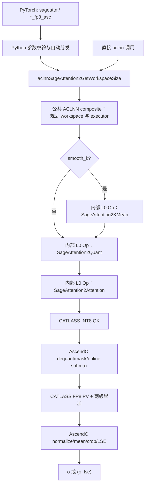

# 需求背景（required）

## 需求来源

本设计对应《sageAttention2 算子开发任务书》，目标是在 `ops-transformer` 仓的 `experimental/attention/sageattention2` 目录新增 SageAttention2 前向算子，实现开源 SageAttention2 的 **INT8 $QK^T$ + FP8 $PV$** 路径，并在 Atlas 950PR 上提供 PyTorch 与 aclnn 两套必选接口。

| 项目 | 内容 |
| --- | --- |
| 算子名称 | SageAttention2 |
| 交付仓 | `cann/ops-transformer` |
| 计划合入目录 | `experimental/attention/sageattention2` |
| 目标硬件 | Atlas 950PR（仓内按 `ascend950`/arch35 路径集成，最终名称以 CANN 9.2.0-beta.1 环境枚举为准） |
| 软件基线 | CANN 9.2.0-beta.1 |
| Kernel 技术栈 | AscendC + CATLASS |
| 对标功能实现 | `thu-ml/SageAttention` main 分支，`sageattention==2.2.0` 的 FP8 PV 路径 |
| 性能基线 | ops-transformer FIA；PyTorch 为 `torch_npu.npu_fused_infer_attention_score`，aclnn 为 `aclnnFusedInferAttentionScoreV5` |
| 性能门禁 | 同机、同 shape、同 dtype 下，PyTorch 与 aclnn 两条路径逐用例均达到 Speedup $\ge 1.6\times$，且两条路径各自的几何平均 Speedup 均 $\ge 1.6\times$ |

## 背景介绍

标准 Attention 的计算为：

$$
O=\operatorname{softmax}(QK^T\cdot s)V,
$$

其中 $s$ 通常为 $1/\sqrt{D}$。长序列场景下，$QK^T$ 与 $PV$ 是主要计算热点。SageAttention2 通过细粒度 INT8 Q/K 量化、K/V outlier smoothing、FP8 PV 和两级累加降低计算与访存成本，同时用 online softmax 避免物化完整的 $S_q\times S_k$ Attention 矩阵。

本任务面向视频/图像生成、LLM/DiT 推理等前向场景，要求可通过 `F.scaled_dot_product_attention = sageattn` 方式进行替换，并支持 Ring Attention 等场景需要的 LSE 输出。

### 对标实现现状分析

开源对标代码的 FP8 路径具有以下关键行为：

| 能力 | 对标实现行为 | 本设计要求 |
| --- | --- | --- |
| 自动入口 | `sageattn` 根据 CUDA 架构选择后端 | NPU 上固定分发到 `sageattn_qk_int8_pv_fp8_asc` |
| Q/K 量化 | `per_warp` 或 `per_thread`，INT8，对称动态 scale | 用 AscendC 自研相同分组语义；不得把名称误解为 AscendC 内置量化枚举 |
| K smoothing | 沿 K 的序列维减均值 | 保持输出不变；返回 LSE 时补回 $Q\mu_K^T\cdot s$ |
| V 量化 | 按通道 FP8 E4M3FN，序列维转置、补齐到 64 的倍数并重排 | 使用 950PR 原生 FP8；内部布局可改成 CATLASS 友好布局，但数值须等价 |
| PV 累加 | `fp32`、`fp32+fp32`、`fp32+fp16` | 三种均为必选；默认 `fp32+fp16` |
| head dim | $D<64$ 补到 64，$64<D<128$ 补到 128，$D>128$ 报错 | Kernel 内逻辑补零，输出裁回原始 $D$，避免在 Python 层物化补齐张量 |
| LSE | 内部以 log2 相关形式计算，输出除以 `1.44269504`；smooth K 时增加校正项 | 数值、shape 和返回值形式对齐 |
| causal/GQA | 支持 causal 和 GQA | causal 仅允许 $S_q=S_k$；要求 $H_q\bmod H_{kv}=0$ |

### 开发基线可复用能力

设计启动时 SageAttention2 尚未实现；当前开发分支已按本文生成三阶段 Host/Kernel、公共 ACLNN、PyTorch 接入和测试代码，但尚未在最终健康的 Atlas 950PR 验收环境完成整体编译与精度/性能/内存门禁。开发仓可复用的工程模式如下：

- `experimental/attention/CMakeLists.txt` 可自动发现具有 `CMakeLists.txt` 或 `op_host/CMakeLists.txt` 的新增子目录；根构建需启用 experimental 选项。
- `experimental/attention/quant_flash_attn` 提供 arch35 Attention 的 `op_api`、`op_host`、checker、Tiling、`op_kernel` 与测试组织方式，可作为产品化接入参考。
- `experimental/attention/common/op_kernel` 已包含 FP8/MXFP8 搬运、Matmul、Softmax 等基础设施，复用前需逐项确认许可证、接口稳定性和数据布局是否满足本算子语义。
- `experimental/attention/typhoon_mla` 展示了 CATLASS `BlockMmad`、Layout、Tile Copy、Epilogue 与 AscendC Vector 协同的实现方式，可作为 CATLASS 模块边界和编译组织参考；不能直接等同为 SageAttention2 实现。

# 需求分析（required）

## 需求描述

在 Atlas 950PR 上新增仅前向的 SageAttention2 算子。公开输入 Q/K/V 为 FP16 或 BF16；内部对 Q/K 做 INT8 细粒度量化，对 V 做 FP8 逐通道量化，以 CATLASS Cube 模板执行 INT8 $QK^T$ 和 FP8 $PV$，以 AscendC Vector 完成 smoothing、动态量化、反量化、causal mask、online softmax、两级累加控制、LSE、pad/crop 与输出转换。

必须同时交付：

1. PyTorch 自动入口 `sageattn`；
2. PyTorch 显式入口 `sageattn_qk_int8_pv_fp8_asc`；
3. 与上述显式入口计算语义一致的双段式 aclnn 接口；
4. Host/OpDef/InferShape/Tiling、AscendC + CATLASS Kernel、构建安装、README、测试与自验证材料。

## 交付范围

### 范围内

- INT8 QK + FP8 PV；`per_warp`/`per_thread` 两种 QK 量化粒度；
- `fp32`、`fp32+fp32`、`fp32+fp16` 三种 PV 累加模式；
- FP16/BF16、HND/NHD、MHA/GQA、非因果 $S_q\ne S_k$、等长 causal；
- `smooth_k`、受累加模式约束的 `smooth_v`、`return_lse`；
- 原始 $D\in(0,128]$ 的逻辑 pad/crop；
- Atlas 950PR 的 PyTorch/aclnn 功能、精度与性能验收。

### 范围外

- FP16 PV、`sageattn_qk_int8_pv_fp16_*`；
- varlen/TND、增量 KV cache、paged attention、自定义稀疏 mask；
- Triton、CUDA、`*_sm90`、`*_cuda` 同名导出；
- 反向传播；
- 多卡 Ring Attention 执行流程。多卡仅要求单卡 `return_lse` 数值接口正确。

## 公开接口契约

### PyTorch 接口

```python
from typing import Any, Optional, Tuple, Union
import torch

def sageattn(
    q: torch.Tensor,
    k: torch.Tensor,
    v: torch.Tensor,
    tensor_layout: str = "HND",
    is_causal: bool = False,
    sm_scale: Optional[float] = None,
    return_lse: bool = False,
    **kwargs: Any,
) -> Union[torch.Tensor, Tuple[torch.Tensor, torch.Tensor]]: ...

def sageattn_qk_int8_pv_fp8_asc(
    q: torch.Tensor,
    k: torch.Tensor,
    v: torch.Tensor,
    tensor_layout: str = "HND",
    is_causal: bool = False,
    qk_quant_gran: str = "per_thread",
    sm_scale: Optional[float] = None,
    pv_accum_dtype: str = "fp32+fp16",
    smooth_k: bool = True,
    smooth_v: bool = False,
    return_lse: bool = False,
    **kwargs: Any,
) -> Union[torch.Tensor, Tuple[torch.Tensor, torch.Tensor]]: ...
```

| 参数 | 类型/默认值 | 设计语义与校验 |
| --- | --- | --- |
| `q` | Tensor | HND 为 `[B,Hq,Sq,D]`，NHD 为 `[B,Sq,Hq,D]`；FP16/BF16 |
| `k`,`v` | Tensor | HND 为 `[B,Hkv,Sk,D]`，NHD 为 `[B,Sk,Hkv,D]`；shape、dtype、device 相互匹配 |
| `tensor_layout` | `"HND"` | 仅允许 `HND`、`NHD` |
| `is_causal` | `False` | 为 True 时只允许 $S_q=S_k$；屏蔽 $j>i$ |
| `qk_quant_gran` | `"per_thread"` | 仅允许 `per_thread`、`per_warp` |
| `sm_scale` | `None` | None 时使用原始、未 pad 的 $D$ 计算 $1/\sqrt D$ |
| `pv_accum_dtype` | `"fp32+fp16"` | 仅允许 `fp32`、`fp32+fp32`、`fp32+fp16` |
| `smooth_k` | `True` | 沿 K 的序列维减均值；LSE 增加校正项 |
| `smooth_v` | `False` | 仅 `fp32` 路径生效；`fp32+fp32`/`fp32+fp16` 时发出 warning 并按 False 执行 |
| `return_lse` | `False` | False 返回 `o`；True 返回 `(o,lse)` |
| `kwargs` | — | 仅接收下述 SDPA 兼容子集和自动分发覆盖；其余功能性参数明确报错 |

自动入口在 NPU 上不做硬件后端多分支，固定调用 FP8 显式入口。设计的配置优先级为：显式 `kwargs["pv_accum_dtype"]` > 环境变量 `SAGEATTN_PV_ACCUM_DTYPE` > 默认 `fp32+fp16`。非法覆盖值在 Python Host 层报错；该覆盖规则须同步写入 README。

为满足任务书中的 SDPA 替换冒烟场景，`kwargs` 白名单和冲突规则固定如下：

- `attn_mask`：缺省或 `None` 可接受；非 `None` 报“不支持自定义 mask”。
- `dropout_p`：缺省或数值 `0.0` 可接受并忽略；非零值报错。本算子仅前向推理，不产生 dropout。
- `scale`：作为 SDPA 名称映射到 `sm_scale`；两者同时给出时，数值相同则只下沉一次，数值不同则报冲突。
- `enable_gqa`：仅作为兼容性提示。显式为 `True` 时仍要求 $H_q\bmod H_{kv}=0$；显式为 `False` 且 $H_q\ne H_{kv}$ 时报错；未传时保留 SageAttention 原生的按 shape 识别 GQA 语义。
- `pv_accum_dtype`：仅 `sageattn` 自动入口接受，并按上述优先级下沉；显式 FP8 入口使用其具名参数，重复传入报错。

直接执行 `F.scaled_dot_product_attention = sageattn` 的兼容边界是前三个位置参数 `q,k,v` 加上述关键字子集；SDPA 的第 4 个位置参数会与 SageAttention 的 `tensor_layout` 位置冲突，测试和 README 示例不得用第 4 个位置参数。需要完整 SDPA 位置签名的调用点应使用薄适配函数显式按关键字转发。

返回值契约：

- `o`：shape 与 q 相同，dtype 与 q 相同；内部 pad 的维度不得暴露。
- `lse`：仅 `return_lse=True` 返回，shape 固定为 `[B,Hq,Sq]`，dtype 为 FP32，表示原始 $QK^T\cdot s$ 每行的自然对数 logsumexp。

### aclnn 接口

算子设计命名为 `aclnnSageAttention2`，采用标准两段式调用。最终参数类型和命名以 ops-transformer Op API 评审结果为准，但不得减少下列语义：

```cpp
aclnnStatus aclnnSageAttention2GetWorkspaceSize(
    const aclTensor *query,
    const aclTensor *key,
    const aclTensor *value,
    const char *tensorLayout,
    bool isCausal,
    const char *qkQuantGran,
    double scaleValue,
    const char *pvAccumDtype,
    bool smoothK,
    bool smoothV,
    bool returnLse,
    aclTensor *attentionOut,
    aclTensor *softmaxLseOptional,
    uint64_t *workspaceSize,
    aclOpExecutor **executor);

aclnnStatus aclnnSageAttention2(
    void *workspace,
    uint64_t workspaceSize,
    aclOpExecutor *executor,
    const aclrtStream stream);
```

`scaleValue` 为已归一化的有限 `double`；Python 层在 `sm_scale=None` 时用原始、未 pad 的 $D$ 计算 $1/\sqrt D$ 后下沉，直接 aclnn 调用者须传入同值。`returnLse=True` 时 `softmaxLseOptional` 必须存在且为 FP32 `[B,Hq,Sq]`；否则允许传 `nullptr` 或 FP32 `[0]` 占位。Python 扩展与直接 aclnn 调用复用相同 L0/Host 校验和 Kernel 路由，不允许形成数值不同的两套实现。

## Shape、dtype 与存储约束

| 项目 | 约束 |
| --- | --- |
| q/k/v rank | 4 |
| 输入 dtype | 三者相同，仅 FP16/BF16 |
| 输入 device | 三者位于同一 NPU device |
| Batch | q/k/v 的 B 相同，且 $B>0$ |
| Head | $H_q>0$、$H_{kv}>0$、$H_q\bmod H_{kv}=0$ |
| Sequence | $S_q>0$、$S_k>0$；causal 时 $S_q=S_k$ |
| Head dim | q/k/v 的 D 相同，$0<D\le128$；$D<64\rightarrow D_p=64$，$64<D<128\rightarrow D_p=128$，否则 $D_p=D$ |
| Stride | `stride(-1)==1`；其余外层 stride 由 Host 传给预处理 Kernel，不要求整体 contiguous |
| Layout | HND/NHD；内部统一为按 `[B,H,S,Dp]` 解释的量化工作区 |
| 输出 | o 与 q 同 shape/dtype；lse 为 `[B,Hq,Sq]`/FP32 |

外层非连续是公开正向能力，不是“先 contiguous 再假装支持”：公共 Python/aclnn checker 必须在任何 `l0op::Contiguous` 或内部拷贝前读取**原始** q/k/v stride 并拒绝 `stride(-1)!=1`；三个内部 OpDef 不对原始 q/k/v 声明 AutoContiguous。Quant Kernel 按 TilingData 中的 B/H/S stride 直接寻址，只有它写出的内部量化 workspace 是连续布局。

## 需求拆解

| 编号 | 需求 | 验收关联 |
| --- | --- | --- |
| FR-01 | 两个 PyTorch API 的签名、默认值、返回形式与任务书一致 | TC-01、TC-02 |
| FR-02 | aclnn 双段式入口与 PyTorch 显式入口语义一致 | P-01～P-07 aclnn 路径 |
| FR-03 | FP16/BF16、HND/NHD、MHA/GQA、非因果不等长、等长 causal | TC-01、TC-06、TC-07 |
| FR-04 | `per_thread`/`per_warp` INT8 Q/K 量化分组与 GPU 同配置对齐 | TC-02、精度 L-A |
| FR-05 | FP8 V 逐通道 scale，三种 PV 累加，默认 `fp32+fp16` | TC-02、性能门禁 |
| FR-06 | K/V smoothing、warning/ignore、GQA LSE correction | TC-03、TC-04 |
| FR-07 | $D=48\rightarrow64$、$D=96\rightarrow128$，输出裁剪；$D>128$ 报错 | TC-05、TC-08 |
| FR-08 | 禁止物化完整 Attention 矩阵，支持 8K/16K 长序列 | TC-09、P-02/P-03/P-04/P-07 |
| FR-09 | 非法 layout/gran/accum、非空 mask、末维不连续等明确报错 | TC-08 |
| FR-10 | AscendC + CATLASS 协同，且 profiler 证明走 AiCore | 代码评审、profiler 证据 |
| FR-11 | PyTorch/aclnn 分别逐用例及几何平均达到 FIA 1.6× | P-01～P-07 |
| FR-12 | 完整 README、功能/精度/性能测试、自验证报告和复现步骤 | 交付件评审 |

## 交付物清单

| 交付物 | 内容与完成判据 |
| --- | --- |
| 算子设计文档 | 按 `cann-competitions/04_tasks/01_community-task-2026/resources/design_template.md` 提交到该仓 `tasklist`，以 PR 形式完成评审并合入；需求、接口、算法、AscendC/CATLASS 边界、Tiling、Kernel、测试和限制完整 |
| 待验收代码 | 个人 ops-transformer 仓、开发分支和 `experimental/attention/sageattention2` 目录；提供可访问的仓链接/分支/算子路径，并邀请 GitCode 账号 `Ascend-CANN` 为开发者 |
| 自测用例与测试代码 | AscendOpTest + pytest + aclnn C++ benchmark；测试目录 README 给出构建、安装、golden、运行、性能计时和 profiler 复现命令，保证验收人可独立复现 |
| 自验证报告 | 使用任务书指定的腾讯文档模板（`https://docs.qq.com/sheet/DUmVWWndaUE12WGFB?tab=BB08J2`）；写明硬件/CANN/commit/API，列出用例参数、L-A/L-B 精度、P-01～P-07 双接口性能、几何平均、原始日志及精度/性能截图 |
| 算子 README | 公开 API、支持矩阵、自动分发/环境变量、约束、warning、示例、构建安装和已知限制 |

# 详细设计（required）

## 算子分析

### 数学公式

#### 符号定义

将 HND/NHD 输入都规范化为逻辑视图：

$$
Q\in\mathbb{R}^{B\times H_q\times S_q\times D},\quad
K,V\in\mathbb{R}^{B\times H_{kv}\times S_k\times D}.
$$

GQA 分组数为 $g=H_q/H_{kv}$，Query 头 $h_q$ 对应的 KV 头为：

$$
h_{kv}(h_q)=\left\lfloor\frac{h_q}{g}\right\rfloor.
$$

#### K smoothing 与 LSE 校正

当 `smooth_k=True` 时：

$$
\mu^K_{b,h,d}=\frac{1}{S_k}\sum_{j=0}^{S_k-1}K_{b,h,j,d},\qquad
\widetilde K_{b,h,j,d}=K_{b,h,j,d}-\mu^K_{b,h,d}.
$$

对任意 Query 行，$Q\mu_K^T$ 对所有 Key 位置是同一个常量，因此：

$$
QK^T=Q\widetilde K^T+c,\qquad
c_{b,h_q,i}=\left\langle Q_{b,h_q,i,:},\mu^K_{b,h_{kv}(h_q),:}\right\rangle.
$$

Softmax 输出不受该常量影响，主循环使用 $\widetilde K$ 即可；但 LSE 必须补回校正项。GPU 参考不是把数学实数点积直接保留为 FP32，而是先由 q 与同 dtype 的 K mean 做 `matmul`，结果按输入 dtype 舍入，再转换为 FP32。因此定义参考等价校正值：

$$
c^{ref}_{b,h_q,i}=\operatorname{cast}_{FP32}\!\left(
R_{dtype(Q)}\!\left(\left\langle Q_{b,h_q,i,:},
\mu^K_{b,h_{kv}(h_q),:}\right\rangle\right)\right),
$$

其中 $R_{dtype(Q)}$ 表示一次 FP16/BF16 `matmul` 输出舍入。NPU 可在内部使用 FP32 累加，但写入 LSE 前必须复现这一次输出舍入，而不能直接使用未舍入 FP32 点积。GQA 场景通过 $h_{kv}(h_q)$ 映射实现与 `repeat_interleave` 等价的广播，不在 GM 中物化重复均值；FP16/BF16 校正中间量须分别与 GPU 参考做单测。

#### Q/K INT8 量化

两种粒度使用相同的对称 INT8 思路，但参考实现的 epsilon 与舍入细节不同，NPU 必须按模式保留差异：

$$
s_G^{warp}=\frac{\max(10^{-7},\max_{x\in G}|x|)}{127},\qquad
\widehat x^{warp}=\operatorname{sat\_round\_nearest}\left(\frac{x}{s_G^{warp}}\right),
$$

$$
s_G^{thread}=\frac{\max_{x\in G}|x|}{127}+10^{-7},\qquad
\widehat x^{thread}=\operatorname{clip}\left(\operatorname{trunc}\left(\frac{x}{s_G^{thread}}+0.5\operatorname{sign}(x)\right),-127,127\right).
$$

`per_warp` 使用 round-to-nearest + saturate；`per_thread` 使用“加正负 0.5 后转 INT8”。零组输出全零并走非零安全 scale。两种模式分别与各自 GPU golden 比较，不要求二者彼此逐 bit 相同。

参考分组以 $M=128$ 的 Q tile、$N=64$ 的 K tile 为基础：

| 模式 | Q scale 分组 | K scale 分组 | 每个 Q128/K64 tile 的 scale 数 |
| --- | --- | --- | --- |
| `per_warp` | 每个 Q128 内 4 个连续 Q32 组 | 每个 K64 为一个组 | Q: 4；K: 1 |
| `per_thread` | 每个 Q32 内 8 个交错组；第 $r$ 组为 `{r,r+8,r+16,r+24}` 的全部 D 元素 | 每个 K64 内 4 个交错组；第 $r$ 组覆盖 `{2r+8t,2r+1+8t; t=0..7}` 的全部 D 元素 | Q: 32；K: 4 |

尾 tile 中越过有效序列或原始 D 的位置不得被 NPU 未定义 lane 污染，写回时必须屏蔽无效位置。对标 Triton 的 masked load 未显式给出 `other`，因此 per-thread 尾部的冻结语义先由 S=31/32/33、63/64/65、127/128/129 的 CUDA 边界 golden 确认；确认前不把越界 lane 武断定义为零。NPU tile/lane 排布可以调整，但 scale 覆盖集合、有效元素量化值和最终数值必须与 GPU 同 `qk_quant_gran` 对齐。

#### V FP8 量化与 smoothing

V 按 `[B,Hkv,Dp]` 的每个通道沿序列维求动态 scale。为精确对齐参考的尾块语义，定义

$$
L_{16}=round\_up(S_k,16),\qquad L_{64}=round\_up(S_k,64),
$$

$$
\bar V_{b,h,j,d}=\begin{cases}V_{b,h,j,d},&j<S_k,\\
0,&S_k\le j<L_{64}.
\end{cases}
$$

`smooth_v=True` 的有效路径使用

$$
\mu^V_{b,h,d}=\frac{1}{L_{16}}\sum_{j=0}^{L_{16}-1}\bar V_{b,h,j,d},
\qquad V'_{b,h,j,d}=\bar V_{b,h,j,d}-\mu^V_{b,h,d};
$$

未开启 smoothing 时令 $\mu^V=0$、$V'=\bar V$。令 `scale_max` 为 $M_v$，统计域和写入域分别为：

$$
a^V_{b,h,d}=\frac{\max_{0\le j<L_{16}}|V'_{b,h,j,d}|}{M_v},\qquad
\widehat V_{b,h,d,j}=\operatorname{cvt.rn.satfinite}_{\mathrm{E4M3FN}}
\left(\frac{V'_{b,h,j,d}}{a^V_{b,h,d}}\right),\quad 0\le j<L_{64}.
$$

其中：

- `pv_accum_dtype="fp32+fp16"` 时 $M_v=2.25$；
- `fp32`/`fp32+fp32` 时 $M_v=448.0$；
- amax=0 的退化通道采用有意的安全修复：scale 和量化值置零，以避免参考中 `0*inf` 可能产生 NaN；该 case 只验证有效输出数学等价，不要求中间 FP8 bit pattern 对齐。仅在 amax>0 时逐 bit 对齐参考尾位；
- `smooth_v=True` 且累加模式为 `fp32` 时，$V'=V-\mu^V$，Attention 结束后加回按 GQA 头映射的 $\mu^V$；
- `fp32+fp32`/`fp32+fp16` 收到 `smooth_v=True` 时，Host 发 warning 后将有效值改为 False。

当 $S_k$ 非 16 对齐时，$L_{16}$ 范围内的补零在中心化后为 $-\mu^V$，所以 amax 必须包含 $|\mu^V|$；第二遍对整个 $L_{64}$ 写入域都按 $(\bar V-\mu^V)/a^V$ 量化，不能把 smooth V 的尾位强行写零。Attention 对所有 $j\ge S_k$ 的 P 必须严格 mask 为零，因而这些尾位不参与有效 PV；同时以 $S_k=15,16,17,63,64,65$ 的常量/极值输入逐 bit 验证参考尾位。该定义保持有效位置上的 $P(V-\mu_V)+\mu_V=PV$ 恒等式。

内部 V 布局统一为 `[B,Hkv,Dp,L64]` 的 CATLASS 友好排布。若采用参考的 16 元素重排，方向固定为 `dst[16*b+r] = src[16*b+perm[r]]`，其中 `perm=[0,1,8,9,2,3,10,11,4,5,12,13,6,7,14,15]`；也可采用 CATLASS arch35 FP8 Tile Copy 所需的数值等价布局。选择后必须用逐元素量化单测分别检查有效区、$L_{16}$ 尾区和 $L_{64}$ 尾区，并以 PV 单测证明布局方向正确。

#### INT8 QK、online softmax 与 FP8 PV

对第 $t$ 个 K tile，CATLASS Cube 先计算 INT32：

$$
C_t=\widehat Q\widehat K_t^T.
$$

AscendC Vector 按行/列所属量化组反量化并施加 scale：

$$
Z_{t,ij}=C_{t,ij}\cdot a^Q_i\cdot a^K_j\cdot s.
$$

causal 场景令 $j>i$ 的元素为 $-\infty$；尾 tile 同样 mask。内部使用 `exp2` 时令 $\bar Z=Z\log_2e$。算法意义上的偏移是 $\log_2(448)$，但 GPU 对标实现冻结的单精度字面量为 `8.807f`（而非运行时精确计算的 8.807354…）；L-A 路径据此固定 $\delta_{ref}=8.807f$，逐 K tile 维护带偏移的行最大值：

$$
m_t=\max(m_{t-1},\max_j\bar Z_{t,j}-\delta_{ref}),
$$

$$
\alpha_t=2^{m_{t-1}-m_t},\quad
P_t=2^{\bar Z_t-m_t},\quad
\ell_t=\alpha_t\ell_{t-1}+\sum_jP_{t,j}.
$$

$P_t$ 的 tile 最大值约为 448。$\ell_t$ 必须用 **FP32、E4M3FN cast 之前**的 $P_t$ 做 row-sum；另一路用 `cvt.rn.satfinite.e4m3` 转成 FP8 后才送入 FP8 V 的 CATLASS PV 主循环，不能对 FP8 P 反量化后再累计分母。历史输出按 $\alpha_t$ 重标定。相同指数偏移同时进入分子与分母，最终归一化时抵消，且 $m_T+\log_2\ell_T$ 仍是未偏移 score 的正确 logsumexp。所有 K tile 完成后按 $\ell_t$ 归一化、乘 V channel scale、可选加回 $\mu^V$，再转换为 q 的 dtype。P 与 V 的 FP8 转换都固定 round-to-nearest、saturate-to-finite；开发时须锁定对应 AscendC Cast trait，不能以 `rint-zero` 等模式代替。

该流程只保存当前 tile、行最大值、行分母和输出累加，不分配 $O(S_qS_k)$ 中间张量。

#### 两级累加

| `pv_accum_dtype` | 设计行为 |
| --- | --- |
| `fp32` | FP8 MMA 结果持续归并到 FP32 输出累加器，精度优先 |
| `fp32+fp32` | 每个 N64 tile 先在短期 FP32（硬件有效位以 950PR 实测为准）instruction buffer 内累加，再加到长期 FP32 输出累加器 |
| `fp32+fp16` | 语义上每个 N64 tile 在短期 FP16 accumulator 内累加并在 K64 边界提升到长期 FP32；这是默认验收路径。实现机制须先通过 CATLASS/950PR 最小样例确认，不能预设硬件原生支持 |

两级累加的短期范围与 `N=64` 绑定，每个 K64 tile 完成一次长期归并。默认路径取 `scale_max=2.25` 的防溢出依据为：

$$
64\times448\times2.25=64512<65504,
$$

这是 K64 同号项在**精确实数求和**下的范围设计依据，不是顺序 FP16/MMAD 舍入后“绝不溢出”的形式化证明；64512 到 65504 仅有约 1.54% 余量。开发门禁必须用 950PR 实际指令验证同号极值、正负交错和跨数量级输入，并检查 INF/NaN。若 CATLASS `ElementAccumulator/Fixpipe` 支持 FP8×FP8→FP16，则采用该原生路径；若只支持仓内现有的 FP8×FP8→FP32，则在每个实际 MMA 子片段产生 FP32 partial，按参考 K32/K64 边界执行 FP16 舍入/FP16 累加，再提升至长期 FP32，以数值方式仿真短期语义。两种实现都必须对 GPU `fp32+fp16` golden 过精度门禁。若将来改变 N tile，必须重新推导范围并重跑压力、精度和性能测试。

#### LSE

内部 online softmax 产生 log2 形式：

$$
LSE_2=m_T+\log_2\ell_T.
$$

对外自然对数结果为：

$$
LSE=\frac{LSE_2}{1.44269504}+\begin{cases}
c^{ref}\cdot s,&\text{smooth\_k=True},\\
0,&\text{smooth\_k=False}.
\end{cases}
$$

LSE correction 使用原始 q、按输入 dtype 保存的 K mean，以及上述“matmul 输出先按 FP16/BF16 舍入、再转 FP32”的 $c^{ref}$；输出 shape 始终为 `[B,Hq,Sq]`。

### 支持数据类型

| 数据 | 公开/内部 dtype | 说明 |
| --- | --- | --- |
| q/k/v | FP16 或 BF16 | 三者必须相同；仅公开输入使用 |
| Q/K 量化值 | INT8 | 对称细粒度量化 |
| Q/K scale | FP32 | 按 per-warp/per-thread 分组 |
| V/P 量化值 | FP8 E4M3FN | V 按通道，P 使用指数偏移占满动态范围 |
| V scale/V mean | FP32 | V mean 仅有效 smooth V 路径存在 |
| QK Cube accumulator | INT32 | Vector 侧反量化为 FP32 score |
| score、m、l、长期 O accumulator | FP32 | 保证 online softmax 与跨 tile 归并稳定 |
| 短期 PV accumulator | 语义为 FP32 或 FP16 | 由 `pv_accum_dtype` 决定；FP16 可由原生 accumulator 或参考等价的 FP32-partial/FP16-round 仿真实现 |
| o | 与 q 相同 | FP16/BF16，输出前 crop |
| lse | FP32 | 可选 `[B,Hq,Sq]` |

公开契约以及三个内部 OpDef 的 root dtype 必须按索引绑定两组合法组合，而不是把各输入 dtype 当作可自由组合的集合；内部 Q/K INT8、V/P E4M3FN 和 scale FP32 由该索引派生：

| 组合 | q | k | v | attentionOut | softmaxLse | Format/UnknownShapeFormat |
| --- | --- | --- | --- | --- | --- | --- |
| 0 | FP16 | FP16 | FP16 | FP16 | FP32 | ND/ND，所有输入输出列数对齐 |
| 1 | BF16 | BF16 | BF16 | BF16 | FP32 | ND/ND，所有输入输出列数对齐 |

三个内部 OpDef 的契约如下；`root` 指上表同一索引选择的 FP16 或 BF16，所有 Tensor 的 Format/UnknownShapeFormat 均为 ND/ND：

| 内部 Op | Inputs（ParamType） | Outputs（ParamType） | Attr 与默认/归一化规则 | dtype 约束 |
| --- | --- | --- | --- | --- |
| `SageAttention2KMean` | `k`（REQUIRED） | `kMean`（REQUIRED） | `tensorLayout`：STR/REQUIRED | k/kMean=`root`；输出 `[B,Hkv,Dp]` |
| `SageAttention2Quant` | `q,k,v`（REQUIRED），`kMeanOptional`（OPTIONAL） | `qInt8,kInt8,vFp8,qScale,kScale,vScale,vMean`（REQUIRED） | `tensorLayout`：STR/REQUIRED；`qkQuantGran`：STR/OPTIONAL=`per_thread`；`pvAccumDtype`：STR/OPTIONAL=`fp32+fp16`；`smoothVEffective`：BOOL/OPTIONAL=false | q/k/v/kMean=`root`；Q/K=`INT8`；V=`E4M3FN`；scale/V mean=`FP32` |
| `SageAttention2Attention` | 原始 `query`、`qInt8,kInt8,vFp8,qScale,kScale,vScale,vMean`（REQUIRED），`kMeanOptional`（OPTIONAL） | `attentionOut,softmaxLse`（REQUIRED） | `tensorLayout`：STR/REQUIRED；`isCausal`：BOOL/OPTIONAL=false；`scaleValue`：FLOAT/REQUIRED（已归一化）；gran/accum/smooth/returnLse 按 STR/BOOL 与公共契约一致 | query/o/kMean=`root`；量化值/scale 同上；V mean/LSE=`FP32` |

`kMeanOptional` 在 smooth K 时同时供 Quant 做中心化、供 Attention 用原始 query 计算 $c^{ref}$；因此 Attention 的输入不能只包含量化中间量。内部 schema 的 `vMean` 与 `softmaxLse` 始终分配以保持静态 arity；flag 为 false 时 vMean 写零并被 Attention 忽略，LSE 不写且不拷回公共输出。公共 planner 仅令 `kMeanOptional` 的存在性与 `smoothK` 一致，并对三个 OpDef 使用同一个 root dtype 索引。

### 支持形状

| layout | q | k/v | o | lse |
| --- | --- | --- | --- | --- |
| HND | `[B,Hq,Sq,D]` | `[B,Hkv,Sk,D]` | `[B,Hq,Sq,D]` | `[B,Hq,Sq]` |
| NHD | `[B,Sq,Hq,D]` | `[B,Sk,Hkv,D]` | `[B,Sq,Hq,D]` | `[B,Hq,Sq]` |

其中 $B,H_q,H_{kv},S_q,S_k>0$、$H_q\bmod H_{kv}=0$、$0<D\le128$；非因果允许 $S_q\ne S_k$，因果要求 $S_q=S_k$。

## 算子实现

### 总体架构与调用链



主计算采用“预处理 + 单遍 FlashAttention 主循环”的 staged 方案：K mean 是可选独立 Kernel；Q/K/V 量化为一个 AscendC Kernel 中的不同任务区；Attention 主 Kernel 内融合 QK、softmax、PV 与输出 epilogue。公共 `aclnnSageAttention2GetWorkspaceSize` 是 composite API，而不是把三阶段伪装成一次 AiCore launch：它调用三个内部 L0 接口生成同一个 executor，并为内部虚拟 Tensor 分配共享 workspace；执行接口将这些节点依次入同一 stream。stream 顺序形成 KMean→Quant→Attention 的全设备依赖，不依赖单个 Kernel 内不存在的跨核全局 barrier。关闭 `smooth_k` 时 executor 不加入 KMean 节点。所有预处理与主 Kernel 耗时都计入 PyTorch/aclnn 性能门禁。

### AscendC 与 CATLASS 模块边界

| 模块 | 技术 | 职责 |
| --- | --- | --- |
| Python/torch 扩展 | Python + C++ | API 签名、NPU 固定分发、warning、异常、环境变量覆盖 |
| 公共 aclnn composite | C++ | 两段式 API、Tensor/attr 校验、虚拟 Tensor/workspace、依序编排内部 L0 节点 |
| 三个内部 L0/OpDef | C++ | `KMean`、`Quant`、`Attention` 各自 InferShape/InferDtype、Tiling、blockDim 与 AiCore 二进制路由 |
| KMean/Quant | AscendC Vector | K/V 统计、K smoothing、Q/K INT8 细粒度量化、V FP8 量化、pad/重排 |
| QK 主循环 | CATLASS | arch35 Layout/Tile Copy、INT8 BlockMmad、L1/L0 流水 |
| Softmax/Epilogue | AscendC Vector + CATLASS Epilogue 扩展 | 反量化、mask、online softmax、P 转 FP8、m/l 更新、LSE |
| PV 主循环 | CATLASS | 原生 FP8 BlockMmad、instruction buffer 与周期归并 |
| 输出 | AscendC Vector | 除分母、V scale/mean、FP16/BF16 cast、D crop、LSE correction |

CATLASS 复用范围必须落实到具体模板类型和固定子模块 commit；禁止仅在构建文件中声明 CATLASS、实际主计算却完全绕开 CATLASS。开发分支已把 `3rdparty/catlass` 固定到 `74e34a822dee604feece97c97d24096b94f6ed87`。该版本已确认 `Catlass::Arch::Ascend950`、Ascend950 FA QK/PV dispatch、FP8 softmax epilogue 与原生 `float8_e4m3_t` 类型；CANN 9.2.0-beta.1/Ascend950PR_9579 上的官方 example49（FA）和 example53（E4M3 MXFP8 Cube）均已编译运行并返回 `Compare success`。SageAttention2 所需的 mixed INT8-QK/FP8-PV traits、逻辑 K64 和累加舍入仍按 G-01 的剩余项目单独验证：

| 用途 | 计划 CATLASS 组件/类型 | 元素与布局约束 | 实现门禁 |
| --- | --- | --- | --- |
| 架构/资源 | `Catlass::Arch::Resource<Catlass::Arch::Ascend950>` | 仅 ascend950/arch35；编译宏 `CATLASS_ARCH=3510` | 已由 example49/53 确认 ArchTag、资源和编译宏；Sage entry 仍需编译验证 |
| 操作数描述 | `Catlass::Gemm::GemmType<Element, Layout>` | GM 为 `RowMajor/ColumnMajor` 逻辑布局，L1 可转 `zN/nZ` | 逐元素 copy/layout 单测 |
| INT8 QK | `Catlass::Gemm::Block::BlockMmadTla<Catlass::Gemm::MmadFAIQK<Catlass::Arch::Ascend950,...>,...>` | Q/K=`int8_t`，S/accumulator=`int32_t` | mixed dtype 最小探针冻结 L1/L0 shape、TileCopy/Fixpipe 类型 |
| FP8 PV | `Catlass::Gemm::Block::BlockMmadTla<Catlass::Gemm::MmadFAIPV<Catlass::Arch::Ascend950,...>,...>` | P/V=`float8_e4m3_t`（E4M3FN bit 语义），长期 O=`float` | FP8 Cube 已由 example53 确认；仍验证 actual-K=64 或 K128 拆分方案 |
| softmax/输出 | `Catlass::Epilogue::Block::BlockEpilogue<Catlass::Epilogue::EpilogueAscend950FASoftmax<mask,enablePScale>,...>` 与 `EpilogueAscend950FARescaleO` | FP32 score/m/l/O；P cast 为 RN+satfinite E4M3FN | 冻结 `8.807f`/pre-cast denominator 语义并与 online-softmax golden 对齐 |
| 搬运 | `Catlass::Tile::CopyGm2Ub`、`CopyUb2Gm` 及 BlockMmad 自带 GM/L1 Tile Copy | V 的 16 元素置换、Q/K 的 zN/nZ 变换 | 有效区与 tail 的 bit-pattern 单测 |

开发 Gate G-01：固定 commit 与 950 架构、E4M3FN Cube/FP32 accumulator 能力已确认；`include/catlass/gemm/helper.hpp` 在 `CATLASS_ARCH==3510` 下将 E4M3×E4M3 accumulator 固定为 `float`，没有原生 FP16 accumulator 证据。剩余门禁是独立编译 INT8→INT32 QK、Sage mixed QK/PV 主循环、raw E4M3 cast/softmax bytes 和逻辑 K64 探针，并在代码中锁定 L1/L0 TileShape、Layout、TileCopy 与 Fixpipe。默认 `fp32+fp16` 按“两级累加”章节的原生/仿真分支闭环。另需验证 PV 模板是否支持 `actualK=64`；若只提供 K128，硬件 tile 必须拆成两个逻辑 K64 更新，并在每个 K64 保持参考的 FP16/FP32 归并边界，不能把算法归并边界悄然改为 K128。

### 实际代码目录结构

```text
experimental/attention/sageattention2/
├── CMakeLists.txt
├── README.md
├── common/op_kernel/sage_attention2_kernel_common.h
├── sage_attention2_kmean/
│   ├── op_host/                 # OpDef/Infer/Tiling/L0
│   └── op_kernel/               # AIV KMean entry + arch35 kernel
├── sage_attention2_quant/
│   ├── op_host/                 # OpDef/Infer/Tiling/L0
│   └── op_kernel/               # AIV Quant entry + arch35 kernel
├── sage_attention2_attention/
│   ├── op_host/                 # OpDef/Infer/Tiling/L0 + public aclnn
│   └── op_kernel/               # mixed AIC/AIV CATLASS attention
├── examples/
│   ├── arch35/test_aclnn_sageattention2_smoke.cpp
│   ├── arch35/benchmark_aclnn_sageattention2_vs_fia.cpp
│   ├── CMakeLists.txt
│   └── README.md
├── tests/
│   ├── pytest/                  # 补充精度、负例、PyTorch 性能/内存
│   ├── ascendoptest/            # GPU L-A golden 目录与生成器
│   └── ut/op_host/              # InferShape/Tiling Host UT
├── python/tests/
└── docs/self_test_report.md
```

PyTorch 接入遵循开发仓现行 torch-extension 规范，作为同一提交的第二处改动：

```text
torch_extension/cann_ops_transformer/
├── ops/
│   ├── csrc/sage_attention2.cpp
│   ├── sage_attention2.py
│   └── __init__.py                       # 增量导出两个公开接口
├── docs/zh/sage_attention2.md
└── __init__.py                           # 现有 star export 自动传递 ops 导出
```

文件名可按仓库最终命名规范调整，但公共 composite API、三个内部 OpDef/Tiling/Kernel entry、torch-extension 注册和测试职责不得缺失。内部 Op 名不作为用户 ABI 导出；若未来需要单一图算子，再增加 graph composite，不在本任务中假设一次 OpDef launch 能完成三阶段全局同步。

### Python 与 aclnn Host 设计

Python 层依次执行：

1. 在任何 contiguous 转换前校验原始设备、dtype、rank、shape、layout、stride、GQA、causal 与枚举属性；
2. 解析 `sm_scale` 和自动入口的累加模式覆盖；
3. 对无效 `smooth_v` 发一次 warning，并将下沉有效值设为 False；
4. 按公开接口章节的白名单处理 `attn_mask/dropout_p/scale/enable_gqa`，拒绝非空 mask、非零 dropout、冲突 scale 和未知功能性 kwargs；
5. 创建 o；内部始终创建 `[B,Hq,Sq]` FP32 lse Tensor 以保持静态 OpDef/schema arity，`return_lse=False` 时 Kernel 不写且公共层不拷回；
6. 调用统一 aclnn GetWorkspaceSize；由 composite planner 建立 KMean（可选）、Quant、Attention 三个内部 L0 节点和虚拟中间 Tensor，再执行同一 executor；
7. 按 `return_lse` 返回单 Tensor 或二元组。

aclnn checker 必须重复关键校验，不能依赖 Python 已校验。直接 aclnn 调用和 PyTorch 调用应得到相同错误语义和相同内部 L0 序列。三个内部 Op 只注册 AiCore/ascend950 路径，不设计 AICPU fallback；不支持的输入直接返回参数错误。

PyTorch 构建/注册链固定为：

1. `ops/csrc/sage_attention2.cpp` 实现 C++ wrapper，使用 `ACLNN_CMD(aclnnSageAttention2, ...)` 调公共 composite API；pybind/schema 的返回 arity 固定为 `(o,lseTensor)`，不在 C++ 层复制算法。
2. `ops/sage_attention2.py` 定义一个内部规范化 schema 的 `OpBuilder`（两个公开 Python 包装函数共用），schema 固定返回 `(Tensor, Tensor)`，并给出同 arity 的 Meta shape/dtype 推导；`PrivateUse1` dispatcher 透传到编译产物。`return_lse=False` 时第二项是 shape `[0]` 的 FP32 NPU placeholder，不传给 Attention 内部 Op；公开包装层丢弃它并只返回 o。`return_lse=True` 时第二项为 `[B,Hq,Sq]` FP32。两个公开包装函数保留任务书规定的精确签名，先把 `kwargs`/默认值归一化后再调用 schema；schema 不承载 Python `**kwargs`。
3. `ops/__init__.py` 显式导出 `sageattn`、`sageattn_qk_int8_pv_fp8_asc`，包根现有的 `from .ops import *` 自动向上传递两个名称；导入主包即完成 schema/meta/PrivateUse1 注册。安装和链接沿用现有 `cann_ops_transformer` 包，不另建无法被仓库构建发现的 setup/pyproject。
4. `docs/zh/sage_attention2.md` 与两个公开函数 docstring 同步记录接口、产品、限制和示例。本任务只要求 eager/PrivateUse1；torchair graph converter 若后续纳入范围，再按仓内规范新增，不作为当前必选链路的隐式前提。

内部 dispatcher schema 固定为归一化后的静态形式（名称以评审为准）：

```text
sage_attention2(Tensor q, Tensor k, Tensor v, str tensor_layout,
                bool is_causal, str qk_quant_gran, float? sm_scale,
                str pv_accum_dtype, bool smooth_k, bool smooth_v,
                bool return_lse) -> (Tensor, Tensor)
```

### InferShape/InferDtype

- `attentionOut.shape = query.shape`，dtype 与 query 相同；
- Attention 内部 `softmaxLse.shape = [B,Hq,Sq]`、dtype FP32 且始终分配；当 `returnLse=False` 时 Kernel 不写且 public composite 不拷回，torch schema/C++ wrapper 则固定返回 shape `[0]` 的 FP32 NPU placeholder 以保持静态二元组 arity，公开 Python 包装层不返回该占位；
- 内部 KMean 输出为 `[B,Hkv,Dp]`、dtype 与 k 相同；Quant 输出包括 Q/K INT8、V E4M3FN、Q/K/V FP32 scale 和必选 FP32 V mean（关闭 smooth V 时为零）；Attention 内部 Op 消费这些虚拟 Tensor 并生成公开输出；
- 动态 shape 下保留 B/H/S/D 的符号关系，并在运行时 Tiling 再校验 $D\le128$、GQA 和 causal 等关系。

### Host Tiling 设计

#### 三阶段独立调度

| 内部 Op | 是否执行 | 任务空间/blockDim | TilingKey 维度 | 输出依赖 |
| --- | --- | --- | --- | --- |
| `SageAttention2KMean` | `smooth_k=True` | `B*Hkv*Dp`；每个 task 负责一个通道并沿 Sk 归约 | dtype × Dp，共 4 个静态组合 | K mean（输入 dtype） |
| `SageAttention2Quant` | 必选 | Q tile、K tile、V channel 三段 task range 的总和；grid-stride 分发 | dtype × gran × accum × Dp，共 24 个组合 | Q/K INT8、V FP8、各 scale、必选 FP32 V mean（关闭时写零） |
| `SageAttention2Attention` | 必选 | `B*Hq*ceil_div(Sq,128)` | dtype × causal × gran × accum × Dp，共 48 个组合 | o、必选 FP32 lse Tensor（按 flag 决定是否写） |

每个内部 Op 独立计算 tiling data、tiling key、blockDim 和 workspace view，并拥有独立 Kernel entry/二进制。公共 planner 以 512B 对齐的共享 workspace offset 把上游输出连接为下游输入；不得让三个 Op 各自重复申请不可见的私有中间区。上述静态组合数是编译完整性目标，不表示运行时一定实例化所有可选输出。

#### 逻辑规格化

Host 根据 layout 解析 q/k/v 的真实 shape 与原始 stride，得到统一的 `B,Hq,Hkv,Sq,Sk,D,Dp,g`。`Dp` 只写入 Tiling，不创建 pad 后的公开 Tensor；若框架在 checker 前已把输入 AutoContiguous，则属于实现错误，stride 正/负例必须能检测该问题。

#### Tile 与分核

- 算法主 Q tile：`M=128`；逻辑 K/V 更新与两级累加边界：`N=64`；D tile：64 或 128；
- 主任务空间：`B * Hq * ceil_div(Sq,128)`；每个任务顺序遍历所属 KV 头的全部 K64 tile；
- `blockDim = min(可用 AICore 数, 主任务数)`，通过 grid-stride 方式均分任务；该方案在长序列下有足够 Q tile 并行度，且无需跨核 split-K 归并；
- GQA 仅改变 KV 头映射，不复制 K/V；
- causal 时整块位于对角线右侧的 K tile 直接跳过，对角 tile 做元素 mask；
- 尾 Sq/Sk/D 使用有效长度与 mask 处理。

逻辑 K64 不等同于硬件 PV `L0TileShape.K`。Gate G-01 必须确认 CATLASS 是否允许 `actualK=64`；若可用模板固定 K128，则一次硬件 tile 内分成两个逻辑 K64，分别完成 denominator、online-softmax 和短期→长期累加边界，或通过两个 actual-K=64 调用实现。任何合并为单个 K128 数值归并的方案都必须先证明与 GPU 参考舍入等价，否则不允许启用。

若后续实测发现小 B/小 H/小 Sq 并行度不足，可新增带 split-K 的独立 TilingKey；该路径必须实现 $(m,l,O)$ 的稳定跨核归并，并单独完成精度/性能验证，不能改变当前非 split-K 基线语义。

#### TilingKey

Attention 主 Kernel 的 TilingKey 仅编码会改变编译模板或主循环的项目，以避免无意义的组合爆炸：

| bit | 含义 |
| --- | --- |
| 0 | 输入/输出 dtype：0=FP16，1=BF16 |
| 1 | causal：0=否，1=是 |
| 2 | gran：0=per_warp，1=per_thread |
| 3～4 | accum：0=fp32，1=fp32+fp32，2=fp32+fp16，3=非法 |
| 5 | Dp：0=64，1=128 |
| 6 及以上 | 保留 |

layout 通过运行时 stride 处理；`smooth_k` 由公共 planner 决定是否加入 KMean；`smooth_v`、`return_lse` 为运行时 epilogue 标志。每个内部 Op 的 Host 与 Kernel 必须共用同一 TilingKey 定义，并分别为 KMean 4、Quant 24、Attention 48 个合法组合建立生成/编译完整性测试。

#### TilingData

| 字段组 | 主要字段 |
| --- | --- |
| 逻辑 shape | `batch, hq, hkv, sq, sk, dOriginal, dPadded, groupSize` |
| stride | q/k/v 的 B/H/S stride 与输出 stride |
| tile | `mTile=128, nTile=64, dTile, qTileCount, kvTileCount, pvStageK=64` |
| 调度 | `blockDim, totalTasks, tasksPerCore, tailTasks` |
| 属性 | `scaleValue, layout, causal, gran, accum, smoothK, smoothVEffective, returnLse` |
| 量化 | `qScaleCountPerTile, kScaleCountPerTile, vScaleMax, warpAmaxFloor=1e-7, threadScaleEpsilon=1e-7` |
| workspace | 各中间 Tensor 的 512B 对齐 offset 与 size |

#### Workspace

Workspace 仅随输入线性增长，分配：

1. `Q_int8 [B,Hq,Sq,Dp]`；
2. `K_int8 [B,Hkv,Sk,Dp]`；
3. `V_fp8 [B,Hkv,Dp,round_up(Sk,64)]`；
4. Q/K FP32 scale；
5. 可选 K mean、V mean 和必选 V scale；K mean 按输入 dtype 保存以锁定参考舍入，V mean/scale 为 FP32；
6. Kernel 间控制/对齐区。

scale 数量为：

$$
N_{Qscale}=\begin{cases}
B H_q\lceil S_q/128\rceil\cdot4,&per\_warp,\\
B H_q\lceil S_q/128\rceil\cdot32,&per\_thread,
\end{cases}
$$

$$
N_{Kscale}=\begin{cases}
B H_{kv}\lceil S_k/64\rceil,&per\_warp,\\
B H_{kv}\lceil S_k/64\rceil\cdot4,&per\_thread.
\end{cases}
$$

不得在 workspace 中分配完整 score/softmax 矩阵。GetWorkspaceSize 使用 64 位乘法并逐项检查溢出。

### Kernel 侧设计

#### Stage 1：KMean（可选）

- 仅 `smooth_k=True` 启动；按 `[B,Hkv,D tile]` 分核，沿 Sk 做 FP32 两级归约，再按 q/k dtype 舍入保存 K mean，以对齐参考 `k.mean` 的公开 Tensor 语义；
- 尾 D 使用逻辑补零；LSE correction 按数学章节定义的 `matmul` 输出 dtype 舍入语义计算 $c^{ref}$，不得直接使用未舍入 FP32 dot；
- GQA 不在此阶段复制均值；LSE correction 在主 Kernel 中按头映射读取。

#### Stage 2：Q/K/V Quant

一个 Kernel 使用不同任务区处理 Q、K、V：

- Q 任务按 Q128/细粒度组搬入 UB，Vector Abs/ReduceMax/Muls/Round/Cast 后写 Q INT8 与 FP32 scale；
- K 任务读取可选 K mean，融合 Sub + 分组 ReduceMax + INT8 Cast；`per_warp` 在 FP32 中做减均值，`per_thread` 先按输入精度形成 `k-km` 再提升到 FP32 做 max/quant，以匹配两条参考路径；
- V 任务按 channel 在 $L_{16}$ 统计域处理补零样本；smooth V 时先求以 $L_{16}$ 为分母的 mean，再对中心化值求 amax；第二遍覆盖 $L_{64}$ 并直接写 CATLASS 所需转置/重排 FP8 布局；
- GM↔UB 使用双缓冲；Q/K 的无效序列与 Dp 补齐写零；V 的原始补位先视为零，smooth V 后按 $-\mu^V/a^V$ 做 RN+satfinite FP8 转换，未 smooth 时尾位为零；
- 三类任务共享一个 launch，但通过 block index 范围互不依赖。K mean 与 Quant 之间由独立 Kernel launch 的 stream 顺序保证可见性。

#### Stage 3：Attention 主 Kernel

每个 `[b,hq,qTile]` 任务执行：

1. 计算 `hkv = hq / groupSize`，加载 Q INT8 和 scale；
2. 以 L1 ping-pong 缓冲预取 K INT8 与 V FP8；
3. CATLASS `BlockMmad` 执行 INT8 QK，INT32 结果进入 Vector epilogue；
4. Vector 按分组 scale 反量化、乘 `scaleValue*log2(e)`、施加 causal/tail mask并更新 $m,\ell$；
5. 使用冻结字面量 $\delta_{ref}=8.807f$ 得到 FP32 P；以 cast 前 P 做 FP32 row-sum 更新 $\ell$，另一路按 RN+satfinite 转为 FP8 后交给 CATLASS `BlockMmad` 执行 PV；
6. 按累加模式在每个 K64 tile 末将短期 accumulator 归并到长期 FP32，并在 $m$ 更新时重标定历史输出；
7. KV loop 完成后除以 $\ell$、乘 V scale、可选加 V mean；
8. crop 到原始 D，转换为 q dtype并写 o；可选计算并写 FP32 LSE。

#### 流水与内存

- Q/K/V Tile Copy、QK Cube、Vector softmax、PV Cube 采用多缓冲与事件同步重叠；
- L1 保存双缓冲 Q/K/V tile，L0A/L0B 保存当前 MMAD 操作数，UB 保存 score、P、m、l、scale 和输出归并片段；
- 编译期对每个 TilingKey 做 L1/L0/UB 静态容量检查，Host 再用平台查询值校验；
- 每个队列/事件必须成对释放，尾循环不得复用尚未完成的 buffer；
- 不允许从 FP8/INT8 中间值反推公开输入，也不允许越过有效 tail 读写 GM。

### 构建、注册与安装

- 新目录由 `experimental/attention/CMakeLists.txt` 扫描，目标构建需显式启用 experimental；
- `op_host` 为 `KMean/Quant/Attention` 三个内部 OpDef 分别注册 InferShape/Tiling，并沿用当前 experimental 算子的源码构建机制：`AICore().AddConfig("ascend950", aicore_config_95)`，Host CMake 指定 `COMPUTE_UNIT Ascend950PR_9599`；本设计不再并列假设一套未经验证的 `config/ascend950` JSON/INI；
- `op_kernel` 生成三个可识别的 arch35/Atlas 950PR Kernel entry/二进制，CMake 引入固定 CATLASS 子模块 include，并声明全部模板依赖；公共 aclnn composite 只编排这些内部 L0 Op；
- Python 包导出 `sageattn` 和 `sageattn_qk_int8_pv_fp8_asc`，不得覆盖或导出 CUDA 同名实现；
- 安装产物必须同时包含算子包、aclnn 头/库、Python 扩展和 README；
- 使用 profiler 核名区分 KMean、Quant、Attention；Quant/Attention 以及启用 smoothing 时的 KMean 均必须是 AiCore，不能静默路由到 AiCPU。

## 支持硬件

| 支持的芯片版本 | 支持情况 | 说明 |
| --- | --- | --- |
| Atlas 950PR / ascend950（arch35） | √ | 本任务目标；使用原生 FP8 与 CATLASS arch35 模板 |
| Atlas A2/A3 / ascend910b、ascend910_93 | × | 任务范围外；不影响仓内其他算子已有实现 |

## 算子约束限制

- 仅前向；不提供 autograd backward。
- q/k/v 仅 FP16/BF16，且 dtype/device 一致；末维必须连续。
- 仅 HND/NHD 四维布局；不支持 varlen/TND、KV cache、paged attention。
- $0<D\le128$；$D>128$ 报错。
- $H_q\bmod H_{kv}=0$；causal 仅支持 $S_q=S_k$。
- 不支持非空 `attn_mask`；causal 通过属性表达。
- `smooth_v` 在 `fp32+fp32`/`fp32+fp16` 下 warning 后忽略。
- 不物化完整 Attention 矩阵；workspace 随序列长度线性增长。
- 当前仅设计 Atlas 950PR AiCore 路径，无 AICPU fallback。

# 可维可测分析

## 精度标准/性能标准

| 验收标准 | 描述 | 标准来源 |
| --- | --- | --- |
| 主精度 L-A | NPU `*_fp8_asc` 对 GPU `*_fp8_cuda`，必须使用相同 `qk_quant_gran`、`pv_accum_dtype`、smoothing、causal、layout 和 scale | 任务书、SageAttention2 对标实现 |
| 辅精度 L-B | 以 FP32 SDPA 为真值，比较 NPU 与 GPU-Sage 的聚合误差比；max≤2、mean≤1.2、RMSE≤1.2 | 任务书、《生态算子开源精度标准》 |
| 混合容差 | FP16/BF16 同时检查 rtol、atol、matched ratio 与最大绝对误差上限 | 任务书 |
| LSE | 与 GPU 同路径 LSE 比较：rtol=$2^{-10}$、atol=$2^{-16}$、matched ratio≥0.99，且每元素绝对误差不超过 $\max(10^{-2},32\times ULP(\lvert golden\rvert))$；同时检查 `[B,Hq,Sq]`/FP32 | 任务书、《生态算子开源精度标准》FP32 混合容差 |
| PyTorch 性能 | 本算子完整 PyTorch API 对 FIA PyTorch API，P-01～P-07 每条及几何平均均 ≥1.6× | 任务书 |
| aclnn 性能 | 本算子完整 aclnn API 对 `aclnnFusedInferAttentionScoreV5`，P-01～P-07 每条及几何平均均 ≥1.6× | 任务书 |
| 路由 | profiler 中 Quant/Attention 及启用 smooth K 时的 KMean 均为 AiCore，无 AiCPU fallback | 任务书、算子验收要求 |

## 功能测试设计

| 编号 | 覆盖场景 | 测试方法与通过条件 |
| --- | --- | --- |
| TC-01 | `sageattn` 自动分发；FP16/BF16；HND/NHD；外层非连续 | spy/trace 断言实际调用 NPU FP8 入口；对 `stride(-1)=1` 的 permute/slice 输入检查输出 shape/dtype，并与 contiguous clone 的同配置 golden 比较 |
| TC-02 | `per_thread`/`per_warp` × 三种 accum | 6 个组合分别对同配置 GPU golden；默认配置必须为 `per_thread+fp32+fp16` |
| TC-03 | `smooth_k`/`smooth_v` | 四种开关组合；对两个两级 accum 使用 `pytest.warns` 并验证结果等同 `smooth_v=False`；`fp32` 验证 V mean 恢复 |
| TC-04 | `return_lse=True` | 校验返回二元组、LSE `[B,Hq,Sq]`/FP32、自然对数数值、smooth K/GQA correction；False 时只返回 o |
| TC-05 | D pad/crop | D=48、64、96、128；比较 GPU golden并检查输出无 pad；覆盖 Sq/Sk/D 尾块 |
| TC-06 | GQA + 非因果 $S_q\ne S_k$ | 至少 Hq/Hkv=32/8，分别覆盖 Sq<Sk 与 Sq>Sk，检查 KV 头映射和 LSE |
| TC-07 | causal | $S_q=S_k$，覆盖对角 tile、首尾 tile；与同配置 GPU golden 比较 |
| TC-08 | 负例 | 直接调用真实 NPU API，覆盖 D>128、D≤0、末维不连续、非法 layout/gran/accum、GQA 非整除、causal 不等长、非空 mask、dtype/device 不一致 |
| TC-09 | 长序列 | S=8192、16384 的功能、精度、内存与稳定性；确认无 $S^2$ workspace |
| TC-10 | SDPA 替换冒烟 | 在 `attn_mask=None`、`dropout_p=0.0`、可选 `scale/enable_gqa` 的白名单内完成 `F.scaled_dot_product_attention = sageattn` 示例级前向；分别断言非零 dropout、非空 mask、冲突 scale 报错 |

除公开端到端测试外，还需增加以下分层单测：

- Host：三个内部 Op 的 InferShape/InferDtype，KMean 4/Quant 24/Attention 48 个 TilingKey，composite 节点顺序与可选跳过，workspace 64 位大小与溢出、HND/NHD stride、错误码；
- Quant：逐组验证 scale shape、分组索引、epsilon、舍入、饱和、K mean、V 非 16/64 对齐尾块和 E4M3FN bit pattern；
- Attention：INT8 QK 反量化、`8.807f` 权重偏移及 FP8 舍入边界、causal mask、online $(m,l,O)$ 更新、三类 PV accumulator、LSE conversion/correction；
- 构建：KMean 4、Quant 24、Attention 48 个合法 TilingKey 均产生对应 ascend950 二进制，非法 key 不生成；
- API：PyTorch 与 aclnn 对相同输入逐元素一致；HND/NHD 各构造 permute 和序列维步长 slice（保持 `stride(-1)=1`）的真实 NPU E2E 正例，同时保留末维 stride 非 1 的负例。两路径均对同值 contiguous clone 比较，证明不是前端悄然拒绝或错误重排。

## 精度测试设计

### L-A：GPU SageAttention2 主标杆

每条 NPU case 必须使用 GPU `sageattn_qk_int8_pv_fp8_cuda` 的**同路径同参数**结果。不能用 FP16 PV、不同 `qk_quant_gran` 或不同 accum 代替。若 Atlas 950PR 机器无法同时连接 CUDA GPU，应在受控 GPU 环境预生成 golden，并保存：

- 对标仓 commit/PyPI 版本、CUDA/PyTorch 版本和 GPU 型号；
- 完整 case 参数、随机种子和输入数据 hash；
- q/k/v 或可复现生成参数、o/lse golden、文件 hash；
- `per_warp`/`per_thread`、三种 accum 分开存档。

GPU golden 不可用时测试应 fail/skip 并明确显示“缺少 L-A 证据”，不得静默降级到 L-B 后标记 L-A 通过。

| dtype | rtol | atol | matched_ratio | max_abs_error_limit |
| --- | --- | --- | --- | --- |
| FP16 | $2^{-9}$ | $2^{-9}$ | ≥0.99 | 每元素 $\max(10^{-1},32\times ULP(\lvert golden\rvert))$ |
| BF16 | $2^{-6}$ | $2^{-6}$ | ≥0.99 | 每元素 $\max(10^{0},32\times ULP(\lvert golden\rvert))$ |

matched ratio 与每元素最大绝对误差硬上限都必须同时满足，不得用更高 matched ratio 静默豁免超限值。LSE 以 FP32 输出单独比较，固定使用 rtol=$2^{-10}$、atol=$2^{-16}$、matched ratio≥0.99 和每元素 $\max(10^{-2},32\times ULP(\lvert golden\rvert))$ 硬上限；不复用 o 的 FP16/BF16 容差。NaN/Inf、shape 或 dtype 不一致直接失败。

### L-B：FP32 SDPA 辅标杆

对相同输入计算 FP32 SDPA 真值 $T$、GPU Sage 输出 $G$ 和 NPU 输出 $N$。定义：

$$
R_{max}=\frac{\max|N-T|}{\max|G-T|+\epsilon},\quad
R_{mean}=\frac{mean|N-T|}{mean|G-T|+\epsilon},
$$

$$
R_{rmse}=\frac{\sqrt{mean((N-T)^2)}}{\sqrt{mean((G-T)^2)}+\epsilon}.
$$

误差统计统一提升到 FP64，固定 $\epsilon=10^{-12}$，并把分子、分母原始值与比值一起写入报告。要求 $R_{max}\le2$、$R_{mean}\le1.2$、$R_{rmse}\le1.2$。使用聚合误差比，避免对真值附近的逐元素小分母做不稳定比值；GPU 误差指标接近零时仍不得调大 epsilon 来放宽门禁。

### 用例规模

官方 `sageAttentionTest` 当前提供 500 条 JSON 定义：14 条 perf、6 条负例、380 条 functional、100 条 accuracy。它是用例资产，不是通过证据。实施时应在保持 500 条基础矩阵的同时补齐下列缺口：

| 当前测试资产缺口 | 必须补齐的设计 |
| --- | --- |
| functional 多数只调用、不比较数值 | 至少按 TC 分层接入 L-A/L-B；关键属性不能只做 shape 检查 |
| 未实际调用 `sageattn` 验证自动分发 | 对 dispatcher 建立强制存在与路由断言 |
| warning 未断言 | 对两级 accum + smooth V 使用 warning 与等价输出断言 |
| LSE 只检查非空 | 增加 shape、dtype、自然对数值与 smooth K correction 比较 |
| 无 GQA+$S_q\ne S_k$ 交集 | 新增组合用例，不只分别覆盖 GQA 和不等长 |
| 负例被测试 helper 提前拦截 | 构造可分配输入后直接调用算子，断言算子自身错误 |
| 无外层非连续正例、末维不连续/非空 mask 负例 | 新增 HND/NHD permute/slice 正例和真实 stride/kwargs 负例，均直达 NPU API |
| 长序列仅性能定义 | 增加 8K/16K 功能与精度抽样 |
| 无 SDPA 替换 example | 增加 TC-10 |
| 只有 pytest | 按任务书接入 AscendOpTest；pytest 保留为开发回归 |

## 性能测试设计

### 统一环境与口径

| 项目 | 固定要求 |
| --- | --- |
| 硬件 | 同一台 Atlas 950PR、同一 NPU device、固定频率/功耗模式 |
| 软件 | CANN 9.2.0-beta.1；记录驱动、固件、torch/torch_npu、ops-transformer commit |
| 输入 | 本算子与 FIA 使用同一随机输入、shape、dtype、scale、GQA/causal 语义 |
| 布局 | 本算子 HND 与 FIA `BNSD` 同形直接比较；如有转换，两侧是否计入必须一致并说明 |
| 预热 | 至少 5 次，排除首次编译/JIT/加载；正式报告根据稳定性可提高 |
| 迭代 | 至少 20 次 device event 计时；执行多轮并报告 mean/median/std，轮次间交替基线与本算子顺序 |
| PyTorch 计时 | `torch.npu.Event`，每轮结束同步；统计完整公开 API 的稳定执行耗时 |
| aclnn 计时 | ACL runtime device event 或等价设备计时；统计两段式 executor 准备完成后的稳定执行耗时，并明确 workspace 是否复用 |
| 本算子范围 | KMean（如有）+ Quant + Attention 全部 Kernel；同时给出逐 stage profiler 诊断数据 |
| FIA | PyTorch 固定 `torch_npu.npu_fused_infer_attention_score` 或验收指定 `_v2`，同一报告不混用；aclnn 固定 V5 |
| 门禁 | 目标固定 1.6，测试环境变量不得降低；$Speedup=T_{FIA}/T_{Sage}$ |

P-03 causal FIA 配置固定如下，不能保留“近似 causal”或运行时人工调整：

- 两条 FIA 路径使用相同语义值：`BNSD`、Query/KV heads=`32/32`、scale=`1/sqrt(128)`、sparse mode=`2`、pre/next tokens=`65535/0`。PyTorch 关键字固定为 `input_layout/num_heads/num_key_value_heads/scale/sparse_mode/pre_tokens/next_tokens`；aclnn V5 对应 `inputLayout/numHeads/numKeyValueHeads/scaleValue/sparseMode/preTokens/nextTokens`。pre/next 在 mode 2 下按 V5 语义忽略，但仍固定传值便于复现。
- 必传 NPU 上的 2-D mask：PyTorch 参数 `atten_mask`、aclnn 参数 `attenMaskOptional` 指向同一份 `[2048,2048]` BOOL Tensor；`mask[i,j]=1` 当且仅当 `j>i`，即 1=masked out、0=keep、对角线为 0。该压缩模板由 V5 的 leftUpCausal 模式解释到 8192 序列。
- 两条基线使用完全相同的 q/k/v、mask 和属性。正式计时前先分别与 FP32 下三角 causal golden 比较，并校验 FIA-PyTorch 与 FIA-aclnn 互相一致；语义预检失败时 P-03 不得计时。

### P-01～P-07 门禁表

以下表只定义待测矩阵；当前无 Atlas 950PR 实测数据，数值必须在自验证报告中填写并附原始日志。本算子公共配置统一为 HND、`sm_scale=None`（按 D 得到 `1/sqrt(D)`）、`qk_quant_gran="per_thread"`、`pv_accum_dtype="fp32+fp16"`、`smooth_k=True`、`smooth_v=False`、`return_lse=False`；P-03 另开 causal，P-06 必须经 `sageattn` 默认分发，其余直接测显式 FP8 入口。FIA 关闭 LSE，并按相同 layout/scale/GQA/causal 语义运行。

| 编号 | HND shape/场景 | dtype | 配置 | FIA-PT | Sage-PT | Speedup-PT | FIA-aclnn | Sage-aclnn | Speedup-aclnn | 结论 |
| --- | --- | --- | --- | --- | --- | --- | --- | --- | --- | --- |
| P-01 | `[1,32,4096,128]` | FP16 | per_thread, fp32+fp16 | 待实测 | 待实测 | 待实测 | 待实测 | 待实测 | 待实测 | 待验收 |
| P-02 | `[1,32,8192,128]` | FP16 | per_thread, fp32+fp16 | 待实测 | 待实测 | 待实测 | 待实测 | 待实测 | 待实测 | 待验收 |
| P-03 | `[1,32,8192,128]`, causal | FP16 | per_thread, fp32+fp16 | 待实测 | 待实测 | 待实测 | 待实测 | 待实测 | 待实测 | 待验收 |
| P-04 | `[2,32,8192,128]` | FP16 | per_thread, fp32+fp16 | 待实测 | 待实测 | 待实测 | 待实测 | 待实测 | 待实测 | 待验收 |
| P-05 | B=1,Hq/Hkv=32/8,S=4096,D=128 | FP16 | per_thread, fp32+fp16 | 待实测 | 待实测 | 待实测 | 待实测 | 待实测 | 待实测 | 待验收 |
| P-06 | `[1,32,4096,128]`，经 `sageattn` 默认分发 | BF16 | per_thread, fp32+fp16 | 待实测 | 待实测 | 待实测 | 待实测 | 待实测 | 待实测 | 待验收 |
| P-07 | `[1,32,16384,128]` | FP16 | per_thread, fp32+fp16 | 待实测 | 待实测 | 待实测 | 待实测 | 待实测 | 待实测 | 待验收 |

分别计算：

$$
GM_{PT}=\exp\left(\frac1{7}\sum_{i=1}^7\ln Speedup_{PT,i}\right),\qquad
GM_{aclnn}=\exp\left(\frac1{7}\sum_{i=1}^7\ln Speedup_{aclnn,i}\right).
$$

每条用例的两条路径都须 ≥1.6，且两个几何平均都须 ≥1.6；几何平均不能掩盖单条失败。

### Profiler 与路由证据

P-01～P-07 全部保存四组原始 device-event 计时日志：FIA-PyTorch、Sage-PyTorch、FIA-aclnn、Sage-aclnn，含每轮样本、mean/median/std、workspace 与环境元数据。为满足双接口路径证据要求，对每条用例的上述四组调用各保存一次同口径 msprof trace（共 7×4 组）；若验收环境限制 trace 数量，可在评审明确同意后减少 profiler 采样，但不能减少 7×4 原始计时日志和每条 Sage 路由核验。每份 trace 至少记录：

- Kernel 名、AiCore/AiCPU 类型、调用次数、duration；
- KMean（启用时）、Quant、QK/Softmax/PV 各 stage 时间与占比；
- Cube/Vector 利用率、GM/L2/L1/UB 带宽、流水 stall、block 数；
- workspace 大小和峰值显存；
- 对照 FIA 的同口径 trace。

若任一目标 Kernel 路由为 AiCPU，或性能统计只截取主 Attention 而排除必需量化 Kernel，该用例不得判定通过。

## 可维护性分析

- 公共契约、Host Tiling 和 Kernel TilingData 分层，TilingKey 定义单一来源生成，避免 Host/Kernel 编码漂移。
- Q/K 分组索引、V layout、online softmax 与两级累加均封装成可独立单测的组件；CATLASS 模板扩展与通用仓内代码分离。
- 仅在 `op_kernel/arch35` 编译 950PR 特化，避免 A2/A3 编译器解析不支持的 FP8/CATLASS API。
- 所有数值常量集中定义并注明来源：`127`、`1e-7`、`448`、`2.25`、`1.44269504`、对标字面量 `8.807f`、Q128/K64。
- README 固定记录支持矩阵、自动分发、环境变量、warning、构建安装、两套 API 示例和测试复现步骤。
- 提交前执行 `git diff --check`、Host/Kernel UT、AscendOpTest、pytest、P-01～P-07 双路径性能和 profiler 检查；不提交构建产物、日志压缩包或本地 golden 大文件。

## 兼容性分析

本算子为 experimental 新增算子，不修改现有 FIA 或其他 Attention 的公开 ABI。PyTorch 接口从仓内既有 `cann_ops_transformer` 包显式导出，不创建顶层 `sageattention`/`sageattention2` 包，也不在导入时自动改写 `F.scaled_dot_product_attention`；只有用户显式调用或赋值替换时生效，从而避免与 SageAttention1/3 或 CUDA `sageattention` 包发生命名覆盖。

兼容性边界：

- 构建目标非 Atlas 950PR 时不编译/不注册 SageAttention2；已安装包在不支持设备上显式调用本算子时返回 unsupported，不做数值 fallback，同时不得阻碍 ops-transformer 其他算子的构建、安装或加载；CANN 版本或 CATLASS 能力不满足时也只隔离禁用本算子；
- 未来增加 A2/A3、varlen、FP16 PV 或 backward 时，应新增独立 TilingKey/Kernel/API 版本，不改变本版 FP8 前向默认语义；
- aclnn 与 Python 的累加枚举和 warning 行为须保持一致，版本升级需做 golden 回归。

## 风险与应对

| 风险 | 影响 | 设计应对 |
| --- | --- | --- |
| CATLASS 已固定且基础 950 FA/FP8 Cube 探针通过，但 mixed INT8-QK/FP8-PV、K64 与 FP16 短累加仍待确认 | 主循环 traits 或默认累加语义可能需适配 | 先编译 Sage mixed traits、raw FP8 与 K64/溢出探针；无原生 FP16 accumulator 时按 K32/K64 边界显式仿真并做 L-A/压力验收 |
| 细粒度分组与 NPU lane 排布不同 | L-A 精度失败 | 用数学分组集合而非“线程名”定义语义；增加 scale/INT8 中间量单测 |
| FP8 P 动态范围利用不足或偏移常量漂移 | 精度/性能下降 | 对齐 GPU 冻结字面量 `8.807f`，覆盖 FP8 舍入边界并检查 bit pattern |
| FP16 短期 PV 原生支持/舍入/溢出未确认 | 默认路径异常 | 先锁定 CATLASS accumulator/Fixpipe；无原生支持时按 K64 边界仿真；2.25 仅作实数范围依据，并用极值压力测试验证 |
| K/V 预处理开销过大 | 无法达到 1.6× FIA | 量化任务单 launch、多缓冲；根据 profiler 再做安全融合，门禁始终包含预处理 |
| GQA/不等长/尾块地址复杂 | 越界或错误头映射 | 统一逻辑 shape/stride、64 位 offset、专项 sanitizer/尾块测试 |
| L-A GPU 不在同机 | 缺主精度证据 | 生成带版本、输入 hash 和输出 hash 的离线 golden，不允许静默 L-B 替代 |
| 当前官方性能脚本仅有 PyTorch | aclnn 门禁缺失 | 新增 C++ aclnn benchmark、几何平均汇总和 msprof 自动归档 |

## 需求追溯

| 设计内容 | 本地依据 |
| --- | --- |
| 任务范围、接口、门禁 | `sageAttention2官方/SageAttention2_task_doc.md` |
| Python FP8 接口、pad、smoothing、LSE | `code/SageAttention/sageattention/core.py` |
| per-warp 与 V FP8 量化 | `code/SageAttention/sageattention/quant.py`、`code/SageAttention/csrc/fused/fused.cu` |
| per-thread 分组 | `code/SageAttention/sageattention/triton/quant_per_thread.py` |
| online softmax、FP8 P、两级累加 | `code/SageAttention/csrc/qattn/attn_utils.cuh`、`code/SageAttention/csrc/qattn/qk_int_sv_f8_cuda_sm89.cuh` |
| ops-transformer 接入模式 | `code/ops-transformer/experimental/attention/CMakeLists.txt`、`quant_flash_attn`、`typhoon_mla` |
| arch35 FP8/硬件可行性边界（非 CATLASS API 证明） | `code/ops-transformer/experimental/attention/row_mask_block_sparse_attn/op_kernel/` |
| FIA V5 causal mask 约束 | `code/ops-transformer/attention/fused_infer_attention_score/docs/aclnnFusedInferAttentionScoreV5.md` |
| FP16/BF16/FP32 混合容差 | 任务书指定的 `cann/opbase/docs/zh/ops_precision_standard/experimental_standard.md` |
| 官方测试资产 | `sageAttention2官方/sageAttentionTest` |
