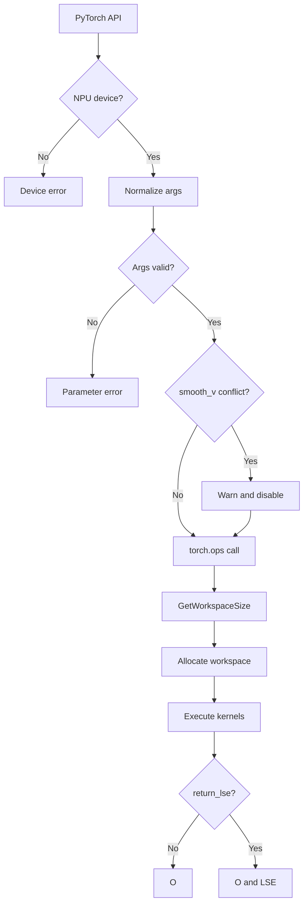
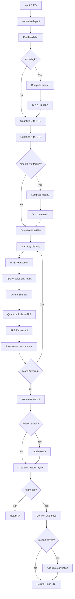
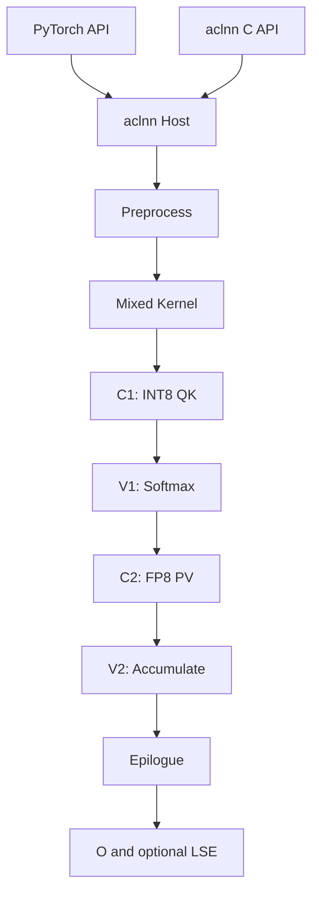
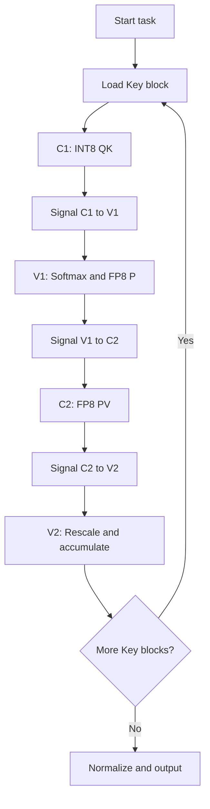

# SageAttention2（INT8 QK + FP8 PV）算子设计文档

## 1. 需求背景（required）

### 1.1 需求来源

| 项目 | 内容 |
|---|---|
| 算子名称 | SageAttention2 |
| 目标芯片 | Atlas 950PR（Ascend 950，CATLASS Arch 3510） |
| 目标软件栈 | CANN 9.2.0-beta.1、AscendC、CATLASS、PyTorch/torch-npu |
| 交付目录 | `experimental/attention/sageattention2` |
| 核心路径 | INT8 QK^T + FP8 PV |
| 接口范围 | PyTorch `sageattn`、`sageattn_qk_int8_pv_fp8_asc`，以及统一 aclnn FP8 PV 入口 |
| 当前状态 | 设计阶段 |
| 实验数据 | 本文不包含实验结果；精度和性能表仅定义后续验收口径 |

### 1.2 背景介绍与目标

标准注意力为：

```text
O = Softmax(Q * K^T * s) * V
s = 1 / sqrt(D)    # 默认值，D 为 pad 前的 head dimension
```

长序列场景中，两次矩阵乘 QK^T 与 PV 是主要计算开销。SageAttention2 通过对 Q/K 做细粒度 INT8 量化、对 P/V 使用 FP8，并结合 outlier smoothing 与两级累加，在控制误差的同时降低 Cube 计算和数据搬运成本。

本设计在 Atlas 950PR 上实现与开源 SageAttention2 FP8 PV 路径一致的前向语义，目标如下：

1. 对齐 `sageattn` 和 `sageattn_qk_int8_pv_fp8_cuda` 的参数、默认值、返回值和异常行为；NPU 显式接口命名为 `sageattn_qk_int8_pv_fp8_asc`。
2. Kernel 必须由 AscendC 与 CATLASS 联合实现：CATLASS 承担 Cube 主循环与矩阵乘模板，AscendC 承担量化、平滑、在线 Softmax、两级累加控制、LSE 和 epilogue。
3. 不物化完整的 `[Sq, Sk]` attention 矩阵，额外空间复杂度保持线性序列规模。
4. 同时交付 PyTorch 与 aclnn 接口；两条路径分别相对 FIA 达到任务书规定的性能门禁。
5. 仅实现前向 INT8 QK + FP8 PV；不实现 FP16 PV、varlen、反向和 CUDA 符号。

## 2. 需求分析（required）

### 2.1 需求描述

在 Atlas 950PR 上使用 AscendC + CATLASS 实现 SageAttention2 的 INT8 QK^T + FP8 PV 前向路径，并交付共享同一 Device Kernel 的 PyTorch 与 aclnn 接口。功能语义、量化粒度、平滑、累加模式、LSE 以及异常行为均须与任务书指定的开源 SageAttention2 FP8 路径对齐；在不物化完整 attention 矩阵的前提下，满足任务书规定的精度标准和相对 FIA 的性能门禁。

### 2.2 需求拆解

1. 实现 `sageattn` 自动分发与 `sageattn_qk_int8_pv_fp8_asc` 显式 PyTorch API，并提供等价的 aclnn 两阶段接口。
2. 支持 FP16/BF16、HND/NHD、GQA、因果/非因果、D≤128 的 pad/crop、可选 LSE。
3. 实现 `per_thread`/`per_warp` INT8 Q/K 量化、K/V smoothing、E4M3 V 量化和三种 PV 累加模式。
4. 以 AscendC Vector 完成量化、平滑和在线 Softmax，以 CATLASS Arch3510 Cube 组件完成 QK/PV 主循环，建立可验证的 C1/V1/C2/V2 流水。
5. 提供功能、精度、异常、性能和 profiler 验证方案；所有性能结论必须由后续同机实验产生。

### 2.3 算子原型

本算子仅定义一个 Device 计算原型，各接口层共享相同的输入、属性和输出语义：

| 接口层 | 原型名称 | 说明 |
|---|---|---|
| CANN OpDef | `SageAttention2` | `op_host` 注册、InferShape、Tiling 和 Kernel 的统一算子名 |
| aclnn | `aclnnSageAttention2GetWorkspaceSize` / `aclnnSageAttention2` | 必选的两阶段 C API |
| PyTorch 扩展 | `cann_ops_transformer::sage_attention2` | torch extension 内部算子，直接调用 aclnn |
| Python 公开接口 | `sageattn_qk_int8_pv_fp8_asc` | 对齐开源 CUDA 接口；`sageattn` 在 NPU 上分发到该接口 |

#### 2.3.1 CANN OpDef 原型与产品注册

```text
SageAttention2(
    q: Tensor,
    k: Tensor,
    v: Tensor,
    tensor_layout: String = "HND",
    is_causal: Bool = false,
    qk_quant_mode: Int = 0,
    sm_scale: Float,
    pv_accum_mode: Int = 2,
    smooth_k: Bool = true,
    smooth_v: Bool = false,
    return_lse: Bool = false
) -> (
    attention_out: Tensor,
    softmax_lse: Optional[Tensor]
)
```

输入原型如下。三路输入必须同 dtype、同 device，且 Host 侧在 Tiling 前检查该交叉约束；OpDef 的 dtype 列表本身只声明每个 Tensor 可接受的类型。

| 名称 | 参数类型 | dtype | format | shape 与约束 |
|---|---|---|---|---|
| `q` | REQUIRED | FP16、BF16 | ND | HND 为 `[B,Hq,Sq,D]`，NHD 为 `[B,Sq,Hq,D]` |
| `k` | REQUIRED | FP16、BF16 | ND | HND 为 `[B,Hkv,Sk,D]`，NHD 为 `[B,Sk,Hkv,D]` |
| `v` | REQUIRED | FP16、BF16 | ND | 与 K 的 shape、layout、dtype 相同 |

输出原型如下。`attention_out` 的 dtype 由 Q 推导，不能由调用者任意选择；`softmax_lse` 只在 `return_lse=true` 时存在。

| 名称 | 参数类型 | dtype | format | shape 与约束 |
|---|---|---|---|---|
| `attention_out` | REQUIRED | FP16、BF16 | ND | shape、layout、dtype 与 Q 一致 |
| `softmax_lse` | OPTIONAL | FP32 | ND | 固定逻辑 shape `[B,Hq,Sq]`，与 HND/NHD 无关 |

属性原型如下。OpDef 与 aclnn 使用整数枚举，Python 包装层负责把公开字符串转换为枚举：

| 属性 | CANN 类型 | OpDef/aclnn 取值 | Python 取值 | 默认值 |
|---|---|---|---|---|
| `tensor_layout` | String | `HND` / `NHD` | 同左 | `HND` |
| `is_causal` | Bool | `false` / `true` | 同左 | `false` |
| `qk_quant_mode` | Int | `0` / `1` | `per_thread` / `per_warp` | `0` |
| `sm_scale` | Float | 有限浮点数 | `float` | 必选 |
| `pv_accum_mode` | Int | `0` / `1` / `2` | `fp32` / `fp32+fp32` / `fp32+fp16` | `2` |
| `smooth_k` | Bool | `false` / `true` | 同左 | `true` |
| `smooth_v` | Bool | `false` / `true` | 同左 | `false` |
| `return_lse` | Bool | `false` / `true` | 同左 | `false` |

`sm_scale` 在内部原型中是已归一化的必选 Float 属性。Python 入口收到 `None` 时，必须先使用 pad 前原始 D 计算 `1/sqrt(D)`，再调用 PyTorch 扩展和 aclnn；因此 Device Kernel 不使用魔数表示“默认 scale”，显式的 `sm_scale=0.0` 仍保持合法语义。

`op_host/sage_attention2_def.cpp` 应以如下注册代码为基线。输入、输出与属性名称必须与 InferShape、Tiling、aclnn 和 PyTorch 扩展保持一致：

```cpp
#include "register/op_def_registry.h"

namespace ops {
class SageAttention2 : public OpDef {
public:
    explicit SageAttention2(const char *name) : OpDef(name)
    {
        this->Input("q")
            .ParamType(REQUIRED)
            .DataType({ge::DT_FLOAT16, ge::DT_BF16})
            .Format({ge::FORMAT_ND, ge::FORMAT_ND})
            .UnknownShapeFormat({ge::FORMAT_ND, ge::FORMAT_ND});
        this->Input("k")
            .ParamType(REQUIRED)
            .DataType({ge::DT_FLOAT16, ge::DT_BF16})
            .Format({ge::FORMAT_ND, ge::FORMAT_ND})
            .UnknownShapeFormat({ge::FORMAT_ND, ge::FORMAT_ND});
        this->Input("v")
            .ParamType(REQUIRED)
            .DataType({ge::DT_FLOAT16, ge::DT_BF16})
            .Format({ge::FORMAT_ND, ge::FORMAT_ND})
            .UnknownShapeFormat({ge::FORMAT_ND, ge::FORMAT_ND});

        this->Output("attention_out")
            .ParamType(REQUIRED)
            .DataType({ge::DT_FLOAT16, ge::DT_BF16})
            .Format({ge::FORMAT_ND, ge::FORMAT_ND})
            .UnknownShapeFormat({ge::FORMAT_ND, ge::FORMAT_ND});
        this->Output("softmax_lse")
            .ParamType(OPTIONAL)
            .DataTypeList({ge::DT_FLOAT})
            .FormatList({ge::FORMAT_ND})
            .UnknownShapeFormat({ge::FORMAT_ND});

        this->Attr("tensor_layout").AttrType(OPTIONAL).String("HND");
        this->Attr("is_causal").AttrType(OPTIONAL).Bool(false);
        this->Attr("qk_quant_mode").AttrType(OPTIONAL).Int(0);
        this->Attr("sm_scale").AttrType(REQUIRED).Float(1.0f);
        this->Attr("pv_accum_mode").AttrType(OPTIONAL).Int(2);
        this->Attr("smooth_k").AttrType(OPTIONAL).Bool(true);
        this->Attr("smooth_v").AttrType(OPTIONAL).Bool(false);
        this->Attr("return_lse").AttrType(OPTIONAL).Bool(false);

        OpAICoreConfig ascend950Config;
        ascend950Config.DynamicCompileStaticFlag(true)
            .DynamicFormatFlag(false)
            .DynamicRankSupportFlag(false)
            .DynamicShapeSupportFlag(true)
            .NeedCheckSupportFlag(false)
            .PrecisionReduceFlag(true)
            .ExtendCfgInfo("prebuildPattern.value", "Opaque")
            .ExtendCfgInfo("coreType.value", "AiCore")
            .ExtendCfgInfo("opFile.value", "sage_attention2")
            .ExtendCfgInfo("jitCompile.flag", "static_false,dynamic_false");
        this->AICore().AddConfig("ascend950", ascend950Config);
    }
};

OP_ADD(SageAttention2);
} // namespace ops
```

本任务的产品支持范围不是泛化的 Ascend 全系列。OpDef 注册与构建配置必须同时限制到 950 产品：

```cmake
set(SUPPORT_COMPUTE_UNIT "ascend950")
```

| 产品 | CANN compute unit | 本任务状态 |
|---|---|---|
| Atlas 950PR | `ascend950` | 支持，唯一开发与验收目标 |
| Atlas 950DT | 同属 950 产品配置 | 不在任务验收范围，未经独立验证不得声明支持 |
| Atlas A2/A3、Ascend 910B 等 | 未注册 | 不支持本次交付 |

这里采用 `ascend950` 是 CANN 的产品配置键；文档中的硬件承诺仍严格限定为任务书指定的 Atlas 950PR。`experimental/math/bitwise_and` 可用于理解最小 OpDef 骨架，但其当前代码注册的是 `ascend910b`；本算子的 950 产品写法参考已迁入 `math/bitwise_and` 的正式实现。单有 Kernel 代码并不构成产品使能，必须同时存在 `AICore().AddConfig("ascend950", ...)` 和构建侧 `SUPPORT_COMPUTE_UNIT`。

#### 2.3.2 PyTorch 扩展原型

```text
cann_ops_transformer::sage_attention2(
    Tensor q,
    Tensor k,
    Tensor v,
    str tensor_layout,
    bool is_causal,
    int qk_quant_mode,
    float sm_scale,
    int pv_accum_mode,
    bool smooth_k,
    bool smooth_v,
    bool return_lse
) -> (Tensor, Tensor)
```

为保持 torch schema 和 FakeTensor/Meta 实现稳定，内部扩展固定返回两个 Tensor；当 `return_lse=false` 时第二个 Tensor 为 shape `[0]` 的 FP32 空 Tensor。Python 公开接口负责隐藏该占位输出，只返回 `attention_out`；当 `return_lse=true` 时返回 `(attention_out, softmax_lse)`。

#### 2.3.3 aclnn C 接口原型

```cpp
aclnnStatus aclnnSageAttention2GetWorkspaceSize(
    const aclTensor *q,
    const aclTensor *k,
    const aclTensor *v,
    const char *tensorLayout,
    bool isCausal,
    int64_t qkQuantMode,
    double smScale,
    int64_t pvAccumMode,
    bool smoothK,
    bool smoothV,
    bool returnLse,
    const aclTensor *attentionOut,
    const aclTensor *softmaxLseOptional,
    uint64_t *workspaceSize,
    aclOpExecutor **executor);

aclnnStatus aclnnSageAttention2(
    void *workspace,
    uint64_t workspaceSize,
    aclOpExecutor *executor,
    const aclrtStream stream);
```

第一阶段完成参数校验、输出一致性检查、Tiling 和 workspace 计算。`returnLse=false` 时 `softmaxLseOptional` 允许为空或指向 `[0]` 占位 Tensor；为 `true` 时必须提供 FP32 `[B,Hq,Sq]` Tensor。第二阶段只消费第一阶段生成的 executor，不再解释公开字符串或重新计算默认属性。

### 2.4 PyTorch API

```python
from typing import Any, Optional, Tuple, Union
import torch

def sageattn(
    q: torch.Tensor,
    k: torch.Tensor,
    v: torch.Tensor,
    tensor_layout: str = "HND",
    is_causal: bool = False,
    sm_scale: Optional[float] = None,
    return_lse: bool = False,
    **kwargs: Any,
) -> Union[torch.Tensor, Tuple[torch.Tensor, torch.Tensor]]: ...

def sageattn_qk_int8_pv_fp8_asc(
    q: torch.Tensor,
    k: torch.Tensor,
    v: torch.Tensor,
    tensor_layout: str = "HND",
    is_causal: bool = False,
    qk_quant_gran: str = "per_thread",
    sm_scale: Optional[float] = None,
    pv_accum_dtype: str = "fp32+fp16",
    smooth_k: bool = True,
    smooth_v: bool = False,
    return_lse: bool = False,
    **kwargs: Any,
) -> Union[torch.Tensor, Tuple[torch.Tensor, torch.Tensor]]: ...
```

`sageattn` 在 NPU 上固定分发到 `sageattn_qk_int8_pv_fp8_asc`，默认使用 `pv_accum_dtype="fp32+fp16"`。允许通过已文档化的 `kwargs` 或环境变量覆盖累加模式，但非法值必须直接报错。

### 2.5 输入、输出与布局

| 项 | HND | NHD |
|---|---|---|
| Q | `[B, Hq, Sq, D]` | `[B, Sq, Hq, D]` |
| K/V | `[B, Hkv, Sk, D]` | `[B, Sk, Hkv, D]` |
| O | `[B, Hq, Sq, D]` | `[B, Sq, Hq, D]` |
| LSE | `[B, Hq, Sq]` | `[B, Hq, Sq]` |

实现通过 layout-aware stride 计算统一逻辑坐标，不为 NHD 单独物化全量转置。输出 dtype 与 Q 相同。`return_lse=False` 时只返回 O；为 `True` 时返回 `(O, LSE)`。

### 2.6 参数检查

Host 侧在申请 workspace 前完成下列检查：

- Q/K/V 均为 `float16` 或 `bfloat16`，dtype 相同且位于同一 NPU device。
- 三者 `stride(-1) == 1`；布局只能为 `HND` 或 `NHD`。
- `Hq % Hkv == 0`，GQA 分组数为 `G = Hq / Hkv`。
- 原始 head dimension 满足 `0 < D <= 128`；`D < 64` 时 pad 到 64，`64 < D < 128` 时 pad 到 128，输出再裁回原始 D。
- `is_causal=True` 时要求 `Sq == Sk`。
- `qk_quant_gran` 只能为 `per_thread` 或 `per_warp`。
- `pv_accum_dtype` 只能为 `fp32`、`fp32+fp32` 或 `fp32+fp16`。
- `attn_mask` 不在本任务范围；若通过 `kwargs` 传入非 `None` 值则报错。
- `smooth_v=True` 且累加模式为 `fp32+fp32` 或 `fp32+fp16` 时，按开源行为发出 warning 并忽略 `smooth_v`。

`sm_scale=None` 时使用 pad 前原始 D 计算 `1/sqrt(D)`。

### 2.7 接口调用流程

aclnn 层采用 2.3.3 节定义的两阶段调用：先由 `aclnnSageAttention2GetWorkspaceSize` 校验参数、生成 Tiling 并返回 workspace 大小和 executor，再由 `aclnnSageAttention2` 在指定 stream 上执行。其语义必须与 `sageattn_qk_int8_pv_fp8_asc` 一致。

PyTorch 适配层只负责参数规范化、调用 aclnn 和返回值封装，不在 Python 侧执行量化或 layout 转换。这样 PyTorch 与 aclnn 性能路径共享同一套 Kernel，避免双实现漂移。

#### 2.7.1 PyTorch 接入流程图



图中 `Normalize args` 包括默认参数处理以及使用 pad 前 D 计算 `sm_scale`；`Args valid` 覆盖 dtype、layout、shape、stride 和枚举校验；`GetWorkspaceSize` 完成二次校验、Host Tiling 和 executor 创建；`Execute kernels` 在当前 stream 上启动预处理与主 Kernel。

Python 不执行 `mean`、量化、转置、pad、LSE correction 或同步；这些步骤全部位于 aclnn/Host 与 Device Kernel 中。因而 PyTorch 性能测试测到的是同一套 aclnn 核心路径，而不是另一个 Python 实现。

#### 2.7.2 PyTorch SageAttention2 参考实现流程图

AscendC 实现不照搬 PyTorch/CUDA 的物理执行方式，但必须理解并对齐其数值数据流。下图给出 `sageattn_qk_int8_pv_fp8_cuda` 的参考语义；它是 NPU 算子进行功能拆分、量化 scale 设计、Kernel 流水设计和精度对比的基线。



图中的 Q/K 量化分别使用 `qk_quant_gran` 指定的 `per_thread` 或 `per_warp` 逻辑分组；V 使用沿 Sk reduction 的 per-channel E4M3 scale。GQA 场景通过 `hq // G` 选择对应 KV head。`Online Softmax` 维护逐行最大值与归一化和，不物化完整的 `[Sq, Sk]` 概率矩阵。

PyTorch 参考步骤与 AscendC/CATLASS 开发模块的对应关系如下：

| PyTorch 参考语义 | AscendC/CATLASS 落点 | 必须对齐的内容 |
|---|---|---|
| layout、pad、默认 scale | Host Tiling、layout-aware 地址计算 | 原始 D、Dpad、stride、输出裁剪 |
| K/V smoothing、Q/K/V quant | Preprocess 或主 Kernel Vector 阶段 | reduction 轴、分组边界、scale、mean |
| QK、mask、Softmax、P quant、PV | C1/V1/C2/V2 流水 | causal 语义、在线状态、FP8 格式、累加模式 |
| normalize、meanV、LSE correction | V2 与 epilogue | 输出 dtype、底数换算、GQA head 映射 |

该流程图描述的是**数值依赖关系**，不是要求 NPU 依次启动同数量的 Kernel。交付实现应尽可能融合这些步骤，并以第 3 章的 AscendC/CATLASS 流水为实际执行结构；任何融合、重排或物理 layout 变化都不能改变表中的参考语义。

## 3. 详细设计（required）

### 3.1 使能方式

| 上层框架 | 是否涉及 |
|---|---|
| PyTorch 训练 | 否（仅前向推理） |
| PyTorch 推理 | 是 |
| aclnn 直调 | 是 |
| ATC 图模式 | 不作为本任务门禁 |
| OPAT 调优 | 后续可接入 |

### 3.2 数值算法

#### 3.2.1 K outlier smoothing

当 `smooth_k=True` 时，沿 K 的序列维计算：

```text
meanK[b, hk, d] = (1 / Sk) * sum_j K[b, hk, j, d]
K_tilde = K - meanK
```

对某个 Query 行，减去 `meanK` 只会给该行全部 logits 加上同一个常数，因此 Softmax 输出不变。LSE 需要补回校正项：

```text
correction[b, hq, i] = dot(Q[b, hq, i, :], meanK[b, floor(hq / G), :])
```

GQA 时按 Query 到 KV head 的映射广播 `meanK`，而不是复制完整张量。

#### 3.2.2 Q/K INT8 细粒度量化

对每个逻辑量化组 `x_g` 使用对称量化：

```text
a_g  = max(abs(x_g))
s_g  = a_g / 127
x8_g = clip(round(x_g / s_g), -127, 127)
```

零组使用安全 scale，避免除零。`per_warp` 和 `per_thread` 是开源算法的分组语义，不是 AscendC 内置枚举。NPU 实现用 AscendC Vector reduction 和逻辑 Tile 分区复现相同的 scale 边界；物理 Vector lane、Cube Tile 可以调整，但只有通过 GPU 同配置精度对齐后才可采用。

初始分块严格从开源 FP8 路径起步：`BLKQ=128`、`WARPQ=32`、`BLKK=64`，`per_thread` 另使用 `WARPK=64`。其中 `per_warp` 的 Q scale 逻辑形状为 `[B,Hq,ceil(Sq/128)×4]`，K scale 为 `[B,Hkv,ceil(Sk/64)]`；`per_thread` 须按 Triton 参考的行/线程分组另行对齐。具体物理存储可改为 CATLASS 友好布局，但逻辑组边界不能未经精度验证而改变。

量化后 QK Tile 的反量化为：

```text
S[i, j] = dot(Q8[i, :], K8[j, :]) * scaleQ[i] * scaleK[j] * sm_scale
```

#### 3.2.3 V 与概率 Tile 的 FP8 路径

V 按开源等价的 per-channel 语义量化为 FP8 E4M3：量化 reduction/group 轴是 Sk，即每个 `(b,hkv,d)` 对全部有效 Key 位置求 scale，输出 `[B,Hkv,D]` FP32 scale。GPU 参考会把 V 的序列维 pad 到 64 的倍数，转成以 D 为主的布局，并在每 16 个序列位置内采用 `[0,1,8,9,2,3,10,11,4,5,12,13,6,7,14,15]` 排列。NPU 不要求照搬 CUDA 的物理排列，而应选择 CATLASS/Cube 原生 layout；但 per-channel scale、有效 Sk 和 pad 屏蔽后的数值必须等价。一般累加模式的 `scale_max` 按开源使用 448.0；默认 `fp32+fp16` 路径使用 2.25。概率 Tile 在在线 Softmax 后量化为 FP8，再由 CATLASS 执行 FP8 PV Cube 主循环。

API 的数值契约是 E4M3 per-channel V。CATLASS 的 MXFP8 示例只用于学习 950PR 的 FP8 Cube 流水；若 MXFP8 的 32-data 共享 scale 粒度不能严格映射到上述 per-channel 参考语义，不得把它静默替换为本算子的 V 格式。

当 `smooth_v=True` 且累加模式允许时：

```text
meanV = mean(V, axis=Sk)
V_tilde = V - meanV
```

主循环使用 `V_tilde`，epilogue 利用 Softmax 行和为 1 的性质补回 `meanV`。默认两级累加路径按接口约定忽略此选项并给出 warning。

#### 3.2.4 在线 Softmax

每个 Query Tile 只保留行最大值 `m`、归一化和 `l` 以及输出累加器。遍历第 t 个 Key Tile 时：

```text
m_new     = max(m, rowmax(S_t))
alpha     = exp(m - m_new)
P_t       = exp(S_t - m_new)
l_new     = alpha * l + rowsum(P_t)
O_acc_new = alpha * O_acc + P_t * V_t
```

最后输出 `O/l`。因果场景跳过完全位于因果线之外的 Key Tile，仅对对角 Tile 做逐元素 mask。该设计不写出完整 attention 矩阵。

首个 Key Tile 前显式初始化 `m=-∞、l=0、O_acc=0`；首块没有前序状态，V2 跳过 rescale，不能读取未生成的 `alpha`。因果/尾块 mask 写入大有限负数而非 `-∞`，避免整行屏蔽时出现 `-∞-(-∞)=NaN`。完全屏蔽的 Tile 同时跳过 C1 与 V1（或明确产生全 0 P tile），不能只跳 QK 仍更新 softmax state。末块 normalize 前对 `l` 做下限保护，padding 行输出强制清零。

内部若使用 `exp2`，LSE 先按内部底数计算，再依开源返回语义执行：

```python
lse_out = lse_internal / 1.44269504
if smooth_k:
    lse_out += lse_correction * sm_scale
```

#### 3.2.5 PV 累加模式

| 模式 | 设计语义 |
|---|---|
| `fp32` | 以 FP32 保存主输出累加状态，优先精度；用于精度基线和回归 |
| `fp32+fp32` | Cube 局部低精度 MMA 累加，达到固定 K-step 后归约到 FP32 二级 buffer |
| `fp32+fp16` | Cube 局部低精度 MMA 累加，定期归约到 FP16 二级 buffer；为默认性能路径 |

周期归约间隔是 tiling 参数，需要联合误差和吞吐调优。任何调整都必须分别对齐 GPU 相同 `pv_accum_dtype` 的 golden，不能跨累加模式比较。

### 3.3 总体架构



`aclnn Host` 负责参数校验、workspace 和 Tiling；`Preprocess` 完成 K/V mean、K INT8 与 V E4M3 pack；`Mixed Kernel` 为 `__mix__(1,2)` AscendC + CATLASS 主 Kernel；`Epilogue` 完成 normalize、crop、cast 和 K-mean LSE correction。

#### 3.3.1 模块边界

| 模块 | 主要职责 | 技术实现 |
|---|---|---|
| Python | API、自动分发、warning、错误映射 | torch-npu 自定义算子适配 |
| aclnn/Host | shape/dtype 校验、workspace、tiling key、Kernel launch | aclnn + Ascend Host API |
| Smooth/Quant | K/V mean、Q/K INT8、V FP8、scale 生成、pad | AscendC Vector |
| QK 主循环 | INT8 Cube GEMM、Tile 搬运、双缓冲 | CATLASS MatMul/Tile/Mmad |
| Softmax | 反量化、scale、mask、row max/sum、online state | AscendC Vector |
| PV 主循环 | P/V FP8 GEMM、局部累加 | CATLASS FP8 MatMul/FA 组件 |
| Epilogue | 二级归约、除 l、smooth_v correction、LSE、裁剪与 cast | AscendC Vector |

#### 3.3.2 CATLASS 复用设计

CATLASS 为本算子提供 Arch3510 的矩阵乘、数据搬运和 Cube/Vector 协同基础能力，但不直接提供完整的 SageAttention2 INT8 QK + FP8 PV Kernel。CATLASS 依赖版本与 CANN 9.2.0-beta.1 的配套版本保持一致，并在工程依赖配置中锁定；本节约束需要复用的能力、适配范围和实现边界。

可参考和复用的组件如下：

- `examples/49_ascend950_flash_attention_infer`：参考 `MmadFAIQK`/`MmadFAIPV`、`EpilogueAscend950FASoftmax`/`FARescaleO` 以及 AIC/AIV 在线流水结构。现有 FP16/BF16 实例用于理解流水和接口，低精度数据路径由本算子适配。
- `examples/51_ascend950_quant_matmul_per_group_per_block_tla` 与 `examples/57_ascend950_matmul_full_dequant`：复用 INT8×INT8→INT32 Cube MatMul、ping-pong 分块和反量化的基础实现方式。
- `examples/53_ascend950_fp8_mx_matmul` 与 `examples/58_ascend950_fp8_mx_batch_matmul`：复用 E4M3 数据类型、FP8 Cube MatMul 和相关搬运能力；scale 的生成、存储和应用必须适配本算子的 per-channel V 与 per-Tile P 语义。
- `examples/70_ascend950_flash_attention_chunk_prefill`：参考长序列分块、任务调度和尾块处理方式。

各能力的复用边界如下：

| 能力 | CATLASS 复用内容 | SageAttention2 自研或适配内容 |
|---|---|---|
| Attention 流水 | Tile 搬运、AIC/AIV 同步、QK/PV 阶段组织 | INT8 QK、FP8 PV 的数据类型与 scale 接入 |
| INT8 Cube MatMul | Block Mmad、ping-pong 和 INT32 累加 | Q/K 分组量化、scale 映射和 GQA head 映射 |
| FP8 Cube MatMul | E4M3 操作数、Mmad 和基础 layout 能力 | V per-channel scale、P Tile scale 和 PV 累加模式 |
| Vector 计算 | CATLASS 流水中的 Vector 协同接口 | K/V smoothing、反量化、mask、在线 Softmax 和 LSE |
| 长序列调度 | chunk prefill 的分块与调度方式 | causal 裁剪、尾块有效长度和 SageAttention2 tiling key |

编译目标统一使用 `CATLASS_ARCH=3510`。实现通过 CATLASS 组件的 `Params` 和 Device Kernel 接口进行集成，不把示例程序的测试封装带入 aclnn 交付路径。QK 与 PV 的模板组合、layout 和 scale 接口在编码初期通过最小编译用例确认；若现有组件不能直接组合，则增加本算子的适配层，但不得改变第 3.2 节定义的数值语义。CATLASS include 由 CMake 显式配置，workspace 从 aclnn 入口透传，Host 与 Kernel 共用同一纯 POD tiling 数据结构。

### 3.4 Kernel 与 Tiling 设计

#### 3.4.1 执行阶段

交付架构采用两个预处理 Kernel 加一个主 Kernel；分离的 `QuantizeQ` 仅允许作为调试脚手架，不属于最终性能设计：

1. `ReduceMeanKV`：只按有效 flags 计算 K mean；仅当 `smooth_v_effective=True` 时同时计算 V mean。全序列 reduction 无法并入逐 Query Tile 主循环。
2. `QuantizePackKV`：第二遍读取 K，把 smoothing、pad 与 INT8 量化融合；同次 launch 完成 V 的 E4M3 per-channel scale、量化和 CATLASS 原生 layout pack。K/V 只按 Hkv 生成，供同组 Query heads 复用。
3. `AttentionForward`：`__mix__(1,2)`，最终路径在搬入 Query Tile 时融合 Q INT8 量化，并执行 C1/V1/C2/V2、normalize、crop 与可选 LSE。

这样最终路径不生成全量 Q8 workspace，同时避免 K/V 被 GQA 的每个 Query head 重复量化。实现期可以用独立 `QuantizeQ` 定位精度，但合入前必须回到上述融合架构。

GQA 合并时，搬运阶段从 `curG` 个 Query heads 各取一个 `[Bq,D]` Tile，在 L1/A1 中打包为逻辑 `[curG*Bq,Dpad]`；每行同时携带原始 `(hq,qIndex)` 元数据，确保 `per_thread/per_warp` scale 边界、causal 行号、LSE 与输出地址仍按原 head 解释。V2 按同一元数据把结果 scatter/crop 回 HND/NHD。该打包只存在于有界 Tile，不生成全量 layout 转置。

#### 3.4.2 初始 Tile 候选

| Dpad | Query Tile Bq | Key Tile Bk | 说明 |
|---|---:|---:|---|
| 64 | 128 | 64 | 对齐参考算法主分块，优先减少 scale 语义偏差 |
| 128 | 128 | 64 | 覆盖验收主力 D=128 |

`Bq=128、Bk=64` 是与开源量化组边界一致的设计块，不是实验结论。GQA 的有效 Cube M 维为：

```text
mEff = Bq * curG
curG <= G = Hq / Hkv
```

`curG` 不硬编码，由 Host Tiling 在以下约束的交集中取最大合法值：

```text
mEff * Dpad * sizeof(Q8)                 <= L0A
Dpad * Bk * sizeof(K8)                   <= L0B
mEff * max(Bk, Dpad) * sizeof(FP32)      <= L0C
UB_total(mVec, Bk, Dpad, depth)          <= UB_query
```

其中 `mVec=ceil(mEff/2)` 是双 AIV 每侧处理的行数；L0A/L0B/L0C/UB 均由 `PlatformAscendC::GetCoreMemSize` 查询。若 `G>curG_max`，只在 G 维增加 `gBlock`，不拆散同一个 `gBlock` 内共享 KV head 的 Query heads。

#### 3.4.2.1 三通道 Roofline（设计期符号模型）

单个 `(Bq,curG,Bk,Dpad)` tile 的主要计算量为：

```text
F_cube ~= 4 * mEff * Bk * Dpad
```

分别建立 Cube、HBM 和 AIC↔AIV 片上通路上界：

```text
T_tile >= max(
    F_cube    / Peak_INT8_FP8,
    Bytes_HBM / BW_HBM,
    Bytes_CV  / BW_CV
)
```

`Bytes_HBM` 分项计入 K8/V8、scales、Q 原始输入、O_acc streaming 与最终输出；`Bytes_CV` 单独计入 S/P/PV tile，禁止把片上握手混入 HBM 算术强度。峰值与带宽使用当前 SKU 的运行时/平台数据，不把 950PR 典型值写入 Tiling。设计选择最大合法 `curG` 以提高 `mEff` 与 K/V 复用；最终属于 compute、HBM 或 cross-core bound，须由后续 profiler 判定，本文不伪造结论。

#### 3.4.3 核间并行

默认 task 级并行的逻辑任务展开为：

```text
task = (b, hkv, floor(q / Bq), gBlock)
```

其中一个 task 合并同一 KV head 下 `[gBlock*curG, min(G,(gBlock+1)*curG))` 的 Query heads，形成 `mEff=Bq*curG`；`S_k`/Key Tile 不是 task 维度，而是在 task 内严格顺序遍历，以保证 online max、sum 和 O 状态连续。任务总数为：

```text
totalTasks = B * Hkv * ceil(Sq / Bq) * ceil(G / curG)
```

`aicNum=PlatformAscendC::GetCoreNumAic()`，`usedCoreNum=min(aicNum,totalTasks)`。Kernel 按均匀闭式区间分发任务，`aiCoreIdx>=usedCoreNum` 直接返回；causal 场景默认采用 Query block zigzag 分配并跳过完全屏蔽的 Key blocks，以降低尾核负载差异。

强制验收形状均为 prefill，默认 task 数可覆盖可见 AIC。只有同时满足 `totalTasks<aicNum`（默认切分吃不满物理 AIC）、`Sq==1`、`Sk>2048` 且实现了 partial max/sum/O combine 时才允许启用 split-KV；本任务的 P-01～P-07 不触发该分支。尾块使用有效长度字段，padding 行在 Softmax 前写大有限负数，且最终输出清零。

#### 3.4.4 流水与存储层级

主 Kernel 固定为 `__mix__(1,2)` 模式 B，1 个 AIC 配 2 个 AIV；同步使用 950PR 支持的 `CrossCoreSetFlag/WaitFlag<4, pipe>`，Set/Wait 两侧 modeId 与 PIPE 显式一致。AIC 对 AIV1 的 flagId 使用目标头文件规定的偏移，且 stage flag 与 task-boundary flag 不复用。



| 阶段 | 详细职责 |
|---|---|
| C1 / AIC | `Q8 × K8^T -> INT32 Sraw tile` |
| V1 / 双 AIV | INT32 反量化到 FP32，执行 scale、mask、online max/sum，并把 P 转为 FP8 |
| C2 / AIC | `P8 × V8 -> FP32 PV tile` |
| V2 / 双 AIV | rescale `O_acc`，累加 PV，并更新 running state |
| 输出 | sum 下限保护、normalize、crop、cast 与可选 LSE |

选用 2 级软流水并启用 ring buffer，默认 `PRELOAD_N=2`，编排为 `C1+V1(本轮)` 与 `C2+V2(loop-PRELOAD_N)` 交错；V1/V2 使用物理隔离的状态槽。精确深度只可在 1/2/3 中按 profiler 标定，但交付架构不得退化为逐 Key block 全串行。

槽语义和公式分离：`handshakeSlot=loop&(DB-1)`（S/P/PV 双缓冲）、`stateSlot=mloop%(PRELOAD_N+1)`（running max/sum）、`selfRefSlot=loop%(PRELOAD_N+1)`（O_acc）、`cacheSlot=loop&(CACHE_SIZE-1)`（task metadata）。不同槽不得共用常量或计数器。

S/P/PV 只以有界 Tile 存在，不物化完整 attention 矩阵。950PR 优先采用 `L0C→UB` 与 `UB→L1` 片上路径；Fixpipe 到 UB 必须显式使用 `isToUB=true` 的 Arch3510 配置。若实际 CATLASS 9.2 组件无法暴露该通路，才允许将单个 Tile 放入按 core 复用的 GM handshake 段，不得退回全量 P workspace。Q/K pad 在搬入/量化时完成；`return_lse=False` 时不分配 LSE 输出，但 running max/sum 仍保留。

`PipeBarrier<PIPE_ALL>` 仅允许出现在目标 CANN 文档确认“无对应 HardEvent”的跨 pipe 边界；正常 C1↔V1↔C2↔V2 依赖使用精确 flag/HardEvent。最终组件冻结时必须列出 barrier 契约位置和预计数量，禁止把它当通用保险屏障。

#### 3.4.5 Workspace

Workspace 按职责分段，Query 量化已融合，因而没有全量 Q8 段：

| 段 | 大小公式（对齐后） | 生命周期/说明 |
|---|---|---|
| K8 + K scales | `B*Hkv*Sk*Dpad*sizeof(int8) + scaleKBytes` | 预处理结果，跨同组 Query heads 复用 |
| V8 + V scales | `B*Hkv*SkPad*Dpad*sizeof(fp8) + B*Hkv*D*sizeof(fp32)` | E4M3 原生 pack；scale reduction 轴为 Sk |
| mean K / mean V | `B*Hkv*D*sizeof(fp32)`/项 | 仅 effective smoothing 开启时分配 |
| O_acc self-ref | `Nconc*selfRefSlots*mEff*Dpad*sizeof(fp32)` | GM streaming；按 core/task 槽复用 |
| softmax state spill | 默认 0 | max/sum/exp state 固定在 UB 独立槽；只有实际 9.2 API 强制 GM 状态时才按 `Nconc*stateSlots*mEff*3*DATABLOCK_BYTES` 启用 |
| S/P/PV handshake | 默认 0；fallback 为 `Nconc*DB*tileBytes` | 950PR 片上直通失败时才启用的有界 Tile 段 |
| split-KV partial | 默认 0 | 仅满足 3.4.3 的 decode 分支时按运行时 Sk 分配 |
| executor/alignment | aclnn 返回值 | 按 API 对齐 |

其中：

```text
Nconc = min(totalTasks, usedCoreNum)
workspaceTotal = workspace_preprocess + Nconc * workspace_perCore
```

per-core 段按 `aiCoreIdx` 寻址并在连续 task 之间复用，严禁把 `totalTasks` 当作 scratch 外层乘子。`GetWorkspaceSize` 必须基于运行时 Sq/Sk、effective flags 与实际对齐动态计算，禁止按最大 Sk 静态预留。

UB 预算采用唯一公式源，Host 反推 `curG/chunkRows` 与 Kernel `InitBuffer` 必须逐项一致：

```text
UB_total =
    DB * mVec * BkPad * sizeof(FP32)
  + DB * mVec * BkPad * sizeof(FP8)
  + stateSlots * mVec * 3 * DATABLOCK_BYTES
  + softmaxTmp_query
  + chunkRows * Dpad * sizeof(FP32) * nV2Buffers
  + maskTmp_effective
```

`chunkRows=floor(chunkBufferBytes/(Dpad*sizeof(FP32)))`。任一 DataCopy 超过单槽容量时，V1/V2 对称进入 chunk loop。O_acc 不常驻 UB，以同一 `streamingMode` TilingData 字段强制 Host/Kernel 一致。

L1 端口固定为 Q/P→A1、K/V→B1；L0 容量用 3.4.2 的公式校核。M/N/K-axis 分块均走单一循环代码路径，小 shape 循环一次，分块上限由运行时 L1/L0 查询值决定。整体空间仍为线性序列规模，禁止任何 `O(B * Hq * Sq * Sk)` 全量 attention workspace。

#### 3.4.6 Tiling key

Tiling key 至少编码：

`Dpad × layout × causal × GQA bucket × qk_quant_gran × pv_accum_dtype × smooth_k × smooth_v_effective × return_lse × sequence bucket`。

Host 不为每个 shape 生成任意模板，而是把 Sq/Sk 映射到有限 bucket，并把尾长写入 tiling data，以控制二进制体积。

TilingData 还必须携带：`Bq/Bk/mEff/curG/gBlocks/chunkRows`、有效尾长、`totalTasks/usedCoreNum`、各 workspace 段 offset/bytes、`streamingMode`、各 slot 深度、UB/L1/L0 查询值，以及 SoftmaxFlashV2 Host tiling 数据。`isBasicBlock` 等模板选择必须与 Device 侧调用完全一致。

### 3.5 性能优化设计

性能优化按以下优先级实施：

1. **低精度 Cube 吞吐**：QK 固定走 INT8 Cube、PV 固定走原生 FP8 Cube，避免 Vector 模拟矩阵乘。
2. **不落 P**：QK、Softmax 与 PV 在同一主 Kernel 内流水，避免 `Sq * Sk` 级读写。
3. **Vector/Cube 重叠**：通过 ping-pong buffer 隐藏反量化、Softmax 和搬运时间。
4. **GQA K/V 复用**：量化 K/V 只按 Hkv 生成，按 G 个 Query head 消费。
5. **融合 Q 量化**：交付路径在搬入 Query Tile 时完成 Q quant，不写全量 Q8 workspace；独立 QuantizeQ 只能用于调试。
6. **因果块裁剪**：跳过严格上三角完整块，只在对角块执行 mask。
7. **特化 D=64/128**：消除主力路径动态循环；非标准 D 复用 pad 后模板。
8. **减少 Host 开销**：PyTorch 和 aclnn 共用 executor/Kernel，支持 tiling cache；性能计时排除首次编译/JIT。

性能目标是任务书要求的结果门禁，不在设计阶段预设某一优化必然产生固定百分比收益。

## 4. 特性交叉分析

| 交叉特性 | 设计处理 |
|---|---|
| HND/NHD × Quant | 量化组按逻辑 Q/K 行定义，layout 只改变地址计算，不改变 scale 分组语义 |
| GQA × smooth_k | K mean 只按 Hkv 计算；LSE correction 按 `hq // G` 映射，不复制 K mean |
| causal × Tile | 跳过完整上三角 Key Tile，对角 Tile 使用有效 mask；仅支持 `Sq == Sk` |
| pad D × sm_scale | Cube 使用 Dpad=64/128，默认 scale 始终由 pad 前 D 计算，输出裁回 D |
| smooth_v × accum | `fp32` 可执行 V smoothing；两个两级累加模式 warning 后忽略，保持开源行为 |
| return_lse × smooth_k | 返回 LSE 时同时执行底数换算和 Q·mean(K) correction |
| BF16 × Quant | 输入转换和 reduction 使用足够的中间精度，INT8/FP8 主路径与 FP16 共用 |
| GQA × 性能调度 | Quant K/V 按 Hkv 生成；相同 KV head 的 Query head 邻近调度以争取缓存复用 |

本任务没有反向、varlen、自定义 attention mask 或多卡 Ring Attention Kernel。`return_lse` 仅保证数值接口可供上层分布式算法使用，不将分布式通信纳入交叉特性。

## 5. 可维可测分析

本节只定义方法，不填写实验结果。

### 5.1 功能用例

覆盖以下组合：

- FP16/BF16，HND/NHD，MHA/GQA，非因果/因果。
- `per_thread`/`per_warp` 与三种 `pv_accum_dtype` 的笛卡尔组合。
- `smooth_k`、`smooth_v`、warning、`return_lse`。
- D=48→64、D=96→128 的 pad/crop。
- Sq≠Sk 的非因果场景，以及 S=8K/16K 长序列。
- D>128、末维不连续、非法 gran、非法 accum、非空 `attn_mask` 等负向用例。
- `F.scaled_dot_product_attention = sageattn` 的 example 级冒烟。

### 5.2 精度策略

L-A 主标杆为 GPU `sageattn_qk_int8_pv_fp8_cuda`，必须保持 qk gran、accum、smoothing、scale、causal 和输入完全一致。FP16/BF16 输出按任务书混合容差验收：

| dtype | rtol | atol | matched ratio | max abs error |
|---|---:|---:|---:|---:|
| FP16 | `2^-9` | `2^-9` | ≥0.99 | 1e-1 或 32×ULP |
| BF16 | `2^-6` | `2^-6` | ≥0.99 | 1e-0 或 32×ULP |

L-B 辅标杆为 FP32 SDPA。NPU 与 GPU-Sage 相对真值误差之比要求 max≤2、mean≤1.2、RMSE≤1.2。LSE 单独使用 FP32/混合容差，并重点检查 smooth_k + GQA correction。

### 5.3 性能方法

- 同一 Atlas 950PR、CANN 9.2.0-beta.1、shape、dtype、输入和 stream。
- PyTorch 路径对比 `torch_npu.npu_fused_infer_attention_score`；aclnn 路径对比 `aclnnFusedInferAttentionScoreV5`。
- 固定 FIA API 版本与合法高性能参数；HND 对齐 FIA `BNSD`。
- 排除首次编译/JIT，充分 warmup；主口径使用 msprof 的 device `task_time` 并记录 min-of-N，NPU Event 仅作端到端交叉检查，不能用含 Python/launch/layout 开销的 host wall time 替代 Kernel 时间。
- 每个 P-01～P-07、每条接口路径均要求 `T_FIA / T_Sage >= 1.6`，两条路径的几何平均也分别达到 1.6。

| 编号 | 场景 | PT FIA | PT Sage | PT Speedup | aclnn FIA | aclnn Sage | aclnn Speedup | 状态 |
|---|---|---:|---:|---:|---:|---:|---:|---|
| P-01 | `[1,32,4096,128]` FP16 | 待测 | 待测 | 待测 | 待测 | 待测 | 待测 | 未实验 |
| P-02 | `[1,32,8192,128]` FP16 | 待测 | 待测 | 待测 | 待测 | 待测 | 待测 | 未实验 |
| P-03 | `[1,32,8192,128]` causal | 待测 | 待测 | 待测 | 待测 | 待测 | 待测 | 未实验 |
| P-04 | `[2,32,8192,128]` FP16 | 待测 | 待测 | 待测 | 待测 | 待测 | 待测 | 未实验 |
| P-05 | GQA 32/8，S=4096，D=128 | 待测 | 待测 | 待测 | 待测 | 待测 | 待测 | 未实验 |
| P-06 | `[1,32,4096,128]` BF16 | 待测 | 待测 | 待测 | 待测 | 待测 | 待测 | 未实验 |
| P-07 | `[1,32,16384,128]` FP16 | 待测 | 待测 | 待测 | 待测 | 待测 | 待测 | 未实验 |

## 6. 参考资料

1. [SageAttention 官方仓库](https://github.com/thu-ml/SageAttention)，重点参考 `sageattention/core.py`、量化实现与 FP8 路径。
2. [SageAttention2 论文](https://arxiv.org/abs/2411.10958)。
3. [CANN ops-transformer](https://gitcode.com/cann/ops-transformer)，交付目录 `experimental/attention/sageattention2`，性能基线 `attention/fused_infer_attention_score`。
4. [CATLASS](https://gitcode.com/cann/catlass)，Ascend 950 FlashAttention、FP8/MXFP8 和低精度 MatMul 样例。
5. CANN 9.2.0-beta.1 AscendC 编程指南与 aclnn 开发规范。
6. 任务书配套 `sageAttentionTest` 与生态算子开源精度标准。
7. CANN ops-math [`experimental/math/bitwise_and`](https://gitcode.com/cann/ops-math/tree/master/experimental/math/bitwise_and) 与当前正式 [`math/bitwise_and`](https://gitcode.com/cann/ops-math/tree/master/math/bitwise_and)，分别参考最小 OpDef 骨架以及 `ascend950` 产品注册与构建配置。
