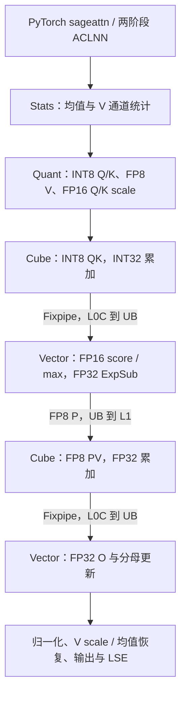

# SageAttention2 Ascend 950 算子设计文档

| 项目 | 内容 |
| --- | --- |
| 任务 | 8 月社区任务：08-11-sageAttention2 |
| 团队 | G_W_E |
| 硬件 | Atlas 950PR |
| 开发框架 | AscendC + CATLASS |
| 环境 | CANN Toolkit / 950 ops 9.2.0-beta.1，PyTorch 2.9.0，torch_npu 2.9.0.post8 |
| 代码合入目录 | `cann/ops-transformer` 的 `experimental/attention/sageattention2` |
| 文档日期 | 2026-09-07 |

## 1. 需求背景（required）

### 1.1 需求来源

本设计对应 [CANN 社区任务 2026 的 8 月 SageAttention2 算子开发任务](../../../../docs/README.md)，按[算子设计文档模板](../../../../resources/design_template.md)组织。算子代码提交到 ops-transformer，本文提交到本任务的团队目录。

### 1.2 背景介绍

长序列 Attention 的主要计算为 QKᵀ 和 PV 两次矩阵乘法。SageAttention2 使用 INT8 Q/K、FP8 P/V 和 outlier smoothing 降低矩阵计算与数据搬运成本，通过分块 online softmax 避免在 GM 中保存完整的注意力矩阵。

本实现面向 Ascend 950：CATLASS 提供 INT8/FP8 Cube 矩阵计算及分形布局映射；AscendC 完成量化、寄存器向量 softmax、输出更新以及 Cube/Vector 同步。利用 L0C→UB、UB→L1 数据通路，让 score 和 P 在片上流转，FP32 输出状态常驻 UB。

## 2. 需求分析（required）

### 2.1 功能范围

目标计算为量化近似的：

```text
O = softmax(sm_scale × Q × Kᵀ) × V
```

| 功能 | 本实现行为 |
| --- | --- |
| PyTorch 入口 | `sageattn` 自动分发到 `sageattn_qk_int8_pv_fp8_asc` |
| ACLNN 入口 | `aclnnSageAttention2GetWorkspaceSize`、`aclnnSageAttention2` 两阶段调用 |
| 输入 / 输出 dtype | Q/K/V 同为 FP16 或 BF16；O 的 dtype、shape 与 Q 一致 |
| 布局 | HND：`[B,H,S,D]`；NHD：`[B,S,H,D]` |
| GQA | `Hq % Hkv == 0`，按 Q head 映射到对应 KV head |
| 序列 | 非因果支持 Sq≠Sk；因果模式要求 Sq=Sk |
| head dimension | `1≤D≤128`，内部补齐至 64 或 128，输出恢复原始 D |
| stride / 尾块 | 支持末维连续的输入；处理序列尾块与补齐 channel |
| smooth K | 默认开启，量化前减去 K 沿序列维的均值 |
| smooth V | 默认关闭；开启时量化前减去 V 均值，最终输出加回 |
| LSE | 可选 FP32 输出，shape 为 `[B,Hq,Sq]`，采用自然对数并补偿 K smoothing |

本设计只覆盖前向 INT8 QK + FP8 PV，不支持 FP16 PV、任意 attention mask、dropout、varlen 或 autograd。

### 2.2 数值与接口约定

针对 950 原生 INT8/FP8 矩阵计算能力，采用以下数值与接口约定。

| 项目 | 当前实现 |
| --- | --- |
| Q/K 量化粒度 | 仅 per-token；`qk_quant_gran` 默认并仅接受 `per_token` |
| PV 累加 | Cube 采用 FP8×FP8→FP32；持续累加的 O、softmax 分母也均为 FP32 |
| `pv_accum_dtype` | 保留兼容参数，默认值为 `fp32`；传入值被忽略，不切换累加精度 |
| FP8 缩放 | P 和 V 的最大缩放值统一为 448，使用 E4M3 格式 |
| QK score | INT8×INT8→INT32，Fixpipe 固定 DEQF16 后在 FP16 中恢复 scale；指数输出 FP32 |
| `smooth_v` | 开启时执行完整 V smoothing，不受兼容累加参数影响 |
| 除法 | 使用默认 AscendC Div |

### 2.3 参数与返回值

显式 PyTorch 入口的主要参数如下；`sageattn` 将相应参数转交该入口。

| 参数 | 默认值 | 说明 |
| --- | --- | --- |
| `q`、`k`、`v` | 必填 | 同设备、同 dtype 的四维 NPU Tensor，K/V shape 一致 |
| `tensor_layout` | `HND` | 支持 HND、NHD |
| `is_causal` | `False` | 因果 mask，要求 Sq=Sk |
| `qk_quant_gran` | `per_token` | 仅接受 per-token 量化 |
| `sm_scale` | `None` | 默认 `1/sqrt(D)`，D 为补齐前维度；显式值须可表示为有限 FP32 |
| `pv_accum_dtype` | `fp32` | 兼容参数，执行路径固定为 FP32 累加 |
| `smooth_k` | `True` | K 中心化 |
| `smooth_v` | `False` | V 中心化及输出均值恢复 |
| `return_lse` | `False` | 为 True 时返回 `(out, lse)`，否则返回 out |

ACLNN 的参数与 PyTorch 对齐，调用者显式提供 `smScale`、输出张量和 stream。两阶段接口声明如下：

```cpp
aclnnStatus aclnnSageAttention2GetWorkspaceSize(
    const aclTensor *q, const aclTensor *k, const aclTensor *v,
    const char *tensorLayout, bool isCausal, const char *qkQuantGran,
    double smScale, const char *pvAccumDtype, bool smoothK, bool smoothV,
    bool returnLse, const aclTensor *out, const aclTensor *lse,
    uint64_t *workspaceSize, aclOpExecutor **executor);

aclnnStatus aclnnSageAttention2(
    void *workspace, uint64_t workspaceSize,
    aclOpExecutor *executor, aclrtStream stream);
```

## 3. 详细设计（required）

### 3.1 总体结构与模块分工



图中展示数据依赖。Core 内部用多槽流水重叠不同 KV 分块的 QK、softmax、PV 和 O 更新。

| 层次 | 职责 | 主要实现 |
| --- | --- | --- |
| PyTorch | 参数检查、自动分发、当前 NPU stream 与异步张量生命周期 | `python/sageattention2/` |
| ACLNN / Host | 参数和平台校验、workspace 计划、内部算子注册、tiling | `op_api/`、`op_host/` |
| Stats / Quant | FP32 统计、smoothing、INT8/FP8 量化及 scale 生成 | `stats.h`、`stats_smooth_v.h`、`quant.h`、`scale.h` |
| CATLASS Cube | GM/L1/L0 布局与搬运、INT8 QK 和 FP8 PV MMAD | `PackedTileCopyTla`、`TileMmadTla`、TLA tensor/layout |
| AscendC Vector | 寄存器 softmax、FP8 打包、FP32 输出更新、LSE | `softmax.h`、`softmax_wide.h`、`output_update.h` |
| Core 调度 | Cube/Vector block 组织、跨核事件与槽位生命周期 | `attention.h`、`attention_wide_stream.h` |

CATLASS 使用 `Arch::Ascend950` 和 `Arch::Resource`。950 Fixpipe 配置及跨核同步由 AscendC 显式控制。Stats、Quant、Core 是三个内部 kernel，Q/K scale 处理融合于 Quant。

### 3.2 数学与量化设计

以下公式对每个 batch、Q head 及其对应 KV head 独立计算，省略这些下标。`μk`、`μv` 沿 KV 序列维统计；未开启相应 smoothing 时取零。

```text
Kc = K - μk
Vc = V - μv

sq[i] = max_d(abs(Q[i,d])) / 127
sk[j] = max_d(abs(Kc[j,d])) / 127
Q8[i,d] = round_to_even(Q[i,d] / sq[i])
K8[j,d] = round_to_even(Kc[j,d] / sk[j])

sv[d] = max(max_j(abs(Vc[j,d])) / 448, 1e-30)
V8[j,d] = E4M3_RINT(Vc[j,d] / sv[d])
```

全零 Q/K token 的 scale 取 1。统计与量化除法使用 FP32，INT8 量化对应 `[-127,127]`；padding 不参与有效元素的统计。

#### 3.2.1 固定 QK 反量化与 scale 预处理

记 `s=sm_scale`。Cube 计算 INT32 点积，Fixpipe 的 DEQF16 系数固定为 `2^-11`：

```text
qk_half = half(int32(Q8 @ K8ᵀ) × 2^-11)
c = sqrt(2048 × abs(s))
qs_half[i] = half(sign(s) × c × sq[i])
ks_half[j] = half(c × sk[j])
coeff[i,j] = half(qs_half[i] × ks_half[j])
score[i,j] = half(qk_half[i,j] × coeff[i,j])
```

两侧 scale 的乘积补偿固定 DEQF16，并吸收 softmax scale。平衡因子仅依赖 `s`，不需要跨 token/head 的动态统计；在 Quant 中随 INT8 数据一起生成。`s=0` 时得到零 score。

对 DP≤128，INT8 点积的绝对值上界为 `128×127²=2064512`，经固定 DEQF16 后不超过 `1008.0625`。这一转换缩小了 score 的片上存储与后续 scale/max 计算量。

#### 3.2.2 Online softmax 与 FP32 输出状态

每个 query tile 沿 KV 维顺序处理。设历史最大值为 m，历史分母为 l，尚未归一化的 FP32 输出为 U：

```text
m_new = max(m, rowmax(score_block))
alpha = exp(m - m_new)
p = 448 × exp(score_block - m_new)
block_sum = rowsum(p)

l_new = alpha × l + block_sum
U_new = alpha × U + E4M3_RINT(p) @ V8_block

O = (U / l) × sv + μv
LSE = m + log(l) - log(448) + s × (Q @ μk)
```

分母使用 FP8 转换前的 FP32 p 求和；PV 使用量化后的 FP8 P。score/max 保持 FP16，`ExpSub<float, half>` 直接输出 FP32 指数，随后乘 448。l、U 及 PV 全程保持 FP32，输出端才转换为输入 dtype。LSE 的 K 均值补偿使用原始 Q；未开启 smooth K 时省略补偿项。

K 中心化只改变每行相同的 score 常数，因此不改变 softmax 概率。V 中心化利用概率行和为 1，在最终 FP32 输出中加回 μv。

### 3.3 Host、tiling 与内存计划

Host 校验 dtype、layout、shape、GQA 整除关系、causal 约束及 scale 的有限性。D 补齐至 DP∈{64,128}，Sq 补齐到 128 的倍数，Sk 补齐到 512 的倍数；有效长度保留在参数中，供 mask 和输出裁剪使用。

ACLNN 先将 NHD 映射为 HND view，对需要的输入执行 `Contiguous`，然后在 executor 内分配量化张量和输出计划。第二阶段在调用者 stream 上执行 Stats、Quant、Core 及必要的布局复制。连续 HND 性能用例无额外输入布局转换；其他布局的复制成本属于对应接口的执行成本。

| 中间张量 | shape | 存储 dtype |
| --- | --- | --- |
| Q8 | `[B,Hq,Qp,DP]` | INT8 |
| K8、V8 | `[B,Hkv,Kp,DP]` | INT8、FP8 E4M3；V8 的 ACL tensor 使用 UINT8 承载编码 |
| Q/K scale | `[B,Hq,Qp]`、`[B,Hkv,Kp]` | 平衡后的 FP16 |
| K/V 均值 | `[1或2,B,Hkv,DP]` | FP32，smooth V 开启时使用两个平面 |
| V scale | `[B,Hkv,DP]` | FP32 |

Stats 使用分段归并 workspace；量化张量空间随序列长度线性增长。完整调用不分配 Sq×Sk 的 score/P 矩阵。

核数从平台信息或运行时设备查询获得。Core 使用一个 AIC 配两个 AIV，每个 AIV 处理 M128 中的 64 行。task 将 batch、Q head、query tile 展平，以 `task=core; task+=core_count` 分配，GQA 不展开复制 KV。

当前 tiling key 为 0，dtype 及 DP 对应模板实例；Core 在入口选择 N256 通用路径或 N512 连续流水路径。

### 3.4 Stats 与 smooth V

连续大尺寸输入沿 KV 序列划分 7 段，AIV 分别统计 K sum 和 V absmax；小尺寸、padding 或 stride 输入走通用处理路径。

开启 smooth V 时，每段同时记录 K sum、V sum、V min、V max。通过 `SyncAll` 合并分段结果后得到 μk、μv，并用下式求中心化后的 V absmax：

```text
max_j(abs(V[j,d] - μv[d]))
    = max(abs(Vmin[d] - μv[d]), abs(Vmax[d] - μv[d]))
```

因此不必在得到均值后再次读取完整 V 来计算 absmax。连续路径每次最多搬运 256 行；尾部按有效行处理并显式补零。

### 3.5 Quant 与布局准备

连续 Quant 路径每次处理 64 行，采用两个 96 KiB UB 槽，使下一块 MTE2、当前向量计算和上一块 MTE3 重叠。K/V 的减均值、量化和 Q/K 平衡 scale 生成均在此阶段完成。

wide 路径的 FP8 P 采用寄存器转换后直接打包的 key 顺序，Quant 同步预排列 V 的对应行，使 P 和 V 的 KV 下标保持一致。这样将排列工作放到线性复杂度的预处理阶段，Core 无需逐个 score tile 执行额外的寄存器 Gather。

输入、输出槽通过 MTE2→V、V→MTE2、V→MTE3、MTE3→V 事件管理。无效 token/channel 写零，无效 score 在 softmax 前施加 mask。

### 3.6 Core 分块与流水

#### 3.6.1 两条执行路径

| 项目 | 通用 N256 | wide N512 |
| --- | --- | --- |
| 选择条件 | 未满足 wide 条件的合法输入 | DP=128、Sq 为 128 的倍数、Sk 为 512 的倍数且 Sk≥4096 |
| Query tile | M128 | M128 |
| 物理 Cube 片段 | N256 | 两个连续 N256 |
| Softmax / O 更新粒度 | N256；部分 O 更新成对融合 | 两片段共用一次 N512 softmax 和 O 更新 |
| Score UB 槽 / AIV | 3×32 KiB | 4×32 KiB |
| P / PV UB | 3 个独立 P 槽、2 个 FP32 PV 槽 | 2 个 32 KiB 槽在 P512 / PV128 间复用 |
| QK 预发距离 | 2 个物理片段 | 3 个物理片段 |
| Query 边界 | 当前 query 排空后进入下一块 | 槽位编号跨 query 连续推进 |

两条路径均支持 causal。wide 在逻辑 N512 块内处理因果边界，未来位置被 mask；DP64 和非对齐形状使用通用路径。

#### 3.6.2 wide 连续流水

将一个 N256 QK/PV 记为物理片段 f。AIC 先预发 QK，从 `f=3` 开始，在发射 QK(f) 后处理 PV(f−3)。每两个 QK 片段交给一次 softmax；每两个 PV 片段在 L0C 内累计后，仅写回一次 FP32 PV。

下表表示逻辑发射顺序，不代表各操作占用相同周期。`Sg` 表示处理 QK(2g)、QK(2g+1) 的 softmax，`Og` 表示对应的 O/分母更新。

| 逻辑步 f | AIC | AIV |
| --- | --- | --- |
| 0 | QK0 | 等待 score |
| 1 | QK1 | S0，分别发布 P0、P1 |
| 2 | QK2 | 已发布的 P 供 Cube 消费 |
| 3 | QK3，PV0 | S1，分别发布 P2、P3 |
| 4 | QK4，PV1；写回 PV 组 0 | O0，释放共享槽 0 |
| 5 | QK5，PV2 | S2，复用共享槽 0 |
| 6 | QK6，PV3；写回 PV 组 1 | O1，释放共享槽 1 |

任务描述随四槽环保存，末尾统一排空。跨 query 时，max 使用双份状态；U 和分母按 PV 消费顺序更新，下一 query 的首个 PV 才初始化它们，避免提前清零仍属于上一 query 的输出。每个 softmax 块的 alpha 和 FP32 block_sum 一起保留到对应 O 更新，保证归一化状态与 PV 一致。

#### 3.6.3 Cube、Fixpipe 与同步

wide 的 QK 将 M128 拆为两个 M64，分别占用 64 KiB L0C。使用 `FixpipeParamsArch3510<CO2Layout::NZ>`、固定 DEQF16 和 `subBlockId`，将两个 M64 结果分别送到配对 AIV；独立 Fixpipe 事件允许前一半写回与后一半 MMAD 重叠。

Q 在一个 query tile 内复用 L1/L0A。P 由 AIV 通过 UB→L1 发布，CATLASS 使用输入分形装载到 L0A；V 使用对应布局装载到 L0B。两个 N256 PV 在 FP32 L0C 内累加，再通过 L0C→UB 写回。

L0A/L0B 输入分形与 L0C 输出分形分别由布局接口描述。不会将 FP32 的 16×16 L0C 输出块直接作为固定 512 B 的 MMAD 输入块解释。持续累加的 U 位于 UB，O rescale 在 Vector 中完成。

| 跨核事件 | 发布位置 | 消费者及作用 |
| --- | --- | --- |
| QK_READY | AIC Fixpipe | 对应 AIV 在读取 score 前等待 |
| P_READY | AIV MTE3 | AIC 在 L1 中读取 P 前等待两个 AIV 的发布 |
| PV_READY | AIC Fixpipe | AIV 在更新 O 前等待 FP32 PV |
| PV_RELEASE | AIV Vector | AIC 在复用 PV 写回槽前等待两个 AIV 释放 |

跨核通知使用 MODE4 计数事件，局部硬事件保护 L1/L0/UB 的读写。共享槽先保存 FP8 P，再保存对应 FP32 PV；P 的 MTE3 完成并发出 ready 后，Cube 才能推进到覆盖该槽的 Fixpipe。

### 3.7 AIV 计算优化

wide softmax 保留 NZ score 布局，一条 FP16 寄存器携带多行数据。先使用逐元素 Max 合并多个片段，再以 `ReduceDataBlock<MAX>` 完成行内归约。FP32 指数的求和先通过 Add 合并寄存器通道，第一片 N256 的部分和保存到临时区，第二片完成后才执行整组的 `ReduceDataBlock<SUM>`。

FP16 score 的 scale/max 计算、直接 FP16→FP32 ExpSub 和 N512 联合归约，分别减少 score 类型转换、重复最大值/分母更新及 O rescale 次数。P 转换使用 RINT，按寄存器布局打包后通过 UB→L1 传给 Cube。

O 和分母更新使用 `MulDstAdd` 融合乘加。首个 PV 直接初始化 U，最后一个 PV 将更新、除分母、乘 V scale、可选加 V 均值和输出 Cast 合并，减少持久 U 的 UB 读写。smooth V 开启/关闭使用循环外选择的模板实例。

### 3.8 硬件资源预算

下表按 DP128 最大布局计算，KiB=1024 B。通用布局由 `attention_common.h` 定义，wide 布局由 `attention_block_vec_wide.h` 定义。

| 资源 | 当前分配 / 地址上界 | 硬件容量 |
| --- | --- | --- |
| 通用 Core UB / AIV | 247 KiB，含 3 个 score 槽、3 个 P 槽、2 个 PV 槽及 U | 248 KiB |
| wide Core UB / AIV | 246.5 KiB，含 4 个 score 槽、2 个 P/PV 共享槽及 U | 248 KiB |
| Quant UB / AIV | 192.5 KiB | 248 KiB |
| wide L1 / AIC | 256 KiB，含 Q 预留区、4 个 P256 槽与 K/V 区 | 512 KiB |
| L0A / L0B | 各不超过 64 KiB | 各 64 KiB |
| L0C | QK 占 2×64 KiB，PV 位于独立区域；地址上界不超过 256 KiB | 256 KiB |

wide UB 具体由 128 KiB score、64 KiB P/PV 共享区、32 KiB FP32 U、16.25 KiB 输出/临时区和 6.25 KiB scale/max/分母/alpha 等状态组成。临时区复用遵循各阶段生命周期；V 均值已计入预算。源码使用编译期断言检查容量和槽位容纳关系。

## 4. 工程组织与兼容性

### 4.1 Kernel 组织

Kernel 采用 `Init/Process` 结构。`AttentionKernel` 负责通用路径的任务遍历，`AttentionWideStream` 负责跨 query 的连续流水；Cube block 封装矩阵乘法和 Fixpipe，Vector block 封装 scale 预取、softmax、输出更新及 LSE。

数值原语放在独立头文件中，使用 dtype、DP 和 smooth V 等模板参数在循环外选择执行路径。资源偏移由集中定义的布局结构管理，编译期断言限制 UB/L1/L0 容量，并检查共享槽是否能够容纳不同阶段的数据。

### 4.2 构建集成

`experimental/attention/sageattention2` 由 ops-transformer 顶层工程构建。`sage_attention2_stats`、`sage_attention2_quant`、`sage_attention2_core` 三个同级目录提供内部算子的注册和编译入口，共享主目录的 kernel、Host 与 API 实现。

CANN 提供 AscendC 编译器、运行时、算子注册与 ACLNN executor；CATLASS 提供 Ascend 950 架构资源、矩阵布局和 MMAD 模板。构建时通过 `ASCEND_HOME_PATH` 和 `CATLASS_ROOT` 指定依赖位置。

### 4.3 平台与接口约束

实现依赖 Ascend 950 的寄存器向量 API、Fixpipe 和 Cube/Vector 数据通路。Host 校验目标平台与 AIC/AIV 配对关系，核数由平台查询获得；其他架构需要单独的布局、指令和同步适配。

PyTorch 默认使用 ACLNN 后端，在调用者当前 NPU stream 上执行。ACLNN 第一阶段生成 executor 与 workspace 计划，第二阶段异步提交任务。适配层记录输出及中间张量的 stream 使用，调用者按接口约定管理输入、输出、workspace 和 stream 的生命周期。
