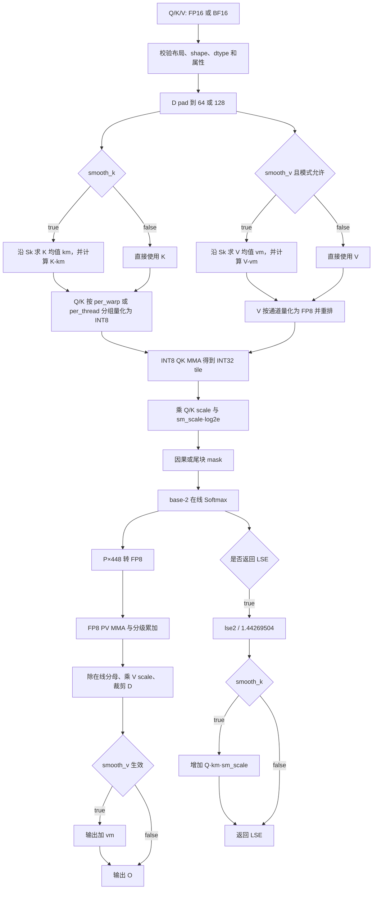
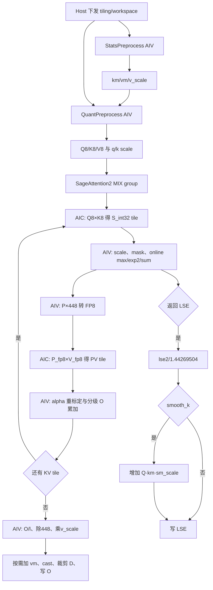
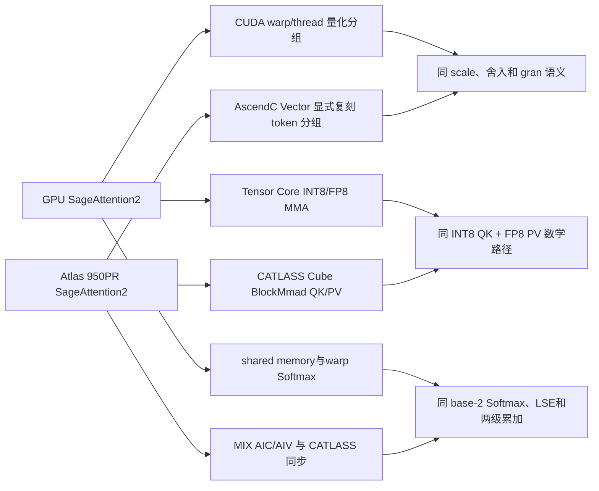

# SageAttention2 算子设计文档

## 1. 需求背景

### 1.1 需求来源

本任务来自 2026 年 8 月 CANN 社区任务，目标是在 Atlas 950PR 上实现 SageAttention2 的 INT8 \(QK^T\) + FP8 \(PV\) 前向路径，并合入 `cann/ops-transformer` 仓库的 `experimental/attention/sageattention2` 目录。

交付范围同时受以下要求约束：

1. 算法语义对齐 `thu-ml/SageAttention` 主分支及 `sageattention==2.2.0` 的 FP8 PV 路径；
2. Kernel 使用 AscendC + CATLASS 联合开发，目标硬件为 Atlas 950PR，验收环境为 CANN 9.2.0-beta.1；
3. 精度以 GPU SageAttention2 和 FP32 SDPA 为双层标杆，性能以 `ops-transformer` 中 FIA 为唯一门禁基线。

### 1.2 背景介绍

标准 Attention 为：

\[
O=\operatorname{softmax}(QK^T\cdot s)V,
\qquad s=\frac{1}{\sqrt D}\ \text{（默认）}.
\]

长序列场景中，两个矩阵乘 \(QK^T\) 和 \(PV\) 占据主要计算量。SageAttention2 对 Q/K 使用细粒度 INT8 量化，对 P/V 使用 FP8，并通过 K/V smoothing、在线 Softmax 和两级累加控制误差，适用于视频生成、图像生成、DiT 和 LLM 推理中的长序列 Attention。

本任务只实现前向、定长、INT8 QK + FP8 PV 路径，不实现 FP16 PV、varlen、Triton、CUDA 或 SM90 同名入口。

### 1.3 GPU SageAttention2 实现现状

开源 GPU 路径包含输入校验与 pad、K/V smoothing、Q/K/V 量化、量化 Attention 主循环和输出修正。其主要特征如下：

- Q/K 量化支持 `per_warp` 和 `per_thread` 两种算法分组；
- V 按通道量化为 FP8 E4M3，`fp32+fp16` 模式使用 2.25 作为量化幅值，其余累加模式使用 448.0；
- INT8 QK MMA 输出 INT32，再由 Q/K scale 解量化；
- Softmax 在 base-2 域中计算，P 乘 448 后转换为 FP8；
- PV 使用 FP8 MMA，并根据 `pv_accum_dtype` 执行单级或两级累加；
- 不物化完整 \([S_q,S_k]\) Attention 矩阵；
- `smooth_k=True` 时 O 不变，但 LSE 需要增加 \(Q\bar K\cdot s\) 修正项。

GPU/baseline 算法流程如下。该图是精度 golden 的算法路径；性能门禁基线另为 FIA。



## 2. 需求分析

### 2.1 需求描述

在 Atlas 950PR 上提供以下必选能力：

- PyTorch 自动分发入口 `sageattn`；
- PyTorch 显式入口 `sageattn_qk_int8_pv_fp8_asc`；
- 与上述 FP8 PV 语义一致的两段式 aclnn 入口；
- FP16/BF16、HND/NHD、GQA、非因果 \(S_q\ne S_k\)、因果 \(S_q=S_k\)；
- `per_warp`/`per_thread` QK 量化；
- `fp32`/`fp32+fp32`/`fp32+fp16` PV 累加；
- `smooth_k`、`smooth_v`、`return_lse`；
- \(D\in(0,128]\)，内部 pad 为 64 或 128；
- PyTorch 和 aclnn 两条路径均在 P-01～P-07 每条用例上达到 FIA 的 1.6 倍以上。

### 2.2 范围边界

| 类别 | 本任务范围 | 非本任务范围 |
| --- | --- | --- |
| 计算 | 前向 INT8 QK + FP8 PV | 反向、FP16 PV |
| 序列 | 定长 | varlen、Paged Attention |
| 后端 | AscendC + CATLASS | CUDA、Triton、`*_cuda`、`*_sm90` |
| mask | `is_causal` 布尔因果 mask | 非空 `attn_mask`、任意稀疏 mask |
| head dim | \(0<D\le128\) | \(D>128\) |
| 接口 | PyTorch + aclnn | 仅 Python 组合算子实现 |

### 2.3 外部组件依赖

| 外部组件 | 状态 | 用途 |
| --- | --- | --- |
| CANN 9.2.0-beta.1 | 验收环境 | AscendC 编译、运行时、aclnn 与平台信息 |
| CATLASS | 已有 Ascend950 FA/FP8 能力 | INT8 QK、FP8 PV、Tile/BlockMmad 与 MIX 流水 |
| Ascend Extension for PyTorch | 验收环境已适配 | `torch_npu` 调用、PyTorch dispatcher 和性能基线 |
| AscendOpTest | 任务书指定 | 单算子功能、精度与回归测试 |
| GPU SageAttention 2.2.0/main | 只用于 golden | 算法语义与 L-A 精度对标，不进入 NPU 运行依赖 |

### 2.4 内部适配模块

| 内部模块 | 状态 | 适配内容 |
| --- | --- | --- |
| `ops-transformer` experimental attention | 已有工程框架 | 新增 SageAttention2 op_host/op_kernel/op_api/tests |
| FIA arch35 | 已有参考 | Host tiling、MIX dispatch、Attention 流水和 V5 性能基线 |
| PyTorch 注册层 | 仓内现行方式 | 注册 `sageattn` 和 `sageattn_qk_int8_pv_fp8_asc` |
| aclnn L2/L0 | 仓内现行方式 | 两段式 workspace/executor 接口与公共参数校验 |

### 2.5 PyTorch 接口

```python
def sageattn(q, k, v, tensor_layout="HND", is_causal=False,
             sm_scale=None, return_lse=False, **kwargs): ...

def sageattn_qk_int8_pv_fp8_asc(
    q, k, v, tensor_layout="HND", is_causal=False,
    qk_quant_gran="per_thread", sm_scale=None,
    pv_accum_dtype="fp32+fp16", smooth_k=True,
    smooth_v=False, return_lse=False, **kwargs): ...
```

`sageattn` 在 NPU 上固定分发到 `sageattn_qk_int8_pv_fp8_asc`。允许通过已文档化的 `kwargs` 或环境配置覆盖 `pv_accum_dtype`，非法值直接报错。适配层只做参数校验、属性整理和算子调用，不使用 `.item()`、D2H 或显式同步。

### 2.6 aclnn 接口

aclnn 采用标准两段式形式，设计导出名为 `aclnnSageAttention2GetWorkspaceSize` 和 `aclnnSageAttention2`：

```cpp
aclnnStatus aclnnSageAttention2GetWorkspaceSize(
    const aclTensor* query, const aclTensor* key, const aclTensor* value,
    const char* tensorLayout, bool isCausal, const char* qkQuantGran,
    double scaleValue, const char* pvAccumDtype,
    bool smoothK, bool smoothV, bool returnLse,
    aclTensor* attentionOut, aclTensor* softmaxLseOutOptional,
    uint64_t* workspaceSize, aclOpExecutor** executor);

aclnnStatus aclnnSageAttention2(
    void* workspace, uint64_t workspaceSize,
    aclOpExecutor* executor, aclrtStream stream);
```

`scaleValue` 由上层在 `sm_scale=None` 时按原始 D 计算为 \(1/\sqrt D\)。`returnLse=false` 时 LSE 输出允许为空；为 true 时输出 FP32 `[B,Hq,Sq]`。最终代码遵循 `ops-transformer` 当前 L2/L0 optional tensor 约定，但不改变上述语义。

### 2.7 输入、输出与属性约束

| 项 | 支持范围或行为 |
| --- | --- |
| q/k/v dtype | 三者相同，FP16 或 BF16 |
| HND | q `[B,Hq,Sq,D]`，k/v `[B,Hkv,Sk,D]` |
| NHD | q `[B,Sq,Hq,D]`，k/v `[B,Sk,Hkv,D]` |
| 输出 O | 与 q 相同布局、shape 和 dtype |
| LSE | FP32 `[B,Hq,Sq]` |
| GQA | `Hq % Hkv == 0` |
| causal | 仅 `Sq == Sk` 合法 |
| non-causal | 支持 `Sq != Sk` |
| D | `0 < D <= 128`；`D<64` pad 到 64，`64<D<128` pad 到 128 |
| 连续性 | q/k/v 均要求 `stride(-1)==1` |
| qk_quant_gran | `per_warp` 或 `per_thread` |
| pv_accum_dtype | `fp32`、`fp32+fp32` 或 `fp32+fp16` |
| attn_mask | 非空时报错 |
| smooth_v | 在 `fp32+fp32`、`fp32+fp16` 下 warning 并忽略 |

### 2.8 需求拆解

1. Host/Python 层完成合法性校验、默认 scale 计算、布局和属性归一；
2. AscendC Vector 统计核计算 K 均值以及 V 每通道统计量；
3. AscendC Vector 量化核生成 Q/K INT8、V FP8 及 scale；
4. CATLASS/Cube 执行 INT8 QK 和 FP8 PV；
5. AscendC Vector 执行解量化、mask、在线 Softmax、P FP8 化、分级累加和 LSE；
6. 输出按原始 D 裁剪，并恢复 HND/NHD 逻辑布局。

## 3. 详细设计

### 3.1 数学定义

令 \(g=H_q/H_{kv}\)，第 \(h_q\) 个 Q head 对应 \(h_{kv}=\lfloor h_q/g\rfloor\)。

#### 3.1.1 K smoothing 与 LSE 修正

\[
\bar K_{b,h,d}=\frac{1}{S_k}\sum_jK_{b,h,j,d},
\qquad K'=K-\bar K.
\]

对某一 Q 行，\(QK'^T=QK^T-Q\bar K^T\)。减去项在所有 key 位置上相同，因此 Softmax 和 O 不变。若主核返回 base-2 域 \(LSE_2=m+\log_2l\)，则：

\[
LSE=\frac{LSE_2}{1.44269504}+(Q\bar K^T)\cdot s.
\]

GQA 下按 head 映射选择 \(\bar K\)，等价于开源的 `repeat_interleave`。

#### 3.1.2 V smoothing

\[
\bar V=\frac{1}{S_k}\sum_jV_j,\quad V'=V-\bar V,
\quad O=\operatorname{softmax}(S)V'+\bar V.
\]

该路径只在开源允许的累加模式下生效；默认 `fp32+fp16` 和 `fp32+fp32` 按开源行为 warning 后忽略 `smooth_v`。

#### 3.1.3 Q/K INT8 量化

每个算法分组 G 使用：

\[
s_G=\frac{\max_{x\in G}|x|}{127}+10^{-7},\qquad
x_q=\operatorname{int8}\left(\frac{x}{s_G}+0.5\operatorname{sign}(x)\right).
\]

分组必须精确复现 GPU 语义：

| 模式 | Q 分组 | K 分组 |
| --- | --- | --- |
| per_warp | 每 128 个 Q token 拆为 4 个连续 32 行组 | 每 64 个 K token 为 1 组 |
| per_thread | 每 128 个 Q token 拆为 8 组；第 g 组行为 `8*r+g, r=0..15` | 每 64 个 K token 拆为 4 组；第 g 组行为 `8*r+2*g+u, r=0..7, u=0,1` |

每组的 max 在该组全部 token 和 pad 后 D 维上归约；D pad 元素为 0。K 在 `smooth_k=True` 时先减 \(\bar K\) 再量化。QK tile 解量化为：

\[
S_{int32}=Q_{int8}K_{int8}^T,\qquad
S=(S_{int32}\odot(s_Qs_K))\cdot s.
\]

#### 3.1.4 V 与 P 的 FP8 量化

V 按 `[B,Hkv,D]` 通道在序列维求绝对值最大值：

\[
s_V[d]=\frac{\max_j|V'[j,d]|}{M_V},\qquad
V_{fp8}[j,d]=\operatorname{FP8E4M3}\left(\frac{V'[j,d]}{s_V[d]}\right).
\]

`fp32+fp16` 的 \(M_V=2.25\)，`fp32` 和 `fp32+fp32` 的 \(M_V=448.0\)。序列维补齐到 64 的倍数，并按开源的 16 元素顺序 `[0,1,8,9,2,3,10,11,4,5,12,13,6,7,14,15]` 组织为 CATLASS PV 所需布局。

在线 Softmax 概率采用静态尺度：

\[
P_{fp8}=\operatorname{FP8E4M3}(P\cdot448).
\]

PV 累加结果在更新 O 状态时除回 448，并乘对应的 \(s_V[d]\)。

#### 3.1.5 在线 Softmax

对每个 Q block 顺序扫描 K/V block。第 j 块 logits 为 \(S_j\)，状态为最大值 m、分母 l 和未归一化输出 \(O_a\)：

\[
m_j=\max(m_{j-1},\operatorname{rowmax}(S_j)),\quad
\alpha_j=2^{m_{j-1}-m_j},\quad P_j=2^{S_j-m_j},
\]

\[
l_j=\alpha_jl_{j-1}+\operatorname{rowsum}(P_j),\quad
O_{a,j}=\alpha_jO_{a,j-1}+P_jV_j.
\]

结束后 \(O=O_a/l\)。尾块无效 key 和 causal 上三角位置在 rowmax/exp2 前写为负无穷，不能只依赖 pad 后的 0 值。

### 3.2 总体实现方案

设备侧采用三个逻辑 stage，均由一次 aclnn/PyTorch 调用在同一 stream 上异步下发：

1. `StatsPreprocess`：计算 K mean；计算 V mean/amax 和 V scale；
2. `QuantPreprocess`：生成 Q/K INT8、Q/K scale、V FP8 和 CATLASS 布局；
3. `SageAttention2Mix`：以 MIX kernel 完成 INT8 QK、在线 Softmax、FP8 PV、累加、O/LSE epilogue。

统计与量化在同一源码模板中按属性裁剪；若真机证明合并更优，可融合为单次预处理 launch，但不改变 workspace 布局和数值语义。所有 stage 均计入性能统计。

### 3.3 AscendC + CATLASS 模块边界

| 模块 | 技术 | 职责 |
| --- | --- | --- |
| Host tiling/dispatch | ops-transformer Host 框架 | 校验、shape、平台资源、tiling key、workspace、block dim |
| StatsPreprocess | AscendC Vector/RegBase | K/V 沿序列归约、均值、amax、scale |
| QuantPreprocess | AscendC Vector/RegBase | pad、减均值、分组 max、舍入、INT8/FP8 cast、重排 |
| QK Cube | CATLASS | 复用 950 FA 的 BlockMmad/tile-copy 数据流，专门化 INT8 QK |
| Softmax | AscendC + CATLASS epilogue | 解量化、mask、rowmax、exp2、rowsum、P FP8 化 |
| PV Cube | CATLASS | 复用 950 FA PV block 接口，专门化 FP8 E4M3 P/V |
| 输出 | AscendC Vector | online rescale、三种 accum、V scale、cast/crop、LSE |

CATLASS 参考关系：

- `examples/70_ascend950_flash_attention_chunk_prefill`：QK → online softmax → PV → rescale 的 950 MIX 流水；
- `examples/49_ascend950_flash_attention_infer`：950 定长/GQA FlashAttention 工程入口；
- `examples/53_ascend950_fp8_mx_matmul`：Ascend950 `float8_e4m3_t`、FP32 输出和 FP8 MMA。其 MXFP8 scale 与 SageAttention2 的 per-channel scale 不同，只复用类型、MMA 和 tile-copy 能力；
- `ops-transformer/attention/fused_infer_attention_score`：arch35 host、tiling、dispatch、测试和 aclnn V5 的工程参考与性能基线。

### 3.4 Host 侧设计

#### 3.4.1 校验与 shape 推导

Host 校验 q/k/v 同 device、同 dtype、末维连续，解析 HND/NHD，得到 B、Hq、Hkv、Sq、Sk、D，校验 GQA/causal/D/枚举，计算 `Dpad = 64 if D <= 64 else 128`。`sm_scale=None` 时使用原始 D 计算 \(1/\sqrt D\)。平台 API 实采 AIC/AIV 数量、UB/L1/L0 容量并选择 block dim 和 tile，不硬编码 950PR 核数或容量。

#### 3.4.2 分核策略

主 kernel 的任务数为：

\[
N_{task}=B\cdot H_q\cdot\left\lceil\frac{S_q}{B_r}\right\rceil.
\]

初始 \(B_r=128\)，每个 MIX group 负责一个或多个 `(b,hq,qBlock)`，grid-stride 覆盖全部任务。非因果按 kv head 聚簇以重用 K/V；因果将前后 Q block 成对/交错分配以缓解长尾；小 shape 减少 group 数且不产生跳过同步的空 group。

#### 3.4.3 单核分块与资源公式

| 参数 | 初始值 | 依据 |
| --- | --- | --- |
| Br | 128 | 对齐 Q 量化块和 CATLASS FA Q tile |
| Bc | 128 | 对齐 K 的 64 行分组和 FA/PV tile |
| Dtile | 64 或 128 | 等于 Dpad |
| K/V stage | 双缓冲候选 | 由实采 L1/L0 容量决定 |
| S/P stage | ping-pong 候选 | 由实采 UB/CATLASS resource 决定 |

Host 可在 `Bc ∈ {64,128,256}` 中选择。合法条件为：

\[
Bytes_{UB}(B_r,B_c,D,accum,stages)+Reserve_{framework}\le UB_{platform},
\]

\[
Bytes_{L1}(Q,K,V,P,stages)+Reserve_{CATLASS}\le L1_{platform}.
\]

UB 包含每个 AIV 子核的 S FP32、P FP8、m/l、O 状态、scale 和 mask；L1/L0 包含 Q/K/P/V tile 及 CATLASS 流水缓冲。

#### 3.4.4 Tiling data 与 key

Tiling data 包含 B/H/S/D、layout/stride、causal/gran/accum/smooth/LSE、scale、Br/Bc、循环数、任务数、workspace offset、CATLASS L1/L0 tile/stage 和尾块参数。

| Kernel | 编译期维度 | 运行时维度 |
| --- | --- | --- |
| StatsPreprocess | dtype、Dpad、K/V 统计开关 | B/H/S、尾块、stride |
| QuantPreprocess | dtype、Dpad、gran、V scale 档 | B/H/S、smooth、尾块 |
| SageAttention2Mix | dtype、Dpad、causal、accum、returnLse | B/H/S、GQA、尾块 |

HND/NHD 使用统一 stride/offset，不复制整张输入。默认性能路径 `per_thread + fp32+fp16 + return_lse=false` 独立实例化。

#### 3.4.5 Workspace

Workspace 只保存线性规模的量化结果和统计量：

\[
W=W_{Q8}+W_{K8}+W_{V8}+W_{Qs}+W_{Ks}+W_{Vs}+W_{Km}+W_{Vm}+W_{sync}+W_{align}.
\]

```text
WQ8 = B·Hq·Sq·Dpad·sizeof(int8)
WK8 = B·Hkv·Sk·Dpad·sizeof(int8)
WV8 = B·Hkv·ceil64(Sk)·Dpad·sizeof(fp8)
WQs(per_warp)   = B·Hq·ceil(Sq/128)·4·sizeof(float)
WQs(per_thread) = B·Hq·ceil(Sq/128)·8·sizeof(float)
WKs(per_warp)   = B·Hkv·ceil(Sk/64)·1·sizeof(float)
WKs(per_thread) = B·Hkv·ceil(Sk/64)·4·sizeof(float)
WVs = B·Hkv·Dpad·sizeof(float)
WKm = smoothK ? B·Hkv·Dpad·sizeof(float) : 0
WVm = smoothVEffective ? B·Hkv·Dpad·sizeof(float) : 0
```

LSE correction 不物化 `[B,Hq,Sq]` workspace；仅在 `return_lse=true` 时由主核对当前 Q 行与对应 km 点积并直接写 LSE。

### 3.5 Kernel 侧设计

#### 3.5.1 统计与量化预处理

`StatsPreprocess` 对 `(b,hkv,dTile)` 分核，以 FP32 沿 Sk 归约 K mean、V amax 和有效的 V mean；Sk 尾块只统计有效元素。`QuantPreprocess` 用任务标签处理：

- Q：按 128 行块执行两种分组 max、scale、舍入和 INT8 写出；
- K：按 64 行块读取，按需减 km，再按对应分组量化；
- V：按需减 vm，乘逆 scale、cast FP8，并在写出时完成序列重排和 D pad。

每个输出 tile 由唯一 AIV 负责；scale 使用 FP32，BF16 输入先转 FP32 做统计和缩放。

#### 3.5.2 MIX Attention 主核

主核采用 Atlas 950 的 Cube(AIC)+Vector(AIV) MIX 形态。每个 group 的 AIC 与 AIV 对同一 Q block 协作；AIV 子核按 Q 行均分。同步优先复用 CATLASS FA resource/group barrier，不复用其 flag id。SSBuffer 只存控制元数据，S/P tile 在 CATLASS 管理的 L0/L1/UB 通路中交换，不经 GM 往返。



KV 循环逻辑为 `QK(j) → Softmax(j) → PV(j) → Update(j)`，资源许可时交叠 `QK(j+1)` 与 `PV(j)`。若数据经 GM 交接，生产端 flush、消费端 invalidate，不能只依赖 flag。两个 AIV 子核必须对称参与 1AIC:2AIV 握手，防止 causal 尾任务死锁。

#### 3.5.3 累加模式

| 模式 | 行为 |
| --- | --- |
| fp32 | PV 结果和在线 O 状态使用 FP32 |
| fp32+fp32 | CATLASS PV 子块为一级，周期性归并到 FP32 二级 O buffer |
| fp32+fp16 | CATLASS PV 子块为一级，周期性归并到 FP16 二级 O buffer；最终转 FP32 完成 epilogue |

归并周期是 tiling 参数，必须在 GPU 同模式 golden 下校验后才能调整。默认性能实例为 `fp32+fp16`。任一模式都在 online max 更新时用 \(\alpha\) 重标定历史 l 和 O。

### 3.6 GPU 与 AscendC 实现差异



| 对比项 | GPU baseline | AscendC + CATLASS | 原因 |
| --- | --- | --- | --- |
| 执行组织 | block/warp/thread | MIX group：AIC + AIV | 执行单元不同 |
| Q/K 分组 | warp/thread 索引 | 显式 token 索引 | AscendC 无同名枚举 |
| QK/PV | Tensor Core | CATLASS Cube BlockMmad | 复用 950 FA 模板 |
| Softmax | warp reduction | AIV RegBase/SIMD | 与 Cube 并行分工 |
| 中间交换 | shared memory/register | L0/L1/UB | 片上层次不同 |
| V 布局 | CUDA 专用 permute | 预处理写 CATLASS 布局 | 避免主循环转置 |
| 调度 | GPU scheduler | Host tiling、causal 配对、GQA 聚簇 | 降低长尾和改善 L2 重用 |
| 资源参数 | CUDA 模板 | platform API 实采后选 tile | 不伪造 950 容量 |

### 3.7 工程目录

```text
experimental/attention/sageattention2/
├── CMakeLists.txt
├── README.md
├── sageattn_fp8/
│   ├── op_host/
│   ├── op_kernel/arch35/
│   └── catlass_ext/
├── quant/
├── python/
├── aclnn/
├── examples/
├── tests/{pytest,st,ut}/
└── docs/
```

## 4. 支持硬件

| 芯片/版本 | 支持情况 |
| --- | --- |
| Atlas 950PR / arch35 / DAV_3510 | 支持 |
| 其他芯片 | 本任务不承诺 |

软件验收环境为 CANN 9.2.0-beta.1，编译按仓内 arch35 方式选择对应二进制和 CATLASS `Ascend950` ArchTag。

## 5. 算子约束限制

- 仅前向、定长 Attention；
- 仅 FP16/BF16 输入，q/k/v dtype 一致；
- 仅 HND/NHD，`Hq % Hkv == 0`；
- causal 仅支持 `Sq == Sk`；
- 不支持非空 `attn_mask`；
- q/k/v 的 `stride(-1)` 必须为 1；
- 原始 D 必须在 `(0,128]`；
- `smooth_v` 在 `fp32+fp32`、`fp32+fp16` 下 warning 并忽略；
- 不导出 CUDA/Triton/SM90 同名符号；
- 不物化完整 `[B,Hq,Sq,Sk]` Attention 矩阵。

## 6. 特性交叉分析

| 维度 | 组合 | 实现/测试策略 |
| --- | --- | --- |
| dtype × layout | FP16/BF16 × HND/NHD | 统一 stride/offset kernel；四种组合均做功能与精度回归 |
| D × dtype | D∈(0,64] / (64,128] × FP16/BF16 | 分别进入 Dpad=64/128 模板；覆盖 D=48、64、96、128 边界 |
| gran × accum | 2 种 gran × 3 种 accum | 六种组合分别使用 GPU 同配置 golden，不交叉替代 |
| causal × sequence | non-causal 支持 Sq≠Sk；causal 只支持 Sq=Sk | 两条 tiling 路径；causal 检查上三角及尾块 |
| MHA/GQA × layout | Hq=Hkv 或 Hq/Hkv 为整数 × HND/NHD | 统一 q-head→kv-head 映射，覆盖 32/8 GQA |
| smooth × LSE | smooth_k 开关 × return_lse 开关 | smooth_k+LSE 额外验证 GQA correction；不返回 LSE 时跳过 correction |
| smooth_v × accum | smooth_v × 3 种 accum | 只在允许模式生效，其余两级累加模式验证 warning 并忽略 |
| 长度 × 尾块 | 规则/非规则 Sq、Sk，最长覆盖 16K | 显式有效行列 mask；不分配全量 Attention matrix |
| 接口 × 性能 | PyTorch/aclnn × P-01～P-07 | 共用底层 kernel，两条路径逐条及几何平均均须 ≥1.6× |

## 7. 可维可测分析

### 7.1 功能测试矩阵

| 编号 | 覆盖内容 | 预期 |
| --- | --- | --- |
| TC-01 | `sageattn`；FP16/BF16；HND/NHD | 正确分发，shape/dtype 正确 |
| TC-02 | 两种 gran × 三种 accum | 分别对齐 GPU 同配置 |
| TC-03 | smooth_k/smooth_v | O、LSE、warning 正确 |
| TC-04 | `return_lse=true` | FP32 `[B,Hq,Sq]` 且数值对齐 |
| TC-05 | D=48、96 | pad 64/128，输出裁回 D |
| TC-06 | GQA + `Sq != Sk` | head 映射和输出正确 |
| TC-07 | causal | 上三角 mask 正确 |
| TC-08 | D>128、末维非连续、非法枚举、非空 mask | 明确报错 |
| TC-09 | S≥8K/16K | 无越界、无全量 S workspace |
| TC-10 | 替换 `F.scaled_dot_product_attention` | example 冒烟通过 |

任务书测试工程共 500 条用例；交付测试覆盖其全部参数组合，并为 aclnn 补齐等价 ST/性能用例。

### 7.2 精度标准

| 层级 | Golden | 判据 |
| --- | --- | --- |
| L-A 主标杆 | GPU `sageattn_qk_int8_pv_fp8_cuda`，gran/accum/smooth/causal 相同 | FP16/BF16 混合容差 |
| L-B 辅标杆 | FP32 SDPA | NPU 相对真值误差与 GPU-Sage 相对真值误差之比：max≤2、mean≤1.2、RMSE≤1.2 |

| dtype | rtol | atol | matched_ratio | max_abs_error_limit |
| --- | --- | --- | --- | --- |
| FP16 | \(2^{-9}\) | \(2^{-9}\) | ≥0.99 | 1e-1 或 32×ULP |
| BF16 | \(2^{-6}\) | \(2^{-6}\) | ≥0.99 | 1e-0 或 32×ULP |

使用 AscendOpTest。两种 gran 不混用 golden；三种 accum 分别对标；默认 `fp32+fp16` 不得用 FP16-PV 或其他 accum 替代。LSE 使用 FP32 容差或 GPU LSE 混合容差。

### 7.3 性能标准

在 Atlas 950PR、CANN 9.2.0-beta.1、同机同 shape/dtype、相同预热和计时口径下：

| 路径 | 本算子 | FIA 基线 | 门槛 |
| --- | --- | --- | --- |
| PyTorch | `sageattn_qk_int8_pv_fp8_asc` 或等价分发 | `torch_npu.npu_fused_infer_attention_score`，验收指定时用 `_v2` | 每条 ≥1.6×，几何平均 ≥1.6× |
| aclnn | `aclnnSageAttention2` | `aclnnFusedInferAttentionScoreV5` | 每条 ≥1.6×，几何平均 ≥1.6× |

\[
Speedup=\frac{T_{FIA}}{T_{SageAttention2}}\ge1.6.
\]

P-01～P-07 均采用 `per_thread + fp32+fp16 + return_lse=false`：

| 编号 | HND shape/场景 | dtype | causal/GQA | 分档 |
| --- | --- | --- | --- | --- |
| P-01 | `[1,32,4096,128]` | FP16 | 非因果 | S1 |
| P-02 | `[1,32,8192,128]` | FP16 | 非因果 | S1 |
| P-03 | `[1,32,8192,128]` | FP16 | causal | S2 |
| P-04 | `[2,32,8192,128]` | FP16 | 非因果 | S1 |
| P-05 | B=1，Hq/Hkv=32/8，S=4096，D=128 | FP16 | GQA | S3 |
| P-06 | `[1,32,4096,128]` | BF16 | 非因果 | S4 |
| P-07 | `[1,32,16384,128]` | FP16 | 非因果 | S5 |

PyTorch 使用 `torch.npu.Event`，warmup=5、iters=20；aclnn 使用等价 device event。首次编译/JIT 排除，但统计、量化、layout 处理和所有 launch 均计入。两条路径分别保存日志和 profiler 证据。

### 7.4 优化顺序

1. 确认 QK/PV Cube 利用率和 AIC/AIV 流水；
2. 扫描 Bc、stage、MIX group 数；
3. 减少 S tile 的 Vector 遍数，融合 scale、mask 和 Softmax；
4. causal 使用负载配对，GQA 使用 kv-head 聚簇与 L2 重用；
5. 若预处理占比显著，融合统计/量化 launch；
6. 分别检查 PyTorch dispatcher 和 aclnn executor 无同步/D2H。

### 7.5 风险与闭环

| 风险 | 影响 | 闭环方法 |
| --- | --- | --- |
| 950 FP8 PV layout/scale 不匹配 | 精度或编译失败 | 先跑 ex53，再做单 tile PV 与中间量 golden |
| QK/PV 与 AIV 流水空泡 | 1.6× 失败 | 分段 profiling，调 Br/Bc/stage/预取距离 |
| per_thread 交错分组偏差 | L-A 失败 | 导出 Q8/K8/scale 与 GPU 逐元素比较 |
| fp32+fp16 归并周期不一致 | 长序列误差 | 逐步增长 S，对 GPU 同 accum 并冻结周期 |
| causal 负载不均 | P-03 失败 | 分析 group wall time，启用配对/cost 调度 |
| 多 kernel 预处理过重 | 双路径性能失败 | 融合 launch、消除转置、检查 HBM 占比 |
| MIX 同步/cache 错误 | 死锁或偶发错值 | 复用 CATLASS resource；空任务参与同步；GM 交接做 cache 维护 |
| 片上容量假设错误 | 编译或运行失败 | platform API 实采，按资源公式重选 tile |
| PyTorch/aclnn 映射不同 | 双路径不一致 | 共用同一 L0 op、tiling 和 kernel 回归 |

### 7.6 上机验证顺序

为节省 950PR 卡时，按以下顺序执行：

1. 环境与架构探针：CANN、SoC、AIC/AIV、UB/L1/L0、CATLASS ex49/ex53/ex70；
2. FIA 双路径 P-01～P-07 基线；
3. 单 tile INT8 QK、FP8 PV、cast/layout、MIX 同步；
4. km、q/k/v scale、Q8/K8/V8、单块 S/P/PV 中间量；
5. 小 shape 全链路和 500 条功能/精度用例；
6. P-01～P-07 扫参与 profiler；
7. clean build、双路径复测并归档日志。

## 8. 兼容性分析

本算子为 `experimental/attention/sageattention2` 下的新增算子，不修改 FIA 接口。PyTorch 与 aclnn 共用底层实现；HND/NHD 通过 stride/offset 解释。非法范围明确报错，不静默回退 FIA、FP16 PV 或 CPU。

## 9. 参考资料

1. SageAttention2 任务书：`SageAttention2_task_doc.md`；
2. 论文：<https://arxiv.org/abs/2411.10958>；
3. GPU 实现：<https://github.com/thu-ml/SageAttention>；
4. 交付仓：<https://gitcode.com/cann/ops-transformer>；
5. CATLASS：<https://gitcode.com/cann/catlass>；
6. FIA V5：`attention/fused_infer_attention_score/docs/aclnnFusedInferAttentionScoreV5.md`；
7. 设计模板：<https://gitcode.com/cann/cann-ops-competitions/blob/master/04_tasks/01_community-task-2026/resources/design_template.md>；
8. 社区流程：<https://gitcode.com/org/cann/discussions/39>；
9. 精度标准：<https://gitcode.com/cann/opbase/blob/master/docs/zh/ops_precision_standard/experimental_standard.md>。
