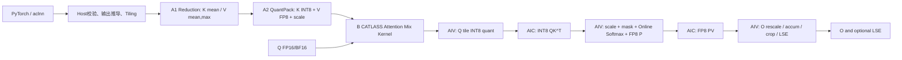
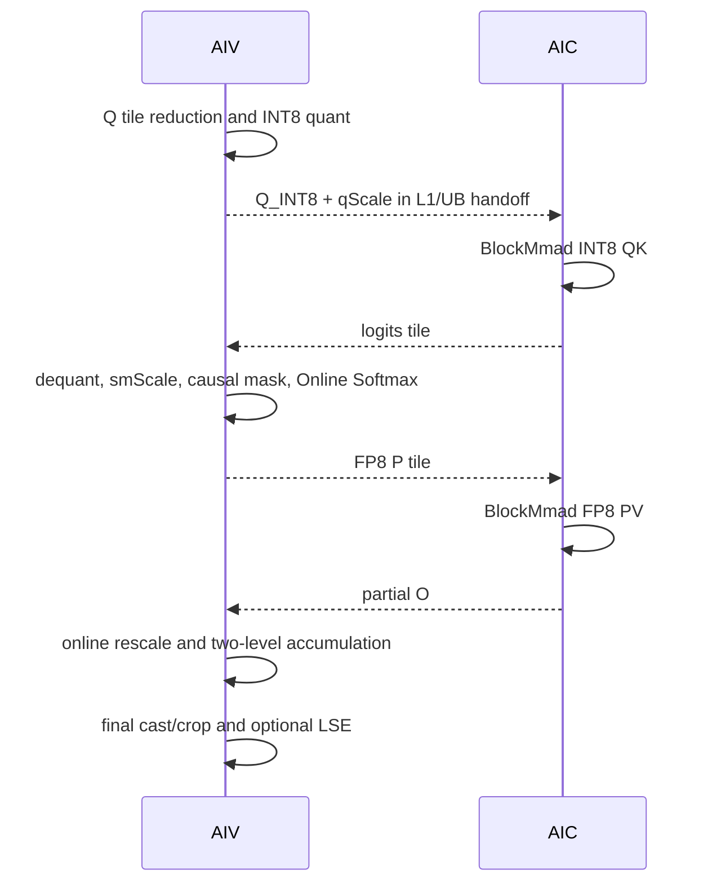

# 【CANN社区任务】sageAttention2 算子设计文档

| 项目 | 内容 |
| --- | --- |
| 任务名称 | 8月社区任务-sageAttention2算子开发 |
| 提交账号/团队目录 | `amelia_2026` |
| 目标代码仓 | `https://gitcode.com/cann/ops-transformer` |
| 目标代码目录 | `experimental/attention/sageattention2` |
| 目标硬件 | Atlas 950PR（`ascend950` / `arch35`） |
| 验收软件版本 | CANN 9.2.0-beta.1 |


# 需求背景（required）

## 需求来源

本需求来源于 2026 年 CANN 社区任务“8月社区任务-sageAttention2算子开发”。任务要求参考开源 SageAttention2 的 `INT8 QK^T + FP8 PV` 路径，在 Atlas 950PR 上使用 Ascend C 与 CATLASS 实现量化 Attention，验收后合入 `ops-transformer/experimental/attention/sageattention2`。

任务的核心验收要求如下：

1. 公开 PyTorch 接口对齐开源 `sageattn` 与 `sageattn_qk_int8_pv_fp8_cuda`，NPU 显式接口命名为 `sageattn_qk_int8_pv_fp8_asc`。
2. 提供统一的 aclnn 两段式调用接口，功能语义与 PyTorch FP8 路径一致。
3. Kernel 必须基于 Ascend C 与 CATLASS 联合开发，覆盖 INT8 Q/K、FP8 V、Online Softmax、两级累加、outlier smoothing、LSE 等逻辑。
4. 精度满足《生态算子开源精度标准》以及任务书规定的 L-A/L-B 双层对标策略。
5. 在 Atlas 950PR、CANN 9.2.0-beta.1、同机同 shape 条件下，PyTorch 与 aclnn 两条路径相对 FIA 均达到 Speedup 不低于 1.6 倍。

## 背景介绍

### SageAttention2 算法背景

标准 Attention 为：

$$
O = \operatorname{softmax}(QK^T \cdot s)V,
$$

其中 $s$ 默认为 $1/\sqrt{D}$。长序列场景下，两次矩阵乘 $QK^T$ 与 $PV$ 占据主要计算量。SageAttention2 通过对 Q/K 进行细粒度 INT8 量化、对 V 与 Softmax 概率 P 使用 FP8 计算，并结合异常值平滑与两级累加，在维持精度的前提下降低主计算路径的数据宽度。

本任务仅实现 SageAttention2 的以下路径：

- Q/K：INT8；`qk_quant_gran` 支持 `per_warp` 与 `per_thread`；
- P/V：FP8；
- `smooth_k=True` 为默认，`smooth_v` 可选；
- `pv_accum_dtype` 支持 `fp32`、`fp32+fp32`、`fp32+fp16`；
- 仅前向，不实现反向；
- 不实现 FP16 PV、varlen、Triton、CUDA/SM90 同名接口。

### 开源 FP8 路径现状分析

本文以 SageAttention `v2.2.0` 的 `sageattn_qk_int8_pv_fp8_cuda` 为功能参照，并以任务书中明确的接口约束为最终验收口径。参考路径包含以下阶段：

1. 按原始 head dimension 计算默认 `sm_scale`；
2. 将 $D<64$ 的输入逻辑补齐到 64，将 $64<D<128$ 的输入逻辑补齐到 128；
3. 可选计算 K 的序列均值并执行 `smooth_k`；
4. 按 `per_warp` 或 `per_thread` 语义量化 Q/K 为 INT8；
5. 按通道量化 V 为 FP8 E4M3，并生成 FP32 scale；
6. 分 tile 执行 INT8 $QK^T$、Online Softmax 与 FP8 $PV$；
7. 按 `pv_accum_dtype` 选择累加策略；
8. 输出裁剪回原始 $D$；`return_lse=True` 时返回自然对数域 LSE，并补偿 `smooth_k` 引入的行常量。

GPU 的 warp/thread 是参考实现的执行组织概念，Ascend C 不提供同名量化枚举。本设计保持其“哪些序列行共享一个 scale”的数学语义，在 NPU 上将这些分组映射为 AIV Vector 子分组与 CATLASS Attention tile，不要求复刻 CUDA 的线程调度方式。

### 当前 NPU 可复用基础

| 复用对象 | 复用内容 | 本算子新增内容 |
| --- | --- | --- |
| CATLASS Ascend950 FlashAttention Infer | 128×128 QK/PV tile、AIC/AIV 协同、Online Softmax、输出 rescale、多核切分 | INT8 QK、FP8 PV、Sage 量化 scale、smoothing 与 LSE 修正 |
| CATLASS Ascend950 FP8/MXFP8 FlashAttention 样例 | FP8 数据搬运、FP8 Cube、P 的 FP8 化、scale 传递 | 将 MX 分块 scale 改为 SageAttention 的 Q/K 细粒度 scale 与 V per-channel scale |
| CATLASS Ascend950 FP8 MatMul/Quant MatMul | FP8/INT8 BlockMmad 与片上数据布局 | Attention 专用双 MatMul 流水与在线归一化 |
| `ops-transformer` FIA/QuantFlashAttn | aclnn、Host、Tiling、测试与构建组织方式 | 新的 SageAttention2 参数与公开 API |
| SageAttention `v2.2.0` | 量化分组、scale、smoothing、累加模式、LSE 语义 | Ascend C/CATLASS 实现 |

CATLASS 样例只作为硬件流水和模板复用基础。MXFP8 的每 32 元素共享 E8M0 scale 与 SageAttention 的 V per-channel FP8 语义不同，不能直接把 MXFP8 Attention 作为最终实现。

# 需求分析（required）

## 需求描述

在 Atlas 950PR 上实现 `sageAttention2` 前向算子，使 FP16/BF16 Q、K、V 输入经过 INT8 QK 与 FP8 PV 融合 Attention 后输出与 Q 同 dtype 的结果，并可选返回 FP32 LSE。实现须覆盖 HND/NHD、MHA/GQA、因果/非因果、不同 Q/KV 序列长度、head dimension 补齐、两种 QK 量化粒度、三种 PV 累加模式及 smoothing 开关。

## 需求拆解

| 编号 | 模块 | 需求 |
| --- | --- | --- |
| F1 | PyTorch API | 提供 `sageattn` 与 `sageattn_qk_int8_pv_fp8_asc`，参数名、默认值和返回语义对齐任务书 |
| F2 | aclnn API | 提供 GetWorkspaceSize + Execute 两段式接口，覆盖同一 FP8 路径 |
| F3 | Host/校验 | 完成 shape、dtype、layout、device、stride、GQA、causal、枚举值等校验与输出推导 |
| F4 | Smooth/Quant | 实现 K/V reduction、K smoothing、Q/K INT8、V FP8 per-channel 量化和内部布局转换 |
| F5 | Attention Kernel | 使用 CATLASS 完成 INT8 QK、Online Softmax、FP8 PV 与 O 更新，不物化全量 Attention 矩阵 |
| F6 | 数值模式 | 支持 `fp32`、`fp32+fp32`、`fp32+fp16` 三种 PV 累加语义 |
| F7 | LSE | 输出 `[B,Hq,Sq]` FP32 自然对数 LSE，包含 K smoothing correction |
| F8 | 泛化 | 覆盖 FP16/BF16、HND/NHD、D∈(0,128]、GQA、causal、Sq≠Sk、长序列 |
| F9 | 性能 | P-01～P-07 在 PyTorch/aclnn 两路径逐项达到 FIA 的 1.6 倍以上 |
| F10 | 可测可维护 | 提供 pytest、optest/AscendOpTest、Host UT、aclnn 样例、性能脚本及可复现报告 |

## 范围边界

### 本次交付范围

- FP16/BF16 输入；
- INT8 QK + FP8 PV；
- HND/NHD；
- MHA/GQA；
- causal 与 non-causal；
- `return_lse`；
- `per_warp`、`per_thread`；
- `fp32`、`fp32+fp32`、`fp32+fp16`；
- `smooth_k`、`smooth_v`；
- Python 与 aclnn 接口；
- Atlas 950PR。

### 明确不交付

- FP16 PV；
- `sageattn_varlen`；
- 反向计算；
- 通用 `attn_mask`；
- CUDA、Triton、`*_sm90` 或 `*_cuda` 符号；
- D 大于 128；
- 全量 Attention 矩阵输出。

## 外部依赖与版本策略

| 依赖 | 版本策略 |
| --- | --- |
| CANN | 验收固定为 9.2.0-beta.1 |
| `ops-transformer` | 开发时从 `amelia_2026/ops-transformer` 独立分支开始，提交前同步官方 master |
| CATLASS | 使用 `ops-transformer` 允许的 submodule/集成版本；若需要更新，单独说明原因并先通过构建评审 |
| SageAttention | 功能基线固定为 tag `v2.2.0`，任务书明确项优先于参考实现中的注释或历史差异 |
| PyTorch/torch_npu | 与 CANN 9.2.0-beta.1 验收环境配套版本 |
| AscendOpTest | 使用验收环境可用版本并在报告记录 commit/版本 |

# 详细设计（required）

## 算子分析

### 数学公式

对第 $b$ 个 batch、第 $h_q$ 个 Q head：

$$
S = QK^T \cdot s, \qquad P = \operatorname{softmax}(S), \qquad O = PV.
$$

GQA 下定义：

$$
h_{kv}=\left\lfloor\frac{h_q}{H_q/H_{kv}}\right\rfloor,
$$

即多个 Q head 共享同一个 K/V head，且要求 $H_q \bmod H_{kv}=0$。

### K smoothing 与 LSE 修正

当 `smooth_k=True` 时，对每个 `[B,Hkv,D]` 通道计算 K 的序列均值：

$$
\mu_K=\operatorname{mean}_{S_k}(K), \qquad K'=K-\mu_K.
$$

则：

$$
QK^T = QK'^T + Q\mu_K^T.
$$

$Q\mu_K^T$ 对同一 Query 行是常数，因此不改变 Softmax 输出，但会改变 LSE。Kernel 主路径使用 $K'$，返回 LSE 时补偿：

$$
LSE = LSE_{K'} + (Q\cdot\mu_K)\cdot s.
$$

GQA 下按 Q/KV head 比例广播 $\mu_K$。若内部 Online Softmax 使用 `exp2`，对外返回前执行：

$$
LSE_{\ln}=LSE_{\log_2}/\log_2 e.
$$

实现常数与参考路径一致，使用 `1.44269504` 完成换算。

### V smoothing 与输出修正

`smooth_v=True` 且 `pv_accum_dtype="fp32"` 时：

$$
\mu_V=\operatorname{mean}_{S_k}(V), \qquad V'=V-\mu_V.
$$

由于每行 Softmax 权重和为 1：

$$
PV=P(V-\mu_V)+\mu_V.
$$

因此在输出 epilogue 中按 KV head 加回 $\mu_V$。当累加模式为 `fp32+fp32` 或 `fp32+fp16` 时，按参考行为发出 warning 并忽略 `smooth_v`。

### Q/K INT8 量化语义

量化基础公式为：

$$
scale=\frac{\max |x|}{127}+10^{-7}, \qquad x_q=\operatorname{clip}(\operatorname{round}_{\mathrm{half\ away\ from\ zero}}(x/scale),-127,127).
$$

参考实现通过按符号加减 0.5 后转 INT8 实现上述舍入；NPU 路径须以逐组 golden 测试确认正负半整数边界。内部 scale 使用 FP32，固定加数 $10^{-7}$ 用于全零分组。

Attention 基本块取 `CTA_Q=128`、`CTA_K=128`；为对齐参考实现，K scale 的逻辑分组仍以 64 行为一组。两种粒度定义如下：

| 粒度 | Q scale 分组 | K scale 分组 | NPU 映射 |
| --- | --- | --- | --- |
| `per_warp` | 每连续 32 个 Q token × D 共享 scale | 每连续 64 个 K token × D 共享 scale | AIV 对 Q tile 划分 4 个 32-row group；每个 128 K tile 划分 2 个 64-row group |
| `per_thread` | 每个 32-row group 再按行号 mod 8 划 8 组，每组 4 行 × D | 每个 64-row group按相邻行对/行号 mod 8 划 4 组，每组 16 行 × D | AIV 使用 8/4 个 Vector reduction 子组生成 scale，BlockMmad epilogue按 row subgroup应用 scale |

该映射保持参考实现中“共享 scale 的元素集合”一致，不要求 NPU 的物理线程与 CUDA thread 一一对应。

### V FP8 量化语义

V 以 `[B,Hkv,D]` 为通道，在 $S_k$ 维求最大绝对值并量化为 FP8 E4M3：

$$
vScale_{b,h,d}=\frac{\max_{s}|V_{b,h,s,d}|}{scaleMax}+\epsilon,
$$

$$
V_{fp8}=\operatorname{cast}_{E4M3}(V/vScale).
$$

`fp32+fp16` 使用参考路径的 `scaleMax=2.25`，其余累加模式使用 `scaleMax=448.0`。V 在量化写回时直接转换为 CATLASS PV 所需内部布局，避免先生成普通布局再执行额外转置。内部布局可以使用 NPU 原生 zN/packed 布局，但量化粒度和数学值必须与 GPU 同配置对齐。

### 支持数据类型

| 数据 | 输入/内部/输出类型 |
| --- | --- |
| Q/K/V 输入 | FP16、BF16，三者 dtype 一致 |
| Q/K 量化结果 | INT8 |
| Q/K scale | FP32 |
| V/P 量化结果 | FP8 E4M3 |
| V scale、K/V mean | FP32 |
| QK accumulator/logits | INT32 累加后按 scale 转 FP32 |
| Online Softmax 状态 | FP32 max、sum、LSE |
| PV accumulator | 由 `pv_accum_dtype` 决定，最终归一化状态至少使用 FP32 scale/sum |
| O | 与 Q 相同，FP16 或 BF16 |
| LSE | FP32 |

### 支持形状与布局

| 参数 | HND | NHD |
| --- | --- | --- |
| Q | `[B,Hq,Sq,D]` | `[B,Sq,Hq,D]` |
| K/V | `[B,Hkv,Sk,D]` | `[B,Sk,Hkv,D]` |
| O | 与 Q 相同 | 与 Q 相同 |
| LSE | `[B,Hq,Sq]` | `[B,Hq,Sq]` |

约束：

- `0 < D <= 128`；
- D<64 时内部逻辑补齐到 64，64<D<128 时补齐到 128；
- `stride(-1)==1`；
- `Hq % Hkv == 0`；
- causal 仅允许 `Sq==Sk`；
- non-causal 支持 `Sq!=Sk`；
- 输入在同一 NPU device，dtype 一致。

## 接口设计

### PyTorch 显式接口

```python
def sageattn_qk_int8_pv_fp8_asc(
    q: torch.Tensor,
    k: torch.Tensor,
    v: torch.Tensor,
    tensor_layout: str = "HND",
    is_causal: bool = False,
    qk_quant_gran: str = "per_thread",
    sm_scale: Optional[float] = None,
    pv_accum_dtype: str = "fp32+fp16",
    smooth_k: bool = True,
    smooth_v: bool = False,
    return_lse: bool = False,
    **kwargs: Any,
) -> Union[torch.Tensor, Tuple[torch.Tensor, torch.Tensor]]:
    ...
```

`sm_scale=None` 时使用原始 D（非补齐后的 D）计算 `1/sqrt(D)`。`return_lse=False` 返回 O；为 True 时返回 `(O,LSE)`。

### PyTorch 自动分发接口

```python
def sageattn(
    q: torch.Tensor,
    k: torch.Tensor,
    v: torch.Tensor,
    tensor_layout: str = "HND",
    is_causal: bool = False,
    sm_scale: Optional[float] = None,
    return_lse: bool = False,
    **kwargs: Any,
) -> Union[torch.Tensor, Tuple[torch.Tensor, torch.Tensor]]:
    ...
```

NPU 上固定分发到 `sageattn_qk_int8_pv_fp8_asc`。`pv_accum_dtype` 选择优先级为：显式 kwargs、环境变量 `SAGEATTN_PV_ACCUM_DTYPE`、默认值 `fp32+fp16`。未知 kwargs 明确报错，`attn_mask` 非 None 明确报错，避免静默忽略用户参数。

### aclnn 接口

接口名称暂定为 `aclnnSageAttention2`，最终名称按 API 评审意见调整。设计采用标准两段式调用：

```cpp
aclnnStatus aclnnSageAttention2GetWorkspaceSize(
    const aclTensor *query,
    const aclTensor *key,
    const aclTensor *value,
    const char *tensorLayout,
    bool isCausal,
    const char *qkQuantGran,
    const aclScalar *smScaleOptional,
    const char *pvAccumDtype,
    bool smoothK,
    bool smoothV,
    bool returnLse,
    const aclTensor *attentionOut,
    const aclTensor *softmaxLseOptional,
    uint64_t *workspaceSize,
    aclOpExecutor **executor);

aclnnStatus aclnnSageAttention2(
    void *workspace,
    uint64_t workspaceSize,
    aclOpExecutor *executor,
    const aclrtStream stream);
```

使用 `aclScalar *smScaleOptional` 区分“未指定”与合法的数值 0，避免用数值哨兵改变 PyTorch 接口语义。`returnLse=False` 时 `softmaxLseOptional` 可为空；为 True 时必须提供 `[B,Hq,Sq]` FP32 输出。

### 参数检查与错误行为

| 错误条件 | 行为 |
| --- | --- |
| dtype 不是 FP16/BF16或 Q/K/V dtype 不一致 | 报错 |
| Q/K/V 不在同一 NPU device | 报错 |
| rank、shape、layout 不合法 | 报错 |
| `stride(-1)!=1` | 报错 |
| D<=0 或 D>128 | 报错 |
| Hq 不能整除 Hkv | 报错 |
| causal 且 Sq!=Sk | 报错 |
| 非法 `qk_quant_gran`/`pv_accum_dtype` | 报错 |
| `attn_mask` 非 None | 报错 |
| `smooth_v=True` 且 accum 非 `fp32` | Python warning/aclnn warning 日志，然后忽略 `smooth_v` |

## 算子实现

### 总体架构

算子采用“设备侧预处理 + CATLASS 融合 Attention”两阶段结构。所有 reduction、smoothing、quant 和 layout packing 均在 NPU 上执行，Host 只负责参数校验、Tiling 与算子调度。



不生成 `[B,Hq,Sq,Sk]` 全量矩阵。单个 Q tile 仅保留当前 K tile 的 logits/P，以及当前行的 running max、running sum、running O。

### 代码组织

拟在 `ops-transformer` 中采用现有算子工程结构：

```text
experimental/attention/sageattention2/
├── CMakeLists.txt
├── README.md
├── docs/
│   ├── aclnnSageAttention2.md
│   └── design.md
├── examples/
│   └── test_aclnn_sage_attention2.cpp
├── op_api/
├── op_host/
├── op_kernel/
│   └── arch35/
│       ├── quant/
│       ├── attention/
│       └── sage_attention2.cpp
├── python/
│   └── sageattention2/
├── torch_ops_extension/
└── tests/
    ├── pytest/
    ├── st/
    └── ut/
```

CATLASS 通过仓库统一依赖引入，不复制 CATLASS 源码到算子目录。仅新增 SageAttention2 专用 prologue/epilogue、Tiling 与接口文件。

### Host 侧设计

Host 侧执行以下步骤：

1. 解析 HND/NHD，得到 B、Hq、Hkv、Sq、Sk、D；
2. 校验 dtype、device、stride、GQA、causal、枚举参数；
3. 计算 `Dp=64` 或 `128`，默认 `smScale=1/sqrt(D)`；
4. 计算 K/V 预处理 workspace、scale/mean workspace 和内部对齐；
5. 根据 dtype、Dp、granularity、accum、causal、returnLse 选择 TilingKey；
6. 根据 `(B,Hq,Sq,Sk)` 和有效 KV tile 数进行多核切分；
7. 写入 TilingData，依次调度 Reduction、QuantPack 和 Attention Kernel；
8. 输出 O 和可选 LSE。

Host 不按测试 case ID 路由，也不通过环境变量选择特定 shape 的内核。所有路由条件来自公开参数、shape 与硬件资源。

### Tiling 基本块

首版主路径采用：

| 维度 | Tile | 说明 |
| --- | --- | --- |
| Q 序列 M | 128 | 对齐 Sage CTA_Q 与 CATLASS 950 FAI 基本块 |
| KV 序列 N | 128 | 内部含两个 64-row K scale group |
| D/K | 64 或 128 | 根据 Dp 选择编译期实例 |

对于 Sq/Sk/D 尾块，GM→片上搬运使用有效区间与零填充；因果 tile 的无效位置由 Softmax epilogue 写入负无穷语义。D 补齐只发生在片上，不在 Python 层创建三份 padded Q/K/V，从而避免额外 GM 内存和拷贝。

### 多核切分策略

以 `(batch, qHead, qTile)` 为基本任务。每个任务独占一组 Query 行并循环全部有效 KV tile，因此无需跨核合并同一 Query 行的 max/sum/O。

1. non-causal：任务权重为 `ceil(Sk/128)`；
2. causal：任务权重为当前 Q tile 可访问的 KV tile 数；完全位于因果上三角的 KV tile 不调度；
3. GQA：`kvHead=qHead/groupSize`，K/V 预处理结果按 KV head 复用；
4. Host 按任务权重贪心切分，使各 AI Core 的 KV tile 总数尽量均衡；
5. P-01～P-07 的并行度由 `B*Hq*ceil(Sq/128)` 提供，主路径不拆分单个 Q tile 的 KV 轴，避免跨核 Online Softmax 合并开销。

若后续真实硬件表明小 Sq/低 head 场景并行度不足，可新增 KV split family，但必须使用稳定的 `(max,sum,O)` 合并公式并经过独立精度/死锁验证，不作为首版主路径。

### 阶段 A1：Reduction

AIV 核按 `[B,Hkv,Dp]` 通道执行序列归约：

- `smooth_k=True`：计算 K mean；
- V：计算 per-channel max abs；
- `smooth_v=True`：先计算 V mean，再对 `V-mean` 计算 max abs；
- D 尾部补零不参与 max/mean 的有效元素计数。

Reduction 使用分段 Vector Reduce + FP32 局部统计。序列较长时每核处理连续 S 段，局部结果写入小型 workspace，再由二级归约 kernel 合并；不使用 Host 回读。

默认性能路径 `smooth_k=True,smooth_v=False` 可在一次扫描中同时计算 K mean 和 V max。`smooth_v=True` 需要 mean 后再求平滑值 max，是独立低频路径。

### 阶段 A2：K/V QuantPack

QuantPack 读取 mean/max：

1. K 按 granularity 生成 INT8 与 FP32 K scale；`smooth_k=True` 时在寄存器/UB 中先减 K mean；
2. V 使用 per-channel FP32 scale 量化为 FP8 E4M3；
3. V 在写回时直接完成 PV BlockMmad 所需转置/packed 布局；
4. K/V 末尾 Sk 与 Dp 的 padding 区域写 0；
5. 使用 double buffer 重叠 GM CopyIn、Vector Quant 与 GM CopyOut。

预处理 workspace 主项为：

$$
W_K=B\cdot H_{kv}\cdot S_k\cdot D_p\cdot 1\text{ byte},
$$

$$
W_V=B\cdot H_{kv}\cdot \operatorname{align64}(S_k)\cdot D_p\cdot 1\text{ byte}.
$$

scale/mean workspace 为低阶项。workspace 由 aclnn GetWorkspaceSize 统一申请，并包含各段 512B 对齐。PyTorch 与 aclnn 性能测试均计入所有预处理 kernel 的设备时间，不把量化时间排除在本算子耗时之外。

### 阶段 B：CATLASS 融合 Attention

主 Kernel 为 AIC/AIV mix kernel，复用 CATLASS Ascend950 FAI 的 BlockMmad 与 Online Softmax/Rescale 结构。



流水使用 ping-pong logits/O buffer 与多 stage 的 P L1 buffer。AIC/AIV 通过 CATLASS/Ascend C cross-core event 协同；每个 buffer 只有在消费者完成后才允许复用。具体 queue depth 由静态 L1/L0/UB 容量核算决定，并在 950PR 上通过 sanitizer/长循环稳定性测试验证。

### Q 在线量化

Q 每个 128-row tile 只被当前 `(B,qHead,qTile)` 任务使用，因此在主 Kernel AIV prologue 中在线量化，不写全局 Q_INT8 workspace：

- `per_warp`：4 个 32-row group；
- `per_thread`：每个 32-row group 内生成 8 个 scale；
- scale 与 Q_INT8 通过片上 handoff 交给 AIC QK；
- `return_lse=True && smooth_k=True` 时同一 prologue 额外计算 `Q·Kmean` correction；
- D 尾部以 0 填充，scale 只由原始 D 有效值决定。

该设计减少一次 Q 全量写回与一次 Q_INT8 GM 读入。

### INT8 QK 与反量化

AIC 使用 CATLASS INT8 BlockMmad 计算 QK，INT32 accumulator 结果送至 AIV。AIV 按 Q/K scale subgroup 恢复 logits：

$$
S_{ij}=QK_{int32,ij}\cdot qScale_i\cdot kScale_j\cdot smScale.
$$

对每个 128×128 logits tile，qScale/kScale 通过广播向量化应用。per-thread 模式按行 subgroup 查表，per-warp 模式按 32/64 行分组查表。

### Online Softmax

对每个 Query 行维护 running max $m$、running sum $l$ 与 running output $O$。处理新 KV tile 时：

$$
m' = \max(m,\max S_t),
$$

$$
\alpha=\exp(m-m'),\qquad P_t=\exp(S_t-m'),
$$

$$
l'=\alpha l+\sum P_t,
$$

$$
O'=\alpha O+P_tV_t.
$$

完全无效的 causal tile 在调度层跳过；部分 causal tile 在 AIV Softmax 前应用行列谓词。最后：

$$
O_{final}=O/l,\qquad LSE=m+\ln l.
$$

Softmax max/sum、rescale factor 与 LSE 始终使用 FP32。P 在 UB/L1 中转换为 FP8 后立即供 PV 使用，不写入 GM。

### FP8 PV 与三种累加模式

| 模式 | 设计 |
| --- | --- |
| `fp32` | PV tile 使用硬件/CATLASS FP8 MMA，结果及时提升到 FP32 running O；每个 KV tile 后按 Online Softmax factor 更新 FP32 O |
| `fp32+fp32` | 在有限多个 PV 内循环内使用原生 accumulator，按 `pvFlushInterval` 定期归并到 FP32 UB buffer，降低长期累加误差 |
| `fp32+fp16` | 同样定期归并，但中间 O buffer 为 FP16；running max/sum 和归一化 scale 仍为 FP32；这是默认性能验收路径 |

`pvFlushInterval` 是 TilingData 字段，由 accum 模式、D、KV tile 与片上容量选择；不作为公开 API。首版候选值依据 CATLASS 样例与参考实现设定，最终通过精度/性能扫描在 950PR 上固定。

V per-channel scale 在 PV epilogue 中广播应用。若 `smooth_v=True`，最终归一化后加回 V mean。

### head dimension、布局、GQA 与 causal 处理

- **D padding**：GM→片上 CopyIn 时 masked zero-fill 到 Dp，输出只写原始 D；`sm_scale` 使用原始 D。
- **HND/NHD**：Host 将二者映射到 BNSD/BSND stride 访问器，不执行 Q/K/O 的物理 transpose；V 只在 QuantPack 中转换一次内部 PV 布局。
- **GQA**：按 groupSize 映射 KV head，K/V quant workspace 只保存 Hkv 份；LSE correction 按 Q head读取对应 K mean。
- **causal**：仅 Sq=Sk；Host 剪枝完整未来 tile，AIV mask 处理对角 tile。
- **Sq!=Sk**：仅 non-causal，任务循环分别使用 Sq/Sk 边界。

### TilingKey 规划

TilingKey 只编码会改变编译期 Kernel 类型或主流水的维度：

| 字段 | 位宽 | 取值 |
| --- | --- | --- |
| input dtype | 1 | FP16/BF16 |
| Dp | 1 | 64/128 |
| qk granularity | 1 | per_warp/per_thread |
| PV accum | 2 | fp32/fp32+fp32/fp32+fp16 |
| causal | 1 | false/true |
| returnLse | 1 | false/true |

layout、smooth 标志与尾块大小由 TilingData 运行时字段处理，避免实例数量无界增长。若真实硬件表明 layout 或 smoothing 需要独立编译期实例，须以 profiler 证据新增，不按单个 case 定制。

TilingData 计划包含：

```cpp
struct SageAttention2TilingData {
    int64_t batch;
    int64_t qHeads;
    int64_t kvHeads;
    int64_t qSeqlen;
    int64_t kvSeqlen;
    int64_t headDim;
    int64_t headDimPadded;
    int64_t groupSize;
    float smScale;
    int32_t layout;
    int32_t qkQuantGran;
    int32_t pvAccumMode;
    int32_t pvFlushInterval;
    int32_t smoothK;
    int32_t smoothV;
    int32_t returnLse;
    int32_t coreNum;
    // 各核起止 (B, Hq, qTile) 任务索引及 workspace offset
};
```

实际字段使用仓内 TilingData 宏与编码规范定义。

### 片上资源与流水约束

| 资源 | 用途 | 约束 |
| --- | --- | --- |
| L1 | Q/K/V/P tile、AIC/AIV handoff | P 与下一轮 Q/K copy 使用分区或 ping-pong，禁止覆盖未消费 stage |
| L0A/L0B | INT8 Q/K、FP8 P/V MMA operands | 由 CATLASS BlockMmad 类型静态分配 |
| L0C | QK/PV accumulator | QK 与 PV 生命周期错峰；需要时使用独立 offset |
| UB | logits、scale、max/sum、partial O、quant scratch | Dp=128 与 M=N=128 时核算最坏容量，queue depth 超限则降低而非越界 |
| GM workspace | K_INT8、V_FP8、scale、mean、reduction partial | 由 GetWorkspaceSize 统一管理和 512B 对齐 |

每种 TilingKey 在编译期执行静态容量检查；运行时对 workspace offset 做溢出检查。AIC/AIV event 必须成对 set/wait，并在尾循环显式 drain，避免最后两级流水留下未完成任务。

## 支持硬件

| 支持的芯片版本 | 支持状态 |
| --- | --- |
| Atlas 950PR（ascend950/arch35） | 本任务必选 |

## 算子约束限制

1. 仅支持 NPU 上的 FP16/BF16 Q/K/V，且 dtype/device 一致。
2. 仅支持 HND/NHD，末维必须连续。
3. `0<D<=128`，内部仅实例化 Dp=64/128。
4. causal 要求 Sq=Sk。
5. Hq 必须整除 Hkv。
6. 不支持任意 `attn_mask`。
7. 仅前向。
8. `smooth_v` 在 `fp32+fp32`/`fp32+fp16` 下被忽略并 warning。
9. 输入为空、Sq/Sk 为 0 的行为按 `ops-transformer` Host 规范与 API 评审结论统一处理，提交前补充对应 UT。

# 可维可测分析

## 精度标准/性能标准

| 验收标准 | 描述 | 标准来源 |
| --- | --- | --- |
| L-A 精度 | NPU `*_asc` 对比 GPU `*_cuda`，granularity、accum、smoothing 参数完全一致 | 任务书 |
| L-B 精度 | 以 FP32 SDPA 为真值，NPU/GPU 误差比例 max<=2、mean<=1.2、RMSE<=1.2 | 任务书 |
| FP16 输出 | rtol=2^-9、atol=2^-9、matched ratio>=0.99、max abs<=1e-1或标准规定的 ULP 条件 | 任务书/生态标准 |
| BF16 输出 | rtol=2^-6、atol=2^-6、matched ratio>=0.99、max abs<=1.0或标准规定的 ULP 条件 | 任务书/生态标准 |
| LSE | FP32 容差或相对 GPU LSE 的混合容差，并验证 smoothing correction | 任务书 |
| PyTorch 性能 | P-01～P-07 每条相对 `torch_npu.npu_fused_infer_attention_score` Speedup>=1.6，几何平均>=1.6 | 任务书 |
| aclnn 性能 | P-01～P-07 每条相对 `aclnnFusedInferAttentionScoreV5` Speedup>=1.6，几何平均>=1.6 | 任务书 |

## 功能测试矩阵

在任务随附 500 条用例基础上补齐下列可独立检查的测试：

| 类别 | 覆盖内容 |
| --- | --- |
| API | `sageattn` 自动分发、显式 `*_asc`、aclnn，两种返回形式 |
| dtype/layout | FP16/BF16 × HND/NHD |
| granularity | per_warp/per_thread，分别与 GPU 同配置对标 |
| accum | fp32/fp32+fp32/fp32+fp16 |
| smoothing | smooth_k 开关、smooth_v 有效路径、warning/ignore 路径 |
| D padding | D=1/16/32/48/63/64/65/96/127/128，输出裁剪与默认 scale |
| Attention | MHA/GQA、Sq=Sk、Sq!=Sk、causal/non-causal |
| LSE | shape、dtype、自然对数数值、K mean correction、GQA 广播 |
| 长序列 | 8K/16K 及任务性能 shape |
| 负向 | D>128、非法 layout/gran/accum、非连续末维、dtype/device 不一致、GQA 非整除、causal Sq!=Sk、attn_mask非空 |
| 边界数值 | 全零、常数、正负极值、outlier、重复最大值、极小 scale、FP16/BF16 边界 |
| 中间量化 | Q/K scale 分组、K smoothing、V per-channel scale、FP8 pack/depack |

负向用例必须实际调用 PyTorch/aclnn NPU API，不能只由测试脚本的前置校验器抛错。`return_lse` 用例必须比较数值，不能只检查输出存在。

### 详细测试用例设计

功能用例同时覆盖 PyTorch 显式接口、`sageattn` 自动分发接口和 aclnn 接口。除专门的随机稳定性用例外，随机输入固定使用 `0/1/7/42` 四组 seed；每条正向用例均执行 L-A（同配置 GPU SageAttention2）和 L-B（FP32 SDPA）两层对标，并分别检查输出 shape、dtype、有限值、误差指标及 LSE（启用时）。

| 用例编号 | 输入与配置 | 主要检查点 | 预期结果 |
| --- | --- | --- | --- |
| F-01 | Q/K/V=`[1,4,128,64]`，FP16，HND，non-causal，per_warp，fp32 | 最小标准 MHA；显式接口与自动分发 | 两接口输出一致并通过 L-A/L-B |
| F-02 | Q/K/V=`[1,127,4,64]`，FP16，NHD，non-causal，per_thread | NHD stride、序列尾块和输出布局 | 输出保持 NHD 语义，无越界或尾部污染 |
| F-03 | Q/K/V=`[2,8,257,96]`，BF16，HND，fp32+fp16 | D=96 补齐到 128、batch>1、序列非整块 | 仅内部补齐，输出 shape 恢复 D=96 并满足 BF16 精度 |
| F-04 | Q=`[1,16,257,128]`，K/V=`[1,4,384,128]`，FP16，GQA，non-causal | Hq/Hkv=4、Sq!=Sk、KV head 映射 | 每组 Q head 读取正确 K/V head，通过 L-A/L-B |
| F-05 | Q/K/V=`[1,8,257,128]`，FP16，causal | 完整未来 tile 剪枝和对角尾块 mask | 与 causal golden 一致，未来位置不参与 Softmax |
| F-06 | Q/K/V=`[1,8,256,128]`，FP16，`return_lse=True`，smooth_k=True | LSE shape/dtype、自然对数域及 K mean correction | LSE 为 `[1,8,256]` FP32，数值满足规定容差 |
| F-07 | 同一输入分别使用 fp32、fp32+fp32、fp32+fp16 | 三种 PV 累加路径和公开枚举解析 | 三种模式均通过各自精度标准，无错误分发 |
| F-08 | 同一输入分别调用 PyTorch 与 aclnn；aclnn workspace 重复复用 20 次 | 两套 API 语义、workspace size/offset 和重复调用 | 输出等价，workspace 无越界、无跨调用污染 |
| Q-01 | 构造每个量化组幅值不同的 Q/K，per_warp | scale 分组边界、INT8 值及反量化结果 | 每组仅使用本组 max，scale/INT8 与 CPU golden 一致 |
| Q-02 | 同一构造输入改为 per_thread | 更细分组索引及 Q/K 不同 group size | 组索引无串组，尾组 scale 与 CPU golden 一致 |
| Q-03 | 输入含 0、`±0.5*scale`、`±126.5*scale`、超范围值 | half-away-from-zero 舍入、饱和及零组保护 | 舍入到预期整数，范围限制在 `[-127,127]`，无除零 |
| Q-04 | V 各通道设置不同幅值并含奇偶通道交错值 | per-channel scale、FP8 E4M3 pack/depack 和 lane 顺序 | 每通道使用正确 scale，奇偶通道不交换 |
| Q-05 | K 加入已知通道常量，分别设置 smooth_k 开/关 | K 均值归约、输出不变性和 LSE 常量补偿 | Attention 输出等价；LSE 差值等于解析 correction |
| Q-06 | V 加入已知通道常量，smooth_v=True，fp32 | V mean 去除与输出加回 | 输出与未平滑 golden 一致，mean 按 KV head 正确广播 |
| Q-07 | smooth_v=True 搭配 fp32+fp32/fp32+fp16 | ignore/warning 分支 | 产生约定 warning，结果等价于 smooth_v=False |
| B-01 | D=`1/16/32/48/63/64/65/96/127/128` 参数化 | Dp=64/128 分界、默认 sm_scale、输出裁剪 | 所有合法 D 正确；D=64/65 跨实例边界无突变 |
| B-02 | S=`1/2/127/128/129/255/256/257` 参数化 | 首尾 tile、单 token Softmax 和非整块搬运 | 无越界/NaN；S=1 输出符合单 token 解析结果 |
| B-03 | 全零、常数、重复最大值、正负极值、单通道 outlier | scale 下限、Softmax 稳定性和 outlier smoothing | 无 NaN/Inf，误差满足对应标准 |
| B-04 | MHA、MQA（Hkv=1）及 Hq/Hkv=`2/4/8` 的 GQA | head 映射边界和 scale 广播 | 所有合法比例映射正确，不同 batch/head 不串扰 |
| B-05 | 同一输入连续执行 100 次，并在不同 seed 间交替执行 | event drain、流水 WAR/WAW 风险及确定性 | 每次结果稳定，无偶发精度失败或前一用例残留 |
| N-01 | D=0、D=129 | head dimension 边界校验 | 返回明确参数错误，不启动 Kernel |
| N-02 | 非法 layout、qk granularity、PV accum 字符串 | 枚举解析和错误信息 | PyTorch/aclnn 均按约定报错 |
| N-03 | Hq 不能整除 Hkv，或 K/V 的 Hkv、S、D 不一致 | GQA 与 Q/K/V shape 校验 | 返回明确参数错误 |
| N-04 | causal=True 且 Sq!=Sk；传入非空 attn_mask | 不支持组合校验 | 返回明确参数错误，不静默降级 |
| N-05 | Q/K/V dtype 不一致、device 不一致或末维不连续 | dtype/device/stride 校验 | 在真实 NPU API 边界报错，不产生未定义输出 |
| N-06 | 空 batch、Sq=0、Sk=0、空 tensor | 空输入处理约定 | 行为与最终 Host API 规范一致，并由 UT 固化 |

中间量化用例 Q-01～Q-07 使用可读取 workspace 的 Kernel UT 或专用测试入口直接比对 INT8/FP8 张量与 scale，不能只通过端到端 Attention 误差间接判断。B-05 在每轮后执行 NPU 同步，并记录首个不一致元素、seed 与参数，作为事件配对和尾流水回归门禁。

## 性能测试矩阵

| 编号 | HND shape/场景 | dtype | 配置 |
| --- | --- | --- | --- |
| P-01 | `[1,32,4096,128]` | FP16 | per_thread, fp32+fp16, non-causal |
| P-02 | `[1,32,8192,128]` | FP16 | per_thread, fp32+fp16, non-causal |
| P-03 | `[1,32,8192,128]` | FP16 | per_thread, fp32+fp16, causal |
| P-04 | `[2,32,8192,128]` | FP16 | per_thread, fp32+fp16, non-causal |
| P-05 | Hq/Hkv=32/8，S=4096，D=128 | FP16 | per_thread, fp32+fp16, GQA |
| P-06 | `[1,32,4096,128]` | BF16 | `sageattn` 默认分发 |
| P-07 | `[1,32,16384,128]` | FP16 | per_thread, fp32+fp16, non-causal |

计时规则：

1. 固定 Atlas 950PR、CANN 9.2.0-beta.1、FIA API 名称与本算子 commit；
2. PyTorch 使用 NPU Event，aclnn 使用等价 Device 时间；
3. 排除首次编译/JIT与一次性初始化，充分 warmup 后至少 20 次稳定采样；
4. timed region 包含本算子的 Reduction、QuantPack、Attention 全部设备 kernel；
5. workspace 与输入输出在 timed loop 外预分配，FIA 与本算子遵循相同规则；
6. 每次采样前后按同一方式同步；
7. 报告 median、P90、均值、标准差、FIA/本算子时间、单项 speedup 与几何平均；
8. PyTorch/aclnn 分表记录，不以一条路径代替另一条路径；
9. HND/NHD 不做额外物理转置；如验收环境必须转换，双方采用一致计入口径并单独说明。

## 性能优化方案

性能目标由以下机制共同实现：

1. INT8 QK 与 FP8 PV 使用 Ascend950 Cube 高吞吐路径；
2. Q 在线量化，避免 Q_INT8 GM workspace 的写回/读取；
3. K/V 一次预处理后在多个 Q tile 与 GQA group 中复用；
4. P 与 logits 不落 GM，Online Softmax 与 PV 以 tile 流水衔接；
5. AIC QK/PV 与 AIV quant/softmax/rescale 交叠；
6. V QuantPack 同时完成内部布局转换，避免额外 transpose kernel；
7. causal Host 剪枝完整未来 KV tile；
8. 按有效 KV tile 数做负载均衡；
9. 默认 `fp32+fp16` 使用定期归并降低 O buffer 带宽和片上占用；
10. 对 D=64/128 提供独立编译期实例，避免主循环中的 D 分支。

性能优化按单变量方式验证。每项优化至少保留修改前后相同 shape、相同采样设置的 profiler 证据，不用功能不等价的配置做性能比较。

## 可维护性分析

1. Python、aclnn 共享同一个底层算子与参数枚举，避免两套实现漂移。
2. quant granularity、accum mode 使用明确 enum，字符串只在 API 边界解析。
3. CATLASS 只通过仓库依赖使用，不复制模板源码。
4. Tiling 不依赖 case ID；新增专用实例必须有资源、精度和性能证据。
5. 量化中间结果提供小 shape 单元测试，便于将 scale 错误与 Attention 错误分层定位。
6. 性能脚本打印 commit、CANN/torch_npu 版本、设备、API 名、warmup/iters 和原始样本。
7. README、API 文档、自验证报告与测试用例使用同一参数名和默认值。

## 兼容性分析

本算子位于 `experimental/attention/sageattention2`，为新增功能，不修改 FIA 或其他 Attention 的公开行为。Python 包只导出 `sageattn` 与 `sageattn_qk_int8_pv_fp8_asc` 等本任务符号，不导出 CUDA 同名符号，避免与原 SageAttention GPU 包冲突。

`sageattn` 仅在检测到 NPU tensor 时分发到 Ascend 路径；本任务不改变 GPU 侧分发逻辑。aclnn 接口采用新名称，不替换 `aclnnFusedInferAttentionScoreV5`。
