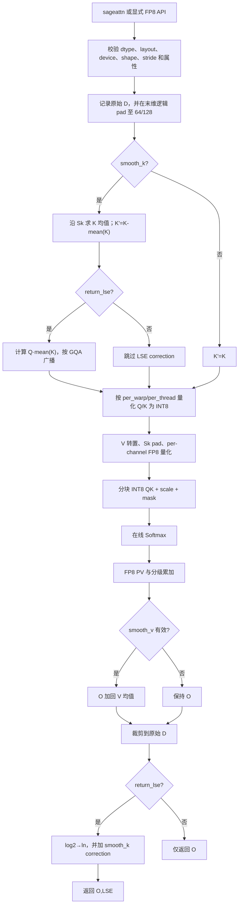
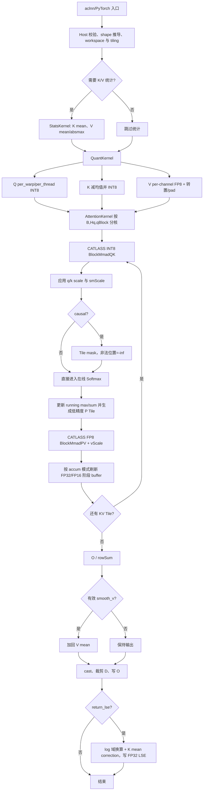

# SageAttention2 算子设计方案

> 文档状态：方案设计稿  
> 目标交付目录：`ops-transformer/experimental/attention/sageattention2`  
> 目标硬件：Atlas 950PR  
> 验收软件版本：CANN 9.2.0-beta.1  
> 设计范围：仅前向 INT8 \(QK^T\) + FP8 \(PV\)，不包含 FP16 PV、varlen、Triton、CUDA 同名接口和多卡 Ring Attention 实现。

## 一、需求背景

### 1.1 需求来源

本需求来源于社区 SageAttention2 算子开发任务，目标是在昇腾 NPU 上以 Ascend C + CATLASS 实现 SageAttention2 的 INT8 \(QK^T\) + FP8 \(PV\) 路径，并交付 PyTorch 与 aclnn 两层接口。

需求依据：

- 本地任务书：`sageAttention2 算子开发任务书/SageAttention2_task_doc.md`。
- 上游算法与接口：[thu-ml/SageAttention main 分支](https://github.com/thu-ml/SageAttention)，接口版本对齐 PyPI `sageattention==2.2.0` 的 SageAttention2 路径。
- 算法论文：[SageAttention2: Efficient Attention with Thorough Outlier Smoothing and Per-thread INT4 Quantization](https://arxiv.org/abs/2411.10958)。本任务按任务书选取其中 INT8 QK + FP8 PV 子路径。
- 目标代码仓：[cann/ops-transformer](https://gitcode.com/cann/ops-transformer)，合入目录为 `experimental/attention/sageattention2`。
- 性能基线：同仓 `attention/fused_infer_attention_score/` 下的 FIA（FusedInferAttentionScore）。
- CATLASS 参考：[Ascend 950 FlashAttention Infer 样例](https://gitcode.com/cann/catlass/tree/master/examples/49_ascend950_flash_attention_infer)及 Ascend 950 FP8/MXFP8 FlashAttention 样例。

### 1.2 背景介绍

#### 1.2.1 SageAttention2 算子实现优化

标准注意力计算为：

\[
S = QK^T \cdot \alpha,\qquad P=\operatorname{softmax}(S),\qquad O=PV
\]

其中 \(\alpha=1/\sqrt D\) 或由用户通过 `sm_scale` 指定。标准 FP16/BF16 FlashAttention 已避免物化全量 \(S\)，但两个矩阵乘仍占主要计算量。SageAttention2 通过细粒度 INT8 Q/K 量化、K/V outlier smoothing、V 的 per-channel FP8 量化以及分级累加，降低 Cube 主循环的数据带宽与计算开销。

本方案复用 CATLASS FlashAttention 的 Tile、BlockMmad 和在线 Softmax 组件，并在其前后用 Ascend C Vector 实现任务特有的平滑、细粒度量化、scale 应用、累加缓冲和 LSE correction。主核不生成 \([S_q,S_k]\) 全量 attention 矩阵。

#### 1.2.2 SageAttention2 现状分析

##### 1.2.2.1 参考实现支持的数据类型和数据格式

本任务是新增 experimental 算子，不存在可获取且与本任务等价的历史 TBE 算子，也不存在对应 TBE 算子信息库文件。因此 CheckList 中“TBE 源码路径”和“TBE 算子信息库路径”在本任务中均为“不适用”。

上游 `sageattention/core.py::sageattn_qk_int8_pv_fp8_cuda` 与本任务要求的能力如下：

| 项目 | 支持范围 |
| --- | --- |
| 输入 dtype | `float16`、`bfloat16`，Q/K/V 三者一致 |
| 逻辑布局 | `HND`：`[B,H,S,D]`；`NHD`：`[B,S,H,D]` |
| Q/K 量化 | INT8；`per_warp` 或 `per_thread` |
| V 量化 | FP8 E4M3 类语义，按 `[B,Hkv,D]` per-channel scale |
| PV 累加 | `fp32`、`fp32+fp32`、`fp32+fp16` |
| Mask | 无 mask 或 causal；causal 时要求 `Sq == Sk` |
| MHA/GQA | `Hq % Hkv == 0` |
| head_dim | `0 < D <= 128`；内部 pad 至 64 或 128 |
| 输出 | 与 Q 相同 shape、dtype；可选 FP32 LSE `[B,Hq,Sq]` |

FIA 只作为性能基线，不能作为本算子的数值 golden；数值主标杆必须是 GPU `sageattn_qk_int8_pv_fp8_cuda` 的同配置结果。

##### 1.2.2.2 参考实现逻辑描述

上游 FP8 路径的关键步骤为：

1. 校验 Q/K/V 的设备、dtype、head 数关系、布局和末维连续性。
2. 保存原始 `head_dim_og`，将 D 小于 64 的输入补至 64，将 64 与 128 之间的输入补至 128；D 大于 128 报错。
3. `smooth_k=True` 时，沿 K 的序列轴计算每个 `[B,Hkv,D]` 的均值 \(\mu_K\)，使用 \(K'=K-\mu_K\) 参与量化；GQA 场景按 `Hq/Hkv` 广播均值。
4. 当请求 LSE 时计算校正项 \(c=Q\mu_K^T\)。由于该项对同一 query 行的所有 key 是常量，平滑不改变 softmax 概率，但原始 LSE 需要加回 \(c\alpha\)。
5. `per_warp`：Q 按 128 行 Block 内的 32 行组量化，K 按 64 行 Block 量化。
6. `per_thread`：保留上游线程分组索引语义。Q 的每个 128 行 Block 分成 4 个 32 行 warp group，每组再按行号模 8 分成 8 组，每个 scale 覆盖 4 行 × D；因此每个 Q Block 有 32 个 scale。K 的每个 64 行 Block 按相邻两行与 8 行步长组合成 4 组，每个 scale 覆盖 16 行 × D；因此每个 K Block 有 4 个 scale。
7. 对每个量化组计算 \(s_x=\max(|x|)/127+\epsilon\)，并按上游舍入语义得到 `int8(round(x/s_x))`。
8. V 转置为适合 PV Cube 的布局，Sk 补至 64 的倍数；按 `[B,Hkv,D]` 计算 scale 并量化为 FP8。`fp32+fp16` 使用 `scale_max=2.25`，其他累加模式使用 `448.0`。
9. 分块计算 INT8 QK、scale 恢复、causal mask、在线 Softmax 和 FP8 PV；在线维护 row max、row sum 与 O accumulator。
10. `smooth_v=True` 仅在 `pv_accum_dtype="fp32"` 下生效，最终输出加回 \(\mu_V\)；在 `fp32+fp32`、`fp32+fp16` 下发出 warning 并忽略。
11. 输出裁剪回原始 D。请求 LSE 时，将内核的 log2 域结果除以 `1.44269504`，并在 `smooth_k=True` 时加上 `lse_correction * sm_scale`。

##### 1.2.2.3 参考实现流程图



## 二、需求分析

### 2.1 外部组件依赖

| 依赖 | 用途 | 约束 |
| --- | --- | --- |
| CANN 9.2.0-beta.1 | 编译、运行、aclnn 注册与验收 | 最终使用验收环境头文件/API，不以本机旧版本接口替代 |
| Ascend C | Vector 平滑、量化、scale、在线 Softmax 辅助与输出处理 | 所用 API 必须复核 950PR 支持、dtype、32B 对齐、mask/repeat 和地址重叠约束 |
| CATLASS | INT8 QK、FP8 PV 的 Cube Tile/BlockMmad 与 FA pipeline | 目标 Arch 为 Ascend 950；复用仓内当前可用组件，不复制私有实现 |
| PyTorch/torch_npu | Python API、dispatcher、Tensor 校验和扩展注册 | Q/K/V 必须位于同一 NPU device |
| AscendOpTest/pytest | 功能、精度和泛化测试 | CPU stub 仅调试，不作为验收 |
| GPU SageAttention 2.2.0 | L-A 数值 golden | 同 gran、accum、smooth、layout、causal 参数 |
| ops-transformer FIA | 双接口性能 golden | 950PR aclnn 固定使用 `aclnnFusedInferAttentionScoreV5` |

### 2.2 内部适配模块

代码组织及职责：

| 模块 | 目录建议 | 职责 |
| --- | --- | --- |
| 算子定义/tiling | `sageattn_fp8/op_host` | 原型、shape/type infer、参数校验、tilingKey、workspace 与分核 |
| 统计与量化 | `quant/` | K/V 均值、Q/K INT8、V FP8、scale 和布局变换 |
| Attention 主核 | `sageattn_fp8/op_kernel` | CATLASS QK/PV、在线 Softmax、分级累加、LSE |
| aclnn | `aclnn/` | 两段式接口、executor、workspace 和输出适配 |
| PyTorch | `python/` | `sageattn`、显式 FP8 API、torch op 注册、warning 与异常映射 |
| 测试 | `tests/pytest` | 500 条功能/精度用例、P-01～P-07 PyTorch 性能门禁 |
| 文档 | `README.md`、`docs/` | API、分发覆盖方式、限制、复现与自验证结果 |

### 2.3 需求模块设计

#### 2.3.1 Ascend C 算子原型

##### 2.3.1.1 PyTorch 原型

```python
def sageattn(
    q, k, v,
    tensor_layout="HND",
    is_causal=False,
    sm_scale=None,
    return_lse=False,
    **kwargs,
): ...

def sageattn_qk_int8_pv_fp8_asc(
    q, k, v,
    tensor_layout="HND",
    is_causal=False,
    qk_quant_gran="per_thread",
    sm_scale=None,
    pv_accum_dtype="fp32+fp16",
    smooth_k=True,
    smooth_v=False,
    return_lse=False,
    **kwargs,
): ...
```

`sageattn` 在 NPU 上固定分发至 `sageattn_qk_int8_pv_fp8_asc`。默认 `pv_accum_dtype="fp32+fp16"`；可由文档化的 kwargs 或环境变量覆盖，但二者同时设置时 kwargs 优先。未知 kwargs 必须报错，`attn_mask` 非 `None` 必须报错。

##### 2.3.1.2 aclnn 原型

aclnn 名称建议定为 `aclnnSageAttention2`，最终名称按 ops-transformer 评审意见统一。采用标准两段式接口：

```cpp
aclnnStatus aclnnSageAttention2GetWorkspaceSize(
    const aclTensor *q,
    const aclTensor *k,
    const aclTensor *v,
    const char *tensorLayout,
    bool isCausal,
    const char *qkQuantGran,
    const aclScalar *smScaleOptional,
    const char *pvAccumDtype,
    bool smoothK,
    bool smoothV,
    bool returnLse,
    const aclTensor *attentionOut,
    const aclTensor *softmaxLseOptional,
    uint64_t *workspaceSize,
    aclOpExecutor **executor);

aclnnStatus aclnnSageAttention2(
    void *workspace,
    uint64_t workspaceSize,
    aclOpExecutor *executor,
    aclrtStream stream);
```

`smScaleOptional == nullptr` 时使用原始 D 的 `1/sqrt(D)`。`returnLse=false` 时 `softmaxLseOptional` 必须为空；为 true 时其 dtype 为 FP32、shape 为 `[B,Hq,Sq]`。PyTorch 扩展只做参数语义适配，最终调用同一 aclnn/L0 路径，避免两套内核漂移。

##### 2.3.1.3 输入输出与属性

| 名称 | 类型 | dtype | 布局/shape | 说明 |
| --- | --- | --- | --- | --- |
| q | 输入 | FP16/BF16 | HND `[B,Hq,Sq,D]` 或 NHD `[B,Sq,Hq,D]` | 末维连续 |
| k | 输入 | 与 q 相同 | HND `[B,Hkv,Sk,D]` 或 NHD `[B,Sk,Hkv,D]` | 末维连续 |
| v | 输入 | 与 q 相同 | 与 k 相同 | 末维连续 |
| attention_out | 输出 | 与 q 相同 | 与 q 相同 | 内部 Dpad 后裁回 D |
| softmax_lse | 可选输出 | FP32 | `[B,Hq,Sq]` | 自然对数域 logsumexp |
| tensor_layout | 属性 | string | `HND`/`NHD` | 默认 HND |
| is_causal | 属性 | bool | — | true 时 Sq 必须等于 Sk |
| qk_quant_gran | 属性 | string | `per_warp`/`per_thread` | 默认 per_thread |
| sm_scale | 可选属性 | FP scalar | — | 空时 `1/sqrt(D)` |
| pv_accum_dtype | 属性 | string | 三种枚举 | 默认 fp32+fp16 |
| smooth_k/smooth_v | 属性 | bool | — | 默认 true/false |
| return_lse | 属性 | bool | — | 默认 false |

#### 2.3.2 Ascend C 算子相关约束与缺失能力

相对上游 SageAttention 完整仓，本任务明确缺失或不支持：

- 不支持 FP16 PV、INT4、varlen、任意 `attn_mask`、dropout、反向、多卡通信和 CUDA/Triton 后端。
- 不导出 `*_cuda`、`*_sm90` 等符号。
- 仅支持 `0 < D <= 128`；不支持输入末维非连续。
- 仅支持 FP16/BF16 Q/K/V，三者必须同 dtype、同 device。
- causal 仅支持 `Sq == Sk`。
- `smooth_v` 在 `fp32+fp32` 与 `fp32+fp16` 中仅 warning 后忽略。
- Atlas 950PR 之外的芯片不在本任务兼容承诺内。

## 三、需求详细设计

### 3.1 使能方式

1. aclnn 用户通过 `aclnnSageAttention2GetWorkspaceSize` 获取 executor 与 workspace 大小，再调用 `aclnnSageAttention2`。
2. PyTorch 用户可直接调用 `sageattn_qk_int8_pv_fp8_asc`；自动入口 `sageattn` 在 NPU 上固定转发至该接口。
3. `F.scaled_dot_product_attention = sageattn` 可作 plug-and-play 冒烟，但不支持原 SDPA 的非空 `attn_mask`、dropout 和训练反向。
4. 包导入时不执行 JIT 编译；内核随 OPP/扩展构建产物安装。性能计时排除首次加载和框架初始化。

### 3.2 需求总体设计

整体采用三阶段设备流水，所有中间 Tensor 均放在 aclnn workspace，Host 不读取设备数据：

1. `StatsKernel`：按需计算 K mean、V mean/V absmax；FP32 归约，按上游可见 dtype 语义保存 mean。
2. `QuantKernel`：Q/K 细粒度 INT8 量化；V per-channel FP8 量化并转换为 PV 友好布局。K 的减均值与量化融合，避免写出完整平滑 K。
3. `AttentionKernel`：CATLASS INT8 QK + Ascend C 在线 Softmax + CATLASS FP8 PV，输出 O 和可选 LSE。LSE correction 与有效的 V mean 回加在 epilogue 完成。

`smooth_k=false` 时 StatsKernel 跳过 K mean；`smooth_v=false` 或被 accum 模式忽略时跳过 V mean。长序列主耗时在 AttentionKernel；若 P-01～P-07 的前处理开销导致门禁不达标，优化顺序为：融合 V stats/quant、融合 Q quant 到主核 prologue、最后融合 K mean/quant，接口和 tiling 语义保持不变。

#### 3.2.1 Host 侧设计

##### 3.2.1.1 参数校验与 shape 推导

Host 按以下顺序校验，首个错误立即返回明确错误码：

1. Q/K/V 与输出指针非空，rank 均为 4；布局字符串仅为 HND/NHD。
2. Q/K/V dtype 相同且仅为 FP16/BF16，输出 dtype 与 Q 相同；LSE 为 FP32。
3. 解析 B、Hq、Hkv、Sq、Sk、D，要求所有维度大于 0，Q/K/V 的 B、D 相等，K/V 的 Hkv、Sk 相等。
4. `Hq % Hkv == 0`，计算 `gqaRatio=Hq/Hkv`。
5. `Dpad = 64`（`D<=64`）或 `128`（`64<D<=128`）；D>128 报错。pad 为 Kernel 边界填零，不在 Host 物化新输入。
6. Q/K/V 的末维 stride 为 1；其他轴允许合法非连续 stride，由 tiling 记录。若产品接口最终只接受整体连续，则在 aclnn 层显式 Contiguous，且性能报告计入该开销。
7. `is_causal=true` 时要求 `Sq==Sk`。
8. gran、accum 枚举合法；非空 `attn_mask` 或未知 kwargs 报错。
9. 输出 shape 完全匹配 Q；LSE 开关与可选输出是否存在一致。
10. 对所有元素数、workspace 加法和乘法做溢出检查。

##### 3.2.1.2 分核策略

Attention 主核以 `(b, hq, qBlock)` 为独立任务：

\[
N_q=\left\lceil\frac{S_q}{M}\right\rceil,\qquad
T=B\cdot H_q\cdot N_q
\]

其中 `M=qTile`，默认候选为 128。`blockDim=min(AICoreNum,T)`。

- 非 causal：每个任务遍历全部 `ceil(Sk/N)` 个 K/V Block，计算量相同，按任务号连续均分；`former=ceil(T/blockDim)`，尾核处理 `T-(blockDim-1)*former`。
- causal：第 `i` 个 qBlock 只访问 `0..min(Sk,(i+1)M)`，权重近似 `w_i=ceil(min(Sk,(i+1)M)/N)`。Host 对任务权重做前缀和，按总权重而非任务数切核，降低三角区域负载不均。
- GQA：任务中的 `hkv=floor(hq/gqaRatio)`，多个 Q head 只读同一 K/V 量化结果，不复制 K/V。
- 小 Sq 或小 `B*Hq`：允许一个核串行处理多个 qBlock；禁止多个核对同一输出行做 atomic 累加，保证确定的在线归约顺序。

Stats/Quant 侧分别以 `[B,Hkv,Dpad]` channel、Q quant group、K quant group为任务，按元素量加权均分，避免 D=64 与 D=128 混用同一静态负载假设。

##### 3.2.1.3 数据分块和内存优化策略

###### Tile 候选

| Dpad | 首选 `(M,N,K)` | 回退候选 | 说明 |
| --- | --- | --- | --- |
| 64 | `(128,128,64)` | `(128,64,64)` | K quant 基组为 64；N=128 合并两个组 |
| 128 | `(128,128,128)` | `(64,128,128)`、`(128,64,128)` | 对齐 CATLASS Ascend 950 FA 128 Tile；资源不足时缩 M/N |

最终候选由 9.2.0-beta.1 CATLASS 实际模板实例、L1/UB 容量和 profiler 决定，不能仅修改 tiling 数字而缺少对应编译实例。

###### LocalMemory 预算

设 `bQ=bK=bV=1`（量化后字节数）、score 为 FP32、P 为 FP8/FP16 临时、O 累加为 FP32 或分级缓冲，则单 stage 的近似 UB 需求为：

\[
U_{req}=MD_p b_Q+ND_p(b_K+b_V)+MN(4+b_P)+MD_p b_O+8M+U_{tmp}+U_{align}
\]

其中：

- `MN*4`：QK score/softmax 工作区；score 与 exp 尽可能原地复用。
- `MN*bP`：PV 输入 P 的低精度 Tile。
- `MDp*bO`：running O 或阶段累加缓冲。
- `8M`：FP32 running max 与 running sum。
- `Utmp`：ReduceMax/ReduceSum/Exp/Cast 所需临时空间。
- `Ualign`：队列、事件和 32B 对齐余量。

启用双缓冲时 Q/K/V 搬运项乘以 2，但 score、running max/sum 和 O accumulator 不重复分配。Host 选择满足 `Ureq <= usableUB` 的最大 `(M,N)`。L1 侧为 Q、K、V Tile 分配 CATLASS stage buffer；主路径使用两级流水隐藏 GM→L1、L1→L0 与 Cube 计算。

###### GM workspace

记 `Sk64=ceil(Sk/64)*64`，workspace 按 512B 向上对齐排列：

| 区域 | 元素数 | dtype |
| --- | ---: | --- |
| q_int8 | `B*Hq*Sq*Dpad` | INT8 |
| k_int8 | `B*Hkv*Sk*Dpad` | INT8 |
| v_fp8 | `B*Hkv*Dpad*Sk64` | FP8 |
| q_scale per_warp | `B*Hq*ceil(Sq/128)*4` | FP32 |
| q_scale per_thread | `B*Hq*ceil(Sq/128)*32` | FP32 |
| k_scale per_warp | `B*Hkv*ceil(Sk/64)` | FP32 |
| k_scale per_thread | `B*Hkv*ceil(Sk/64)*4` | FP32 |
| v_scale | `B*Hkv*Dpad` | FP32 |
| k_mean | smooth_k 时 `B*Hkv*Dpad` | 输入 dtype（FP32 归约后 cast） |
| v_mean | smooth_v 有效时 `B*Hkv*Dpad` | FP32 |

Host 使用 checked arithmetic 计算总 workspace。K mean 直接被 QuantKernel 消费，平滑后的完整 K 不落 GM。LSE correction 在主核 epilogue 使用原始 Q 与对应 k_mean 计算，不额外申请 `[B,Hq,Sq]` correction workspace。

###### 在线 Softmax

对每个 KV Tile \(j\)，维护每行 \(m,l,o\)：

\[
m' = \max(m, \max S_j)
\]

\[
r=\exp(m-m'),\quad P_j=\exp(S_j-m')
\]

\[
l'=r\cdot l+\sum P_j,\quad o'=r\cdot o+P_jV_j
\]

遍历完毕后 \(O=o/l\)，\(LSE=m+\ln l\)。causal 尾块在 ReduceMax/Exp 前将非法位置置为 `-inf`，不得让 pad 元素以 0 score 参与归一化。

##### 3.2.1.4 tilingKey 规划策略

采用无冲突位编码：

```text
bit 0      input dtype       0=FP16, 1=BF16
bit 1      layout            0=HND, 1=NHD
bit 2      Dpad class        0=64, 1=128
bit 3      causal            0=false, 1=true
bit 4      qk gran           0=per_warp, 1=per_thread
bit 5..6   accum             0=fp32, 1=fp32+fp32, 2=fp32+fp16
bit 7      smooth_k          0=false, 1=true
bit 8      effective smooth_v 0=false, 1=true
bit 9      return_lse        0=false, 1=true
```

公式为：

```text
tilingKey = dtype
          + 2*layout
          + 4*dpadClass
          + 8*causal
          + 16*gran
          + 32*accumCode
          + 128*smoothK
          + 256*effectiveSmoothV
          + 512*returnLse
```

Tile 实例编号不塞入上述语义位，放在更高位或单独 `tileId` 字段，便于调优时替换 Tile 而不改变接口语义。无效组合（如 accumCode 非 0 且 smoothV=1）在 Host 归一化为 effective false 并产生一次 Python warning。

##### 3.2.1.5 TilingData

TilingData 优先使用 32 位字段，包含：

```text
B,Hq,Hkv,Sq,Sk,D,Dpad,gqaRatio
qTile,kvTile,qBlockNum,kvBlockNum,skPadded64
coreNum,tasksPerCore,tailTasks,causalWeightOffsets
qScaleGroupsPerBlock,kScaleGroupsPerBlock
qStrideB/H/S,kStrideB/H/S,vStrideB/H/S,oStrideB/H/S
accumFlushInterval,tileId,flags
smScale,vScaleMax,quantEpsilon
workspace element offsets for q8/k8/v8/qScale/kScale/vScale/kMean/vMean
```

workspace offset 若总字节数可能超过 4 GiB，使用 64 位字节 offset；其他 shape、计数和 stride 在确认上限后使用 `uint32_t`，超界则 Host 报错，避免 Kernel 静默截断。

#### 3.2.2 Kernel 侧设计

##### 3.2.2.1 Kernel 侧实现描述

###### A. StatsKernel

1. `smooth_k=true`：按 `(b,hkv,dTile)` 扫描 Sk，FP32 固定树归约得到 mean；写出前 cast 至输入 dtype，以对齐上游 `torch.mean` 的可见结果。
2. `smooth_v` 有效：同样计算 FP32 V mean；V absmax 以平滑后的 V 为对象。
3. `smooth_v=false`：只计算 V 每个 `[b,hkv,d]` channel 的 absmax。
4. Sk 尾块 mask 为 0，不计入 sum/max；mean 分母始终为真实 Sk。

###### B. QuantKernel

1. Q/K 量化按 §1.2.2.2 的组索引计算 absmax 与 scale。
2. K load 后在 UB 中减去 k_mean，再求 scale 和 quant，不写出 K'。
3. 量化公式为：

   \[
   scale=\max(abs(x))/127+10^{-7},\qquad x_8=clip(round_{upstream}(x/scale),-127,127)
   \]

4. D<Dpad 的列显式写 0；Q/K 尾行也写 0，scale 只统计真实元素。
5. V 量化公式为 `v_scale=max(abs(v'))/scale_max`，零通道使用安全非零 scale；输出 FP8 并在写 GM 时完成 `[B,Hkv,Sk,D] -> [B,Hkv,D,Sk64]` Tile 转置/排布。
6. `scale_max=2.25` 仅用于 `fp32+fp16`，其他模式为 448.0。

###### C. AttentionKernel

1. 根据 blockIdx 解码 `(b,hq,qBlock)` 和 `hkv=hq/gqaRatio`。
2. 从 workspace 搬入 INT8 Q Tile 与对应 scale；遍历 K/V Tile。
3. 使用 CATLASS `Gemm::MmadFAIQK`、`TileMmadTla`、`BlockMmadTla` 或验收版本中等价的 Ascend 950 INT8 QK 组件完成 Cube 计算。
4. Vector 侧按每个 score 元素所属 quant group 应用 `q_scale*k_scale*smScale`。
5. causal 分支生成 Tile 内有效范围并置 `-inf`；非 causal 不生成全量 mask。
6. 复用/扩展 CATLASS `EpilogueAscend950FASoftmax` 在线更新 max/sum，将 P 转为 PV 模板需要的低精度 Tile。
7. 使用 CATLASS `MmadFAIPV`/`BlockMmadPV` 的原生 FP8 路径计算 P×V，并逐 channel 应用 v_scale。
8. 三种累加模式：
   - `fp32`：PV 结果持续进入 FP32 O accumulator。
   - `fp32+fp32`：按 `accumFlushInterval` 将硬件低精度/有效位受限的阶段结果归并到独立 FP32 buffer，再清空阶段 accumulator。
   - `fp32+fp16`：按 interval 将阶段结果归并到 FP16 buffer；在在线 max 更新时使用 FP32 rescale 因子维护跨阶段一致性。该模式为默认验收路径。
9. 完成所有 KV Tile 后除以 row sum。有效 smooth_v 时加回 v_mean；cast 为输入 dtype并只写真实 D。
10. `return_lse=true`：输出 FP32 `m+ln(l)`。若内部 Softmax 为 log2 域，执行 `/1.44269504`；smooth_k 时再加 `dot(q,k_mean_broadcast)*smScale`。

CATLASS 负责 Cube Tile、GM/L1/L0 搬运和 BlockMmad 主循环；Ascend C 负责统计/量化、scale 映射、mask、在线 Softmax 的定制部分、分级 buffer、LSE 与裁剪。二者边界不得退化为 Host 侧矩阵计算。

##### 3.2.2.2 Ascend C 实现流程图



##### 3.2.2.3 与 TBE 流程的差异及原因

本任务无 SageAttention2 TBE 实现，因此不存在可逐行比较的“TBE 流程图”。该 CheckList 项按“不适用”处理。为保证评审可追溯，下面列出 Ascend C/CATLASS 与上游 GPU 参考实现的差异：

| 差异 | Ascend 方案 | 原因/一致性保证 |
| --- | --- | --- |
| 线程粒度命名 | 将 per_warp/per_thread 映射为确定的 NPU quant group | Ascend C 没有同名内置枚举；保留组索引与 scale 语义，不照搬 CUDA thread 模型 |
| 主循环 | CATLASS Tile/BlockMmad + Ascend C Vector | 匹配 Ascend 950 Cube/Vector 和存储层次 |
| pad | Kernel Tile 内补零 | 避免 Host/Python 物化 padded Q/K/V |
| K smoothing | StatsKernel + K quant 融合减均值 | 均值跨完整 Sk，不能在每个 attention Tile 独立计算；融合避免写完整 K' |
| V layout | 量化写出时直接转换为 CATLASS PV 布局 | 消除单独 transpose 输出 |
| Softmax | 在线分块，不物化 attention 矩阵 | 控制长序列内存并对齐 FlashAttention 语义 |
| LSE | epilogue 中换算并校正 | 对齐上游 `lse/1.44269504 + correction*sm_scale` |
| 性能接口 | PyTorch 与 aclnn 共用 L0/Kernel | 避免接口路径性能与数值实现分叉 |

##### 3.2.2.4 Ascend C API 与约束检查

设计阶段候选 API 包括 DataCopy/TileCopy、Cast、Sub、Abs/ReduceMax、ReduceSum、Muls/Mul/Div、Exp、Select/Compare 和同步事件。开发时逐项查询 CANN 9.2.0-beta.1 的 Ascend C 接口约束；最低检查项如下：

- LocalTensor 和搬运起始地址至少 32B 对齐，GM/L1/L0 的 block、stride 与尾块单位使用 API 定义，不用元素数代替 block 数。
- Vector repeat/mask 按 dtype 分别计算；FP32 单 repeat 最大连续元素与 FP16/BF16 不同，长 Tile 必须循环。
- ReduceMax/ReduceSum 的 inner axis、临时空间、源/目的地址重叠限制由 Host 纳入 UB 预算。
- Cast 的 FP16/BF16/FP32→INT8 与 FP16/BF16→FP8 舍入、饱和模式必须与上游量化规则一致；如高阶 API 不支持目标 FP8 类型，使用 9.2 已支持的寄存器 SIMD/模板转换路径。
- Exp 与 Div 使用 FP32 数据；性能优化算法只有在 L-A/L-B 精度均通过后才能启用。
- CATLASS FP8/INT8 类型、layout 和 `Arch::Ascend950` 实例以实际合入版本为准。

本地 9.1.0-beta.1 API 索引不等同于目标 9.2.0-beta.1/950PR 环境，不能据此宣称 FP8 API 已在目标机验证。代码提交前必须用目标 SDK 重新完成平台支持、dtype、alignment、mask/repeat、range 和 `risk_flags` 检查。

### 3.3 支持硬件

| 产品 | 支持情况 | 说明 |
| --- | :---: | --- |
| Atlas 950PR | √ | 唯一验收目标，使用原生 FP8 与 Ascend 950 CATLASS 模板 |

### 3.4 算子约束限制

1. 只支持前向 FP16/BF16 Q/K/V；同 dtype、同 NPU device。
2. 只支持 HND/NHD 四维输入；Q/K/V 末维连续，D 在 `(0,128]`。
3. K/V 的 B、Hkv、Sk、D 一致；Q 与 K/V 的 B、D 一致；`Hq%Hkv==0`。
4. causal 仅支持 `Sq==Sk`；非 causal 支持 `Sq!=Sk`。
5. 不支持非空 `attn_mask`、dropout、backward、varlen、稀疏/滑窗、PagedAttention 和 KV cache。
6. `qk_quant_gran` 仅 `per_warp/per_thread`；accum 仅三个指定值。
7. `smooth_v` 在两种分级累加模式下被 warning 并忽略。
8. 输出不得与任一输入或 workspace 非法别名；不支持原地计算。
9. 长度上限由 checked 元素数、workspace、tiling 字段和设备内存共同决定；任务验收至少覆盖 Sk/Sq=16K。
10. 动态 shape 在每次调用时重新 tiling；不支持动态 rank。

## 四、特性交叉分析

| 交叉特性 | 影响 | 设计处理 |
| --- | --- | --- |
| FP16/BF16 × Dpad | BF16 Cast/量化与 D 尾列 | 独立 dtype key；Dpad 列写 0，输出裁剪 |
| HND/NHD × 非连续外轴 | 地址计算不同 | Host 记录 stride；若框架 Contiguous，计入端到端性能 |
| GQA × smooth_k/LSE | K mean 要广播至多个 Q head | Kernel 用 `hq/gqaRatio` 索引同一 mean，不物化 repeat_interleave |
| causal × 长序列 | 三角负载不均、尾 Tile mask | 权重分核；Tile 内 mask；不创建全量 mask |
| gran × Tile | quant scale 索引不同 | 固定 128/64 基组；Tile 必须是基组整数倍或走尾组逻辑 |
| accum × smooth_v | 两种 accum 不允许 smooth_v | Python warning；Host 使用 effectiveSmoothV key |
| return_lse × smooth_k | 需要原始 logits 的常量校正 | epilogue 计算 Q·k_mean 并加 `smScale` |
| 动态 shape × workspace | workspace 随 Sq/Sk 线性变化 | GetWorkspaceSize 使用 checked 公式并缓存合法 tiling |
| 多 stream/并发 | 禁止共享可写静态状态 | 所有状态在 executor、tiling 和本次 workspace；Kernel 可重入 |
| 确定性 | reduction 顺序可能影响末位 | 单输出行单核、固定 KV 顺序和固定 reduction tree，不用 atomic O |
| 图模式/torch.compile | Python 分支和 warning 可能 graph break | dispatcher 与参数归一化放在注册 op 边界；README 标注支持级别 |
| 分布式 | 仅需要 LSE 供上层 Ring Attention | 保证 LSE 数值/shape，不在本算子执行通信 |

## 五、可维可测分析

### 5.1 精度标准/性能标准

#### 5.1.1 功能与精度

功能必须覆盖任务书 TC-01～TC-10 和随附 `cases_500.json`。最低专项用例如下：

| 类别 | 必测点 |
| --- | --- |
| API | 自动分发、显式 API、aclnn 两段式、HND/NHD |
| dtype | FP16、BF16 |
| quant | per_warp/per_thread × 三种 accum |
| smooth | K/V 开关、无效 smooth_v warning |
| shape | D=48→64、D=96→128、D=64/128 边界、Sq!=Sk、GQA |
| mask/LSE | causal、return_lse shape 与 correction |
| 长序列 | 8K、16K |
| 负例 | D>128、非法枚举、Hq%Hkv、causal 长度不等、非空 mask、末维不连续 |

L-A 主精度标杆为 GPU `sageattn_qk_int8_pv_fp8_cuda`，必须保持 gran、accum、smooth、layout、causal 与 scale 完全相同：

| dtype | rtol | atol | matched ratio | max abs error |
| --- | ---: | ---: | ---: | ---: |
| FP16 | `2^-9` | `2^-9` | ≥0.99 | `1e-1` 或 32×ULP |
| BF16 | `2^-6` | `2^-6` | ≥0.99 | `1e0` 或 32×ULP |

L-B 辅标杆为 FP32 SDPA。相对 GPU Sage 与 FP32 真值的误差比例要求：max≤2、mean≤1.2、RMSE≤1.2。LSE 使用 FP32 容差或 GPU LSE 混合容差。CPU FP32 stub 不能替代 L-A 验收。

单元级还需验证：quant scale 与分组索引、K/V mean、FP8 `scale_max`、Dpad 零填充、online softmax 单 Tile/多 Tile、causal 尾块、三种 accum flush 边界和 log2→ln 换算。

#### 5.1.2 性能

硬门禁为同机、同 shape、同 dtype、同等 warmup/计时条件下：

\[
Speedup=\frac{T_{FIA}}{T_{SageAttention2}}\ge1.6
\]

PyTorch 与 aclnn 两条路径分别判定；P-01～P-07 每一条、每一路径均需 ≥1.6，且各自几何平均也需 ≥1.6。

| 编号 | HND shape/场景 | dtype | Sage 配置 |
| --- | --- | --- | --- |
| P-01 | `[1,32,4096,128]` | FP16 | per_thread、fp32+fp16 |
| P-02 | `[1,32,8192,128]` | FP16 | 同上 |
| P-03 | `[1,32,8192,128]` causal | FP16 | 同上 |
| P-04 | `[2,32,8192,128]` | FP16 | 同上 |
| P-05 | Hq/Hkv=32/8，S=4096，D=128 | FP16 | 同上 |
| P-06 | `[1,32,4096,128]` | BF16 | sageattn 默认 |
| P-07 | `[1,32,16384,128]` | FP16 | per_thread、fp32+fp16 |

PyTorch 基线为 `torch_npu.npu_fused_infer_attention_score`，aclnn 基线为 `aclnnFusedInferAttentionScoreV5`。报告需分列 Host/API 总耗时、Stats、Quant、QK、Softmax、PV、epilogue，并写明 CANN 9.2.0-beta.1、实际 FIA API、设备、频率策略、warmup、迭代数和布局转换是否计时。

### 5.2 兼容性分析

- 新增 experimental 算子，不替换现有 FIA，不改变既有 ABI。
- PyTorch API 名称除 `_cuda`→`_asc` 外，对齐上游参数名、默认值、返回值和 warning 语义。
- `sageattn` 只在 NPU backend 固定分发，不改变上游 CUDA 包的设备选择逻辑。
- aclnn 接口一旦发布，新增属性应通过新版本接口或可选参数演进，不能重排已有参数。
- CANN/CATLASS 内部模板非稳定 ABI；编译时固定已验证 commit，并在 README/自测报告记录。
- 不承诺 950PR 之外硬件、旧 CANN 或未来未验证 FP8 编码的二进制兼容。

### 5.3 可维护性与可定位性

- Host 对每类非法参数返回可区分错误信息，包含参数名和实际值，不输出 Tensor 数据。
- tiling 日志可选打印 tilingKey、Tile、blockDim、workspace 分区和有效开关；默认关闭，避免污染性能。
- profiler 可按 `sageattn_stats`、`sageattn_quant`、`sageattn_attention` 区分阶段。
- 所有 magic number（128/64/32/8/4、127、448、2.25、1.44269504）集中定义并注明上游来源。
- CATLASS 扩展组件与原组件分目录，优先组合而非修改公共模板；如必须修改公共模板，补对应 CATLASS UT。
- 量化分组用独立索引函数与单测，避免 tiling 调优改变算法语义。

### 5.4 验证环境限制

当前本地机器没有可用的 Ascend 950PR 编译、仿真或 NPU 运行环境。本方案只完成源码/任务书/CATLASS 参考的静态设计核对，未宣称本地编译成功、500 用例通过或性能达标。实现后的构建、AscendOpTest、GPU L-A、双接口 FIA 性能数据必须在目标环境补齐。

## 六、交付与评审

### 6.1 代码与文档交付

```text
experimental/attention/sageattention2/
├── sageattn_fp8/
│   ├── op_host/
│   └── op_kernel/
├── quant/
├── python/
├── aclnn/
├── tests/pytest/
├── docs/
└── README.md
```

### 6.2 设计决策待实机确认项

以下不是功能缺口，而是必须通过目标环境测量后冻结的实现参数：

1. CATLASS 9.2 实际可复用的原生 INT8/FP8 QK/PV 模板类名及 FP8 编码。
2. Dpad=64/128 下最优 `(M,N,K)`、stage 数和 `accumFlushInterval`。
3. Stats/Quant 三个逻辑任务合并为一个或两个 Kernel 的收益。
4. NHD 是直接 stride 读取还是预转置更快，以及布局转换是否计入性能口径。
5. 量化 Cast 的精确舍入/饱和路径与 GPU golden 的逐组一致性。

## 七、参考资料

1. [SageAttention GitHub](https://github.com/thu-ml/SageAttention)
2. [SageAttention `core.py`](https://github.com/thu-ml/SageAttention/blob/main/sageattention/core.py)
3. [SageAttention `quant.py`](https://github.com/thu-ml/SageAttention/blob/main/sageattention/quant.py)
4. [SageAttention2 论文](https://arxiv.org/abs/2411.10958)
5. [CANN ops-transformer](https://gitcode.com/cann/ops-transformer)
6. [FusedInferAttentionScore](https://gitcode.com/cann/ops-transformer/tree/master/attention/fused_infer_attention_score)
7. [CATLASS](https://gitcode.com/cann/catlass)
8. [CATLASS Ascend 950 FlashAttention Infer](https://gitcode.com/cann/catlass/tree/master/examples/49_ascend950_flash_attention_infer)
9. [生态算子开源精度标准](https://gitcode.com/cann/opbase/blob/master/docs/zh/ops_precision_standard/experimental_standard.md)
