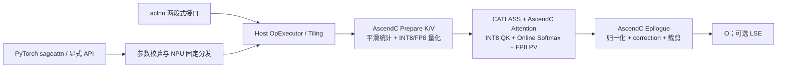
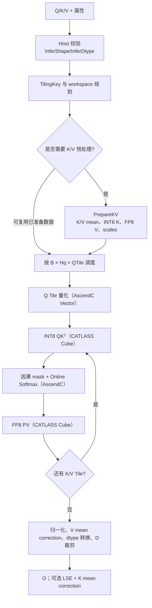

# SageAttention2 算子设计文档

## 一、需求背景

### 1.1 需求来源

社区任务《sageAttention2 算子开发任务书》要求参考开源 SageAttention2 的 INT8 $QK^T$ + FP8 $PV$ 路径，在 Atlas 950PR 上使用 **AscendC + CATLASS** 实现接口、功能和数值语义对齐的前向量化注意力算子。交付代码合入 [ops-transformer](https://gitcode.com/cann/ops-transformer) 仓 `experimental/attention/sageattention2` 目录。

任务的硬性验收边界如下：

1. 仅实现 INT8 $QK^T$ + FP8 $PV$，不包含 FP16 PV、varlen、Triton、反向传播及 CUDA 同名符号。
2. 必须交付 PyTorch 接口 `sageattn`、`sageattn_qk_int8_pv_fp8_asc` 和统一 FP8 PV aclnn 接口。
3. Kernel 必须由 AscendC 与 CATLASS 联合实现：CATLASS 承担 Cube/MatMul 主循环与布局、Tile 调度，AscendC 承担量化、平滑、在线 Softmax、两级累加控制和 Epilogue。
4. 功能与精度以开源 `sageattention==2.2.0` / `main` 分支的 GPU FP8 路径为主标杆；性能以 CANN 9.2.0-beta.1、Atlas 950PR 上的 FIA 为标杆。
5. PyTorch 与 aclnn 两条路径在 P-01～P-07 每条性能用例上均须满足 Speedup $\ge 1.6\times$，且两条路径各自的全用例几何平均 Speedup 均须满足 $\ge 1.6\times$。

### 1.2 背景介绍

#### 1.2.1 算子目标

SageAttention2 通过精细粒度 INT8 Q/K 量化、FP8 V 量化、outlier smoothing 和两级累加降低注意力计算的数据搬运与计算成本。算子计算形式为：

$$
O = \operatorname{softmax}(QK^T \cdot s)V,
$$

其中 $Q$、$K$ 量化为 INT8，$V$ 量化为 FP8；$s$ 为 `sm_scale`，未显式指定时取 $1/\sqrt{D_{og}}$。

本次设计目标如下：

1. 对齐 `sageattn_qk_int8_pv_fp8_cuda` 的参数名、默认值、校验行为、输出布局及 `return_lse` 语义，仅将 NPU 显式接口后缀改为 `_asc`。
2. 支持 FP16/BF16 输入、HND/NHD 布局、GQA、因果与非因果注意力、`per_thread`/`per_warp` 量化、三种 PV 累加模式以及 `smooth_k`/`smooth_v`。
3. 原始 head dimension 支持 $0 < D \le 128$；$D<64$ 时补齐到 64，$64<D<128$ 时补齐到 128，输出裁剪回原始维度。
4. 使用分块在线 Softmax，不在 GM 中物化 $[B,H_q,S_q,S_k]$ 全量 attention 矩阵。
5. 在 PyTorch 与 aclnn 双路径上满足功能、精度和性能门禁，并提供可复现的测试、日志和报告。

#### 1.2.2 基线来源说明

| 基线层次 | 来源 | 设计用途 |
| --- | --- | --- |
| 功能/API 基线 | SageAttention `main` / PyPI `sageattention==2.2.0` 的 `core.py` | 对齐 `sageattn` 与 `sageattn_qk_int8_pv_fp8_cuda` 的签名、默认值、warning、LSE 与分发语义 |
| 量化语义基线 | SageAttention2 `quant.py` 及 FP8 路径 | 固定 `per_thread`/`per_warp` 分组、scale、舍入、截断、平滑和 FP8 超参 |
| Kernel 复用基线 | CATLASS Ascend 950 FlashAttention、MXFP8 FA、低精度 MatMul 样例 | 复用目标芯片的 Layout、Tile、Mmad、流水与调度基础能力 |
| 性能基线 | ops-transformer `attention/fused_infer_attention_score/` | PyTorch 对比 `torch_npu.npu_fused_infer_attention_score`；aclnn 对比 `aclnnFusedInferAttentionScoreV5` |
| 精度标准 | opbase《生态算子开源精度标准》实验标准 | 规定 AscendOpTest、混合容差及报告口径 |

GPU SageAttention 是功能与精度 golden，FIA 是性能 golden，两者用途不得混用。性能数据必须来自同一 Atlas 950PR、同一 CANN 9.2.0-beta.1 环境；本文档不预填未经实测的时延或 Speedup。

#### 1.2.3 现状与差距分析

开源实现依赖 CUDA 架构与 CUDA FP8/INT8 Kernel，不能直接在 NPU 上复用。AscendC 没有名为 `per_thread` 或 `per_warp` 的内置量化模式，因此需要以 AscendC Vector 指令显式实现相同的元素分组和 scale 语义，再映射到 NPU 的 Tile/Block。CATLASS 可提供 Cube MatMul/FA 基础模板，但平滑、精细粒度 scale、在线 Softmax、两级累加切换、LSE correction 及 Python/aclnn 接口仍需新增。

总体数据流如下：



## 二、需求分析

### 2.1 外部组件依赖

| 组件 | 版本/来源 | 用途 | 约束 |
| --- | --- | --- | --- |
| CANN | 9.2.0-beta.1 | 编译、运行、aclnn、AscendC 与性能验收 | 性能报告必须记录完整版本 |
| AscendC | 随验收 CANN | Vector 量化、归约、Softmax、mask、Epilogue | 不使用 CUDA 风格孤立 Kernel 作为主实现 |
| CATLASS | ops-transformer 适配版本 | INT8 QK、FP8 PV 的 Cube 主循环、Layout、Tile 与 Mmad | 版本随代码提交固定 |
| PyTorch / torch_npu | 验收环境版本 | PyTorch 适配、事件计时与 FIA PyTorch 基线 | 报告记录版本及实际 FIA API 名称 |
| AscendOpTest | 验收环境版本 | 功能、异常和精度验证 | 用例及复现步骤随代码交付 |
| GPU SageAttention | `main` / 2.2.0 | 同路径同超参精度 golden | 不作为性能门禁 |

不新增与任务无关的第三方运行时依赖。Host 侧只负责参数检查、Tiling 与 Kernel 编排，不执行 Attention 数值计算。

### 2.2 内部适配模块

计划按 ops-transformer 当前标准算子目录约定合入 `experimental/attention/sageattention2/`；Python 公共 API 与 C++/aclnn 绑定在同一交付目录内补充：

| 模块 | 计划路径 | 设计职责 |
| --- | --- | --- |
| PyTorch 适配层 | `python/sageattention/core.py` | 导出两个公开函数，检查 device/dtype/shape，完成自动分发、默认参数和 warning 语义 |
| PyTorch 扩展绑定 | `torch_interface/` | 将 Tensor 与属性转换为 aclTensor/aclnn 调用，管理 workspace 与当前 stream |
| aclnn 接口 | `op_api/` | 统一 FP8 PV 两段式接口、参数校验与 OpExecutor；命名遵循 `aclnn_<op>.h/.cpp` |
| Host Tiling | `op_host/` | InferShape/InferDtype、TilingKey、Block Tile、流水级数、累加策略和 workspace 布局；参与编译的文件名包含 `_tiling` |
| K/V 准备 Kernel | `op_kernel/quant/` | `smooth_k`/`smooth_v` 统计、K INT8 量化、V FP8 量化及 scale/correction 元数据 |
| Attention Kernel | `op_kernel/` | Q 在线量化、CATLASS INT8 QK、AscendC 在线 Softmax、CATLASS FP8 PV、两级累加及输出 |
| CATLASS traits | `op_kernel/catlass/` | 目标芯片 Layout、Tile、Mmad、Stage 和数据类型特化；依赖仓内 `3rdparty/catlass` 固定版本 |
| 功能/精度测试 | `tests/ut/`、`tests/pytest/` | 接入任务包 `sageAttentionTest` 的 500 条用例，覆盖 GPU golden、FP32 SDPA 辅助误差和异常场景 |
| 性能测试 | `tests/performance/` | PyTorch/aclnn 双路径对比 FIA，覆盖 P-01～P-07 及扩展场景并输出统一报告 |
| 文档与样例 | `README.md`、`docs/`、`examples/` | 安装、接口、分发覆盖、限制、复现、SDPA 替换示例和自验证报告 |

目标结构如下：

```text
experimental/attention/sageattention2/
├── CMakeLists.txt
├── op_host/                 # 定义、InferShape/InferDtype、Tiling
├── op_kernel/
│   ├── quant/               # smooth 与 Q/K/V 量化
│   └── catlass/             # CATLASS traits/适配
├── op_api/                  # aclnn 两段式接口
├── torch_interface/         # torch_npu C++ 扩展绑定
├── python/sageattention/    # sageattn 与 *_fp8_asc 公共 Python API
├── tests/                   # UT、pytest、精度与双路径性能用例
├── examples/
├── docs/
└── README.md
```

### 2.3 算子接口原型

#### 2.3.1 PyTorch 接口

```python
from typing import Any, Optional, Tuple, Union
import torch

def sageattn(
    q: torch.Tensor,
    k: torch.Tensor,
    v: torch.Tensor,
    tensor_layout: str = "HND",
    is_causal: bool = False,
    sm_scale: Optional[float] = None,
    return_lse: bool = False,
    **kwargs: Any,
) -> Union[torch.Tensor, Tuple[torch.Tensor, torch.Tensor]]: ...

def sageattn_qk_int8_pv_fp8_asc(
    q: torch.Tensor,
    k: torch.Tensor,
    v: torch.Tensor,
    tensor_layout: str = "HND",
    is_causal: bool = False,
    qk_quant_gran: str = "per_thread",
    sm_scale: Optional[float] = None,
    pv_accum_dtype: str = "fp32+fp16",
    smooth_k: bool = True,
    smooth_v: bool = False,
    return_lse: bool = False,
    **kwargs: Any,
) -> Union[torch.Tensor, Tuple[torch.Tensor, torch.Tensor]]: ...
```

`sageattn` 在 NPU 上固定分发到 `sageattn_qk_int8_pv_fp8_asc`。自动入口识别的下沉 kwargs 为 `qk_quant_gran`、`pv_accum_dtype`、`smooth_k`、`smooth_v` 和兼容占位 `attn_mask`；`attn_mask` 非 `None` 时明确报错。累加模式的优先级定义为“显式 kwargs > 环境变量 `SAGEATTENTION_PV_ACCUM_DTYPE` > 默认值 `fp32+fp16`”；环境变量和 kwargs 均须在 README 中说明。非法属性值或未知 kwargs 直接抛出 `ValueError`，不得静默回退到其他路径。

#### 2.3.2 aclnn 接口

aclnn 采用“计算 workspace + 执行”的两段式接口。接口名称及属性定义如下，最终代码中的生成声明与本文保持一致：

```c
aclnnStatus aclnnSageAttention2GetWorkspaceSize(
    const aclTensor *query,
    const aclTensor *key,
    const aclTensor *value,
    const char      *tensorLayout,
    bool             isCausal,
    const char      *qkQuantGran,
    double           scaleValue,
    const char      *pvAccumDtype,
    bool             smoothK,
    bool             smoothV,
    bool             returnLse,
    const aclTensor *attentionOut,
    const aclTensor *softmaxLseOptional,
    uint64_t        *workspaceSize,
    aclOpExecutor  **executor);

aclnnStatus aclnnSageAttention2(
    void             *workspace,
    uint64_t          workspaceSize,
    aclOpExecutor    *executor,
    const aclrtStream stream);
```

PyTorch 的 `sm_scale=None` 由适配层换算为 `1.0 / sqrt(head_dim_og)` 后传入 `scaleValue`。aclnn 调用方始终传入有限的 `scaleValue`；`returnLse=false` 时 `softmaxLseOptional` 必须为空，`returnLse=true` 时必须提供 FP32 输出 Tensor。

#### 2.3.3 输入、输出与属性约束

| 名称 | 类别 | dtype / 取值 | HND shape | NHD shape | 说明 |
| --- | --- | --- | --- | --- | --- |
| `q` | 输入 | FP16/BF16 | `[B,Hq,Sq,D]` | `[B,Sq,Hq,D]` | 末维连续 |
| `k` | 输入 | 与 q 相同 | `[B,Hkv,Sk,D]` | `[B,Sk,Hkv,D]` | 与 q 同 device |
| `v` | 输入 | 与 q 相同 | `[B,Hkv,Sk,D]` | `[B,Sk,Hkv,D]` | shape 与 k 一致 |
| `tensor_layout` | 属性 | `HND`/`NHD` | — | — | 大小写敏感，非法值报错 |
| `is_causal` | 属性 | bool | — | — | 为 true 时要求 `Sq == Sk` |
| `qk_quant_gran` | 属性 | `per_thread`/`per_warp` | — | — | 精度 golden 必须使用同配置 |
| `sm_scale` | 属性 | `None`/有限浮点数 | — | — | `None` 时按 pad 前 `D` 计算 `1/sqrt(D)` |
| `pv_accum_dtype` | 属性 | `fp32`/`fp32+fp32`/`fp32+fp16` | — | — | 默认 `fp32+fp16` |
| `smooth_k` | 属性 | bool | — | — | 默认 true；影响 LSE correction |
| `smooth_v` | 属性 | bool | — | — | 两级累加模式下 warning 后忽略 |
| `return_lse` | 属性 | bool | — | — | false 返回 `o`；true 返回 `(o,lse)` |
| `kwargs` | Python 扩展属性 | 受支持键集合 | — | — | 自动入口可覆盖下沉属性；非空 `attn_mask` 报错 |
| `attentionOut` | 输出 | 与 q 相同 | `[B,Hq,Sq,D]` | `[B,Sq,Hq,D]` | 内部 pad 后裁回 D |
| `softmaxLse` | 可选输出 | FP32 | `[B,Hq,Sq]` | `[B,Hq,Sq]` | 不随输入布局改变 |

公共约束：$B,H_q,H_{kv},S_q,S_k,D$ 均为正整数；$H_q \bmod H_{kv}=0$；$0<D\le128$；Q/K/V dtype 相同、位于同一 NPU、`stride(-1)==1`。`attn_mask` 不在任务范围内，传入非空值必须报错。Host 侧对 shape 乘积和 workspace 大小使用 64 位安全计算并检查溢出。

## 三、需求详细设计

### 3.1 使能方式

| 上层调用 | 使能状态 | 入口 |
| --- | --- | --- |
| PyTorch 自动分发 | 必选 | `sageattn(...)` |
| PyTorch 显式 FP8 路径 | 必选 | `sageattn_qk_int8_pv_fp8_asc(...)` |
| aclnn 产品化调用 | 必选 | `aclnnSageAttention2GetWorkspaceSize` + `aclnnSageAttention2` |
| `F.scaled_dot_product_attention` 替换示例 | example 级 | `F.scaled_dot_product_attention = sageattn` |
| 反向传播、varlen、FP16 PV | 不支持 | 超出本任务范围 |

### 3.2 需求总体设计

算子采用“Host 选择 + K/V 准备 + 分块 Attention + Epilogue”的设计。K/V 在同一 KV head 下会被多个 Q Tile、多个 GQA Q head 复用，因此先写入线性量化 workspace；Q 在 Attention Kernel 内按 Tile 载入并量化，避免额外的完整 Q workspace。全流程只保存量化后的线性 Q/K/V 相关数据、scale 和行状态，不保存全量 attention score。



#### 3.2.1 Host 校验、分发与 TilingKey

PyTorch 层只做接口语义处理：

1. 校验输入 Tensor、布局、dtype、shape、device、末维连续性和属性枚举。
2. 将 `sm_scale=None` 换算为 $1/\sqrt{D_{og}}$；保留原始 D，并计算 `Dpad=64` 或 `128`。
3. `sageattn` 按“显式 kwargs > 环境变量 > 默认值”解析 `pv_accum_dtype`，固定分发到 `_fp8_asc`。
4. 当 `smooth_v=true` 且累加模式为 `fp32+fp32` 或 `fp32+fp16` 时发出与开源一致的 warning，并向下传递 `smoothVEffective=false`。
5. 获取当前 NPU stream，调用 aclnn 两段式接口，不在 Host 上执行量化或 Attention。

Host Tiling 根据以下维度生成稳定的 TilingKey：

```text
layout × input_dtype × Dpad × causal × qk_quant_gran
       × pv_accum_dtype × smooth_k × smooth_v_effective × return_lse
```

运行时 shape（B/H/S）进入 TilingData，不为每个 shape 生成独立二进制。TilingData 至少包含 `B/Hq/Hkv/Sq/Sk/Dog/Dpad`、GQA ratio、Q/KV Tile、有效尾块、Core 分配、流水 Stage、scale、workspace 各区偏移及累加归约周期。

#### 3.2.2 布局、GQA 与 head_dim pad

HND 与 NHD 通过 CATLASS Layout/Stride 描述符表达，不在 Host 侧做全量 permute。每个 Block 以逻辑坐标 `(batch, qHead, qTile)` 取数，GQA 的 KV head 映射为：

$$
h_{kv}=\left\lfloor\frac{h_q}{H_q/H_{kv}}\right\rfloor.
$$

Q/K/V 从 GM 搬入 UB 时完成 D 维 pad：有效区复制，`[D_{og},D_{pad})` 置零。输出仅写回 `[0,D_{og})`，因此 pad 不改变输出 shape。NHD 的跨 head stride 由 Layout 描述符处理，要求 D 维连续以保证向量化搬运。

#### 3.2.3 Smooth K / Smooth V

`smooth_k=true` 时，对每个 `(b,hkv,d)` 在序列维计算均值：

$$
\mu_K[b,h_{kv},d]=\frac{1}{S_k}\sum_j K[b,h_{kv},j,d],\qquad
K'=K-\mu_K.
$$

PrepareKV Kernel 使用 FP32 归约，尾块以有效元素 mask 处理。GQA 下同一个 $\mu_K$ 由对应的多个 Q head 复用。对原始 score，有：

$$
QK^T = Q(K')^T + Q\mu_K^T.
$$

第二项对同一 query 行的所有 key 相同，不改变 Softmax 概率，但必须加回对外 LSE。Kernel 保存每行 correction $c=Q\cdot\mu_K$，最终 LSE 增加 $c\cdot sm\_scale$。

`smooth_v=true` 且 `pv_accum_dtype="fp32"` 时，按序列维计算 $\mu_V$ 并量化 $V'=V-\mu_V$。由于每行 Softmax 概率和为 1，Epilogue 执行 $O=O'+\mu_V$。两级累加模式下按照开源行为 warning 并忽略 `smooth_v`，不得在 NPU 侧悄然启用不同语义。

#### 3.2.4 INT8 Q/K 量化

`per_thread` 与 `per_warp` 是开源算法定义的分组语义，不等价于 AscendC 的 PER_TOKEN/PER_GROUP 枚举。实现以 SageAttention2 2.2.0 的参考分组集合 $G$ 为不可变语义，对每组计算：

$$
a_G=\max_{x\in G}|x|,\qquad
s_G=\begin{cases}a_G/127,&a_G>0\\1,&a_G=0\end{cases},\qquad
x_{int8}=\operatorname{clip}(\operatorname{round}(x/s_G),-127,127).
$$

设计要求如下：

1. `per_thread`/`per_warp` 的元素归属、舍入和 scale 广播必须逐项对齐 GPU 同配置；NPU 的 QTile/KVTile 可调整，但不得改变参考分组边界。
2. Q 在 Attention Kernel 内由 AscendC Vector 量化；K 在 PrepareKV Kernel 中量化并写入线性 workspace，scale 与量化数据相邻分区存储。
3. $D_{pad}$ 的补零元素不参与 `amax`；全零组 scale 置 1、量化值置 0，避免除零和 NaN。
4. CATLASS QK 主循环读取 INT8 Q/K，INT32 部分和与 Q/K scale、`sm_scale` 融合反量化为 Softmax 输入。

具体分组常量以仓内锁定的 SageAttention 2.2.0 对照表和单元测试为准，代码中集中定义，禁止散落在 Kernel 分支中。

#### 3.2.5 FP8 V 量化与 scale

V 采用与开源 FP8 路径等价的按 channel（或其精确参考分组）量化与 scale 广播，使用 Atlas 950PR 原生 FP8 数据通路。量化规则为：

$$
s_V=\max(|V'|)/scale_{max},\qquad
V_{fp8}=\operatorname{cast}_{FP8}(V'/s_V),
$$

全零组同样令 scale 为 1。FP8 编码、饱和、NaN 处理及舍入模式与 GPU golden 对齐。`fp32+fp16` 默认路径使用开源对应的 `scale_max`（任务书给定典型值 2.25）；其它累加路径使用各自参考值（典型值 448.0）。这些数值作为累加模式 traits 的编译期配置，并由中间量化单测锁定，不允许跨模式共用 golden。

#### 3.2.6 分块 QK、因果 mask 与在线 Softmax

Block 网格沿 `(B,Hq,ceil_div(Sq,Br))` 展开。每个 Block 常驻一个 Q Tile，按序遍历 K/V Tile；初始 Tile 候选由 `Dpad` 和序列长度选择，最终值通过 950PR 实测调优：

| 场景 | 初始 Q Tile 候选 Br | 初始 KV Tile 候选 Bc | 设计关注点 |
| --- | --- | --- | --- |
| `Dpad=64` | 64 / 128 | 128 / 256 | 提高 Cube 利用率与单次搬运复用 |
| `Dpad=128` | 32 / 64 | 64 / 128 | 控制 UB/L1 占用并保持双缓冲 |
| causal / 尾块 | 继承上表 | 允许缩小一级 | 跳过完全位于因果边界右侧的 KV Tile |

候选值不是验收结论；提交前以 profiler 数据确定每类 TilingKey 的最终选择，并在自验证报告记录。CATLASS 使用目标芯片 traits 选择合法的 Cube micro-tile 和 Mmad，不在 Host 中硬编码指令级形状。

INT8 QK 反量化并乘 `sm_scale` 后先得到自然指数域的 logits $R_t$。为对齐开源 Kernel 的 base-2 指数实现，计算

$$
S_t=R_t\cdot\log_2 e.
$$

对第 $t$ 个 score Tile $S_t$，每行维护 base-2 域最大值 $m$、归一化和 $l$ 与未归一化输出累加器 $A$：

$$
m' = \max(m,\operatorname{rowmax}(S_t)),\quad
\alpha=2^{m-m'},\quad P_t=2^{S_t-m'},
$$

$$
l' = \alpha l + \operatorname{rowsum}(P_t),\qquad
A' = \alpha A + P_tV_t.
$$

最后 $O=A/l$，内部 LSE 为 $\log_2 l+m$。对外严格执行开源等价换算，将 base-2 LSE 转回自然对数域；`smooth_k` correction 本身位于自然 logits 域，因此在换算后相加：

```python
lse_out = lse_internal / 1.44269504
if smooth_k:
    lse_out += lse_correction * sm_scale
```

因果模式在 score 进入 rowmax 前将 `key_index > query_index` 置为 $-\infty$；完全越过因果边界的 KV Tile 不发起 QK/PV。因果只允许 `Sq==Sk`。尾 Tile 对 Q/K 有效行分别做 mask，不让 pad 行参与归约。

#### 3.2.7 两级 PV 累加

| `pv_accum_dtype` | 累加设计 | `smooth_v` |
| --- | --- | --- |
| `fp32` | FP8 PV 部分积直接维护 FP32 输出累加状态 | 支持 |
| `fp32+fp32` | 低精度 MMA 局部累加，达到 traits 规定周期后转换并归并到 FP32 二级 buffer | warning 后忽略 |
| `fp32+fp16` | 低精度 MMA 局部累加，达到 traits 规定周期后归并到 FP16 二级 buffer；最终归一化计算使用 FP32 行状态 | warning 后忽略；默认性能路径 |

归约周期是 Tiling traits 的组成部分，依据 Bc、Dpad、数值范围和精度回归共同确定。任何为性能调整的周期都必须重新通过同模式 GPU golden 和 FP32 SDPA 辅助误差门禁。在线 Softmax 的 $m/l$ 始终用 FP32 保存，避免长序列归一化状态随 PV 累加模式降精度。

#### 3.2.8 AscendC 与 CATLASS 模块边界

| 处理环节 | AscendC | CATLASS |
| --- | --- | --- |
| GM↔UB/L1 搬运、pad、尾块 | DataCopy、Vector 填零、mask | Layout/Tile 描述与主循环搬运协同 |
| K/V mean、Q/K/V 量化 | Vector amax/reduce/sub/mul/cast | — |
| INT8 QK | scale 准备、结果反量化 | INT8 Cube Mmad 主循环 |
| mask 与 Online Softmax | rowmax、exp、rowsum、状态 rescale | 提供 Tile 生命周期和同步点 |
| FP8 PV | scale 融合、二级 buffer 归并控制 | FP8 Cube Mmad 主循环 |
| Epilogue | 除法、smooth_v correction、LSE correction、cast/crop | 输出 Tile 组织 |

两个框架通过显式 Pipeline Stage 和事件同步协同；Q/K Tile 与 V Tile 采用双缓冲，尽量重叠下一 Tile 的 GM 搬运、当前 Tile 的 Cube 计算和上一 Tile 的 Vector 后处理。实现不得把 Cube 与 Vector 对同一 buffer 的读写交叠到未定义区间。

#### 3.2.9 Workspace 设计

workspace 由 GetWorkspaceSize 根据 shape、属性和 Tiling 统一规划，按运行时要求对齐：

| 分区 | 内容 | 生命周期 |
| --- | --- | --- |
| `k_int8` | 平滑后的量化 K | 单次调用 |
| `k_scale` | K 分组 scale | 单次调用 |
| `v_fp8` | 可选平滑后的量化 V | 单次调用 |
| `v_scale` | V 分组 scale | 单次调用 |
| `k_mean` / `v_mean` | smoothing 统计；仅对应开关有效时存在 | 单次调用 |
| `lse_correction` | 需要返回 LSE 且 `smooth_k=true` 时的行 correction | 单次调用 |
| `kernel_scratch` | 多核归约、尾块或特殊 Tiling 临时区 | 单次调用 |

总空间复杂度为 $O(BH_{kv}S_kD)+O(BH_qS_q)$，不含 $O(S_qS_k)$ 分区。各分区偏移由 64 位安全加法计算并做上限检查；workspace 由上层一次申请、在同一 stream 内复用，Kernel 内不进行动态内存分配。

#### 3.2.10 异常、边界与确定性处理

| 场景 | 处理方式 |
| --- | --- |
| `D<=0` 或 `D>128` | Host 明确报错，不启动 Kernel |
| `D=48` / `D=96` | 分别 pad 到 64 / 128；量化统计忽略补零区，输出裁回 48 / 96 |
| Q/K/V dtype 或 device 不一致 | 报错 |
| 末维不连续 | 报错；不在接口内隐式 contiguous 拷贝 |
| `Hq % Hkv != 0` | 报错 |
| causal 且 `Sq != Sk` | 报错 |
| 非因果且 `Sq != Sk` | 支持，Q/K 尾块分别计算 |
| 非空 `attn_mask` | `NotImplementedError` 或对应 aclnn 参数错误 |
| 非法 gran / accum / layout | 列出合法值并报错，不回退 |
| `smooth_v` + 两级累加 | 发出一次 warning，忽略 `smooth_v` |
| 全零量化组 | scale=1、量化值=0，避免 NaN/Inf |
| 极值、NaN、Inf 输入 | 按精度标准增加异常/鲁棒性用例；非有限输入行为与 golden 对齐并在 README 说明 |

相同输入、属性、CANN/CATLASS 版本和 TilingKey 下，Kernel 的 Tile 遍历与归约顺序固定。性能优化不得引入未初始化 padding 或数据竞争。

#### 3.2.11 架构决策记录

以下决策状态均为“拟采用”，日期为 2026-08-17；设计评审通过后转为“已接受”。若实现阶段改变结论，应保留原记录并注明替代决策，避免只修改结果而丢失原因。

| 决策 | 选择 | 备选方案及未选原因 | 结果与代价 |
| --- | --- | --- | --- |
| AD-01：量化与 Attention 的融合边界 | K/V 预处理后线性存储，Q 在 Attention 内按 Tile 量化 | 全量 Q/K/V 预量化会增加 Q workspace 和读写；完全逐 Tile 量化会让 K/V 随 Q Tile 重复计算，GQA/长序列代价更高 | K/V 可跨 Q Tile 复用且无 Q workspace；需承担一次 PrepareKV 启动和 K/V workspace，必须以 P-01～P-07 实测关闭性能风险 |
| AD-02：矩阵计算框架 | CATLASS 负责 INT8 QK 与 FP8 PV Cube 主循环，AscendC 负责 Vector 与控制逻辑 | 纯 AscendC 手写 Cube 难复用目标芯片成熟 Tile/Mmad；纯 CATLASS 难表达参考量化、smoothing、warning/LSE correction 全语义 | 边界清晰并满足任务硬约束；需要显式同步和共同 TilingData |
| AD-03：双接口实现 | PyTorch 与 aclnn 共享同一 OpExecutor、Tiling 和 Kernel | 两套独立实现会产生数值、性能及缺陷修复分叉 | 接口包装开销可分别测量，核心结果一致；PyTorch 适配层只负责语义转换 |
| AD-04：布局适配 | HND/NHD 使用 Layout/Stride 直接寻址，不做全量转置 | Host/前置 Kernel 全量 permute 实现简单，但增加带宽、workspace，并使 FIA 对比口径复杂 | 需要两套搬运 traits；消除额外全量拷贝并保持公平计时 |
| AD-05：Softmax | 分块 online softmax，FP32 保存 m/l | 物化 score 后调用独立 Softmax 会产生 $O(S_qS_k)$ 空间且长序列不可接受 | 空间随输入线性增长；需谨慎维护 rescale 与两级 PV 累加顺序 |
| AD-06：性能特化 | 以有限 TilingKey + shape TilingData 组合，而非逐 shape 编译 | 单一通用 Tile 无法兼顾 D=64/128、causal 和长序列；逐 shape 编译增加二进制/JIT 成本 | 编译规模可控；每个 key 都必须进入编译、功能、精度和 profiler 覆盖 |

### 3.3 支持硬件

| 支持的芯片版本 | 涉及勾选 |
| --- | --- |
| Atlas 950PR | √ |

其他 Atlas 型号不纳入本任务验收；若未来扩展，须新增独立芯片 traits、精度回归和性能数据，不得复用 950PR 结论。

### 3.4 算子约束限制

1. 仅支持前向 INT8 QK + FP8 PV，输入为 FP16/BF16，输出与 q 同 dtype。
2. 仅支持 HND/NHD，末维必须连续；不支持任意 `attn_mask`、varlen、反向传播或 FP16 PV。
3. 原始 $D\in(0,128]$；GQA 要求 `Hq % Hkv == 0`；因果模式要求 `Sq==Sk`。
4. `per_thread`/`per_warp` 与三种累加模式分别对齐同配置 golden，不允许跨配置替代。
5. 不物化全量 attention 矩阵；workspace 随 K/V 线性增长。
6. 公开默认路径为 `pv_accum_dtype="fp32+fp16"`，也是功能与性能必测路径。
7. PyTorch 与 aclnn 共享同一 Host Tiling 和 Kernel，避免接口间出现数值或性能实现分叉。

## 四、特性交叉分析

| 交叉维度 | 设计关注点 | 应对策略 | 必测用例 |
| --- | --- | --- | --- |
| FP16/BF16 × HND/NHD | dtype 转换、stride 与输出布局 | Layout 描述符直读；D 维连续；输出原布局写回 | TC-01 |
| `per_thread`/`per_warp` × 三种 accum | 6 条数值路径不可共用错误 golden | TilingKey 分离；逐组合对 GPU 同超参 | TC-02 |
| `smooth_k` × GQA × LSE | correction 需按 KV→Q head 广播 | `hkv=floor(hq/ratio)`；FP32 correction | TC-03/04/06 |
| `smooth_v` × accum | 两级累加须 warning 并忽略 | Python 与 aclnn Host 统一生成 effective flag | TC-03 |
| D pad × quant group | pad 不能改变 amax/scale | 有效 D mask；输出裁剪 | TC-05 |
| causal × Sq/Sk | 非方阵因果非法；Tile 可跳过 | Host 拒绝 `Sq!=Sk`；右上 Tile 剪枝 | TC-07/08 |
| 非因果 × Sq≠Sk | Q/K 尾块不同 | 独立有效行 mask | TC-06 |
| 长序列 × online softmax | 数值稳定性、累加误差、workspace | FP32 m/l、周期归并、不存 score 矩阵 | TC-09/P-02/P-07 |
| PyTorch/aclnn × FIA | 包装开销和计时口径不同 | 两条路径分别预热、计时、判门禁 | P-01～P-07 |
| 自动分发 × 显式覆盖 | 默认值/环境变量冲突 | 固定优先级并记录最终配置 | TC-01/02 |
| GQA × KV 复用 | 重复搬运影响性能 | KV 量化 workspace 共享；按 Q head 调度并评估 L2 复用 | P-05 |

## 五、可维可测分析

### 5.1 验收标准与验证方式

| 验收项 | 标准 | 验证方式 |
| --- | --- | --- |
| API/功能 | TC-01～TC-10 全部通过；返回 shape/dtype、warning 与异常语义对齐 | PyTorch 单测 + aclnn ST + SDPA 替换冒烟 |
| 主精度 L-A | NPU `_asc` 对 GPU `_cuda`，同 gran、同 accum、同 smoothing；FP16/BF16 满足混合容差 | AscendOpTest；逐配置保存输入、golden 与误差统计 |
| 辅精度 L-B | 相对 FP32 SDPA 真值的误差比：max≤2、mean≤1.2、RMSE≤1.2 | 同一输入分别计算 NPU、GPU-Sage 和 FP32 SDPA |
| LSE | shape `[B,Hq,Sq]`、FP32；数值与 GPU 同路径一致 | 覆盖 smooth_k on/off、GQA、因果、长序列 |
| 性能 | P-01～P-07 每条的 PT 与 aclnn Speedup 均≥1.6×；两路径几何平均也均≥1.6× | 950PR/CANN 9.2.0-beta.1 同机同 shape；分别对 FIA 计时 |
| 实现约束 | Kernel 使用 AscendC+CATLASS；不物化全量 attention | 代码评审、workspace 审计、Profiler 内存/Kernel 轨迹 |
| 可复现性 | 版本、命令、seed、配置、日志、截图齐全 | 测试 README 与自验证报告 |

输出混合容差采用任务书口径：

| dtype | rtol | atol | matched_ratio | max_abs_error_limit |
| --- | --- | --- | --- | --- |
| FP16 | $2^{-9}$ | $2^{-9}$ | ≥0.99 | 1e-1 或 32×ULP |
| BF16 | $2^{-6}$ | $2^{-6}$ | ≥0.99 | 1e-0 或 32×ULP |

### 5.2 功能与精度验证矩阵

任务包 `sageAttentionTest/cases/cases_500.json` 已定义 500 条参数化用例，作为首轮接入基线：

| suite | 数量 | 用途 |
| --- | ---: | --- |
| `functional` | 380 | shape、dtype、布局、属性、pad、GQA、causal 与长序列泛化 |
| `functional_neg` | 6 | D 超限、非法 causal/GQA/layout/gran/accum 等拒绝路径 |
| `accuracy` | 100 | L-A GPU 同路径与 L-B FP32 SDPA 精度验证 |
| `perf` | 14 | P-01～P-07 硬门禁及相邻 shape 扩展场景；aclnn 路径需在交付侧补齐 |

接入时保留任务包的 case id、seed、suite 和 tag，禁止为了通过测试删减用例。任务包当前 PyTorch 性能脚本仅覆盖 FIA PyTorch 对比；交付实现必须新增同参数的 aclnn runner，并在统一报告中按 case id 合并两条路径。

| 编号 | 场景 | 核心断言 |
| --- | --- | --- |
| TC-01 | `sageattn`，FP16/BF16，HND/NHD | 固定分发 FP8 `_asc`；输出布局/dtype 正确 |
| TC-02 | 两种 gran × 三种 accum | 6 组分别对齐 GPU 同路径；默认含 `fp32+fp16` |
| TC-03 | `smooth_k`/`smooth_v` 开关 | smoothing 数值正确；不支持组合 warning 且确实忽略 |
| TC-04 | `return_lse=True` | LSE 为 `[B,Hq,Sq]` FP32；换算与 correction 正确 |
| TC-05 | D=48、64、96、128 | pad 分支、边界与输出裁剪正确 |
| TC-06 | GQA Hq/Hkv=32/8 且 Sq≠Sk、非因果 | head 映射、KV 复用与尾块正确 |
| TC-07 | causal | 对照 GPU 同路径；右上 Tile 不参与结果 |
| TC-08 | D>128、非连续末维、非法枚举、非空 mask、非法 GQA/causal | 每类输入在 Host 明确报错 |
| TC-09 | S≥8K/16K | 无 OOM、无全量 score workspace、精度稳定 |
| TC-10 | 替换 SDPA 冒烟 | example 可运行，返回接口兼容 |

精度用例除典型正态输入外，还需覆盖全零、小幅值、大幅值、量化边界、非 Tile 整数倍、不同 `sm_scale`、`return_lse` 与固定随机 seed。`per_thread` 与 `per_warp`、不同累加模式的 golden 文件和结果目录必须分开命名。

基础复现命令沿用任务包约定：

```bash
python cases/generate_cases.py
python -m pytest -rA -s tests/pytest/test.py -m "functional or accuracy"
python -m pytest -rA -s tests/pytest/test.py -m smoke
python -m pytest -rA -s tests/pytest/test_perf.py -m perf
```

### 5.3 性能验证矩阵

统一计算：

$$
Speedup=\frac{T_{FIA}}{T_{SageAttention2}}.
$$

PyTorch 推荐使用 `torch.npu.Event`，aclnn 使用等价 Device 计时；两者均排除首次编译/JIT，充分 warmup 后进行多轮重复，batch 结束同步，报告中同时给出中位数和波动范围。布局转换若计时，双方必须采用相同口径。

| 编号 | shape / 场景（HND） | 本算子配置 | FIA-PT | Sage-PT | Speedup-PT | FIA-aclnn | Sage-aclnn | Speedup-aclnn | 门禁 |
| --- | --- | --- | --- | --- | --- | --- | --- | --- | --- |
| P-01 | `[1,32,4096,128]` | fp32+fp16 | 待实测 | 待实测 | 待实测 | 待实测 | 待实测 | 待实测 | 两路径均≥1.6× |
| P-02 | `[1,32,8192,128]` | fp32+fp16 | 待实测 | 待实测 | 待实测 | 待实测 | 待实测 | 待实测 | 两路径均≥1.6× |
| P-03 | `[1,32,8192,128]` causal | fp32+fp16 | 待实测 | 待实测 | 待实测 | 待实测 | 待实测 | 待实测 | 两路径均≥1.6× |
| P-04 | `[2,32,8192,128]` | fp32+fp16 | 待实测 | 待实测 | 待实测 | 待实测 | 待实测 | 待实测 | 两路径均≥1.6× |
| P-05 | GQA 32/8，S=4096，D=128 | fp32+fp16 | 待实测 | 待实测 | 待实测 | 待实测 | 待实测 | 待实测 | 两路径均≥1.6× |
| P-06 | `[1,32,4096,128]` BF16 | 默认 fp32+fp16 | 待实测 | 待实测 | 待实测 | 待实测 | 待实测 | 待实测 | 两路径均≥1.6× |
| P-07 | `[1,32,16384,128]` | fp32+fp16 | 待实测 | 待实测 | 待实测 | 待实测 | 待实测 | 待实测 | 两路径均≥1.6× |

FIA 的 PyTorch API 固定为验收环境指定的 `torch_npu.npu_fused_infer_attention_score` 或 `_v2`，同一报告不得混用；aclnn 固定为 `aclnnFusedInferAttentionScoreV5`。报告必须记录实际 API 名、CANN/torch_npu/CATLASS 版本、频率策略、warmup/迭代次数、输入 dtype/layout、FIA 参数以及转换开销口径。

### 5.4 可维护性、可观测性与风险控制

1. **配置集中化**：量化分组、FP8 traits、累加周期和 Tile 候选集中定义；Host 与 Kernel 共用生成的 TilingData，避免魔法数分叉。
2. **错误可诊断**：Host 错误信息包含参数名、实参和合法集合；warning 只在 PyTorch/Host 层生成一次。
3. **性能可观测**：调试构建可输出 TilingKey、Br/Bc、workspace 分区与实际分发模式；正式性能构建关闭日志。Profiler 中为 PrepareKV 和 Attention 使用稳定 Kernel 名称。
4. **精度可定位**：可选调试用例分别导出 K mean、Q/K scale、V scale、量化张量、Softmax 行状态和 LSE correction，与 GPU 中间结果逐级比对；这些调试输出不进入公开热路径。
5. **版本可追溯**：README 与报告记录 SageAttention golden commit、CATLASS commit、ops-transformer commit 和 CANN 版本。

主要风险及关闭条件：

| 风险 | 影响 | 设计应对 | 关闭条件 |
| --- | --- | --- | --- |
| PrepareKV 额外读写抵消低精度收益 | 无法达到 1.6× | K/V 一次量化多 Q Tile 复用；搬运/Cube/Vector 双缓冲；评估小 shape 融合分支 | P-01～P-07 双路径全部达标 |
| NPU Tile 改变参考量化分组 | 精度不对齐 | 参考分组与物理 Tile 解耦，增加 scale/量化中间单测 | 两种 gran 全部通过 L-A |
| `fp32+fp16` 长序列误差累积 | P-07 精度失败 | 调整二级归并周期，保持 m/l FP32；每次调整重跑精度 | 16K 用例通过双层精度门禁 |
| GQA 重复加载 K/V | P-05 性能下降 | 共享量化 workspace，按 head/Tile 排序提高 L2 命中；评估多 Q head 协同调度 | P-05 双路径≥1.6× |
| NHD stride 导致搬运效率低 | NHD 性能/功能异常 | Layout 专用搬运 traits；不做 Host 全量 permute | HND/NHD 功能通过且性能分析无异常热点 |
| UB/L1 占用过高 | 降低并发或编译失败 | Dpad 分级 Tile、Stage 数受资源模型约束、尾块缩 Tile | 所有 TilingKey 编译通过且 profiler 无资源退化 |

### 5.5 兼容性分析

新增代码位于 `experimental/attention/sageattention2`，不修改 FIA 的公开接口或实现。PyTorch 包导出 `_asc` 名称，避免与开源 `_cuda`/`_sm90` 符号冲突。aclnn 与 PyTorch 复用同一算子实现；未来增加其他芯片或路径时通过新的后端/traits 扩展，不改变本任务两个公开 Python 函数的既有参数语义。

### 5.6 待评审通过后进入开发/验收的交付件

1. `experimental/attention/sageattention2` 完整代码：AscendC+CATLASS Kernel、Host Tiling、PyTorch 适配、aclnn 接口和构建文件。
2. TC-01～TC-10 功能/精度测试、P-01～P-07 双路径性能测试及可复现 README。
3. 自验证报告：完整用例参数、两层精度数据、PyTorch/aclnn 分列性能数据、几何平均 Speedup、Profiler/日志与截图。
4. 算子 README：安装、接口、默认分发、kwargs/环境变量覆盖、warning、限制、示例与常见错误。
5. 个人代码仓链接、分支和目标目录信息；通过验收后向 ops-transformer 的 `experimental/attention/sageattention2` 提交 PR。
