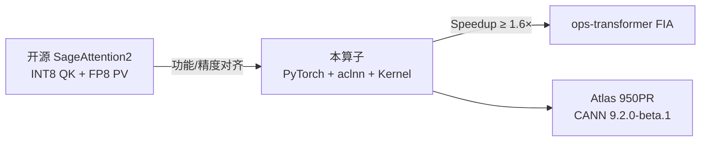
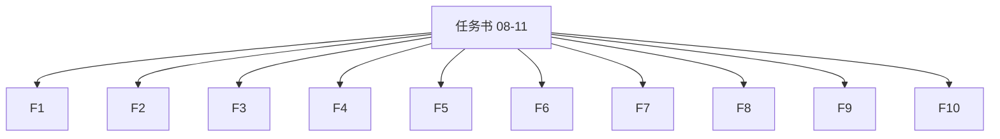
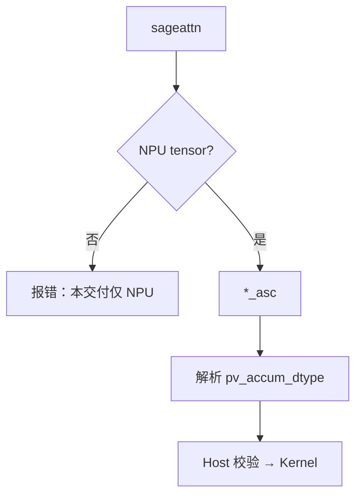
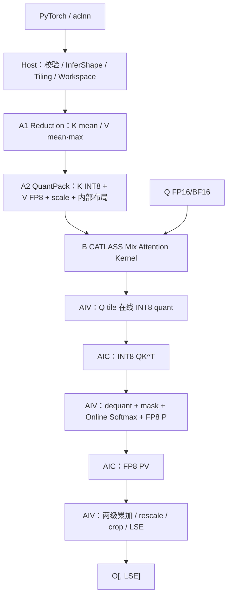
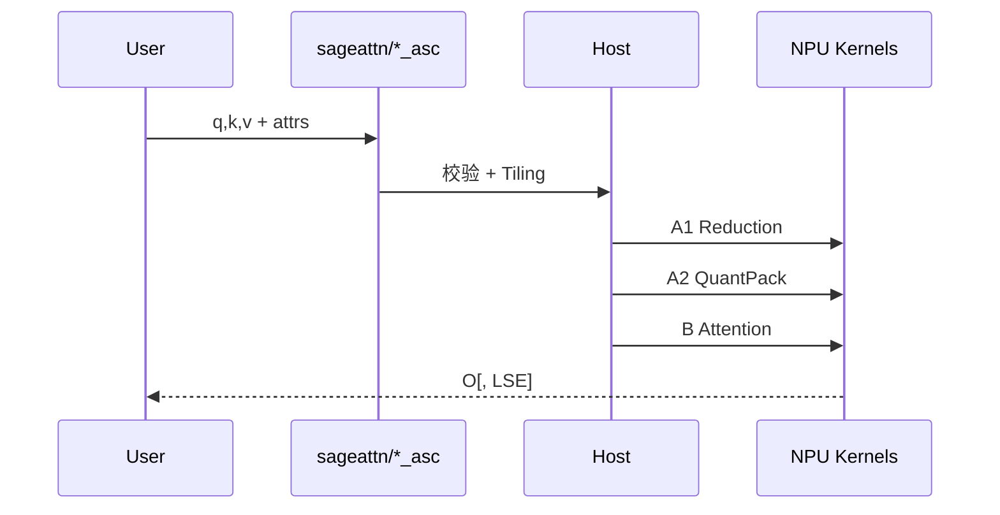
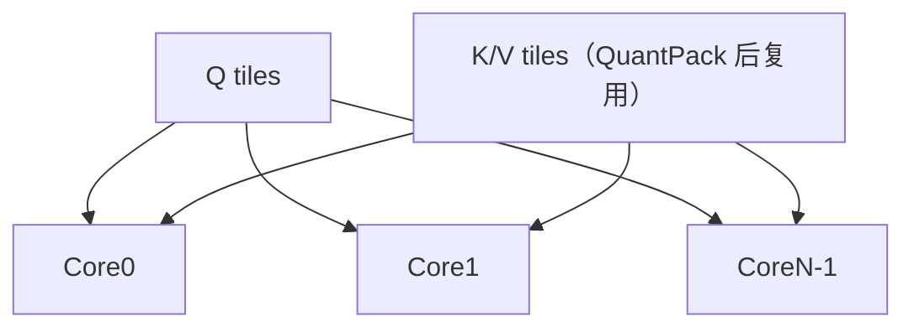
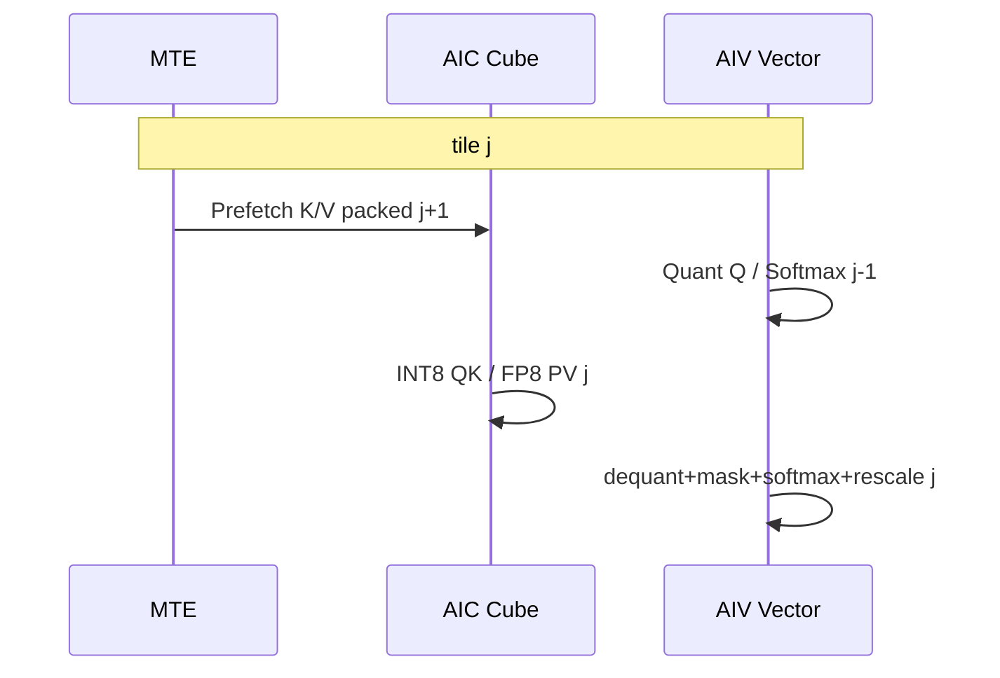
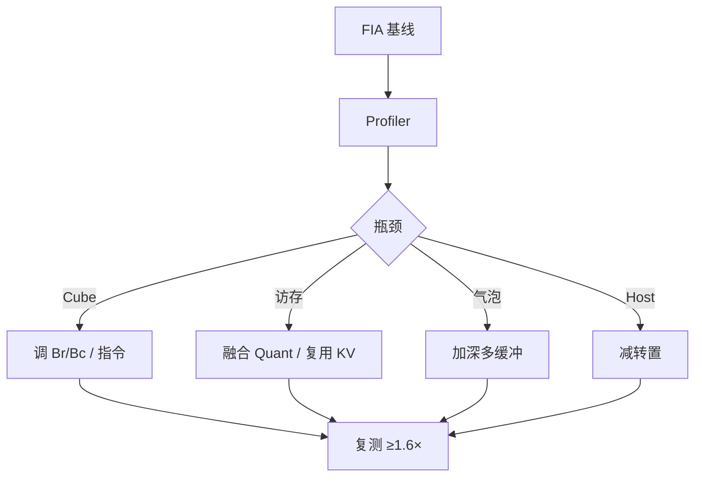

# 【CANN社区任务】sageAttention2 算子设计文档

| 项目 | 内容 |
| --- | --- |
| 任务名称 | 8月社区任务-sageAttention2算子开发（`08-11-sageAttention2`） |
| 提交账号/团队目录 | `hongwei-2026` |
| 文档路径 | `04_tasks/01_community-task-2026/tasklist/08-11-sageAttention2/hongwei-2026/docs/design.md` |
| 目标代码仓 | `https://gitcode.com/cann/ops-transformer` |
| 目标代码目录 | `experimental/attention/sageattention2` |
| 目标硬件 | Atlas 950PR（`ascend950` / `arch35`） |
| 验收软件版本 | CANN 9.2.0-beta.1 |
| 文档版本 | v0.3（对照已评审通过方案补强工程细节与详细测试用例） |

---

# 需求背景（required）

## 需求来源

本需求来源于 2026 年 CANN 社区任务「8月社区任务-sageAttention2算子开发」。任务要求参考开源 SageAttention2 的 `INT8 QK^T + FP8 PV` 路径，在 Atlas 950PR 上使用 **Ascend C 与 CATLASS** 实现量化 Attention，验收后合入 `ops-transformer/experimental/attention/sageattention2`。

核心验收要求：

1. PyTorch 接口对齐开源 `sageattn` 与 `sageattn_qk_int8_pv_fp8_cuda`，NPU 显式接口命名为 `sageattn_qk_int8_pv_fp8_asc`。
2. 提供统一 aclnn 两段式接口，语义与 PyTorch FP8 路径一致。
3. Kernel 必须基于 Ascend C + CATLASS，覆盖 INT8 Q/K、FP8 V、Online Softmax、两级累加、outlier smoothing、LSE。
4. 精度满足《生态算子开源精度标准》及任务书 L-A / L-B 双层策略。
5. 同机同 shape 下，PyTorch 与 aclnn 两条路径相对 FIA 均 **Speedup ≥ 1.6**（P-01～P-07 逐项 + 几何平均）。

#### 图 1-1 任务定位



## 背景介绍

### SageAttention2 算法背景

标准 Attention：

$$
O=\operatorname{softmax}(QK^{\top}\cdot s)\,V,\qquad s=\frac{1}{\sqrt{D_{\mathrm{og}}}}\ \text{（默认）}.
$$

长序列下 $QK^{\top}$ 与 $PV$ 主导算力与访存。SageAttention2 通过对 Q/K 细粒度 INT8 量化、对 V（及 P）使用 FP8，并结合 outlier smoothing 与两级累加，在维持精度前提下降低主路径位宽。

**本任务仅实现**：INT8 QK + FP8 PV；仅前向。**不实现**：FP16 PV、`sageattn_varlen`、Triton、CUDA/`*_sm90` 同名符号、反向、通用 `attn_mask`、`D>128`。

### 开源 FP8 路径现状分析（功能基线）

以 SageAttention **v2.2.0** 的 `sageattn_qk_int8_pv_fp8_cuda` 为功能参照，任务书约束优先于参考实现注释差异。参考阶段：

1. 按原始 head dim 计算默认 `sm_scale`；
2. $D<64\to 64$，$64<D\le 128\to 128$ 内部补齐；
3. 可选 `smooth_k` / `smooth_v`；
4. `per_warp` / `per_thread` 语义量化 Q/K 为 INT8；
5. V 按通道量化为 FP8 E4M3 + FP32 scale；
6. 分 tile 执行 INT8 $QK^{\top}$、Online Softmax、FP8 $PV$；
7. 按 `pv_accum_dtype` 选择累加；
8. 输出裁回 $D_{\mathrm{og}}$；`return_lse` 时返回自然对数域 LSE，并补偿 `smooth_k`。

GPU warp/thread 是执行组织概念；Ascend C **无同名量化枚举**。本设计保持「哪些序列行共享一个 scale」的数学语义，映射为 AIV Vector 子分组与 CATLASS Attention tile，**不要求**复刻 CUDA 线程调度。

### 当前 NPU 可复用基础

| 复用对象 | 复用内容 | 本算子新增 |
| --- | --- | --- |
| CATLASS Ascend950 FlashAttention Infer | 128×128 QK/PV tile、AIC/AIV 协同、Online Softmax、rescale、多核切分 | INT8 QK、FP8 PV、Sage scale、smoothing、LSE 修正 |
| CATLASS Ascend950 FP8/MXFP8 FA 样例 | FP8 搬运/Cube、P 的 FP8 化、scale 传递 | 将 MX 分块 scale 改为 Sage 细粒度 Q/K scale 与 V per-channel scale |
| CATLASS FP8/INT8 MatMul | BlockMmad 与片上布局 | Attention 双 MatMul 流水 + 在线归一化 |
| ops-transformer FIA / QuantFlashAttn | aclnn、Host、Tiling、测试与构建组织 | 新参数与公开 API |
| SageAttention v2.2.0 | 量化分组、scale、smoothing、accum、LSE 语义 | Ascend C / CATLASS 实现 |

> **注意**：MXFP8「每 32 元素共享 E8M0 scale」与 SageAttention「V per-channel FP8」语义不同，**不能**直接把 MXFP8 Attention 当作最终实现。

### 与 FIA 的关系（勿混淆）

- **交付目录**：`experimental/attention/sageattention2`
- **性能对照目录（只读）**：`attention/fused_infer_attention_score/`（PyTorch：`npu_fused_infer_attention_score`；aclnn：`aclnnFusedInferAttentionScoreV5`）

---

# 需求分析（required）

## 需求描述

在 Atlas 950PR 上实现 `sageAttention2` 前向算子：FP16/BF16 的 Q/K/V 经 INT8 QK + FP8 PV 融合 Attention，输出与 Q 同 dtype；可选返回 FP32 LSE。覆盖 HND/NHD、MHA/GQA、因果/非因果、Sq≠Sk、D pad、两种 QK 粒度、三种 PV 累加及 smoothing 开关。

## 需求拆解

| 编号 | 模块 | 需求 |
| --- | --- | --- |
| F1 | PyTorch API | `sageattn` / `sageattn_qk_int8_pv_fp8_asc`，参数与返回对齐任务书 |
| F2 | aclnn API | GetWorkspaceSize + Execute，覆盖同一 FP8 路径 |
| F3 | Host/校验 | shape/dtype/layout/device/stride/GQA/causal/枚举校验与输出推导 |
| F4 | Smooth/Quant | K/V reduction、smoothing、Q/K INT8、V FP8 per-channel、内部布局 packing |
| F5 | Attention Kernel | CATLASS INT8 QK + Online Softmax + FP8 PV，不物化全量 S |
| F6 | 数值模式 | `fp32` / `fp32+fp32` / `fp32+fp16` |
| F7 | LSE | `[B,Hq,Sq]` FP32 自然对数 LSE + K smoothing correction |
| F8 | 泛化 | FP16/BF16、HND/NHD、D∈(0,128]、GQA、causal、长序列 |
| F9 | 性能 | P-01～P-07 双路径逐项及几何平均 ≥1.6× FIA |
| F10 | 可测 | pytest、AscendOpTest、Host UT、aclnn 样例、性能脚本与可复现报告 |

#### 图 2-1 需求追溯



## 范围边界

**交付**：FP16/BF16；INT8 QK+FP8 PV；HND/NHD；MHA/GQA；causal/non-causal；`return_lse`；`per_warp`/`per_thread`；三种 accum；`smooth_k`/`smooth_v`；Python+aclnn；Atlas 950PR。

**不交付**：FP16 PV；varlen；反向；通用 `attn_mask`；CUDA/Triton/`*_sm90`；D>128；全量 Attention 矩阵输出。

## 外部依赖与版本策略

| 依赖 | 版本策略 |
| --- | --- |
| CANN | 验收固定 **9.2.0-beta.1** |
| ops-transformer | 个人 fork 开发分支起步，提交前同步官方 master |
| CATLASS | 使用 ops-transformer **允许的 submodule/集成 commit**；若需升级须单独说明并经构建评审（**评审关注项**） |
| SageAttention | 功能基线固定 tag **v2.2.0**；任务书明确项优先 |
| PyTorch / torch_npu | 与验收 CANN 配套 |
| AscendOpTest | 记录 commit/版本于自验证报告 |

## 评审关注项（主动列出，避免目录/接口歧义）

1. **任务目录**：本设计文档路径已使用标准目录 **`08-11-sageAttention2`**（编号与大小写以 tasklist 为准）。
2. **aclnn 正式接口名**：设计暂定 `aclnnSageAttention2`；最终以 API 评审为准。
3. **`sm_scale` 的 scalar 表达**：aclnn 使用 `aclScalar *smScaleOptional` 区分「未指定」与合法数值 0，避免哨兵破坏 PyTorch 语义。
4. **CATLASS 允许 commit**：开发时采用仓内默认依赖；若升级单独提评审。

---

# 详细设计（required）

## 算子分析

### 数学公式

对 batch $b$、Q head $h_q$：

$$
S=QK^{\top}\cdot s,\quad P=\operatorname{softmax}(S),\quad O=PV.
$$

GQA：$h_{kv}=\lfloor h_q/(H_q/H_{kv})\rfloor$，且 $H_q\bmod H_{kv}=0$。

### K smoothing 与 LSE 修正

`smooth_k=True` 时：

$$
\mu_K=\operatorname{mean}_{S_k}(K),\quad K'=K-\mu_K.
$$

$$
QK^{\top}=QK'^{\top}+Q\mu_K^{\top}.
$$

行常量不改变 Softmax 输出，但改变 LSE。主路径用 $K'$，返回 LSE 时补偿：

$$
LSE=LSE_{K'}+(Q\cdot\mu_K)\cdot s.
$$

GQA 下按比例广播 $\mu_K$。若内部用 `exp2`，对外：

$$
LSE_{\ln}=LSE_{\log_2}/1.44269504.
$$

对齐开源：

```python
return o, lse / 1.44269504 + lse_correction * sm_scale if smooth_k else lse / 1.44269504
```

### V smoothing 与输出修正

`smooth_v=True` 且 `pv_accum_dtype="fp32"`：

$$
\mu_V=\operatorname{mean}_{S_k}(V),\quad V'=V-\mu_V,\quad PV=P(V-\mu_V)+\mu_V.
$$

Epilogue 按 KV head 加回 $\mu_V$。若 accum 为 `fp32+fp32` / `fp32+fp16`：**warning 并忽略** `smooth_v`（对齐开源）。

### Q/K INT8 量化语义

$$
scale=\frac{\max|x|}{127}+10^{-7},\quad
x_q=\operatorname{clip}\!\big(\operatorname{round}_{\text{half away from zero}}(x/scale),-127,127\big).
$$

内部 scale 用 FP32；全零分组靠 $10^{-7}$ 保护。Attention 基本块取 **CTA_Q=128、CTA_K=128**；K scale 逻辑分组仍以 **64 行** 为一组以对齐参考实现：

| 粒度 | Q scale 分组 | K scale 分组 | NPU 映射 |
| --- | --- | --- | --- |
| `per_warp` | 每连续 32 个 Q token × D 共享 scale | 每连续 64 个 K token × D 共享 scale | AIV：Q tile 划 4 个 32-row group；128 K tile 划 2 个 64-row group |
| `per_thread` | 每 32-row group 再按行号 mod 8 划 8 组（每组 4 行×D） | 每 64-row group 划 4 组（每组 16 行×D） | AIV 用 8/4 个 Vector reduction 子组；BlockMmad epilogue 按 subgroup 施 scale |

保持「共享 scale 的元素集合」与 GPU 同配置一致，不要求物理线程一一对应。

### V FP8 量化语义

通道维 `[B,Hkv,D]`，在 $S_k$ 求 maxabs，量化为 FP8 E4M3：

$$
vScale_{b,h,d}=\frac{\max_s|V_{b,h,s,d}|}{scaleMax}+\epsilon,\quad
V_{fp8}=\operatorname{cast}_{E4M3}(V/vScale).
$$

- `fp32+fp16`：`scaleMax=2.25`
- 其余 accum：`scaleMax=448.0`

QuantPack 写回时直接转为 CATLASS PV 所需内部布局（可为 zN/packed），避免额外 transpose；数学值与 GPU 同配置对齐。

### 支持数据类型 / 形状

| 数据 | 类型 |
| --- | --- |
| Q/K/V 输入、O | FP16/BF16（三者一致；O 同 Q） |
| Q/K 量化 | INT8；scale FP32 |
| V/P | FP8 E4M3；V scale / mean FP32 |
| Softmax 状态 / LSE | FP32 |
| QK 累加 | INT32 → 按 scale 恢复 FP32 logits |

| | HND | NHD |
| --- | --- | --- |
| Q | `[B,Hq,Sq,D]` | `[B,Sq,Hq,D]` |
| K/V | `[B,Hkv,Sk,D]` | `[B,Sk,Hkv,D]` |
| LSE | `[B,Hq,Sq]` | `[B,Hq,Sq]` |

约束：$0<D\le 128$；`stride(-1)==1`；$H_q\% H_{kv}=0$；causal 仅 `Sq==Sk`；non-causal 允许 `Sq≠Sk`；同 NPU device。

---

## 接口设计

### PyTorch 显式接口

```python
def sageattn_qk_int8_pv_fp8_asc(
    q, k, v,
    tensor_layout: str = "HND",
    is_causal: bool = False,
    qk_quant_gran: str = "per_thread",
    sm_scale: Optional[float] = None,
    pv_accum_dtype: str = "fp32+fp16",
    smooth_k: bool = True,
    smooth_v: bool = False,
    return_lse: bool = False,
    **kwargs: Any,
) -> Union[torch.Tensor, Tuple[torch.Tensor, torch.Tensor]]: ...
```

`sm_scale=None` → `1/sqrt(D_og)`。未知 kwargs / 非空 `attn_mask` **明确报错**。

### PyTorch 自动分发

```python
def sageattn(q, k, v, tensor_layout="HND", is_causal=False,
             sm_scale=None, return_lse=False, **kwargs): ...
```

NPU 上固定分发到 `*_asc`。`pv_accum_dtype` 优先级：**显式 kwargs > 环境变量 `SAGEATTN_PV_ACCUM_DTYPE` > 默认 `fp32+fp16`**。

#### 图 3-A 分发流程



### aclnn 接口（暂定名，评审可改）

```cpp
aclnnStatus aclnnSageAttention2GetWorkspaceSize(
    const aclTensor *query,
    const aclTensor *key,
    const aclTensor *value,
    const char *tensorLayout,
    bool isCausal,
    const char *qkQuantGran,
    const aclScalar *smScaleOptional,   // nullptr=未指定
    const char *pvAccumDtype,
    bool smoothK,
    bool smoothV,
    bool returnLse,
    const aclTensor *attentionOut,
    const aclTensor *softmaxLseOptional,
    uint64_t *workspaceSize,
    aclOpExecutor **executor);

aclnnStatus aclnnSageAttention2(
    void *workspace,
    uint64_t workspaceSize,
    aclOpExecutor *executor,
    const aclrtStream stream);
```

`returnLse=false` 时 LSE 可空；为 true 时必须提供 `[B,Hq,Sq]` FP32。

### 参数检查与错误行为

| 条件 | 行为 |
| --- | --- |
| dtype 非 FP16/BF16 或三者不一致 / 不同 device | 报错 |
| rank/shape/layout 非法、`stride(-1)!=1` | 报错 |
| D≤0 或 D>128、Hq 不能整除 Hkv | 报错 |
| causal 且 Sq≠Sk | 报错 |
| 非法 gran/accum、`attn_mask` 非 None | 报错 |
| `smooth_v=True` 且 accum 非 `fp32` | warning 后忽略 `smooth_v` |

---

## 算子实现

### 总体架构：设备侧预处理 + CATLASS 融合 Attention

Host 只做校验、Tiling、调度；**Reduction / QuantPack / Attention 均在 NPU**。不生成 `[B,Hq,Sq,Sk]` 全量矩阵。

#### 图 3-1 分层与两阶段架构



#### 图 3-2 调用时序（PyTorch）



### 代码组织（对齐 ops-transformer）

```text
experimental/attention/sageattention2/
├── CMakeLists.txt
├── README.md
├── docs/
│   ├── aclnnSageAttention2.md
│   └── design.md
├── examples/
│   └── test_aclnn_sage_attention2.cpp
├── op_api/
├── op_host/
├── op_kernel/
│   └── arch35/
│       ├── quant/
│       ├── attention/
│       └── sage_attention2.cpp
├── python/sageattention2/
├── torch_ops_extension/
└── tests/{pytest,st,ut}/
```

CATLASS **经仓库统一依赖引入，不复制源码**到算子目录；仅新增 Sage 专用 prologue/epilogue、Tiling 与接口。

### Host 侧设计

1. 解析 HND/NHD → B,Hq,Hkv,Sq,Sk,D  
2. 校验 dtype/device/stride/GQA/causal/枚举  
3. `Dp∈{64,128}`；默认 `smScale=1/sqrt(D_og)`  
4. 规划 Reduction / QuantPack / scale·mean / Attention workspace（512B 对齐）  
5. 按 dtype、Dp、gran、accum、causal、returnLse 选 **TilingKey**  
6. 按 `(B,Hq,Sq,Sk)` 与有效 KV tile 数多核切分  
7. 写入 TilingData，依次调度 A1→A2→B  

**性能计时包含全部设备 kernel（含预处理）**，不把 Quant 排除在外。

### Tiling 基本块与多核

| 块 | 首选 | 说明 |
| --- | --- | --- |
| Q 序列 M（Br） | 128 | 对齐 Sage CTA_Q 与 CATLASS 950 FAI |
| KV 序列 N（Bc） | 128 | 对齐 CTA_K；K scale 逻辑仍按 64 行组 |
| D_pad | 64 / 128 | 独立编译期实例，避免主循环 D 分支 |

核间优先映射 `(B, Hq, Q_tile_id)`；长序列按 Q 切分；causal 时 Host **剪枝完整未来 KV tile**；按有效 KV tile 做负载均衡。

#### 图 3-3 分核示意



### 阶段 A1 Reduction / A2 QuantPack

- A1：计算 $\mu_K$（及需要时 $\mu_V$、V maxabs）  
- A2：生成 K INT8、V FP8、scale，并 pack 到 CATLASS 布局  
- Q **在线量化**于 Attention Kernel（AIV），避免 Q_INT8 整张写回 GM  

### 阶段 B：CATLASS 融合 Attention（AIC/AIV）

#### 图 3-4 Kernel 内流水



- AIC：CATLASS INT8 BlockMmad（QK）、FP8 BlockMmad（PV）  
- AIV：Q quant、scale 恢复 logits、causal mask、Online Softmax、P→FP8、O rescale、两级累加归约、LSE、crop  
- ping-pong logits/O 与多 stage P L1；AIC/AIV 通过 cross-core event 协同；尾循环显式 drain  

#### Online Softmax（示意）

$$
m_2=\max(m_1,\mathrm{rowmax}(S)),\ 
\alpha=e^{m_1-m_2},\ 
P=e^{S-m_2},\ 
\ell_2=\alpha\ell_1+\mathrm{rowsum}(P),\ 
O\leftarrow \alpha O + PV.
$$

### 三种 PV 累加

| `pv_accum_dtype` | 策略 |
| --- | --- |
| `fp32` | PV 结果及时提升到 FP32 running O |
| `fp32+fp32` | 低精度 MMA 累加，周期归约到 **FP32** buffer |
| `fp32+fp16` | 低精度 MMA 累加，周期归约到 **FP16** buffer（**默认验收**） |

`pvFlushInterval` 为 TilingData 内部字段（非公开 API），由 accum、D、Bc、片上容量决定，950PR 上经精度/性能扫描固定。

### TilingKey / TilingData

**TilingKey**（编译期）：dtype × Dp × gran × accum × causal × returnLse（必要维）。layout / smooth / 尾块走 **TilingData 运行时字段**，避免实例爆炸。

```text
SageAttention2TilingData {
  b, hq, hkv, sq, sk, dOg, dPad;
  br, bc, qTiles, kvTiles, coreNum;
  smScale; flags(causal, smoothK, smoothV, returnLse, layout);
  granId, accumId, dtypeId;
  pvFlushInterval; workspaceOffsets...;
}
```

### 片上资源约束

| 资源 | 用途 |
| --- | --- |
| L0A/L0B | INT8 Q/K、FP8 P/V operands（CATLASS 静态） |
| L1 | packed K/V、P stages |
| UB | quant/softmax/rescale 临时与状态 |
| GM workspace | mean/scale/packed KV（Q 尽量不落整幅 INT8） |

每种 TilingKey 编译期静态容量检查；运行时 workspace 溢出检查。

---

## 支持硬件

| 芯片 | 勾选 |
| --- | --- |
| Atlas 950PR | √ |

## 算子约束限制

1. 仅前向；仅 INT8 QK + FP8 PV  
2. D∈(0,128]；末维连续；GQA 可整除  
3. 不支持通用 `attn_mask`；causal 仅 Sq==Sk  
4. Kernel 必须 Ascend C + CATLASS  
5. `smooth_v` 在两级 accum 下 ignore+warning  
6. 空 batch / Sq=0 / Sk=0：按 ops-transformer Host 规范统一，提交前补 UT  

---

# 可维可测分析

## 精度标准 / 性能标准

| 标准 | 描述 | 来源 |
| --- | --- | --- |
| L-A | NPU `*_asc` vs GPU `*_cuda`，gran/accum/smoothing 完全一致 | 任务书 |
| L-B | FP32 SDPA 真值；误差比例 max≤2、mean≤1.2、RMSE≤1.2 | 任务书 |
| FP16 | rtol=atol=$2^{-9}$，matched≥0.99，max abs≤1e-1 或 ULP 规定 | 任务书/生态 |
| BF16 | rtol=atol=$2^{-6}$，matched≥0.99，max abs≤1.0 或 ULP 规定 | 任务书/生态 |
| LSE | FP32 或相对 GPU LSE 混合容差，验证 smoothing correction | 任务书 |
| PyTorch 性能 | P-01～P-07 vs `npu_fused_infer_attention_score`，逐项及几何平均 ≥1.6 | 任务书 |
| aclnn 性能 | P-01～P-07 vs `aclnnFusedInferAttentionScoreV5`，逐项及几何平均 ≥1.6 | 任务书 |

#### 图 4-1 验证流水线


## 功能测试矩阵

在任务随附 **500** 条用例基础上，补齐可独立检查的测试；负向用例必须真实打到 NPU API，不能只靠脚本前置抛错；`return_lse` 必须比数值。

| 类别 | 覆盖 |
| --- | --- |
| API | `sageattn` 分发、`*_asc`、aclnn，两种返回 |
| dtype/layout | FP16/BF16 × HND/NHD |
| gran / accum | per_warp/per_thread；三种 accum 各自对标 |
| smoothing | smooth_k 开关；smooth_v 有效与 ignore |
| D padding | D=1/16/32/48/63/64/65/96/127/128 |
| Attention | MHA/GQA/MQA、Sq=Sk、Sq≠Sk、causal |
| LSE | shape/dtype/自然对数/correction/GQA 广播 |
| 长序列 | 8K/16K 及性能 shape |
| 负向 | D>128、非法枚举、非连续、dtype/device、GQA、causal、attn_mask |
| 中间量化 | Q/K 分组 scale、V per-channel、FP8 pack |

### 详细测试用例设计（评审补强项）

随机 seed 固定 `0/1/7/42`（稳定性用例除外）。正向均做 L-A + L-B。

| 编号 | 输入与配置 | 检查点 | 预期 |
| --- | --- | --- | --- |
| F-01 | `[1,4,128,64]` FP16 HND，per_warp，fp32 | 最小 MHA；显式 vs 自动分发 | 两接口一致，过 L-A/L-B |
| F-02 | NHD `[1,127,4,64]` FP16，per_thread | NHD 与尾块 | 布局正确、无污染 |
| F-03 | `[2,8,257,96]` BF16，fp32+fp16 | D=96→128 pad，batch>1 | 输出裁回 96，BF16 达标 |
| F-04 | Q`[1,16,257,128]` K/V`[1,4,384,128]` GQA | Sq≠Sk，head 映射 | L-A/L-B 通过 |
| F-05 | `[1,8,257,128]` causal | 未来 tile 剪枝与对角 mask | 对齐 causal golden |
| F-06 | `[1,8,256,128]` return_lse，smooth_k | LSE shape/数值/correction | `[1,8,256]` FP32 达标 |
| F-07 | 同输入三种 accum | 枚举分发 | 各自精度路径正确 |
| F-08 | PyTorch vs aclnn；workspace 复用 20 次 | 双 API 与 workspace | 输出等价、无越界污染 |
| Q-01 | 各组幅值不同 Q/K，per_warp | 组边界/INT8/scale | 与 CPU golden 一致 |
| Q-02 | 同上改 per_thread | 细分组索引 | 无串组 |
| Q-03 | ±0.5·scale、±126.5·scale、超范围、全零 | 舍入/饱和/零组 | ∈[-127,127]，无除零 |
| Q-04 | V 通道交错幅值 | per-channel FP8 pack | 通道不交换 |
| Q-05 | K 加已知常量，smooth_k 开/关 | 输出不变性与 LSE 差 | ΔLSE=解析 correction |
| Q-06 | V 加常量，smooth_v+fp32 | mean 去除与加回 | 对齐未平滑 golden |
| Q-07 | smooth_v + 两级 accum | warning/ignore | 等价 smooth_v=False |
| B-01 | D 参数化全集 | Dp 分界与裁剪 | 合法 D 全过 |
| B-02 | S=1/2/127/128/129/255/256/257 | 尾块/单 token | 无 NaN/越界 |
| B-03 | 全零/常数/极值/outlier | Softmax 稳定 | 无 Inf，误差达标 |
| B-04 | MHA、MQA、GQA 比例 2/4/8 | head 映射 | 无串扰 |
| B-05 | 同输入跑 100 次 + 多 seed 交替 | 流水确定性 | 结果稳定 |
| N-01 | D=0/129 | 边界 | 明确报错，不启 Kernel |
| N-02 | 非法 layout/gran/accum | 枚举 | PyTorch/aclnn 均报错 |
| N-03 | GQA 不整除或 K/V shape 不一致 | shape | 明确报错 |
| N-04 | causal 且 Sq≠Sk；非空 attn_mask | 不支持组合 | 报错，不静默降级 |
| N-05 | dtype/device/stride 非法 | API 边界 | 真实 NPU 路径报错 |
| N-06 | 空 batch / Sq=0 / Sk=0 | 空输入约定 | 与 Host 规范一致并由 UT 固化 |

中间量化 Q-01～Q-07 需可读 workspace 的 Kernel UT / 专用入口直接比对 INT8/FP8 与 scale，不能只靠端到端误差间接判断。

## 性能测试矩阵

| 编号 | shape/场景 | dtype | 配置 |
| --- | --- | --- | --- |
| P-01 | `[1,32,4096,128]` | FP16 | per_thread, fp32+fp16 |
| P-02 | `[1,32,8192,128]` | FP16 | 同上 |
| P-03 | 同上 causal | FP16 | 同上 |
| P-04 | `[2,32,8192,128]` | FP16 | 同上 |
| P-05 | GQA 32/8，S=4096，D=128 | FP16 | 同上 |
| P-06 | `[1,32,4096,128]` | BF16 | `sageattn` 默认 |
| P-07 | `[1,32,16384,128]` | FP16 | 同上 |

**计时规则**：

1. 固定 950PR、CANN 9.2.0-beta.1、FIA API 名与本算子 commit；  
2. PyTorch：`torch.npu.Event`；aclnn：等价 Device 时间；  
3. 排除首次编译/JIT；warmup 后 ≥20 次稳定采样；  
4. timed region **含** Reduction + QuantPack + Attention；  
5. workspace/IO 在 timed loop 外预分配；双方规则一致；  
6. 报告 median、P90、均值、标准差、单项与几何平均 speedup；  
7. PyTorch/aclnn **分表**；优先 HND↔BNSD，转置须双方同口径说明。

## 性能优化方案

1. INT8 QK / FP8 PV 走 950 Cube 高吞吐路径  
2. Q 在线量化，避免整幅 Q_INT8 GM 往返  
3. K/V 一次 QuantPack，多 Q tile / GQA 复用  
4. logits/P 不落 GM；Softmax 与 PV tile 流水  
5. AIC 与 AIV 计算交叠  
6. QuantPack 同时完成内部布局转换  
7. causal Host 剪枝未来 KV tile  
8. 有效 KV tile 负载均衡  
9. 默认 `fp32+fp16` 降低 O buffer 压力  
10. D=64/128 独立编译期实例  

每项优化单变量验证，保留 profiler 前后对比。

#### 图 4-2 性能闭环



## 可维护性 / 兼容性

1. Python 与 aclnn 共享底层算子与枚举，字符串仅在 API 边界解析。  
2. CATLASS 只走仓依赖，不复制模板。  
3. Tiling 不绑 case ID；新实例需资源/精度/性能证据。  
4. 量化中间结果提供小 shape UT，分层定位 scale 与 Attention 错误。  
5. 包只导出本任务符号，不导出 `*_cuda`；不修改 FIA 行为。  
6. `sageattn` 仅对 NPU tensor 分发 Ascend 路径。

---

# 开发计划（评审通过后）

| 阶段 | 工作 |
| --- | --- |
| P0 | 本设计文档评审合入 |
| P1 | 工程骨架（op_host/op_kernel/python/aclnn） |
| P2 | A1/A2 + B 主路径（`fp32+fp16` / `per_thread`） |
| P3 | TC/F/Q/B/N 全覆盖与精度收敛 |
| P4 | P-01～P-07 双路径 ≥1.6× |
| P5 | 自测报告 + PR 合入 ops-transformer |

---

# 参考资料

1. 任务书 `SageAttention2_task_doc.md`；测试工程 `sageAttentionTest/`  
2. https://github.com/thu-ml/SageAttention（v2.2.0）  
3. https://arxiv.org/abs/2411.10958  
4. https://gitcode.com/cann/ops-transformer ；https://gitcode.com/cann/catlass  
5. FIA V5 文档；opbase `experimental_standard.md`  
6. 设计模板 `resources/design_template.md`  

---

# 修订记录

| 版本 | 日期 | 说明 |
| --- | --- | --- |
| v0.1 | 2026-08-20 | 初稿 |
| v0.2 | 2026-08-20 | 增加架构/时序/流程图 |
| v0.3 | 2026-08-20 | 对照已评审方案与老师意见补强：NPU 复用表、量化分组公式、smooth_v 数学、AIC/AIV 两阶段、aclnn+aclScalar 原型、依赖/评审关注项、ops-transformer 目录、详细 F/Q/B/N 测试用例、性能计时与优化清单；确认任务目录为 `08-11-sageAttention2` |
