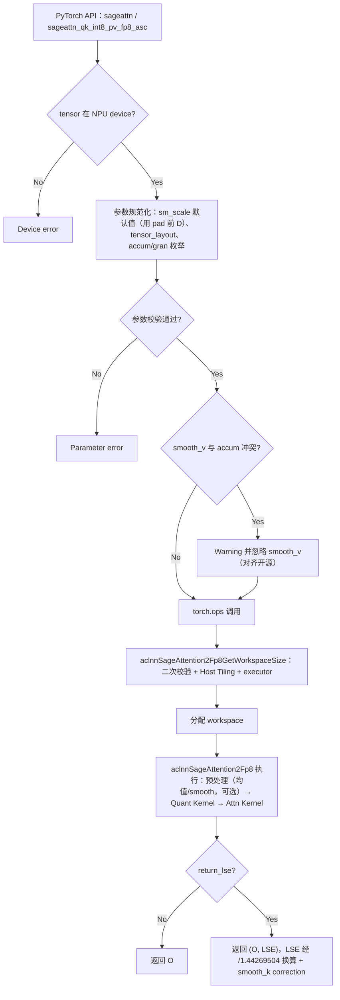

# SageAttention2 算子设计文档（INT8 QK^T + FP8 PV）

> **交付仓**：https://gitcode.com/cann/ops-transformer → `experimental/attention/sageattention2`
> **目标硬件**：Atlas 950PR · CANN 9.2.0-beta.1 · AscendC + CATLASS + Python
> **对标开源**：SageAttention（**`main` 分支** / PyPI `sageattention==2.2.0`，SageAttention2）`sageattention_qk_int8_pv_fp8_cuda`；论文 arXiv:2411.10958（ICML 2025）
> **文档版本**：v1.11（v1.10 + 澄清 TC-01~10 / P-01~07 与官方测试工程 `sageAttentionTest`（500 条泛化用例 + test_perf.py）的「验收判据 ↔ 执行载体」关系并补映射说明）

---

## 需求背景（required）

### 需求来源

本任务来自 CANN 社区任务（2026 批次）「SageAttention2 量化注意力算子开发」，依据工作任务书要求实现并合入 https://gitcode.com/cann/ops-transformer 仓的 `experimental/attention/sageattention2` 目录。设计文档须按官方模板（https://gitcode.com/cann/cann-competitions/blob/master/04_tasks/01_community-task-2026/resources/design_template.md ）组织，以 PR 形式提交至 `cann-competitions/04_tasks/01_community-task-2026/tasklist` 评审（详见 https://gitcode.com/cann/cann-competitions/blob/master/04_tasks/01_community-task-2026/README.md ）。

- **性能对照基线（FIA）**：同仓 `attention/fused_infer_attention_score/`，950PR 用 `aclnnFusedInferAttentionScoreV5`；PyTorch 用 `torch_npu.npu_fused_infer_attention_score`（或验收环境指定的 `_v2`）。
- **CANN 版本**：CANN 9.2.0-beta.1（性能对标与验收环境）。
- **本任务范围**：仅 INT8 QK^T + FP8 PV（SageAttention2）前向；不含 FP16 PV、varlen、triton、`*_sm90` / `*_cuda` 同名符号、反向传播。

### 背景介绍

SageAttention2 通过对 Q/K 做 INT8 细粒度量化（per_warp / per_thread）、对 V 做 FP8 量化，将注意力中两次 GEMM（S=QK^T、O=PV）分别映射到 INT8 / FP8 高算力单元，并配合 thorough outlier smoothing（smooth_k / smooth_v）与两级累加保证精度，在 GPU 上相对 FP16 FlashAttention 取得约 2× 加速且精度几乎无损。

Atlas 950PR 原生提供 INT8 / FP8 Cube 运算能力（单芯片 FP8 约 1 PFLOPS 量级），具备复现并超越该收益比的硬件基础。本设计将开源 FP8 PV 路径在昇腾 NPU 上基于 **AscendC + CATLASS** 实现接口对标、功能对齐的量化注意力算子，并以 ops-transformer 仓 FIA 为性能 gold（aclnn 与 PyTorch 两条接口路径均须 ≥ 1.6×）。

> ⚠️ **硬件能力核实（已确认，依据 Ascend C 官方 `Mmad` API 文档表5/表6 与 CATLASS 950PR FP8 示例）**：950PR 的 Cube `Mmad` 在 FP8×FP8 时**累加器/输出仅支持 `float`（FP32）**，**无 FP8×FP8→half（FP16）组合**——即不存在 FP16 累加器。950PR **同时原生支持**两类 FP8：`fp8_e4m3fn_t`（裸 e4m3，直接 `Mmad` → FP32 L0C）与 MXFP8（`float8_e4m3_t`+`float8_e8m0_t` block-wise scale，经 `asc_mmad_mx`/`MxMatmul` 可输出 BF16）。本设计 **V 量化默认采用原生 e4m3**：`Mmad e4m3×e4m3→fp32`（L0C 为 FP32），再经 **Fixpipe 随路量化到 FP16** 写入运行 O buffer——即 `fp32+fp16` 模式的"FP16"指 Fixpipe 搬出后的 FP16 存储/运行位宽，**非 Cube 累加器位宽**。因此任务书默认 `fp32+fp16` 验收配置在 950PR 上**可行，无需改默认路径**；MXFP8 仅作为可选替代路径（见 §量化模块设计）。

---

## 需求分析（required）

### 需求描述

本任务实现路径（对标开源 `sageattention/core.py` 中 FP8 PV 路径）：

| 特性                             | 说明                                                                                                                                                                                                                                                                                                    |
| ------------------------------ | ----------------------------------------------------------------------------------------------------------------------------------------------------------------------------------------------------------------------------------------------------------------------------------------------------- |
| **QK 量化**                      | INT8；`qk_quant_gran`: `per_warp` / `per_thread`（默认 `per_thread`）。二者为开源**算法粒度**（非 AscendC 内置枚举）：AscendC 高阶量化多为 PER_TENSOR/CHANNEL/TOKEN/GROUP，**无**同名 `per_warp`/`per_thread` 开关；须用 AscendC Vector（或 Host+Kernel）按开源 scale 分块语义自研 Quant，将粒度映射到 NPU Tile/Block（允许按 Cube/CATLASS 微调分块，**精度与 GPU 同配置对齐**） |
| **PV 量化**                      | V 量化为 **FP8**：默认 **原生 e4m3（`fp8_e4m3fn_t`，max=448）**，经 `Mmad e4m3×e4m3→fp32`（L0C 为 FP32）后由 **Fixpipe 随路量化到 FP16/BF16**；可选 **MXFP8** 替代路径（`float8_e4m3_t`+`float8_e8m0_t`，`MxMatmul`→BF16），配合 scale                                                                                                    |
| **Thorough outlier smoothing** | `smooth_k`（默认 True）；可选 `smooth_v`                                                                                                                                                                                                                                                                     |
| **两级累加**                       | `pv_accum_dtype`: `"fp32"` / `"fp32+fp32"` / `"fp32+fp16"`（默认 `"fp32+fp16"`，任务书指定验收配置）                                                                                                                                                                                                                |
| **head_dim pad**               | &lt;64 pad→64；64&lt;D&lt;128 pad→128；D&gt;128 报错                                                                                                                                                                                                                                                      |
| **return_lse**                 | 可选返回 exponentiated attention weights 的 log sum / logsumexp（Ring Attention 等；语义对齐开源 `core.py`）                                                                                                                                                                                                         |
| **自动后端选择**                     | `sageattn(...)` 在 NPU 上固定分发到 FP8 PV 实现                                                                                                                                                                                                                                                                |

数学形式：

```text
O = softmax(QK^T · s) V
```

其中 Q、K 经 smoothing 后 INT8 量化，V 量化为 FP8。

典型应用场景：视频/图像生成（CogVideoX、HunyuanVideo、Flux 等）、LLM/DiT 推理；可 `F.scaled_dot_product_attention = sageattn` 做 plug-and-play。**本任务明确不交付**：`sageattn_qk_int8_pv_fp16_*`、`sageattn_varlen`、以及任何 FP16 PV 实现。

接口分层：

```text
┌──────────────────────────────────────────────┐
│ PyTorch（必选）sageattn / *_pv_fp8_asc       │
├──────────────────────────────────────────────┤
│ aclnn（必选）统一 FP8 PV 入口                │
├──────────────────────────────────────────────┤
│ AscendC + CATLASS Kernel：                   │
│   Quant（INT8，AscendC）+ Attn（FP8 PV，CATLASS/AscendC）│
└──────────────────────────────────────────────┘
```

### 接口调用流程

PyTorch 适配层只负责参数规范化、调用 aclnn 与返回值封装，**不在 Python 侧执行量化或 layout 转换**；所有 smoothing / quant / pad / LSE correction 均位于 aclnn Host 与 Device Kernel 中。aclnn 层采用两段式调用：先由 `aclnnSageAttention2Fp8GetWorkspaceSize` 校验参数、生成 Host Tiling 并返回 workspace 大小与 executor，再由 `aclnnSageAttention2Fp8` 在指定 stream 上执行。这样 PyTorch 与 aclnn 性能路径共享同一套 Kernel，避免双实现漂移；PyTorch 性能测试测到的即同一套 aclnn 核心路径。

#### PyTorch 接入流程图



> 图中 `参数校验` 覆盖 dtype（FP16/BF16）、布局（HND/NHD）、shape/stride、GQA（Hq % Hkv == 0）、head_dim（D∈(0,128]）、causal（Sq==Sk）、非法 `attn_mask` 与非法枚举值报错。`sm_scale` 默认值使用 **pad 前** 原始 D 计算 `1/sqrt(D)`。`smooth_v=True` 且 `pv_accum_dtype != "fp32"` 时按开源行为 warning 并忽略。


### 需求拆解

**功能需求**

| 编号    | 需求                                                                                                   | 优先级 |
| ----- | ---------------------------------------------------------------------------------------------------- | --- |
| FR-1  | PyTorch API：`sageattn`、`sageattn_qk_int8_pv_fp8_asc`，参数/默认值/返回值逐项对标开源 `sageattn_qk_int8_pv_fp8_cuda` | 必选  |
| FR-2  | aclnn 两段式入口（语义与 PyTorch 路径一致），供性能对比与产品化                                                              | 必选  |
| FR-3  | `qk_quant_gran` ∈ {per_warp, per_thread}，默认 per_thread；自研分块量化（AscendC 无同名内置模式）                       | 必选  |
| FR-4  | `pv_accum_dtype` ∈ {fp32, fp32+fp32, fp32+fp16}，默认 fp32+fp16（任务书指定默认验收配置）                            | 必选  |
| FR-5  | smooth_k（默认 True，含 GQA LSE correction）/ smooth_v（仅 fp32 生效，否则 warning + 忽略）                          | 必选  |
| FR-6  | `return_lse`：返回 [B,Hq,Sq] 自然对数 LSE，含 /1.44269504 换算与 correction                                      | 必选  |
| FR-7  | head_dim：D∈(0,128]，<64 pad→64，(64,128) pad→128，D>128 报错；输出裁回 D_og                                    | 必选  |
| FR-8  | GQA（Hq % Hkv == 0）、Sq≠Sk（非因果）、causal（仅 Sq==Sk）、HND/NHD                                               | 必选  |
| FR-9  | 非法输入报错：非 fp16/bf16、末维非连续、非法 gran/accum、非空 attn_mask、causal 且 Sq≠Sk                                   | 必选  |
| FR-10 | 长序列 S ≥ 8K/16K（online softmax，不物化全量注意力矩阵）                                                            | 必选  |

**性能需求**（同机同 shape 同 dtype、CANN 9.2.0-beta.1，相对 FIA）：

- **PyTorch 路径**：`sageattn_qk_int8_pv_fp8_asc`（默认 fp32+fp16）vs `torch_npu.npu_fused_infer_attention_score`，**Speedup ≥ 1.6×**；
- **aclnn 路径**：本算子 aclnn 入口 vs `aclnnFusedInferAttentionScoreV5`，**Speedup ≥ 1.6×**；
- P-01~P-07 每条 × 每路径均须达标，同时分别报告两路径全用例几何平均 Speedup（均须 ≥ 1.6×）。

**精度需求**

| 层级         | 标杆           | 判据                                                                                                 |
| ---------- | ------------ | -------------------------------------------------------------------------------------------------- |
| **L-A（主）** | GPU 同路径同配置输出 | FP16：`rtol=atol=2⁻⁹`，`matched_ratio ≥ 0.99`，`max_abs_err ≤ 1e-1` 或 32×ULP；BF16：`rtol=atol=2⁻⁶`，`matched_ratio ≥ 0.99`，`max_abs_err ≤ 1e-0` 或 32×ULP |
| **L-B（辅）** | FP32 SDPA    | NPU 与 GPU-Sage 相对真值误差比例：`max ≤ 2`，`mean ≤ 1.2`，`RMSE ≤ 1.2`                                        |
| **LSE**    | GPU 同路径 LSE  | FP32 容差或混合容差                                                                                       |

> **golden 不可混用**：per_thread/per_warp、三种 accum 分别对标；性能 golden 为 ops-transformer FIA，二者勿混淆。

**规格约束汇总**

| 项            | 约束                                                                 |
| ------------ | ------------------------------------------------------------------ |
| **dtype**    | q/k/v 同为 FP16 或 BF16、同 device、末维 stride=1                          |
| **head_dim** | D_og ∈ (0,128]，内部 pad 到 64/128                                     |
| **GQA**      | Hq % Hkv == 0                                                      |
| **causal**   | 仅 Sq == Sk                                                         |
| **输出**       | 与 q 同 dtype、同布局，裁剪回 D_og；`return_lse=True` 时附加 LSE [B,Hq,Sq]（FP32） |

---

## 详细设计（required）

### 算子分析

#### 数学公式

```text
S = Q K^T · sm_scale            # Q,K: smoothing 后 INT8 量化
P = softmax(S)                  # online softmax（kernel 内以 2 为底）
O = P V                          # V: FP8 量化
LSE = log( Σ_j exp(S_ij) )      # 自然对数，shape [B,Hq,Sq]
```

#### 支持数据类型

| 项            | 说明                                                                                                                                                                       |
| ------------ | ------------------------------------------------------------------------------------------------------------------------------------------------------------------------ |
| **输入 dtype** | FP16 / BF16；与开源 FP8 路径一致（q/k/v 同 dtype、同 device）                                                                                                                         |
| **量化中间态**    | Q/K → INT8；V → FP8（默认 **原生 e4m3 `fp8_e4m3fn_t`，max=448**；可选 MXFP8）；`Mmad e4m3×e4m3→fp32`（L0C 为 FP32），Fixpipe 随路量化到 FP16/BF16；S 反量化 → FP32；两级累加 buffer 依 `pv_accum_dtype` |
| **输出 dtype** | 与 q 同 dtype（FP16/BF16），裁剪 pad 维还原 `head_dim_og`；LSE 为 FP32                                                                                                               |

#### 支持形状

| 项        | 约束                                                                |
| -------- | ----------------------------------------------------------------- |
| head_dim | 原始 D∈(0,128]；内部 pad 到 64 或 128；**D&gt;128 报错**；输出裁回 `head_dim_og` |
| 末维连续     | `stride(-1)==1`                                                   |
| GQA      | `Hq % Hkv == 0`                                                   |
| 不同 Sq/Sk | 非因果支持（Sq≠Sk）                                                      |
| 布局       | HND `[B,H,S,D]` / NHD `[B,S,H,D]`（HND ≈ FIA 的 BNSD）               |

> **pad 边界说明**：D=128 本身即对齐目标，`D_pad=128` 时 pad 为 **no-op**（`D_pad == D_og`，无数据移动），因此 `(64,128)` 与 `(64,128]` 两种表述行为完全等价；pad 语义为 **zero-pad 补齐到 Cube K 维对齐粒度（64/128）**，D=128 时天然满足。片上缓存（L0A/L0B/L1）利用率由 tile 分块（`br×bc`）与多级流水深度决定，与 pad 边界符号无关。

#### 开源实现关键路径（对齐基准）

对 `sageattn_qk_int8_pv_fp8_cuda` 的执行链路拆解如下，作为 NPU 对齐基准：

**预处理（开源参考：PyTorch 层）**

> 本节描述的是**开源 GPU 参考实现**的执行层（均值/smooth 在 PyTorch 层 `torch.mean` 完成）。**NPU 实现不照搬**：均值归约融合于 Quant Kernel 的 reduction stage（device 内完成，K/V 仅读一次），见 §host侧设计 第 4/5 步。

1. 校验 dtype / 布局 / GQA / head_dim；D<64 pad→64、64<D<128 pad→128（zero pad）；
2. `sm_scale = sm_scale or 1/sqrt(head_dim_og)`（注意用 **pad 前**维度）；
3. `smooth_k=True`：`km = k.mean(dim=S, keepdim=True)`，`k ← k − km`（km shape [B,Hkv,1,D]）；
4. `smooth_v=True` 且 `pv_accum_dtype=="fp32"`：`vm = v.mean(dim=S)`，`v ← v − vm`；否则 **warning 并忽略**。

**量化（独立 kernel）**

- **Q/K INT8**：按 `qk_quant_gran` 沿序列维分块，块内（若干行 × 全 D）求 absmax，`scale = absmax/127`，`x_int8 = round(x/scale)`：
  - `per_warp`：块 = 32 行，scale shape `[B,H,⌈S/32⌉]`；
  - `per_thread`：块 = 4 行，scale shape `[B,H,⌈S/4⌉]`。
- **V FP8**（e4m3，max=448）：per-channel（对每列 d 沿全序列取 absmax），`v_scale = absmax/scale_max`，`v_fp8 = round(v/v_scale).to(e4m3)`；`scale_max = 2.25`（fp32+fp16）/ 448.0（其余）。
- **P**（kernel 内）：softmax 输出 ∈[0,1]，乘 448 后 cast e4m3，进入 FP8 MMA。

**Attention kernel（sm89）**

- **QK^T**：INT8×INT8→INT32 MMA；反量化 `S = S_int32 · (q_scale ⊗ k_scale) · sm_scale`；
- **online softmax** 以 `exp2` 实现（scale 中预乘 `log2e`）；内部 LSE 为 2 底；
- **PV**：FP8×FP8 MMA，累加器为低有效位（≈FP22），故引入**两级累加**：
  - `fp32`：全程高精度累加；
  - `fp32+fp32`：MMA 部分和定期归约到 FP32 buffer；
  - `fp32+fp16`：每个 KV tile 的部分和 rescale 后**截断到 FP16**运行 buffer（默认验收配置，精度最低、速度最快）；
- **Epilogue**：`O ← O / l · v_scale_broadcast`；smooth_v 时 `O ← O + vm`。

**返回路径（验收须逐项一致）**

```python
if return_lse:
    return o, lse / 1.44269504 + lse_correction * sm_scale if smooth_k else lse / 1.44269504
else:
    return o
```

- `1/1.44269504 = ln2`：kernel 内部 LSE 以 2 为底，对外转自然对数；
- `lse_correction = (q · km^T)`（每 q 行一个标量，shape [B,Hq,Sq]），GQA 时 km 需 `repeat_interleave(Hq//Hkv)` 广播；
- smooth_k 不改变 O（softmax 对行常数不变），只改变 LSE；
- **LSE 固定偏移备注**（据核对结论）：返回值含 **S_FP8_OFFSET** 固定偏移（log2 域 +8.807 → ln 域 +6.11）；若需绝对 LSE，须加回 6.11（ln 域）。Ring Attention 归约时 numerator/denominator 抵消无影响，但直接用 LSE 算 perplexity 会有固定偏差，调用方须知悉。

#### PyTorch SageAttention2 参考实现流程图

AscendC/CATLASS 实现不照搬 PyTorch/CUDA 的物理执行方式，但必须对齐其数值数据流。下图给出 `sageattn_qk_int8_pv_fp8_cuda` 的参考语义；它是 NPU 算子功能拆分、量化 scale 设计、Kernel 流水与精度对比的基线：

```mermaid
flowchart TB
    A["Input Q K V（FP16/BF16）"] --> B["Normalize layout（HND/NHD）"]
    B --> C["Pad head dim（D<64→64；(64,128)→128）"]
    C --> D{"smooth_k?"}
    D -- "Yes" --> D1["Compute km = mean over Sk"]
    D1 --> D2["K = K - km"]
    D -- "No" --> E["Quantize Q to INT8（per_warp/per_thread）"]
    D2 --> E
    E --> F["Quantize K to INT8（同 gran）"]
    F --> G{"smooth_v 且 accum == fp32?"}
    G -- "Yes" --> G1["Compute vm = mean over Sk"]
    G1 --> G2["V = V - vm"]
    G -- "No" --> H["Quantize V to FP8（e4m3，per-channel scale，scale_max=2.25/448）"]
    G2 --> H
    H --> I["Start Key tile loop"]
    I --> J["INT8 QK^T matmul（s8×s8→s32）"]
    J --> K["反量化 S = S_int32·(q_scale⊗k_scale)·sm_scale，causal mask"]
    K --> L["Online Softmax（base-2，维护 running max/sum）"]
    L --> M["Quantize P tile to FP8（P×448）"]
    M --> N["FP8 PV matmul（e4m3×e4m3→fp32 L0C；Fixpipe→FP16/BF16）"]
    N --> O["Rescale 并两级累加 O（按 pv_accum_dtype）"]
    O --> P{"More Key tiles?"}
    P -- "Yes" --> I
    P -- "No" --> Q["Normalize：O ← O / l · v_scale"]
    Q --> R{"smooth_v 生效?"}
    R -- "Yes" --> R1["O += vm"]
    R -- "No" --> S["Crop head_dim、还原布局、cast 输出 dtype"]
    R1 --> S
    S --> T{"return_lse?"}
    T -- "No" --> U["Return O"]
    T -- "Yes" --> T1["LSE 换算：lse / 1.44269504"]
    T1 --> T2{"smooth_k?"}
    T2 -- "Yes" --> T3["LSE += lse_correction · sm_scale（GQA 先 repeat_interleave）"]
    T2 -- "No" --> V["Return (O, LSE)"]
    T3 --> V
```



> 该图描述的是**数值依赖关系**，不是要求 NPU 依次启动同等数量的 Kernel。交付实现应尽可能融合这些步骤（Q 在线量化、softmax 与 rescale 并入主循环、均值归约（Quant Kernel reduction stage）与 Quant Kernel 预处理），并以 §算子实现 的 AscendC/CATLASS 流水为实际执行结构；任何融合、重排或物理 layout 变化均不得改变参考语义。

**参考语义 ↔ AscendC/CATLASS 落点映射**

| PyTorch 参考语义 | AscendC/CATLASS 落点 | 必须对齐的内容 |
| --- | --- | --- |
| layout 规范化、pad、sm_scale 默认值 | Host Tiling、layout-aware 地址计算 | 原始 D、Dpad、stride、输出裁剪回 D_og |
| K/V smoothing、Q/K/V 量化 | **Device 预处理（Quant Kernel 内 reduction stage）**：先沿 S 归约 km/vm，再 smooth + 量化 + repack，K/V 仅读一次（AscendC Vector）。**排除**独立 KMean kernel（K 读两次）与 Python `torch.mean`（多一次 GM 往返） | reduction 轴、分组边界（per_warp=32 行 / per_thread=4 行）、scale、scale_max |
| INT8 QK^T、反量化、mask、Online Softmax、P→FP8 | CATLASS INT8 BlockMmad（AIC）+ AscendC Vector（AIV） | causal 语义、base-2 在线状态、P×448、FP8 格式 |
| FP8 PV、两级累加 | CATLASS 原生 FP8 BlockMmad（AIC）+ AscendC Vector 归约（AIV） | 累加模式周期、FP16/FP32 归并边界 |
| normalize、meanV 补偿 | kernel epilogue（AscendC Vector） | 输出 dtype、GQA head 映射、固定偏移 |
| LSE 换算与 smooth_k correction | device FP32 matmul（`lse = lse_base2·ln2`，`lse += lse_correction·sm_scale`，GQA 先 repeat_interleave；仅 return_lse=True） | /1.44269504 底数换算、correction 语义 |

#### NPU 映射策略

| 开源要素                  | GPU 依据                 | NPU（950PR）映射                                                                                                                  |
| --------------------- | ---------------------- | ----------------------------------------------------------------------------------------------------------------------------- |
| INT8 QK^T             | s8s8s32 MMA            | Cube `Mmad s8×s8→s32`（CATLASS Tile/Block 组件）                                                                                  |
| FP8 PV                | e4m3 MMA，累加器 FP32（L0C） | Cube `Mmad e4m3×e4m3→fp32`（950PR 原生 FP8，累加器固定 FP32，无 FP16 累加器）；Fixpipe 随路量化到 FP16/BF16；可选 MXFP8：`MxMatmul float8_e4m3_t→BF16` |
| per_warp / per_thread | warp/thread 行块         | 自研分块 Quant Kernel：沿 S 按 32/4 行块求 absmax（允许按 Tile 微调，golden 校准）                                                                |
| 两级累加                  | FP22 累加器精度补偿           | L0C 为 FP32 满精度累加：fp32/fp32+fp32 天然满足；fp32+fp16 人为复现：每 KV tile 将 L0C 部分和 rescale→Cast FP16→累加 FP16 O buffer（与 GPU 同周期、同截断点）    |
| exp2 / LSE 换算         | base-2 softmax         | Vector `Exp2`；scale 预乘 `sm_scale·log2e`；返回 `lse·ln2`（+correction）                                                             |
| smooth_k / correction | Device 归约 + matmul | km 归约融合于 Quant Kernel reduction stage（K 一次读入）；lse_correction 用 device FP32 matmul（仅 return_lse=True），开销 O(Sq·D) 可忽略                                                                  |
| FP8 格式                | e4m3（max 448）          | e4m3 对齐（默认）；scale_max 超参对齐（2.25 / 448.0）                                                                                      |

> **关键结论 1（精度）**：NPU 上 fp32/fp32+fp32 路径的累加精度不低于 GPU 同配置，L-A 容差天然可满足；fp32+fp16 按开源同周期截断复现，误差特征与 GPU 一致。
> **关键结论 2（性能）**：QK/PV 两次 GEMM 分别获得 INT8/FP8 相对 FP16 约 2× 的 Cube 峰值，是 ≥1.6× 门禁的根本来源；量化与 softmax 的 Vector 开销通过流水与融合压制。

### 算子实现

#### 实现方案（总体方案设计）

**技术选型**

| 层                  | 选型                                                                           | 说明                                                                                         |
| ------------------ | ---------------------------------------------------------------------------- | ------------------------------------------------------------------------------------------ |
| **Cube 数据通路**      | CATLASS Tile/Block 级组件（TileMmad、BlockMmad、CopyGmToL1/L0、Layout）              | 复用仓内 Ascend950 FA / MXFP8 / 低精度 MatMul / Chunk Prefill 样例的分块与搬运模板                                |
| **Vector / 自定义逻辑** | AscendC                                                                      | per_warp/per_thread 量化、smooth、反量化、online softmax（Exp2）、P→FP8 转换、两级累加归约、LSE、pad/裁剪 epilogue |
| **Kernel 组织**      | 自研 Kernel（CATLASS tile/block 组件内嵌）                                           | FA 类 kernel 的 Cube/Vector 耦合流水超出 CATLASS kernel 级模板适用范围，故 kernel 层自研、MMA 数据通路复用 CATLASS    |
| **Host / 框架**      | AscendC 算子工程（op_host/op_kernel）+ aclnn 封装 + Python（torch_npu 自定义算子 / pybind） | 接入 ops-transformer 仓现行构建体系                                                                 |

**分层架构**

```text
┌─────────────────────────────────────────────────────────────┐
│ PyTorch 适配层（python/sageattention_npu）                   │
│   sageattn()  ──固定分发──▶  sageattn_qk_int8_pv_fp8_asc()   │
│   参数检查 / 默认值处理 / 分发（数值计算均在 device：        │
│   Quant Kernel 归约 + Attn Kernel，PyTorch 层不执行数值逻辑）│
│   （PyTorch 层最终调用 aclnn 入口，保证两路径语义一致）       │
├─────────────────────────────────────────────────────────────┤
│ aclnn 统一入口（aclnn/）                                     │
│   aclnnSageAttention2Fp8GetWorkspaceSize / ...Fp8           │
├─────────────────────────────────────────────────────────────┤
│ Host（op_host）：原型推导 / Tiling 计算 / workspace 规划      │
├─────────────────────────────────────────────────────────────┤
│ Kernel（op_kernel，AscendC + CATLASS）                       │
│   ① Quant Kernel：smooth 后 INT8(Q,K) 分块量化 + FP8(V)     │
│   ② Attn Kernel ：INT8 QK^T(CATLASS) + softmax(AscendC)     │
│                  + FP8 PV(CATLASS) + 两级累加 + LSE          │
└─────────────────────────────────────────────────────────────┘
```

两阶段（Quant Kernel + Attn Kernel）与开源结构一致（开源量化亦为独立 kernel）。量化计算量 `O(B·H·S·D)` 相对注意力 `O(B·H·S²·D)` 占比 <1%（S≥4K），但独立 kernel 存在 launch 与 GM 读写开销；性能期若 profiling 显示瓶颈，将演化为 Q 量化与 Attn Kernel 装载融合（不影响接口）。

**模块划分与 AscendC / CATLASS 边界**

| 模块                          | 职责                                                                        | 实现                                            |
| --------------------------- | ------------------------------------------------------------------------- | --------------------------------------------- |
| `quant/int8_quant`          | Q/K 分块 absmax + scale + INT8 输出                                           | AscendC Vector（ReduceMax/Muls/casts）          |
| `quant/fp8_quant`           | V per-channel absmax + scale + e4m3 输出                                    | AscendC Vector                                |
| `sageattn_fp8/` QK 阶段       | K tile GM→L1→L0 装载、`s8×s8→s32` Mmad                                       | CATLASS（CopyGmToL1、TileMmad/BlockMmad、Layout） |
| `sageattn_fp8/` softmax 阶段  | S 反量化、causal/pad mask、online max/sum、Exp2、P→FP16→FP8(×448)                | AscendC Vector                                |
| `sageattn_fp8/` PV 阶段       | P/V tile 装载、`e4m3×e4m3→fp32` Mmad（L0C 为 FP32）；Fixpipe 随路量化 FP32→FP16/BF16 | CATLASS                                       |
| `sageattn_fp8/` 累加/epilogue | L0C→UB 搬运（fixpipe）、两级累加、`/l`、`·v_scale`、D 裁剪、LSE 写出                       | AscendC（fixpipe + Vector）                     |
| Host                        | 原型/Tiling/workspace、aclnn 两段式                                             | op_host + aclnn                               |

#### host侧设计

**预处理流程（PyTorch 层 / aclnn 内部一致）**

1. 参数检查（§算子约束限制；逐项见 §host侧设计「参数检查与报错」）；
2. `D_pad = 64 if D_og <= 64 else 128`；`D_pad != D_og` 时 zero-pad q/k/v（aclnn 内写入 workspace）；
3. `sm_scale = sm_scale or 1/sqrt(D_og)`（使用 pad 前原始维度）；
4. `smooth_k=True`：`km[b,h,1,:] = mean_S(k)`；`k ← k − km`。**km 归约在 Quant Kernel 的 reduction stage 内完成（device，K 仅读一次），不在 Python 层执行**（Python `torch.mean` 会使 K 多一次全量 GM 往返，长序列下代价显著）；
5. `smooth_v`：
   - 若 `pv_accum_dtype == "fp32"`：`vm = mean_S(v)`，`v ← v − vm`（同样在 Quant Kernel reduction stage 内完成）；
   - 否则：**发出 `warnings.warn`（文案对齐开源）并忽略 `smooth_v`**；
6. 启动 **Quant Kernel** → 输出 `q_int8, q_scale, k_int8, k_scale, v_fp8, v_scale`；
7. 启动 **Attn Kernel** → 输出 `o_pad (, lse_base2)`；
8. Epilogue（Host 编排 + 轻量换算；`lse_correction` 用 device FP32 matmul）：
   - `o = o_pad[..., :D_og]`（stride 裁剪，零拷贝）；
   - `return_lse`：
     - `lse = lse_base2 * ln2`（`ln2 = 1/1.44269504`）；
     - 若 `smooth_k=True`：计算 `lse_correction = (q · km^T)`（**device FP32 matmul**；GQA 时 km 先 `repeat_interleave(Hq//Hkv)` 广播），`lse += lse_correction * sm_scale`。仅 `return_lse=True` 时执行（q 全量只在此路径读一次，开销 O(Sq·D) 可接受）。

**Tiling 计算**

- `grid = B × Hq × ⌈Sq/br⌉`；`br = 128`, `bc = 128`（D_pad=128 默认；D_pad=64 时可 `bc = 256`，tiling 表驱动）；
- causal：每 Q block 的 KV 循环上界 `⌈(q_blk_end + 1) / bc⌉`，对角块打 mask；
- `quant_group_rows = per_warp ? 32 : 4`，要求 `br % quant_group_rows == 0`（128 均满足）；
- **workspace 字节数计算公式**：

```text
ws = align(B * Hq * Sq_pad * D_pad * sizeof(int8),  128)    // q_int8
   + align(B * Hkv * Sk_pad * D_pad * sizeof(int8),  128)   // k_int8
   + align(B * Hkv * Sk_pad * D_pad * sizeof(int8),  128)   // v_fp8 (e4m3, 与 K 同长 Sk)
   + align(B * Hq * ceil(Sq_pad/g_q) * sizeof(float16), 128)    // q_scale
   + align(B * Hkv * ceil(Sk_pad/g_k) * sizeof(float16), 128)   // k_scale
   + align(B * Hkv * D_pad * sizeof(float16), 128)              // v_scale
   + align(B * Hkv * D_pad * sizeof(fp32), 128)                 // km (smooth_k)
   + align(B * Hq * Sq_pad * sizeof(fp32), 128)                 // lse (可选)
   + 额外对齐填充
```

其中 `g_q = g_k = quant_group_rows`。Host 计算后随 `GetWorkspaceSize` 返回。

**参数检查与报错（对齐开源断言 + 任务书 TC-08）**

| 检查项                                     | 行为                                              |
| --------------------------------------- | ----------------------------------------------- |
| dtype ∉ {fp16, bf16} 或三者不一致 / 不同 device | ValueError / aclnn 返回 `ACLNN_ERR_PARAM_INVALID` |
| D_og > 128 或 D_og ≤ 0                   | 报错                                              |
| stride(-1) != 1                         | 报错                                              |
| Hq % Hkv != 0                           | 报错                                              |
| is_causal and Sq != Sk                  | 报错                                              |
| qk_quant_gran / pv_accum_dtype 非法取值     | 报错                                              |
| attn_mask is not None                   | 报错（不支持）                                         |
| tensor_layout ∉ {HND, NHD}              | 报错                                              |
| smooth_v=True 且 accum ≠ fp32            | `warnings.warn` 并忽略（对齐开源）                       |

#### kernel侧设计

**并行与 Block 划分**

- **核间**：`grid = (B·Hq, ⌈Sq/br⌉)` 展平为 blockIdx；每核负责一个 Q tile 的全部 KV 扫描；GQA 通过 `kv_head = q_head / (Hq/Hkv)` 索引 K/V/scale；
- **核内**：Q tile [br, D_pad] 常驻；KV 按 bc 分块流水扫描（online softmax）；
- **不物化全量 S**：任意时刻仅驻留 [br, bc] 分块（满足长序列约束）。

**主流程伪码（每核）**

```text
Init:  m[br] = -inf;  l[br] = 0;
       // causal 全掩块（整 tile 被 mask）直接 continue：m/l/O_acc 保持不变，避免 -inf 传播
       // O_acc 类型依 accum_mode：
       //   fp32       → fp32 buffer [br, D_pad]
       //   fp32+fp32  → fp32 buffer [br, D_pad]
       //   fp32+fp16  → fp16 buffer [br, D_pad]
       O_acc[br, D_pad] = 0

Load:  Q_int8[br,D] → L1 → L0A；q_scale[br/group_rows] → UB（CATLASS Copy + AscendC）

for kv in 0 .. KV_TILES-1:                      # causal 时上界截断
  ── Stage A (CATLASS Cube) ──────────────────────────────
  K_int8 tile [bc,D] → L1(双缓冲) → L0B
  S_i32 = Mmad(Q_int8, K_int8ᵀ)               # s8×s8→s32, L0C [br,bc]

  ── Stage B (AscendC Vector) ────────────────────────────
  fixpipe: S_i32 L0C→UB → Cast fp32
  S = S · (q_scale ⊗ k_scale[kv]) · (sm_scale·log2e)      # base-2 logits
  if 对角块(causal): 上三角 mask → -inf                    # 含 Sq/Sk pad 行 mask
  m_new = max(m, rowmax(S));  α = exp2(m − m_new)
  P   = exp2(S − m_new)          # [br,bc], ∈[0,1]
  l   = l·α + rowsum(P)
  P8 = Cast_e4m3(P · 448.0)      # 直接融合为一次 Vector 链，送 L0A

  ── Stage C (CATLASS Cube) ──────────────────────────────
  V_fp8 tile [bc,D] → L1(双缓冲) → L0B
  O_part = Mmad(P8, V_fp8)      # e4m3×e4m3→fp32, L0C [br,D]

  ── Stage D (AscendC, 两级累加) ──────────────────────────
  fixpipe: O_part L0C→UB；O_part ← O_part · (α / 448.0)   # rescale+反量化融合
  if accum_mode == "fp32" or "fp32+fp32":
      O_acc(fp32) += O_part
  elif accum_mode == "fp32+fp16":
      O_acc(fp16) += Cast_fp16(O_part)          # 每 KV tile 截断到 FP16

Epilogue:
  O = O_acc · (1/l)              # fp16 路径先 Cast fp32 再除，防精度损失
  O ← O · v_scale[b,h,0,:]       # per-channel 广播（pad 通道 scale 置 1）
  if smooth_v and accum=="fp32": O += vm
  Cast → q.dtype；按 D_og 裁剪写出（stride 写出，零拷贝）
  if return_lse: lse_base2 = m + log2(l)  →  写出 [B,Hq,Sq]（FP32）
```

> **fp32+fp16 的 `scale_max=2.25` 与 `×448` rescale 融合精度（已确认可行）**：Cube `Mmad e4m3×e4m3→fp32`（L0C 固定 FP32）后，经 Fixpipe 保持 FP32 中间态并随路 Cast_fp16 写入运行 O buffer；**累加器位宽始终为 FP32（950PR 无 FP16 累加器）**，仅运行/存储 buffer 为 FP16，避免提前截断；L-A 同配置验证。`×448` 与 `scale_max` 语义基于原生 e4m3（max=448）保持不变；仅当改走 MXFP8 路径时，`×448`/scale_max 才需改写为 E8M0 block-wise scale（见 §量化模块设计）。

**各阶段要点**

| 阶段                   | 设计要点                                                                                                                                                                   |
| -------------------- | ---------------------------------------------------------------------------------------------------------------------------------------------------------------------- |
| **QK（CATLASS）**      | INT8 TileMmad；Layout：Q RowMajor、K 按 Kᵀ 需要 ColumnMajor 装载（CATLASS Layout tag 处理，GM 读 K 行、L1 内转置或直接 N/Z 格式匹配 Mmad）；L0A/L0B 双缓冲                                           |
| **softmax（AscendC）** | S 按 br 方向分行流水处理（UB 容量约束下分 sub-tile）；rowmax/rowsum 用 ReduceMax/ReduceSum；exp2 全速 Vector；scale 融合为一次 Muls 链，避免多次往返                                                       |
| **P→FP8**            | `P·448` 与 Cast e4m3 融合为单条 Vector 指令链；P8 经 fixpipe/Copy 回 L0A（或 L1→L0A）供 PV 阶段                                                                                          |
| **PV（CATLASS）**      | e4m3 TileMmad（950PR 原生 FP8，`Mmad` 累加器固定 FP32，无 FP16 累加器）；V 以 [bc, D] RowMajor 装载，满足 `P8[br,bc] × V[bc,D]`；Fixpipe 随路量化 FP32→FP16/BF16（fp32+fp16 模式靠此得到 FP16 运行 buffer） |
| **两级累加（AscendC）**    | `α/448` 与 fixpipe 后乘加融合；`fp32+fp16`：每 KV tile 截断（与 GPU 同周期）；FP16 累加数值安全性由 `P∈[0,1]`、行和=1、`v_scale_max=2.25` 保证（对齐开源论证）                                                 |
| **LSE**              | `log2(l)` 用 Vector Log2；写出 FP32；correction 用 device FP32 matmul（仅 return_lse=True，见 §host侧设计）                                                                                             |
| **causal**           | 块级三态：全保留块（跳过 mask）、对角块（生成上三角 −inf mask）、全掩块（整 tile 跳过）                                                                                                                 |
| **pad 处理**           | D pad 列：Q/K 零列对 S 贡献 0；V pad 列输出被裁剪；S pad 行（Sq/Sk 非 tile 整数倍）在 mask 阶段置 −inf 并在 l 归一时排除                                                                                |

**内存规划预算（br=bc=128, D_pad=128；以 950PR 实际容量为准）**

| 存储内容    | 估算                                                                                                              |
| ------- | --------------------------------------------------------------------------------------------------------------- |
| **L0A** | Q_int8 16KB ／ P8 16KB（阶段复用） ≤ 32KB                                                                              |
| **L0B** | K_int8 16KB（ping-pong 2×）／ V_fp8 16KB（2×） ≤ 64KB                                                                |
| **L0C** | S_i32/f32 64KB ＋ O_part 64KB（串行复用或分区） ≤ 128KB                                                                   |
| **L1**  | K/V GM 双缓冲 2×(16+16)KB ＋ Q 16KB ＋ P8 中转 ≤ 96KB                                                                  |
| **UB**  | S sub-tile 处理区(fp32) 32~64KB ＋ P16/P8 32KB ＋ O_acc(fp16 32KB / fp32 64KB) ＋ scale/m/l/mask 若干 ≤ 容量上限，tiling 表裁剪 |

> **容量 fallback**：若 UB 或 L0C 超出 950PR 物理上限，则下调 `br` 至 64 或 `bc` 至 64，并同步更新 Tiling 表。性能期以实测搜索最优 (br, bc) 组合。

**流水线与同步**

- **GM→L1 双缓冲**：K/V tile 预取下一块（MTE2），与当前块 MMA 重叠；
- **Cube/Vector 异构流水**：tile i 的 softmax（Vector）与 tile i+1 的 QK Mmad（Cube）通过 event（MTE/M/V 同步原语）形成深度≥2 软件流水；PV Mmad 与下一 tile 的 K 装载重叠；
- **L0C→UB fixpipe** 与下一 MMA 通过 ping-pong L0C 分区解耦；
- **同步原语**：AscendC `PipeBarrier` / `SetFlag-WaitFlag`（MTE2→M→V→M→V→MTE3 链路）。

**Tiling 参数表（初值，性能期可搜索）**

| 场景           | br  | bc  | 备注                |
| ------------ | --- | --- | ----------------- |
| D_pad=128，通用 | 128 | 128 | 默认                |
| D_pad=64     | 128 | 256 | L0/UB 余量转 KV 深度   |
| causal       | 128 | 128 | 下三角块调度（约 50% 计算量） |
| 超长 S(≥16K)   | 128 | 128 | 流水深度优先，L1 双缓冲保持   |

#### 量化模块设计

**Q/K INT8（per_warp / per_thread）**

```text
输入 x [B,H,S,D_pad]（已 smooth/pad）
group_rows = 32 (per_warp) | 4 (per_thread)
x_view   = x.view(B,H,⌈S/g⌉, g·D_pad)
absmax   = ReduceMax(|x_view|, axis=-1)           # [B,H,⌈S/g⌉]
scale    = max(absmax, 1e-8) / 127.0              # 防零
x_int8   = Cast_int8(round(x / scale_broadcast))  # AscendC Vector
```

- 尾部不足 g 行的块按实际行数统计（与开源一致）；`⌈S/g⌉` 上界对齐；
- **粒度微调与校准**：NPU 默认严格按 `g=32/4`；如 Cube Tile 组织需要（如 g=8/16），在保持「每行归属唯一块、块内全通道共享 scale」语义不变的前提下调整，**并强制以 GPU 同配置 golden 校验** `matched_ratio ≥ 0.99` 后固化，记录于 README；
- **输出布局**：x_int8 按 Attn kernel 的 L1/L0 友好格式写出（ND→Nz 可选，在 Quant Kernel 内完成，省一次搬运）。

**V FP8（per-channel）**

```text
scale_max = 2.25  if pv_accum_dtype == "fp32+fp16" else 448.0   # 对齐开源
absmax_d  = ReduceMax(|v[:,:,:,:]|, axis=S)                     # [B,H,1,D_pad]
v_scale   = max(absmax_d, eps) / scale_max                      # pad 通道强制置 1 防除零
v_fp8     = Cast_e4m3(v / v_scale)
```

- FP8 格式：默认 **原生 e4m3（`fp8_e4m3fn_t`，max=448）**；可选 MXFP8 替代路径（见本节「MXFP8 替代路径」）；
- P 侧固定 ×448（§kernel侧设计），最终 `O = (P8·V8) · (v_scale/448)`，`/448` 融合进 rescale，v_scale 在 epilogue 乘。

**MXFP8 替代路径（可选，非默认）**

若需更贴近"低精度累加"意图，950PR 经 `asc_mmad_mx` / `MxMatmul` 支持 MXFP8，可直接输出 BF16：

- A/B 为 `float8_e4m3_t`，scale 为 `float8_e8m0_t`（E8M0 block-wise scale，每 32/64 元素共享一个 scale）；
- 矩阵乘公式：`C = (ScaleA ⊗ A) * (ScaleB ⊗ B) + C`，输出可配置为 BF16；
- V 量化须改为 `float8_e4m3_t` + `float8_e8m0_t` 的 block-wise scale 表达；此时 `P×448` 与 `scale_max` 的 e4m3 标量 rescale 语义**须改写**为 E8M0 block-wise scale；
- 启用前须独立重过 L-A/L-B，并在 README 与自验证报告记录路径切换。**默认验收仍走原生 e4m3（`fp8_e4m3fn_t`）。**

**smooth_k / smooth_v**

- **smooth_k**：序列维均值（FP32 累加求 mean 保精度）后相减；LSE correction 见 §host侧设计；O 路径无额外补偿（softmax 行常数不变性）；
- **smooth_v**：仅 `pv_accum_dtype=="fp32"` 模式启用，`O += vm`（因 `ΣP=1`）；其余模式 **warning 并忽略**（与开源逐字一致）。

#### 接口设计

**PyTorch 接口（`python/sageattention_npu/core_npu.py`）**

```python
from typing import Any, Optional, Union, Tuple
import torch

def sageattn(
    q: torch.Tensor,
    k: torch.Tensor,
    v: torch.Tensor,
    tensor_layout: str = "HND",
    is_causal: bool = False,
    sm_scale: Optional[float] = None,
    return_lse: bool = False,
    **kwargs: Any,
) -> Union[torch.Tensor, Tuple[torch.Tensor, torch.Tensor]]:
    """NPU 上固定分发到 FP8 PV 实现（sageattn_qk_int8_pv_fp8_asc）。
    kwargs 支持透传: qk_quant_gran / pv_accum_dtype / smooth_k / smooth_v，
    环境变量 SAGEATTN_NPU_PV_ACCUM_DTYPE 亦可覆盖。
    attn_mask 非 None 时显式报错（本算子不支持 attn_mask）。
    默认 pv_accum_dtype="fp32+fp16"（吞吐优先）。
    """

def sageattn_qk_int8_pv_fp8_asc(
    q: torch.Tensor,
    k: torch.Tensor,
    v: torch.Tensor,
    tensor_layout: str = "HND",
    is_causal: bool = False,
    qk_quant_gran: str = "per_thread",
    sm_scale: Optional[float] = None,
    pv_accum_dtype: str = "fp32+fp16",
    smooth_k: bool = True,
    smooth_v: bool = False,
    return_lse: bool = False,
    **kwargs: Any,
) -> Union[torch.Tensor, Tuple[torch.Tensor, torch.Tensor]]:
    """INT8 QK^T + FP8 PV（Ascend）。参数名/默认值/返回值逐项对标开源
    sageattn_qk_int8_pv_fp8_cuda（仅 *_cuda → *_asc）。
    返回 o 或 (o, lse)；lse 为自然对数，含 /1.44269504 与 smooth_k correction。
    """
```

> **分发规则**（对齐任务书）：NPU 上 `sageattn` 无条件固定分发至 `sageattn_qk_int8_pv_fp8_asc`，默认 `pv_accum_dtype="fp32+fp16"`；kwargs / 环境变量可覆盖为 fp32 / fp32+fp32。README 须文档化。

**aclnn 接口（`aclnn/`，两段式）**

```c
aclnnStatus aclnnSageAttention2Fp8GetWorkspaceSize(
    const aclTensor *query,              // FP16/BF16, HND/NHD, 末维连续
    const aclTensor *key,
    const aclTensor *value,
    const char      *tensorLayout,       // "HND" | "NHD"
    bool             isCausal,           // 仅 Sq==Sk
    const char      *qkQuantGran,        // "per_thread" | "per_warp"
    double           smScale,            // <=0 表示默认 1/sqrt(D_og)
    const char      *pvAccumDtype,       // "fp32" | "fp32+fp32" | "fp32+fp16"
    bool             smoothK,
    bool             smoothV,            // 非 "fp32" 时内部 warning + 忽略
    bool             returnLse,
    const aclTensor *attentionOut,       // 与 q 同 dtype/布局, D=D_og
    const aclTensor *softmaxLseOptional, // FP32 [B,Hq,Sq], returnLse 时必填
    uint64_t        *workspaceSize,
    aclOpExecutor  **executor);

aclnnStatus aclnnSageAttention2Fp8(
    void *workspace, uint64_t workspaceSize,
    aclOpExecutor *executor, const aclrtStream stream);
```

输入输出张量为 FP16/BF16 原精度，量化在算子内部完成（workspace 中开辟 `q_int8`/`k_int8`/`q_scale`/`k_scale`/`v_fp8`/`v_scale`/`km` 等中间 buffer）。aclnn 与 PyTorch 两条性能路径口径一致（均含量化、smooth、pad 等端到端开销）。

> **workspace 复用**：同一 executor 多次执行（性能计时循环）无重复分配；workspaceSize 在 GetWorkspaceSize 阶段一次性计算返回。

**算子原型与 Tiling 参数（op_host）**

| 原型项             | 内容                                                                                                                           |
| --------------- | ---------------------------------------------------------------------------------------------------------------------------- |
| **输入**          | q, k, v（FP16/BF16, 4D, 末维连续）；attr：layout, is_causal, qk_quant_gran, sm_scale, pv_accum_dtype, smooth_k, smooth_v, return_lse |
| **输出**          | o（同 q dtype，D_og 裁剪）、lse（FP32，可选）                                                                                            |
| **Tiling 关键参数** | br, bc（Q/KV tile 行数）、d_pad（64/128）、gridDim、quant_group_rows（32/4）、v_scale_max、accum_mode、causal、gqa_group、各 buffer 偏移        |

### 支持硬件

| 支持的芯片版本     | 涉及勾选 | 说明                                                                                                                                                           |
| ----------- | ---- | ------------------------------------------------------------------------------------------------------------------------------------------------------------ |
| Atlas 950PR | √    | 本任务目标硬件；CANN 9.2.0-beta.1。原生 INT8 / FP8 Cube：`Mmad e4m3×e4m3→fp32`（FP8 累加器固定 FP32，无 FP16 累加器）；同时支持 MXFP8（`MxMatmul`→BF16）；Fixpipe 支持 FP32→FP16/BF16/FP8 随路量化 |

### 算子约束限制

| 约束项           | 说明                                                                                                                                                               |
| ------------- | ---------------------------------------------------------------------------------------------------------------------------------------------------------------- |
| dtype         | q/k/v 同为 FP16 或 BF16、同 device、末维 stride=1；否则报错                                                                                                                   |
| head_dim      | 原始 D∈(0,128]；&lt;64 pad→64，(64,128) pad→128；**D&gt;128 报错**                                                                                                      |
| GQA           | `Hq % Hkv == 0`；否则报错                                                                                                                                             |
| causal        | 仅 `Sq == Sk` 合法；`is_causal and Sq != Sk` 报错                                                                                                                      |
| 布局            | `tensor_layout ∈ {HND, NHD}`；否则报错                                                                                                                                |
| 量化粒度          | `qk_quant_gran ∈ {per_warp, per_thread}`；`pv_accum_dtype ∈ {fp32, fp32+fp32, fp32+fp16}`；非法取值报错                                                                  |
| attn_mask     | **不支持**；非 None 报错                                                                                                                                                |
| 长序列           | S ≥ 8K/16K 需 online softmax，不物化全量注意力矩阵                                                                                                                           |
| 路径限制          | 仅 INT8 QK + FP8 PV 前向；不交付 FP16 PV / varlen / triton / `*_cuda` 同名符号 / 反向                                                                                         |
| **FP8 累加器位宽** | `Mmad e4m3×e4m3→fp32`（L0C 固定 FP32），**无 FP8×FP8→FP16 累加器**；`fp32+fp16` 模式的 FP16 指 Fixpipe 随路量化后的运行 O buffer，非 Cube 累加器。MXFP8 为可选替代路径（`MxMatmul`→BF16），默认仍走原生 e4m3 |

---

## 可维可测分析

### 精度标准/性能标准

**精度策略与用例组织**

| 层       | golden 方法                                                                      | 覆盖                                                                                       |
| ------- | ------------------------------------------------------------------------------ | ---------------------------------------------------------------------------------------- |
| **L-A** | GPU `sageattn_qk_int8_pv_fp8_cuda`（同 gran × 同 accum × 同 smooth 配置，逐配置出 golden） | AscendOpTest 混合容差比对：2 gran × 3 accum × {fp16,bf16} × {HND,NHD} × {causal, 非causal} 抽样全组合 |
| **L-B** | FP32 SDPA（torch，float32 计算）                                                    | 误差比例 `max≤2 / mean≤1.2 / RMSE≤1.2`；典型 shape 全集                                           |
| **LSE** | GPU 同路径 LSE                                                                    | FP32 容差；`return_lse=True` 用例（含 GQA、smooth_k on/off）单测                                    |
| **中间态** | —                                                                              | INT8 量化误差、FP8 量化 SNR、两级累加漂移；quant kernel 独立用例                                            |

精度标准依据：《生态算子开源精度标准》`experimental_standard.md`（opbase）。混合容差：FP16 `rtol=atol=2⁻⁹`，`max_abs_err ≤ 1e-1`；BF16 `rtol=atol=2⁻⁶`，`max_abs_err ≤ 1e-0`；L-A `matched_ratio ≥ 0.99`。

**数值风险与对策**

| 风险                                                   | 对策                                                                                                                                                    |
| ---------------------------------------------------- | ----------------------------------------------------------------------------------------------------------------------------------------------------- |
| fp32+fp16 FP16 buffer 累加漂移（长 S）                      | 与 GPU 同周期截断，误差特征一致；L-A golden 同配置；L-B 监控 RMSE 比例                                                                                                      |
| per_thread 粒度常数偏差                                    | golden 校准流程（§量化模块设计）；用例 per_thread/per_warp 分别对标，不混用                                                                                                  |
| pad 通道 scale=0 除零                                    | scale 下界 eps；pad 通道 v_scale 强制置 1                                                                                                                     |
| exp2 与 GPU `exp2f` ULP 差异                            | 容差验证；S 反量化全程 FP32                                                                                                                                     |
| BF16 输入精度                                            | BF16 容差表（2⁻⁶）；中间全程 FP32                                                                                                                               |
| LSE correction GQA 广播遗漏                              | 专项用例（TC-04+TC-06 组合），对照 `repeat_interleave` 语义                                                                                                        |
| `fp32+fp16` 的 `scale_max=2.25` 与 `×448` rescale 融合精度 | 在 Vector 链中保持 FP32 中间态至最终 Cast_fp16，避免提前截断；L-A 同配置验证                                                                                                  |
| **MXFP8 替代路径（可选，非默认）**                               | 默认走原生 e4m3（`fp8_e4m3fn_t`），V 量化/`×448`/`scale_max` 语义不变；若改走 MXFP8（`float8_e4m3_t`+`float8_e8m0_t`），须改写 V 量化与两级累加为 E8M0 block-wise scale 并单独重过 L-A/L-B |

**性能标准（FIA 对照 + 门禁）**

性能基线算子 **FIA**（`FusedInferAttentionScore`）：PyTorch `torch_npu.npu_fused_infer_attention_score`（或验收环境 `_v2`，同一报告内版本固定）；aclnn（950PR）`aclnnFusedInferAttentionScoreV5`。

**性能门禁（硬性）**：同机同 shape 同 dtype、CANN 9.2.0-beta.1，相对 FIA：

1. **PyTorch 路径**：本算子 PyTorch API vs `torch_npu.npu_fused_infer_attention_score`，Speedup ≥ 1.6×；
2. **aclnn 路径**：本算子 aclnn API vs `aclnnFusedInferAttentionScoreV5`，Speedup ≥ 1.6×；任一路径未达标不予验收。

**分档说明（aclnn 与 PyTorch 路径均须 ≥ 1.6× FIA）**

| 分档     | 场景      | 本算子配置       | **达标**                           |
| ------ | ------- | ----------- | -------------------------------- |
| **S1** | 典型长序列   | `fp32+fp16` | **aclnn 与 PyTorch 均 ≥ 1.6× FIA** |
| **S2** | 因果      | `fp32+fp16` | **aclnn 与 PyTorch 均 ≥ 1.6× FIA** |
| **S3** | GQA     | `fp32+fp16` | **aclnn 与 PyTorch 均 ≥ 1.6× FIA** |
| **S4** | BF16 输入 | `fp32+fp16` | **aclnn 与 PyTorch 均 ≥ 1.6× FIA** |
| **S5** | 更长序列    | `fp32+fp16` | **aclnn 与 PyTorch 均 ≥ 1.6× FIA** |

**基准用例（须实测填列；两路径均填）**

| 编号   | shape（HND）                  | 本算子配置                    | 分档  | T_FIA-PT | T_本算子-PT | Speedup-PT | T_FIA-aclnn | T_本算子-aclnn | Speedup-aclnn | 两路径均 ≥1.6× |
| ---- | --------------------------- | ------------------------ | --- | -------- | -------- | ---------- | ----------- | ----------- | ------------- | ---------- |
| P-01 | `[1,32,4096,128]`           | fp8_asc，`fp32+fp16`      | S1  | 待填       | 待填       | 待填         | 待填          | 待填          | 待填            | 门禁         |
| P-02 | `[1,32,8192,128]`           | fp8_asc，`fp32+fp16`      | S1  | 待填       | 待填       | 待填         | 待填          | 待填          | 待填            | 门禁         |
| P-03 | `[1,32,8192,128]` causal    | fp8_asc，`fp32+fp16`      | S2  | 待填       | 待填       | 待填         | 待填          | 待填          | 待填            | 门禁         |
| P-04 | `[2,32,8192,128]`           | fp8_asc，`fp32+fp16`      | S1  | 待填       | 待填       | 待填         | 待填          | 待填          | 待填            | 门禁         |
| P-05 | GQA Hq/Hk=32/8，S=4096，D=128 | fp8_asc，`fp32+fp16`      | S3  | 待填       | 待填       | 待填         | 待填          | 待填          | 待填            | 门禁         |
| P-06 | `[1,32,4096,128]` BF16      | sageattn 默认（`fp32+fp16`） | S4  | 待填       | 待填       | 待填         | 待填          | 待填          | 待填            | 门禁         |
| P-07 | `[1,32,16384,128]`          | fp8_asc，`fp32+fp16`      | S5  | 待填       | 待填       | 待填         | 待填          | 待填          | 待填            | 门禁         |

> 开发者提交验收前，须在自验证报告中完整填写上表（**PyTorch 与 aclnn 两列均不可空**），并附两路径 profiler / 计时日志，同时注明对照 FIA 所用的 **CANN 9.2.0-beta.1**。
>
> **执行载体**：性能门禁运行官方 `./sageAttentionTest/tests/pytest/test_perf.py`（`-m perf`），其参数表与 P-01~P-07 一一对应；PyTorch 路径由该工程直接测量，aclnn 路径由交付侧以等价脚本接入（同一报告内版本固定）。

**对标测试方法**

| 项                | 约定                                                                                                                                                |
| ---------------- | ------------------------------------------------------------------------------------------------------------------------------------------------- |
| **基线**           | PyTorch：`torch_npu.npu_fused_infer_attention_score`（input_layout="BNSD"，GQA 对齐，causal 用 FIA 推荐 sparse 配置）；aclnn：`aclnnFusedInferAttentionScoreV5` |
| **计时**           | warmup ≥ 20 次排除编译/JIT；`torch.npu.Event`（PyTorch 路径）/ 等价 Device 计时（aclnn 路径）；每用例 ≥100 次取均值                                                         |
| **batch 内同步公平性** | 同机同 shape 同 dtype；两路径均含量化端到端耗时；布局换算开销双方一致                                                                                                         |
| **报告要求**         | 全表格 + 几何平均 + profiler 截图，注明 CANN 9.2.0-beta.1 与 API 名                                                                                             |

**功能验收用例（须全部通过）**

> **与官方测试工程 `./sageAttentionTest/` 的关系**：TC-01~TC-10 为任务书正文明确的**验收判据**（评审按此判定）；华为随任务书附带的 `sageAttentionTest/`（pytest 工程，`cases/generate_cases.py` 生成 **500 条泛化用例**，`tests/pytest/test.py` 主入口，`cpu_ref.py` 提供 CPU FP32 SDPA golden、可选 GPU SageAttention 作 L-A）是**执行载体**——TC 各条对应其中的功能/精度用例类别（分发、gran×accum 组合、smooth 行为、LSE、pad、GQA、causal、报错、长序列），自验证报告须以该工程跑出的实测数据回填本表。用例参数与指导详见任务书 `./sageAttentionTest/README.md`。

| 用例            | 测试内容                                                                           | 设计依据        |
| ------------- | ------------------------------------------------------------------------------ | ----------- |
| TC-01         | `sageattn` 分发 FP8 PV：fp16/bf16 × HND/NHD，输出与 `*_asc` 显式调用一致                    | 接口设计        |
| TC-02         | `*_asc`：2 gran × 3 accum 全组合，L-A 对标                                            | 量化/精度       |
| TC-03         | smooth_k on/off；smooth_v：fp32 生效 / 其余 warning+忽略（捕获 warning 文案）                | 量化模块        |
| TC-04         | `return_lse=True`：shape [B,Hq,Sq]、`/1.44269504`、correction（含 GQA）对 GPU         | 开源路径/host   |
| TC-05         | D=48→64、D=96→128：输出裁剪、pad 不污染（与 D=64/128 原生对比）                                 | host/kernel |
| TC-06         | GQA（Hq/Hkv=32/8）+ Sq≠Sk 非因果                                                    | kernel      |
| TC-07         | causal（Sq=Sk）与 FIA/SDPA 参考一致性                                                  | kernel      |
| TC-08         | 全部报错路径（参数检查表逐项）                                                                | 参数检查        |
| TC-09         | S=8192/16384：功能正确 + 无 O(S²) 显存占用                                               | kernel      |
| TC-10         | `F.scaled_dot_product_attention = sageattn` 替换冒烟（example 级，CogVideoX 风格 block） | 接口设计        |
| **P-01~P-07** | 任务书性能门禁全 shape × {PT, aclnn} × 100 次均值                                         | 性能标准        |

### 兼容性分析

- **交付合入**：https://gitcode.com/cann/ops-transformer 的 `experimental/attention/sageattention2`；性能门禁基线为同仓 FIA（`attention/fused_infer_attention_score/`），目录与用途勿混。
- **与 SageAttention1/3 任务**：在 ops-transformer 仓内分子目录交付，避免包名冲突。
- **CANN / 接口版本**：验收与性能对比须固定 CANN 9.2.0-beta.1 与 FIA `V5` 接口；PyTorch 对照不混用 v1/v2。
- **Kernel 须基于 AscendC + CATLASS 开发**，设计文档与代码目录应体现二者分工与 CATLASS 模板复用；不得以纯 Host 或与 AscendC/CATLASS 无关实现作为主交付。
- **环境获取（无需修改，使用模板原始内容）**：使用 hidevlab webIDE 算力：https://hidevlab.huawei.com/online-develop-intro?from=hiascend 。开源仓提供 100 小时免费时长，请不使用时及时关闭；如需额外资源联系昇腾 CANN 小助手。
- **工程集成体系**：建议接入 `torch_catlass` / `optest` / AscendC 工程体系（以仓内现行方式为准）；设计文档须说明 AscendC 与 CATLASS 的模块边界、所用 CATLASS 组件与 Tiling 策略。
- **测试指导**：参考任务书附带的 `./sageAttentionTest/` 测试用例和指导完成测试。
- **自测报告模板**：https://docs.qq.com/sheet/DUmVWWndaUE12WGFB?tab=BB08J2 。
- **Ring Attention**：分布式 Ring Attention 仅要求 `return_lse` 数值接口正确，不强制多卡用例门禁（对齐任务书特别注意事项第 10 条）。

**建议工程结构**

```text
experimental/attention/sageattention2/
├── README.md                     # 构建/运行/分发规则/覆盖方式/粒度常数记录
├── docs/
│   ├── design.md                 # 本文档
│   └── self_validation_report.md
├── op_host/                      # 原型、tiling、aclnn 适配（接入仓内构建体系）
├── op_kernel/
│   ├── sageattn_fp8/             # Attn kernel（CATLASS Cube + AscendC Vector）
│   └── quant/                    # INT8/FP8 Quant kernel（AscendC）
├── aclnn/                        # aclnnSageAttention2Fp8 两段式 + 单测
├── python/sageattention_npu/     # sageattn / sageattn_qk_int8_pv_fp8_asc
├── tests/
│   ├── precision/                # AscendOpTest + GPU golden 生成脚本
│   ├── performance/              # bench_pytorch.py / bench_aclnn.cpp（含 FIA 对照）
│   └── examples/                 # SDPA 替换冒烟
└── cmake/ 或仓内现行构建接入
```

**交付件**：设计文档（PR 至 cann-competitions tasklist）、自测用例与代码（含复现 readme）、自测报告（模板：https://docs.qq.com/sheet/DUmVWWndaUE12WGFB?tab=BB08J2 ，含精度/性能截图）、个人仓（需邀请账号 Ascend-CANN 作为开发者）。

---

## 风险与预案

| 风险                                        | 等级      | 预案                                                                                                                                                                                                                                           |
| ----------------------------------------- | ------- | -------------------------------------------------------------------------------------------------------------------------------------------------------------------------------------------------------------------------------------------- |
| **950PR FP8 累加器位宽（已核实：无 FP16 累加器）**       | **已闭环** | 官方 `Mmad` 文档确认 FP8×FP8 累加器固定为 FP32（无 FP16 累加器）；950PR 同时原生支持 e4m3 与 MXFP8。`fp32+fp16` 默认验收配置**可行**：Cube `Mmad e4m3×e4m3→fp32`（L0C FP32）→ Fixpipe 随路量化 FP16 写入运行 O buffer（FP16 为存储/运行位宽，非累加器）。默认路径不变；MXFP8 仅作可选替代路径写入 §量化模块设计，启用时再单独重过 L-A/L-B |
| CATLASS FP8(e4m3) Tile 组件在 950PR 的成熟度     | 中       | 参考仓内 MXFP8 FA 样例落地；必要时以 AscendC Mmad 直写 PV 阶段，仍保持 CATLASS 用于 INT8 QK 与搬运模板                                                                                                                                                                   |
| 性能 1.6× 不达标（Vector 开销过大或 Quant Kernel 瓶颈） | 中       | ① 加深流水、softmax 子块化；② Q 量化融合进 Attn 装载；③ tiling 搜索 (br,bc)；④ 逐项 profiler 定位后优化                                                                                                                                                                 |
| per_thread 粒度数值偏差                         | 低       | golden 校准流程 + 粒度参数化（§量化模块设计）                                                                                                                                                                                                                 |
| fp32+fp16 长序列精度临界                         | 低       | 与 GPU 同周期截断 + L-B 比例监控；必要时收窄 group/调 v_scale_max（需重新过 L-A）                                                                                                                                                                                   |
| FIA 环境/版本差异                               | 低       | 报告固定 CANN 9.2.0-beta.1 与 V5 接口；不混用 v1/v2                                                                                                                                                                                                     |

---

## 附录 A. 与开源默认值/行为对齐表

| 项                      | 开源 `sageattn_qk_int8_pv_fp8_cuda`        | 本任务 `*_asc`    |
| ---------------------- | ---------------------------------------- | -------------- |
| 默认 qk_quant_gran       | per_thread                               | per_thread ✔   |
| 默认 pv_accum_dtype      | 任务书指定 fp32+fp16（默认验收配置）                  | fp32+fp16 ✔    |
| 默认 smooth_k / smooth_v | True / False                             | 同 ✔            |
| scale_max              | 2.25（fp32+fp16）/ 448.0（其余）               | 同 ✔            |
| LSE 返回                 | `lse/1.44269504` (+ correction·sm_scale) | 同 ✔            |
| LSE 固定偏移               | 含 S_FP8_OFFSET（log2 +8.807 / ln +6.11）   | 同 ✔（备注于 §算子分析） |
| attn_mask              | 不支持                                      | 非 None 报错 ✔    |
| D>128                  | 报错                                       | 同 ✔            |
| smooth_v 非 fp32        | warning + 忽略                             | 同 ✔            |

---

## 附录 B. LSE 推导（smooth_k correction）

令 `K = K' + μ`（μ 为 K 序列均值），则 `S = QKᵀ·s = QK'ᵀ·s + (Qμᵀ)·s`。对第 i 行，`c_i = (q_i·μᵀ)·s` 为常数：

```text
softmax(S_i) = softmax(S_i − c_i) ⇒ O 不变；
LSE_i = log Σ_j exp(S_ij) = c_i + LSE'_i ⇒ 对外 lse = lse'·ln2 + (q·μᵀ)·s
```

GQA 时 μ 按 `Hq/Hkv` 广播（`repeat_interleave`）。

> 本文档按社区流程以 PR 提交至 `cann-competitions/04_tasks/01_community-task-2026/tasklist` 评审；实现中如有与本文档的偏差（如粒度常数微调、tiling 参数搜索结果、或 MXFP8 替代路径启用后的量化语义切换），将在 README 与自验证报告中同步记录。
