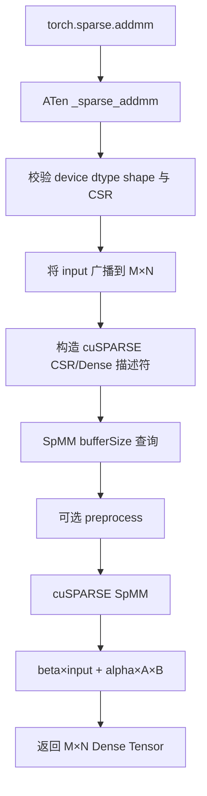
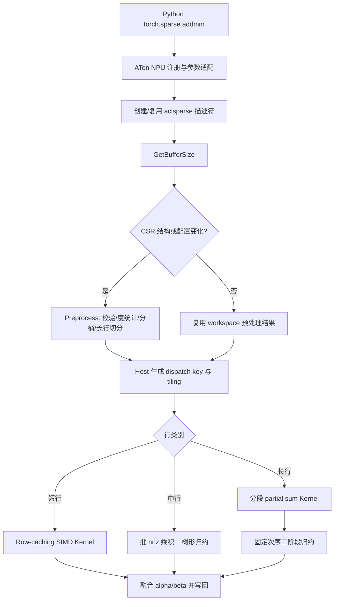
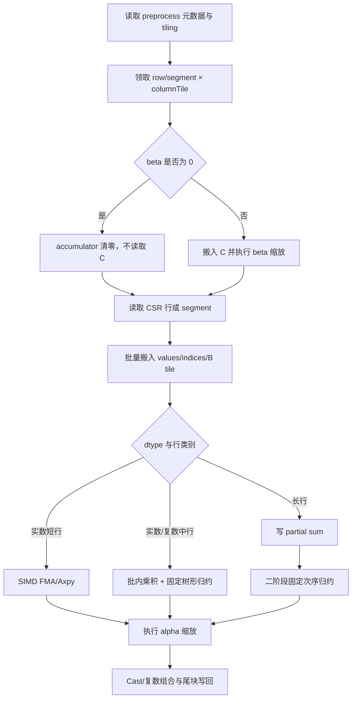
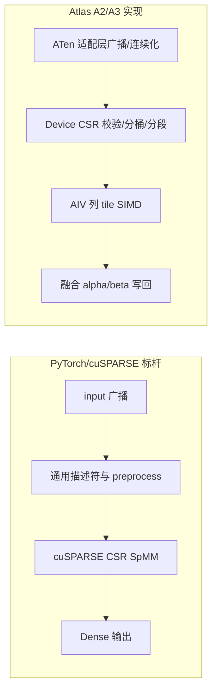

# aclsparseSpMM 算子设计文档（Atlas A2/A3）

| 文档版本 | 日期 | 作者 | 说明 |
|---|---|---|---|
| V1.0 | 2026-08-17 | dududu121 | 按社区任务设计文档 CheckList 编写首版评审稿 |

> 本文档面向 `cann/ops-sparse` 中 `aclsparseSpMM` 的 Atlas A2/A3 能力补齐。Python/ATen 语义以 PyTorch 2.7 及以上版本为准；C++ 接口、能力范围和性能标杆以 CUDA Toolkit 13.3 Update 1 所含 cuSPARSE 13.3 Update 1 SpMM 为准；NPU 实现统一使用 aclsparse 和 Ascend C，不引入 CPU fallback。

## 一、需求背景

### 1.1 需求来源

本需求来自 2026 年昇腾社区任务“aclsparseSpMM 算子开发（A2/A3）”。目标是在 `cann/ops-sparse` 中复用并扩展已有 SpMM 接口，完成以下全链路：

```text
torch.sparse.addmm
  -> aten::_sparse_addmm（NPU dispatch）
  -> aclsparseSpMMGetBufferSize / Preprocess / SpMM
  -> Atlas A2/A3 Ascend C Kernel
```

计算语义为：

$$
C = \alpha\,op(A)\,op(B) + \beta C
$$

其中 $A$ 为 CSR 稀疏矩阵，$B$、$C$ 为稠密矩阵。

### 1.2 业界和仓内现状

#### 1.2.1 PyTorch/ATen 现状

PyTorch 通过 `torch.sparse.addmm` 暴露稀疏矩阵乘加能力，内部调用 `aten::_sparse_addmm`。其适配层负责 input 广播、共同 dtype 检查、稀疏元数据转换和输出构造。当前 `ops-sparse` 尚需补齐 NPU 注册及端到端调用链。

#### 1.2.2 cuSPARSE 标杆

cuSPARSE SpMM 提供 workspace 查询、可选预处理和执行三阶段接口，并针对 CSR、矩阵 order、转置操作、dtype 和不同算法提供支持矩阵。本任务对齐该接口形态和能力边界，但 NPU 侧不依赖或调用 CUDA 实现。

#### 1.2.3 仓内实现基础

- 公共 ABI 与描述符：`include/cann_ops_sparse.h`。
- Ascend 950/DAV_3510 参考：`sparse/spmm/arch35/`，采用 SIMT 路径。
- A2/A3 目标架构：DAV_2201。该架构不能直接复用 arch35 的 SIMT kernel，需要采用 AIV SIMD，以输出列方向连续数据为向量化方向。
- 本任务没有可直接复用的独立 TBE SpMM 单算子，因此不能虚构 TBE 源码路径。本文将 PyTorch/ATen 语义、cuSPARSE SpMM 和仓内 arch35 实现作为标杆与参考。

#### 1.2.4 标杆实现流程图



### 1.3 需求价值

该能力用于图计算、稀疏线性代数及稀疏神经网络等场景。完整的 Python、ATen、C++ 和 Kernel 链路可避免框架回退和多算子拼接开销；预处理结果复用、按行分桶及长行切分可改善稀疏度和行分布不均带来的负载不平衡。

## 二、需求分析

### 2.1 外部依赖

| 依赖 | 用途 | 约束 |
|---|---|---|
| CANN/ACL Runtime | stream、Device 内存、Kernel launch | 使用 `ops-sparse` 仓指定版本 |
| Ascend C DAV_2201 工具链 | A2/A3 kernel 构建 | 目标产品为 Atlas A2、Atlas A3 |
| PyTorch | Python/ATen 语义 | 2.7 及以上 |
| torch_npu | NPU dispatch | 26.0.0 及之后 |
| CPU Golden | 精度单标杆 | FP16/BF16 用 FP32；FP32 用 FP64；complex64 用 complex128 |

### 2.2 内部模块

| 模块 | 职责 |
|---|---|
| Python/ATen 适配层 | 注册 `_sparse_addmm` 的 NPU 实现，检查参数，处理 input 广播和非连续 Tensor，构造输出 |
| aclsparse 公共层 | Handle、stream、pointer mode、CSR/Dense 描述符和公开 ABI |
| arch22 Host 层 | 参数校验、workspace 计算、预处理、算法选择、tiling 与 kernel 分发 |
| arch22 Preprocess Kernel | CSR 合法性检查、行度统计、行分桶/重排、累计 nnz 负载均衡、长行分段描述生成 |
| arch22 Compute Kernel | 短/中/长行分流，实数和 complex64 乘加，布局/转置处理，结果写回 |
| arch35 实现 | 保持 A5/Ascend 950 原有能力；与 arch22 共用无硬件依赖的参数校验和描述符逻辑 |
| 测试模块 | Python/ATen 端到端、C++ 接口、Kernel 精度、异常、确定性、性能和 Profiler 证据 |

### 2.3 接口原型

Python 接口：

```python
torch.sparse.addmm(input, mat1, mat2, *, beta=1, alpha=1) -> Tensor
```

ATen Schema：

```text
aten::_sparse_addmm(
    Tensor self,
    Tensor mat1,
    Tensor mat2,
    *,
    Scalar beta=1,
    Scalar alpha=1
) -> Tensor
```

C++ 接口保持仓内 ABI 兼容：

```c
aclsparseStatus_t aclsparseSpMMGetBufferSize(
    aclsparseHandle_t handle,
    aclsparseOperation_t opA,
    aclsparseOperation_t opB,
    const void *alpha,
    aclsparseConstSpMatDescr_t matA,
    aclsparseConstDnMatDescr_t matB,
    const void *beta,
    aclsparseDnMatDescr_t matC,
    aclDataType computeType,
    aclsparseSpMMAlg_t alg,
    size_t *bufferSize);

aclsparseStatus_t aclsparseSpMMPreprocess(
    aclsparseHandle_t handle,
    aclsparseOperation_t opA,
    aclsparseOperation_t opB,
    const void *alpha,
    aclsparseConstSpMatDescr_t matA,
    aclsparseConstDnMatDescr_t matB,
    const void *beta,
    aclsparseDnMatDescr_t matC,
    aclDataType computeType,
    aclsparseSpMMAlg_t alg,
    void *externalBuffer);

aclsparseStatus_t aclsparseSpMM(
    aclsparseHandle_t handle,
    aclsparseOperation_t opA,
    aclsparseOperation_t opB,
    const void *alpha,
    aclsparseConstSpMatDescr_t matA,
    aclsparseConstDnMatDescr_t matB,
    const void *beta,
    aclsparseDnMatDescr_t matC,
    aclDataType computeType,
    aclsparseSpMMAlg_t alg,
    void *externalBuffer);
```

调用方先查询 workspace 大小并申请 Device 内存；CSR 结构不变时可执行一次 `Preprocess` 并在多次 `SpMM` 中复用结果。三个接口使用 Handle 绑定的调用方 stream，执行阶段不进行无必要的 D2H 或 Host 同步。

### 2.4 功能规格与约束

| 维度 | 支持范围 |
|---|---|
| 硬件 | Atlas A2、Atlas A3（DAV_2201） |
| 稀疏格式 | CSR；row offsets 与 column indices 均为 int32 |
| 索引基准 | idxBase=0、idxBase=1 |
| dtype | float16、bfloat16、float32、complex64 |
| computeType | 遵循任务书及 cuSPARSE 13.3 Update 1 对应类型表，不做未声明的 Tensor 间 dtype 提升 |
| Dense order | B/C 均支持 Row-major、Column-major；校验 leading dimension |
| operation | `NON_TRANSPOSE`、`TRANSPOSE`、`CONJUGATE_TRANSPOSE` 中由官方支持矩阵允许的组合 |
| algorithm | DEFAULT、CSR_ALG1、CSR_ALG2、CSR_ALG3 |
| 动态性 | M、K、N、nnz 动态；支持 nnz=0、空行、长尾行及零长度维度 |
| 异步性 | 在调用方 stream 异步执行；不做无必要 Host 同步 |
| 确定性 | CSR_ALG3 固定调度与归约次序，多次执行 bit-wise 一致 |

算法限制按任务书固化为表驱动校验：

| 算法 | 主要路径 | 约束 |
|---|---|---|
| DEFAULT | Host 根据 layout、shape 和行分布选择 ALG1/ALG2 等价路径 | 只选择官方支持的组合 |
| CSR_ALG1 | 通用/列主优先路径 | 按 cuSPARSE 13.3 Update 1 支持矩阵 |
| CSR_ALG2 | Row-major 批行优化路径 | Row-major 优先，其他组合按支持矩阵校验 |
| CSR_ALG3 | 固定次序确定性路径 | 仅 CSR，`opA=NON_TRANSPOSE`，不支持 `opB=CONJUGATE_TRANSPOSE` |

所有 shape、nnz、leading dimension、workspace 字节数及地址偏移计算均先在 64 位整数中完成并检查溢出。CSR int32 索引决定单维和 nnz 上限不超过 `INT32_MAX`；超过范围返回明确错误。

### 2.5 参数语义

| 参数 | 语义与校验 |
|---|---|
| input/self | 可按 PyTorch 规则广播为 `[M,N]`；无法直接描述的 stride 在适配层生成连续副本 |
| mat1 | 二维 CSR，shape `[M,K]`；rowOffsets 长度 `M+1`，首尾及单调性合法，列索引在范围内 |
| mat2 | 二维 Dense，逻辑 shape `[K,N]`；与 mat1 values、input 同 dtype、同 NPU device |
| alpha/beta | 转成共同计算 dtype；complex64 允许复数标量；实数 dtype 拒绝非零虚部 |
| beta=0 | 仍校验 input 的 shape/dtype/device，但 kernel 不读取 C 原值，NaN/Inf 不传播 |
| output | Dense `[M,N]`，dtype 与输入共同 dtype 相同，位于同一 NPU device，无未声明 alias |

## 三、需求详细设计

### 3.1 总体架构



### 3.2 Python/ATen 适配设计

1. 为 `_sparse_addmm` 注册 PrivateUse1/NPU 实现，保证 dispatch 命中 NPU。
2. 校验 self、mat1、mat2 均在同一 NPU device，dtype 相同且属于四种支持类型。
3. 校验 mat1 为二维 CSR，mat2 为二维 Dense，`mat1.size(1)==mat2.size(0)`。
4. 按 PyTorch 语义将 self 广播到 `[M,N]`。对非连续 Tensor，能用 order/ld 表达时直接构造描述符，否则创建连续临时 Tensor。
5. 创建或复用 CSR/Dense 描述符，按 `GetBufferSize -> Preprocess -> SpMM` 调用。
6. 返回 NPU Dense Tensor，并通过 dispatch 日志及 Profiler 证明没有 CPU fallback。

### 3.3 Host 侧设计

#### 3.3.1 参数检查顺序

固定检查顺序为：Handle/输出参数判空 → 描述符判空 → format/index type/index base → dtype/computeType → op/order/alg 支持矩阵 → shape/ld → 数据指针 → 64 位乘加和 workspace 溢出。任何非法组合在 launch 前返回确定的 `aclsparseStatus_t`，并输出可定位的错误原因。

#### 3.3.2 Preprocess 与 workspace

Preprocess 全程在 Device 上执行，不回读 rowOffsets。其输出按 64B 对齐放入 `externalBuffer`：

| 区域 | 内容 |
|---|---|
| Header | magic、版本、shape、nnz、dtype、op/order/alg、预处理完成标志 |
| Validation | 每核 CSR 合法性状态及首个错误位置 |
| nnzToRow | 每个非零元所属输出行，用于批行和转置贡献路径 |
| rowDegree | 每行 nnz 数量 |
| rowOrder | 按桶及累计 nnz 生成的逻辑行顺序 |
| bucketOffsets | 空行、短行、中行、长行的边界 |
| segmentDesc | 长行的起止 nnz、目标行及 partial sum 偏移 |

最终 workspace 大小为：

$$
W = A_{64}(H) + A_{64}(4nnz) + A_{64}(4M) + A_{64}(4M)
  + A_{64}(4(B+1)) + A_{64}(S\cdot sizeof(SegmentDesc))
$$

其中 $A_{64}$ 表示 64B 向上对齐，$B$ 为桶数，$S$ 为长行分段数。`GetBufferSize` 使用最坏分段数计算，避免 Preprocess 后 workspace 不足。当前功能基线的最小布局为 `2080 + 4×nnz` 字节（Header/每核状态/nnzToRow）；正式性能版本在此基础上补齐 degree、rowOrder、bucket 和 segment 区域。

预处理结果与 matA 的 CSR 指针及结构、shape、op、order、algorithm 绑定。上述任一项变化时必须重新预处理；仅 values、B、C、alpha 或 beta 数值变化时可复用。

#### 3.3.3 分核和数据分块

非转置主路径以 `(rowGroup, columnTile)` 为工作单元：

$$
T_N = \min(N,T_{N,max}),\qquad columnTiles=\lceil N/T_N\rceil
$$

$$
workUnits=\lceil M/R\rceil\times columnTiles
$$

其中 `R` 是单工作单元的输出行数。每个 AIV 核以 `blockIdx + q×blockDim` 跨步领取工作。常规批行路径取 `R=4`，Row-major ALG2 可根据度分布扩大批行数；行重排按累计 nnz 而非单纯行数均衡到各核。

- 短行：多个相邻/同桶行合批，缓存输出 tile，减少 kernel 调度和固定开销。
- 中行：一次搬入一批 B 行，形成 `[batchNnz,T_N]` 或 complex 的 `[batchNnz,2T_N]` 乘积，使用固定树形归约。
- 长行：沿 nnz 维切成多个 segment，多核生成 partial sum，再由第二阶段按 segment 编号固定顺序归约。
- 转置 A：不能由单个 CSR 输入行独占目标输出行。性能算法采用预处理生成的目标行分桶/映射；确定性算法按目标行和源位置排序后归约，避免非确定原子累加。

每个工作单元独占 C tile，因此非转置主路径不需要跨核原子写和跨核同步。

#### 3.3.4 Dispatch key / tilingKey

`ops-sparse` 当前使用自定义 C++ launch，而非 OPP tiling 框架，因此实现中不依赖 `TILING_KEY_IS`。Host 仍构造等价的逻辑 dispatch key，选择静态模板 kernel；该 key 不写入公开 ABI。

| 维度 | 编码/取值 | 选择条件 |
|---|---|---|
| dtype | FP16/BF16/FP32/complex64 | A/B/C 与 computeType 组合 |
| B 路径 | Row-contiguous / Column-gather | B order 与 opB |
| C 路径 | Row-contiguous / Column-scatter | C order |
| A operation | N/T/H | opA；实数 T/H 等价，复数 H 需共轭 |
| algorithm | ALG1/ALG2/ALG3 | 显式 alg；DEFAULT 由 Host 选择 |
| row class | short/medium/long | Preprocess 的 rowDegree 和 segment 结果 |
| beta fast path | zero/nonzero | Host pointer mode 可判定时静态选择，否则 kernel 内判定 |
| precision | normal/high-precision | FP32 高精度扩展枚举，仅作用于允许的 FP32 组合 |

静态 kernel 数量只覆盖真实热路径；冷门合法组合落到通用 kernel，避免组合爆炸和指令缓存压力。

### 3.4 Kernel 侧设计

#### 3.4.1 实数主路径

对每个输出 tile：

1. `beta==0` 时将 FP32 accumulator 清零且不读 C；否则搬入 C、转 FP32 并乘 beta。
2. 根据 rowOffsets 读取当前行/行组的 nnz 范围。
3. 批量读取 values 和 column indices，按 `k=colInd-base` 定位 B。
4. Row-major 连续搬入 B 的列 tile；Column-major 使用覆盖区搬运加 Gather，禁止逐元素 GM 搬运。
5. FP16/BF16 转 FP32，执行 `alpha×value×B`；FP32 正常路径使用 FP32 累加，高精度扩展路径使用 Kahan 补偿。
6. 短行直接向量累加，中行对批内乘积做树形归约，长行写 partial sum。
7. 转回目标 dtype，并用带尾块处理的搬运接口写回。

#### 3.4.2 complex64 路径

complex64 在 GM 中为 `{real,imag}` 交错的两个 FP32。对 $a=a_r+ia_i$、$b=b_r+ib_i$：

$$
ab=(a_rb_r-a_ib_i)+i(a_rb_i+a_ib_r)
$$

共轭转置在读取相应输入元素时翻转虚部符号。alpha/beta 复数缩放使用同一复乘公式。N=256 热路径一次处理 14 个 nnz：先生成 `[14,512]` 的交错复数乘积，再使用 `ReduceSum<float, Pattern::Reduce::RA, true>` 沿 batch 轴做固定树形归约，最后与 accumulator 相加。该方法减少逐 nnz `Axpy` 的指令发射，同时保持重复执行顺序固定。

#### 3.4.3 LocalMemory/UB 规划

常规实数路径的 UB 估算为：

$$
U_{real}=Q_B\cdot batch\cdot T_N\cdot sizeof(T)
+(Q_C^{in}+Q_C^{out})\cdot R\cdot T_N\cdot sizeof(T)
+(2R+3)\cdot T_N\cdot4+U_{scalar}
$$

当前候选参数为 `T_N=1280`、`batch=16`、`R=4`、单 buffer。FP32 约占 179,264B，FP16/BF16 约占 117,792B，均需在编译期和真机上校验不超过可用 UB；尾块统一按 32B 对齐处理。

式中 $Q_B$、$Q_C^{in}$、$Q_C^{out}$ 分别为 B 输入、C 输入和 C 输出 Queue 深度；当前均取 1。$U_{scalar}$ 为 values、索引及对齐余量，FP32 当前按 64B 计。

complex64 N=256 专项路径：

| 区域 | 计算 | 字节数 |
|---|---:|---:|
| B batch | `14×512×4` | 28,672 |
| C input | `512×4` | 2,048 |
| C output | `512×4` | 2,048 |
| work | `(512+5×14×512+32)×4` | 145,536 |
| 合计 |  | 178,304B（约 174.1KiB） |

通用 complex64 路径采用 `T_N=1280`、batch=8，当前估算 153,600B。所有 Queue/TBuf 的起始地址和分区偏移保持 32B 对齐，辅助数据从一个大 TBuf 中按对齐 offset 切分。

#### 3.4.4 Ascend C 实现流程图



### 3.5 标杆与 Ascend C 差异



| 差异 | 原因与收益 |
|---|---|
| arch35 采用 SIMT，arch22 采用 AIV SIMD 列 tile | DAV_2201 不具备与 DAV_3510 相同的 SIMT 实现条件；B 的列方向是可利用的连续向量维 |
| 预处理显式生成行桶、累计 nnz 均衡和长行 segment | 稀疏行度差异大，按行数静态分核会产生严重长尾 |
| alpha/beta 与 SpMM 在同一 kernel 完成 | 减少中间 Tensor、额外 Dense add kernel 和 HBM 往返 |
| complex64 虚实交错向量化并做批内树形归约 | 减少 scalar/指令发射；保留复乘及共轭语义 |
| 确定性路径不使用无序原子累加 | 满足 CSR_ALG3 重复执行 bit-wise 一致要求 |

### 3.6 异步、生命周期和错误处理

- Handle、描述符由调用方创建和销毁；执行期间其内容及底层 Device 指针必须有效。
- workspace 由调用方按 `GetBufferSize` 返回值申请，在 Preprocess 和后续 SpMM 完成前保持有效。
- 所有 Device 操作进入 Handle 绑定的 stream。接口返回仅表示成功入队；调用方读取输出前负责同步。
- HOST pointer mode 在 launch 前复制 alpha/beta 值；DEVICE pointer mode 由 kernel 从 Device 标量读取。
- `nnz=0` 时跳过稀疏乘积，仅执行 `beta×C`；输出维度为零时合法快速返回。
- workspace magic、shape、nnz 与配置不匹配时拒绝使用陈旧预处理结果。

## 四、特性交叉分析

### 4.1 兼容性分析

| 交叉特性 | 影响 | 处理方案 |
|---|---|---|
| A2/A3 与 A5 同时开发 | Host 公共代码可能冲突 | 公共校验/描述符/ABI 下沉复用，`arch22` 与 `arch35` 独立 kernel 和 launch 分支；合入前对两架构回归 |
| dynamic shape | tiling、workspace 随 M/K/N/nnz 变化 | 每次查询并校验 64 位计算；CSR 结构变化时重做 Preprocess |
| 非连续 Tensor | 无法直接用单一 order/ld 表示任意 stride | ATen 层能描述则零拷贝，否则生成连续副本 |
| dtype × layout × op × alg | 组合多且并非全部合法 | Host 使用与任务书一致的 allowlist 表；非法组合明确报错 |
| complex64 × 共轭 | 虚部符号和复标量易出错 | 实虚专项 Golden、非零虚部 alpha/beta 和 T/H 对照用例 |
| beta=0 × NaN/Inf | 读取 C 会错误传播 NaN/Inf | 独立 fast path，完全不读 C 原值 |
| 空行/长行 | 核间负载不均或单核超时 | Preprocess 分桶、累计 nnz 分核、长行 segment 和二阶段归约 |
| 确定性 × 并行归约 | 无序原子导致结果不稳定 | 固定 row/segment 顺序和固定归约树；ALG3 禁止无序原子 |
| idxBase=1 | rowPtr/colInd 地址偏移错误风险 | 读取索引后统一减 base，合法区间按 base 校验 |

### 4.2 安全与资源分析

- 所有输出地址、workspace 区域和 GM 搬运长度在 Host 和 Kernel 两侧做边界约束。
- 不修改 matA、matB 和 input；测试使用前后哈希或逐元素对比验证输入只读性。
- 连续创建、执行、销毁 Handle 和描述符，使用内存统计检查泄漏。
- 不引入网络、文件系统或特权依赖，不涉及用户数据持久化。

## 五、可维可测分析

### 5.1 可维护性

- 目录按架构隔离：`sparse/spmm/arch22/` 与 `sparse/spmm/arch35/`。
- dtype、layout、operation、algorithm 的组合由表和静态模板表达，不在 kernel 热循环中堆叠多层运行时分支。
- 预处理 workspace 带版本和 magic，结构变化时可保持向后检查能力。
- README 记录接口、支持矩阵、限制、构建和复现步骤；公共头文件同步公开枚举与错误码。

### 5.2 测试设计

| 层级 | 测试内容 |
|---|---|
| Python/ATen | `torch.sparse.addmm` 返回 dtype/shape/device、广播、非连续输入、异常行为和 NPU dispatch |
| C++ API | GetBufferSize/Preprocess/SpMM 完整流程，HOST/DEVICE pointer mode，workspace 不足/陈旧，返回码 |
| Kernel 精度 | 四 dtype、idxBase 0/1、B/C 行列主、合法 op/alg 组合、alpha/beta、空行/长行/nnz=0 |
| complex64 专项 | 复数乘加、非零虚部 alpha/beta、T/H、正负混合、小值/离群值 |
| 确定性 | ALG3 同一输入至少连续执行 3 次，输出逐字节一致 |
| 泛化 | 方/长/宽矩阵，不同 M/K/N/nnz/稀疏度，规则和长尾行分布 |
| 鲁棒性 | 非法索引、维度/dtype/device 不匹配、非法支持矩阵组合、零长度维度、溢出边界 |
| 性能 | P-01/P-02/P-03；预热≥10、采样≥30，报告 median/P90，Preprocess 单独计时 |
| Profiler | NPU Kernel 总耗时、AIV 指令/HBM 瓶颈、无 CPU fallback 证据 |

### 5.3 精度验收标准

逐元素匹配条件为：

$$
|actual-golden|\le atol+rtol\times|golden|
$$

整体匹配率不低于 0.99，且每个元素绝对误差不超过 `max(A, 32×ULP(golden))`。

| dtype | Golden 计算类型 | rtol | atol | A |
|---|---|---:|---:|---:|
| float16 | float32 | $2^{-9}$ | $2^{-9}$ | $10^{-1}$ |
| bfloat16 | float32 | $2^{-6}$ | $2^{-6}$ | $10^{0}$ |
| float32 | float64 | $2^{-10}$ | $2^{-16}$ | $10^{-2}$ |
| complex64 | complex128 | 实部/虚部分别按 float32 | 实部/虚部分别按 float32 | 实部/虚部分别按 float32 |

INF/NAN 按生态算子开源精度标准处理。ALG3 另做 bit-wise 重复性校验。

### 5.4 性能验收标准

性能仅在 Atlas A3 量化。每个 `case×dtype` 的性能倍率定义为 `A100耗时/NPU耗时`，必须大于 0.25，即 NPU 耗时必须严格小于下表阈值；全部量化场景倍率算术平均值不低于 0.35。

| 编号 | M×K×N | nnz | dtype | A100（μs） | NPU 严格耗时阈值（μs） |
|---|---|---:|---|---:|---:|
| P-01 | 2,708×2,708×1,433 | 10,556 | float32 | 87.040 | 348.160 |
| P-02 | 169,343×169,343×128 | 1,166,243 | float16 | 321.536 | 1,286.144 |
| P-02 | 同上 | 同上 | bfloat16 | 413.920 | 1,655.680 |
| P-02 | 同上 | 同上 | float32 | 204.576 | 818.304 |
| P-03 | 2,449,029×2,449,029×256 | 61,859,140 | float16 | 25,446.496 | 101,785.984 |
| P-03 | 同上 | 同上 | bfloat16 | 33,704.096 | 134,816.384 |
| P-03 | 同上 | 同上 | float32 | 16,571.232 | 66,284.928 |
| P-03 | 同上 | 同上 | complex64 | 38,806.400 | 155,225.600 |

正式采样复用描述符、workspace 和 Preprocess 结果，不包含首次编译、数据生成、H2D 和无关初始化。输入 CSR 固定为列索引已排序、重复坐标已合并。

### 5.5 阶段验证状态与风险闭环

以下数据仅用于证明设计路径可行，不能替代 A3 验收结论：

- 已在 Ascend 910B4（A2）完成 arch22 C++ smoke 18/18，通过 FP16、BF16、FP32、complex64 等基础路径验证。
- complex64 N=256 的批内 RA 树形归约实验将 `(8192,8192,256)`、degree=25 场景由 19,783.859μs 降至 2,215.780μs，约提升 8.93 倍；两个专项精度用例最大绝对误差分别为 `1.8192999e-07`、`2.4575624e-07`。
- 官方 complex64 精度集因安全超时完成 88/100，已完成 88 项全部 PASS、match rate=1.0；剩余 12 项必须补跑，不能写作全量通过。
- 按当前 A2 小规模结果对 P-03 complex64 线性外推约 669,269μs，相比单场景 155,225.6μs 上限仍需约 4.31 倍优化。该外推不代表 A3 实测，后续以 A3 正式数据为准。

主要风险及闭环动作：

| 风险 | 关闭条件 |
|---|---|
| P-03 长行/大 nnz 负载不均 | 完成长行 segment、二阶段归约并在 A3 Profiler 证明尾核耗时收敛 |
| complex64 指令发射仍偏高 | RA 树形归约合入并完成 100/100 精度、A3 P-03 和 Profiler 回归 |
| Column-major/T/H 泛化性能差 | 使用连续覆盖搬运+Gather，完成官方支持矩阵用例，不允许逐元素 GM 热路径 |
| Python/ATen 链路回退 | dispatch 日志与 Profiler 中核心计算仅出现 NPU kernel，无 CPU sparse mm |
| A2/A3 与 A5 公共 Host 冲突 | 基于先合入版本 rebase，完成 arch22/arch35 构建及回归 |

## 六、参考资料

1. 社区任务流程及注意事项：<https://gitcode.com/org/cann/discussions/39>
2. 任务书：`aclsparseSpMM_A2A3_task_doc.md`
3. PyTorch `torch.sparse.addmm`：<https://docs.pytorch.org/docs/stable/generated/torch.sparse.addmm.html>
4. PyTorch ATen `native_functions.yaml`：<https://github.com/pytorch/pytorch/blob/main/aten/src/ATen/native/native_functions.yaml>
5. PyTorch SparseCUDA 参考：<https://github.com/pytorch/pytorch/blob/main/aten/src/ATen/native/sparse/cuda/SparseCUDATensorMath.cu>
6. NVIDIA cuSPARSE SpMM：<https://docs.nvidia.com/cuda/cusparse/index.html#cusparseSpMM>
7. `cann/ops-sparse`：<https://gitcode.com/cann/ops-sparse>
8. 生态算子开源精度标准：<https://gitcode.com/cann/opbase/blob/master/docs/zh/ops_precision_standard/experimental_standard.md>
