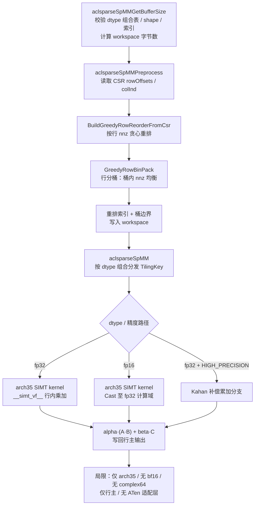
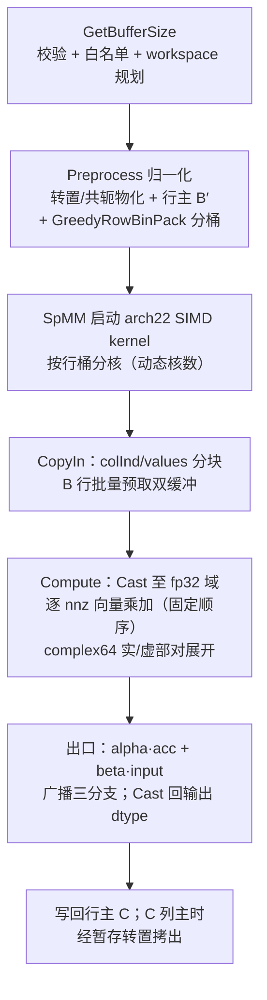

# aclsparseSpMM 算子开发设计文档

## 一、需求背景

### 1.1 需求来源

参考 PyTorch `torch.sparse.addmm` 与 `aten::_sparse_addmm` 的接口和行为，在昇腾 NPU 上完成 Python/ATen 适配，复用并扩展 `ops-sparse` 仓（https://gitcode.com/cann/ops-sparse ）已有 `aclsparseSpMM*` C++ 接口及 Ascend C Kernel，补齐 Atlas A2 训练系列产品 / Atlas A3 系列产品上 `float16`、`bfloat16`、`float32`、`complex64` 全链路能力。C++ 接口的调用阶段、参数语义、描述符、workspace、算法及错误处理对标 cuSPARSE SpMM（CUDA Toolkit 13.3 Update 1）。

### 1.2 背景介绍

#### 1.2.1 aclsparseSpMM 现状分析

ops-sparse 仓 `include/cann_ops_sparse.h` 已声明 `aclsparseSpMMGetBufferSize` / `aclsparseSpMMPreprocess` / `aclsparseSpMM` 三接口，实现位于 `sparse/spmm/arch35/`（`spmm_host.cpp` / `spmm_csr_mat.cpp` / `spmm_kernel.cpp`）。当前支持能力与本任务缺口如下：

| 维度 | 现状（ops-sparse master） | 本任务缺口 |
| --- | --- | --- |
| 适配硬件 | 仅 arch35（Ascend 950 系列） | **Atlas A2 / Atlas A3（DAV_2201/arch22）** |
| 数据类型 | float32、float16（computeType=float32） | 新增 **bfloat16**、**complex64**（必选） |
| 稠密矩阵布局 | B/C 行主（Row-major） | 新增 **Column-major** 及 `ld` 约束 |
| 算法枚举 | `ALG_DEFAULT` / `CSR_ALG1` / `FP32_HIGH_PRECISION_ALG`（Kahan） | 新增 **CSR_ALG2 / CSR_ALG3** 枚举与路由 |
| 操作类型 | opA/opB 常规路径 | 补齐 TRANSPOSE / **CONJUGATE_TRANSPOSE** 语义 |
| 索引 | int32、idxBase=0 | 补齐 **idxBase 0/1** |
| 接口层 | aclsparse C 接口 | 新增 **ATen `_sparse_addmm` NPU 适配 + Python `torch.sparse.addmm`**（PyTorch 2.7+ / torch_npu 26.0.0+，禁 CPU fallback） |

现有 Kernel 为 arch35 SIMT 实现（`__simt_vf__` / `asc_vf_call`，DAV_3510 独有编程模型），在 arch22 上不可用；Host 侧骨架（参数校验、CSR 行重排贪心分桶 `GreedyRowBinPack`、workspace 布局、tiling 组织）为架构无关逻辑，可整层复用。

#### 1.2.2 现有实现流程图

## 二、需求分析

### 2.1 外部组件依赖

- ATen / torch_npu 适配：`aten::_sparse_addmm` NPU 注册（PyTorch 2.7 及以上、torch_npu 26.0.0 及之后），禁止 CPU fallback。
- 其余不涉及外部组件适配。

### 2.2 内部适配模块

| 模块 | 适配内容 |
| --- | --- |
| `include/cann_ops_sparse.h` | 兼容扩展 `aclsparseSpMMAlg_t` 枚举（CSR_ALG2/CSR_ALG3），签名保持源代码兼容 |
| `sparse/spmm/` Host 公共层 | 校验 / workspace 规划 / tiling 骨架复用；dtype 组合表扩展 bf16/complex64；公共逻辑与硬件差异解耦（A2/A3 与 A5 共存） |
| `sparse/spmm/arch22/` | 新增 arch22 Host 适配与 Ascend C SIMD 向量 Kernel（fp16/bf16/fp32/complex64） |
| `torch/`（新增） | ATen NPU 注册、参数校验、Tensor 及稀疏元数据转换、输出构造（目录命名随 PR 与社区确认） |
| `test/spmm/` | 沿用仓内 `test/{op}/` 约定新增 arch22 用例：C++ UT + 端到端 UT + complex64 专项 |

### 2.3 需求模块设计

#### 2.3.1 算子原型

计算：`out = beta · input + alpha · (mat1 × mat2)`，其中 `input` 为可广播稠密矩阵，`mat1` 为 CSR 稀疏矩阵 `[M,K]`，`mat2` 为稠密矩阵 `[K,N]`，输出稠密 `[M,N]`。

| 名称 | 输入/输出/属性 | 含义 | 数据类型 | 数据格式 | 维度(shape) | 非连续Tensor |
| --- | --- | --- | --- | --- | --- | --- |
| input | 输入 | 参与加法的稠密矩阵，可广播至 [M,N] | float16、**bfloat16**、float32、**complex64** | Dense | `[M,N]`/`[N]`/`[1,N]`/`[M,1]` | √ |
| mat1 | 输入 | 稀疏矩阵 A（values + int32 索引，idxBase 0/1） | float16、**bfloat16**、float32、**complex64** | CSR | `[M,K]` | - |
| mat2 | 输入 | 稠密矩阵 B | float16、**bfloat16**、float32、**complex64** | Row/Col-major | `[K,N]` | √ |
| beta | 属性 | input 缩放系数，默认 1；beta=0 时忽略 input 数值 | ATen Scalar | - | - | - |
| alpha | 属性 | mat1×mat2 缩放系数，默认 1 | ATen Scalar | - | - | - |
| out | 输出 | addmm 结果 | 与输入共同 dtype 一致（不提升） | Dense | `[M,N]` | - |

#### 2.3.2 算子相关约束

- 仅支持 CSR 稀疏格式；`csrRowOffsetsType`/`csrColIndType` 均仅 `ACL_SPARSE_INDEX_32I` 且同型，idxBase 支持 0/1，不支持 64I。
- 三输入同 dtype，不执行 dtype 提升；实数 dtype 的 alpha/beta 拒绝虚部非零复数，complex64 接受实数或复数标量。
- 行主/列主 × opA × opB × dtype × alg 组合仅支持 cuSPARSE 13.3 Update 1 SpMM 官方支持矩阵允许的组合；未声明组合返回明确错误（`ACL_SPARSE_STATUS_NOT_SUPPORTED`）。
- `mat1.size(1) == mat2.size(0)`；仅 `input` 按 PyTorch 广播语义广播；三输入同一 NPU 设备，跨设备报错。
- 支持规格内 M/K/N/nnz 动态 shape，Host 侧生成 tiling 参数；确定性计算。

## 三、需求详细设计

### 3.1 使能方式

aclsparse C 接口三段式调用（GetBufferSize → Preprocess → SpMM）+ ATen NPU 注册（`torch.sparse.addmm` 端到端）✔

### 3.2 需求总体设计

#### 3.2.1 host 侧设计

- **复用与解耦**：复用现有三接口骨架（统一校验、WsOffsets、tiling 组织）与 CSR 行重排贪心分桶（GreedyRowBinPack）；公共逻辑抽取为架构无关层，A2/A3（arch22）与 A5（arch35）按架构目录分离，同一主干共存。
- **归一化策略（Preprocess 一次性物化到 workspace）**：opA 转置/共轭 → 物化为 0 基 CSR；B 列主/opB 转置/共轭 → 物化行主连续 B′；C 列主 → kernel 写行主暂存后转置拷出。归一化后 Kernel 收敛为单一路径：CSR[0基] × 行主 B′ → 行主 C + beta·input 广播加，ALG1/ALG2/ALG3 共享，算法枚举驱动组合白名单校验与默认路由。
- **分核策略**：每个 AI Vector 核处理一个行桶（Preprocess 分桶产物），桶到核均分；核数由平台接口动态获取，禁写死。
- **数据分块/UB 优化**：UB 按 N 维 tile 切分；行内 nnz 分块加载 colInd/values；B 行批量预取双缓冲，MTE2 预取向量乘加流水重叠。
- **TilingKey 规划**：dtype（fp32 / fp16 / bf16 / complex64）× 精度路径（fp32 标准 / fp32+Kahan）→ 5 个 TilingKey，编译期模板分发。

#### 3.2.2 kernel 侧设计

- **实现描述**：Init 解析 tiling 并定位本核行桶；Process 每行执行 CopyIn（colInd/values 分块 + B 行预取）→ Compute（逐 nnz 向量乘加，行内按 CSR 存储固定顺序累加，满足确定性 bit-wise）→ CopyOut（alpha·acc + beta·input 广播加后写回）。
- **各 dtype 计算路径**：统一在 fp32 计算域累加——fp32 直接 Axpy；fp16/bf16 Cast 升 fp32 累加后 Cast 回（bf16 带舍入模式）；complex64 按实/虚部拆分为 fp32 对，4 实乘 2 实加展开复数乘加，复数 alpha/beta 与共轭语义在归一化与出口处理；fp32 高精度路径使用 Kahan 补偿累加（移植现有 `UseKahan` 公式）。
- **input 广播**：按 size-1 退化轴分发三种形态（[M,N] 直读 / [N]、[1,N] 行重用 / [M,1] 行标量），beta=0 时不读取 input 数值（NaN/Inf 不传播）。
- **idxBase=1**：kernel 加载 colInd 块后统一减 1，rowOffsets 端点减 1。

- **本任务新实现流程图**

- **现有实现与本任务新实现的差异点和原因**

| 维度 | 现有实现 | 本任务新实现 | 原因 |
| --- | --- | --- | --- |
| 架构/编程模型 | arch35 SIMT（`__simt_vf__`，DAV_3510 专属） | arch22 新写 SIMD 向量 Kernel（AIV_ONLY） | SIMT 为 DAV_3510 独有，arch22 不可用，必须新写 |
| dtype | fp32 / fp16 | 新增 bf16、complex64（必选） | 任务书要求四类型全链路 |
| 布局/op | 行主直通 | 行列主 × opA/opB 归一化到单一路径 | 对齐 cuSPARSE 支持矩阵，避免 kernel 组合爆炸 |
| 算法枚举 | DEFAULT/ALG1/Kahan | 兼容扩展 ALG2/ALG3 + 路由 | 任务书要求对齐 cuSPARSE 13.3 Update 1 |
| 接口层 | 仅 aclsparse C 接口 | 新增 ATen 适配 + Python 接口 | 任务书要求 torch.sparse.addmm 端到端 |

### 3.3 支持硬件

| 支持的芯片版本 | 涉及勾选 |
| --- | --- |
| Atlas A2 训练系列产品 | √ |
| Atlas A3 系列产品 | √ |
| Ascend 950PR/Ascend 950DT | × |
| 其余（Atlas 推理产品/200I/500 A2 等） | × |

### 3.4 算子约束限制

- 空输入：零 nnz、空行、零长度维度行为已定义（M/N 为零 Host 短路返回；K/nnz 为零时 out = beta·input 广播，beta=0 输出全零）。
- 非连续 Tensor：按参数表范围支持，适配层正确处理 stride，无法直接描述时生成连续副本；未支持场景返回明确错误。
- alias 及 in-place 按 PyTorch 接口语义处理，不发生未声明的输入覆盖；异步执行使用调用方 stream，禁止无必要 Host 同步。
- 最大 shape/nnz/leading dimension/workspace/索引溢出边界在接口文档中明确；确定性算法按 bit-wise 验收。

## 四、特性交叉分析

- dynamic shape：支持规格内 M/K/N/nnz 动态变化，Host 侧按 shape/格式/dtype/算法生成 tiling。
- 与 A5 同题并行：Host 公共代码按架构解耦，A2/A3 与 A5 在同一主干共存；后合入 PR 处理公共代码冲突并完成双向回归。
- 其余不涉及图融合等破坏性特性交叉（独立稀疏算子实现）。

## 五、可维可测分析

### 5.1 精度标准/性能标准

| 验收标准 | 描述 | 标准来源 |
| --- | --- | --- |
| 精度标准 | 满足《生态算子开源精度标准》，混合容差单标杆（CPU Golden：fp16/bf16 用 fp32、fp32 用 fp64、complex64 用 complex128）；逐元素 `\|actual-golden\| ≤ atol + rtol×\|golden\|`，匹配率 ≥0.99 且单元素误差 ≤ max(A, 32×ULP)；fp16 rtol=atol=2^-9、A=1e-1；bf16 rtol=atol=2^-6、A=1e0；fp32 rtol=2^-10、atol=2^-16、A=1e-2；complex64 实/虚部按 fp32 参数 | 任务书 |
| 性能标准 | 对标 NVIDIA A100 cuSPARSE SpMM NCU Kernel 总耗时；每个"case×dtype"场景性能倍率 > 0.25×A100，全部场景算术平均值 ≥ 0.35×A100；功能/精度提交 A2+A3 结果，性能仅提交 A3 结果 | 任务书 |

**固定量化性能场景**（任务书给定基准，NPU 侧采集相同调用范围内 Kernel 总耗时计算倍率）：

| 编号 | M×K×N | nnz(A)/稀疏度 | 格式 | dtype | alpha/beta | A100 NCU Kernel 总耗时（μs） | 目标 |
| --- | --- | --- | --- | --- | --- | --- | --- |
| P-01 | 2,708×2,708×1,433 | 10,556 / 0.1439% | CSR，稠密 Row-major | float32 | 1/0 | 87.040 | > 0.25×A100 |
| P-02 | 169,343×169,343×128 | 1,166,243 / 0.0041% | CSR，稠密 Row-major | float16 / bfloat16 / float32 | 1/1 | 321.536 / 413.920 / 204.576 | 各 dtype 均 > 0.25×A100 |
| P-03 | 2,449,029×2,449,029×256 | 61,859,140 / 0.0010% | CSR，稠密 Row-major | float16 / bfloat16 / float32 / complex64 | 1/0 | 25,446.496 / 33,704.096 / 16,571.232 / 38,806.400 | 各 dtype 均 > 0.25×A100 |

全部场景（共 10 个 case×dtype 组合）倍率算术平均 ≥ 0.35×A100。**计时口径**：每 case 预热 ≥10 次、正式采样 30 次，报中位数与 P90；每轮设备同步后计时；描述符、workspace 与 preprocess 结果在正式采样期间复用，preprocess 一次性耗时另行报告；不计首次编译、数据生成、H2D 搬运与无关初始化；性能输入使用已按列索引排序、已合并重复坐标的 CSR，输入生成/加载方式固定并与 A100 基准口径一致。

### 5.2 兼容性分析

- 扩展类任务：`aclsparseSpMM*` 接口签名保持源代码兼容，不新增同名或同功能接口；`aclsparseSpMMAlg_t` 枚举追加新值不改变既有枚举语义。
- 存量 arch35 路径不变，既有 dtype/布局组合行为向下兼容；A2/A3 新增路径与 A5 并行开发按架构目录隔离，存量回归一致。

### 5.3 测试设计

**测试资产盘点**：任务书附带自测用例包含精度用例 200 条（fp32×100 + complex64×100）与性能用例 50 条（fp32×25 + complex64×25），附 GPU A100 NCU 基线数据（按 case id 关联）；附件 dtype 仅覆盖 fp32/complex64，fp16/bf16 用例按同一生成口径自行扩展补齐，不破坏既有 case id 与 A100 基线的对应关系；附件 Profiler 采集脚本的预热/采样次数与任务书口径（预热 ≥10、正式采样 30）不一致，按任务书口径改造后使用。

**用例体系**：以 L0 数学契约（dtype/shape/边界/容差真值源）驱动生成黑盒用例 610 条——L0 门槛 32 条 + L1 功能 500 条 + L2 异常 11 条 + 契约边界/极端直译 40 条 + 缺口补齐 27 条，覆盖：四 dtype × 行主/列主（含 ld padding）× opA/opB（N/T/H）× ALG1/ALG2/ALG3 路由 × idxBase 0/1 × 广播四形态 × 稀疏边界（nnz=0/1、空行、长尾分布）× 零长度维度 × 错误路径（非法索引/维度不匹配/dtype 不一致/白名单外组合/workspace 不足/空指针逐条对应错误码）。

**三层执行口径**：C++ UT（Host 校验/tiling/workspace 规划 + Kernel 行累加正确性）；aclnn 风格 C++ ST（三段式 aclsparse 调用，NPU 结果 vs 升精度 CPU Golden 单标杆比对）；ATen 端到端（`torch.sparse.addmm` Python 调用，含广播/非连续/beta=0 语义/复数标量/动态 shape 抽样）。

**NPU 无 CPU fallback 证据**：dispatcher 注册记录（`aten::_sparse_addmm` 命中 NPU 后端键）+ Profiler 设备 Kernel 列表（核心计算全部在 NPU 执行）双重举证。

**complex64 专项**：复数乘加、复数 alpha/beta、共轭转置语义、实/虚部分别达标判定纳入专项用例集。
