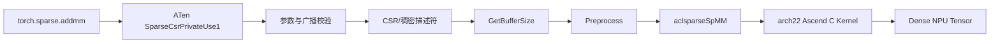
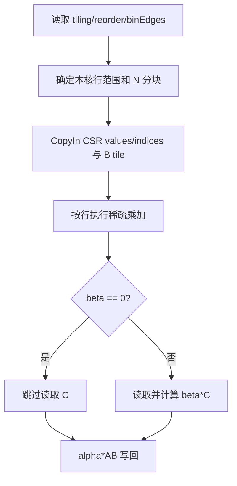

# aclsparseSpMM 算子 A2/A3 设计说明书

> 本文档按照 CANN 社区任务 2026 `design_template.md` 编写。文档描述设计目标、接口语义和实现方案；A2/A3 的实际测试版本、用例结果、性能数据和遗留问题在自测报告中记录。

# 需求背景（required）

## 需求来源

本需求来源于 CANN 社区任务“aclsparseSpMM 算子开发（A2/A3）”。任务要求参考 PyTorch 2.7 及以上版本的 `torch.sparse.addmm` 与 `aten::_sparse_addmm` 行为，在 Atlas A2、Atlas A3 上完成 Python/ATen、aclsparse C++ 接口和 Ascend C Kernel 全链路能力，并复用 `ops-sparse` 已有的 Handle、矩阵描述符和 `aclsparseSpMM*` 接口。

目标计算为：

$$
C = \beta C + \alpha\,\operatorname{op}(A)\operatorname{op}(B)
$$

其中 $A$ 是 CSR 稀疏矩阵，$B$、$C$ 是稠密矩阵。Python 接口中的 `input` 对应公式中的初始 $C$，输出是新的稠密 Tensor。

## 背景介绍

### 现有实现与改造范围

`ops-sparse` 已有公共 Handle、CSR/稠密矩阵描述符以及 `aclsparseSpMMGetBufferSize`、`aclsparseSpMMPreprocess`、`aclsparseSpMM` 三阶段接口。本任务不新增同功能接口，主要补齐以下内容：

| 层级 | 改造内容 |
| --- | --- |
| Python/ATen | 注册 NPU 的 `_sparse_addmm` 和 `addmm.out`；完成广播、dtype/device/shape 校验、非连续 Tensor 处理及输出构造 |
| C++ Host | 补齐四种 dtype、N/T/H 操作、Row/Column-major、leading dimension、index base、算法校验、workspace 和预处理生命周期 |
| Ascend C | 实现通用 CSR 路径及任务性能场景的规则矩阵快路径，核心计算全部在 NPU 执行 |
| 测试与文档 | 覆盖 A2/A3 功能精度、A3 性能、Profiler、异常、资源生命周期和复现步骤 |

### 算子功能分析

Python 公开接口为：

```python
torch.sparse.addmm(input, mat1, mat2, *, beta=1, alpha=1) -> Tensor
```

输入与输出关系如下：

| 参数 | 含义 | 支持类型 | 形状与约束 |
| --- | --- | --- | --- |
| `input/self` | 加法项 | float16、bfloat16、float32、complex64 | 可广播至 `[M, N]` |
| `mat1` | CSR 稀疏矩阵 $A$ | values 为上述四种类型；索引为 int32 | `[M, K]` |
| `mat2` | 稠密矩阵 $B$ | 与其他 Tensor 同 dtype | `[K, N]` |
| `alpha` | 稀疏乘积缩放系数 | 实数；complex64 时可为复数 | 标量 |
| `beta` | `input` 缩放系数 | 实数；complex64 时可为复数 | 标量 |
| `output` | 稠密结果 $C$ | 与输入共同 dtype 相同，不做 Tensor 间 dtype 提升 | `[M, N]` |

# 需求分析（required）

## 需求描述

在 Atlas A2/A3 上实现与目标 PyTorch 版本一致的 CSR `sparse.addmm`，并保持已有 `aclsparseSpMM*` C ABI。实现必须支持 float16、bfloat16、float32、complex64，支持规格内动态 shape、稀疏度、空行、长尾行、两种稠密布局、合法转置组合以及 Host/Device 标量指针模式，且禁止以 CPU 计算替代 NPU Kernel。

## 需求拆解

1. 复用公共 C++ API，形成 `GetBufferSize -> Preprocess -> SpMM` 完整调用链。
2. 打通 float16、bfloat16、float32、complex64 的 Python、ATen、Host 和 Kernel 路径。
3. 支持 CSR index base 0/1，拒绝 SpMM 不支持的 int64 或混合索引类型。
4. 支持 B/C 的 Row-major、Column-major、最小 leading dimension 和 padding。
5. 支持 `opA/opB` 的 N/T/H 语义及算法枚举限制，complex64 正确执行共轭。
6. `input` 按 PyTorch 规则广播；非连续 input/mat2 在适配层生成可描述的连续副本。
7. `beta=0` 时不读取初始 C，避免其中 NaN/Inf 传播。
8. Host 根据 CSR 行分布进行分桶和调度，Kernel 覆盖规则分布快路径和任意合法 CSR 通用路径。
9. 核心乘加由 Ascend C Kernel 完成；提供 NPU dispatch 和 profiler 证据。
10. A2/A3 共用 arch22 公共逻辑，硬件/工具链差异封装在构建与 Kernel 兼容层，不复制公开接口。
11. A2/A3 功能与精度均需通过；A3 八个性能场景逐项倍率大于 0.25，平均倍率不低于 0.35。
12. 提供 C++ UT、Python 端到端测试、自测报告、README、接口限制和社区设计文档。

# 详细设计（required）

## 算子分析

### 数学公式

设 CSR 矩阵 $A\in\mathbb{F}^{M\times K}$，稠密矩阵 $B\in\mathbb{F}^{K\times N}$，初始矩阵 $C\in\mathbb{F}^{M\times N}$，则：

$$
C_{i,j}^{out}=\beta C_{i,j}^{in}+\alpha\sum_{p=rowPtr_i}^{rowPtr_{i+1}-1}
value_p\,B_{colInd_p,j}
$$

当 `opA` 或 `opB` 为 transpose/conjugate-transpose 时，逻辑维度和元素地址按操作后的矩阵解释；complex64 的 H 操作还需对元素虚部取反。

### 支持数据类型

| A/B/C dtype | `computeType` | 累加设计 | alpha/beta |
| --- | --- | --- | --- |
| float16 | ACL_FLOAT16 或 ACL_FLOAT | 通用路径使用 float 累加；指定小 N 快路径可使用 half 向量计算 | 转为对应实数标量 |
| bfloat16 | ACL_BF16 或 ACL_FLOAT | float32 累加 | 转为对应实数标量 |
| float32 | ACL_FLOAT | float32 NPU 累加；CPU Golden 使用 float64 | float32 |
| complex64 | ACL_COMPLEX64 | 实部/虚部分离的 float32 复数乘加 | complex64，允许非零实部和虚部 |

Tensor 间不做 dtype 提升；A values、B、C 必须同 dtype。实数 dtype 拒绝虚部非零的 alpha/beta。

### 支持形状与边界

- A、B 均为二维矩阵，`op(A).cols == op(B).rows`。
- 输出固定为 `[op(A).rows, op(B).cols]`。
- Python `input` 可为 `[M,N]`、`[N]`、`[1,N]`、`[M,1]` 等可广播形状。
- 支持动态 M/K/N/nnz、`nnz=0/1`、空行、非均匀行和长尾行。
- 维度、nnz、ld 必须能安全转换为 int32；超出时返回不支持。
- CSR row offsets 应单调不减，首项等于 index base，末项等于 `nnz + index base`，列索引必须位于合法范围。

## 算子实现

### 总体调用流程



描述符、workspace 和预处理结果可在同一计划中复用。SpMM 只向 Handle 所绑定的 stream 异步下发 Kernel，不在执行阶段进行无必要的 Host 同步。

### Python/ATen 侧设计

ATen 扩展在 `SparseCsrPrivateUse1` dispatch key 注册：

```text
aten::_sparse_addmm
aten::addmm.out
```

适配流程：

1. 校验 `mat1.layout == SparseCsr`，三个输入均在同一 NPU，dtype 相同且属于四种支持类型。
2. 校验 `mat1=[M,K]`、`mat2=[K,N]`，并使用 ATen 广播推导确认 `input` 可扩展到 `[M,N]`。
3. 当 `beta != 0` 时将广播后的 input 拷贝到输出；当 `beta == 0` 时跳过该读取，保证 NaN/Inf 不传播。
4. 对 CSR values、mat2 生成连续视图；CSR 索引统一转换为 int32。
5. 将 alpha/beta 转换为计算 dtype；complex64 使用两个 float 保存实部与虚部。
6. 获取当前 NPU stream，创建或复用线程内 Handle、矩阵描述符和 workspace。
7. 调用三阶段 C++ 接口，返回异步输出 Tensor。

缓存计划的键包含设备、CSR 三个数据指针、mat2 数据指针、shape、dtype、alpha/beta，以及参与缓存的 Tensor version counter。shape、dtype、地址或版本变化时必须重建预处理结果；重建前同步旧计划所在 stream，防止异步资源提前释放。C++ 裸接口无法感知用户对外部 Device 内存的原地修改，因此要求调用方在修改 A/B/alpha 后重新 Preprocess。

### C++ Host 侧设计

#### 参数校验

三个公开阶段复用统一校验逻辑：

- Handle、矩阵描述符、alpha/beta、workspace 等必需指针非空；
- A 必须为 CSR，row offsets 与 col indices 均为 int32 且类型一致；
- index base 仅允许 0 或 1；
- A/B/C dtype 与 computeType 组合合法；
- Row-major 要求 `ld >= cols`，Column-major 要求 `ld >= rows`；
- 操作后的 M/K/N 一致；
- 算法枚举合法，ALG3 仅允许 CSR、`opA=N` 且 `opB!=H`；
- FP32 high-precision 算法仅接受 float32；
- 指针、维度、nnz、ld 和乘法/加法计算均做空值与溢出检查。

错误码原则：空 Handle/描述符使用 `HANDLE_IS_NULLPTR`，非法值/维度/布局使用 `INVALID_VALUE`，不支持的格式/dtype/算法/索引组合使用对应 `NOT_SUPPORTED` 类错误，ACL 搬运或 Kernel 下发失败使用 `EXECUTION_FAILED`。

#### Workspace 设计

Workspace 由调用方分配，布局如下：

```text
0
├─ 64 B                         : SpmmArch22RegularMeta/保留头
├─ align64(sizeof(TilingData))  : SpmmArch22TilingData
├─ align64(M * sizeof(int32))   : reorder[M]
├─ align64((blockDim+1)*4)      : binEdges[blockDim+1]
└─ expandedValueBytes           : 可选的值展开/乘积缓存/局部性输出缓存
```

基础大小公式为：

$$
S_{base}=64+align_{64}(sizeof(TilingData))+align_{64}(4M)+align_{64}(4(blockDim+1))
$$

总大小为 $S_{base}+S_{expanded}$。`blockDim` 优先读取设备 vector core 数，读取失败时使用 24。可选扩展区仅为受控快路径分配，进行 uint64 溢出检查并限制在 32 GiB 内；不满足条件时回退到无展开路径。

现有公开 `SpMM` 原型没有 workspaceSize 参数，执行阶段不能可靠检测一个非空指针实际分配是否不足。因此接口契约要求调用方严格使用当前参数组合的 `GetBufferSize` 返回值分配，并保持到 stream 完成。测试通过边界 guard 验证实现不越过已查询大小；空 workspace 返回确定错误。

#### Preprocess 设计

Preprocess 是可复用的一次性准备阶段：

1. 校验 CSR row offsets 和 col indices；Host 读取仅发生在预处理阶段。
2. 计算每行 nnz，以累计 nnz 将连续行划分到各 vector core，降低长尾分布的核间负载差。
3. 生成 `reorder[M]` 和 `binEdges[blockDim+1]`。
4. 识别规则行分布：度数范围不超过 1、最大度数不超过 32、列模式满足固定 stride。
5. 对规则方阵进一步检测列访问是否构成置换，满足时生成 locality order。
6. 根据 dtype/N/分布生成可选 expanded values、row-product cache 或 locality-output cache。
7. 写入 tiling 数据并将当前 workspace 记录为描述符的 active buffer。

预处理产生的 row reorder 只改变执行顺序，不改变每行内部的确定性归约次序。

#### Tiling 数据

`SpmmArch22TilingData` 包含：

| 类别 | 字段 |
| --- | --- |
| 逻辑形状 | M、K、N、nnz、aRows、aCols |
| 调度 | blockDim、nChunks |
| 布局 | ldb、ldc、orderB、orderC |
| 语义 | dataType、opA、opB、indexBase |
| 标量 | alphaHost/alphaImag、betaHost/betaImag |
| Workspace | reorderOffset、binEdgeOffset、expandedValueOffset、localityOutputOffset |
| 快路径 | useGeneric、expandedValueEnabled、expandedDegreeMajor、reserved |

N 维根据 192 KiB UB、8 KiB 预留空间、双缓冲和临时累加张量进行切块，块内元素按 8 对齐。M 维通过 binEdges 在核间分配。FP32 四行批处理仅用于 `N<=1024`，更宽的紧凑行主输入仍由 FP32 fast Kernel 的单行路径处理；complex64 fast Kernel 限制为 `N<=2048`，更宽输入进入支持任意合法宽度的 complex64 通用 Kernel，避免整行复数临时张量超过 UB。

### Kernel 侧设计

Kernel 依据 dtype、布局、操作和预处理元数据选择以下路径：

| 路径 | 适用条件 | 设计目的 |
| --- | --- | --- |
| Generic real | 任意合法布局、base、N/T/H，float16/bfloat16/float32 | 完整功能与泛化兜底 |
| Generic complex | 任意声明支持的 complex64 组合 | 复数乘加及共轭语义兜底 |
| Fast row-major | base0、A/B 均 N、B/C 紧凑行主 | 减少地址计算并进行向量化 |
| Low-precision fast | FP16/BF16、规则 CSR、小 N | 批量搬运、float 累加、双缓冲 |
| Product cache | 规则低精度或 complex64 重复调用 | 缓存 $\alpha AB$，后续只应用当前 $\beta C$ |
| Locality output | 规则方阵且列访问是置换 | 按列局部性重排，降低 B 的离散访存 |

典型核内流程：



complex64 将每个元素解释为 `(real, imag)`，乘法为：

$$
(a_r+ia_i)(b_r+ib_i)=(a_rb_r-a_ib_i)+i(a_rb_i+a_ib_r)
$$

H 操作在参与乘法前取共轭。所有输出写入仅覆盖 C 描述符定义的有效元素，padding 和输入 A/B 保持只读。

### 算法枚举与布局策略

| 算法 | 设计策略 | 限制 |
| --- | --- | --- |
| DEFAULT | Host 自动选择通用或快路径 | 仅声明组合 |
| CSR_ALG1 | 优先列主兼容路径，其他合法组合走通用实现 | CSR |
| CSR_ALG2 | PyTorch 默认使用，优先紧凑行主快路径 | CSR |
| CSR_ALG3 | CSR 专用路径 | `opA=N`，`opB!=H` |
| CSR_FP32_HIGH_PRECISION_ALG | float32 高精度语义 | 仅 ACL_FLOAT |

算法选择不改变数学结果和公开 workspace 生命周期。未声明组合返回 `NOT_SUPPORTED`，不静默切换到 CPU。

### Stream、生命周期与缓存一致性

- Handle 持有调用方 stream；Preprocess/SpMM 的 Device 操作均在该 stream 上有序执行。
- SpMM 下发后立即返回；调用方在同步前必须保持 A/B/C、描述符和 workspace 有效。
- 描述符不拥有用户 Tensor/Device 内存；销毁描述符不释放矩阵数据。
- Python 计划持有相关 Tensor 引用，防止异步期间内存失效。
- 缓存的 $\alpha AB$ 只在 A 结构、A values、B、alpha、shape、dtype 和 workspace 均未变化时有效；beta 和当前 C 不属于乘积缓存。
- Python 层用地址与 version counter 防止原地修改误复用；C++ 调用方修改数据后必须重新 Preprocess。
- 计划替换或进程退出释放资源前同步对应 stream；普通 cache hit 保持异步。

### 空输入处理

- `M==0` 或 `N==0`：返回形状正确的空输出，不下发无意义 Kernel。
- `K==0` 或 `nnz==0`：结果为 `beta * input`；`beta==0` 时直接清零且不读取 input。
- CSR 中间空行：row offsets 相邻项相等，Kernel 对该行只执行 beta 分支。

## 支持硬件

| 支持的芯片版本 | 架构目录 | 涉及勾选 |
| --- | --- | --- |
| Atlas A2（Ascend 910B 系列） | `sparse/spmm/arch22` | √ |
| Atlas A3（Ascend 910_93 系列） | `sparse/spmm/arch22` | √ |

A2/A3 均映射到 DAV-2201/arch22，复用相同 Host 接口、能力选择、tiling 和 Kernel。实现不按 SoC 名称做整机兜底分流：紧凑 Row-major 场景在两个产品上均选择并行 fast/cache Kernel，转置、Column-major、padding 和 base-1 等场景按能力选择 generic Kernel。跨流水线依赖使用显式全流水线 barrier，避免 CANN 8.5.2 下 MTE2/Vector/MTE3 异步读写竞态；BF16 规则场景根据 N 和 workspace 能力选择行结果或乘积缓存，回绕/分块尾行保持现场重算。

## 算子约束限制

1. 仅支持 CSR，不新增 COO/CSC SpMM。
2. SpMM 执行仅支持 row offsets 和 col indices 同为 int32；index base 支持 0/1。
3. A/B/C 必须同 dtype，不做 Tensor 间 dtype 提升。
4. 最大 shape、nnz、leading dimension 均受 int32 上限约束。
5. B/C 支持 Row-major 和 Column-major；leading dimension 必须满足布局下限。
6. ALG3 仅支持 `opA=N` 且不支持 `opB=H`。
7. expanded/cache workspace 上限为 32 GiB，超限时回退通用路径。
8. 外部 workspace 必须按同一参数组合的 GetBufferSize 结果分配；接口本身没有 size 参数，无法识别非空但不足的分配。
9. C++ 层调用方原地修改 A/B 或 alpha 后必须重新 Preprocess；Python 适配层负责版本检测。
10. 当前作为独立稀疏算子实现，不要求图融合。

# 可维可测分析

## 精度标准/性能标准

| 验收标准 | 描述 | 标准来源 |
| --- | --- | --- |
| float16 精度 | CPU float32 Golden；`rtol=2^-9`、`atol=2^-9`、`A=1e-1` | 任务书与生态算子开源精度标准 |
| bfloat16 精度 | CPU float32 Golden；`rtol=2^-6`、`atol=2^-6`、`A=1` | 同上 |
| float32 精度 | CPU float64 Golden；`rtol=2^-10`、`atol=2^-16`、`A=1e-2` | 同上 |
| complex64 精度 | CPU complex128 Golden；实部/虚部分别按 float32 标准 | 同上 |
| 整体匹配 | 匹配率不低于 0.99，且满足逐元素绝对误差硬上限 | 同上 |
| A3 性能 | 8 个 case×dtype 场景均大于 A100 的 0.25 倍，算术平均不低于 0.35 倍 | 任务书 A100 NCU 标杆 |
| 性能采样 | 预热 10 次、正式 30 次，报告 median/p90；每轮同步 | 任务书 |

## 测试设计

| 测试层 | 覆盖内容 | 主要证据 |
| --- | --- | --- |
| Python/ATen | 四 dtype、广播、非连续输入、beta=0 NaN/Inf、nnz=0、缓存重用和异常；任务包 FP32/complex64 200 条正式精度矩阵 | JSON 报告、dispatch key |
| C++ API | 三阶段流程、N/T/H、Row/Col、padding、base0/1、算法、标量、返回码 | `spmm_test` 日志 |
| 边界与生命周期 | Device scalar、零 M/K/N、bitwise 确定性、输入只读、C guard、workspace guard、重复创建/执行/销毁 | `spmm_extended_test` 日志 |
| 泛化 | 方/长/宽矩阵、nnz=0/1、空行、均匀/幂律分布 | 参数化用例日志 |
| 性能 | P-01、P-02、P-03 共 8 个 dtype 场景 | 10+30 JSON、median/p90 |
| NPU 执行 | Kernel 符号、NPU 活动和无 CPU multiply fallback | Profiler CSV/trace 与截图 |

性能测试固定 CSR 生成方式、seed、最终 nnz、values、B、alpha/beta 和 computeType；描述符、workspace、Preprocess 在正式采样期间复用，数据生成和 H2D 不计入 Kernel 耗时。

## 兼容性分析

1. **公开接口兼容**：沿用 `include/cann_ops_sparse.h` 中已有函数签名、枚举和描述符，不新增重复接口。
2. **主干共存**：公共参数校验、workspace 和 CSR 预处理逻辑置于 arch22 Host 实现；A5/arch35 保留独立 Kernel，避免硬件分支侵入公共 ABI。
3. **PyTorch 兼容**：以 PyTorch 2.7+ 和 torch_npu 26.0.0+ 的 schema/dispatch 为目标；输出 dtype、shape、device、广播和异常行为由 ATen 侧显式校验。
4. **工具链兼容**：A2/A3 均使用 arch22，但实际 CANN 版本可能暴露 Ascend C API 差异；兼容修改必须通过两个硬件环境重新编译和功能回归。
5. **异步兼容**：不改变 Handle stream 语义；只有预处理的 CSR 分析、Device 标量读取、缓存替换和最终测试计时允许必要同步。

## 风险与规避

| 风险 | 影响 | 规避措施 |
| --- | --- | --- |
| 长尾行导致负载不均 | 尾延迟和性能下降 | 按累计 nnz 分桶，规则矩阵使用 locality order |
| workspace 乘法溢出 | 越界或错误分配 | uint64 分步溢出检查、32 GiB 上限、通用路径回退 |
| beta=0 仍读取 C | NaN/Inf 错误传播 | Kernel 和 Python 适配层均单独分支 |
| 缓存遇到原地修改 | 返回旧乘积 | Python 使用 version counter；C++ 明确重新 Preprocess 契约 |
| A2/A3 工具链差异 | 编译或数值不一致 | 两台真实硬件分别编译、运行四 dtype 精度与生命周期回归 |
| 快路径覆盖不完整 | 特殊布局错误 | 快路径条件严格匹配，其他合法输入进入通用 Kernel |
