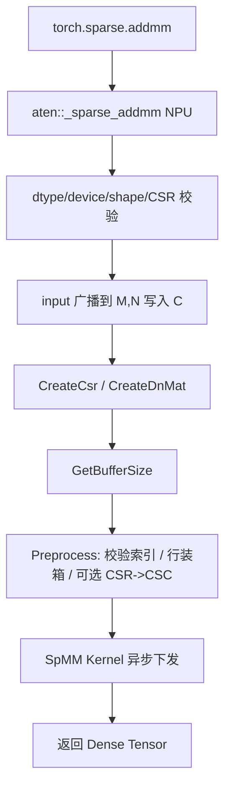

# aclsparseSpMM 算子（Atlas A2/A3）设计方案

> 本文档按 [社区任务设计文档模板](https://gitcode.com/cann/cann-ops-competitions/blob/master/04_tasks/01_community-task-2026/resources/design_template.md) 编写。  
> 合入仓：设计文档提交至 `cann-ops-competitions`；实现代码提交至 [`ops-sparse`](https://gitcode.com/cann/ops-sparse) 的 `master` 分支。  
> 提交路径：`04_tasks/01_community-task-2026/tasklist/08-aclsparseSpMM/yuhongming-2026/docs/design.md`

# 需求背景（required）

## 需求来源

依据 CANN 社区任务《aclsparseSpMM 算子开发(A2/A3)》，在 Atlas A2 / Atlas A3 上补齐 `ops-sparse` 已有 aclsparse SpMM 能力，并完成 PyTorch `torch.sparse.addmm` / ATen `aten::_sparse_addmm` 的 NPU 适配。Python/ATen 语义以 PyTorch 2.7 及以上为准；C++ 接口阶段、参数语义、描述符、workspace、算法及错误处理对标 CUDA Toolkit 13.3 Update 1 所含 cuSPARSE 13.3 Update 1 的 SpMM，实现统一使用 aclsparse 与 Ascend C，不允许 CPU fallback。

参考资料：

- PyTorch `torch.sparse.addmm`：https://docs.pytorch.org/docs/stable/generated/torch.sparse.addmm.html
- NVIDIA cuSPARSE SpMM：https://docs.nvidia.com/cuda/cusparse/index.html#cusparseSpMM
- ops-sparse 仓库：https://gitcode.com/cann/ops-sparse
- 生态算子开源精度标准：https://gitcode.com/cann/opbase/blob/master/docs/zh/ops_precision_standard/experimental_standard.md

## 背景介绍

### aclsparse SpMM 算子实现优化

基于 `ops-sparse` 已有 aclsparse SpMM C++ 接口及 arch22 Ascend C Kernel，在 Atlas A2 / Atlas A3 上补齐 dtype、布局、算法、索引基址、转置/共轭转置、泛化与 Python/ATen 适配，而不是新增一套同名接口。

现有实现路径：

| 模块 | 路径 |
|---|---|
| 公开头文件 | `include/cann_ops_sparse.h` |
| 描述符 / Handle | `sparse/common/` |
| A2/A3 Kernel 与 Host | `sparse/spmm/arch22/` |
| A5 Kernel 与 Host | `sparse/spmm/arch35/`（本任务不改计算路径，仅保证公共代码可共存） |
| C++ UT | `test/spmm/arch22/` |

`ops-sparse` 根 `CMakeLists.txt` 将 Atlas A2（Ascend910B）与 Atlas A3（Ascend910_93）均映射到 `arch22`。本任务在 `sparse/spmm/arch22/` 上扩展，不新开一套 `aclsparseSpMM*` 符号。

### aclsparse SpMM 现状分析

通过对 `ops-sparse` master 中 arch22 实现的分析，当前能力如下。

C++ 公开接口（三步法，签名保持不变）：

```c
aclsparseSpMMGetBufferSize(...);
aclsparseSpMMPreprocess(...);
aclsparseSpMM(...);   // C = alpha * op(A) * op(B) + beta * C
```

| 参数 | 参数含义 | 数据类型 | 当前支持 | 本任务目标 | 形状 |
| --- | --- | --- | --- | --- | --- |
| matA | CSR 稀疏矩阵 A | 描述符 | 仅 `ACL_FLOAT`；CSR；I32；`idxBase=0` | `float16` / `bfloat16` / `float32` / `complex64`；CSR；I32；`idxBase=0/1` | `[M, K]` |
| matB | 稠密矩阵 B | 描述符 | 仅 `ACL_FLOAT`；仅 ROW 且 `ld==cols` | 四种 dtype；ROW/COL；`ld` 允许 padding | `[K, N]`（随 opB 变化） |
| matC | 稠密矩阵 C | 描述符 | 同 matB | 同 matB | `[M, N]`（随 opA/opB 变化） |
| alpha / beta | 缩放标量 | `void*` | 仅 host/device `float` | 与 `computeType` 一致，含 complex64 | 标量 |
| opA / opB | 转置操作 | 枚举 | 仅 `NON_TRANSPOSE` | 按 cuSPARSE 13.3 官方允许组合补齐 | - |
| alg | 算法 | 枚举 | `DEFAULT`、`CSR_ALG1` | 补齐 `CSR_ALG2`、`CSR_ALG3`，DEFAULT 按布局路由 | - |
| computeType | 计算精度 | `aclDataType` | 仅 `ACL_FLOAT` | `ACL_FLOAT16`、`ACL_BF16`、`ACL_FLOAT`、`ACL_COMPLEX64` | - |

现有 arch22 Kernel 特点：

- 计算：`C = alpha * A * B + beta * C`，AIV 向量路径，按行累加。
- Preprocess：贪心行装箱（Greedy Row Bin Pack），按 nnz 均衡分核，结果写入 workspace。
- Tiling：沿 N 维按 UB 切 chunk；double buffer 预取 B 的行；`beta==0` 时跳过读 C。
- 限制：硬编码 `float` 寻址 `B[col*N+j]` / `C[row*N+j]`，不支持 COL-major、padding ld、fp16/bf16/complex64、op 转置、`idxBase=1`。
- 产品文档现状：顶层 `sparse/spmm/README.md` 仍标注 A2/A3「不支持」，与 arch22 目录实际代码不一致。本任务完成后需同步文档。

Python/ATen 现状：`ops-sparse` 当前无 `aten::_sparse_addmm` NPU 注册。`torch.sparse.addmm` 在 NPU 上会回退 CPU 或直接失败，不满足任务「核心计算必须在 NPU 完成」。

### aclsparse SpMM 功能分析

C++ 层功能：

```text
C = alpha * op(A) * op(B) + beta * C
```

Python/ATen 层功能（对标 `torch.sparse.addmm`）：

```text
out = beta * input + alpha * (mat1 @ mat2)
```

其中 `mat1` 为 CSR 稀疏矩阵，`mat2` 与 `input` 为稠密矩阵，`out` 为稠密矩阵。适配层把 `input` 广播到 `[M, N]` 后作为 SpMM 的 C 初值。

输入：`input`（稠密）、`mat1`（CSR）、`mat2`（稠密）、`alpha`、`beta`  
输出：稠密 `out`，shape `[M, N]`，dtype 与三输入共同 dtype 相同，device 为同一 NPU。

支持数据类型：`float16`、`bfloat16`、`float32`、`complex64`（complex64 为必选）。

支持广播：仅 Python/ATen 层对 `input` 按 PyTorch 规则广播到 `[M, N]`；`mat1`、`mat2` 不做矩阵维广播。C++ SpMM 不内置广播。

# 需求分析（required）

## 需求描述

在 Atlas A2 / Atlas A3 上复用并扩展 `ops-sparse` 已有 `aclsparseSpMM*` 接口与 arch22 Kernel，打通 `float16`、`bfloat16`、`float32`、`complex64` 全链路；完成 `aten::_sparse_addmm` 的 NPU 注册，使 `torch.sparse.addmm` 在 NPU 上的接口、返回值、dtype、shape、device、异常行为与 PyTorch 2.7+ 一致。核心计算在 NPU 执行，禁止 CPU fallback。精度采用混合容差单标杆；A3 性能相对 NVIDIA A100 cuSPARSE SpMM Kernel 总耗时，单场景大于 0.25 倍，量化场景算术平均不低于 0.35 倍。

## 需求拆解

1. 复用 `aclsparseSpMMGetBufferSize` / `Preprocess` / `SpMM` 及 Handle、CSR/DnMat 描述符，不新增同名接口。
2. 补齐 A2/A3 上 `float16`、`bfloat16`、`float32`、`complex64` 的描述符、workspace、preprocess、Kernel。
3. 补齐 ROW/COL 布局、`ld` padding、`idxBase=0/1`、以及 cuSPARSE 13.3 官方允许的 `opA`/`opB`/算法组合；未声明组合返回明确错误。
4. 在公开头文件中兼容扩展 `ACL_SPARSE_SPMM_CSR_ALG2`、`ACL_SPARSE_SPMM_CSR_ALG3`；DEFAULT 按布局路由；ALG3 提供确定性结果。
5. 实现 `aten::_sparse_addmm` NPU 适配：参数校验、CSR/稠密转换、广播、非连续 Tensor、标量转换、输出构造。
6. Host 公共逻辑与 A5（arch35）硬件差异解耦，保证同一主干共存。
7. 覆盖任务书自验证场景、精度标准、A2/A3 功能精度与 A3 性能，并提供 Profiler 证据证明无 CPU fallback。

# 详细设计（required）

## 算子分析

### 数学公式

C++ / Kernel：

\[
C = \alpha \cdot \mathrm{op}(A) \cdot \mathrm{op}(B) + \beta \cdot C
\]

Python / ATen：

\[
\mathrm{out} = \beta \cdot \mathrm{input} + \alpha \cdot (\mathrm{mat1} \times \mathrm{mat2})
\]

`op(X)` 取 `NON_TRANSPOSE`、`TRANSPOSE` 或 `CONJUGATE_TRANSPOSE`（后者仅对 complex64 有共轭语义）。

### 支持数据类型

| 层级 | 支持类型 |
|---|---|
| Python / ATen Tensor | `float16`、`bfloat16`、`float32`、`complex64` |
| CSR values / DnMat values | `ACL_FLOAT16`、`ACL_BF16`、`ACL_FLOAT`、`ACL_COMPLEX64` |
| 索引 | 仅 `ACL_SPARSE_INDEX_32I`，rowOffsets 与 colInd 必须相同 |
| computeType | 与 cuSPARSE 官方类型表对齐，见下文 |

Python 层：`input`、`mat1.values`、`mat2` 必须同 dtype，不执行 Tensor 间提升，输出沿用该 dtype。

C++ 层类型组合（覆盖 cuSPARSE 13.3 SpMM 官方表中本任务声明的部分）：

均匀精度：

| A / B / C / computeType |
|---|
| `ACL_FLOAT` |
| `ACL_COMPLEX64` |

混合精度（fp16/bf16 按 cuSPARSE 约定视为混合精度计算，累加在 FP32 中完成，写回原 dtype）：

| A / B | C | computeType | 说明 |
|---|---|---|---|
| `ACL_FLOAT16` | `ACL_FLOAT16` | `ACL_FLOAT16` 或 `ACL_FLOAT` | 内部 FP32 累加 |
| `ACL_BF16` | `ACL_BF16` | `ACL_BF16` 或 `ACL_FLOAT` | 内部 FP32 累加 |

未在上表且未出现在 cuSPARSE 13.3 官方支持矩阵中的组合返回 `ACL_SPARSE_STATUS_NOT_SUPPORTED`。`float64` / `complex128` / `int8` 不在本任务范围。

### 支持形状

- `mat1`：CSR，二维 `[M, K]`。
- `mat2`：稠密，二维 `[K, N]`（`opB=NON_TRANSPOSE` 时）；`opB` 为转置/共轭转置时按 cuSPARSE 维度规则匹配。
- `input`：可广播到 `[M, N]`，例如 `[M, N]`、`[N]`、`[1, N]`、`[M, 1]`。
- `out`：`[M, N]`。
- 动态 shape：规格内 `M`、`K`、`N`、`nnz` 可变，Host 按 shape/格式/dtype/算法生成 tiling。
- 空输入：`nnz=0`、空行、`M=0` 或 `N=0` 合法；`K=0` 时要求 `nnz=0`，结果为 `beta * C`。

## 算子实现

### 实现方案

总体分层：

```text
torch.sparse.addmm
        │
        ▼
aten::_sparse_addmm   （ops-sparse torch_adapter 注册到 NPU / PrivateUse1）
        │  校验 / 广播 / 非连续处理 / 构造 C
        ▼
aclsparseSpMMGetBufferSize → aclsparseSpMMPreprocess → aclsparseSpMM
        │  include/cann_ops_sparse.h 已有符号，不新增同名接口
        ▼
arch22 Host（A2/A3）     arch35 Host（A5，本任务不改计算路径）
        │
        ▼
Ascend C Kernel（AIV）：按行/按列路径 + dtype 模板
```



公共代码与硬件解耦：

| 位置 | 内容 | A2/A3 与 A5 关系 |
|---|---|---|
| `include/cann_ops_sparse.h` | 接口签名、枚举扩展 | 共同修改，只追加枚举值，不改已有取值 |
| `sparse/common/` | Handle、描述符、dtype/index 校验工具 | 抽能力表，避免把 arch22 限制写进公共创建接口 |
| `sparse/spmm/arch22/` | A2/A3 Host + Kernel | 本任务主改 |
| `sparse/spmm/arch35/` | A5 Host + Kernel | 不改计算；若公共头文件枚举扩展，仅做兼容识别 |
| `torch_adapter/` | Python/ATen 适配 | 调用公开 C API，与 arch 无关 |

#### 3.2.1 host侧设计

##### 0. 公开接口与算法枚举（源代码兼容）

保持 `aclsparseSpMMGetBufferSize` / `Preprocess` / `SpMM` 函数签名不变。在 `aclsparseSpMMAlg_t` **尾部追加**枚举，不改变已有取值：

```c
typedef enum aclsparseSpMMAlg_t {
    ACL_SPARSE_SPMM_ALG_DEFAULT = 0,                 // 保持 0
    ACL_SPARSE_SPMM_CSR_ALG1,                        // 保持 1，列主优先
    ACL_SPARSE_SPMM_CSR_FP32_HIGH_PRECISION_ALG,     // 保持 2，arch35 已使用
    ACL_SPARSE_SPMM_CSR_ALG2,                        // 新增：行主优先
    ACL_SPARSE_SPMM_CSR_ALG3                         // 新增：确定性
} aclsparseSpMMAlg_t;
```

算法语义对齐 cuSPARSE 13.3：

| 算法 | 布局偏好 | 确定性 | 限制 |
|---|---|---|---|
| `DEFAULT` | ROW 走 ALG2，COL 走 ALG1 | 非 bit-wise | 随路由目标 |
| `CSR_ALG1` | 列主路径优先 | 非 bit-wise | CSR |
| `CSR_ALG2` | 行主路径优先 | 非 bit-wise | CSR |
| `CSR_ALG3` | 沿用行主累加顺序，确定性 | bit-wise | 仅 CSR；`opA` 必须 `NON_TRANSPOSE`；不支持 `opB=CONJUGATE_TRANSPOSE` |
| `CSR_FP32_HIGH_PRECISION_ALG` | 沿用已有含义 | 非本任务验收主路径 | A2/A3 若收到该 alg：fp32 可用 Kahan；其它 dtype 忽略并走 DEFAULT |

未声明的「布局 × opA × opB × dtype × alg」组合返回 `ACL_SPARSE_STATUS_NOT_SUPPORTED`。

##### 1. 分核策略

复用 arch22 已有「满核 + nnz 均衡」原则：

1. `blockDim = aclrtGetDeviceInfo(AICORE_CORE_NUM)`，获取失败则回退 24。A2 与 A3 核数不同，运行时读取，不写死。
2. Preprocess 计算每行 nnz，贪心装箱到 `blockDim` 个 bin，使各核 nnz 尽量接近。
3. 核间不能均分时，把余量分到前若干核；空 bin 的核在 Kernel 中直接返回。
4. ALG3 仍可装箱（只改变行到核的映射），**行内累加顺序保持 CSR 存储顺序**，以满足确定性。
5. `opA` 为转置/共轭转置时，Preprocess 在 workspace 中生成 CSC 视图，分核改为按转置后的行（原矩阵的列）装箱。

##### 2. 数据分块、workspace 与内存策略

UB：arch22 为 192KB，预留 8KB 开销，double buffer。按 dtype 元素宽度计算单 chunk 的最大 N：

```text
nMax = align((UB - overhead) / (buffersPerChunk * elemSize), 8)
nChunks = ceil(N / nMax)
```

`float16`/`bfloat16` 在 UB 内提升为 `float32` 累加，`buffersPerChunk` 计入累加缓冲与原 dtype 搬入缓冲。`complex64` 按两个 `float32` 处理。

workspace 布局（64B 对齐）：

```text
[ header 64B ]
[ SpmmArch22TilingData ]
[ reorder[M] : int32 ]
[ binEdge[blockDim+1] : int32 ]
[ 可选 CSC: colPtr[K+1], rowInd[nnz], values[nnz] ]   // 仅 opA 为 T/C
[ 可选 idxAdj[nnz] ]                                  // 若选择预处理阶段把 1-base 转为 0-base
```

`GetBufferSize` 按 `opA`、alg、dtype、`M/K/nnz/blockDim` 计算上述总和。workspace 不足时 `SpMM` 返回 `ACL_SPARSE_STATUS_INSUFFICIENT_RESOURCES`。

TilingData 在现有字段上扩展（保持 host 填充、device 读取）：

```c
typedef struct {
    uint32_t M, K, N, nnz;
    uint32_t blockDim, nChunks;
    uint32_t ldB, ldC;
    uint32_t orderB, orderC;     // 0=ROW, 1=COL
    uint32_t opA, opB;
    uint32_t idxBase;            // 0 or 1
    uint32_t dtype;              // tilingKey 低位
    uint32_t alg;
    float    alphaHost, betaHost;          // 实数
    float    alphaImag, betaImag;          // complex64；实数为 0
    int64_t  reorderOffset, binEdgeOffset, cscOffset;
} SpmmArch22TilingData;
```

`M/K/N/nnz` 超过 `uint32` 可表示范围时返回 `ACL_SPARSE_STATUS_INSUFFICIENT_RESOURCES`。任务书量化 case（最大约 `M=2.45e6`、`nnz=6.2e7`）均在范围内。

稠密矩阵寻址：

- ROW：`offset = row * ld + col`，要求 `ld >= cols`
- COL：`offset = col * ld + row`，要求 `ld >= rows`

Kernel 不再硬编码 `ld == cols`。

##### 3. tilingKey 规划策略

Host 根据 dtype、B/C 布局、opA/opB、alg 生成 `tilingKey`，Kernel 走对应模板特化，避免运行时大分支。

| 位域 | 含义 |
|---|---|
| `[0:3]` | dtype：0=fp16，1=bf16，2=fp32，3=complex64 |
| `[3:5]` | orderB |
| `[5:7]` | orderC |
| `[7:9]` | opA |
| `[9:11]` | opB |
| `[11:14]` | alg |
| `[14:15]` | idxBase |

数据检测在三个入口统一走 `ValidateSpmmInputs`：

| 检查项 | 失败码 |
|---|---|
| handle / 描述符 / size / buffer 为空 | `HANDLE_IS_NULLPTR` 或 `INVALID_VALUE` |
| 非 CSR | `MATRIX_TYPE_NOT_SUPPORTED` |
| 索引非 I32 或不一致、`idxBase` 非法 | `NOT_SUPPORTED` / `INVALID_VALUE` |
| dtype 组合不在支持表 | `NOT_SUPPORTED` |
| 维度不匹配 | `INVALID_VALUE` |
| `ld` 不满足 ROW/COL 约束 | `INVALID_VALUE` |
| 布局/op/alg 组合未声明 | `NOT_SUPPORTED` |
| 非法列索引、rowPtr 非单调 | `INVALID_VALUE` |
| workspace 小于 GetBufferSize | `INSUFFICIENT_RESOURCES` |

索引校验放在 Preprocess：下发轻量校验 Kernel 或 Host 侧对 `rowPtr` 单调性 + 对 `colInd` 越界做 device reduce。非法则返回确定错误，不产出静默错结果。

##### 4. 调用约定：stream、指针模式、生命周期

- **stream**：`aclsparseSetStream` 绑定；`SpMM` 只下发 Kernel，禁止多余 Host 同步。调用方负责 `aclrtSynchronizeStream`。
- **pointer mode**：`aclsparseSetPointerMode`。HOST 直接解引用；DEVICE 用 `aclrtMemcpy` 读标量（Preprocess 阶段一次即可，避免每次 SpMM 同步）。alpha/beta 类型必须与 `computeType` 匹配。
- **描述符**：调用方持有；库不拥有 values/index 内存。`Destroy*` 只释放描述符本身。
- **workspace**：调用方按 `GetBufferSize` 分配 device buffer。Preprocess 把 buffer 记到 `matA->activeBuffer`。后续 `SpMM` 若 buffer 仍为 active 且稀疏结构未变，则跳过重建；values、alpha、beta、B、C 允许变化。换 buffer 或结构变化则重做 Preprocess。
- **输入只读**：A、B 只读；仅 C 可写。禁止未声明的 in-place 覆盖 A/B。
- **异步**：`SpMM` 返回后、stream 同步前，A/B/C/buffer 必须保持有效。

##### 5. Python / ATen 适配

新增目录 `torch_adapter/`（名称以仓库规范为准），注册：

```text
aten::_sparse_addmm(Tensor self, Tensor mat1, Tensor mat2, *, Scalar beta=1, Scalar alpha=1) -> Tensor
```

处理流程：

1. 三输入必须在同一 NPU 设备，否则报错；输出建在该设备。
2. `mat1` 必须是 CSR；`crow`/`col` 转为 `int32`；不支持 COO/CSC 作为本任务交付。
3. `self`、`mat1.values`、`mat2` 同 dtype，且属于四种支持类型。
4. `mat1.size(1) == mat2.size(0)`；`self` 按 PyTorch 广播到 `[M, N]`，不满足则报错。
5. 非连续 `self`/`mat2`：能用 stride 描述为 ROW/COL + ld 的，直接填 DnMat；否则做连续副本。CSR 元数据按稠密 values 的设备指针填描述符。
6. 标量：实数 dtype 接受 Python int/float，转为共同 dtype；不接受虚部非零的复数。complex64 接受实数或复数。`beta=0` 时仍校验 `self` 的 shape/dtype/device，但不读取其中 NaN/Inf（不拷进 C）。
7. 分配 `out[M, N]`。`beta!=0` 时把广播后的 `self` 写入 `out` 作为 C；`beta==0` 时 C 不读。
8. `aclsparseCreate` → `SetStream`（当前 NPU stream）→ `CreateCsr` / `CreateDnMat` → 三步 SpMM → Destroy。Python 路径默认 `opA=opB=NON_TRANSPOSE`、ROW-major、`ALG_DEFAULT`。
9. 不注册 CPU impl，不调用 `at::native` CPU fallback。

#### 3.2.2 kernel侧设计

沿用 Init / Process，Process 内 CopyIn → Compute → CopyOut。在现有 `SpmmArch22Kernel` 上做模板化，而不是另写一套算子。

1. **dtype**
   - `float32`：现有 `Muls` + `Add` 路径。
   - `float16` / `bfloat16`：GM 按原类型 `DataCopyPad` 进 UB，`Cast` 到 `float32` 累加，写回前再 Cast。对应混合精度，降低长行抵消误差。
   - `complex64`：实部/虚部分别向量化。乘法 \((a+bi)(c+di)=(ac-bd)+(ad+bc)i\)。`CONJUGATE_TRANSPOSE` 在加载 A 或 B 时对虚部取反。

2. **行主路径（ALG2 / DEFAULT+ROW / ALG3）**  
   复用现有「按行遍历 nnz，预取 B 的对应行/列切片，沿 N-chunk 累加」：
   - `opB=N` 且 B 为 ROW：`B[col, colStart:colEnd]` 连续，现有拷贝最友好。
   - B 为 COL 或 `opB=T`：用 `ldB` 做 stride copy，或在 UB 内按列拼 chunk。
   - `beta==0` 不读 C；否则按 C 的 order/ld 读入、缩放、累加。

3. **列主路径（ALG1 / DEFAULT+COL）**  
   外层切 N 的列块，内层沿 CSR 行累加到 C 的列块，使 COL-major 的 C 写回连续，降低 stride 写。

4. **`opA` 转置**  
   Kernel 只消费「逻辑 CSR」（转置后）。物理 CSR→CSC 由 Host Preprocess 完成，Kernel 仍走行累加，避免核内原子加。

5. **`idxBase`**  
   读取 `colInd` 后减 `idxBase` 再作为 B 的行/列下标。

6. **空行 / 零 nnz**  
   累加缓冲 Duplicate 0，再按 beta 写 C 或直接写 0。

7. **确定性（ALG3）**  
   行内按 CSR 下标顺序累加，不用原子、不改变行内顺序。重复执行 bit-wise 一致。ALG1/ALG2 允许与 ALG3 同一实现（NPU 无需原子），精度仍按混合容差验收。

8. **下发**  
   `spmm_arch22_kernel_launch` 按 `tilingKey` 选择模板 Kernel，`<<<blockDim, nullptr, stream>>>` 异步下发。

```text
for chunk in N_chunks:
    for row in myBin:
        acc = 0
        for nz in csr_row(row):
            acc += alpha * A_val[nz] * op(B)[A_col[nz], chunk]
        if beta != 0:
            acc += beta * C[row, chunk]
        C[row, chunk] = acc
```

### Python 调用示例

```python
import torch
import torch_npu

m, k, n = 4, 3, 2
crow = torch.tensor([0, 2, 3, 4, 5], dtype=torch.int32, device="npu")
col = torch.tensor([0, 2, 1, 0, 2], dtype=torch.int32, device="npu")
val = torch.tensor([1.0, 2.0, 3.0, 4.0, 5.0], dtype=torch.float32, device="npu")
mat1 = torch.sparse_csr_tensor(crow, col, val, size=(m, k), device="npu")
mat2 = torch.tensor([[1.0, 0.0], [0.0, 1.0], [1.0, 1.0]], device="npu")
inp = torch.zeros(m, n, device="npu")
out = torch.sparse.addmm(inp, mat1, mat2, beta=0, alpha=1)
# out ≈ [[3, 2], [0, 3], [4, 0], [5, 5]]
```

### C++ 调用流程

与现有 README 示例相同：Create Handle → SetStream → SetPointerMode → CreateCsr/CreateDnMat → GetBufferSize → malloc workspace → Preprocess → SpMM → SynchronizeStream → Destroy。Python 适配层内部走同一路径。

## 支持硬件

| 支持的芯片版本 | 涉及勾选 |
| --- | --- |
| Atlas A2 训练/推理系列（Ascend910B，arch22） | √ |
| Atlas A3 训练/推理系列（Ascend910_93，arch22） | √ |
| Atlas A5 / Ascend 950（arch35） | 本任务不交付计算路径；公共头文件与描述符变更保持兼容 |

## 算子约束限制

- 稀疏格式：仅 CSR；COO/CSC/BSR 返回 `MATRIX_TYPE_NOT_SUPPORTED`。
- 索引：仅 `ACL_SPARSE_INDEX_32I` 且 rowOffsets/colInd 相同；不支持 `INDEX_64I`。`idxBase` 支持 0 和 1。
- 维度：`mat1`、`mat2` 按二维计算；`mat1.size(1) == mat2.size(0)`。仅 `input` 可广播。
- dtype：Python 三输入必须相同；C++ 仅允许上文类型表。
- device：三输入同一 NPU；跨设备报错。
- 布局：B/C 支持 ROW（`ld >= cols`）与 COL（`ld >= rows`）。组合仅支持 cuSPARSE 13.3 Update 1 SpMM 官方矩阵中允许的项。
- 算法：`CSR_ALG2` 行主优先，`CSR_ALG1` 列主优先，`CSR_ALG3` 仅 CSR 且 `opA=NON_TRANSPOSE`、不支持 `opB=CONJUGATE_TRANSPOSE`。
- alpha/beta：调用 C++ 前转为 compute dtype；实数 dtype 拒绝虚部非零复数；`beta=0` 不读 input 数值，但仍校验 shape/dtype/device。
- 非连续 Tensor：参数表支持范围内正确处理，否则明确报错。
- alias / in-place：遵循 PyTorch，禁止未声明覆盖输入。
- fusion：独立稀疏算子，不要求图融合。
- 异步：使用调用方 stream，无必要不同步。
- 规模：`M/K/N/nnz/ld` 以 int32 索引可表达范围为上限；超出返回 `INSUFFICIENT_RESOURCES` 或 `INVALID_VALUE`，并写入接口文档。
- 确定性：ALG3 重复执行 bit-wise；其余算法按混合容差。

# 特性交叉分析

本任务是稀疏乘加，不是逐元素数学算子，存在以下交叉点，均在本算子内闭环：

| 特性 | 处理 |
|---|---|
| 广播 | 仅 ATen 层对 `input`；Kernel 只看 `[M,N]` 的 C |
| 布局转换 | Host 把 stride 映射为 order+ld；无法映射则连续副本 |
| 混合精度 | fp16/bf16 核内 FP32 累加，对外 dtype 不变 |
| 复数共轭转置 | 仅 complex64；ALG3 禁止 `opB` 共轭转置 |
| workspace / preprocess | 与 A5 共用描述符 `activeBuffer` 字段，装箱算法在 arch 目录内 |
| 多核写 C | 按行/列分核，核间无重叠写，不用原子 |
| 图融合 | 不涉及 |
| CPU fallback | 禁止；NPU Dispatch + Profiler 证明 |

与 A5 任务：arch22 与 arch35 以 SOC 编译分离；冲突点仅公共头文件、描述符校验、CMake、torch_adapter。公共校验走能力表，A2/A3 与 A5 各自填支持矩阵。后合入 PR 基于已合入 master 解决冲突并回归两边。

# 可维可测分析

## 精度标准/性能标准

| 验收标准 | 描述(不涉及说明原因) | 标准来源 |
| --- | --- | --- |
| 精度标准 | 混合容差单标杆。Golden：fp16/bf16 用 fp32，fp32 用 fp64，complex64 用 complex128。匹配条件 `\|actual-golden\| ≤ atol + rtol×\|golden\|`，匹配率 ≥ 0.99，且每元素不超过 `max(A, 32×ULP(golden))`。fp16：`rtol=atol=2^-9`，`A=1e-1`；bf16：`rtol=atol=2^-6`，`A=1e0`；fp32：`rtol=2^-10`，`atol=2^-16`，`A=1e-2`。complex64 实部虚部分别按 fp32 规则。INF/NAN 按精度标准文档。ALG3 重复执行 bit-wise。 | 《生态算子开源精度标准》；任务书 |
| 性能标准 | 标杆为 NVIDIA A100 cuSPARSE SpMM NCU Kernel 总耗时。NPU 采相同范围内 Kernel 总耗时。每 case 预热 ≥10 次、正式 30 次，报中位数与 P90，每轮设备同步后计时。描述符/workspace/preprocess 在正式采样中复用。A3 上每个 case×dtype 性能倍率 > 0.25×A100，全部量化场景算术平均 ≥ 0.35×A100。功能/精度交 A2 与 A3；性能只交 A3。 | 任务书 P-01/P-02/P-03 |

量化性能 case：

| 编号 | M×K×N | nnz / 稀疏度 | dtype | alpha/beta | A100 Kernel（μs） | 目标 |
|---|---|---|---|---|---|---|
| P-01 | 2708×2708×1433 | 10556 / 0.1439% | fp32 | 1/0 | 87.040 | > 0.25× |
| P-02 | 169343×169343×128 | 1166243 / 0.0041% | fp16/bf16/fp32 | 1/1 | 321.536 / 413.920 / 204.576 | 各 dtype > 0.25× |
| P-03 | 2449029×2449029×256 | 61859140 / 0.0010% | fp16/bf16/fp32/c64 | 1/0 | 25446.496 / 33704.096 / 16571.232 / 38806.400 | 各 dtype > 0.25× |

## 测试方案

测试覆盖 Python/ATen 端到端、aclsparse C++ 接口、Ascend C Kernel。任务包 `aclsparseSpMM_testCase/` 作为精度/性能主入口，并补充 C++ UT。

**精度（ATK，A2 与 A3 均执行）：**

```bash
atk task -c sparse_addmm_accuracy.json -n nodes_accuracy.yaml --task accuracy -p .
```

200 条：FP32 100 + complex64 100。

**性能（A3，Profiler Kernel 总耗时为主）：**

```bash
python profile_sparse_ops_npu.py --case-file sparse_addmm_performance.json --device 0
```

倍率：`GPU kernel_total_us / NPU kernel_total_us`。GPU 基线使用已提供的 `sparse_addmm_gpu_ncu_baseline.csv`。

**自验证核心场景：**

| 类别 | 必测 |
|---|---|
| 基础功能 | CSR 乘加；方阵/长矩阵/宽矩阵；alpha/beta 默认值 |
| dtype 与标量 | 四种 dtype；alpha/beta 取 0、1、普通实数；complex64 含非零虚部 |
| 稀疏边界 | nnz=0/1、空行、一种非均匀行分布 |
| 布局与操作 | 官方允许组合；B/C 的 ROW/COL；最小 ld 与一个 padding；ALG2 行主、ALG1 列主、ALG3 按其限制 |
| 接口流程 | GetBufferSize、可选 Preprocess、SpMM；workspace 不足 |
| 异常 | 维/dtype 不匹配、非法索引、非法布局/op/alg |
| ATen 与泛化 | NPU 注册命中、无 CPU fallback；shape/nnz/稀疏度抽样 |

C++ UT 额外验证：返回码、输入只读、输出与 workspace 边界、连续创建/执行/销毁无泄漏。

## 兼容性分析

- **接口兼容**：不新增同名 `aclsparseSpMM*`；仅在算法枚举尾部追加 `CSR_ALG2`/`CSR_ALG3`。已有 `DEFAULT=0`、`CSR_ALG1=1`、`FP32_HIGH_PRECISION=2` 保持不变。
- **行为扩展**：原先 arch22 拒绝的 dtype/布局/转置，改为在支持矩阵内执行；仍拒绝的组合继续返回 `NOT_SUPPORTED`，不静默算错。
- **A5 共存**：arch35 独立编译。公共描述符已有 `valueType`/`order`/`ld`/`activeBuffer`，A2/A3 不修改这些字段布局。torch_adapter 只调公开 C API。
- **框架**：适配 PyTorch ≥2.7、torch_npu ≥26.0.0；作为独立稀疏算子，不影响图融合。
- **文档**：更新 `sparse/spmm/README.md` 与 `sparse/spmm/arch22/README.md` 的产品支持表、dtype、布局、算法与规模限制。
