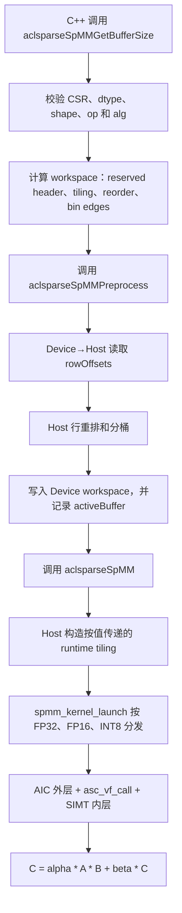
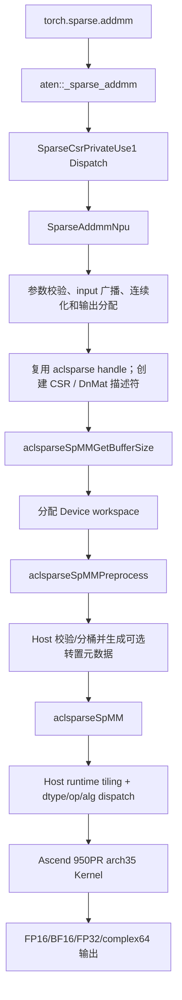
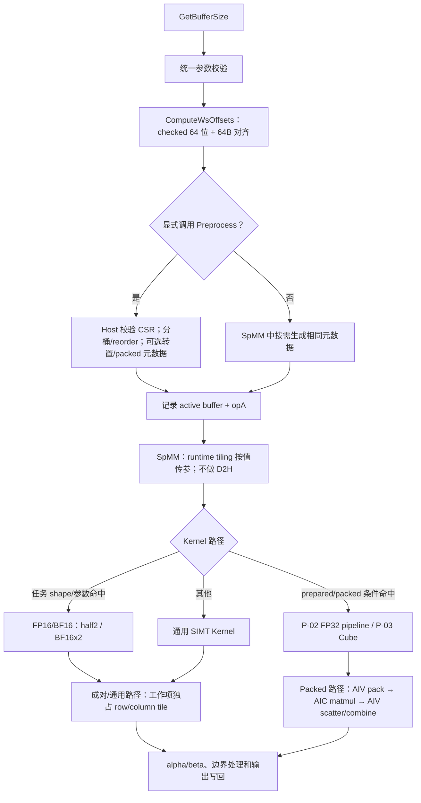

# aclsparseSpMM 算子开发（Ascend 950PR）设计文档

## 需求背景（required）

### 需求来源

本需求来源于《8月社区任务-aclsparseSpMM 算子开发（950）任务书》。任务要求在
[`cann/ops-sparse`](https://gitcode.com/cann/ops-sparse) 已有
`aclsparseSpMM` C++ 接口和 Ascend C Kernel 基础上，完成 Ascend 950PR 的能力补齐，
并实现 PyTorch 2.7 及以上版本、torch_npu 26.0.0 及之后版本的
`torch.sparse.addmm` / `aten::_sparse_addmm` NPU 适配。

任务页：<https://www.hiascend.com/activities/task-center/details/c62841e450064e198c34599c2b31bee5?menu=tasks>。
若本文与任务书或验收附件冲突，以任务页当前正式版本为准。

本任务保持现有公开 ABI，不新增同名接口。调用流程为：

1. `aclsparseSpMMGetBufferSize`：校验参数并返回 workspace 大小；
2. 可选 `aclsparseSpMMPreprocess`：生成可复用的 CSR 元数据；
3. `aclsparseSpMM`：在 handle 当前 stream 上执行
   `C = alpha * op(A) * op(B) + beta * C`。

三个函数的签名、参数顺序和既有枚举数值保持不变。

### 背景介绍

#### 当前实现与验证边界

| 轨道 | 当前状态 | 边界 |
| --- | --- | --- |
| 功能实现 | 本地完成 | 四 dtype、C++/ATen、布局/算法/base、标量与安全回退已落地 |
| A5 自验证 | 已完成 | CANN 9.1.0、PyTorch 2.7.1、torch_npu 2.7.1.post8；精度、P 点、附件 50 条、Profiler 和资源测试结果见可维可测部分 |
| 外部流程 | 未执行 | 未推送、未创建设计/代码 PR、未提交任务中心 |

`torch_npu 2.7.1.post8` 对应官方 `v2.7.1-26.1.0` 配套。P 点结果使用固定规则 CSR；
任务方未提供 A100 同源 fixture，附件 50 条最终否决口径也需在验收前确认。

#### aclsparseSpMM 算子实现信息

| 层级 | 主要路径 | 职责 |
| --- | --- | --- |
| 公开接口 | `include/cann_ops_sparse.h` | SpMM 接口、算法枚举和状态码 |
| 公共状态 | `sparse/common/` | Handle、描述符、pointer mode 和 workspace 状态 |
| A5 实现 | `sparse/spmm/arch35/` | Host、Preprocess、Tiling 与 SIMT/AIV/Cube Kernel |
| PyTorch 适配 | `torch_adapter/` | `_sparse_addmm` NPU 注册与 Tensor 转换 |
| 测试 | `test/spmm/` | C++ 回归、性能和资源边界 |

现有 arch35 实现采用三阶段调用：

1. `GetBufferSize` 根据输出行数和 AIV 核数计算 workspace；
2. `Preprocess` 读取 CSR rowOffsets，在 Host 完成行重排和分桶，再将 reorder、
   bin edges 写入 Device workspace；
3. `SpMM` 在当前 handle stream 上启动 AIC 外层任务，经 `asc_vf_call` 调用 SIMT
   内层函数。每个 SIMT 工作项负责一个输出行的 8 列 tile，串行扫描该行 nnz 并完成
   `alpha * A * B + beta * C`。

#### aclsparseSpMM 现状分析

以 `ops-sparse` master 提交
`c7a02aa95cb28c43aea1326d7e14691b30ed6ad0` 为设计基线，现有支持情况如下：

| 能力 | 当前实现 | 本任务要求 |
| --- | --- | --- |
| 平台 | Ascend 950PR/950DT arch35 | Ascend 950PR |
| 稀疏格式 | CSR | CSR |
| 索引 | rowOffsets/colIndices 均为 int32；仅 base 0 | int32；base 0 和 1 |
| dtype | FP32、FP16、INT8 | FP16、BF16、FP32、complex64 |
| computeType | FP32 或 INT32 | FP16/BF16 使用 FP32；FP32 使用 FP32；complex64 使用 complex64 |
| A 操作 | NON_TRANSPOSE | 按任务书声明的合法 NON_TRANSPOSE/TRANSPOSE/CONJUGATE_TRANSPOSE 组合 |
| B 操作 | NON_TRANSPOSE、TRANSPOSE | 合法 NON_TRANSPOSE/TRANSPOSE/CONJUGATE_TRANSPOSE 组合 |
| B/C 布局 | Row-major、Column-major | Row-major、Column-major，包含最小 ld 和 padded ld |
| 算法 | DEFAULT、CSR_ALG1、FP32 高精度扩展 | DEFAULT、CSR_ALG1、CSR_ALG2、CSR_ALG3，并保留旧扩展兼容 |
| alpha/beta | Host `float`/`int32`，写入 tiling | Host/Device pointer mode；complex64 标量 |
| 空输入 | DnMat 描述符拒绝零维 | 零 nnz、空行和零长度维度 |
| Python/ATen | 无 | `aten::_sparse_addmm` SparseCsrPrivateUse1/NPU 注册 |
| 测试 | FP32、FP16、INT8 单一可执行程序 | Python E2E、C++ API、Kernel、异常、资源、精度、性能 |

现有代码可以复用 CSR 描述符、DnMat 描述符、handle/stream、workspace 基础布局、
行重排、分桶、Row/Column-major 寻址、beta=0 快路径、FP32/FP16 模板和 FP32 Kahan
路径。不能直接复用的部分包括复数乘加、BF16 转换、base 1 寻址、共轭转置、完整
算法白名单以及 Python/ATen 适配。

#### aclsparseSpMM 设计基线流程图



现有主流程的主要缺口为：

1. `IsSupportedSpmmDtypeCombo` 没有 BF16 和 complex64；
2. tiling 只有两个 `float` 字段，无法表达 complex64 alpha/beta；
3. arch35 入口没有按 handle 的 pointer mode 读取 Host/Device 标量；
4. `opB=TRANSPOSE` 已开放，但维度校验仍按未转置 B 的 rows/cols 计算；
5. Kernel 未对 base 1 的 rowOffsets/colIndices 做减基址处理；
6. `SpMM` 刷新 active tiling 时存在 Device→Host 回读，不满足主执行路径全异步要求；
7. Python 官方接口没有注册到 SparseCsrPrivateUse1，任务附件直接调用
   `torch.sparse.addmm` 时不会命中当前 C++/Kernel 实现。

#### aclsparseSpMM 功能分析

SpMM 的 C++ 语义为：

```text
C = alpha * op(A) * op(B) + beta * C
```

Python/ATen 语义为：

```text
out = beta * input + alpha * (mat1 * mat2)
```

其中：

- `input/self` 为可广播到 `[M,N]` 的稠密 Tensor；
- `mat1/A` 为 `[M,K]` CSR Tensor；
- `mat2/B` 为 `[K,N]` 稠密 Tensor；
- `out/C` 为 `[M,N]` 稠密 Tensor；
- Python 路径只构造 `opA=NON_TRANSPOSE`、`opB=NON_TRANSPOSE` 的调用；
- C++ 公共接口还需对任务书声明的合法转置、共轭、布局和算法组合给出确定行为。

对 complex64 元素：

```text
(ar + i*ai) * (br + i*bi)
= (ar*br - ai*bi) + i*(ar*bi + ai*br)
```

复数 alpha/beta 继续按相同公式与累加结果和 C 相乘。共轭转置在转置寻址后对元素
虚部取反；实数 dtype 的 CONJUGATE_TRANSPOSE 与 TRANSPOSE 等价。

## 需求分析（required）

### 需求描述

在保持现有 `aclsparseSpMM*` 函数签名和已发布枚举数值兼容的前提下，为 Ascend
950PR 补齐 FP16、BF16、FP32、complex64 的 CSR SpMM 能力；实现 Python/ATen NPU
注册、广播、非连续输入、Host/Device 标量、布局、算法、转置、共轭、零输入和异常
语义；核心计算全部在 NPU 执行，不允许 CPU fallback；精度和性能达到任务书标准。

### 需求拆解

| 编号 | 任务要求 | 设计落点 | 验证入口 |
| --- | --- | --- | --- |
| RQ-01 | `torch.sparse.addmm` 命中 NPU | SparseCsrPrivateUse1 注册和扩展加载 | Dispatch/Profiler、Python E2E |
| RQ-02 | Python 语义与 PyTorch 2.7+ 一致 | shape/dtype/device/广播/异常校验 | Python 参数矩阵 |
| RQ-03 | 复用三阶段 C++ 接口 | 保持函数签名，扩展内部校验和 dispatch | C++ API UT |
| RQ-04 | 四 dtype 全链路 | descriptor、Host、tiling、Kernel、ATen | C++/Python/精度测试 |
| RQ-05 | complex64 复数乘加 | 双 FP32 分量累加、复数标量 | complex128 CPU Golden |
| RQ-06 | Row/Column-major 和 padded ld | 统一 B/C address accessor | C++ 布局矩阵 |
| RQ-07 | 合法 opA/opB/alg 组合 | 支持矩阵和转置遍历元数据 | C++ 操作矩阵 |
| RQ-08 | CSR int32、base 0/1 | 描述符校验、Kernel 减基址 | base 交叉用例 |
| RQ-09 | 动态 M/K/N/nnz | checked arithmetic、动态 tiling | 泛化用例 |
| RQ-10 | 零 nnz、空行、零长度维度 | Host 早返回和 beta-only 路径 | 边界用例 |
| RQ-11 | 非连续稠密 Tensor | ATen 连续化和广播副本 | Python view 用例 |
| RQ-12 | Host/Device pointer mode | runtime scalar 来源标记和 Kernel 读取 | C++ pointer mode 用例 |
| RQ-13 | 调用方 stream、无无关同步 | async memcpy、当前 stream launch | 非默认 stream/Profiler |
| RQ-14 | 确定性 | 输出元素单写者；ALG3 固定顺序 | 100 次 bit-wise 重复 |
| RQ-15 | 输入只读和边界安全 | const descriptor、checked offset、padding sentinel | C++ guard 用例 |
| RQ-16 | 资源无泄漏 | RAII、循环创建/执行/销毁 | 内存稳定性用例 |
| RQ-17 | 原能力不回退 | arch35 FP32/FP16/INT8 回归；A2/A3 合入后再做共享代码集成回归 | 当前 A5 原测试；未来 PR 集成门禁 |
| RQ-18 | 达到任务书明确的 A100 性能门槛 | CANN 9.1 成对向量入口、Preprocess 证明后的 Cube/P02 pipeline 与安全回退 | P-01/P-02/P-03 八个 dtype 点 |
| RQ-19 | 全量执行官方附件性能用例并保留可分析证据 | 统一 Event/Profiler 口径、按 case ID 对齐 A100 baseline | 附件 50 条逐 case 倍率与 raw trace |

### 接口与参数分析

#### Python/ATen 接口

```python
torch.sparse.addmm(input, mat1, mat2, *, beta=1, alpha=1) -> Tensor
```

```text
aten::_sparse_addmm(
    Tensor self,
    Tensor mat1,
    Tensor mat2,
    *,
    Scalar beta=1,
    Scalar alpha=1
) -> Tensor
```

| 参数 | 约束 | 处理 |
| --- | --- | --- |
| `input/self` | strided；可广播到 `[M,N]`；与其他输入同 dtype/device | beta 非零时广播并复制到输出；beta 为零时只校验元数据，不读取数值 |
| `mat1` | CSR、二维 `[M,K]`；values 为四种 dtype；crow/col 为 int32 | 直接建立 const CSR 描述符，不转 Dense |
| `mat2` | strided、二维 `[K,N]`；同 dtype/device | stride 不能直接表达时生成连续副本 |
| `alpha` | 实数 dtype 接受实数；complex64 接受实数或复数 | 转换为 computeType，实数 dtype 拒绝非零虚部 |
| `beta` | 规则同 alpha | beta=0 走不读 input/C 的路径 |
| `out` | `[M,N]`、同 dtype/device、Dense | 由适配层分配，交给 aclsparse C 描述符 |

Python 路径不执行 Tensor dtype 提升。`input`、`mat1.values()` 和 `mat2` dtype 必须
相同；跨 device、维度不匹配、广播失败和不支持 layout 均在启动 Kernel 前报错。

#### C++ dtype 组合

| A values | B | C | computeType | 累加类型 |
| --- | --- | --- | --- | --- |
| `ACL_FLOAT16` | `ACL_FLOAT16` | `ACL_FLOAT16` | `ACL_FLOAT` | FP32 |
| `ACL_BF16` | `ACL_BF16` | `ACL_BF16` | `ACL_FLOAT` | FP32 |
| `ACL_FLOAT` | `ACL_FLOAT` | `ACL_FLOAT` | `ACL_FLOAT` | FP32 |
| `ACL_COMPLEX64` | `ACL_COMPLEX64` | `ACL_COMPLEX64` | `ACL_COMPLEX64` | complex64，两路 FP32 |

现有 INT8→INT32 组合继续保留兼容，但不作为本社区任务新增验收类型。

#### 操作、布局和算法矩阵

| 算法 | opA | opB | B/C order | 说明 |
| --- | --- | --- | --- | --- |
| DEFAULT | N/T/C | N/T/C | Row/Column | FP16/BF16 混合精度优先 ALG3；FP32/complex64 按布局选择 ALG1/ALG2 |
| CSR_ALG1 | N/T/C | N/T/C | Row/Column | 列主访问优先；Preprocess 可复用 |
| CSR_ALG2 | N/T/C | N/T/C | Row/Column | 行主访问优先 |
| CSR_ALG3 | 仅 N | N/T，不支持 C | Row/Column | 确定性；Preprocess 可复用 |
| 既有 FP32 高精度扩展 | 仅 N | N/T | Row/Column | 保持数值兼容；FP32 Kahan |

`N/T/C` 分别表示 NON_TRANSPOSE、TRANSPOSE、CONJUGATE_TRANSPOSE。实数 dtype 的
C 与 T 计算相同，但仍按枚举合法性进入统一校验。布局是性能偏好而不是功能限制：
ALG2 优先 Row-major，ALG1 优先 Column-major；合法但非优选组合仍需返回正确结果。

有效逻辑维度按操作后 shape 计算：

```text
aRows = opA == N ? A.rows : A.cols
aCols = opA == N ? A.cols : A.rows
bRows = opB == N ? B.rows : B.cols
bCols = opB == N ? B.cols : B.rows

require aCols == bRows
require C.rows == aRows
require C.cols == bCols
```

#### 错误处理顺序

三个 C++ 入口共用相同的基础校验，避免不同阶段对同一非法输入返回不同结果：

1. 输出指针（如 `bufferSize`）和 handle；
2. matA/matB/matC 描述符及其内部指针；
3. CSR 格式、int32 索引和 base 0/1；
4. dtype/computeType 组合；
5. opA/opB/alg 白名单；
6. order、ld、操作后的维度关系；
7. M/K/N/nnz、workspace offset 和乘法的溢出；
8. 所需 workspace 非零时 externalBuffer 是否为空；
9. pointer mode 与 alpha/beta 指针。

Host 可见的非法参数不启动 Preprocess 或 SpMM Kernel。第一阶段实现沿用现有 Host 预处理：
同步读取 rowOffsets/colIndices，检查 offset 单调性、末尾 nnz 和列索引范围，再生成行重排；
因此非法索引能返回确定错误，但显式 Preprocess 阶段存在 D2H/H2D。SpMM 热路径的 tiling
改为 kernel 参数按值传递，不再为刷新 alpha/beta、布局或 opB 做 Device→Host 回读。

## 详细设计（required）

### 算子分析

#### 数学公式

对于输出元素 `C[i,j]`：

```text
sum = 0
for p in CSR row opA(A)[i]:
    sum += opA(A)[i,p] * opB(B)[p,j]
C[i,j] = alpha * sum + beta * C[i,j]
```

Python 入口在 C++ 调用前将 `input` 的广播结果作为 C 初值。

#### 支持数据类型

FP16、BF16、FP32、complex64。FP16/BF16 使用 FP32 累加；complex64 的实部和
虚部分别使用 FP32 累加。任务要求的 CPU Golden 类型为：

| NPU dtype | CPU Golden dtype |
| --- | --- |
| FP16 | FP32 |
| BF16 | FP32 |
| FP32 | FP64 |
| complex64 | complex128 |

#### 支持形状

- A/B/C 均按二维矩阵计算；
- M/K/N/nnz 在 int32 索引和 checked workspace 允许的范围内动态变化；
- 支持方阵、长矩阵、宽矩阵、单行、单列、零维长度和零 nnz；
- 支持规则行、空行、长尾行和非均匀行分布；
- B/C 支持最小 ld 与 padded ld；
- Python input 支持 `[M,N]`、`[N]`、`[1,N]`、`[M,1]` 等可广播形状。

### 算子实现

#### 实现方案

##### 3.2.1 整体架构



代码按职责放置：

```text
ops-sparse/
├── include/cann_ops_sparse.h                  # 追加 ALG2/ALG3，保留旧枚举值
├── sparse/common/aclsparse_descr.cpp          # 零维、base 和指针契约
├── sparse/spmm/arch35/
│   ├── spmm.h                                 # tiling、workspace、dtype/op 标记
│   ├── spmm_host.cpp                          # 统一校验、workspace、dispatch
│   ├── spmm_csr_mat.cpp                       # Host 预处理与 workspace 写入
│   ├── spmm_csr_mat.h
│   ├── spmm_kernel.cpp                        # 四 dtype 与操作路径
│   └── spmm_kernel.h                          # Host/Kernel 共用 launch 声明
├── test/spmm/arch35/spmm_test.cpp             # C++ API/Kernel/性能入口
├── test/spmm/README.md
└── torch_adapter/
    ├── setup.py                               # torch_npu NpuExtension
    ├── torch_ops_sparse/__init__.py           # 加载扩展 so
    ├── torch_ops_sparse/csrc/sparse_addmm.cpp # SparseCsrPrivateUse1 适配
    └── test/test_sparse_addmm.py              # Python E2E
```

不把 aclsparse 实现复制到 torch_adapter；适配层只负责 Tensor/描述符转换和生命周期。

##### 3.2.2 Python/ATen 适配设计

PyTorch 的 dispatch key 由 backend component 与 Tensor functionality 组合。`mat1` 是 CSR
Tensor，因此本算子应注册 `SparseCsrPrivateUse1`，不能套用 Dense 自定义算子示例中的
`PrivateUse1`。扩展 so 只给 PyTorch 已有 schema 注册 NPU 实现，不重复定义
`aten::_sparse_addmm`。设计依据为 PyTorch 2.7.1 的
[`DispatchKey.h`](https://github.com/pytorch/pytorch/blob/v2.7.1/c10/core/DispatchKey.h)
和
[`native_functions.yaml`](https://github.com/pytorch/pytorch/blob/v2.7.1/aten/src/ATen/native/native_functions.yaml)，
当前已在 PyTorch 2.7.1、torch_npu 2.7.1.post8、CANN 9.1.0 环境编译并完成 dispatcher
8/8 回归。Ascend/PyTorch 官方配套表将 `2.7.1.post8` 映射到 `v2.7.1-26.1.0`，因此满足
任务书 `torch_npu 26.0.0` 及之后要求。注册方式如下：

```cpp
TORCH_LIBRARY_IMPL(aten, SparseCsrPrivateUse1, m)
{
    m.impl("_sparse_addmm", &SparseAddmmNpu);
}
```

`SparseAddmmNpu` 执行顺序：

1. 使用 `c10::OptionalDeviceGuard` 固定到 mat1 所在 NPU；
2. 检查三输入 device、dtype、layout、rank 和矩阵维度；
3. 读取 CSR crow/col/value Tensor，要求 crow/col 为 int32；
4. 将 mat2 转为可由 DnMat 描述符表达的连续 Row-major Tensor；
5. 计算输出 `[M,N]`，检查 input 广播；
6. 实数 dtype 且 beta 非零时把广播 input 复制到输出；complex64 通过仅供适配层使用的
   `aclsparseSpMMSetAddInput` 内部状态把广播 input 交给 Kernel 融合；beta 为零时分配输出
   但不读取 input；
7. 将 alpha/beta 转为 computeType，complex64 使用两个 FP32 分量；
8. 获取 torch_npu 当前 stream，复用每线程、每设备的 aclsparse handle 并设置该 stream；
9. 用 RAII 创建 const CSR、const DnMat B 和 DnMat C 描述符；
10. 查询并通过 NPU allocator 分配 workspace，执行 Preprocess 和 SpMM；
11. 记录资源的 stream 生命周期，返回输出 Tensor，不在 Host 同步。

`aclsparseDestroy` 会同步 handle 当前 stream。适配层若每次公开调用都创建并立即销毁 handle，
会把异步算子退化为同步。因此实现按线程、按 NPU device 缓存 handle，每次调用只更新当前
stream/pointer mode。handle 故意存活到进程结束，不在 TLS 析构阶段调用已经退出的 TorchNPU
Runtime；这是进程级 Host 资源取舍，不产生每次调用增长。CSR/DnMat 描述符仍按调用 RAII
销毁，Tensor 和 workspace 通过 `NPUCachingAllocator::recordStream` 绑定当前 stream 生命周期。

`aclsparseSpMMSetAddInput` 不写入公开头文件，不改变 `aclsparseSpMM*` 公共 ABI；调用前设置、
调用后立即清空，且 handle 为线程/设备隔离。它只消除 complex64 Python 路径的独立后置 add，
C++ 公共调用者仍按 `C = alpha*A*B + beta*C` 使用原三阶段接口。

扩展 Python 包的 `__init__.py` 使用 `torch.ops.load_library` 加载 so。加载顺序固定为先
`import torch_npu`，再 `import torch_ops_sparse`，使 NPU backend 初始化完成后注册 CSR
实现。自测入口和 ATK executor 在调用 `torch.sparse.addmm` 前显式加载该包，不修改用户
安装的 torch_npu，也不使用 `.pth` 注入或 CPU fallback。

安装后的独立 Python 进程执行以下 dispatcher 验证：

```python
import torch
import torch_npu
import torch_ops_sparse

assert torch._C._dispatch_has_kernel_for_dispatch_key(
    "aten::_sparse_addmm", "SparseCsrPrivateUse1"
)
print(torch._C._dispatch_dump_table("aten::_sparse_addmm"))
```

测试同时覆盖未加载扩展时不得误报 NPU 实现、首次加载成功、重复 import 幂等，以及安装后
不依赖源码目录 `PYTHONPATH`。Profiler 还需证明公开接口实际进入该实现和 arch35 Kernel，
不能只以 dispatch 表存在作为功能通过证据。

Python 适配层对非连续 Tensor 的处理原则：

| Tensor | 处理 |
| --- | --- |
| input 连续且 shape=`[M,N]` | beta 非零时直接复制到输出 |
| input 可广播 | `expand` 后复制到连续输出 |
| input 非连续 | 保持逻辑 stride 语义，复制到连续输出 |
| mat2 连续 Row-major | 直接建立描述符 |
| mat2 非连续/转置 view | 生成连续 Row-major 副本 |
| mat1 CSR | 不转 Dense；只转换不支持的索引 dtype 时明确报错 |

##### 3.2.3 C++ 接口兼容设计

`aclsparseSpMMAlg_t` 的旧数值必须保持：

```text
DEFAULT = 0
CSR_ALG1 = 1
CSR_FP32_HIGH_PRECISION_ALG = 2
```

在枚举末尾追加 CSR_ALG2/CSR_ALG3，不插入旧值之间。函数签名、符号名和三阶段调用
顺序保持不变。

DnMat 描述符允许零长度维度：当逻辑元素数为 0 时 values 可为空；非空矩阵仍要求
values 非空且 ld 满足 order。CSR 描述符创建时补齐 rows/cols/nnz、base、valueType 和
非空指针校验；这些是共享接口改动，需要执行 arch22 及其他描述符回归。

##### 3.2.4 Host Tiling 与 workspace 设计

`SpmmTilingData` 每次由 Host 构造并按值传给 Kernel，字段按职责分组：

| 字段组 | 主要内容 |
| --- | --- |
| 逻辑形状 | M/N/K、nnz、ldb/ldc |
| workspace | reorder、bin、转置和 Cube 区域偏移 |
| 语义 | opA/opB、order、index base、算法、pointer mode |
| 结构统计 | average/max row nnz、packed eligibility/locality、P02 prepared 状态 |
| 标量与广播 | alpha/beta 实虚部、complex add-input 模式和 stride |

源码字段使用 snake_case；dtype 由 `spmm_kernel_launch` 的独立 `dataType` 参数传入。所有大小
与偏移先用 checked 64 位计算，再写入 Kernel 可寻址字段；packed 状态只能由 Preprocess 对
实际 CSR 证明，不能根据 shape 猜测。

workspace 的逻辑布局为：

| 区域 | 内容 | 是否始终存在 |
| --- | --- | --- |
| reserved header | 保留 64B，当前不存 runtime tiling | 是 |
| reorder | logical row → effective row | 是 |
| binEdges | 每个外层 core 的 row 区间 | 是 |
| transRow | opA 转置后的 CSR rowOffsets | opA=T/C |
| transCol | 转置视图中每项的原 A row | opA=T/C |
| transPerm | 转置视图中每项对应的原 values 下标 | opA=T/C |
| cube packed data | 规则 CSR 的打包 values、metadata、窗口首列和临时输出 | 仅 P-02/P-03 规格且 Preprocess 证明 packed 条件 |

所有区域按 64B 对齐。`GetBufferSize`、Preprocess 和 SpMM 共用唯一 workspace 计算函数；
Host 先按 dtype/shape/layout/op/alg 得到 `CubeWorkspaceKind`，再计算 reorder、转置和可选
Cube 区域，避免三处公式漂移。即使 shape 命中 P-02/P-03，Kernel 也必须同时检查 Preprocess
写入的 `packed_eligible`、`packed_max_degree` 和 `packed_locality_128`，否则回退通用路径。

SpMM 三个函数只接收 buffer 指针，但仓库已有 `aclsparseSetWorkspace/GetWorkspace`，handle
可以记录已注册 workspace 的指针和字节数。若 externalBuffer 与 handle 当前登记的 workspace
相同，Preprocess/SpMM 使用登记大小对比 GetBufferSize 所需大小；未注册的任意外部指针仍没有
可移植的物理容量查询方式。自测以四种方式覆盖 workspace 契约：

1. required bytes 非零时，null buffer 返回 `ACL_SPARSE_STATUS_INSUFFICIENT_RESOURCES`；
2. 注册 `requiredBytes-1` 的同一 buffer 时返回 `INSUFFICIENT_RESOURCES`；
3. 精确按 GetBufferSize 分配时，前后 guard/canary 不被改写；
4. ATen 适配层按同一 bufferSize 分配并注册 workspace，不接受调用者自报大小。

未注册的非空短 buffer 不能通过越界探测验证；接口文档继续要求该类 C++ 调用方保证容量。

##### 3.2.5 Preprocess 设计与后续优化边界

当前实现沿用现有 `aclrtMemcpy(...DEVICE_TO_HOST)` 与 Host 预处理：校验 rowOffsets/
colIndices，归一化 base 1，生成贪心分桶；opA=T/C 时生成转置 CSR row/col 和原 values
permutation。对规则 CSR 额外按“每行连续、degree≤32、64 行组列窗口<128”完整验证，
满足时生成 packed reorder/locality 状态；P-02 FP32 还在 Preprocess 写入固定 degree 的
packed values/metadata。所有结果写入 caller workspace，失败时不标记 active。

若 A5 profiling 证明 Preprocess 成为端到端瓶颈，再将以下步骤迁移到 Device：

1. **ValidateAndCount**：读取 rowOffsets/colIndices，减 index base，检查单调性和范围；
   计算每行 nnz/cost，非法输入写 error flag；
2. **BucketCount**：按 nnz 的 `log2` 区间统计固定数量 bucket；
3. **BucketScan**：单个小任务对 bucket count 做前缀和，生成 scatter offset；
4. **BucketScatter**：把 row 写入 reorder；
5. **BuildBinEdges**：根据 row cost 的累计值为可用 AIV 核生成近似均衡区间。

`opA=TRANSPOSE/CONJUGATE_TRANSPOSE` 时增加：

1. 对原 A 的 colIndices 直方图计数；
2. 前缀和生成 `transOffsets`；
3. scatter 生成 `transRows` 和 `transPerm`；
4. 计算转置后 effective row cost，并进入相同分桶流程。

转置视图只保存结构和原 values permutation，不复制 values；通用/转置路径可在 Preprocess
后更新 A values。规则 CSR Cube/P-02 packed 路径会在 Preprocess 中复制或打包 A values，
调用方更新 values 后必须重新执行 Preprocess，不能复用旧 packed 数据。Device 化属于后续
可选优化，不作为当前正确性或验收前提。

##### 3.2.6 active buffer 与 runtime 参数

Preprocess 成功后，matA 只记录一个 active buffer。再次对同一 matA 和新 buffer 预处理时，
新 buffer 成为 active，旧 buffer 变为 inactive。

Preprocess 会修改 matA 的 active 状态，因此同一描述符上的并发 Preprocess/SpMM 不保证线程
安全。多 stream 并发时调用方为每条 stream 创建独立 matA 描述符（可引用同一只读 CSR 数据），
或在 Host 串行化 active 状态更新；不得让两个 stream 竞争同一描述符的 active buffer。

active buffer 中的 reorder/transpose 元数据依赖 A 的 CSR 结构和 opA；规则 CSR packed
区域还依赖 Preprocess 时的 A values。alpha、beta、B/C values、opB、order、ld 和算法在
每次 SpMM 的按值 tiling/launch 中重新给出，不写入 workspace。SpMM 依据
`activeBuffer + activeSpmmOpA` 决定：

- 完全匹配：复用 reorder/transpose 元数据；
- packed 路径更新 A values：调用方先重新执行 Preprocess；
- 不匹配或 inactive：按当前参数走非预处理正确性路径，或重新构建当前 buffer；
- Preprocess 校验失败：不把 buffer 标为 active，并返回执行失败。

Host 每次从描述符重建完整 runtime tiling，并由 launch 参数按值传入，因此主执行路径不再
读回或覆盖 workspace 中的 tiling。

##### 3.2.7 pointer mode 与标量设计

Host pointer mode：

- FP16/BF16/FP32 computeType 为 FP32，alpha/beta 按 `float` 读取；
- complex64 按两个相邻 FP32 分量读取；
- 转换后的实部/虚部写入 runtime tiling。

Device pointer mode：

- Host 不解引用 alpha/beta；
- Kernel launch 额外接收 alpha/beta GM 地址；
- Kernel 在每个外层任务开始时各读取一次标量，并传给 SIMT 子任务；
- 指针由调用方保证在 stream 执行完成前有效。

GetBufferSize 不依赖标量值，但仍校验 pointer mode 和非空指针。Preprocess 不把 Device 标量
同步回 Host。beta=0 的 Device pointer mode 在 Kernel 中判定，仍保证不读取 C 数值。

##### 3.2.8 Kernel dtype 设计

为避免把四种 dtype 塞入大量运行时分支，Host 按 dtype 启动独立入口：

```text
spmm_custom_fp16
spmm_custom_bf16
spmm_custom_fp32
spmm_custom_complex64
```

共同的 `SpmmCsrSimtCompute` 复用 row/order/op/index 访问逻辑，dtype trait 提供：

- `LoadA/LoadB/LoadC`；
- `Zero`；
- `MultiplyAdd`；
- `ScaleAndAccumulate`；
- `StoreC`；
- `Conjugate`。

FP16/BF16 路径读取后转为 FP32 累加，写回时使用目标类型的舍入转换。通用路径已在
CANN 9.0.0-beta.2 与 CANN 9.1.0 完成目标构建和真机特殊值验证；CANN 9.1 低精度路径使用
工具链提供的 `half2`、`bfloat16x2_t` 及成对转换/FMA，CMake 只在解析后的 Toolkit 实际
路径匹配 9.1 时定义 `SPMM_CANN_HAS_HALF2_FMA`。其他版本禁用成对专用入口，并按适用条件
回退通用 SIMT 或低精度 Cube 路径。
FP32 标准路径直接累加，旧高精度算法保留 Kahan 补偿。complex64 使用内部结构：

```cpp
struct SpmmComplex64 {
    float real;
    float imag;
};
```

并对 8 字节布局做编译期断言。Kernel 只依赖两路 FP32 运算，不要求外部 C++
`std::complex` ABI 与 Device 类型一致。

##### 3.2.9 Kernel 寻址与操作设计

统一访问函数按 `order`、`ld` 和 `opB` 计算 B 地址：

```text
if opB == N:
    logical B index = (kIndex, outCol)
else:
    logical B index = (outCol, kIndex)

row-major address = row * ld + col
col-major address = col * ld + row
```

C 地址为：

```text
row-major: outRow * ldc + outCol
col-major: outCol * ldc + outRow
```

opA=N 时从原 CSR rowOffsets/colIndices 遍历；opA=T/C 时从 transOffsets、transRows、
transPerm 遍历。所有 rowOffsets 和 colIndices 在逻辑使用前减 `indexBase`。C 路径对
A value 共轭；opB=C 对 B value 共轭。

##### 3.2.10 分核、长行与列 tile 策略

当前 Host 通过仓库公共 `GetAivCoreCount()` / `GetAicCoreCount()` 获取 block 数，
`GetSpmmBlockDim()==0` 时返回 `ACL_SPARSE_STATUS_ARCH_MISMATCH`，不以固定核数继续运行。
Ascend 950PR Profiler 已用实际 block 数复核 AIV/AIC launch。Host Preprocess 按核数和估算 cost：

```text
rowCost = rowNnz * ceil(N / columnTile)
```

进行分桶和近似均衡。每个外层 core 必须统一执行 `asc_vf_call`；空 bin 传
`rowStart == rowEnd`，不能提前返回，以避免 dav-3510 AIC/AIV dispatch 死锁。

初始列 tile 设计：

| dtype | 初始 columnTile | 原因 |
| --- | ---: | --- |
| FP16/BF16 | 8 | FP32 累加寄存器开销可控，B 行连续读取 |
| FP32 | 8 | 复用现有实现 |
| complex64 | 4 | 每列需要实部/虚部两个累加器 |

单个工作项独占一个 `(effectiveRow, columnTile)`，因此无需对 C 原子累加。长行仍由该
工作项顺序累加，保证 ALG3 bit-wise；ALG1/ALG2 的长行分段只在 A5 profiling 证明为主要
瓶颈后启用。若启用分段，partial sums 使用独立 workspace，最终固定顺序归并；不能通过
不确定 atomic add 破坏 ALG3。

##### 3.2.11 beta=0、空输入和边界路径

| 场景 | 行为 |
| --- | --- |
| M=0 或 N=0 | GetBufferSize 返回 0；Preprocess/SpMM 接受 null buffer 并返回成功，不启动计算 Kernel |
| K=0 或 nnz=0，beta=0 | 输出写零，不读取 A/B/C 原值 |
| K=0 或 nnz=0，beta≠0 | 只执行 `C = beta * C` |
| 空行 | 对该行执行 beta-only，不访问 values/colIndices |
| beta=0 且 C 含 NaN/Inf | 不传播 NaN/Inf |
| alpha=0 | 保持普通乘加语义；是否增加跳读优化由 A5 profiling 决定 |
| 最后一列 tile 不满 | 用边界判断限制 load/store，不写 padding |

所有 `m*n`、`k*n`、`nnz*sizeof(T)` 和 workspace offset 使用 checked 64 位运算；超过
支持范围返回错误，不截断为 int32。

##### 3.2.12 调整后的执行流程



##### 3.2.13 CANN 9.1 规则 CSR 专用路径

专用路径分为两类：

1. **成对向量路径**：P-02/P-03 的 FP16/BF16 在 shape、nnz、op、Row-major、base0、
   Host scalar 及任务 alpha/beta 全部匹配时使用 half2/BF16x2；该路径直接读取 CSR，
   不依赖 packed locality。
2. **Preprocess 证明路径**：P-02 FP32 只有 `prepared_p02` 且最大 degree≤8 时使用预打包
   values/metadata pipeline；P-03 的 Cube 路径还要求列连续、degree≤32，且每 64 行首列
   窗口小于 128。满足后由 AIV 打包、AIC Cube 计算并由 AIV 散射/组合输出。

Cube 代码独立编译，避免与 AIV/SIMT 翻译单元冲突。任一守卫不满足时回退通用 Kernel；
非 CANN 9.1 环境禁用成对入口，并按适用条件使用通用或低精度 Cube 回退。

### 支持硬件

| 支持的芯片版本 | SoC/build 参数 | NpuArch | 涉及勾选 |
| --- | --- | --- | --- |
| Ascend 950PR | `ascend950` | DAV_3510 / arch35 | √ |

arch22 的 A2/A3 SpMM 与 arch35 分目录编译。本任务不修改 arch22 Kernel，但共享头文件、
描述符和测试框架改动必须完成 A2/A3 构建与原用例回归。

### 算子约束限制

1. 仅支持 CSR，不新增 COO、CSC、BSR 或 BLOCKED-ELL。
2. rowOffsets/colIndices 仅支持 `ACL_SPARSE_INDEX_32I` 且二者类型相同。
3. index base 支持 ZERO 和 ONE，不支持 int64 索引。
4. A/B/C dtype 必须是同一种任务 dtype，Tensor 间不做 dtype 提升。
5. Python input/mat1/mat2 必须位于同一 NPU device。
6. B/C 仅支持 Row-major/Column-major，ld 必须满足对应最小值。
7. 只接受本设计支持矩阵中的 op/alg 组合；CSR_ALG3 不支持 opA=T/C 和 opB=C。
8. 不支持未声明的输入覆盖或 in-place 输出；不要求图融合。
9. C++ 接口使用调用方 stream；调用方负责保证输入、输出、标量和 workspace 生命周期。
10. 最大 shape、nnz 和 workspace 受 int32 索引和 checked offset 范围限制。

## 可维可测分析

### 精度标准/性能标准

| dtype | CPU Golden | rtol | atol | 绝对误差硬上限 A | 匹配率 |
| --- | --- | ---: | ---: | ---: | ---: |
| FP16 | FP32 | `2^-9` | `2^-9` | `1e-1` | ≥0.99 |
| BF16 | FP32 | `2^-6` | `2^-6` | `1e0` | ≥0.99 |
| FP32 | FP64 | `2^-10` | `2^-16` | `1e-2` | ≥0.99 |
| complex64 | complex128 | 实/虚部分别按 FP32 | 实/虚部分别按 FP32 | 实/虚部分别按 FP32 | 两部分均≥0.99 |

每个元素同时满足混合容差：

```text
abs(actual - golden) <= atol + rtol * abs(golden)
```

且绝对误差不得超过：

```text
max(A, 32 * ULP(golden))
```

NaN/Inf 按位置和 Inf 符号比较。beta=0 时 input/C 的 NaN/Inf 不传播。ALG3 重复执行
使用 bit-wise 标准；其他算法使用上述混合容差。

#### 官方测试集合（验收主线）

测试以任务书和附件为真源，按以下顺序执行：

1. 原样执行官方 200 条精度 JSON：FP32 100 条、complex64 100 条；
2. 原样执行官方 50 条性能 JSON：FP32 25 条、complex64 25 条，并按 case ID 关联 A100
   NCU Kernel 总耗时；
3. 执行任务书 P-01/P-02/P-03 八个 dtype 固定性能点，结果见下方性能标准；
4. 使用附件提供的 ATK executor、混合容差插件、NPU Event、torch_npu profiler 和 GPU
   baseline，不另建一套主验收协议。

官方 JSON 中的 case id、shape、seed、CSR 生成方式、values、Dense 输入、alpha/beta、
Golden、容差和 A100 baseline 均不修改。执行 JSON 是测试真源，manifest CSV 仅作为可读
索引；补充测试不能替代、删减或改变官方集合。

#### 官方未覆盖项的补充测试

自编测试只补任务书明确要求但官方 200/50 未覆盖的能力，不重复生成另一套大规模随机集：

| 补充类别 | 官方缺口 | 关键断言 |
| --- | --- | --- |
| FP16/BF16 | 官方精度附件只有 FP32/complex64 | FP32 Golden、混合容差、输出 dtype 正确 |
| C++ 三阶段接口 | 官方附件通过 Python 入口调用 | GetBufferSize、可选 Preprocess、SpMM 和返回码正确 |
| 布局/操作/算法 | 官方集合未穷举 C++ 能力矩阵 | Row/Column-major、padding ld、base 0/1、合法 op、ALG1/2/3 正确 |
| 稀疏边界 | 官方集合不覆盖全部接口边界 | nnz=0/1、空行、非均匀/长尾行和零长度行为正确 |
| 异常处理 | 官方附件不是 C++ 负向测试集 | dtype/shape/index/layout/op/alg、null pointer 和 workspace 不足返回稳定错误 |
| 数值专项 | 官方集合缺少部分任务书场景 | complex 标量、beta=0 NaN/Inf、ALG3 100 轮 bit-wise 正确 |
| 安全与资源 | 官方附件不检查缓冲区契约 | 输入只读、输出/workspace canary、1000 次生命周期无留存 |
| 框架与回归 | 官方附件不足以证明所有共享路径 | SparseCsrPrivateUse1 命中、无 CPU fallback、非连续/广播、原 FP32/FP16/INT8 不回退 |

#### 精度与泛化协议

1. 固定源码 commit、CANN、PyTorch、torch_npu、设备型号和测试脚本 hash；
2. 先运行小规模 C++ API/Kernel RED→GREEN，再运行 Python E2E；
3. 运行官方 200 条 ATK 精度用例；
4. 运行 FP16/BF16、base、布局、算法、零维和异常补充用例；
5. 保存 case 参数、CPU Golden、原始 result、汇总日志和截图；
6. complex64 的实部、虚部分别保存最大误差、匹配率和硬上限结果；
7. ALG3 对固定输入连续执行 100 次，逐字节比较输出；
8. 用 Dispatch/Profiler 日志证明 `aten::_sparse_addmm` 命中 NPU Kernel，无 CPU fallback。

#### 性能标准

性能倍率定义为：

```text
performance_ratio = GPU_A100_kernel_total_us / NPU_kernel_total_us
```

| 编号 | M×K×N | dtype | A100 μs | 最低倍率 | NPU 上限 μs |
| --- | --- | --- | ---: | ---: | ---: |
| P-01 | 2708×2708×1433 | FP32 | 87.040 | 1.0 | 87.040 |
| P-02 | 169343×169343×128 | FP16 | 321.536 | 1.0 | 321.536 |
| P-02 | 169343×169343×128 | BF16 | 413.920 | 1.0 | 413.920 |
| P-02 | 169343×169343×128 | FP32 | 204.576 | 1.0 | 204.576 |
| P-03 | 2449029×2449029×256 | FP16 | 25446.496 | 1.0 | 25446.496 |
| P-03 | 2449029×2449029×256 | BF16 | 33704.096 | 1.0 | 33704.096 |
| P-03 | 2449029×2449029×256 | FP32 | 16571.232 | 1.0 | 16571.232 |
| P-03 | 2449029×2449029×256 | complex64 | 38806.400 | 0.8 | 48508.000 |

每个性能 case 至少预热 10 次、正式采样 30 次，报告 P50 和 P90。每个样本在同一 stream
上用设备 Event 包围一次公开调用，并等待结束 Event，避免只测到异步 launch。输入在计时前
生成并搬到 Device；描述符、workspace 和 Preprocess 结果在正式采样期间复用；不包含首次
编译、输入生成、H2D 和无关初始化。一次性 Preprocess 耗时单独报告。报告记录实际 CANN、
driver/firmware、PyTorch、torch_npu、ops-sparse commit、构建模式、设备空闲状态和原始样本。

官方 50 条性能用例按 case ID 与 GPU baseline 对齐；两端必须使用相同 seed、最终 nnz、已排序
且已合并重复坐标的 CSR、values、Dense 输入、alpha/beta 和 computeType。主指标为公开接口
一次调用内的全部 NPU Kernel 总耗时；NPU Event P50/P90 是补充指标，不用 Python wall time
替代 Kernel 指标。

附件 50 条是官方性能用例，必须 50/50 执行、按 case ID 与 A100 基线对齐，并逐项保留
Kernel 总耗时、倍率和 Profiler 证据。低于 1.0/0.8 参考线的条目记为性能差距，不等同功能
或精度失败。任务书正文只在下表 P-01/P-02/P-03 八个 dtype 点逐项给出量化目标；附件
50 条是否逐项作为最终否决条件，在验收前向任务方确认并按确认结果填写失败项说明。

任务书 P-01/P-02/P-03 只给出了 shape、nnz/稀疏度和 A100 时间，没有在任务书正文中给出
完整 CSR 行分布、values、Dense 输入和 seed。相同 shape/nnz 的不同稀疏分布可能产生显著不同
耗时，因此正式倍率必须使用任务方配套 fixture 或经任务方确认的生成规则；只有 shape/nnz
相同的自生成随机矩阵只能作为开发期 profiling，不能直接声称达到给定 A100 标杆。

#### 性能优化策略

1. DEFAULT/ALG1/ALG2/ALG3 继续共用已验证的接口、预处理和通用正确性 Kernel；仅在
   `opA=N`、`opB=N`、B/C Row-major、base 0、Host scalar 和 32 位地址安全时选择现有
   FP32/complex64 专用性能路径；
2. 预处理继续按 row nnz 做贪心分桶，复用 `reorder/binEdge`，不新增 workspace 格式或
   第三方运行时依赖；
3. FP32 按平均 row nnz 使用 chunk 8/4，complex64 使用 chunk 4；未命中 fast path 时走
   通用布局、转置、base 和 pointer-mode Kernel；
4. beta=0、alpha=0、nnz=0 使用不读无关输入的专用分支；
5. active buffer 复用 reorder/transpose 元数据，runtime tiling 每次按值传入 Kernel；
6. 第一阶段显式 Preprocess 为确定校验 Device CSR 索引而做同步 D2H/H2D；SpMM launch 使用
   调用方 stream，主执行路径不做 D2H 或 Host 同步。若 profiling 证明预处理影响目标，再实施
   3.2.5 中的 Device 化方案；
7. 先测 P-01/P-02/P-03 和官方 50 条性能集，再决定是否引入长行 partial sums；
8. 任何性能分支都必须先通过相同 CPU Golden 和原 dtype 回归，不能通过减少 nnz、缩小 shape
   或跳过 beta 语义获得性能结果。

#### 性能方案取舍摘要

开发期候选均先通过正确性回归再比较性能，详细 trace 保存在自测证据中。公开设计只保留
影响最终方案的结论：

| 类别 | 结论 |
| --- | --- |
| 测量口径 | 正式性能统一使用 Release 和 Health=OK；Debug/Alarm 数据仅用于定位 |
| 保留的通用优化 | complex64 自然对齐 `float2/float4` 访存；FP32 高 degree 复用 chunk2；complex64 低 degree 四列复用 |
| 最终专用路径 | FP16/BF16 成对入口按任务 shape/参数守卫；P-02 FP32 packed pipeline 与 P-03 Cube 另要求 Preprocess 结构证明 |
| 缓存/复用候选 | GE-SpMM row-cache、shared-UB、`asc_ldcg` 和 128 列窗口均退化或收益不稳定，撤回 |
| 算术/调度候选 | 显式 `fmaf`、warp 广播和后置 add 理想融合不足以覆盖漂移或主要差距，撤回 |
| 不适用方案 | AIV 整行路径显著慢于 SIMT；4:2 Sparse Cube 不适用于任意 CSR |

最终可追溯的附件 50 条结果为：FP32 平均/中位 `0.993215/0.797285`，8/25 达到 1.0
参考线；complex64 平均/中位 `0.620929/0.541170`，3/25 达到 0.8 参考线。其余条目属于
性能差距，不等同功能或精度失败；是否逐项作为最终否决条件按任务方确认口径执行。

上述探索最终只留下 Release 构建、自然对齐访存和少量有完整守卫的通用调度；规则 CSR
专用实现见详细设计 3.2.13。

#### Ascend 950PR 最终源码实测结果

最终保留源码在 Ascend 950PR、Health=OK、CANN 9.1.0 上使用 DEFAULT 入口执行
`10 warmup + 30 samples`。每次调用使用设备 Event 并同步，描述符/workspace/Preprocess
结果复用，Preprocess 单列：

| case | dtype | NPU 时间上限（μs） | Event median（μs） | Event P90（μs） | 当前规则 CSR 结论 |
| --- | --- | ---: | ---: | ---: | --- |
| P-01 | FP32 | 87.040 | 47.629 | 48.193 | 达到时间上限 |
| P-02 | FP16 | 321.536 | 206.066 | 208.798 | 达到时间上限 |
| P-02 | BF16 | 413.920 | 214.607 | 218.816 | 达到时间上限 |
| P-02 | FP32 | 204.576 | 188.044 | 189.963 | 达到时间上限 |
| P-03 | FP16 | 25446.496 | 22164.695 | 22284.182 | 达到时间上限 |
| P-03 | BF16 | 33704.096 | 15623.802 | 15665.708 | 达到时间上限 |
| P-03 | FP32 | 16571.232 | 15974.599 | 16048.126 | 达到时间上限 |
| P-03 | complex64 | 48508.000（A100 38806.400 / 0.8） | 44128.812 | 44153.145 | 达到时间上限 |

重启前一轮、重启后两轮均达到上表时间上限，最小 P90 余量为 P-03 FP32 约 2.7%。
P-02 FP16 的单次 `0+1` 严格混合容差通过。由于任务方未提供 A100 同源 P 点 fixture，
表中结论明确限定为固定、列有序、去重的规则 CSR。

Device Event 数据用于报告 10+30 稳定性，并包含公开调用内的 Kernel 执行和调度间隙；正式
主指标仍使用同一公开调用范围内的 Profiler Kernel 总耗时。同一源码的 C++、TorchNPU 8/8、
四 dtype 精度、ALG3 100 轮、边界/资源和 NPU Profiler
均通过；证据归档 SHA-256 为
`7cb9cadcd5f1f9d2371bfc413722dc0a3ec090d250dd3568d7464ca833f1d516`。

### 兼容性分析

1. `aclsparseSpMM*` 签名、符号和旧枚举值保持不变；ALG2/ALG3 只在枚举末尾追加。
2. 原 FP32/FP16/INT8 路径保留；arch22/arch35 分目录编译，公共代码变化在代码 PR 阶段执行
   双架构构建与原用例回归。
3. Python 只注册 `SparseCsrPrivateUse1`，不覆盖 CPU/CUDA schema；扩展显式加载，不修改
   torch_npu 安装目录。
4. 具体能力以 CANN 9.1.0 目标头文件、Release 构建和 Ascend 950PR 真机结果为准；旧 Toolkit
   缺少的 half2/BF16 成对能力由编译期守卫回退。

### 风险与降级预案

| 风险 | 处理与降级 |
| --- | --- |
| P 点原始 fixture 缺失、附件 50 条最终判定口径未确认 | 当前结果明确标注输入与倍率口径；验收前取得任务方确认，获得同源 fixture 后按原参数复测 |
| 规则 CSR 快路径误命中 | Preprocess 完整验证连续列、degree 和 64 行组局部窗口；任一条件不满足立即回退通用 Kernel |
| A2/A3 先合入导致公共 Host/描述符变化 | 基于最新 master 重放改动，合并共享逻辑并执行 arch22/arch35 构建和原用例回归 |
