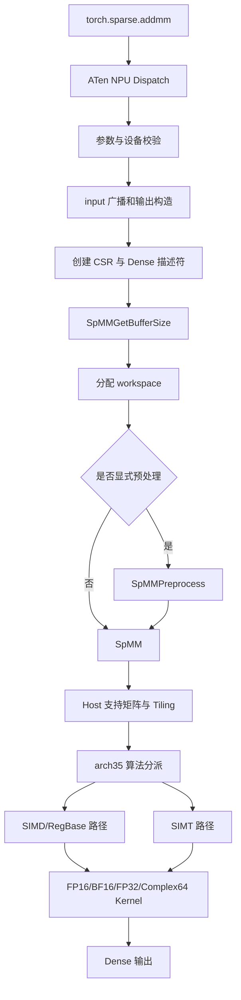
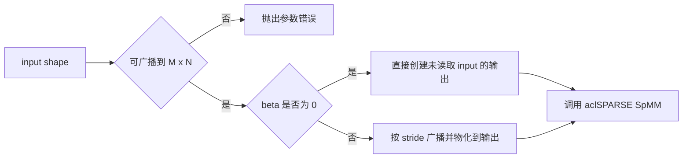

# aclsparseSpMM 算子设计文档

# 一、需求背景（required）

## 1.1 需求来源

稀疏矩阵乘稠密矩阵是图计算、推荐系统、稀疏神经网络和科学计算中的基础运算。
本设计面向昇腾 950PR，参考 PyTorch `torch.sparse.addmm` 与
`aten::_sparse_addmm` 的接口行为，复用 aclSPARSE 已有 SpMM 三阶段接口，补齐
Python/ATen、Host、预处理、Ascend C Kernel、测试和性能能力。

Python/ATen 行为以 PyTorch 2.7 及以上版本为准。C++ 接口的调用阶段、矩阵描述符、
工作空间、算法和错误处理与通用稀疏计算接口保持一致。核心计算全部在 NPU 执行，
不使用 CPU fallback。

软件环境适配 PyTorch 2.7 及以上版本、torch_npu 26.0.0 及之后版本，CANN 使用
`ops-sparse` 开源仓指定版本，并在自测报告中记录实际使用的 CANN 版本。

## 1.2 背景介绍

SpMM 的基础计算为：

```text
C = alpha * op(A) * op(B) + beta * C
```

其中 A 为 CSR 稀疏矩阵，B 和 C 为稠密矩阵。Python 公开接口进一步提供可广播的
`input`，其计算语义为：

```text
out = beta * input + alpha * (mat1 * mat2)
```

CSR 只保存行偏移、列索引和非零值，可显著减少稀疏矩阵的存储量。SpMM 的性能取决于
CSR 行分布、索引访问、B 的数据复用、输出列宽和设备并行调度。长短行不均衡会产生
尾部等待；随机列索引会降低 B 的缓存命中；不同稠密布局和转置方式又会改变连续访存
方向。因此需要在接口语义、负载均衡和数据复用之间统一设计。

## 1.3 目标能力

本设计覆盖以下完整链路：

1. `torch.sparse.addmm` 的 NPU 调用；
2. `aten::_sparse_addmm` 的 NPU 注册与参数转换；
3. aclSPARSE Handle、CSR/Dense 描述符和 SpMM 三阶段接口；
4. 昇腾 950PR Host、Tiling、预处理和 Ascend C Kernel；
5. FP16、BF16、FP32、Complex64；
6. C++ 单元测试、Python 端到端测试、精度测试和性能测试。

# 二、需求分析（required）

## 2.1 计算规格

设稀疏矩阵 A 的逻辑形状为 `[M,K]`，稠密矩阵 B 的逻辑形状为 `[K,N]`，输出形状
为 `[M,N]`。Python 接口中 `input` 必须能够按 PyTorch 广播规则扩展到 `[M,N]`。

| 对象 | 形式 | 主要约束 |
| --- | --- | --- |
| input/self | Dense | 可广播到 `[M,N]`，与其他 Tensor 同 dtype、同 NPU |
| mat1/A | CSR | 二维，values 为支持 dtype，两个索引数组均为 int32 |
| mat2/B | Dense | 二维，逻辑形状 `[K,N]`，支持非连续输入 |
| output/C | Dense | `[M,N]`，dtype 和 device 与输入一致 |
| alpha/beta | Scalar | 转换为共同计算 dtype，Complex64 允许复数标量 |

Tensor 间不执行 dtype 提升。实数 Tensor 不接受虚部非零的复数标量。`beta=0` 时仍
校验 input 的形状、dtype 和设备，但不读取 input 数值，input 中的 NaN/Inf 不传播到
输出。

## 2.2 数据类型

| Python/ATen 输入和输出 dtype | 接口枚举 | 累加与标量处理 |
| --- | --- | --- |
| float16 | `ACL_FLOAT16` | FP32 中间累加，按 FP16 写回 |
| bfloat16 | `ACL_BF16` | FP32 中间累加，按 BF16 写回 |
| float32 | `ACL_FLOAT` | FP32 累加，精度路径可采用补偿策略 |
| complex64 | `ACL_COMPLEX64` | 实部、虚部均为 FP32，完成复数乘加和复数标量融合 |

Python/ATen 路径中 input、mat1 values 和 mat2 dtype 必须相同，输出沿用该 dtype。
C++ 接口按任务书指定的 cuSPARSE SpMM 类型表支持以下组合：

| A/B dtype | C dtype | computeType |
| --- | --- | --- |
| `ACL_FLOAT16` | `ACL_FLOAT16` | `ACL_FLOAT` |
| `ACL_FLOAT16` | `ACL_FLOAT` | `ACL_FLOAT` |
| `ACL_BF16` | `ACL_BF16` | `ACL_FLOAT` |
| `ACL_BF16` | `ACL_FLOAT` | `ACL_FLOAT` |
| `ACL_FLOAT` | `ACL_FLOAT` | `ACL_FLOAT` |
| `ACL_COMPLEX64` | `ACL_COMPLEX64` | `ACL_COMPLEX64` |

未列出的 A、B、C 和 computeType 组合返回不支持错误。

Complex64 是必选能力。复数乘法按以下关系展开：

```text
(ar + i*ai) * (br + i*bi)
= (ar*br - ai*bi) + i*(ar*bi + ai*br)
```

共轭操作在参与乘法前改变对应操作数虚部符号。alpha、beta 的实部和虚部参与最终
复数缩放与加法。

## 2.3 稀疏格式、索引与操作

- 稀疏格式只支持 CSR；
- row offsets 和 column indices 必须同时为 int32；
- 支持 zero-based 和 one-based 索引；
- 不支持 int64 索引；
- B/C 支持行主序和列主序；
- leading dimension 必须满足物理布局要求；
- opA、opB、dtype、布局和算法组合使用表驱动白名单；
- 白名单以任务声明的 cuSPARSE 13.3 Update 1 SpMM 支持矩阵为边界；
- 未声明组合返回确定的不支持错误。

Python `mat1 * mat2` 主路径使用 `opA=NON_TRANSPOSE`、
`opB=NON_TRANSPOSE`。C++ 接口保留其公开操作参数语义。CSR_ALG3 只接受 CSR 和
`opA=NON_TRANSPOSE`，且不接受 `opB=CONJUGATE_TRANSPOSE`；其他算法按白名单决定
可用操作和布局。

## 2.4 接口流程

| 阶段 | 接口职责 | 结果 |
| --- | --- | --- |
| GetBufferSize | 校验描述符和组合，计算工作空间 | 返回所需字节数 |
| Preprocess | 分析 CSR 结构，生成架构与算法相关元数据 | 初始化 active workspace |
| SpMM | 校验复用条件，刷新调用参数，启动设备计算 | 异步生成 C |

Preprocess 是可选阶段。同一 CSR 结构重复计算时可复用预处理结果。调用参数与 active
workspace 不一致时，执行路径重新生成所需元数据或返回确定错误，不能静默使用失效
数据。

三个阶段直接复用 `aclsparseSpMMGetBufferSize`、`aclsparseSpMMPreprocess` 和
`aclsparseSpMM` 的现有函数签名，同时复用 Handle、CSR/Dense 描述符及销毁接口。
本任务在既有接口和 Kernel 上补齐 950PR 能力，不新增同名接口，也不建立第二套 SpMM
源码目录。公共 Host 逻辑与架构相关实现分层，保证 A2/A3 和 950 路径能够在同一主干
共存。

## 2.5 需求拆解

1. Python/ATen 层：注册、参数校验、广播、非连续 Tensor 规整、描述符构造与输出创建；
2. 公共 Host 层：接口校验、支持矩阵、工作空间、stream 和资源生命周期；
3. 预处理层：CSR 统计、行分桶、负载均衡和算法元数据；
4. Kernel 层：按布局和操作读取 A/B，完成四种 dtype 的乘加与写回；
5. 性能层：针对行分布和 N 维宽度选择 SIMD/RegBase/SIMT 路径；
6. 测试层：覆盖功能、异常、精度、性能、资源、确定性和无 CPU fallback。

# 三、详细设计（required）

## 3.1 总体架构



Python/ATen 层只负责语义转换和资源组织，数学核心由 aclSPARSE 与 Ascend C Kernel
完成。公共 Host 逻辑与 arch35 设备逻辑分离，以便 A2/A3 和 950 实现能够在同一主干
共存。

## 3.2 Python 与 ATen 设计

### 3.2.1 NPU 注册

为 `aten::_sparse_addmm` 注册 NPU 实现。Dispatch 进入后检查三个 Tensor 均位于同一
NPU，mat1 为二维 CSR，mat2 为二维 Dense，并验证 dtype、shape、索引和标量。

注册测试同时检查 Dispatch Key 和 Profiler 记录，确保没有进入 CPU Sparse 实现，也
没有把输入复制到 Host 执行计算。

### 3.2.2 input 广播与输出构造

输出始终是新的 Dense Tensor，不覆盖 input、mat1 或 mat2。



当 input 已具有可直接描述的布局时仍创建独立输出并复制其初值，保持非 in-place
语义。无法直接描述的广播或 stride 通过 NPU Tensor 操作生成连续或可描述副本。
`beta=0` 路径不加载 input 数值，避免 NaN/Inf 传播。

### 3.2.3 非连续 Tensor

mat2 的 stride 能够映射为支持的行主序或列主序和 leading dimension 时直接创建
Dense 描述符；其他合法非连续形式在 NPU 上生成连续副本。input 采用相同原则完成
广播输出初始化。所有复制均在调用 stream 上异步执行。

### 3.2.4 标量转换

alpha、beta 在适配层转换到共同计算 dtype：

- FP16/BF16/FP32 接受整数或浮点标量；
- 实数 dtype 拒绝虚部非零的复数标量；
- Complex64 接受实数或复数并转换为两个 FP32 分量；
- 转换失败在创建底层资源前返回。

## 3.3 公共 Host 设计

### 3.3.1 统一校验顺序

三个阶段复用同一套基础校验，使相同输入在不同接口返回一致结果：

1. handle、输出参数和描述符有效性；
2. 枚举、矩阵格式、索引类型和索引基数；
3. dtype 与 computeType 组合；
4. op、布局和算法白名单；
5. 逻辑维度、物理形状与 leading dimension；
6. 数据指针、workspace 和地址范围；
7. shape、nnz、乘法、加法和对齐计算的溢出检查。

非法索引内容在可安全校验的阶段返回确定错误。Host 不无条件同步设备；需要读取
CSR 统计时由预处理 Kernel 完成，避免把 CSR 复制回 CPU。

### 3.3.2 操作与布局

地址计算由逻辑坐标、order、leading dimension 和 op 共同决定。Host 先验证操作后
的逻辑形状关系，再将已经归一化的布局信息写入 Tiling。

对 `opA=NON_TRANSPOSE`，直接使用 CSR 行结构。若白名单允许 A 的转置或共轭转置，
预处理在 workspace 中建立按输出行访问的转置稀疏视图，再复用行向 SpMM Kernel。
Complex64 共轭在加载 values 时完成，不修改用户输入。

### 3.3.3 工作空间

工作空间包含固定头、Tiling、预处理状态和按算法启用的区域：

```text
| header | tiling | row statistics | row order | bin edges |
| optional transposed CSR view | optional long-row partial sums |
```

每个区域按设备访问要求对齐。所有大小使用宽整数计算并逐步检查溢出。工作空间大小由
shape、nnz、dtype、操作和算法共同决定，不能只按 M 固定估算。

header 保存 workspace 版本、设备、CSR 结构身份、算法和各区域偏移。执行阶段据此判断
预处理结果是否可复用。工作空间不足时返回资源错误，不能越界写入或退化为隐藏分配。

### 3.3.4 标量指针模式

alpha、beta 同时支持 Handle 配置的 Host 和 Device 指针模式：

- Host 模式在接口调用期间读取标量，并在返回前将值固化到本次异步任务的启动参数；
- Device 模式将标量作为同设备地址在当前 stream 上读取，不通过 Device-to-Host 拷贝
  或 Host 同步取得数值；
- 指针模式、标量地址及 dtype 在三个阶段使用统一校验，模式与地址不匹配时返回确定
  错误；
- Preprocess 生成的结构元数据不依赖某次 alpha、beta 数值，SpMM 每次执行都刷新本次
  调用的标量参数。

Python/ATen 的 Scalar 在适配层转换后使用 Host 指针模式进入底层接口。C++ 调用者在
Device 模式下负责保证标量设备内存持续有效，直至对应 stream 上的任务完成。

### 3.3.5 stream 与资源生命周期

GetBufferSize 只处理 Host 元数据。Preprocess 和 SpMM 在 handle 的 stream 上异步
执行，不引入无必要的 Host 或全设备同步。Handle、描述符和 Host 标量必须覆盖接口
读取这些对象的阶段；CSR/Dense 数据、Device 标量、输出及 workspace 必须持续有效，
直至对应 stream 上的异步任务完成。异步任务完成前不得修改其依赖的结构元数据或复用
相关存储。销毁接口只释放其管理的资源，不隐式释放用户数据和 workspace。

## 3.4 预处理设计

### 3.4.1 CSR 统计与分桶

设备侧根据 row offsets 计算每行 nnz，并形成以下类别：

- 空行；
- 短行；
- 常规行；
- 长行和极长行。

分类阈值结合 dtype、N、可用核心数、UB 和算法确定。预处理输出按类别保存行号和
分区边界，Kernel 不在热循环中重复判断全部行类型。

### 3.4.2 负载模型

单行工作量近似为：

```text
rowNnz * ceil(N / columnTile)
```

调度同时考虑索引遍历和输出列块，避免只按行数均分。常规行采用加权分箱，长行按
列块或 nnz 段进一步切分。确定性路径使用固定分区与固定归约顺序，重复执行得到
bit-wise 稳定结果。

### 3.4.3 转置稀疏视图

当公开支持矩阵允许 opA 转置时，预处理执行计数、前缀和与稳定散射，生成可按输出行
访问的转置视图。原始 row offsets、column indices 和 values 保持只读。Complex64
共轭转置只在计算加载时改变虚部符号，转置视图可与普通转置共用。

## 3.5 arch35 Kernel 设计

### 3.5.1 自适应执行策略

昇腾 950PR 支持 SIMD、RegBase 和 SIMT。不同 CSR 分布和 Dense 布局采用不同路径：

| 场景 | 首选路径 | 设计重点 |
| --- | --- | --- |
| 行主 B/C、N 较宽、短或常规行 | RegBase/SIMD | A 索引和值复用，连续向量读取 B |
| 列主布局或不规则地址映射 | SIMT | 线程级地址计算与延迟隐藏 |
| 长行 | 分段 RegBase 或 SIMT | 固定顺序局部累加与归约 |
| 极小 shape/nnz | 小任务路径 | 减少启动核数与预处理开销 |

算法选择只决定任务书允许范围内的实现策略，不改变公开计算语义。

### 3.5.2 行主向量路径

对 A 的一行和一段输出列，先初始化本地累加向量。遍历该行的非零元素时，A 的 value
只加载一次，并根据 column index 连续读取 B 的一段列数据，再执行向量乘加。这样可
在一个列 tile 内复用 CSR 索引和值。

N 维 tile 根据 dtype、累加缓冲、双缓冲和 UB 容量选择。FP16/BF16 读取后扩展为
FP32 累加；FP32 直接累加；Complex64 使用实部和虚部两个 FP32 累加向量。

### 3.5.3 SIMT 路径

SIMT 线程映射到“行或行段 × 输出列”。每个线程负责唯一输出位置或固定列组，在本地
遍历 CSR 段。线程级地址计算适合列主布局、转置和随机索引，能够用大量并发隐藏 GM
访问延迟。

同一输出元素只由一个任务负责时直接写回。长行拆段时先写入 workspace 的局部结果，
再由固定顺序归约 Kernel 合并，避免不确定的浮点原子加。

### 3.5.4 数据读取与缓存复用

性能关键是减少以下重复流量：

- 同一列 tile 中重复加载 row offsets、column indices 和 A values；
- 过小列块导致对同一 CSR 行反复扫描；
- B 的连续段没有合并读取；
- `beta=0` 仍读取 C；
- 预处理结果在重复执行中被重建。

Host 根据 N、dtype 和行分布选择列 tile。Kernel 将连续 B 数据以对齐批量方式搬入
本地存储，并在计算与搬运之间流水。P-01 的小 nnz/宽 N 优先减少启动与重复扫描，
P-02/P-03 优先提高 CSR 与 B 复用并保持满核负载。

### 3.5.5 数值路径

FP16 和 BF16 在 FP32 中完成乘积累加及 alpha/beta 融合，最后转换写回。FP32 默认
使用稳定的固定顺序累加；精度要求较高或长行场景可选择分块对消或补偿累加策略。

Complex64 每个输出维护实部和虚部累加：

```text
real += ar * br - ai * bi
imag += ar * bi + ai * br
```

完成 K 维累加后再执行复数 alpha 缩放和 beta*C 融合。`beta=0` 分支不读取 C。
共轭操作只改变对应输入虚部符号，原始输入保持只读。

### 3.5.6 写回与边界

输出地址由 C order 和 ldc 计算。尾列使用有效元素掩码，不写 padding 或相邻内存。
空行直接生成 beta*C；nnz=0 时使用专用缩放/清零路径；零长度输出不启动无意义计算。

## 3.6 算法语义

| 算法 | 布局与操作约束 | 确定性 |
| --- | --- | --- |
| DEFAULT | 在任务书声明的合法组合中选择实现 | 取决于实际选择的算法 |
| CSR_ALG1 | 优先列主路径；opA/opB 使用任务书指定支持矩阵 | 不保证 bit-wise 一致 |
| CSR_ALG2 | 优先行主路径；opA/opB 使用任务书指定支持矩阵 | 不保证 bit-wise 一致 |
| CSR_ALG3 | 仅 CSR，opA 必须为非转置，opB 不支持共轭转置 | 保证 bit-wise 一致 |

支持矩阵集中定义并由三个 C++ 阶段共用。算法不支持某个 dtype、布局或操作时返回
明确错误，不静默切换到语义不同的路径。各算法所需 workspace 均由
GetBufferSize 查询，Preprocess 和 SpMM 使用同一组合校验结果。

## 3.7 异常与边界处理

| 类别 | 返回与处理策略 |
| --- | --- |
| 空 Handle | `ACL_SPARSE_STATUS_HANDLE_IS_NULLPTR` |
| 空描述符、空必需指针、shape 或 leading dimension 非法 | `ACL_SPARSE_STATUS_INVALID_VALUE`，在 Kernel 启动前返回 |
| 非 CSR 格式 | `ACL_SPARSE_STATUS_MATRIX_TYPE_NOT_SUPPORTED` |
| int64 索引、不支持的 dtype/op/layout/algorithm 组合 | `ACL_SPARSE_STATUS_NOT_SUPPORTED` |
| CSR 越界、row offsets 非单调或末项与 nnz 不一致 | `ACL_SPARSE_STATUS_INVALID_VALUE` |
| workspace 不足 | `ACL_SPARSE_STATUS_INSUFFICIENT_RESOURCES`，不隐藏分配或越界访问 |
| Runtime 或 Kernel 启动失败 | `ACL_SPARSE_STATUS_EXECUTION_FAILED` |
| size/offset 溢出 | 在整数窄化和地址计算前返回确定错误 |
| nnz=0、空行、零长度 | 合法输入，按数学语义执行专用路径 |

连续创建、执行和销毁描述符不会泄漏 Host 或 Device 资源。异常路径不修改只读输入，
也不越过输出和 workspace 边界。

CSR row offsets 和 column indices 均使用 int32。base 0 时 `nnz` 不超过
`INT32_MAX`；base 1 时末端 row offset 为 `1+nnz`，因此 `nnz` 不超过
`INT32_MAX-1`。M、K、N、leading dimension、归一化索引和 Tiling 字段在窄化前检查
int32 表示范围；storage 字节数、workspace 各分区及地址乘加同时检查 `size_t` 和设备
可寻址范围。实际可运行规模还受 950PR 可用设备内存和单次内存分配上限约束。

## 3.8 支持硬件

| 产品 | 架构 | 支持状态 |
| --- | --- | --- |
| 昇腾 950PR | DAV-3510 / arch35 | 支持 |

公共 Host 逻辑不硬编码 950 核数或内存容量，通过平台接口获取设备能力。arch35 的
SIMT/RegBase 实现保持在架构专用分支中，避免影响 A2/A3 的 arch22 实现。

# 四、可维可测分析

## 4.1 功能测试

功能测试按 Python/ATen、C++ API 和 Kernel 三层组织：

1. 方阵、长矩阵、宽矩阵及动态 M/K/N/nnz；
2. FP16、BF16、FP32、Complex64；
3. alpha/beta 为 0、1、普通实数和 Complex64 复数；
4. nnz=0/1、空行、短行、长行和长尾分布；
5. B/C 行主、列主、最小 leading dimension 和 padding；
6. 支持矩阵允许的 opA/opB/algorithm 组合；
7. 显式 Preprocess、隐式准备和 active workspace 重复复用；
8. input 广播与 input/mat2 非连续 Tensor；
9. 非法维度、dtype、设备、索引、布局、操作、算法和 workspace；
10. 输入只读、输出边界、workspace 边界、资源释放和异步 stream。

## 4.2 精度测试

精度使用 CPU 单标杆和混合容差：

| NPU dtype | CPU Golden | rtol | atol | 绝对误差参数 A |
| --- | --- | --- | --- | --- |
| FP16 | FP32 | `2^-9` | `2^-9` | `1e-1` |
| BF16 | FP32 | `2^-6` | `2^-6` | `1e0` |
| FP32 | FP64 | `2^-10` | `2^-16` | `1e-2` |
| Complex64 | Complex128 | 实虚部分别使用 FP32 参数 | 实虚部分别使用 FP32 参数 | `1e-2` |

逐元素使用 `|actual-golden| <= atol + rtol*|golden|` 判断，匹配率不低于 0.99，
且每个元素的绝对误差不超过 `max(A, 32 * ULP(golden))`。Complex64 的实部和虚部
分别验收。普通值、小值、正负混合、零值、离群值和允许的 Inf/NaN 均纳入测试。

官方提供的 200 条精度用例完整执行。其未覆盖但任务书强制的 dtype、布局或接口场景
使用补充用例覆盖，补充结果不能替代官方结果。

## 4.3 性能测试

正式性能采集复用描述符、workspace 和 preprocess 结果。每个 case 至少预热 10 次，
正式采样 30 次，报告中位数和 P90。Kernel 主耗时不包含首次编译、数据生成、H2D、
描述符创建和 preprocess；这些耗时作为补充项单独记录。

| 场景 | 规模与类型 | 950PR 目标 |
| --- | --- | --- |
| P-01 | `2708 x 2708 x 1433`，nnz 10556，FP32 | 不慢于 87.040 微秒 |
| P-02 | `169343 x 169343 x 128`，nnz 1166243，FP16/BF16/FP32 | 分别不慢于 321.536/413.920/204.576 微秒 |
| P-03 | `2449029 x 2449029 x 256`，nnz 61859140，FP16/BF16/FP32 | 分别不慢于 25446.496/33704.096/16571.232 微秒 |
| P-03 Complex64 | 同 P-03 | 性能不低于 A100 的 0.8 倍，即不慢于 48508 微秒 |

输入 CSR 固定排序并合并重复坐标，values、Dense Tensor、alpha/beta 和 computeType
与 A100 基线保持一致。官方 50 条性能用例完整执行，并通过 Profiler 汇总一次公开
接口调用的全部 NPU Kernel 时间。

性能分析至少记录：

- 各 Kernel 时间及调用次数；
- AIV 利用率和核间尾部差异；
- GM/L2/UB 数据流及 B 复用情况；
- 预处理一次性耗时；
- Python 端到端和 C++ 执行阶段补充耗时；
- median、P90 和相对 A100 倍率。

## 4.4 NPU 执行证明

Dispatch 记录确认 `aten::_sparse_addmm` 命中 NPU 注册。Profiler 记录确认核心乘加由
arch35 Ascend C Kernel 完成。测试报告同时保存调用栈或算子列表、Kernel 统计和原始
Profiler 结果，证明不存在 CPU fallback。

## 4.5 确定性与稳定性

确定性算法采用固定分桶、固定分段和固定归约顺序，并通过同输入重复执行检查 bit-wise
一致性。其他算法使用混合容差验收。长时间重复创建、执行和销毁用于检查资源泄漏，
错误注入用于检查异常路径不会污染后续调用。

## 4.6 可维护性与兼容性

- Python/ATen、公共 Host 和 arch35 Kernel 分层维护；
- 支持矩阵集中定义，三个 C++ 阶段共享；
- 工作空间使用版本化 header，便于扩展和失效判断；
- dtype、布局和算法使用明确模板或分派，避免热循环中的重复分支；
- 所有缺陷修复保留回归用例；
- 公共 Host 逻辑不依赖单一硬件实现，支持 A2/A3 与 950 路径共存；
- 既有公开 API 签名保持兼容，合法历史行为持续回归。

# 五、风险与规避

| 风险 | 影响 | 规避措施 |
| --- | --- | --- |
| CSR 行分布长尾 | 核间负载不均，P90 增大 | 设备侧分桶、加权分箱、长行分段和固定归约 |
| B 随机访问与 CSR 重复扫描 | 带宽利用率低 | 扩大有效列 tile、复用索引和值、对齐批量读取、利用 L2 |
| P-01 工作量小 | 启动和预处理开销占比高 | 小任务路径、减少启动核数、复用预处理 |
| Complex64 指令数增加 | 精度和性能不达标 | 双 FP32 向量、融合符号处理、实虚部协同分块 |
| 转置和列主地址复杂 | 越界或低效访问 | 统一地址模型、表驱动白名单、专项非方形和 padding 测试 |
| workspace 状态误复用 | 结果错误 | 版本化 header 和 CSR/算法/设备身份校验 |
| Python 路径隐式回退 | 功能通过但不满足任务 | Dispatch 与 Profiler 双重证据 |
| A2/A3 先合入公共 Host | 合并冲突或功能回退 | 公共/架构逻辑解耦，基于最新主干重放并做跨路径回归 |

# 六、交付检查

| 交付项 | 完成标准 |
| --- | --- |
| 设计文档 | 按官方模板评审通过并合入指定目录 |
| Python/ATen | NPU 注册、参数转换、广播和端到端 UT 完整 |
| C++ API | 三阶段接口、描述符、workspace、stream 和错误语义完整 |
| Kernel | 四种 dtype、布局、操作、算法和泛化能力完整 |
| C++ UT | 正向、异常、边界、资源和确定性覆盖完整 |
| 官方精度 | 官方用例全量通过并保留原始结果和截图 |
| 官方性能 | 50 条用例及 P-01/P-02/P-03 达标，保留 Profiler 证据 |
| 无回退证明 | Dispatch 与 Profiler 均确认 NPU 核心计算 |
| 自测报告 | 环境、版本、命令、参数、结果、截图和失败说明可复现 |
| 代码验收 | 私仓分支、固定提交、准确目录和审核访问均通过预检 |

设计评审通过后，实施过程仍以任务书、公开接口兼容性和实测结果为准。算法内部参数
可根据设备 profiling 调整，但不得改变公开语义、支持矩阵和验收口径。
