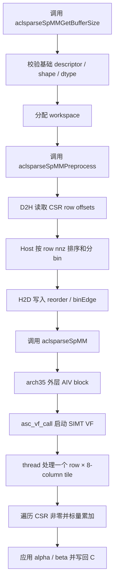
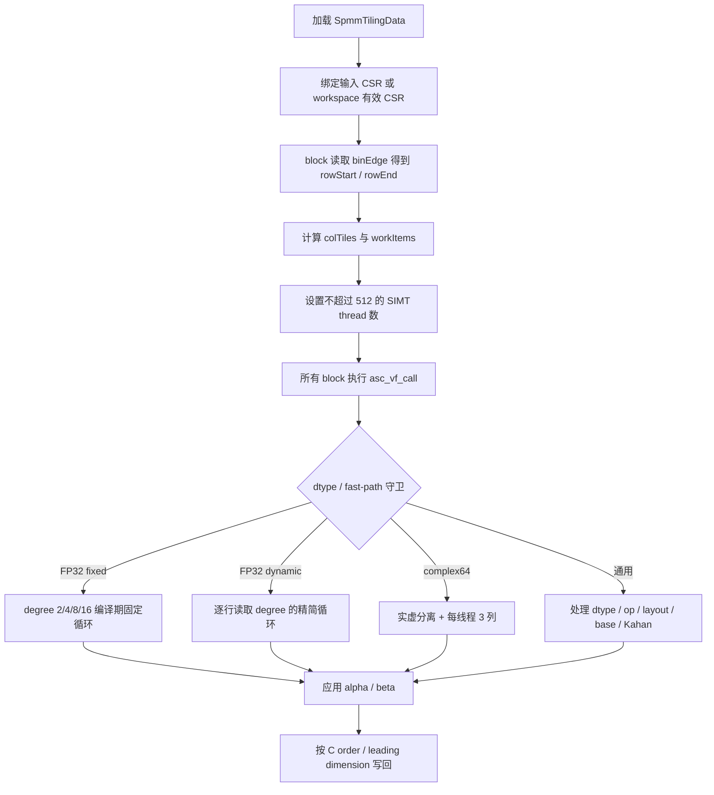
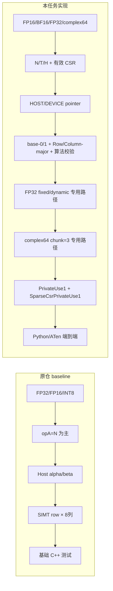

# aclsparseSpMM（Ascend 950PR）算子设计文档

本文档对应 2026 年 8 月社区任务《aclsparseSpMM 算子开发（950）任务书》，按照社区任务算子设计模板编写。若本文与任务书冲突，以活动页面发布的正式任务书为准。

当前状态：功能主链路及公开 FP32/complex64 性能用例已在 Ascend 950PR 真机验证；量化性能仅 2/50 达到 A100 门槛，本文如实记录阶段结果，不作为“性能验收已通过”的声明。

# 一、需求背景

## 1.1 需求来源

任务要求在 Ascend 950PR 上扩展 `ops-sparse` 已有 SpMM 能力，形成以下完整调用链：

```text
torch.sparse.addmm
  -> aten::_sparse_addmm（NPU dispatch）
  -> aclsparseSpMMGetBufferSize / Preprocess / aclsparseSpMM
  -> Ascend C arch35 Kernel
```

Python/ATen 语义以 PyTorch 2.7 及以上版本为准；C++ 接口、描述符、算法及合法组合对齐 CUDA Toolkit 13.3 Update 1 所含 cuSPARSE SpMM 公开语义；NPU 侧核心计算必须在 Ascend C Kernel 中完成，不允许 CPU fallback。

代码提交目标为 `cann/ops-sparse`，设计文档按社区任务流程提交至 `cann/cann-ops-competitions` 对应任务目录，并在代码 PR 中邀请 `Ascend-CANN` 为开发者。

## 1.2 算子功能

设稀疏矩阵 (A\in\mathbb{F}^{M\times K}) 采用 CSR 存储，稠密矩阵 (B\in\mathbb{F}^{K\times N})，输出 (C\in\mathbb{F}^{M\times N})，则：

$$
C = \alpha\,op(A)\,op(B) + \beta C
$$

Python 公共接口为：

```python
torch.sparse.addmm(input, mat1, mat2, *, beta=1, alpha=1) -> Tensor
```

其中 `mat1` 为 CSR，`input` 可按 PyTorch 规则广播到 `[M,N]`。`beta=0` 时不得读取旧 `input/C` 数值，避免其中的 NaN/Inf 传播到输出。

## 1.3 任务范围

| 项目 | 任务要求 |
|---|---|
| 硬件 | Ascend 950PR，arch35 / DAV_3510 |
| 稀疏格式 | CSR |
| CSR index | row offsets、column indices 均为 int32；base 0/1 |
| dtype | float16、bfloat16、float32、complex64 全链路必选 |
| Dense layout | B/C 支持 row-major、column-major及合法 leading dimension |
| operation | 任务书及 cuSPARSE 13.3 Update 1 支持矩阵内的 N/T/H 组合 |
| algorithm | DEFAULT、CSR_ALG1、CSR_ALG2、CSR_ALG3；保留仓内既有 FP32 高精度枚举兼容性 |
| pointer mode | HOST、DEVICE |
| Python | `torch.sparse.addmm` / `aten::_sparse_addmm`，PyTorch 2.7+、torch_npu 26.0.0+ |
| 动态范围 | 不同 M/K/N/nnz、空行、长尾行、nnz=0/1、零长度维度、合法边界输入 |

## 1.4 参考实现现状

本任务没有独立 TBE SpMM kernel 作为对照。设计参考为 `ops-sparse` 原有 Ascend C arch35 SpMM 以及 cuSPARSE/PyTorch API 管线，因此后文以“原仓 baseline”代替 TBE 实现进行流程和差异分析。

原仓 baseline 已具备三阶段 C++ 接口、FP32/FP16/INT8 基础能力、Host 行重排和 arch35 SIMT kernel；主要缺口包括 BF16/complex64、base-1、转置/共轭、完整算法和 pointer mode 语义、Python/ATen 注册、异常测试及任务书量化性能。

### 1.4.1 baseline/API 调用流程图（TBE 参考替代图）



# 二、需求分析

## 2.1 Python/ATen 语义

1. `input`、CSR `mat1`、`mat2` 必须位于同一 NPU，且三者 dtype 一致，不执行 Tensor 间 dtype promotion。
2. `mat1` 和 `mat2` 均按二维矩阵计算，满足有效内维一致；只对 `input` 执行 PyTorch 广播，输出 shape 为 `[M,N]`。
3. CSR Tensor 会贡献 `SparseCsrPrivateUse1` dispatch key，因此同时注册 `PrivateUse1` 与 `SparseCsrPrivateUse1`，防止落入未实现或 CPU 路径。
4. 能用 order/leading dimension 表达的非连续 `mat2` 直接描述；无法直接表达但属于支持范围的输入生成连续副本。
5. 实数 dtype 的 `alpha/beta` 接受可转换实标量；complex64 接受实数或复数并转换为 complex64。

## 2.2 C++ 接口语义

接口签名保持原仓兼容：

```c
aclsparseSpMMGetBufferSize(handle, opA, opB, alpha, matA, matB,
                           beta, matC, computeType, alg, &bufferSize);
aclsparseSpMMPreprocess(handle, opA, opB, alpha, matA, matB,
                        beta, matC, computeType, alg, externalBuffer);
aclsparseSpMM(handle, opA, opB, alpha, matA, matB,
              beta, matC, computeType, alg, externalBuffer);
```

Host 统一校验：handle/descriptor/数据指针、CSR shape/nnz/index type/base、A/B/C dtype 与 computeType、opA/opB、B/C order 和 leading dimension、算法组合、alpha/beta、workspace 及整数乘加溢出。Preprocess 结果允许被后续多次 Execute 复用；descriptor、CSR pattern、shape 或 operation 变化时必须重建，避免陈旧 `reorder` 或有效 CSR。

## 2.3 数据类型与精度模型

| 输入/输出 dtype | 累加/compute | 说明 |
|---|---|---|
| float16 | float32 | 最终转换回 float16 |
| bfloat16 | float32 | 最终转换回 bfloat16 |
| float32 | float32 | 标准路径直接累计；高精度枚举走 Kahan |
| complex64 | 两路 float32 | 实部、虚部分离累计，复数 alpha/beta |

complex64 乘法为：

$$
(a_r+i a_i)(b_r+i b_i)
=(a_rb_r-a_ib_i)+i(a_rb_i+a_ib_r)
$$

`opA=H` 或 `opB=H` 时对对应虚部取负，再进入同一公式。

## 2.4 性能模型与主要矛盾

一个 CSR 行的理论乘加工作量与 `rowNnz × N` 成正比。原始映射让每个 thread 独立计算一个 `row × columnTile`：同一行被不同列 tile 重复读取 row offset、column index 和 sparse value，但每个线程可连续读取 B 的若干列并保留多个累加器。

性能取舍包括：

- 增大列 chunk：增加 CSR 元数据复用，但提高寄存器占用和依赖链长度。
- 减小列 chunk：降低寄存器压力，但重复读取 CSR 元数据和 sparse value。
- 减少 SIMT threads：可能降低调度压力，但削弱 DAV_3510 的延迟隐藏。
- 将整行搬入 UB/RegBase：可能提高片上计算比例，也会引入 GM→UB→Reg staging、同步和标量调度成本。
- 行重排：能改善长尾 CSR 的核间负载；对等 degree 用例无法解决核内计算吞吐瓶颈。

当前 profiler 证据表明 complex64 代表用例 `aiv_vec_ratio=1.0`，MTE2/MTE3/scalar 近零，主要瓶颈是 AIV 计算、寄存器依赖和线程延迟隐藏，而不是传统 DMA 搬运流水。

## 2.5 依赖与兼容性

- CANN Runtime / ACL / Ascend C arch35 编译工具链。
- PyTorch 2.7+、torch_npu 26.0.0+；本阶段实测 PyTorch 2.7.1 与 torch_npu 2.7.1.post8（26.1.0 系列）。
- 与 A2/A3 同仓实现共享 Host/API 文件，950 特化应集中在 arch35 目录及受硬件守卫保护的分支，不改变已有 ABI。
- C++ 接口对齐 cuSPARSE 的声明支持矩阵，但 NPU 实现及错误码保持 aclsparse 体系。

# 三、需求详细设计

## 3.1 总体架构

```text
Python/ATen adapter
    │  参数校验、input 广播、NPU dispatch、descriptor 构造
    ▼
aclsparse C++ API
    │  GetBufferSize -> Preprocess -> Execute
    ▼
Host preprocess / tiling
    │  effective CSR、reorder、binEdge、路径选择、tiling data
    ▼
Ascend C arch35 kernel
       AIV 外层调度 + asc_vf_call + SIMT VF
```

## 3.2 Host 侧设计

### 3.2.1 有效矩阵与 shape

`opA=N` 时直接使用输入 CSR，逻辑行数 (L=M)，内维为 (K)。`opA=T/H` 时 Preprocess 在 workspace 构造 `op(A)` 的 base-0 有效 CSR：

```text
effectiveRowOffsets[L + 1]
effectiveColIndices[nnz]
valuePosition[nnz]
```

其中 (L=K)。`valuePosition[p]` 映射回原始 values 的位置，保证 Preprocess 后修改 values 仍具有正确语义；`opA=H` 在 Kernel 读取原 value 后执行共轭。

当前转置 CSR 构建会同步 D2H 读取 row offsets/column indices、Host 计数与排布、再 H2D 写入 workspace。它优先保证功能正确；最终大规模异步性能版本应参考仓内 `spmv_op/arch35` 改为设备侧 Preprocess。

### 3.2.2 分核与 greedy bin packing

设平台返回的 AIV 核数为 (P)，有效第 (r) 行非零数为 (d_r)。Host 将行按 (d_r) 降序排列，再逐行放入当前累计负载最小的 bin：

$$
b^*(r)=\arg\min_{0\le b<P}\sum_{q\in bin_b}d_q
$$

随后生成：

```text
reorder[logicalRow] = physicalRow
binEdge[b]          = bin b 在 reorder 中的起点
binEdge[P]          = L
```

Kernel 的第 (b) 个 block 处理：

```text
rowStart = binEdge[b]
rowEnd   = binEdge[b + 1]
physicalRow = reorder[logicalRow]
```

由于所有行的 N 相同，用 (d_r) 作为行权重等价于忽略公共系数 `ceil(N/chunk)` 后的主要乘加工作量。若平台无法提供 AIV 数量，Host 使用兼容 fallback；生产环境以平台查询值为准，不把核数硬编码为某一具体 950 子型号。

### 3.2.3 uniform degree 识别与派发

Preprocess 扫描全部有效行：仅当每行 nnz 完全相同，才把该值写入 `uniform_degree`，否则写 0。该字段用于选择 FP32 固定循环和 complex64 规则 CSR 精简路径，不能用平均 degree 代替。

主要 dispatch 条件：

| 路径 | 进入条件 | 列 chunk |
|---|---|---:|
| FP32 NN/RR fixed | FP32 标准算法，opA=N、opB=N，B/C row-major，base-0，degree=2/4/8/16 | 8 |
| FP32 NN/RR regular/dynamic | 同上，degree=32/64 或非规则 CSR | 8 |
| complex64 NN/RR regular | complex64，NN、B/C row-major、base-0、规则 CSR | 3 |
| 通用实数/复数路径 | 转置/共轭、col-major、base-1、高精度、临时有效 CSR等 | 实数 8 / 复数 3 |

### 3.2.4 workspace 规划

所有区域按 64 Byte 对齐，布局为：

```text
[reserved header: 64B]
[SpmmTilingData]
[reorder: int32 × L]
[binEdge: int32 × (P + 1)]
[opA=T/H 时 effectiveRowOffsets: int32 × (L + 1)]
[opA=T/H 时 effectiveColIndices: int32 × nnz]
[opA=T/H 时 valuePosition: int32 × nnz]
```

设 `align64(x)=ceil(x/64)×64`，每一区域起点由上一区域末端取 `align64` 得到。GetBufferSize 与 Preprocess 使用同一布局计算函数，并对 `L`、`nnz`、字节乘加和最终 `size_t` 转换做溢出检查。

### 3.2.5 alpha/beta 与 stream

- HOST pointer mode：Host 将 alpha/beta 的实部、虚部写入 tiling。
- DEVICE pointer mode：Kernel 直接从设备地址读取标量，不进行 D2H 同步。
- `beta=0`：Kernel 跳过旧 C 读取。
- Execute 使用 handle 中的 stream 下发 kernel；避免无必要的 Host 同步。

## 3.3 Kernel 侧设计

### 3.3.1 Ascend C 执行流程图



DAV_3510 为拆分的 AIC/AIV 调度形态，外层 `asc_vf_call` 对应异步 VF 调用。即使某个 bin 为空，该 block 也必须进入一次 `asc_vf_call`，由 SIMT callee 根据 `rowStart==rowEnd` 返回；若在外层提前 return，可能破坏 AIC/AIV 握手并导致小 M 或空 bin 场景死锁。

### 3.3.2 工作项与线程数

实数路径：

$$
T_{real}=\left\lceil\frac{N}{8}\right\rceil,
\quad W_b=(rowEnd_b-rowStart_b)T_{real}
$$

complex64 路径：

$$
T_{complex}=\left\lceil\frac{N}{3}\right\rceil,
\quad W_b=(rowEnd_b-rowStart_b)T_{complex}
$$

每个 SIMT thread 按 `threadIdx + k·threadCount` 领取 work item。线程数由工作量限制但上限为 512；complex64 已实测 512 threads 明显优于专用 256 threads，因此不降低上限。

### 3.3.3 实数路径

thread 对 `kChunk=8` 个相邻输出列分别持有 FP32 累加器：

```text
for p in rowOffsets[row] .. rowOffsets[row + 1]:
    k = colIndices[p] - indexBase
    a = values[valuePosition[p] or p]
    for j in valid output columns:
        acc[j] += a * B[k, colFirst + j]
```

FP32 NN/RR 热路径提前消除 op/layout/base/valuePosition 分支。degree 2/4/8/16 由模板参数固定循环边界；degree 32/64 和非规则 CSR 使用精简动态循环，避免为大 degree 生成过度膨胀的代码。通用 FP32 高精度枚举使用 Kahan 补偿累计。

### 3.3.4 complex64 路径

complex64 采用 AoS GM 布局，但每次读取后把 real/imag 放入独立标量，使用两个长度为 3 的累加器数组。选择 `kComplexChunk=3` 的依据是：

- `chunk=8` 寄存器和依赖链压力过大；
- `chunk=2` 明显改善寄存器压力；
- `chunk=3` 在仍可接受的寄存器占用下增加同一 CSR 元数据的列复用；
- `chunk=1` 因重复 CSR 元数据和值读取全面回退。

complex64 没有采用显式四路 `fmaf`，因为真机慢 1.70×–2.65×且改变舍入；保留普通表达式由编译器选择指令。

## 3.4 baseline 与当前实现差异

### 3.4.1 差异流程图



### 3.4.2 差异原因

1. 有效 CSR 将 T/H 统一成 kernel 可遍历的 CSR，简化设备侧随机索引；`valuePosition` 保留 values 动态语义。
2. BF16 和 complex64 是任务书必选类型，complex64 必须独立控制列 chunk，不能机械复用实数 8 列映射。
3. pointer mode、layout、base 和算法组合属于 C++ API 兼容要求，统一写入 tiling 并由通用路径处理。
4. Python CSR 的 dispatch key 与普通 NPU Tensor 不同，必须补充 `SparseCsrPrivateUse1` 注册。
5. 快路径严格设置守卫，保证优化不会改变转置、共轭、base-1、col-major或高精度语义。

## 3.5 已否决方案与下一阶段设计

| 候选 | 结果 | 设计结论 |
|---|---|---|
| complex64 chunk=1 | 元数据重复读取，代表例全面回退 | 不采用 |
| complex64 256 threads | 比 512 慢 1.51×–1.72× | 保留 512 |
| 显式四路 fmaf | 慢 1.70×–2.65×且改变舍入 | 撤销 |
| complex degree 2/4 固定展开 | 无额外收益 | 使用动态精简路径 |
| 近均匀 CSR identity 分核 | degree=32 回退约 3.3% | 保留 greedy bin |
| 逐行 UB/RegBase staging | P-01 慢于 SIMT，scalar 占比升高 | 不作为生产路径 |
| A2 complex Cube 四次 Mmad | 随机 CSR、小 degree、B 行打包成本过高 | 仅作数学参考 |

下一阶段首选 GE-SpMM 类线程组协作：一个线程组共同认领 CSR 行，少量 lane 加载 `colInd/value` 并通过 950 shuffle/broadcast 分发，每 lane 仍计算 3 个 complex64 输出列、block 仍保持 512 threads。先验证 degree 2/8/32/64；若仅高 degree 受益，则按 degree 门控。实现前必须先查清 950 广播 API 的原型、线程组宽度、mask、dtype 和同步约束。

# 四、特性交叉分析

## 4.1 功能交叉矩阵

| 维度 | 设计策略 |
|---|---|
| dtype | FP16/BF16/FP32 走实数模板；complex64 走复数专用模板 |
| opA | N 直接使用输入 CSR；T/H 使用有效 CSR；H 对 values 共轭 |
| opB | N/T/H 根据 order/ld 计算地址；H 对 B 共轭 |
| index base | 输入 CSR 访问统一减 0/1；有效 CSR 固定 base-0 |
| layout | B/C 分别支持 row-major 和 column-major，独立校验 ld |
| pointer mode | HOST 写 tiling；DEVICE 由 kernel 读设备标量 |
| algorithm | DEFAULT/ALG1/ALG2/ALG3 按任务书合法矩阵校验；高精度枚举走 Kahan |
| beta | beta=0 不读 C；其他值读旧 C 并做复数或实数乘加 |
| 空输入 | nnz=0 仍执行 beta 路径；零输出元素 Host 可短路成功 |
| 确定性 | 同一有效 CSR 行内固定顺序累计；确定性枚举按任务书 bit-wise 规则测试 |
| 非连续 Tensor | Python 能用 descriptor 表达则直连，否则生成连续副本 |

## 4.2 异常与边界

- row offsets 首尾、单调性、column index 范围、base、nnz 一致性在 Preprocess/测试中验证。
- `M/K/N/nnz/ld/workspace` 的乘加采用宽整数并检查溢出。
- nnz=0、空行、超长行、行长长尾、N 不能整除 8/3 均有尾部守卫。
- workspace 为空或不足、描述符失配、非法 dtype/layout/op/algorithm 组合返回明确 aclsparse 状态，不静默执行。
- Execute 不修改输入 CSR、B 或只读 descriptor；输出区域之外设置 guard 检查越界。

## 4.3 兼容性与并发

- 公共函数签名和枚举 ABI 不变，原有 INT8→INT32 路径继续保留但不属于本任务四 dtype 验收主体。
- 950 特化以 arch35 路径实现，A2/A3 代码需在合入前做构建及回归，防止共享 Host 改动造成回退。
- descriptor/workspace/stream 生命周期由调用方按接口文档管理；同一 workspace 的并发写入不保证安全，不同 handle/stream 使用独立资源。
- Preprocess 当前含同步 Host 处理，是大规模和并发场景的已知限制；后续设备侧异步化不能改变 workspace 可复用语义。

# 五、可维可测分析

## 5.1 精度与性能标准

| 验收项 | 标准 | 来源 |
|---|---|---|
| FP16/BF16 golden | CPU FP32 计算 | 任务书、生态算子开源精度标准 |
| FP32 golden | CPU FP64 计算 | 同上 |
| complex64 golden | CPU complex128；实部/虚部分别按 FP32 标准比对 | 同上 |
| 浮点判定 | 混合容差匹配率 ≥0.99，并满足每元素绝对误差硬上限 | 任务书 |
| FP16/BF16/FP32 性能 | A100 kernel time / NPU kernel time ≥1.0 | 任务书 |
| complex64 性能 | A100 kernel time / NPU kernel time ≥0.8 | 任务书 |

任务书要求每个性能 case 至少预热 10 次、正式采样 30 次，报告 median 与 P90；descriptor、workspace 和 preprocess 结果在正式采样期间复用，计时排除首次编译、数据生成和 H2D 等无关开销。

## 5.2 测试设计

| 层级 | 覆盖内容 |
|---|---|
| C++ 接口 UT | GetBufferSize/Preprocess/SpMM 全流程；四 dtype；base-0/1；N/T/H；Row/Column-major；pointer mode；ALG1/2/3；alpha/beta；错误码 |
| Kernel 精度 | 方/长/宽矩阵；nnz=0/1；空行；长尾行；uniform degree 2/4/8/16/32/64；列尾块；NaN/Inf/离群值 |
| Python/ATen | 四 dtype；input 广播；连续/非连续 mat2；同设备校验；SparseCsrPrivateUse1 命中；无 CPU fallback |
| 稳定性 | 重复执行、确定性、workspace 不足、guard、输入只读、资源释放和泄漏 |
| 性能 | 任务书 P-01/P-02/P-03 固定用例；附件 FP32 25 + complex64 25；median/P90；profiler kernel 汇总 |

NPU dispatch 证据必须同时包含注册表和 profiler 中的 `spmm_custom_*` kernel，不能仅以 Python 输出正确推断“没有 CPU fallback”。

## 5.3 阶段实测结果

环境：Ascend 950PR 9579，arch35 / DAV_3510，CANN 9.0.0-beta.2，PyTorch 2.7.1，torch_npu 2.7.1.post8。

### 5.3.1 构建与正确性

- Ascend 950 clean build：通过。
- C++：FP32 五种基础配置、FP16、INT8，以及 base-1、ALG2、opA=T/H、DEVICE pointer、ALG3、nnz=0 均通过阶段回归。
- Python：FP16/BF16/FP32/complex64 × 连续/非连续，共 8/8 通过。
- uniform degree 2/4/8/16/32/64：CPU golden 逐元素验证通过。
- 官方公开 profiler 用例：FP32 25/25、complex64 25/25 成功。

上述是阶段覆盖，不等于任务书全部 200 精度用例、所有错误路径和 P-02/P-03 四 dtype 固定大用例已经完成。

### 5.3.2 性能

| 口径 | 阶段结果 |
|---|---:|
| P-01 median | 283.736 μs → 145.663 μs，提升 1.948× |
| P-01 A100/NPU | 0.3068× → 0.5975×，未达到 1.0× |
| FP32 官方 25 例相对优化前中位加速 | 2.181× |
| FP32 官方 25 例达标 | 0/25 |
| FP32 最佳 A100/NPU | 0.9330× |
| complex64 chunk=3 相对 chunk=2 | 25/25 加速，中位 1.1390× |
| complex64 官方 25 例中位 A100/NPU | 0.3849× |
| complex64 官方 25 例达标 | 2/25：006=1.2361×，018=0.9839× |
| 合计达标 | 2/50 |

结论：功能和阶段精度回归通过，性能优化已有明确收益，但整体量化性能尚未达到任务书门槛，不能提交最终性能验收结论。

## 5.4 可维护性设计

- Host 的 validation、workspace layout、Preprocess 和 tiling 刷新分别封装；同一组合法性规则由 GetBufferSize/Preprocess/Execute 复用。
- Kernel 快路径由完整条件守卫，通用路径始终保留，便于新优化 A/B 对比和安全回退。
- `uniform_degree` 来源是全行扫描，禁止使用未验证的平均值或测试 case id 选择路径。
- 每次性能候选保存源码 SHA256、`libops_sparse.so` SHA256、逐例 CSV、构建日志和 profiler 证据。
- 当前生产候选源码 SHA256：`cfe49e915d0ab7d73e13f01a8034ff8e7e5866ace4e899a6d5bc07703705ba94`；二进制 SHA256：`378d4ff66c489318d5ec74987064e59f9965585bb923c61d7aff54a1ff214bb5`。

## 5.5 风险与后续门禁

| 风险 | 应对与门禁 |
|---|---|
| 性能仅 2/50 达标 | 先做线程组广播最小实验；代表例稳定提升 ≥5% 后再跑全 25 例 |
| Host preprocess 同步且内存开销大 | 参考 `spmv_op/arch35` 设计设备侧异步预处理，单独度量 preprocess，不混入 kernel time |
| complex64 寄存器/依赖链 | 保留 chunk=3 与 512 threads；新路径必须以 profiler 和全例回归证明 |
| DAV_3510 空 bin 死锁 | 所有外层 block 必须执行 `asc_vf_call`，只允许 callee 内空工作返回 |
| A2/A3 共享代码冲突 | 合入前同步主干并完成双平台 build/UT 回归 |
| 公开附件覆盖不完整 | 补齐 FP16/BF16、异常、workspace、NaN/Inf、确定性、泄漏及 P-02/P-03 固定大用例 |

## 5.6 后续验收证据

代码验收阶段随个人 `ops-sparse` 仓提供以下可复现材料：

- Ascend 950PR 环境、构建命令及完整构建日志；
- C++ 接口、Python/ATen 端到端精度报告；
- 官方 50 个性能用例逐例 CSV、median/P90 与 A100/NPU 倍率；
- profiler 原始结果及无 CPU fallback 的 dispatch 证据；
- complex64 chunk 对比、已撤销候选及源码/二进制 SHA256。

## 5.7 修订记录

| 日期 | 版本 | 说明 |
|---|---|---|
| 2026-08-17 | v1.0 | 按任务书和官方模板建立设计文档 |
| 2026-08-17 | v1.1 | 同步 FP32/complex64 真机调优、chunk=3、三张流程图和阶段验收结论 |
