# aclsparseSpMM 算子设计文档

> 任务名称：aclsparseSpMM 算子开发（A5）
> 适配硬件：Ascend 950PR
> 适配版本：PyTorch 2.7 及以上、torch_npu 26.0.0 及之后
> 交付仓库：https://gitcode.com/cann/ops-sparse （master 分支）

# 需求背景（required）

## 需求来源

社区任务《aclsparseSpMM 算子开发(950)任务书》。参考 PyTorch
`torch.sparse.addmm` 与 `aten::_sparse_addmm` 的接口和行为，在昇腾 NPU 上完成
Python/ATen 适配，并复用和扩展 `ops-sparse` 已有 aclsparse SpMM C++ 接口及
Ascend C Kernel，完成所需能力补齐、测试及文档开发。

Python/ATen 接口行为以 PyTorch 2.7 及以上版本为准；C++ 接口的调用阶段、参数
语义、描述符、workspace、算法及错误处理对标 CUDA Toolkit 13.3 Update 1 所含
cuSPARSE 13.3 Update 1 的 SpMM，并统一使用 `aclsparseSpMM*` 命名。核心计算
必须在 NPU 上完成，不允许使用 CPU fallback 代替 NPU 实现。

## 背景介绍

### aclsparseSpMM 算子能力补齐

本任务面向 Ascend 950PR，将稀疏矩阵与稠密矩阵乘加（Sparse Matrix-Matrix
Multiplication, SpMM）能力打通 Python、ATen、aclsparse C++ 与 Ascend C Kernel
全链路。任务复用的 `aclsparseSpMM*` 接口基线如下（与
`include/cann_ops_sparse.h` 中已有声明保持一致）：

```cpp
/* Workspace查询 */
aclsparseStatus_t aclsparseSpMMGetBufferSize(
    aclsparseHandle_t handle, aclsparseOperation_t opA, aclsparseOperation_t opB,
    const void *alpha, aclsparseConstSpMatDescr_t matA,
    aclsparseConstDnMatDescr_t matB, const void *beta,
    aclsparseDnMatDescr_t matC, aclDataType computeType,
    aclsparseSpMMAlg_t alg, size_t *bufferSize);

/* 预处理 */
aclsparseStatus_t aclsparseSpMMPreprocess(
    aclsparseHandle_t handle, aclsparseOperation_t opA, aclsparseOperation_t opB,
    const void *alpha, aclsparseConstSpMatDescr_t matA,
    aclsparseConstDnMatDescr_t matB, const void *beta,
    aclsparseDnMatDescr_t matC, aclDataType computeType,
    aclsparseSpMMAlg_t alg, void *externalBuffer);

/* 计算执行 */
aclsparseStatus_t aclsparseSpMM(
    aclsparseHandle_t handle, aclsparseOperation_t opA, aclsparseOperation_t opB,
    const void *alpha, aclsparseConstSpMatDescr_t matA,
    aclsparseConstDnMatDescr_t matB, const void *beta,
    aclsparseDnMatDescr_t matC, aclDataType computeType,
    aclsparseSpMMAlg_t alg, void *externalBuffer);
```

### aclsparseSpMM 算子现状分析

`ops-sparse` 仓库已提供 `aclsparseSpMM*` 基线接口、描述符管理与对应 Ascend C
Kernel。通过对已有实现的能力盘点，本任务在复用基础上的差距如下：

| 阶段 | 已有 aclsparse 接口 | 已有能力 | 本任务要求补齐 |
|---|---|---|---|
| Handle 管理 | `aclsparseCreate`、`aclsparseDestroy`、`aclsparseSetStream` | 创建/销毁/流绑定 | 复用已有实现，补齐 Ascend 950PR 功能验证 |
| 稀疏描述符 | `aclsparseCreateCsr`、`aclsparseCreateConstCsr`、`aclsparseDestroySpMat` | CSR 创建/销毁 | 补齐 float16、bfloat16、float32、complex64、索引及异常处理 |
| 稠密描述符 | `aclsparseCreateDnMat`、`aclsparseCreateConstDnMat`、`aclsparseDestroyDnMat` | 稠密矩阵创建/销毁 | 补齐四种 dtype、Row/Col 布局及异常处理 |
| Workspace 查询 | `aclsparseSpMMGetBufferSize` | 返回 workspace 大小 | 补齐 950PR 上各 dtype/布局/算法 workspace 计算 |
| 预处理 | `aclsparseSpMMPreprocess` | CSR 行重排与分桶 | 补齐各 dtype/布局/算法能力 |
| 计算执行 | `aclsparseSpMM` | 乘加 Kernel | 补齐布局、精度和泛化能力 |
| 资源释放 | `aclsparseDestroySpMat`、`aclsparseDestroyDnMat`、`aclsparseDestroy` | 销毁资源 | 复用并验证调用链无资源泄漏 |

### aclsparseSpMM 算子功能分析

**算子功能**：

$$
\mathrm{out} = \beta \cdot \mathrm{input} + \alpha \cdot \left(\mathrm{mat1} \times \mathrm{mat2}\right)
$$

其中 `input` 为参与加法的稠密矩阵（可广播到 `[M,N]`），`mat1` 为 CSR 稀疏矩阵
`[M,K]`，`mat2` 为稠密矩阵 `[K,N]`，输出 `out` 为稠密矩阵 `[M,N]`。

**公开 Python 接口**：

```python
torch.sparse.addmm(input, mat1, mat2, *, beta=1, alpha=1) -> Tensor
```

**ATen Schema**：

```text
aten::_sparse_addmm(Tensor self, Tensor mat1, Tensor mat2, *,
                    Scalar beta=1, Scalar alpha=1) -> Tensor
```

| 参数名 | 输入/输出/属性 | 描述 | 使用说明 | 数据类型 | 数据格式 | 维度(shape) | 非连续 Tensor |
|---|---|---|---|---|---|---|---|
| `input`/`self` | 输入 | 参与加法的稠密矩阵 | 须可广播为 `[M,N]`（如 `[M,N]`、`[N]`、`[1,N]`、`[M,1]`），不满足报错 | float16、bfloat16、float32、complex64 | Dense | `[M,N]` 或可广播形状 | 支持；无法直接描述时生成连续副本 |
| `mat1` | 输入 | 稀疏矩阵 A | shape `[M,K]`；values 支持四种 dtype；索引均为 int32（`ACL_SPARSE_INDEX_32I`） | values：四种 dtype；索引 int32 | CSR | `[M,K]` | 不适用 |
| `mat2` | 输入 | 稠密矩阵 B | shape `[K,N]`；Row-major 要求 `ld>=cols`，Col-major 要求 `ld>=rows` | 四种 dtype | Row/Col-major | `[K,N]` | 支持，行为对齐 PyTorch 2.7+ |
| `beta` | 属性 | input 缩放系数 | 默认 1；实数 dtype 接收整数/浮点并转共同 dtype，complex64 接受实数或复数；`beta=0` 时忽略 input 数值，NaN/Inf 不传播 | ATen Scalar | - | - | - |
| `alpha` | 属性 | `mat1×mat2` 缩放系数 | 默认 1；转换规则同 beta；实数 dtype 不接受虚部非零复数 | ATen Scalar | - | - | - |
| `output` | 输出 | addmm 计算结果 | Dense Tensor，shape `[M,N]`，dtype 与三输入共同 dtype 相同，device 与输入同设备 | 四种 dtype；不执行 dtype 提升 | Dense | `[M,N]` | - |

# 需求分析（required）

## 需求描述

在 Ascend 950PR 上实现 `aten::_sparse_addmm` 的 NPU 能力，使
`torch.sparse.addmm` 在 NPU 上的接口、返回值、dtype、shape、device、异常行为
与目标 PyTorch 版本一致；复用 `ops-sparse` 已有 `aclsparseSpMM*` C++ 接口及
Ascend C Kernel，补齐 `float16`、`bfloat16`、`float32`、`complex64` 全链路
能力，并完成精度、性能与泛化测试。

## 需求拆解

1. 实现 `aten::_sparse_addmm` NPU 注册与端到端能力，无 CPU fallback，提供
   Dispatch 与 Profiler 证据。
2. 复用并补齐 `aclsparseSpMMGetBufferSize` / `aclsparseSpMMPreprocess` /
   `aclsparseSpMM` 三阶段 C++ 接口及其语义与错误码。
3. 补齐 CSR/稠密描述符对 float16、bfloat16、float32、complex64、索引、布局的
   支持与异常处理。
4. 明确 `opA`、`opB`、矩阵 order、算法枚举、alpha/beta 指针模式、workspace
   生命周期、stream 语义、描述符生命周期及错误码。
5. 补齐 complex64 必选能力：复数乘加、复数 alpha/beta、共轭转置语义。
6. 实现算子泛化能力：覆盖不同 shape、nnz、稀疏度、空行、长尾行分布及合法边界。
7. 与 A2/A3 任务解耦 Host 侧公共代码，确保多任务代码在同一主干共存。
8. 完成 Python/ATen 端到端、aclsparse C++ 接口、Ascend C Kernel 三层测试。

### 内部适配模块

| 模块 | 职责与边界 |
|---|---|
| Python/torch 层 | 暴露 `torch.sparse.addmm`，参数解析与 Scalar 转换 |
| ATen NPU 适配 | `_sparse_addmm` NPU 注册、参数校验、Tensor/稀疏元数据转换、输出构造 |
| aclsparse API | 三段式接口、描述符管理、workspace 管理、route 选择、错误码 |
| Op Host | CSR 行重排/分桶、tiling 生成、分核、UB 预算、tiling key |
| Op Kernel | 稀疏乘加计算、dtype 分支、复数乘加、beta/alpha 融合、写回 |

### 设计硬约束

| 维度 | 约束 |
|---|---|
| 功能 | 与 PyTorch `torch.sparse.addmm` 语义及异常行为一致 |
| 精度 | 混合容差单标杆，浮点按 float32/float64 Golden，complex64 按 complex128 Golden |
| 性能 | float16/bfloat16/float32 ≥ 1.0× A100，complex64 ≥ 0.8× A100 |
| 接口 | C++ 接口对标 cuSPARSE SpMM，命名统一 `aclsparseSpMM*`，源码兼容 |
| 扩展 | 与 A2/A3 公共逻辑解耦，硬件差异走独立分支，主干共存 |

### 算子支持型号

Ascend 950PR。本任务为 A5 任务，与 A2/A3（Atlas A2/A3 训练系列产品）任务并行，
两者共享 `ops-sparse` 中 aclsparse SpMM 的 Host 侧公共代码。

# 详细设计（required）

## 算子分析

### 数学公式

$$
\mathrm{out} = \beta \cdot \mathrm{input} + \alpha \cdot \left(\mathrm{mat1} \times \mathrm{mat2}\right)
$$

逐元素展开（`mat1` 为 CSR，`nnz` 为 `mat1` 非零元素数，`rowPtr` 为 CSR 行偏移，
`colIdx` 为列索引，`val` 为非零值）：

$$
\mathrm{out}[i,j] = \beta \cdot \mathrm{input}[i,j] + \alpha \cdot \sum_{p=rowPtr[i]}^{rowPtr[i+1]-1} val[p] \cdot \mathrm{mat2}[colIdx[p], j]
$$

`beta=0` 时跳过 `input` 读取，`input` 中的 NaN/Inf 不传播到输出；`alpha=0` 时
纯缩放输出，仅需读取 `input`。

### 支持数据类型

| 逻辑 dtype | aclDataType 枚举 | 索引类型 | Golden 计算类型 | 累加精度 |
|---|---|---|---|---|
| float16 | `ACL_FLOAT16` | int32 | float32 | float32 累加 |
| bfloat16 | `ACL_BF16` | int32 | float32 | float32 累加 |
| float32 | `ACL_FLOAT` | int32 | float64 | float32 累加 |
| complex64 | `ACL_COMPLEX64` | int32 | complex128 | complex64 累加 |

A、B、C 及 `computeType` 的组合覆盖 cuSPARSE SpMM 官方类型表中允许的组合；
`complex64` 为必选类型。`input`、`mat1` 的 values、`mat2` 必须同 dtype，不执行
Tensor 间 dtype 提升。

### 支持形状

- `mat1`：`[M,K]`（CSR），`mat2`：`[K,N]`（稠密），输出 `[M,N]`。
- `input` 支持 `[M,N]`、`[N]`、`[1,N]`、`[M,1]` 等可广播形状。
- 维度约束：`mat1.size(1) == mat2.size(0)`，即 `K` 对齐。
- 支持规格内 `M`、`K`、`N`、`nnz` 动态变化，Host 侧根据 shape、格式、dtype 及
  算法生成 tiling 参数。

### 算法与布局语义

| 算法 | 对齐路径 | opA/opB 约束 |
|---|---|---|
| `CSR_ALG1` | 列主路径优先 | 覆盖 cuSPARSE SpMM 官方支持矩阵允许组合 |
| `CSR_ALG2` | 行主路径优先 | 覆盖官方支持矩阵允许组合 |
| `CSR_ALG3` | 仅 CSR + `opA=NON_TRANSPOSE` | 不支持 `opB=CONJUGATE_TRANSPOSE` |

`opA`/`opB` 取值：NON_TRANSPOSE、TRANSPOSE、CONJUGATE_TRANSPOSE。行主/列主
布局与 `opA`、`opB`、dtype、算法的组合仅支持 cuSPARSE 13.3 Update 1 官方支持
矩阵中允许的组合，未声明组合返回明确错误。

## 算子实现

### 使能方式

| 上层框架 | 涉及勾选 |
|---|---|
| Pytorch 训练/推理 | √ |
| Aclnn/aclsparse 直调 | √ |
| TF 训练/推理 | |
| ATC 推理 | |
| OPAT 调优 | |
| SGAT 子图切分 | |

### 实现方案

本次任务复用 `ops-sparse` 已有 SpMM 目录及 `include/cann_ops_sparse.h` 中的
`aclsparseSpMM*` 声明，不重复新增同名或同功能接口。核心文件职责如下：

| 路径 | 职责 |
|---|---|
| `include/cann_ops_sparse.h` | 公开 `aclsparseSpMM*` 接口、枚举、描述符声明 |
| 稀疏/稠密描述符实现 | `aclsparseCreateCsr`/`CreateDnMat` 等描述符与校验 |
| SpMM Host 实现 | `GetBufferSize`/`Preprocess`/`SpMM`、tiling、分核、UB 预算 |
| Ascend C Kernel | 稀疏乘加、dtype 分支、complex64、beta/alpha 融合 |
| tiling data/key | Host/Kernel 共享 tiling 结构与 dtype/算法 key |
| ATen 适配 | `_sparse_addmm` NPU 注册、元数据转换、输出构造 |

#### 1. 候选方案与选择

| 方案 | 内存与语义 | 性能 | 结论 |
|---|---|---|---|
| 全新重写 SpMM Kernel | 可控 | 需要大量调优 | 不采用，违背复用要求 |
| 分两段 Kernel：先 SpMM 后 alpha 缩放 + beta 加法 | 需一次 GM 往返中间结果 `alpha×(mat1×mat2)` | 多次任务、多一次 GM 读写 | 不采用 |
| 复用已有接口 + 补齐 dtype/布局/算法能力 | 复用 workspace/描述符语义 | 与已有实现持平，增量补齐 | 采用 |
| 融合 beta×input + alpha×(mat1×mat2) 至单 Kernel | 无额外中间结果 | 单任务内完成，对标 cuSPARSE | 采用（作为核心路径） |

选择"复用 + 融合"：`aclsparseSpMM` 在 Kernel 内完成乘加与 beta/alpha 融合，避免
`mat1×mat2` 结果的落盘往返；`Preprocess` 复用 CSR 行重排与分桶，减少正式采样
期间的重复预处理开销。

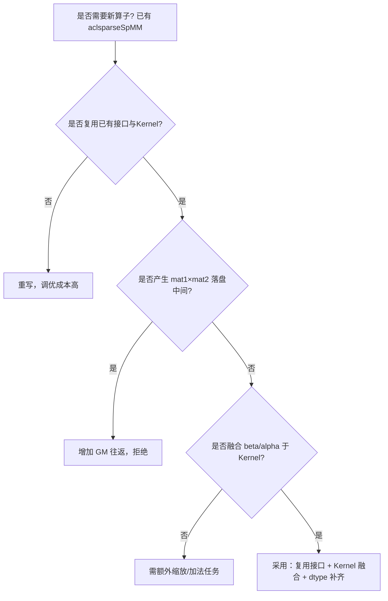

#### 2. 总体数据流

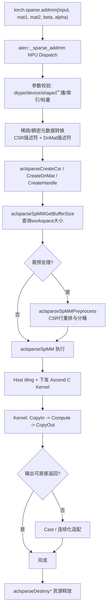

#### 3. 接口与算法 Route 设计

ATen 层根据 `mat2`/输出布局与算法枚举选择执行路径：`CSR_ALG2` 优先行主路径，
`CSR_ALG1` 优先列主路径，`CSR_ALG3` 仅 CSR + `opA=NON_TRANSPOSE` 且不支持
`opB=CONJUGATE_TRANSPOSE`。dtype 决定 Kernel 模板实例化。

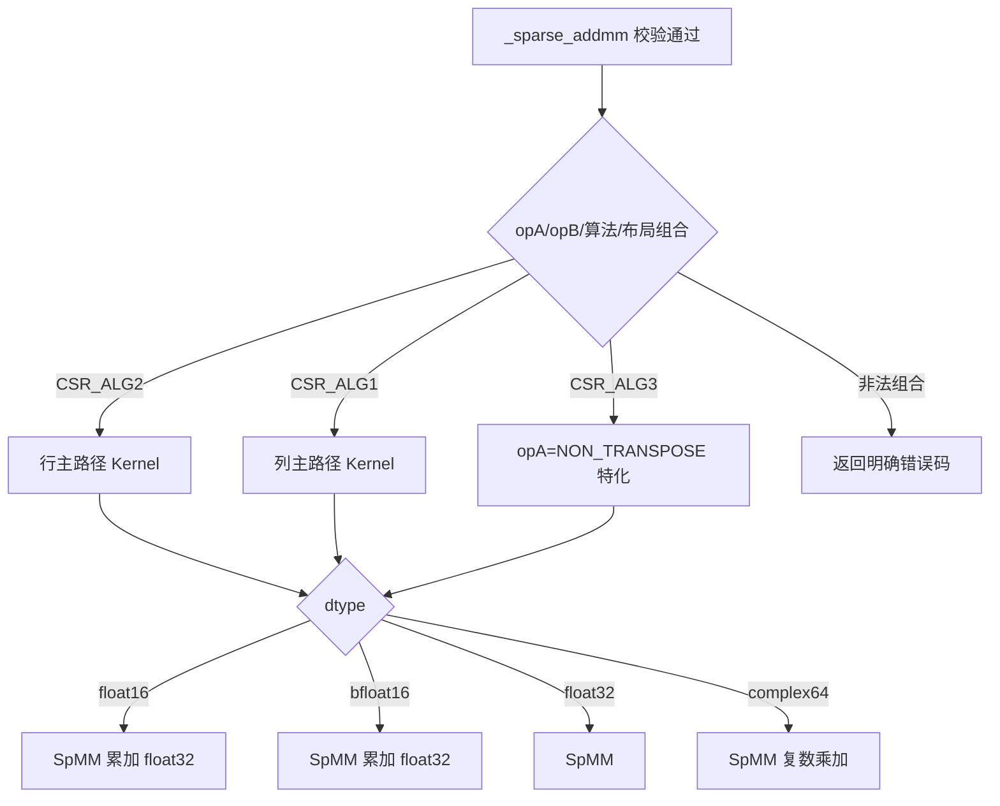

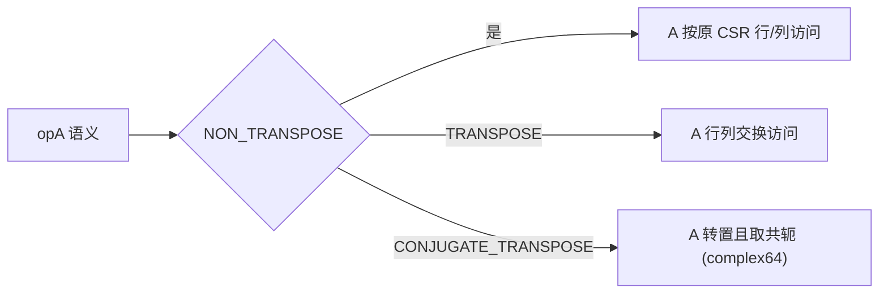

#### 4. workspace 与 preprocess 生命周期

- `GetBufferSize` 返回所需 workspace 大小；`Preprocess` 与 `SpMM` 复用同一
  `externalBuffer`。
- 描述符、workspace、preprocess 结果在正式采样期间复用，一次性预处理耗时单独
  报告，不计入正式设备耗时。
- workspace 不足时返回确定错误码；描述符连续创建、执行、销毁不得泄漏资源。

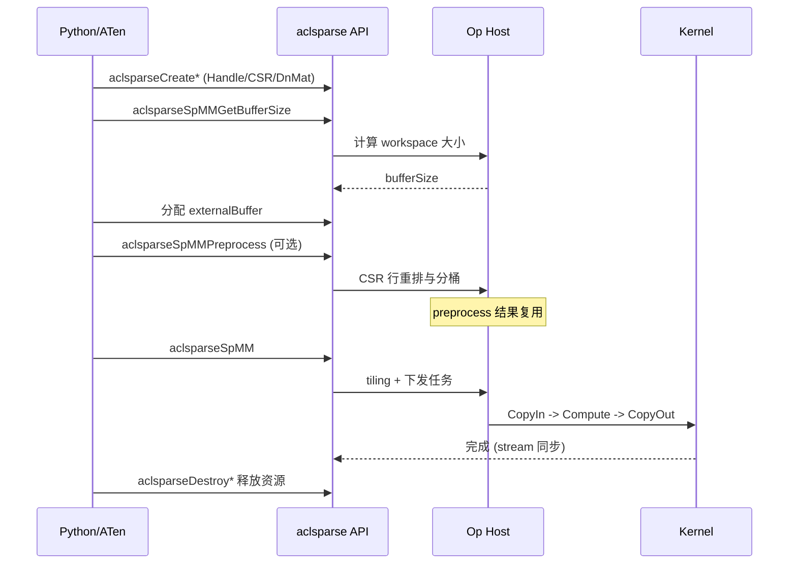

### Host 侧设计

#### 1. 描述符与参数校验

Host 侧完成入参合法性检查，重点包括：

- 指针非空、空 Tensor 短路处理
- dtype 一致性检查（三输入同 dtype，不执行 dtype 提升）
- device 一致性检查（跨设备输入报错）
- 维度校验：`mat1.size(1) == mat2.size(0)`
- 广播校验：仅 `input` 按 PyTorch 广播规则扩展为 `[M,N]`
- 索引合法性：`csrRowOffsets` 单调非降、`csrColInd` 行内严格递增且不越界、
  `idxBase` 支持 0/1、索引类型仅 `ACL_SPARSE_INDEX_32I`
- 布局校验：Row-major `ld>=cols`，Col-major `ld>=rows`
- 标量校验：实数 dtype 不接受虚部非零复数；`beta=0` 时仍校验 input 但不读取数值

#### 2. Host Tiling 总流程

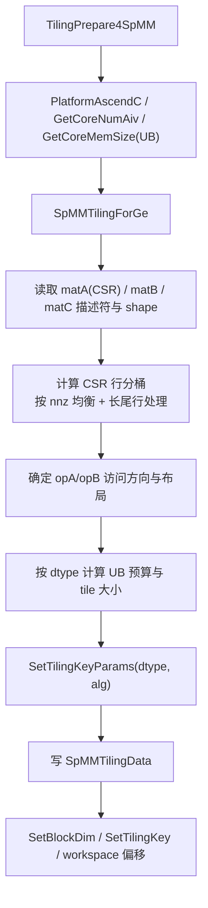

#### 3. 分核与行分桶

稀疏矩阵不同行 nnz 差异大（长尾分布），分核以 nnz 均衡为目标，而非行数均衡：

- 优先满核：常规请求核数 `ceil(totalNnz / nnzPerCore)`，不超过平台 AIV 核数。
- 长尾行（单行 nnz 超过单核容量）单独切分或独占一核，避免负载不均。
- 空行（`rowPtr[i]==rowPtr[i+1]`）不分配计算量，跳过。
- 每核处理行区间 `[rowStart, rowEnd)` 与 nnz 区间 `[nnzStart, nnzEnd)`，区间
  不重叠、不遗漏。

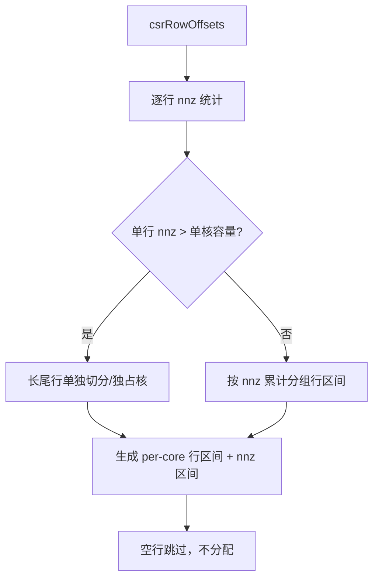

#### 4. UB 预算

UB 先扣除固定保留与 tiling data，再按 dtype 计算单 tile 可容纳的稀疏/稠密
数据量。UB 需容纳：A 的 tile（nnz 值 + 列索引）、B 的 tile（`K×N_tile`）、
C 的 tile（`M_tile×N_tile`）及计算缓冲。

```text
usableUbSize = ubSize - RESERVERD_UB_SIZE - sizeof(SpMMTilingData)
// 按 dtype 计算 A/B/C tile 分片，保证三者 + 计算缓冲之和 <= usableUbSize
tileNnz   = f(usableUbSize, dtypeBytes, 索引字节)
tileRows  = f(tileNnz, 行分桶)
tileCols  = f(usableUbSize, dtypeBytes, tileRows)
```

| dtype | 值字节 | 索引字节 | UB 关注点 |
|---|---|---|---|
| float16 | 2 | 4 | 累加需 float32 中间缓冲 |
| bfloat16 | 2 | 4 | 累加需 float32 中间缓冲 |
| float32 | 4 | 4 | 直接 float32 累加 |
| complex64 | 8 | 4 | 实部虚部分别累加，缓冲翻倍 |

#### 5. Tiling data 契约

| 字段组 | 单位/语义 | Host/Kernel 不变量 |
|---|---|---|
| `M/K/N/nnz` | 矩阵维度与非零数 | Kernel 寻址边界 |
| `opA/opB/alg` | 操作与算法枚举 | Kernel 分支选择 |
| `needCoreNum` | 实际 AIV block 数 | `SetBlockDim` 与 Kernel `coreNum` 一致 |
| `rowStart/rowEnd/nnzStart/nnzEnd` | 每核行区间与 nnz 区间 | 区间不重叠、不遗漏 |
| `usableUbSize/tileNnz/tileRows/tileCols` | 单 tile 容量 | Kernel 分配受约束 |
| `beta/alpha` | 缩放标量（共同 dtype） | Kernel 融合计算 |
| `ldB/ldC/order` | 稠密 leading dimension 与布局 | 寻址与 `ld` 校验 |
| `idxBase` | CSR 索引基（0/1） | 索引偏移换算 |
| `isBroadcastInput` | input 是否需要广播 | CopyIn 分支选择 |

### Kernel 侧设计

#### 1. Kernel 入口、Init 与 Process

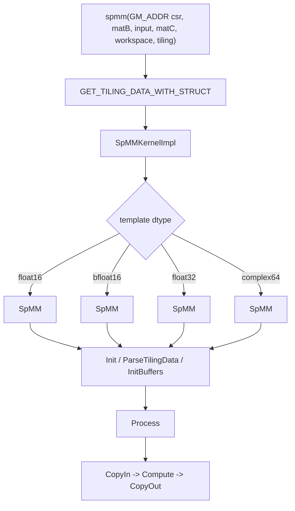

#### 2. CopyIn 数据搬入

每核按行分桶区间搬入：CSR 的 `rowPtr` 切片、`colIdx`/`val` 的 nnz 切片，以及
`matB` 对应 `K×N_tile` 块。`matB` 非连续或需要转置时按 `ldB`/order 分段搬运；
`input` 需要广播时按广播 stride 读取。

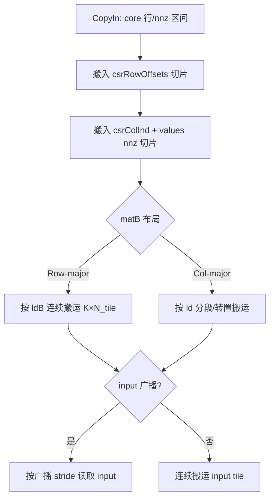

#### 3. Compute 计算设计

- 对每个输出元素 `C[i,j]`，遍历 `mat1` 第 `i` 行的 nnz 非零元，累加
  `val[p] × mat2[colIdx[p], j]`，实现 `alpha` 缩放后与 `beta×input[i,j]` 相加。
- float16/bfloat16 用 float32 累加再 Cast 回，符合 Golden 要求。
- complex64 复乘分解：`(a+bi)(c+di)=(ac-bd)+(ad+bc)i`，实虚部分别累加。
- `opA=TRANSPOSE/CONJUGATE_TRANSPOSE` 时访问方向取反，CONJUGATE 额外取共轭。
- `beta=0` 跳过 input 读取，不传播 NaN/Inf。

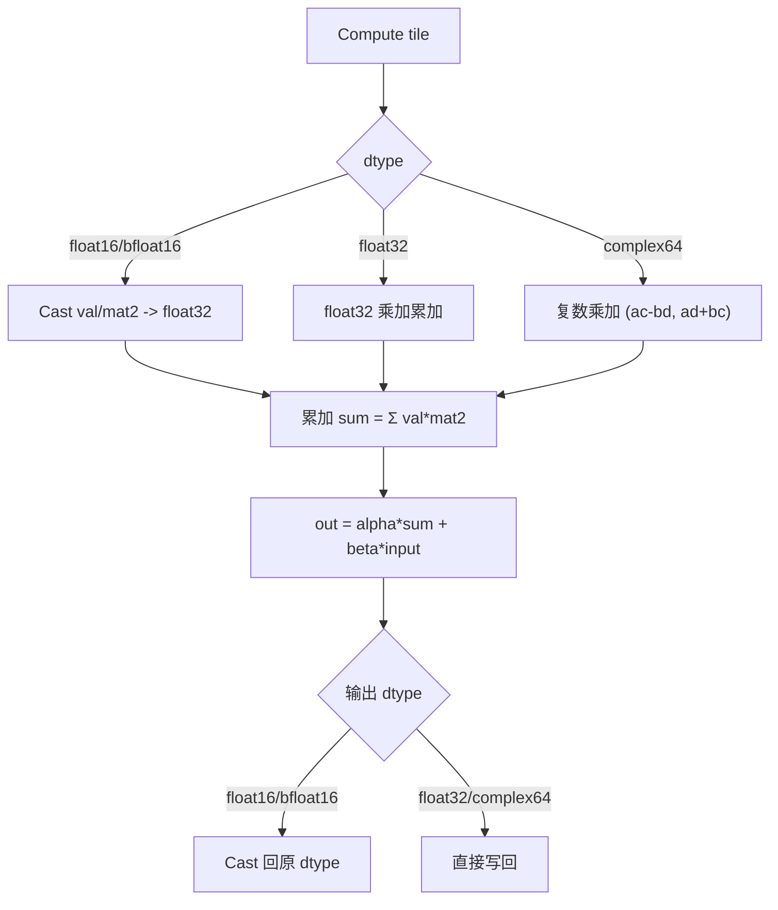

#### 4. CopyOut 写回

将计算完成的 `C` tile 按 `ldC`/order 写回 `matC`，Row-major 连续写、Col-major
按 `ldC` 分段写；尾块只写真实逻辑元素，避免越界。

### 关键内存与性能方案

#### 1. HBM/GM 生命周期

额外内存模型：

```text
M_extra ~= M_workspace + M_preprocess + M_descriptors + M_fixed
M_mat1xmat2_intermediate = 0   // 融合后无乘加中间结果落盘
```

`workspace` 与 `preprocess` 结果在采样期间复用；描述符与 workspace 大小由
`GetBufferSize` 确定，杜绝超量分配。

#### 2. 内存分析

以典型性能 case `P-03`（`M=K=2,449,029, N=256, nnz=61,859,140`，float16）为例：

| 对象 | 大小 | 说明 |
|---|---|---|
| CSR values | nnz×2 ≈ 118 MB | float16 |
| CSR colInd | nnz×4 ≈ 236 MB | int32 |
| CSR rowPtr | (M+1)×4 ≈ 9.3 MB | int32 |
| matB | K×N×2 ≈ 1.19 GB | 稠密 float16 |
| matC | M×N×2 ≈ 1.19 GB | 输出 |
| input | M×N×2 ≈ 1.19 GB | 稠密 |
| workspace | 按 tiling 计算 | 复用，不重复分配 |

设计保证：workspace 与 preprocess 结果一次分配后复用，`mat1×mat2` 中间结果不
落盘，Kernel 内融合 beta/alpha，避免额外 GM 往返。

#### 3. 性能设计

性能设计先通过 `Preprocess` 复用行分桶，消除正式采样的重复预处理；再按
dtype/布局/算法选择搬运路径：连续大块 DMA、长尾行切分、complex64 复乘分解。

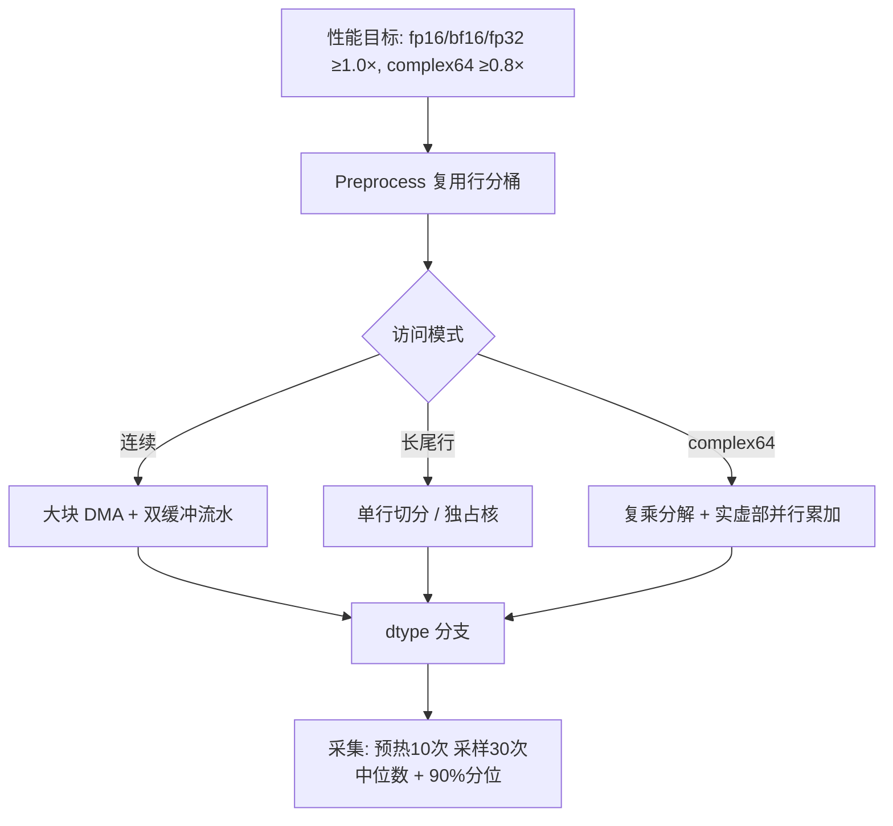

## 支持硬件

| 支持的芯片版本 | 涉及勾选 |
|---|---|
| Ascend 950PR | √ |

## 算子约束限制

1. 支持硬件为 Ascend 950PR；与 A2/A3 任务共享 Host 公共代码但硬件差异解耦。
2. 稀疏格式仅支持 CSR；索引仅 `ACL_SPARSE_INDEX_32I`，`idxBase` 支持 0/1。
3. dtype 仅 float16、bfloat16、float32、complex64；三输入同 dtype 不提升。
4. 维度约束 `mat1.size(1)==mat2.size(0)`；仅 `input` 广播，`mat1`/`mat2` 不广播。
5. 布局仅 Row-major/Col-major，`ld` 满足对应约束；组合仅支持 cuSPARSE SpMM
   官方支持矩阵允许项。
6. `CSR_ALG3` 仅 CSR + `opA=NON_TRANSPOSE`，不支持 `opB=CONJUGATE_TRANSPOSE`。
7. 空输入（零 nnz、空行、零长度维度）定义并测试。
8. 非连续 Tensor 按参数表范围验收，未支持场景返回明确错误。
9. 异步执行使用调用方 stream，禁止无必要的 Host 同步；满足确定性计算要求。
10. 规模限制：最大 shape、nnz、leading dimension、workspace 及索引溢出边界在
    接口文档中明确。

# 特性交叉分析

#### 1. dtype × 算法

| 交叉项 | 行为 | 资源/性能关注点 |
|---|---|---|
| float16/bfloat16 × 任意算法 | float32 累加后 Cast 回 | 中间缓冲翻倍，DMA 字节少 |
| float32 × 任意算法 | 直接 float32 累加 | 带宽与计算平衡 |
| complex64 × 任意算法 | 复乘分解，实虚部分别累加 | 缓冲与计算量翻倍，精度按 float32 双通道 |

#### 2. 布局 × opA/opB

| 交叉项 | 行为 | 关注点 |
|---|---|---|
| Row-major × opA=NON_TRANSPOSE | 行主访问，连续 DMA | 大块搬运效率高 |
| Col-major × opA=NON_TRANSPOSE | 列主访问，按 ld 分段 | 分段搬运 |
| CONJUGATE_TRANSPOSE (complex64) | 转置 + 共轭 | 取共轭额外运算 |

#### 3. 稀疏边界 × 分核

| 交叉项 | 行为 | 关注点 |
|---|---|---|
| nnz=0 | 空乘加，仅 beta×input 路径 | 短路处理 |
| 空行 | 跳过不分配计算量 | 不产生无效寻址 |
| 长尾行 | 单独切分/独占核 | 负载均衡 |

# 可维可测分析

## 精度标准/性能标准

| 验收标准 | 描述 | 标准来源 |
|---|---|---|
| 精度标准 | 混合容差单标杆；float16/bf16 用 float32 Golden，float32 用 float64，complex64 用 complex128；`|actual-golden| ≤ atol+rtol×|golden|`，匹配率 ≥ 0.99，绝对误差 ≤ max(A, 32×ULP(golden)) | 《生态算子开源精度标准》 |
| 精度参数 | float16 `rtol=2^-9,atol=2^-9,A=1e-1`；bf16 `rtol=2^-6,atol=2^-6,A=1e0`；float32 `rtol=2^-10,atol=2^-16,A=1e-2`；complex64 实虚部分别按 float32 | 任务书 |
| 性能标准 | float16/bf16/float32 ≥ 1.0× A100；complex64 ≥ 0.8× A100 | 任务书性能标杆表 |

### 验证方法与判定口径

```text
match = |actual - golden| <= atol + rtol * |golden|
pass_precision = (match_rate >= 0.99) and (max_abs_err <= max(A, 32*ULP(golden)))
pass_performance = NPU_kernel_total / GPU_kernel_total 达目标倍率
pass_dispatch = Profiler 证明无 CPU fallback
```

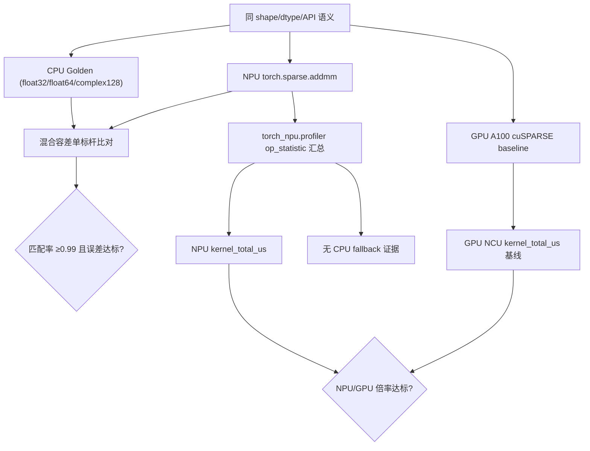

## 测试用例规划

自测用例覆盖任务书"自验证用例"表核心场景，均需 100% Pass：

| 测试场景分类 | 用例描述 | 输入维度及属性 | 数据类型 | 预期结果 |
|---|---|---|---|---|
| 基础功能 | CSR 与稠密矩阵乘加 | 方阵、长矩阵、宽矩阵，alpha/beta 默认值 | FP32 | 与 CPU Golden 匹配 |
| dtype 与标量 | 全 dtype 覆盖 | alpha/beta 覆盖 0、1、普通实数；complex64 补充非零实部虚部 | FP16/BF16/FP32/Complex64 | 与 CPU Golden 匹配 |
| 稀疏边界 | nnz=0/1、空行、非均匀行分布 | 边界 nnz 与行分布 | FP32 | 结果正确，无越界 |
| 布局与操作 | Row/Col-major，最小 ld 及 padding | CSR_ALG2 行主、CSR_ALG1 列主、CSR_ALG3 按限制 | FP32/Complex64 | 与 CPU Golden 匹配 |
| 接口流程 | GetBufferSize/Preprocess/SpMM 主流程 + workspace 不足 | 完整三段式调用 | FP32 | 返回确定错误码 |
| 异常 | 维度/dtype 不匹配、非法索引、非法布局/操作/算法组合 | 非法输入 | FP32 | 返回明确错误 |
| ATen 与泛化 | NPU 注册命中且无 CPU fallback | shape/nnz/稀疏度代表性抽样 | 全 dtype | Dispatch 证据确凿，结果匹配 |

性能用例采用任务书 P-01~P-03 标杆（含 `sparse_addmm_gpu_ncu_baseline.csv` 已提供
的 GPU NCU 基线），每个 case 预热 10 次、正式采样 30 次，报告中位数及 90% 分位。

## 兼容性分析

### 稳定性与兼容性设计

稳定性设计不依赖跨核 workspace 同步：每个 core 根据 tiling 计算独立行/nnz 区间，
只读输入 GM、只写所属输出区间；动态 shape 的所有地址参数由 Host 校验后下发。

| 边界 | 兼容策略 |
|---|---|
| 公共接口 | `aclsparseSpMM*` ABI、参数顺序、错误码和调用流程不变 |
| Tensor view | 输入非连续由适配层连续化，输出非连续按 stride 适配 |
| 空输入 | 零 nnz/空行/零长度维度短路处理 |
| A2/A3 共存 | 公共逻辑解耦，硬件差异走独立分支，主干共存 |
| complex64 | 复数乘加与共轭转置语义正确 |
| beta=0 | 不读取 input 数值，NaN/Inf 不传播 |

| 设计边界 | 影响 | 实现防护 |
|---|---|---|
| 索引溢出（int32 边界） | GM offset 回绕 | Host 校验索引范围与 idxBase |
| 长尾行 nnz 超单核容量 | 负载不均 | 单行切分/独占核 |
| UB 预算与 TQue/TBuf 不一致 | LocalMemory 越界 | divider 与 Kernel 资源一一对应 |
| workspace 不足 | 越界访问 | `GetBufferSize` 返回值强制校验 |
| float16/bf16 累加精度 | 累加舍入 | float32 累加后 Cast 回 |
| complex64 共轭转置 | 语义错误 | opA/opB 分支取共轭 |
| Host/Kernel key 不一致 | 分发错误 | dtype/算法 tiling key 与 Kernel 模板同步 |
| input 广播越界 | 广播寻址错误 | 广播 shape 校验 + stride 计算 |

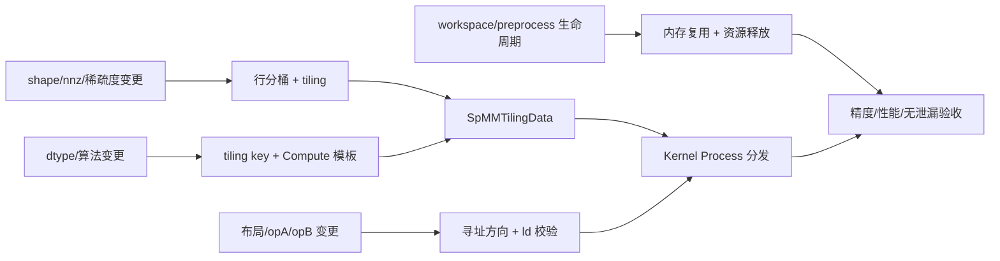

# 附录：修订记录

| 日期 | 修订版本 | 修改描述 | 作者 |
|---|---|---|---|
| 2026-08-20 | v1.0.0 | 初稿构建：完成 aclsparseSpMM 接口、dtype、布局、算法及 Host/Kernel 深度设计 | - |
