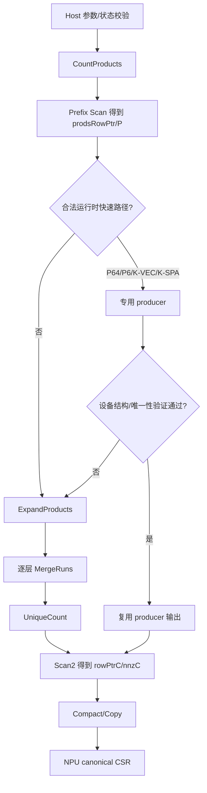

# aclsparseSpGEMM 算子设计文档（Atlas A2/A3）

| 项目 | 内容 |
| --- | --- |
| 社区任务 | 8 月社区任务-aclsparseSpGEMM 算子开发（A2/A3） |
| 目标仓库 | `cann/cann-ops-competitions` |
| 目标硬件 | Atlas A2 系列、Atlas A3 系列（DAV_2201） |
| 数据类型 | float16、bfloat16、float32、complex64 |
| 文档版本 | V1.0 |

# 需求背景（required）

## 需求来源

本设计来源于“aclsparseSpGEMM 算子开发（A2/A3）”社区任务。任务要求复用
`ops-sparse` 既有 SpGEMM 规划中的 `aclsparseSpGEMM*` 多阶段接口，在 Atlas A2/A3
上补齐 float16、bfloat16、float32 和 complex64 的 Host、Ascend C Kernel、
Python/ATen 适配、输出构造、异常处理及测试能力。

Python 行为以 PyTorch 2.7 及以上版本的 `torch.sparse.mm` 和
`aten::_sparse_sparse_matmul` 为准；C++ 接口的阶段、描述符、workspace、算法枚举和
错误处理对标 cuSPARSE SpGEMM，同时服从 `ops-sparse` 的公共接口和目录规范。

## 背景介绍

### SpGEMM 计算与 CSR 存储

稀疏矩阵乘法输入为：

$$
A\in\mathbb{F}^{M\times K},\qquad
B\in\mathbb{F}^{K\times N},\qquad
C=A\times B\in\mathbb{F}^{M\times N}.
$$

其中：

$$
C_{ij}=\sum_{k\,|\,A_{ik}\ne 0,\,B_{kj}\ne 0}A_{ik}B_{kj}.
$$

A、B、C 在 C++ 层均使用 CSR。每个 CSR 由 `rowOffsets`、`colIndices` 和 `values`
组成。输出 C 的结构在运行时产生，要求：

- `rowOffsets` 单调非降；
- 每行 `colIndices` 严格升序；
- 同一坐标的多个中间乘积按确定顺序累加并合并为一个条目；
- 数值抵消形成的显式零仍保留并计入 `nnz(C)`；
- 空输入、空行、空列和无交集乘积返回合法空 CSR。

### 计算难点

SpGEMM 的工作量不能只由 `nnz(A)` 或 `nnz(B)` 表示。第 i 行的中间乘积数量为：

$$
P_i=\sum_{k\in\operatorname{nz}(A_i)}
\left(rowOffsets_B[k+1]-rowOffsets_B[k]\right),\qquad
P=\sum_i P_i.
$$

不同输入可能具有相同 shape/nnz，但 `P_i`、run 数和重复列比例完全不同。因此设计必须
同时解决动态 workspace、行负载不均、排序归并、重复坐标规约、complex64 复乘、
空结果以及大规模索引溢出问题，且不能使用 Host/CPU 完成核心计算或输出结构组装。

### 现有能力与本任务增量

本任务不新增同名 API，而是沿用 SpGEMM 社区规划接口。实现增量包括：

1. 在 A2/A3 DAV_2201 上实现完整 Ascend C 数据通路；
2. 补齐 float16、bfloat16、float32、complex64 全链路；
3. 从 NPU 结果直接构造规范 CSR，避免输出 D2H、COO 展开和 framework coalesce；
4. 为规则稀疏结构提供经运行时验证的快速路径；
5. 对其他合法输入保留自有 Ascend C 通用路径，不回退到 CPU、参考实现或厂商整算子。

# 需求分析（required）

## 需求描述

实现以下调用链：

```text
torch.sparse.mm
  -> aten::_sparse_sparse_matmul NPU dispatch
  -> Sparse Tensor / CSR 描述符转换
  -> aclsparseSpGEMM* 多阶段接口
  -> A2/A3 Ascend C kernels（调用方 stream）
  -> NPU 侧规范 CSR 输出
  -> PyTorch sparse CSR Tensor
```

CPU 仅用于离线 golden。线上计算、排序归并、`nnz(C)` 生成和 CSR 输出构造均由本实现
完成。Profiler 必须能够证明核心路径只包含本实现构建的 NPU Kernel。

## 需求拆解

| 模块 | 设计任务 |
| --- | --- |
| Python/ATen | 注册 NPU 稀疏乘入口，校验 device/dtype/layout/shape，转换为受支持 CSR，直接构造 NPU CSR 输出 |
| 公共接口 | 复用 `aclsparseSpGEMMCreateDescr/WorkEstimation/EstimateMemory/Compute/Copy/DestroyDescr` |
| 描述符 | 保存阶段状态、P、最大 run 数、每行产品范围、`nnz(C)` 和设备缓冲所有权 |
| Host 路由 | 使用 dtype、shape、每行产品数、run 数、容量和设备侧结构校验选择实现族 |
| 通用 Kernel | count、scan、expand、merge、unique-count、scan2、compact |
| 快速 Kernel | K-SPA、K-VEC、P64 direct/R144、P6 SLOT32/R128 |
| 正确性 | 结构 bit-exact、values 混合容差、显式零、NaN/Inf、确定性、空结果 |
| 性能 | 一次公开调用内全部 NPU Kernel 总耗时；Event 10 次预热、30 次采样作为补充 |
| 可维护性 | 公共 Host 逻辑与 DAV_2201 Kernel 分层，便于与 A5 任务在同一主干共存 |

## 接口与约束矩阵

| 维度 | 支持范围 |
| --- | --- |
| C++ sparse format | CSR |
| index | rowOffsets/colIndices 均为 int32，zero-based |
| operation | `ACL_SPARSE_OP_NON_TRANSPOSE` |
| value/compute dtype | float16、bfloat16、float32、complex64，A/B/C/computeType 一致 |
| shape | A `[M,K]`、B `[K,N]`、C `[M,N]`，动态 M/K/N/nnz/P |
| alpha/beta | 当前 `torch.sparse.mm` 路径使用 alpha=1、beta=0；C++ 当前范围明确限制 beta=0 |
| algorithm | DEFAULT/ALG1、ALG2、ALG3 使用同一正确性管线；EstimateMemory 接受 `(0,1]` 的 chunkFraction |
| output | 规范 CSR，结构精确，显式零保留 |
| unsupported | CSC/BSR C++ 输入、int64 index、transpose/conjugate-transpose、广播、图融合 |

# 详细设计（required）

## 算子分析

### 数学公式与中间表示

对于 A 第 i 行的每个非零项 `(k, a)`，遍历 B 第 k 行的 `(j, b)`，生成中间记录：

```text
(row=i, col=j, value=a*b, ordinal=固定展开顺序)
```

由于同一输出行的所有中间记录在 `prodsRowPtr` 的连续区间内，行号无需进入排序 key。
每行仅按 col 排序，然后对相同 col 进行固定顺序规约。`ordinal` 由 A 行内位置、B 行内
位置及 merge run 编号隐式确定，从而保证重复执行时结构和值顺序稳定。

### 支持数据类型

| 输入/输出类型 | 中间计算 | 输出转换 |
| --- | --- | --- |
| float16 | 转 fp32 后乘加 | compact 时转回 fp16 |
| bfloat16 | 位级转换到 fp32 后乘加 | RNE 转回 bf16 |
| float32 | fp32 乘加 | 直接写 fp32 |
| complex64 | 两个 fp32 lane 完成复乘与累加 | 交错写回 real/imag |

complex64 复乘公式为：

$$
(a_r+i a_i)(b_r+i b_i)=
(a_rb_r-a_ib_i)+i(a_rb_i+a_ib_r).
$$

排序只依赖整数列号，因此 NaN/Inf 不改变输出结构；非有限值在数值通道按 IEEE 语义传播。

### 支持形状与规模

M/K/N、nnz(A)、nnz(B)、P 和 nnz(C) 均在运行时确定。最终 CSR offset 和列号受 int32
上限约束；P 在 Host 描述符中使用 int64，workspace 使用 checked `size_t`。通用归并
路径当前每行最多支持 4096 个 B 段，超出时返回 `NOT_SUPPORTED`，不会静默回退。

## 接口设计

### 多阶段接口

| 阶段 | 接口 | 主要职责 |
| --- | --- | --- |
| 创建 | `aclsparseSpGEMMCreateDescr` | 初始化阶段状态和设备缓冲指针 |
| 工作量估算 | `aclsparseSpGEMMWorkEstimation` | 校验 CSR，计算 P、run 数和每行产品摘要，生成 `prodsRowPtr` |
| 查询 | `aclsparseSpGEMMGetNumProducts` | 返回 int64 P |
| 内存估算 | `aclsparseSpGEMMEstimateMemory` | 返回 buffer2/buffer3 大小并记录 workspace 合同 |
| 计算 | `aclsparseSpGEMMCompute` | 选择实现族，生成有序去重的中间结果和 `rowPtrC`，得到 nnz(C) |
| 查询 | `aclsparseSpGEMMGetNnzC` | Compute 后返回 nnz(C)，供调用方分配输出 |
| 拷贝 | `aclsparseSpGEMMCopy` | 在设备上写最终 rowOffsets/colIndices/values |
| 销毁 | `aclsparseSpGEMMDestroyDescr` | 释放描述符拥有的设备缓冲和 Host 状态 |

接口签名以主干 `include/cann_ops_sparse.h` 为唯一准绳；合入时若公共基线变化，应适配主干，
不维护私有同名接口。

### 描述符状态机

```text
INIT
  -> WorkEstimation -> WORK_ESTIMATED
  -> EstimateMemory -> MEMORY_ESTIMATED
  -> Compute        -> COMPUTED
  -> Copy           -> COPIED
```

`GetNumProducts` 仅在 WorkEstimation 成功后合法，`GetNnzC` 仅在 Compute 成功后合法。
重复 WorkEstimation 显式重算并覆盖后续状态。非法阶段顺序、描述符为空、dtype/index/shape
不一致、workspace 不足或不支持的 operation/algorithm 均返回确定的 `aclsparseStatus_t`。

### Host 侧校验

Host 在启动 Kernel 前校验：

1. handle、描述符和必要输出指针；
2. A/B/C shape 关系；
3. CSR int32 index 和四种同精度 dtype；
4. opA/opB 为 NON_TRANSPOSE；
5. beta 为 0，algorithm 属于声明集合；
6. workspace 容量、int32/int64/size_t 地址计算；
7. Kernel 返回的非法索引摘要和运行时错误。

输入 `rowOffsets` 单调性、A 列索引范围、B 行指针范围等需要实际稀疏结构的条件由设备
count/专用验证 Kernel 检查，避免 Host 搬运完整 CSR。

## 算子实现

### 总体方案



所有未命中或验证失败的输入进入本实现通用 Ascend C 链路。运行时从不读取 case id、
seed、文件名、公开用例表、时延签名或输入来源。

### Host 侧设计

#### 分核与调度

DAV_2201 使用最多 48 个 Vector 核，`blockDim=min(M,48)`，M=0 时走合法空结果处理。
行区间连续分给各 block，`prodsRowPtr` 和 `rowPtrC` 保证每个 block 的 GM 写区间不重叠。
Kernel 均在 handle 绑定的 stream 顺序入队；只有多阶段 API 立即需要 P、nnz(C) 或安全
接受 direct 结果时才同步读取摘要。

#### Workspace 布局

设 P 为中间乘积数，`VF=1` 表示实数 fp32 中间值，`VF=2` 表示 complex64 两个 lane。

```text
buffer2:
  colsTmp[P]       int32
  valsTmp[P*VF]    fp32
  colsMrg[P]       int32
  valsMrg[P*VF]    fp32
```

当前 buffer2 大小为：

$$
B_2=align_{256}\left(2P(4+4VF)\right).
$$

WorkEstimation 的元数据包括 `meta[256]`、`prods[M]` 和 `prodsRowPtr[M+1]`；描述符还
管理 `nnzPerRow[M]`、`rowPtrC[M+1]` 和按 block 隔离的 32B 路由摘要。调用方提供
buffer2 时严格检查容量；未提供时由描述符内部申请并在 Destroy 时释放。

#### Stream 与输出所有权

Count、Scan、producer、Scan2 和 Compact 按同一 stream 保序。Copy 对 rowOffsets、
colIndices 和 values 均使用 D2D/Ascend C 写出。PyTorch 适配层直接用这些 NPU 缓冲构造
CSR，不做输出 D2H、Host 行号展开、COO 拼装或 framework coalesce。

### Kernel 侧设计

#### 通用实现族

| Kernel | 数据所有权与功能 | 复杂度 |
| --- | --- | --- |
| Count | 计算每行 P_i、最大 run 数、索引错误和路由摘要 | O(nnz(A)) |
| Scan | 多核局部前缀、block offset 修正，生成 `prodsRowPtr` | O(M) |
| Expand | 展开 `(col,value)` 中间乘积，保持行内固定 ordinal | O(P) |
| MergeLevel | 每层两路稳定归并，ping-pong 两组 workspace | O(P log R) |
| UniqueCount | 统计每行唯一列数 | O(P) |
| Scan2 | `nnzPerRow -> rowPtrC` 并得到 nnz(C) | O(M) |
| Compact | 相同列固定顺序累加并转换到输出 dtype | O(P+nnz(C)) |

通用链路覆盖四种 dtype、空行、重复列、显式零、无交集和不规则结构，是所有快速路径的
正确性后备实现，但仍完全由本项目 Ascend C Kernel 计算。

#### K-VEC 与 K-SPA

- K-VEC 处理每行产品数位于 `[16,64]` 的向量友好行，并使用设备摘要证明覆盖完整；
- K-SPA 在 `N<=W` 或产品密度适合稠密 accumulator 时处理行内聚合；
- 对路由摘要非法或不能证明完整覆盖的输入，Host 启动通用 expand/merge 链；
- fast flag 每个 block 独占 32B，producer tag、唯一性和完整性分别验证，避免读取陈旧摘要。

#### float32 P64 路径

P64 表示每个非空输出行恰有 64 个中间乘积且最大 run 数为 8。

| 层次 | 条件/校验 |
| --- | --- |
| 候选 | float32、P_i 全为 64、run 数 8；大 M 还要求 `nnzA=8M`、`nnzB=8K` 和 int32 prefix 容量 |
| 设备结构校验 | A 每行长度、A 列范围、对应 B 行长度、prefix 连续性和错误摘要 |
| producer | 小/中 M 使用 SLOT64 direct；大 M 使用 SLOT64/R144 K-VEC |
| 接受 | 每行实际 unique count 均为 64，列严格有序且 producer tag 完整 |
| 拒绝 | 进入通用 expand/merge/unique/compact，不返回未经证明的 direct 结果 |

R144 使每个 slot 的 fp32 stride 为 `144*4=576B`，满足 32B 对齐；R140 的 560B stride
不满足对齐，作为编译期负例禁止。P64 R144 的 UB 所有者总量为 173440B，小于 192KiB。

#### float32 P6 路径

当每个非空行实际有 6 个中间乘积且 `N>W` 时，使用 SLOT32/R128 批处理。一个 Kernel
批量加载行元数据和 B 段，减少通用 K-VEC 每行排序、GM 往返和调度开销。UB 资源账本
给出的占用为 89984B，并包含一个对齐块越界的编译期负例。若 P_i、边界或 producer
摘要不满足条件，则继续执行 Scan2/Compact 或通用链路。

#### 资源与同步合同

实现以编译期 resource ledger 约束以下性质：

- `nnzPerRow` 清零范围与 M 个 int32 分配完全一致；
- uniform P64 prefix 不发生 int32 溢出；
- Count prefix、P6 SLOT32/R128、P64 R144 的 UB owner、偏移和访问范围有效；
- GM 写通过 UB 暂存和 `DataCopyPad`，满足 32B 对齐；
- 正向容量断言和一块越界负向断言同时存在。

### 运行时分发合同

| 实现叶 | 合法运行时信息 | 不满足时 |
| --- | --- | --- |
| P64 direct | dtype、M/K/N、nnzA/nnzB、P_i=64、run=8、设备结构/唯一性验证 | 通用链路 |
| P64 R144 | 上述条件且 M>14336、slot stride/UB 容量满足 | 通用链路 |
| P6 SLOT32/R128 | fp32、所有非空行 P_i=6、`N>W` | K-SPA/K-VEC/通用链路 |
| K-VEC | P_i 范围和完整 producer 摘要 | K-SPA/通用链路 |
| K-SPA | N、W、产品密度和容量 | 通用链路 |
| Generic | 所有声明支持且资源上限内的输入 | 不支持项明确报错 |

case id、seed、文件名、公开用例身份、公开 shape 集合和 profiler 时延均不是分发信息。

## 支持硬件

| 产品 | 架构 | 设计状态 |
| --- | --- | --- |
| Atlas A2 系列 | DAV_2201 / arch22 | 支持，需在验收环境补齐功能和精度实测 |
| Atlas 800T A3 | Ascend910_93 / DAV_2201 | 支持，已完成真机功能、精度、性能与 Profiler 验证 |
| Ascend 950/A5 | 非本任务硬件 | 公共 Host/API 可共存，Kernel 由对应硬件实现负责 |

## 算子约束限制

1. C++ 层仅支持 CSR、zero-based int32 index 和 NON_TRANSPOSE；
2. A/B/C/computeType 必须为同一受支持 dtype；
3. 当前公开 `torch.sparse.mm` 路径为 alpha=1、beta=0，C++ 当前实现限制 beta=0；
4. 不支持广播、稠密输出、CSC/BSR C++ 输入、int64 index 和图融合；
5. 每行 B 段数超过 4096 的通用归并场景返回 `NOT_SUPPORTED`；
6. 最终 nnz(C)、CSR offset 和列号必须能由 int32 表示；P 和 workspace 地址计算必须不溢出；
7. 不支持项 fail loudly，不进入 CPU、Python reference、vendor whole-op 或其他 backend。

# 可维可测分析

## 精度标准/性能标准

### 精度方法

CPU golden 采用：float16/bfloat16 -> float32，float32 -> float64，complex64 ->
complex128。结构和 values 分别判断：

| dtype | rtol | atol | 硬上限参数 A |
| --- | ---: | ---: | ---: |
| float16 | 2^-9 | 2^-9 | 1e-1 |
| bfloat16 | 2^-6 | 2^-6 | 1e0 |
| float32 | 2^-10 | 2^-16 | 1e-2 |
| complex64 | 实部/虚部分别按 float32 | 实部/虚部分别按 float32 | 1e-2 |

values 整体匹配率不低于 0.99，每个元素绝对误差不超过
`max(A, 32*ULP(golden))`；rowOffsets、colIndices 和 nnz(C) 必须精确一致。

### 性能口径

主口径为任务脚本统计的一次公开调用中全部 NPU Kernel 总耗时。A3 每个量化场景的
`GPU_time/NPU_time` 必须严格大于 0.25，50 条算术均值不低于 0.35。Event 采用 10 次
预热、30 次采样，报告 median/p90，作为端到端补充证据，不替代主口径。

### 已完成的 A3 自测结果

| 验证项 | 结果 |
| --- | --- |
| C++ 多阶段 UT | 15/15 |
| Python/ATen e2e | 13/13 |
| 正式精度集 | 200/200（fp32 100 + complex64 100） |
| 正式性能集 | 50/50 每条 ratio>0.25，均值 1.354218 |
| float32-014 | GPU 403.840us，NPU 1602.152us，ratio 0.252061，3 kernels/call |
| float32-016 | GPU 253.504us，NPU 503.543us，ratio 0.503441，6 kernels/call |
| Event 014 | median 4731.310us，p90 4905.014us |
| Event 016 | median 1108.180us，p90 1169.282us |

测试环境为 Atlas 800T A3，设备标识 Ascend910_9382，SoC `Ascend910_93`，
NpuArch `DAV_2201`，CANN 9.0.0。A2 功能和精度尚需在可用 A2 环境补测；在补测完成或
获得任务方书面确认前，不把验收包标记为完整通过。

## 测试设计

| 层级 | 覆盖内容 |
| --- | --- |
| C++ API | Create/Work/Estimate/Compute/GetNnz/Copy/Destroy，状态错误，workspace 不足，连续复用 |
| dtype | fp16、bf16、fp32、complex64；complex64 复乘、抵消和非有限值 |
| 结构 | 方/长/宽矩阵，nnz=0/1，空行/空列，无交集，重复列，显式零，长尾行 |
| 路由保护 | P64/P6/K-VEC/K-SPA 代表、边界、拒绝和通用 fallback 用例 |
| 精度 | 结构 bit-exact + values 混合容差；确定性重复执行 |
| 性能 | 任务书正式 50 条，逐 Kernel、Kernel 数和 route flag；Event median/p90 |
| 集成 | `torch.sparse.mm` NPU dispatch，直接 NPU CSR 输出，无 CPU/framework fallback |
| 资源 | UB/GM 对齐、workspace 上下界、P=0 清零、描述符连续创建/销毁 |

## 峰值内存与 Profiler

报告逐 case 记录 P、nnz(C)、buffer2、输出存储和 Kernel 列表。当前 workspace 主项为
`align256(2*P*(4+4*VF))`；输出主项为 `nnz(C)*(4+dtype_bytes)`，另有 `M+1` 个 int32
rowOffsets。Profiler 证据需保留原始 JSON/CSV、逐 Kernel 时间、Kernel 数、路由摘要和
脚本版本，不以截图代替结构化证据。

## 兼容性分析

| 维度 | 分析结论 |
| --- | --- |
| API | 复用 `include/cann_ops_sparse.h` 的 SpGEMM 基线，不新增重复接口 |
| ABI | 新增能力在既有描述符和函数集合内实现；合入前基于最新 master 复核 |
| 数据 | C++ 固定 CSR/int32；Python 层按目标 PyTorch 语义适配受支持 sparse layout |
| 硬件 | 公共 Host 与 arch-specific launch 分离，A2/A3 使用 DAV_2201 实现 |
| A5 共存 | Host 公共校验/状态/workspace 可复用，硬件 Kernel 和 tiling 独立 |
| 确定性 | 稳定归并、固定 run 次序和固定同列累加顺序 |
| Fallback | 只在自有 Ascend C 实现族之间分发，不使用 CPU/reference/vendor whole-op |

## 代码目录规划

合入 `ops-sparse` 时沿用主干现有 SpGEMM 目录和公共构建规则，逻辑分层如下：

```text
include/cann_ops_sparse.h                # 复用公开接口声明
src/.../spgemm/                          # Host 描述符、阶段编排、路由
src/.../spgemm/arch22/                   # A2/A3 Ascend C kernel/launch/tiling
python/... / torch_npu adapter           # Python/ATen NPU 注册与 CSR 输出构造
test/.../spgemm/                         # C++ UT、端到端 UT、精度/性能脚本
docs/...                                 # 接口、限制、自测与性能证据
```

实际路径以合入时 `ops-sparse` 最新 master 的既有 SpGEMM 目录为准，不复制另一套公共
描述符或重复注册同名接口。

## 设计自检

| 检查项 | 结论 |
| --- | --- |
| 模板 required 章节 | 已覆盖需求背景、需求分析、详细设计、可维可测 |
| 多阶段接口/状态/workspace/stream | 已覆盖 |
| 四 dtype 与 complex64 | 已覆盖 |
| Host/Kernel 数据流和通用 fallback | 已覆盖 |
| 合法运行时分发与反过拟合约束 | 已覆盖 |
| 精度、性能、峰值内存、Profiler | 已覆盖并记录 A3 实测 |
| A2/A3 与 A5 共存 | 已覆盖；A2 实测列为验收前待办 |
| 已知限制 | alpha/beta 范围、4096 run 上限、int32 范围均已明确 |
