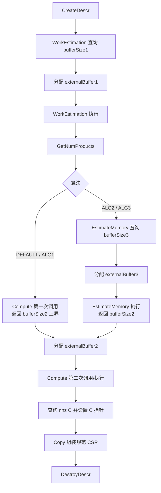
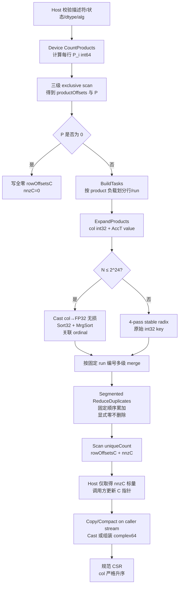
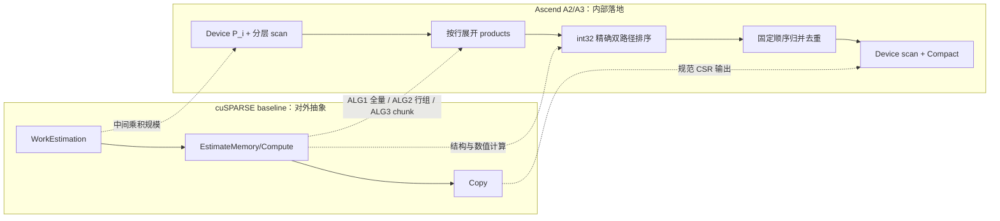

# aclsparseSpGEMM 算子设计文档（Atlas A2/A3）

| 版本 | 日期 | 修改人 | 修改内容 |
|---|---|---|---|
| v1.0 | 2026-08-17 | KaranocaVe | 初版设计，覆盖 A2/A3、四种 dtype、三种算法、Python/ATen 与多阶段 C++ 接口 |

> 本文依据 2026 年 8 月 `aclsparseSpGemm 算子开发(A2A3)` 任务书、社区任务流程、PyTorch 2.7+ `torch.sparse.mm` 语义及 CUDA Toolkit 13.3 Update 1 的 cuSPARSE SpGEMM 规格编写。仓库状态以 2026-08-17 的 `ops-sparse master` 为准。

# 一、需求背景

## 1.1 需求来源

通过社区任务为 `cann/ops-sparse` 补齐 Atlas A2、Atlas A3 上的稀疏矩阵乘稀疏矩阵能力，提供 Python/ATen、`aclsparseSpGEMM*` C++ 多阶段接口、Ascend C Kernel、测试及文档，核心计算不得使用 CPU fallback。

## 1.2 背景介绍

### 1.2.1 aclsparseSpGEMM 实现优化

SpGEMM 计算为：

$$
C' = \alpha\,op(A)\,op(B) + \beta C
$$

其中 $A\in\mathbb{F}^{M\times K}$、$B\in\mathbb{F}^{K\times N}$、$C'\in\mathbb{F}^{M\times N}$ 均为 CSR 稀疏矩阵。本任务仅支持 `NON_TRANSPOSE`，因此核心坐标计算为：

$$
C'_{ij}=\alpha\sum_{k:(i,k)\in A,(k,j)\in B}A_{ik}B_{kj}+\beta C_{ij}.
$$

与 SpMM 不同，SpGEMM 的输出结构和 `nnz(C')` 在执行前未知，必须先形成中间乘积、对输出坐标排序去重，再分配并组装输出。若多个乘积在同一坐标抵消为零，该坐标仍是结构非零，必须保留显式零。

本算子没有可直接对应的 TBE 单算子实现，baseline 采用以下三类公开参考：

1. cuSPARSE Generic API `cusparseSpGEMM`：多阶段接口、描述符状态、workspace、ALG1/ALG2/ALG3 和确定性语义，见 <https://docs.nvidia.com/cuda/cusparse/index.html#cusparseSpGEMM>；
2. PyTorch 稀疏乘法：公开入口 `torch.sparse.mm`、内部 schema `aten::_sparse_sparse_matmul` 及 PyTorch 2.7+ 的 layout/dtype/异常语义；
3. `ops-sparse` A2/A3 工程基线：`sparse/spmm/arch22/spmm_host.cpp`、`sparse/spmm/arch22/spmm_kernel.cpp`、`include/cann_ops_sparse.h`，用于复用描述符校验、stream 获取、DAV_2201 构建分派和 Kernel launch 风格。

截至 2026-08-17，`ops-sparse master` 未发现 `sparse/spgemm/` 或 `aclsparseSpGEMM*` 实现。`cann-ops-competitions` 中已有的 7 月 SpGEMM 文档是 Ascend 950 `arch35` 设计资料，不等价于已合入代码；实施时先同步主干，若公共 SpGEMM 已落地则基于其扩展，若仍未落地则按任务书签名实现，禁止重复增加同名或同功能 API。

### 1.2.2 baseline 现状分析

#### 1.2.2.1 baseline 支持的数据类型和数据格式

| 项目 | cuSPARSE baseline | 本任务范围 |
|---|---|---|
| 格式 | CSR | C++ 层 CSR；Python 层按 PyTorch 语义转换与返回 |
| 索引 | int32 / int64 | 仅 int32，A/B/C 必须一致，zero-based |
| 操作 | opA/opB 仅 NON_TRANSPOSE | 同 baseline |
| dtype | 多种实数/复数同精度组合 | FP16、BF16、FP32、complex64，A/B/C/computeType 同类型 |
| 算法 | DEFAULT、ALG1、ALG2、ALG3 | 全部支持；DEFAULT 当前映射 ALG1 |
| 确定性 | ALG1/2/3 均 deterministic | 全部 dtype、全部算法均确定性 |

#### 1.2.2.2 baseline 实现描述

cuSPARSE 将 SpGEMM 拆分为 WorkEstimation、可选的 EstimateMemory、Compute 和 Copy。WorkEstimation 计算中间乘积规模；ALG1 的 Compute 调用两次，第一次返回 workspace 上界，第二次执行；ALG2 先精确估算较小 workspace；ALG3 以 `chunkFraction × numProducts` 为中间乘积块大小逐块计算；Compute 确定 `nnz(C)`，调用方更新输出指针后由 Copy 组装最终 CSR。

cuSPARSE 规定 $C$ 与 $C'$ 的 sparsity pattern 相同，因此 `beta*C` 不引入新坐标。Python `torch.sparse.mm` 路径没有已有 C，按 `alpha=1、beta=0` 进入底层路径；C++ 接口仍保留并校验 alpha/beta 和 pointer mode 语义。

#### 1.2.2.3 baseline 实现流程图



# 二、需求分析

## 2.1 外部组件依赖

| 依赖 | 作用 | 约束 |
|---|---|---|
| CANN 与 Ascend C 编译器 | 编译和运行 `arch22 / DAV_2201` Kernel | 使用 `ops-sparse` 主干指定版本，实测报告记录精确版本 |
| ACL Runtime | stream、device memory、Kernel launch | 复用调用方 stream，不创建隐式默认 stream |
| PyTorch 2.7+ | `torch.sparse.mm` 和 ATen schema | 行为以目标版本为准 |
| torch_npu 26.0.0+ | NPU dispatch、Sparse Tensor 构造 | 必须命中 NPU 注册，不允许 CPU fallback |
| ATK/任务书测试脚本 | 精度、性能、profiling | 使用单一 CPU golden，不以另一 NPU 实现作标杆 |

## 2.2 内部适配模块

| 模块 | 设计职责 |
|---|---|
| Python/ATen 适配 | 注册 `aten::_sparse_sparse_matmul` NPU 实现；校验 device、维度、layout、dtype；转换为 CSR；调用 aclsparse 多阶段接口；返回符合 PyTorch 语义的 CSR/COO，COO 必须 coalesced |
| `include/cann_ops_sparse.h` | 复用或补齐 SpGEMM 描述符、算法枚举和任务书规定的 API 声明 |
| 公共 Host 层 | 参数校验、描述符状态机、workspace 计算、pointer mode、stream、输出指针更新；A2/A3 与 A5 共用 |
| `sparse/spgemm/arch22` | A2/A3 的 ProductCount、Scan、Expand、Sort/Merge、Reduce、Compact Kernel 及 tiling |
| A5 硬件目录 | 由对应任务实现；不得将 arch35/其他架构细节写入公共 Host 逻辑 |
| `test/spgemm` | C++ 多阶段接口、精度、异常、workspace、确定性和 A2/A3 回归 |

## 2.3 需求模块设计

### 2.3.1 算子原型

Python 公开入口：

```python
torch.sparse.mm(mat1, mat2) -> Tensor
```

ATen schema：

```text
aten::_sparse_sparse_matmul(Tensor self, Tensor other) -> Tensor
```

C++ 层复用任务书列出的接口，不新增另一套快捷 API：

```c
aclsparseStatus_t aclsparseSpGEMMCreateDescr(aclsparseSpGEMMDescr_t *descr);
aclsparseStatus_t aclsparseSpGEMMDestroyDescr(aclsparseSpGEMMDescr_t descr);

aclsparseStatus_t aclsparseSpGEMMWorkEstimation(
    aclsparseHandle_t handle,
    aclsparseOperation_t opA, aclsparseOperation_t opB,
    const void *alpha,
    aclsparseConstSpMatDescr_t matA,
    aclsparseConstSpMatDescr_t matB,
    const void *beta,
    aclsparseSpMatDescr_t matC,
    aclDataType computeType,
    aclsparseSpGEMMAlg_t alg,
    aclsparseSpGEMMDescr_t spgemmDescr,
    size_t *bufferSize1, void *externalBuffer1);

aclsparseStatus_t aclsparseSpGEMMGetNumProducts(
    aclsparseSpGEMMDescr_t spgemmDescr, int64_t *numProds);

aclsparseStatus_t aclsparseSpGEMMEstimateMemory(
    aclsparseHandle_t handle,
    aclsparseOperation_t opA, aclsparseOperation_t opB,
    const void *alpha,
    aclsparseConstSpMatDescr_t matA,
    aclsparseConstSpMatDescr_t matB,
    const void *beta,
    aclsparseSpMatDescr_t matC,
    aclDataType computeType,
    aclsparseSpGEMMAlg_t alg,
    aclsparseSpGEMMDescr_t spgemmDescr,
    float chunkFraction,
    size_t *bufferSize3, void *externalBuffer3,
    size_t *bufferSize2);

aclsparseStatus_t aclsparseSpGEMMCompute(
    aclsparseHandle_t handle,
    aclsparseOperation_t opA, aclsparseOperation_t opB,
    const void *alpha,
    aclsparseConstSpMatDescr_t matA,
    aclsparseConstSpMatDescr_t matB,
    const void *beta,
    aclsparseSpMatDescr_t matC,
    aclDataType computeType,
    aclsparseSpGEMMAlg_t alg,
    aclsparseSpGEMMDescr_t spgemmDescr,
    size_t *bufferSize2, void *externalBuffer2);

aclsparseStatus_t aclsparseSpGEMMCopy(
    aclsparseHandle_t handle,
    aclsparseOperation_t opA, aclsparseOperation_t opB,
    const void *alpha,
    aclsparseConstSpMatDescr_t matA,
    aclsparseConstSpMatDescr_t matB,
    const void *beta,
    aclsparseSpMatDescr_t matC,
    aclDataType computeType,
    aclsparseSpGEMMAlg_t alg,
    aclsparseSpGEMMDescr_t spgemmDescr);
```

参数规格：

| 参数 | 角色 | dtype / 格式 | shape | 说明 |
|---|---|---|---|---|
| matA | 输入 | CSR；int32 索引；FP16/BF16/FP32/complex64 values | `[M,K]` | 列索引行内有序、无非法坐标 |
| matB | 输入 | CSR；int32 索引；与 A 同 values dtype | `[K,N]` | 列索引行内有序、无非法坐标 |
| matC | 输入/输出 | CSR；int32 索引；与 A/B 同 values dtype | `[M,N]` | Compute 后更新 nnz，Copy 写最终结构和值 |
| alpha/beta | 输入 | 与 computeType 对应的标量 | scalar | 遵循 handle pointer mode；Python mm 使用 1/0 |
| computeType | 属性 | 与 A/B/C values 相同 | - | 不做混合类型 C++ 组合 |
| alg | 属性 | DEFAULT/ALG1/ALG2/ALG3 | - | DEFAULT 映射 ALG1 |
| chunkFraction | 属性 | float | scalar | ALG3 有效，范围 `(0,1]` |

### 2.3.2 相关约束

1. A、B 必须是二维稀疏矩阵且 `A.size(1)==B.size(0)`，不支持广播。
2. C++ 层仅支持 CSR、zero-based、rowOffsets/colIndices 均为 `ACL_SPARSE_INDEX_32I`。
3. `opA`、`opB` 仅 `ACL_SPARSE_OP_NON_TRANSPOSE`；transpose 和 conjugate-transpose 返回明确的 NOT_SUPPORTED。
4. A/B/C/computeType 仅同精度 FP16、BF16、FP32、complex64。
5. 输入 A/B 每行列索引有序；输出 C rowOffsets 单调非降、每行 colIndices 严格升序、无重复坐标。
6. 输出结构由坐标乘积决定；重复坐标固定顺序累加，结果为 `+0/-0` 时仍保留该坐标并计入 `nnz(C)`。
7. `nnz(A)`、`nnz(B)`、`nnz(C)` 和 CSR offset 必须能用 int32 表示；中间乘积数量用 int64，workspace 字节数用 checked `size_t` 运算。任何乘法、加法或地址换算溢出均在启动 Kernel 前返回错误。
8. `M/K/N` 必须非负且不超过 int32 可表示范围；`rowOffsets[last]==nnz`，所有列索引均在合法范围内。
9. 空维、零 nnz、空行/空列和无乘积交集返回合法空 CSR；不得因 `count=0` 启动不满足 API 约束的向量指令。
10. 非连续 Sparse Tensor 在 Python 层按目标 PyTorch 语义转为受支持 CSR；无法安全转换的场景返回明确异常。

# 三、需求详细设计

## 3.1 使能方式

调用链为：

```text
torch.sparse.mm
  -> aten::_sparse_sparse_matmul NPU dispatch
  -> Sparse Tensor/CSR 描述符转换
  -> aclsparseSpGEMM* 多阶段接口
  -> arch22 Ascend C kernels on caller stream
  -> CSR 输出组装
  -> PyTorch Sparse Tensor
```

适配代码需通过 dispatch/Profiler 证据证明命中 NPU 路径。CPU 仅用于离线 golden，不参与线上计算或结构生成。

## 3.2 需求总体设计

### 3.2.1 Host 侧设计

#### 3.2.1.1 描述符状态机与多阶段接口

SpGEMM 描述符保存公共、与硬件无关的状态：创建状态、已绑定的 A/B/C 元信息摘要、dtype、alg、`numProducts`、`nnz(C)`、三个 buffer 大小、chunkFraction、执行 stream 关联信息和阶段版本号。由于 Copy 原型不再传入 `externalBuffer2`，描述符还需非 owning 地绑定 Compute 使用的 buffer2 地址，直到 Copy 完成；不得保存调用方释放后失效的 Host 临时容器。

| 当前状态 | 合法调用 | 结果状态 | 关键行为 |
|---|---|---|---|
| CREATED | WorkEstimation 查询 | CREATED | 只算 `bufferSize1`，不访问空 workspace |
| CREATED | WorkEstimation 执行 | WORK_ESTIMATED | Device 统计每行 products 并 scan；缓存 numProducts 与输入签名 |
| WORK_ESTIMATED | GetNumProducts | WORK_ESTIMATED | 返回 int64 标量 |
| WORK_ESTIMATED | Compute 查询（ALG1） | COMPUTE_SIZED | 返回保守 bufferSize2 上界 |
| WORK_ESTIMATED | EstimateMemory 查询/执行（ALG2/3） | MEMORY_ESTIMATED | 返回 bufferSize3，再得到更精确 bufferSize2 |
| COMPUTE_SIZED / MEMORY_ESTIMATED | Compute 执行 | COMPUTED | 完成排序、归并和结构/值暂存，更新 nnz(C) |
| COMPUTED | Copy | COPIED | 将规范 CSR 写入调用方更新后的 matC 指针 |
| 任意已创建状态 | DestroyDescr | DESTROYED | 释放 Host 描述符，不释放调用方 workspace |

非法阶段顺序、输入描述符在阶段之间被不兼容修改、workspace 不足、算法不一致均返回确定错误。重新执行 WorkEstimation 会显式重置后续阶段状态。

错误码沿用仓库现有 `aclsparseStatus_t`，不创建私有状态码：

| 场景 | 返回值 |
|---|---|
| 成功或合法空结果 | `ACL_SPARSE_STATUS_SUCCESS` |
| handle/descr/必要输出参数为空 | `ACL_SPARSE_STATUS_HANDLE_IS_NULLPTR` 或仓库统一的空指针状态 |
| 维度、index、base、chunkFraction、阶段顺序或描述符签名非法 | `ACL_SPARSE_STATUS_INVALID_VALUE` |
| dtype、format、operation 或算法组合不支持 | `ACL_SPARSE_STATUS_NOT_SUPPORTED` / `ACL_SPARSE_STATUS_MATRIX_TYPE_NOT_SUPPORTED` |
| workspace 不足、int32/int64/size_t 上限导致当前模式无法执行 | `ACL_SPARSE_STATUS_INSUFFICIENT_RESOURCES` |
| Kernel launch/运行失败 | `ACL_SPARSE_STATUS_EXECUTION_FAILED` |
| 内部状态不一致 | `ACL_SPARSE_STATUS_INTERNAL_ERROR` |

WorkEstimation 与 Compute 需要将立即返回给 Host 的 `numProducts`/`nnz(C)` 标量从 device 取回；这里只允许与 API 语义必需的标量同步，不把 rowOffsets、colIndices 或 per-row 统计整体搬回 Host。Copy 本身异步入队并立即返回。

alpha/beta 按 handle pointer mode 处理：Host pointer mode 将标量复制到 launch 参数，Device pointer mode 由 Kernel 在调用方 stream 上读取。`beta!=0` 时，matC 的已有 sparsity pattern 必须与结果 pattern 相同，符合 cuSPARSE 约束；beta 不新增坐标。

Compute 阶段在调用方可能更新 matC 输出指针之前读取原有 C values，并将 `alpha*AB + beta*C` 的归并结果保存在 buffer2；因此 Copy 不依赖已经被替换的输入 C 指针，只负责类型转换与规范 CSR 落盘。

#### 3.2.1.2 分核策略

SpGEMM 行负载不是 `nnz(A_i)`，而是：

$$
P_i=\sum_{(i,k)\in A} \big(rowOffsets_B[k+1]-rowOffsets_B[k]\big),
\qquad P=\sum_i P_i.
$$

Device 的 ProductCount Kernel 计算 `P_i` 和 int64 exclusive prefix `productOffsets`。随后 BuildTasks Kernel 按 product 数而不是按行数生成连续任务：

- small row：整行 products 可装入一个 UB 工作 tile，一个任务处理一行；
- medium row：一行拆成多个固定 product tile，先各自产生排序 run，再按固定 run 编号归并；
- long-tail row：多级 merge，避免某个超长行独占单核；最终 Reduce 只按固定 tile/run 顺序合并，调度顺序不影响数值次序；
- empty row：只写 `uniqueCount=0`，不进入排序/归并。

Host 使用平台接口取得 AIV 核数，启动 `blockDim=GetCoreNumAiv()`；多余核在读取任务边界后安全退出。任务列表在 Device 构造，避免为 Host 分箱 D2H CSR。各输出行或行片段的写区间由 prefix offset 唯一确定，不使用会改变同一坐标累加顺序的全局原子加。

#### 3.2.1.3 数据分块和内存优化策略

记累加类型字节数：实数路径 `Sacc=4`（FP32），complex64 路径 `Sacc=8`（两个 FP32）；输出字节数 `Sout` 分别为 2、2、4、8。

所有 workspace 子区按至少 64B 对齐，UB tensor 起址按 API 要求满足 32B/128B/256B 对齐。Host 使用 checked add/multiply/align 计算大小。

公共逻辑缓冲包括：

```text
rowProductCount[M]        int64
productOffsets[M+1]       int64
task metadata             fixed-size records
productCols[Pchunk]       int32
productValues[Pchunk]     AccT
sort key/index ping-pong  8B records
uniqueCount[M]            int32
rowOffsetsC[M+1]          int32
reducedCols/Values        up to Pchunk records
scan block sums/status    int64 + status words
```

ALG1/DEFAULT 令 `Pchunk=P`，完整 materialize 中间乘积，使用最高 workspace 换取最少 chunk 合并。第一次 Compute 以 `Q=nnz(C)≤P` 给出安全上界，第二次 Compute 检查调用方给定大小并执行；不足时返回 insufficient resources，不越界降级。

ALG2 在 EstimateMemory 阶段根据 `P_i` 摘要、UB、dtype 和实际算法元数据计算行组，令同一时刻驻留 `Pgroup<P`，完成一组后将已归并 run 写入持久区，workspace 小于 ALG1。其顺序按输出行和固定 run 编号确定。

ALG3 定义：

$$
P_{chunk}=\max\left(1,\left\lceil chunkFraction\times P\right\rceil\right).
$$

chunk 边界优先落在行边界；单行 `P_i>Pchunk` 时允许切入行内，并在描述符 workspace 中保留该行的有序 partial run，下一 chunk 继续固定次序 merge。`chunkFraction` 不在 `(0,1]` 时返回 invalid value。

UB tile 大小由平台查询的 UB 容量和 dtype 动态得到，不在设计阶段硬编码未经真机验证的常数。概念公式为：

$$
T=alignDown\left(\frac{UB_{usable}-B_{fixed}}
{B_{key}+B_{ordinal}+B_{value}+B_{sortOut}+B_{gatherOut}},32\right),
$$

并同时满足 `Sort32` 每组 32 元素、`repeatTime≤255`、`MrgSort` 单路不超过 4095 个 8B record、`DataCopyPad blockLen≤2097151B` 等 API 上限。尾块使用不可能成为合法列号的 padding sentinel，归并后按有效长度裁剪。

#### 3.2.1.4 workspace 生命周期与输出指针

- `externalBuffer1` 从 WorkEstimation 执行起存活到 Compute 完成，可被接口约定的后续阶段复用；
- `externalBuffer3` 仅 ALG2/ALG3 EstimateMemory 使用，阶段完成后可释放；
- `externalBuffer2` 从 Compute 执行起存活到 Copy 完成；描述符非 owning 地记录其地址供 Copy 使用；
- 所有 buffer 均由调用方分配和释放，描述符可以绑定地址但不拥有、不释放 buffer；
- Compute 得到 `nnz(C)` 后更新 matC 元信息；调用方查询大小、分配 rowOffsets/colIndices/values 并通过既有 CSR set-pointers 接口更新 matC；Copy 校验容量后写出；
- 空结果仍写长度为 `M+1` 的全零 rowOffsets，colIndices/values 可以为空指针或仓库规范允许的零长地址。

#### 3.2.1.5 tilingKey 规划

采用可扩展 8 bit 编码，最终字段随代码基线统一：

| bit | 含义 | 编码 |
|---|---|---|
| `[1:0]` | dtype | 0 FP16，1 BF16，2 FP32，3 complex64 |
| `[3:2]` | algorithm | 0 ALG1/DEFAULT，1 ALG2，2 ALG3 |
| `[5:4]` | row class | 0 small，1 medium，2 long-tail |
| `6` | sort path | 0 `N≤2^24` 的 float-exact 快速路径，1 完整 int32 radix 路径 |
| `7` | empty fast path | 1 表示 `P=0` |

small/medium/long-tail 的阈值由 WorkEstimation 的 `P_i` 摘要、实际 UB 容量、dtype 和 API 最大长度共同决定。文档不写未经上机确认的固定阈值。

### 3.2.2 Kernel 侧设计

#### 3.2.2.1 Kernel 实现描述

Kernel 管线如下：

1. **Validate/CountProducts**：按 A 行遍历其列 k，读取 B 的 `rowOffsets[k:k+1]`，用 int64 统计 `P_i`；检查乘积数溢出和非法索引状态。
2. **HierarchicalScanProducts**：局部 scan、block sums scan、offset 回加，得到 `productOffsets` 与 P。所有阶段在同一调用方 stream 串行入队。
3. **ExpandProducts**：对每个 `(i,k)` 展开 B 第 k 行，写 `productCol=j` 和乘积值。中间乘积天然按输出行连续。
4. **RowSort**：对每行或 run 按原始 int32 `productCol` 排序。`N≤2^24` 时可无损 Cast 到 FP32，并以 `-float(col)` 作为 Sort32 的降序 key，从而得到 col 升序；更大 N 使用四趟稳定 LSD radix（每趟 8 bit），保证完整非负 int32 范围精确。
5. **MergeRuns**：small row 在 UB 内完成；medium/long-tail 将已排序 run 以固定编号做多级 merge。快速路径使用 `MrgSort` 的 8B key/ordinal record；radix路径 merge 原始 int32 record。
6. **ReduceDuplicates**：以原始 int32 col 判断段边界，相同列严格按原 product ordinal/run 编号左到右累加，写一个结构条目并得到 `uniqueCount_i`。不根据 value 是否为零过滤条目。
7. **ScanUniqueCount**：设备侧分层 exclusive scan，写 `rowOffsetsC` 并得到 `nnz(C)`；写 int32 前检查上界。
8. **Compact/Copy**：Compute 先在同一固定坐标上完成 alpha/beta，再将结果保存在 buffer2；Copy 将 reduced col/value 按 `rowOffsetsC` 写入调用方 CSR。FP16/BF16 从 FP32 按规定舍入；FP32 直接写；complex64 组装两个 FP32 分量。

数据类型策略：

| 输入/输出 dtype | 中间乘法与归并 | 原因 |
|---|---|---|
| FP16 | 两个输入先 Cast 到 FP32，再做 FP32 乘法与累加 | 满足任务书 FP32 golden 与混合容差，避免先做 FP16 乘法造成额外舍入 |
| BF16 | Cast 到 FP32 后计算，末尾 Cast 回 BF16 | A2/A3 Memory `Add/Mul` 不直接支持 BF16 |
| FP32 | FP32 | 固定顺序确保重复运行 bit-wise 一致 |
| complex64 | 实虚拆为两个 FP32；`real=ar*br-ai*bi`，`imag=ar*bi+ai*br` | A2/A3 不提供可直接覆盖本需求的 complex64 向量 Add/Mul；拆分后保持 complex64 语义 |

排序只依赖列号，不依赖 values，因此 NaN/Inf 不影响结构顺序；value 计算按 IEEE 浮点传播。complex64 的实部、虚部分别按固定顺序处理。

#### 3.2.2.2 Ascend C 实现流程图



#### 3.2.2.3 Ascend C 与 baseline 差异及原因



| 差异 | 原因 |
|---|---|
| 不采用 950 SIMT symbolic，也不把 CSR 拉回 Host | A2/A3 为 DAV_2201；大规模 CSR D2H 会引入同步和带宽开销，不满足任务书的 stream 语义 |
| products 按输出行分组，不做全局 `(row,col)` 64-bit key 排序 | 行号已由 `productOffsets` 隐含，减少 key 宽度、workspace 和全局搬运 |
| `Sort32/MrgSort` 仅用于 `N≤2^24` 的精确快速路径 | A2/A3 API 的 key 只支持 half/float；完整 int32 必须由 radix 路径保证 |
| FP16/BF16 统一 FP32 累加，complex64 拆双 FP32 | A2/A3 dtype API 限制以及任务书精度要求 |
| ALG2/ALG3 复用同一确定性 run/merge 内核，仅改变驻留 product 数 | 避免三套算法产生不同归并顺序，同时落实 workspace/性能梯度 |
| Host 只取得 P、nnzC 等必要标量 | 保持多阶段 API 可用，同时避免无必要 Host 同步 |

## 3.3 支持硬件

| 产品 | SoC / 架构 | 支持情况 |
|---|---|---|
| Atlas A2 训练/推理系列 | ascend910b，DAV_2201，arch22 | 支持 |
| Atlas A3 训练/推理系列 | ascend910_93，DAV_2201，arch22 | 支持 |
| Ascend 950 / A5 | 非本任务硬件范围 | 公共 Host 逻辑兼容；Kernel 由对应硬件目录提供 |

## 3.4 算子约束限制

1. C++ 只支持 CSR、int32、zero-based、NON_TRANSPOSE 和四种同精度 dtype。
2. 不支持 CSC/COO/BSR C++ 输入，不支持 int64 index，不支持 transpose/conjugate-transpose，不支持稠密广播和图融合。
3. complex64 支持普通 NON_TRANSPOSE 复乘；由于本任务拒绝 conjugate-transpose，不存在额外共轭分支。
4. 规模需满足 `M/K/N≤INT32_MAX`、各 CSR `nnz≤INT32_MAX`、所有最终 rowOffsets 可用 int32 表示；P 可用 int64 表示且 workspace 可用 size_t 表示。
5. `N≤2^24` 仅是 Sort32 快速路径条件，不是功能上限；更大合法 N 自动进入 int32 radix 路径。
6. 输入 sorted 是接口前置条件；非法 rowOffsets、越界 col、dtype/index/base 不一致和 workspace 不足均返回明确错误。
7. 数值确定性指同一输入、算法、硬件和软件版本下重复运行 bit-wise 一致；不同 dtype 或不同平台之间按任务书容差比较。

# 四、特性交叉分析

| 维度 | 交叉场景 | 设计覆盖 |
|---|---|---|
| dtype × 算法 | 4 dtype × DEFAULT/ALG1/ALG2/ALG3 | 共用结构管线；AccT 和 Copy 分派；每个组合做状态机、精度和确定性测试 |
| dtype × 非有限数 | FP16/BF16/FP32/complex64 的 NaN/±Inf | 结构与 values 解耦；实虚分别验证 NaN/Inf 位置和 Inf 符号 |
| shape × 结构 | 方阵、长矩阵、宽矩阵、零维、空行/空列 | dynamic M/K/N；按 product 负载而不是行数分核 |
| 稀疏度 × 长尾 | 低 degree、高 product expansion、单超长行 | small/medium/long-tail run；行内可切分并固定次序 merge |
| 索引范围 × 排序 | `N≤2^24` 与更大合法 int32 N | float-exact 快速路径与 int32 radix 路径结构精确一致 |
| 数值 × 结构 | 重复坐标、正负抵消、`+0/-0` | 先按坐标建立结构，归并后不做 zero pruning |
| 空输入 × API | A/B 零 nnz、P=0、Q=0 | 合法多阶段状态、全零 rowOffsets、零长输出 |
| workspace × 算法 | ALG1 足额/不足、ALG2 精确、ALG3 多 chunk | 查询与执行两种模式；不足明确报错；chunkFraction 边界测试 |
| stream × 生命周期 | 非默认 stream、buffer 生命周期、重复描述符 | 所有 Kernel 同 stream；描述符不拥有外部 buffer；错误阶段不污染状态 |
| 硬件 × 公共代码 | A2、A3 与后续 A5 同主干 | 公共 Host/接口与 arch-specific launch/tiling 解耦并做双向回归 |

# 五、可维可测分析

## 5.1 精度与正确性标准

CPU golden 按任务书执行：FP16/BF16 用 FP32，FP32 用 FP64，complex64 用 complex128。结构与数值分开判定：

- rowOffsets、colIndices、`nnz(C)` 必须精确一致；每行 colIndices 严格升序；
- FP16：`rtol=2^-9`、`atol=2^-9`、绝对误差硬上限参数 `A=1e-1`；
- BF16：`rtol=2^-6`、`atol=2^-6`、`A=1e0`；
- FP32：`rtol=2^-10`、`atol=2^-16`、`A=1e-2`；
- complex64 的实部、虚部分别按 FP32 标准；
- values 整体匹配率不低于 0.99，每个元素绝对误差不超过 `max(A, 32×ULP(golden))`；
- NaN/Inf 比较遵循任务测试脚本：非有限位置一致，Inf 符号一致；
- 每种算法重复运行检查 bit-wise 确定性；显式零专项用例要求结构 `nnz` 不因抵消而减少。

## 5.2 性能标准与优化验证

任务书固定 A3 场景：

| Case | M×K×N | nnz(A) | nnz(B) | nnz(C) | dtype | A100 参考耗时（μs） | A3 要求 |
|---|---:|---:|---:|---:|---|---:|---|
| P-01 | 19,717³ | 78,868 | 78,868 | 315,472 | FP32 | 289.088 | NPU 性能 > 0.25× A100 |
| P-02 | 169,343³ | 1,185,401 | 1,185,401 | 8,297,807 | FP16/BF16/FP32 | 1127.296 / 1134.080 / 1121.376 | 各 dtype > 0.25× A100 |
| P-03 | 1,048,576³ | 8,388,608 | 8,388,608 | 67,108,864 | FP16/BF16/FP32/complex64 | 6884.864 / 6876.512 / 6858.208 / 8059.968 | 各 dtype > 0.25× A100 |

所有量化场景平均性能要求不低于 A100 的 0.35×。性能采集使用任务脚本的 NPU Event 与 profiler，统计同一调用范围内全部 NPU Kernel 总耗时；Python 端到端和 C++ 完整多阶段耗时单独报告。

性能输入严格复用任务书的确定性规则：规模为 `n×n`、每行 degree 为 d 时，A 第 i 行列号为 `(i+a) mod n`，B 第 i 行列号为 `(i+b×d) mod n`，`a,b∈[0,d-1]`；values 全为对应 dtype 的 1，`alpha=1、beta=0`。当 `d²<n` 时应精确得到 `nnz(A)=nnz(B)=n×d`、`nnz(C)=n×d²`，不得为有利于 NPU 而改变数据分布。

每个 case 至少预热 10 次、正式采样 30 次，报告中位数和 P90；每轮按任务书要求完成设备同步后计时。正式采样复用描述符和已申请 workspace，不把首次编译、数据生成、H2D 输入搬运及无关初始化计入 Kernel 性能。结果分别报告 WorkEstimation、EstimateMemory、Compute、Copy、C++ 完整流程和 Python 端到端耗时，并同时记录峰值 workspace、P、`nnz(C)` 与输出存储量。

设计阶段不填写未实测的 NPU 时间。上机后依次记录：Count/Scan、Expand、Sort/Merge、Reduce/Compact 的 Kernel 时间和 GM 带宽占比；优先解决占比最高阶段，再评估 UB tile、双缓冲、核数、run 长度和 ALG chunk 参数。优化前后必须同时回归结构精度、显式零、complex64 和确定性。

## 5.3 测试设计

| 测试层 | 必测内容 |
|---|---|
| Python/ATen | `torch.sparse.mm` 公开入口；CSR/COO 语义；dtype/device/layout/shape 异常；COO coalesced；Profiler 证明无 CPU fallback |
| C++ 多阶段接口 | 全部合法阶段顺序；查询/执行模式；P 与 Q 查询；指针更新；输入只读性；输出缓冲边界；Destroy；连续创建/执行/销毁；错误状态恢复和资源泄漏检查 |
| Kernel 精度 | 四 dtype；小/中/大、空行/空列、P 膨胀、长尾行、重复坐标、显式零、无交集、NaN/Inf |
| 算法 | DEFAULT=ALG1；ALG1 两次 Compute；ALG2 EstimateMemory；ALG3 不同 chunkFraction；三算法输出结构和值一致 |
| workspace | 精确大小、少 1B/少一个对齐块、空 workspace、地址对齐、size_t/int64/int32 溢出 |
| 确定性 | 每个 dtype/alg 重复执行，结构和值 bit-wise 对比 |
| 性能 | P-01/P-02/P-03 全 dtype；任务书 JSON/manifest 泛化用例；分阶段 profiler |
| 回归 | A2、A3；与主干 A5 公共 Host 逻辑共存；其他 ops-sparse 算子构建回归 |

任务书随附 `sparse_spgemm_accuracy.json` 当前公开集合主要覆盖 FP32/complex64，不能据此删减 FP16/BF16；自测需要另外补齐任务书规定的四 dtype 全链路用例。

功能和精度结果同时在 Atlas A2、Atlas A3 提交；性能结果按任务书仅要求 Atlas A3，但 A2 仍执行基本性能冒烟以发现架构分派或严重退化。

## 5.4 兼容性与可维护性

- 接口签名、枚举和描述符优先复用最终合入主干的 SpGEMM 公共基线；若主干变化，更新本设计与代码，不维持私有分叉 API。
- 公共 Host 层不出现 `__NPU_ARCH__`、SIMT 或某一硬件的 UB 常数；硬件能力由 arch launch adapter 和 tiling capability 提供。
- 使用仓库统一状态码、日志宏、命名、CMake 和测试框架；公共头文件注释同步说明规模、确定性、pointer mode、workspace 和阶段顺序。
- 自测报告记录 git commit、CANN、驱动、固件、SoC、PyTorch、torch_npu、编译器、执行命令和原始日志，保证可复现。

## 5.5 设计自检结论

| CheckList 项 | 结论 |
|---|---|
| 官方五大章节 | 已覆盖 |
| baseline 流程图 | 已覆盖 cuSPARSE 四阶段流程 |
| Ascend C 流程图 | 已覆盖 A2/A3 多 Kernel 管线 |
| 差异图与原因 | 已覆盖，不套用 950 SIMT/D2H symbolic |
| Host 分核、分块、workspace、tilingKey | 已覆盖 |
| FP16/BF16/FP32/complex64 | 已覆盖全链路与 API 限制 |
| DEFAULT/ALG1/ALG2/ALG3 | 已覆盖调用流程、内存策略和确定性 |
| 显式零、严格有序、重复坐标 | 已覆盖 |
| 精度、性能、兼容性、交叉场景 | 已覆盖，未虚构 NPU 实测数据 |
