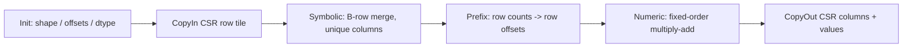

# 需求背景

## 需求来源

本设计对应昇腾社区任务《aclsparseSpGemm 算子开发(A2/A3)》：

- 任务书：[任务中心 1779b17a008643f287f4556df4d7c6b6](https://www.hiascend.com/activities/task-center/details/1779b17a008643f287f4556df4d7c6b6?menu=guide)
- 目标代码仓：[`cann/ops-sparse`](https://gitcode.com/cann/ops-sparse)，目标分支 `master`
- 设计文档仓：[`cann/cann-ops-competitions`](https://gitcode.com/cann/cann-ops-competitions)，目标目录 `04_tasks/01_community-task-2026/tasklist/08-14-aclsparseSpGemm-A2A3/qq_44786673/docs/design.md`
- 目标硬件：Atlas A2 与 Atlas A3；目标软件：PyTorch 2.7 及以上、torch_npu 26.0.0 及以上、仓库指定 CANN 版本
- 设计作者：GitCode `qq_44786673`（黄孔兰）

任务要求实现 `torch.sparse.mm(mat1, mat2)` 对应的
`aten::_sparse_sparse_matmul`，并提供与 cuSPARSE SpGEMM 阶段语义一致的
`aclsparseSpGEMM*` C 接口。A、B 为 `[M,K]`、`[K,N]` 的二维稀疏矩阵，C 为
`[M,N]` 的稀疏矩阵；A、B、C 的 C++ 表示使用 zero-based、`ACL_SPARSE_INDEX_32I`
CSR。必选数据类型为 `float16`、`bfloat16`、`float32` 和 `complex64`，四种类型都
必须贯通 Python、ATen、aclsparse、Host 和 Ascend C Kernel。

## 基线与现状审计

2026-08-21 对官方 `ops-sparse/master` 做了只读冻结，基线为：

```text
commit ae60d05a7224158e854d1a33b483f85c132f345a
tree   9683e0791161854939e14e519a2a9d700de6611a
```

该基线的 `include/cann_ops_sparse.h` 已提供通用稀疏描述符、状态码、数据类型和
CSR 创建接口；`sparse/common/aclsparse_descr_internal.h`、
`sparse/common/aclsparse_descr.cpp`、`sparse/common/aclsparse_host_utils.h` 提供描述符
转换、公共校验和平台信息读取；`sparse/spmm/arch22/spmm_host.cpp`、
`sparse/spmm/arch22/spmm_kernel.cpp`、`sparse/spmm/arch22/spmm.h` 展示了现有
arch22 的 Host/workspace/kernel 组织方式，但它们实现的是稀疏矩阵乘稠密矩阵，不能
直接当作 SpGEMM 实现。

### TBE、算子信息库与 dtype/format 对照

基线树中没有 `sparse/spgemm`、`aclsparseSpGEMM*`、Python/ATen SpGEMM 适配、TBE
SpGEMM 源码、SpGEMM OpDef 或硬件 op-info 条目。因此本设计先固定公开任务书规定的
接口与语义，代码实现阶段在官方规划接口实际合入后以其最新声明为准，避免重复声明
或产生 ABI 分叉。当前没有可复用的本地 TBE/GE 实现，不能把缺失的后端描述写成已有
能力。

### 外部组件依赖与内部适配模块

外部依赖为任务书指定的 ACL Runtime、Ascend C 编译器、PyTorch/torch_npu 和最终合入
的 SpGEMM 公开接口；不引入 cuSPARSE 二进制依赖，cuSPARSE 只作为语义和性能标杆。
内部适配模块沿用 `include/cann_ops_sparse.h`、`sparse/common/` 的描述符/handle/平台
工具，并新增架构无关的 SpGEMM 状态模块、Python/ATen dispatch 适配模块和 `arch22`
设备模块。具体文件名以代码 PR 所基于的最新官方主干为准。

官方讨论 218 的最新口径是“独立开发”；公开精度包暂时只含 FP32 和 complex64
是当前阶段的预期。该口径不改变任务书对 FP16、BF16、FP32、complex64 的实现和自测
要求。未合入的代码 MR（包括 !119，以及其他 SpGEMM 候选）不作为本设计或代码基线；
若在代码 PR 前官方主干先合入 SpGEMM，代码必须重新基于当时主干完成冲突处理和回归。

## 背景与目标

稀疏矩阵乘法的输出结构由输入 CSR 的乘积决定，不能预先假定 `nnz(C)`。实现需要在
设备上完成中间乘积计数、唯一列归并、前缀和、CSR 结构写出和数值累加，并在不做 CPU
fallback 的前提下满足动态 shape、空行/空列、长尾行、乘积膨胀和 complex64 抵消等
场景。A2/A3 与并行 A5 任务可能共享 Host 状态机，因此公共协议和硬件路径必须解耦。

# 需求分析

## 接口与调用阶段

Python 公开入口保持 PyTorch 语义，不新增私有 Python API：

```python
torch.sparse.mm(mat1, mat2) -> Tensor
```

底层 ATen schema 为：

```text
aten::_sparse_sparse_matmul(Tensor self, Tensor other) -> Tensor
```

C++ 层沿用任务书及最终合入的公开头文件声明，不重复新增同名接口。阶段顺序为：

1. `aclsparseSpGEMMCreateDescr` 创建不透明阶段描述符；
2. `aclsparseSpGEMMWorkEstimation` 查询并执行阶段 1，校验 CSR、计算中间乘积数；
3. `aclsparseSpGEMMGetNumProducts` 查询中间乘积数量；
4. `aclsparseSpGEMMEstimateMemory`（ALG2/ALG3 及声明的其他算法）查询阶段 2/3
   workspace；
5. `aclsparseSpGEMMCompute` 生成规范化输出结构和数值；
6. 根据查询到的 `nnz(C)` 为 matC 设置足额 CSR 指针；
7. `aclsparseSpGEMMCopy` 把内部结构和值写入 matC；
8. `aclsparseSpGEMMDestroyDescr` 释放阶段状态。

每个阶段都检查 handle、描述符、stream、操作类型、数据类型、维度、索引类型、
workspace 容量和阶段状态。阶段接口保持调用方 stream 异步；只有必须向 Host 返回的
`nnz(C)`、workspace size 或状态查询执行最小的结果同步。

## 输入、输出和错误语义

| 项目 | 设计约束 |
| --- | --- |
| A/B/C | C++ 层均为 CSR、zero-based、row offsets/column indices 均 `ACL_SPARSE_INDEX_32I` |
| 操作 | 第一版仅支持 `ACL_SPARSE_OP_NON_TRANSPOSE`；transpose/conjugate-transpose 返回明确的不支持状态 |
| dtype | A、B、C、`computeType` 同为 FP16/BF16/FP32/complex64 之一；不隐式改变 C++ 类型 |
| shape | A 为 `[M,K]`，B 为 `[K,N]`，C 为 `[M,N]`；不做矩阵维度广播 |
| CSR | 输入行内列索引严格升序且无重复；输出 row offsets 单调非降、列索引严格升序、无重复坐标 |
| 重复与显式零 | 同坐标乘积按固定顺序累加；抵消得到的显式零仍写出并计入 `nnz(C)` |
| 空输入 | `nnz=0`、空行、空列、无交集和零输出均返回合法 CSR，不读取越界地址 |
| 溢出 | 维度、nnz、前缀和或 workspace 超出 32 位索引/设备资源时返回确定的无效值或资源不足状态，不暴露部分输出 |
| 非连续输入 | Python 层只在能建立合法连续 CSR 元数据时接受；其余情况在 Host 返回明确错误，不转 CPU |

`complex64` 采用现有 `aclsparseComplex {float x; float y;}` 的实部/虚部布局。乘加
顺序固定为 A 行中的 CSR 顺序再接 B 行中的列顺序；实部和虚部都在 FP32 域累加，
不因数值抵消删除结构条目。Python/ATen 层按目标 PyTorch 2.7+ 的 sparse promotion
和 layout 语义处理输入组合，进入 C++ 前把支持的稀疏布局转换为 CSR，返回前恢复目标
PyTorch 规定的输出 layout/coalesced 状态。

## 交付边界

代码 PR 将统一包含：公开头文件声明（若规划接口尚未合入则先适配其最终版本）、公共
描述符/状态机、A2/A3 Host 与 Ascend C Kernel、Python/ATen dispatch 和 CSR 输出构造、
C++ UT、端到端测试和接口文档。设计文档本身只描述约束、架构和可观测标准，不记录
任何尚未执行的设备结果、run ID、日志、截图或哈希。

# 详细设计

## 总体架构

```mermaid
flowchart TD
    P[torch.sparse.mm] --> A[ATen sparse dispatch]
    A --> V[在 NPU 上规范化为 int32 CSR]
    V --> H[aclsparse SpGEMM Host 状态机]
    H --> W[WorkEstimation / product count]
    W --> E[EstimateMemory]
    E --> C[Compute: symbolic + numeric]
    C --> Q[查询 nnz(C) 并设置 matC 指针]
    Q --> K[Copy: CSR row/col/value 写回]
    K --> O[按 PyTorch 语义构造稀疏输出]
    H --> X[arch22 A2/A3 Kernel]
    H --> Y[arch35 A5 Kernel 保留独立路径]
```

公共目录只保存 API、描述符、参数校验和阶段协议；硬件目录分别保存 `arch22` 与
`arch35` 的 kernel launch、tiling 和设备实现。CMake 根据实际 SoC 选择路径，避免
A2/A3 与 A5 修改同一份硬件源文件。

## Host 设计

### 描述符状态和快照

SpGEMM 描述符保存：阶段状态、A/B/C 的 shape 与 nnz 快照、CSR 指针身份、索引类型、
dtype/computeType、opA/opB、算法枚举、alpha/beta 的 pointer mode 快照、调用 stream、
各阶段 workspace 偏移和内部 `nnz(C)`。描述符不拥有矩阵或调用方 workspace；Destroy
只释放 Host 状态和内部临时资源。

状态机为：

```text
CREATED -> WORK_READY -> MEMORY_READY(optional)
        -> COMPUTE_READY -> COPIED
```

阶段间若 shape、CSR 指针、dtype、算法、stream 或标量契约改变，返回无效状态并要求
重新从 WorkEstimation 开始。这样可以防止用户在 Compute 与 Copy 之间修改输入。

### 校验与维度

Host 首先复用 `sparse/common/aclsparse_descr_internal.h` 的描述符转换和公共索引检查，
再完成 SpGEMM 特有校验：`A.cols == B.rows`、C 的 shape、row offsets 首尾与 nnz、
列索引范围/排序、三数组地址区间不重叠。`opA/opB` 非 NON_TRANSPOSE、非四种支持
dtype 或非 CSR 时立即返回，不启动 kernel。

### 分核策略、LocalMemory 和 TilingKey

平台核数和 UB 容量通过现有 `sparse/common/aclsparse_host_utils.h` 的平台查询封装
获得，不硬编码物理卡号：

```text
C_platform = GetAivCoreCount()
U_platform = GetUbSize()
U_effective = U_platform - U_reserved
W = sum_i sum_{p in row(A_i)} nnz(row(B[col_p]))
C_used = min(C_platform, max(1, ceil(W / W_target)))
tile_bytes = floor(U_effective / buffer_count)
tile_bytes = align_down(tile_bytes, 32)
```

`C_used` 受 `[1, C_platform]` 限制；短输入不盲目满核，长尾输入按估计乘积量而不是
仅按行数分配。每个阶段的 Local/UB buffer 独立计算，FP16/BF16/FP32/complex64 按
元素字节数重新求 tile，尾块以实际字节数搬运并保持 32 字节对齐。所有 workspace
字段使用字节单位并以 64 字节对齐，TilingData 只放 shape、dtype、分核数、阶段偏移、
元素计数和状态，不放裸 Host 指针。

TilingKey 只用于选择已经在 Host 校验过的稳定分支：通用动态 CSR、短行批处理和
长尾分段可以使用不同 key；dtype、索引宽度、SoC 和是否需要 beta 流必须编码进 key，
未满足约束时回到通用 key。设计不把输入值统计结果当作未经验证的 TilingKey 条件。

### 四阶段 workspace

```text
buffer1: per-core WorkStat + product-count/status reduction
buffer2: rowCounts + internalRowOffsets + merge cursors + stage status
buffer3: algorithm-specific temporary reservation (64-byte aligned)
```

空间复杂度按 `O(M + nnz(A) + C_used)` 规划；不把所有中间乘积 materialize 为 Host
数组。`bufferSize1/2/3` 返回精确字节数，执行阶段检查调用方传入容量，少一字节也
返回 `ACL_SPARSE_STATUS_INSUFFICIENT_RESOURCES`。内部 row offsets 完成前不写用户
matC，避免失败时留下半成品。

### 阶段实现

1. **WorkEstimation**：设备按 A 的行切分，读取 B 对应行长度并累计中间乘积数；同时
   校验 CSR 元数据。归约结果写入 buffer1，`GetNumProducts` 只读取一个结果标量。
2. **EstimateMemory**：根据输入快照、算法和 `chunkFraction` 计算 buffer2/3；非法
   fraction、算法或阶段状态不启动设备任务。第一版可以让声明的算法共享确定性通用
   kernel，但保留独立枚举和 workspace 契约。
3. **Compute**：每个 A 行对有序 B 行执行固定顺序的 k-way merge，先生成每行唯一列
   计数和内部 row offsets，再按同一顺序执行数值归并。`nnz(C)` 通过 matC size
   查询点暴露给 Host。
4. **Copy**：调用方设置足额的 C row/column/value 指针后，设备复用内部 offsets 和
   cursors，将规范化结构和值写出。Copy 不重新解释输入，也不隐式分配用户内存。

## Kernel 侧设计

### Ascend C 入口与调度

计划新增 `sparse/spgemm/arch22/` 的 Host/Kernel 源文件和对应头文件；文件命名、
launch 原型和 CMake 条目以代码仓在实现时的现有 SpGEMM规划目录为准。A2/A3 共用
DAV-2201 设备算法，A5 的 `arch35` 只共享公共数据结构和接口协议，不共享 SoC 专用
intrinsic。

Kernel 采用 `Init` 读取 TilingData、建立 GM 视图和 UB 队列，`Process` 按阶段执行。
下面的 Ascend C实现流程图描述设备内实际的 CSR 处理，不只是 Host 到设备的分派：



### Ascend C实现流程图

上图中的 CopyIn、symbolic、prefix、numeric、CopyOut 对应同一 stream 上的设备阶段；
每一阶段只访问自己的 workspace 区段，输出结构在 prefix 成功后才对外可见。

Work、symbolic、prefix 和 copy 的写区间通过 tiling 偏移隔离；Copy 以连续输出 nnz
区间分核，每核只写自己的半开区间，避免原子写和重复坐标。超长行按小段处理，尾块
用 `DataCopyPad` 或当前 CANN 版本等价接口按实际长度写回。Kernel 只使用当前版本
Ascend C 编译器确认支持的 intrinsic，不能把历史 API 名称当成编译保证。

### 数值和 dtype 路径

- FP16/BF16：输入搬运保持原类型，累加域为 FP32，输出按 C dtype 转回；不得因公开
  包暂缺用例而删除这两条路径。
- FP32：按固定 CSR 顺序累加，必要时在长归并链使用补偿累加；输出保持 FP32。
- complex64：每个元素以 `{real, imag}` 读取，执行 `(ar*br-ai*bi, ar*bi+ai*br)`，
  实虚分量分别累加；结构归并按列索引完成，不以绝对值筛零。
- alpha/beta：按 pointer mode 在 Host 或同一 stream 上读取，类型与 computeType
  一致；`beta=0` 不读取 C values，但仍验证 C 的结构容量契约。

### 异常传播和确定性

Kernel 将 INVALID_INPUT、OVERFLOW、SUCCESS 等小状态与计数写入设备结果区；Host 在
公开查询点转换为统一 `aclsparseStatus_t`。所有行的遍历和归并顺序固定，确定性算法
不使用未排序原子归约；输入非法或前缀和溢出时不写用户输出。

## Python / ATen 适配

ATen 注册只覆盖既有 `aten::_sparse_sparse_matmul` 的 NPU dispatch，不增加新的公开
算子名。适配层完成：

1. 检查 device、rank、layout、dtype 和矩阵维度；
2. 在 NPU 上把目标 PyTorch 版本允许的 COO/CSR 输入规范化为连续 int32 CSR，合并
   COO 重复坐标并保留 coalesced 语义；
3. 在当前 torch_npu stream 上调用四阶段 C API，查询动态 `nnz(C)` 后分配 NPU 输出；
4. 调用 Copy 后按输入/目标版本语义构造 CSR 或 coalesced COO 输出；
5. 用 stream 保活机制保持输入、workspace 和输出 storage 直到 Copy 完成。

任何不支持的 layout、非二维输入、dtype 不一致、索引溢出或 NPU 资源错误都直接抛出
明确异常；不得通过 dense 化、CPU `torch.sparse.mm` 或隐式 CPU 排序掩盖未实现路径。

## 特性交叉与兼容性分析

SpGEMM 同时涉及 Python/ATen 稀疏 layout、C++ 多阶段 ABI、CSR 结构规范化、四种
dtype 和两类硬件路径。交叉约束由 Host 的单一快照校验承接：Python 只负责 layout
转换和输出包装，C++ 负责阶段协议与错误码，Kernel 负责设备内结构/数值计算；任一
层发现不匹配都不得隐式转 CPU。

## A2/A3 与 A5 共存

公共接口、状态机、CSR 校验和 workspace 描述放在架构无关目录；A2/A3 的 kernel 与
编译配置位于 `arch22`，A5 任务的实现位于 `arch35`。根 CMake 根据 SoC 映射选择一套
实现，未选中的架构不参与当前包。后合入的 PR 必须以届时官方主干为基线，先解决
公共 Host 冲突，再分别运行 A2/A3 或 A5 的回归；不能通过复制另一 PR 的未合入提交
绕过集成。

# 支持硬件

| 硬件 | 设计路径 | 目标 |
| --- | --- | --- |
| Atlas A2（910B 系列，DAV-2201） | `arch22` | 功能、精度、异常和结构验证 |
| Atlas A3（910_93 系列，DAV-2201） | `arch22` | 功能、精度及任务书 P-01/P-02/P-03 性能验证 |
| Atlas 950/A5 | `arch35`（并行任务边界） | 不在本 A2/A3 设计的硬件验收范围 |

## 构建与使能约束

代码阶段沿用仓库 `build.sh` 的 SoC 参数和现有 CMake 组织；设计不引入环境变量开关
或 CPU fallback。纯 aclsparse 构建不强制依赖 PyTorch，Python/ATen 扩展通过仓库既有
构建选项显式启用。运行时以调用方 stream 为准，不创建隐式同步 stream。

# 算子约束限制

1. 仅支持二维 CSR SpGEMM；A 的列数必须等于 B 的行数。
2. C++ 层仅支持 zero-based、int32 CSR 和 NON_TRANSPOSE；转置及不匹配索引类型返回明确状态。
3. 四种必选 dtype 必须端到端可用；FP16/BF16 不因当前公开测试包范围而降级或省略。
4. 输出结构必须规范化，重复坐标合并，显式零保留，`rowOffsets`/`colIndices` 精确可验。
5. 所有 shape、nnz、workspace 和地址区间在 Host 侧检查；不产生越界或部分输出。
6. 设备执行必须异步且确定；输入和 workspace 在 stream 完成前由调用方保持有效。
7. 设计不宣称任何真机性能、精度或 profiler 结果；这些内容只进入后续自测报告和验收证据。

# 可维可测分析

## 精度标准/性能标准

| 验收维度 | 判定标准 | 来源 |
| --- | --- | --- |
| 结构 | `nnz(C)`、row offsets、列索引和排序与 CPU Golden 精确一致 | A2/A3 任务书 |
| values | FP16/BF16/FP32 按任务书混合容差；complex64 实部和虚部分别按 FP32 混合容差 | A2/A3 任务书、生态算子开源精度标准 |
| 功能 | A2、A3 四种 dtype，边界 CSR、完整多阶段和异常状态 | A2/A3 任务书 |
| 性能 | A3 每个 case×dtype 倍率大于 A100 的 0.25，量化场景平均不低于 0.35 | A2/A3 任务书 |
| 无回退 | Dispatch、Profiler 和库加载证据显示核心计算在 NPU | A2/A3 任务书 |

实现需为上述标准提供可观测点：阶段返回码、workspace size、`numProducts`、动态
`nnz(C)`、kernel 名称/架构、输入只读性和输出 CSR 校验。实际测试矩阵、run 身份、
采样次数、日志、截图、Profiler 文件和哈希在代码 PR/自测报告/证据归档中记录，不在
本设计文档中预填。

## 兼容性分析、风险与回滚

- **公开 ABI**：沿用最终合入的 `aclsparseSpGEMM*` 声明和现有不透明描述符模式；若
  规划实现先合入，先 rebase 再适配，不保留重复声明。
- **dtype 回归**：complex64 扩展不得改变 FP16/BF16/FP32 的校验、累加和输出路径；以
  dtype 参数化 Kernel 和独立结构校验隔离风险。
- **A5 冲突**：公共 Host 只保留一次，硬件代码按 `arch22/arch35` 分离；后合入方基于
  新主干完成两侧回归。
- **资源不足**：在 EstimateMemory 或前缀和阶段返回资源不足并保留输入不变；不自动
  切换 CPU 或静默缩小输出。
- **回滚**：通过 CMake SoC 路由和独立提交回退 SpGEMM 路径；不修改既有 SpMM/SpMV
  行为，便于按文件和符号范围回滚。

## 修订记录

| 日期 | 版本 | 说明 |
| --- | --- | --- |
| 2026-08-21 | v0.1 | 基于官方 `ops-sparse/master` `ae60d05` 独立建立 A2/A3 设计；记录无本地 SpGEMM 基线、四 dtype 约束、公共/架构分层和官方讨论口径 |
