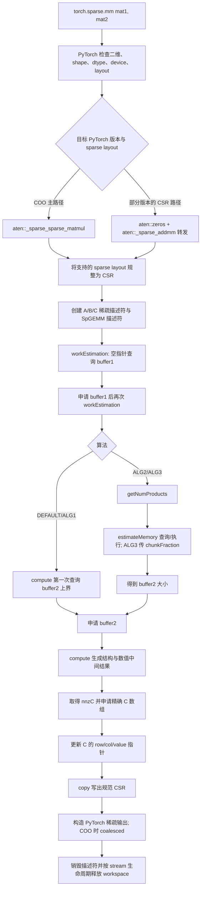
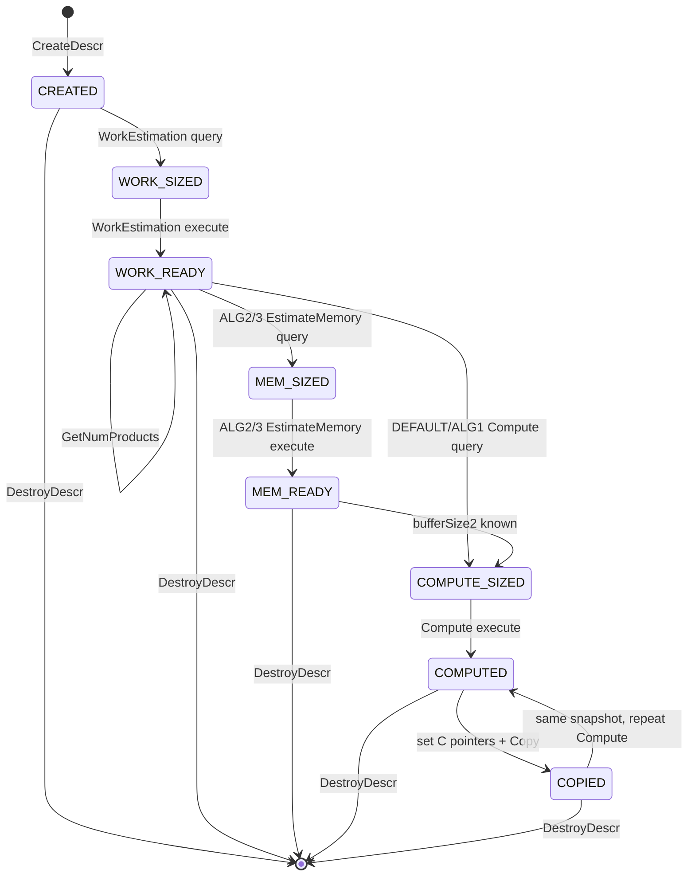
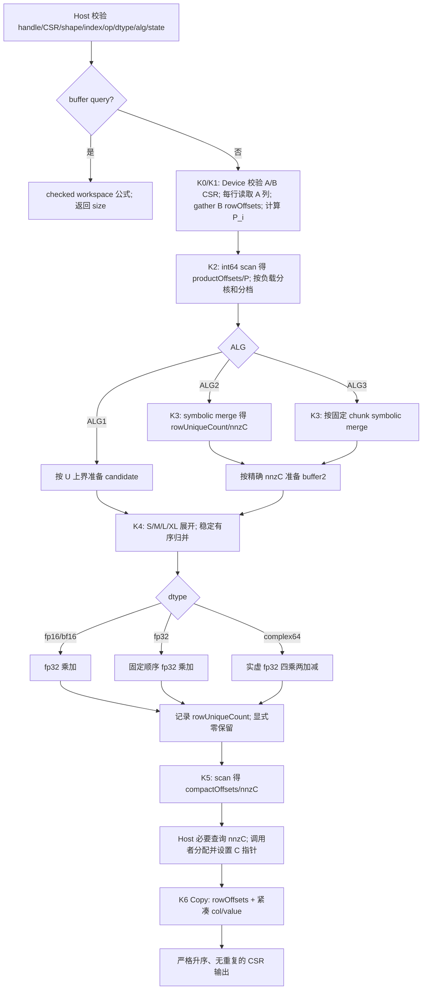
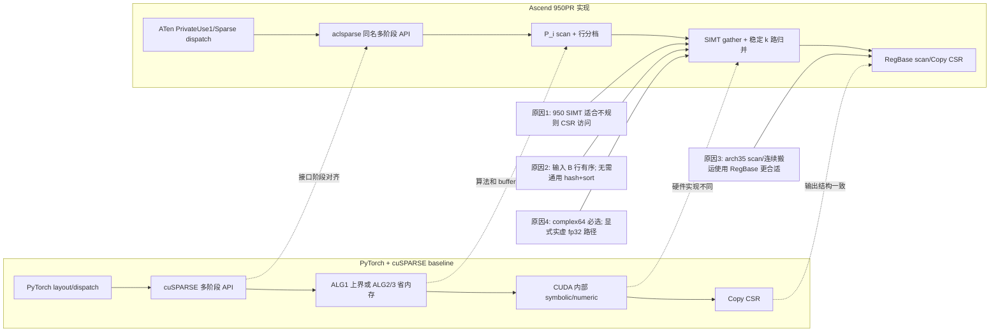

# aclsparseSpGemm 算子开发（Ascend 950PR）设计文档

| 版本 | 日期 | 说明 |
|---|---|---|
| v0.1 | 2026-08-17 | 根据 950 任务书、社区流程、PyTorch/cuSPARSE 语义及 `ops-sparse` 当前基线形成离线设计 |

> 文档状态：设计评审稿。本文中的阈值、workspace 公式和 Kernel 数量是实现约束或初始方案；凡标记“待测”的性能数据均须在 Ascend 950PR 真机验证后更新，不作为实测结论。

# 一、需求背景（required）

## 1.1 需求来源

本设计对应 2026 年 8 月社区任务“`aclsparseSpGemm 算子开发(950)`”。任务要求参考 PyTorch 2.7 及以上版本的 `torch.sparse.mm`/`aten::_sparse_sparse_matmul` 行为，在 Ascend 950PR 上打通 Python、ATen NPU、aclsparse C++ 多阶段接口、Ascend C Kernel 和稀疏输出构造全链路。

交付代码统一进入 [`cann/ops-sparse`](https://gitcode.com/cann/ops-sparse) `master`；设计文档通过 PR 提交到 [`cann/cann-ops-competitions`](https://gitcode.com/cann/cann-ops-competitions)。PR 标题按活动页面要求使用 `【CANN社区任务】aclsparseSpGemm算子设计文档`，提交后按流程 @ `condfuse_3`、`fullt`、`Ascend-CANN`。

截至 `cann-ops-competitions@6cbf4ae`，master 尚未合入本任务目录；同一 A5 任务的并行设计 PR 已共同采用 `tasklist/08-aclsparseSpGemm/<贡献者>/docs/design.md`。本文按该已确认结构提交到 `L6662004/docs/design.md`，不会修改其他贡献者目录。

## 1.2 背景介绍

稀疏矩阵乘法定义为：

$$
C' = \alpha\,op(A)\,op(B) + \beta C_{in},
$$

其中 $A\in\mathbb{F}^{M\times K}$、$B\in\mathbb{F}^{K\times N}$，$\mathbb{F}$ 为 fp16、bf16、fp32 或 complex64。任务范围内 `op(A)=A`、`op(B)=B`；transpose 与 conjugate-transpose 均返回不支持。

SpGEMM 与稠密 GEMM 的关键差异是：输出结构和 `nnz(C')` 在计算前通常未知。实现既要生成数值，又要完成符号分析、重复坐标归并、严格列排序和最终 CSR 紧凑化，因此采用对标 cuSPARSE 的多阶段接口。

### 1.2.1 aclsparseSpGemm 实现及当前仓库现状

2026-08-17 检查 `ops-sparse/master` 基线 `c7a02aa95cb28c43aea1326d7e14691b30ed6ad0`：

- `include/cann_ops_sparse.h` 尚无 `aclsparseSpGEMM*` 声明；
- `sparse/` 尚无 `spgemm/` 实现；
- 已有 `sparse/spmm/arch35/` 可复用 950 的 Host/Kernel dispatch、`__NPU_ARCH__==3510`、`asc_vf_call` 和 SIMT 工程组织方式；
- 2026 年 7 月 SpGEMM 任务已有两份设计稿，但其 Host symbolic 或逐输出坐标扫描方案不满足本任务“核心计算不得 CPU fallback”、950 性能和 complex64 要求，不能直接作为实现。

因此，本任务按“公共 SpGEMM 基建 + arch35 差异实现”设计。代码开发开始前再次同步主干：若 A2/A3 或前置 SpGEMM PR 已合入，后提交方必须 rebase 并合并公共逻辑，不重复新增同名/同功能接口。

### 1.2.2 PyTorch/cuSPARSE baseline 现状分析

参考路径：

- PyTorch schema：`aten/src/ATen/native/native_functions.yaml`
- PyTorch CUDA 稀疏实现：`aten/src/ATen/native/sparse/cuda/SparseCUDATensorMath.cu`
- PyTorch API：<https://docs.pytorch.org/docs/stable/generated/torch.sparse.mm.html>
- CUDA 13.3 Update 1 cuSPARSE SpGEMM：<https://docs.nvidia.com/cuda/cusparse/index.html#cusparseSpGEMM>

#### 1.2.2.1 baseline 支持的数据类型和数据格式

任务 baseline 为 PyTorch sparse-sparse matmul 与 cuSPARSE Generic SpGEMM，而不是 TBE Kernel。任务范围固定 values 为 fp16、bf16、fp32、complex64；Python 输入使用目标 PyTorch 版本支持的稀疏 layout，进入 C++ 前规整为 int32、zero-based、行内列有序的 CSR。C++ 仅支持 `NON_TRANSPOSE × NON_TRANSPOSE`，输出为行内列索引严格升序的 CSR。

#### 1.2.2.2 baseline 实现描述

基线由 Python/ATen dispatch、CSR 描述符、多阶段 workspace 查询/执行、结构查询和结果拷贝构成。任务不存在可直接对照的 TBE SpGEMM，因此以下 PyTorch/CUDA/cuSPARSE 管线作为 baseline 流程图。

#### 1.2.2.3 baseline 实现流程图



cuSPARSE 13.3 的算法语义作为接口对标：DEFAULT 当前路由 ALG1；ALG1 以更大内存换性能；ALG2 经 `estimateMemory` 降低内存；ALG3 按 `chunkFraction * numProducts` 分块、进一步降低峰值内存；三者均应重复运行 bit-wise deterministic。本任务输入约束比 cuSPARSE 更窄：只接收已排序的 int32 zero-based CSR 和 `N×N` operation 组合。

# 二、需求分析（required）

## 2.1 外部组件依赖

- PyTorch 2.7 及以上：公开入口、ATen schema、稀疏 Tensor 语义。
- torch_npu 26.0.0 及以上：NPU dispatch、allocator、current stream 和 sparse layout 适配。
- CANN/ACL Runtime 与 `ops-sparse`：aclsparse handle、CSR 描述符、stream 和 arch35 构建体系。
- cuSPARSE 13.3 Update 1：仅作为多阶段接口、算法语义和 A100 性能标杆，不作为 NPU 运行时依赖。

不新增第三方运行时依赖，核心计算不得调用 CPU 或 CUDA 实现。

## 2.2 内部适配模块

- `include/cann_ops_sparse.h`：公开枚举、不透明描述符和七个接口声明。
- `sparse/spgemm/common`：公共参数校验、描述符状态机和 workspace checked arithmetic。
- `sparse/spgemm/arch35`：Ascend 950PR Host dispatch、tiling 和 Kernel。
- ATen/torch_npu 适配层：`_sparse_sparse_matmul` 注册、layout 转换和输出构造。
- `test/spgemm` 及 Python 测试：C++ 多阶段、精度、性能、异常和端到端验证。

## 2.3 需求模块设计

实现如下链路，核心符号分析和数值计算均在 NPU 执行：

```text
torch.sparse.mm
  → aten::_sparse_sparse_matmul (NPU)
  → aclsparseSpGEMM* 多阶段接口
  → Ascend 950PR Ascend C Kernel
  → CSR/目标 PyTorch sparse layout 输出
```

支持 dynamic `M/K/N/nnzA/nnzB/numProducts`，且输出满足：

- CSR `rowOffsets` 单调非降；
- 每行 `colIndices` 严格升序；
- 同坐标所有乘积按固定次序累加后只保留一个条目；
- 由合法输入产生的显式零仍保留并计入 `nnz(C)`；
- Python 返回 COO 时必须为 coalesced；
- 所有声明算法重复运行的结构及 values bit-wise 一致。

### 2.3.1 Ascend C 算子原型及需求拆解

1. **公共接口层**：公开七个 `aclsparseSpGEMM*` 函数、算法枚举和不透明描述符；实现参数校验、状态机、错误码和 workspace 生命周期。
2. **Host/tiling 层**：按每行中间乘积数 $P_i$ 建模，使用设备侧 scan，按工作量而非简单行数分核；派发 DEFAULT/ALG1/ALG2/ALG3 和 dtype/行档位。
3. **arch35 Kernel**：使用 Ascend 950PR 的 SIMT/RegBase 能力完成不规则 gather、展开、有序归并、数值累加、scan 和紧凑化。
4. **complex64**：贯通描述符、Host、Kernel、Copy 和测试；实虚分量按 fp32 语义计算。
5. **ATen/Python**：注册 NPU 实现，处理 sparse layout、allocator、当前 stream、`nnzC` 和输出构造，证明不发生 CPU fallback。
6. **验证**：同时校验 CSR 结构与 values；覆盖官方测试、自建 fp16/bf16、异常、确定性和三组性能大用例。

### 2.3.2 输入输出规格

| 参数 | 方向 | 格式/位置 | dtype | shape/约束 |
|---|---|---|---|---|
| `matA/self` | 输入 | Python 支持的 sparse layout；C++ 为 CSR | fp16/bf16/fp32/complex64 | `[M,K]`，列有序、无非法索引 |
| `matB/other` | 输入 | Python 支持的 sparse layout；C++ 为 CSR | 与 A 相同 | `[K,N]`，列有序、无非法索引 |
| `alpha` | 输入 | pointer mode 指定的 Host/Device 标量 | 与 computeType 相同 | 非空 |
| `beta` | 输入 | pointer mode 指定的 Host/Device 标量 | 与 computeType 相同 | 非空；`beta=0` 时不读取 `C_in` values |
| `matC` | 输入/输出描述符 | C++ 为 CSR | 与 A/B/computeType 相同 | 输出 `[M,N]`；Copy 前设置精确容量的 device 指针 |
| Python output | 输出 | 遵循目标 PyTorch 版本 | 与输入类型提升语义一致 | `[M,N]`，稀疏输出 |

C++ 限定 `csrRowOffsetsType == csrColIndType == ACL_SPARSE_INDEX_32I`、`ACL_SPARSE_INDEX_BASE_ZERO`。内部总数和偏移使用 int64；任何 shape、`numProducts`、`nnzC` 或最终偏移超出 int32 CSR 表示范围时，在写出前返回明确错误。

### 2.3.3 Ascend C 算子相关约束

- A/B 必须为二维且 `A.cols == B.rows`，不广播。
- A/B/C/computeType 必须是相同的四种 dtype 之一。
- 仅 `ACL_SPARSE_OP_NON_TRANSPOSE`；包括 complex64 的 conjugate transpose 在内均返回 `NOT_SUPPORTED`。
- A/B 的 rowOffsets 必须从 0 开始、单调非降、末项等于 nnz；列索引在 `[0,cols)` 且行内严格升序。
- `nnzA==0`、`nnzB==0`、任一维为 0 或无交集时返回合法空 CSR：rowOffsets 全 0，`nnzC=0`。
- 输出结构按代数操作的坐标并集生成；数值恰好抵消为 `+0/-0` 也不删除该坐标。NaN/Inf 仅按浮点规则传播，不参与“是否保留坐标”的判断。
- 非连续 sparse values/metadata 若目标 PyTorch 语义可规整，则在 ATen 层用 NPU contiguous/转换；C++ 直接传入不满足描述符连续约定的指针则返回错误。

# 三、详细设计（required）

## 3.1 使能方式

Python 公开入口通过目标 PyTorch/torch_npu 的 NPU sparse dispatch 命中 `aten::_sparse_sparse_matmul`，内部调用 aclsparse SpGEMM 多阶段接口。C++ 调用者先设置 handle 的当前 stream，依次执行描述符创建、workspace 查询/执行、Compute、C 指针更新、Copy 和描述符销毁；Kernel 由 arch35 dispatch 在同一 stream 上启动。

## 3.2 需求总体设计与算子分析

### 3.2.1 行式计算模型

采用行式 Gustavson 展开。对于 A 的第 i 行：

$$
C(i,:) = \sum_{k\in\operatorname{supp}(A_i)} A(i,k)B(k,:),
\qquad
P_i = \sum_{k\in\operatorname{supp}(A_i)} nnz(B_k),
$$

$$
P=\sum_{i=0}^{M-1}P_i=\texttt{numProducts}.
$$

输入 B 每行列索引有序，所以每个 $A(i,k)$ 展开得到一个有序段。对这些段进行稳定 k 路归并：选择最小列号；相同列按 A 行内顺序、再按 B 行内顺序做乘加；只写一个 `(col,value)`。这同时解决去重、列排序和确定性。

不采用通用 hash 主路径：hash 探测是不规则标量访问，冲突顺序难以固定，并且仍需额外排序才能满足严格列升序。不采用“对每个可能的 C(i,j) 重扫 A/B”：其复杂度随 N 放大，无法满足性能大用例。

### 3.2.2 dtype 计算策略

| dtype | 输入/输出存储 | 乘法/累加 | 候选值字节 `vAcc` |
|---|---:|---|---:|
| fp16 | 2 B | fp32 乘加，Copy 时按规定舍入为 fp16 | 4 B |
| bf16 | 2 B | fp32 乘加，Copy 时 RINT 转 bf16 | 4 B |
| fp32 | 4 B | fp32，固定顺序朴素累加 | 4 B |
| complex64 | 8 B | 两个 fp32 分量，固定顺序复乘加 | 8 B |

complex64 使用标准四实乘、两加减：

```text
real += ar * br - ai * bi
imag += ar * bi + ai * br
```

不使用三乘 Gauss 变体，避免抵消场景引入额外误差。相同列的复数项严格按段序累加；实部和虚部分别满足 fp32 混合容差。

### 3.2.3 算法枚举

| 算法 | 计算方式 | 峰值空间 | 目标 |
|---|---|---|---|
| DEFAULT | 路由 ALG1 | 较高 | 默认高性能 |
| ALG1 | 中间乘积上界候选区，Compute 一遍生成并归并，Copy 紧凑化 | $O(P)$ | 最快，官方性能主路径 |
| ALG2 | EstimateMemory symbolic count，Compute numeric merge | $O(nnzC)$ 加 scratch | 较少内存，性能次之 |
| ALG3 | 固定 `chunkFraction` 分块 symbolic/numeric | $O(nnzC+P\cdot f)$ | 用户可控最低内存 |

所有算法均保证同一算法、同一输入重复执行 bit-wise 一致。不同算法因分块边界不同，不承诺跨算法 bit-wise 相同，但均须满足精度标准。

## 3.3 C++ 多阶段接口设计

接口签名严格以任务书及前置 SpGEMM 最终合入版本为准：

```c
aclsparseStatus_t aclsparseSpGEMMCreateDescr(aclsparseSpGEMMDescr_t *descr);
aclsparseStatus_t aclsparseSpGEMMDestroyDescr(aclsparseSpGEMMDescr_t descr);

aclsparseStatus_t aclsparseSpGEMMWorkEstimation(
    aclsparseHandle_t handle,
    aclsparseOperation_t opA, aclsparseOperation_t opB,
    const void *alpha,
    aclsparseConstSpMatDescr_t matA,
    aclsparseConstSpMatDescr_t matB,
    const void *beta,
    aclsparseSpMatDescr_t matC,
    aclDataType computeType,
    aclsparseSpGEMMAlg_t alg,
    aclsparseSpGEMMDescr_t spgemmDescr,
    size_t *bufferSize1, void *externalBuffer1);

aclsparseStatus_t aclsparseSpGEMMGetNumProducts(
    aclsparseSpGEMMDescr_t spgemmDescr, int64_t *numProds);

aclsparseStatus_t aclsparseSpGEMMEstimateMemory(
    aclsparseHandle_t handle,
    aclsparseOperation_t opA, aclsparseOperation_t opB,
    const void *alpha,
    aclsparseConstSpMatDescr_t matA,
    aclsparseConstSpMatDescr_t matB,
    const void *beta,
    aclsparseSpMatDescr_t matC,
    aclDataType computeType,
    aclsparseSpGEMMAlg_t alg,
    aclsparseSpGEMMDescr_t spgemmDescr,
    float chunkFraction,
    size_t *bufferSize3, void *externalBuffer3,
    size_t *bufferSize2);

aclsparseStatus_t aclsparseSpGEMMCompute(
    aclsparseHandle_t handle,
    aclsparseOperation_t opA, aclsparseOperation_t opB,
    const void *alpha,
    aclsparseConstSpMatDescr_t matA,
    aclsparseConstSpMatDescr_t matB,
    const void *beta,
    aclsparseSpMatDescr_t matC,
    aclDataType computeType,
    aclsparseSpGEMMAlg_t alg,
    aclsparseSpGEMMDescr_t spgemmDescr,
    size_t *bufferSize2, void *externalBuffer2);

aclsparseStatus_t aclsparseSpGEMMCopy(
    aclsparseHandle_t handle,
    aclsparseOperation_t opA, aclsparseOperation_t opB,
    const void *alpha,
    aclsparseConstSpMatDescr_t matA,
    aclsparseConstSpMatDescr_t matB,
    const void *beta,
    aclsparseSpMatDescr_t matC,
    aclDataType computeType,
    aclsparseSpGEMMAlg_t alg,
    aclsparseSpGEMMDescr_t spgemmDescr);
```

### 3.3.1 两次调用约定

- `WorkEstimation`：`externalBuffer1==nullptr` 时只做 Host 可见元数据校验并返回 `bufferSize1`；申请后第二次调用在 Device 校验 CSR rowOffsets/colIndices，同时执行 $P_i/P$ 计算、scan 和分档。
- `GetNumProducts`：WorkEstimation 执行成功后即可调用，对所有 dtype/算法返回同一定义的中间乘积数量；ALG1 可选查询，ALG2/ALG3 的内存规划使用该结果。
- DEFAULT/ALG1 `Compute`：第一次 `externalBuffer2==nullptr` 返回 buffer2 上界；第二次用用户提供的 buffer 执行。
- ALG2/ALG3：先查询 `bufferSize3`，申请并再次 `EstimateMemory`，由 symbolic 结果返回 `bufferSize2`；随后 `Compute`。
- `Compute` 完成后通过 C 描述符的标准 size 查询取得 `nnzC`。调用者申请精确 row/col/value 数组并用 `aclsparseCsrSetPointers` 更新 C，最后调用 `Copy`。
- workspace 由调用者持有，最后一个使用它的 Kernel 在 handle stream 上完成前不得释放或复用。

| buffer | 产生/使用阶段 | 最短生命周期 |
|---|---|---|
| buffer1 | WorkEstimation execute；Compute 可复用其中的 $P_i$/offset/分档 | 从第二次 WorkEstimation 到 Compute stream 工作完成 |
| buffer3 | ALG2/ALG3 EstimateMemory execute | 到 EstimateMemory stream 工作及 Host size 回读完成 |
| buffer2 | Compute 中间结果；Copy 读取 | 从 Compute execute 到 Copy stream 工作完成 |

### 3.3.2 描述符状态机



描述符保存 `alg`、dtype、shape/nnz/索引类型、A/B/C 指针快照、stream 身份、$P$、`nnzC`、三个 buffer 的需求/已提供大小、chunkFraction、tiling 元数据和当前状态。后续阶段复核快照；输入结构或算法改变需重新执行 WorkEstimation。只更新 values 且结构不变的重用能力，以前置公共实现最终约定为准。

CSR rowOffsets/colIndices 位于 Device，Host 不能直接验证其单调性、边界和排序。第二次 WorkEstimation 将 A/B 结构校验与行工作量统计融合，最终只回读 `{status, P}` 小标量，使接口能够对非法索引返回明确错误；不把 CSR 数组搬回 CPU。`GetNumProducts` 随后从描述符返回已取得的 Host 标量，不再重复同步。Compute 后为更新 `nnzC`、分配精确输出而进行的标量回读也是语义必需，并单独计入阶段与端到端耗时；除此之外不增加 Host 同步。

### 3.3.3 错误码

| 条件 | 返回值 |
|---|---|
| handle/descriptor 未初始化 | `ACL_SPARSE_STATUS_NOT_INITIALIZED` 或仓内统一空指针码 |
| 必需参数、size 指针为空 | `ACL_SPARSE_STATUS_INVALID_VALUE`/`HANDLE_IS_NULLPTR`，与公共规范一致 |
| shape、rowOffsets、列范围或行内排序非法 | `ACL_SPARSE_STATUS_INVALID_VALUE` |
| 非 CSR | `ACL_SPARSE_STATUS_MATRIX_TYPE_NOT_SUPPORTED` |
| dtype/index/op/alg 不支持 | `ACL_SPARSE_STATUS_NOT_SUPPORTED` |
| workspace 小于已查询大小、int32 输出溢出 | `ACL_SPARSE_STATUS_INSUFFICIENT_RESOURCES` |
| 阶段乱序、参数快照变化 | `ACL_SPARSE_STATUS_INVALID_VALUE` |
| Kernel/Runtime 启动失败 | `ACL_SPARSE_STATUS_EXECUTION_FAILED` |

具体空指针分类服从 `ops-sparse` 公共 Host 校验函数，确保 A2/A3 与 A5 行为一致。

## 3.4 Host 侧与 workspace 设计

### 3.4.1 workspace 符号和公式

定义：

```text
A64(x) = (x + 63) & ~63
M      = C 的行数
P      = numProducts
Cin    = beta != 0 时输入 C 的结构项数，否则 0
U      = P + Cin                 # 输出坐标上界
vAcc   = 4（fp16/bf16/fp32）或 8（complex64）
Tscan  = 单个 scan tile 的行数，由 UB/平台信息决定
Q      = ceil(M / Tscan)
```

所有段 64 B 对齐；size 运算使用 checked `size_t/int64_t`，先检查乘加溢出。

```text
buffer1 = A64(header + tiling)
        + A64(8*M)               # rowProducts[P_i]
        + A64(8*(M+1))           # productOffsets
        + A64(4*M)               # rowClass
        + A64(4*M)               # rowOrder
        + 2*A64(8*(Q+1))         # 两级 scan 的 block sums/prefix

buffer2_ALG1 = A64(header + tiling)
             + A64(4*U)          # candidateCol
             + A64(vAcc*U)       # candidateValue
             + A64(8*M)          # rowUniqueCount
             + A64(8*(M+1))      # compactOffsets
             + 2*A64(8*(Q+1))    # scan scratch

buffer3_ALG2 = A64(header + symbolic tiling)
             + A64(8*M) + A64(8*(M+1)) + 2*A64(8*(Q+1))

chunkCap     = max(1, ceil(P * chunkFraction))
buffer3_ALG3 = buffer3_ALG2
             + A64(4*chunkCap) + A64(vAcc*chunkCap)

buffer2_ALG2/3 = A64(header + tiling)
               + A64(4*nnzC) + A64(vAcc*nnzC)
               + A64(8*(M+1)) + mergeScratch
```

`mergeScratch` 由最大 M/L/XL 行档位和 chunk 计划决定，在 `EstimateMemory` 得到精确行分布后计算。fp16/bf16 候选值保留 fp32 累加结果到 Copy，避免中间提前舍入。最终 `matC` 存储量为 `4*(M+1) + 4*nnzC + valueBytes*nnzC`。

### 3.4.2 分核和负载均衡

WorkEstimation Kernel 逐行计算 $P_i$，设备侧 exclusive scan 得到 `productOffsets` 和 $P$。根据 $P_i$ 生成行档位；Host 读取平台 AIV 核数，按累计工作量边界切分连续行区间，使每核目标负载约为 `ceil(P/coreNum)`。

为保持写入连续和避免大规模 Host 排序，默认使用连续行前缀切分；长尾行单独进入 M/L/XL 队列。`rowOrder` 只在负载严重偏斜时启用，性能主用例的规则行无需重排。所有外层 core 都执行 `asc_vf_call`，空分区传空范围，不在调用前提前 return，沿用 arch35 SpMM 已验证的 AIC/AIV dispatch 约束。

### 3.4.3 tiling key

建议将 key 拆成 `ALG × dtype × rowClass × betaZero`，避免 Kernel 内多层动态分支：

| 维度 | 枚举 |
|---|---|
| ALG | ALG1 / ALG2 / ALG3 |
| dtype | fp16 / bf16 / fp32 / complex64 |
| rowClass | S / M / L / XL |
| beta | beta==0 / beta!=0 |

S/M/L/XL 的初始阈值由 $P_i$、N、`vAcc`、动态 UB 和寄存器上限计算，不在接口中硬编码为规格。`P_i<=64` 仅作为第一轮 S 档候选，因为任务性能用例每行乘积不超过 64；真机后依据寄存器溢出、AIV 利用率和 GM 带宽调整。

## 3.5 Kernel 侧设计

### 3.5.1 arch35 编程模型

目标编译架构为 Ascend 950PR `__NPU_ARCH__ == 3510`。外层 `__global__ __vector__`/`__aicore__` Kernel 由调用方 stream 启动，内层 `__simt_vf__` 通过：

```cpp
asc_vf_call<Func>(dim3{threadNums}, ...);
```

调用。SIMT 处理离散 CSR gather 和控制流，RegBase/SIMD 处理连续 scan、copy 和可批量的比较选择。`threadNums` 取 32 的倍数且不超过硬件/编译器上限；初始不超过 512，以控制寄存器压力，最终值由编译报告和 Profiler 决定。

### 3.5.2 Kernel 阶段

| 阶段 | Kernel | 输入 | 输出 |
|---|---|---|---|
| WorkEstimation | K0/K1 ValidateRowProducts（融合启动） | A/B row/col、B rowOffsets | device status、`P_i`、rowClass |
| WorkEstimation | K2 Scan/Partition | `P_i` | productOffsets、P、core 边界 |
| EstimateMemory | K3 Symbolic（ALG2/3） | A/B structure、chunk plan | rowUniqueCount、nnzC、buffer2 大小依据 |
| Compute | K4 ExpandMerge | A/B structure+values | 候选或精确 row result |
| Compute | K5 UniqueScan | rowUniqueCount | compactOffsets、nnzC |
| Copy | K6 CompactCopy | buffer2、compactOffsets | C rowOffsets/col/value |

实现后允许基于 Profiler 融合 K1+K2 的小规模路径或 K4+K5 的 S 档路径，但必须保留相同状态和结果语义。

### 3.5.3 S/M/L/XL 行内策略

- **S 档**：一个 SIMT 线程组处理一行。组内并行展开至寄存器/动态 UB，小型稳定 merge network 或 k 路指针归并得到有序结果；同列由固定 lane/段序归约。该档覆盖 P-01/P-02/P-03。
- **M 档**：中间项可放入 UB，分 tile 展开，每 tile 稳定排序/归并，再按 tile 顺序合并；不改变同列累加顺序。
- **L 档**：N 足够小时申请 dense accumulator 与 touched bitmap。首次触达记录列号，数值累加后只对 touched columns 有序输出；显式零不清除 touched bit。
- **XL 档**：按列区间或 ALG3 chunk 处理，每块局部有序，再按块号稳定归并；超过已声明最大 workspace/索引范围时明确报错，不越界降级到 CPU。

### 3.5.4 complex64 路径

GM 存储使用二元 fp32 结构，保持 8 B 布局；加载后拆实/虚分量，四乘两加减，候选区仍为 8 B。比较与排序只使用 int32 col，不以 value（包括 NaN）参与排序。Copy 原样保留 complex `0+0j` 项。`alpha/beta` 为 complex64 时执行完整复数缩放；`beta==0+0j` 专用 key 不读取 `C_in`。

## 3.6 Ascend C 实现流程图



## 3.7 Ascend C 流程图与 baseline 流程图的差异点和原因



差异只限内部算法和硬件编程模型；公开阶段、参数、算法枚举、workspace 查询/执行、stream 和 CSR 结果语义保持对标。任务约束输入已排序，因此 Ascend 路径利用有序 B 行做 k 路归并，避免 CUDA 库可能采用的通用 hash/sort 结构。

## 3.8 ATen/Python 设计

1. 为任务书指定的 `aten::_sparse_sparse_matmul` 注册目标 PyTorch 版本要求的 NPU/Sparse dispatch key；测试通过 profiler/call stack 证明命中 NPU 实现。
2. 在实际 PyTorch 2.7+/torch_npu 26.0.0+ 环境用 dispatch probe 分别验证 COO×COO 和 CSR×CSR。若目标版本将 CSR×CSR 转发为 `zeros + aten::_sparse_addmm`，则同时适配该“零 input、两个 sparse mat”分支并转入同一 SpGEMM 实现；不借此扩大到任务范围外的一般 SparseAddmm。
3. 检查两输入位于同一 NPU、均为二维、shape 可乘、dtype 支持且满足 PyTorch 类型规则。
4. CSR 输入直接复用；其他目标版本支持的 sparse layout 在 NPU 上转换为 zero-based CSR。禁止把输入结构拷回 CPU 完成计算。
5. 使用 torch_npu allocator 在当前 stream 上申请 buffer1/2/3；描述符持有到 Copy 完成。
6. Compute 后只进行分配精确输出所必需的 `nnzC` Host 查询；申请 C 的 int32 crow/col 与同 dtype values，设置描述符指针并 Copy。
7. 按目标 PyTorch 语义返回 layout；如返回 COO，转换后调用等价的 coalesce 路径并保证 `is_coalesced()==true`。
8. 异常转换为目标 PyTorch 风格错误，资源使用 RAII 清理；任何阶段失败均不返回半初始化 Tensor。

## 3.9 工程组织与多硬件共存

最终目录以先合入的 SpGEMM 主干为准，建议职责如下：

```text
include/cann_ops_sparse.h               # 公共 enum/descr/API，仅一份
sparse/spgemm/
├── common/                             # 校验、状态机、workspace checked math
├── arch22/                             # A2/A3（前置任务维护）
├── arch35/                             # 950 Host dispatch、tiling、Kernel
└── spgemm.cpp                          # 公共入口和按架构派发
test/spgemm/                            # C++ UT
torch/ 或仓库既有适配目录/              # ATen/Python 注册和 E2E
```

公共层不写 `#ifdef` 复制版接口；硬件差异集中在 arch 目录和 dispatch table。后合入 PR 同时跑 A2/A3 与 A5 编译/回归，防止 Host 公共改动破坏已有硬件。

## 3.10 支持硬件

| 硬件 | 本任务状态 |
|---|---|
| Ascend 950PR / DAV_3510 / arch35 | 必选，完整支持 |
| A2/A3 / arch22 | 不由本任务重新实现；与前置实现共存并回归 |

## 3.11 规模限制

- CSR row/col 为 int32，因而每个维度、nnzC 和最终 rowOffsets 必须可用非负 int32 表示。
- 内部 $P_i/P$、workspace 偏移和大小使用 int64/size_t checked arithmetic；不因中间乘积超过 int32 就提前截断。
- 单次可接受的最大 $P$ 还受可用 HBM、`size_t` 和算法 workspace 限制；查询发现不可分配时返回 `INSUFFICIENT_RESOURCES`。
- ALG3 `chunkFraction` 范围为 `(0,1]`；非有限值、0 或大于 1 返回 `INVALID_VALUE`。
- 真机确认 HBM、动态 UB 和最大可启动线程数后，将具体上限同步到 API 文档和 README。

# 四、特性交叉分析

不同 dtype、shape、稀疏结构、算法和硬件的交叉关系如下。任一组合都必须先满足公共 CSR 约束，再选择对应 Kernel 路径；不能以性能主用例为由缩减泛化范围。

| 交叉维度 | 场景 | 设计处理 | 验证重点 |
|---|---|---|---|
| dtype × 累加 | fp16/bf16 | fp32 乘加，Copy 时舍入 | 小值、抵消、舍入边界 |
| dtype × 累加 | fp32 | 固定顺序 fp32 累加 | 混合容差、bit-wise 重复性 |
| dtype × 累加 | complex64 | 实虚 fp32 四乘两加减 | 实虚分别比较、复数 alpha/beta |
| shape × 行负载 | `P_i` 小 | S 档 SIMT 行组 | P-01/P-02/P-03 性能 |
| shape × 行负载 | 中等/长尾 | M/L/XL 多轮、dense touched 或分片 | 负载均衡、workspace 边界 |
| 稀疏结构 × 边界 | 空输入/空行/无交集 | 合法空 CSR，rowOffsets 全 0 | nnzC=0、无越界访问 |
| 数值 × 结构 | 抵消成零、alpha=0 | 坐标由 symbolic 结构决定，显式零保留 | 结构精确且零计入 nnz |
| 算法 × 内存 | DEFAULT/ALG1 | `O(P)` 上界候选区 | 性能和 workspace 上界 |
| 算法 × 内存 | ALG2/ALG3 | 精确 symbolic 或 chunk | 内存下降、确定性、chunk 边界 |
| layout × 接口 | Python 支持的 sparse layout | NPU 上规整为 CSR；输出按 PyTorch 语义恢复 | COO 必须 coalesced |
| operation × dtype | 四种 dtype | 仅 N×N；transpose/conjugate-transpose 报错 | complex conjugate 不被误接受 |
| 硬件 × 公共层 | arch22 与 arch35 | 共享 Host 状态机，按架构派发 Kernel | A2/A3、A5 编译与回归共存 |

# 五、可维可测分析

## 5.1 精度标准

CPU 单标杆：fp16/bf16 用 fp32 golden，fp32 用 fp64 golden，complex64 用 complex128 golden。先精确比较 `nnzC/rowOffsets/colIndices/排序规则`，结构不同直接失败；values 使用：

$$
|actual-golden|\le atol+rtol\cdot|golden|,
$$

整体匹配率至少 0.99，且每个元素绝对误差不超过 `max(A, 32*ULP(golden))`。

| dtype | rtol | atol | A |
|---|---:|---:|---:|
| fp16 | $2^{-9}$ | $2^{-9}$ | `1e-1` |
| bf16 | $2^{-6}$ | $2^{-6}$ | `1e0` |
| fp32 | $2^{-10}$ | $2^{-16}$ | `1e-2` |
| complex64 | 实部/虚部分别按 fp32 | 实部/虚部分别按 fp32 | `1e-2` |

测试普通值、小值、正负、显式零、抵消、离群、NaN、Inf；NaN/Inf 按生态精度标准处理。每种算法重复运行，分别检查结构和 values bit-wise 一致。

## 5.2 功能与异常测试

| 类别 | 用例 |
|---|---|
| shape | 方阵、长矩阵、宽矩阵、M/K/N 为 0/1、动态随机 shape |
| 稀疏边界 | nnz=0/1、空行、空列、无交集、重复乘积、长尾、中间乘积膨胀 |
| dtype | fp16、bf16、fp32、complex64；complex 抵消/NaN/Inf |
| 结构 | crow/col/nnz 精确，严格升序，无重复，显式零保留，COO coalesced |
| 多阶段 | 每种算法完整主路径、query/execute 双调用、重复执行、阶段乱序 |
| workspace | 精确大小成功、少 1 byte 失败、空指针、错误 buffer 复用 |
| 参数 | shape/dtype/index/op/base/排序/列范围/chunkFraction 不合法 |
| 资源 | 输入只读 checksum、输出前后哨兵、循环创建/执行/销毁泄漏 |
| dispatch | COO 的 `_sparse_sparse_matmul`；目标版本 CSR 可能的 `_sparse_addmm` 转发；NPU dispatch、无 CPU fallback、当前 stream 执行 |

任务提供的精度资源共 fp32 100 条、complex64 100 条；任务书仍明确要求 fp16/bf16，所以另外生成同结构用例，不以官方文件当前缺少两种 dtype 为理由缩减范围。`value_mode=4` 显式零和 `value_mode=6` 无交集必须单独保留。

## 5.3 性能标准与采集

固定性能输入 values 全 1、`alpha=1`、`beta=0`，A/B 行内有序无重复。每 case 至少预热 10 次、正式采样 30 次，每轮同步后计时，报告中位数和 P90。描述符/workspace 在正式采样期复用；不计首次编译、数据生成、H2D 和无关初始化。

| Case | n | d | nnzA/B | nnzC | dtype | A100 NCU 总耗时（μs） | 950 目标 |
|---|---:|---:|---:|---:|---|---:|---|
| P-01 | 19,717 | 4 | 78,868 | 315,472 | fp32 | 289.088 | ≥1.0× A100 |
| P-02 | 169,343 | 7 | 1,185,401 | 8,297,807 | fp16/bf16/fp32 | 1127.296/1134.080/1121.376 | ≥1.0× A100 |
| P-03 | 1,048,576 | 8 | 8,388,608 | 67,108,864 | fp16/bf16/fp32/complex64 | 6884.864/6876.512/6858.208/8059.968 | 实数≥1.0×；complex64≥0.8× |

分别报告 WorkEstimation、EstimateMemory、Compute、Copy、完整 C++ 多阶段和 Python 端到端耗时，以及峰值 workspace、P、nnzC、输出存储。NPU 主对标口径为与 A100 相同调用范围内所有 Kernel 总耗时；Event 计时作为补充。

当前所有 NPU 数值均为“待测”。优化顺序：

1. 先确认结构/精度和每阶段 Kernel 分解（含必要的小标量同步）；
2. 检查分核负载、AIV 利用率、寄存器溢出和 GM 访问合并；
3. 优化 S 档有序归并、B rowOffsets/values 的 L2 复用和连续候选写；
4. 仅在证据支持时融合 Kernel 或调整 thread/UB 阈值；
5. complex64 单独分析计算指令与 8 B 载荷，不用实数结果外推。

## 5.4 兼容性分析

- **API 兼容**：七个公开函数及算法枚举跟随前置 SpGEMM 最终合入声明；不另造同功能接口。
- **PyTorch 兼容**：以 PyTorch 2.7+、torch_npu 26.0.0+ 目标版本为准；layout/异常行为通过 E2E 锁定。
- **硬件兼容**：公共 Host 和 arch22/arch35 分离；A5 PR rebase 后运行两个硬件范围的编译/回归。
- **stream 兼容**：全部 NPU 工作使用 handle/current stream；workspace 用 stream-aware allocator 管理。
- **确定性**：固定遍历、稳定归并、无原子累加；并行只发生在不相交行/固定归约树上。

## 5.5 风险与应对

| 风险 | 影响 | 应对 |
|---|---|---|
| 前置 SpGEMM/A2A3 PR 晚于本设计 | 公共接口冲突 | 开发前/提 PR 前同步主干，公共层只保留一份，rebase 后双硬件回归 |
| P-03 ALG1 workspace 较大 | HBM 压力 | checked size；ALG2/ALG3 精确/分块路径；报告峰值 |
| S 档 compare/merge 成为 AIV 算力瓶颈 | 达不到 A100 目标 | SIMT 行组与 RegBase 行批 A/B 实测；按 Profiler 决定，不先验承诺 |
| 长尾行导致核间失衡 | 泛化慢或超时 | $P_i$ scan、连续负载切分、长尾单独 M/L/XL 队列 |
| complex64 抵消误差 | 精度失败 | 标准四乘、固定累加次序、complex128 golden、实虚分别验收 |
| nnzC Host 查询引入同步 | E2E 性能开销 | 仅保留输出分配必需同步；Kernel 对标与 E2E 分开报告 |
| int32 CSR 溢出 | 越界/错误结果 | 全内部 int64 + checked cast，写出前明确错误 |
| 输入非法但 Kernel 已启动 | 异步错误难定位 | Host 元数据校验 + 必要的 device validation 阶段；错误路径 UT |

## 5.6 验收证据

验收前归档：

- clean clone 编译日志与 `compile` 流水线链接；
- CANN、driver、firmware、PyTorch、torch_npu、芯片和 commit 信息；
- 官方 200 条及自补 dtype/边界精度原始日志；
- P-01/P-02/P-03 的 30 次原始采样、中位数、P90 和分阶段统计；
- NPU dispatch、Profiler timeline/op statistic、无 CPU fallback 证据；
- workspace/numProducts/nnzC/输出存储和内存峰值；
- 失败项、未测项及原因，不以截图替代可复现日志。

## 5.7 参考资料

1. 本任务书：`aclsparseSpGemm_A5_task_doc.md`
2. 社区流程：<https://gitcode.com/org/cann/discussions/39>
3. PyTorch `torch.sparse.mm`：<https://docs.pytorch.org/docs/stable/generated/torch.sparse.mm.html>
4. PyTorch `native_functions.yaml`：<https://github.com/pytorch/pytorch/blob/v2.7.0/aten/src/ATen/native/native_functions.yaml>
5. PyTorch Sparse CUDA：<https://github.com/pytorch/pytorch/blob/v2.7.0/aten/src/ATen/native/sparse/cuda/SparseCUDATensorMath.cu>
6. cuSPARSE 13.3 SpGEMM：<https://docs.nvidia.com/cuda/cusparse/index.html#cusparseSpGEMM>
7. 2026 年 7 月 SpGEMM 任务书：`04_tasks/01_community-task-2026/docs/202607/SpGEMM_task_doc.md`
8. 官方设计模板：`04_tasks/01_community-task-2026/resources/design_template.md`
9. 生态算子开源精度标准：<https://gitcode.com/cann/opbase/blob/master/docs/zh/ops_precision_standard/experimental_standard.md>
10. `ops-sparse` arch35 SpMM：`sparse/spmm/arch35/`
