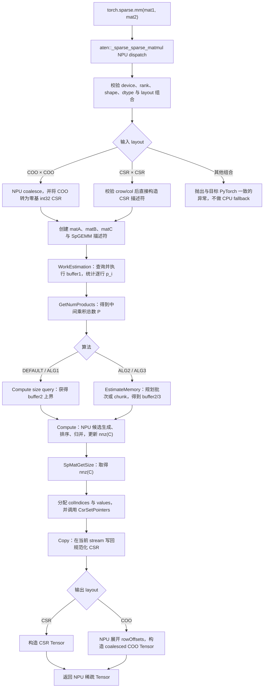
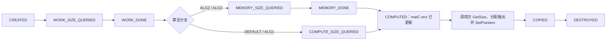
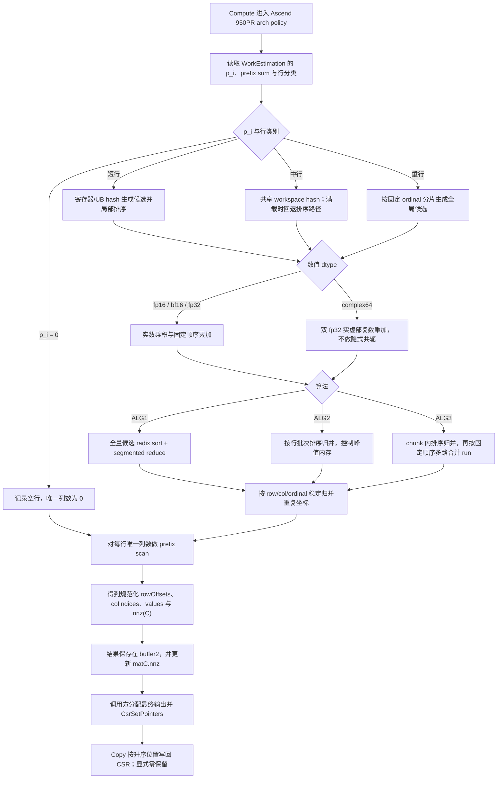

# aclsparseSpGemm（Ascend 950PR）算子设计文档

# 需求背景（required）

## 需求来源

本设计对应 2026 年社区任务 **08-SpGEMM** 中的 A5 任务：参考 PyTorch 2.7 及以上版本的
`torch.sparse.mm` / `aten::_sparse_sparse_matmul` 接口与行为，在 Ascend 950PR 上补齐稀疏矩阵乘法能力。
交付实现统一进入 `ops-sparse` 仓库，并复用现有 SpGEMM 社区任务规划的
`aclsparseSpGEMM*` 多阶段 C++ 接口及 Ascend C Kernel，不重复新增同名或同功能接口。

本任务相对已有 SpGEMM 社区任务的主要增量是：

1. 增加 Python/ATen NPU 适配、稀疏 Tensor 转换、动态 `nnz(C)` 处理和稀疏输出构造；
2. 在 Ascend 950PR 上完整支持 `float16`、`bfloat16`、`float32`、`complex64`；
3. 重点补齐 `complex64` 在描述符、workspace 估算、Kernel、结果组装、精度与异常处理上的全链路能力；
4. 明确 WorkEstimation、EstimateMemory、Compute、Copy 的状态、资源和 stream 契约；
5. 与并行开发的 A2/A3 任务共用 Host 公共逻辑，同时隔离不同硬件的 Kernel 与调优策略。

## 背景介绍

SpGEMM（Sparse General Matrix-Matrix Multiplication）计算两个稀疏矩阵的乘积：

$$
C = A \times B,\qquad
C_{ij}=\sum_{k=0}^{K-1}A_{ik}B_{kj},
$$

其中 $A$ 的形状为 $[M,K]$，$B$ 的形状为 $[K,N]$，输出 $C$ 的形状为 $[M,N]$。
与 SpMM 的稠密输出不同，SpGEMM 的输出行偏移、列索引和 `nnz(C)` 均由输入稀疏结构动态决定；
中间乘积数

$$
P=\sum_{i=0}^{M-1}\sum_{k\in\operatorname{supp}(A_i)}\operatorname{nnz}(B_k)
$$

可能远大于最终 `nnz(C)`。因此算子必须先估算工作量和内存，再完成结构去重、排序和数值归并，
不能按稠密矩阵分配输出，也不能使用 CPU fallback 代替 NPU 核心计算。

Python/ATen 层对齐 PyTorch 稀疏语义；C++ 多阶段接口的参数、算法和 workspace 行为对齐
CUDA Toolkit 13.3 Update 1 中的 cuSPARSE SpGEMM，并使用 `aclsparseSpGEMM*` 命名。

## 现状与复用边界

设计以 `ops-sparse` 的现有公共描述符和接口为基础，复用：

- `aclsparseCreateCsr` / `aclsparseDestroySpMat`；
- `aclsparseCsrSetPointers`，用于在获得动态 `nnz(C)` 后更新输出指针；
- `aclsparseSpMatGetSize`，用于查询 Compute 阶段写回的 `nnz(C)`；
- `aclsparseSetStream`、pointer mode、统一状态码和公共参数校验；
- 已规划的 `aclsparseSpGEMMCreateDescr`、`WorkEstimation`、`GetNumProducts`、
  `EstimateMemory`、`Compute`、`Copy`、`DestroyDescr`；
- 已有实数 SpGEMM 的符号分析、排序归并、workspace 管理与 Ascend 950PR Kernel 框架。

本任务不改变既有公开函数签名。公共代码只增加类型分派、状态检查和可复用策略；
`complex64` 数值路径及 Ascend 950PR 调优逻辑放入对应架构目录，避免与 A2/A3 的硬件实现互相覆盖。

# 需求分析（required）

## 需求描述

实现 `aten::_sparse_sparse_matmul(Tensor self, Tensor other) -> Tensor` 的 NPU dispatch，
使 `torch.sparse.mm(mat1, mat2)` 的稀疏×稀疏前向计算在 NPU 上完成，并提供完整的
aclsparse C++ 多阶段接口及 Ascend C Kernel。参数、返回 Tensor、shape、device、dtype、layout、
异常和显式零处理与目标 PyTorch 版本保持一致。

## 需求拆解

| 层次 | 设计目标 |
| --- | --- |
| Python/ATen | 注册 NPU dispatch；校验 device/layout/shape/dtype；完成 COO/CSR 规范化、类型转换和输出 layout 恢复 |
| 稀疏桥接层 | 将 PyTorch 稀疏 Tensor 转为零基 CSR 描述符；组织多阶段调用；处理动态 `nnz(C)` 和输出 Tensor 分配 |
| aclsparse Host | 复用既有 `aclsparseSpGEMM*` 接口；管理描述符状态、算法、workspace、stream、返回码和输出指针更新 |
| Ascend C Kernel | 在 Ascend 950PR 上完成工作量统计、结构去重、排序归并和数值计算；新增 complex64 复数乘加路径 |
| 质量保障 | 覆盖空输入、长尾行、中间乘积膨胀、溢出、workspace 不足、确定性、精度、性能及无 CPU fallback 证据 |

## 输入输出规格

| 参数 | 角色 | shape | 稀疏格式 | values dtype | 索引 | 说明 |
| --- | --- | --- | --- | --- | --- | --- |
| `mat1/self` | 输入 A | `[M,K]` | C++ 为 CSR；Python 支持目标版本声明的 COO/CSR 同类组合 | fp16、bf16、fp32、complex64 | C++ rowOffsets/colIndices 均为 int32 | 输入列索引按行非降；COO 先 coalesce |
| `mat2/other` | 输入 B | `[K,N]` | 同 A | 同上 | 同上 | `A.size(1) == B.size(0)` |
| `output` | 输出 C | `[M,N]` | C++ 为 CSR；Python 按入口语义构造 COO 或 CSR | PyTorch 结果类型，且须属于支持集合 | int32 | 行偏移单调非降、每行列索引严格升序、无重复坐标 |

补充规则：

- A、B 必须位于同一 NPU device，不支持跨设备计算和矩阵维广播；
- Python 层使用 PyTorch 的结果类型规则得到公共 dtype，再将 A/B values 转换为该 dtype；
  C++ 层 A、B、C 和 `computeType` 始终采用同一类型；
- COO×COO 返回 coalesced COO，CSR×CSR 返回 CSR；混合 COO/CSR 按目标 PyTorch 版本的
  不支持语义报错，不静默改变返回 layout；
- 稀疏×稠密由其他 ATen 路径处理，不进入本设计的 SpGEMM；反向传播能力按目标 PyTorch
  对 sparse×sparse 的定义执行，本任务不新增未声明的 backward；
- C++ 验收范围为 CSR、int32、零基索引和 NON_TRANSPOSE。

## 功能与验收映射

| 任务要求 | 设计落点 |
| --- | --- |
| 动态 shape / nnz | WorkEstimation 统计 $P$；Compute 得到 `nnz(C)`；桥接层二次分配并用 `aclsparseCsrSetPointers` 更新 C |
| 四种 dtype | 统一模板分派；fp16/bf16/fp32 复用实数路径；complex64 使用双 float 复数路径 |
| 输出规范化 | 行内生成候选项后执行稳定排序和分段归并；重复坐标相加；数值抵消后的显式零保留 |
| 确定性 | 固定任务划分、稳定排序、固定归并树和固定写回顺序 |
| 空输入 | 独立空路径生成全零 rowOffsets，`nnz(C)=0`，不访问空 col/value 指针 |
| 异步执行 | 所有 C++ Kernel 和 D2D 操作下发到 handle stream；只在上层动态分配边界进行必要的标量回读 |
| 无 CPU fallback | NPU dispatch 直接进入 aclsparse；Profiler 中必须出现 SpGEMM NPU Kernel，核心结构和数值计算不落到 CPU |

# 详细设计（required）

## 算子原型

本任务包含 Python/ATen 与 aclsparse C++ 两层原型。Python/ATen 层负责对齐 PyTorch 语义、
layout 转换和动态输出 Tensor 构造；aclsparse C++ 层只接收 CSR 描述符，负责多阶段 SpGEMM。

### Python/ATen 原型

Python 公开入口与 ATen Schema 分别为：

```python
torch.sparse.mm(mat1, mat2) -> Tensor
```

```text
aten::_sparse_sparse_matmul(
    Tensor self,
    Tensor other
) -> Tensor
```

参数能力如下。表中 dtype 指稀疏 Tensor 的 values dtype；稀疏索引 dtype 单独在“索引及描述符原型”中说明。

| 名称 | 输入/输出属性 | 含义 | values dtype | layout | shape | device | 非连续 | 关键约束 |
| --- | --- | --- | --- | --- | --- | --- | --- | --- |
| `mat1/self` | 输入 | 左稀疏矩阵 A | float16、bfloat16、float32、complex64 | COO 或 CSR | `[M,K]`，二维 | NPU，且与 B 相同 | 按任务书声明范围；不支持时明确报错 | COO 必须先 coalesce；CSR 元数据合法；不允许 batch/广播 |
| `mat2/other` | 输入 | 右稀疏矩阵 B | 同 A 的支持集合；按 PyTorch 规则得到公共结果 dtype | 与 A 同类组合：COO×COO 或 CSR×CSR | `[K,N]`，二维 | NPU，且与 A 相同 | 同 A | `A.size(1) == B.size(0)`；混合 COO/CSR 不支持 |
| 返回值 | 输出 | 稀疏乘积 C | PyTorch 结果 dtype，且必须属于支持集合 | COO×COO 返回 coalesced COO；CSR×CSR 返回 CSR | `[M,N]` | 与 A/B 相同 | 新分配连续 values/indices storage | 输出无重复坐标；列索引严格升序；显式零保留并计入 `nnz(C)` |

Python 层对 A/B values 做公共 dtype 归一化后再创建 C++ 描述符，因此进入 C++ 层时
A、B、C 和 `computeType` 始终同型。稀疏×稠密、混合 layout、跨 device、batch 和 backward
不进入本原型。

### CSR 索引及描述符原型

| 对象/字段 | 输入/输出属性 | C++ 类型 | 长度/shape | 内存位置 | 约束 |
| --- | --- | --- | --- | --- | --- |
| `matA.csrRowOffsets` | 输入 | int32 / `ACL_SPARSE_INDEX_32I` | `M+1` | Device | 首项 0、末项 `nnz(A)`、单调非降 |
| `matA.csrColInd` | 输入 | int32 / `ACL_SPARSE_INDEX_32I` | `nnz(A)` | Device | 每行非降、范围 `[0,K)`；重复列可参与后续归并 |
| `matA.csrValues` | 输入 | 与 `computeType` 同型 | `nnz(A)` | Device | 只读；nnz 为 0 时允许空指针 |
| `matB.csrRowOffsets` | 输入 | int32 / `ACL_SPARSE_INDEX_32I` | `K+1` | Device | 首项 0、末项 `nnz(B)`、单调非降 |
| `matB.csrColInd` | 输入 | int32 / `ACL_SPARSE_INDEX_32I` | `nnz(B)` | Device | 每行非降、范围 `[0,N)`；重复列可参与后续归并 |
| `matB.csrValues` | 输入 | 与 `computeType` 同型 | `nnz(B)` | Device | 只读；nnz 为 0 时允许空指针 |
| `matC.csrRowOffsets` | 输出 | int32 / `ACL_SPARSE_INDEX_32I` | `M+1` | Device | Copy 后单调非降，末项为 `nnz(C)` |
| `matC.csrColInd` | 输出 | int32 / `ACL_SPARSE_INDEX_32I` | `nnz(C)` | Device | 每行严格升序，无重复坐标 |
| `matC.csrValues` | 输出；`beta!=0` 时也作为输入 | 与 `computeType` 同型 | `nnz(C)` | Device | Compute 后按 `nnz(C)` 分配并通过 `aclsparseCsrSetPointers` 更新 |
| A/B/C `idxBase` | 输入 | `aclsparseIndexBase_t` | 标量 | Host | 本任务为 `ACL_SPARSE_INDEX_BASE_ZERO`，三者一致 |
| A/B/C `valueType` | 输入 | `aclDataType` | 标量 | Host | `ACL_FLOAT16`、`ACL_BF16`、`ACL_FLOAT`、`ACL_COMPLEX64` 之一，三者一致 |

A、B 使用 `aclsparseCreateConstCsr` 创建只读描述符；C 使用 `aclsparseCreateCsr` 创建可写描述符。
Python/`beta=0` 动态输出路径中，初始 C 至少提供长度 `M+1` 的 rowOffsets；Compute 更新描述符中的
`nnz(C)` 后，调用方分配 colIndices/values，再用 `aclsparseCsrSetPointers` 更新三个输出指针并进入
Copy。若 C++ 调用方使用 `beta!=0`，则必须在 WorkEstimation 前提供完整且与乘积结果一致的 C pattern
和 values，不能使用上述空占位符。

### aclsparse 公共参数表

下表汇总多阶段函数中反复出现的参数。除 size query 的 Host 逻辑外，矩阵数据和 workspace
均在 Device，所有执行阶段使用 handle 当前绑定的 stream。

| 参数 | 输入/输出属性 | C/C++ 类型 | 内存位置 | 使用阶段 | 语义与约束 |
| --- | --- | --- | --- | --- | --- |
| `handle` | 输入 | `aclsparseHandle_t` | Host | Work/Estimate/Compute/Copy | 非空；提供 pointer mode、当前 device 与 stream |
| `opA` | 输入 | `aclsparseOperation_t` | Host | Work/Estimate/Compute/Copy | 仅 `ACL_SPARSE_OP_NON_TRANSPOSE` |
| `opB` | 输入 | `aclsparseOperation_t` | Host | Work/Estimate/Compute/Copy | 仅 `ACL_SPARSE_OP_NON_TRANSPOSE` |
| `alpha` | 输入 | `const void *` | Host 或 Device | Work/Estimate/Compute/Copy | 地址空间由 pointer mode 决定；标量 dtype 为 `computeType` |
| `matA` | 输入 | `aclsparseConstSpMatDescr_t` | Host 描述符，数据在 Device | Work/Estimate/Compute/Copy | CSR `[M,K]`，int32 索引，只读 |
| `matB` | 输入 | `aclsparseConstSpMatDescr_t` | Host 描述符，数据在 Device | Work/Estimate/Compute/Copy | CSR `[K,N]`，int32 索引，只读 |
| `beta` | 输入 | `const void *` | Host 或 Device | Work/Estimate/Compute/Copy | 与 alpha 使用同一 pointer mode；Python 路径固定为 0 |
| `matC` | 输入/输出 | `aclsparseSpMatDescr_t` | Host 描述符，数据在 Device | Work/Estimate/Compute/Copy | CSR `[M,N]`；Compute 更新 nnz，Copy 写最终结构和值 |
| `computeType` | 输入 | `aclDataType` | Host | Work/Estimate/Compute/Copy | 与 A/B/C valueType 完全一致 |
| `alg` | 输入 | `aclsparseSpGEMMAlg_t` | Host | Work/Estimate/Compute/Copy | DEFAULT 映射 ALG1；同一描述符全流程不可改变 |
| `spgemmDescr` | 输入/输出 | `aclsparseSpGEMMDescr_t` | Host | 全阶段 | 保存状态机、参数快照、`numProds`、workspace 规划和 `nnz(C)` |

### 阶段专用参数表

| 参数 | 输入/输出属性 | C/C++ 类型 | 内存位置 | 所属接口 | 语义与有效时机 |
| --- | --- | --- | --- | --- | --- |
| `descr` | 输出/输入 | `aclsparseSpGEMMDescr_t *` / `aclsparseSpGEMMDescr_t` | Host | Create/Destroy | Create 返回不透明描述符；Destroy 后不得再使用 |
| `bufferSize1` | 输出；执行时也作为容量输入 | `size_t *` | Host | WorkEstimation | 空 buffer 时返回需求；非空 buffer 时表示调用方容量 |
| `externalBuffer1` | 输入/临时输出 | `void *` | Device | WorkEstimation，后续 Compute 可复用 | 存放逐行中间乘积计数、scan 与分行信息；Compute 完成前有效 |
| `numProds` | 输出 | `int64_t *` | Host | GetNumProducts | WorkEstimation 执行成功后有效，表示中间乘积总数 $P$ |
| `chunkFraction` | 输入 | `float` | Host | EstimateMemory | ALG3 范围 `(0,1]`；决定每个 chunk 的乘积上限；ALG1/2 不使用 |
| `bufferSize3` | 输出；执行时也作为容量输入 | `size_t *` | Host | EstimateMemory | ALG2/3 的规划 workspace 大小 |
| `externalBuffer3` | 输入/临时输出 | `void *` | Device | EstimateMemory | 存放批次/chunk/run 规划；EstimateMemory 完成前有效 |
| `bufferSize2` | 输出；执行时也作为容量输入 | `size_t *` | Host | EstimateMemory/Compute | ALG1 由 Compute query 给上界；ALG2/3 由 EstimateMemory 给需求 |
| `externalBuffer2` | 输入/临时输出 | `void *` | Device | Compute/Copy | 存放候选项、排序归并区和规范化中间结果；Copy 完成前有效 |

### 原型组合约束

| 组合项 | 支持范围 | 非法行为 |
| --- | --- | --- |
| shape | A=`[M,K]`、B=`[K,N]`、C=`[M,N]`；M/K/N 可动态变化 | rank 非 2、内维不等或输出 shape 错误返回 INVALID_VALUE |
| dtype | A/B/C/computeType 同为 fp16、bf16、fp32 或 complex64 | 混合或其他类型返回 NOT_SUPPORTED/INVALID_VALUE |
| format | C++ 仅 CSR；Python 为 COO×COO 或 CSR×CSR | 非 CSR 描述符返回 MATRIX_TYPE_NOT_SUPPORTED；混合 Python layout 抛 PyTorch 异常 |
| index | rowOffsets/colIndices 均 int32、零基、A/B/C 一致 | 类型/base 不匹配或越界返回 NOT_SUPPORTED/INVALID_VALUE |
| operation | opA=opB=NON_TRANSPOSE | TRANSPOSE/CONJUGATE_TRANSPOSE 返回 NOT_SUPPORTED |
| 标量 | alpha/beta dtype 与 computeType 一致，地址服从 pointer mode | 空指针、地址空间或 dtype 不匹配返回 INVALID_VALUE |
| 输出结构 | rowOffsets 非降、colIndices 严格升序、重复坐标合并、显式零保留 | `nnz(C)` 超 int32 或 workspace 不足返回 INSUFFICIENT_RESOURCES |

## 算子语义

### Python/ATen 语义

Python 公开入口为：

```python
torch.sparse.mm(mat1, mat2) -> Tensor
```

内部 NPU dispatch 对应：

```text
aten::_sparse_sparse_matmul(Tensor self, Tensor other) -> Tensor
```

Python 路径固定使用 `alpha=1`、`beta=0`。输出结构由所有结构中间乘积决定：若多个中间乘积
落到同一 `(i,j)`，它们被合并为一个 CSR 条目；若合并后的数值恰好为零，该条目仍保留并计入
`nnz(C)`。因此不能通过 values 是否为零来裁剪结构。

### C++ 接口语义

C++ 层计算：

$$
C' = \alpha\,op(A)op(B)+\beta C.
$$

对齐 cuSPARSE 的约束，输入 C 与输出 $C'$ 的稀疏 pattern 必须相同。Python 路径的空输出占位符
只使用 `beta=0`。若 C++ 调用方使用 `beta!=0`，必须在首次阶段提供与结果 pattern 一致的 C；
pattern 不一致返回 `ACL_SPARSE_STATUS_INVALID_VALUE`，接口不会隐式扩展 C 的结构。

`alpha` 与 `beta` 的地址空间由 handle 的 pointer mode 决定，两者必须同属该模式，标量 dtype
等于 `computeType`。`opA`、`opB` 仅接受 `ACL_SPARSE_OP_NON_TRANSPOSE`；传入 TRANSPOSE 或
CONJUGATE_TRANSPOSE 返回 `ACL_SPARSE_STATUS_NOT_SUPPORTED`。complex64 路径不执行隐式共轭。

## 总体架构与端到端流程图

下图从 Python 入口一直覆盖到稀疏输出构造，明确动态 `nnz(C)` 位于 Compute 与 Copy 之间，
且核心结构和数值计算均在 NPU 完成。



## Python/ATen 适配设计

### NPU 注册与入口选择

在 `ops-sparse` 的 ATen 适配目录注册 `_sparse_sparse_matmul` 的 NPU 实现。注册函数只处理
sparse×sparse；不调用 CPU 实现，不执行 `.cpu()`，也不通过 dense 化实现乘法。入口首先使用
设备守卫切换到输入 device，并获取当前 NPU stream 传给 aclsparse handle。

### 参数校验顺序

按确定顺序校验并复用 PyTorch 异常类型/消息风格：

1. 两个输入均为 sparse Tensor，且 layout 组合受目标版本支持；
2. 两个输入均为二维，`self.size(1) == other.size(0)`；
3. 两者位于同一 NPU device；
4. values dtype 可按 PyTorch 规则提升到 fp16/bf16/fp32/complex64 之一；
5. 稀疏元数据、values 和 device 一致，索引可安全转换为 int32；
6. values/indices 满足本任务声明的连续性要求；不支持的非连续输入返回明确错误；
7. shape、nnz 和中间乘积数不超过后述边界。

校验失败在下发 Kernel 前返回，避免部分写入输出或改变描述符状态。

### 稀疏格式转换

- COO 输入先调用目标 PyTorch 版本的 coalesce 语义合并重复坐标并排序，再在 NPU 上转换为 CSR；
- CSR 输入验证 `crow_indices` 单调非降、首项为 0、末项等于 nnz、列索引范围合法且按行非降；
- Python 常见 int64 索引在 NPU 上执行范围检查和 int32 转换；任一值超出 int32 范围时直接报错；
- 转换和排序使用 NPU 稀疏公共算子或设备 Kernel，不把完整索引搬到 Host；
- C++ 描述符统一使用 `ACL_SPARSE_INDEX_32I`、`ACL_SPARSE_INDEX_BASE_ZERO`。

### 动态输出构造

1. 预分配长度 `M+1` 的 int32 `crow_indices`，以 `nnz=0`、空 col/value 指针创建 matC；
2. 执行 WorkEstimation、必要的 EstimateMemory 和 Compute；
3. 通过 `aclsparseSpMatGetSize` 取得 Compute 写回的 `nnz(C)`；
4. 分配长度为 `nnz(C)` 的 colIndices 和 values，调用 `aclsparseCsrSetPointers` 更新 matC；
5. 调用 Copy，将规范化 rowOffsets、colIndices、values 写入最终 Tensor storage；
6. CSR 入口直接构造 CSR 输出；COO 入口在 NPU 上把 rowOffsets 展开为 row indices，构造
   coalesced COO，并设置正确的 coalesced 标志。

当前 Tensor allocator 需要 Host 可见的长度；因此桥接层在第 3～4 步之间只允许一次与当前 stream
关联的必要标量同步，以获得 `nnz(C)`。C++ 多阶段接口本身保持异步；除该动态分配边界外不得加入
全设备同步。

### 资源安全

采用 RAII 封装 handle 绑定、SpMat 描述符、SpGEMM 描述符和临时 Tensor。任一步失败均按逆序释放
Host 描述符；Device 临时 Tensor 由 PyTorch allocator 管理并记录当前 stream，避免异步 Kernel
尚未完成时提前复用。输入 A/B 的任何数据均只读。

## aclsparse 多阶段接口设计

### 接口与职责

公开函数签名严格复用任务书和 `include/cann_ops_sparse.h` 的规划结果：

```c
aclsparseStatus_t aclsparseSpGEMMCreateDescr(
    aclsparseSpGEMMDescr_t *descr);

aclsparseStatus_t aclsparseSpGEMMDestroyDescr(
    aclsparseSpGEMMDescr_t descr);

aclsparseStatus_t aclsparseSpGEMMWorkEstimation(
    aclsparseHandle_t handle,
    aclsparseOperation_t opA, aclsparseOperation_t opB,
    const void *alpha,
    aclsparseConstSpMatDescr_t matA,
    aclsparseConstSpMatDescr_t matB,
    const void *beta,
    aclsparseSpMatDescr_t matC,
    aclDataType computeType,
    aclsparseSpGEMMAlg_t alg,
    aclsparseSpGEMMDescr_t spgemmDescr,
    size_t *bufferSize1, void *externalBuffer1);

aclsparseStatus_t aclsparseSpGEMMGetNumProducts(
    aclsparseSpGEMMDescr_t spgemmDescr,
    int64_t *numProds);

aclsparseStatus_t aclsparseSpGEMMEstimateMemory(
    aclsparseHandle_t handle,
    aclsparseOperation_t opA, aclsparseOperation_t opB,
    const void *alpha,
    aclsparseConstSpMatDescr_t matA,
    aclsparseConstSpMatDescr_t matB,
    const void *beta,
    aclsparseSpMatDescr_t matC,
    aclDataType computeType,
    aclsparseSpGEMMAlg_t alg,
    aclsparseSpGEMMDescr_t spgemmDescr,
    float chunkFraction,
    size_t *bufferSize3, void *externalBuffer3,
    size_t *bufferSize2);

aclsparseStatus_t aclsparseSpGEMMCompute(
    aclsparseHandle_t handle,
    aclsparseOperation_t opA, aclsparseOperation_t opB,
    const void *alpha,
    aclsparseConstSpMatDescr_t matA,
    aclsparseConstSpMatDescr_t matB,
    const void *beta,
    aclsparseSpMatDescr_t matC,
    aclDataType computeType,
    aclsparseSpGEMMAlg_t alg,
    aclsparseSpGEMMDescr_t spgemmDescr,
    size_t *bufferSize2, void *externalBuffer2);

aclsparseStatus_t aclsparseSpGEMMCopy(
    aclsparseHandle_t handle,
    aclsparseOperation_t opA, aclsparseOperation_t opB,
    const void *alpha,
    aclsparseConstSpMatDescr_t matA,
    aclsparseConstSpMatDescr_t matB,
    const void *beta,
    aclsparseSpMatDescr_t matC,
    aclDataType computeType,
    aclsparseSpGEMMAlg_t alg,
    aclsparseSpGEMMDescr_t spgemmDescr);
```

| 接口 | 职责 | 主要输出 |
| --- | --- | --- |
| `aclsparseSpGEMMCreateDescr` | 创建零初始化不透明描述符 | `spgemmDescr` |
| `aclsparseSpGEMMWorkEstimation` | 查询/执行工作量统计，计算逐行中间乘积数和总数 | `bufferSize1`、内部 `numProds` |
| `aclsparseSpGEMMGetNumProducts` | WorkEstimation 成功后查询 $P$ | `int64_t numProds` |
| `aclsparseSpGEMMEstimateMemory` | ALG2/ALG3 查询/执行内存规划，ALG3 使用 `chunkFraction` | `bufferSize3`、`bufferSize2` |
| `aclsparseSpGEMMCompute` | 查询/执行结构及数值计算，更新 matC 的 `nnz` | `bufferSize2`、内部规范化结果 |
| `aclsparseSpGEMMCopy` | 将内部结果拷贝到调用方更新后的 matC 指针 | 最终 CSR C |
| `aclsparseSpGEMMDestroyDescr` | 释放 Host 状态，不释放调用方 workspace | 状态失效 |

### 两次调用约定

WorkEstimation、EstimateMemory、Compute 同时承担 size query 和 execute：

- `externalBufferX == nullptr`：只做 Host 元数据校验并返回所需/上界字节数，不下发会读取该
  buffer 的计算；
- `externalBufferX != nullptr`：`*bufferSizeX` 是调用方实际容量。容量不足返回
  `ACL_SPARSE_STATUS_INSUFFICIENT_RESOURCES`，不得越界写入；容量满足时在 handle stream 上执行；
- ALG1/DEFAULT 的第一次 Compute query 返回上界，第二次 Compute 可使用不小于实际需求的任意
  buffer；若小于本输入的实际需求，返回资源不足；
- ALG2/ALG3 必须先执行 EstimateMemory。ALG3 的 `chunkFraction` 范围为 `(0,1]`；ALG1/2 忽略该值。

### 描述符状态机



DEFAULT 映射 ALG1，可从 `WORK_DONE` 直接进入 Compute。描述符记录：算法、dtype、shape、索引类型、
输入描述符身份/版本、pointer mode、stream 标识、`numProds`、各 buffer 最小容量、`nnz(C)`、
chunk 规划、完成事件和当前状态。

同一阶段的合法 size query 可幂等重复；执行阶段可在输入元数据和算法不变时重复。调用顺序错误、
中途更换算法/dtype/shape、在 Compute 后修改 A/B 结构或使用已经销毁的描述符，统一返回
`ACL_SPARSE_STATUS_INVALID_VALUE`。仅更新 A/B values 时是否允许复用，由既有 SpGEMM 描述符契约
决定；结构改变必须重新 WorkEstimation。

### 推荐调用序列

```cpp
aclsparseSpGEMMCreateDescr(&descr);

aclsparseSpGEMMWorkEstimation(..., &size1, nullptr);
allocate(buffer1, size1);
aclsparseSpGEMMWorkEstimation(..., &size1, buffer1);
aclsparseSpGEMMGetNumProducts(descr, &numProds);

if (alg == ALG2 || alg == ALG3) {
    aclsparseSpGEMMEstimateMemory(..., chunkFraction,
                                  &size3, nullptr, &size2);
    allocate(buffer3, size3);
    aclsparseSpGEMMEstimateMemory(..., chunkFraction,
                                  &size3, buffer3, &size2);
} else {
    aclsparseSpGEMMCompute(..., &size2, nullptr);
}

allocate(buffer2, size2);
aclsparseSpGEMMCompute(..., &size2, buffer2);
aclsparseSpMatGetSize(matC, &m, &n, &nnzC);
allocate(colC, valuesC, nnzC);
aclsparseCsrSetPointers(matC, rowOffsetsC, colC, valuesC);
aclsparseSpGEMMCopy(...);
aclsparseSpGEMMDestroyDescr(descr);
```

`buffer1/2/3` 均由调用方分配和释放。Compute 及 Copy 完成前不得释放或复用相关 buffer；
DestroyDescr 只销毁 Host 描述符，不隐式同步 stream，也不释放外部 buffer。

## Host 侧设计

### 公共参数校验

Host 在任何 Kernel 下发前检查：

- handle、描述符、size 指针和阶段必需指针非空；
- A/B/C 均为 CSR，rowOffsets/colIndices 类型均为 `ACL_SPARSE_INDEX_32I` 且三者一致；
- 本任务验收使用零基索引，其他 index base 返回 NOT_SUPPORTED；
- A 为 `[M,K]`、B 为 `[K,N]`、C 为 `[M,N]`，维度非负且内维匹配；
- A/B/C values 与 `computeType` 统一为 `ACL_FLOAT16`、`ACL_BF16`、`ACL_FLOAT`、
  `ACL_COMPLEX64` 之一；
- `opA/opB` 为 NON_TRANSPOSE，算法枚举合法；
- 输入 rowOffsets/indices/values 指针与 nnz 一致：nnz 为 0 时 col/value 可为空，rowOffsets 仍须可写/读；
- 所有字节数计算使用 checked `size_t`，中间乘积使用 int64，拒绝乘法、加法和对齐溢出；
- workspace 地址满足既有接口的对齐约束。

索引内容合法性由轻量设备校验 Kernel 完成：rowOffsets 单调、首尾正确、列索引范围合法、行内非降。
设备侧写入单个 error flag，后续阶段在必要边界读取并映射为确定状态码，避免逐项 D2H。

### 规模边界

- `M`、`K`、`N`、`nnz(A)`、`nnz(B)`、`nnz(C)` 均不得超过 int32 可表达范围；
- `numProds` 使用 int64，且必须能完成前缀和和 workspace 字节数计算；
- `rowOffsetsC[M] == nnz(C)`，若 `nnz(C) > INT32_MAX` 返回
  `ACL_SPARSE_STATUS_INSUFFICIENT_RESOURCES`；
- 任一请求超过 `size_t`、设备可分配内存或算法可表示上限时，不截断，返回资源不足或 INVALID_VALUE；
- 文档和 UT 固定覆盖 `INT32_MAX` 邻近的元数据溢出检查，不要求实际分配超大矩阵。

### 工作量统计与负载规划

WorkEstimation Kernel 对每个输出行计算

$$
p_i=\sum_{k\in\operatorname{supp}(A_i)}(rowPtr_B[k+1]-rowPtr_B[k]),
$$

随后在设备上做 int64 prefix scan 得到 $P$。Host 根据 $p_i$ 的分布生成轻/中/重行分类参数，
并以中间乘积数而非 A 的行 nnz 作为负载权重。长尾重行允许拆分为多个固定编号分片，最终按
分片编号稳定归并，既提高核利用率又保持确定性。

## Kernel 算法设计

### Kernel 计算流程图

下图反映 Compute/Copy 的真实职责边界：Compute 生成规范化中间结果并确定 `nnz(C)`，
Copy 只在调用方更新输出指针后写入最终 CSR。



### 通用结构与数值流程

每个输出行包含两类工作：

1. **候选生成**：依次遍历 A 行的 `(k,a)` 和 B 的第 k 行 `(j,b)`，生成
   `(row=i, col=j, product=a*b, ordinal)`；
2. **规范化**：按 `(row,col,ordinal)` 稳定排序，对相同 `(row,col)` 的 product 按固定树归并，
   生成严格升序的 colIndices 和唯一 values；
3. **CSR 构造**：对每行唯一列数做 prefix scan，得到 rowOffsets 和 `nnz(C)`；
4. **写回**：Compute 将规范化中间结果保存在 buffer2 并更新 matC 的 nnz；Copy 在用户更新指针后
   写入最终 CSR。

`ordinal` 由 A 行内位置和 B 行内位置唯一确定，用于在并行排序后恢复固定累加顺序。符号阶段只看
结构，不根据 product 数值删项，因此数值抵消得到的零仍被写出。

### ALG1 / DEFAULT：高性能全量候选路径

- DEFAULT 映射 ALG1；
- materialize 全部或按大批次 materialize 候选列和 product；
- 通过 radix sort + segmented reduce 完成去重与数值归并；
- 第一次 Compute 返回最坏情况上界；第二次使用调用方 buffer 执行；
- 适合基准用例中规则稀疏结构和设备内存充足的场景，作为默认性能路径。

### ALG2：受控内存分批路径

- EstimateMemory 根据逐行 $p_i$ 选择批次，使候选、排序和归并临时区受 buffer2 上限约束；
- 批次边界只在行边界切分；重行使用固定分片并在专用 merge 区归并；
- 相比 ALG1 减少峰值内存，增加批次调度开销；
- 结果顺序和数值归并树与 ALG1 的规范定义一致。

### ALG3：chunk 路径

- 每个 chunk 最多处理 `ceil(chunkFraction * numProds)` 个中间乘积；
- chunk 内排序归并后写入 run，后续使用固定顺序的多路归并合并相邻 run；
- `chunkFraction` 越小，buffer2 越小、run 数和调度开销越大；
- 首尾 chunk、零乘积和单乘积均有独立边界处理；
- 不允许因 chunk 边界把同一坐标保留为多个最终条目。

### 行级快速路径

为减少规则稀疏小行的全局排序开销，在结果一致的前提下增加三档路径：

- `p_i == 0`：直接输出空行；
- 短行：使用寄存器/UB 中的小型开放寻址表，结束后局部排序；
- 中行：使用共享工作区 hash，冲突满载时回退到排序路径；
- 重行：全局候选 + radix sort，或 ALG2/3 分片路径。

路径阈值由 Ascend 950PR 的 UB 容量、dtype 字节数和实测调优决定，写入 tiling 数据，不硬编码到
公共 Host 逻辑。hash 路径只作为候选去重加速，最终仍按列排序并使用固定顺序归并。

### 数据类型与 complex64

| 外部类型 | 存储 | 乘加/归并策略 | 输出 |
| --- | --- | --- | --- |
| fp16 | 16 bit | 复用实数模板；内部使用确定的分块累加策略 | fp16 |
| bf16 | 16 bit | 复用实数模板；转换与舍入遵循 CANN 定义 | bf16 |
| fp32 | 32 bit | fp32 固定树归并 | fp32 |
| complex64 | `{float real, float imag}` | 两路 fp32，按下式复数乘加并固定归并 | complex64 |

complex64 的单次乘法为：

$$
(a_r+ia_i)(b_r+ib_i)
=(a_rb_r-a_ib_i)+i(a_rb_i+a_ib_r).
$$

Kernel 使用与 `aclsparseComplex {float x; float y;}` 二进制兼容的 8 字节布局；候选 value、
排序搬运、segmented reduce、Copy 的字节数均按 8 字节计算。实部和虚部分别累加，禁止把
complex64 当作两个互不关联的稀疏矩阵，从而确保排序、重复项合并和显式零结构完全一致。

complex64 必测：纯实数、纯虚数、一般复数、正负混合、共轭形数据但 NON_TRANSPOSE、实部/虚部
分别抵消、结果 `0+0j`、INF/NAN。由于 CONJUGATE_TRANSPOSE 不在支持范围，收到该 op 时在 Host
报 NOT_SUPPORTED，不进入 Kernel。

### 确定性

所有声明支持的算法满足同一输入、同一算法、同一软硬件环境下重复运行的结构完全一致，确定性
路径 values bit-wise 一致。实现约束为：

- 输入遍历和候选 ordinal 唯一；
- radix sort 为稳定排序；
- 重行分片边界由 prefix sum 决定，不依赖运行时抢占；
- 相同坐标使用固定形状的归并树，不使用无序 global atomic 累加；
- Copy 按 rowOffsets 和升序 colIndices 唯一位置写回。

## Workspace 设计

所有区域按公共接口要求对齐，并使用 checked arithmetic 计算。

| Buffer | 生命周期 | 典型内容 |
| --- | --- | --- |
| buffer1 | WorkEstimation 执行至 Compute 完成 | 校验 flag、逐行 int64 `p_i`、prefix-scan scratch、行分类/分片表 |
| buffer3 | ALG2/ALG3 EstimateMemory 调用期间 | 直方图、批次规划、chunk/run 元数据临时区 |
| buffer2 | Compute 至 Copy 完成 | 候选 col/value/ordinal、排序 scratch、归并 run、唯一行计数、规范化 CSR 中间结果 |

空输入仍允许返回最小对齐 workspace 或 0，调用方必须接受两种由公共实现统一规定的行为。
workspace 不足用例使用“查询值减 1”验证返回资源不足且前后 guard bytes 不被修改。

## Stream 与并发语义

- 所有设备 Kernel、scan、sort、D2D Copy 使用 `aclsparseHandle_t` 当前绑定的 stream；
- 接口不切换到默认 stream，不在内部调用全设备同步；
- 同一个 `spgemmDescr` 在前一次调用完成前不可跨 stream 并发使用；不同描述符可在不同 stream 并发；
- 描述符记录必要事件以保护 buffer 生命周期，但 DestroyDescr 不做隐式设备同步；
- Host size query 只读取描述符元数据；执行调用按 stream 顺序观察先前阶段结果；
- Python 仅在动态 `nnz(C)` 分配处做一次必要的当前 stream 同步，Profiler 需单独标识该开销。

## 错误处理

| 场景 | 返回码/行为 |
| --- | --- |
| handle/描述符未初始化 | `ACL_SPARSE_STATUS_NOT_INITIALIZED` 或 `HANDLE_IS_NULLPTR` |
| 空的必需指针、负维度、shape/nnz 不一致、阶段顺序错误 | `ACL_SPARSE_STATUS_INVALID_VALUE` |
| 非 CSR | `ACL_SPARSE_STATUS_MATRIX_TYPE_NOT_SUPPORTED` |
| 不支持的 op、dtype、索引类型或硬件 | `ACL_SPARSE_STATUS_NOT_SUPPORTED` / `ARCH_MISMATCH` |
| workspace 小于需求、`nnz(C)` 超 int32、设备内存不足 | `ACL_SPARSE_STATUS_INSUFFICIENT_RESOURCES` |
| Kernel 下发或运行失败 | `ACL_SPARSE_STATUS_EXECUTION_FAILED` |
| 内部不变量破坏 | `ACL_SPARSE_STATUS_INTERNAL_ERROR` |

错误发生后不得改写输入。若 Compute 在异步执行中失败，后续 Copy 必须观察失败状态并拒绝写回。
Python 层把状态码映射为稳定、可定位的 PyTorch 异常，不回退 CPU 重试。

## A2/A3 与 A5 共存设计

公共 Host 目录只包含：公开接口、描述符状态机、参数校验、workspace 抽象、算法枚举、dtype dispatch
和 arch policy 接口。硬件差异放入 `archXX`：

```text
ops-sparse/
├─ include/cann_ops_sparse.h                 # 统一公开接口，不重复声明
├─ sparse/spgemm/common/                     # 公共描述符、校验、状态机、workspace
├─ sparse/spgemm/arch2x/                     # A2/A3 对应实现（由相关任务维护）
├─ sparse/spgemm/arch35/                     # Ascend 950PR，含 complex64
└─ test/spgemm/                              # 公共接口 UT + 各架构测试数据
```

Host 通过运行时 SoC/编译目标选择 policy，不在公共函数中复制整套 `if (A5)` 分支。新增字段以版本化
内部描述符或尾部扩展实现，保证不同任务先后合入时源码兼容。后合入 PR 必须 rebase 到已合入的
接口版本，运行 A2/A3 与 A5 公共 Host 回归。

## 性能优化方案

1. **按中间乘积负载分核**：以 $p_i$ 而不是行数均分，缓解长尾行造成的核间不均衡；
2. **短行快速路径**：寄存器/UB hash 避免大规模全局 sort；规则基准每行 $d^2$ 输出时优先命中；
3. **候选批量生成**：A row 和 B row 的连续 CSR 数据合并搬运，减少小粒度 GM 访问；
4. **dtype 专用布局**：fp16/bf16 成对向量化；complex64 使用 8 字节对齐加载并并行计算实虚部；
5. **scan/sort 融合元数据**：复用逐行计数、分片表和 prefix sum，减少 Host 往返及重复扫描；
6. **ALG 自适应建议**：内存充足默认 ALG1；峰值内存受限用 ALG2；超大 $P$ 或严格内存预算用 ALG3；
7. **workspace/描述符复用**：正式采样和重复执行期间复用已分配 buffer 与描述符；
8. **避免无关同步**：各阶段通过同一 stream 串联，只保留动态输出分配所需同步；
9. **空路径与单项路径**：零乘积、单乘积、无需归并的行不进入通用 sort-reduce。

## 支持硬件

| 芯片版本 | 支持情况 |
| --- | --- |
| Ascend 950PR | 本任务完整支持 |
| A2/A3 | 通过公共 Host 接口共存；Kernel 能力由对应并行任务交付和回归 |

## 算子约束限制

1. A、B、C 的 C++ 描述符仅支持 CSR；Row-major/Column-major 对稀疏 CSR 不适用；
2. rowOffsets 和 colIndices 仅支持 `ACL_SPARSE_INDEX_32I`，且 A/B/C 完全一致；
3. 本任务范围为零基索引；输入列索引按行非降，越界或降序返回明确错误；
4. `opA`、`opB` 仅 NON_TRANSPOSE；
5. A、B、C 与 `computeType` 必须同为 fp16、bf16、fp32 或 complex64；
6. 仅支持二维 sparse×sparse，不支持广播和 batch；
7. 输出每行列索引严格升序、无重复坐标；数值抵消后的显式零保留；
8. Python layout 支持范围以 PyTorch 2.7 及以上目标版本为准；混合 layout 不静默转换为受支持组合；
9. 规模受 int32 CSR 索引、int64 中间乘积计数、`size_t` workspace 和实际设备内存共同限制；
10. 当前为独立稀疏算子，不要求图融合。

# 可维可测分析

## 精度标准/性能标准

| 验收标准 | 描述 | 标准来源 |
| --- | --- | --- |
| 稀疏结构 | `nnz(C)`、rowOffsets、colIndices、排序和重复项归并精确一致 | A5 任务书 |
| fp16 | `rtol=2^-9`、`atol=2^-9`、绝对误差硬上限 `max(1e-1, 32×ULP(golden))` | A5 任务书/生态精度标准 |
| bf16 | `rtol=2^-6`、`atol=2^-6`、绝对误差硬上限 `max(1e0, 32×ULP(golden))` | 同上 |
| fp32 | `rtol=2^-10`、`atol=2^-16`、绝对误差硬上限 `max(1e-2, 32×ULP(golden))` | 同上 |
| complex64 | 实部、虚部分别按 fp32 标准；两部分均满足匹配率和硬上限 | A5 任务书 |
| 匹配率 | 每种 dtype 的逐元素混合容差匹配率不低于 0.99 | A5 任务书 |
| 确定性 | 声明确定性算法重复运行的结构一致，values 按 bit-wise 规则验收 | A5 任务书/cuSPARSE 对标 |
| 性能 | fp16/bf16/fp32 不低于 A100 1.0×；complex64 不低于 A100 0.8× | A5 任务书 |

CPU Golden：fp16/bf16 使用 fp32，fp32 使用 fp64，complex64 使用 complex128。必须直接比较规范化
稀疏结构和 values，禁止只 dense 化后比较。INF/NAN 按生态精度标准执行；complex64 的实部和虚部
分别处理 INF/NAN。

## 测试设计

### 功能与边界

| 类别 | 覆盖项 |
| --- | --- |
| 基础 | 方阵、长矩阵、宽矩阵；四种 dtype；COO×COO、CSR×CSR 的目标 PyTorch 语义 |
| 稀疏边界 | `nnz(A/B)=0/1`、M/K/N 为 0 的合法场景、空行、空列、无交集、C 为 0 nnz |
| 结构归并 | 多个 k 生成同一 `(i,j)`、输入重复列、跨 chunk 重复、显式零和数值抵消 |
| 分布 | 均匀行、长尾行、单超长行、中间乘积严重膨胀、极高稀疏度 |
| complex64 | 纯实/纯虚、一般复数、正负混合、实虚分别抵消、INF/NAN、`0+0j` 保留 |
| 多阶段 | Create→Work→GetNumProducts→EstimateMemory→Compute→GetSize→SetPointers→Copy→Destroy |
| 算法 | DEFAULT/ALG1/ALG2/ALG3；ALG3 多个 chunkFraction 边界 |
| 异常 | shape、dtype、layout、device、索引类型/base、非法 rowOffsets/colIndices、非法 op、状态顺序 |
| workspace | 精确容量、0 容量、需求减 1、未对齐、guard bytes、Compute 后提前释放的负向用例 |
| 资源 | 连续创建/执行/销毁，跨 stream 误用，同描述符并发误用，无泄漏/非法同步 |

### ATen 端到端与 fallback 检查

- 对 `torch.sparse.mm` 与直接 ATen 调用分别测试，确认 NPU dispatch 命中；
- 检查输出 shape、dtype、device、layout、coalesced 状态与异常；
- 通过 Profiler 和 dispatch 日志确认核心计算没有 CPU operator；
- Profiler 保存 WorkEstimation、EstimateMemory、Compute、Copy 对应 NPU Kernel 证据；
- 单独记录动态 `nnz(C)` 标量同步，不把它误计为 CPU fallback。

### 性能用例

输入按任务书确定性规则生成，A/B values 为 1、`alpha=1`、`beta=0`：

| 编号 | M×K×N | nnz(A)=nnz(B) | nnz(C) | dtype | A100 Kernel 总耗时（μs） | NPU 目标 |
| --- | ---: | ---: | ---: | --- | ---: | --- |
| P-01 | 19,717×19,717×19,717 | 78,868 | 315,472 | fp32 | 289.088 | 性能 ≥ A100 1.0× |
| P-02 | 169,343×169,343×169,343 | 1,185,401 | 8,297,807 | fp16/bf16/fp32 | 1,127.296 / 1,134.080 / 1,121.376 | 各 dtype ≥ 1.0× |
| P-03 | 1,048,576×1,048,576×1,048,576 | 8,388,608 | 67,108,864 | fp16/bf16/fp32/complex64 | 6,884.864 / 6,876.512 / 6,858.208 / 8,059.968 | 实数 ≥ 1.0×；complex64 ≥ 0.8× |

每个 case 预热至少 10 次、正式采样至少 30 次，每轮同步后计时，报告中位数和 P90。
分别报告各阶段、C++ 完整流程和 Python 端到端耗时，以及峰值 workspace、`numProds`、`nnz(C)`
和输出存储量。正式采样期间复用描述符和 workspace，不计首次编译、数据生成、H2D 和无关初始化。

## 可维护性设计

- 公共状态机与各 arch policy 解耦，新增硬件只实现 policy，不复制公开 API；
- dtype traits 集中维护 value 大小、乘加、零值、INF/NAN 和 Copy 逻辑；
- workspace 使用命名区域和统一对齐函数，size query 与执行共享同一规划器；
- 每个阶段记录可观测统计量：算法、$P$、`nnz(C)`、批次数、chunk 数、峰值 workspace；
- 所有调试日志不输出用户数据或指针内容，默认关闭，不引入同步；
- 公开接口注释同步说明调用顺序、pointer mode、stream、错误码、规模限制和生命周期。

## 兼容性分析

本任务复用而不是替换现有 SpGEMM 规划接口，公开 ABI 不新增重复符号。fp16/bf16/fp32 保持原行为；
complex64 通过新增合法 dtype 分派扩展。A2/A3 和 A5 共用 Host 描述符与状态机，硬件 Kernel 独立。
若先合入的任务调整了接口原型，后续改动必须同步更新任务文档和公开头文件，并提供源代码兼容方案，
不得在 A5 私有目录保留另一套接口。

## 风险与应对

| 风险 | 影响 | 应对 |
| --- | --- | --- |
| $P \gg nnz(C)$ | ALG1 workspace 过大 | ALG2 分批、ALG3 chunk、溢出前置检查 |
| 长尾行 | 核间负载不均 | 以 $p_i$ 分核，重行固定分片与稳定归并 |
| complex64 吞吐不足 | P-03 未达 0.8× | 实虚 SIMD、8 字节向量搬运、减少重复 sort 元数据、短行快速路径 |
| 并行归并不确定 | bit-wise 失败 | ordinal、稳定排序、固定归并树，禁止无序原子累加 |
| 动态 nnz 引入同步 | Python 端到端延迟 | 同步仅限分配边界，C++ 阶段全异步，单独测量并优化 |
| A2/A3 合入冲突 | 公共 Host 重复修改 | common + arch policy、后合入 rebase、跨硬件回归 |

# 参考资料

1. A5 `aclsparseSpGemm` 任务书；
2. PyTorch `torch.sparse.mm`：<https://docs.pytorch.org/docs/stable/generated/torch.sparse.mm.html>；
3. PyTorch `native_functions.yaml`：<https://github.com/pytorch/pytorch/blob/main/aten/src/ATen/native/native_functions.yaml>；
4. PyTorch SparseCUDA 参考实现：<https://github.com/pytorch/pytorch/blob/main/aten/src/ATen/native/sparse/cuda/SparseCUDATensorMath.cu>；
5. NVIDIA cuSPARSE 13.3：<https://docs.nvidia.com/cuda/archive/13.3.0/cusparse/>；
6. `ops-sparse`：<https://gitcode.com/cann/ops-sparse>；
7. 生态算子开源精度标准：<https://gitcode.com/cann/opbase/blob/master/docs/zh/ops_precision_standard/experimental_standard.md>；
8. Ascend C 算子开发文档：<https://www.hiascend.com/document/detail/zh/CANNCommunityEdition/850/opdevg/Ascendcopdevg/atlas_ascendc_map_10_0002.html>。
