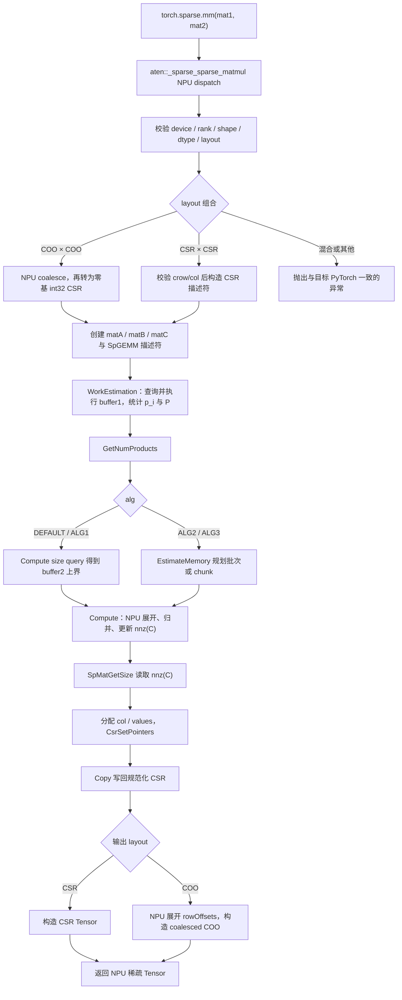
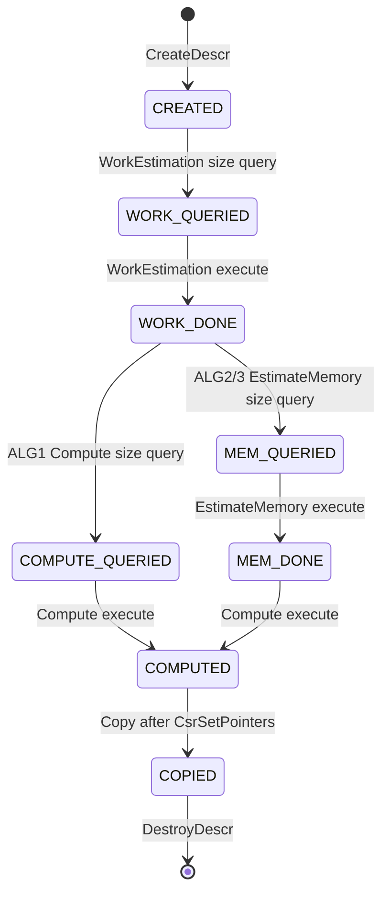
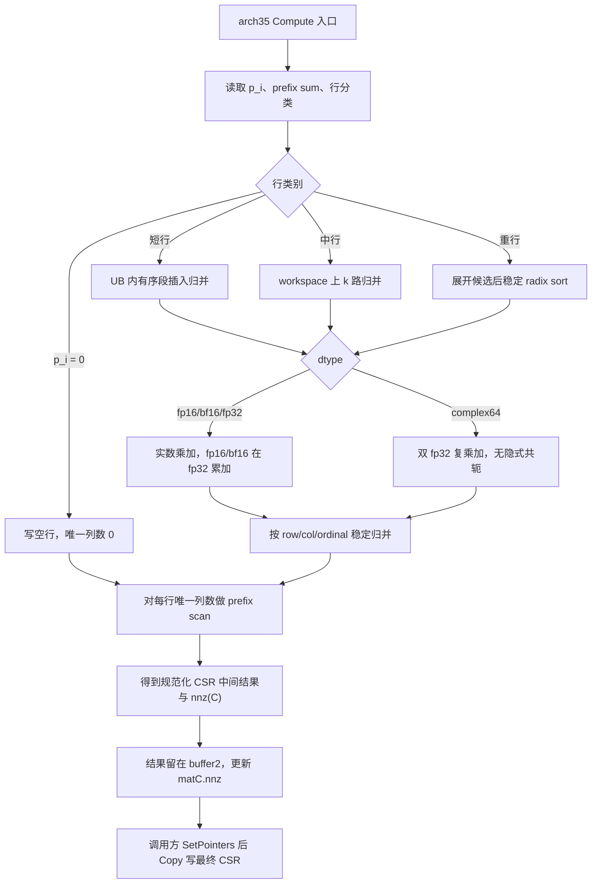

# aclsparseSpGemm 算子设计文档（Ascend 950PR）

| 项目 | 内容 |
|------|------|
| 任务名称 | aclsparseSpGemm 算子开发（950） |
| 目标硬件 | Ascend 950PR（arch35 / dav-3510） |
| 交付仓库 | [cann/ops-sparse](https://gitcode.com/cann/ops-sparse) `master` |
| 设计提交路径 | `04_tasks/01_community-task-2026/tasklist/08-aclsparseSpGemm/longcat_chen/docs/design.md` |
| 适配版本 | PyTorch ≥ 2.7，torch_npu ≥ 26.0.0，CANN 以 ops-sparse 指定版本为准 |
| 文档版本 | v1.0 |

# 需求背景（required）

## 需求来源

本设计对应 2026 年 8 月社区任务《aclsparseSpGemm 算子开发(950)》。任务要求参考 PyTorch 2.7 及以上版本的 `torch.sparse.mm` 与 `aten::_sparse_sparse_matmul`，在 Ascend 950PR 上完成 Python/ATen 适配，并复用现有 SpGEMM 社区任务规划交付的 `aclsparseSpGEMM*` 多阶段 C++ 接口及 Ascend C Kernel，补齐 `float16`、`bfloat16`、`float32`、`complex64` 全链路能力、稀疏输出构造、测试与文档。

设计文档按官方模板提交至 [cann-ops-competitions](https://gitcode.com/cann/cann-ops-competitions)；实现代码统一进入 `ops-sparse`，沿用 `include/cann_ops_sparse.h` 中已规划的公开符号，不重复新增同名或同功能接口。

## 背景介绍

### aclsparseSpGemm 要实现什么

SpGEMM（Sparse General Matrix-Matrix Multiplication）计算两个稀疏矩阵的乘积。Python 公开入口为：

```python
torch.sparse.mm(mat1, mat2) -> Tensor
```

C++ 层对齐 cuSPARSE Generic SpGEMM，计算：

$$
C' = \alpha \cdot op(A) \cdot op(B) + \beta \cdot C_{in}
$$

本任务范围内 `op(A)=A`、`op(B)=B`，Python 路径固定 `alpha=1`、`beta=0`，因此 Python 验收口径简化为：

$$
C = A \times B,\qquad
C_{ij} = \sum_{k \in \operatorname{supp}(A_i) \cap \operatorname{supp}(B_{\cdot j})} A_{ik} B_{kj}
$$

其中 $A$ 的形状为 `[M,K]`，$B$ 的形状为 `[K,N]`，输出 $C$ 的形状为 `[M,N]`。A、B、C 在 C++ 层均为 CSR。输出的 `nnz(C)`、`rowOffsets`、`colIndices` 由乘法结果动态决定，不能按稠密矩阵预先分配。

与 SpMM 的关键差异是：SpMM 输出稠密矩阵、形状已知；SpGEMM 输出稀疏矩阵，中间乘积数量

$$
P = \sum_{i=0}^{M-1} p_i,\qquad
p_i = \sum_{k \in \operatorname{supp}(A_i)} \operatorname{nnz}(B_k)
$$

可能远大于最终 `nnz(C)`。因此必须先做工作量与内存估算，再完成结构去重、列排序和数值归并。

### 现有实现与复用边界

`ops-sparse` 已具备 CSR 描述符、stream、pointer mode、SpMM/SDDMM 等稀疏算子，以及 7 月 SpGEMM 任务规划的 `aclsparseSpGEMM*` 多阶段接口形态。本 A5 任务不是从零定义一套新 API，而是：

1. **复用**已规划的 `aclsparseSpGEMMCreateDescr / WorkEstimation / GetNumProducts / EstimateMemory / Compute / Copy / DestroyDescr`；
2. **复用** `aclsparseCreateCsr`、`aclsparseCsrSetPointers`、`aclsparseSpMatGetSize`、handle/stream 及公共错误码；
3. **补齐** Ascend 950PR 上四种 dtype 的 Host 分派、Ascend C Kernel、输出组装、异常处理和测试；
4. **新增** `complex64` 全链路，作为必选能力而不是可选扩展；
5. **新增** Python/ATen NPU 适配、稀疏 layout 转换和动态 `nnz(C)` 输出构造。

7 月任务设计中曾讨论 Host 侧符号分析。本任务明确禁止用 CPU fallback 替代 NPU 核心计算：符号统计、候选展开、排序归并和数值乘加必须在 950PR 上完成。cuSPARSE 仅作为接口语义、算法阶段和 A100 性能标杆，NPU 运行时只走 aclsparse + Ascend C。

### PyTorch / cuSPARSE 对照

| 层次 | 对标对象 | 本任务落点 |
|------|----------|------------|
| Python | `torch.sparse.mm`（PyTorch ≥ 2.7） | NPU 上参数、返回值、dtype、shape、device、layout、异常与目标版本一致 |
| ATen | `aten::_sparse_sparse_matmul(Tensor self, Tensor other) -> Tensor` | 注册 NPU dispatch，不进入 CPU 实现 |
| C++ | CUDA Toolkit 13.3 Update 1 / cuSPARSE 13.3 Update 1 SpGEMM | `aclsparseSpGEMM*` 多阶段、ALG1/2/3、workspace、stream |
| 格式 | cuSPARSE CSR SpGEMM | C++ 仅 CSR、int32 索引、NON_TRANSPOSE |
| 精度 | 《生态算子开源精度标准》混合容差单标杆 | CPU Golden，同时校验结构与 values |
| 性能 | NVIDIA A100 cuSPARSE SpGEMM NCU Kernel 总耗时 | fp16/bf16/fp32 ≥ 1.0×，complex64 ≥ 0.8× |

# 需求分析（required）

## 需求描述

在 Ascend 950PR 上打通以下链路，且核心计算不得回退 CPU：

```text
torch.sparse.mm
  → aten::_sparse_sparse_matmul (NPU)
  → aclsparseSpGEMM* 多阶段接口
  → Ascend C Kernel (arch35)
  → 规范化 CSR / 目标 PyTorch sparse layout
```

支持动态 `M/K/N/nnz(A)/nnz(B)/P/nnz(C)`。输出必须满足：

- `rowOffsets` 单调非降，首项为 0，末项等于 `nnz(C)`；
- 每行 `colIndices` 严格升序，无重复坐标；
- 同一坐标的全部中间乘积按固定次序累加后只保留一个条目；
- 合法输入产生的显式零保留并计入 `nnz(C)`；
- Python 返回 COO 时必须为 coalesced。

## 需求拆解

| 编号 | 子项 | 验收要点 |
|------|------|----------|
| R1 | Python/ATen NPU 适配 | `torch.sparse.mm` 命中 NPU；无 `.cpu()` / dense 化乘法 / CPU fallback |
| R2 | 稀疏桥接 | COO/CSR 按目标 PyTorch 语义转换；动态 `nnz(C)` 二次分配；输出 layout 恢复 |
| R3 | 复用 C++ 多阶段接口 | 签名与 `cann_ops_sparse.h` 规划一致；状态机、workspace、stream、错误码完整 |
| R4 | 四种 dtype | fp16/bf16/fp32 复用实数路径；complex64 贯通描述符、估算、Kernel、Copy 和测试 |
| R5 | 输出规范化 | 结构精确一致；values 按混合容差单标杆；确定性算法 bit-wise 可复现 |
| R6 | 泛化与边界 | 空矩阵、空行/空列、无交集、长尾行、中间乘积膨胀、workspace 不足、非法索引 |
| R7 | A2/A3 共存 | 公共 Host 与 arch35 Kernel 解耦；后合入 PR rebase 后回归公共接口 |
| R8 | 性能 | P-01/P-02/P-03 达到任务书倍率；分别报告各阶段耗时、workspace、`P` 和 `nnz(C)` |

## 输入输出规格

| 参数 | 方向 | 格式 | values dtype | 索引 | shape | 说明 |
|------|------|------|--------------|------|-------|------|
| `mat1/self` | 输入 | Python：目标版本支持的 COO/CSR；C++：CSR | fp16 / bf16 / fp32 / complex64 | C++ 为 int32 | `[M,K]` | 列索引按行有序；COO 先 coalesce |
| `mat2/other` | 输入 | 同 A | 与 A 经 PyTorch 规则得到公共 dtype | 同 A | `[K,N]` | `A.size(1)==B.size(0)` |
| `alpha` | 输入 | Host 或 Device 标量 | 与 `computeType` 相同 | - | 标量 | Python 固定 1 |
| `beta` | 输入 | Host 或 Device 标量 | 与 `computeType` 相同 | - | 标量 | Python 固定 0；`beta=0` 不读 `C_in` values |
| `output/matC` | 输出 | C++：CSR；Python：按入口语义 | 同 computeType | int32 | `[M,N]` | 结构由计算确定 |

C++ 层 A、B、C 与 `computeType` 必须同型，对应 `ACL_FLOAT16`、`ACL_BF16`、`ACL_FLOAT`、`ACL_COMPLEX64`。索引类型固定 `ACL_SPARSE_INDEX_32I`，index base 固定 `ACL_SPARSE_INDEX_BASE_ZERO`。

# 详细设计（required）

## 算子分析

### 数学公式

行式 Gustavson 展开：A 的第 $i$ 行产生一组有序 B 行段，再按列号归并。

$$
C(i,:) = \sum_{k \in \operatorname{supp}(A_i)} A(i,k)\, B(k,:)
$$

每个 $B(k,:)$ 的列索引已按升序存放，因此第 $i$ 行是 $nnz(A_i)$ 条有序段的 k 路归并。相同列号的乘积按 A 行内 $k$ 的出现顺序、再按 B 行内列序累加，只写出一个 `(col, value)`。数值恰好为 0 时仍保留该坐标。

`beta != 0` 时对齐 cuSPARSE：输入 C 与结果 $C'$ 必须具有相同稀疏 pattern，接口不会因为 $\beta C_{in}$ 自动扩展结构。Python 路径只使用空占位 C 且 `beta=0`。

### 支持数据类型

| ID | A/B/C/computeType | ACL 枚举 | 内部累加 | 候选 value 字节 |
|----|-------------------|----------|----------|-----------------|
| U1 | float32 | `ACL_FLOAT` | fp32 固定顺序累加 | 4 |
| U2 | float16 | `ACL_FLOAT16` | 提升到 fp32 乘加，Copy 时按规定舍入回 fp16 | 4 |
| U3 | bfloat16 | `ACL_BF16` | 提升到 fp32 乘加，Copy 时按 CANN RINT 转回 bf16 | 4 |
| U4 | complex64 | `ACL_COMPLEX64` | 两个 fp32 分量按复数乘加，不做隐式共轭 | 8 |

complex64 单次乘法：

$$
(a_r + i a_i)(b_r + i b_i)
= (a_r b_r - a_i b_i) + i (a_r b_i + a_i b_r)
$$

存储布局与 `aclsparseComplex { float x; float y; }` 二进制兼容，按 8 字节对齐搬运。实部、虚部分别累加，但共用同一套列排序与去重，禁止拆成两个独立实数 SpGEMM。

cuSPARSE 文档将 fp16/bf16 同精度路径标为 deprecated，本任务仍须对齐并支持。

### 支持形状

- 仅二维稀疏矩阵，不广播、不 batch；
- `M,K,N,nnz(A),nnz(B),nnz(C)` 在 int32 CSR 可表示范围内动态变化；
- 中间乘积 $P$ 使用 int64 计数；
- 空维、零 nnz、无交集乘积均产生合法空 CSR：`rowOffsets` 长度为 `M+1` 且全 0，`nnz(C)=0`。

## 算子实现

### 实现方案总览

本实现采用 **OSM（Ordered Segment Merge）** 作为主路径：先按行统计中间乘积，再把 A 行展开成有序 B 段，用确定性 k 路归并得到规范化 CSR。hash 表只作为短行加速，最终仍必须按列升序写回。

整体分层：

```text
ops-sparse/
├── include/cann_ops_sparse.h          # 统一公开接口，不重复声明
├── sparse/spgemm/common/              # 状态机、校验、workspace 算术、arch policy
├── sparse/spgemm/arch35/              # Ascend 950PR Host dispatch + Kernel
├── python/aten/                       # _sparse_sparse_matmul NPU 注册与输出构造
└── test/spgemm/                       # C++ UT + 端到端 UT
```

A2/A3 任务若合入 `sparse/spgemm/arch2x/`，只通过 common 中的 policy 接口接入，不复制一套公开函数。

### 端到端流程



### Python / ATen 适配

注册点只处理 sparse × sparse。入口顺序：

1. 设备守卫切到输入 NPU device，获取当前 stream 绑定到 aclsparse handle；
2. 两个输入必须均为 sparse、二维、同一 device，且 `self.size(1) == other.size(0)`；
3. layout 仅接受目标版本支持的 COO×COO 或 CSR×CSR；混合 layout 按 PyTorch 不支持语义报错；
4. values 按 PyTorch 类型提升规则归一到 fp16/bf16/fp32/complex64 之一，再进入 C++；
5. Python 常见 int64 索引在 NPU 上做范围检查后转为 int32，越界立即报错；
6. 不支持的非连续 values/metadata 返回明确错误，不静默拷贝后改变语义。

动态输出构造：

1. 预分配长度 `M+1` 的 int32 `crow_indices`，以 `nnz=0` 创建可写 matC；
2. 走完 WorkEstimation（及 ALG2/3 的 EstimateMemory）和 Compute；
3. `aclsparseSpMatGetSize` 得到 `nnz(C)`；
4. 分配 colIndices/values，调用 `aclsparseCsrSetPointers`；
5. Copy 写出最终 CSR；
6. CSR 入口直接返回 CSR；COO 入口在 NPU 上把 rowOffsets 展开为 row indices，并设置 coalesced 标志。

第 3～4 步之间允许一次与当前 stream 关联的标量同步，以便 allocator 拿到 Host 可见长度。除此之外，C++ 多阶段接口保持异步，禁止额外全设备同步。A/B 数据只读。描述符、临时 Tensor 用 RAII 管理，失败按逆序释放，并记录 stream 以免 Kernel 未完成时复用内存。

反向传播按目标 PyTorch 对 sparse×sparse 的既有定义执行，本任务不新增未声明的 backward。稀疏 × 稠密不进入本设计。

### aclsparse 多阶段接口

公开签名严格复用规划结果，示意如下（参数表与任务书一致，此处不改名、不增参）：

```c
aclsparseStatus_t aclsparseSpGEMMCreateDescr(aclsparseSpGEMMDescr_t *descr);
aclsparseStatus_t aclsparseSpGEMMDestroyDescr(aclsparseSpGEMMDescr_t descr);
aclsparseStatus_t aclsparseSpGEMMWorkEstimation(..., size_t *bufferSize1, void *externalBuffer1);
aclsparseStatus_t aclsparseSpGEMMGetNumProducts(aclsparseSpGEMMDescr_t spgemmDescr, int64_t *numProds);
aclsparseStatus_t aclsparseSpGEMMEstimateMemory(..., float chunkFraction,
                                               size_t *bufferSize3, void *externalBuffer3,
                                               size_t *bufferSize2);
aclsparseStatus_t aclsparseSpGEMMCompute(..., size_t *bufferSize2, void *externalBuffer2);
aclsparseStatus_t aclsparseSpGEMMCopy(...);
```

| 接口 | 职责 |
|------|------|
| CreateDescr | 创建零初始化不透明描述符 |
| WorkEstimation | 查询/执行工作量统计，得到逐行 $p_i$ 和 $P$ |
| GetNumProducts | WorkEstimation 成功后返回 $P$ |
| EstimateMemory | ALG2/ALG3 查询/执行内存规划；ALG3 使用 `chunkFraction∈(0,1]` |
| Compute | 查询/执行结构与数值计算，更新 `matC.nnz` |
| Copy | 将内部规范化结果写入调用方更新后的 C 指针 |
| DestroyDescr | 释放 Host 状态，不释放外部 workspace，不做隐式设备同步 |

WorkEstimation、EstimateMemory、Compute 采用“空指针查询、非空指针执行”约定：

- `externalBufferX == nullptr`：只返回所需或上界字节数，不读写该 buffer；
- `externalBufferX != nullptr`：`*bufferSizeX` 为调用方容量；不足则返回 `ACL_SPARSE_STATUS_INSUFFICIENT_RESOURCES`，且不得越界写入。

DEFAULT 映射 ALG1。ALG1 第一次 Compute 返回 buffer2 上界；ALG2/ALG3 必须先完成 EstimateMemory。同一描述符全流程不得更换 `alg`、dtype、shape 或输入结构身份。

#### 描述符状态机



合法 size query 可幂等重复；输入元数据不变时执行阶段可重复。顺序错误、中途改 alg/dtype/shape、Compute 后修改 A/B 结构、使用已销毁描述符，统一返回 `ACL_SPARSE_STATUS_INVALID_VALUE`。仅更新 A/B values 是否允许跳过 WorkEstimation，遵循既有规划契约；结构变化必须重新估算。

推荐调用序列：

```cpp
aclsparseSpGEMMCreateDescr(&descr);
aclsparseSpGEMMWorkEstimation(..., &size1, nullptr);
allocate(buffer1, size1);
aclsparseSpGEMMWorkEstimation(..., &size1, buffer1);
aclsparseSpGEMMGetNumProducts(descr, &numProds);

if (alg == ALG2 || alg == ALG3) {
    aclsparseSpGEMMEstimateMemory(..., chunkFraction, &size3, nullptr, &size2);
    allocate(buffer3, size3);
    aclsparseSpGEMMEstimateMemory(..., chunkFraction, &size3, buffer3, &size2);
} else {
    aclsparseSpGEMMCompute(..., &size2, nullptr);
}

allocate(buffer2, size2);
aclsparseSpGEMMCompute(..., &size2, buffer2);
aclsparseSpMatGetSize(matC, &m, &n, &nnzC);
allocate(colC, valuesC, nnzC);
aclsparseCsrSetPointers(matC, rowC, colC, valuesC);
aclsparseSpGEMMCopy(...);
aclsparseSpGEMMDestroyDescr(descr);
```

### Host 侧设计

#### 参数校验

任何 Kernel 下发前完成 Host 校验：

- handle、描述符、阶段必需指针非空；
- A/B/C 均为 CSR；`csrRowOffsetsType == csrColIndType == ACL_SPARSE_INDEX_32I` 且三者一致；
- index base 为零基；其他 base 返回 `NOT_SUPPORTED`；
- A=`[M,K]`、B=`[K,N]`、C=`[M,N]`，维度非负，内维匹配；
- A/B/C values 与 `computeType` 同为四种支持类型之一；
- `opA/opB` 仅为 `ACL_SPARSE_OP_NON_TRANSPOSE`；TRANSPOSE 与 CONJUGATE_TRANSPOSE 返回 `NOT_SUPPORTED`；
- `alg` 为 DEFAULT/ALG1/ALG2/ALG3；ALG3 的 `chunkFraction` 必须落在 `(0,1]`；
- nnz 为 0 时 col/value 允许空指针，`rowOffsets` 仍必须有效；
- workspace 字节数使用 checked `size_t`，中间乘积使用 int64，拒绝溢出截断。

索引内容合法性由轻量设备 Kernel 检查：`rowOffsets` 首项 0、末项等于 nnz、单调非降；列索引落在 `[0, cols)` 且行内非降。结果写入单个 error flag，后续阶段在必要边界读取并映射为确定错误码，避免逐元素 D2H。

#### 分核与 tiling

950PR 使用 AIV 核做不规则稀疏计算。分核不以行数均分，而以中间乘积 $p_i$ 为负载：

1. WorkEstimation Kernel 计算每行 $p_i$，并在 Device 上做 int64 prefix scan 得到 $P$；
2. 按 $p_i$ 将行分成空行 / 短行 / 中行 / 重行；
3. 使用 LPT（最长处理时间优先）把行组装箱到各 AIV，使核间 $p_i$ 之和尽量均衡；
4. 长尾重行按固定 ordinal 切成多个分片，分片边界由 prefix sum 决定，不依赖运行时抢占；
5. 分片结果按分片编号稳定归并，保证确定性。

行档阈值由 UB 容量、dtype 字节数和实测确定，写入 tiling 数据，不硬编码进 common Host。

`SpgemmTilingData` 至少包含：

| 字段 | 含义 |
|------|------|
| `m, k, n` | 矩阵规模 |
| `nnzA, nnzB` | 输入非零数 |
| `numProds` | $P$ |
| `coreNum` | 实际使用的 AIV 数 |
| `rowClassThr[3]` | 短/中/重行阈值 |
| `alg` | DEFAULT/ALG1/2/3 |
| `chunkFractionBits` | ALG3 分块参数 |
| `valueBytes` | 4 或 8 |
| `betaIsZero` | 是否跳过 $C_{in}$ |
| `tileKey` | 见下表 |

#### tilingKey 规划

Kernel 需要感知 dtype、算法和行档，因此使用 tilingKey 分派，避免公共 Host 堆积 `if (A5)` 分支。

| 位域 | 宽度 | 取值 |
|------|------|------|
| dtype | 3 | 0=fp16，1=bf16，2=fp32，3=complex64 |
| alg | 2 | 0=ALG1/DEFAULT，1=ALG2，2=ALG3 |
| rowClass | 2 | 0=empty/short，1=medium，2=heavy |
| betaZero | 1 | 1 表示 `beta=0` |

Host 按 arch35 policy 选择 Kernel 入口；A2/A3 policy 可使用不同档位和指令，但对外阶段语义相同。

#### workspace

所有区域按接口要求对齐（实现按 256B 对齐向上取整），并用 checked arithmetic 计算。

| Buffer | 生命周期 | 内容 |
|--------|----------|------|
| buffer1 | WorkEstimation 执行至 Compute 完成 | error flag、逐行 int64 `p_i`、prefix-scan scratch、行分类表、分片表 |
| buffer3 | ALG2/ALG3 的 EstimateMemory 期间 | 直方图、批次/chunk/run 规划 |
| buffer2 | Compute 至 Copy 完成 | 候选 col/value/ordinal、排序 scratch、归并 run、每行唯一列数、规范化 CSR 中间结果 |

上界估算（ALG1 Compute query）：

$$
\begin{aligned}
S_{\text{cand}} &= P \cdot (\underbrace{4}_{\text{col}} + v_{\text{acc}} + \underbrace{4}_{\text{ordinal}}) \\
S_{\text{sort}} &= c_{\text{sort}} \cdot S_{\text{cand}} \\
S_{\text{uniq}} &= (M+1)\cdot 8 + P \cdot (4 + v_{\text{out}}) \\
\text{buffer2} &\le \operatorname{align}(S_{\text{cand}}+S_{\text{sort}}+S_{\text{uniq}}+S_{\text{tile}})
\end{aligned}
$$

其中 $v_{\text{acc}}$ 对实数为 4、对 complex64 为 8；$v_{\text{out}}$ 为输出 values 字节数。ALG2 按行批次使 $S_{\text{cand}}$ 不超过给定上限；ALG3 每个 chunk 最多处理 $\lceil \texttt{chunkFraction}\cdot P \rceil$ 个中间乘积。空输入允许返回最小对齐 workspace 或 0，由公共实现统一规定，调用方两种都应接受。

### Kernel 侧设计

Kernel 遵循 Init → Process。Process 内部按阶段拆成 CopyIn / Compute / CopyOut，但 SpGEMM 的“Compute”本身包含多拍 Device Kernel，由 Host 在同一 stream 上串联。



#### OSM 主路径

对输出行 $i$：

1. **段收集**：遍历 A 第 $i$ 行的 `(k, a)`，记录 B 第 $k$ 行的 `[rowPtrB[k], rowPtrB[k+1])` 作为有序段，并把 `a` 作为该段缩放系数；
2. **候选生成**：段内每个 `(j, b)` 生成 `(col=j, product=a*b, ordinal)`。`ordinal` 由 A 行内位置和 B 行内位置唯一确定，用于并行排序后恢复固定累加顺序；
3. **归并**：按 `(col, ordinal)` 稳定排序或 k 路归并；相同 `col` 的 product 走固定形状归并树，禁止无序 global atomic；
4. **写回计数**：得到该行唯一列数；全矩阵 prefix scan 得到 `rowOffsets` 和 `nnz(C)`；
5. **Copy**：按升序位置写入调用方 CSR。符号阶段不根据数值删项，显式零保留。

短行：段数少，在 UB 内做插入归并或小型开放寻址，结束后局部排序。中行：把段描述符放到 workspace，执行败者树/多路归并。重行：materialize 全部候选，走稳定 radix sort + segmented reduce；必要时按固定 ordinal 分片后再归并。

hash 路径只加速去重，不作为最终顺序来源。冲突满载时必须回退到排序/归并，避免不确定探测次序破坏 bit-wise 确定性。

#### ALG1 / ALG2 / ALG3

| 算法 | 内存策略 | 计算组织 | 确定性 |
|------|----------|----------|--------|
| DEFAULT/ALG1 | 以更大 buffer2 换更少批次 | 全量或大批次候选 + radix sort + segmented reduce | 稳定排序 + 固定归并树 |
| ALG2 | EstimateMemory 按行切批次，峰值受 buffer2 约束 | 批次内 OSM，批次仅在行边界切开 | 与 ALG1 同一规范顺序 |
| ALG3 | 每 chunk ≤ `ceil(chunkFraction*P)` 个乘积 | chunk 内归并成 run，再按固定顺序多路合并 run | chunk 边界不得把同一坐标留成多条最终记录 |

Python 默认走 ALG1。内存受限的 C++ 调用方可显式选择 ALG2/ALG3。三种算法对同一输入重复执行时，结构必须一致；确定性验收路径的 values 按 bit-wise 规则比较。

#### 950PR 访存与计算要点

- A 行、B 行 CSR 连续区间合并搬运到 UB，减少小粒度 GM 访问；
- fp16/bf16 成对向量化加载，计算在 fp32 累加器中进行；
- complex64 按 8 字节对齐加载，实虚部并行乘加后写回同一条目；
- scan/sort 复用 buffer1 中的 $p_i$ 和分片表，避免重复扫描 A/B；
- 空行、单乘积、无需归并的行走专用短路径，不进入通用 sort；
- 所有 Kernel、D2D、scan、sort 下发到 handle 当前 stream，不切默认 stream。

#### Copy 阶段

Copy 不重新做乘加。它从 buffer2 中的规范化中间结果，按 `rowOffsets` 把 `colIndices` 和 values 写到用户指针。`beta != 0` 时，在写 values 阶段按固定顺序叠加 $\beta C_{in}$；pattern 不一致在 Host 阶段就返回 `INVALID_VALUE`。Copy 完成前不得释放 buffer2。

### 错误处理与规模边界

| 场景 | 行为 |
|------|------|
| handle/描述符未初始化 | `NOT_INITIALIZED` / `HANDLE_IS_NULLPTR` |
| 空指针、负维、shape/nnz 不一致、阶段顺序错误 | `INVALID_VALUE` |
| 非 CSR | `MATRIX_TYPE_NOT_SUPPORTED` |
| 不支持的 op、dtype、索引或硬件 | `NOT_SUPPORTED` / `ARCH_MISMATCH` |
| workspace 不足、`nnz(C) > INT32_MAX`、设备内存不足 | `INSUFFICIENT_RESOURCES` |
| Kernel 下发或执行失败 | `EXECUTION_FAILED` |
| 内部不变量破坏 | `INTERNAL_ERROR` |

`M/K/N/nnz(A)/nnz(B)/nnz(C)` 不得超过 int32 可表达范围；$P$ 必须能完成 prefix sum 与 workspace 字节计算。任何请求超过 `size_t` 或设备可分配上限时不得截断。错误发生后不改写输入；Compute 异步失败时 Copy 必须观察到失败状态并拒绝写回。Python 将状态码映射为稳定 PyTorch 异常，不回退 CPU 重试。

### A2/A3 与 A5 共存

```text
sparse/spgemm/common/     # 接口、状态机、校验、workspace 抽象、policy
sparse/spgemm/arch35/     # 本任务：950PR Kernel 与调优，含 complex64
sparse/spgemm/arch2x/     # A2/A3 任务维护
```

公共目录不得复制整套硬件 Kernel，也不得在公开函数里堆叠互斥的 `if (soc)` 实现。内部描述符新增字段采用版本号或尾部扩展，保证先后合入源码兼容。后合入 PR 必须基于已合入主干处理 Host 公共代码冲突，合并可复用逻辑，并跑通 A2/A3 与 A5 相关回归后再申请合入。

## 支持硬件

| 芯片版本 | 本任务 |
|----------|--------|
| Ascend 950PR | √，完整交付 Python/ATen、aclsparse、Kernel、测试 |
| Atlas A2 / A3 | 通过公共接口共存；Kernel 由并行任务交付 |

## 算子约束限制

1. C++ 仅 CSR；Row-major/Column-major 不适用于稀疏 CSR，不增加该类组合用例；
2. 索引仅 `ACL_SPARSE_INDEX_32I`，A/B/C 必须相同；输入列索引按行有序，非法索引返回确定错误；
3. `opA/opB` 仅 NON_TRANSPOSE；
4. A/B/C/`computeType` 必须同为 fp16、bf16、fp32 或 complex64；
5. 仅二维 sparse×sparse，不广播、不 batch、不跨 device；
6. 输出每行列索引严格升序、无重复坐标；显式零保留；
7. Python layout 以目标 PyTorch 版本为准；混合 layout 不静默转换；
8. 当前作为独立稀疏算子，不要求图融合；
9. 异步执行使用调用方 stream；除动态 `nnz(C)` 分配外禁止无必要 Host 同步；
10. 规模受 int32 CSR、int64 `P`、`size_t` workspace 和设备内存共同限制。

# 可维可测分析

## 精度标准 / 性能标准

| 验收标准 | 描述 | 来源 |
|----------|------|------|
| 稀疏结构 | `nnz(C)`、rowOffsets、colIndices、排序与归并精确一致，不得只 dense 化后比较 | 任务书 |
| fp16 | `rtol=atol=2^{-9}`，绝对误差硬上限 `max(1e-1, 32×ULP(golden))` | 任务书 / 生态精度标准 |
| bf16 | `rtol=atol=2^{-6}`，硬上限 `max(1e0, 32×ULP(golden))` | 同上 |
| fp32 | `rtol=2^{-10}`，`atol=2^{-16}`，硬上限 `max(1e-2, 32×ULP(golden))` | 同上 |
| complex64 | 实部、虚部分别按 fp32 标准，两部分都要满足匹配率和硬上限 | 任务书 |
| 匹配率 | 逐元素混合容差匹配率 ≥ 0.99 | 任务书 |
| Golden | fp16/bf16 用 fp32；fp32 用 fp64；complex64 用 complex128。仅与 CPU 单标杆比较 | 任务书 |
| 确定性 | 声明确定性算法重复运行结构一致，values 按 bit-wise 规则验收 | 任务书 |
| 性能 | fp16/bf16/fp32 ≥ 1.0× A100 Kernel 总耗时；complex64 ≥ 0.8× | 任务书 |
| 无 CPU fallback | Profiler / Dispatch 证据中必须出现 NPU SpGEMM Kernel | 任务书 |

values 判定：`|actual-golden| ≤ atol + rtol×|golden|`，且每个元素不超过绝对误差硬上限。覆盖普通值、小值、正负混合、零、抵消、离群值及规格允许的 INF/NAN。

## 性能采集与目标用例

NPU 每个 case 预热 ≥ 10 次、正式采样 30 次，报告中位数和 90% 分位；每轮设备同步后计时。描述符与已申请 workspace 在正式采样期间复用。不计首次编译、数据生成、H2D 和无关初始化。分别报告 WorkEstimation、EstimateMemory、Compute、Copy、C++ 全流程和 Python 端到端耗时，以及峰值 workspace、$P$、`nnz(C)` 和输出存储量。

性能输入按任务书确定性规则生成：规模 $n\times n$、每行 $d$ 个非零时，A 第 $i$ 行列索引为 $(i+a)\bmod n$，B 第 $i$ 行列索引为 $(i+b\cdot d)\bmod n$，$a,b\in[0,d-1]$。当 $d^2<n$ 时，`nnz(A)=nnz(B)=n\cdot d`，`nnz(C)=n\cdot d^2`。A/B values 全 1，`alpha=1`、`beta=0`。

| 编号 | M×K×N | nnz(A/B) | nnz(C) | dtype | A100 NCU Kernel 总耗时（μs） | 目标 |
|------|-------|----------|--------|-------|------------------------------|------|
| P-01 | 19717³ | 78868 | 315472 | fp32 | 289.088 | ≥ 1.0× |
| P-02 | 169343³ | 1185401 | 8297807 | fp16/bf16/fp32 | 1127.296 / 1134.080 / 1121.376 | ≥ 1.0× |
| P-03 | 1048576³ | 8388608 | 67108864 | 四种 | fp16 6884.864；bf16 6876.512；fp32 6858.208；c64 8059.968 | 实数 ≥ 1.0×，c64 ≥ 0.8× |

主性能倍率：`GPU kernel_total_us / NPU kernel_total_us`。Python 端到端和 C++ 全流程作为补充数据。

## 测试用例规划

自测同时覆盖 Python/ATen、C++ 多阶段、Kernel 和输出稀疏结构。优先使用任务包 `aclsparseSpGemm_testCase/`：200 条精度用例（fp32 100 + complex64 100）和 50 条性能用例。fp16/bf16、异常和多阶段状态由 C++ UT 与补充 Python 用例补齐。

| 分类 | 场景 | 预期 |
|------|------|------|
| 基础功能 | CSR 方阵/长矩阵/宽矩阵，四种 dtype | 结构精确，values 达混合容差 |
| 稀疏边界 | nnz=0/1、空行/空列、无交集、多项归并 | 空 CSR 合法；归并后无重复列 |
| 输出语义 | 数值抵消为 0、INF/NAN、正负混合 | 显式零保留；INF/NAN 按精度标准 |
| 布局 | 仅 CSR 与 NON_TRANSPOSE | 转置/共轭转置返回明确错误 |
| 多阶段 | Create → Work → (Estimate) → Compute → Copy → Destroy | 主路径成功；错序返回 INVALID_VALUE |
| Workspace | 精确容量通过；查询值减 1 失败 | 失败时 guard bytes 不被改写 |
| 异常 | 维不匹配、dtype 不一致、索引越界/降序、非法 op | 确定错误码，输入只读 |
| ATen | NPU 注册命中；COO×COO / CSR×CSR | 无 CPU fallback；COO 输出 coalesced |
| 确定性 | 同输入重复执行 ALG1/2/3 | 结构一致；确定性路径 values bit-wise |
| 泛化 | shape、nnz、稀疏度代表性抽样 | 规格内数据通过 |
| 泄漏 | 连续创建/执行/销毁 | 无内存/资源泄漏，无非法同步 |
| complex64 专项 | 纯实/纯虚/一般复数/分量抵消/`0+0j` | 实虚部均达 fp32 标准 |

精度入口示例：

```bash
atk task -c sparse_spgemm_accuracy.json -n nodes_accuracy.yaml --task accuracy -p .
```

NPU Profiler 入口示例：

```bash
python profile_sparse_ops_npu.py --case-file sparse_spgemm_performance.json --device 0
```

## 兼容性分析

- 公开 `aclsparseSpGEMM*` 为规划接口的实现与能力补齐，不另起同名符号；
- 不修改已有 SpMM/SDDMM 行为；
- Python 行为对齐目标 PyTorch 版本，不引入私有 schema；
- A2/A3 与 A5 共用 Host 公共层，硬件差异留在 arch 目录；
- 若前置 SpGEMM PR 已合入，本实现 rebase 后只补 950PR 与 complex64/ATen 缺口，不回滚已合入签名。

## 风险与预案

| 风险 | 影响 | 预案 |
|------|------|------|
| 长尾行导致核间严重不均衡 | P-02/P-03 性能不达标 | 按 $p_i$ 分核 + 重行固定分片；短行走 UB 归并 |
| 中间乘积膨胀撑爆 workspace | 大 case 失败 | ALG2/ALG3 降峰值；上界公式用 int64 checked 算术 |
| hash 去重破坏确定性 | bit-wise 失败 | hash 仅作加速，最终仍稳定排序/固定归并树 |
| complex64 对齐或归并拆裂 | 结构或虚部错误 | 8 字节专用布局；列结构与实数路径共用 |
| 动态 `nnz(C)` 同步过重 | 端到端耗时虚高 | 只同步标量 size；Profiler 单独标注该开销 |
| A2/A3 与 A5 Host 冲突 | 后合入无法进主干 | 公共逻辑先行抽象；合入前双硬件回归 |
| 误用 CPU 做符号分析 | 验收判定 fallback | 符号、归并、乘加全部 Device Kernel；提交 Dispatch/Profiler 证据 |

## 交付与合入路径

| 交付件 | 位置 |
|--------|------|
| 本设计文档 | `cann-ops-competitions` 本目录 `docs/design.md` |
| 实现代码 | `ops-sparse`：`include/cann_ops_sparse.h`、`sparse/spgemm/`、ATen 适配、`test/spgemm/` |
| 自测代码 | 任务包测试工程 + 仓库 UT |
| 自测报告 | 按官方表格填写 CANN 版本、结构/精度/性能、峰值内存、截图和 Profiler 证据 |

实现 PR 提交至 `ops-sparse` 的 `master`。设计评审通过后再进入编码；编码阶段若需调整公开原型，必须与现有 SpGEMM 社区任务同步并保持源码兼容。
