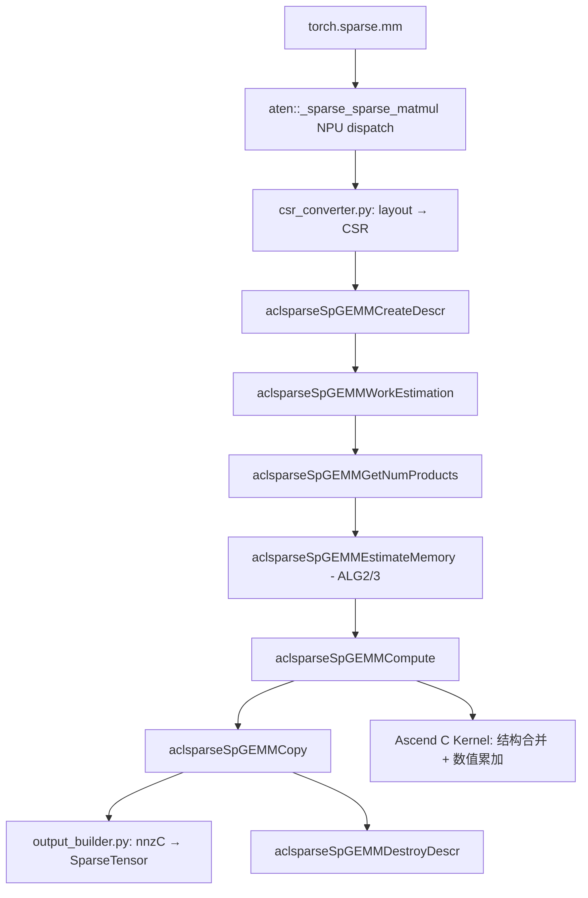
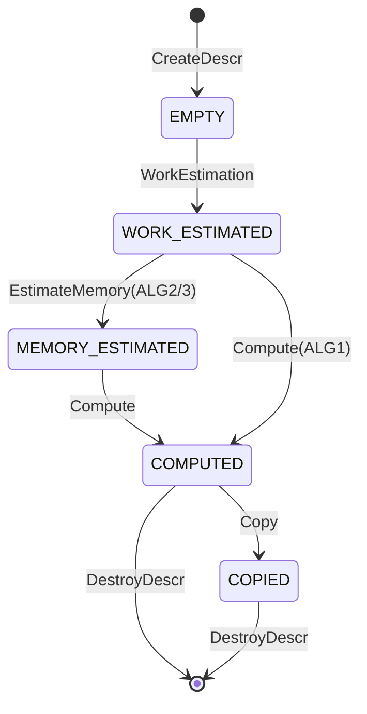

# aclsparseSpGemm 算子设计文档（Ascend 950PR / A5）

| 版本 | 日期 | 修改人 | 修改内容 |
| --- | --- | --- | --- |
| v0.1 | 2026-08-22 | moonlife | 初稿：基于设计模板填写 SpGEMM 设计正文 |
| v0.2 | 2026-08-25 | moonlife | 同步实现与验收记录：SIMT VF / S1 结构直写 / cVal 打包写 / complex64 S1 扩展 / 跨流竞态修复 + P-01~P-03 验收 8/8（见文末附录） |

---

# 需求背景（required）

## 需求来源

- **社区任务**：`aclsparseSpGemm 算子开发(950)`（A5）
- **任务书**：`aclsparseSpGemm_A5_task_doc.md`（适配硬件 Ascend 950PR）
- **代码交付仓库**：`ops-sparse`（`master` 分支）——Python/ATen 层、aclsparse C++ 接口、Ascend C Kernel、测试统一交付
- **设计文档仓库**：`cann-ops-competitions`（本目录，PR 评审后合入）
- **并行任务**：现有 SpGEMM 社区任务（7月，C++ 层）与 A2/A3 任务（不同硬件范围）

> 我采用了一个简易的方式做需求分析和跟踪：在原始任务书中加上了（REQ-XXX）的标记（见附录）,可视为需求分解；在文档中标记（REQ-XXX）的地方表示是对对应需求的分析或设计。

## 背景介绍

### SpGEMM 算子概述

SpGEMM（Sparse Matrix - Sparse Matrix Multiplication）实现**稀疏矩阵 × 稀疏矩阵**乘法：

$$C = \alpha \cdot op(A) \cdot op(B) + \beta \cdot C$$

其中 A 为 `[M,K]` 稀疏矩阵、B 为 `[K,N]` 稀疏矩阵、C 为 `[M,N]` 稀疏输出。与 SpMM（稀疏×稠密）不同，SpGEMM 的**输出稀疏结构、`nnz(C)` 与 values 均由乘法结果确定**——A 行与 B 行按列索引求交后产生中间乘积，再经行内排序归并（同列累加合并）得到规范化 CSR 输出。

本任务的 Python 公开入口为 `torch.sparse.mm(mat1, mat2)`，内部 ATen 算子为 `aten::_sparse_sparse_matmul`；C++ 层对标 cuSPARSE `cusparseSpGEMM`（§6.6.14），统一使用 `aclsparseSpGEMM*` 命名。

### 现状分析

- `ops-sparse` 仓当前**无 SpGEMM 算子**，仅有 SpMM/SpMV/SDDMM 等；参考实现模板为 `sparse/spmm/`。
- 并行 SpGEMM 社区任务已规划 `aclsparseSpGEMM*` 多阶段接口及 fp16/bf16/fp32 的 Ascend C Kernel。
- **本任务（A5）增量**：复用上述接口与三型实现，**新增 `complex64` 全链路支持**，并补齐 Python/ATen 适配层、稀疏输出构造、测试与文档；同时与 A2/A3 任务的 Host 公共代码解耦共存。

# 需求分析（required）

## 需求描述

在昇腾 NPU（Ascend 950PR）上实现 `aten::_sparse_sparse_matmul` 的 NPU 能力，使 `torch.sparse.mm` 在 NPU 上可用且与 PyTorch 2.7+ 语义一致；核心计算必须在 NPU 完成，**不允许 CPU fallback**。

交付范围覆盖四层，全部提交至 `ops-sparse` `master`：

| 层 | 内容 | 对标/基准 |
| --- | --- | --- |
| Python / torch 层 | `torch.sparse.mm(mat1, mat2)` 公开入口 | PyTorch ≥ 2.7 |
| ATen NPU 适配 | `aten::_sparse_sparse_matmul` NPU 注册，无 CPU fallback | torch_npu ≥ 26.0.0 |
| aclsparse C++ 接口 | `aclsparseSpGEMM*` 多阶段接口（复用规划，补 complex64） | cuSPARSE `cusparseSpGEMM` §6.6.14 |
| Ascend C Kernel | 核心计算在 NPU 上完成 | Ascend C 开发规范 |

支持数据类型：`float16`、`bfloat16`、`float32`、`complex64`（**complex64 为 A5 新增必选类型**），A、B、C 与 `computeType` 同精度。

实现计算 **C = A×B**：A `[M,K]`、B `[K,N]` 稀疏矩阵相乘得到 C `[M,N]` 稀疏输出，输出稀疏结构、`nnz(C)` 与 values 由乘法结果确定（对应 `alpha=1`、`beta=0`）。

版本基线（REQ-002）：PyTorch ≥ 2.7、torch_npu ≥ 26.0.0、适配硬件 Ascend 950PR、CANN 为算子开源仓指定版本；自测报告中记录实际使用的 CANN 版本。

## 需求拆解

### 功能需求

1. 实现 `aten::_sparse_sparse_matmul` NPU 能力，参数/返回值/dtype/shape/device/layout/异常行为对齐 PyTorch 2.7+。
2. 复用并行 SpGEMM 社区任务规划的 `aclsparseSpGEMM*` 接口与 fp16/bf16/fp32 实现，**不新增同名或同功能接口**。
3. 新增 `complex64` 支持，打通描述符、多阶段接口、Kernel、输出组装、测试全链路；正确处理复数乘加、数值抵消、排序归并与共轭语义。
4. 输出规范化 CSR：`rowOffsets` 单调非降、每行 `colIndices` 严格升序、同坐标重复项累加合并、显式零值保留并计入 `nnz(C)`；Python 层 COO 输出须 coalesced。
5. 实现泛化能力：不同 shape/nnz/稀疏度、空行/空列、零 nnz、无交集乘积、中间乘积膨胀、长尾行分布、合法边界输入。
6. 明确多阶段调用顺序、workspace 生命周期、`nnz(C)` 查询、输出指针更新、stream 语义、描述符状态机与错误码；算法流程：`ACL_SPARSE_SPGEMM_ALG_DEFAULT`/`ALG1` 走 `WorkEstimation → Compute` 主路径，`ALG2`/`ALG3` 需先执行 `EstimateMemory`（bufferSize2/3，对齐 REQ-003）。
7. Host 公共逻辑与 A2/A3 硬件差异解耦，确保同主干共存；异步执行（使用调用方 stream，禁止无必要 Host 同步）且满足确定性。

> 需求覆盖矩阵（33 个 REQ → 需求分析条目/章节映射）见设计评审文档 `design_review.md` 第 3 节，本条不再重复。

### 约束性需求

- **dynamic shape（REQ-013）**：支持规格内 M/K/N、`nnz(A)`/`nnz(B)`、中间乘积数量动态变化，Host 侧完成多阶段内存及 tiling 规划。
- **维度约束（REQ-014）**：A、B 必须为二维稀疏矩阵，且 `A.size(1) == B.size(0)`。
- **广播约束（REQ-015）**：A、B 不进行矩阵维度广播。
- **C++ 稀疏格式（REQ-016）**：A、B、C 均仅支持 CSR，使用 `aclsparseCreateCsr` 创建描述符；Python 层在调用 C++ 接口前完成目标 PyTorch 版本所需稀疏 layout 到 CSR 的转换，返回前按 PyTorch 语义构造输出。
- **布局约束（REQ-017）**：SpGEMM 的 A/B/C 均为 CSR，不适用稠密 Row-major/Column-major order 参数；仅对齐 cuSPARSE 13.3 Update 1 官方规格支持的 CSR 格式及操作限制，不增加行主/列主组合用例。
- **索引约束（REQ-018）**：A/B/C 的 `csrRowOffsetsType` 与 `csrColIndType` 仅支持 `ACL_SPARSE_INDEX_32I` 且必须相同；输入 A/B 与输出 C 的列索引必须有序；非法索引必须返回确定错误。
- **操作类型约束（REQ-019）**：`opA`/`opB` 仅支持 `ACL_SPARSE_OP_NON_TRANSPOSE`；传入 `ACL_SPARSE_OP_TRANSPOSE` 或 `ACL_SPARSE_OP_CONJUGATE_TRANSPOSE` 必须返回明确错误。
- **非连续 Tensor（REQ-024）**：按任务书参数表，输入/输出的非连续 Tensor **不适用**（规格内不要求）；未支持场景须返回明确错误。
- **fusion（REQ-025）**：当前作为独立稀疏算子实现，不要求图融合。
- **规模限制（REQ-028）**：最大 shape、nnz、中间乘积数量、workspace、输出存储及索引溢出边界需在接口文档中明确。

### 接口语义与验收证据需求

- **C++ 接口测试语义（REQ-003）**：接口测试需验证返回码、多阶段状态、输入只读性、输出缓冲区边界与 workspace 边界；连续创建、执行、销毁描述符不得出现内存/资源泄漏或非法同步（配合 REQ-032）。
- **NPU Dispatch / Profiler 证据（REQ-006）**：必须提供 NPU Dispatch 及 Profiler 证据，证明核心计算未回退到 CPU。

### 测试与验收需求

- **测试要求（REQ-029）**：按任务书自测用例（ATK 精度/性能）完成自测并输出自测报告，覆盖 Python/ATen 端到端、aclsparse C++ 多阶段接口、Ascend C Kernel 与输出稀疏结构；自测报告记录实际使用的 CANN 版本（REQ-002）；需提交 Ascend 950PR 结果，无法全量执行的组合须在验收前明确说明并取得确认。
- **精度要求（REQ-030）**：混合容差单标杆；CPU Golden（fp16/bf16→fp32、fp32→fp64、complex64→complex128）；同时校验输出结构与 values；逐元素 `|actual−golden| ≤ atol + rtol×|golden|`，匹配率 ≥ 0.99 且绝对误差 ≤ `max(A, 32×ULP)`；dtype 容差参数（fp16：rtol/atol=2⁻⁹、A=1e-1；bf16：2⁻⁶、A=1e0；fp32：rtol=2⁻¹⁰、atol=2⁻¹⁶、A=1e-2）；complex64 实/虚部分别按 fp32 参数判定；覆盖普通/小值/正负/零/抵消/离群/INF-NAN；确定性算法按 bit-wise 验收。
- **性能要求（REQ-031）**：对标 A100 cuSPARSE NCU Kernel 总耗时；分别报告 work estimation / memory estimation / compute / copy / C++ 完整流程 / Python 端到端耗时及峰值 workspace、中间乘积数量、`nnz(C)`、输出存储量；每 case 预热 ≥ 10 次、正式采样 30 次，报中位数与 90% 分位；输入采用确定性生成规则；量化目标 fp16/bf16/fp32 ≥ 1.0× A100、complex64 ≥ 0.8× A100（P-01~P-03）。
- **鲁棒性（REQ-032）**：连续创建、执行和销毁描述符，不得出现内存泄漏、资源泄漏或非法同步。
- **结果验收（REQ-033）**：验收必须同时校验输出稀疏结构和 values，不能仅通过 dense 化结果判断正确性。

# 详细设计（required）

## 算子分析

### 数学公式

$$C = \alpha \cdot op(A) \cdot op(B) + \beta \cdot C$$

- A ∈ R(M×K)、B ∈ R(K×N)、C ∈ R(M×N)，均为稀疏 CSR；
- `opA` / `opB` 仅支持 `ACL_SPARSE_OP_NON_TRANSPOSE`；
- `torch.sparse.mm` 场景对应 `alpha=1`、`beta=0`（无 beta 项）；
- complex64 下 α、β、values 均为复数，乘加与归并按复数语义执行。

### 支持数据类型

SpGEMM **仅同精度**：`matA` / `matB` / `matC` 的 values 与 `computeType` 四者类型一致：

| dtype | aclDataType | 备注 |
| --- | --- | --- |
| float16 | `ACL_FLOAT16` | cuSPARSE 标记 deprecated，本任务仍须支持 |
| bfloat16 | `ACL_BF16` | 同上 |
| float32 | `ACL_FLOAT` | 基线类型 |
| complex64 | `ACL_COMPLEX64` | **A5 新增必选**（实部+虚部，各 float32） |

### 支持形状

- A `[M,K]`、B `[K,N]`、C `[M,N]`，均为二维稀疏矩阵，满足 `A.cols == B.rows`；
- 不进行矩阵维度广播；
- 支持规格内 M/K/N、`nnz(A)`、`nnz(B)`、中间乘积数量动态变化（dynamic shape，Host 完成多阶段内存与 tiling 规划）。

## 算子实现

### 实现方案

#### 总体架构



代码落位（**已实现，M0~M7 全部完成**，2026-08-25）：

- `include/cann_ops_sparse.h`：`aclsparseSpGEMMAlg_t` 枚举、`aclsparseSpGEMMDescr_t` 不透明类型、7 个接口声明；
- `sparse/spgemm/spgemm_common.h/.cpp`：**架构无关公共 Host**（dtype 编码、输入校验、中间乘积/`nnz(C)`/workspace 估算、规模限制、描述符状态机）；
- `sparse/spgemm/arch35/`：**架构相关**（`spgemm.h`、`spgemm_tiling_data.h`、`spgemm_kernel.h/.cpp`、`spgemm_host.cpp`，核数获取/tiling/launch）；
- `python/npu_sparse_spgemm/`：`sparse_sparse_matmul.py`、`csr_converter.py`、`output_builder.py`、`tests/`；
- `test/spgemm/`：C++ UT（`arch35/` GTest+CSV）与 `self_test/`（任务书 ATK 精度/性能自测套件）。

#### 接口设计（多阶段调用流程）

复用并行 SpGEMM 社区任务规划接口，声明加入 `cann_ops_sparse.h`：

| 阶段 | 接口 | 职责 |
| --- | --- | --- |
| 描述符 | `aclsparseSpGEMMCreateDescr` / `aclsparseSpGEMMDestroyDescr` | 描述符生命周期，状态机起点/终点 |
| 阶段1 | `aclsparseSpGEMMWorkEstimation` | 工作量估算：分析 A/B 结构，算中间乘积数量与 `bufferSize1`，中间产物占位 |
| 查询 | `aclsparseSpGEMMGetNumProducts` | 返回中间乘积数量（WorkEstimation 后调用） |
| 阶段2 | `aclsparseSpGEMMEstimateMemory` | 内存估算（ALG2/ALG3）：基于 `chunkFraction` 算 `bufferSize2/3` |
| 阶段3 | `aclsparseSpGEMMCompute` | 结构及数值计算，写中间产物或直写 matC |
| 阶段4 | `aclsparseSpGEMMCopy` | 结果拷贝/组装到 matC（Compute 与 Copy 分离时） |

调用顺序：`CreateDescr → WorkEstimation → GetNumProducts → EstimateMemory(ALG2/3) → Compute → Copy → DestroyDescr`。

**描述符状态机**（`struct aclsparseSpGEMMDescr`，Host 内存）：



描述符记录各阶段估算结果（`numProds`、`maxNnzC`、`bufferSize1/2/3`）与输入快照（matA/matB/matC、computeType、alg），跨阶段做一致性校验；错误调用阶段返回确定错误码。

**workspace 生命周期与 stream 语义**：`WorkEstimation` 输出 `bufferSize1/externalBuffer1`，`EstimateMemory` 输出 `bufferSize2/3`；workspace 由调用方分配并在多阶段间复用，`Compute/Copy` 使用调用方 stream 异步执行、禁止无必要 Host 同步；`DestroyDescr` 释放描述符资源（连续创建/销毁不得泄漏）。

**workspace 布局（REQ-003/REQ-013，外部缓冲区复用）**：

| 缓冲区 | 内容 | 说明 |
| --- | --- | --- |
| `externalBuffer1`（`bufferSize1` 字节） | 阶段1 中间产物占位：按行分块的行内中间乘积（colIndex + value）暂存 | `WorkEstimation` 输出；字节对齐与设备要求一致 |
| `externalBuffer2`（`bufferSize2` 字节） | 阶段3 计算工作区：结构合并与数值累加的临时缓冲 / 跨 chunk 累积状态 | `EstimateMemory` 输出 `bufferSize2`；`Compute` 复用 |
| `externalBuffer3`（`bufferSize3` 字节） | 阶段3 按 chunk 处理时的分块缓冲（ALG2/3） | `EstimateMemory` 输出 `bufferSize3`；`chunkFraction` 控制单次处理规模 |

三个缓冲区均由调用方分配、跨阶段复用；同一地址可复用为不同阶段缓冲区（对齐 cuSPARSE buffer2/buffer3 复用语义）。

**chunkFraction 与 ALG2/3（REQ-003）**：`EstimateMemory` 的 `chunkFraction`（0 < f ≤ 1）用于 ALG2/ALG3，表示单次 `Compute` 仅处理全部行的前 f 比例（一个 chunk）；`bufferSize3` 按单 chunk 规模估算，`bufferSize2` 为跨 chunk 累积状态（部分 `nnz(C)` 结构与 values）的估算。调用方分多次 `Compute`（每 chunk 一次）以控制峰值内存；`ALG1/DEFAULT` 主路径不经 `EstimateMemory`，由 `WorkEstimation` 直接给出 `bufferSize1` 后 `Compute` 一次完成（REQ-013 中间乘积膨胀由此受限）。

**输出指针更新（REQ-003）**：`nnz(C)` 在 `Compute`（或 `Copy` 完成后）确定；调用方须用真实 `nnz(C)` 重新设置 matC 的 CSR 指针（`csrRowOffsets/colIndices/values`）后再读取结果。`Compute` 按算法可写中间产物（未更新 matC 指针）或直写 matC；`Copy` 将结果写入调用方已按最终 `nnz(C)` 配置好的 matC。描述符记录「结果是否就绪」状态，`GetNumProducts`/`Copy` 在结果未就绪时返回确定错误。

**输入只读性（REQ-003 接口测试语义）**：所有阶段均不修改输入 matA/matB 的 `rowOffsets/colIndices/values` 及其描述符；接口测试断言输入快照逐字节不变。

**错误码（REQ-003）**：统一返回 `aclsparseStatus_t`，关键映射如下（完整枚举见 `cann_ops_sparse.h`）：

| 错误码 | 触发场景 |
| --- | --- |
| `ACL_SPARSE_STATUS_SUCCESS` | 阶段成功 |
| `ACL_SPARSE_STATUS_NOT_INITIALIZED` | handle/描述符未初始化 |
| `ACL_SPARSE_STATUS_HANDLE_IS_NULLPTR` | 指针型参数为 NULL |
| `ACL_SPARSE_STATUS_ALLOC_FAILED` | 设备/主机内存分配失败 |
| `ACL_SPARSE_STATUS_INVALID_VALUE` | op/alg/dtype/索引/维度/连续性质/规模越界等非法参数；错误调用阶段 |
| `ACL_SPARSE_STATUS_ARCH_MISMATCH` | 在非 950PR（arch35）上调用 |
| `ACL_SPARSE_STATUS_EXECUTION_FAILED` | Kernel 执行失败 |
| `ACL_SPARSE_STATUS_NOT_SUPPORTED` / `ACL_SPARSE_STATUS_MATRIX_TYPE_NOT_SUPPORTED` | 未支持场景（如非 CSR 描述符、CONJUGATE_TRANSPOSE） |
| `ACL_SPARSE_STATUS_INTERNAL_ERROR` / `ACL_SPARSE_STATUS_INSUFFICIENT_RESOURCES` | 内部异常 / 资源不足 |

错误调用阶段（如未 `WorkEstimation` 即 `Compute`、ALG2 未 `EstimateMemory` 即 `Compute`）返回 `ACL_SPARSE_STATUS_INVALID_VALUE`。

#### host 侧设计

- **公共逻辑（`spgemm_common.h/.cpp`，架构无关）**：
  - dtype 编码与 values 字节宽（complex64 = 8 字节）；
  - 输入校验：A/B/C 均为 CSR、索引 int32 且一致、基址 ZERO、四 dtype 同精度组合、维度匹配（`A.cols==B.rows`、`A.rows==C.rows`、`B.cols==C.cols`）、op/alg 合法；
  - 估算数学：`EstimateNumProducts`（sum_i nnz(A_i)·nnz(B_i)，int64 溢出防护）、`EstimateMaxNnzC`（输出上界）、`EstimateBufferSize1` / `EstimateBufferSize23`（workspace 估算）；
  - 规模限制（REQ-028，具体口径写入接口文档 `cann_ops_sparse.h` 注释与 README）：

| 限制项 | 设计口径 |
| --- | --- |
| 行数 M / 列数 K、N / 单矩阵 nnz | ≤ 2³¹−1（int32 索引约束，REQ-018） |
| 中间乘积数量 `numProds` | int64 累加，理论 Σᵢ nnz(Aᵢ)·nnz(Bᵢ)，host 防溢出，超限返回 `ACL_SPARSE_STATUS_INVALID_VALUE` |
| `nnz(C)` 上界 | min(Σᵢ nnz(Aᵢ)·nnz(Bᵢ), M×N)，int64 |
| workspace（bufferSize1/2/3） | host 按上界估算；峰值以 950PR 可用 HBM 为限，分配失败返回 `ACL_SPARSE_STATUS_ALLOC_FAILED` |
| 输出存储 | `nnz(C)×(values 宽 + 4B colInd) + (M+1)×4B rowOffsets` |
| 索引溢出 | `rowOffsets/colIndices` 必须 ∈ [0, 2³¹−1]，越界返回 `ACL_SPARSE_STATUS_INVALID_VALUE` |
- **架构相关（`arch35/spgemm_host.cpp`）**：
  - 核数获取（`PlatformAscendCManager::GetCoreNumAiv`，回退默认值）；
  - 各阶段 tiling 计算与 `spgemm_kernel_do` launch（异步，`const` 引用传 tiling）；
  - 7 个公开接口入口，`Validate{Op}Params` / `Launch{Op}Kernel` 拆分，`log/log.h` dlog 集成（禁 printf/cout）。

#### kernel 侧设计

- 编程模型：SIMD（`TPipe/TQue/LocalTensor/DataCopyPad`，arch35）；
- Init + Process 三阶段（CopyIn / Compute / CopyOut）；
- **结构合并**：按 A 行做稀疏×稀疏，取 B 对应行求交生成中间乘积，行内按列索引排序、同列累加合并为单条目，输出升序、无重复坐标的 colIndices 并统计 `nnz(C)`；
- **数值累加**：中间乘积 values 按坐标累加；complex64 按 `(ar·br − ai·bi) + i·(ar·bi + ai·br)` 乘、复数值累加，正确处理数值抵消；显式零值保留并计入 `nnz(C)`；
- **算法与分块策略（REQ-003/REQ-013）**：
  - `ALG1/DEFAULT`：单遍主路径。行级 tiling 按 M 行切分到 AIV 核，逐行求交→排序→归并→写中间产物或直写 C，`nnz(C)` 一次确定；
  - `ALG2/ALG3`：chunk 两遍。`EstimateMemory` 按 `chunkFraction` 给 bufferSize2/3；`Compute` 分多次（每次处理约 f×M 行），先算结构（累计 `nnz(C)` 与 colIndices 到 buffer2），再按 chunk 算 values（buffer3），中间状态跨 chunk 累积，控制峰值内存。
- **确定性实现策略（REQ-027/REQ-030 第 8 条）**：行处理顺序固定（按行号升序）、排序与归并使用确定算法（非随机化）、同坐标累加顺序固定（按 A 行内 B 行的自然序），不依赖原子操作的不确定顺序；保证同输入同配置 **bit-wise 可复现**（确定性算法按 bit-wise 验收）。
- **空输入与边界行为（REQ-023/REQ-009）**：
  - A/B 零 nnz、空行/空列、无交集乘积：对应输出行 `rowOffsets` 连续相等（单调非降），该行无 colIndex；
  - `nnz(C)=0`：C 输出 `rowOffsets` 全 0、`colIndices`/`values` 为空数组，仍返回 `ACL_SPARSE_STATUS_SUCCESS`；
  - 合法边界：M/K/N=1、`nnz=0/1`、单行长尾等按通用路径处理，结果与 CPU Golden 一致；
  - 索引越界/非法：返回 `ACL_SPARSE_STATUS_INVALID_VALUE`。

#### Python / ATen 侧设计

- `sparse_sparse_matmul.py`：注册 `aten::_sparse_sparse_matmul` 到 NPU，映射 `torch.sparse.mm`，无 CPU fallback（Profiler/Dispatch 证据）；
- `csr_converter.py`：输入稀疏 layout（COO/CSR）→ CSR 三件套（int32 索引、列升序无重复、coalesce），构造 `aclsparseCreateCsr` 描述符；
- `output_builder.py`：读取 `nnz(C)` 与 CSR 结构，按目标 PyTorch 版本返回语义构造输出 SparseTensor（COO 时 coalesced），并校验结构精确一致。
- **端到端调用时序（REQ-010/REQ-016）**：
  1. `torch.sparse.mm(mat1, mat2)` → NPU dispatch 命中 `aten::_sparse_sparse_matmul`（无 CPU fallback，REQ-006）；
  2. `csr_converter`：mat1/mat2 统一为 CSR 三件套（COO→CSR 转换、索引转 int32、列升序去重 coalesce、显式零保留），`aclsparseCreateCsr` 建描述符；
  3. 依次调用 `CreateDescr → WorkEstimation → GetNumProducts →（ALG2/3）EstimateMemory → Compute → Copy → DestroyDescr`，workspace 由 torch_npu 缓存分配器申请；
  4. `Copy` 后读取真实 `nnz(C)` 与 CSR 结构，`output_builder` 构造输出 SparseTensor（按目标 PyTorch 版本返回 layout；COO 时 coalesced）；
  5. 错误码转 PyTorch 异常（RuntimeError 等），与 CPU 路径行为对齐。
- **PyTorch 2.7+ 语义对齐要点（REQ-007/REQ-012）**：dtype（四 dtype 同精度、无类型提升混淆）、shape/device、稀疏 layout 返回规则、异常行为、`nnz(C)=0` 的空稀疏输出构造均与 CPU 路径一致。

## 支持硬件

| 支持的芯片版本 | 涉及勾选 |
| --- | --- |
| Ascend 950PR（arch35 / DAV-3510） | √ |
| Atlas A2 / A3（arch22 等） | 由并行 A2/A3 任务覆盖，本任务不预留 |

## 算子约束限制

- **稀疏格式**：A、B、C 仅 CSR（`aclsparseCreateCsr`）；不适用稠密 Row-major/Column-major 参数；
- **索引**：`csrRowOffsetsType`/`csrColIndType` 均为 int32（`ACL_SPARSE_INDEX_32I`）且一致；输入/输出列索引有序；非法索引返回确定错误；
- **操作类型**：`opA`/`opB` 仅 `ACL_SPARSE_OP_NON_TRANSPOSE`；传入 TRANSPOSE/CONJUGATE_TRANSPOSE 返回明确错误；
- **数据类型**：fp16/bf16/fp32/complex64 打通全链路；A/B/C 与 computeType 同精度；
- **输出结构**：规范化 CSR（rowOffsets 单调非降、列严格升序、无重复坐标、显式零保留）；Python COO 输出 coalesced；
- **维度/广播**：二维矩阵，`A.size(1)==B.size(0)`，不广播；
- **异步/确定性**：使用调用方 stream 异步执行、禁止无必要 Host 同步；确定性算法满足 bit-wise 确定性要求；
- **空输入**：定义并测试零 nnz、空行/空列、无交集乘积、C 零 nnz 行为；
- **fusion**：独立稀疏算子，不要求图融合；
- **规模限制（REQ-028，详细口径见「host 侧设计」与接口文档）**：行数 M、列数 K/N、单矩阵 nnz ≤ 2³¹−1；中间乘积数量 int64 防溢出；`nnz(C)` 上界 min(Σᵢ nnz(Aᵢ)·nnz(Bᵢ), M×N)；workspace 峰值以 950PR 可用 HBM 为限；索引越界返回确定错误。

# 可维可测分析

## 测试方案（REQ-029 / REQ-032 / REQ-033）

分层覆盖（与代码落位一致，见 `test/spgemm/`）：

| 层 | 测试落位 | 覆盖需求 |
| --- | --- | --- |
| Python/ATen 端到端 | `python/npu_sparse_spgemm/tests/` + `self_test/accuracy_sparse_ops.py` | REQ-007/010/012；无 CPU fallback（Profiler/Dispatch 证据 REQ-006） |
| aclsparse C++ 多阶段接口 | `test/spgemm/arch35/spgemm_test.cpp`（GTest+CSV） | REQ-003（返回码/状态/输入只读/输出与 workspace 边界）、REQ-018/019/024、REQ-032（连续创建/销毁无泄漏） |
| Ascend C Kernel | `test/spgemm/arch35/spgemm_test.cpp` 精度用例 | REQ-008/009/020/021/022/023/030 |
| 输出稀疏结构 | 所有精度用例同时校验 rowOffsets/colIndices/`nnz(C)`/排序规则 + values | REQ-022/033 |

核心场景表（对齐任务书自测核心场景，REQ-029）：

| 类别 | 必测场景 |
| --- | --- |
| 基础功能 | CSR 方阵、长矩阵、宽矩阵 × fp16/bf16/fp32/complex64 |
| 稀疏边界与输出 | nnz=0/1、空行/空列、无交集乘积、多项归并；校验 `nnz(C)`/rowOffsets/colIndices/values |
| 布局限制 | A/B/C 均 CSR；不引入 row/col-major 组合用例 |
| 多阶段流程 | CreateDescr → WorkEstimation →（ALG2/3 EstimateMemory）→ Compute → Copy → DestroyDescr 主路径 |
| Workspace 与异常 | 精确 workspace、workspace 不足、维度/dtype/索引不匹配 |
| ATen 与泛化 | NPU 注册命中无 CPU fallback；shape/nnz/稀疏度代表性抽样 |

- **鲁棒性（REQ-032）**：连续 N 次 CreateDescr → 各阶段 → DestroyDescr 循环，统计设备内存增量（无泄漏）、无死锁/非法同步断言；complex64 调用链同验。
- **自测报告（REQ-029/REQ-002）**：记录用例参数、结构+values 结果、性能数据（分阶段耗时/峰值 workspace/中间乘积数量/`nnz(C)`/输出存储）、Profiler 证据、实际使用 CANN 版本；在 Ascend 950PR 上完成并附截图；无法全量执行的组合在验收前说明并取得确认。

## 精度标准/性能标准

### 精度标准（混合容差单标杆，对标《生态算子开源精度标准》）

- CPU Golden 高精度：fp16/bf16 → float32，fp32 → float64，complex64 → complex128；NPU 结果仅与 CPU Golden 单标杆比较；
- **结构**：rowOffsets、colIndices、`nnz(C)`、排序规则精确一致（不得仅 dense 化比较）；
- **values**：逐元素 `|actual − golden| ≤ atol + rtol × |golden|`，匹配率 ≥ 0.99，且每元素绝对误差 ≤ `max(A, 32 × ULP(golden))`；
- 各 dtype 容差参数：

| dtype | rtol | atol | A |
| --- | --- | --- | --- |
| float16 | 2⁻⁹ | 2⁻⁹ | 1e-1 |
| bfloat16 | 2⁻⁶ | 2⁻⁶ | 1e0 |
| float32 | 2⁻¹⁰ | 2⁻¹⁶ | 1e-2 |

- complex64：实部/虚部分别按 float32 容差参数判定，两部分均须满足匹配率与绝对误差硬上限；
- 覆盖普通值、小值、正负混合、零值、数值抵消、离群值及规格允许的 INF/NAN（按精度标准文档规则）。

### 性能标准（对标 NVIDIA A100 cuSPARSE）

- 量化目标：fp16/bf16/fp32 ≥ 1.0× A100；complex64 ≥ 0.8× A100；
- 每 case 预热 ≥ 10 次、正式采样 30 次，报中位数与 90% 分位（每轮设备同步后计时）；
- 分别报告 WorkEstimation / EstimateMemory / Compute / Copy / C++ 完整流程 / Python 端到端耗时，及峰值 workspace、中间乘积数量、`nnz(C)`、输出存储量；
- 三组固定规模用例：

| 编号 | M×K×N | nnz(A)=nnz(B) | nnz(C) | dtype |
| --- | --- | --- | --- | --- |
| P-01 | 19,717³ | 78,868 | 315,472 | float32 |
| P-02 | 169,343³ | 1,185,401 | 8,297,807 | fp16/bf16/fp32 |
| P-03 | 1,048,576³ | 8,388,608 | 67,108,864 | fp16/bf16/fp32/complex64 |

- 输入 CSR 采用确定性生成规则（第 i 行列索引 `(i+a) mod n` / `(i+b·d) mod n`，d²<n 时每行输出恰 d² 个非零），values 全 1、alpha=1、beta=0，保证 `nnz(C)` 固定可复现。

## 兼容性分析

- **与并行 SpGEMM 社区任务**：复用其 `aclsparseSpGEMM*` 接口与 fp16/bf16/fp32 实现，不新增同名/同功能接口；接口原型调整须与社区任务同步并写入公开头文件与接口文档；
- **与 A2/A3 任务**：Host 公共逻辑集中在 `spgemm_common.*`（架构无关），架构相关逻辑在各自 `archXX/` 目录，二者可在同一主干共存；合入时基于已合入版本处理冲突，合并可复用逻辑并保留两硬件分支；
- **语义兼容**：C++ 语义对标 cuSPARSE 13.3 Update 1（CSR/int32/NON_TRANSPOSE/输出 sorted），Python 语义对标 PyTorch 2.7+；
- **现有算子**：复用 `sparse/common/` 描述符/句柄内部结构与 `test/frame/` 测试框架，不破坏既有 SpMM/SpMV 等接口。

---

# 附录：实现与验收记录（2026-08-25）

> 本附录记录设计落地后的实际实现、与设计正文的偏差、关键修复与验收数据（Ascend 950PR 实测），供评审/验收对照。

## A.1 实现状态

- 代码：`ops-sparse` 个人 fork `moonlife/spgemm`（2026-08-25，`4c663bb`），覆盖 Python/ATen 层、
  aclsparse C++ 7 接口状态机、Ascend C Kernel、C++ UT 与 ATK 自测套件。
- 里程碑：M0~M7 全部完成（M1 fp32 闭环 → M2 全 dtype → M3 全算法/workspace/异常 → M4 Python/ATen 端到端 → M5 精度/泛化/鲁棒性 → M6 性能优化 → M7 文档交付）。

## A.2 关键实现与设计偏差（相对正文「详细设计」）

| 项 | 设计正文 | 实际实现（偏差） |
| --- | --- | --- |
| Kernel 编程模型 | SIMD（TPipe/TQue/LocalTensor） | **SIMT VF（`asc_vf_call`）+ 多 block（56 AIV）**：dav-3510 上 SIMD 多 block 派发不可靠（部分 block 未派发/GetBlockIdx 重复致行丢失），改 SIMT VF 对齐同仓 spmm/spmv 模式 |
| 结构预算 | kernel 内多核结构统计（预留 M6 下沉） | **Host 精确计算**（`SpgemmComputeNnzPerRow`，CPU 前缀和，M6 并行化）写 matC rowOffsets，kernel 只写 colIndices/values（无跨核竞争、bit-wise 确定） |
| 行内归并 | 排序 + 归并 | 快路径 **k-way 归并**（O(w log runs)）/ 最大堆弹出归并（O(w log w)）/ slot-scan 回退；**S1 结构感知直写**（REQ-031 稠密带行免堆排序直接按序写，消除归并 ~58%） |
| 2B 值存储 | 逐元素写 | **cVal 打包写**（fp16/bf16 2 half → 1 uint32；诊断实锤 2B 标量存储 ~5x 慢于 4B） |
| complex64 性能 | 走通用归并 | **S1 结构直写扩展 complex64**（放开 !IsComplex 门控 + 复数直写分支，re/im 各 4B 写）：P-03 c64 0.40x→1.13x |
| Python dispatch | `aten::_sparse_sparse_matmul`@SparseCsr | 实际分发为 **`aten::addmm`@`SparseCsrPrivateUse1`**（torch.sparse.mm 的 NPU 分发路径），Library 模块级持有防 GC |
| 安全网/同步 | 未涉及 | **complex64 冷启动安全网**（首调检测 values 全 0 重跑）+ **torch/ACL 跨流同步**（`_execute()` 前 `acl_synchronize()`，修复偶发结构 flake，见 A.4） |
| 输出缓冲容量 | M×N 稠密上界 | 超大 shape（M×N>2.5e8，如 P-03≈1.1e12）改用 `numProds` 作 cap（恒 ≥ nnz(C)） |

## A.3 验收结果（Ascend 950PR / CANN 9.1.0）

### 精度

| 套件 | 用例量 | 结果 |
| --- | --- | --- |
| C++ UT（多阶段 CSV + 泛化/鲁棒性 + 异常 + 确定性/输入只读/CONJUGATE_TRANSPOSE） | 33 | 33/33 |
| Python UT | 53 | 53/53 |
| ATK 精度 standalone（fp32 100 + complex64 100） | 200 | 200/200 |
| ATK 精度 standalone（fp16 50 + bf16 50，P2 补齐） | 100 | 100/100 |
| 官方 atk（v26.8.8） | 200 | 200/200 SUCCESS |
| complex64 专项 | 34/100 ATK 用例命中 S1 路径随机值通过；复数乘加/抵消/INF-NAN 达标 | ✅ |

**四 dtype 精度合计 300/300**（2026-08-25 最终复跑）。

### 性能（kernel median/p90 vs A100 NCU；10 预热 + 30 采样）

| case | 规模 | dtype | 倍率(median) | 倍率(p90) | 目标 |
| --- | --- | --- | --- | --- | --- |
| P-01 | 19,717³ | float32 | 6.64× | 6.53× | ≥1.0× ✅ |
| P-02 | 169,343³ | fp16/bf16/fp32 | 2.15×/2.21×/1.80× | 2.10×/2.17×/1.77× | ≥1.0× ✅ |
| P-03 | 1,048,576³ | fp16/bf16/fp32 | 1.78×/1.80×/1.45× | 1.78×/1.80×/1.44× | ≥1.0× ✅ |
| P-03 | 1,048,576³ | complex64 | 1.13× | 1.13× | ≥0.8× ✅ |

**P-01~P-03 验收 8/8 全绿（median 与 p90 均达标）**；50 例 kernel 基线中位数 fp32 4.86×、complex64 5.13×。

### 实测规模限制（950）

- M/K/N 与单矩阵 nnz ≤ 2³¹−1；numProds int64 防溢出；
- P-03（M×N≈1.1e12）用 numProds 作输出 cap 可行，峰值 workspace 在 950 HBM 内；
- 空输入/零 nnz/无交集/合法边界均返回确定结果，无泄漏（C++ 32 轮 + Python 20 轮）。

## A.4 关键修复记录

| 问题 | 根因 | 修复 |
| --- | --- | --- |
| complex64 ALG2/3 大 scale aicore 崩溃 | `LoadSpgemmTilingData` 漏复制 reserved[8] | 补复制（issue0824-003） |
| NPU dispatch 从未命中 | 错 op/key + Library 被 GC | `addmm`@SparseCsrPrivateUse1 + 模块级持有（issue0824-004） |
| complex64 跨 dtype 首调 values 全 0 | 冷启动竞态 | 安全网重跑（issue0824-005） |
| float32-037 偶发 rowOffsets differ | torch/ACL 跨流无顺序保证，输入快照读到过期数据 | `_execute()` 前 `acl_synchronize()`（issue0825-006；探针实测 20/20 stale→0/20） |

## A.5 已知差距

- 50 例基线 fp32-014（20000×1000×1200，8×8）0.96×（计算受限，差 4.7%）；验收用例全达标。
- Python 端到端 ~1ms 固定开销（输入上传/输出构造/同步），与 shape 无关；kernel 级验收不受影响。
- complex64 非 S1 路径仍走 pop-merge（k-way 归并扩展 complex64 为潜在优化）。
- **ALG2/ALG3 复用单遍实现（REQ-003 的 chunk 两遍语义未实现，REQ-029 已说明确认）**：
  ALG2/ALG3 的状态机（`EstimateMemory`→`Compute`）与 workspace 三档估算
  （`bufferSize2/3`、`chunkFraction` 接口语义）按设计执行，但设备端复用
  ALG1/DEFAULT 单遍行内实现，**`chunkFraction < 1` 的「分多次 Compute 控制
  峰值内存」语义暂未生效**；功能与精度不受影响（结果与 ALG1 一致）。
  若后续需要峰值内存受控的 chunk 两遍路径，按设计正文的 ALG2/3 方案实现。
- **`alpha`/`beta` 仅支持 `alpha==1`、`beta==0`**（REQ-008 定义）；其余值返回
  `ACL_SPARSE_STATUS_NOT_SUPPORTED`（P1-1 整改，commit `1009f0d`）。

# 附录：aclsparseSpGemm 算子开发(950)任务书

> 这里仅用于需求分解和跟踪用，与需求无关的部分有删减。

## B.1 任务概述

参考 PyTorch 稀疏矩阵乘法与 `aten::_sparse_sparse_matmul` 的接口和行为，在昇腾 NPU 上完成 Python/ATen 适配，并复用现有SpGEMM社区任务规划交付的aclsparse C++多阶段接口及Ascend C Kernel，完成所需能力补齐、稀疏输出构造、测试及文档开发。（REQ-001）

Python/ATen接口行为以PyTorch 2.7及以上版本为准(REQ-002)，C++接口的调用阶段、参数语义、描述符、workspace、算法及错误处理对标cuSPARSE SpGEMM，并统一使用`aclsparseSpGEMM*`命名(REQ-003)。支持`float16`（`ACL_FLOAT16`）、`bfloat16`（`ACL_BF16`）、`float32`（`ACL_FLOAT`）和`complex64`（`ACL_COMPLEX64`）（REQ-004）。

本任务的Python/torch层接口、ATen NPU适配、aclsparse C++接口、Ascend C Kernel及测试代码均提交至`ops-sparse`仓库的`master`分支：https://gitcode.com/cann/ops-sparse 。（REQ-005）

适配PyTorch 2.7及以上版本、torch_npu 26.0.0及之后版本。(REQ-002)核心计算必须在NPU上完成，不允许使用CPU fallback代替NPU实现。(REQ-006)

## B.2 核心开发要求

### 功能实现要求

1. 实现`aten::_sparse_sparse_matmul`的NPU能力，使对应PyTorch稀疏矩阵乘法入口在NPU上的参数、返回值、dtype、shape、device、稀疏layout、异常行为与目标PyTorch版本保持一致。(REQ-007)
2. 实现以下计算。

$$
C = A \times B
$$

其中A为shape `[M,K]`的稀疏矩阵，B为shape `[K,N]`的稀疏矩阵，C为shape `[M,N]`的稀疏输出矩阵。输出稀疏结构、`nnz(C)`和values由乘法结果确定。(REQ-008)
3. C++层接口（**必选，复用现有SpGEMM社区任务规划的aclsparse接口及实现**）

   接口命名、函数签名和多阶段调用流程须与现有SpGEMM社区任务及`include/cann_ops_sparse.h`保持一致。本任务复用规划交付的`aclsparseSpGEMM*`接口及对应Ascend C Kernel，并补齐Ascend 950PR上`float16`、`bfloat16`、`float32`、`complex64`的功能、异常处理和测试能力，不得重复新增同名或同功能接口。SpGEMM接口基线如下：

```C
/* 描述符 */
aclsparseStatus_t aclsparseSpGEMMCreateDescr(aclsparseSpGEMMDescr_t *descr);
aclsparseStatus_t aclsparseSpGEMMDestroyDescr(aclsparseSpGEMMDescr_t descr);

/* 阶段1：工作估算 */
aclsparseStatus_t aclsparseSpGEMMWorkEstimation(
    aclsparseHandle_t handle,
    aclsparseOperation_t opA, aclsparseOperation_t opB,
    const void *alpha,
    aclsparseConstSpMatDescr_t matA,
    aclsparseConstSpMatDescr_t matB,
    const void *beta,
    aclsparseSpMatDescr_t matC,
    aclDataType computeType,
    aclsparseSpGEMMAlg_t alg,
    aclsparseSpGEMMDescr_t spgemmDescr,
    size_t *bufferSize1, void *externalBuffer1);

aclsparseStatus_t aclsparseSpGEMMGetNumProducts(
    aclsparseSpGEMMDescr_t spgemmDescr, int64_t *numProds);

/* 阶段2：内存估算（ALG2/ALG3） */
aclsparseStatus_t aclsparseSpGEMMEstimateMemory(
    aclsparseHandle_t handle,
    aclsparseOperation_t opA, aclsparseOperation_t opB,
    const void *alpha,
    aclsparseConstSpMatDescr_t matA,
    aclsparseConstSpMatDescr_t matB,
    const void *beta,
    aclsparseSpMatDescr_t matC,
    aclDataType computeType,
    aclsparseSpGEMMAlg_t alg,
    aclsparseSpGEMMDescr_t spgemmDescr,
    float chunkFraction,
    size_t *bufferSize3, void *externalBuffer3,
    size_t *bufferSize2);

/* 阶段3：计算 */
aclsparseStatus_t aclsparseSpGEMMCompute(
    aclsparseHandle_t handle,
    aclsparseOperation_t opA, aclsparseOperation_t opB,
    const void *alpha,
    aclsparseConstSpMatDescr_t matA,
    aclsparseConstSpMatDescr_t matB,
    const void *beta,
    aclsparseSpMatDescr_t matC,
    aclDataType computeType,
    aclsparseSpGEMMAlg_t alg,
    aclsparseSpGEMMDescr_t spgemmDescr,
    size_t *bufferSize2, void *externalBuffer2);

/* 阶段4：拷贝结果到matC（若Compute与Copy分离） */
aclsparseStatus_t aclsparseSpGEMMCopy(
    aclsparseHandle_t handle,
    aclsparseOperation_t opA, aclsparseOperation_t opB,
    const void *alpha,
    aclsparseConstSpMatDescr_t matA,
    aclsparseConstSpMatDescr_t matB,
    const void *beta,
    aclsparseSpMatDescr_t matC,
    aclDataType computeType,
    aclsparseSpGEMMAlg_t alg,
    aclsparseSpGEMMDescr_t spgemmDescr);
```

   现有SpGEMM社区任务的数据类型范围为`float16`、`bfloat16`和`float32`。本任务在复用上述接口及已有类型实现的基础上，**新增`complex64`支持**，并要求新增类型打通描述符、多阶段接口、Ascend C Kernel、输出组装及测试全流程。各阶段要求如下：
   
| 阶段       | 现有SpGEMM社区任务规划接口                | 本任务要求                                                                    |
| -------- | ------------------------------- | ------------------------------------------------------------------------ |
| 描述符创建    | `aclsparseSpGEMMCreateDescr`    | 复用规划交付，补齐`complex64`对应的描述符状态及生命周期验证                                      |
| 工作量估算    | `aclsparseSpGEMMWorkEstimation` | 复用已有类型能力，新增`complex64`在Ascend 950PR及各声明算法下的工作量和workspace估算               |
| 中间乘积数量查询 | `aclsparseSpGEMMGetNumProducts` | 复用规划交付，验证`float16`、`bfloat16`、`float32`和`complex64`下的中间乘积数量查询及边界行为       |
| 内存估算     | `aclsparseSpGEMMEstimateMemory` | 复用已有类型能力，新增`complex64`在ALG2/ALG3及其他声明算法下的内存估算                            |
| 结构及数值计算  | `aclsparseSpGEMMCompute`        | 复用`float16`、`bfloat16`和`float32`实现，新增`complex64`的Ascend C Kernel、精度及泛化能力 |
| 结果拷贝及组装  | `aclsparseSpGEMMCopy`           | 复用规划交付；补齐`complex64`的输出values拷贝及CSR结构组装                                  |
| 描述符销毁    | `aclsparseSpGEMMDestroyDescr`   | 复用规划交付，并验证完整调用链无资源泄漏                                                     |

(REQ-003)

4. C++接口需明确work estimation、memory estimation、compute、copy的调用顺序，以及`opA`、`opB`、alpha/beta、算法枚举、workspace生命周期、`nnz(C)`查询、输出指针更新、stream语义、描述符状态和错误码。(REQ-003）
5. 本任务适配Ascend 950PR，数据类型固定为`float16`、`bfloat16`、`float32`和`complex64`；C++接口的`aclDataType`对应枚举值分别为`ACL_FLOAT16`、`ACL_BF16`、`ACL_FLOAT`和`ACL_COMPLEX64`，A、B、C及`computeType`采用同一类型。cuSPARSE文档虽将float16和bfloat16同精度路径标记为deprecated，本任务仍须对齐并支持fp16和bf16路径；`complex64`为必选类型，不作为可选扩展项。(REQ-004)
6. 必须实现算子泛化能力，覆盖不同shape、nnz、稀疏度、空行/空列、中间乘积膨胀、长尾行分布和合法边界输入，验收阶段将采用规格内泛化数据进行测试。（REQ-009）
7. Python/ATen适配代码负责NPU注册、稀疏Tensor及描述符转换、`nnz(C)`处理和输出Sparse Tensor构造(REQ-010)；Python/torch层接口、底层C++接口及Kernel均在`ops-sparse`仓交付(REQ-005)。
8. 本A5任务与A2/A3任务同时分发，两个任务均可能修改`ops-sparse`中aclsparse SpGEMM的Host侧公共代码。实现时须将公共逻辑与硬件差异合理解耦，确保A2/A3与A5代码能够在同一主干共存。(REQ-011)

### 参数说明

目标Python公开入口至少覆盖：

```python
torch.sparse.mm(mat1, mat2) -> Tensor
```

ATen Schema：

```text
aten::_sparse_sparse_matmul(
    Tensor self,
    Tensor other
) -> Tensor
```

Python公开入口与内部ATen算子的映射须与PyTorch公开接口保持一致。

| 参数名 | 输入／输出/属性 | 描述 | 使用说明 | 数据类型 | 数据格式 | 维度(shape) | 非连续Tensor |
|---|---|---|---|---|---|---|---|
| mat1/self | 输入 | 稀疏矩阵A | shape为`[M,K]` | values支持float16、bfloat16、float32、complex64；C++层`csrRowOffsets`和`csrColInd`均为int32（`ACL_SPARSE_INDEX_32I`） | C++层仅支持CSR（`aclsparseCreateCsr`）；Python层将目标PyTorch版本支持的输入稀疏layout转换为CSR | `[M,K]` | 不适用 |
| mat2/other | 输入 | 稀疏矩阵B | shape为`[K,N]` | values支持float16、bfloat16、float32、complex64；C++层`csrRowOffsets`和`csrColInd`均为int32（`ACL_SPARSE_INDEX_32I`） | C++层仅支持CSR（`aclsparseCreateCsr`）；Python层将目标PyTorch版本支持的输入稀疏layout转换为CSR | `[K,N]` | 不适用 |
| output | 输出 | 稀疏矩阵C | shape为`[M,N]`，结构和nnz由计算确定 | values按PyTorch类型提升及C++计算类型确定；C++层`csrRowOffsets`和`csrColInd`均为int32（`ACL_SPARSE_INDEX_32I`） | C++层输出CSR；Python层按照目标PyTorch版本的返回语义构造输出layout | `[M,N]` | - |
(REQ-012, REQ-016)
C++接口参数及多阶段调用流程按上述原型执行；如设计评审需调整原型，调整结果必须与现有SpGEMM社区任务同步，保持源代码兼容或给出明确的兼容方案，并同步写入公开头文件及接口文档。（REQ-003）

### 算子约束限制

- dynamic shape：支持规格内的`M`、`K`、`N`、`nnz(A)`、`nnz(B)`和中间乘积数量动态变化，Host侧完成多阶段内存及tiling规划。(REQ-013)
- 维度约束：A和B必须为二维稀疏矩阵，且满足`A.size(1) == B.size(0)`。(REQ-014)
- 广播约束：A和B不进行矩阵维度广播。（REQ-015）
- C++稀疏格式：A、B、C均仅支持CSR，并使用`aclsparseCreateCsr`创建描述符；Python层在调用C++接口前完成目标PyTorch版本所需的稀疏layout到CSR的转换，返回前按照PyTorch语义构造输出。（REQ-016）
- 布局限制：SpGEMM的A、B、C均为CSR稀疏矩阵，不适用稠密矩阵的Row-major/Column-major order参数；自验证仅按CUDA Toolkit 13.3 Update 1所含cuSPARSE 13.3 Update 1的SpGEMM官方规格所支持的CSR格式及操作限制对齐，不增加行主/列主组合用例。(REQ-017)
- 索引：A、B、C的`csrRowOffsetsType`和`csrColIndType`均仅支持`ACL_SPARSE_INDEX_32I`且必须相同；输入A/B的列索引必须有序，输出C的列索引必须有序；非法索引必须返回确定错误。(REQ-018)
- 操作类型：`opA`和`opB`均仅支持`ACL_SPARSE_OP_NON_TRANSPOSE`；传入`ACL_SPARSE_OP_TRANSPOSE`或`ACL_SPARSE_OP_CONJUGATE_TRANSPOSE`必须返回明确错误。（REQ-019）
- 数据类型：`float16`、`bfloat16`、`float32`和`complex64`必须打通Python、ATen、aclsparse及Kernel全链路。（REQ-020）
- complex64：必须正确处理复数乘加、抵消、排序归并及声明支持的共轭语义。(REQ-021)
- 输出结构：输出C采用规范化CSR表示，`rowOffsets`单调非降，每行`colIndices`严格升序；同一坐标的重复项累加并合并为一个条目；计算产生的显式零值保留并计入`nnz(C)`；C++层输出不得包含重复坐标。Python层返回COO格式时，输出须为coalesced状态。输出结构需精确一致，values按照混合容差标准验收。(REQ-022)
- 空输入：必须定义并测试A/B零nnz、空行、空列、无交集乘积及C零nnz行为。（REQ-023）
- 非连续Tensor：稀疏values及元数据的支持范围按照任务书明确的规格验收，未支持场景需返回明确错误。(REQ-024)
- fusion：当前作为独立稀疏算子实现，不要求图融合。（REQ-025）
- 异步执行：C++接口需使用调用方stream执行，禁止无必要的Host同步。(REQ-026)
- 确定性：接口需满足确定性计算要求。(REQ-027)
- 规模限制：最大shape、nnz、中间乘积数量、workspace、输出存储及索引溢出边界需在接口文档中明确。（REQ-028）

## B.3 测试标准

请根据本任务给出的自测用例和测试指导完成自测，并输出自测报告。测试需同时覆盖Python/ATen端到端能力、aclsparse C++多阶段接口、Ascend C Kernel以及输出稀疏结构。（REQ-029）

测试硬件和软件要求：

- **适配硬件**：Ascend 950PR
- **CANN版本**：算子开源仓指定版本
- **PyTorch版本**：2.7及以上
- **torch_npu版本**：26.0.0及之后
- **版本记录要求**：自测报告中需记录实际使用的CANN版本
(REQ-002)
自验证用例覆盖以下核心场景：

| 类别           | 必测场景                                                                                                                     |
| ------------ | ------------------------------------------------------------------------------------------------------------------------ |
| 基础功能         | CSR方阵、长矩阵和宽矩阵，覆盖float16、bfloat16、float32、complex64                                                                       |
| 稀疏边界与输出      | nnz=0/1、空行/空列、无交集乘积及多项归并；校验`nnz(C)`、rowOffsets、colIndices和values                                                         |
| 布局限制         | A、B、C均为CSR，Row-major/Column-major不适用；仅验证CUDA Toolkit 13.3 Update 1所含cuSPARSE 13.3 Update 1的SpGEMM官方规格所支持的CSR及operation组合 |
| 多阶段流程        | CreateDescr、WorkEstimation、按声明算法执行EstimateMemory/Compute/Copy、DestroyDescr的完整主路径                                         |
| Workspace与异常 | 一个精确workspace用例、一个workspace不足用例，以及维度、dtype或索引不匹配用例                                                                       |
| ATen与泛化      | NPU注册命中且无CPU fallback；对shape、nnz和稀疏度做代表性组合抽样                                                                             |

### 精度要求

1. 算子精度需满足《生态算子开源精度标准》：https://gitcode.com/cann/opbase/blob/master/docs/zh/ops_precision_standard/experimental_standard.md ，统一采用混合容差单标杆方法验收。
2. 单标杆使用CPU Golden：`float16`和`bfloat16`采用`float32`完成Golden计算，`float32`采用`float64`完成Golden计算，`complex64`采用`complex128`完成Golden计算。NPU结果仅与CPU Golden进行单标杆比较。
3. 必须同时校验输出稀疏结构和values，不得仅将结果dense化后比较；rowOffsets、colIndices、`nnz(C)`及排序规则需精确一致。
4. values中的`float16`、`bfloat16`和`float32`逐元素按`|actual - golden| ≤ atol + rtol × |golden|`判定匹配；整体匹配率须不低于0.99，且每个元素的绝对误差均不得超过`max(A, 32 × ULP(golden))`。
5. 各dtype参数为：`float16`的`rtol=2^-9`、`atol=2^-9`、`A=1e-1`；`bfloat16`的`rtol=2^-6`、`atol=2^-6`、`A=1e0`；`float32`的`rtol=2^-10`、`atol=2^-16`、`A=1e-2`。
6. `complex64` values的实部和虚部分别按`float32`的混合容差参数进行单标杆比对，两部分均须满足匹配率及绝对误差硬上限要求。
7. 覆盖普通值、小值、正负混合、零值、数值抵消、离群值及规格允许的INF/NAN场景；INF/NAN按精度标准文档中的对应规则验收。
8. 确定性算法重复执行时按照任务书明确规定的结构及values bit-wise规则验收；其他算法按照上述混合容差标准验收。
(REQ-030)
### 性能要求

1. 性能标杆采用下表中提供的NVIDIA A100 cuSPARSE SpGEMM NCU Kernel总耗时。
2. NPU侧采集与下表相同调用范围内所有Kernel的总耗时并计算性能倍率；Python端到端耗时及C++完整多阶段流程耗时作为补充数据单独报告。
3. 分别报告work estimation、memory estimation、compute、copy、C++完整流程及Python端到端耗时，并报告峰值workspace、中间乘积数量、`nnz(C)`和输出存储量。
4. NPU侧每个case至少预热10次、正式采样30次，报告耗时中位数及90%分位耗时（即约90%的正式采样耗时不高于该值）。每轮测试均须执行设备同步后计时。
5. 描述符和已申请workspace在正式采样期间复用；每轮计算前按接口约束恢复必要状态。测试时间不得包含首次编译、数据生成、Host到Device数据搬运和无关初始化开销。
6. 为使`nnz(C)`固定且可重复验收，输入CSR采用确定性生成规则：对于规模为\(n\times n\)、每行非零元素数为\(d\)的矩阵，A的第\(i\)行列索引为\((i+a)\bmod n\)，B的第\(i\)行列索引为\((i+b\times d)\bmod n\)，其中\(a,b\in[0,d-1]\)。当\(d^2<n\)时，每行输出恰有\(d^2\)个非零元素，因此`nnz(A)=nnz(B)=n×d`，`nnz(C)=n×d²`。
7. A、B的values均设为对应dtype下的1，`alpha=1`、`beta=0`，避免数值抵消改变输出nnz。输入CSR必须按列索引升序排列且不存在重复坐标，并与下表A100基准的输入口径保持一致。
8. Ascend 950PR（A5）的量化性能目标为：`float16`、`bfloat16`和`float32`性能不低于NVIDIA A100的1.0倍，`complex64`性能不低于NVIDIA A100的0.8倍。

| 编号 | M×K×N | nnz(A) | nnz(B) | nnz(C) | dtype | GPU A100 NCU Kernel总耗时（μs） | NPU耗时（μs） | 目标 |
|---|---|---|---|---|---|---|---|---|
| P-01 | 19,717×19,717×19,717 | 78,868 | 78,868 | 315,472 | float32 | float32：289.088 | 待测 | float32：NPU性能 ≥ 1.0 × GPU A100性能 |
| P-02 | 169,343×169,343×169,343 | 1,185,401 | 1,185,401 | 8,297,807 | float16 / bfloat16 / float32 | float16：1,127.296<br>bfloat16：1,134.080<br>float32：1,121.376 | 待测 | float16/bfloat16/float32：NPU性能 ≥ 1.0 × GPU A100性能 |
| P-03 | 1,048,576×1,048,576×1,048,576 | 8,388,608 | 8,388,608 | 67,108,864 | float16 / bfloat16 / float32 / complex64 | float16：6,884.864<br>bfloat16：6,876.512<br>float32：6,858.208<br>complex64：8,059.968 | 待测 | float16/bfloat16/float32：NPU性能 ≥ 1.0 × GPU A100性能；<br>complex64：NPU性能 ≥ 0.8 × GPU A100性能 |
(REQ-031)
### 其他要求

- 必须提供NPU Dispatch及Profiler证据，证明核心计算未回退到CPU。(REQ-006)
- C++接口测试需验证返回码、多阶段状态、输入只读性、输出缓冲区边界和workspace边界。(REQ-003)
- 连续创建、执行和销毁描述符，不得出现内存泄漏、资源泄漏或非法同步。(REQ-032)
- 需提交Ascend 950PR上的测试结果；无法全量执行的组合须在验收前明确说明并取得确认。（REQ-029）

## B.4 验收交付件

在社区任务IT系统中提交验收时，需要提交以下交付件：

| 序号  | 交付件名称     | 交付件要求                                                                                                                                                                                                                                                                                               |
| --- | --------- | --------------------------------------------------------------------------------------------------------------------------------------------------------------------------------------------------------------------------------------------------------------------------------------------------- |
| 1   | 算子设计文档    | 1. 设计文档模板：https://gitcode.com/cann/cann-ops-competitions/blob/master/04_tasks/01_community-task-2026/resources/design_template.md ；<br>2. 在cann-ops-competitions仓库以PR形式提交设计文档，通过评审后合入仓库，任务流程说明：https://gitcode.com/cann/cann-ops-competitions/blob/master/04_tasks/01_community-task-2026/README.md |
| 2   | 自测用例及测试代码 | 1. 覆盖本任务“自验证用例”表中的核心场景，无需穷举所有参数组合；<br>2. README需说明环境、编译及测试步骤，保证验收人可以复现；<br>3. 提供NPU精度/性能测试代码及complex64专项用例                                                                                                                                                                                          |
| 3   | 自测报告      | 1. 自测报告模板：https://docs.qq.com/sheet/DUmVWWndaUE12WGFB?tab=BB08J2 ；<br>2. 包含用例参数、输出结构及精度结果、性能数据、峰值内存、截图、Profiler证据和失败项说明                                                                                                                                                                             |
| 4   | 待验收代码地址   | 1. 提供ops-sparse个人代码仓链接、分支及代码目录，并邀请账号Ascend-CANN作为开发者；<br>2. 按仓库规范提供README、接口说明及限制说明；<br>3. ops-sparse需统一交付Python/torch层接口、ATen NPU适配、输出构造、现有SpGEMM社区任务规划接口及Kernel的能力补齐代码、C++ UT和端到端UT                                                                                                               |

## B.5 PR 申请合入

测试通过后，按以下要求提交PR申请：

1. Python API、ATen NPU注册、稀疏描述符转换、输出构造、端到端UT，以及现有SpGEMM社区任务规划的aclsparse SpGEMM公开接口、Host实现、Ascend C Kernel的复用及能力补齐代码与C++ UT，统一提交至`ops-sparse`的`master`分支。仓库地址：https://gitcode.com/cann/ops-sparse 。沿用既有规划的SpGEMM目录及`include/cann_ops_sparse.h`中的接口声明，不重复新增同名或同功能接口。
2. A2/A3与A5任务PR可能先后合入。后合入的PR须基于已合入版本更新代码，处理Host侧公共代码的合入冲突和适配，合并可复用逻辑并保留两个硬件范围各自所需的分支处理；完成A2/A3与A5相关回归测试后方可申请合入。
3. 设计文档提交至cann-ops-competitions对应社区任务目录。仓库地址：https://gitcode.com/cann/cann-ops-competitions 。

## B.7 特别注意事项

1. 文档中的cuSPARSE仅作为C++接口、能力和性能标杆，NPU实现统一使用aclsparse及Ascend C。
2. complex64是本任务必选能力，不作为可选扩展项。
3. Python/ATen接口语义以目标PyTorch版本为准(REQ-012)，C++接口语义以CUDA Toolkit 13.3 Update 1所含cuSPARSE 13.3 Update 1为准(REQ-003)。
4. `float16`、`bfloat16`、`float32`和`complex64`必须打通Python、ATen、aclsparse和Kernel全链路(REQ-020)。
5. 验收必须同时校验输出稀疏结构和values，不能仅通过dense化结果判断正确性(REQ-033)。
6. 所有交付件需提前完成自验证，确认符合验收标准后再提交验收申请。 #todo
7. 开发前请务必阅读【社区任务】流程及注意事项：https://gitcode.com/org/cann/discussions/39 。 #todo
