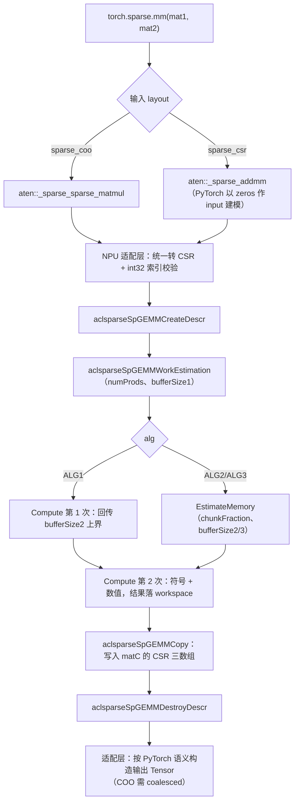

# aclsparseSpGemm 算子设计文档（A5 / Ascend 950PR）

| 版本 | 日期 | 修改人 | 修改内容 |
|------|------|--------|----------|
| v1.0 | 2026.8.17 | sss-hust | 初稿 |

---

# 一、需求背景（required）

## 1.1 需求来源

CANN 社区任务「aclsparseSpGemm 算子开发(950)」A5 任务。在 Ascend 950PR 上打通两个稀疏矩阵相乘
的完整链路：Python 公开入口 `torch.sparse.mm(mat1, mat2)` → ATen NPU 适配 →
`aclsparseSpGEMM*` 多阶段 C++ 接口 → Ascend C Kernel，并在已声明的接口基线上补齐
`float16` / `bfloat16` / `float32` / `complex64` 四种类型的功能、异常处理与测试能力。
全部代码交付至 [`ops-sparse`](https://gitcode.com/cann/ops-sparse) 的 `master` 分支。

Python/ATen 语义以 PyTorch 2.7+ 为准，C++ 接口语义以 CUDA Toolkit 13.3 Update 1 所含
cuSPARSE 13.3 Update 1 为准。

## 1.2 背景介绍

SpGEMM（Sparse General Matrix-Matrix multiplication）计算

$$
C' = \alpha \cdot op(A) \cdot op(B) + \beta \cdot C, \qquad
A \in \mathbb{R}^{M \times K},\; B \in \mathbb{R}^{K \times N},\; C \in \mathbb{R}^{M \times N}
$$

按 cuSPARSE 规格，$C$ 与 $C'$ 具有**相同的稀疏结构**。它是图计算、代数多重网格、稀疏神经网络
的基础算子，也是 PyTorch 稀疏张量乘法的后端。

SpGEMM 与库内已有的 SpMM（稀疏 × 稠密）有一个本质差别：**输出的稀疏结构在计算前未知**。
$nnz(C)$ 既不等于 $nnz(A)$ 也不等于 $nnz(B)$，而是由乘法的列命中情况决定，因此必须先做一趟
**符号阶段**确定结构，再做**数值阶段**填值。这一"结构未知"正是 cuSPARSE 为 SpGEMM 设计
多阶段接口（workEstimation / estimateMemory / compute / copy）而非普通三段式的原因：

- 中间乘积数量 $numProds = \sum_i \sum_{k \in A_i} nnz(B_k)$ 只能在遍历后得到；
- 真实 $nnz(C) \le numProds$（同列归并会减少），两者可能相差数倍；
- 因此 workspace 无法在调用前静态确定，需要由接口分阶段回传。

按行展开（Gustavson 形式）：

$$
C_{i,:} = \alpha \sum_{k \,:\, A_{i,k} \neq 0} A_{i,k} \cdot B_{k,:}
$$

即 C 的第 $i$ 行是 B 中若干行的线性组合，参与组合的行由 A 第 $i$ 行的列索引选出。

## 1.3 现状分析

调研 `ops-sparse` master（88 次提交，27 个算子）的结论：

| 维度 | 现状 | 对本任务的影响 |
|---|---|---|
| API 体系 | 对齐 cuSPARSE，分 Generic（描述符 + 多阶段）与 Legacy（精度前缀 + MatDescr）两套 | SpGEMM 属 Generic，命名 `aclsparseSpGEMM*` |
| SpGEMM | 仓内尚无实现，公开头文件中无 `aclsparseSpGEMM*` 声明 | 本设计按任务书给出的接口基线自包含交付，不另立同名或同功能接口 |
| 同形参考 | `csrgeam2`（$C = \alpha A + \beta B$，CSR 进 CSR 出，需先定 $nnz(C)$） | Host 分层、符号/数值两阶段拆分、测试骨架均可直接对齐 |
| Python / ATen | 仓内无任何 `.py`、无 torch/ATen 集成，是纯 C 接口库 | 需在仓内新建 torch 扩展子工程，见 3.3 |
| complex64 | 描述符层认识 `ACL_COMPLEX64`（`sparse/common/aclsparse_descr.cpp`），但无算子实际计算过复数；`sparse2dense` 明确列为不支持 | 复数乘加、归并与向量化方案需自行设计，见 3.6 |
| 多架构 | `arch35` = 950（dav-3510），`arch22` = 910B，`arch20` = 310P，由 `--soc` 选择编译 | 本任务落 `arch35`；A2/A3 落 `arch22`，公共逻辑需解耦 |

7 月 SpGEMM 社区任务（`cann-ops-competitions` 的 `tasklist/07-9-SpGEMM`）已合入两个队伍的设计
文档，代码尚未进入 `ops-sparse`。按任务书 §8 与 PR 要求，A2/A3 与 A5 的 PR 可能先后合入，
后合入者需基于已合入版本更新代码。因此本设计的组织原则是：**接口签名严格照任务书基线，
实现按"架构无关公共层 + arch 专属层"分层**，使任何一方先合入都不产生接口冲突，只需在
公共层做合并（见 3.10）。

---

# 二、需求分析（required）

## 2.1 需求描述

在 Ascend 950PR 上实现 SpGEMM 全链路：

- **Python 层**：`torch.sparse.mm(mat1, mat2)` 在 NPU 上可用，参数、返回值、dtype、shape、
  device、稀疏 layout 与异常行为与目标 PyTorch 版本一致；
- **ATen 层**：NPU 注册、稀疏 Tensor 与描述符转换、`nnz(C)` 处理、输出 Sparse Tensor 构造，
  核心计算不得回退 CPU；
- **C++ 层**：按任务书基线实现 `aclsparseSpGEMM*` 七个接口的多阶段流程；
- **Kernel 层**：Ascend C 实现符号与数值两阶段，覆盖四种 dtype；
- **性能**：fp16/bf16/fp32 ≥ 1.0× A100，complex64 ≥ 0.8× A100；
- **精度**：混合容差单标杆（CPU Golden），结构精确一致。

## 2.2 需求拆解

1. **接口基线对齐**：`CreateDescr` / `WorkEstimation` / `GetNumProducts` / `EstimateMemory` /
   `Compute` / `Copy` / `DestroyDescr`，签名与任务书代码块逐字一致。
2. **算法枚举**：`ALG_DEFAULT`(=ALG1) / ALG2 / ALG3，三者均须 bit-wise 确定。
3. **数据类型**：`ACL_FLOAT16` / `ACL_BF16` / `ACL_FLOAT` / `ACL_COMPLEX64`，A/B/C/computeType 同类型。
4. **索引**：`ACL_SPARSE_INDEX_32I`，A/B/C 三者一致；输入列索引有序；输出列索引有序。
5. **操作类型**：仅 `ACL_SPARSE_OP_NON_TRANSPOSE`，其余返回明确错误。
6. **输出规范**：`rowOffsets` 单调非降、行内 `colIndices` 严格升序、无重复坐标、
   计算产生的显式零保留并计入 $nnz(C)$。
7. **Python/ATen 适配**：layout 转换、输出构造、COO 返回须 coalesced。
8. **泛化能力**：不同 shape / nnz / 稀疏度 / 空行空列 / 中间乘积膨胀 / 长尾行分布。
9. **异常与资源**：workspace 精确与不足两类用例、维度/dtype/索引不匹配、无内存与资源泄漏。
10. **解耦**：与 A2/A3 共存于同一主干。

## 2.3 输入输出规格

**Python / ATen 层**

| 名称 | 角色 | dtype | shape | 说明 |
|---|---|---|---|---|
| `mat1` / `self` | 输入 | fp16 / bf16 / fp32 / complex64 | `[M,K]` | 目标 PyTorch 版本支持的稀疏 layout，由 Python 层转 CSR |
| `mat2` / `other` | 输入 | 同上 | `[K,N]` | 同上 |
| 返回 | 输出 | 同上 | `[M,N]` | 按 PyTorch 语义构造 layout；返回 COO 时须 coalesced |

**aclsparse C++ 层**（CSR，`int32` 索引）

| 数组 | 长度 | dtype |
|---|---|---|
| `csrRowOffsets` | rows + 1 | int32 |
| `csrColInd` | nnz | int32 |
| `csrValues` | nnz | fp16 / bf16 / fp32 / complex64 |

约束：`A.size(1) == B.size(0)`；A、B、C 均为二维；不做矩阵维度广播。

## 2.4 与 cuSPARSE 13.3 规格的对齐

从 cuSPARSE 13.3 SpGEMM 章节摘出的规格要点，以及本实现的对应处理：

| cuSPARSE 13.3 规格 | 本实现 |
|---|---|
| $C' = \alpha\,op(A)\,op(B) + \beta C$，且 $C$ 与 $C'$ 稀疏结构相同 | 一致。$C$ 为新建输出（$nnz=0$）时 $\beta C$ 不贡献任何条目，与任务书性能口径 $\alpha=1,\beta=0$ 自然吻合 |
| 仅支持 CSR | 一致 |
| `opA` / `opB` 仅支持 NON_TRANSPOSE | 一致，其余返回 `ACL_SPARSE_STATUS_NOT_SUPPORTED` |
| 同精度类型含 `CUDA_R_16F`[DEPRECATED]、`CUDA_R_16BF`[DEPRECATED]、`CUDA_R_32F`、`CUDA_C_32F` | 四者全部支持。fp16/bf16 虽在 cuSPARSE 侧标记 deprecated，本任务仍须对齐；`complex64` 对应 `CUDA_C_32F`，是 cuSPARSE 的一等支持类型，非扩展项 |
| ALG1：`compute` 调用两次，第一次给出内存上界（通常数倍于实际用量），第二次由用户给定 `bufferSize2`，不足则返回 INSUFFICIENT_RESOURCES | 一致，见 3.4 |
| ALG2：经 `estimateMemory` 获得所需内存，用量低于 ALG1，性能低于 ALG1 | 一致 |
| ALG3：按 `chunkFraction` 分块计算中间乘积，用量最省 | 一致 |
| 三种算法均提供逐次运行 bit-wise 确定的结果 | 一致，确定性方案见 3.8 |
| 允许 A/B 列索引无序，保证 C 列索引有序 | 本算子按任务书**收紧**为要求输入有序（非法索引返回确定错误），输出保证有序。收紧后可省去输入预排序，是合法的规格子集 |
| `getNumProducts` 回传 host 侧 64 位中间乘积数量 | 一致，`int64_t *numProds` |

---

# 三、详细设计（required）

## 3.1 算子分析

### 3.1.1 两阶段本质

按行的 Gustavson 形式，第 $i$ 行的处理分两步：

```text
符号：cols(C_i) = ⋃_{k ∈ A_i} cols(B_k)            → 确定 nnz(C_i)、rowOffsets
数值：C_i[j]    = α · Σ_{k ∈ A_i, B_{k,j} ≠ 0} A_{i,k} · B_{k,j}
```

**显式零必须保留**：结构由列命中情况决定，与数值无关。若 $\sum$ 恰好抵消为 0，该坐标仍是结构
非零，计入 $nnz(C)$。这一点已在 CPU 参考实现上实测确认：`1×1 + 1×(-1)` 得到 $nnz=1$、值 `0.0`，
与自测包 `function_sparse_ops.py` 中 `value_mode==4` 的断言一致。因此数值阶段**不得做剪零**。

### 3.1.2 中间乘积与规模

$numProds = \sum_{k \in A_i, \forall i} nnz(B_k)$，是符号阶段的上界工作量。任务书性能用例采用
确定性生成规则：$n \times n$ 矩阵每行 $d$ 个非零，A 第 $i$ 行列索引为 $(i+a) \bmod n$，
B 第 $i$ 行为 $(i + b d) \bmod n$，$a,b \in [0,d-1]$。当 $d^2 < n$ 时每行输出恰好 $d^2$ 个非零，
故 $nnz(A)=nnz(B)=nd$、$nnz(C)=nd^2$。三条标杆用例均严格满足该式：

| 编号 | $n$ | $nnz(A)$ | $d$ | $nnz(C) = n d^2$ |
|---|---|---|---|---|
| P-01 | 19,717 | 78,868 | 4 | 19,717 × 16 = 315,472 ✓ |
| P-02 | 169,343 | 1,185,401 | 7 | 169,343 × 49 = 8,297,807 ✓ |
| P-03 | 1,048,576 | 8,388,608 | 8 | 1,048,576 × 64 = 67,108,864 ✓ |

一个重要推论：**在这套生成规则下 $nnz(C) = numProds$，不发生任何归并**。因此标杆用例的耗时
完全由"gather B 行 → 排序 → 写回"的搬移与整理决定，而不是由累加器冲突决定。这直接影响优化
重点（见 3.9）。

自测包的 50 条泛化性能用例采用同一规则的小规模取值（$M,K,N \in [1000, 20000]$，
$d_a, d_b \in [2,6]$），构成第二层性能验收。

### 3.1.3 两种性能形态

从自测包提供的 A100 NCU 基线可以读出两种截然不同的形态：

| 形态 | 代表 | GPU 基线 | 特征 |
|---|---|---|---|
| 小规模 | 50 条泛化用例，如 case-000（$2782\times5842\times18046$，$d_a{=}2,d_b{=}3$，$numProds{=}16{,}692$） | 224–404 μs，**每次调用 30 个 kernel** | 输出仅万级，单 kernel 均摊约 8 μs，**固定开销主导** |
| 大规模 | P-03（$numProds{=}67$M） | 6,858 μs (fp32) | 总搬移约 1.1 GB，折算约 156 GB/s，**远未触及 A100 HBM 峰值**，结构整理主导 |

结论：小规模用例要靠**压低 kernel 启动次数与固定开销**赢，大规模用例要靠**带宽效率**赢。
两者对设计的要求不同，需在同一实现里用 tiling 策略区分（见 3.5.4、3.9）。

## 3.2 分层架构与调用链



## 3.3 Python / ATen 层设计

### 3.3.1 两个派发入口（实测结论）

在 PyTorch 2.8 上用 `TorchDispatchMode` 实测 `torch.sparse.mm` 的派发路径，得到：

| 输入 layout | 实际派发的 ATen 算子 | 返回 |
|---|---|---|
| 两个 `sparse_coo` | `aten::_sparse_sparse_matmul` | `sparse_coo`，且已 coalesced |
| 两个 `sparse_csr` | `aten::zeros` + `aten::_sparse_addmm` | — |

即 PyTorch 自己把 CSR × CSR 建模为"以全零稠密张量作 `input` 的 addmm"。这有两个后果：

1. 任务书指定的 ATen Schema `aten::_sparse_sparse_matmul` 是 COO 语义入口，**必须注册**；
2. 自测包用 `torch.sparse_csr_tensor` 构造输入并调用 `torch.sparse.mm`，走的是 addmm 入口，
   因此**该入口也必须在 NPU 上命中我们的实现**，否则自测包跑不起来。

设计：两个入口都注册，各自完成 layout 归一后汇入同一份内部 CSR 实现。$\beta \cdot C$ 中的
$C$ 为全零张量时不贡献条目，与 3.1.1 的结构语义一致。

上表为 CPU 侧观测。已在 Ascend 950PR 实机（CANN 9.1.0 + torch 2.12.0 + torch_npu 2.12.0）
复跑同一探测脚本，fp32 与 complex64 行为一致，确认了要补的两处符号与后端 key：

| 入口 | 派发链 | NPU 现状 |
|---|---|---|
| `torch.sparse.mm(coo, coo)` | `aten::_sparse_sparse_matmul` | `RuntimeError: CAUTION: The operator 'aten::_sparse_sparse_matmul' is not currently supported on the NPU backend.` |
| `torch.sparse.mm(csr, csr)` | `aten::zeros` → `aten::_sparse_addmm` | `NotImplementedError: Could not run 'aten::addmm.out' with arguments from the 'SparseCsrnpu' backend` |

即：COO 入口需注册 `aten::_sparse_sparse_matmul`（torch_npu 目前是显式"不支持"兜底）；
CSR 入口实际缺的符号是 **`aten::addmm.out`**，后端 key 实名为 **`SparseCsrnpu`**——
可直接注册它，或在更上层拦截 `_sparse_addmm` / `_sparse_csr_mm`，避免继续分解到 `addmm.out`。
探测脚本随测试代码一并交付。

### 3.3.2 适配层职责

- **layout 归一**：COO 入口先 `coalesce()` 再转 CSR（行排序 + 行内列升序）；CSR 入口直接取
  `crow_indices` / `col_indices` / `values`，校验索引 dtype 为 int32。
- **描述符转换**：用 `aclsparseCreateConstCsr` 建 A、B 的只读描述符，`aclsparseCreateCsr` 建 C；
  handle 绑定当前 NPU stream，全程异步，不插入多余 Host 同步。
- **两趟输出分配**：$nnz(C)$ 在 `Compute` 后才已知，因此按"先建 `rowOffsets` 空壳 → 取
  $nnz(C)$ → 分配 `colIndices`/`values` → `aclsparseCsrSetPointers` → `Copy`"的顺序，
  与 cuSPARSE 官方样例的输出组装流程一致。
- **输出构造**：`_sparse_sparse_matmul` 入口按 PyTorch 语义返回 COO，由 CSR 展开行索引后
  构造并标记为 coalesced（我们的输出本身已满足行升序 + 行内列严格升序，即 COO 的 coalesced
  不变量，无需再排序）；CSR 入口直接返回 CSR。
- **dtype 提升**：按 PyTorch 类型提升规则确定输出 dtype，与 C++ 层 `computeType` 保持一致。

### 3.3.3 在 ops-sparse 中的落地形态

仓内目前没有 Python/torch 基础设施，因此新增一个与 `sparse/` 平级的 torch 扩展子工程，
默认不参与主库构建，由独立 CMake 选项开启，避免给纯 C++ 使用者引入 torch 依赖：

```text
torch_adapter/
├── CMakeLists.txt              # 由 -DBUILD_TORCH_ADAPTER=ON 开启
├── csrc/
│   ├── spgemm_aten.cpp         # TORCH_LIBRARY_IMPL 注册 NPU 实现
│   └── sparse_descr_bridge.{h,cpp}  # torch Tensor ↔ aclsparse 描述符
├── ops_sparse_torch/
│   └── __init__.py             # 导入即完成注册
└── README.md                   # 环境、编译、调用说明
```

注册方式采用 `TORCH_LIBRARY_IMPL(aten, Key, m)` 覆盖对应算子，不修改 PyTorch 源码，
也不引入 CPU fallback。torch_npu 走 `PrivateUse1` 后端，因此稀疏路径预期落在
`SparsePrivateUse1`（COO）与 `SparseCsrPrivateUse1`（CSR）两个 key 上，具体以 3.3.1 的探测脚本
在实际 torch_npu 构建上的结果为准。

## 3.4 aclsparse C++ 多阶段接口设计

接口签名严格照任务书基线，不重复列出。各阶段职责与状态机：

| 阶段 | 职责 | 关键产出 |
|---|---|---|
| `CreateDescr` | 分配 `aclsparseSpGEMMDescr`（`std::nothrow`），初始化阶段状态机为 `CREATED` | descr |
| `WorkEstimation` | 校验全部入参；统计每行中间乘积数 → 前缀和 → `numProds`；规划分核；回传 `bufferSize1`（`externalBuffer1 == nullptr` 时仅询问大小） | `numProds`、行前缀和（落 buffer1）、负载划分 |
| `GetNumProducts` | 从 descr 读回 `numProds`（host 侧，不触发 device 操作） | `int64_t` |
| `EstimateMemory` | 仅 ALG2/ALG3：按 `chunkFraction` 规划分块，回传 `bufferSize2`/`bufferSize3` | 分块方案 |
| `Compute` | ALG1 第一次（`externalBuffer2 == nullptr`）回传内存上界；第二次执行符号 + 数值，结果留在 buffer2 | `nnz(C)`、`rowOffsets(C)`、临时 `colInd`/`values` |
| `Copy` | 将 workspace 中的结果按规范化 CSR 写入 `matC` 指针 | matC 三数组 |
| `DestroyDescr` | 释放 descr，`nullptr` 入参直接返回 SUCCESS | — |

**状态机**：`CREATED → WORK_ESTIMATED → [MEMORY_ESTIMATED] → COMPUTED → COPIED`。
阶段跳跃或重复调用返回 `ACL_SPARSE_STATUS_INVALID_VALUE`；descr 复用前须回到 `CREATED`。

**workspace 生命周期**：buffer1 在 `WorkEstimation` 与 `Compute` 期间必须保持有效且内容不被
修改（承载行前缀和与分核方案）；buffer2 在 `Compute` 与 `Copy` 期间有效（承载中间结果）；
buffer3 仅 ALG2/ALG3 的 `EstimateMemory` 使用。以上在接口文档中逐条写明。

**错误码映射**（对齐仓内 `repo-knowledge` 的状态码规范）：

| 场景 | 状态码 |
|---|---|
| handle 为 nullptr | `HANDLE_IS_NULLPTR` |
| 描述符/指针 nullptr、维度不匹配、阶段顺序错误、索引非法 | `INVALID_VALUE` |
| dtype / 格式 / 算法 / 转置操作不支持 | `NOT_SUPPORTED` |
| 芯片不支持（非 950PR） | `ARCH_MISMATCH` |
| `bufferSize2` 不足（ALG1 第二次 compute） | `INSUFFICIENT_RESOURCES` |
| device 内存分配失败 | `ALLOC_FAILED` |
| Kernel 执行失败 | `EXECUTION_FAILED` |

**规模与溢出边界**：索引为 int32，故 $M, K, N \le 2^{31}-1$，$nnz(A), nnz(B), nnz(C) \le 2^{31}-1$；
$numProds$ 为 int64，但若 $nnz(C)$ 超出 int32 上限返回 `INVALID_VALUE`。以上写入接口文档。

## 3.5 Kernel 设计

### 3.5.1 为什么不是"稠密累加器"

经典实现给每个工作行开一个长度 $N$ 的稠密累加器。$N$ 可达 $10^6$，单行累加器即 4 MB，
远超 UB 容量，且清零成本与 $N$ 成正比而与该行实际非零数无关。本设计不采用。

### 3.5.2 主路径：行内排序归并（短行）

利用"每行中间乘积数通常远小于 $N$"这一事实（标杆用例 $d^2 \le 64$，泛化用例 $d_a d_b \le 36$）：

```text
对分到本核的每一行 i：
  1. gather：按 A_i 的列索引 k，把 B_k 的 (colInd, values) 段批量 DataCopy 进 UB
             同时把该段乘上标量 A_{i,k}（向量化 Muls）
  2. sort  ：对 UB 内的 (col, k) 键做双调排序（Bitonic），values 随键搬移
  3. merge ：相邻元素比较 col 是否相等（向量化 Compare）→ 段内求和 → 前缀和压缩
  4. store ：压缩后的 (colInd, values) 批量 DataCopy 回 GM
```

四步全部是**批量搬移 + 向量指令**，没有 `SetValue`/`GetValue`，也没有逐元素 `DataCopy`，
满足编码规则 R1。双调排序的比较-交换网络本身就是向量化友好的：每一级都是固定步长的
向量比较与选择，无数据相关分支。

排序键取 `(col, k)` 而非仅 `col`，使排序**稳定**：同一列的多个贡献恒按 $k$ 升序相邻，
这是 3.8 确定性的基础。

### 3.5.3 长尾路径：分块归并（长行）

当某行的中间乘积数超过 UB 一次可容纳的容量时（任务书要求覆盖"中间乘积膨胀"与
"长尾行分布"），改为：

```text
  1. 把该行的中间乘积切成若干块，每块在 UB 内排序 + 段内归并后落 GM（有序块）
  2. 对这些有序块做多路归并（每轮两两归并，仍是批量搬移 + 向量比较）
  3. 归并过程中对相等 col 求和
```

多路归并保持"按块顺序、块内按 $k$ 升序"的全序，因此不破坏确定性。

### 3.5.4 分核与负载均衡

每行工作量差异极大，按行数均分会严重倾斜。方案：

- `WorkEstimation` 阶段算出每行中间乘积数的**前缀和**，存入 buffer1；
- 分核按**中间乘积数**而非行数均分：第 $c$ 个核负责前缀和落在
  $[c \cdot numProds / P,\; (c{+}1) \cdot numProds / P)$ 的行区间，边界由 kernel 侧对前缀和
  数组做二分查找得到；
- 单行工作量超过一个核的份额时，该行按 3.5.3 分块，块间可跨核。

这同时满足编码规则 R4：TilingData 里**不放任何按核长度的数组**，只放
`numRows` / `numProdsTotal` / `coreNum` / `chunkCapacity` 等标量，偏移由 kernel 自己算；
真正的分核信息（前缀和）在 workspace 里。

核数按 R2 动态获取（`aclrtGetDeviceInfo(ACL_DEV_ATTR_VECTOR_CORE_NUM)`），不硬编码。

### 3.5.5 降低 kernel 启动次数

3.1.3 指出 50 条泛化用例的 A100 基线是固定开销主导（30 个 kernel、均摊 8 μs）。对应设计：

- 符号阶段与数值阶段的**同一趟 gather 结果直接复用**：短行路径下排序归并后既得到
  $nnz(C_i)$ 也得到 values，无需为符号阶段单独跑一趟，把两趟合成一个 kernel；
- 前缀和（行计数 → rowOffsets）与结果压缩合并进同一 kernel 的尾部；
- 小规模场景（$numProds$ 低于阈值）走"单 kernel 完成全部行"的快速路径，目标是把一次
  `torch.sparse.mm` 的 device kernel 数压到个位数。

阈值与实际启动次数在 950PR 上实测标定。

### 3.5.6 文件组织

```text
sparse/spgemm/
├── README.md                        # 接口规格文档
├── common/                          # 架构无关：校验、状态机、分核规划、dtype 分发
│   ├── spgemm_validate.{h,cpp}
│   └── spgemm_descr.{h,cpp}
└── arch35/
    ├── spgemm_host.cpp              # 七个公开接口 + Launch
    ├── spgemm.h
    ├── spgemm_kernel.h              # kernel_do 签名，指针用 GM_ADDR
    ├── spgemm_kernel.cpp            # extern "C" __global__ 入口 + TPipe 局部创建
    ├── spgemm_tiling_data.h         # 仅标量，无数组
    └── kernels/
        ├── spgemm_symbolic.h        # 行计数与前缀和
        ├── spgemm_sort_merge.h      # 双调排序 + 段归并
        └── spgemm_complex.h         # complex64 去交织/乘加/交织
```

Host 侧按 `csrgeam2` 的方式拆分：每个公开接口对应一个 `ValidateXxxParams` + 一个
`LaunchXxxKernel`，公共校验抽 `ValidateCommonSpGEMMArgs`，空矩阵单独走 `FillEmptyRowOffsetsC`，
使每个函数满足 OAT 的单函数有效代码行 ≤ 50、圈复杂度 ≤ 20、嵌套深度 ≤ 5。

## 3.6 complex64 设计

complex64 是仓内第一个真正参与计算的复数类型，需要自建方案。

**存储布局**：PyTorch 的 `complex64` values 在内存中是实虚**交织**的 `(re, im, re, im, ...)`，
`aclsparse` 侧 `ACL_COMPLEX64` 同构。

**计算布局**：交织布局无法直接向量化（相邻元素语义不同）。设计为"**去交织 → 双平面计算 →
交织写回**"：

```text
DataCopyPad（stride=2）把 values 拆成 UB 内的 re[]、im[] 两个 fp32 平面
复数乘 (ar + i·ai)(br + i·bi)：
    cr = ar·br − ai·bi      # 2 次向量乘 + 1 次向量减
    ci = ar·bi + ai·br      # 2 次向量乘 + 1 次向量加
累加同样在 re/im 两个平面上做向量加
写回时按 stride=2 交织回 GM
```

即一次复数乘 = 4 次向量乘 + 2 次向量加减，全部为向量指令，满足 R1。排序阶段的键仍只是
`(col, k)` 整数，values 作为 8 字节载荷随键搬移，因此排序归并逻辑与实数路径**完全共用**，
只有"载荷宽度"和"乘加实现"两处按 dtype 特化（C++ 模板 + `if constexpr`）。

**共轭语义**：`opA`/`opB` 仅支持 NON_TRANSPOSE，故 `CONJUGATE_TRANSPOSE` 一律返回
`NOT_SUPPORTED`，不引入隐式共轭；这与 cuSPARSE 的 SpGEMM 限制一致。

**精度**：complex64 累加在两个 fp32 平面上进行，CPU Golden 用 complex128；实部与虚部分别按
fp32 的混合容差参数比对。

## 3.7 dtype 与精度策略

| dtype | Kernel 内累加 | CPU Golden | 混合容差参数 |
|---|---|---|---|
| `float16` | fp32 | fp32 | rtol = atol = $2^{-9}$，A = 1e-1 |
| `bfloat16` | fp32 | fp32 | rtol = atol = $2^{-6}$，A = 1e0 |
| `float32` | fp32 | fp64 | rtol = $2^{-10}$，atol = $2^{-16}$，A = 1e-2 |
| `complex64` | fp32 × 2 平面 | complex128 | 实部/虚部各按 fp32 参数 |

fp16/bf16 在 gather 阶段升为 fp32、写回阶段降回原类型，避免多次累加的精度损失。
fp32 路径以 $d^2 \le 64$ 项累加为例，相对误差约 $\sqrt{64}\cdot\epsilon_{fp32} \approx 10^{-6}$，
远优于 rtol $=2^{-10}\approx 10^{-3}$，有充足余量。

INF/NAN：不做特殊分支，按 IEEE 语义自然传播，结构仍由列命中决定（NAN 不影响结构），
按精度标准文档的对应规则验收。

## 3.8 确定性设计

cuSPARSE 规格要求三种算法均 bit-wise 确定。浮点加法不满足结合律，因此确定性等价于
**固定归约顺序**。本设计的保证来自三处：

1. 排序键取 `(col, k)` 且排序稳定 → 同一输出坐标的各贡献恒按 $k$ 升序相邻；
2. 段内求和按该固定顺序做（顺序归约，不用树形归约的随机配对）；
3. 长尾路径的多路归并按固定的块顺序进行，不依赖到达时序。

因此同一输入在任意核数、任意分核方案下都得到逐位相同的结果——这比"同进程内可复现"更强，
可直接支撑"确定性算法重复执行按 bit-wise 规则验收"。

## 3.9 性能预算与优化项

| 用例 | A100 基线 | A5 目标 | 上限耗时 |
|---|---|---|---|
| P-01 fp32 | 289.088 μs | ≥ 1.0× | ≤ 289.088 μs |
| P-02 fp16 / bf16 / fp32 | 1127.296 / 1134.080 / 1121.376 μs | ≥ 1.0× | 同左 |
| P-03 fp16 / bf16 / fp32 | 6884.864 / 6876.512 / 6858.208 μs | ≥ 1.0× | 同左 |
| P-03 complex64 | 8059.968 μs | ≥ 0.8× | ≤ 10074.96 μs |
| 50 条泛化 | 224–404 μs（各 30 kernel） | 逐 case 比 | 同左 |

P-03 的搬移量估算：读 A 约 67 MB、gather B 约 537 MB、写 C 约 537 MB，合计约 1.14 GB。
A100 用 6858 μs 完成，折算约 156 GB/s，远低于其 HBM 峰值，说明 cuSPARSE 在此规模下也未跑满
带宽。若 A5 的实现能接近带宽瓶颈，达标空间充足。

优化项按预期收益排序：

1. **压低 kernel 启动次数**（决定 50 条泛化用例，见 3.5.5）
2. **gather 的搬移效率**：B 行段长度不一，用 `DataCopyPad` 批量搬移并对齐，避免碎片化访存
3. **符号与数值合一**：短行路径省掉独立的符号趟
4. **按中间乘积均分的负载均衡**（决定长尾行分布下的核间效率）
5. **排序规模自适应**：按行内元素数选择双调排序的级数，短行不做多余比较级
6. B 行段的 L2 复用：相邻输出行常选中重叠的 B 行，按行分块提升复用

## 3.10 与 A2/A3 的公共代码解耦

任务书要求 A2/A3（arch22）与 A5（arch35）能在同一主干共存，且后合入者负责处理冲突。
解耦原则：

| 层 | 归属 | 内容 |
|---|---|---|
| `sparse/spgemm/common/` | 架构无关，两边共用 | 入参校验、descr 与状态机、错误码映射、numProds 统计的接口定义、dtype 分发框架 |
| `sparse/spgemm/arch35/`、`arch22/` | 各架构私有 | tiling 参数、kernel 实现、核数与 UB 容量相关的常量 |

公共层只暴露纯函数与 POD 结构，不含任何架构常量；架构层通过"能力描述结构体"（UB 容量、
向量宽度、核数获取方式）向公共层注入差异。这样两个任务的 PR 只会在 `common/` 的
新增函数处产生可机械合并的冲突，不会在算法主体上冲突。

## 3.11 支持硬件

| 芯片版本 | 支持 |
|---|---|
| Ascend 950PR（`dav-3510` / arch35） | √ |
| 910B / 910_93（`dav-2201` / arch22） | 由 A2/A3 任务交付 |

环境：CANN 算子开源仓指定版本（≥ 9.0.0），PyTorch ≥ 2.7，torch_npu ≥ 26.0.0。
构建：`bash build.sh --ops=spgemm --run --soc=ascend950`，torch 适配层由
`-DBUILD_TORCH_ADAPTER=ON` 开启。

## 3.12 算子约束限制

1. A、B、C 均为二维 CSR，`A.size(1) == B.size(0)`，不做维度广播；
2. 索引仅 `ACL_SPARSE_INDEX_32I`，A/B/C 三者必须相同；输入列索引必须有序，输出保证有序；
3. `opA`/`opB` 仅 NON_TRANSPOSE；
4. A/B/C/`computeType` 同一类型，取 fp16 / bf16 / fp32 / complex64；
5. $C$ 与 $C'$ 稀疏结构相同（cuSPARSE 语义）；新建输出时 $\beta C$ 不贡献条目；
6. 显式零保留并计入 $nnz(C)$，C++ 层输出不含重复坐标；
7. $nnz(C)$ 超 int32 上限返回错误；
8. 稀疏 values 与元数据的非连续 Tensor 支持范围按规格验收，未支持场景返回明确错误；
9. Host 侧不做无必要同步，全程使用调用方 stream；
10. 不要求图融合。

---

# 四、可维可测分析

## 4.1 精度标准 / 性能标准

| 验收标准 | 描述 |
|---|---|
| 精度 | 满足《生态算子开源精度标准》，混合容差单标杆（CPU Golden）。结构（`rowOffsets`、`colIndices`、$nnz(C)$、排序规则）**精确一致**；values 逐元素按 $\lvert actual-golden\rvert \le atol + rtol\lvert golden\rvert$ 判定，整体匹配率 ≥ 0.99，且每元素绝对误差 ≤ $\max(A, 32\,\mathrm{ULP}(golden))$。complex64 实部虚部分别判定 |
| 性能 | fp16/bf16/fp32 ≥ 1.0× A100，complex64 ≥ 0.8× A100；以一次公开接口调用内全部 device kernel 耗时之和为主口径，Event 耗时与 Python 端到端耗时作补充 |
| 确定性 | 同输入重复执行，结构与 values 均 bit-wise 一致 |

不得仅将结果 dense 化后比较——这会掩盖结构错误（例如漏掉的显式零、重复坐标、
未排序的列索引在 dense 化后都可能"看起来正确"）。

## 4.2 测试方案

**精度**：直接使用任务自带的 ATK 用例包（200 条：fp32 100 + complex64 100），

```bash
atk task -c sparse_spgemm_accuracy.json -n nodes_accuracy.yaml --task accuracy -p .
```

在此之上自行补齐 fp16 / bf16 用例（自带包未覆盖这两种类型，而任务书要求四种全链路打通），
按同一生成规则与判定口径组织，随测试代码交付。

**核心场景覆盖**：

| 类别 | 用例 | 判定 |
|---|---|---|
| 基础功能 | CSR 方阵 / 长矩阵 / 宽矩阵 × 四种 dtype | 结构精确 + values 混合容差 |
| 稀疏边界 | $nnz=0$、$nnz=1$、空行、空列、无交集乘积（$nnz(C)=0$）、多项归并 | 结构精确 |
| 显式零 | $1\times1 + 1\times(-1)$ | $nnz(C)=1$ 且值为 0（自带包 `value_mode==4` 已断言） |
| 数值场景 | 普通值、小值、正负混合、抵消、离群值、INF/NAN | 按精度标准 |
| 多阶段流程 | Create → WorkEstimation → [EstimateMemory] → Compute → Copy → Destroy 主路径，三种算法各一轮 | 返回码与阶段状态 |
| Workspace | 一个精确 workspace、一个 workspace 不足 | 后者须返回 `INSUFFICIENT_RESOURCES` |
| 异常 | 维度不匹配、dtype 不匹配、索引类型不一致、转置操作、阶段乱序、nullptr | 返回确定错误码 |
| 资源 | 连续 Create/Compute/Destroy 循环 | 无内存与资源泄漏 |
| ATen | NPU 注册命中、无 CPU fallback | Profiler 证据 |
| 确定性 | 同输入两次执行 | 结构与 values bit-wise 相等 |

**C++ UT** 按 `csrgeam2` 的骨架组织：`test/spgemm/spgemm_param.h` + `spgemm_golden.h`（CPU 参考，
含符号阶段与归并）+ `arch35/{spgemm_test.cpp, spgemm_npu_wrapper.h, spgemm_test.csv}`，
CSV 携带容差列与 `expect_result` 期望返回码。

**性能**：两层都跑。

```bash
python profile_sparse_ops_npu.py --case-file sparse_spgemm_performance.json --device 0
python benchmark_sparse_ops_npu.py --case-file sparse_spgemm_performance.json --device 0
```

- 50 条泛化用例：与 `sparse_spgemm_gpu_ncu_baseline.csv` 按 case `id` 逐一比
  `GPU kernel_total_us / NPU kernel_total_us`；
- 三条标杆用例：按任务书 §性能要求 6 的确定性规则构造（$n$、$d$ 见 3.1.2 表），
  values 全 1、$\alpha=1$、$\beta=0$，采集同一调用范围内的 kernel 总耗时；
- 每 case 预热 ≥ 10 次、正式采样 30 次，报告中位数与 90 分位；描述符与 workspace 在采样期间
  复用；不计入首次编译、数据生成、H2D 搬运；
- 分别报告 work estimation / memory estimation / compute / copy / C++ 完整流程 / Python
  端到端耗时，以及峰值 workspace、$numProds$、$nnz(C)$、输出存储量。

**NPU Dispatch 证据**：用 `torch_npu.profiler` 抓取算子级 trace，证明 `_sparse_sparse_matmul`
与 CSR 入口均落在 NPU 上、无 CPU fallback，截图入自测报告。

## 4.3 兼容性分析

新增算子，`aclsparseSpGEMM*` 为新增符号，不影响已有 27 个算子；`sparse/spgemm/common/` 为
新增目录。torch 适配层默认关闭，纯 C++ 使用者不受影响。Python 层签名与 PyTorch 公开接口
一致，可直接替换 CPU/CUDA 路径。

---

# 五、风险点与规避方案

| 风险 | 等级 | 规避方案 |
|---|---|---|
| SpGEMM 基础实现与 A2/A3 或 7 月任务的 PR 先后合入产生冲突 | 高 | 3.10 的公共层/架构层解耦；接口签名逐字照任务书基线，不自造命名；合入前跑双架构回归 |
| R1（禁止逐元素操作）与 SpGEMM 的不规则性冲突 | 高 | 3.5.2 的排序归并方案把不规则性收敛为"批量 gather + 向量化排序/比较/压缩"；评审前用小规模 kernel 验证无 `SetValue`/`GetValue` |
| complex64 无仓内先例，向量化方案不成立 | 中 | 3.6 的去交织双平面方案先用 fp32 路径打通排序归并，再把 values 载荷宽度参数化；complex 仅特化"载荷宽度 + 乘加"两处 |
| 仓内首个 torch 扩展，构建与打包无先例 | 中 | 独立子工程 + 独立 CMake 选项，默认关闭，不影响主库；先用最小可用注册打通端到端再补完整性 |
| 50 条小规模用例被固定开销拖垮 | 中 | 3.5.5 的单 kernel 快速路径；先实测单次调用的 kernel 数与固定开销，再定阈值 |
| 长尾行导致核间负载严重倾斜 | 中 | 按中间乘积数而非行数均分（3.5.4）；超大行分块跨核 |
| OAT 单函数 50 行上限与多阶段校验逻辑冲突 | 低 | 照 `csrgeam2` 的 Validate/Launch 拆分方式组织 |
| int32 索引在超大规模下溢出 | 低 | Host 侧前置校验 $nnz(C)$ 上界，超限返回 `INVALID_VALUE`，并在接口文档写明规模边界 |

---

# 六、交付物与 PR 合入路径

1. **算子设计文档**：本文件，PR 至 `cann-ops-competitions` 的
   `04_tasks/01_community-task-2026/tasklist/08-15-aclsparseSpGemm-950/sss-hust/docs/design.md`
   （本任务为 950/A5；A2/A3 任务对应同级的 `08-14-aclsparseSpGemm-A2A3` 目录）；
2. **代码**：PR 至 `ops-sparse` 的 `master`，含
   - `sparse/spgemm/`（common + arch35 + README 接口规格文档）
   - `torch_adapter/`（ATen NPU 注册、描述符桥接、Python 包）
   - `include/cann_ops_sparse.h` 追加 `aclsparseSpGEMM*` 声明与 `aclsparseSpGEMMAlg_t` 枚举
   - `docs/zh/api_list.md` 追加接口条目
   - `test/spgemm/`（C++ UT）与端到端 UT
3. **自测用例及测试代码**：自带 ATK 包的执行说明 + 自补的 fp16/bf16 用例 + 性能采集脚本 +
   torch 派发探测脚本，配 README 说明环境、编译与复现步骤；
4. **自测报告**：用例参数、结构与精度结果、性能数据与倍率、峰值 workspace、$numProds$、
   $nnz(C)$、Profiler 证据截图、实际 CANN 版本、失败项说明；
5. **代码仓地址**：`ops-sparse` 个人 fork 链接、分支与目录，邀请 `Ascend-CANN` 为开发者。

按任务书要求，A2/A3 与 A5 的 PR 后合入者需基于已合入版本更新代码，完成双方回归后再申请合入。
