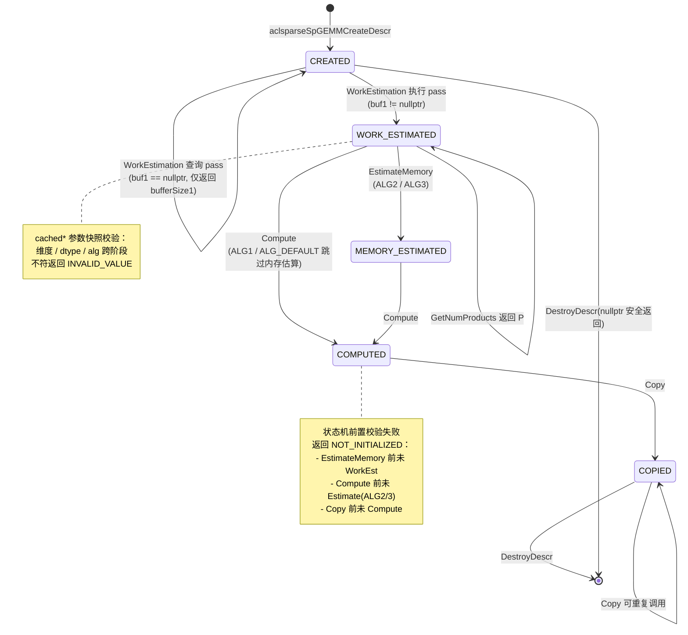
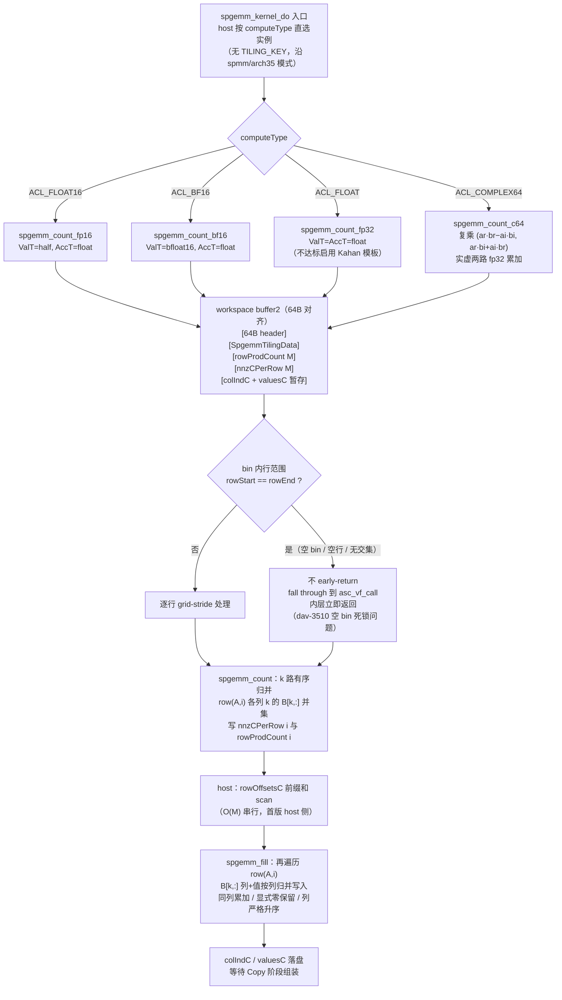
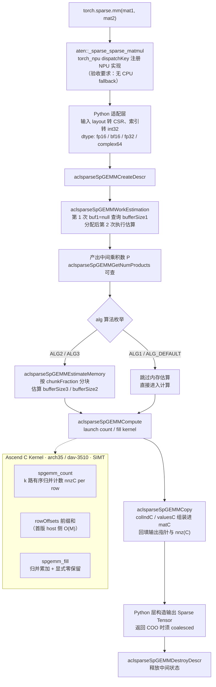

# aclsparseSpGemm 算子设计文档（Ascend 950PR A5 专项）

| 项目 | 内容 |
|------|------|
| 任务名称 | aclsparseSpGemm 算子开发（950） |
| 目标硬件 | Ascend 950PR（arch35 / dav-3510） |
| 交付仓库 | [cann/ops-sparse](https://gitcode.com/cann/ops-sparse) `master` |
| 设计提交路径 | `04_tasks/01_community-task-2026/tasklist/08-aclsparseSpGemm/zyl/docs/design.md` |
| 适配版本 | PyTorch ≥ 2.7，torch_npu ≥ 26.0.0，CANN 以 ops-sparse 指定版本为准 |
| 文档版本 | v1.0 |

# 需求背景

## 需求来源

本设计对应 2026 年 8 月社区任务《aclsparseSpGemm 算子开发(950)》。任务要求参考 PyTorch 2.7 及以上版本的 `torch.sparse.mm` 与 `aten::_sparse_sparse_matmul`，在 Ascend 950PR 上完成 Python/ATen 适配，并复用现有 SpGEMM 社区任务规划交付的 `aclsparseSpGEMM*` 多阶段 C++ 接口及 Ascend C Kernel，补齐 `float16`、`bfloat16`、`float32`、`complex64` 全链路能力、稀疏输出构造、测试与文档。

设计文档按官方模板提交至 [cann-ops-competitions](https://gitcode.com/cann/cann-ops-competitions)；实现代码统一进入 `ops-sparse`，沿用 `include/cann_ops_sparse.h` 中已规划的公开符号，不重复新增同名或同功能接口。

## 背景介绍

### 任务在调用链中的位置

PyTorch 用户侧入口是 `torch.sparse.mm(mat1, mat2)`，它映射到 ATen 内部算子 `aten::_sparse_sparse_matmul(Tensor self, Tensor other) -> Tensor`。在 CUDA 平台上该算子由 `SparseCUDATensorMath.cu` 实现（任务书参考资料 3）；在 NPU 平台上，需要 torch_npu 将该 schema dispatch 到本任务交付的实现上。整条链路为：

```
torch.sparse.mm                       # Python 公开入口
  └─ aten::_sparse_sparse_matmul      # ATen schema（行为以 PyTorch 2.7+ 为准）
      └─ torch_npu dispatch + 稀疏布局转换   # 本任务 Python/ATen 适配层
          └─ aclsparseSpGEMM* 多阶段 C++ 接口  # 本任务 C++ 层（对标 cuSPARSE 13.3.1）
              └─ Ascend C Kernel（arch35/dav-3510）  # 本任务 Kernel 层
```

任务的验收口径同时压在这四层上：Python 端到端行为须与目标 PyTorch 版本一致；C++ 端接口调用阶段、参数语义、描述符与 workspace 生命周期对标 cuSPARSE SpGEMM；Kernel 须在 NPU 上完成核心计算（禁止 CPU fallback，需提交 Dispatch 与 Profiler 证据）。

### SpGEMM 与本仓已有算子的差别

本仓 `sparse/` 目录已有 28 个算子，其中与本任务最相关的是：

- `sparse/spmm/`（SpMM，稀疏×**稠密**→稠密）：输出形状与 nnz 已知，host 一次 tiling、kernel 一遍完成。它贡献了本任务要直接沿用的工程基座——CSR 预处理（`SpmmCsrMat`）、LPT 贪心行装箱、workspace 布局与 activeBuffer 复用机制（详见 3.2）。
- `sparse/csrgeam2/`（稀疏+稀疏→稀疏）：本仓唯一"稀疏输入+稀疏输出"的算子，其输出 CSR 结构组装的写法可作参考。
- `sparse/spsv/`（三阶段 Generic API）：其描述符 `aclsparseSpSVDescr`（`sparse/common/aclsparse_spsv_descr.h`）是本仓现成的"多阶段分析描述符"范本。

SpGEMM 的本质难点在于：**C = A×B 的输出是稀疏的，其稀疏结构在计算前未知**。行 i 的输出非零个数取决于 `row(A,i)` 与 B 各行的列交集，既不能由 shape 推出，也不能由 nnz(A)、nnz(B) 推出；中间乘积项数 P = Σᵢ Σ_{k∈row(A,i)} nnz(B[k,:]) 可能远大于 nnz(C)（同一列多次贡献需归并）。这决定了 SpGEMM 无法像 SpMM 一样一遍完成，必须拆成多个阶段（结构估算 → 内存估算 → 结构+数值计算 → 结果组装），这也是 cuSPARSE 将其设计为带描述符的多阶段接口、任务书沿用该形态的原因。

# 需求分析

## 需求描述

实现稀疏矩阵乘 `C = A × B`：

- A：shape `[M,K]` 的 CSR 稀疏矩阵；B：shape `[K,N]` 的 CSR 稀疏矩阵；C：shape `[M,N]` 的 CSR 稀疏输出，其稀疏结构（`csrRowOffsets`、`csrColInd`、`nnz`、values）由乘法结果动态确定，不可由 shape 预先给出。
- 三个矩阵在 C++ 层均仅支持 CSR（`aclsparseCreateCsr` 创建），`csrRowOffsetsType` 与 `csrColIndType` 均固定为 `ACL_SPARSE_INDEX_32I` 且三者一致。
- 操作类型 `opA`、`opB` 均仅支持 `ACL_SPARSE_OP_NON_TRANSPOSE`。
- 数据类型：A、B、C 与 `computeType` 同型，支持 `float16`（`ACL_FLOAT16`）、`bfloat16`（`ACL_BF16`）、`float32`（`ACL_FLOAT`）、`complex64`（`ACL_COMPLEX64`，必选，非扩展项）。
- C++ 接口为对标 cuSPARSE 的多阶段接口，统一 `aclsparseSpGEMM*` 命名，签名以任务书"SpGEMM接口基线"代码块为唯一依据（本任务不改名、不改签名，如评审需调整须同步上游并写入公开头与接口文档）。
- 输出结构规范化：`rowOffsets` 单调非降、每行 `colIndices` 严格升序、无重复坐标、同坐标重复贡献累加合并；计算产生的**显式零值保留并计入 nnz(C)**。
- 在 NPU 上完成核心计算（禁止 CPU fallback），需提供 NPU Dispatch 与 Profiler 证据。
- 交付至 ops-sparse master 分支：Python/torch 层接口、ATen NPU 适配、输出构造、C++ 公开接口与 host 实现、Ascend C Kernel、C++ UT、端到端 UT 全部在同一仓内。
- A2/A3 任务与本任务同时分发且都可能改 SpGEMM host 公共代码，公共逻辑与硬件差异须解耦，保证三者可在同一主干共存。

## 需求拆解

按依赖顺序拆为 9 项（R1-R9），每项标注代码依据。

### R1 公开接口层（`include/cann_ops_sparse.h`）

新增三类公开符号（本仓现状为零，见背景）：

1. 不透明句柄类型：`aclsparseSpGEMMDescr_t`（参考现有 `aclsparseSpSMDescr_t` 的前向声明写法，L36-47）。
2. 算法枚举：`aclsparseSpGEMMAlg_t`（`ALG_DEFAULT`/`ALG1`/`ALG2`/`ALG3`，对标 cuSPARSE；仓内 `aclsparseSpMMAlg_t` L81-95 为同类枚举的写法参照）。
3. 7 个函数（签名逐字照任务书基线）：
   - 描述符：`aclsparseSpGEMMCreateDescr` / `aclsparseSpGEMMDestroyDescr`
   - 阶段1 工作估算：`aclsparseSpGEMMWorkEstimation(handle, opA, opB, alpha, matA, matB, beta, matC, computeType, alg, spgemmDescr, *bufferSize1, externalBuffer1)` + `aclsparseSpGEMMGetNumProducts(spgemmDescr, *numProds)`
   - 阶段2 内存估算：`aclsparseSpGEMMEstimateMemory(..., chunkFraction, *bufferSize3, externalBuffer3, *bufferSize2)`
   - 阶段3 计算：`aclsparseSpGEMMCompute(..., *bufferSize2, externalBuffer2)`
   - 阶段4 拷贝组装：`aclsparseSpGEMMCopy(...)`

`computeType` 与 A/B/C 的 `valueType` 一致（任务书 3.5）；错误码复用既有 10 值（L98-148），无需新增。

### R2 多阶段调用流程

固定顺序（任务书 3.4 + cuSPARSE 语义）：

```
CreateDescr(&d)
├─ WorkEstimation(..., &sz1, buf1)          // 估算中间乘积数 P，给出 buffer1 大小；落地后 GetNumProducts(d,&P) 可查
│   (申请 buf1 = sz1 字节，再次调用 WorkEstimation(..., buf1) 执行估算)
├─ EstimateMemory(..., chunkFraction, &sz3, buf3, &sz2)   // ALG2/ALG3：按 chunkFraction 分块估算 buffer3、buffer2
│   (申请 buf3 = sz3、buf2 = sz2)
├─ Compute(..., &sz2, buf2)                  // 结构 + 数值两遍：写 C 的结构并填 values，结果暂存 workspace
├─ Copy(...)                                 // 把 workspace 中的结果组装进 matC 的 csrRowOffsets/csrColInd/values
└─ DestroyDescr(d)                           // 释放中间状态
```

阶段间 workspace 生命周期、描述符状态机（未初始化→estimated→computed→copied）须在 host 侧校验，错序返回 `ACL_SPARSE_STATUS_NOT_INITIALIZED` 或 `INVALID_VALUE`。stream 沿用 `handle` 所绑流，不在本接口内做 Host 同步。

### R3 算法层：行级两遍法

输出结构未知是核心矛盾。采用"逐行 symbolic 计数 + scan + numeric 填充"两遍法，与单遍稠密输出的 SpMM 形成本质区别：

- **symbolic pass**：对 C 的每一行 i，遍历 `row(A,i)` 的每个列 k，取 B 的第 k 行 `row(B,k)`；C 行 i 的候选列集合是这些 B 行列索引的并集（B 行本身列有序，故可用 k 路有序归并去重计数）。该行输出非零数 `nnzC[i]` 即并集大小。同时对每个 (i,k) 记录中间乘积数，汇总为全局 P（WorkEstimation 产物，供 EstimateMemory 的 chunkFraction 分块）。
- **rowOffsets**：对 `nnzC[i]` 做前缀和 scan 得 `csrRowOffsetsC`（`rowOffsetsC[0]=0`，`rowOffsetsC[i+1]=rowOffsetsC[i]+nnzC[i]`）。
- **numeric pass**：在已知 `rowOffsetsC` 后，对每行 i 再次遍历 `row(A,i)`，把 B 各行对应列的贡献按列归并累加写入 `csrColIndC`/`valuesC`；同列重复贡献累加；保留显式零（任务书 3 输出结构约束 + 测试包 value_mode 4：`1×2×1` 定形相乘结果值为 0 必须**保留**并计入 nnz）。

cuSPARSE `ALG1` 对应单次结构估算、`ALG2/ALG3` 对应带 chunkFraction 的分块估算（EstimateMemory 产物），本任务 ALG2/ALG3 走 chunkFraction 路径，ALG1/ALG_DEFAULT 退化为单次。

### R4 Kernel 层：arch35 SIMT 模型

沿本仓 `sparse/spmm/arch35/` 的工程模式（Agent 实测确认）：

- **不做 TILING_KEY 位域分派**——spmm 实际是 host 按 `dataType` 直选 kernel + 编译期模板 `<ValT, CT, ScalarT, UseKahan>`（`spmm_kernel.cpp` 的 `spmm_custom_fp32/fp16/int8`）；SpGEMM 同样按 computeType 直选 4 个实例化入口（fp16/bf16/fp32/c64），模板参数化为 `<ValT, AccT>`。
- 三类 kernel：`spgemm_count`（symbolic，写 `nnzC[i]` 与逐行乘积数）→ `spgemm_scan`（host 侧或小 kernel，求 `rowOffsetsC`）→ `spgemm_fill`（numeric，写 `colIndC`/`valuesC`）。scan 若由 host 侧串行前缀和完成则只两 kernel。
- **dav-3510 关键问题（spmm 已有）**：AIC/AIV 分裂架构下，分配到空 bin 的核**不能 early-return**，否则 cube/vector 握手死锁、`aclrtSynchronizeStream` 永久挂起；必须 fall through 到 `asc_vf_call`，用 `rowStart==rowEnd` 使内层立即返回。SpGEMM 的空行（`row(A,i)` 为空、或与 B 无列交集）同样命中此问题，沿用 spmm 的处理方式。
- 编程模型选型：symbolic/numeric 的逐行归并数据依赖复杂，SIMD（TPipe/TQue 流水）难以表达，arch35 上采用 SIMT（`__simt_vf__`/`asc_vf_call`/threadIdx.x/grid-stride），与 spmm/arch35 一致；`agent/skills/repo-op-templates` 的评估优先级也是"SIMD 优先，无法表达才退 SIMT"。

### R5 complex64 全链路新增

本任务区别于规划基线的核心增量。四个环节都要打通：

- 描述符/接口：`valueType=ACL_COMPLEX64`、`computeType` 同型；`aclsparseComplex {float x; float y}`（L172）为宿主表示。
- Kernel：复乘 `c = a·b` 展开为 `(a.x·b.x − a.y·b.y, a.x·b.y + a.y·b.x)`；中间累加用 `float`（fp32 精度），输出回 complex64。归并去重只比 `colInd`（与实数一致），累加在复数域进行。
- 共轭语义：任务书要求 complex64 "声明支持的共轭语义"——本任务 opA/opB 仅 `NON_TRANSPOSE`（约束限制节），共轭仅可能在 alpha/数值层面，首批不实现 `CONJUGATE_TRANSPOSE`（传入即返回 `NOT_SUPPORTED`，与 opA/opB 约束一致）。
- 拷贝：complex64 values 的拷贝按 `sizeof(aclsparseComplex)=8` 字节步长搬移。

### R6 Python / ATen 适配层

- torch_npu dispatchKey 注册 `aten::_sparse_sparse_matmul` 的 NPU 实现，确保命中 NPU、无 CPU fallback（验收需 Dispatch 证据）。
- 输入：目标 PyTorch 版本支持的稀疏 layout（含 COO 等）在调 C++ 前转 CSR（任务书参数表：C++ 层仅 CSR）。`csrRowOffsets`/`csrColInd` 转 `int32`（I32 约束）。
- 输出：C++ 返回 CSR 后，按 PyTorch 返回语义构造 Sparse Tensor；若返回 COO 须为 coalesced 状态（任务书输出结构约束）。
- dtype：complex64 全链路（Python `torch.complex64` ↔ `ACL_COMPLEX64` ↔ kernel）。

### R7 精度 / 结构 / 性能验收

口径逐条锚定本仓测试用例包（`task_aclsparseSpGemm/aclsparseSpGemm_testCase/`）：

- **精度**：混合容差单标杆。fp16/bf16 用 fp32 算 Golden，fp32 用 fp64，c64 用 complex128。逐元素 `|actual−golden| ≤ atol+rtol·|golden|`，整体匹配率 ≥ 0.99，且每个元素绝对误差 ≤ `max(A, 32·ULP(golden))`。参数：fp16 `rtol=atol=2⁻⁹, A=1e-1`；bf16 `2⁻⁶, 2⁻⁶, 1e0`；fp32 `2⁻¹⁰, 2⁻¹⁶, 1e-2`；c64 实虚各按 fp32。
- **结构**：`rowOffsets`/`colIndices`/`nnz(C)`/排序须精确一致，不得仅 dense 化比较。测试包 `accuracy_sparse_ops.py` 的 `SparseMixedToleranceCompare` 把结构输出（`output_0/1/3.pt`）转 int64 后 `torch.equal` 精确比对，仅 values（`output_2`）走混合容差，NaN/Inf 逐点比符号位——本任务的 UT 须复刻这套"结构精确 + values 容差"双轨校验。
- **性能**：对标 A100 cuSPARSE SpGEMM NCU Kernel 总耗时。P-01(19717³, fp32)、P-02(169343³, fp16/bf16/fp32)、P-03(1048576³, 全四 dtype)。目标：fp16/bf16/fp32 ≥ 1.0× A100，c64 ≥ 0.8× A100。NPU 侧采用同范围所有 Kernel 总耗时；Event 模式 10 warmup + 30 active 报中位数与 P90（测试包 `README.md` 口径）；profiler 模式 5 warmup + 5 active、`kernel_total_us` 取 `op_statistic.csv` 总和÷5。描述符与已申请 workspace 在采样期复用。

### R8 泛化与边界

任务书要求覆盖：不同 shape/nnz/稀疏度、空行/空列、中间乘积膨胀、长尾行分布、合法边界。测试包 `function_sparse_ops.py` 的 `_build_csr` 用 `degree`/`stride`/`empty_every`/`value_mode` 参数化生成这些场景：

- `empty_every` 注入空行（mat1 stride=1、mat2 stride=degree_a 控制列分布）。
- `value_mode` 七场景：0 随机值、1 小值(±1e-4)、2 离群值(64/−32)、3 正负抵消、4 显式零(`1×2×1` 定形、nnz(C)=1 值为 0 **必须保留**)、5 NaN/Inf、6 无交集(nnz(C)=0 **硬断言**)。mode 4 与 mode 6 是结构正确性的硬断言点，UT 必须覆盖。
- complex64 虚部 = 实部反序 × 0.25（测试包构造法），验证复乘加与抵消。
- 性能用确定性生成（任务书 5.6）：n×n、每行 d 个非零，A 行 i 列索引 `(i+a) mod n`、B 行 i 列索引 `(i+b·d) mod n`，`a,b∈[0,d-1]`，当 `d²<n` 时 `nnz(C)=n·d²`；values 全 1、`alpha=1`/`beta=0` 避免抵消改 nnz。

### R9 A2/A3 共存解耦

公共逻辑（CSR 校验、描述符生命周期、多阶段状态机、行装箱接口）下沉到 `sparse/common/`（如 `aclsparse_spgemm_descr.h` 仿 `aclsparse_spsv_descr.h`）；硬件差异（核数、UB、kernel 选型）留在各 `archXX/` 目录。后合入 PR 基于已合入版本更新、处理 host 公共代码冲突、跑完两个硬件范围回归后方可申请合入（任务书"PR 申请合入"节）。


# 详细设计

## 算子分析

### 数学模型

$$C = A \times B, \quad A \in \mathbb{R}^{M \times K}_{sparse},\ B \in \mathbb{R}^{K \times N}_{sparse},\ C \in \mathbb{R}^{M \times N}_{sparse}$$

逐元素：$c_{ij} = \sum_{k \in row(A,i)} a_{ik} \cdot b_{kj}$，求和仅遍历 A 行 i 的非零列 k 且 B[k,j] 非零。

关键量：

| 量 | 定义 | 特性 |
|---|---|---|
| P（中间乘积数） | $P = \sum_i \sum_{k \in row(A,i)} nnz(B[k,:])$ | 上界 $\min(nnz(A) \cdot \max_k nnz(B[k,:]),\ M \cdot N)$；决定 buffer3/时间复杂度 |
| nnzC[i]（行输出数） | $\left| \bigcup_{k \in row(A,i)} cols(B[k,:]) \right|$ | 交并集大小，决定 csrRowOffsetsC；P − nnz(C) 为归并节省量 |
| nnz(C) | $\sum_i nnzC[i]$ | 输出矩阵非零元总数，动态确定 |
| β 项 | $\beta \cdot C_{input}$ | 本任务输出结构由 A×B 确定，β 路径首版固定 0（详见约束限制） |

复杂度：symbolic O(P)（k 路归并）、numeric O(P)（同轮次贡献归并累加）。存储 O(nnz(A)+nnz(B)+nnz(C)+workspace)。

### 与 SpMM 的工程差异（本仓代码视角）

本仓 `spmm` 是"结构已知"世界的参照系，SpGEMM 每一项差异都对应一条设计决策：

| 维度 | spmm（`sparse/spmm/arch35/`） | SpGEMM（本任务） | 设计响应 |
|---|---|---|---|
| 输出结构 | C 稠密，shape 即结构 | C 稀疏，结构未知 | 多阶段：先估算结构再计算 |
| kernel 遍数 | 1 遍 | 2 遍（symbolic+numeric）+ scan | 三 kernel：count/scan/fill |
| workspace | 单 buffer（reorder+binEdge） | buffer1/2/3 三类 | 多阶段 workspace 生命周期管理 |
| 分块权重 | 行 nnz（DoPreProcess LPT 装箱） | 行乘积数估计 | 权重函数换成 $\sum_k nnz(B[k])$，装箱器复用 |
| tiling | host 直选 kernel，无 TILING_KEY | 同左 | 按 computeType 直选 4 实例 |
| 输出组装 | 稠密 memcpy | 结构+values 组装 CSR | Copy 阶段 + matC 指针回填 |

### 输出结构正确性模型（从测试包反推）

验收对结构的要求是**精确一致**（torch.equal 级），不是"数值对即可"。从 `function_sparse_ops.py` 的 value_mode 反推，kernel 的归并策略必须满足：

1. **有序归并**：B 行列索引升序（任务书输入约束），对 row(A,i) 的所有 k 依次归并 B[k,:] 的列。k 路归并后同列去重计数即 nnzC[i]，不落盘不排序。
2. 归并方式：对每行 i，A 的列 k 本身也升序，B[k,:] 升序，采用顺序扫描两指针/多指技术即可保证输出列严格升序，无需额外 sort。
3. **显式零保留**：归并得到的并集列 j 若累加结果为 0，仍占位 `nnz(C)+1` 且写 values=0（value_mode 4 断言）。这与"重复贡献累加合并"是同一枚硬币两面：合并按列号，保留按"并集列存在即保留"。
4. **无交集行**：归并结果为空集，nnzC[i]=0，rowOffsets 不前进（value_mode 6 斔言 nnz(C)=0）。
4'. **NaN/Inf 传播**：values 传播 NaN/Inf（value_mode 5），比对按符号位逐点比较（accuracy 脚本规则）；归并计数不受 NaN 影响（只看 colInd）。

### 精度模型

- 累加类型：fp16/bf16 输入在 kernel 内转 fp32 累加（AccT=float），输出回原 dtype。理由：fp16 累加深度 = nnzC[i]，P-03 case 最大 d²=64 深度，fp16 直接累加必超 2⁻⁹ 容差；fp32 中间精度满足混合容差（fp16 Golden 本身就是 fp32 计算）。
- fp32 输入：AccT=fp32。若 P-02/P-03 fp32 case 精度不达标，则启用 Kahan 补偿累加（spmm 高精度算法 `CSR_FP32_HIGH_PRECISION_ALG` 的 `UseKahan` 模板参数即此先例，`spmm_kernel.cpp` 模板第 4 参）。
- complex64：AccT 为两个 fp32（实虚分开累加），复乘 `(ar·br − ai·bi, ar·bi + ai·br)`，8 字节/元素。
- Golden 与 NPU 均按任务书精度节：单标杆 CPU Golden（fp16/bf16→fp32、fp32→fp64、c64→complex128），混合容差参数见 R7。

## 算子实现

### 文件与目录规划

```
ops-sparse-zyl-aclsparseSpGemm/
├─ include/cann_ops_sparse.h                     # [改] 新增 SpGEMM 公开符号（7 函数 + 2 类型/枚举）
├─ sparse/common/
│   ├─ aclsparse_spgemm_descr.h                  # [新] aclsparseSpGEMMDescr 结构（仿 aclsparse_spsv_descr.h）
│   └─ aclsparse_spgemm_common.{h,cpp}           # [新] 公共校验/阶段状态机/行装箱接口（A2/A3 共存层）
├─ sparse/spgemm/
│   └─ arch35/                                   # [新] 950PR/dav-3510 实现
│       ├─ spgemm_host.cpp                       # 7 接口 host 实现（Validate/Launch 拆分）
│       ├─ spgemm_kernel.cpp                     # 三 kernel + dtype 直选入口
│       ├─ spgemm_kernel.h                       # spgemm_kernel_do 签名（GM_ADDR）
│       └─ spgemm_tiling_data.h                  # SpgemmTilingData
└─ test/spgemm/
    ├─ CMakeLists.txt                            # [新] 一行注册 ops_sparse_add_gtest_tests(spgemm ${OPS_SPARSE} EIGEN)
    ├─ spgemm_golden.h / spgemm_param.h          # CPU golden + CSV 参数
    └─ arch35/
        ├─ spgemm_test.cpp / spgemm_test.csv     # TEST_P 成功路径 + TEST_F 异常路径
        └─ spgemm_npu_wrapper.h                  # NPU 调用封装
```

构建零 CMake 改动：`sparse/CMakeLists.txt` GLOB_RECURSE 自动收集 arch35/*.cpp；`build.sh --soc=ascend950 --ops=spgemm --run` 直跑。注意：`ops_sparse_add_gtest_tests` 的 `EIGEN` 参数须拼写正确（曾见笔误为 EGAEN），实现时复核 `cmake/test.cmake` 函数签名。

### host 侧设计

#### 多阶段状态机与描述符

描述符在各阶段间的流转与前置校验规则如下图（实线为正常推进，自环为可重复的查询/拷贝 pass，note 标注两类错误码触发条件）：



`aclsparseSpGEMMDescr`（`sparse/common/aclsparse_spgemm_descr.h`，范本 `aclsparseSpSVDescr` 的"阶段标志 + cached* 快照 + workspace 偏移"三板斧）：

```cpp
struct aclsparseSpGEMMDescr {
    // 阶段标志（状态机）
    bool workEstimationDone = false;   // WorkEstimation(buf1!=null) 已执行
    bool memoryEstimated = false;      // EstimateMemory 已执行（ALG2/3）
    bool computed = false;             // Compute(buf2!=null) 已执行
    bool copied = false;               // Copy 已执行（可重复 Copy）
    // WorkEstimation 产物
    int64_t numProds = 0;              // P，GetNumProducts 返回值
    // EstimateMemory 产物
    float chunkFractionUsed = 0.0f;
    // cached* 参数快照（防跨阶段参数漂移，仿 SpSV 的 cachedM/cachedNnz）
    int64_t cachedM, cachedK, cachedN;
    int64_t cachedNnzA, cachedNnzB;
    aclDataType cachedValueType, cachedComputeType;
    aclsparseSpGEMMAlg_t cachedAlg;
    // workspace 内偏移（结果暂存区在 buffer2 内的布局）
    size_t rowOffCOffset, colIndCOffset, valuesCOffset, nnzCOffset;
    int64_t nnzC = 0;                  // Compute 完成后可得
};
```

状态机校验（每个阶段入口）：
- `EstimateMemory` 前须 `workEstimationDone`，否则 `NOT_INITIALIZED`。
- `Compute` 前须 `memoryEstimated`（ALG2/3）或直接允许（ALG1 跳过 EstimateMemory），否则 `NOT_INITIALIZED`。
- `Copy` 前须 `computed`，否则 `NOT_INITIALIZED`。
- 各阶段 cached* 与当前参数比对：不符返回 `INVALID_VALUE`（描述符被跨阶段修改语义）。
- `DestroyDescr(nullptr)` 安全返回 SUCCESS（仓内规范：Destroy 安全处理 nullptr）。

#### host 函数拆分（skills 强制）

每个公开接口 = `ValidateSpgemmParams(...)` + `LaunchSpgemmKernel(...)`：

```
aclsparseSpGEMMWorkEstimation(handle, opA, opB, alpha, matA, matB, beta, matC, computeType, alg, descr, &sz1, buf1)
  ├─ ValidateSpgemmWorkEstParams   # handle/descr/描述符 nullptr、维度链 A.cols==B.rows、dtype 一致、I32、
│                                   # opA/opB==NON_TRANSPOSE、alg 合法、baseType 一致、idxBase ZERO/ONE 处理
  └─ LaunchSpgemmCountKernel       # buf1==nullptr：仅计算 sz1 并返回；buf1!=nullptr：launch 计数 kernel
```

buf null 语义沿用 Generic API 先例（SpMM L682 起）：`externalBuffer==nullptr` 表示 size 查询 pass，非 null 表示执行 pass——两 pass 参数一致。

#### workspace 布局（沿 spmm 模式）

```
buffer2（外部传入，64B 对齐，SPGEMM_WS_ALIGN=64）:
┌────────────┬──────────────────┬──────────────────┬────────────────┬─────────────┐
│ 64B header │ SpgemmTilingData │ rowProdCount[M]  │ nnzCPerRow[M]  │ 结果暂存区    │
│ (active 标记)│ (by value 对齐)   │ int32            │ int32          │ colIndC+valuesC │
└────────────┴──────────────────┴───────────────┬──┴────────────────┴─────────────┘
```

header 沿用 spmm 的 `SPMM_WS_HEADER_BYTES=64` 与 `spmm_align_up` 对齐逻辑（`spmm_csr_mat.cpp`），TilingData 布局后置、辅助数组随后、变长结果暂存区殿后。`activeBuffer` 复用机制：WorkEstimation 执行 pass 写 `matA->activeBuffer = buf1`，后续阶段比对 activeBuffer 决定是否重算 preprocessing（spmm 的 `SpmmEnsureTilingReady` 同款逻辑）。

#### 分块（行装箱）策略

复用 spmm `SpmmCsrMat::DoPreProcess` 的 LPT 贪心装箱器（按行权重降序、逐行派给当前累计 load 最小 bin，产出 `reorder[M]` 与 `binEdges[blockDim+1]`），**权重函数从"行 nnz"换成"行乘积估计"**：

$$w_i = \sum_{k \in row(A,i)} nnz(B[k,:])$$

行乘积估计的来源：WorkEstimation 阶段的计数 kernel 顺带产出 `rowProdCount[i]`（每行中间乘积数），host 侧 D2H 拷回或留 device 供装箱器使用。这一改动的本质：SpGEMM 的负载不均衡主要来自长尾行（一行贡献大量乘积），按乘积数装箱比按 nnz(A) 行长装箱更贴合真实负载。这正是 SpGEMM 特有、spmm 无需面对的问题。

#### kernel_launch 接口

`sparse/spgemm/arch35/spgemm_kernel.h`：

```cpp
#define GM_ADDR uint8_t *
extern "C" void spgemm_kernel_do(GM_ADDR matARowOff, GM_ADDR matAColInd, GM_ADDR matAValues,
                                 GM_ADDR matBRowOff, GM_ADDR matBColInd, GM_ADDR matBValues,
                                 GM_ADDR ws, GM_ADDR matCRowOff, GM_ADDR matCColInd, GM_ADDR matCValues,
                                 uint32_t blockDim, const SpgemmTilingData &tiling, void *stream);
```

Tiling const& 传、by value 接（禁 H2D memcpy）；GM_ADDR 宏复用（禁重定义）；异步 launch 即返回（禁 aclrtSynchronizeStream）。


### kernel 侧设计

下方流程图概括 Kernel 侧的派发与执行：computeType 四路直选实例化（无 TILING_KEY）、workspace buffer2 布局、空 bin 的 dav-3510 死锁防护，以及 count → host scan → fill 三阶段流水：



`spgemm_kernel.cpp` 含三个 kernel 入口（全 `extern "C" __global__ __aicore__`，按 computeType 直选实例化，无 TILING_KEY）：

#### 1) spgemm_count（symbolic + 乘积数）

```
extern "C" __global__ __aicore__ void
spgemm_count_fp32(GM_ADDR ArowOff, GM_ADDR AcolInd, GM_ADDR Aval,
                  GM_ADDR BrowOff, GM_ADDR BcolInd, GM_ADDR Bval,
                  GM_ADDR rowProdCount, GM_ADDR nnzCPerRow, const SpgemmTilingData tiling);
```

逐行 grid-stride：核内负责若干行，每行用多指顺序扫描归并 row(A,i) 各列对应的 B 行列索引，得到并集大小即 nnzCPerRow[i]，同时对每个 k 累计 nnz(B[k,:]) 写 rowProdCount[i]。SIMT 模型（`__simt_vf__`、threadIdx.x），与 spmm/arch35 同。

**空行 / 无交集行（dav-3510 问题）**：若行 i 的 row(A,i) 为空、或归并结果为空，nnzCPerRow[i]=0、rowProdCount[i]=0。但核函数**不能 early-return**：必须 fall through 到 `asc_vf_call`，内层因 `rowStart==rowEnd` 立即返回，避免 cube/vector 握手死锁。这是本仓 spmm 已出现的问题，沿用其处理。

P（全局中间乘积数）= `Σ rowProdCount`，由 host 侧 D2H 求和写入 `descr->numProds`，供 `GetNumProducts` 返回。

#### 2) spgemm_scan（rowOffsets 前缀和）

规模小时 host 侧串行 scan 即可（M 量级，O(M) 串行 host 可接受）；P-03 级 M=1,048,576 时 host scan 约 1ms，相对 kernel 耗时可忽略，首版 host 侧完成。若成瓶颈再下沉为单 kernel exclusive scan。产出 `csrRowOffsetsC[0..M]`，满足 `rowOffsetsC[0]=0`、单调非降。

#### 3) spgemm_fill（numeric 归并累加）

```
extern "C" __global__ __aicore__ void
spgemm_fill_fp32(GM_ADDR ArowOff, ..., GM_ADDR BrowOff, ..., GM_ADDR rowOffsetsC,
                 GM_ADDR colIndC, GM_ADDR valuesC, GM_ADDR nnzC, const SpgemmTilingData tiling);
```

逐行：已知 `rowOffsetsC[i]` 起始写位置，再次遍历 row(A,i) 的列 k，把 B[k,:] 的列与值按列顺序归并写入 `colIndC`/`valuesC`。同列重复贡献累加：

- 实数：`acc[j] += a_{ik} * b_{kj}`（AccT=float 或 fp32 / fp32+Kahan）。
- complex64：`(accRe[j], accIm[j]) += (ar*br − ai*bi, ar*bi + ai*br)`，AccT 为两 fp32。
- **显式零保留**：归并得到的并集列 j 无论累加结果是否为 0，都写占位（colIndC[j]、valuesC[j]=0），nnz(C) 计入。这与"重复贡献累加合并"协同：合并按列号去重，保留按"并集列存在即保留"。
- 输出列严格升序：归并写入天然保序（B 行升序 + 顺序扫描），无需 sort。

#### dtype 实例化（无 TILING_KEY）

host 按 `computeType` 选 kernel，编译期模板：

| computeType | ValT | AccT | 实例化 |
|---|---|---|---|
| ACL_FLOAT16 | half | float | `spgemm_*_fp16`（AccT=fp32，满足 2⁻⁹ 容差） |
| ACL_BF16 | bfloat16 | float | `spgemm_*_bf16` |
| ACL_FLOAT | float | float | `spgemm_*_fp32`（精度不达标则 `UseKahan=true` 模板特化） |
| ACL_COMPLEX64 | aclsparseComplex | complex<float>（实虚两 fp32） | `spgemm_*_c64`（复乘展开 + 实虚分别累加） |

### Python / ATen 适配设计

下方端到端流程图概括从 `torch.sparse.mm` 到 Kernel 的完整链路与多阶段调用顺序（ALG 分支决定是否经过 EstimateMemory）：



- **NPU dispatch 注册**：在 torch_npu 的 dispatchKey 表注册 `aten::_sparse_sparse_matmul` → `npu_sparse_sparse_matmul`，确保命中 NPU、无 CPU fallback（需 Dispatch 证据作为验收材料）。
- **输入转换**：Python 侧把目标 PyTorch 版本支持的稀疏 layout 转 CSR（若输入 COO 则 `to_csr()`/手动构造 `crow`/`col`/`values`）；`crow`/`col` 强转 `int32`（I32 约束）。`mat1` shape `[M,K]`、`mat2` shape `[K,N]`，校验 `K` 一致。
- **调用 C++ 多阶段**：Python 侧封装 `aten::_sparse_sparse_matmul` 内部依次调 CreateDescr→WorkEstimation（两 pass：先查 size 再执行）→EstimateMemory→Compute→Copy→DestroyDescr，按任务书 R2 顺序，workspace 在 Python 侧分配（torch.empty，device=npu）。
- **输出构造**：C++ Copy 后 C 的 `crow`/`col`/`values` 已就绪，Python 侧按返回语义构造 Sparse Tensor；若返回 COO 须 `coalesced=True`（任务书输出结构约束）。
- **dtype 全链路**：`torch.float16/bfloat16/float32/complex64` ↔ `ACL_FLOAT16/BF16/FLOAT/COMPLEX64` ↔ kernel 模板，确保四 dtype 端到端打通。

# 支持硬件

| 支持的芯片版本 | 涉及勾选 |
| --- | --- |
| Ascend 950PR（A5，dav-3510，arch35） | √ |

注：本任务为 A5 专项，实现位于 `sparse/spgemm/arch35/`。A2/A3（A2/A3 硬件）由并行任务在各自 `archXX/` 目录实现，host 公共代码（`sparse/common/aclsparse_spgemm_common.*`）与算法逻辑共享，硬件差异（核数、UB、kernel 选型）分支隔离。

# 算子约束限制

逐条取自任务书"算子约束限制"与"参数说明"，C++ 层接口实现须全部校验：

- **维度**：A、B 须为二维稀疏矩阵，`A.size(1)==B.size(0)`；不广播。
- **稀疏格式**：A、B、C 仅 CSR（`aclsparseCreateCsr`）；不适用稠密 Row-major/Column-major order 参数；自验证仅按 cuSPARSE 13.3.1 SpGEMM 官方规格支持的 CSR 组合，不增加行/列主组合用例。
- **索引**：`csrRowOffsetsType` 与 `csrColIndType` 仅 `ACL_SPARSE_INDEX_32I` 且三者一致；输入 A/B 列索引须**有序**，输出 C 列索引须**严格升序**；非法索引返回确定错误（`INVALID_VALUE`）。
- **操作类型**：`opA`/`opB` 仅 `ACL_SPARSE_OP_NON_TRANSPOSE`；传入 `TRANSPOSE`/`CONJUGATE_TRANSPOSE` 返回 `NOT_SUPPORTED`。
- **数据类型**：float16/bfloat16/float32/complex64 打通全链路；A/B/C 与 computeType 同型。
- **complex64**：复数乘加、抵消、排序归并正确；首批不实现 `CONJUGATE_TRANSPOSE`（返回 `NOT_SUPPORTED`）。
- **输出结构**：规范化 CSR——`rowOffsets` 单调非降、每行 `colIndices` 严格升序、无重复坐标、同坐标累加合并、显式零值保留并计入 nnz(C)；C++ 输出不得含重复坐标；Python 返回 COO 时须 coalesced。
- **空输入**：定义并测试 A/B 零 nnz、空行、空列、无交集乘积、C 零 nnz 行为（R8 value_mode 4/6）。
- **非连续 Tensor**：稀疏 values 与元数据按任务书规格验收，未支持场景返回明确错误。
- **异步执行**：使用调用方 stream，禁止无谓 Host 同步（禁 `aclrtSynchronizeStream`）。
- **确定性**：满足确定性计算（symbolic+numeric 两遍对相同输入产生 bit-wise 一致的输出结构，values 在确定性算法下 bit-wise 一致）。
- **规模边界**：最大 M/K/N、nnz(A)/nnz(B)/nnz(C)、P、workspace、输出存储、int32 索引溢出边界（`nnz(C) < 2^31`）在接口文档中明确；超出返回 `INSUFFICIENT_RESOURCES` 或 `INVALID_VALUE`。
- **fusion**：当前为独立稀疏算子，不要求图融合。

# 可维可测分析

本节不以“标准罗列”组织，而以“在本仓现有测试框架里如何验证 SpGEMM”为主线：先说明复用什么框架（避免重复造轮子），再逐条说明每类验收怎么测、断什么、依据哪段脚本。所有口径锚定 `test/` 框架与测试用例包 `task_aclsparseSpGemm/aclsparseSpGemm_testCase/` 的真实行为。

## 验证框架与注册

本仓 `test/` 已提供完整的稀疏算子 UT 基座，SpGEMM 直接复用、不新增框架代码：

- **入口与 RAII**：`test/frame/test_main.cpp` 提供唯一 `main`（禁自定义 main）；`test/frame/sparse_test.h` 的 `AclEnvScope` 在 fixture 构造时 `aclInit`/`aclrtSetDevice`/`aclrtCreateStream`、析构时逆序释放——950PR 真机环境必需，无 NPU 时这些用例编译通过但跳过。
- **注册一行**：`test/spgemm/CMakeLists.txt` 写 `ops_sparse_add_gtest_tests(spgemm ${OPS_SPARSE} EIGEN WARN_ON_MISSING_SRC)`（`cmake/test.cmake` 提供），自动链 GTest/Eigen/ascendcl、POST_BUILD 拷贝 CSV、按 SOC 过滤 arch 目录。`EIGEN` 拼写须正确（实现时复核 `cmake/test.cmake` 函数签名防笔误）。
- **参数化范式 A**：`TEST_P(SpgemmTest)` 读 `arch35/spgemm_test.csv` 成功路径 + `TEST_F(SpgemmExceptionTest)` 覆盖异常/null 路径（仿仓内 sddmm 的 E1-En 命名）。
- **Golden 与容差**：`test/frame/verify.h` 的 `MIXED_TOLERANCE` 按 dtype 驱动 atol/rtol；`csv_loader.h`/`fill_sparse.h` 共同支撑“CSV 喂参 → 填稀疏 → NPU 跑 → 混合容差比对”。CPU Golden 实数用 `Eigen::SparseMatrix<double>`、complex64 用 `Eigen::SparseMatrix<std::complex<double>>`（仓内唯一 CPU golden，见 `agent/skills/repo-test-develop`）。

## 精度双轨校验（values 容差 + 结构精确）

测试包 `accuracy_sparse_ops.py` 的 `SparseMixedToleranceCompare` 把输出拆成“结构四元组 + values”两类分别校验——本任务的 UT 必须复刻这套双轨，不能用单一 dense 化比较蒙混：

- **结构输出精确比对**：输出 4 元组 `(crow, col, values, nnz)` 中，`crow`/`col`/`nnz`（脚本里 `output_0/1/3.pt`）转 int64 后 `torch.equal` 逐元素精确一致——这意味着 kernel 的归并策略必须产出与 Golden **bit-wise 相同的稀疏结构**（行偏移单调非降、每行列严格升序、无重复坐标、显式零占位）。这是结构正确性的硬要求，容差不适用。
- **values 混合容差**：仅 `output_2`（values）走 `|actual−golden| ≤ atol + rtol·|golden|`，整体匹配率 ≥ 0.99，且每元素绝对误差 ≤ `max(A, 32·ULP(golden))`。参数：fp16 `rtol=atol=2⁻⁹, A=1e-1`；bf16 `2⁻⁶, 2⁻⁶, 1e0`；fp32 `2⁻¹⁰, 2⁻¹⁶, 1e-2`；c64 实虚两路各按 fp32。Golden 精度：fp16/bf16→fp32 算、fp32→fp64、c64→complex128（与《生态算子开源精度标准》`doc/experimental_standard.md` 的单标杆一致）。
- **NaN/Inf 特例**：value_mode 5 注入 NaN/Inf，accuracy 脚本按符号位逐点比对（非容差），归并计数阶段只看 colInd 不受 NaN 影响。

## 结构正确性硬断言（逐 value_mode）

`function_sparse_ops.py` 的 `_build_csr` 用 `value_mode` 参数化生成七类场景，其中两类是“结构正确性的硬断言点”，UT 必须逐条覆盖并断言精确结果：

- **mode 4 显式零**：`1×2×1` 定形相乘，`nnz(C)=1` 且该值为 0——**必须保留零值占位并计入 nnz(C)**。这条直接验证 kernel 的“并集列存在即保留”策略与“同列累加合并”策略的协同：合并按列号去重，保留按列存在。若 kernel 误把累加结果为 0 的列丢弃，此用例必挂。
- **mode 6 无交集**：A 行列与 B 行列无交集，`nnz(C)=0`——**硬断言**。验证空集行的 `nnzC[i]=0`、`rowOffsets` 不前进，同时验证 dav-3510 空 bin 不 early-return 的死锁防护。
- 其余 mode：0 随机值、1 小值(±1e-4)、2 离群值(64/−32)、3 正负抵消、5 NaN/Inf——覆盖数值域边界与抵消归并。complex64 虚部 = 实部反序 × 0.25（测试包构造法），验证复乘加与实虚抵消。

## 端到端与多阶段路径覆盖

除数值/结构正确性，还需覆盖多阶段接口的状态机与异常路径：

- **主路径**：Create→WorkEstimation（两 pass：先 `buf1=null` 查 `bufferSize1`、分配后执行）→EstimateMemory→Compute→Copy→Destroy 完整流程，断言各阶段返回码、cached* 跨阶段一致性、workspace 无泄漏。
- **ALG 分支**：ALG1/ALG_DEFAULT 跳过 EstimateMemory 直入 Compute；ALG2/ALG3 走 chunkFraction 分块估算——两条路径均测。
- **异常参数**：维度不匹配（`A.cols!=B.rows`）、dtype 不一致、I64 索引（应拒，I32-only）、`TRANSPOSE`/`CONJUGATE_TRANSPOSE`（返回 `NOT_SUPPORTED`）、`DestroyDescr(nullptr)` 安全返回 SUCCESS、workspace 不足返回 `INSUFFICIENT_RESOURCES`。
- **ATen dispatch 证据**：`aten::_sparse_sparse_matmul` 命中 NPU、无 CPU fallback（需 Dispatch 与 Profiler 证据作为验收材料）。

## 性能采集口径与目标

对标 A100 cuSPARSE SpGEMM NCU Kernel 总耗时。三个 case：P-01（19717³，fp32）、P-02（169343³，fp16/bf16/fp32）、P-03（1048576³，全四 dtype）。目标倍率：fp16/bf16/fp32 ≥ 1.0× A100，complex64 ≥ 0.8× A100。

按测试包 `benchmark/`/`profile/` 两套口径，UT 不复刻、单独跑：

- **Event 模式**：10 次 warmup + 30 次 active，报告中位数与 90 分位（`README.md` 口径）。
- **profiler 模式**：5 次 warmup + 5 次 active，取 `op_statistic.csv` 同范围 Kernel 的 `kernel_total_us` 总和 ÷ 5。
- **确定性输入**（任务书 5.6）：n×n、每行 d 个非零，A 行 i 列索引 `(i+a) mod n`、B 行 i 列索引 `(i+b·d) mod n`（`a,b∈[0,d-1]`），当 `d²<n` 时 `nnz(C)=n·d²`；values 全 1、`alpha=1`/`beta=0` 避免抵消改 nnz。
- **复用**：描述符与已申请 workspace 在采样期内复用（不每轮重建），与精度用例的“一次性”生命周期区分。
- **报告项**：work estimation / memory estimation / compute / copy / C++ 全流程 / Python 端到端耗时 + 峰值 workspace + P + nnz(C) + 输出存储量，计算 NPU/A100 倍率。

## 兼容性与交付约束

- **A2/A3 共存**：公共逻辑（CSR 校验、描述符状态机、行装箱器、多阶段顺序）下沉 `sparse/common/aclsparse_spgemm_common.{h,cpp}`；硬件差异（核数 `GetAivCoreCount()`、UB、kernel 选型）留 `archXX/`。后合入 PR 基于已合入版本更新、处理 host 公共代码冲突、跑完两个硬件范围回归（任务书“PR 申请合入”节）。
- **不破坏既有公开符号**：SpGEMM 全部为新增符号，不改既有 API 语义；新增 `aclsparseSpGEMMDescr_t` 与既有 `aclsparseSpSMDescr_t` 等并列，无命名冲突。
- **License 头**：所有新 `.cpp/.h` 含标准 CANN v2.0 License 头（带 `------` 分隔线，2026 Copyright，以仓内现有文件如 `spmm.h` L1-12 实际格式为准）。
- **OAT 自检**：每函数圈复杂度 ≤ 20、嵌套 ≤ 5、NBNC ≤ 50、无未防护除法、无禁用 extern（kernel 入口 `extern "C"` 除外），交付前跑 `scripts/oat_check.sh`。
