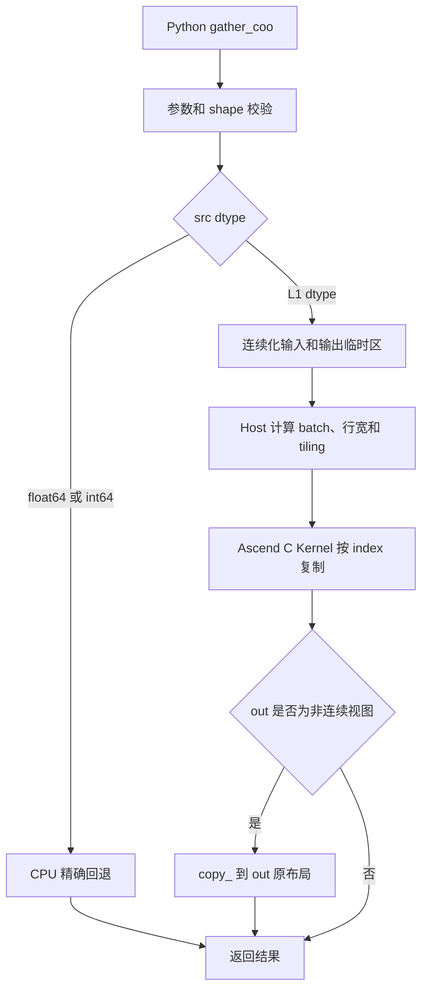

# gather_coo 算子设计文档

# 1. 需求背景（required）

## 1.1 需求来源

本文档对应《[8月社区任务 - gather_coo 算子开发任务书](../../../../docs/202608/gather_coo_task_doc.md)》，并按照《[算子设计文档模板](../../../../resources/design_template.md)》编写。

本任务参考 `torch_scatter.gather_coo`，在 Ascend 950PR 上使用 Ascend C Kernel 和 Python PyTorch 适配层实现 Gather COO。验收以 PyTorch 层接口的功能、精度和性能为准；aclnn 接口不作为必选交付件。

## 1.2 背景介绍

### 1.2.1 业务背景

COO（Coordinate list）使用 `index` 描述每个输出位置对应的源分组。`gather_coo` 将按分组保存的 `src` 行或切片，按照 COO 索引复制到输出：

```text
src   = [10, 20, 30]
index = [2, 0, 2, 2]
out   = [30, 10, 30, 30]
```

典型应用包括：

1. 将节点特征广播到边特征；
2. 将分段结果恢复为逐元素表示；
3. 在 PyG/DGL 图消息传递中按照边索引复制源节点特征。

### 1.2.2 与 segment_coo 的关系

`segment_coo` 将同一索引段内的多行输入归约为一个段值；`gather_coo` 将一个段值复制到该索引段的所有位置。二者共享 COO `index` 的最后一维约束，但数据流方向相反：

| 算子 | 数据方向 | 输入到输出规模 | 核心操作 |
| --- | --- | --- | --- |
| `segment_coo` | 多到一 | 大 index 维到小分组维 | 段内归约 |
| `gather_coo` | 一到多 | 小分组维到大 index 维 | 按索引复制 |

当 `segment_coo` 使用求和等归约时，`gather_coo` 不是数值逆运算；二者仅在稀疏数据结构的数据流方向上互为对偶。

### 1.2.3 参考实现分析

参考实现为 `torch_scatter.gather_coo` 及其 CPU 实现。设 `dim = index.dim() - 1`，则对输出位置 `e`：

$$
idx = index[..., e],\\
out[..., e, ...] = src[..., idx, ...]
$$

其中 `src` 的 `dim` 维是源分组维，`index` 的最后一维是输出位置维，`src` 在 `dim` 后的特征维保持不变。算子没有数值计算和归约，输出是源 Tensor 切片的确定性复制，因此 L1 dtype 可以按位对齐 CPU 标杆。

任务书约束 `index` 沿最后一维非降序，且取值范围为 `[0, src.size(dim))`。本实现以这两项作为受支持输入契约；测试数据在生成后排序并保证值域合法，不增加运行时排序或范围校验。

实现统一使用规范的 `[B, N, F]` 逻辑布局，其中 `index` 的前导维与 `src` 对应维完全一致。该布局同时覆盖二维性能基准和带尾部 feature 维的高维输入，不设置额外兼容地址分支。

### 1.2.4 现有能力缺口

当前 `ops-gnn` 工程已有 Ascend C 的 PyBind、Host 和 Kernel 示例，但没有 `gather_coo`。需要新增：

| 层次 | 能力缺口 | 设计补充 |
| --- | --- | --- |
| Python | 无 `gather_coo(src, index, out)` 公开接口 | 新增三参数适配函数并导出 |
| PyBind | 无 Gather COO 入口 | 注册 `_pybind.gather_coo` |
| Host | 无输出形状、批次映射和 tiling | 新增输入校验、shape 推导和 tiling 数据 |
| Kernel | 无按索引复制的 GM 搬运 | 新增通用 SIMT 路径和连续特征宽搬运路径 |
| L2 dtype | Ascend C 主路径不覆盖 `float64`、`int64` | 使用精确 CPU 回退 |
| 测试 | 无算子实现对应的测试 | 接入任务书提供的功能和性能用例 |

# 2. 需求分析（required）

## 2.1 需求描述

在 Ascend 950PR 上实现与 `torch_scatter.gather_coo` 对齐的前向算子，提供以下固定接口：

```python
def gather_coo(src: torch.Tensor, index: torch.Tensor,
               out: Optional[torch.Tensor] = None) -> torch.Tensor:
    ...
```

接口只包含 `src`、`index`、`out` 三个参数，不增加 `reduce` 或 `dim_size` 参数。

## 2.2 输入、输出和形状

定义：

```text
dim = index.dim() - 1
N   = src.size(dim)
E   = index.size(dim)
B   = product(src.shape[:dim])
F   = product(src.shape[dim + 1:])，无尾部特征维时 F = 1
```

输出 shape 由 `src` 复制后将 `dim` 维替换为 `E` 得到：

```text
out_shape = list(src.shape)
out_shape[dim] = index.size(dim)
```

对规范的等批次输入，逻辑布局可视为：

```text
src   : [B, N, F]
index : [B, E]
out   : [B, E, F]
```

`index` 的每个前导维必须与 `src` 对应维完全一致，不执行 batch 广播或较短 batch 的兼容映射。

支持 1 到 8 维、空 Tensor、多 batch 和非连续 strided Tensor。输入校验规则如下：

| 输入 | 约束 |
| --- | --- |
| `src` | Tensor；NPU 主路径与 `index`、`out` 在同一设备 |
| `index` | Tensor，`torch.int64`，至少 1 维；最后一维非降序，索引值在 `[0, N)` |
| `out` | 可选；shape、dtype、device 必须与推导结果和 `src` 一致 |
| `dim` | 固定为 `index.dim() - 1`，且 `dim < src.dim()` |

Python/Host 在下发 Kernel 前检查 dtype、device、维度、shape 和元素数。排序与取值范围是调用方必须满足的输入前置条件；违反该契约时不保证行为。纯复制路径不使用原子操作，结果具有确定性。

## 2.3 支持数据类型和实现路径

| 级别 | `src`/`out` dtype | 实现路径 | 性能考核 |
| --- | --- | --- | --- |
| L1 | `float16`、`bfloat16`、`float32`、`int8`、`int16`、`int32`、`uint8` | Ascend C Kernel 纯索引搬运 | 纳入 NPU 性能基线 |
| L2 | `float64`、`int64` | CPU 精确回退，再拷贝回原设备 | 不纳入性能考核 |

`index` 固定为 `int64`。L1 路径不进行浮点运算，输出与 CPU 标杆按位一致；L2 路径使用 CPU 参考逻辑保证 `float64` 和 `int64` 结果精确。

## 2.4 `out` 参数语义

`out` 非空时：

1. 不重新分配 `out`，检查其 shape、dtype、device 和写入权限；
2. 将结果写入 `out` 的现有存储；
3. 返回与传入对象相同的 Tensor；
4. 当 `out` 非连续时，先在连续临时 Tensor 上执行 Kernel，再使用 `out.copy_(tmp)` 写回其原有布局。

当 `out` 与 `src` 或 `index` 存储重叠时，适配层先将输入物化为安全的连续临时副本，避免边读边写导致结果依赖写入顺序。

# 3. 详细设计（required）

## 3.1 总体流程



Python 层负责 PyTorch 语义和路径选择；Host 负责 shape、设备流和 tiling；Kernel 对满足有序、合法值域契约的索引执行搬运。

## 3.2 Python 适配层设计

新增 `python/ops_gnn/gather_coo.py`，并在 `python/ops_gnn/__init__.py` 中导出 `gather_coo`。

### 3.2.1 参数检查和输出推导

适配层按以下顺序处理：

1. 检查 `src`、`index` 是 Tensor，`index.dim() >= 1`，且 `dim = index.dim() - 1 < src.dim()`；
2. 检查 `index.dtype == torch.int64`，并检查 `src` dtype 属于 L1 或 L2 集合；
3. 检查 `index` 的前导 batch shape 与 `src.shape[:dim]` 完全一致；
4. 空 `index` 不访问索引值，直接返回正确 shape 的空结果；
5. 推导 `out_shape`，检查用户传入 `out`；未提供时使用 `src.new_empty(out_shape)`；
6. 对非连续 `src`、`index` 和内部输出使用 `.contiguous()`；保留用户 `out` 原对象并在 Kernel 后写回。

适配层不对 `index` 执行排序，也不为检查值域引入 NPU 到 CPU 的同步往返。有序性和合法值域由调用方按任务书契约保证。

### 3.2.2 CPU 和 L2 路径

CPU `src` 直接使用纯 PyTorch 参考逻辑。NPU 上的 `float64`、`int64` 输入先转到 CPU，在 CPU 上按 `[B, N, F]` 逻辑布局执行索引复制，再将结果拷贝回目标设备；使用 `out` 时写回传入的 `out`。

该路径不参与性能验收，但必须保持 dtype、device、shape、`out` 对象语义和错误检查与 L1 路径一致。

## 3.3 Host 侧设计

### 3.3.1 逻辑布局和索引映射

对连续输入，Host 将 `src` 解释为 `[B, N, F]`：

```text
src_offset(b, n, f)   = (b * N + n) * F + f
index_offset(b, e)    = b * E + e
out_offset(b, e, f)   = (b * E + e) * F + f
```

前导维完全一致，因此 `src` 与 `index` 共享同一个展平 batch 编号。该映射覆盖 1～8 维及带尾部 feature 的输入，不需要在 Kernel 中保存变长 shape 数组。

### 3.3.2 TilingData

`GatherCooTilingData` 包含：

| 字段 | 含义 |
| --- | --- |
| `batchCount` | `B` |
| `sourceDimSize` | `N` |
| `indexDimSize` | `E` |
| `storageUnitsPerRow` | 每个 feature 行包含的存储单元数 |
| `storageBytes` | 单个存储单元字节数，取 16、8、4、2 或 1 |

Host 计算 `rowBytes = F * element_size`，从 16、8、4、2、1 中选择能整除 `rowBytes` 的最大宽度。shape 乘积使用 64 位整数并检查溢出。

### 3.3.3 分核策略

总存储单元数为 `U = B * E * storageUnitsPerRow`。每个 AIV block 使用 1024 个 SIMT 线程，启动核数按工作量裁剪：

```text
blocksNeeded = ceil(U / 1024)
coreCount = min(platformCoreCount, max(1, blocksNeeded))
```

每个线程使用全局 grid-stride 处理存储单元；尾部不足 1024 个单元时由边界条件自然覆盖。各线程写入不同输出单元，不需要原子操作或跨核同步。

### 3.3.4 存储宽度选择

根据 `rowBytes` 选择存储类型：

| 条件 | 存储单元 |
| --- | --- |
| `rowBytes % 16 == 0` | 16 字节，由两个 `uint64_t` 显式读写 |
| 否则依次可被 8、4、2 整除 | 对应的无符号整数存储类型 |
| 其余 | 1 字节 `uint8_t` |

宽度必须整除整行字节数，因此每行没有残缺存储单元；所有路径均执行无损位级复制。

## 3.4 Kernel 侧设计

### 3.4.1 通用 SIMT 路径

Kernel 按存储单元分配任务。每个线程从全局线程号开始，以全部线程数为步长遍历输出：

```text
for unit in grid_stride(global_thread_id, total_units):
    output_row = unit // storage_units_per_row
    feature = unit % storage_units_per_row
    batch = output_row // E
    edge = output_row % E
    source_row = index[batch * E + edge]
    source_unit = (batch * N + source_row) * storage_units_per_row + feature
    out[unit] = src[source_unit]
```

`index` 只产生地址，不参与数值计算。合法值域是调用契约；Kernel 中的防御分支仅避免越界访问，不定义非法输入的公共接口语义。

同一输出行的多个存储单元可由不同线程并行处理。由于 Host 选择的存储宽度整除 `rowBytes`，Kernel 不需要处理行内残缺单元。

### 3.4.2 宽位搬运路径

Host 按行字节数选择 16、8、4、2、1 字节的存储类型，Kernel 模板对每种类型复用同一 SIMT 地址映射：

1. 16 字节路径使用两个 `uint64_t` 显式完成 GM 读写；
2. 8、4、2、1 字节路径分别使用 `uint64_t`、`uint32_t`、`uint16_t`、`uint8_t`；
3. 所有路径只复制原始位模式，不进行 dtype 转换、浮点运算或归约。

有序 `index` 中的连续重复段仍保持与 `segment_coo` 的语义对偶。本版本选择存储单元级 SIMT 映射和连续输出写，不实现跨线程段缓存；后续可在不改变接口的前提下评估段内源行复用。

### 3.4.3 空 Tensor 和尾块

`E == 0` 或输出元素数为 0 时，Host 直接创建/返回空输出，不启动 Kernel。非空输出通过 `unit < total_units` 的循环条件处理尾部，只访问有效输入和输出单元。

## 3.5 带宽和性能优化方案

Gather COO 的计算量接近零，主要瓶颈是索引读取、源数据重复读取和输出 GM 写带宽。采用以下优化：

| 优化 | 作用 |
| --- | --- |
| 存储单元 grid-stride 分核 | 均衡不同 batch、index 长度和 feature 宽度 |
| 16/8/4/2/1 字节宽位搬运 | 减少 load/store 指令，提高 GM 带宽利用率 |
| 连续输出单元写入 | 保持合并写访问，减少地址计算开销 |
| 按工作量裁剪启动核数 | 避免小输入启动过多空核 |
| 非连续输入只在适配层连续化 | 简化 Kernel 地址计算，保证主路径可优化 |
| 空输出快速返回 | 避免无效 Kernel 启动 |

带宽估算采用输出字节数和 Kernel 实际耗时：

```text
effective_bandwidth = output_numel * element_bytes / elapsed_time
```

最终性能数据在 950PR WebIDE 上使用任务书提供的五组 shape、L1 dtype、预热和多次重复计时后填写，不在设计阶段预填实测结论。

## 3.6 数据检测和异常处理

| 场景 | 行为 |
| --- | --- |
| `index` 不是 int64 | 抛出 `TypeError` 或 `TORCH_CHECK` |
| index 维度为 0 或超过 src 维度 | 抛出参数错误 |
| index 无序、越界或为负 | 不属于受支持输入，行为不保证 |
| 前导 batch 与 src 对应维不一致 | 抛出 shape 错误 |
| `out` shape/dtype/device 不匹配 | 抛出错误，不隐式 resize 或 cast |
| 非连续 src/index | 适配层连续化后执行 |
| 非连续 out | 临时连续输出后 copy 到原 out |
| float64/int64 | CPU 精确回退，不做 NPU 性能考核 |
| 空 Tensor | 返回正确 shape 的空结果 |
| unsupported device | 抛出设备错误 |

## 3.7 集成方式

1. 在 `csrc/npu/host/gather_coo` 增加 Host 入口和 tiling 定义；
2. 在 `csrc/npu/kernel/gather_coo` 增加 Ascend C Kernel 及启动函数；
3. 复用工程 `CMakeLists.txt` 的递归源文件收集，不修改已有算子构建逻辑；
4. 在 `csrc/pybind.cpp` 注册 `gather_coo(src, index, out)`；
5. 在 `python/ops_gnn/gather_coo.py` 处理接口语义并在 `__init__.py` 导出；
6. 在算子目录提供 README，说明构建、测试和 dtype 路径；
7. 在本地测试通过后，将代码提交到个人 `ops-gnn` Fork 的 `feature/gather-coo` 分支。

用户调用示例：

```python
import torch
import ops_gnn

src = torch.tensor([[10, 20], [30, 40]], dtype=torch.float16, device="npu")
index = torch.tensor([[0, 1, 1]], dtype=torch.int64, device="npu")
out = ops_gnn.gather_coo(src, index)
```

# 4. 支持硬件与约束限制

## 4.1 支持硬件

| 支持的芯片版本 | 涉及勾选 |
| --- | --- |
| Ascend 950PR / Atlas 950 系列产品 | √ |

构建目标为 `dav-3510`，最终以 WebIDE 中实际安装的 CANN 版本和编译器能力为准。

## 4.2 算子约束限制

1. PyTorch 接口固定为 `src`、`index`、`out` 三个参数；
2. `index` 类型固定为 `int64`，最后一维决定输出复制位置数；
3. `index` 沿最后一维必须非降序，合法值必须落在源分组维范围内；
4. 排序和值域由调用方保证，当前实现不执行运行时排序或范围校验；
5. L1 dtype 使用 Ascend C Kernel，`float64` 和 `int64` 使用精确 CPU 回退；
6. 仅实现前向，不提供 backward；
7. 非连续 Tensor 由适配层连续化或写回原布局；
8. 不支持跨设备输入，也不进行隐式 dtype 转换；
9. 非法 shape、dtype、device 和 out 在 Kernel 下发前报错。

# 5. 可维可测分析

## 5.1 精度和功能标准

| 验收标准 | 描述 | 标准来源 |
| --- | --- | --- |
| 接口标准 | PyTorch 层函数签名、dtype、device、shape 和 out 语义与任务要求一致 | 任务书 |
| 功能标准 | 1～8 维、多 batch、空 Tensor、非连续 Tensor 均正确 | 任务书和公开自测 |
| 精度标准 | L1 纯搬运与 CPU golden 按位一致；L2 CPU 回退按位一致 | 任务书和生态算子精度标准 |
| 确定性 | 同一输入多次执行结果一致 | 任务书 |

算子没有浮点计算和归约。所有支持 dtype 均将连续结果视为 `uint8` 后逐字节比较，要求与 CPU 标杆按位一致。

## 5.2 功能测试设计

| 用例组 | 覆盖内容 | 预期 |
| --- | --- | --- |
| TC-01～TC-06 | 1D、2D、3D、高维标准 shape | 与 CPU golden 一致 |
| TC-07 | 多 batch，index 前导维与 src 对齐 | 输出 shape 和逐元素复制一致 |
| TC-08 | 用户提供 `out` | 返回传入对象并正确填充 |
| TC-09 | 非连续 src/index/out | 结果与连续参考一致 |
| TC-10 | 空 src、空 index | 返回正确空 shape，不越界 |
| TC-11 | index 全为同值及连续重复段 | 有序段复制结果正确 |
| TC-12 | L1 七种 dtype | dtype 保持且逐字节一致 |
| TC-13 | float64/int64 L2 | CPU 回退逐字节一致 |
| TC-14 | 非法 dtype、错误前缀维和错误 out | 在下发 Kernel 前报错 |

公开测试文件为 `docs/202608/self_test_case/ops-gnn/test/test_gather_coo.py`。开发仓测试目录中仅复制本算子所需文件，并在 README 中固定环境、命令和设备号。

## 5.3 性能测试设计

性能测试使用任务书提供的五组矩阵规格：

| `src` shape | index 数量 | dtype |
| --- | ---: | --- |
| `16384 x 128` | `65536` | float32、float16 |
| `65536 x 128` | `65536` | float32、float16 |
| `65536 x 128` | `262144` | float32、float16 |
| `262144 x 128` | `524288` | float32、float16 |
| `262144 x 128` | `1048576` | float32、float16 |

每组至少进行 warmup、同步和多次 NPU Event 计时，报告最小耗时和中位数。相对性能定义为：

$$
Relative = \\frac{A100\\ time}{Ascend\\ 950PR\\ time}
$$

验收条件为 `Relative >= 0.6`。`float64` 和 `int64` 只测试正确性，不纳入性能排名。

## 5.4 自测报告和验收记录

自测阶段记录以下信息：

1. WebIDE 节点型号、CANN、Python、PyTorch 和 torch_npu 版本；
2. 每个功能用例的 shape、dtype、device、输出校验结果；
3. AscendOpTest/ATK 执行命令和完整日志路径；
4. 五组性能用例的 warmup、迭代次数、耗时、有效带宽和相对性能；
5. 非连续 Tensor、`out`、空 Tensor、有序重复段和 L2 回退的截图或日志。

设计阶段不填写未经实机测量的性能数值；代码和测试完成后，将实际结果补入自测报告。

## 5.5 兼容性分析

本算子是 `ops-gnn` 新增接口，不修改已有 `add_sample` 和 `segment_max_csr` 的函数签名。构建系统仅通过现有递归规则增加新的 Host/Kernel 源文件，PyBind 和 Python 导出只追加 `gather_coo`。L2 回退不改变用户可见的 dtype、device 和 shape 语义。

## 5.6 风险与规避措施

| 风险 | 影响 | 规避措施 |
| --- | --- | --- |
| 调用方传入无序或越界 index | 超出任务书契约，结果不可用 | README 明确前置条件，测试统一生成有序且合法的 index |
| 非连续输入地址复杂 | Kernel 计算错误或性能不稳 | 适配层连续化，out 用临时结果写回原视图 |
| 小输出占用过多 core | 启动开销增加 | 按总存储单元数裁剪 core 数，空输出不启动 |
| 行宽与存储类型不匹配 | 尾部越界或位模式变化 | 仅选择能整除 `rowBytes` 的 16/8/4/2/1 字节宽度 |
| 重复 src 行 GM 读取 | 带宽不足 | 先以宽位搬运和连续输出写满足基线，保留有序段缓存为后续优化 |
| L2 dtype 不被 Ascend C 覆盖 | 编译或结果不一致 | 精确 CPU 回退并单独测试 |
| 未经实测填写性能 | 验收材料不可信 | WebIDE 实测后再生成自测报告 |
