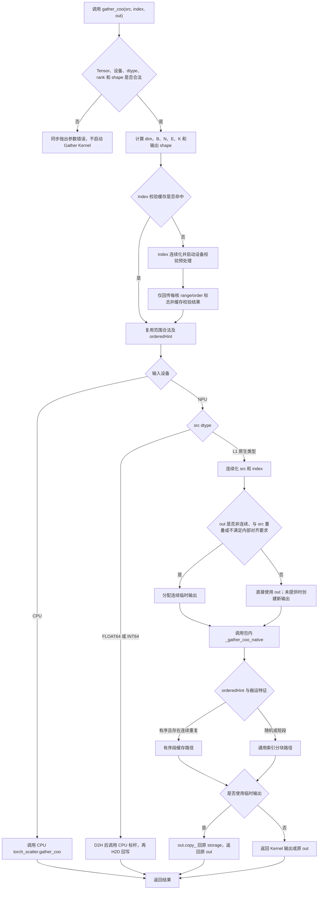
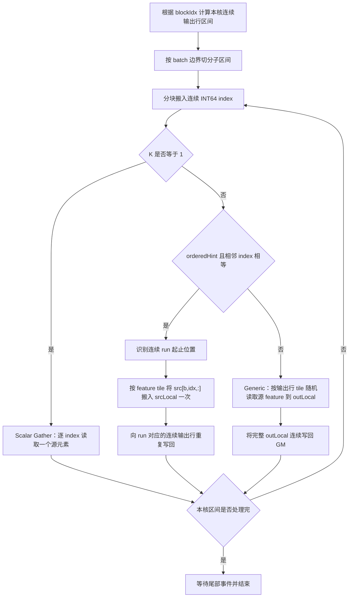
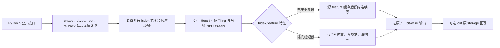

# 需求背景（required）

## 需求来源

本需求来源于 CANN 2026 年 8 月社区任务 `gather_coo`。任务要求参考 `torch_scatter.gather_coo`，在 Ascend950PR 上采用 Ascend C Kernel 与 Python PyTorch 适配层实现接口、功能、精度和性能对齐。验收以 PyTorch 层接口为唯一必选口径，aclnn 接口为可选项。

任务书：<https://gitcode.com/cann/cann-ops-competitions/blob/master/04_tasks/01_community-task-2026/docs/202608/gather_coo_task_doc.md>

## 背景介绍

Gather COO 是 Segment COO 的逆向数据展开操作。`src` 在 `dim = index.dim()-1` 维存放分组后的源行或 feature 切片，`index` 沿最后一维给出每个输出位置对应的源分组编号。对任意合法输出位置 `e`：

\[
out[...,e,\dots]=src[...,index[...,e],\dots]
\]

当同一个 `index` 值连续出现时，相应输出段复制同一行 `src`。该算子用于将节点或分组特征广播到边列表，是图消息下发、稀疏图特征展开以及 Segment COO 结果恢复到逐边布局的基础操作。

算子只包含 INT64 索引读取和源数据位模式复制，不进行浮点计算、归约或原子更新。其性能上限主要由以下因素决定：

- 随机源行读取产生的 GM 访存离散性；
- 有序相等段内能否复用已加载的 `src[index]` feature；
- 输出是否按连续地址批量写回；
- INT64 index 的读取命令数和多核负载均衡；
- 非 32B 对齐 feature 行的安全搬运开销。

### torch_scatter 参考实现现状分析

Python 参考接口为：

```python
def gather_coo(src: torch.Tensor, index: torch.Tensor,
               out: Optional[torch.Tensor] = None) -> torch.Tensor:
    return torch.ops.torch_scatter.gather_coo(src, index, out)
```

`gather_coo_cpu` 的核心步骤为：

1. 令 `dim = index.dim()-1`，检查 `index.dim() <= src.dim()` 及前导维关系；
2. 将 `src` 规范化为连续 Tensor；
3. 未提供 `out` 时，将 `src.shape[dim]` 替换成 `index.size(dim)` 创建输出；
4. 将数据逻辑展平为 `src[B,N,K]`、`index[B,E]`、`out[B,E,K]`；
5. 顺序扫描每个 batch 的 `index`，缓存当前 `idx` 对应的 `K` 个 feature；连续 `idx` 未变化时复用缓存，变化时才读取下一行 `src`；
6. CPU 参考实现同时检查相邻 index 非降序。

CUDA 参考实现把每个输出元素映射到一个线程，可正确处理 `K=1` 和 `K>1`，但没有利用连续相等 index 的段内复用。Ascend C 方案在保持通用随机 gather 路径的同时，采用有序段缓存减少重复源行读取。

参考源码：

- Python 接口：<https://github.com/rusty1s/pytorch_scatter/blob/master/torch_scatter/segment_coo.py>
- CPU 实现：<https://github.com/rusty1s/pytorch_scatter/blob/master/csrc/cpu/segment_coo_cpu.cpp>
- CUDA 实现：<https://github.com/rusty1s/pytorch_scatter/blob/master/csrc/cuda/segment_coo_cuda.cu>

# 需求分析（required）

## 需求描述

在 Ascend950PR 上实现与 `torch_scatter.gather_coo` 前向接口一致的 `gather_coo`：

- 必选 Python 接口：`gather_coo(src, index, out=None)`，不得增加 `reduce`、`dim_size` 等公开参数；
- L1 NPU 原生类型：FLOAT16、BFLOAT16、FLOAT32、INT8、INT16、INT32、UINT8；
- `index` 固定为 INT64；
- L2 FLOAT64、INT64 采用透明 CPU fallback，不参与性能验收；
- 支持 1～8 维、空 Tensor、非连续 Tensor、多 batch 和可选 `out`；
- L1 与 CPU torch_scatter 单标杆逐比特一致；
- 任务书规定的全部性能用例达到不低于 0.6 倍 A100 标杆性能；
- 目标实现不依赖旧芯片固定核数或固定 UB 大小。

## 需求拆解

1. PyTorch 层完成接口、dtype/device/rank/shape 校验，非连续规范化，L2 fallback，可选 `out` 及错误语义处理。
2. Index 校验路径检查 INT64 取值范围，并识别是否非降序；合法有序输入走段缓存快路径，发布测试中的合法无序随机索引走通用兼容路径。
3. Host 层用 64 位整数推导 `B/N/E/K`，根据运行时 AIV 核数和 UB 容量生成 tiling，并提交到 PyTorch 当前 NPU stream。
4. Kernel 层按连续输出行均分多核，分块读取 INT64 index，完成有序段缓存、随机 gather、连续写回和非对齐尾块处理。
5. 精度测试以 CPU torch_scatter 为单标杆，覆盖任务书 TC-01～TC-13；TC-14 作为可选对偶增强。
6. 性能测试完整覆盖 5 组 shape 的 FP32、FP16，共 10 个正式用例；性能不达标时回到 tiling、搬运或并行设计优化。
7. 正式代码遵循 `ops-gnn` 既有 Python、pybind、Host、Kernel、CMake 和测试层级，不建立独立于主工程的第二套目录结构。

# 详细设计（required）

## 算子分析

### 数学公式与三维逻辑展开

设：

- `D = index.dim()`；
- `dim = D-1`；
- `B = product(src.shape[:dim])`，表示展开后的逻辑 batch 数；
- `N = src.size(dim)`，表示源分组数；
- `E = index.size(dim)`，表示每个逻辑 batch 的输出行数；
- `K = product(src.shape[dim+1:])`，表示每个源分组的 feature 元素数。

输入输出可按连续逻辑布局解释为：

```text
src   : [B, N, K]
index : [B, E]
out   : [B, E, K]
```

对 `0 <= b < B`、`0 <= e < E`、`0 <= k < K`：

\[
out[b,e,k]=src[b,index[b,e],k]
\]

其中 `0 <= index[b,e] < N`。`dim=0` 时 `B=1`；`src` 在 `dim` 之后没有维度时 `K=1`。所有 shape product、stride、元素数和字节偏移均使用 64 位无符号整数，并在乘加前检查溢出。

### 与 segment_coo 的对偶关系

Gather COO 与 Segment COO 使用同一个 COO index，数据方向相反：

| 算子 | 输入布局 | 输出布局 | 数据流 |
| --- | --- | --- | --- |
| `segment_coo` | 展开行 `[B,E,K]` | 分组行 `[B,N,K]` | 将相同 index 的多行归约成一行 |
| `gather_coo` | 分组行 `[B,N,K]` | 展开行 `[B,E,K]` | 将一行复制到所有相同 index 的位置 |

令 `count[b,n]` 表示 index 中值为 `n` 的出现次数，`x = gather_coo(src,index)`，则：

\[
segment\_sum\_coo(x,index,dim\_size=N)[b,n]
=src[b,n]\times count[b,n]
\]

对 `count[b,n] > 0` 的分组：

\[
segment\_mean\_coo(x,index,dim\_size=N)[b,n]=src[b,n]
\]

若原始展开输入在同一 index 组内本来就是常量，则 `gather_coo(segment_mean_coo(x,index),index)` 恢复原输入。未出现的空分组没有对应输出位置，不能用均值恒等式恢复，需单独按 CPU torch_scatter 语义测试。

### 有序段缓存

对任务书规定的有序 index，相同值必定连续。设某段为：

```text
index[b, eBegin:eEnd] == idx
```

则同一 feature tile 只需从 GM 读取一次：

```text
src[b, idx, kBegin:kEnd] -> srcLocal
srcLocal -> out[b, eBegin:eEnd, kBegin:kEnd]
```

源读取量由 `runLength * featureBytes` 降为 `featureBytes`。输出仍必须完整写入，因而最终受 MTE3/GM 写带宽约束。

该缓存只在“当前 index 与上一个 index 相等”时复用，不要求后续 index 必须更大。因此即使兼容路径收到无序但范围合法的 index，缓存也不会读错：index 变化即重新加载源行，只是连续重复较少、复用收益降低。

### 参数、数据类型与功能边界

| 参数 | 输入/输出 | 数据类型 | Shape/约束 | 非连续 |
| --- | --- | --- | --- | --- |
| src | 输入 | L1：FP16/BF16/FP32/INT8/INT16/INT32/UINT8；L2：FP64/INT64 | 1～8 维；`N=src.size(dim)` | 支持，由公开层规范化 |
| index | 输入 | INT64 | `1<=index.dim()<=src.dim()`；最后一维长度 E；标准契约下前导维与 src 对齐；取值 `[0,N-1]` | 支持，由公开层规范化 |
| out | 可选输入/输出 | 与 src 相同 | rank 与 src 相同；`dim` 维为 E，其余维与 src 一致 | 支持，必要时临时 Tensor 回写 |
| result | 输出 | 与 src 相同 | src shape 的 `dim` 维替换为 E | 新建结果为连续布局 |

功能边界如下：

- 仅实现前向 gather，不提供 `reduce`、`dim_size` 或梯度验收；
- 标准契约要求 index 非降序，允许重复值；
- L1 不做任何数值转换，以 1B、2B、4B storage 位宽搬运；
- L2 FLOAT64、INT64 通过 D2H → CPU torch_scatter → H2D 实现，保持位模式，不参加性能验收；
- `index.numel()==0` 时直接返回 `dim` 维为 0 的空输出；
- `N==0` 时仅允许空 index，否则不存在合法索引；
- 输入越界、shape 不匹配或整数溢出时，在 Gather Kernel 启动前报错；
- 算子纯复制且各 core 写区间互斥，不使用归约原子，结果确定。

## 算子实现

### PyTorch 侧设计

公开函数签名逐字保持为：

```python
def gather_coo(src: torch.Tensor, index: torch.Tensor,
               out: Optional[torch.Tensor] = None) -> torch.Tensor:
    ...
```

#### PyTorch/torch_scatter 等价伪代码

```python
dim = index.dim() - 1
assert index.dim() <= src.dim()
assert tuple(index.shape[:dim]) == tuple(src.shape[:dim])

out_shape = list(src.shape)
out_shape[dim] = index.size(dim)
result = out if out is not None else src.new_empty(out_shape)

B = product(src.shape[:dim])
N = src.size(dim)
E = index.size(dim)
K = product(src.shape[dim + 1:])

src3 = src.contiguous().view(B, N, K)
idx2 = index.contiguous().view(B, E)
out3 = result.view(B, E, K)

for b in range(B):
    last_idx = None
    cached = None
    for e in range(E):
        idx = int(idx2[b, e])
        if idx != last_idx:
            cached = src3[b, idx, :]
            last_idx = idx
        out3[b, e, :] = cached
return result
```

公开层保持 `out` 的对象身份和 storage 写入语义；内部可以使用连续临时 Tensor，但返回值必须仍为调用者传入的 `out`。

#### 最终 PyTorch 适配流程



处理原则：

1. `dim` 只由 `index.dim()-1` 推导，不增加公开参数；
2. 元数据校验包括 device、dtype、rank、前导维、输出 shape、`out` dtype/device 和元素数溢出；
3. `src`、`index` 非连续时先连续化；`out` 非连续或与 `src` storage 重叠时使用临时输出，再通过 `out.copy_` 回写；
4. CPU 输入直接调用真实的 `torch_scatter.gather_coo`，不维护另一份 Python 真值算法；
5. NPU L2 类型透明回退到 CPU torch_scatter，返回的 dtype、device 和 `out` 语义与公开接口一致；
6. L1 调用包内 `_pybind._gather_coo_native`。内部 launcher 不作为公开推荐接口；
7. index 是否有序仅影响内部策略，不改变三个参数的公开签名；范围非法必须报错，无序但范围合法的兼容输入仍由通用 Kernel 得到确定结果。

### Index 校验与缓存设计

任务书要求 index 范围合法且非降序。直接把百万级 INT64 index 完整搬到 CPU 会显著增加首次调用开销，因此采用“设备并行校验 + 小结果回传”的方案：

1. 将连续 index 按扁平元素区间分给多个 AIV core；
2. 每核检查自身元素是否位于 `[0,N-1]`；
3. 每核按 `E` 识别逻辑 batch 边界，检查同一 batch 内相邻元素是否非降序；分核边界若位于同一 batch，额外比较本核首元素与前一元素；
4. 每核分别写一个 `rangeValid` 和 `ordered` 标志，不使用跨核原子；
5. Host 只回传并汇总少量标志。`rangeValid=false` 立即报错；`ordered` 作为段缓存 tiling hint；
6. 成功结果按 Tensor identity、弱引用、mutation version、shape、stride、storage offset 和 `N/E` 组成的签名缓存。任何原地修改、换 shape 或对象销毁都会失效。

发布性能脚本在预热与计时阶段重复使用同一个 index，首次校验后稳态调用命中缓存。正式报告同时记录首次调用 wall time 与预热后的接口/Kernel 时间，避免用缓存掩盖初始化成本。

Native 层仍执行所有元数据、连续性、dtype、shape、地址和 storage overlap 防御。Gather Kernel 每次使用 idx 前再做 `0 <= idx < N` 的廉价防御，禁止任何非法值形成 GM 越界地址；公开层校验通过时该分支不影响结果。

| 校验项 | 执行层 | 失败处理 |
| --- | --- | --- |
| Tensor、device、dtype | PyTorch | index 非 INT64、out 与 src dtype/device 不同或设备组合不支持，立即报错 |
| rank 与 dim | PyTorch/Host | src rank 不在 1～8、index rank 小于 1 或大于 src rank，立即报错 |
| 前导维 | PyTorch | 标准路径要求 `index.shape[:dim] == src.shape[:dim]`，不隐式接受任意较小 batch |
| 输出 shape | PyTorch/Host | out rank、dim 维或其余维不匹配，立即报错 |
| index 范围 | 设备校验预处理 | 任一 idx 小于 0 或大于等于 N，Gather Kernel 前报错 |
| index 顺序 | 设备校验预处理 | 记录 orderedHint；标准测试断言非降序，通用兼容路径不依赖该假设 |
| 非连续与重叠 | PyTorch/Host | 输入连续化；out 非连续或与 src 重叠时使用临时输出 |
| 地址溢出 | Host | B/N/E/K、元素数、stride 或字节偏移的 64 位乘加溢出，立即报错 |

### Host 侧设计

Host 侧执行以下工作：

1. 重新校验 Native 输入全部位于 NPU、连续且 dtype/shape 匹配；
2. 使用 64 位整数计算 `B/N/E/K`、总输出行数和字节数；
3. 通过运行时平台接口获取 AIV core 数和 UB 容量，不硬编码旧硬件参数；
4. 根据 `K`、dtype 字节数、index 是否有序和 32B 对齐关系选择 tiling；
5. 使用 PyTorch 当前 NPU stream 启动 Kernel，不创建私有 stream，不在 Native 内做无条件全流同步；
6. 空输出直接返回，不启动 Gather Kernel。

#### 输出 shape

未提供 `out` 时：

```text
outputShape = src.shape
outputShape[dim] = E
```

提供 `out` 时，检查 `out.size(dim)==E`，其余维与 src 相同。输出 shape 仅依赖 index shape，不依赖 index 数值，因此不需要为动态 shape 读取设备标量。

#### 多核切分

默认按 `B*E` 个输出行连续均分，而不是按唯一 index 数或 run 数均分：

```text
totalRows = B * E
usedCores = min(aivCoreNum, totalRows)
rowsPerCore = ceil(totalRows / usedCores)
rowBegin(core) = core * rowsPerCore
rowEnd(core)   = min(totalRows, rowBegin + rowsPerCore)
```

这样随机索引、极不均匀 run length 和多 batch 均按实际输出字节负载均衡。分核边界可能切开一个重复段，最多造成相邻 core 各自重新加载一次同一源 feature，不会产生写冲突。

#### Tiling 路径

| 路径 | 条件 | 核心策略 |
| --- | --- | --- |
| Scalar Gather | `K==1` | index 分块读取，按输出元素映射单个源元素，减少大 Buffer 初始化 |
| Ordered Run Cache | orderedHint 为真且连续重复可利用 | 扫描 run，源 feature tile 只加载一次，对连续输出行重复写回 |
| Generic Row Gather | index 无序或平均 run 很短 | 对输出行 tile 聚合 index 和输出，随机读取源行，输出整块连续写回 |
| Aligned Fast Copy | `K*elementSize` 为 32B 整倍数 | 使用整块 DataCopy/DataCopyExt，性能基线 K=128 全部命中 |
| Unaligned Safe Copy | 行字节数或尾 tile 非 32B 整块 | 使用 DataCopyPad/DataCopyExt 与长度受控的尾块，不越界读写 |

`orderedHint` 不是公开参数，由 index 校验结果写入内部 TilingData。

#### UB 与双缓冲规划

运行时根据 UB 容量计算 tile，预留框架、对齐和事件空间。默认采用两个 output tile Buffer 与一个 index tile Buffer；有序段路径另保留一个 source feature Buffer：

```text
availableUb = floor(platformUbBytes * 3 / 4)
indexBufferBytes = align32(indexTileElements * 8)
featureBufferBytes = align32(min(K * elementSize, featureTileBytes))
outputBufferBytes = align32(rowTile * K * elementSize)

2 * outputBufferBytes + indexBufferBytes + featureBufferBytes <= availableUb
```

- 通用随机路径把若干输出行写入连续 `outLocal`，再用一次较大的 MTE3 搬运写到 GM，减少小写命令；
- 两个 `outLocal` 轮转，使下一 tile 的离散 GM→UB 读取与上一 tile 的 UB→GM 连续写尽量重叠；
- 有序长 run 路径把一个 source feature tile 留在 `srcLocal`，对 run 内输出重复写出，避免重复 GM 源读取；
- 若实测发现双输出 Buffer 压缩 feature tile 且不能提升带宽，可由 tiling 退化为单 Buffer，不改变公开接口。

#### TilingData

| 字段 | 类型 | 含义 |
| --- | --- | --- |
| batchCount | uint64 | B |
| sourceRowsPerBatch | uint64 | N |
| outputRowsPerBatch | uint64 | E |
| featureCount | uint64 | K |
| totalOutputRows | uint64 | B*E |
| rowsPerCore | uint64 | 每个 core 最大输出行数 |
| usedCoreNum | uint32 | 实际启动 core 数 |
| elementSize | uint32 | 1、2 或 4 字节 |
| indexTileElements | uint32 | 单次搬入的 INT64 index 数 |
| rowTile | uint32 | 通用路径单次聚合输出行数 |
| featureTileElements | uint32 | 有序段路径单次 feature 元素数 |
| outputBufferBytes | uint32 | 单个输出 LocalTensor 字节数 |
| featureBufferBytes | uint32 | source feature LocalTensor 字节数 |
| orderedHint | uint32 | 1 表示标准有序快路径可用 |
| tilingKey | uint32 | Scalar、Run Cache、Generic 等内部路径 |

### Kernel 侧设计

#### 通用控制流



#### Ordered Run Cache 路径

每核在本地输出区间内顺序扫描 index。对连续相等区间 `[eBegin,eEnd)`：

1. 检查 `idx` 范围；
2. 计算源地址 `((b*N+idx)*K+kBegin)*elementSize`；
3. 将 `src[b,idx,kBegin:kEnd]` 搬入 `srcLocal`；
4. 通过 MTE3 重复搬运或 Loop Mode 将同一 `srcLocal` 写入 run 内的连续输出行；
5. feature 超过 UB 时继续下一 feature tile；
6. index 变化后才加载新的源行。

如果分核边界位于一个 run 中，两侧 core 各自加载一次源行，各自只写自己的输出范围。整个 Kernel 不使用原子操作。

#### Generic Row Gather 路径

发布性能矩阵使用随机 index，平均 run 长度接近 1，因此不能把性能达标建立在段复用假设上。通用路径按 `rowTile` 聚合输出：

1. 连续读取一块 index 到 `indexLocal`；
2. 对每个输出行按 idx 定位源 feature，将源数据搬入 `outLocal` 对应行；
3. `outLocal` 填满后，以一段连续 MTE3 写入输出 GM；
4. 两个 output Buffer 轮转，重叠离散读和连续写；
5. 相邻 idx 偶然相等时仍可复用上一源 tile，但正确性不依赖有序性。

对正式性能 shape，`K=128`：FP32 行字节数 512B、FP16 行字节数 256B，均为 32B 整倍数，源行和输出行全部命中对齐快路径。index 每行只有 8B，其带宽占比远小于 feature 读写，但必须通过分块读取减少小包访存命令。

#### 非对齐与尾块

- 源或目标逻辑长度不是 32B 整倍数时使用明确长度的 DataCopyPad/DataCopyExt；
- 禁止为了对齐而读取下一逻辑行或写出 Tensor 边界；
- `out` 基址不满足内部要求时由公开层改用对齐临时输出；
- 通用路径将多个逻辑输出行在 UB 中紧密打包后连续写回，避免对每个短行单独发出 MTE3 命令；
- `rowTile` 尾部不足整 tile 时按实际行数搬运；
- 1B、2B、4B dtype 分别按 UINT8、UINT16、UINT32 storage 模板复制，不执行 cast。

#### 最终方案与选择依据

最终方案由“PyTorch 完整语义层 + 设备 index 校验层 + C++ Host 防御层 + 混合 Gather Kernel”组成：



候选方案比较：

| 候选 | 结论 | 原因 |
| --- | --- | --- |
| 每个输出元素一个 SIMT 线程 | 仅保留 K=1 候选 | 逻辑简单，但 K=128 时源行搬运和输出连续写难以形成大块带宽 |
| 仅按有序 run 分核 | 不作为默认 | run 长度偏斜会导致核间负载不均，随机性能用例也几乎没有复用 |
| 按 `B*E` 输出行均分 | 采用 | 写入区间连续且互斥，随机和有序输入均衡，核边界重复加载代价有界 |
| 每行独立 GM→UB→GM | 不作为最终通用路径 | 非对齐、小 feature 时命令数过高，难以保证泛化性能 |
| 输出行 tile 聚合 + 双缓冲 | 采用 | 把离散源读取整理成连续输出写，减少 MTE3 小命令并允许搬运重叠 |
| 全量 index D2H 校验 | 不采用 | 百万级 INT64 首次搬运成本过高；改为设备校验后只回传少量标志 |
| L2 低精度拆分 | 不采用 | L2 不考核性能，CPU fallback 更容易保证 FP64/INT64 位模式一致 |

### Buffer 规划

| Buffer | 用途 | 大小 |
| --- | --- | --- |
| indexLocal | 连续缓存一块 INT64 index | `align32(indexTileElements*8)` |
| srcLocal | 有序 run 缓存一个源 feature tile | `align32(featureTileElements*elementSize)` |
| outLocal0 | 通用路径聚合输出行，或作为当前输出 Buffer | `align32(rowTile*K*elementSize)` |
| outLocal1 | 与 outLocal0 轮转形成双缓冲 | 同 outLocal0 |

事件顺序保证：

- MTE2 完成源数据写入 LocalTensor 后，MTE3 才读取该 Buffer；
- MTE3 完成上一 tile 写回后，MTE2 才复用同一输出 Buffer；
- Kernel 退出前等待最后一次 MTE3 事件；
- 不同 core 的输出 GM 区间互斥，无需跨核同步和原子更新。

### 目标工程文件组织

正式代码遵循 `ops-gnn` 开发指南，预计文件如下：

```text
ops-gnn/
├── gather_coo/
│   └── README.md
├── python/ops_gnn/
│   └── gather_coo.py
├── csrc/
│   ├── pybind.cpp
│   └── npu/
│       ├── host/gather_coo/
│       │   ├── gather_coo.h
│       │   └── gather_coo.cpp
│       └── kernel/gather_coo/
│           ├── gather_coo_kernel.h
│           ├── gather_coo_kernel.cpp
│           ├── gather_coo_kernel_impl.h
│           └── gather_coo_tiling.h
├── test/
│   └── test_gather_coo.py
└── benchmark/
    └── run_benchmark.py
```

同时更新 `python/ops_gnn/__init__.py`、`csrc/pybind.cpp`、`CMakeLists.txt` 和必要的包清单。单算子说明位于仓库根目录 `gather_coo/README.md`，源码仍按主工程分层目录组织，不把所有实现文件错误地嵌套到 `gather_coo/` 说明目录下。

## 支持硬件

| 支持的芯片版本 | NPU 架构 | 涉及勾选 |
| --- | --- | --- |
| Ascend950PR | DAV_3510（dav-3510） | √ |

本任务不以旧硬件为验收目标，不复用旧硬件的核数、UB 容量或对齐硬编码。

## 算子约束限制

- 公开接口固定为 `gather_coo(src,index,out=None)`；
- `index` 必须为 INT64，标准契约下沿最后一维非降序；
- `1 <= index.dim() <= src.dim() <= 8`；
- 前 `index.dim()-1` 维与 src 对齐；
- `index` 取值范围为 `[0,src.size(dim)-1]`；
- 输出 dtype/device 与 src 一致；
- 仅支持前向和确定性复制；
- L2 FLOAT64、INT64 采用 CPU fallback，不参加 NPU 性能验收；
- 不提供 `reduce`、`dim_size` 或额外公开参数。

# 可维可测分析

## 精度标准/性能标准

| 验收标准 | 描述 | 标准来源 |
| --- | --- | --- |
| 功能标准 | PyTorch 层接口与 torch_scatter 对齐，覆盖任务书 TC-01～TC-13 | gather_coo 任务书、torch_scatter 测试 |
| L1 精度 | 纯位模式复制，与 CPU torch_scatter bit-wise 一致 | 生态算子开源精度标准、任务书 |
| L2 精度 | CPU fallback 与 CPU torch_scatter bit-wise 一致 | 任务书 |
| 性能 | 5 组 shape 的 FP32/FP16 共 10 项全部不低于 0.6 倍 A100 标杆 | 任务书 |

本设计文档只描述需求、边界和实现方案，不填报尚未执行的功能、精度或性能结果。正式自验证报告、CSV 和执行日志属于第二轮独立交付件。

精度标准：<https://gitcode.com/cann/opbase/blob/master/docs/zh/ops_precision_standard/experimental_standard.md>

## 测试设计

### 任务书功能验收矩阵

| TC | 场景 | 设计覆盖 |
| --- | --- | --- |
| TC-01～TC-06 | `test/test_gather.py` tests[0]～[5] 标准数值 | 逐例移植，CPU torch_scatter 单标杆，逐比特比较 |
| TC-07 | gather_csr 对照 | 由相同分组关系构造 COO/CSR，比较输出 shape、dtype 与位模式 |
| TC-08 | 提供 out | 校验原 storage 写入、返回对象身份、连续与非连续 out |
| TC-09 | 非连续 | src/index/out 分别及组合非连续，结果对齐 CPU 标杆 |
| TC-10 | 空 Tensor | 空 index、空输出、N=0 且 index 为空、多 batch 空维 |
| TC-11 | 全 L1 dtype | FP16/BF16/FP32/INT8/INT16/INT32/UINT8，覆盖 1B/2B/4B 搬运 |
| TC-12 | FLOAT64 L2 | CPU fallback，dtype/device/out 语义及逐比特比较 |
| TC-13 | INT64 L2 | CPU fallback，含符号位极值，逐比特比较 |
| TC-14 | segment_coo 对偶，可选 | sum/mean 恒等式、空分组、重复段、多 batch |

### 泛化与错误矩阵

1. rank 1～8，`dim` 位于 0～7，`K=1` 与多 feature；
2. 多 batch，B/E/N/K 分别为 1、质数、跨核边界和大值；
3. 有序无重复、全部重复、长短 run 混合、分核边界切开 run；
4. 范围合法的随机无序 index，用于验证通用兼容路径与发布性能输入；
5. K 对应行字节数 1、2、4、15、16、31、32、33、63、64、65，以及大 K 分 tile；
6. src/index/out 的 transpose、slice、storage_offset 非零及不连续组合；
7. out 与 src 完全或部分 storage 重叠，验证临时输出防前向覆盖；
8. NaN、Inf、正负零、BF16 位模式和整数极值，验证纯复制 bit-wise；
9. 非法 index dtype、负值、等于 N、下降 index、shape/out 不匹配；
10. 64 位 shape product、offset 和字节数溢出防护；
11. 校验缓存命中、in-place 修改后失效、对象销毁后清理；
12. 首次调用与稳态调用分开计时，确认校验缓存不改变结果。

### 性能矩阵

任务书规定的正式性能用例如下，每项均要求 `A100时间 / Ascend时间 >= 0.6`：

| src shape / index 数 | FP32 A100 | FP16 A100 | 输出元素 |
| --- | ---: | ---: | ---: |
| 16384×128 / 65536 | 0.077 ms | 0.067 ms | 约 8.4M |
| 65536×128 / 65536 | 0.083 ms | 0.074 ms | 约 8.4M |
| 65536×128 / 262144 | 0.315 ms | 0.295 ms | 约 33.6M |
| 262144×128 / 524288 | 0.542 ms | 0.516 ms | 约 67M |
| 262144×128 / 1048576 | 1.079 ms | 1.029 ms | 约 134M |

每项记录 PyTorch 总接口耗时、首次校验耗时、预热后 Kernel device time、中位数、P90、波动范围、Block Num、GM 读写带宽及相对 A100 性能。正式性能结果使用发布脚本入口，并额外运行有序长 run 与随机 index 两类压力测试，分别验证段缓存收益和通用路径基线压力。

第二轮的功能/精度验收与性能验收分开执行、分开计数：功能/精度以自行编写的 Python 单标杆用例及 TC 汇总为准，性能以表中 10 个任务书用例为准；AscendOpTest/ATK 按文档要求保留补充执行日志，但不与 Python TC 数或正式性能 case 混合统计。

## 兼容性分析

`gather_coo` 是 `ops-gnn` 的新增公开接口，不改变既有算子的功能与调用行为。公开 Python 签名与 torch_scatter 一致，aclnn 不属于本轮必选范围。

实现对范围合法的无序 index 提供通用确定性 gather，作为当前发布随机测试和性能脚本的兼容超集；标准接口、设计验收和 TC 汇总仍明确使用任务书规定的非降序 index。对于违反维度或取值范围的发布脚本参数，不通过隐式改变 gather 轴、截断 index 或复制最后一个 batch 来掩盖错误，而应按任务书修正测试输入或跟随官方更新。
